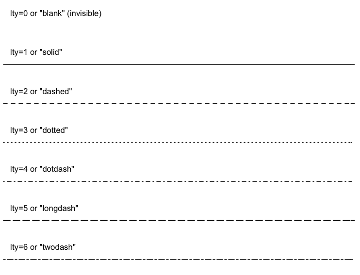

# (PART) Графика и статистика {-}

# Базовая графика {#graphics}

```{r setup-graphics, echo = FALSE, purl = FALSE, cache = FALSE, include=FALSE}
library(DT)
knitr::opts_knit$set(global.par = TRUE)
```

[Программный код главы](https://github.com/tsamsonov/r-geo-course/blob/master/code/05-Graphics.R)

Данный модуль посвящен введению в работу с графическим представлением информации в R. Построение графиков на языке R сродни работе с конструктором: вы собираете изображение по кирпичикам из множества настроек и компонент. Поняв основные принципы базовой графической подсистемы __R__ из пакета __graphics__, вы сможете освоить дополнительные библиотеки __lattice__, __ggplot2__ и __plotly__, предоставляющие еще более интересные возможности с точки зрения функциональности и дизайна.

Прежде чем мы приступим к построению графиков, необходимо подготовить исходные данные. Мы будем работать с региональной статистикой Росстата: экспорт/импорт продукции по регионам России (млн долл. США) и объем сброса сточных вод по морям России (млрд м$^3$):

```{r, collapse=TRUE, warning=FALSE}
library(readxl)

# Прочтем таблицу по экспорту/импорту продукции в регионах России 
types = c("text", rep("numeric", 12))
tab = as.data.frame(read_excel("data/ExpImp.xlsx", 1, col_types = types))
str(tab)
```

```{r, collapse=TRUE}
# Выгрузим данные по федеральным округам в отдельную таблицу
filter = grep("федеральный округ", tab$Регион)
okr = tab[filter, ]

# Отсортируем данные по федеральным округам в алфавитном порядке:
okr = okr[order(okr$Регион), ]

# Выгрузим данные по субъектам в отдельную таблицу
filter = grepl("федеральный округ|Федерация|числе",tab$Регион)
sub = tab[!filter, ]
```

## Стандартные графики {#yfxcharts}

Графики (точечные и линейные) -- базовый и наиболее часто используемый способ визуализации. Универсальная функция `plot()` позволяет строить графики по координатам $X$ и $Y$, которые передаются, соответственно, в первый и второй аргумент. Если переменные $X$ и $Y$ не связаны друг с другом явным образом, то такой график называется _диаграммой рассеяния_. 

### Диаграммы рассеяния {#scatterplots}

Диаграмма рассеяния позволяет установить, есть ли зависимость между переменными, а также понять, как объекты дифференцируются по значениям переменных.
```{r, collapse=TRUE}
par(mar=c(4,4,3,2))
# Диаграмма рассеяния по экспорту и импорту:
plot(sub$МетЭкспорт, 
     sub$МетИмпорт,
     col="red", 
     xlab="Экспорт, млн. долл. США", 
     ylab = "Импорт, млн. долл. США", 
     main = "Экспорт/импорт металлов и изделий из них по субъектам РФ")
```

В данном случае четко выделяется группа субъектов вблизи начала координат, не отличающихся интенсивным экспортом и импортом продукции металлургии, а также очевидно преобладание экспорта над импортом при больших объемах товарооборота.

При построении диаграмм рассеяния важно сохранить одинаковый масштаб по осям $X$ и $Y$. Чтобы обеспечить это условие, необходимо использовать параметр `asp = 1`:
```{r, collapse=TRUE}
plot(sub$МетЭкспорт, 
     sub$МетИмпорт, 
     col="red", 
     xlab="Экспорт, млн. долл. США", 
     ylab = "Импорт, млн. долл. США", 
     main = "Экспорт/импорт металлов и изделий из них по субъектам РФ", 
     asp = 1)
```

Попробуйте изменить размер окна на вкладке _Plots_. Вы увидите, что масштаб по осям сохраняется пропорциональным.

_Размер и тип значка_ можно изменить, используя параметры `pch =` и `cex =`. Размеры масштабируются параметром `cex` относительно условной единицы — стандартного размер значка. Сам значок можно выбрать, используя его код в соответствии с нижеприведенным рисунком (на самом деле, вы можете выбирать произвольные символы для визуализации точек):


```{r, collapse=TRUE}
plot(sub$МетЭкспорт, 
     sub$МетИмпорт, 
     col="red", 
     xlab="Экспорт, млн. долл. США", 
     ylab = "Импорт, млн. долл. США", 
     main = "Экспорт/импорт металлов и изделий из них по субъектам РФ", 
     asp = 1,
     pch = 2, 
     cex = 0.5)
plot(sub$МетЭкспорт, 
     sub$МетИмпорт, 
     col="red", 
     xlab="Экспорт, млн. долл. США", 
     ylab = "Импорт, млн. долл. США", 
     main = "Экспорт/импорт металлов и изделий из них по субъектам РФ", 
     asp = 1,
     pch = 20, 
     cex = 1.2)
```

### Линейные графики {#linear_graphs}

Линейные графики отражают связь между зависимой и независимой переменной. Существует два способа нанесения линий на график: явное рисование линий _поверх уже построенного графика_ с помощью функции `lines()`, или создание нового линейного графика с помощью функции `plot()` с дополнительным параметром `type = `. 

Для иллюстрации принципов работы первого способа откроем еще раз данные по объему сброса загрязненных сточных вод по морям России (млрд куб. м):
```{r, collapse=TRUE}
tab = read.csv2("data/oxr_vod.csv", encoding = 'UTF-8')
plot(tab$Год, tab$Каспийское, pch=20) # для начала нанесем точки
lines(tab$Год, tab$Каспийское) # теперь нанесем линии
```

По умолчанию функция `plot()` рисует именно точки. Однако если точки не нужны, а достаточно только линий, или требуется иной подход к построению графиков, можно задать параметр `type = `, который принимает следующие значения:

* `"p"` for points,
* `"l"` for lines,
* `"b"` for both,
* `"c"` for the lines part alone of "b",
* `"o"` for both ‘overplotted’,
* `"h"` for ‘histogram’ like (or ‘high-density’) vertical lines,
* `"s"` for stair steps,
* `"S"` for other steps, see ‘Details’ below,
* `"n"` for no plotting.

Попробуем разные методы визуализации:
```{r, collapse=TRUE}
plot(tab$Год, tab$Карское,pch=20)
plot(tab$Год, tab$Каспийское, type="p")
plot(tab$Год, tab$Каспийское, type="l")
plot(tab$Год, tab$Каспийское, type="b")
plot(tab$Год, tab$Каспийское, type="c")
plot(tab$Год, tab$Каспийское, type="o")
plot(tab$Год, tab$Каспийское, type="h")
plot(tab$Год, tab$Каспийское, type="s")
```

_Толщину и тип линии_ можно изменить, используя параметры `lwd =` и `lty =` соответственно. Работают они аналогично параметрам pch и cex для точечных символов. Типов линий по умолчанию в стандартной библиотеке R не так много, но в сочетании с цветовым кодированием и толщиной их оказывается вполне достаточно:


Попробуем разные варианты представления линий:
```{r, collapse=TRUE}
plot(tab$Год, tab$Каспийское, type="l", lwd = 2, lty = 1)
plot(tab$Год, tab$Каспийское, type="l", lwd = 3, lty = 2)
plot(tab$Год, tab$Каспийское, type="l", lwd = 1, lty = 3)
```

### Совмещение графиков {#graph_combining}

Часто бывает необходимо совместить на одном графике несколько рядов данных. Для этого можно поступить двумя путями: 

1. Нарисовать один ряд данных c помощью функции `plot()`, а затем добавить к нему другие ряды с помощью функций `points()` и `lines()`.

2. Нарисовать пустой график, а затем добавить к нему все ряды данных с помощью функций `points()` и `lines()`.

> При совмещении нескольких рядов данных на одном графике в первом же вызове функции `plot()` необходимо заложить диапазон значений по осям $X$ и $Y$, охватывающий все ряды данных. В противном случае будет учтен только разброс значений первого ряда данных, и остальные ряды могут не поместиться в поле графика.

Вариант №1 реализуется следующим образом:
```{r, collapse = TRUE}
plot(tab$Год, 
     tab$Каспийское, 
     pch=20, 
     type="o", 
     ylim = c(0,12), 
     col="red3")

# Добавим теперь на существующий график новый ряд данных, используя функции points() и lines():
points(tab$Год, tab$Карское, pch=20, col="forestgreen")
lines(tab$Год, tab$Карское, pch=20, col="forestgreen")
```

> Обратите внимание на то, что если бы мы вызвали еще одну инструкцию `plot()` с новым рядом данных, это привело бы к построению нового графика, а не к добавлению его на существующий.

Теперь рассмотрим второй вариант. Заодно устраним недостаток предыдущего кода, в котором диапазон значений по оси $Y$ указывался вручную.

```{r, collapse = TRUE}
xrange = range(tab$Год) # вычислим диапазон по оси X
yrange = range(tab$Каспийское, tab$Карское, tab$Азовское) # вычислим диапазон по оси Y

# Построим пустой график, охватывающий полный диапазон данных, и имеющий все необходимые сопроводительные элементы
plot(xrange,
     yrange,
     main="Объем сброса загрязненных сточных вод", 
     xlab="Год", 
     ylab="млрд.куб.м",
     type = "n") # n означает, что ряд данных рисоваться не будет

# Теперь добавим на график ряды данных
points(tab$Год, tab$Каспийское, pch=20, col="red3")
lines(tab$Год, tab$Каспийское, pch=20, col="red3")

points(tab$Год, tab$Карское, pch=20, col="forestgreen")
lines(tab$Год, tab$Карское, pch=20, col="forestgreen")

points(tab$Год, tab$Азовское, pch=20, col="steelblue")
lines(tab$Год, tab$Азовское, pch=20, col="steelblue")
```

### Функциональные параметры {#func_parameters}

Графические параметры при построении графиков на самом деле могут быть не константами, а _функцией_ данных. Например, вы можете сказать, что размер точки при построении диаграммы рассеяния должен быть функцией отношения экспорта к импорту, что усилит наглядность отображения:

```{r, collapse = TRUE}
plot(okr$МетЭкспорт, 
     okr$МетИмпорт, 
     col=rgb(1,0,0,0.5), 
     xlab="Экспорт, млн. долл. США", 
     ylab = "Импорт, млн. долл. США", 
     main = "Экспорт/импорт металлов и изделий из них по ФО РФ (2013 г.)", 
     asp = 1,
     pch = 20, 
     cex = 2+log(sub$МетИмпорт/sub$МетЭкспорт)) # размер кружка зависит от соотношения импорта и экспорта
```

## Гистограммы {#histograms}

Гистограммы распределения строятся с помощью функции `hist()`. Чтобы изменить ширину кармана (столбца) гистограммы, необходимо задать параметр `breaks =`, а цвет задается в параметре `col`:

```{r, collapse=TRUE}
hist(sub$ПродЭкспорт)
# Карманы будут от 0 до 3000 через 100. Заодно добавим цвет:
hist(sub$ПродЭкспорт, breaks = seq(0,3000,100), col="olivedrab3")
```

При построении гистограммы (как и любого другого типа графика) вы можете использовать не весь массив данных, а только его подмножество Например, можно посмотреть гистограмму только для субъектов с объемом экспорта менее 300:
```{r, collapse=TRUE}
hist(sub$ПродЭкспорт[sub$ПродЭкспорт < 300], col = "olivedrab3", breaks = seq(0, 300, 20))
```

Наконец, вы можете осуществить преобразование ряда данных перед построением гистограммы. Например, взять логарифм, чтобы проверить,похоже ли распределение на логнормальное:
```{r, collapse=TRUE}
hist(log(sub$ПродЭкспорт), col = "olivedrab3")
```

## Столбчатые графики {#barplots}

Столбчатые графики --- __barplot__ --- отображают вектор числовых данных в виде столбиков. Это простейший вид графика (наряду с _dotchart_), который используется для сравнения абсолютных величин. Для построения необходимо вызвать функцию `barplot()` и передать ей столбец таблицы:
```{r, collapse=TRUE}
barplot(okr$ХимЭкспорт)

# Или даже просто вектор натуральных чисел от -5 до 5:
barplot(-5:5)

# Если у каждого столбика есть название, 
# нужно передать вектор названий в аргумент names.arg = 
barplot(okr$ХимЭкспорт, names.arg = okr$Регион)

# при наличии длинных подписей удобнее столбчатую диаграмму разместить горизонтально, используя параметр horiz = TRUE.
barplot(okr$ХимЭкспорт, names.arg = okr$Регион, horiz=TRUE)
```

Чтобы развернуть подписи перпендикулярно столбцам, следует использовать параметр `las = `. Справка__R__говорит нам о том, что этот параметр дает следующее поведение подписей:

* 0:  всегда параллельно осям (по умолчанию),
* 1:  всегда горизонтально,
* 2:  всегда перпендикулярно осям,
* 3:  всегда вертикально.

Выберем вариант, при котором подписи всегда горизонтальны:
```{r, collapse=TRUE}
barplot(okr$ХимЭкспорт, names.arg = okr$Регион, horiz=TRUE, las = 1)
```

В данном случае очень массивные названия федеральных не умещаются в пространство графика. Можно было бы вполне убрать словосочетание "федеральный округ". Для этого используем уже знакомую нам `sub()`.
```{r, collapse=TRUE}
names = sub("федеральный округ", "", okr$Регион) # "" - означает пустая строка
barplot(okr$ХимЭкспорт, names.arg = names, horiz = TRUE, las = 1)
```

И снова содержимое не поместилось в поле графика. Проблема в том, что вокруг любого графика резервируются поля ограниченного размера для размещения подписей координат и т.д. Автоматически эти поля не пересчитываются, зарезервировать их --- ваша задача.

Наберите в консоли `?par`. Откроется список всевозможных графических параметров, которые управляют компоновкой и порядком построения графиков. Эти параметры можно установить, вызвав функцию `par()`. Все дальнейшие вызовы инструкций построения графиков будут учитывать установленные параметры Пролистайте страницу справки вниз и найдите параметр `mar = ` --- он отвечает за установку полей в условных единицах. Есть также параметр `mai = `, который позволяет установить поля графика в дюймах. Обратите внимание на то, что означают параметры этой функции:
```{r, collapse=TRUE}
# mar=c(bottom, left, top, right)
# The default is c(5, 4, 4, 2) + 0.1.
```
Поскольку в нашем примере проблемы возникают в левым полем, необходимо увеличить второй параметр.
```{r, collapse=TRUE}
margins.default = par("mar") # запишем текущее значение, чтобы восстановить его потом
par(mar = c(5, 10, 4, 2)) # увеличим поле left до 10 условных единиц
barplot(okr$ХимЭкспорт, names.arg = names, horiz=TRUE, las = 1)
```

Добавим заголовок с помощью параметра `main = `, а подпись единиц измерения по оси $X$ — с помощью параметра `xlab = `. Поскольку количество параметров функции уже достаточно велико, введем каждый из них с новой строчки, чтобы улучшить читаемость кода:
```{r, collapse = TRUE}
barplot(okr$ХимЭкспорт, 
        names.arg = names, 
        main = "Экспорт продукции химической промышленности", 
        xlab = "млн долл. США", 
        horiz = TRUE, 
        las = 1)

# Чтобы увеличить диапазон оси X, можно использовать параметр xlim = c(min, max):
barplot(okr$ХимЭкспорт, 
        names.arg = names, 
        main = "Экспорт продукции химической промышленности", 
        xlab = "млн долл. США", 
        horiz = TRUE, 
        las = 1, 
        xlim = c(0,12000))
```

Работа с цветом на столбчатых диаграммах рассмотрена ниже в отдельном разделе.

## Круговые (секторные) диаграммы  {#piecharts}

Круговые диаграммы (англ. _piechart_) строятся с помощью функции `pie()`:
```{r, collapse=TRUE}
par(mar = c(5, 5, 5, 5)) # установим поля

pie(okr$ХимЭкспорт)

# вместо номеров можно использовать подписи секторов, добавив второй параметр:
pie(okr$ХимЭкспорт, names)

# в каждую метку можно добавить процент данного округа в общей массе. Для этого его нужно сначала посчитать:
percentage = 100 * okr$ХимЭкспорт / sum(okr$ХимЭкспорт)

# и округлить до 1 знака после запятой:
percentage = round(percentage, digits = 1)
```

Можно присоединить проценты к названиям округов, добавив обрамляющие скобки. Чтобы функция paste не добавляя пробелы между присоединяемыми строками, необходимо задать параметр sep = , передав ему пустую строку — "":
```{r, collapse=TRUE}

names2=paste(names, " (", percentage, "%)", sep = "")

# Используем для аннотирования круговых секторов:
pie(okr$ХимЭкспорт, names2)

# Добавить заголовок можно также с помощью параметра main =
pie(okr$ХимЭкспорт, names2, main = "Доля федеральных округов в экспорте продукции химической промышленности")
```

Чтобы перенести часть заголовка на вторую строку, вы можете использовать __управляющий символ__ перевода строки `\n`, вставив его в требуемое место:
```{r, collapse=TRUE}
pie(okr$ХимЭкспорт, names2, main = "Доля федеральных округов в экспорте \n продукции химической промышленности")
```

> Управляющие символы играют большое значение в программировании и используются для управления поведением текстового вывода. Нотация `\n` называется _escape-последовательностью_. Помимо перевода строки, есть и другие полезные [управляющие символы](https://ru.wikipedia.org/wiki/Управляющие_символы). Кстати, именно из-за того, что escape-последовательности начинаются с обратной косой черты (`\`), при указании системных путей в функции `setwd()` всегда следует использовать прямую косую черту (`/`). Например, следующий путь не будет найдет, поскольку он содержит управляющие последовательности `\n` и `\t`: `C:\data\tables\new`.

Наконец, при использовании секторных диаграмм важно уметь менять порядок секторов. По умолчанию сектора откладываются против часовой стрелки начиная с восточного направления. Чтобы сектора откладывались по часовой стрелке с северного направления, следует задать параметр `clockwise = TRUE`.
```{r, collapse=TRUE}
pie(okr$ХимЭкспорт, 
    names2, 
    main = "Доля федеральных округов в экспорте \n продукции химической промышленности", 
    clockwise = TRUE)
```

Работа с цветом на круговых диаграммах рассмотрена ниже в отдельном разделе.

## Цвет и прозрачность {#colors}

Цвет --- одно из основных графических средств, используемых на графиках и диаграммах, поэтому данная тема рассмотрена более подробно в отдельном разделе. Определить цвет можно различными способами. Во-первых, в __R__ есть палитра предопределенных цветов, которые можно выбирать по их [названию](http://research.stowers-institute.org/efg/R/Color/Chart/ColorChart.pdf)).

Список названий цветов можно посмотреть, вызвав функцию `colors()`:
```{r, collapse=TRUE}
head(colors())
```

Основной цвет любого графика или диаграмма задается параметром `col = `. Это цвет (или цвета) с помощью которых будут отображаться данные. Попробуем изменить цвет графика с серого на пастельно-синий:
```{r, collapse=TRUE}
par(mar = c(5, 10, 4, 2)) # увеличим поле left до 10 условных единиц
barplot(okr$ХимЭкспорт, 
        names.arg = names, 
        main = "Экспорт продукции химической промышленности", 
        xlab = "млн долл. США", 
        horiz = TRUE, 
        las = 1, 
        xlim = c(0,12000), 
        col = "steelblue")
```
Помимо этого вы можете задать цвет с помощью цветовых компонент в различных пространствах. Для этого вы должны быть знакомы с основами теории цвета (посмотрите презентацию [UsingColorInR.pdf](http://research.stowers-institute.org/efg/Report/UsingColorInR.pdf). Например, фиолетовый цвет в пространстве [RGB](https://ru.wikipedia.org/wiki/RGB) можно задать с помощью функции `rgb()`, смешав синюю и красную компоненты:
```{r, collapse=TRUE}
violet = rgb(0.4, 0, 0.6)
barplot(okr$ХимЭкспорт, 
        names.arg = names, 
        main = "Экспорт продукции химической промышленности", 
        xlab = "млн долл. США", 
        horiz = TRUE, 
        las = 1, 
        xlim = c(0,12000), 
        col = violet)
```

Чтобы сделать цвет __полупрозрачным__, есть две возможности: 

* При создании нового цвета --- передать в функцию `rgb()` дополнительный параметр `alpha = `, который задает долю прозрачности в диапазоне от 0 до 1.
* При модификации существующего цвета --- вызвать функцию `adjustcolor()` с параметром `alpha = `

Например:
```{r, collapse=TRUE}
violet.transp = adjustcolor(violet, alpha = 0.5)
barplot(okr$ХимЭкспорт, 
        names.arg = names, 
        main = "Экспорт продукции химической промышленности", 
        xlab = "млн долл. США", 
        horiz = TRUE, 
        las = 1, 
        xlim = c(0,12000), 
        col = violet.transp)

green.transp = rgb(0, 1, 0, 0.5) # появился четвертый параметр
barplot(okr$ХимЭкспорт, 
        names.arg = names, 
        main = "Экспорт продукции химической промышленности", 
        xlab = "млн долл. США", 
        horiz = TRUE, 
        las = 1, 
        xlim = c(0,12000), 
        col = green.transp)
```

> Функция `adjustcolor()` позволяет модифицировать все компоненты цвета, не только прозрачность. 

На графике типа _barplot_ вы имеете фактически несколько переменных, которые представлены столбиками. А это означает что для них можно использовать различные цвета. Вы можете передать в параметр `col = ` вектор из цветов, соответствующих столбикам:
```{r, collapse=TRUE}
colors = c("red", "green", "blue", "orange", "yellow", "pink", "white","black")

barplot(okr$ХимЭкспорт, 
        names.arg = names, 
        main = "Экспорт продукции химической промышленности", 
        xlab = "млн долл. США", 
        horiz = TRUE, 
        las = 1, 
        xlim = c(0,12000), 
        col = colors)
```

На самом деле, такой винегрет из цветов на столбчатых диаграммах использовать не принято. Но вы должны понимать, что при необходимости можно поменять цвет отдельно выбранных столбиков. Например, мы можем показать красным цветом Центральный и Приволжский округа, которые являются лидерами по экспорту продукции химической промышленности:
```{r, collapse=TRUE}
colors = rep("gray", 8) # сделаем 8 серых цветов
colors[2] = "red"
colors[7] = "red"
barplot(okr$ХимЭкспорт, 
        names.arg = names, 
        main = "Экспорт продукции химической промышленности", 
        xlab = "млн долл. США", 
        horiz = TRUE, 
        las = 1, 
        xlim = c(0,12000), 
        col = colors)
```

Еще одна интересная особенность использования цвета заключается в том, что количество указанных цветом может не совпадать с количеством рядов данных. Вы можете указать 2 или 3 цвета, и они будут циклически повторяться при визуализации данных:
```{r, collapse=TRUE}
colors=c("gray","steelblue")
barplot(okr$ХимЭкспорт, 
        names.arg = names, 
        main = "Экспорт продукции химической промышленности", 
        xlab = "млн долл. США", 
        horiz =TRUE, 
        las = 1, 
        xlim = c(0, 12000), 
        col = colors)
```

Наконец, вещь, которой совершенно необходимо уметь пользоваться при работе с цветом в __R__ --- это цветовые палитры. Палитры чрезвычайно удобны, когда необходимо сгенерировать множество цветов, зная лишь основные оттенки. Для этого нужно создать палитру, используя функцию `colorRampPalette()`:
```{r, collapse=TRUE}
# задаем 2 опорных цвета: черный  белый
palet=colorRampPalette(c("black","white")) 

# и автоматически генерируем 8 цветов между ними:
colors=palet(8)

# используем их для отображения:
barplot(okr$ХимЭкспорт, 
        names.arg = names, 
        main = "Экспорт продукции химической промышленности", 
        xlab = "млн долл. США", 
        horiz = TRUE, 
        las = 1, 
        xlim = c(0, 12000), 
        col= colors)

# вы можете включить в палитру произвольное количество цветов:
palet=colorRampPalette(c("steelblue","white","purple4")) 
colors=palet(8)
barplot(okr$ХимЭкспорт, 
        names.arg = names, 
        main = "Экспорт продукции химической промышленности", 
        xlab = "млн долл. США", 
        horiz=TRUE, 
        las = 1, 
        xlim = c(0, 12000), 
        col= colors)
```

В __R__ существует множество стандартных палитр, их список можно найти в справке и документации. Наиболее полезные из них:

* `colors()`
* `gray()`
* `rainbow()`
* `heat.colors()`
* `topo.colors()`
* `terrain.colors()`

Например, вы можете изменить цвета диаграммы, взяв их из одной из палитр или выбрав случайным образом из полной палитры цветов, используя функцию `sample()`:
```{r, collapse=TRUE}
pie(okr$ХимЭкспорт, names2, main = "Доля федеральных округов в экспорте \n продукции химической промышленности", col=rainbow(length(names2)))
pie(okr$ХимЭкспорт, names2, main = "Доля федеральных округов в экспорте \n продукции химической промышленности", col=sample(colors(),5))
```

Более богатый набор палитр можно найти в библиотеке `RColorBrewer`, которая представляет собой интерпретацию палитр, доступных на сайте [colorbrewer2.org](http://colorbrewer2.org/)
```{r, echo = FALSE, purl = FALSE}
par(mar = c(0,5,0,0))
```
```{r, collapse=TRUE}
library(RColorBrewer) # Откроем библиотеку RColorBrewer:
display.brewer.all() # Посмотрим, какие в ней имеются палитры
```
```{r, echo = FALSE, purl = FALSE}
par(mar = c(5,5,5,5))
```

К каждой из этих палитр можно обратиться по названию с помощью функции `brewer.pal()`. Поскольку нам необходимы цвета для категориальных данных, следует использовать палитры из средней части (_Set3 - Accent_)

```{r, collapse=TRUE}
# выберем цвета из палитры Set2 по количеству секторов в круге:
colors = brewer.pal(length(names2),"Set1")

# И используем их при визуализации
par(mar = c(5, 5, 5, 5)) # установим поля
pie(okr$ХимЭкспорт, names2, main = "Доля федеральных округов в экспорте \n продукции химической промышленности", col=colors)

# Попробуем палитру Accent:
pie(okr$ХимЭкспорт, names2, main = "Доля федеральных округов в экспорте \n продукции химической промышленности", col=brewer.pal(length(names2),"Accent"))
```

## Настройки отображения {#disp_settings}

### Графические параметры {#graph_params}

Изменять __размеры элементов графика__ можно независимо друг от друга, используя следующие параметры:

* `cex` --- общий масштаб элементов на графике
* `cex.axis` --- масштаб подписей координат на оси
* `cex.lab` ---	масштаб подписей названий осей
* `cex.main` ---	масштаб заголовка графика
* `cex.sub` ---	масштаб подзаголовка графика
* `cex.names` --- масштаб подписей факторов (для некоторых типов диаграмм)

Например:
```{r, collapse=TRUE}
plot(tab$Год, 
     tab$Каспийское, 
     pch=20, 
     type="o", 
     ylim = c(0,12), 
     col="red3", 
     main="Объем сброса загрязненных сточных вод", 
     xlab="Год", 
     ylab="млрд.куб.м",
     cex.axis=0.8, 
     cex.lab=0.7, 
     cex.main=0.9, 
     cex = 0.8)

points(tab$Год, tab$Карское, pch=20, col="forestgreen",cex = 0.8)
lines(tab$Год, tab$Карское, pch=20, col="forestgreen")

points(tab$Год, tab$Азовское, pch=20, col="steelblue",cex = 0.8)
lines(tab$Год, tab$Азовское, pch=20, col="steelblue")
```

Аналогично происходит тонкая настройка __цвета__:

* `col`       цвет графика
* `col.axis`	цвет подписей координат
* `col.lab`   цвет названий осей
* `col.main`	цвет заголовка
* `col.sub`   цвет подзаголовка
* `fg`        цвет элементов переднего плана (оси, рамка и т.д.)
* `bg`        цвет фона графика (background)

```{r plotcolors, collapse=TRUE}
plot(tab$Год, 
     tab$Каспийское, 
     pch=20, 
     type="o", 
     ylim = c(0,12), 
     col="red3", 
     main="Объем сброса загрязненных сточных вод", 
     xlab="Год", 
     ylab="млрд.куб.м",
     cex.axis=0.8, 
     cex.lab=0.7, 
     cex.main=0.9, 
     col.lab = "grey50", 
     fg = "grey40")
points(tab$Год, tab$Карское, pch=20, col="forestgreen")
lines(tab$Год, tab$Карское, pch=20, col="forestgreen")
points(tab$Год, tab$Азовское, pch=20, col="steelblue")
lines(tab$Год, tab$Азовское, pch=20, col="steelblue")
```

### Разметка осей, рамка, сетка координат и произвольные линии {#axes}

По умолчанию __R__ подбирает оптимальный с точки зрения него шаг разметки осей, в зависимости от разброса значений по осям $X$ и $Y$, а также размеров графического устройства, на котором производится рисование. Изменяя размер окна прорисовки, вы получите различную разметку осей.

В то же время, часто возникает желание (или необходимость) самостоятельно управлять шагом разметки сетки. Для этого необходимо:

1. Вызвать функцию `plot()`, передав ей дополнительно параметр `axes = FALSE` (убирает при рисовании обе оси) или один из параметров `xaxt="n"` / `yaxt="n"` (убирают оси $X$ и $Y$ соответственно)
2. Вызвать столько раз функцию `axis()`, сколько вы хотите нарисовать осей, передав ей параметры для рисования каждой оси.

Функция `axis()` принимает следующие параметры:

* `side` --- сторона графика, на которой будет нарисована ось (`1=bottom`, `2=left`, `3=top`, `4=right`)
* `at` --- вектор значений, в которых должны быть нарисованы метки оси
* `labels` --- вектор подписей, которые будут нарисованы в местоположениях, указанных в параметре `at`. Этот параметр можно пропустить, если подписи совпадают с местоположениями меток
* `pos` --- координата, вдоль которой будет нарисована ось 
* `lty` --- тип линии
* `col` --- цвет линии и меток
* `las` --- расположение подписей параллельно ($0$) или перпендикулярно ($2$) оси
* `tck` --- длина метки относительно размера графика. Отрицательные значения дают метки, выходящие за пределы графика. положительные — внутрь графика. $0$ убирает метки, $1$ рисует линии сетки.

При ручном построении осей полезно сразу же нарисовать рамку вокруг графика, используя функцию `box()`.

Например:
```{r manual, collapse=TRUE}
plot(tab$Год, 
     tab$Каспийское,
     type = "l",
     axes = FALSE)

axis(side = 1, 
     at = seq(min(tab$Год), max(tab$Год), 1),
     tck = -0.02,
     labels = FALSE) # разметим ось X через 1 год, но рисовать подписи не будем

axis(side = 1, 
     at = seq(min(tab$Год), max(tab$Год), 3), # а подписи расставим через 3 года
     tck = 0) # но рисовать метки не будем

# разметим ось Y через 1 млрд куб. м., округлив предварительно минимальное и максимальное значение до ближайшего целого снизу и сверху соответственно
axis(side = 2, 
     at = seq(floor(min(tab$Каспийское)), ceiling(max(tab$Каспийское)), 1),
     tck = -0.02) 

box() # добавим рамку для красоты
```

Для размещения сетки координат существует функция `grid(nx = NULL, ny = nx, col = "lightgray", lty = "dotted", lwd = par("lwd"), equilogs = TRUE)`. Как видно из набора ее параметров, сетка определяется количеством линий в горизонтальном и вертикальном направлении. Это не всегда бывает удобно, поскольку как правило мы хотим задать шаг сетки конкретной величины. По умолчанию, однако, линии сетки выбираются автоматически, как и метки:
```{r, collapse = TRUE}
plot(tab$Год, 
     tab$Каспийское,
     type = "l",
     col = "red")
grid()
```

Вы, разумеется, можете поменять их количество, однако __R__ не будет за вас согласовывать шаг сетки и шаг меток осей, поскольку метки генерируются на стадии рисования `plot()` или `axis()` и не запоминаются.
```{r, collapse = TRUE}
plot(tab$Год, 
     tab$Каспийское,
     type = "l",
     col = "red")
grid(10, 5)
```

Функция `grid()` на самом деле является оберткой функции `abline()`, которая позволяет рисовать произвольные линии на графике. Дана функция предоставляет следующие возможности построения линий и серий линий:

* `a, b` --- коэффициенты уравнения $y = ax + b$. Таким образом можно определить только одну линию.
* `coef` --- принимает вектор из двух значений, которые интерпретируются как `a` и `b`. То есть, это альтернативная форма записи предыдущего случая.
* `h` --- значение (значения) координат $y$ для горизонтальной линии (серии горизонтальных линий). То есть, вы можете передать в этот параметр как одиночное значение, так и вектор значений. В зависимости это этого нарисуется одна горизонтальная линия или серия горизонтальных линий.
* `v` --- значение (значения) координат $x$ для вертикальной линии (серии вертикальных линий). Работает аналогично параметру `h`.
* `reg` --- сюда можно передать объект, обладающий методом `coef()`. Этот способ можно использовать для рисования линий регрессии.

Предположим теперь, что вы хотите нарисовать сетку с шагом в 1 год по горизонтальной оси и шагом 1 млрд. куб. м по оси вертикальной. При этом вы также хотите, чтобы линии сетки располагались _под_ графиком, а не поверх его. Также необходимо выделить особым цветом значение в 10 млрд м$^3$ по оси $Y$. Для этого выполним следующую последовательность действий:
```{r manualaxes, collapse=TRUE}
plot(tab$Год, 
     tab$Каспийское, 
     type="n") # режим 'n' позволяет ничего не рисовать, но заложить поле графика в соответствии с данными, указанными в параметрах x и y

# Вычисляем линии сетки
xlines = seq(min(tab$Год), max(tab$Год), 1)
ylines = seq(ceiling(min(tab$Каспийское)),
              floor(max(tab$Каспийское)), 1)

# Рисуем линии сетки
abline(h = ylines, v = xlines, col = "lightgray")

# Рисуем график
lines(tab$Год, 
     tab$Каспийское, 
     col="red3")
points(tab$Год, 
     tab$Каспийское,
     pch = 20,
     col="red3")

# Выделяем значение 10 по оси Y:
abline(h = 10, col = "blue", lwd = 2)

# Рисуем дополнительно рамку, т.к. сетку координат мы рисовали после графика
box()
```

### Аннотации данных (текст на графике) {#annotations}

Аннотации данных добавляются на график с помощью функции `text()`. В качестве  трех обязательных аргументов ей необходимо передать координаты точек размещения текста, и вектор подписей. Также полезным будет указать параметр `pos=`, отвечающий за размещение аннотации относительно точки. Значения `pos`, равные 1, 2, 3 и 4, соответствуют размещению снизу, слева, сверху и справа от точки:
```{r annotations, eval = FALSE}
text(tab$Год, 
     tab$Каспийское,
     labels = tab$Каспийское,
     cex = 0.75,
     pos = 3)
```
```{r, ref.label=c("manualaxes", "annotations"), echo = FALSE, purl = FALSE}
```

> К сожалению, стандартный механизм размещения аннотаций пакета `graphics` не обладает возможностью устранения конфликтов подписей. Однако это возможно для графиков, построенных с помощью библиотек [lattice](https://cran.r-project.org/web/packages/lattice/index.html) и [ggplot2](https://cran.r-project.org/web/packages/ggplot2/index.html). Для этого можно воспользоваться пакетом [directlabels](https://cran.r-project.org/web/packages/directlabels/index.html) или  [ggrepel](https://cran.r-project.org/web/packages/ggrepel/index.html).

## Легенда {#legend}

Легенда к графику размещается с помощью функции `legend()`. Эта функция принимает несколько аргументов, включая: местоположение, заголовок, названия элементов, графические параметры. Местоположение может быть задано координатами $(x,y)$ в системе координат графика, но удобнее пользоваться следующими предопределенными константами: `"bottomright"`, `"bottom"`, `"bottomleft"`, `"left"`, `"topleft"`, `"top"`, `"topright"`, `"right"`, `"center"`. 

Чтобы в легенде появились точки, необходимо задать параметр `pch=`. Для линейной легенды, следует задать, соответственно, параметр `lty =` и/или `lwd =`. Каждый из этих параметров должен быть вектором по количеству элементов легенды:

```{r caspianlegend, collapse=TRUE}
par(mar = margins.default)

# Найдем ограничивающий прямоугольник вокруг всех рядов данных
xrange = range(tab$Год)
yrange = range(tab$Каспийское, tab$Карское, tab$Азовское)

# Построим пустой график с разметкой осей и всеми заголовками
plot(xrange, 
     yrange, 
     type="n", 
     main="Объем сброса загрязненных сточных вод", 
     xlab="Год", 
     ylab="млрд.куб.м",
     cex.axis=0.8, 
     cex.lab=0.7, 
     cex.main=0.9, 
     col.lab = "grey50", 
     fg = "grey40")

# Добавим на график сетку координат
grid()

# Добавим на график данные
points(tab$Год, tab$Каспийское, pch=20, col="red3")
lines(tab$Год, tab$Каспийское, pch=20, col="red3")

points(tab$Год, tab$Карское, pch=20, col="forestgreen")
lines(tab$Год, tab$Карское, pch=20, col="forestgreen")

points(tab$Год, tab$Азовское, pch=20, col="steelblue")
lines(tab$Год, tab$Азовское, pch=20, col="steelblue")

# Определим положение, названия и цвета:
main = "Море"
location = "topright"
labels = c("Каспийское", "Карское", "Азовское")
colors = c("red3", "forestgreen", "steelblue")

# Если цвет передать в параметр fill, то по умолчанию
# нарисуются цветовые плашки:
legend(location, labels, title = main, fill=colors)
```

```{r finallegend, eval = FALSE}
pts = c(20, 20, 20) # каждый элемент показывается точкой типа 20
lns = c(1, 1, 1) # каждый элемент показывается линией толщиной 1

# теперь посмотрим на легенду (она нарисуется поверх старой)
legend(location, labels, title = main, col = colors, pch = pts, lwd = lns)
```

```{r, ref.label=c('caspianlegend', 'finallegend'), echo=FALSE, purl = FALSE}
```

Более подробно с разнообразными опциями размещения легенды на графике вы можете познакомиться, набрав в консоли команду `?legend`.

## Контрольные вопросы и упражнения {#questions_tasks_graphics}

### Вопросы {#questions_graphics}

1. Какая функция базового пакета R отвечает за построение стандартных графиков (диаграмм рассеяния, линейных)?
1. Какие функции стандартной библиотеки R позволяют построить: столбчатые диаграммы, круговые секторные диаграммы, гистограммы?
1. Как задать интервал или количество интервалов гистограммы?
1. Можно ли разместить столбчатую диаграмму горизыонтально? Если да, то как?
1. Какая функция отвечает за установку параметров графической подсистемы?
1. Как установить поля вокруг графиков?
1. Как развернуть подписи на столбчатой диаграмме перпендикулярно оси?
1. Как установить запрет на экспоненциальное представление больших чисел при рисовании графиков?
1. Какой параметр отвечает за установку цвета в функциях построения графиков стандартной библиотеки R?
1. Какие параметры отвечают за установку толщины и типа линии на графиках?
1. Какие параметры отвечают за установку размера и типа значка на диаграммах рассеяния?
1. Как совместить несколько графиков на одной сетке координат?
1. Какая функция рисует рамку вокруг графика?
1. Какая функция отвечает за рисование сетки координат?
1. Как установить равный масштаб по осям графика?
1. Какие параметры позволяют масштабировать текст элементов графика, таких как подписи координат, осей, заголовков и подзаголовков?
1. Назовите способы задания цвета в R.
1. Как сделать цвет в R полупрозрачным?
1. Назовите стандартные цветовые палитры R.
1. Как сгенерировать последовательность из нужного количества цветов между заданными опорными цветами?
1. Какая функция позволяет разместить легенду на графике?
1. Как сделать так, чтобы в легенде показывались точки? Линии? Цветовые плашки?

### Упражнения {#tasks_graphics}

1. Постройте для набора данных _quakes_ пакета __datasets__ гистограммы распределения глубин и магнитуд, а также диаграмму рассеяния для двух этих характеристик.

1. Загрузите [__файл CSV__](https://raw.githubusercontent.com/tsamsonov/r-geo-course/master/data/okruga.csv) с данными по населению федеральных округов России. Постройте круговую секторную диаграмму распределения  населения по федеральным округам за один из годов. Подпишите напротив каждого сектора название округа и в скобках процент от суммарного населения России, который он занимает. При построении диаграммы отсортируйте округа по численности населения. 

    > __Рекомендация__: Используйте стандартное упорядочение данных против часовой стрелки от направления вправо, чтобы подписи узких секторов были горизонтальными и не перекрывали друг друга.

1. На портале открытых данных Тульской области есть [__данные__](https://www.opendata71.ru/opendata/7107096442-stateforestregisterTularegion/table) о распределении площади лесов и запасов древесины по преобладающим породам и группам возраста. Скачайте эти данные в виде таблицы CSV и постройте по ним столбчатую диаграмму для категории `Площадь земель, занятых лесными насаждениями (покрытых лесной растительностью), всего`. Подберите цвета, попробуйте изменить ориентировку столбцов на горизонтальную.

1. Используя [данные](https://raw.githubusercontent.com/tsamsonov/r-geo-course/master/data/garabashi.xlsx)^[_Рототаева О.В., Носенко Г.А., Керимов А.М., Кутузов С.С., Лаврентьев И.И., Никитин С.А., Керимов А.А., Тарасова Л.Н._ Изменения баланса массы ледника Гарабаши (Эльбрус) на рубеже XX–XXI вв. __Лёд и Снег__. 2019;59(1):5-22. https://doi.org/10.15356/2076-6734-2019-1-5-22] по балансу масс ледника Гарабаши, постройте график с тремя кривыми (аккумуляции, абляции и _кумулятивного_ баланса) за период 1981 по 2017 г. Добавьте на график легенду. Обратите внимание на то, что таблица содержит агрегирующие строки (1982-1997, 1998-2017, 1982-2017), которые вам необходимо предварительно исключить. 

    > __Подсказка:__ Чтобы построить кривую кумулятивного баланса,  используйте функцию `cumsum`.

1. Таблица _storms_ из пакета __dplyr__ содержит данные трекинга тропических циклонов c 1975 по 2015 год. Извлеките из нее данные по одному выбранному циклону и постройте на их основе график, показывающий трек прохождения циклона в системе координат _давление_ (__X__) — _скорость_ (__Y__). Каждое наблюдение циклона визуализируйте в виде кружка, цвет которого зависит от класса циклона (переменная `status`), а размер — от диаметра территории, на которой наблюдаются скорости ветра класса тропического шторма и сильнее. Нанесите поверх кружков значение диаметра текстовой подписью. Соедините кружки линиями со стрелкой посередине, чтобы была понятна история жизни циклона. 

    В качестве образца используйте рисунок ниже, построенный для урагана Катрина:

    ```{r, echo=FALSE, fig.cap='Пример выполнения задания №5'}
    knitr::include_graphics('images/katrina.png')
    ```
    > __Подсказка:__ Скорость ветра и диаметр в таблице приведены в _узлах_ и _милях_ соответственно. Их необходимо перевести в _м/с_ и _км_. Для отрисовки стрелок используйте функцию [`arrows()`](https://stat.ethz.ch/R-manual/R-devel/library/graphics/html/arrows.html). Прочтите справку к ней, чтобы разобраться как она работает. Чтобы стрелка рисовалась посередине отрезка, а не в конце, используйте `diff()` для получения разностей в давлении и скорости между соседними наблюдениями циклона.

----
_Самсонов Т.Е._ **Визуализация и анализ географических данных на языке R.** М.: Географический факультет МГУ, `r lubridate::year(Sys.Date())`. DOI: [10.5281/zenodo.901911](https://doi.org/10.5281/zenodo.901911)
----