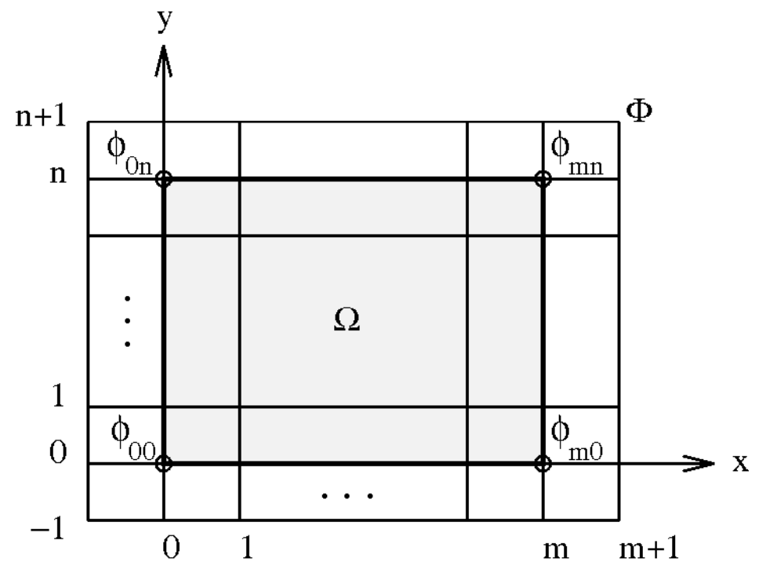

# (PART) Пространственная статистика {-}

# Пространственная интерполяция и аппроксимация {#interpolation_deterministic}

```{r setup-interp, echo = FALSE, purl = FALSE, cache = FALSE, include=FALSE}
library(DT)
knitr::opts_knit$set(global.par = TRUE)
knitr::opts_chunk$set(warning=FALSE, message = FALSE, collapse = TRUE)
```

[Программный код главы](https://github.com/tsamsonov/r-geo-course/blob/master/code/13-InterpolationDeterministic.R)

В лекции рассмотрены детерминистические методы восстановления непрерывных поверхностей по данным в точках. Детерминистические методы интерполяции производят интерполяцию значений на основе заданной аналитической зависимости между значением в точке и значениями в пунктах с исходными данными. Это отличает их от методов геостатистических, где эта зависимость находится статистическим путем. Геостатистические методы будут рассмотрены далее.

## Введение {#interpolation_intro}

Интерполяция в общем случае --- это способ нахождения промежуточных значений величины по имеющемуся дискретному набору известных значений. В географии обычно имеют дело с двумерным случаем интерполяции --- когда измерения проведены в некоторых географических локациях, и по ним нужно восстановить непрерывную картину поля распределения величины. В общем случае неизвестно, как ведет себя исследуемое явление между точками, поэтому существует бесчисленное множество вариантов интерполяции.

Методы которые производят интерполяцию на основе заданной аналитической зависимости, называют детерминистическими. Параметры этой зависимости могут быть как априори заданы пользователем, так и определяться автоматически одним из методов оптимизации --- в частности, по методу наименьших квадратов.

Например, мы можем сказать, что между соседними точками показатель меняется линейным образом (здесь нужно еще указать, что мы понимаем под соседством). Такие методы достаточно просты в использовании и интерпретации. В то же время, они не учитывают статистических особенностей поведения величины между точками, которое определяется ее автокорреляционными свойствами. Методы интерполяции, которые учитывают пространственную автокорреляцию, называют геостатистическими. Они более сложны в использовании, но потенциально могут дать более достоверные результаты.

В этом модуле мы познакомимся со следующими детерминистическими методами интерполяции. 

- Метод __ближайшего соседа__ (nearest neighbor)
- Метод __интерполяции на основе триангуляции__
- Метод __обратно взвешенных расстояний__ (ОВР)
- Метод __радиальных базисных функций__ (РБФ)
- Метод __иерархических базисных сплайнов__ (ИБС)

Интерполяцию будем рассматривать на примере данных по количеству осадков на метеостанциях в северной Италии (долина реки По и окружающие горы). Станции распределены в пространстве нерегулярно, что позволит визуально оценить чувствительность методов к этому фактору.

Прежде чем исследовать распределение показателя, необходимо проанализировать географический контекст. В этой части модуля мы воспользуемся уже известными функциями чтобы создать карту с общегеографической основой и нанести на нее пункты метеонаблюдений.

```{r first, collapse = TRUE}
library(sf)
library(stars)
library(tmap)
library(raster)
library(plotly)
library(mapview)
library(tidyverse)
library(ggrepel)
library(dismo) # библиотека species distribution modelling
library(akima) # библиотека для интерполяции на основе триангуляции
library(gstat) # библиотека для геостатистической интерполяции, построения трендов и IDW
library(deldir) # библиотека для построения триангуляции Делоне и диаграммы Вороного
library(fields) # радиальные базисные функции (сплайны минимальной кривизны)
library(MBA) # иерархические базисные сплайны

# Убираем экспоненциальное представление больших чисел
options(scipen=999)

# Читаем слои картографической основы
cities = st_read("data/Italy_Cities.gpkg") %>% # Города
  bind_cols(st_coordinates(.) %>% as_tibble())
rivers = st_read("data/Italy_Rivers.gpkg") # Реки
lakes = st_read("data/Italy_Lakes.gpkg")   # Озера

# Читаем ЦМР — цифровую модель рельефа на регулярной сетке
dem = read_stars("data/gtopo.tif")

# Читаем данные об осадках
pts = read_table2("data/Rainfall.dat") %>% 
  st_as_sf(coords = c('x', 'y'), 
           crs = st_crs(cities),
           remove = FALSE)

# Координаты пригодятся нам в дальнейшем
coords = st_coordinates(pts)
```

Построение карты
```{r}
# Цветовая шкала для рельефа
dem_colors = colorRampPalette(c("darkolivegreen4", "lightyellow", "orange", "firebrick"))

# Шкала высот для рельефа
dem_levels = c(0, 50, 100, 200, 500, 1000, 1500, 
               2000, 2500, 3000, 3500, 4000, 5000)

dem_ncolors = length(dem_levels) - 1

dem_contours = st_contour(dem, breaks = dem_levels, contour_lines = TRUE)

old = theme_set(theme_bw())

# Смотрим как выглядит результат
ggplot() +
  geom_stars(data = cut(dem, breaks = dem_levels)) +
  coord_sf(crs = st_crs(dem)) +
  scale_fill_manual(name = 'м',
                    values = dem_colors(dem_ncolors),
                    labels = dem_levels,
                    na.translate = FALSE,
                    guide = guide_legend(label.vjust = -0.3, reverse = TRUE)) +
  geom_sf(data = dem_contours, color = 'black', size = 0.2) +
  geom_sf(data = rivers, color = 'midnightblue', size = 0.2) +
  geom_sf(data = lakes, color = 'midnightblue', fill = 'lightblue', size = 0.2) +
  geom_sf(data = pts, color = 'black', size = 0.5) +
  geom_sf(data = cities, shape = 21, fill = 'white') + 
  geom_text_repel(data = cities, mapping = aes(x = X, y = Y, label = name), box.padding = 0.2)
```


## Построение сетки {#interpolation_grid}

Любопытным свойством пакетов __R__, отвечающих за интерполяцию данных, является их индифферентность относительно того, в каких точках эта интерполяция будет производиться. Это может быть как регулярная растровая сетка, так и множество точек в совершенно произвольных конфигурациях. Подобная гибкость делает процесс интерполяции данных чуть более сложным, чем в ГИС-пакетах, однако способствует полному и глубокому пониманию происходящего. Вы своими руками задаете пункты, в которых следует интерполировать значения.

Для построения сетки воспользуемся функцией `st_as_stars()` из пакета __stars__, передав ей ограничивающий прямоугольник исходного множества точек и разрешение сетки:

```{r}
# ПОСТРОЕНИЕ СЕТКИ ДЛЯ ИНТЕРПОЛЯЦИИ
# получим ограничивающий прямоугольник вокруг точек:
box = st_bbox(pts)
envelope = box[c(1,3,2,4)]

px_grid = st_as_stars(box, dx = 10000, dy = 10000)

ggplot() + 
  geom_sf(data = pts, color = 'red') +
  geom_sf(data = st_as_sf(px_grid), size = 0.5, fill = NA)
```

Получившееся представление можно назвать сеточной моделью. В пределах каждой ячейки величина будет считаться постоянной. Ее значение будет интерполировано в центре пиксела. Можно видеть, что интерполяционная сетка слегка выходит за пределы исходного охвата множества точек. Это связано с тем, что размеры прямоугольника, ограничивающего множество точек, не кратны выбранному разрешению растра ($10 000$ м). Проблема, однако, не столько критична, если вы выбираете достаточно подробное (малое) разрешение растра, что мы и сделаем. Зададим его равным $1 000$ м:

```{r, message = FALSE, results = "hide", collapse=TRUE}
# создадим детальную растровую сетку
px_grid = st_as_stars(box, dx = 1000, dy = 1000)

# извлечем координаты точек в соответствующие столбцы, они нам пригодятся:
coords_grid = st_coordinates(px_grid)
```

## Интерполяционные методы {#interpolation_methods}

```{r}
# Цветовая шкала для осадков
rain_colors = colorRampPalette(c("white", "dodgerblue", "dodgerblue4"))

# Шкала количества осадков и соответствющее число цветов
rain_levels = seq(0, 80, by=10)
rain_ncolors = length(rain_levels)-1

rain_legend = scale_fill_manual(name = 'мм',
                                values = rain_colors(rain_ncolors),
                                guide = guide_legend(label.vjust = -0.3, reverse = TRUE, title.position = "bottom"),
                                labels = rain_levels,
                                na.value = 'white',
                                drop = FALSE)
rain_mapping = aes(fill = cut(rain_24, breaks = rain_levels))
```


### Метод ближайшего соседа (nearest neighbour) {#interpolation_nn}

Данный метод является простейшим по сути подходом к интерполяции. В его основе лежит построение диаграммы Вороного исходного множества точек. Считается, что в пределах каждой ячейки диаграммы значение показателя постоянно и равно значению в центре ячейки. Далее поверх диаграммы накладывается сетка интерполируемых точек и снимаются соответствующие значения:

```{r, message = FALSE, results = "hide", collapse=TRUE}
# МЕТОД БЛИЖАЙШЕГО СОСЕДА (NEAREST NEIGHBOR)

# Диаграмма Вороного
voronoi_sf = voronoi(coords, envelope) %>% 
  st_as_sf() %>% 
  st_set_crs(st_crs(pts)) %>% 
  st_join(pts)

# Триангуляция Делоне
edges = pts %>% 
  st_union() %>% 
  st_triangulate()

# Визуализация
ggplot() +
  geom_sf(data = voronoi_sf,
          mapping = rain_mapping,
          size = 0.2) +
  rain_legend +
  geom_sf(data = pts, color = 'red', size = 0.5) +
  geom_sf(data = edges, color = 'red', size = 0.1, fill = NA)
```

Если есть задача конвертировать это в растр, то надо сформировать новый растр и "перенести" на него информацию с полигонов:
```{r, message = FALSE, results = "hide", collapse=TRUE}
# Создаем растр
rnn = st_rasterize(voronoi_sf["rain_24"], px_grid)

# Визуализируем:
ggplot() +
  geom_stars(data = cut(rnn, breaks = rain_levels)) +
  rain_legend +
  coord_sf(crs = st_crs(pts))
```

Видно, что полученная поверхность уже пиксельная. Для наглядности визуализируем ее в трехмерном виде. Для этого используем замечательный пакет __plotly__, предоставляющий интерфейс к [одноименной библиотеке](https://plot.ly/r/getting-started/). Функция `plot_ly()`, отвечающая за построение графиков в этом пакете, требует для визуализации поверхности предоставить три компоненты:

* `x` - вектор координат ячеек по оси $Х$ 
* `y` - вектор координат ячеек по оси $Y$
* `z` - матрицу значений, имеющую размеры $length(x) \times length(y)$

Поверхность будет раскрашиваться в различные цвета в зависимости от значений `z`, для управления цветами можно определить параметр `colors`, который должен иметь тип `colorRamp`:

```{r, message = FALSE, collapse=TRUE}
rain_colors3d = colorRamp(c("white", "dodgerblue", "dodgerblue4"))

x = coords_grid[,'x'] %>% unique() # Получим координаты столбцов
y = coords_grid[,'y'] %>% unique() # Получим координаты строк

p = plot_ly(x = x, 
            y = y, 
            z = rnn$rain_24, 
            type = "surface",
            colors = rain_colors3d)
layout(p, scene = list(aspectratio = list(x = 1, y = 1, z = 0.3)
))
```

Понятное дело, что такая ступенчатая форма поверхности вряд ли соответствует реальному распределению показателя, который меняется в пространстве непрерывным образом. Можно сказать, что это первое приближение пространственного распределения.

### Интерполяция на основе триангуляции {#interpolation_tin}

Интерполяция на основе триангуляции  ---  метод интерполяции, результатом которого является уже не ступенчатая поверхность, а аппроксимированная треугольными гранями --- наподобие того как объекты представлены в системах трехмерного моделирования и компьютерных играх. Триангуляция представляет собой поверхность, склеенную из треугольников, соединяющих исходные точки. Каждый треугольник является участком наклонной плоскости. 

> Границей триангуляции является [выпуклая оболочка](https://ru.wikipedia.org/wiki/%D0%92%D1%8B%D0%BF%D1%83%D0%BA%D0%BB%D0%B0%D1%8F_%D0%BE%D0%B1%D0%BE%D0%BB%D0%BE%D1%87%D0%BA%D0%B0) множества точек

Для выполнения интерполяции в произвольно заданной точке $(x, y)$ необходимо найти уравнение плоскости того треугольника который включает данную точку. В общем виде уравнение плоскости содержит четыре неизвестных коэффициента:
$$
Ax + By + Cz + D = 0,
$$
Имея три точки $p_1$, $p_2$ и $p_3$, искомые коэффициенты можно получить путем решения уравнения, левая часть которого задана в форме определителя:
$$
\begin{vmatrix}
x - x_1 & y - y_1 & z - z_1 \\ 
x_2 - x_1 & y_2 - y_1 & z_2 - z_1 \\ 
x_3 - x_1 & y_3 - y_1 & z_3 - z_1
\end{vmatrix} = 0
$$
Коэффициенты $A$, $B$, $C$ и $D$ вычисляются заранее для каждого треугольника и хранятся вместе с триангуляцией. Получив коэффициенты нужного треугольника, искомую величину $z(x, y)$ можно найти, выразив ее из вышеприведенного уравнения плоскости:
$$
z(x, y) = -\frac{1}{C}(Ax+By+D)
$$

Рассмотрим применение данного метода на практике.
```{r, message = FALSE, results = "hide", collapse=TRUE}

# ИНТЕРПОЛЯЦИЯ НА ОСНОВЕ ТРИАНГУЛЯЦИИ (TRIANGULATION)

# Интерполируем. Параметр linear говорит о том, что показатель будет меняться вдоль ребер триангуляции линейно:
px_grid = px_grid %>% 
  mutate(z_linear = interpp(x = coords[,1],
                            y = coords[,2],
                            z = pts$rain_24, 
                            xo = coords_grid[,1],
                            yo = coords_grid[,2],
                            linear = TRUE)$z)

cont_linear = st_contour(px_grid['z_linear'], breaks = rain_levels, contour_lines = TRUE)
# Смотрим как выглядит результат

ggplot() +
  geom_stars(data = cut(px_grid['z_linear'], breaks = rain_levels)) +
  rain_legend +
  coord_sf(crs = st_crs(pts)) +
  geom_sf(data = cont_linear, color = 'black', size = 0.2) +
  geom_sf(data = pts, color = 'red', size = 0.5) +
  geom_sf(data = edges, color = 'red', size = 0.1, fill = NA)

```

Обратите внимание, что все изломы (повороты) изолиний происходят на ребрах триангуляции, а внутри треугольников изолинии проходят параллельно друг другу. Каждый треугольник представляет собой фрагмент наклонной плоскости. Такой метод интерполяции, по сути, является самым простым и "честным" подходом, который близок к тому как горизонтали интерполируются вручную.

Рассмотрим поверхность в 3D:
```{r, message = FALSE, collapse=TRUE}
p = plot_ly(x = x, 
            y = y, 
            z = px_grid$z_linear, 
            type = "surface",
            colors = rain_colors3d)
layout(p, scene = list(aspectratio = list(x = 1, y = 1, z = 0.3)
))
```

Линейная интерполяция на треугольниках, как можно видеть, выглядит достаточно угловато, хотя и существенно более правдоподобна, нежели ступенчатая поверхность, полученная методом ближайшего соседа.

Более гладкий результат можно получить, используя не линейный, а бикубический метод интерполяции на треугольниках, известный так же как __метод Акимы__ (1978). В данном методе интерполяция базируется на следующих трёх ограничениях:

i. Значение функции в точке $(x, y)$ интерполируется двумерным полиномом $5$-й степени, который содержит $21$ коэффициент:
$$
z(x, y) = \sum_{j=0}^5 \sum_{k=0}^{5-j} q_{jk} x^j y^k
$$

ii. Значения функции, а также ее первых и вторых частных производных ($x$, $z_x$, $z_y$, $z_{xx}$, $z_{xx}$ и $z_{yy}$) задаются в каждой вершине треугольника, что дает $18$ дополнительных условий.

iii. Частная производная функции по направлению, перпендикулярному каждой из сторон треугольника, представляет собой полином степени не более $3$. Поскольку треугольник имеет три стороны, это ограничение порождает также еще три дополнительных условия, что в совокупности позволяет вычислить 21 искомый коэффициент.

Последнее ограничение позволяет гарантировать гладкость функции на ребрах треугольников — свойство, которое не обеспечивается обычной линейной интерполяцией.

Для того чтобы использовать методы Акимы, необходимо в функции `interpp` указать параметр `linear = FALSE`. Помимо этого, параметр `extrap = TRUE` говорит о том, что можно производить экстраполяцию за пределами выпуклой оболочки точек (такая возможность недоступна в линейном случае):

```{r, message = FALSE, results = "hide", collapse=TRUE}

px_grid = px_grid %>% 
  mutate(z_spline = interpp(x = coords[,1],
                            y = coords[,2],
                            z = pts$rain_24, 
                            xo = coords_grid[,1],
                            yo = coords_grid[,2],
                            linear = FALSE,
                            extrap = TRUE)$z)

cont_spline = st_contour(px_grid['z_spline'], 
                         breaks = rain_levels, 
                         contour_lines = TRUE)

# Смотрим как выглядит результат
ggplot() +
  geom_stars(data = cut(px_grid['z_spline'], breaks = rain_levels)) +
  rain_legend +
  coord_sf(crs = st_crs(pts)) +
  geom_sf(data = cont_spline, color = 'black', size = 0.2) +
  geom_sf(data = pts, color = 'red', size = 0.5) +
  geom_sf(data = edges, color = 'red', size = 0.1, fill = NA)
```

Полученные изолинии отличаются более плавным и естественным рисунком. Тем не менее, использование триангуляции все еще заметно по фестончатым изгибам изолиний на ребрах.

Смотрим наглядное представление поверхности в 3D:
```{r, message = FALSE, collapse=TRUE}
p = plot_ly(x = x, 
            y = y, 
            z = px_grid$z_spline, 
            type = "surface",
            colors = rain_colors3d)
layout(p, scene = list(aspectratio = list(x = 1, y = 1, z = 0.3)
))
```

Можно видеть, что в данном случае получена уже гладкая поверхность, плотно натянутая на ребра триангуляции.

### Метод обратно взвешенных расстояний (IDW) {#interpolation_idw}

В методе обратно взвешенных расстояний значение показателя в произвольной точке получается как средневзвешенная сумма значений в исходных точках. Веса определяются обратно пропорционально расстоянию: чем дальше исходная точка удалена, тем меньший вес она будет иметь в оценке. Формально значение функции в точке определяет согласно следующей формуле:
$$
z(\mathbf{p}) = \begin{cases}
\dfrac{\sum_{i = 1}^{N}{ w_i(\mathbf{p}) z_i } }{ \sum_{i = 1}^{N}{ w_i(\mathbf{p}) } }, & \text{если } d(\mathbf{p},\mathbf{p}_i) \neq 0 \text{ для всех } i, \\
 z_i, & \text{если } d(\mathbf{p},\mathbf{p}_i) = 0 \text{ хотя бы для одного } i,
\end{cases}
$$
где $w_i(\mathbf{p}) = | \mathbf p - \mathbf p_i | ^{-\rho}$ --- весовая функция.

Метод __Шепарда__ — одна из наиболее распространенных модиификаций метода IDW. Веса вычисляются по формуле:

$$w_i(\mathbf{p}) = d^{-2}_i / \sum_{j=1}^n d^{-2}_j$$

Метод реализуется в R с помощью функции `idw()` из пакета `gstat`. Основным параметром метода является степень `idp = `, которая указывает, насколько быстро в зависимости от расстояния будет убывать вес исходной точки. По умолчанию `idp = 2`. При больших значениях степени (3, 4, 5, ...) поверхность становится более платообразной, при меньших --- островершинной.

Функция `idw()` принимает 4 параметра:

1. Формула, указывающая название зависимой переменной и независимых переменных.
2. Исходные точки.
3. Результирующие точки.
4. Степень весовой функции `idp`.

Формулы полезны в тех случаях, когда известно (или делается предположение), что исследуемый показатель функционально связан с другой величиной. В этом случае запись `Z ~ x` означает, что сначала будет построена линейная регрессия $Z(x)$ и на основе нее получена грубая оценка показателя в каждой результирующей точке. Интерполяции же будут подвергаться случайные остатки между исходными величинами в точках и теми, что получены по регрессии. Эти остатки добавляются в результирующих точках к оценке, полученной по регрессии.

С этой техникой мы познакомимся подробнее в следующем модуле при рассмотрении универсального кригинга. А пока что мы воспользуемся стандартной записью вида `Z ~ 1`, которая означает, что интерполироваться будет непосредственно исходная величина. В качестве `Z` надо указать название столбца, содержащего значения показателя. Этот столбец должен находиться в слое с исходными точками, который передается в параметр `locations = `. Сетка новых точек передается в параметр newdata.

Рассмотрим, как меняется вид поверхности при разных значениях `idp`.

```{r, message = FALSE, results = "hide", collapse=TRUE}

# МЕТОД ОБРАТНО ВЗЕШЕННЫХ РАССТОЯНИЙ (IDW --- INVERSE DISTANCE WEIGHTED)

# Интерполируем количество осадков:
px_grid = px_grid %>% 
  mutate(z_idw2 = gstat::idw(rain_24 ~ 1, locations = pts, newdata = px_grid, idp = 2.0) %>% pull(var1.pred) %>% as('vector'),
         z_idw3 = gstat::idw(rain_24 ~ 1, locations = pts, newdata = px_grid, idp = 3.0) %>% pull(var1.pred) %>% as('vector'),
         z_idw4 = gstat::idw(rain_24 ~ 1, locations = pts, newdata = px_grid, idp = 4.0) %>% pull(var1.pred) %>% as('vector'),
         z_idw5 = gstat::idw(rain_24 ~ 1, locations = pts, newdata = px_grid, idp = 5.0) %>% pull(var1.pred) %>% as('vector'))

cont_idw2 = st_contour(px_grid['z_idw2'], 
                       breaks = rain_levels, 
                       contour_lines = TRUE)

cont_idw3 = st_contour(px_grid['z_idw3'], 
                       breaks = rain_levels, 
                       contour_lines = TRUE)

cont_idw4 = st_contour(px_grid['z_idw4'], 
                       breaks = rain_levels, 
                       contour_lines = TRUE)

cont_idw5 = st_contour(px_grid['z_idw5'], 
                       breaks = rain_levels, 
                       contour_lines = TRUE)

ggplot() +
  geom_stars(data = cut(px_grid['z_idw2'], breaks = rain_levels)) +
  rain_legend +
  coord_sf(crs = st_crs(pts)) +
  geom_sf(data = cont_idw2, color = 'black', size = 0.2) +
  geom_sf(data = pts, color = 'red', size = 0.5)

ggplot() +
  geom_stars(data = cut(px_grid['z_idw3'], breaks = rain_levels)) +
  rain_legend +
  coord_sf(crs = st_crs(pts)) +
  geom_sf(data = cont_idw3, color = 'black', size = 0.2) +
  geom_sf(data = pts, color = 'red', size = 0.5)

ggplot() +
  geom_stars(data = cut(px_grid['z_idw4'], breaks = rain_levels)) +
  rain_legend +
  coord_sf(crs = st_crs(pts)) +
  geom_sf(data = cont_idw4, color = 'black', size = 0.2) +
  geom_sf(data = pts, color = 'red', size = 0.5)

ggplot() +
  geom_stars(data = cut(px_grid['z_idw5'], breaks = rain_levels)) +
  rain_legend +
  coord_sf(crs = st_crs(pts)) +
  geom_sf(data = cont_idw5, color = 'black', size = 0.2) +
  geom_sf(data = pts, color = 'red', size = 0.5)

```

Поскольку производная функции __ОВР__ в каждой точке исходных данных равняется нулю (это следует из определения функции), данный метод формирует хорошо заметные замкнутые изолинии, оконтуривающие точки исходных данных. Данный эффект носит название эффекта _"бычьих глаз"_ и относится наиболее критикуемым недостаткам метода ОВР. При увеличении степени весовой функции, однако, происходит размывание данного эффекта, выраженные в изолиниях вершины и впадины приобретают платообразный характер.

Наглядное представление о характере поверхности, получаемой методом __ОВР__, дает трехмерная визуализация:
```{r, message = FALSE, collapse=TRUE}
p = plot_ly(x = x, 
             y = y, 
             z = px_grid$z_idw3, 
             type = "surface",
             colors = rain_colors3d)
layout(p, scene = list(aspectratio = 
                         list(x = 1, y = 1, z = 0.3)
))
```

Любопытным фактом является то, что при стремлении параметра `idp` к плюс-бесконечности получаемая поверхность становится все более похожей не результат интерполяции методом ближайшего соседа. А именно этот метод, как мы помним, дает ступенчатую платообразную поверхность. Данный эффект легко проверить на практике, задав достаточно большой параметр `idp`, например $30$:

```{r, message = FALSE, collapse=TRUE}
px_grid = px_grid %>% 
  mutate(z_idw30 = gstat::idw(rain_24 ~ 1, locations = pts, newdata = px_grid, idp = 30.0) %>% pull(var1.pred) %>% as('vector'))

cont_idw30 = st_contour(px_grid['z_idw30'], 
                       breaks = rain_levels, 
                       contour_lines = TRUE)

ggplot() +
  geom_stars(data = cut(px_grid['z_idw30'], breaks = rain_levels)) +
  rain_legend +
  coord_sf(crs = st_crs(pts)) +
  geom_sf(data = cont_idw30, color = 'black', size = 0.2) +
  geom_sf(data = pts, color = 'red', size = 0.5) +
  geom_sf(data = voronoi_sf, color = 'violet', fill = NA, size = 0.2)
```

Рассмотрим полученную поверхность в 3D:
```{r}
p = plot_ly(x = x, 
             y = y, 
             z = px_grid$z_idw30, 
             type = "surface",
             colors = rain_colors3d)
layout(p, scene = list(aspectratio = list(x = 1, y = 1, z = 0.3)
))
```

### Метод радиальных базисных функций (РБФ) {#interpolation_rbf}

__Радиальной функцией__ называется вещественнозначная функция, значение которой зависит только от расстояния между аргументом $\textbf{p}$ и некой фиксированной точкой в пространстве $\textbf{c}$:

$$\phi(\textbf{p}, \textbf{c}) = \phi\big(\lVert \textbf{p} - \textbf{c}\rVert\big)$$
Распространенный вариант двумерной радиальной функции возникает при $\textbf{c} = (0, 0)$. В этом случае функция зависит только от расстояния до начала координат: $\phi(\textbf{p}) = \phi\big(\lVert \textbf{p}\rVert\big)$

_Базисными_ радиальные функции называются в том случае, когда их линейная комбинация используется для аппроксимации произвольных вещественнозначных функций:

$$Z(\textbf{p}) = \sum_{i=1}^n \lambda_i \phi\big(\lVert \textbf{p} - \textbf{p}_i\rVert\big)$$
Именно эта идея и используется в методе интерполяции на основе __радиальных базисных функций (РБФ)__. 

Используя условие $Z(\textbf{p}_i) = z_i$ равенства интерполированного значения исходному, получаем систему линейных уравнений следующего вида, из которой находятся искомые коэффициенты $\lambda_i$:

$$\begin{pmatrix}
    z_1 \\
    \vdots\\
    z_n
\end{pmatrix} = 
\begin{pmatrix}
    A_{11} & \dots  & A_{1n} \\
    \vdots & \ddots & \vdots \\
    A_{n1} & \dots  & A_{nn}
\end{pmatrix}
\begin{pmatrix}
    \lambda_1 \\
    \vdots\\
    \lambda_n
\end{pmatrix},$$

где $A_{ij} = \phi\big(\lVert \textbf{p}_i - \textbf{p}_j\rVert\big)$, $i, j = 1, 2, ..., n$.

Записав данную систему в матричном виде $\mathbf{z} = \mathbf{A} \boldsymbol{\lambda}$, найти искомые коэффициенты можно путем обращения матрицы $\mathbf{A}$ (в случае если ее определитель не равен нулю):

$\boldsymbol{\lambda} = \mathbf{A}^{-1} \mathbf{z}$
 
Метод __РБФ__ является одним из самых гибких благодаря широким возможностям выбора радиальной функции. Недостатком же его является то, что поверхность может выходить за пределы исходного диапазона значений (хотя и обязательно проходит через исходные точки). 

К числу широко используемых радиальных функций относятся:

- _Мультиквадрики_: $\phi(r) = \sqrt{r^2 + \delta^2}$

- _Обратные мультиквадрики_: $\phi(r) = 1 / \sqrt{r^2 + \delta^2}$

- _Мульти-логарифмическая_: $\phi(r) = \ln(r^2 + \delta^2)$

- _Сплайны минимальной кривизны_: $\phi(r) = r^2 \ln(r^2)$

Особого внимания среди радиальных функций заслуживают _сплайны_ - функции, выполняющие некоторое дополнительное условие (условия) при одновременном выполнении условий интерполяции (прохождение через исходные точки). В частности, приведенный выше __сплайн минимальной кривизны__ (_thin plate spline — TPS_) дает поверхность, обладающую максимально низкой кривизной между исходными точками. Это не означает что поверхность плотно натянута на исходные точки (как в триангуляции). Скорее, в ней будут отсутствовать резкие скачки и понижения, что мы видели на поверхности, построенной методом __ОВР__.

На языке __R__ сплайны минимальной кривизны реализованы в пакете `fields`. Сначала необходимо инициализировать процесс интерполяции с помощью функции `Tps()`, передав ей координаты исходных точек и значения показателя в них. Дополнительно при необходимости указывается параметр `scale.type = 'unscaled'`, который означает, что не следует масштабировать координаты исходных точек так чтобы область определения стала квадратной:

```{r, message = FALSE, results = "hide", collapse=TRUE}

# РАДИАЛЬНЫЕ БАЗИСНЫЕ ФУНКЦИИ (RADIAL BASIS FUNCTIONS)
pred = Tps(coords, pts$rain_24, scale.type = 'unscaled')

# После этого можно интерполировать значения с помощью функции predict():
px_grid = px_grid %>% 
  mutate(z_tps = predict(pred, coords_grid))

# Придется расширить шкалу, так как сплайновая поверхность выходит за пределы исходных значений:
tps_breaks = seq(-10,90,by=10)
tps_ncolors = length(tps_breaks) - 1

cont_tps = st_contour(px_grid['z_tps'], 
                       breaks = tps_breaks, 
                       contour_lines = TRUE)

# Виузализируем результат:

ggplot() +
  geom_stars(data = cut(px_grid['z_tps'], breaks = tps_breaks)) +
  scale_fill_manual(name = 'мм',
                    values = rain_colors(tps_ncolors),
                    labels = paste(tps_breaks[-tps_ncolors-1], '-', tps_breaks[-1])) +
  coord_sf(crs = st_crs(pts)) +
  geom_sf(data = cont_tps, color = 'black', size = 0.2) +
  geom_sf(data = pts, color = 'red', size = 0.5)

```

Можно видеть, что по плавному характеру изолиний и отсутствию артефактов в виде "бычьих глаз" интерполяция методом __РБФ__ существенно ближе к ожидаемому распределению показателя, а также удачно сглаживает неравномерность распределения исходных данных.

Смотрим, как выглядит поверхность в 3D:
```{r, message = FALSE, collapse=TRUE}
p = plot_ly(x = x, 
             y = y, 
             z = px_grid$z_tps, 
             type = "surface",
             colors = rain_colors3d)
layout(p, scene = list(aspectratio = 
                         list(x = 1, y = 1, z = 0.3)
))
```

### Метод иерархических базисных сплайнов (B-сплайнов) {#interpolation_bspline}

В методе иерархических базисных сплайнов интерполяция прооизводится итеративно на нескольких уровнях детализации сетки: от более грубых к детальным. Задача интерполяции формулируется следующим образом.

Пусть дана область $\Omega = \big\{(x, y)~|~0 \leq x < m,~ 0 \leq y < n \big\}$ и множество точек $P$ нерегулярно распределенных в этой области. Для выполнения интерполяции на эту область накладывается сетка $\Phi$ размером $(m + 3) \times (n + 3)$ — это гарантирует, что каждая точка $P$ (в том числе, находящаяся на границе $\Omega$) будет окружена окрестностью из $4 \times 4 = 16$ узлов сетки (Рис. \@ref(fig:mba-domain)):

```{r mba-domain, out.width = '50%', fig.cap='Расчетная сетка поверх области исходных данных', echo = FALSE}

```

Пусть сетка $\Phi$ состоит из узлов $\phi_{ij}$ и значения индексов меняются в следующих пределах: $i = -1, 0, ..., m + 1, ~ j = -1, 0, ..., n + 1$. Тогда функция аппроксимации в узле $\phi_{ij}$ определяется следующим образом:

$$f(x, y) = \sum_{k=0}^3 \sum_{l=0}^3 B_k(s)B_l(t) \phi_{i+k, j+l},$$
где $i = \lfloor x \rfloor -1$, $j = \lfloor y \rfloor -1$, $s = x - \lfloor x \rfloor$ и $t = y - \lfloor y \rfloor$. 

Функции $B_k$ и $B_l$ представляют собой __кубические базисные функции__ в форме B-сплайнов, определяемые как:

$$B_0(t) = (1-t)^3/6,\\
B_1(t) = (3t^3 - 6t^2 + 4)/6,\\
B_2(t) = (-3t^3 + 3t^2 + 3t + 1)/6,\\
B_3(t) = t^3/6,$$

где $0 \leq t < 1$. Данные функции служат в качестве весовых коэффициентов соответствующих узлов при определении значения в точке $(x, y)$.

Интерполируемые значения $\phi_{ij}$ находятся исходя из условия прохождения функции $f(x, y)$ через точки исходных данных. Для значения $z_c$ в точке $(x_c, y_c) ~|~ 1 \leq x_c, y_c < 2$ условие прохождения можно записать как:

$$z_c = \sum_{k=0}^3 \sum_{l=0}^3 w_{kl} \phi_{kl},$$

где $w_{kl} = B_k(s) B_l(t), s = x_c - 1, t = y_c - 1$.

Поскольку существует множество значений $\phi_{kl}$, которые удовлетворяют приведенному сооотношению, выбирается то их сочетание, которое минимизирует сумму их квадратов $\sum_{k=0}^3 \sum_{l=0}^3 \phi_{kl}$. Стратегически это позволяет уменьшить отклонение функции $f$ относительно нуля по области $\Omega$.

Решая задачу по методу наименьших квадратов, можно получить следующее выражение для значения в узле сетки $\phi_{kl}$:

$$\phi_{kl} = \frac{w_{kl} z_c}{\sum_{a=0}^3 \sum_{b=0}^3 w_{ab}}$$
Функция $f(x,y)$, построенная таким образом, будет равна $z_c$ в точке $(x_c, y_c)$.

Приведенное выражение может быть использовано для определения значений в 16 узлах сетки, окружающих $z_c$ в виде окрестности $4 \times 4$. Если перейти к рассмотрению полного множества точек, окажется, что данные окрестности могут пересекаться (Рис. \@ref(fig:mba-prox), слева). Поэтому при расчетах вводится понятие _множества близких данных_: только исходные точки, попадающие в окрестность $4 \times 4$ относительно расчетного узла, могут оказывать влияние на его значение (Рис. \@ref(fig:mba-prox), справа):

```{r mba-prox, out.width = '50%', fig.cap='Перекрытие окрестностей (слева) и множество близких данных (справа)', echo = FALSE}
knitr::include_graphics('images/mba_proximity.png')
```

Для того, чтобы найти комппромисс между значениями, индуцируемыми в узле разными точками $\phi_c$, минимизируется функция ошибки:

$$e(\phi_{ij}) = \sum_c (w_c \phi_{ij} - w_c \phi_c)^2.$$ 

Фигурирующее в ней выражение $w_c \phi_{ij} - w_c \phi_c$ представляет собой разницу между реальным и ожидаемым вкладом $\phi_{ij}$ в значение функции $f$ в точке $(x_c, y_c)$. Дифференцируя $e(\phi_{ij})$ по $\phi_{ij}$, получаем итоговое выражение для значения в узле интерполяции $\phi_{ij}$:

$$\phi_{ij} = \frac{\sum_c w_c^2 \phi_c}{\sum_c w_c^2}.$$
Поскольку решение достигается методом наименьших квадратов, следует обратить внимание на следующий факт:

> Метод иерархических базисных сплайнов является __аппроксимирующим__ в случае если множество близких данных содержит более одной точки, и является __интерполирующим__ в случае если множество близких данных содержит одну точку.

В случае если окрестность не содержит ни одной точки, значение в узле $\phi_{ij}$ принимается равным $0$.

Мы рассмотрели принцип интерполяции на одном фиксированном уровне сетки. В методе иерархических базисных сплайнов используется _иерархия сеток_ $\Phi_0, \Phi_1, ..., \Phi_h$, наложенных на область $\Omega$. На каждом последующем уровне вложенности, разрешение сетки удваивается. Это означает, что: 

- если сетка $\Phi_k$ имела размер $(m +3) \times (n + 3)$, то на уровне $\Phi_{k+1}$ ее размеры будут соответствовать $(2m + 3) \times (2n + 3)$. 
- расположение узла с координатами $(i, j)$ на сетке $\Phi_k$ совпадает с располоожением узла $(2i, 2j)$ на сетке $\Phi_{k+1}$

Интерполяция производится последовательно в направлении увеличения детализации сетки. На первой итерации на сетке $\Phi_0$ получают функцию $f_0$ и соответствующие ей отклонения в точках исходных данных $\Delta^1 z_c = z_c - f_0(x_c, y_c)$. Далее на сетке $\Phi_1$ в качестве $f_1$ интерполируются уже не исходные величины $z_c$, а отклонения $\Delta^1 z_c$. Сумма $f_0 + f_1$ позволяет вычислить отклонения второго порядка: $\Delta^12 z_c = z_c - f_0(x_c, y_c) - f_1(x_c, y_c)$ в каждой точке $(x_c, y_c)$.

Обобщая данный подход, можно сказать, что на $k$-м уровне иерархии находится функция $f_k$, которая аппроксимирует значения отклонения на предыдущем уровне: 

$$\Delta^k z_c = z_c - \sum_{i=0}^{k-1} f_i (x_c, y_c) = \Delta^{k-1} z_c - f_{k-1} (x_c, y_c),$$

где $\Delta^0 z_c = z_c$.

Финальные значения в узлах сетки определяются суммой функций по всем уровням иерархии:

$$f = \sum_{k=0}^h f_k$$
Таким образом, достигается последовательная (инкрементная) аппроксимация исходной функции, которая выполняется быстрее для областей с разреженными данными (интерполяция достигается уже на первых итерациях) и требует большего количества итерация для участков с плотно расположенными данными.

К достоинствам метода ИБС можно отнести:

- Поверхность получается сразу для всех узлов, нет необходимости решать систему линейных уравнений для каждого узла сетки;
- Метод является локальным: исходные точки, удаленные от текущего узла ЦМР далее чем на 2 узла, не оказывают на нее влияние. В результате этого метод __ИБС__ получается чрезвычайно быстрым и эффективным в вычислительном плане.
- Мультимасштабность метода позволяет эффективно использовать его при интерполяции данных, распределенных кластерным образом — например, данных профилирования.

Метод иерархических базисных сплайнов доступен в пакете `MBA`. Чтобы использовать его, сначала необходимо подготовить исходные данные. Они должны представлять из себя матрицу из трех столбцов: `X`, `Y`, `Показатель`:

```{r, message = FALSE, results = "hide", collapse=TRUE}
# ИЕРАРХИЧЕСКИЕ БАЗИСНЫЕ СПЛАЙНЫ (HIERARCHICAL BASIS SPLINES)
mba_data = cbind(coords, pts$rain_24)
```

Метод __ИБС__, так же как и __РБФ__, предполагает по умолчанию, что область определения должна быть квадратной. Если разброс координат по осям `X` и `Y` не одинаков, поверхность будет искусственно растянута или сжата. Чтобы этого не произошло, необходимо сначала рассчитать пропорции ЦМР. Ранее мы уже создали объект `envelope`, который хранит крайние координаты по `X` и `Y`:
```{r, message = FALSE, results = "hide", collapse=TRUE}
ratio = (envelope[2] - envelope[1])/(envelope[4] - envelope[3])

# После этих приготовлений можно осуществить интерполяцию
px_grid = px_grid %>% 
  mutate(z_bspline = mba.points(mba_data, coords_grid, n = 1, m = ratio)$xyz.est[, 'z'])

# Строим горизонтали
cont_bspline = st_contour(px_grid['z_bspline'], 
                       breaks = tps_breaks, 
                       contour_lines = TRUE)

# Виузализируем результат:

ggplot() +
  geom_stars(data = cut(px_grid['z_bspline'], breaks = tps_breaks)) +
  scale_fill_manual(name = 'мм',
                    values = rain_colors(tps_ncolors),
                    labels = paste(tps_breaks[-tps_ncolors-1], '-', tps_breaks[-1])) +
  coord_sf(crs = st_crs(pts)) +
  geom_sf(data = cont_bspline, color = 'black', size = 0.2) +
  geom_sf(data = pts, color = 'red', size = 0.5)
```

Можно видеть, что метод иерархических базисных сплайнов обеспечивает некий оптимум представления поверхности. С одной стороны, он, как и метод __РБФ__, дает гладкую и достаточно генерализованную поверхность. С другой стороны, на участках с плотным размещением исходных данных метод __ИБС__ раскрывает локальные нюансы поверхности, чего лишен метод __РБФ__, и что более типично для метода __ОВР__. 

Наконец, рассмотрим результат в трехмерном виде:
```{r, message = FALSE, collapse=TRUE}
p = plot_ly(x = x, 
            y = y, 
            z = px_grid$z_bspline, 
            type = "surface",
            colors = rain_colors3d)
layout(p, scene = list(aspectratio = 
                         list(x = 1, y = 1, z = 0.3)
))
```

Итак, в настоящем модуле мы рассмотрели несколько распространенных методов детерминистической интерполяции поверхностей по данным в нерегулярно расположенных точках. В следующем модуле мы рассмотрим методы аппроксимации, которые могут быть полезны для работы с данными, обладающими высоким уровнем шума, а также для оценки пространственных трендов изменения показателя.

## Аппроксимационные методы {#approximation_methods}

Аппроксимационные методы используются для выявления пространственных трендов - глобальных или локальных. В зависимости от этого они и классифицируются. Полученная поверхность в каждом узле показывает средневзвешенное (типичное) значение в заданной окрестности. Таким образом, задача аппроксимации — убрать детали и выявить основные закономерности пространственного распределения. При проведении аппроксимации условие прохождения поверхности через исходные точки не применяется. В случае глобального тренда окрестность аппроксимации включает весь набор исходных точек. Локальные аппроксимации учитывают только ближайшие точки, причем общепринятым является подход, в котором окрестность определяется не расстоянием, а заданным количеством ближайших точек (или их долей от общего числа). В этом случае в области сгущения исходных данных локальная аппроксимация будет строиться по меньшей окрестности, что позволит отразить нюансы изменения показателя. И в локальных и в глобальных аппроксимациях используются обычно полиномиальные поверхности степени от $0$ до $3$. Коэффициенты полиномов подбираются методом наименьших квадратов для минимизации отклонения поверхности от исходных точек в заданной окрестности. В случае если степень равна $0$, поверхность представляет из себя константу, или горизонтальную плоскость. Для степени $1$ возможно построение наклонной плоскости. Степени $2$ и $3$ соответствуют квадратичным и кубическим поверхностям. Степени большего порядка для построения трендов, как правило, не используются.

### Глобальный тренд {#approximation_global}

Построение поверхности глобального тренда можно осуществить с помощью геостатистического пакета `gstat`, с которым мы познакомимся в следующем модуле. Для этого необходимо сначала создать объект `gstat`, используя формулу (см. метод __ОВР__), исходные точки и степень аппроксимации. После этого аппроксимация осуществляется с помощью функции `predict()`. Дальнейшие действия совпадают со стандартным алгоритмом, который мы использовали ранее.
```{r, message = FALSE, results = "hide", collapse=TRUE}

# ГЛОБАЛЬНАЯ АППРОКСИМАЦИЯ (GLOBAL APPROXIMATION)

# Создаем объект gstat и интерполируем на его основе. Столбец, указываемый в параметре formula, должен содержаться
# в наборе данных, который передается в параметр data:
px_grid = px_grid %>% 
  mutate(z_trend1 = predict(gstat(formula = rain_24 ~ 1, data = pts, degree = 1), 
                            newdata = px_grid) %>% pull(var1.pred) %>% as('vector'),
         z_trend2 = predict(gstat(formula = rain_24 ~ 1, data = pts, degree = 2), 
                            newdata = px_grid) %>% pull(var1.pred) %>% as('vector'),
         z_trend3 = predict(gstat(formula = rain_24 ~ 1, data = pts, degree = 3), 
                            newdata = px_grid) %>% pull(var1.pred) %>% as('vector'))
# Строим горизонтали
cont_trend1 = st_contour(px_grid['z_trend1'], 
                       breaks = rain_levels, 
                       contour_lines = TRUE)

cont_trend2 = st_contour(px_grid['z_trend2'], 
                       breaks = rain_levels, 
                       contour_lines = TRUE)

cont_trend3 = st_contour(px_grid['z_trend3'], 
                       breaks = rain_levels, 
                       contour_lines = TRUE)

ggplot() +
  geom_stars(data = cut(px_grid['z_trend1'], breaks = rain_levels)) +
  rain_legend +
  coord_sf(crs = st_crs(pts)) +
  geom_sf(data = cont_trend1, color = 'black', size = 0.2) +
  geom_sf(data = pts, color = 'red', size = 0.5)


ggplot() +
  geom_stars(data = cut(px_grid['z_trend2'], breaks = rain_levels)) +
  rain_legend +
  coord_sf(crs = st_crs(pts)) +
  geom_sf(data = cont_trend2, color = 'black', size = 0.2) +
  geom_sf(data = pts, color = 'red', size = 0.5)


ggplot() +
  geom_stars(data = cut(px_grid['z_trend3'], breaks = rain_levels)) +
  rain_legend +
  coord_sf(crs = st_crs(pts)) +
  geom_sf(data = cont_trend3, color = 'black', size = 0.2) +
  geom_sf(data = pts, color = 'red', size = 0.5)

```

Наконец, рассмотрим полученные поверхности в трехмерном виде:
```{r, message = FALSE, collapse=TRUE}
p = plot_ly(x = x, y = y, 
            z = px_grid$z_trend1, 
            type = "surface", 
            colors = rain_colors3d)
layout(p, scene = list(aspectratio = list(x = 1, y = 1, z = 0.3)))

p = plot_ly(x = x, y = y, 
            z = px_grid$z_trend2, 
            type = "surface",
            colors = rain_colors3d)
layout(p, scene = list(aspectratio = list(x = 1, y = 1, z = 0.3)))

p = plot_ly(x = x, y = y, 
            z = px_grid$z_trend3, 
            type = "surface",
            colors = rain_colors3d)
layout(p, scene = list(aspectratio = list(x = 1, y = 1, z = 0.3)))
```

### Локальный тренд {#approximation_local}

Метод построения локальной регрессии изначально был разработан для построения кривых регрессии в случае когда зависимость между переменными ведет себя сложным образом и не может быть описана в терминах традиционной линейной и нелинейной регрессии --- глобальных методов. В этом случае область значений независимой переменной $X$ можно покрыть конечным числом отрезков, для каждого из которых далее находят регрессию традиционным методом — как правило, линейную или квадратичную. В классической постановке метод реализуется следующим образом. Пусть дано $N$ точек с координатами $X$ (независимая переменная) и $Y$ (зависимая). Задается число $\alpha$, которое обозначает долю от общего количества точек, которую необходимо выбрать в окрестности каждой из N точек для построения регрессии. То есть для каждой точки $p(x)$ из исходных данных выбираются $\alpha N$ ближайших к ней. Близость определяется как разность координат $X$. Выбранные точки определяют окрестность $p(x)$, в которой будет строиться локальная регрессия. Далее происходит определение параметров линейной или квадратической регрессии взвешенным методом наименьших квадратов. При использовании этого метода более близкие к $p(x)$ точки оказывают большее влияние на коэффициенты регрессии. Построенная регрессия дает в точке $x$ сглаженную оценку $p'(x)$ вместо исходной $p(x)$. Процедура повторяется для каждой из $N$ точек. Результирующая кривая соединяет точки $p'(x)$. При этом чем больше значение $\alpha$, тем более сглаженный вид будет иметь кривая регрессии. Метод получил название _LOWESS (Locally weighted scatterplot smoothing)_. В дальнейшем эта аббревиатура была редуцирована до _LOESS_. 

В методе __LOESS__ используются степени регрессии 0, 1, 2. Кубические и более высокие степени полиномов не применяются. При степени равной 0 метод носит название _сглаживающего среднего_.

Вместо координат исходных точек для построения регрессии можно использовать и произвольные координаты $X$. В этом случае кривая будет соединять точки, полученные локальной регрессионной оценкой в заданных координатах $X$. Именно этот принцип используется в двумерном (и многомерном) случае. Пусть даны измерения показателя в $N$ исходных точках и задано число $\alpha$ --- сглаживающий параметр. Тогда аппроксимация показателя в каждом узле интерполяции получается путем построения поверхности тренда (см. выше) по $\alpha N$ ближайшим исходным точкам. Как и в одномерном случае, близкие точки будут оказывать более сильное влияние на коэффициенты регрессии, чем удаленные.

Метод _LOESS_ предоставляет широкие возможности настройки благодаря вариативности параметра сглаживания и степени регрессионного полинома.

Рассмотрим применение метода _LOESS_ на примере данных по осадкам. Поскольку это один из базовых методов регрессионного анализа, он входит в состав базового пакета `stats`. Для его использования нужно вначале инициализировать параметры локальной регрессии с помощью функции `loess()`. Параметры задаются в следующей форме:

1. Формула, содержащая названия зависимой и независимых (координаты) переменной
2. Набор данных, в котором содержатся значения переменных
3. Степень полинома (`degree`)
4. Сглаживающий параметр (`span`)
5. Необходимость нормализации координат (приведения к квадратной области определения)

```{r, message = FALSE, results = "hide", collapse=TRUE}

# ЛОКАЛЬНАЯ АППРОКСИМАЦИЯ (LOWESS)

# 0-я степень -------------------------------------------------------------
px_grid = px_grid %>% 
  mutate(z_local0 = predict(loess(rain_24 ~ x + y, pts, degree = 0, 
                                  span = 0.07, normalize = FALSE), coords_grid) %>% as('vector'),
         z_local1 = predict(loess(rain_24 ~ x + y, pts, degree = 1, 
                                  span = 0.07, normalize = FALSE), coords_grid) %>% as('vector'),
         z_local2 = predict(loess(rain_24 ~ x + y, pts, degree = 2, 
                                  span = 0.07, normalize = FALSE), coords_grid) %>% as('vector'))


# Визуализируем
cont_local0 = st_contour(px_grid['z_local0'], 
                         breaks = rain_levels, 
                         contour_lines = TRUE)

cont_local1 = st_contour(px_grid['z_local1'], 
                         breaks = rain_levels, 
                         contour_lines = TRUE)

cont_local2 = st_contour(px_grid['z_local2'], 
                         breaks = rain_levels, 
                         contour_lines = TRUE)

ggplot() +
  geom_stars(data = cut(px_grid['z_local0'], breaks = rain_levels)) +
  rain_legend +
  coord_sf(crs = st_crs(pts)) +
  geom_sf(data = cont_local0, color = 'black', size = 0.2) +
  geom_sf(data = pts, color = 'red', size = 0.5)


ggplot() +
  geom_stars(data = cut(px_grid['z_local1'], breaks = rain_levels)) +
  rain_legend +
  coord_sf(crs = st_crs(pts)) +
  geom_sf(data = cont_local1, color = 'black', size = 0.2) +
  geom_sf(data = pts, color = 'red', size = 0.5)


ggplot() +
  geom_stars(data = cut(px_grid['z_local2'], breaks = rain_levels)) +
  rain_legend +
  coord_sf(crs = st_crs(pts)) +
  geom_sf(data = cont_local2, color = 'black', size = 0.2) +
  geom_sf(data = pts, color = 'red', size = 0.5)
```

Рассмотрим результаты в 3D:
```{r, message = FALSE, collapse=TRUE}
p = plot_ly(x = x, y = y, 
            z = px_grid$z_local0, 
            type = "surface", 
            colors = rain_colors3d)
layout(p, scene = list(aspectratio = list(x = 1, y = 1, z = 0.3)))

p = plot_ly(x = x, y = y, 
            z = px_grid$z_local1, 
            type = "surface",
            colors = rain_colors3d)
layout(p, scene = list(aspectratio = list(x = 1, y = 1, z = 0.3)))

p = plot_ly(x = x, y = y, 
            z = px_grid$z_local2, 
            type = "surface",
            colors = rain_colors3d)
layout(p, scene = list(aspectratio = list(x = 1, y = 1, z = 0.3)))
```

Можно заметить, что с увеличением степени полинома поверхность все более точно аппроксимирует исходные данные — там, где достаточно большое количество исходных точек. В то же время, появляются нежелательные экстраполяции в приграничных областях, слабо обеспеченных измерениями, что можно наблюдать на последнем рисунке (степень = 2) в северо-западной части. Поэтому нельзя однозначно сказать, что более высокая степень обеспечивает лучшие результаты аппроксимации. Точность аппроксимации правильно регулировать не степенью полинома, а увеличением и уменьшением сглаживающего параметра альфа.

Рассмотрим это на примере линейной аппроксимации при $\alpha = 0.05, 0.1, 0.2$:
```{r, message = FALSE, results = "hide", collapse=TRUE}
px_grid = px_grid %>% 
  mutate(z_local1_005 = predict(loess(rain_24 ~ x + y, pts, degree = 1, 
                                  span = 0.05, normalize = FALSE), coords_grid) %>% as('vector'),
         z_local1_01  = predict(loess(rain_24 ~ x + y, pts, degree = 1, 
                                  span = 0.1, normalize = FALSE), coords_grid) %>% as('vector'),
         z_local1_02  = predict(loess(rain_24 ~ x + y, pts, degree = 1, 
                                  span = 0.2, normalize = FALSE), coords_grid) %>% as('vector'))

# Визуализируем
cont_local1_005 = st_contour(px_grid['z_local1_005'], 
                         breaks = rain_levels, 
                         contour_lines = TRUE)

cont_local1_01 = st_contour(px_grid['z_local1_01'], 
                         breaks = rain_levels, 
                         contour_lines = TRUE)

cont_local1_02 = st_contour(px_grid['z_local1_02'], 
                         breaks = rain_levels, 
                         contour_lines = TRUE)

ggplot() +
  geom_stars(data = cut(px_grid['z_local1_005'], breaks = rain_levels)) +
  rain_legend +
  coord_sf(crs = st_crs(pts)) +
  geom_sf(data = cont_local1_005, color = 'black', size = 0.2) +
  geom_sf(data = pts, color = 'red', size = 0.5)


ggplot() +
  geom_stars(data = cut(px_grid['z_local1_01'], breaks = rain_levels)) +
  rain_legend +
  coord_sf(crs = st_crs(pts)) +
  geom_sf(data = cont_local1_01, color = 'black', size = 0.2) +
  geom_sf(data = pts, color = 'red', size = 0.5)


ggplot() +
  geom_stars(data = cut(px_grid['z_local1_02'], breaks = rain_levels)) +
  rain_legend +
  coord_sf(crs = st_crs(pts)) +
  geom_sf(data = cont_local1_02, color = 'black', size = 0.2) +
  geom_sf(data = pts, color = 'red', size = 0.5)
```

Сравниваем результаты в трехмерном виде:
```{r, message = FALSE, collapse=TRUE}
p = plot_ly(x = x, y = y, 
            z = px_grid$z_local1_005, 
            type = "surface", 
            colors = rain_colors3d)
layout(p, scene = list(aspectratio = list(x = 1, y = 1, z = 0.3)))

p = plot_ly(x = x, y = y, 
            z = px_grid$z_local1_01, 
            type = "surface",
            colors = rain_colors3d)
layout(p, scene = list(aspectratio = list(x = 1, y = 1, z = 0.3)))

p = plot_ly(x = x, y = y, 
            z = px_grid$z_local1_02, 
            type = "surface",
            colors = rain_colors3d)
layout(p, scene = list(aspectratio = list(x = 1, y = 1, z = 0.3)))
```

## Интерполяция по ареалам {#areal_interpolation}

В некоторых случаях необходимо осуществить так называемую интерполяцию по ареалам. Данный метод применяется в тех случаях, когда исходная информация привязана не к точечным, а к площадным объектам. Задача заключается в том, чтобы с одной площадной сетки перенести на другую (как правило, регулярную, обладающую большей дискретностью). Необходимость подобного преобразования может быть обусловлена следующими (но и не только) причинами:

- метод анализа (например, моделирование диффузии) предполагает, что данные распределены по регулярной сетке, в то время как исходная сетка нерегулярна.
- необходимо обеспечить сравнимость пространственных распределений показателя для разных территорий, в то время как дробность исходного территориального деления существенно меняется в пространстве.

Метод интерполяции по ареалам реализуется средствами функции `st_interpolate_aw()` из пакета __sf__. Данной функции необходимо подать исходную и целевую полигональную сетку, а также указать тип параметра: _интенсивный_ или _экстенсивный_:

— _экстенсивные_ параметры суммируются и делятся при агрегировании/агрегировании территориальных единиц. Например, площадь, покрытая лесом или численность населения --- это экстенсивный параметр.
- _интенсивные_ параметры осредняются или остаются постоянными при агрегировании/дизагрегировании территориальных единиц. Например, густота древостоя и плотность населения — интенсивные параметры.

Рассмотрим это метод интерполяции на примере данных по графствам Северной Каролины (показатель — количество новорожденных в 1974 году). Для расчета векторной регулярной сетки используем функцию `st_make_grid()` из пакета __sf__. 
```{r}
# Данные по Северной Каролине
nc = sf::st_read(system.file("shape/nc.shp", package="sf"))

cells = sf::st_make_grid(nc, cellsize = 0.25)

birth = sf::st_interpolate_aw(nc["BIR74"], 
                       cells, 
                       extensive = FALSE)

# исходное распределение
tm_shape(nc) +
  tm_polygons('BIR74',
              style = 'jenks',
              palette = 'viridis') 

# пересчет на регулярную сетку
tm_shape(birth) +
  tm_polygons('BIR74',
              style = 'jenks',
              palette = 'viridis') +
tm_shape(nc) +
  tm_borders(col = 'white')
```

```{r, eval = FALSE}
nc.sids = maptools::readShapeSpatial(system.file("shapes/sids.shp", 
                                                  package="maptools")[1], 
                                      IDvar = "FIPSNO", 
                                      proj4string = sp::CRS("+proj=longlat +ellps=clrk66"))

births74 = pycno::pycno(nc.sids, nc.sids$BIR74, 0.05, converge=1)

# Draw it
bstars = stars::st_as_stars(births74)
plot(bstars)

# Overlay North Carolina county boundaries for reference
plot(nc.sids, add = TRUE)
```


## Краткий обзор {#interp_review}

Для просмотра презентации щелкните на ней один раз левой кнопкой мыши и листайте, используя кнопки на клавиатуре:
```{r, echo=FALSE}
knitr::include_url('https://tsamsonov.github.io/r-geo-course/slides/13-InterpolationDeterministic_slides.html#1', height = '500px')
```

> Презентацию можно открыть в отдельном окне или вкладке браузере. Для этого щелкните по ней правой кнопкой мыши и выберите соответствующую команду.

## Контрольные вопросы и упражнения {#questions_tasks_interp}

### Вопросы {#questions_interp}

1. Сформулируйте отличие интерполяционных и аппроксимационных методов восстановления поверхностей по данным в нерегулярно расположенных точках.
1. Какой метод интерполяции подходит для работы с категориальными (качественными) данными?
1. При каких условиях в методе интерполяции на основе триангуляции возможна оценка величины за пределами выпуклой оболочки исходного множества точек?
1. Назовите основной недостаток метода обратно взвешенных расстояний.
1. Каким требованиям должна удовлетворять радиальная базисная функция?
1. Если дана функция, являющаяся радиальной базисной, можно ли в качестве таковой использовать обратную к ней? Как это реализуется математически?
1. В каком методе интерполяции используются сплайны с натяжением?
1. Сформулируйте основные принципы восстановления поверхности методом иерархических базисных сплайнов.
1. Полиномы каких степеней обычно используются в задачах аппроксимации на практике? 
1. Каким образом реализуется метод локальной регрессии в приложении к пространственным данным?
1. В чем заключается отличие экстенсивных и интенсивных пространственных переменных?
1. Расскажите алгоритм, лежащий в основе пикнофилактического метода интерполяции по ареалам.
1. Перечислите пакеты программной среды R, которые можно использовать для восстановления поверхностей по данным в нерегулярно расположенных точках.
1. Какие функции R позволяют построить регулярную сетку? Как преобразовать эту сетку в растр?
1. Изложите последовательность действий, необходимую для трехмерной визуализации поверхности средствами библиотеки __plotly__.


### Упражнения {#tasks_interp}

1. Загрузите [данные](https://raw.githubusercontent.com/tsamsonov/r-geo-course/master/data/argo.csv) дрейфующих буев [__ARGO__](http://www.argo.ucsd.edu/About_Argo.html) на акваторию Северной Атлантики за 30 января 2010 года. Постройте поля распределения солености и температуры методами радиальных базисных функций и обратно взвешенных расстояний с размером ячейки 50 км. Визуализируйте их средствами __tmap__ и сравните результаты. Какой метод интерполяции дает, на ваш взгляд, более правдоподобный результат?

    > __Подсказка:__ перед построением сетки интерполяции странсформируйте данные в проекцию [__Меркатора__](http://spatialreference.org/ref/epsg/wgs-84-world-mercator/). Чтобы полученное поле распределения покрывало только акваторию, маскируйте полученный растр с использованием слоя _ocean_ из набора данных __Natural Earth__. Перед выполнением маскирования преобразуйте мультиполигон в обычные полигоны (в противном случае маскирование отработает некорректно).
    
2. Используя пакет __eurostat__, загрузите с портала Евростата [таблицу](http://appsso.eurostat.ec.europa.eu/nui/show.do?dataset=agr_r_milkpr&lang=en) по объему производства коровьего молока, а также соответствующие ей единицы деления 2-го уровня (NUTS 2). Используя метод интерполяции по ареалам, пересчитайте эти данные на регулярную сетку с шагом 100 км и визуализируйте средствами __tmap__. Сравните результаты с оригинальным распределением. 

    > __Подсказка:__ перед построением сетки интерполяции обрежьте данные на территорию континентальной Европы по координатам углов, используя функцию `st_crop()`. Далее трансформируйте данные в коническую равнопромежуточную проекцию с параметрами `+proj=eqdc +lon_0=20 +lat_1=43 +lat_2=62`. После этого присоедините статистику по полю _geo_ (метки c помощью `label_eurostat()` можно не назначать) и произведите интерполяцию по ареалам.
    
3. Реализуйте самостоятельно методы обратно взвешенных расстояний и радиальных базисных функций с возможностью задания параметров метода.

  
----
_Самсонов Т.Е._ **Визуализация и анализ географических данных на языке R.** М.: Географический факультет МГУ, `r lubridate::year(Sys.Date())`. DOI: [10.5281/zenodo.901911](https://doi.org/10.5281/zenodo.901911)
----