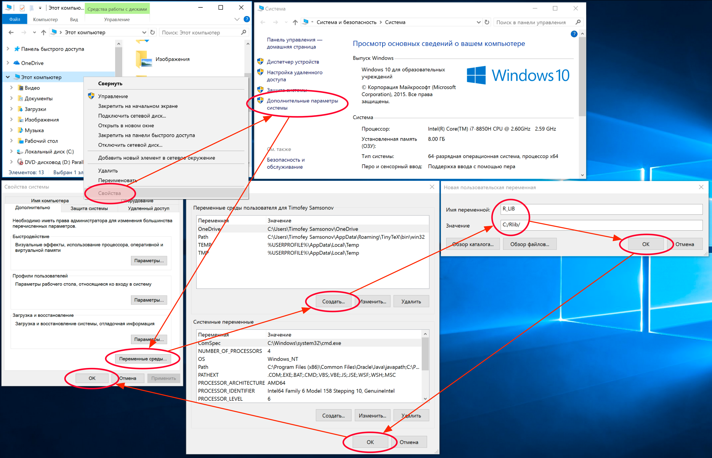

# (APPENDIX) Решение проблем {-}

```{r setup-appendix, echo = FALSE, purl = FALSE, cache = FALSE, include=FALSE}
library(datasets)
library(DT)
knitr::opts_knit$set(global.par = TRUE)
knitr::opts_chunk$set(warning=FALSE, message = FALSE, 
                      collapse=TRUE, cache = TRUE, 
                      cache.lazy = FALSE)
```

# Установка пакетов {#package-troubles}

## Недоступен стандартный каталог {#package-troubles-standard}

Иногда по тем или иным причинам невозможно установить пакет в стандартный каталог. Наиболее часто эта проблема дает о себе знать в случае когда:

- у вас Windows и ваш пользователь назван кириллическими буквами (Маша, Петя и т.д.)
- у вашего пользователя нет прав административного доступа к каталогу, в который устанавливаются пакеты

Чтобы проверить, где находится ваши текущие каталоги для установки пакетов, можно набрать в консоли команду `.libPaths()`. На Windows для этих целей резервируется сразу 2 каталога — пользовательский и системный:
```
> .libPaths()
[1] "C:/Users/Timofey Samsonov/Documents/R/win-library/3.5" "C:/Program Files/R/R-3.5.1/library"    
```

На UNIX-подобных системах (macOS, Linux) используется только системный каталог:
```
> .libPaths()
[1] "/Library/Frameworks/R.framework/Versions/3.5/Resources/library"
```

По умолчанию на Windows пакеты устанавливаются в пользовательскую директорию (`"C:/Users/Timofey Samsonov/Documents/R/win-library/3.5"`). Если Rstudio не сможет установить пакет в эту директорию, он будет пытаться установить его в системную директорию (`"C:/Program Files/R/R-3.5.1/library"`). Если же и туда поставить не удается, будет выведено сообщение об ошибке. В этом случае вам необходимо создать новый каталог для размещения пакетов, который не будет вызывать проблем с кодировкой и доступом. Требования к каталогу следующие:

- наличие полных (административных) прав доступа у текущего пользователя
- отсутствие кириллических символов в пути

Подходящие примеры каталогов: `C:/Rlib`, `D:/Rlibraries`. Создав каталог, вы можете решить проблему с пакетами временно или постоянно.

__Временное решение:__

- при _установке_ пакета укажите адрес каталога в параметре `lib` функции `install.packages()`. Например: `install.packages("xlsx", lib = "C:/Rlib")`
- для _загрузки_ пакета укажите местоположение пакета в дополнительном параметре `lib.loc`: `library(xlsx, lib.loc = "C:/Rlib")`

__Постоянное решение:__

- добавьте путь к новому каталогу через функцию `.libPaths()`: `.libPaths(c("С:/Rlib", .libPaths()))`
- используйте для установки и загрузки команды `install.packages` и `library` как обычно. Новые пакеты будут устанавливаться и загружаться из нового каталога, а системные пакеты будут по прежнему доступны из каталогов по умолчанию

> __Внимание:__ при добвлении пути в .libPaths() не пишите закрывающий слэш после имени каталога: `"С:/Rlib"` сработает, а `"С:/Rlib/"` нет!

Если добавление через `.libPaths()` по каким-то причинам не сработало, вы можете решить ту же задачу, используя системные переменные:

1. Откройте список системных переменных (команда My Computer -> System Properties -> Advanced system properties -> Environment Variables -> User Variables).
2. Создайте новую системную переменную (команда New User Variable), дайте ей имя R_LIBS и значение, равное пути к вашему каталогу (`C:/Rlib`).
3. Сохраните результат.

Выглядеть это должно примерно так:



## Устанавливается, но не копируется {#package-troubles-copy}

Проблема касается следующего сообщения:
```
Warning in install.packages: unable to move temporary installation
```

в результате которого пакет не появляется в вашей библиотеке, хотя проблем с доступом к ней у вас нет.

Как правило, это свидетельствует о том, что копирование файлов пакета в библиотеку блокируется антивирусом. Пакеты загружаются из CRAN во временную директорию, там разархивируются и только после этого копируются в библиотеку. Это может восприниматься антивирусом как вредоносная манипуляция. Попробуйте выключите антивирус на время установки пакет. Если по каким-то причинам это не помогло, попробуйте метод, описанный [здесь](https://stackoverflow.com/questions/46590002/warning-in-install-packages-unable-to-move-temporary-installation/49135949)

