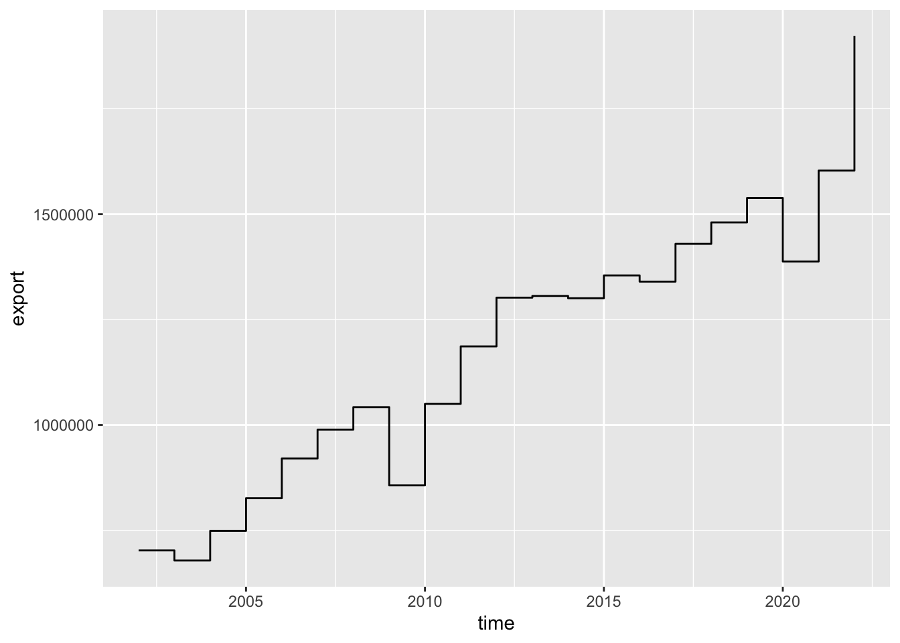

# Продвинутая графика в R {#advgraphics}


## Предварительные требования {#advgraphics_prerequisites}

Для работы по теме текущей лекции вам понадобятся пакеты __ggplot2__, __dplyr__ и __tidyr__ из __tidyverse__. Помимо этого, мы будем работать напрямую с данными [__Евростата__](https://ec.europa.eu/eurostat/web/main/home) и NASA [__POWER__](https://power.larc.nasa.gov/), к которым можно обращаться напрямую с использованием пакетов [__eurostat__](https://ropengov.github.io/eurostat/) и [__nasapower__](https://docs.ropensci.org/nasapower/):

```r
library('dplyr')
library('tidyr')
library('ggplot2')
library('eurostat')
library('nasapower')
```

В настоящей главе мы кратко познакомимся с системой [__ggplot2__](https://ggplot2.tidyverse.org/). __gg__ расшифровывается как _grammar of graphics_. Под этим понимается определенная (какая — мы узнаем далее) система правил, позволяющих описывать и строить графики. ggplot довольно сильно отличается от стандартной графической подсистемы R. Прежде всего — модульным подходом к построению изображений. В ggplot вы собираете графики «по кирпичикам», отдельно определяя источник данных, способы изображения, параметры системы координат и т.д. -- путем вызова и _сложения_ результатов соответствующих функций. 

При построении элементарных графиков __ggplot__ может показаться (и по факту так и есть) сложнее, чем стандартная графическая подсистема. Однако при усложнении требований к внешнему виду и информационному насыщению графика сложность ggplot оказывается преимуществом, и с ее помощью _относительно просто_ можно получать элегантные и информативные визуализации, на создание которых с помощью стандартной подсистемы пришлось бы затратить невероятные усилия! В этой главе мы кратко познакомимся с ggplot, а далее на протяжении курса будем регулярно ее использовать, осваивая новые возможности.

## Загрузка данных Евростата {#advgraphics_eurostat}

Таблицы данных Евростата имеют уникальные коды, по которым их можно загружать, используя API (Application programming interface). В этой лекции мы будем работать с данными о крупнейших международных партнерах Евросоюза по импорту и экспорту основных видов товаров. Например, [таблица данных по продуктам питания, напиткам и табаку](https://ec.europa.eu/eurostat/tgm/table.do?tab=table&init=1&language=en&pcode=tet00034&plugin=1) имеет код __tet00034__. 

Для чтения таблиц по кодам в пакете eurostat имеется функция `get_eurostat()`. Чтобы год измерения получить в виде числа, а не объекта типа `Date`, используем второй параметр `time_format = num`. Для перехода от кодов продукции и стран к их полным наименованиям, дополнительно вызовем функцию `label_eurostat()` из того же пакета:

```r
library(eurostat)

tables = c('tet00034', 'tet00033', 'tet00032', 'tet00031','tet00030', 'tet00029')

trades = lapply(tables, function(X) { # прочтем несколько таблиц в список
  get_eurostat(X) %>% label_eurostat()
}) %>% 
  bind_rows() %>% # объединим прочитанные таблицы в одну
  select(-geo) %>% # убираем столбец с территорией торговли, т.к. там только Евросоюз
  filter(stringr::str_detect(indic_et, 'Exports in|Imports in')) %>% # оставим только экспорт и импорт
  pivot_wider(names_from = indic_et, values_from = values) %>%  # вынесем данные по экспорту и импорту в отдельные переменные
  rename(export = `Exports in million of ECU/EURO`, # дадим им краткие названия
         import = `Imports in million of ECU/EURO`) %>% 
  mutate(partner = as.factor(partner))
```

## Загрузка данных NASA POWER {#advgraphics_nasapower}

NASA [__POWER__](https://power.larc.nasa.gov/) — это проект _NASA_, предоставляющий метеорологические, климатические и энергетические данные для целей исследования возобновляемых источников энергии, энергетической эффективности зданий и сельскохозяйственных приложений. Доступ к этим данным, как и Евростату, можно получить через программный интерфейса (API), используя пакет [__nasapower__](https://docs.ropensci.org/nasapower/). 

В основе выгрузки данных лежат реанализы с разрешением $0.5^\circ$ Выгрузим данные по температуре, относительной влажности и осадкам в Екатеринбурге ($60.59~в.д.$, $56.84~с.ш.$) за период с 1 по 30 апреля 1995 года:


```r
library(nasapower)
daily_single_ag <- get_power(
  community = "AG",
  lonlat = c(60.59, 56.84),
  pars = c("RH2M", "T2M", "PRECTOT"),
  dates = c("1995-04-01", "1995-04-30"),
  temporal_average = "DAILY"
)

daily_single_ag
## NASA/POWER SRB/FLASHFlux/MERRA2/GEOS 5.12.4 (FP-IT) 0.5 x 0.5 Degree Daily Averaged Data  
##  Dates (month/day/year): 04/01/1995 through 04/30/1995  
##  Location: Latitude  56.84   Longitude 60.59  
##  Elevation from MERRA-2: Average for 1/2x1/2 degree lat/lon region = 279.98 meters   Site = na  
##  Climate zone: na (reference Briggs et al: http://www.energycodes.gov)  
##  Value for missing model data cannot be computed or out of model availability range: -99  
##  
##  Parameters: 
##  PRECTOT MERRA2 1/2x1/2 Precipitation (mm day-1) ;
##  RH2M MERRA2 1/2x1/2 Relative Humidity at 2 Meters (%) ;
##  T2M MERRA2 1/2x1/2 Temperature at 2 Meters (C)  
##  
## # A tibble: 30 x 10
##      LON   LAT  YEAR    MM    DD   DOY YYYYMMDD    RH2M   T2M PRECTOT
##    <dbl> <dbl> <dbl> <int> <int> <int> <date>     <dbl> <dbl>   <dbl>
##  1  60.6  56.8  1995     4     1    91 1995-04-01  77.1  6.29    0   
##  2  60.6  56.8  1995     4     2    92 1995-04-02  78.4  8.13    0   
##  3  60.6  56.8  1995     4     3    93 1995-04-03  75.1  8.35    0.03
##  4  60.6  56.8  1995     4     4    94 1995-04-04  78.1  7.92    2.35
##  5  60.6  56.8  1995     4     5    95 1995-04-05  89.4  5.64    3.99
##  6  60.6  56.8  1995     4     6    96 1995-04-06  89.0  6.29    1.26
##  7  60.6  56.8  1995     4     7    97 1995-04-07  82.5  3.58    1.14
##  8  60.6  56.8  1995     4     8    98 1995-04-08  75.1  2.6     1.47
##  9  60.6  56.8  1995     4     9    99 1995-04-09  77.1  3.88    1.76
## 10  60.6  56.8  1995     4    10   100 1995-04-10  72.6  4.96    0   
## # … with 20 more rows
```

Аналогичным путем можно выгрузить данные, осредненные по годам. Например, можно получить данные по суммарной и прямой солнечной радиации ($кВт/ч/м^2/день$) для той же точки с 1995 по 2015 год:


```r
interannual_sse <- get_power(
  community = "SSE",
  lonlat = c(60.59, 56.84),
  dates = 1995:2015,
  temporal_average = "INTERANNUAL",
  pars = c("CLRSKY_SFC_SW_DWN",
           "ALLSKY_SFC_SW_DWN")
)
interannual_sse
```


## Базовый шаблон ggplot {#advgraphics_template}

Для начала посмотрим, как можно показать суммарный экспорт по годам:

```r
trades_total = trades %>% 
  group_by(time) %>% 
  summarise(export = sum(export),
            import = sum(import))
  
ggplot(data = trades_total) +
  geom_point(mapping = aes(x = time, y = export))
```


Базовый (минимально необходимый) шаблон построения графика через __ggplot__ выглядит следующим образом:

```r
ggplot(data = <DATA>) + 
  <GEOM_FUNCTION>(mapping = aes(<MAPPINGS>))
```
где:

- `DATA` --- источник данных (фрейм, тиббл)
- `GEOM_FUNCTION` --- функция, отвечающая за геометрический тип графика (точки, линии, гистограммы и т.д.)
- `MAPPINGS` --- перечень соответствий между переменными данных (содержащихся в `DATA`) и графическими переменными (координатами, размерами, цветами и т.д.)

## Геометрические типы и преобразования {#advgraphics_geoms}

ggplot предлагает несколько десятков различных видов геометрий для отображения данных. С их полным перечнем можно познакомиться [тут](https://ggplot2.tidyverse.org/reference/). Мы рассмотрим несколько наиболее употребительных, а геометрии, связанные со статистическими преобразованиями, оставим для следующей темы.

В первом примере мы отображали данные по экспорту за разные года, однако точечный тип не очень подходит для данного типа графика, поскольку он показывает динамику изменения. А это означает, что желательно соединить точки линиями. Для этого используем геометрию `geom_line()`:


```r
ggplot(data = trades_total) +
  geom_line(mapping = aes(x = time, y = export))
```


Поскольку в данном случае величина является агрегированной за год, более правильным может быть показ ее изменений в виде ступенчатого линейного графика, который получается через геометрию `geom_step()`:


```r
ggplot(data = trades_total) +
  geom_step(mapping = aes(x = time, y = export))
```


Можно совместить несколько геометрий, добавив их последовательно на график:

```r
ggplot(data = trades_total) +
  geom_line(mapping = aes(x = time, y = export)) +
  geom_point(mapping = aes(x = time, y = export))
```


Если у нескольких геометрий одинаковые отображения, их можно вынести в вызов функции `ggplot()` (чтобы не дублировать):

```r
ggplot(data = trades_total, mapping = aes(x = time, y = export)) +
  geom_line() +
  geom_point()
```


Наглядность линейного графика можно усилить, добавив "заливку" области с использованием `geom_area()`:

```r
ggplot(data = trades_total, mapping = aes(x = time, y = export)) +
  geom_area(alpha = 0.5) + # полигон с прозрачностью 0,5
  geom_line() +
  geom_point()
```


Для построения столбчатой диаграммы следует использовать геометрию `geom_col()`. Например, вот так выглядит структура экспорта продукции машиностроения из Евросоюза по ведущим партнерам:

```r
trades %>% 
  dplyr::filter(sitc06 == 'Machinery and transport equipment', time == as.Date('2017-01-01')) %>% 
  ggplot(mapping = aes(x = partner, y = export)) +
  geom_col()
```



Развернуть диаграмму можно, используя функцию `coord_flip()`:

```r
trades %>% 
  dplyr::filter(sitc06 == 'Machinery and transport equipment', time == as.Date('2017-01-01')) %>% 
  ggplot(mapping = aes(x = partner, y = export)) +
  geom_col() +
  coord_flip()
```


## Графические переменные и группировки {#advgraphics_aes}

Графические переменные --- это параметры, определяющие внешний вид символов. К ним относятся цвет (тон, насыщенность и светлота), размер, форма, ориентировка, внутренняя структура символа. В ggplot значения графических переменных могут быть едиными для всех измерений, а могут зависеть от величины измерений. С точки зрения управления здесь все просто: если вы хотите, чтобы какой-то графический параметр зависел от значения показателя, он должен быть указан внутри конструкции `mapping = aes(...)`. Если необходимо, чтобы этот параметр был одинаковым для всех измерений, вы должны его указать внутри `<GEOM_FUNCTION>(...)`, то есть не передавать в `mapping`.

Для управления цветом, формой и размером (толщиной) графического примитива следует использовать параметры _color_, _shape_ и _size_ соответственно. Посмотрим, как они работают внутри и за пределами функции `aes()`:


```r
# один цвет для графика (параметр за пределами aes)
ggplot(trades_total) + 
    geom_line(mapping = aes(x = time, y = export), color = 'blue')
```


```r

trade_russia = trades %>% filter(partner == 'Russia')

ggplot(trade_russia) + # у каждой группы данных свой цвет (параметр внутри aes)
  geom_line(mapping = aes(x = time, y = export, color = sitc06))
```


```r

ggplot(trade_russia, mapping = aes(x = time, y = export, color = sitc06)) + # а теперь и с точками
  geom_line() +
  geom_point()
```


Аналогичным образом работает параметр формы значка:

```r
# один значок для графика
ggplot(trades_total) + 
    geom_point(mapping = aes(x = time, y = export), shape = 15)
```


```r
    

ggplot(trade_russia) + # у каждой группы данных свой значок
    geom_point(mapping = aes(x = time, y = export, shape = sitc06))
```


Для изменения размера значка или линии используйте параметр `size`:

```r
# изменение размера значка и линии
ggplot(trades_total, mapping = aes(x = time, y = export)) + 
    geom_point(size = 5) +
    geom_line(size = 2)
```


Если вы используете зависимые от значений графические переменные и при этом хотите добавить на график еще одну геометрию (c постоянными параметрами), то вам необходимо сгруппировать объекты второй геометрии по той же переменной, по которой вы осуществляете разбиение в первой геометрии. Для этого используйте параметр `group`:

```r
ggplot(trade_russia, aes(x = time, y = export)) + 
    geom_point(aes(shape = sitc06)) +
    geom_line(aes(group = sitc06))
```


Для изменения цвета столбчатых диаграмм следует использовать параметр `fill`, а цвет и толщина обводки определяются параметрами `color` и `size`:

```r
trades %>% 
  dplyr::filter(sitc06 == 'Machinery and transport equipment', time == as.Date('2017-01-01')) %>% 
  ggplot(mapping = aes(x = partner, y = export)) +
  geom_col(fill = 'plum4', color = 'black', size = 0.2) +
  coord_flip()
```


Цвет на столбчатых диаграммах можно использовать для отображения дополнительных переменных, например типа экспортируемой продукции. По умолчанию столбики будут образовывать стек

```r
trades %>% 
  dplyr::filter(time == as.Date('2017-01-01')) %>% 
  ggplot(mapping = aes(x = partner, y = export, fill = sitc06)) +
  geom_col(color = 'black', size = 0.2) +
  coord_flip()
```


Если вам важно не абсолютное количество, а процентное соотношение величин, вы можете применить вид группировки `position == 'fill`:

```r
trades %>% 
  dplyr::filter(time == as.Date('2017-01-01')) %>% 
  ggplot(mapping = aes(x = partner, y = export, fill = sitc06)) +
    geom_col(color = 'black', size = 0.2, position = 'fill') +
    coord_flip()
```


Еще один вид группировки — это группировка по соседству. Чтобы использовать ее, применить метод `position == 'dodge`:

```r
trade_russia %>% 
  filter(time >= as.Date('2013-01-01')) %>% 
  ggplot(mapping = aes(x = time, y = export, fill = sitc06)) +
    geom_col(color = 'black', size = 0.2, position = 'dodge')
```


## Системы координат {#advgraphics_coords}

__ggplot__ поддерживает множество полезных преобразований координат, таких как смена осей X и Y, переход к логарифмическим координатам и использование полярной системы вместо декартовой прямоугольной. 

Смена переменных происходит благодаря уже знакомой нам функции `coord_flip()`. Рассмотрим, например, как изменилась структура экспорта/импорта по годам:

```r
trades_type = trades %>% 
  group_by(sitc06, time) %>% 
  summarise(export = sum(export),
            import = sum(import))

ggplot(trades_type) + 
    geom_point(mapping = aes(x = export, y = import, color = sitc06, size = time), alpha = 0.5)
```


```r

ggplot(trades_type) + 
    geom_point(mapping = aes(x = export, y = import, color = sitc06, size = time), alpha = 0.5) +
    coord_flip()
```


Поскольку объемы продукции различаются _на порядки_, для различимости малых объемов целесообразно перейти к логарифмической шкале. Для этого используем `scale_log_x()` и `scale_log_y()`:

```r
ggplot(trades_type, mapping = aes(x = export, y = import, color = sitc06, size = time)) + 
  geom_point(alpha = 0.5) +
  scale_x_log10() +
  scale_y_log10()
```


Преобразование в полярную систему координат используется для того чтобы получить круговую секторную диаграмму Найтингейл (_coxcomb chart_):

```r
trades %>% 
  dplyr::filter(sitc06 == 'Machinery and transport equipment', time == as.Date('2017-01-01')) %>% 
  ggplot(mapping = aes(x = partner, y = export, fill = partner)) +
  geom_col() +
  coord_polar()
```


 
Разумеется, здесь тоже можно использовать преобразование шкалы по оси _Y_ (которая теперь отвечает за радиус). Применим правило квадратного корня, добавив вызов функции `scale_y_sqrt()`:

```r
trades %>% 
  dplyr::filter(sitc06 == 'Machinery and transport equipment', time == as.Date('2017-01-01')) %>% 
  ggplot(mapping = aes(x = partner, y = export, fill = partner)) +
  geom_col() +
  coord_polar() +
  scale_y_sqrt()
```


Чтобы построить классическую секторную диаграмму, необходимо, чтобы угол поворота соответствовал величине показателя (оси _Y_), а не названию категории (оси _X_). Для этого при вызове функции `coord_polar()` следует указать параметр `theta = 'y'`, а при вызове `geom_col()` оставить параметр `x` пустым:

```r
trades %>% 
  dplyr::filter(sitc06 == 'Machinery and transport equipment', time == as.Date('2017-01-01')) %>% 
  ggplot(mapping = aes(x = '', y = export, fill = partner), color = 'black', size = 0.2) +
  geom_col() +
  coord_polar(theta = 'y')
```


## Названия осей и легенды {#advgraphics_titles}

ggplot предоставляет ряд функций для аннотирования осей и легенды. Для этого можно использовать одну из следующих функций:

- `labs(...)` модифицирует заголовок легенды для соответствующей графической переменной, либо заголовок/подзаголовок графика
- `xlab(label)` модифицирует подпись оси X
- `ylab(label)` модифицирует подпись оси Y
- `ggtitle(label, subtitle = NULL)` модифицирует заголовок и подзаголовок графика

Создадим подписи легенд, отвечающих за цвет и размер значка на графике соотношения импорта и экспорта разных видов продукции:

```r
ggplot(trades_type) + 
  geom_point(mapping = aes(x = export, y = import, color = sitc06, size = time), alpha = 0.5) +
  labs(color = "Вид продукции", size = 'Год')
```


Добавим заголовок и подзаголовок графика:

```r
ggplot(trades_type) + 
  geom_point(mapping = aes(x = export, y = import, color = sitc06, size = time), alpha = 0.5) +
  labs(color = "Вид продукции", size = 'Год') +
  ggtitle('Соотношение импорта и экспорта в странах Евросоюза (млн долл. США)',
          subtitle = 'Данные по ключевым партнерам')
```


Изменим подписи осей:

```r
ggplot(trades_type) + 
  geom_point(mapping = aes(x = export, y = import, color = sitc06, size = time), alpha = 0.5) +
  labs(color = "Вид продукции", size = 'Год') +
  ggtitle('Соотношение импорта и экспорта в странах Евросоюза (млн долл. США)',
          subtitle = 'Данные по ключевым партнерам') +
  xlab('Экспорт') +
  ylab('Импорт')
```


## Разметка осей {#advgraphics_axes}

Первое, что вам скорее всего захочется убрать — это экспоненциальная запись чисел. На самом деле, эта запись не является параметром __ggplot__ или стандартной системы __graphics__. Количество значащих цифр, после которых число автоматически представляется в экспоненциальном виде, управляется параметром `scipen`. Мы можем задать его достаточно большим, чтобы запретить переводить любые разумные числа в экспоненциальный вид:

```r
options(scipen = 999)
ggplot(trades_type) + 
  geom_point(mapping = aes(x = export, y = import, color = sitc06, size = time), alpha = 0.5) +
  labs(color = "Вид продукции", size = 'Год') +
  ggtitle('Соотношение импорта и экспорта в странах Евросоюза (млн долл. США)',
          subtitle = 'Данные по ключевым партнерам') +
  xlab('Экспорт') +
  ylab('Импорт')
```


Для управления разметкой осей необходимо использовать функции `scale_x_continuous()`, `scale_y_continuous()`, `scale_x_log10(...)`, `scale_y_log10(...)`, `scale_x_reverse(...)`, `scale_y_reverse(...)`, `scale_x_sqrt(...)`, `scale_y_sqrt(...)`, которые, с одной стороны, указывают тип оси, а с другой стороны — позволяют управлять параметрами сетки координат и подписями.

Для изменения координат линий сетки и подписей необходимо использовать, соответственно, параметры `breaks` и `labels`:

```r
ggplot(trades_type, mapping = aes(x = export, y = import, color = sitc06, size = time)) + 
  geom_point(alpha = 0.5) +
  scale_x_log10(breaks = seq(0, 500000, 100000)) +
  scale_y_log10(breaks = seq(0, 500000, 100000))
```


В данном случае, как раз, будет достаточно полезным параметр `labels`, поскольку метки можно сделать более компактными, поделив их на 1000 (и не забыть потом указать, что объемы теперь указаны не в миллионах, а в миллиардах долларов):

```r
brks = seq(0, 500000, 100000)
ggplot(trades_type, mapping = aes(x = export, y = import, color = sitc06, size = time)) + 
  geom_point(alpha = 0.5) +
  scale_x_log10(breaks = brks, labels = brks / 1000) +
  scale_y_log10(breaks = brks, labels = brks / 1000)
```


Для обычной шкалы используйте функции `scale_x_continuous()` и `scale_y_continuous()`:

```r
ggplot(trades_type, mapping = aes(x = export, y = import, color = sitc06, size = time)) + 
  geom_point(alpha = 0.5) +
  scale_x_continuous(breaks = brks, labels = brks / 1000) +
  scale_y_continuous(breaks = brks, labels = brks / 1000)
```


Для того чтобы принудительно указать диапазоны осей и графических переменных, следует использовать функции `lims(...)`, `xlim(...)` и `ylim(...)`. Например, мы можем приблизиться в левый нижний угол графика, задав диапазон 0-200000 по обеим осям:

```r
ggplot(trades_type, mapping = aes(x = export, y = import, color = sitc06, size = time)) + 
  geom_point(alpha = 0.5) +
  xlim(0, 75000) +
  ylim(0, 75000)
```


Функция `lims()` работает еще хитрее: она позволяет применять графические переменные только к ограниченному набору значений исходных данных. Например, таким путем я могу выделить на графике продукцию машиностроения:

```r
ggplot(trades_type, mapping = aes(x = export, y = import, color = sitc06, size = time)) + 
  geom_point(alpha = 0.5) +
  lims(color = 'Machinery and transport equipment')
```


## Подписи и аннотации {#advgraphics_labels}

С точки зрения __ggplot__ текст на графике, отображающий входные данные, является одной из разновидностей геометрии. Размещается он с помощью функции `geom_text()`. Как и в случае с другими геометриями, параметры, зависящие от исходных данных, должны быть переданы внутри `mapping = aes(...)`:

```r
ggplot(data = trades_total, mapping = aes(x = time, y = export)) +
  geom_area(alpha = 0.5) + # полигон с прозрачностью 0,5
  geom_line() +
  geom_point() +
  geom_text(aes(label = floor(export / 1000))) # добавляем подписи
```


Выравнивание подписи относительно якорной точки (снизу, сверху, справа, слева) по горизонтали и вертикали управляется параметрами `hjust` и `vjust`, а смещения по осям X (в координатах графика) — параметрами `nudge_x` и `nudge_y`:

```r
ggplot(data = trades_total, mapping = aes(x = time, y = export)) +
  geom_area(alpha = 0.5) + # полигон с прозрачностью 0,5
  geom_line() +
  geom_point() +
  geom_text(aes(label = floor(export / 1000)), 
            vjust = 0, nudge_y = 40000) # добавляем подписи
```


Подписи с фоновой плашкой добавляются через функцию `geom_label()`, которая имеет аналогичный синтаксис:

```r
trades %>% 
  dplyr::filter(sitc06 == 'Machinery and transport equipment', time == as.Date('2017-01-01')) %>% 
  ggplot(mapping = aes(x = partner, y = export)) +
  geom_col(fill = 'plum4', color = 'black', size = 0.2) +
  coord_flip() +
  geom_label(aes(y = export / 2, label = floor(export / 1000))) # добавляем подписи
```


__Аннотации__ представляют собой объекты, размещаемые на графике вручную, и используемые, как правило, для выделения объектов и областей. Для размещения аннотаций используется функция `annotate()`:

```r
ggplot(data = trades_total, mapping = aes(x = time, y = export)) +
  geom_area(alpha = 0.5) + # полигон с прозрачностью 0,5
  geom_line() +
  geom_point() +
  geom_text(aes(label = floor(export / 1000)), 
            vjust = 0, nudge_y = 40000) +
  annotate("text", x = as.Date('2009-01-01'), y = 550000, label = "Это провал", color = 'red')
```


Аннотировать можно не только подписями, но и регионами. Например, мы можем выделить область, которая соответствует импорту/экспорту продукции химической промышленности:

```r
ggplot(trades_type, mapping = aes(x = export, y = import, color = sitc06, size = time)) + 
  annotate("rect", xmin = 100000, xmax = 250000, ymin = 75000, ymax = 175000,  alpha = .2, color = 'black', size = 0.1) +
  geom_point(alpha = 0.5) +
  annotate("text", x = 175000, y = 190000, label = "Chemicals", color = 'coral')
```


## Фасеты {#advgraphics_facets}

Фасеты представляют собой множество графиков, каждый из которых отображает свою переменную или набор значений. Для разбиения на фасеты используется функция facet_wrap(), которой необходимо передать переменную разбиения с _тильдой_. Например, рассмотрим изменение структуры импорта по годам:

```r
brks = c(0, 50, 100, 150, 200)
trades %>% 
  dplyr::filter(sitc06 == 'Machinery and transport equipment') %>% 
  ggplot(mapping = aes(x = partner, y = import)) +
  geom_col() +
  scale_y_continuous(breaks = brks * 1e3, labels = brks) +
  ggtitle('Импорт продукции машиностроения (мдрд долл. США)',
        subtitle = 'Данные по ключевым партнерам') +
  coord_flip() +
  facet_wrap(~time)
```


## Темы {#advgraphics_themes}

Система __ggplot__ интересна также тем, что для нее существует множество предопределенных "тем" или скинов для оформления графиков. [Часть из них](https://ggplot2.tidyverse.org/reference/ggtheme.html) входит в состав самой библиотеки. Дополнительные темы можно установить через пакет [__ggthemes__](https://cran.r-project.org/web/packages/ggthemes/index.html). Чтобы изменить тему оформления ggplot, достаточно прибавить в конце построения графика соответствующую функцию. Например, классическая черно-белая тема получается прибавлением функции `theme_bw()`:

```r
ggplot(data = trades_total, mapping = aes(x = time, y = export)) +
  geom_area(alpha = 0.5) + # полигон с прозрачностью 0,5
  geom_line() +
  geom_point() +
  geom_text(aes(label = floor(export / 1000)), 
            vjust = 0, nudge_y = 40000) +
  theme_bw()
```


```r

ggplot(trades_type) + 
  geom_point(mapping = aes(x = export, y = import, color = sitc06, size = time), alpha = 0.5) +
  labs(color = "Вид продукции", size = 'Год') +
  ggtitle('Соотношение импорта и экспорта в странах Евросоюза (млн долл. США)',
          subtitle = 'Данные по ключевым партнерам') +
  xlab('Экспорт') +
  ylab('Импорт') +
  theme_bw()
```


## Контрольные вопросы и упражнения {#questions_tasks_advgraphics}

### Вопросы {#questions_advgraphics}

1. Назовите три основных компоненты шаблона построения графика в __ggplot2__.
1. Как называются геометрии __ggplot2__, отвечающие за построение точек, линий и ступенчатых линий?
1. Как называется геометрия __ggplot2__, отвечающая за построение столбчатой диаграммы?
1. Как сделать так, чтобы графический параметр __ggplot2__ был постоянным для всех измерений?
1. Как сделать так, чтобы графический параметр __ggplot2__ зависел от значения переменной?
1. Перечислите названия параметров, отвечающих за цвет, размер, заливку и тип значка графического примитива.
1. Если вы используете зависимые от значений графические переменные и при этом хотите добавить на график еще одну геометрию с постоянными параметрами, то как это можно реализовать?
1. Перечислите названия режимов группировки столбчатых диаграмм и пути их реализации.
1. Какая функция ggplot2 позволяет поменять местами оси координат?
1. Перечислите типы шкал для осей координат, которые доступны в __ggplot2__.
1. Назовите функцию, позволяющую перейти к полярной системе координат при построении графика в __ggplot2__.
1. В чем отличие построения розы-диаграммы (_coxcomb chart_) и секторной диаграммы (_pie chart_) средствами __ggplot2__?
1. Что делает функция `labs()`?
1. Какие функции позволяют определить названия осей и заголовок графика?
1. Что делает функция `lims()`?
1. Как ограничить область построения графика заданным диапазоном значений координат?
1. Как ограничить применение графических переменных только к определенным значениям измерений?
1. Назовите геометрии, которые позволяют размещать подписи и подписи с плашками (фоном) на графиках __ggplot2__.
1. Чем отличаются аннотации от геометрии подписей в __ggplot__? Какие виды аннотаций можно создавать?
1. Каким образом можно построить фасетный график, на котором каждое изображение соответствует значению переменной? Каков синтаксис вызова соответствующей функции?
1. Как поменять стиль отображения (тему) графика __ggplot2__?
1. Как получить программный доступ к таблицам Евростата, не прибегая к закачке файлов? Какой пакет можно использовать для этого?
1. Что является уникальным идентификатором таблицы в данных Евростата и как его узнать?
1. Как преобразовать коды Евростата в загруженных таблицах в человеко-читаемые обозначения?

### Упражнения {#tasks_advgraphics}

1. Постройте для набора данных _quakes_ пакета __datasets__ точечный график, на котором в качестве координат используются широты и долготы (lat, long), цветом кружка показана глубина землетрясения, а диаметром — его магнитуда. Цвет кружков сделайте полупрозрачным Сделайте заголовок графика, подписи осей координат и легенды.

2. Постройте графики хода метеовеличин на примере данных NASA POWER, загруженных в разделе __6.3__. Для суточных данных используйте линейный график, для осредненных по месяцам — столбчатую диаграмму.

3. Таблица _storms_ из пакета __dplyr__ содержит данные трекинга тропических циклонов c 1975 по 2015 год. Извлеките из нее данные по одному выбранному циклону и постройте на их основе диаграмму рассеяния, на которой за оси _X_ и _Y_ отвечают давление и скорость ветра, а цвет кружка соответствует типу циклона из поля _status_.

4. Загрузите [таблицу данных по импорту/экспорту продуктов питания, напитков и табака](https://ec.europa.eu/eurostat/tgm/table.do?tab=table&init=1&language=en&pcode=tet00034&plugin=1) с портала Евростата (с использованием пакета __eurostat__). Постройте линейный график изменения _суммарных_ величин импорта и экспорта по данному показателю (у вас должно получиться 2 графика на одном изображении). Используйте _цвет_ для разделения графиков. Добавьте текстовые подписи величин импорта и экспорта.

----
_Самсонов Т.Е._ **Визуализация и анализ географических данных на языке R.** М.: Географический факультет МГУ, 2019. DOI: [10.5281/zenodo.901911](https://doi.org/10.5281/zenodo.901911)
----
