# Основы статистики в R {#stat_analysis}


## Предварительные требования {#stat_analysis_prerequisites}

Для работы по теме текущей лекции вам понадобятся пакеты из __tidyverse__. Помимо этого, мы будем работать с данными через интерфейс _Google Sheets_ напрямую с использованием пакетов [__googledrive__](https://googledrive.tidyverse.org/) и [__googlesheets4__](https://googlesheets4.tidyverse.org/). Также в лекции используется пакет __ggrepel__, позволяющий устранять конфликты подписей на графиках __ggplot__:

```r
library(tidyverse)
library(googledrive)
library(googlesheets4)
library(ggrepel)
```

> __Внимание:__ пакет __googlesheets4__ в настоящий момент не доступен на CRAN. Для его установки вам необходимо сначала стандартным путём установить пакет [__devtools__](https://devtools.r-lib.org/), а затем вызвать в консоли команду `devtools::install_github("tidyverse/googlesheets4")`. Эта команда устанавливает пакет из репозитория GitHub.

## Введение {#stat_analysis_intro}

__Математическая статистика__ --- раздел математики, посвящённый математическим методам систематизации, обработки и использования статистических данных для научных и практических выводов. Под статистическими данными обычно понимают числовую информацию, извлекаемую из результатов выборочных обследований, результаты серии неточных измерений и вообще любую систему количественных данных [@bigenc:matstat].

Статистический метод представляет собой важнейший инструмент исследования, применяющийся во всех без исключения областях науки и технологий. Математическая статистика тесно связана с теорией вероятностей -- разделом математики, изучающим математические модели случайных явлений. В силу огромного разнообразия статистических методов и специфики их применения в разных приложения, в одной лекции нет возможности (и смысла) представить их в одной лекции. 

В связи с этим в настоящем разделе представляются основные инструменты статистики, такие как: простейшие приемы статистического описания (описательные статистики), проверка статистических гипотез, оценка плотности распределения, корреляция и регрессия. Помимо этого, в настоящем разделе большое внимание уделено построению специализированных графиков, отражающих особенности распределения величины: гистограмм, диаграмм размаха, линий регрессии и локальной регрессии, кривых и поверхностей плотности распределения.

### Источники данных {#stat_analysis_intro_sources}

#### База данных Gapminder {#stat_analysis_intro_gapminder}

В данной лекции мы будем работать с базой данных [__Gapminder__](https://www.gapminder.org/), которая содержит уникальный набор показателей по странам мира, агрегированный из различных источников (многие показатели имеют ряды на несколько столетий!):

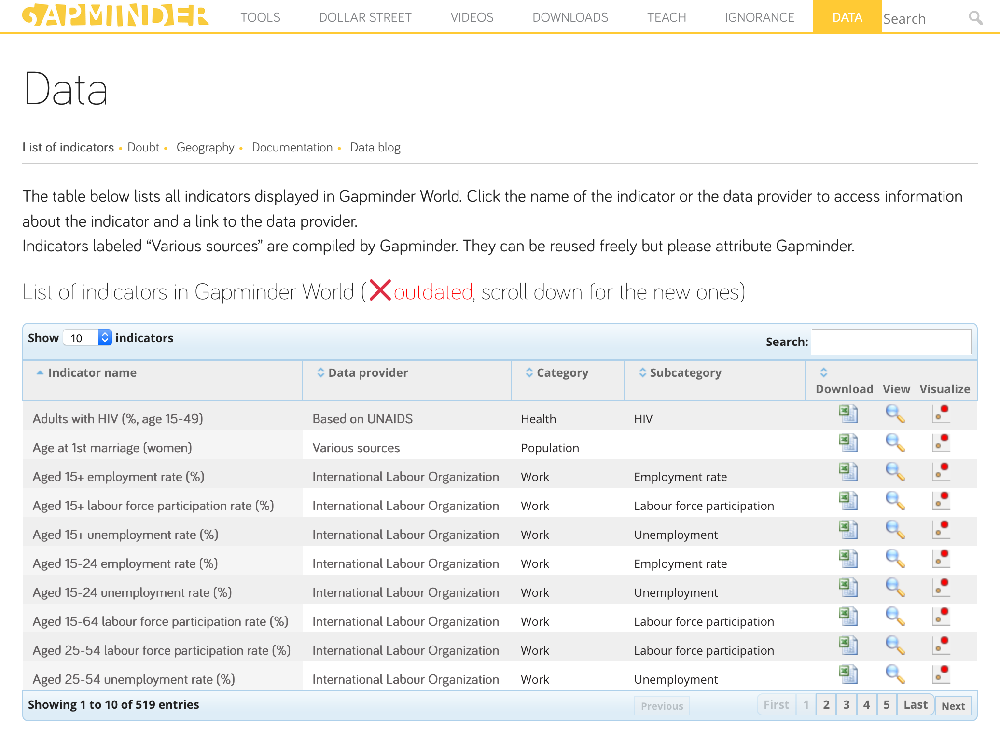

__Gapminder__ отлично подходит для знакомства со основами статистического  анализа в R, поскольку эта база данных содержит показатели с разным видом распределения, которые сгруппированы по макрорегионам и континентам, и, разумеется, имеют между собой ряд взаимосвязей, совместное поведение которых можно изучать посредством корреляционного и регрессионного анализа.

Данные __Gapminder__ можно загружать в текстовом формате и формате _Microsoft Excel_, но куда интереснее делать это непосредственно онлайн через программный интерфейс Google Sheets. Для этого нам потребуется знать ключ каждой таблицы, которую мы загружаем. Ключ можно определить, нажав "лупу" для просмотра данных и скопировав его из адресной строки (см. выделение):

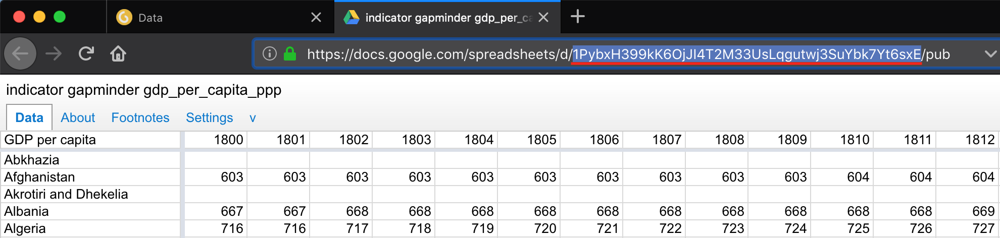

#### Пакет googlesheets {#stat_analysis_intro_gapminder_google}

Доступ к облачным таблицам — удобный способ работы с табличными данными, который позволяет избавиться от манипуляций с локальными файлами. Свои данные вы тоже можете хранить в таблицах Google. Если таблицы регулярно обновляются держателем данных, загрузка их из облачного хранилища будет гарантировать вам актуальность анализируемой информации. Ограниченем такого режима работы является то, что для доступа к данным вам нужен Интернет.

Пакет [__googlesheets4__](https://googlesheets4.tidyverse.org/) разработан профессором статистики [Дженнифер Брайан](https://github.com/jennybc) для обеспечения онлайн-доступа к таблицам Google. С кратким руководством по использованию пакета вы можете ознакомиться [тут](https://googlesheets4.tidyverse.org/articles/articles/drive-and-sheets.html). Данный пакет использует версию _4.x Google Sheets API_ (отсюда цифра 4 в навании) и рекомендуется к использованию вместо устаревшего пакета [__googlesheets__](https://cran.r-project.org/web/packages/googlesheets/). 

Пакет __googlesheets4__ работает в связке с пакетом __googledrive__, обеспечивающим общие методы доступа к Google Drive. Стандартная последовательность действий чтобы получить в текущей сессии таблицу с _Google Drive_, выглядит так:

1. Подключить библиотеки __googledrive__ и __googlesheets4__.
2. Выполнить авторизацию пользователя путем вызова `drive_auth()`. При вызове этой функции откроется браузер на странице аутентификации Google. Вам необходимо будет войти в систему под своей учетной записью Google.
3. Загрузить таблицу с помощью функции `drive_get()`, передав ей в качестве аргумента название таблицы (в этом случае она будет искаться на _вашем_ диске Google) или идентификатор таблицы (этим способом можно выгрузить в среду R таблицу из любого открытого хранилища Google Drive). Если передается идентификатор таблицы, его необходимо обернуть в класс `drive_id` путем вызова функции `as_id()`.

Рассмотрим как это работает на примере загрузки данных из хранилища _Gapminder_.

## Одна переменная {#stat_analysis_one}

### Оценка распределения {#stat_analysis_one_distr}

Для оценки распределения случайной величины можно использовать графические и статистические способы. Выявление типа распределения важно, поскольку статистические методы не универсальны, и во многих случаях предполагают, что изучаемая переменная подчиняется определенному закону распределения (как правило, нормальному).

В качестве примера возьмем данные по ВВП на душу населения, они содержатся в таблице gapminder с ниже приведенным кодом

```r
library(googledrive)
library(googlesheets4)

('1cxtzRRN6ldjSGoDzFHkB8vqPavq1iOTMElGewQnmHgg' %>% ### ВВП на душу населения
  as_id() %>% # преобразуем идентификатор в класс drive_id чтобы отличать его от пути
  drive_get() %>% 
  read_sheet() -> gdpdf) # выгружаем данные по ВВП на душу населения и сохраняем в переменную incdf
## Using an auto-discovered, cached token.
## To suppress this message, modify your code or options to clearly consent to the use of a cached token.
## See gargle's "Non-interactive auth" vignette for more details:
## https://gargle.r-lib.org/articles/non-interactive-auth.html
## The googledrive package is using a cached token for iamste@yandex.ru.
## Using an auto-discovered, cached token.
## To suppress this message, modify your code or options to clearly consent to the use of a cached token.
## See gargle's "Non-interactive auth" vignette for more details:
## https://gargle.r-lib.org/articles/non-interactive-auth.html
## The googlesheets4 package is using a cached token for iamste@yandex.ru.
## # A tibble: 260 x 256
##    `GDP per capita… `1764` `1765` `1766` `1767` `1768` `1769` `1770` `1771`
##    <chr>             <dbl>  <dbl>  <dbl>  <dbl>  <dbl>  <dbl>  <dbl>  <dbl>
##  1 Abkhazia             NA     NA     NA     NA     NA     NA     NA     NA
##  2 Afghanistan          NA     NA     NA     NA     NA     NA     NA     NA
##  3 Akrotiri and Dh…     NA     NA     NA     NA     NA     NA     NA     NA
##  4 Albania              NA     NA     NA     NA     NA     NA     NA     NA
##  5 Algeria              NA     NA     NA     NA     NA     NA     NA     NA
##  6 American Samoa       NA     NA     NA     NA     NA     NA     NA     NA
##  7 Andorra              NA     NA     NA     NA     NA     NA     NA     NA
##  8 Angola               NA     NA     NA     NA     NA     NA     NA     NA
##  9 Anguilla             NA     NA     NA     NA     NA     NA     NA     NA
## 10 Antigua and Bar…     NA     NA     NA     NA     NA     NA     NA     NA
## # … with 250 more rows, and 247 more variables: `1772` <dbl>,
## #   `1773` <dbl>, `1774` <dbl>, `1775` <dbl>, `1776` <dbl>, `1777` <dbl>,
## #   `1778` <dbl>, `1779` <dbl>, `1780` <dbl>, `1781` <dbl>, `1782` <dbl>,
## #   `1783` <dbl>, `1784` <dbl>, `1785` <dbl>, `1786` <dbl>, `1787` <dbl>,
## #   `1788` <dbl>, `1789` <dbl>, `1790` <dbl>, `1791` <dbl>, `1792` <dbl>,
## #   `1793` <dbl>, `1794` <dbl>, `1795` <dbl>, `1796` <dbl>, `1797` <dbl>,
## #   `1798` <dbl>, `1799` <dbl>, `1800` <dbl>, `1801` <dbl>, `1802` <dbl>,
## #   `1803` <dbl>, `1804` <dbl>, `1805` <dbl>, `1806` <dbl>, `1807` <dbl>,
## #   `1808` <dbl>, `1809` <dbl>, `1810` <dbl>, `1811` <dbl>, `1812` <dbl>,
## #   `1813` <dbl>, `1814` <dbl>, `1815` <dbl>, `1816` <dbl>, `1817` <dbl>,
## #   `1818` <dbl>, `1819` <dbl>, `1820` <dbl>, `1821` <dbl>, `1822` <dbl>,
## #   `1823` <dbl>, `1824` <dbl>, `1825` <dbl>, `1826` <dbl>, `1827` <dbl>,
## #   `1828` <dbl>, `1829` <dbl>, `1830` <dbl>, `1831` <dbl>, `1832` <dbl>,
## #   `1833` <dbl>, `1834` <dbl>, `1835` <dbl>, `1836` <dbl>, `1837` <dbl>,
## #   `1838` <dbl>, `1839` <dbl>, `1840` <dbl>, `1841` <dbl>, `1842` <dbl>,
## #   `1843` <dbl>, `1844` <dbl>, `1845` <dbl>, `1846` <dbl>, `1847` <dbl>,
## #   `1848` <dbl>, `1849` <dbl>, `1850` <dbl>, `1851` <dbl>, `1852` <dbl>,
## #   `1853` <dbl>, `1854` <dbl>, `1855` <dbl>, `1856` <dbl>, `1857` <dbl>,
## #   `1858` <dbl>, `1859` <dbl>, `1860` <dbl>, `1861` <dbl>, `1862` <dbl>,
## #   `1863` <dbl>, `1864` <dbl>, `1865` <dbl>, `1866` <dbl>, `1867` <dbl>,
## #   `1868` <dbl>, `1869` <dbl>, `1870` <dbl>, `1871` <dbl>, …
```

Для дальнейшей работы целесообразно привести данные к аккуратному виду, избавившись от множества столбцов с годом измерения. Сразу получим данные за 2015 год для анализа:

```r
(gdpdf_tidy = gdpdf %>% 
   gather(year, gdp, `1764`:`2018`) %>% 
   rename(Country = 1))
## # A tibble: 66,300 x 3
##    Country               year    gdp
##    <chr>                 <chr> <dbl>
##  1 Abkhazia              1764     NA
##  2 Afghanistan           1764     NA
##  3 Akrotiri and Dhekelia 1764     NA
##  4 Albania               1764     NA
##  5 Algeria               1764     NA
##  6 American Samoa        1764     NA
##  7 Andorra               1764     NA
##  8 Angola                1764     NA
##  9 Anguilla              1764     NA
## 10 Antigua and Barbuda   1764     NA
## # … with 66,290 more rows

gdpdf15 = filter(gdpdf_tidy, year == 2015)
```

Для визуальной проверки вида распределения можно использовать геометрию `geom_histogram()`:

```r
ggplot(gdpdf15, aes(x = gdp)) + 
  geom_histogram()
```


Изменить ширину кармана можно, используя параметр `binwidth`:

```r
ggplot(gdpdf15, aes(x = gdp)) + 
  geom_histogram(binwidth = 5000, color = 'black', fill = 'steelblue', size = 0.2)
```

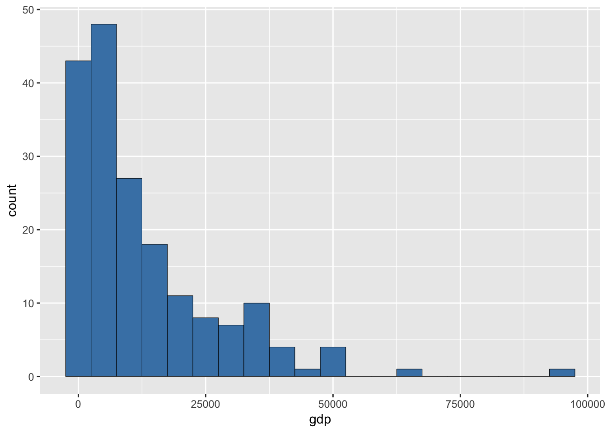

Аналогично рассмотрим показатель ожидаемой продолжительности жизни:

```r
('1H3nzTwbn8z4lJ5gJ_WfDgCeGEXK3PVGcNjQ_U5og8eo' %>% # продолжительность жизни
  as_id() %>% # преобразуем идентификатор в класс drive_id чтобы отличать его от пути
  drive_get() %>% 
  read_sheet()  -> lifedf) # выгружаем данные по ВВП на душу населения и сохраняем в переменную lifedf
## # A tibble: 260 x 218
##    `Life expectanc… `1800` `1801` `1802` `1803` `1804` `1805` `1806` `1807`
##    <chr>             <dbl>  <dbl>  <dbl>  <dbl>  <dbl>  <dbl>  <dbl>  <dbl>
##  1 Abkhazia           NA     NA     NA     NA     NA     NA     NA     NA  
##  2 Afghanistan        28.2   28.2   28.2   28.2   28.2   28.2   28.2   28.1
##  3 Akrotiri and Dh…   NA     NA     NA     NA     NA     NA     NA     NA  
##  4 Albania            35.4   35.4   35.4   35.4   35.4   35.4   35.4   35.4
##  5 Algeria            28.8   28.8   28.8   28.8   28.8   28.8   28.8   28.8
##  6 American Samoa     NA     NA     NA     NA     NA     NA     NA     NA  
##  7 Andorra            NA     NA     NA     NA     NA     NA     NA     NA  
##  8 Angola             27.0   27.0   27.0   27.0   27.0   27.0   27.0   27.0
##  9 Anguilla           NA     NA     NA     NA     NA     NA     NA     NA  
## 10 Antigua and Bar…   33.5   33.5   33.5   33.5   33.5   33.5   33.5   33.5
## # … with 250 more rows, and 209 more variables: `1808` <dbl>,
## #   `1809` <dbl>, `1810` <dbl>, `1811` <dbl>, `1812` <dbl>, `1813` <dbl>,
## #   `1814` <dbl>, `1815` <dbl>, `1816` <dbl>, `1817` <dbl>, `1818` <dbl>,
## #   `1819` <dbl>, `1820` <dbl>, `1821` <dbl>, `1822` <dbl>, `1823` <dbl>,
## #   `1824` <dbl>, `1825` <dbl>, `1826` <dbl>, `1827` <dbl>, `1828` <dbl>,
## #   `1829` <dbl>, `1830` <dbl>, `1831` <dbl>, `1832` <dbl>, `1833` <dbl>,
## #   `1834` <dbl>, `1835` <dbl>, `1836` <dbl>, `1837` <dbl>, `1838` <dbl>,
## #   `1839` <dbl>, `1840` <dbl>, `1841` <dbl>, `1842` <dbl>, `1843` <dbl>,
## #   `1844` <dbl>, `1845` <dbl>, `1846` <dbl>, `1847` <dbl>, `1848` <dbl>,
## #   `1849` <dbl>, `1850` <dbl>, `1851` <dbl>, `1852` <dbl>, `1853` <dbl>,
## #   `1854` <dbl>, `1855` <dbl>, `1856` <dbl>, `1857` <dbl>, `1858` <dbl>,
## #   `1859` <dbl>, `1860` <dbl>, `1861` <dbl>, `1862` <dbl>, `1863` <dbl>,
## #   `1864` <dbl>, `1865` <dbl>, `1866` <dbl>, `1867` <dbl>, `1868` <dbl>,
## #   `1869` <dbl>, `1870` <dbl>, `1871` <dbl>, `1872` <dbl>, `1873` <dbl>,
## #   `1874` <dbl>, `1875` <dbl>, `1876` <dbl>, `1877` <dbl>, `1878` <dbl>,
## #   `1879` <dbl>, `1880` <dbl>, `1881` <dbl>, `1882` <dbl>, `1883` <dbl>,
## #   `1884` <dbl>, `1885` <dbl>, `1886` <dbl>, `1887` <dbl>, `1888` <dbl>,
## #   `1889` <dbl>, `1890` <dbl>, `1891` <dbl>, `1892` <dbl>, `1893` <dbl>,
## #   `1894` <dbl>, `1895` <dbl>, `1896` <dbl>, `1897` <dbl>, `1898` <dbl>,
## #   `1899` <dbl>, `1900` <dbl>, `1901` <dbl>, `1902` <dbl>, `1903` <dbl>,
## #   `1904` <dbl>, `1905` <dbl>, `1906` <dbl>, `1907` <dbl>, …
```

Преобразуем в аккуратный вид и строим гистограмму распределения:

```r
lifedf_tidy = lifedf %>% 
  gather(year, lifexp, `1800`:`2016`) %>% 
  rename(Country = 1)

lifedf15 = filter(lifedf_tidy, year == 2015)

ggplot(lifedf15, aes(x = lifexp)) + 
  geom_histogram(binwidth = 2, color = 'black', fill = 'olivedrab', size = 0.2)
```

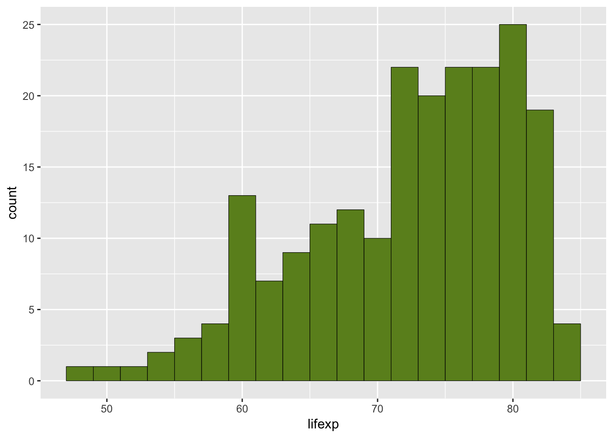

Для графической оценки распределения удобно использовать не только гистограмму, но также метод __ядерного сглаживания__ (_kernel density_), который позволяет строить аппроксимацию функции плотности вероятности. Условно говоря, ядро является функцией, которая позволяет распространить потенциал каждого элемента выборки на его ближайшую окрестность. Чем больше элементов выборки сконцентрировано вблизи данной точки, тем сильнее будет их совокупно наведенный потенциал в данной точке, и тем, соответственно, выше оценка плотности распределения, которая получается суперпозицией этих потенциалов. Математически операция ядерной оценки плотности в точке $x$ определяется как:
$$
\hat f_h (x) = \frac{1}{nh}\sum_{i=1}^{n}K\Big(\frac{x - x_i}{h}\Big)
$$
где $K$ — ядерная функция, $h > 0$ — сглаживающий параметр, $x_i$ — элементы выборки, $n$ — размер выборки. Ядерная функция должна удовлетворять двум критериям: $K(x) \geq 0$, $\int_{-\infty}^{+\infty} K(x) dx = 1$. Отсюда ясно, что любая модель функции плотности распределения может быть использована в качестве ядра: равномерное, нормальное и т.д. Как правило, ядерная функция носит бесконечно убывающий характер: чем дальше мы находимся от точки, тем меньше ее вклад в плотность распределения. 

В __ggplot__ за аппроксимацию плотности распределения методом ядерного сглаживания отвечает геометрия `geom_density()`:

```r
ggplot(gdpdf15, aes(x = gdp)) + 
  geom_density(color = 'black', fill = 'steelblue', alpha = 0.5)
```


```r

ggplot(lifedf15, aes(x = lifexp)) + 
  geom_density(color = 'black', fill = 'olivedrab', alpha = 0.5)
```

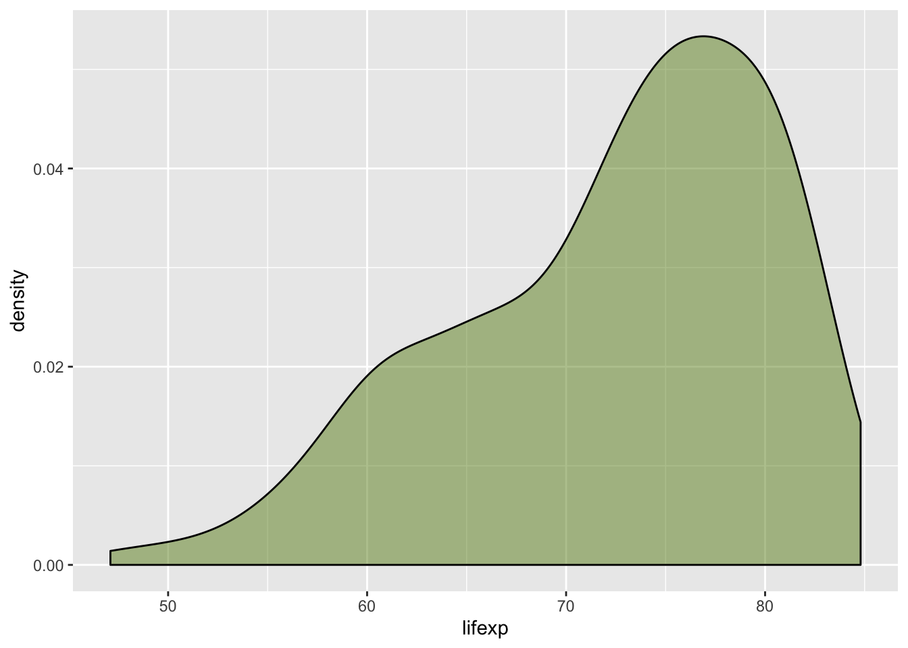

Вы можете комбинировать гистограммы и оценку плотности распределения, но для этого гистограмма по оси _Y_ должна отражать не фактическое количество элементов в каждом классе, а _долю_ или плотность вероятности (`y = stat(density)`):

```r
ggplot(gdpdf15, aes(x = gdp)) + 
  geom_histogram(aes(y = stat(density)), fill = 'grey', color = 'black', size = 0.1) +
  geom_density(color = 'black', fill = 'steelblue', alpha = 0.5)
```

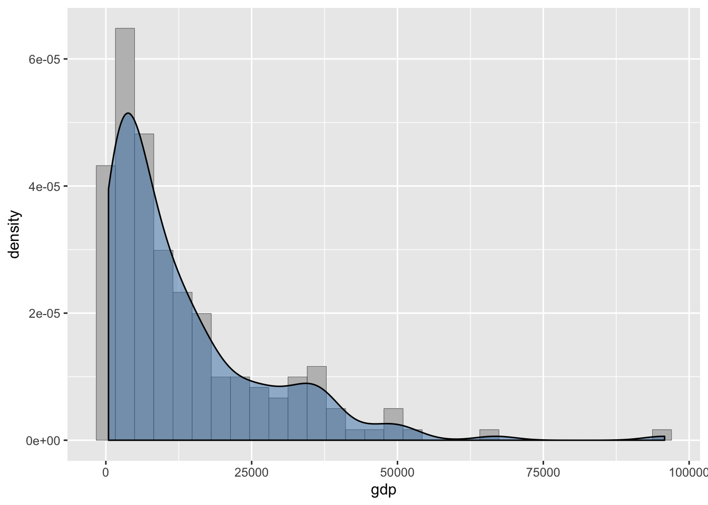

```r

ggplot(lifedf15, aes(x = lifexp)) + 
  geom_histogram(aes(y = stat(density)), fill = 'grey', color = 'black', size = 0.1) +
  geom_density(color = 'black', fill = 'olivedrab', alpha = 0.5)
```

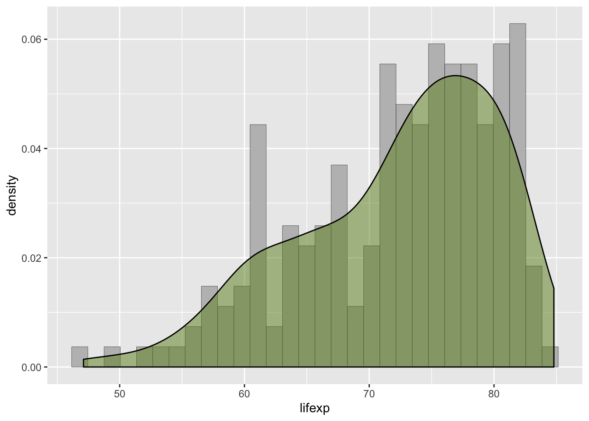

При построении гистограмм и оценке плотности распределения мы допустили ошибку: приняли, что все измерения являются равнозначными. Однако в данном случае это не так. Население Люксембурга и Пакистана отличается на два порядка --- это означает, что Пакистан должен иметь соответственно больший вес при построении гистограммы. Для учета этой характеристики подгрузим из __Gapminder__ данные по численности населения и присоединим их к нашим таблицам по ВВП и продолжительности жизни:

```r
'1IbDM8z5XicMIXgr93FPwjgwoTTKMuyLfzU6cQrGZzH8' %>% # численность населения
  as_id() %>% # преобразуем идентификатор в класс drive_id чтобы отличать его от пути
  drive_get() %>% 
  read_sheet() %>% # первый лист
  pivot_longer(cols = `1800`:`2015`, names_to = 'year', values_to = 'pop') %>% 
  rename(Country = 1) -> popdf_tidy

(tab = gdpdf_tidy %>% inner_join(lifedf_tidy) %>% inner_join(popdf_tidy))
## # A tibble: 19,359 x 5
##    Country               year    gdp lifexp     pop
##    <chr>                 <chr> <dbl>  <dbl>   <dbl>
##  1 Abkhazia              1800    NA    NA        NA
##  2 Afghanistan           1800   472.   28.2 3280000
##  3 Akrotiri and Dhekelia 1800    NA    NA        NA
##  4 Albania               1800   601.   35.4  410445
##  5 Algeria               1800   766.   28.8 2503218
##  6 American Samoa        1800   674.   NA      8170
##  7 Andorra               1800  1260.   NA      2654
##  8 Angola                1800   360.   27.0 1567028
##  9 Anguilla              1800   776.   NA      2025
## 10 Antigua and Barbuda   1800   538.   33.5   37000
## # … with 19,349 more rows
```

Теперь мы можем произвести взвешенную оценку плотности распределения:

```r
tab15 = filter(tab, year == 2015) %>% drop_na() # все веса должны быть непустыми!

ggplot(tab15, aes(x = gdp, y = stat(density), weight = pop/sum(pop))) + 
  geom_histogram(binwidth = 5000, fill = 'grey', color = 'black', size = 0.1) +
  geom_density(color = 'black', fill = 'steelblue', alpha = 0.5)
```

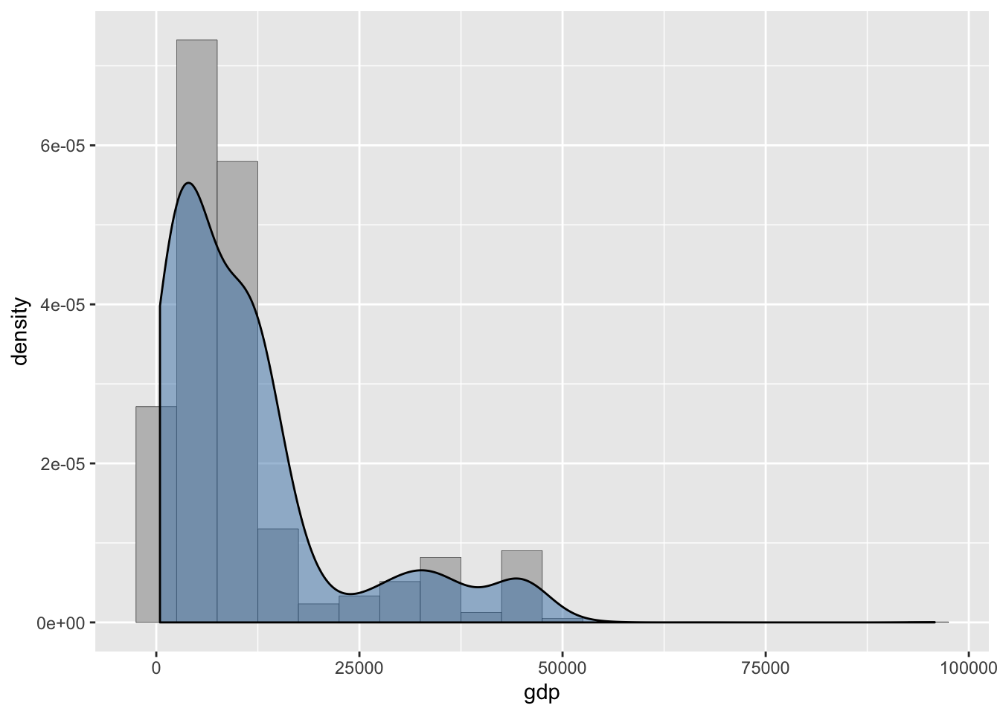

```r

ggplot(tab15, aes(x = lifexp, y = stat(density), weight = pop/sum(pop))) + 
  geom_histogram(binwidth = 2.5, fill = 'grey', color = 'black', size = 0.1) +
  geom_density(color = 'black', fill = 'olivedrab', alpha = 0.5)
```

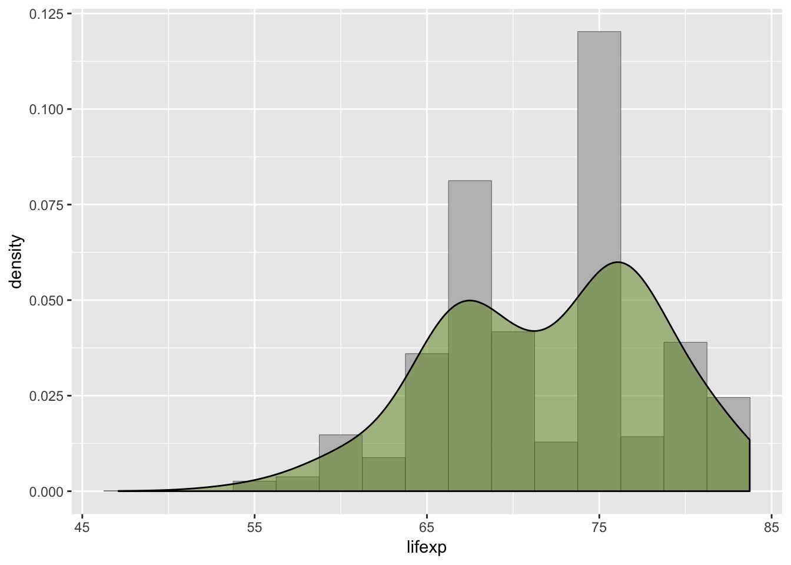

Графики плотности распределения удобны тем, что их, в отличие от гистограмм, удобно комбинировать на одном изображении, используя цвет для разделения по еще одной переменной.  Например, мы можем оценить, как изменились мировые диспропорции в продолжительности жизни и доходов населения за последние 50 лет (обратите внимание на параметр `fill = year` в эстетике:

```r
tab85 = tab %>% filter(year %in%  c(1965, 2015)) %>% drop_na()

ggplot(tab85, aes(x = gdp, fill = year, weight = pop/sum(pop))) + 
  geom_density(alpha = 0.5)
```

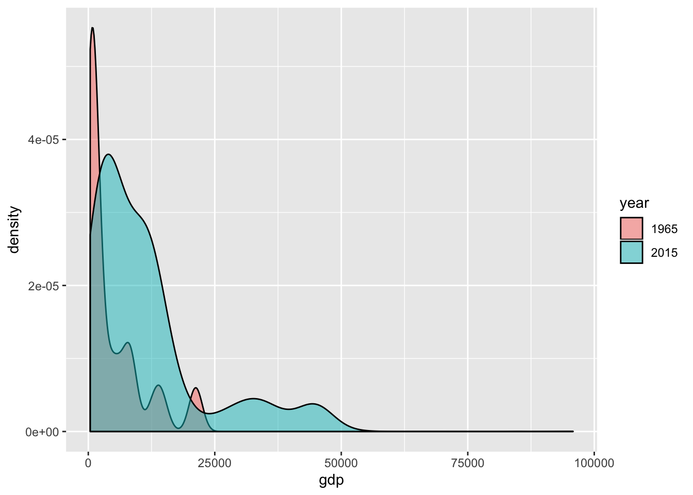

```r

ggplot(tab85, aes(x = lifexp, fill = year, weight = pop/sum(pop))) + 
  geom_density(alpha = 0.5)
```

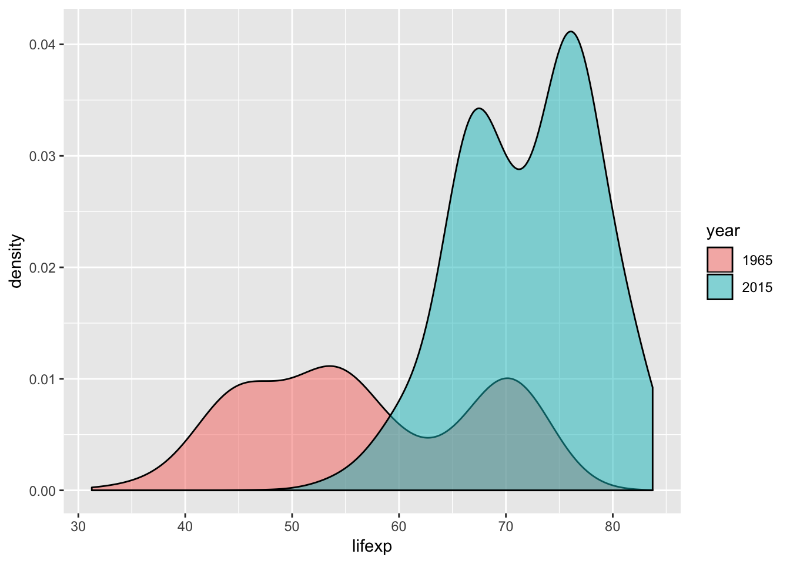

### Описательные статистики {#stat_analysis_one_summary}

Описательные статистики --- это числовые характеристики, описывающие особенности статистического распределения изучаемой величины. К таким характеристикам относят выборочное среднее, медиану, минимум, максимум и ряд других величин. Можно вычислять эти характеристики для всей выборки, но для включения географического контекста мы стратифицируем ее по макрорегионам, которые используются в базе данных __Gapminder__. Подгрузим эту информацию (данные скачиваются [отсюда](https://www.gapminder.org/data/geo/)):

```r
library(readxl)
countries = read_excel('gapminder.xlsx', 2) %>% 
  select(Country = name, Region = eight_regions) %>% 
  mutate(Country = factor(Country, levels = Country[order(.$Region)]))

ggplot(countries, aes(x = Country, y = 1, fill = Region)) +
  geom_col() +
  geom_text(aes(y = 0.5, label = Country), size = 3) +
  facet_wrap(~Region, scales = "free", ncol = 4) +
  theme_bw()+
  theme(panel.grid = element_blank(),
        axis.title.y = element_blank(),
        axis.text.y = element_blank(),
        axis.ticks.y = element_blank(),
        axis.title.x = element_blank(),
        axis.text.x = element_blank(),
        axis.ticks.x = element_blank()) +
  guides(fill=FALSE) +
  coord_flip()
```


Присоединим эти данные к исходной таблице:

```r
(tabreg = tab %>% 
  left_join(countries) %>% 
  filter(year == 2015) %>% 
  drop_na())
## # A tibble: 172 x 6
##    Country             year     gdp lifexp      pop Region            
##    <chr>               <chr>  <dbl>  <dbl>    <dbl> <chr>             
##  1 Afghanistan         2015   1418.   53.8 32526562 asia_west         
##  2 Albania             2015   7343.   78    2896679 europe_east       
##  3 Algeria             2015   6797.   76.4 39666519 africa_north      
##  4 Angola              2015   6512.   59.6 25021974 africa_sub_saharan
##  5 Antigua and Barbuda 2015  14884.   76.4    91818 america_north     
##  6 Argentina           2015  16640.   76.5 43416755 america_south     
##  7 Armenia             2015   5561.   74.7  3017712 europe_east       
##  8 Australia           2015  38085.   82.3 23968973 east_asia_pacific 
##  9 Austria             2015  37811.   81.3  8544586 europe_west       
## 10 Azerbaijan          2015  10475.   72.9  9753968 europe_east       
## # … with 162 more rows
```

Мы уже знакомы с функциями `min()`, `max()`, `median()`, `mean()`, `sd()`, которые дают значения соответствующих описательных статистик для векторов данных. Как представить их все одновременно? Для визуализации отличий в статистических параметрах исследуемой выборки удобно использовать тип графика, который называется [__boxplot__](https://ru.wikipedia.org/wiki/%D0%AF%D1%89%D0%B8%D0%BA_%D1%81_%D1%83%D1%81%D0%B0%D0%BC%D0%B8) (а по русски — диаграмма размаха, улей, или ящик с усами). В __ggplot__ за него отвечает геометрия `geom_boxplot()`:


```r
ggplot(tabreg, aes(x = Region, y = gdp)) +
  geom_boxplot() + coord_flip()
```

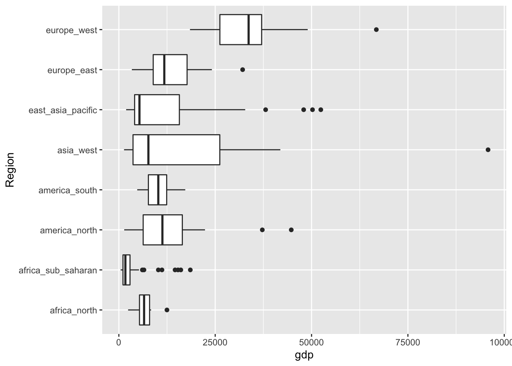

```r

ggplot(tabreg, aes(x = Region, y = lifexp)) +
  geom_boxplot() + coord_flip()
```

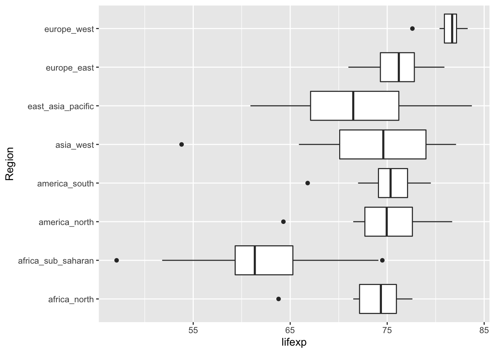

Данные графики наглядно показывают, что регионы отличаются по ряду статистических параметров исследуемой переменной: среднему значению, размаху вариации (разбросу значений), среднеквадратическому отклонению  Эти статистики можно получить и в табличном виде:

```r
(tabreg %>% 
  group_by(Region) %>% 
  summarise(gdp_mean = mean(gdp),
            gdp_sd = sd(gdp),
            lifexp_mean = mean(lifexp),
            lifexp_sd = sd(lifexp)))
## # A tibble: 8 x 5
##   Region             gdp_mean gdp_sd lifexp_mean lifexp_sd
##   <chr>                 <dbl>  <dbl>       <dbl>     <dbl>
## 1 africa_north          6897.  3386.        73        4.97
## 2 africa_sub_saharan    3583.  4553.        62.3      5.31
## 3 america_north        13835. 11451.        74.9      4.00
## 4 america_south        10350.  4277.        75.1      3.50
## 5 asia_west            16374. 20957.        73.7      6.51
## 6 east_asia_pacific    14062. 16634.        72.4      6.68
## 7 europe_east          13634.  7030.        75.9      2.86
## 8 europe_west          33571. 11104.        81.5      1.24
```

### Статистические тесты {#stat_analysis_one_tests}

Прежде чем манипулировать вычисленными статистиками (говорить, что в Западной Европе ВВП на душу населения в 10 раз выше, чем в Южной Африке), необходимо убедиться, что их отличия являются статистически значимыми. На статистическую значимость влияет не только абсолютная разность средних, но также характер распределения и объем выборки --- выборки малого объема не могут дать высокой статистической значимости.

Для сравнения средних значений и дисперсий двух статистических выборок обычно используют [__тест Стьюдента__](https://ru.wikipedia.org/wiki/T-%D0%9A%D1%80%D0%B8%D1%82%D0%B5%D1%80%D0%B8%D0%B9_%D0%A1%D1%82%D1%8C%D1%8E%D0%B4%D0%B5%D0%BD%D1%82%D0%B0) и [__тест Фишера__](https://ru.wikipedia.org/wiki/F-%D1%82%D0%B5%D1%81%D1%82) соответственно. 

Проведем тесты для сравнения средних по Европе и Южной Африке используя функцию `t.test()` (на самом деле это [тест Уэлча](https://en.wikipedia.org/wiki/Welch%27s_t-test), являющийся модификацией теста Стьюдента):

```r
t.test(tabreg %>% filter(Region == 'africa_sub_saharan') %>% pull(gdp),
       tabreg %>% filter(Region == 'europe_west') %>% pull(gdp))
## 
## 	Welch Two Sample t-test
## 
## data:  tabreg %>% filter(Region == "africa_sub_saharan") %>% pull(gdp) and tabreg %>% filter(Region == "europe_west") %>% pull(gdp)
## t = -11.384, df = 20.547, p-value = 2.487e-10
## alternative hypothesis: true difference in means is not equal to 0
## 95 percent confidence interval:
##  -35473.63 -24502.15
## sample estimates:
## mean of x mean of y 
##  3583.326 33571.214

t.test(tabreg %>% filter(Region == 'africa_sub_saharan') %>% pull(lifexp),
       tabreg %>% filter(Region == 'europe_west') %>% pull(lifexp))
## 
## 	Welch Two Sample t-test
## 
## data:  tabreg %>% filter(Region == "africa_sub_saharan") %>% pull(lifexp) and tabreg %>% filter(Region == "europe_west") %>% pull(lifexp)
## t = -23.037, df = 55.262, p-value < 2.2e-16
## alternative hypothesis: true difference in means is not equal to 0
## 95 percent confidence interval:
##  -20.87392 -17.53317
## sample estimates:
## mean of x mean of y 
##  62.25435  81.45789
```

[__p-значения__](https://ru.wikipedia.org/wiki/P-%D0%B7%D0%BD%D0%B0%D1%87%D0%B5%D0%BD%D0%B8%D0%B5) для данных тестов очень малы, что позволяет нам принять (не отвергать) гипотезу о неравенстве средних для Западной Европы и Южной Африки.

Проверим, так ли значимы отличия в средних для Северной и Южной Америки:

```r
t.test(tabreg %>% filter(Region == 'america_north') %>% pull(gdp),
       tabreg %>% filter(Region == 'america_south') %>% pull(gdp))
## 
## 	Welch Two Sample t-test
## 
## data:  tabreg %>% filter(Region == "america_north") %>% pull(gdp) and tabreg %>% filter(Region == "america_south") %>% pull(gdp)
## t = 1.1742, df = 23.283, p-value = 0.2522
## alternative hypothesis: true difference in means is not equal to 0
## 95 percent confidence interval:
##  -2650.736  9620.806
## sample estimates:
## mean of x mean of y 
##  13834.72  10349.69

t.test(tabreg %>% filter(Region == 'america_north') %>% pull(lifexp),
       tabreg %>% filter(Region == 'america_south') %>% pull(lifexp))
## 
## 	Welch Two Sample t-test
## 
## data:  tabreg %>% filter(Region == "america_north") %>% pull(lifexp) and tabreg %>% filter(Region == "america_south") %>% pull(lifexp)
## t = -0.20306, df = 25.802, p-value = 0.8407
## alternative hypothesis: true difference in means is not equal to 0
## 95 percent confidence interval:
##  -3.121651  2.560540
## sample estimates:
## mean of x mean of y 
##  74.86111  75.14167
```

В данном случае, несмотря на то, что вычисленные значения средних отличаются, тест показывает очень высокие __p-значения__ (0.25 и 0.84 соответственно), что не позволяет нам говорить о том, что эти отличия статистически значимы. Соответственно, делать на их основе какие-либо научные выводы нельзя.

Аналогичным образом можно проверить статистическую значимость отличий в дисперсии (вариации значений) для разных регионов. Для этого используем функцию `var.test()` применительно к регионам Западной и Восточной Европы:

```r
var.test(tabreg %>% filter(Region == 'europe_east') %>% pull(gdp),
       tabreg %>% filter(Region == 'europe_west') %>% pull(gdp))
## 
## 	F test to compare two variances
## 
## data:  tabreg %>% filter(Region == "europe_east") %>% pull(gdp) and tabreg %>% filter(Region == "europe_west") %>% pull(gdp)
## F = 0.40087, num df = 22, denom df = 18, p-value = 0.0434
## alternative hypothesis: true ratio of variances is not equal to 1
## 95 percent confidence interval:
##  0.1585416 0.9726112
## sample estimates:
## ratio of variances 
##          0.4008741

var.test(tabreg %>% filter(Region == 'europe_east') %>% pull(lifexp),
       tabreg %>% filter(Region == 'europe_west') %>% pull(lifexp))
## 
## 	F test to compare two variances
## 
## data:  tabreg %>% filter(Region == "europe_east") %>% pull(lifexp) and tabreg %>% filter(Region == "europe_west") %>% pull(lifexp)
## F = 5.3246, num df = 22, denom df = 18, p-value = 0.0006859
## alternative hypothesis: true ratio of variances is not equal to 1
## 95 percent confidence interval:
##   2.105831 12.918723
## sample estimates:
## ratio of variances 
##           5.324617
```
Данный тест показывает, что отличия в вариации значений ВВП на душу населения для Западной и Восточной Европы носят пограничный характер (p = 0.04), и принимать их можно только если стоит относительно высокое пороговое значение p = 0.05. В то же время, вариация продолжительности жизни для Западной Европы существенной меньше, чем для Восточной и при данной выборке это отличие обладает высокой статистической значимостью (p = 0.0007). Соответственно, его можно принимать с уверенностью.

## Две переменных {#stat_analysis_two}

Достаточно часто в задачах анализа данных возникает необходимость совместного изучения нескольких переменных. Данный раздел посвящен анализу двух переменных.

### Оценка распределения {#stat_analysis_two_distr}

#### Диаграмма рассеяния {#stat_analysis_two_distr_scatter}

Первичный анализ производится путем оценки совместного распределения переменных на плоскости (для двух переменных) путем построения диаграммы рассеяния. С этим графиком мы уже хорошо знакомы:

```r
ggplot(tabreg, aes(gdp, lifexp)) +
  geom_point()
```

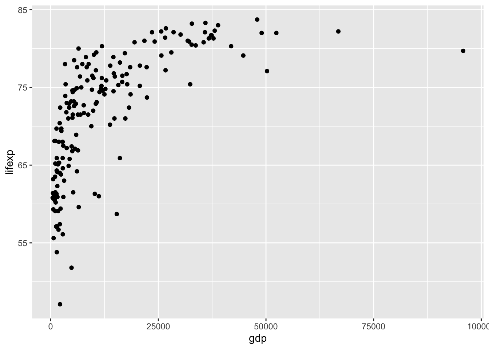

Очевидно, что в данном случае мы имеем с нелинейной зависимостью. Чтобы упростить задачу по дальнейшему анализу, можно попробовать перейти к логарифмической шкале по оси _X_:

```r
options(scipen = 999)
ggplot(tabreg, aes(gdp, lifexp)) +
  geom_point() +
  scale_x_log10()
```

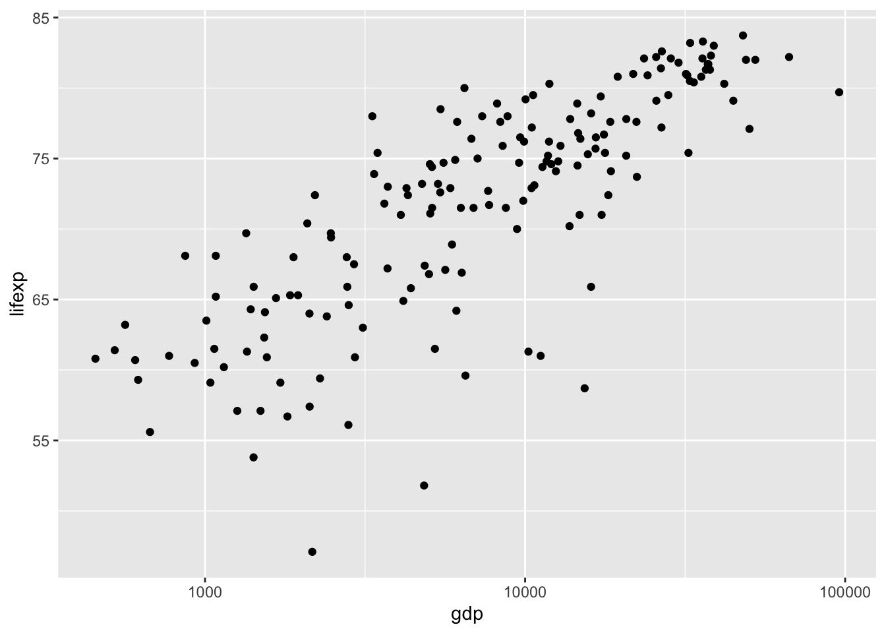

На диаграмме рассеяния важно показать не только местоположение точек, но также их весовую значимость, которая в данном случае определяется численностью населения в стране. Введем соответствующую графическую переменную — размер точки:

```r
ggplot(tabreg, aes(gdp, lifexp, size = pop)) +
  geom_point(alpha = 0.5) +
  scale_x_log10()
```

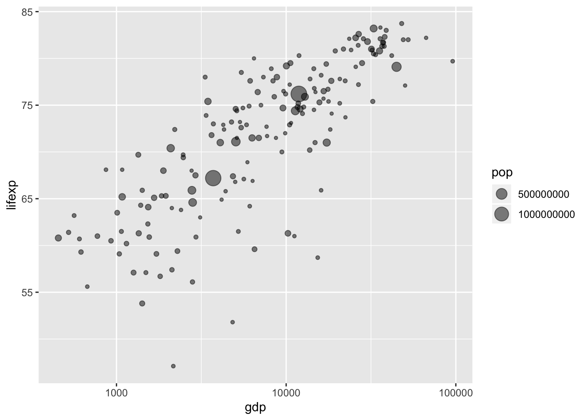

Еще сильнее повысить информативность диаграммы рассеяния можно, используя цвет точек для обозначения региона принадлежности. Это позволит понять связь между введенной нами _географической стратификацией_ и распределением элементов выборки на диаграмме рассеяния:

```r
ggplot(tabreg, aes(gdp, lifexp, size = pop, color = Region)) +
  geom_point(alpha = 0.5) +
  scale_x_log10() +
  theme_bw()
```


Использование цвета наглядно показывает, что африканские страны занимают нижнюю левую часть диаграммы рассеяния с малой величиной ВВП и низкой продолжительностью жизни.

Целесообразно также добавить подписи крупнейших стран мира с населением более 100 млн чел, а также страны, занимающие экстремальные позиции по обеим осям, чтобы понять положение ключевых игроков на диаграмме:

```r

tablab = tabreg %>% # табличка для подписей
  filter(
    pop > 1e8 | 
    gdp == min(gdp) | 
    gdp == max(gdp) | 
    lifexp == min(lifexp) | 
    lifexp == max(lifexp)
  )

ggplot(tabreg, aes(gdp, lifexp, color = Region)) +
  geom_point(aes(size = pop), alpha = 0.5) +
  geom_text(data = tablab, 
            aes(label = Country),
            check_overlap = TRUE,
            show.legend = FALSE) + # убрать текст из легенды
  scale_x_log10() +
  theme_bw()
```


Устранение перекрытий подписей можно осуществить, используя геометрию `geom_text_repel()` из пакета __ggrepel__ вместо стандартной `geom_text()`

```r
ggplot(tabreg, aes(gdp, lifexp,  color = Region)) +
  geom_point(aes(size = pop), alpha = 0.5) +
  geom_text_repel(data = tablab, 
                  aes(label = Country),
                  box.padding = 0.7,  # зазор вокруг подписи
                  segment.size = 0.2, # толщина линии выноски
                  show.legend = FALSE) + # убрать текст из легенды
  scale_x_log10() +
  labs(label = element_blank()) +
  theme_bw()
```

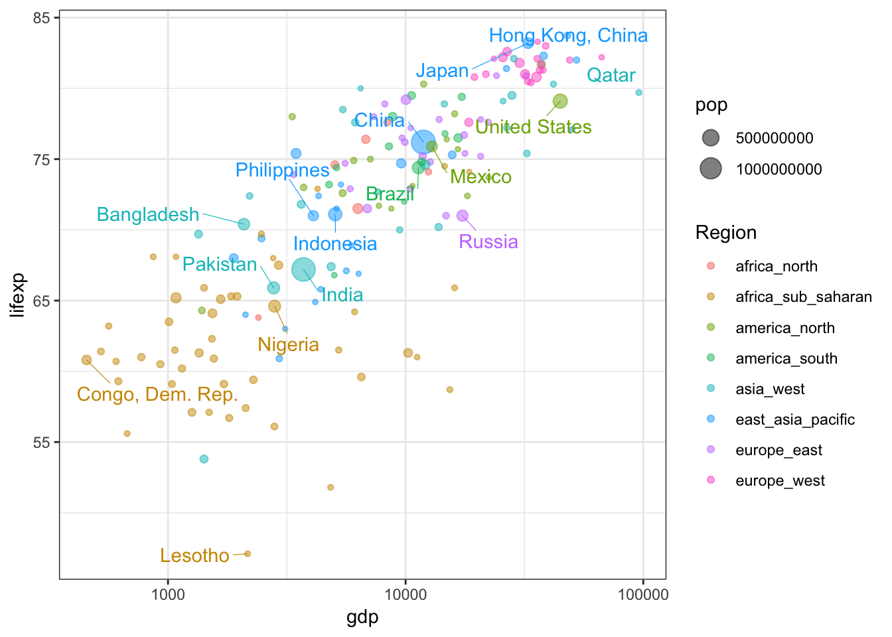

#### Плотность распределения {#stat_analysis_two_distr_density}

Плотность совместного распределения двух случайных величин представляет собой уже не кривую, а поверхность, которую можно построить с использованием геометрии `geom_density_2d()`. По умолчанию эта геометрия визуализируется в форме изолиний:

```r
ggplot(tabreg, aes(gdp, lifexp)) +
  geom_point(alpha = 0.5) +
  geom_density_2d()+
  scale_x_log10() +
  theme_bw()
```


Усилить наглядность представления можно, добавив вспомогательную растровую поверхность плотности распределения (по которой, собственно, и строятся изолинии). Обратите внимание, что для растра используется функция `stat_density()`:

```r
ggplot(tabreg, aes(gdp, lifexp)) +
  stat_density_2d(geom = "raster", aes(fill = stat(density)), contour = FALSE) +
  geom_density_2d(color = 'black', size = 0.2) +
  geom_point(alpha = 0.5) +
  scale_fill_gradient(low = "white", high = "red") +
  scale_x_log10() +
  theme_bw()
```

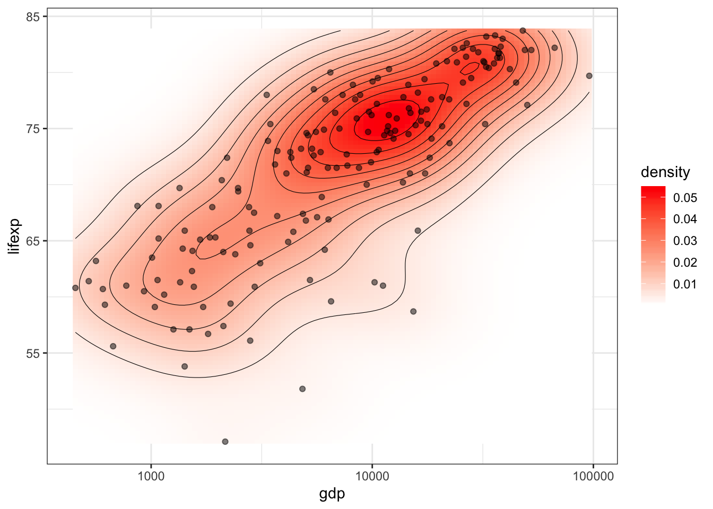

График двумерной плотности распределения показывает, что _мода_ распределения, т.е. наиболее часто встречающийся случай, примерно соответствует странам с продолжительностью жизни 75 лет и ВВП на душу населения \$10000.

В некоторых случаях удобнее оказывается не аппроксимация непрерывной поверхности плотности распределения, а подсчет количества измерений по ячейкам регулярной сетки — квадратным или гексагональным. Такой подход бывает особенно полезен, когда точек измерений очень много и из-за их количества оказывается проблематично разглядеть области их концентрации. Агрегирование данных по ячейкам осуществляется путем применения геометрий `geom_bin2d()` и `geom_hex()`:

```r
ggplot(tabreg, aes(gdp, lifexp)) +
  geom_bin2d(bins = 10)+
  geom_point(alpha = 0.5) +
  scale_fill_gradient(low = "white", high = "red") +
  scale_x_log10() +
  theme_bw()
```

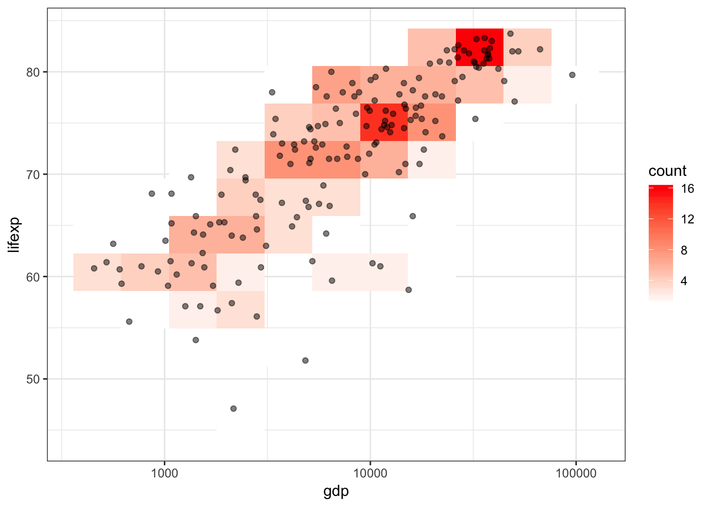

```r

ggplot(tabreg, aes(gdp, lifexp)) +
  geom_hex(bins = 10) +
  geom_point(alpha = 0.5) +
  scale_fill_gradient(low = "white", high = "red") +
  scale_x_log10() +
  theme_bw()
```

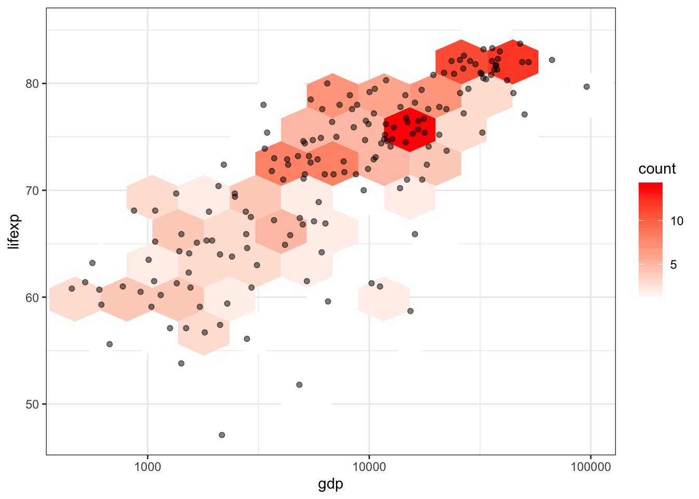

### Корреляция и регрессия {#stat_analysis_two_distr_correg}

[Корреляционный анализ](https://bigenc.ru/mathematics/text/2099814) позволяет дать численную характеристику статистической связи между двумя случайными величинами, а [регрессионный анализ](https://bigenc.ru/mathematics/text/3502638) — _моделировать_ эту взаимосвязь посредством построения функции взаимосвязи зависимой и множества независимых переменных.

#### Корреляция {#stat_analysis_two_distr_correg_corr}

[__Коэффициент корреляции__](https://bigenc.ru/mathematics/text/2099711) --- это числовая характеристика совместного распределения двух случайных величин, характеризующая их взаимосвязь. Наиболее часто в статистике употребляется выборочный коэффициент корреляции Пирсона, в котором перебираются все пары соответствующих друг другу значений из рядов $X = \{x_i\}$ и $Y = \{y_i\}$: 
$$
r_{xy} = \frac{\sum_{i=1}^{n}(x_i - \bar x)(y_i - \bar y)}{\sqrt{\sum_{i=1}^{n}(x_i - \bar x)^2} \sqrt{\sum_{i=1}^{n}(y_i - \bar y)^2}},
$$
где $\bar x$ и $\bar y$ соответствуют выборочным средним для $X$ и $Y$. 

Важно помнить, что коэффициент корреляции Пирсона характеризует силу _линейной_ связи между двумя величинами. Поэтому, если наблюдаемая нами картина взаимосвязи носит нелинейный характер, необходимо предварительно линеаризовать ее, то есть выполнить преобразование над переменными, приводящее к получению линейной зависимости. В нашем в случае изучения ВВП на душу населения и продолжительности жизни мы видели, что линеаризация возможна путем логарифмирования показателя ВВП.

Для вычисления коэффициента корреляции Пирсона в __R__ с оценкой уровня значимости используется функция `cor.test()`:

```r
cor.test(tabreg$gdp, tabreg$lifexp)
## 
## 	Pearson's product-moment correlation
## 
## data:  tabreg$gdp and tabreg$lifexp
## t = 11.376, df = 170, p-value < 0.00000000000000022
## alternative hypothesis: true correlation is not equal to 0
## 95 percent confidence interval:
##  0.5632175 0.7347928
## sample estimates:
##       cor 
## 0.6574446
```
Результат теста в данном случае показывает, что коэффициент корреляции с вероятностью 0,95 находится в интервале от 0,56 до 0,73, и его математическое ожидание равно 0,66. 

Проверим, можно ли уточнить эту оценку, выполнив логарифмирование показателя ВВП:

```r
cor.test(log(tabreg$gdp), tabreg$lifexp)
## 
## 	Pearson's product-moment correlation
## 
## data:  log(tabreg$gdp) and tabreg$lifexp
## t = 17.327, df = 170, p-value < 0.00000000000000022
## alternative hypothesis: true correlation is not equal to 0
## 95 percent confidence interval:
##  0.7375973 0.8473619
## sample estimates:
##       cor 
## 0.7990415
```
Видим, что логарифмирование показателя позволяет повысить значение коэффициента корреляции до 0,8. При этом доверительный интервал, заключающий в себя эту величину с вероятностью 0,95 существенно сузился: с 0,17 до 0,11. Очевидно, мы получили более корректную оценку взаимосвязи.

#### Регрессия {#stat_analysis_two_distr_correg_reg}

Для построения статистической модели этой зависимости, позволяющей по значениям независимой переменной вычислять значения зависимой переменной, необходимо провести __регрессионный анализ__. В общем случае кривая регрессии обычно выражается линейной комбинацией набора функций:
$$
y(x) = β_0φ_0(x)+ β_1φ_1(x)+...+ β_mφ_m(x)
$$
Наиболее часто используется _полиномиальная регрессия_, при которой
$$
y(x) = β_0+β_1x+...+ β_mx^m.
$$
В этом случае основная задача регрессионного анализа сводится к поиску неизвестных коэффициентов $β_0,...,β_m$, который осуществляется [методом наименьших квадратов](https://bigenc.ru/mathematics/text/2245173). Результатом этого поиска являются выборочные коэффициенты регрессии $\hat β_0,...,\hat β_m$, которые дают оценку искомых параметров $β_0,...,β_m$. В итоге эмпирическая линия регрессии определяется многочленом
$$
\hat y(x)=\hat β_0+\hat β_1x+...+\hat β_mx_m,
$$
который и служит статистической оценкой неизвестной формы функциональной зависимости между исследуемыми величинами.

Для представления моделей в R существует специальный объект, который называется __формула__. Формула имеет вид `f ~ x + y + ...`, что интерпретируется соответствующими функциями как $f = β_0 + β_1x + β_2y + \dots$

> __Обратите внимание__ на символ _тильды_ (`~`) --- он является отличительной особенностью формулы и интерпретируется как _«зависит от»_.

Вместо переменных в формуле вы можете использовать функции от переменных. Например `log(f) ~ log(x) + sqrt(y)` означает модель $\log f = β_0 + β_1 \log x + β_2 \sqrt y$. Если необходимо выполнить алгебраические преобразования переменных или задать конкретное значение свободного члена, то их необходимо заключить в специальную функцию `I()`: `f ~ log(x) + I(y ^ 2) + I(0)` будет означать модель вида $f = β_1 \log x + β_2 y^2$. 

Для краткой записи полиномиальной зависимости можно использовать вспомогательную функцию `poly()`, которая в качестве второго аргумента принимает степень многочлена. Т.е. `f ~ poly(x, 3)` означает модель вида $f = β_0 + β_1x + β_2x^2 + β_3x^3$.

Оценка параметров линейных моделей осуществляется с помощью функции `lm()`. В нашем случае модель носит простой характер:

```r
model = lm(lifexp ~ log(gdp), data = tabreg)
coef(model)
## (Intercept)    log(gdp) 
##   25.129347    5.261476
```
Полученные данные говорят нам о том, что уравнение имеет вид $lifexp = 25.13 + 5.26 \log(gdp)$. Чтобы получить подробную сводку о качестве модели, мы можем вызвать `summary()`:

```r
summary(model)
## 
## Call:
## lm(formula = lifexp ~ log(gdp), data = tabreg)
## 
## Residuals:
##      Min       1Q   Median       3Q      Max 
## -18.4327  -1.9398   0.6394   3.1638  10.1937 
## 
## Coefficients:
##             Estimate Std. Error t value            Pr(>|t|)    
## (Intercept)  25.1293     2.7178   9.246 <0.0000000000000002 ***
## log(gdp)      5.2615     0.3037  17.327 <0.0000000000000002 ***
## ---
## Signif. codes:  0 '***' 0.001 '**' 0.01 '*' 0.05 '.' 0.1 ' ' 1
## 
## Residual standard error: 4.785 on 170 degrees of freedom
## Multiple R-squared:  0.6385,	Adjusted R-squared:  0.6363 
## F-statistic: 300.2 on 1 and 170 DF,  p-value: < 0.00000000000000022
```
Результаты оценки говорят о том, что регрессия построена удовлетворительно. [Коэффициент детерминации](https://ru.wikipedia.org/wiki/%D0%9A%D0%BE%D1%8D%D1%84%D1%84%D0%B8%D1%86%D0%B8%D0%B5%D0%BD%D1%82_%D0%B4%D0%B5%D1%82%D0%B5%D1%80%D0%BC%D0%B8%D0%BD%D0%B0%D1%86%D0%B8%D0%B8) (квадрат коэффициента корреляции) равен 0,64.

Для визуализации модели можно извлечь из нее значения используя функцию `fitted()`:

```r
df = tibble(lifexp = fitted(model),
            gdp = tabreg$gdp)
              
ggplot(tabreg, aes(gdp, lifexp)) +
  geom_point(alpha = 0.5) +
  geom_line(data = df, aes(gdp, lifexp), color = 'red', size = 1) +
  theme_bw()
```


Если вам нужно только построить линию регрессии, но не находить ее коэффициенты, то вы можете пропустить этап оценки параметров модели и вывести график линейной регрессии средствами __ggplot__, используя геометрию `geom_smooth()` с параметром `method = lm`:

```r
ggplot(tabreg, aes(gdp, lifexp)) +
  geom_point(alpha = 0.5) +
  geom_smooth(method = 'lm',
              color = 'red', size = 1) +
  scale_x_log10() +
  theme_bw()
```

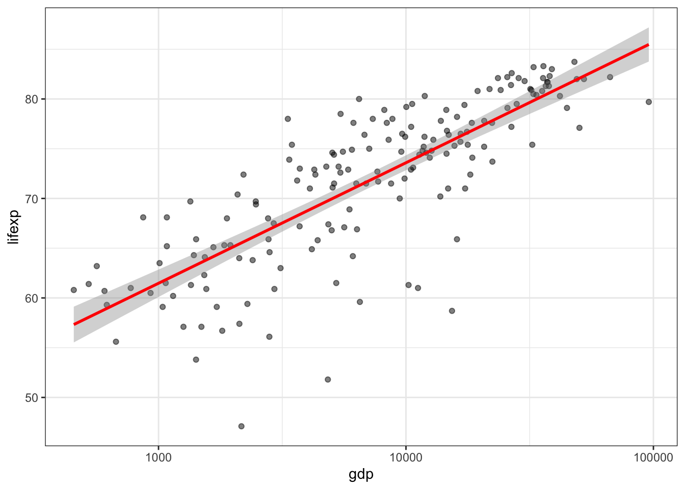


#### Локальная регрессия {#stat_analysis_two_distr_correg_loess}

Метод __локальной регрессии__ изначально был разработан для построения кривых регрессии в случае когда зависимость между переменными ведет себя сложным образом и не может быть описана в терминах традиционной линейной и нелинейной регрессии --- глобальных методов. В этом случае область значений независимой переменной $X$ можно покрыть конечным числом отрезков, для каждого из которых далее находят регрессию традиционным методом — как правило, линейную или квадратичную. 

В классической постановке метод реализуется следующим образом. Пусть дано $N$ точек с координатами $X$ (независимая переменная) и $Y$ (зависимая). Задается число $\alpha$, которое обозначает долю от общего количества точек, которую необходимо выбрать в окрестности каждой из N точек для построения регрессии. То есть для каждой точки $p(x)$ из исходных данных выбираются $\alpha N$ ближайших к ней. Близость определяется как разность координат $X$. Выбранные точки определяют окрестность $p(x)$, в которой будет строиться локальная регрессия. Далее происходит определение параметров линейной или квадратической регрессии взвешенным методом наименьших квадратов. 

При использовании этого метода более близкие к $p(x)$ точки оказывают большее влияние на коэффициенты регрессии. Построенная регрессия дает в точке $x$ сглаженную оценку $p'(x)$ вместо исходной $p(x)$. Процедура повторяется для каждой из $N$ точек. Результирующая кривая соединяет точки $p'(x)$. При этом чем больше значение $\alpha$, тем более сглаженный вид будет иметь кривая регрессии. Метод получил название _LOWESS (Locally weighted scatterplot smoothing)_. В дальнейшем эта аббревиатура была редуцирована до _LOESS_. 

В методе __LOESS__ используются степени регрессии 0, 1, 2. Кубические и более высокие степени полиномов не применяются. При степени равной 0 метод носит название _сглаживающего среднего_. Для построения линии локальной регрессии используйте функцию `geom_smooth()` без параметра `method` или с явным указанием параметра `method = 'loess'`:


```r
ggplot(tabreg, aes(gdp, lifexp)) +
  geom_point(alpha = 0.5) +
  geom_smooth() +
  theme_bw()
```


При визуализации линии локальной регрессии __ggplot__ автоматически добавляет доверительные интервалы, показывающие диапазон нахождения искомой регрессионной кривой с вероятностью 0,95. Вы можете регулировать поведение локальной регрессии, задавая параметры `n`, `span` и `formula`. По умолчанию используется регрессия первой степени (`formula = y ~ x`), значения `n = 80` и `span = 0.75`. Вы можете их изменить, например задать более компактный охват для поиска коэффициентов. В этом случае кривая будет более чувствительна к локальному разбросу элементов выборки:

```r
ggplot(tabreg, aes(gdp, lifexp)) +
  geom_point(alpha = 0.5) +
  geom_smooth(span = 0.3) +
  theme_bw()
```


Вместо координат исходных точек для построения регрессии можно использовать и произвольные координаты $X$. В этом случае кривая будет соединять точки, полученные локальной регрессионной оценкой в заданных координатах $X$. Именно этот принцип используется в двумерном (и многомерном) случае. Пусть даны измерения показателя в $N$ исходных точках и задано число $\alpha$ --- сглаживающий параметр. Тогда аппроксимация показателя в каждом узле интерполяции получается путем построения поверхности тренда (см. выше) по $\alpha N$ ближайшим исходным точкам. Как и в одномерном случае, близкие точки будут оказывать более сильное влияние на коэффициенты регрессии, чем удаленные.

Метод _LOESS_ предоставляет широкие возможности настройки благодаря вариативности параметра сглаживания и степени регрессионного полинома.

## Контрольные вопросы и упражнения {#questions_tasks_stat_analysis}

### Вопросы {#questions_stat_analysis}

1. Перечислите названия геометрий __ggplot2__, отвечающих за построение гистограммы и функции плотности распределения.
1. Как работает метод ядерного сглаживания, используемый для аппроксимации функции плотности распределения? Каким критериям должна отвечать ядерная функция?
1. Как совместить на одном графике гистограмму распределения и функцию плотности вероятности? Какой показатель должна отображать гистограмма высотой столбиков?
1. Можно ли при построении графиков статистического характера определить различные веса для измерений? В какой параметр они должны передаваться? Какому критерию должны отвечать веса?
1. С помощью какой геометрии можно построить диаграмму размаха средствами __ggplot2__? Как следует интерпретировать этот график?
1. Как оценить статистическую значимость отличий в средних значениях и дисперсиях двух выборок? Какие тесты можно использовать для этого?
1. Что из себя представляет плотность совместного распределения двух случайных величин? Какая геометрия __ggplot2__ позволяет аппроксимировать ее и нанести на диаграмму рассеяния?
1. С помощью каких геометрий __ggplot2__ можно сгруппировать элементы диаграммы рассеяния ячейками ортогональной и гексагональной сеток? В каких случаях это оказывается полезно?
1. Что такое коэффициент корреляции Пирсона, и какими ограничениями обладает этот показатель?
1. Какая функция позволяет осуществить тест на корреляцию между двумя переменными в __R__?
1. Что позволяет получить регрессионный анализ?
1. Какой вид имеет уравнение регрессии в общем случае?
1. Какой вид регрессии используется чаще всего?
1. С помощью какого метода находят выборочные коэффициенты регрессии?
1. Что такое формула в __R__, и для чего она используется?
1. Как называется символ `~`, и что он означает в формулах?
1. Каким образов в формуле можно указать алгебраическое преобразование переменной?
1. С помощью какой функции осуществляется оценка параметров линейных регрессионных моделей в __R__?
1. Какие функции позволяют извлечь из модели выборочные коэффициенты регрессии, а также смоделированные (_fitted_) значения?
1. Как на основе полученной модели нанести линию регрессии на график __ggplot2__? Опишите последовательность действий.
1. Можно ли нанести линию регрессии на график __ggplot2__, не используя явное построение модели? Какую геометрию и с какими параметрами следует использовать для этого?
1. Что такое локальная регрессия (_LOESS_), и как работает этот метод?
1. Какая геометрия, и с какими параметрами используется для построения линии локальной регрессии на графике __ggplot2__?
1. Что показывает полупрозрачная серая полоса вокруг линии регрессии на графике __ggplot2__?

### Упражнения {#tasks_stat_analysis}

1. Изучите по данным Gapminder такие показатели как [использование энергии](https://docs.google.com/spreadsheets/d/1StdAfQCYzvpSYQMvLfXkZ1FMKqcRh6BbZ6B-bLARIz8/pub) и [выбросы $CO_2$](https://docs.google.com/spreadsheets/d/1RjqGm7RG82GGVf7E4RXPPwFF7O1So6T0SFx2fVfcUJA/pub) на душу населения. Постройте для них гистограммы и кривые плотности распределения. Какое распределение имеют данные показатели? Как изменилось оно с 1990 к 2010 году? Вычислите коэффициент корреляции между этими показателями и постройте регрессионную зависимость (на 2010 год). Дайте оценку статистической значимости полученных результатов.

2. Изучите по данным Gapminder соотношение [доли сельскохозяйсвенных земель в общей площади](https://docs.google.com/spreadsheets/d/1c2RNsNlhv2kMHrqjl8rpFiVkz6iGu56tWlR3ClgaQ4M/pub) и [доле водозабора на сельскохозяйственные нужды](https://docs.google.com/spreadsheets/d/1qpvu21VCsvz-hYu5s1h0fc-3mRpxvsF1Y2M0Ie3d3CU/pub) за 2002 год. Есть ли какая-то зависимость между этими переменными? Что можно сказать о том, как распределены страны мира по этим двум показателям? Постройте по ним диаграммы размаха, сгруппировав по 4, 6 или 8 регионам Gapminder. Дайте оценку статистической значимости отличий в средних значениях и дисперсии между двумя выбранными вами регионами по доле водозабора на сельскохозяйственные нужды.

----
_Самсонов Т.Е._ **Визуализация и анализ географических данных на языке R.** М.: Географический факультет МГУ, 2019. DOI: [10.5281/zenodo.901911](https://doi.org/10.5281/zenodo.901911)
----
