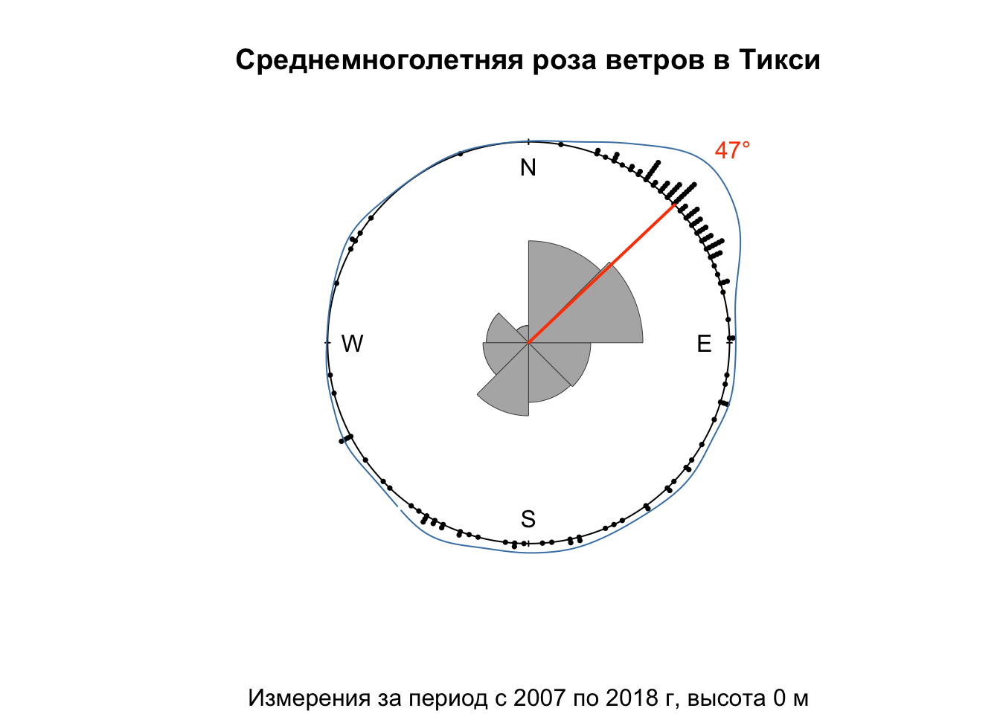
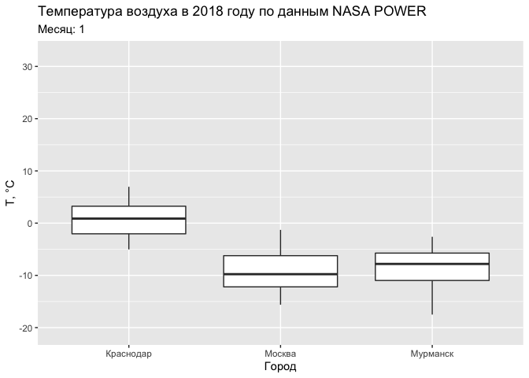
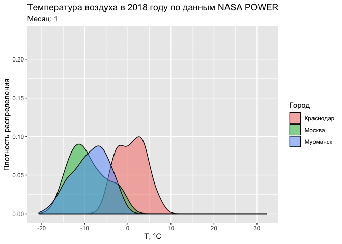
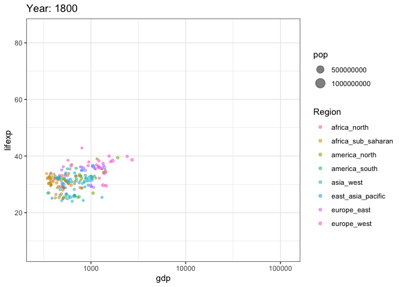

# Статистика направлений и времени {#circular}


## Предварительные требования {#circular_prerequisites}

Для работы по теме текущей лекции вам понадобятся пакеты из __tidyverse__. Помимо этого, необходимы методы круговой статистики из пакетов [__circular__](https://cran.r-project.org/web/packages/circular/) и [__NPCirc__](https://cran.r-project.org/web/packages/NPCirc/index.html), и методы из пакета [__pracma__](https://cran.r-project.org/web/packages/pracma/index.html). 

Для работы с временными данными мы воспользуемся пакетом [__lubridate__](https://lubridate.tidyverse.org/), который входит в __tidyverse__, но автоматически не подключается в сессию. Мы также воспользуемся пакетом [__gganimate__](https://github.com/thomasp85/gganimate), который позволяет анимировать графики, построенные с помощью ggplot:

```r
library(tidyverse)
library(circular)
library(readxl)
library(NPCirc)
library(pracma)
library(lubridate)
library(gganimate)
```

## Статистика направлений {#circular_circ}

### Теория {#circular_circ_theory}

#### Распределение фон Мизеса {#circular_circ_mises}

В географии направления играют огромную роль. Ветер, морские течения, уличная сеть, перелеты птиц --- все эти явления можно охарактеризовать их направленностью. Для того, чтобы эффективно анализировать такие данные, необходимо владеть специализированным математическим аппаратом. 

Обработкой данных о направлениях занимается особая область математической статистики — __статистика направлений__, или __круговая (циркулярная)__ статистика (Mardia, Jupp, 2000; Pewsey et al., 2013). В круговой статистике каждое направление $\theta \in [0, 2\pi)$ представляется в виде вектора $x = (\cos \theta, sin \theta)$. Все операции производятся над подобными векторами и их координатами. Аналогом нормального распределения для круговой случайной величины является распределение фон Мизеса (von Mises, 1918), которое задается функцией плотности вероятности:
$$
f(θ)=\frac{1}{2 \pi I_0(\kappa)} e^{\kappa \cos (\theta - \mu)},
$$

где $\kappa \geq 0$ — параметр концентрации, $\mu$ — среднее значение (для $\kappa > 0$) и 

$$
I_p(\kappa) = \frac{1}{2π} \int_{0}^{2\pi} \cos (p \theta) e^{\kappa \cos θ} d \theta
$$
есть модифицированная функция Бесселя первого рода и порядка $p$. Из формул видно, что по своему эффекту параметр концентрации противоположен среднеквадратическому отклонению $\sigma$, которое является параметром нормального распределения. Чем больше значение $\kappa$, тем более сконцентрировано распределение относительно среднего значения — отсюда идет название этого параметра. Распределение фон Мизеса используется для построения ядра при аппроксимации плотности распределения направлений методом [ядерной оценки](https://en.wikipedia.org/wiki/Kernel_density_estimation) (оценки по методу Парзена-Розенблатта).

> В метеорологии значения $\cos \theta$ и $\sin \theta$ определяют соотношение __зональной__ и __меридиональной__ составляющей скорости [ветра] (для получения самих составляющих их надо умножить на скорость ветра).

#### Вычисление статистических моментов {#circular_circ_stats}

Для вычисления статистических моментов круговой случайной величины требуется найти средний равнодействующий вектор первого порядка:
$$R = (C, S),$$ 

где: 

$$C = \frac{1}{n} \sum_{j=1}^{n} \cos \theta_j,\\ 
S = \frac{1}{n} \sum_{j=1}^{n} \sin \theta_j$$. 

Данный вектор имеет направление $\bar\theta$, которое является __выборочным средним направлением__ исследуемой величины.

__Выборочная средняя равнодействующая длина__ $\bar R = \sqrt{C^2 + S^2}$ принимает значения в диапазоне $[0, 1]$ и показывает меру концентрации направлений относительно $\theta$. $\bar R = 1$ означает, что все исходные направления совпадают, $\bar R = 0$ --- что данные равномерно распределены по кругу, либо распределение имеет несколько мод, которые уравновешивают друг друга. 

Величина $\bar R$ дает важную информацию для предварительной диагностики картины направлений. Если значение $\bar R$ близко к единице, это означает, что распределение является унимодальным и в качестве основного направления можно принять значение $\bar θ$ [@mardia2000directional]. 

__Стандартное отклонение направлений__ $v$ в радианах может быть найдено как $v=\sqrt{-2 \ln \bar R}$ .

В ряде случаев противоположные направления считаются эквивалентными. Например, нельзя сказать, идет ли улица с юга на север или с севера на юг. Такие данные в теории круговой статистики называются __аксиальными__ (Mardia, Jupp, 2000). Для аксиальных данных возможный диапазон значений лежит в интервале $[0, \pi)$. Поскольку методы круговой статистики рассчитаны на круговое замыкание данных, стандартный подход к обработке аксиальных данных предполагает переход от направлений к их удвоенным значениям $\theta' = 2\theta$, обработку полученных значений стандартными методами и отображение полученных значение обратно на интервал $[0, \pi)$. Для среднего, медианы и моды распределения это означает простое деление полученного значения пополам [@pewsey2013circular].

#### Определение модальных направлений {#circular_circ_modes}

Модальные направления могут быть определены как по гистограмме распределения, так и методом ядерной оценки. Основной вопрос поиска эффективного ядра заключается в параметризации функции $K$. Для распределения фон Мизеса таким параметром является концентрация $\kappa$. Чем больше этот параметр, тем более локализованной будет оценка, тем сильнее будут проявляться в ней существующие моды распределения, но также будут и выделяться новые моды, которые на самом деле не значимы. Малые значения $\kappa$ приведут, наоборот, к «размыванию» плотности распределения в пределах полного круга. Как и в случае с количеством интервалов гистограммы, избыточно малые и большие значения κ нежелательны. 

В работе [@Oliveira2012] показано, что оптимальное значение $\kappa$ может быть подобрано также для оценки распределений, являющихся конечной суммой $M$ распределений фон Мизеса, то есть, мультимодальных распределений, имеющих плотность :
$$
g(\theta)=\sum_{i=1}^{M} \alpha_i \frac{\exp\lbrace{\kappa_i \cos(\theta - \mu_i)\rbrace}}{2 \pi I_0 (\kappa_i)},
$$
где $\sum_{i=1}^{M} = 1$.

Поскольку в результате подбора определяется не только параметр концентрации, но и число компонент в сумме распределений [@Oliveira2014], его можно также использовать для определения количества искомых мод, если это необходимо. 

Когда подобрана функция ядра и ее параметры, оценка плотности распределения (вычисление функции $\circ f _h (x)$) для круговых данных делается либо для исходных направлений $\theta_j$, либо с равным (достаточно малым) интервалом — например, через 1 градус [@pewsey2013circular]. После того как произведена оценка, могут быть выбраны направления, в которых функция плотности распределения достигает локального максимума — первого и второго по величине.  Эти направления и будут соответствовать первой и второй моде распределения направлений.

### Практика {#circular_circ_vis}

В практической части данного раздела мы будем работать с массивом среднемесячных значений метеопараметров в пограничном слое атмосферы по полярным аэрологическим обсерваториям России. Массив данных ежемесячно обновляется на [портале Аисори-М](http://aisori-m.meteo.ru) [__ВНИИГМИ-МЦД__](http://meteo.ru/). 

В системе доступны данные по следующим обсерваториям:

```r
obs = readxl::read_excel('data/bound/scheme.xlsx', 2)
```

 Индекс  Название           Широта   Долгота
-------  ----------------  -------  --------
  20674  Остров Диксон       73.50     80.42
  21824  Тикси               71.35    128.55
  22113  Мурманск            68.59     33.07
  22217  Кандалакша          67.09     32.21
  22271  Шойна               67.53     44.09
  23078  Норильск            69.20     88.18
  23205  Нарьян-Мар          67.39     53.07
  23330  Салехард            66.32     66.40
  24125  Оленек              68.31    112.26
  24266  Верхоянск           67.55    133.38
  24343  Жиганск             66.46    123.21
  89512  Новолазаревская    -70.75     11.83
  89592  Мирный             -66.65     19.71

Для каждой обсерватории даны следующие параметры:


Призначная часть/ метеоэлемент/число наблюдений                              Обозначение    Число цифр  Единицы измерения   Константа отсутствия 
---------------------------------------------------------------------------  ------------  -----------  ------------------  ---------------------
Индекс станции                                                               INDEX                   5  -                   нет                  
Год                                                                          GGGG                    5  -                   нет                  
Месяц                                                                        MM                      3  -                   нет                  
Срок                                                                         HH                      3  GMT                 нет                  
Стандартное значение высоты                                                  Z                       6  м                   нет                  
Среднемесячные значения давления                                             MP                      6  10·гПа              -9999                
Среднеквадратические отклонения давления                                     SP                      6  10·гПа              -9999                
Число наблюдений для давления                                                NP                      3  -                   нет                  
Среднемесячные значения температуры                                          MT                      6  10·°C               -9999                
Среднеквадратические отклонения температуры                                  ST                      6  10·°C               -9999                
Число наблюдений для температуры                                             NT                      3  -                   нет                  
Среднемесячные значения дефицита точки росы                                  MD                      6  10·°C               -9999                
Среднеквадратические отклонения дефицита точки росы                          SD                      6  10·°C               -9999                
Число наблюдений для дефицита точки росы                                     ND                      3  -                   нет                  
Среднемесячные значения скалярной скорости ветра                             MS                      6  10·м/с              -9999                
Среднеквадратические отклонения скалярной скорости ветра                     SS                      6  10·м/с              -9999                
Число наблюдений для скалярной скорости ветра                                NS                      3  -                   нет                  
Среднемесячные значения зональной составляющей скорости ветра                MU                      6  10·м/с              -9999                
Среднеквадратические отклонения зональной составляющей скорости ветра        SU                      6  10·м/с              -9999                
Число наблюдений для зональной составляющей скорости ветра                   NU                      3  -                   нет                  
Среднемесячные значения меридиональной составляющей скорости ветра           MV                      6  10·м/с              -9999                
Среднеквадратические отклонения меридиональной составляющей скорости ветра   SV                      6  10·м/с              -9999                
Число наблюдений для меридиональной составляющей скорости ветра              NV                      3  -                   нет                  

Загрузим данные по всем обсерваториям из текстовых файлов в папке _bound_:

```r
files = paste('data/bound', list.files('data/bound', "*.txt"), sep = '/')

(tab = lapply(files, function(X) {
    readr::read_table(X, col_names = params$Обозначение)
  }) %>% 
  bind_rows() %>% 
  left_join(obs, by = c('INDEX' = 'Индекс'))) # присоединим информацию о названиях станций
## # A tibble: 77,073 x 26
##    INDEX  GGGG    MM    HH     Z    MP    SP    NP    MT    ST    NT    MD
##    <dbl> <dbl> <dbl> <dbl> <dbl> <dbl> <dbl> <dbl> <dbl> <dbl> <dbl> <dbl>
##  1 20674  2007     1     0  2000  7629    78    27  -187    35    27    53
##  2 20674  2007     1     0  1900  7732    79    27  -182    36    27    52
##  3 20674  2007     1     0  1800  7836    79    27  -178    36    27    51
##  4 20674  2007     1     0  1700  7942    80    27  -173    36    27    49
##  5 20674  2007     1     0  1600  8048    81    27  -168    36    27    48
##  6 20674  2007     1     0  1500  8157    81    27  -164    38    27    47
##  7 20674  2007     1     0  1400  8266    82    27  -160    39    27    45
##  8 20674  2007     1     0  1300  8376    82    27  -156    39    27    43
##  9 20674  2007     1     0  1200  8488    83    27  -152    40    27    40
## 10 20674  2007     1     0  1100  8601    83    27  -148    41    27    37
## # … with 77,063 more rows, and 14 more variables: SD <dbl>, ND <dbl>,
## #   MS <dbl>, SS <dbl>, NS <dbl>, MU <dbl>, SU <dbl>, NU <dbl>, MV <dbl>,
## #   SV <dbl>, NV <dbl>, Название <chr>, Широта <dbl>, Долгота <dbl>
```

Создадим объект типа `circular` (из пакета __circular__) с направлениями ветра для анализа, и запишем его в новую переменую таблицы. Предварительно определим вспомогательную функцию, вычисляющую географический азимут на основе компонент скорости:

```r
geo_azimuth = function(dx, dy) {
  a = atan2(dx, dy)
  ifelse(a <= pi/2, pi/2 - a,  5*pi/2 - a)
}

(winds = tab %>% 
  mutate(wind = circular(geo_azimuth(MV, MU), template = 'geographics')) %>% 
  select(INDEX, name = Название, GGGG, MM, HH, Z, MU, MV, SS, wind))
## # A tibble: 77,073 x 10
##    INDEX name           GGGG    MM    HH     Z    MU    MV    SS wind      
##    <dbl> <chr>         <dbl> <dbl> <dbl> <dbl> <dbl> <dbl> <dbl> <circular>
##  1 20674 Остров Диксон  2007     1     0  2000    33    31    45 0.8166380 
##  2 20674 Остров Диксон  2007     1     0  1900    32    32    45 0.7853982 
##  3 20674 Остров Диксон  2007     1     0  1800    30    33    46 0.7378151 
##  4 20674 Остров Диксон  2007     1     0  1700    29    35    47 0.6919214 
##  5 20674 Остров Диксон  2007     1     0  1600    28    38    49 0.6350267 
##  6 20674 Остров Диксон  2007     1     0  1500    26    40    50 0.5763752 
##  7 20674 Остров Диксон  2007     1     0  1400    25    41    51 0.5475622 
##  8 20674 Остров Диксон  2007     1     0  1300    25    42    54 0.5369107 
##  9 20674 Остров Диксон  2007     1     0  1200    24    45    56 0.4899573 
## 10 20674 Остров Диксон  2007     1     0  1100    24    49    58 0.4554511 
## # … with 77,063 more rows
```

Выберем данные по высоте 0 метров за 12 часов дня для поселка Тикси, сохранив только составляющие скорости и ее скалярную величину:

```r
(tiksi_wind = winds %>% filter(name == 'Тикси', HH == 12, Z == 0))
## # A tibble: 136 x 10
##    INDEX name   GGGG    MM    HH     Z    MU    MV    SS wind      
##    <dbl> <chr> <dbl> <dbl> <dbl> <dbl> <dbl> <dbl> <dbl> <circular>
##  1 21824 Тикси  2007     1    12     0    36    35    48 0.7994817 
##  2 21824 Тикси  2007     2    12     0    16    11    27 0.9685090 
##  3 21824 Тикси  2007     3    12     0    23    22    34 0.8076167 
##  4 21824 Тикси  2007     4    12     0    17     9    30 1.0838971 
##  5 21824 Тикси  2007     5    12     0   -17    -3    34 4.5377168 
##  6 21824 Тикси  2007     6    12     0   -23   -25    27 3.8853482 
##  7 21824 Тикси  2007     7    12     0    -5   -11    27 3.5682201 
##  8 21824 Тикси  2007     8    12     0     4     5    25 0.6747409 
##  9 21824 Тикси  2007     9    12     0    24    14    34 1.0427219 
## 10 21824 Тикси  2007    10    12     0    41    47    40 0.7173217 
## # … with 126 more rows
```

Отобразим распределение направлений, розу-диаграмму и плотность распределения. Для построени графиков используем функции `plot.circular()` и `rose.diag` из пакета __circular__. Для аппроксимации плотности распределения направлений воспользуемся функцией `kern.den.circ()` из пакета __NPCirc__. Эта функция использует функцию плотности распределения _фон Мизеса_ в качестве ядра и по умолчанию разбивает круг на 250 направлений, по которым производится оценка плотности (при необходимости это значение можно изменить в параметре `len`):

```r
plot.circular(tiksi_wind$wind, 
     cex = 0.5, 
     stack = TRUE, 
     sep = 0.035,
     axes = FALSE,
     main = 'Среднемноголетняя роза ветров в Тикси',
     sub = 'Измерения за период с 2007 по 2018 г, высота 0 м')

rose.diag(tiksi_wind$wind, 
          bins = 8, 
          col = 'gray70',
          border = 'gray30',
          prop = 1, 
          add = TRUE, 
          tick = FALSE,
          lwd = 0.5)

kden = kern.den.circ(tiksi_wind$wind)

lines(kden, shrink = 3, # параметр shrink отвечает за масштаб радиус-вектора
      join = F,
      col = 'steelblue')
```


> Параметр `shrink` отвечает за масштаб радиус-вектора на графиках из пакета __circular__. Чем больше его величина, тем сильнее будет сжат график относительно центра круга.

Так же как и в случае с обычными данными, плотность распределения удобно использовать для определения модальных направлений, то есть наиболее часто встречающихся. Для этого воспользуемся функцией `findpeaks()` из пакета __pracma__:

```r
peak = findpeaks(kden$y, sortstr = T)[1,2] # находим индекс самого высокого пика плотности распределения

(modal = kden$x[peak]) # извлекаем сам угол
## Circular Data: 
## Type = angles 
## Units = radians 
## Template = geographics 
## Modulo = asis 
## Zero = 1.570796 
## Rotation = clock 
## [1] 0.813786

# раскладываем на составляющие для отрисовки линии
xp = sin(modal)
yp = cos(modal)

plot.circular(tiksi_wind$wind, 
     cex = 0.5, 
     stack = TRUE, 
     sep = 0.035,
     axes = FALSE,
     main = 'Среднемноголетняя роза ветров в Тикси',
     sub = 'Измерения за период с 2007 по 2018 г, высота 0 м')

rose.diag(tiksi_wind$wind, 
          bins = 8, 
          col = 'gray70',
          border = 'gray30',
          prop = 1, 
          add = TRUE, 
          tick = FALSE,
          lwd = 0.5)

lines(kden, shrink = 3, 
      join = F, col = 'steelblue')

lines(c(0, xp), c(0, yp),
      lwd = 2, col = 'orangered')

text(x = 1.4 * xp, y = 1.4 * yp, 
     col = 'orangered',
     labels = paste0(round(180 * modal / pi, 0), '°')) # приводим к целым градусам
```



Проведем анализ направлений для всех станций. Для этого рассчитаем функции плотности распределения и разместим их в новом фрейме данных с лист-колонкой.

> __Лист-колонка__ (_list-column_) позволяет хранить в ячейках таблицы данные произвольного типа. В частности, используя лист-колонку, вы можете хранить в каждой ячейке не один объект, а множество объектов, например записать в нее вектор. Лист-колонка имеет тип `list`, и каждая ячейка в этой колонке так же, соответственно, имеет тип `list`. Что (и в каком количестве) располагать внутри ячейки --- уже ваше дело. Лист-колонки оказываются неожиданно удобны в самых разнообразных сценариях, в том числе для представления статистических моделей (соответствующих каждой строке таблицы) и для хранения пространственных данных (об этом --- в следующей лекции). Вместо хранения этих данных в отдельных переменных вы можете записать их в ячейки.

В приведенном ниже коде мы группируем все измерения по имени аэрологической обсерватории, вычисляем вектор плотности распределения, записываем его в список, и этот список уже помещается функцией `summarise()` в _единственную_ ячейку столбца _kden_, соответствующую данной аэрологической станции. Далее полученная лист-колонка используется для нахождения модальных значений (тут оказывается полезно знание функционалов семейства `apply`):

```r
(dens = winds %>% 
  filter(HH == 12, Z == 0) %>%
  group_by(name) %>% 
  summarise(kden = list(kern.den.circ(wind))) %>% 
  mutate(peak = sapply(kden, function(X) {
                  peak = findpeaks(X$y, sortstr = T)[1,2]
                  X$x[peak]
                })
  )
)
## # A tibble: 13 x 3
##    name            kden         peak
##    <chr>           <list>      <dbl>
##  1 Верхоянск       <dnsty.cr> -2.97 
##  2 Жиганск         <dnsty.cr> -3.20 
##  3 Кандалакша      <dnsty.cr> -0.347
##  4 Мирный          <dnsty.cr> -0.826
##  5 Мурманск        <dnsty.cr>  0.814
##  6 Нарьян-Мар      <dnsty.cr>  1.04 
##  7 Новолазаревская <dnsty.cr> -0.902
##  8 Норильск        <dnsty.cr> -0.877
##  9 Оленек          <dnsty.cr> -3.48 
## 10 Остров Диксон   <dnsty.cr> -0.145
## 11 Салехард        <dnsty.cr> -2.82 
## 12 Тикси           <dnsty.cr>  0.814
## 13 Шойна           <dnsty.cr>  0.561
```

После этого построим розы-диаграммы для всех станций. В данном случае оправдано использование обычного цикла, т.к. итераций немного:

```r
# устанавливаем параметры компоновки
par(mar = c(1,1,1,1),
    mfrow = c(1,2))

# строим графики в цикле
for (obs_name in dens$name) {
  
  wind_df = winds %>% filter(name == obs_name, HH == 12, Z == 0)
  dens_df = dens %>% filter(name == obs_name)
  
  modal = dens_df$peak

  xp = sin(modal)
  yp = cos(modal)
  
  plot.circular(wind_df$wind, 
       shrink = 1.2,
       cex = 0.5, 
       stack = TRUE, 
       sep = 0.035,
       axes = FALSE,
       main = obs_name)
  
  rose.diag(wind_df$wind, 
            bins = 8, 
            col = 'gray70',
            border = 'gray30',
            prop = 1, 
            add = TRUE, 
            tick = FALSE,
            lwd = 0.5)
  
  lines(dens_df$kden[[1]], 
        shrink = 3, join=F,
        col = 'steelblue')
  
  lines(c(0, xp), c(0, yp),
        lwd = 2, col = 'orangered')
  
  text(x = 1.4 * xp, y = 1.4 * yp, 
       col = 'orangered',
       labels = paste0(round(180 * modal / pi, 0), '°')) # приводим к целым градусам
}
```


Таким образом, мы провели графический и статистический анализ среднемноголетних направлений ветра по данным полярных аэрологических станций России. Выявлены модальные направлений, выполнена аппроксимация функции плотности вероятности направлений ветра.

### Статистические тесты {#circular_tests}

### Корреляция и регрессия {#circular_correlation}

Существуют методы расчета показателей связи между двумя переменными, по крайней мере одна из которых является циркулярной (или сферической, если положение задается двумя углами). Их можно поделить на три большие группы, в зависимости от того, какая из переменных отвечает за направление:

- линейная—циркулярная;
- циркулярная—циркулярная;
- сферическая—сферическая;

## Статистика временных данных {#circular_time}

### Работа с датами в lubridate {#circular_time_lubridate}


```r
library(lubridate)
```


### Проверка гипотез {#circular_time_tests}

### Анимация {#circular_time_animation}

Анимационная графика возволяет наглядно визуализировать изменения. Наиболее часто речь идет об изменениях по времени. В этом случае время работает в роли невидимой переменной, которая влияет на положение графических примитивов на изображении. Данный подход органично вписывается в концепцию грамматики графики, на основе которой построен пакет __ggplot2__ (см. Главу \@ref(advgraphics)). Соответствующую реализацию грамматики анимаций предоставляет пакет [__gganimate__](https://gganimate.com/)[@R-gganimate].

Возможности анимаций в __gganimate__ реализуются посредством добавления новых грамматик к построенному графику __ggplot2__. К числу этих грамматик относятся:

- `transition_*()` — распределение данных по времени;
- `view_*()` — поведение осей координат во времени;
- `shadow_*()` — отображение данных, не относящихся к текущему временному срезу;
- `enter_*()/exit_*()` — характер появления/исчезновения данных в процессе анимации;
- `ease_aes()` — порядок смягчения (интерполяции) графических переменных в моменты перехода.

В качестве первого примера используем уже знакомые нам данные реанализа NASA POWER суточного осреднения, выгрузив информацию по точкам в трех городах (Мурманск, Москва, Краснодар) за 2018 год:

```r
library(nasapower)
library(ggplot2)

cities = list(
  Мурманск = c(33, 69),
  Москва = c(38, 56),
  Краснодар = c(39, 45)
)

tab = purrr::imap(cities, function(coords, city){
  get_power(
    community = "AG",
    lonlat = coords,
    pars = c("RH2M", "T2M", "PRECTOT"),
    dates = c("2018-01-01", "2018-12-31"),
    temporal_average = "DAILY"
  ) %>% mutate(CITY = city,
               MONTH = month(YYYYMMDD))
}) %>% bind_rows()
```

Рассмотрим колебания температуры по 12 месяцам посредством диаграммы размаха:

```r
ggplot(tab, aes(CITY, T2M)) +
  geom_boxplot() +
  labs(title = "Температура воздуха в 2018 году по данным NASA POWER",
       subtitle = 'Месяц: {round(frame_time)}') +
  xlab('Город') +
  ylab('Т, °С') +
  transition_time(MONTH)
```

<!-- -->

Аналогичную анимацию можно провести и на примере функции плотности распределения:

```r
ggplot(tab, aes(T2M, fill = CITY)) +
  geom_density(alpha = 0.5) +
  labs(title = "Температура воздуха в 2018 году по данным NASA POWER",
       subtitle = 'Месяц: {round(frame_time)}',
       fill = 'Город') +
  xlab('Т, °С') +
  ylab('Плотность распределения') +
  transition_time(MONTH)
```

<!-- -->

Загрузим ранее использованные в Главе \@ref(stat_analysis) данные Gapminder по соотношению продолжительности жизни и ВВП на душу населения, но на этот раз не будем фильтровать их по времени:

```r
library(readxl)
library(googledrive)
library(googlesheets4)
countries = read_excel('data/gapminder.xlsx', 2) %>%
  select(Country = name, Region = eight_regions) %>%
  mutate(Country = factor(Country, levels = Country[order(.$Region)]))

gdpdf_tidy = '1cxtzRRN6ldjSGoDzFHkB8vqPavq1iOTMElGewQnmHgg' %>% ### ВВП на душу населения
  as_id() %>% # преобразуем идентификатор в класс drive_id чтобы отличать его от пути
  drive_get() %>% 
  read_sheet() %>% 
  pivot_longer(cols = `1764`:`2018`, names_to = 'year', values_to = 'gdp') %>% 
  rename(Country = 1)
## Using an auto-discovered, cached token.
## To suppress this message, modify your code or options to clearly consent to the use of a cached token.
## See gargle's "Non-interactive auth" vignette for more details:
## https://gargle.r-lib.org/articles/non-interactive-auth.html
## The googledrive package is using a cached token for iamste@yandex.ru.
## Using an auto-discovered, cached token.
## To suppress this message, modify your code or options to clearly consent to the use of a cached token.
## See gargle's "Non-interactive auth" vignette for more details:
## https://gargle.r-lib.org/articles/non-interactive-auth.html
## The googlesheets4 package is using a cached token for iamste@yandex.ru.

popdf_tidy = '1IbDM8z5XicMIXgr93FPwjgwoTTKMuyLfzU6cQrGZzH8' %>% # численность населения
  as_id() %>% # преобразуем идентификатор в класс drive_id чтобы отличать его от пути
  drive_get() %>% 
  read_sheet() %>% # первый лист
  pivot_longer(cols = `1800`:`2015`, names_to = 'year', values_to = 'pop') %>% 
  rename(Country = 1)

lifedf_tidy = '1H3nzTwbn8z4lJ5gJ_WfDgCeGEXK3PVGcNjQ_U5og8eo' %>% # продолжительность жизни
  as_id() %>% # преобразуем идентификатор в класс drive_id чтобы отличать его от пути
  drive_get() %>% 
  read_sheet() %>% 
  pivot_longer(cols = `1800`:`2016`, names_to = 'year', values_to = 'lifexp') %>% 
  rename(Country = 1)

tab = gdpdf_tidy %>% 
  inner_join(lifedf_tidy) %>% 
  inner_join(popdf_tidy) %>% 
  inner_join(countries) %>% 
  mutate(year = as.integer(year)) %>% 
  drop_na()
```

Теперь чтобы отобразить это соотношение в виде анимации, достаточно добавить новый переход посредством функции `transition_time()`:

```r
options(scipen = 999) # убираем экспоненциальную форму записи числа
ggplot(tab, aes(gdp, lifexp, size = pop, color = Region)) +
  geom_point(alpha = 0.5) +
  scale_x_log10() +
  labs(title = 'Year: {round(frame_time)}') +
  theme_bw() +
  transition_time(year)
```
<!-- -->

## Контрольные вопросы и упражнения {#questions_tasks_circular}

### Вопросы {#questions_circular}

1. В каком виде направления рассматриваются в круговой статистике?
1. Какое распределение является аналогом нормального распределения для круговых данных? Что означают параметры $\kappa$ и $\mu$ в функции этого распределения?
1. Как вычисляется равнодействующий вектор первого порядка и выборочная средняя равнодействующая длина этого вектора для направлений?
1. Чем аксиальные данные отличаются от круговых данных в общем случае? Какие преобразования осуществляются над такими данными для того чтобы применять к ним стандартные методы циркулярной статистики?
1. Какой класс данных (и пакет) можно использовать в R для представления направлений? Как указать, что направления отсчитываются географическим методом, то есть, по часовой стрелки от направления на север?
1. Какую функцию можно использовать для для оценки плотности распределения круговых данных? В каком пакете она находится?
1. Какую функцию можно использовать для выявления модальных направлений по данным функции плотности вероятности?
1. Какие функции позволяют строить диаграммы и розы-диаграммы по круговым данным в среде R?
1. Какой параметр управляет масштабом радиус-вектора на круговых графиках?
1. Что такое лист-колонка в фрейме данных, и какого типа данные можно в ней хранить?

### Упражнения {#tasks_circular}

----
_Самсонов Т.Е._ **Визуализация и анализ географических данных на языке R.** М.: Географический факультет МГУ, 2019. DOI: [10.5281/zenodo.901911](https://doi.org/10.5281/zenodo.901911)
----
