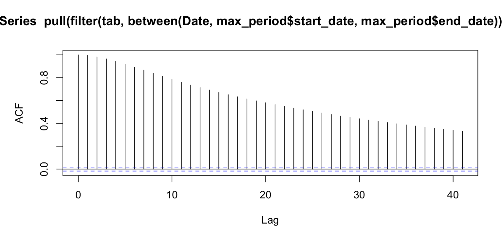
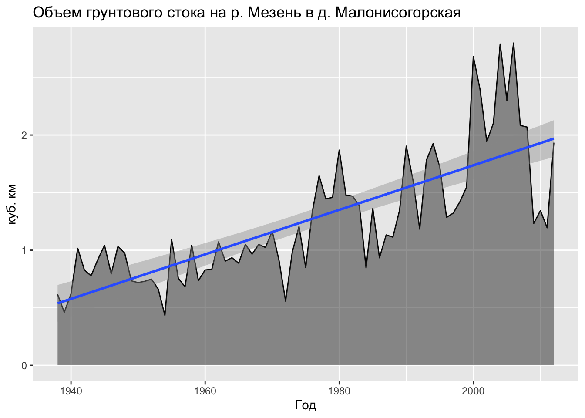
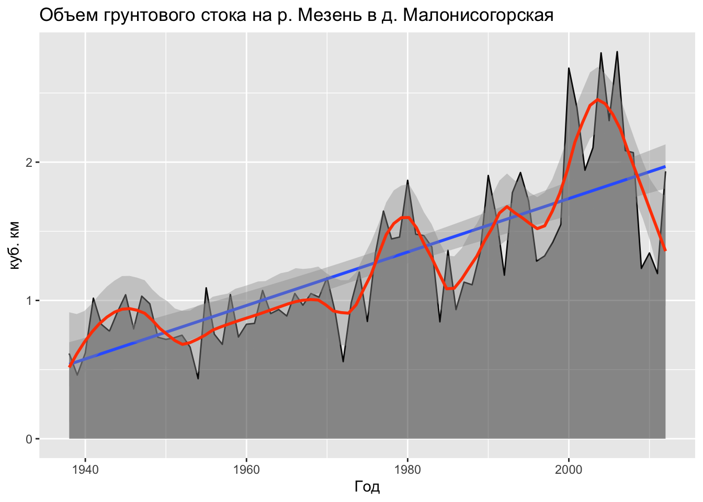
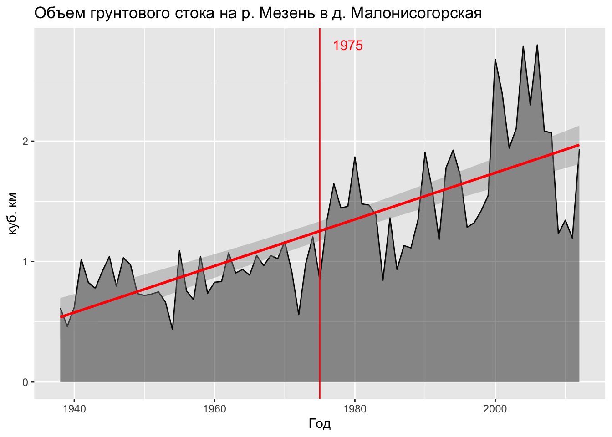

# Временные ряды {#temporal}


## Предварительные требования {#temporal_prerequisites}

Для работы по теме текущей лекции вам понадобятся пакеты из __tidyverse__. Для работы с временными данными мы воспользуемся пакетом [__lubridate__](https://lubridate.tidyverse.org/), который входит в __tidyverse__, но автоматически не подключается в сессию. Мы также воспользуемся пакетом [__gganimate__](https://github.com/thomasp85/gganimate), который позволяет анимировать графики, построенные с помощью ggplot:

```r
library(tidyverse)
library(readxl)
library(lubridate)
library(gganimate)
```

## Создание и преобразование дат и времени {#temporal_lubridate}

Напомним, что текущее время и дату можно получить с помощью системных функций `Sys.Date()` и `Sys.time()`:


```r
(date = Sys.Date())
## [1] "2021-10-25"
(time = Sys.time())
## [1] "2021-10-25 21:34:13 MSK"
```

Полученные объекты имеют типы `Date` и `POSIXct`:

```r
class(date)
## [1] "Date"
class(time)
## [1] "POSIXct" "POSIXt"
```
Несмотря на то, что время и даты печатаются на экран в виде человекочитаемых строк, их внутреннее представление выражается в количестве дней (для дат) и секунд (для времени в форммате `POSIXct`) начиная с некоторой точки отсчета. Такой точкой отсчета по умолчанию является начало эпохи UNIX, соответстующее $1$ января $1970$ года по гринвичскому (_UTC_) времени. Чтобы убедиться в этом, воспользуемся функцией `difftime`, доступной в базовом __R__:


```r
as.integer(date)
## [1] 18925
difftime(date, as.Date('1970-01-01'))
## Time difference of 18925 days

as.integer(time)
## [1] 1635186853
difftime(time, as.POSIXct('1970-01-01 00:00:00', tz = 'UTC'), units = 'secs')
## Time difference of 1635186854 secs
```

Работа с датами и временем может быть достаточно утомительной при отсутствии специализированных средств. Пакет [__lubridate__](https://lubridate.tidyverse.org/)[@R-lubridate] значительно облегчает эту работу. Основные функции lubridate включают синтаксический разбор ("парсинг") дат в разных форматах, извлечение разных компонент даты и времени (секунд, минут, часов, суток, недель, годов), вычисление разностей и периодов, а  также множество вспомогательных функций (хелперов), облегачающих преобразование временных данных.

Рассмотрим базовые возможности пакета на нескольких примерах.

__Создание__ дат возможно на основе целочисленных и строковых значений:

```r
library(lubridate)

ymd(20150515)
## [1] "2015-05-15"
dmy('15052015')
## [1] "2015-05-15"
```

Для создания отметки времени необходимо сформировать строку, которая можети быть интерпретирована должным образом. При необходимости указывается часовой пояс:

```r
ymd_hms('2015-05-15 22:15:34') # по умолчанию Гринвичское время
## [1] "2015-05-15 22:15:34 UTC"
ymd_hms('2015-05-15 22:15:34', tz = "Europe/Moscow")
## [1] "2015-05-15 22:15:34 MSK"
```

__Извлечение__ компоненты даты/времени — одна из самых удобных и востребованных функций lubridate. С помощью этих функций вы можете вытащить из объекта год, месяц, неделю, день, час и секунду:

```r
year(time)
## [1] 2021
month(time)
## [1] 10
week(time)
## [1] 43
day(time)
## [1] 25
hour(time)
## [1] 21
second(time)
## [1] 13.52371
```
Обратите внимание на то, что недели отсчитываются от начала года, а не месяца. 

Отдельно следует отметить функцию `yday()`, которая позволяет определить номер дня в году:

```r
yday(date)
## [1] 298
```

__Замена__ компонент даты/времени осуществляется с использованием тех же функций. Например, если мы хотим то же число и время, но за другой (заранее известный) год и месяц, мы можем заменить соответствующие компоненты, используя оператор `<-`:

```r
year(time) <- 2015
month(time) <- 01
time
## [1] "2015-01-25 21:34:13 MSK"
```

__Округление__ дат и времени выполняется с помощью функций `round_date()`, `floor_date()` и `ceiling_date()` соответственно. Например, получить первый день в текущем году можно так:

```r
floor_date(Sys.Date(), unit = 'year')
## [1] "2021-01-01"
```

__Периоды__  (_periods_) — это промежутки дат, выраженные в годах, месяцах или днях. Их удобно использовать для того чтобы сместить текущую дату на заданный интервал. Например, к ранее определенной дате можно прибавить 1 год, 4 месяца, 3 недели и 2 дня:

```r
date
## [1] "2021-10-25"
date + years(1) + months(4) + weeks(3) + days(2)
## [1] "2023-03-20"
```

__Длительности__ (_durations_) — это промежутки времени, выраженные в секундах. Работают они в целом аналогично периодам:

```r
dweeks(1)
## [1] "604800s (~1 weeks)"
time
## [1] "2015-01-25 21:34:13 MSK"
time + dweeks(1)
## [1] "2015-02-01 21:34:13 MSK"
time + weeks(1)
## [1] "2015-02-01 21:34:13 MSK"
```

__Интервалы__ — это отрезки между двумя датами. Интервал можно преобразовывать в периоды и длительности:

```r
(int = interval(Sys.time(), time))
## [1] 2021-10-25 21:34:13 MSK--2015-01-25 21:34:13 MSK
as.period(int, 'days')
## [1] "-2465d 0H 0M -0.149910926818848S"
as.duration(int)
## [1] "-212976000.149911s (~-6.75 years)"
```

## Восстановление пропусков и проверка корректности дат {#temporal_complete}

Данные во временных рядах часто соответствуют _равноотстоящим по времени_ срезам (раз в несколько часов, раз в день, раз в три месяца и т.д.), что обусловлено регулярным характером сбора информации (наблюдения, предоставление отчетности и т.д.). Соответствующее предположение лежит и в основе многих функций временного анализа (таких как автокорреляционная функция). Если в данных отсутствуют некоторые временные срезы, это нарушает регулярность временного ряда, что может привести к его некорректной интерпретации. Необходимо восстановить пропущенные сроки, явным образом указав, что данных на эти сроки нет. 

Помимо этого, дата может быть записана в _некорректной_ форме. Например, оператор ввода данных перепутал месяц и день 18 марта, что привело к созданию несуществующей даты 03.18 в одной из строк.

Подобные несовершенства временных рядов важно выявить на самых ранних стадиях анализа данных. Рассмотрим, как эту задачу можно решить средствами R. В качестве источника данных будем использовать данные^[Данные предоставлены кафедрой гидрологии суши Географического факультета МГУ имени М.В.Ломоносова] об уровне воды на гидропосте Паялка (р. Умба, Мурманская область) с 1932 по 2014 год. Отсутствие информации в файле данных закодировано числом `9999`:

```r
(src = read_delim('data/in_Umba.txt', delim = ' ', 
                 col_names = c('day', 'month', 'year', 'level'), na = '9999'))
## # A tibble: 30,316 × 4
##      day month  year level
##    <dbl> <dbl> <dbl> <dbl>
##  1     1     1  1932  49.4
##  2     2     1  1932  NA  
##  3     3     1  1932  NA  
##  4     4     1  1932  NA  
##  5     5     1  1932  NA  
##  6     6     1  1932  NA  
##  7     7     1  1932  NA  
##  8     8     1  1932  NA  
##  9     9     1  1932  NA  
## 10    10     1  1932  47  
## # … with 30,306 more rows
```

Сформируем даты на основе первых трёх столбцов и проверим, все ли из них корректны. Если компоненты даты некорректны, то функция `yms()` вернет `NA`:

```r
tab = src %>%
    mutate(Date = ymd(paste(year, month, day)))

tab %>% 
  dplyr::filter(is.na(Date))
## # A tibble: 1 × 5
##     day month  year level Date  
##   <dbl> <dbl> <dbl> <dbl> <date>
## 1    29     2  1941  27.4 NA
```

Проверка показала, что преобразование в дату оказалось невозможно только для одной строки. В этой строке оператором была введена несуществующая дата — 29 февраля 1941 года. Этот год не является високосным, а значит количество дней в феврале должно равняться 28. Единственный выход в данной ситуациии — отбраковать запись:

```r
tab = tab %>% 
  dplyr::filter(!is.na(Date))
```

После того как мы убедились, что в таблице присутствуют только корректные даты, можно проверять пропуски дат. Для этого упорядочим таблицу по возрастанию дат и используем функцию `lag()` из пакета __dplyr__, чтобы вычислить разницу между каждой датой и ее предшественницей. После этого отфильтруем строки, которым предшествует 1 или более пропущенных дней и сформируем отчетную таблицу, содержащую все найденные пропуски:

```r
tab %>% 
  arrange(Date) %>% 
  mutate(Gap = Date - lag(Date, 1) - 1) %>% 
  dplyr::filter(Gap > 0) %>% 
  transmute(start_date = Date - Gap,
            end_date = Date - 1,
            duration = Gap)
## # A tibble: 1 × 3
##   start_date end_date   duration
##   <date>     <date>     <drtn>  
## 1 1941-12-31 1942-01-01 2 days
```

Данная таблица говорит нам о том, что имеется один пропуск из двух дат: 31 декабря 1941 года и 01 января 1942 года. Чтобы восстановить пропущенные сроки, воспользуемся функцией `complete()` из пакета __tidyr__, указав ей, что переменная _Date_ должна содержать _все_ даты с шагом в один день, начиная с самой ранней и заканчивая самой поздней:

```r
tab_compl = tab %>% 
  complete(Date = seq(min(Date, na.rm = T), max(Date, na.rm = T), by = 'day'))
```

Итак, полная процедура проверки корректности и восстановления пропущенных дат в виде одного конвейера манипуляций будет выглядеть следующим образом:

```r
tab = src %>%
  mutate(Date = ymd(paste(year, month, day))) %>% 
  dplyr::filter(!is.na(Date)) %>% 
  complete(Date = seq(min(Date, na.rm = T), max(Date, na.rm = T), by = 'day'))
```

## Интерполяция по времени {#temporal_interp}

Одна из распространенных задач при работе с временными данными — это интерполяция по времени. Во-первых, интерполяция может использоваться для заполнения пропусков данных. Во-вторых, необходимость в интерполяции возникает когда неравномерно распределенные по времени данные надо перенести на регулярные сроки (скажем, через час), чтобы обеспечить их сравнимость с другими рядами данных. Заметим, что и в том и в другом случае необходимо учитывать _автокорреляционные свойства_ временного ряда и с осторожностью подходить к интерполяции на длительных промежутках времени, поскольку такая интерполяция может не иметь под собой физических оснований.

### Заполнение пропусков {#temporal_interp_gaps}

Рассмотрим заполнение пропусков данных на примере загруженных в предыдущем параграфе данных по уровням воды на гидропосте Паялка. На первом этапе анализа пропусков данных целесообразно получить сводную таблицу, которая бы систематизировала все пропуски и непрерывные ряды данных. Для этого сначала выставим маркер `data/gap` (_данные/пропуск_) на против каждой строки в новом поле _type_, а затем пронумеруем все группы последовательно идущих друг за другом меток совпадающего типа. Для реализации последнего шага выполним следующее:

- сформируем группы непрерывно идущих следом друг за другом меток одного типа, используя функцию `rle` (_run-length encoding_); полученный объект содержит вектор `lengths`, количество элементов которого равняется количеству групп, а значение каждого элемента равно количеству объектов соответствующей по порядку группы;
- номер каждой группы (от 1 до количества групп) продублируем столько раз, сколько элементов содержится в каждой группе

После этого сгруппируем данные по номеру группы и вычислим дату начала, дату конца, продолжительность и тип каждого периода. Полученная таблица наглядно демонстрирует разбиение временного ряда на периоды наличия и отсутствия данных:

```r
timerep = tab %>% 
  mutate(type = if_else(is.na(level), 'gap', 'data'),
         num = with(rle(type), rep(seq_along(lengths), lengths))) %>% 
  group_by(num) %>% 
  summarise(start_date = min(Date),
            end_date = max(Date),
            duration = end_date - start_date + 1,
            type = first(type))
```


```{=html}
<div id="htmlwidget-530eba29f79153cb84bf" style="width:100%;height:auto;" class="datatables html-widget"></div>
<script type="application/json" data-for="htmlwidget-530eba29f79153cb84bf">{"x":{"filter":"none","vertical":false,"data":[["1","2","3","4","5","6","7","8","9","10","11","12","13","14","15","16","17","18","19","20","21","22","23","24","25","26","27","28","29","30","31","32","33","34","35","36","37","38","39","40","41","42","43","44","45","46","47","48","49","50","51","52","53","54","55","56","57","58","59","60","61","62","63","64","65","66","67","68","69","70","71","72","73","74","75","76","77","78","79","80","81","82","83","84","85","86","87","88","89","90","91","92","93","94","95","96","97","98","99","100","101"],[1,2,3,4,5,6,7,8,9,10,11,12,13,14,15,16,17,18,19,20,21,22,23,24,25,26,27,28,29,30,31,32,33,34,35,36,37,38,39,40,41,42,43,44,45,46,47,48,49,50,51,52,53,54,55,56,57,58,59,60,61,62,63,64,65,66,67,68,69,70,71,72,73,74,75,76,77,78,79,80,81,82,83,84,85,86,87,88,89,90,91,92,93,94,95,96,97,98,99,100,101],["1932-01-01","1932-01-02","1932-01-10","1932-01-11","1932-01-20","1932-01-21","1932-01-26","1932-01-27","1932-01-31","1932-02-02","1932-02-10","1932-02-11","1932-02-20","1932-02-21","1932-02-29","1932-03-02","1932-03-10","1932-03-11","1932-03-20","1932-03-21","1932-03-31","1933-01-02","1933-01-05","1933-01-06","1933-01-10","1933-01-11","1933-01-15","1933-01-16","1933-01-20","1933-01-21","1933-01-25","1933-01-26","1933-01-29","1933-01-30","1933-01-31","1933-02-02","1933-02-06","1933-02-07","1933-02-08","1933-02-09","1933-02-10","1933-02-11","1933-02-20","1933-02-21","1933-02-28","1933-03-02","1933-03-10","1933-03-11","1933-03-20","1933-03-21","1933-03-31","1933-11-02","1933-11-10","1933-11-11","1933-11-15","1933-11-16","1933-11-20","1933-12-02","1933-12-10","1933-12-11","1933-12-20","1933-12-21","1933-12-23","1933-12-24","1933-12-31","1934-01-02","1934-01-10","1934-01-11","1934-01-19","1934-01-20","1934-01-31","1934-02-02","1934-02-03","1934-02-04","1934-02-10","1934-02-11","1934-02-19","1934-02-20","1934-02-24","1934-02-25","1934-02-28","1934-03-02","1934-03-10","1934-03-11","1934-03-19","1934-03-20","1934-03-24","1934-03-25","1934-03-31","1935-01-01","1935-05-20","1935-12-01","1941-01-01","1941-12-31","1942-01-02","1945-01-01","1946-01-01","1981-01-01","1987-01-01","1996-01-01","1997-01-01"],["1932-01-01","1932-01-09","1932-01-10","1932-01-19","1932-01-20","1932-01-25","1932-01-26","1932-01-30","1932-02-01","1932-02-09","1932-02-10","1932-02-19","1932-02-20","1932-02-28","1932-03-01","1932-03-09","1932-03-10","1932-03-19","1932-03-20","1932-03-30","1933-01-01","1933-01-04","1933-01-05","1933-01-09","1933-01-10","1933-01-14","1933-01-15","1933-01-19","1933-01-20","1933-01-24","1933-01-25","1933-01-28","1933-01-29","1933-01-30","1933-02-01","1933-02-05","1933-02-06","1933-02-07","1933-02-08","1933-02-09","1933-02-10","1933-02-19","1933-02-20","1933-02-27","1933-03-01","1933-03-09","1933-03-10","1933-03-19","1933-03-20","1933-03-30","1933-11-01","1933-11-09","1933-11-10","1933-11-14","1933-11-15","1933-11-19","1933-12-01","1933-12-09","1933-12-10","1933-12-19","1933-12-20","1933-12-22","1933-12-23","1933-12-30","1934-01-01","1934-01-09","1934-01-10","1934-01-18","1934-01-19","1934-01-30","1934-02-01","1934-02-02","1934-02-03","1934-02-09","1934-02-10","1934-02-18","1934-02-19","1934-02-23","1934-02-24","1934-02-27","1934-03-01","1934-03-09","1934-03-10","1934-03-18","1934-03-19","1934-03-23","1934-03-24","1934-03-30","1934-12-31","1935-05-19","1935-11-30","1940-12-31","1941-12-30","1942-01-01","1944-12-31","1945-12-31","1980-12-31","1986-12-31","1995-12-31","1996-12-31","2014-12-31"],[1,8,1,9,1,5,1,4,2,8,1,9,1,8,2,8,1,9,1,10,277,3,1,4,1,4,1,4,1,4,1,3,1,1,2,4,1,1,1,1,1,9,1,7,2,8,1,9,1,10,216,8,1,4,1,4,12,8,1,9,1,2,1,7,2,8,1,8,1,11,2,1,1,6,1,8,1,4,1,3,2,8,1,8,1,4,1,6,276,139,195,1858,364,2,1095,365,12784,2191,3287,366,6574],["data","gap","data","gap","data","gap","data","gap","data","gap","data","gap","data","gap","data","gap","data","gap","data","gap","data","gap","data","gap","data","gap","data","gap","data","gap","data","gap","data","gap","data","gap","data","gap","data","gap","data","gap","data","gap","data","gap","data","gap","data","gap","data","gap","data","gap","data","gap","data","gap","data","gap","data","gap","data","gap","data","gap","data","gap","data","gap","data","gap","data","gap","data","gap","data","gap","data","gap","data","gap","data","gap","data","gap","data","gap","data","gap","data","gap","data","gap","data","gap","data","gap","data","gap","data"]],"container":"<table class=\"display\">\n  <thead>\n    <tr>\n      <th> <\/th>\n      <th>num<\/th>\n      <th>start_date<\/th>\n      <th>end_date<\/th>\n      <th>duration<\/th>\n      <th>type<\/th>\n    <\/tr>\n  <\/thead>\n<\/table>","options":{"columnDefs":[{"className":"dt-right","targets":1},{"orderable":false,"targets":0}],"order":[],"autoWidth":false,"orderClasses":false}},"evals":[],"jsHooks":[]}</script>
```

Путём интерполяции можно заполнить все пропуски в данном ряду, однако достоверность (правдоподобие) интерполяции будет снижаться при увеличении длины пропуска. Критическую длину пропуска целесообразно связать с пороговым значением __автокорреляции__ — коэффициента корреляции исходного ряда данных и его копии, полученной со сдвигом $\tau$. Автокорреляцию как правило рассчитываеют не при фиксированном сдвиге, а для серии сдвигов. Полученная функция показывает зависимость автокорреляции от величины сдвига и носит название __автокорреляционной функции__ (АКФ): 

$$\Psi(\tau) = \int_{-\infty}^{+\infty} f(t) f^* (t - \tau) dt,$$
где $^*$ означает [комплексное сопряжение](https://ru.wikipedia.org/wiki/%D0%A1%D0%BE%D0%BF%D1%80%D1%8F%D0%B6%D1%91%D0%BD%D0%BD%D1%8B%D0%B5_%D1%87%D0%B8%D1%81%D0%BB%D0%B0) (для вещественнозначных функций эту звездочку можно игнорировать, она нужна в целях обобщения понятия автокорреляции для случайных процессов, сечения которых являются комплексными случайными переменными).

Автокорреляционная функция случайного процесса $X(t)$ будет иметь вид:

$$K(\tau) = \mathbb E \big[X(t) X^* (t - \tau) \big],$$
где $\mathbb E \big[~ \big]$ — математическое ожидание.

Для нецикличных процессов, плавно изменяющихся во времени, при увеличении $\tau$ значение АКФ падает, а это означает, что установив минимально допустимое значение автокорреляции, можно выяснить соответствующий ему сдвиг по времени. Найденная величина и будет максимально допустимой при интерполяции длиной пропуска.

Для вычисления АКФ найдем сначала максимальный период непрерывных наблюдений:

```r
(max_period = dplyr::filter(timerep, type == 'data', duration == max(duration)))
## # A tibble: 1 × 5
##     num start_date end_date   duration   type 
##   <int> <date>     <date>     <drtn>     <chr>
## 1    97 1946-01-01 1980-12-31 12784 days data
```

После этого отфильтруем данные на найденный период и вычислим АКФ, используя встроенную в базовый __R__
функцию `acf()`:

```r
par(mar = c(6,5,4,2))
autocorr = tab %>% 
  dplyr::filter(between(Date, max_period$start_date, max_period$end_date)) %>% 
  pull(level) %>% 
  acf()
```



Результат соответствует нашим ожиданиям: автокорреляционная функция монотонно убывает при увеличении сдвига по времени. Осталось устновить пороговое значение автокорреляции и найти соответствующий ему сдвиг. 

В гидрологии за допустимую величину автокорреляции при восстановлении рядов данных принято брать значение, равное $0.7$. Найдем индекс первого элемента менее данной величины, используя функцию `detect_index()` из пакета __purrr__:

```r
(max_dur = purrr::detect_index(autocorr$acf, ~ .x < 0.7))
## [1] 15
```
Полученное значение говорит нам о том, что при заданном допуске допустимо интерполировать значения в пропусках данных короче, чем 15 дней.

Для выполнения интерполяции воспользуемся функцией `na.approx()` из пакета __zoo__ и округлим полученные значения до одного знака после запятой (что соответствует точности исходных данных):

```r
(tab_interp = tab %>% 
  mutate(level_interp = zoo::na.approx(level, maxgap = max_dur) %>% round(1)))
## # A tibble: 30,317 × 6
##    Date         day month  year level level_interp
##    <date>     <dbl> <dbl> <dbl> <dbl>        <dbl>
##  1 1932-01-01     1     1  1932  49.4         49.4
##  2 1932-01-02     2     1  1932  NA           49.1
##  3 1932-01-03     3     1  1932  NA           48.9
##  4 1932-01-04     4     1  1932  NA           48.6
##  5 1932-01-05     5     1  1932  NA           48.3
##  6 1932-01-06     6     1  1932  NA           48.1
##  7 1932-01-07     7     1  1932  NA           47.8
##  8 1932-01-08     8     1  1932  NA           47.5
##  9 1932-01-09     9     1  1932  NA           47.3
## 10 1932-01-10    10     1  1932  47           47  
## # … with 30,307 more rows
```

В заключение проведем заново оценку ситуации с пропусками в данных

```r
timerep_interp = tab_interp %>% 
  mutate(type = if_else(is.na(level_interp), 'gap', 'data'),
         num = with(rle(type), rep(seq_along(lengths), lengths))) %>% 
  group_by(num) %>% 
  summarise(start_date = min(Date),
            end_date = max(Date),
            duration = end_date - start_date + 1,
            type = first(type))
```

```{=html}
<div id="htmlwidget-6975291b099218408d48" style="width:100%;height:auto;" class="datatables html-widget"></div>
<script type="application/json" data-for="htmlwidget-6975291b099218408d48">{"x":{"filter":"none","vertical":false,"data":[["1","2","3","4","5","6","7","8","9","10","11"],[1,2,3,4,5,6,7,8,9,10,11],["1932-01-01","1935-01-01","1935-05-20","1935-12-01","1941-01-01","1945-01-01","1946-01-01","1981-01-01","1987-01-01","1996-01-01","1997-01-01"],["1934-12-31","1935-05-19","1935-11-30","1940-12-31","1944-12-31","1945-12-31","1980-12-31","1986-12-31","1995-12-31","1996-12-31","2014-12-31"],[1096,139,195,1858,1461,365,12784,2191,3287,366,6574],["data","gap","data","gap","data","gap","data","gap","data","gap","data"]],"container":"<table class=\"display\">\n  <thead>\n    <tr>\n      <th> <\/th>\n      <th>num<\/th>\n      <th>start_date<\/th>\n      <th>end_date<\/th>\n      <th>duration<\/th>\n      <th>type<\/th>\n    <\/tr>\n  <\/thead>\n<\/table>","options":{"columnDefs":[{"className":"dt-right","targets":1},{"orderable":false,"targets":0}],"order":[],"autoWidth":false,"orderClasses":false}},"evals":[],"jsHooks":[]}</script>
```

По результатам автокореляционного анализа и интерполяции удалось заполнить значительное число пропусков в данных. Однако по прежнему остаются значительные по длине пропуски, которые уже требуют привлечения дополнительных источников информации для их заполнения.

### Пересчет на другую временную сетку {#temporal_interp_reg}

Когда данные, поступающие из различных источников, привязаны к несовпадающим временным срезам, возникает задача приведения их к единой временной сетке. Как правило, эта сетка имеет регулярный шаг (каждый час, каждый месяц и т.д.), поскольку это упрощает выполнение статистического анализа. 

Одним из источников данных, не привязанных к жесткой временной сетке, является геосенсорная сеть домашних метеостанций [__NETATMO__](https://weathermap.netatmo.com/), которая собирает информацию с пользовательских устройств примерно каждый полчаса. Сроки, однако, четко не соблюдаются. Помимо этого, система, в силу её добровольно-волонтёрского характера, не предусматривает бесперебойное функционирование всех метеостанций: пользователь может отключить свой прибор на несколько часов или дней, в результате чего в данных могут образоваться дополнительные пропуски. Вследствие этого данные NETATMO характеризуются высокой степенью иррегулярности во времени.

Загрузим в качестве примера данные по метеостанции с идентификатором `70_ee_50_00_8e_1a`, расположенной в пределах Московского мегаполиса (данные выгружены посредством NETATMO [Weather API](https://dev.netatmo.com/en-US/resources/technical/reference/weatherapi)):

```r
(tab = read_csv('data/70_ee_50_00_8e_1a.csv'))
## # A tibble: 1,405 × 11
##    altitude humidity id                latitude longitude pressure temperature
##       <dbl>    <dbl> <chr>                <dbl>     <dbl>    <dbl>       <dbl>
##  1      189       55 70:ee:50:00:8e:1a     55.7      37.6    1014.        23.1
##  2      189       56 70:ee:50:00:8e:1a     55.7      37.6    1013.        22.5
##  3      189       57 70:ee:50:00:8e:1a     55.7      37.6    1014.        21.9
##  4      189       59 70:ee:50:00:8e:1a     55.7      37.6    1014.        21.1
##  5      189       62 70:ee:50:00:8e:1a     55.7      37.6    1014         20  
##  6      189       65 70:ee:50:00:8e:1a     55.7      37.6    1014.        19.7
##  7      189       66 70:ee:50:00:8e:1a     55.7      37.6    1014.        19.6
##  8      189       67 70:ee:50:00:8e:1a     55.7      37.6    1014.        19.5
##  9      189       68 70:ee:50:00:8e:1a     55.7      37.6    1014.        19.2
## 10      189       68 70:ee:50:00:8e:1a     55.7      37.6    1015.        19.2
## # … with 1,395 more rows, and 4 more variables: time_humidity <dttm>,
## #   time_pressure <dttm>, time_temperature <dttm>, timezone <chr>
```

Визуальная инспекция данных подсказывает нам, что данные по температуре, влажности и давлению получены на произвольные сроки с дискретностью порядка $30$ или $60$ минут, при этом для всех трех метеопараметров эти сроки не совпадают:

```{=html}
<div id="htmlwidget-ec31991e8f584a98100e" style="width:100%;height:auto;" class="datatables html-widget"></div>
<script type="application/json" data-for="htmlwidget-ec31991e8f584a98100e">{"x":{"filter":"none","vertical":false,"data":[["1","2","3","4","5","6","7","8","9","10","11","12","13","14","15","16","17","18","19","20","21","22","23","24","25","26","27","28","29","30","31","32","33","34","35","36","37","38","39","40","41","42","43","44","45","46","47","48","49","50","51","52","53","54","55","56","57","58","59","60","61","62","63","64","65","66","67","68","69","70","71","72","73","74","75","76","77","78","79","80","81","82","83","84","85","86","87","88","89","90","91","92","93","94","95","96","97","98","99","100","101","102","103","104","105","106","107","108","109","110","111","112","113","114","115","116","117","118","119","120","121","122","123","124","125","126","127","128","129","130","131","132","133","134","135","136","137","138","139","140","141","142","143","144","145","146","147","148","149","150","151","152","153","154","155","156","157","158","159","160","161","162","163","164","165","166","167","168","169","170","171","172","173","174","175","176","177","178","179","180","181","182","183","184","185","186","187","188","189","190","191","192","193","194","195","196","197","198","199","200","201","202","203","204","205","206","207","208","209","210","211","212","213","214","215","216","217","218","219","220","221","222","223","224","225","226","227","228","229","230","231","232","233","234","235","236","237","238","239","240","241","242","243","244","245","246","247","248","249","250","251","252","253","254","255","256","257","258","259","260","261","262","263","264","265","266","267","268","269","270","271","272","273","274","275","276","277","278","279","280","281","282","283","284","285","286","287","288","289","290","291","292","293","294","295","296","297","298","299","300","301","302","303","304","305","306","307","308","309","310","311","312","313","314","315","316","317","318","319","320","321","322","323","324","325","326","327","328","329","330","331","332","333","334","335","336","337","338","339","340","341","342","343","344","345","346","347","348","349","350","351","352","353","354","355","356","357","358","359","360","361","362","363","364","365","366","367","368","369","370","371","372","373","374","375","376","377","378","379","380","381","382","383","384","385","386","387","388","389","390","391","392","393","394","395","396","397","398","399","400","401","402","403","404","405","406","407","408","409","410","411","412","413","414","415","416","417","418","419","420","421","422","423","424","425","426","427","428","429","430","431","432","433","434","435","436","437","438","439","440","441","442","443","444","445","446","447","448","449","450","451","452","453","454","455","456","457","458","459","460","461","462","463","464","465","466","467","468","469","470","471","472","473","474","475","476","477","478","479","480","481","482","483","484","485","486","487","488","489","490","491","492","493","494","495","496","497","498","499","500","501","502","503","504","505","506","507","508","509","510","511","512","513","514","515","516","517","518","519","520","521","522","523","524","525","526","527","528","529","530","531","532","533","534","535","536","537","538","539","540","541","542","543","544","545","546","547","548","549","550","551","552","553","554","555","556","557","558","559","560","561","562","563","564","565","566","567","568","569","570","571","572","573","574","575","576","577","578","579","580","581","582","583","584","585","586","587","588","589","590","591","592","593","594","595","596","597","598","599","600","601","602","603","604","605","606","607","608","609","610","611","612","613","614","615","616","617","618","619","620","621","622","623","624","625","626","627","628","629","630","631","632","633","634","635","636","637","638","639","640","641","642","643","644","645","646","647","648","649","650","651","652","653","654","655","656","657","658","659","660","661","662","663","664","665","666","667","668","669","670","671","672","673","674","675","676","677","678","679","680","681","682","683","684","685","686","687","688","689","690","691","692","693","694","695","696","697","698","699","700","701","702","703","704","705","706","707","708","709","710","711","712","713","714","715","716","717","718","719","720","721","722","723","724","725","726","727","728","729","730","731","732","733","734","735","736","737","738","739","740","741","742","743","744","745","746","747","748","749","750","751","752","753","754","755","756","757","758","759","760","761","762","763","764","765","766","767","768","769","770","771","772","773","774","775","776","777","778","779","780","781","782","783","784","785","786","787","788","789","790","791","792","793","794","795","796","797","798","799","800","801","802","803","804","805","806","807","808","809","810","811","812","813","814","815","816","817","818","819","820","821","822","823","824","825","826","827","828","829","830","831","832","833","834","835","836","837","838","839","840","841","842","843","844","845","846","847","848","849","850","851","852","853","854","855","856","857","858","859","860","861","862","863","864","865","866","867","868","869","870","871","872","873","874","875","876","877","878","879","880","881","882","883","884","885","886","887","888","889","890","891","892","893","894","895","896","897","898","899","900","901","902","903","904","905","906","907","908","909","910","911","912","913","914","915","916","917","918","919","920","921","922","923","924","925","926","927","928","929","930","931","932","933","934","935","936","937","938","939","940","941","942","943","944","945","946","947","948","949","950","951","952","953","954","955","956","957","958","959","960","961","962","963","964","965","966","967","968","969","970","971","972","973","974","975","976","977","978","979","980","981","982","983","984","985","986","987","988","989","990","991","992","993","994","995","996","997","998","999","1000","1001","1002","1003","1004","1005","1006","1007","1008","1009","1010","1011","1012","1013","1014","1015","1016","1017","1018","1019","1020","1021","1022","1023","1024","1025","1026","1027","1028","1029","1030","1031","1032","1033","1034","1035","1036","1037","1038","1039","1040","1041","1042","1043","1044","1045","1046","1047","1048","1049","1050","1051","1052","1053","1054","1055","1056","1057","1058","1059","1060","1061","1062","1063","1064","1065","1066","1067","1068","1069","1070","1071","1072","1073","1074","1075","1076","1077","1078","1079","1080","1081","1082","1083","1084","1085","1086","1087","1088","1089","1090","1091","1092","1093","1094","1095","1096","1097","1098","1099","1100","1101","1102","1103","1104","1105","1106","1107","1108","1109","1110","1111","1112","1113","1114","1115","1116","1117","1118","1119","1120","1121","1122","1123","1124","1125","1126","1127","1128","1129","1130","1131","1132","1133","1134","1135","1136","1137","1138","1139","1140","1141","1142","1143","1144","1145","1146","1147","1148","1149","1150","1151","1152","1153","1154","1155","1156","1157","1158","1159","1160","1161","1162","1163","1164","1165","1166","1167","1168","1169","1170","1171","1172","1173","1174","1175","1176","1177","1178","1179","1180","1181","1182","1183","1184","1185","1186","1187","1188","1189","1190","1191","1192","1193","1194","1195","1196","1197","1198","1199","1200","1201","1202","1203","1204","1205","1206","1207","1208","1209","1210","1211","1212","1213","1214","1215","1216","1217","1218","1219","1220","1221","1222","1223","1224","1225","1226","1227","1228","1229","1230","1231","1232","1233","1234","1235","1236","1237","1238","1239","1240","1241","1242","1243","1244","1245","1246","1247","1248","1249","1250","1251","1252","1253","1254","1255","1256","1257","1258","1259","1260","1261","1262","1263","1264","1265","1266","1267","1268","1269","1270","1271","1272","1273","1274","1275","1276","1277","1278","1279","1280","1281","1282","1283","1284","1285","1286","1287","1288","1289","1290","1291","1292","1293","1294","1295","1296","1297","1298","1299","1300","1301","1302","1303","1304","1305","1306","1307","1308","1309","1310","1311","1312","1313","1314","1315","1316","1317","1318","1319","1320","1321","1322","1323","1324","1325","1326","1327","1328","1329","1330","1331","1332","1333","1334","1335","1336","1337","1338","1339","1340","1341","1342","1343","1344","1345","1346","1347","1348","1349","1350","1351","1352","1353","1354","1355","1356","1357","1358","1359","1360","1361","1362","1363","1364","1365","1366","1367","1368","1369","1370","1371","1372","1373","1374","1375","1376","1377","1378","1379","1380","1381","1382","1383","1384","1385","1386","1387","1388","1389","1390","1391","1392","1393","1394","1395","1396","1397","1398","1399","1400","1401","1402","1403","1404","1405"],[189,189,189,189,189,189,189,189,189,189,189,189,189,189,189,189,189,189,189,189,189,189,189,189,189,189,189,189,189,189,189,189,189,189,189,189,189,189,189,189,189,189,189,189,189,189,189,189,189,189,189,189,189,189,189,189,189,189,189,189,189,189,189,189,189,189,189,189,189,189,189,189,189,189,189,189,189,189,189,189,189,189,189,189,189,189,189,189,189,189,189,189,189,189,189,189,189,189,189,189,189,189,189,189,189,189,189,189,189,189,189,189,189,189,189,189,189,189,189,189,189,189,189,189,189,189,189,189,189,189,189,189,189,189,189,189,189,189,189,189,189,189,189,189,189,189,189,189,189,189,189,189,189,189,189,189,189,189,189,189,189,189,189,189,189,189,189,189,189,189,189,189,189,189,189,189,189,189,189,189,189,189,189,189,189,189,189,189,189,189,189,189,189,189,189,189,189,189,189,189,189,189,189,189,189,189,189,189,189,189,189,189,189,189,189,189,189,189,189,189,189,189,189,189,189,189,189,189,189,189,189,189,189,189,189,189,189,189,189,189,189,189,189,189,189,189,189,189,189,189,189,189,189,189,189,189,189,189,189,189,189,189,189,189,189,189,189,189,189,189,189,189,189,189,189,189,189,189,189,189,189,189,189,189,189,189,189,189,189,189,189,189,189,189,189,189,189,189,189,189,189,189,189,189,189,189,189,189,189,189,189,189,189,189,189,189,189,189,189,189,189,189,189,189,189,189,189,189,189,189,189,189,189,189,189,189,189,189,189,189,189,189,189,189,189,189,189,189,189,189,189,189,189,189,189,189,189,189,189,189,189,189,189,189,189,189,189,189,189,189,189,189,189,189,189,189,189,189,189,189,189,189,189,189,189,189,189,189,189,189,189,189,189,189,189,189,189,189,189,189,189,189,189,189,189,189,189,189,189,189,189,189,189,189,189,189,189,189,189,189,189,189,189,189,189,189,189,189,189,189,189,189,189,189,189,189,189,189,189,189,189,189,189,189,189,189,189,189,189,189,189,189,189,189,189,189,189,189,189,189,189,189,189,189,189,189,189,189,189,189,189,189,189,189,189,189,189,189,189,189,189,189,189,189,189,189,189,189,189,189,189,189,189,189,189,189,189,189,189,189,189,189,189,189,189,189,189,189,189,189,189,189,189,189,189,189,189,189,189,189,189,189,189,189,189,189,189,189,189,189,189,189,189,189,189,189,189,189,189,189,189,189,189,189,189,189,189,189,189,189,189,189,189,189,189,189,189,189,189,189,189,189,189,189,189,189,189,189,189,189,189,189,189,189,189,189,189,189,189,189,189,189,189,189,189,189,189,189,189,189,189,189,189,189,189,189,189,189,189,189,189,189,189,189,189,189,189,189,189,189,189,189,189,189,189,189,189,189,189,189,189,189,189,189,189,189,189,189,189,189,189,189,189,189,189,189,189,189,189,189,189,189,189,189,189,189,189,189,189,189,189,189,189,189,189,189,189,189,189,189,189,189,189,189,189,189,189,189,189,189,189,189,189,189,189,189,189,189,189,189,189,189,189,189,189,189,189,189,189,189,189,189,189,189,189,189,189,189,189,189,189,189,189,189,189,189,189,189,189,189,189,189,189,189,189,189,189,189,189,189,189,189,189,189,189,189,189,189,189,189,189,189,189,189,189,189,189,189,189,189,189,189,189,189,189,189,189,189,189,189,189,189,189,189,189,189,189,189,189,189,189,189,189,189,189,189,189,189,189,189,189,189,189,189,189,189,189,189,189,189,189,189,189,189,189,189,189,189,189,189,189,189,189,189,189,189,189,189,189,189,189,189,189,189,189,189,189,189,189,189,189,189,189,189,189,189,189,189,189,189,189,189,189,189,189,189,189,189,189,189,189,189,189,189,189,189,189,189,189,189,189,189,189,189,189,189,189,189,189,189,189,189,189,189,189,189,189,189,189,189,189,189,189,189,189,189,189,189,189,189,189,189,189,189,189,189,189,189,189,189,189,189,189,189,189,189,189,189,189,189,189,189,189,189,189,189,189,189,189,189,189,189,189,189,189,189,189,189,189,189,189,189,189,189,189,189,189,189,189,189,189,189,189,189,189,189,189,189,189,189,189,189,189,189,189,189,189,189,189,189,189,189,189,189,189,189,189,189,189,189,189,189,189,189,189,189,189,189,189,189,189,189,189,189,189,189,189,189,189,189,189,189,189,189,189,189,189,189,189,189,189,189,189,189,189,189,189,189,189,189,189,189,189,189,189,189,189,189,189,189,189,189,189,189,189,189,189,189,189,189,189,189,189,189,189,189,189,189,189,189,189,189,189,189,189,189,189,189,189,189,189,189,189,189,189,189,189,189,189,189,189,189,189,189,189,189,189,189,189,189,189,189,189,189,189,189,189,189,189,189,189,189,189,189,189,189,189,189,189,189,189,189,189,189,189,189,189,189,189,189,189,189,189,189,189,189,189,189,189,189,189,189,189,189,189,189,189,189,189,189,189,189,189,189,189,189,189,189,189,189,189,189,189,189,189,189,189,189,189,189,189,189,189,189,189,189,189,189,189,189,189,189,189,189,189,189,189,189,189,189,189,189,189,189,189,189,189,189,189,189,189,189,189,189,189,189,189,189,189,189,189,189,189,189,189,189,189,189,189,189,189,189,189,189,189,189,189,189,189,189,189,189,189,189,189,189,189,189,189,189,189,189,189,189,189,189,189,189,189,189,189,189,189,189,189,189,189,189,189,189,189,189,189,189,189,189,189,189,189,189,189,189,189,189,189,189,189,189,189,189,189,189,189,189,189,189,189,189,189,189,189,189,189,189,189,189,189,189,189,189,189,189,189,189,189,189,189,189,189,189,189,189,189,189,189,189,189,189,189,189,189,189,189,189,189,189,189,189,189,189,189,189,189,189,189,189,189,189,189,189,189,189,189,189,189,189,189,189,189,189,189,189,189,189,189,189,189,189,189,189,189,189,189,189,189,189,189,189,189,189,189,189,189,189,189,189,189,189,189,189,189,189,189,189,189,189,189,189,189,189,189,189,189,189,189,189,189,189,189,189,189,189,189,189,189,189,189,189,189,189,189,189,189,189,189,189,189,189,189,189,189,189,189,189,189,189,189,189,189,189,189,189,189,189,189,189,189,189,189,189,189,189,189,189,189,189,189,189,189,189,189,189,189,189,189],[55,56,57,59,62,65,66,67,68,68,68,70,72,74,76,77,78,79,79,80,80,81,81,81,82,83,83,82,81,81,81,80,79,78,78,77,77,76,77,78,78,78,78,78,78,78,79,79,79,79,79,79,79,80,80,80,81,81,81,82,82,82,83,83,82,82,80,79,77,72,71,70,69,68,67,66,66,67,69,70,72,73,75,78,79,79,79,80,80,81,81,82,82,83,83,83,83,83,84,83,83,81,80,79,78,76,75,74,72,70,67,67,64,61,58,59,59,60,60,66,68,69,71,71,72,73,73,74,75,75,77,78,78,79,79,79,80,80,80,80,80,79,78,76,75,73,71,68,68,66,65,64,58,58,58,57,58,58,58,59,63,64,65,67,68,70,70,71,72,73,73,75,75,77,77,78,78,78,78,76,75,73,72,70,68,65,64,62,61,60,57,55,54,54,53,56,56,57,57,59,60,60,61,62,64,65,66,67,68,69,70,71,72,73,74,74,75,76,75,73,71,67,60,58,57,57,57,57,59,61,62,63,64,65,65,66,67,68,68,69,69,70,71,72,72,73,73,74,74,73,71,69,67,64,61,60,58,55,53,51,50,50,50,49,49,50,50,51,51,52,52,52,53,53,54,55,55,55,55,56,56,57,57,57,57,57,58,58,58,58,56,54,54,54,53,53,51,50,49,46,45,44,44,44,44,44,45,46,47,48,50,50,50,51,51,51,52,52,52,53,53,54,54,55,55,57,57,57,57,56,56,55,55,55,54,54,54,53,51,51,50,51,51,51,51,52,53,53,54,55,55,56,56,57,58,59,59,59,59,60,61,62,64,65,67,68,67,66,66,66,64,64,70,69,65,59,59,53,50,50,51,57,56,56,69,69,68,67,68,68,68,68,68,68,68,68,68,68,68,68,68,68,69,69,69,69,69,69,70,70,70,71,71,71,71,70,70,70,69,68,65,63,61,60,59,58,58,59,60,61,62,64,65,65,67,68,69,70,73,74,75,75,75,75,76,76,76,76,76,76,77,77,77,77,77,77,77,77,77,76,76,76,75,74,72,71,69,68,65,63,62,60,59,58,57,57,57,57,57,57,58,58,59,60,60,61,62,62,63,63,64,65,65,66,67,67,67,68,68,69,69,69,69,69,70,70,70,70,70,70,69,69,67,66,65,63,59,60,60,60,60,61,62,63,64,65,66,68,69,70,71,73,74,75,75,77,77,78,78,78,78,78,78,78,78,77,77,78,78,79,79,79,79,79,79,78,77,76,74,72,71,71,71,71,71,71,71,70,70,69,69,69,69,70,70,71,71,71,71,72,72,72,72,72,72,72,73,73,73,73,73,73,73,74,74,74,74,74,74,74,74,74,73,72,71,70,69,69,69,69,70,71,72,74,75,76,77,77,78,78,79,79,79,82,81,81,81,80,80,80,80,80,80,80,81,81,82,82,82,83,83,83,83,84,84,84,84,84,84,84,84,84,84,85,85,85,85,85,85,85,85,85,85,85,85,84,84,83,82,82,81,79,79,79,79,79,78,77,77,78,78,79,80,81,81,80,80,79,79,79,79,78,78,77,77,77,77,78,78,79,79,79,79,79,79,79,79,79,79,79,78,78,77,76,75,75,74,73,72,72,71,71,71,71,71,71,71,71,72,72,72,72,73,73,72,72,72,72,71,71,71,72,72,72,72,72,73,73,74,75,75,76,76,76,75,75,74,74,73,72,71,70,69,68,65,63,63,63,63,62,62,62,63,63,64,65,65,66,66,67,67,67,68,68,68,69,69,70,70,71,71,72,72,73,74,74,75,75,75,75,75,76,76,77,78,78,78,78,78,78,78,77,76,76,76,75,75,75,75,75,75,75,75,75,75,75,75,75,75,74,74,74,74,74,74,75,76,76,76,76,76,76,76,75,74,74,73,72,71,71,70,70,69,70,69,69,68,67,66,65,65,65,64,65,66,68,68,69,71,74,73,74,75,75,77,78,78,78,77,78,78,78,78,78,79,80,81,82,83,83,84,86,87,89,89,89,89,90,90,91,91,91,91,92,92,92,93,93,93,93,94,93,94,94,94,94,94,94,94,94,94,94,94,95,95,95,95,95,95,95,95,95,95,95,95,95,94,94,94,94,94,94,94,94,93,93,92,92,91,91,91,90,90,90,89,89,89,89,89,89,88,88,88,88,88,88,88,88,88,89,89,89,89,89,89,89,89,88,88,88,87,87,86,85,84,82,81,81,80,79,78,78,77,77,77,77,77,78,78,77,77,78,78,78,78,78,79,79,79,80,81,81,81,82,82,83,83,83,83,84,84,84,84,84,84,84,84,84,83,82,82,81,82,82,82,83,83,83,83,84,84,84,84,84,85,85,85,86,86,86,86,87,87,87,87,88,88,88,88,88,88,88,88,88,87,87,87,87,87,87,87,87,87,87,87,87,87,87,87,87,87,86,86,86,86,86,87,87,87,87,88,88,88,88,88,89,89,89,89,89,88,88,88,88,88,88,88,88,88,88,88,88,88,88,88,88,88,88,88,88,88,87,86,86,85,84,83,82,82,81,81,81,81,81,81,82,82,82,83,83,83,84,84,84,84,84,84,84,84,84,84,85,85,85,85,85,85,85,85,85,85,85,85,85,85,84,84,83,83,83,82,81,79,80,80,81,81,82,82,82,83,83,83,82,82,82,82,82,82,82,83,83,83,85,86,86,87,87,87,87,87,87,87,87,87,87,88,88,87,88,87,87,87,87,86,85,85,84,83,82,81,80,79,78,77,77,77,76,76,76,76,76,76,76,76,77,77,76,77,78,78,78,78,78,78,78,78,79,79,79,80,81,81,82,82,83,83,83,84,84,84,84,84,84,84,82,81,81,80,80,79,80,80,80,80,80,80,80,81,81,82,82,82,82,81,80,79,79,78,78,78,78,78,79,79,78,77,75,75,75,75,76,76,75,75,75,75,74,73,72,73,73,73,74,73,71,71,72,73,73,73,74,74,73,74,73,73,73,73,73,73,73,73,73,72,71,72,72,72,72,72,73,73,73,73,73,73,73,73,73,73,74,74,75,75,75,75,75,75,74,74,73,73,73,72,72,71,71,71,71,71,71,71,71,72,72,72,73,73,74,74,75,76,76,77,78,78,79,79,80,80,81,81,81,82,82,83,83,83,84,84,84,84,84,84],["70:ee:50:00:8e:1a","70:ee:50:00:8e:1a","70:ee:50:00:8e:1a","70:ee:50:00:8e:1a","70:ee:50:00:8e:1a","70:ee:50:00:8e:1a","70:ee:50:00:8e:1a","70:ee:50:00:8e:1a","70:ee:50:00:8e:1a","70:ee:50:00:8e:1a","70:ee:50:00:8e:1a","70:ee:50:00:8e:1a","70:ee:50:00:8e:1a","70:ee:50:00:8e:1a","70:ee:50:00:8e:1a","70:ee:50:00:8e:1a","70:ee:50:00:8e:1a","70:ee:50:00:8e:1a","70:ee:50:00:8e:1a","70:ee:50:00:8e:1a","70:ee:50:00:8e:1a","70:ee:50:00:8e:1a","70:ee:50:00:8e:1a","70:ee:50:00:8e:1a","70:ee:50:00:8e:1a","70:ee:50:00:8e:1a","70:ee:50:00:8e:1a","70:ee:50:00:8e:1a","70:ee:50:00:8e:1a","70:ee:50:00:8e:1a","70:ee:50:00:8e:1a","70:ee:50:00:8e:1a","70:ee:50:00:8e:1a","70:ee:50:00:8e:1a","70:ee:50:00:8e:1a","70:ee:50:00:8e:1a","70:ee:50:00:8e:1a","70:ee:50:00:8e:1a","70:ee:50:00:8e:1a","70:ee:50:00:8e:1a","70:ee:50:00:8e:1a","70:ee:50:00:8e:1a","70:ee:50:00:8e:1a","70:ee:50:00:8e:1a","70:ee:50:00:8e:1a","70:ee:50:00:8e:1a","70:ee:50:00:8e:1a","70:ee:50:00:8e:1a","70:ee:50:00:8e:1a","70:ee:50:00:8e:1a","70:ee:50:00:8e:1a","70:ee:50:00:8e:1a","70:ee:50:00:8e:1a","70:ee:50:00:8e:1a","70:ee:50:00:8e:1a","70:ee:50:00:8e:1a","70:ee:50:00:8e:1a","70:ee:50:00:8e:1a","70:ee:50:00:8e:1a","70:ee:50:00:8e:1a","70:ee:50:00:8e:1a","70:ee:50:00:8e:1a","70:ee:50:00:8e:1a","70:ee:50:00:8e:1a","70:ee:50:00:8e:1a","70:ee:50:00:8e:1a","70:ee:50:00:8e:1a","70:ee:50:00:8e:1a","70:ee:50:00:8e:1a","70:ee:50:00:8e:1a","70:ee:50:00:8e:1a","70:ee:50:00:8e:1a","70:ee:50:00:8e:1a","70:ee:50:00:8e:1a","70:ee:50:00:8e:1a","70:ee:50:00:8e:1a","70:ee:50:00:8e:1a","70:ee:50:00:8e:1a","70:ee:50:00:8e:1a","70:ee:50:00:8e:1a","70:ee:50:00:8e:1a","70:ee:50:00:8e:1a","70:ee:50:00:8e:1a","70:ee:50:00:8e:1a","70:ee:50:00:8e:1a","70:ee:50:00:8e:1a","70:ee:50:00:8e:1a","70:ee:50:00:8e:1a","70:ee:50:00:8e:1a","70:ee:50:00:8e:1a","70:ee:50:00:8e:1a","70:ee:50:00:8e:1a","70:ee:50:00:8e:1a","70:ee:50:00:8e:1a","70:ee:50:00:8e:1a","70:ee:50:00:8e:1a","70:ee:50:00:8e:1a","70:ee:50:00:8e:1a","70:ee:50:00:8e:1a","70:ee:50:00:8e:1a","70:ee:50:00:8e:1a","70:ee:50:00:8e:1a","70:ee:50:00:8e:1a","70:ee:50:00:8e:1a","70:ee:50:00:8e:1a","70:ee:50:00:8e:1a","70:ee:50:00:8e:1a","70:ee:50:00:8e:1a","70:ee:50:00:8e:1a","70:ee:50:00:8e:1a","70:ee:50:00:8e:1a","70:ee:50:00:8e:1a","70:ee:50:00:8e:1a","70:ee:50:00:8e:1a","70:ee:50:00:8e:1a","70:ee:50:00:8e:1a","70:ee:50:00:8e:1a","70:ee:50:00:8e:1a","70:ee:50:00:8e:1a","70:ee:50:00:8e:1a","70:ee:50:00:8e:1a","70:ee:50:00:8e:1a","70:ee:50:00:8e:1a","70:ee:50:00:8e:1a","70:ee:50:00:8e:1a","70:ee:50:00:8e:1a","70:ee:50:00:8e:1a","70:ee:50:00:8e:1a","70:ee:50:00:8e:1a","70:ee:50:00:8e:1a","70:ee:50:00:8e:1a","70:ee:50:00:8e:1a","70:ee:50:00:8e:1a","70:ee:50:00:8e:1a","70:ee:50:00:8e:1a","70:ee:50:00:8e:1a","70:ee:50:00:8e:1a","70:ee:50:00:8e:1a","70:ee:50:00:8e:1a","70:ee:50:00:8e:1a","70:ee:50:00:8e:1a","70:ee:50:00:8e:1a","70:ee:50:00:8e:1a","70:ee:50:00:8e:1a","70:ee:50:00:8e:1a","70:ee:50:00:8e:1a","70:ee:50:00:8e:1a","70:ee:50:00:8e:1a","70:ee:50:00:8e:1a","70:ee:50:00:8e:1a","70:ee:50:00:8e:1a","70:ee:50:00:8e:1a","70:ee:50:00:8e:1a","70:ee:50:00:8e:1a","70:ee:50:00:8e:1a","70:ee:50:00:8e:1a","70:ee:50:00:8e:1a","70:ee:50:00:8e:1a","70:ee:50:00:8e:1a","70:ee:50:00:8e:1a","70:ee:50:00:8e:1a","70:ee:50:00:8e:1a","70:ee:50:00:8e:1a","70:ee:50:00:8e:1a","70:ee:50:00:8e:1a","70:ee:50:00:8e:1a","70:ee:50:00:8e:1a","70:ee:50:00:8e:1a","70:ee:50:00:8e:1a","70:ee:50:00:8e:1a","70:ee:50:00:8e:1a","70:ee:50:00:8e:1a","70:ee:50:00:8e:1a","70:ee:50:00:8e:1a","70:ee:50:00:8e:1a","70:ee:50:00:8e:1a","70:ee:50:00:8e:1a","70:ee:50:00:8e:1a","70:ee:50:00:8e:1a","70:ee:50:00:8e:1a","70:ee:50:00:8e:1a","70:ee:50:00:8e:1a","70:ee:50:00:8e:1a","70:ee:50:00:8e:1a","70:ee:50:00:8e:1a","70:ee:50:00:8e:1a","70:ee:50:00:8e:1a","70:ee:50:00:8e:1a","70:ee:50:00:8e:1a","70:ee:50:00:8e:1a","70:ee:50:00:8e:1a","70:ee:50:00:8e:1a","70:ee:50:00:8e:1a","70:ee:50:00:8e:1a","70:ee:50:00:8e:1a","70:ee:50:00:8e:1a","70:ee:50:00:8e:1a","70:ee:50:00:8e:1a","70:ee:50:00:8e:1a","70:ee:50:00:8e:1a","70:ee:50:00:8e:1a","70:ee:50:00:8e:1a","70:ee:50:00:8e:1a","70:ee:50:00:8e:1a","70:ee:50:00:8e:1a","70:ee:50:00:8e:1a","70:ee:50:00:8e:1a","70:ee:50:00:8e:1a","70:ee:50:00:8e:1a","70:ee:50:00:8e:1a","70:ee:50:00:8e:1a","70:ee:50:00:8e:1a","70:ee:50:00:8e:1a","70:ee:50:00:8e:1a","70:ee:50:00:8e:1a","70:ee:50:00:8e:1a","70:ee:50:00:8e:1a","70:ee:50:00:8e:1a","70:ee:50:00:8e:1a","70:ee:50:00:8e:1a","70:ee:50:00:8e:1a","70:ee:50:00:8e:1a","70:ee:50:00:8e:1a","70:ee:50:00:8e:1a","70:ee:50:00:8e:1a","70:ee:50:00:8e:1a","70:ee:50:00:8e:1a","70:ee:50:00:8e:1a","70:ee:50:00:8e:1a","70:ee:50:00:8e:1a","70:ee:50:00:8e:1a","70:ee:50:00:8e:1a","70:ee:50:00:8e:1a","70:ee:50:00:8e:1a","70:ee:50:00:8e:1a","70:ee:50:00:8e:1a","70:ee:50:00:8e:1a","70:ee:50:00:8e:1a","70:ee:50:00:8e:1a","70:ee:50:00:8e:1a","70:ee:50:00:8e:1a","70:ee:50:00:8e:1a","70:ee:50:00:8e:1a","70:ee:50:00:8e:1a","70:ee:50:00:8e:1a","70:ee:50:00:8e:1a","70:ee:50:00:8e:1a","70:ee:50:00:8e:1a","70:ee:50:00:8e:1a","70:ee:50:00:8e:1a","70:ee:50:00:8e:1a","70:ee:50:00:8e:1a","70:ee:50:00:8e:1a","70:ee:50:00:8e:1a","70:ee:50:00:8e:1a","70:ee:50:00:8e:1a","70:ee:50:00:8e:1a","70:ee:50:00:8e:1a","70:ee:50:00:8e:1a","70:ee:50:00:8e:1a","70:ee:50:00:8e:1a","70:ee:50:00:8e:1a","70:ee:50:00:8e:1a","70:ee:50:00:8e:1a","70:ee:50:00:8e:1a","70:ee:50:00:8e:1a","70:ee:50:00:8e:1a","70:ee:50:00:8e:1a","70:ee:50:00:8e:1a","70:ee:50:00:8e:1a","70:ee:50:00:8e:1a","70:ee:50:00:8e:1a","70:ee:50:00:8e:1a","70:ee:50:00:8e:1a","70:ee:50:00:8e:1a","70:ee:50:00:8e:1a","70:ee:50:00:8e:1a","70:ee:50:00:8e:1a","70:ee:50:00:8e:1a","70:ee:50:00:8e:1a","70:ee:50:00:8e:1a","70:ee:50:00:8e:1a","70:ee:50:00:8e:1a","70:ee:50:00:8e:1a","70:ee:50:00:8e:1a","70:ee:50:00:8e:1a","70:ee:50:00:8e:1a","70:ee:50:00:8e:1a","70:ee:50:00:8e:1a","70:ee:50:00:8e:1a","70:ee:50:00:8e:1a","70:ee:50:00:8e:1a","70:ee:50:00:8e:1a","70:ee:50:00:8e:1a","70:ee:50:00:8e:1a","70:ee:50:00:8e:1a","70:ee:50:00:8e:1a","70:ee:50:00:8e:1a","70:ee:50:00:8e:1a","70:ee:50:00:8e:1a","70:ee:50:00:8e:1a","70:ee:50:00:8e:1a","70:ee:50:00:8e:1a","70:ee:50:00:8e:1a","70:ee:50:00:8e:1a","70:ee:50:00:8e:1a","70:ee:50:00:8e:1a","70:ee:50:00:8e:1a","70:ee:50:00:8e:1a","70:ee:50:00:8e:1a","70:ee:50:00:8e:1a","70:ee:50:00:8e:1a","70:ee:50:00:8e:1a","70:ee:50:00:8e:1a","70:ee:50:00:8e:1a","70:ee:50:00:8e:1a","70:ee:50:00:8e:1a","70:ee:50:00:8e:1a","70:ee:50:00:8e:1a","70:ee:50:00:8e:1a","70:ee:50:00:8e:1a","70:ee:50:00:8e:1a","70:ee:50:00:8e:1a","70:ee:50:00:8e:1a","70:ee:50:00:8e:1a","70:ee:50:00:8e:1a","70:ee:50:00:8e:1a","70:ee:50:00:8e:1a","70:ee:50:00:8e:1a","70:ee:50:00:8e:1a","70:ee:50:00:8e:1a","70:ee:50:00:8e:1a","70:ee:50:00:8e:1a","70:ee:50:00:8e:1a","70:ee:50:00:8e:1a","70:ee:50:00:8e:1a","70:ee:50:00:8e:1a","70:ee:50:00:8e:1a","70:ee:50:00:8e:1a","70:ee:50:00:8e:1a","70:ee:50:00:8e:1a","70:ee:50:00:8e:1a","70:ee:50:00:8e:1a","70:ee:50:00:8e:1a","70:ee:50:00:8e:1a","70:ee:50:00:8e:1a","70:ee:50:00:8e:1a","70:ee:50:00:8e:1a","70:ee:50:00:8e:1a","70:ee:50:00:8e:1a","70:ee:50:00:8e:1a","70:ee:50:00:8e:1a","70:ee:50:00:8e:1a","70:ee:50:00:8e:1a","70:ee:50:00:8e:1a","70:ee:50:00:8e:1a","70:ee:50:00:8e:1a","70:ee:50:00:8e:1a","70:ee:50:00:8e:1a","70:ee:50:00:8e:1a","70:ee:50:00:8e:1a","70:ee:50:00:8e:1a","70:ee:50:00:8e:1a","70:ee:50:00:8e:1a","70:ee:50:00:8e:1a","70:ee:50:00:8e:1a","70:ee:50:00:8e:1a","70:ee:50:00:8e:1a","70:ee:50:00:8e:1a","70:ee:50:00:8e:1a","70:ee:50:00:8e:1a","70:ee:50:00:8e:1a","70:ee:50:00:8e:1a","70:ee:50:00:8e:1a","70:ee:50:00:8e:1a","70:ee:50:00:8e:1a","70:ee:50:00:8e:1a","70:ee:50:00:8e:1a","70:ee:50:00:8e:1a","70:ee:50:00:8e:1a","70:ee:50:00:8e:1a","70:ee:50:00:8e:1a","70:ee:50:00:8e:1a","70:ee:50:00:8e:1a","70:ee:50:00:8e:1a","70:ee:50:00:8e:1a","70:ee:50:00:8e:1a","70:ee:50:00:8e:1a","70:ee:50:00:8e:1a","70:ee:50:00:8e:1a","70:ee:50:00:8e:1a","70:ee:50:00:8e:1a","70:ee:50:00:8e:1a","70:ee:50:00:8e:1a","70:ee:50:00:8e:1a","70:ee:50:00:8e:1a","70:ee:50:00:8e:1a","70:ee:50:00:8e:1a","70:ee:50:00:8e:1a","70:ee:50:00:8e:1a","70:ee:50:00:8e:1a","70:ee:50:00:8e:1a","70:ee:50:00:8e:1a","70:ee:50:00:8e:1a","70:ee:50:00:8e:1a","70:ee:50:00:8e:1a","70:ee:50:00:8e:1a","70:ee:50:00:8e:1a","70:ee:50:00:8e:1a","70:ee:50:00:8e:1a","70:ee:50:00:8e:1a","70:ee:50:00:8e:1a","70:ee:50:00:8e:1a","70:ee:50:00:8e:1a","70:ee:50:00:8e:1a","70:ee:50:00:8e:1a","70:ee:50:00:8e:1a","70:ee:50:00:8e:1a","70:ee:50:00:8e:1a","70:ee:50:00:8e:1a","70:ee:50:00:8e:1a","70:ee:50:00:8e:1a","70:ee:50:00:8e:1a","70:ee:50:00:8e:1a","70:ee:50:00:8e:1a","70:ee:50:00:8e:1a","70:ee:50:00:8e:1a","70:ee:50:00:8e:1a","70:ee:50:00:8e:1a","70:ee:50:00:8e:1a","70:ee:50:00:8e:1a","70:ee:50:00:8e:1a","70:ee:50:00:8e:1a","70:ee:50:00:8e:1a","70:ee:50:00:8e:1a","70:ee:50:00:8e:1a","70:ee:50:00:8e:1a","70:ee:50:00:8e:1a","70:ee:50:00:8e:1a","70:ee:50:00:8e:1a","70:ee:50:00:8e:1a","70:ee:50:00:8e:1a","70:ee:50:00:8e:1a","70:ee:50:00:8e:1a","70:ee:50:00:8e:1a","70:ee:50:00:8e:1a","70:ee:50:00:8e:1a","70:ee:50:00:8e:1a","70:ee:50:00:8e:1a","70:ee:50:00:8e:1a","70:ee:50:00:8e:1a","70:ee:50:00:8e:1a","70:ee:50:00:8e:1a","70:ee:50:00:8e:1a","70:ee:50:00:8e:1a","70:ee:50:00:8e:1a","70:ee:50:00:8e:1a","70:ee:50:00:8e:1a","70:ee:50:00:8e:1a","70:ee:50:00:8e:1a","70:ee:50:00:8e:1a","70:ee:50:00:8e:1a","70:ee:50:00:8e:1a","70:ee:50:00:8e:1a","70:ee:50:00:8e:1a","70:ee:50:00:8e:1a","70:ee:50:00:8e:1a","70:ee:50:00:8e:1a","70:ee:50:00:8e:1a","70:ee:50:00:8e:1a","70:ee:50:00:8e:1a","70:ee:50:00:8e:1a","70:ee:50:00:8e:1a","70:ee:50:00:8e:1a","70:ee:50:00:8e:1a","70:ee:50:00:8e:1a","70:ee:50:00:8e:1a","70:ee:50:00:8e:1a","70:ee:50:00:8e:1a","70:ee:50:00:8e:1a","70:ee:50:00:8e:1a","70:ee:50:00:8e:1a","70:ee:50:00:8e:1a","70:ee:50:00:8e:1a","70:ee:50:00:8e:1a","70:ee:50:00:8e:1a","70:ee:50:00:8e:1a","70:ee:50:00:8e:1a","70:ee:50:00:8e:1a","70:ee:50:00:8e:1a","70:ee:50:00:8e:1a","70:ee:50:00:8e:1a","70:ee:50:00:8e:1a","70:ee:50:00:8e:1a","70:ee:50:00:8e:1a","70:ee:50:00:8e:1a","70:ee:50:00:8e:1a","70:ee:50:00:8e:1a","70:ee:50:00:8e:1a","70:ee:50:00:8e:1a","70:ee:50:00:8e:1a","70:ee:50:00:8e:1a","70:ee:50:00:8e:1a","70:ee:50:00:8e:1a","70:ee:50:00:8e:1a","70:ee:50:00:8e:1a","70:ee:50:00:8e:1a","70:ee:50:00:8e:1a","70:ee:50:00:8e:1a","70:ee:50:00:8e:1a","70:ee:50:00:8e:1a","70:ee:50:00:8e:1a","70:ee:50:00:8e:1a","70:ee:50:00:8e:1a","70:ee:50:00:8e:1a","70:ee:50:00:8e:1a","70:ee:50:00:8e:1a","70:ee:50:00:8e:1a","70:ee:50:00:8e:1a","70:ee:50:00:8e:1a","70:ee:50:00:8e:1a","70:ee:50:00:8e:1a","70:ee:50:00:8e:1a","70:ee:50:00:8e:1a","70:ee:50:00:8e:1a","70:ee:50:00:8e:1a","70:ee:50:00:8e:1a","70:ee:50:00:8e:1a","70:ee:50:00:8e:1a","70:ee:50:00:8e:1a","70:ee:50:00:8e:1a","70:ee:50:00:8e:1a","70:ee:50:00:8e:1a","70:ee:50:00:8e:1a","70:ee:50:00:8e:1a","70:ee:50:00:8e:1a","70:ee:50:00:8e:1a","70:ee:50:00:8e:1a","70:ee:50:00:8e:1a","70:ee:50:00:8e:1a","70:ee:50:00:8e:1a","70:ee:50:00:8e:1a","70:ee:50:00:8e:1a","70:ee:50:00:8e:1a","70:ee:50:00:8e:1a","70:ee:50:00:8e:1a","70:ee:50:00:8e:1a","70:ee:50:00:8e:1a","70:ee:50:00:8e:1a","70:ee:50:00:8e:1a","70:ee:50:00:8e:1a","70:ee:50:00:8e:1a","70:ee:50:00:8e:1a","70:ee:50:00:8e:1a","70:ee:50:00:8e:1a","70:ee:50:00:8e:1a","70:ee:50:00:8e:1a","70:ee:50:00:8e:1a","70:ee:50:00:8e:1a","70:ee:50:00:8e:1a","70:ee:50:00:8e:1a","70:ee:50:00:8e:1a","70:ee:50:00:8e:1a","70:ee:50:00:8e:1a","70:ee:50:00:8e:1a","70:ee:50:00:8e:1a","70:ee:50:00:8e:1a","70:ee:50:00:8e:1a","70:ee:50:00:8e:1a","70:ee:50:00:8e:1a","70:ee:50:00:8e:1a","70:ee:50:00:8e:1a","70:ee:50:00:8e:1a","70:ee:50:00:8e:1a","70:ee:50:00:8e:1a","70:ee:50:00:8e:1a","70:ee:50:00:8e:1a","70:ee:50:00:8e:1a","70:ee:50:00:8e:1a","70:ee:50:00:8e:1a","70:ee:50:00:8e:1a","70:ee:50:00:8e:1a","70:ee:50:00:8e:1a","70:ee:50:00:8e:1a","70:ee:50:00:8e:1a","70:ee:50:00:8e:1a","70:ee:50:00:8e:1a","70:ee:50:00:8e:1a","70:ee:50:00:8e:1a","70:ee:50:00:8e:1a","70:ee:50:00:8e:1a","70:ee:50:00:8e:1a","70:ee:50:00:8e:1a","70:ee:50:00:8e:1a","70:ee:50:00:8e:1a","70:ee:50:00:8e:1a","70:ee:50:00:8e:1a","70:ee:50:00:8e:1a","70:ee:50:00:8e:1a","70:ee:50:00:8e:1a","70:ee:50:00:8e:1a","70:ee:50:00:8e:1a","70:ee:50:00:8e:1a","70:ee:50:00:8e:1a","70:ee:50:00:8e:1a","70:ee:50:00:8e:1a","70:ee:50:00:8e:1a","70:ee:50:00:8e:1a","70:ee:50:00:8e:1a","70:ee:50:00:8e:1a","70:ee:50:00:8e:1a","70:ee:50:00:8e:1a","70:ee:50:00:8e:1a","70:ee:50:00:8e:1a","70:ee:50:00:8e:1a","70:ee:50:00:8e:1a","70:ee:50:00:8e:1a","70:ee:50:00:8e:1a","70:ee:50:00:8e:1a","70:ee:50:00:8e:1a","70:ee:50:00:8e:1a","70:ee:50:00:8e:1a","70:ee:50:00:8e:1a","70:ee:50:00:8e:1a","70:ee:50:00:8e:1a","70:ee:50:00:8e:1a","70:ee:50:00:8e:1a","70:ee:50:00:8e:1a","70:ee:50:00:8e:1a","70:ee:50:00:8e:1a","70:ee:50:00:8e:1a","70:ee:50:00:8e:1a","70:ee:50:00:8e:1a","70:ee:50:00:8e:1a","70:ee:50:00:8e:1a","70:ee:50:00:8e:1a","70:ee:50:00:8e:1a","70:ee:50:00:8e:1a","70:ee:50:00:8e:1a","70:ee:50:00:8e:1a","70:ee:50:00:8e:1a","70:ee:50:00:8e:1a","70:ee:50:00:8e:1a","70:ee:50:00:8e:1a","70:ee:50:00:8e:1a","70:ee:50:00:8e:1a","70:ee:50:00:8e:1a","70:ee:50:00:8e:1a","70:ee:50:00:8e:1a","70:ee:50:00:8e:1a","70:ee:50:00:8e:1a","70:ee:50:00:8e:1a","70:ee:50:00:8e:1a","70:ee:50:00:8e:1a","70:ee:50:00:8e:1a","70:ee:50:00:8e:1a","70:ee:50:00:8e:1a","70:ee:50:00:8e:1a","70:ee:50:00:8e:1a","70:ee:50:00:8e:1a","70:ee:50:00:8e:1a","70:ee:50:00:8e:1a","70:ee:50:00:8e:1a","70:ee:50:00:8e:1a","70:ee:50:00:8e:1a","70:ee:50:00:8e:1a","70:ee:50:00:8e:1a","70:ee:50:00:8e:1a","70:ee:50:00:8e:1a","70:ee:50:00:8e:1a","70:ee:50:00:8e:1a","70:ee:50:00:8e:1a","70:ee:50:00:8e:1a","70:ee:50:00:8e:1a","70:ee:50:00:8e:1a","70:ee:50:00:8e:1a","70:ee:50:00:8e:1a","70:ee:50:00:8e:1a","70:ee:50:00:8e:1a","70:ee:50:00:8e:1a","70:ee:50:00:8e:1a","70:ee:50:00:8e:1a","70:ee:50:00:8e:1a","70:ee:50:00:8e:1a","70:ee:50:00:8e:1a","70:ee:50:00:8e:1a","70:ee:50:00:8e:1a","70:ee:50:00:8e:1a","70:ee:50:00:8e:1a","70:ee:50:00:8e:1a","70:ee:50:00:8e:1a","70:ee:50:00:8e:1a","70:ee:50:00:8e:1a","70:ee:50:00:8e:1a","70:ee:50:00:8e:1a","70:ee:50:00:8e:1a","70:ee:50:00:8e:1a","70:ee:50:00:8e:1a","70:ee:50:00:8e:1a","70:ee:50:00:8e:1a","70:ee:50:00:8e:1a","70:ee:50:00:8e:1a","70:ee:50:00:8e:1a","70:ee:50:00:8e:1a","70:ee:50:00:8e:1a","70:ee:50:00:8e:1a","70:ee:50:00:8e:1a","70:ee:50:00:8e:1a","70:ee:50:00:8e:1a","70:ee:50:00:8e:1a","70:ee:50:00:8e:1a","70:ee:50:00:8e:1a","70:ee:50:00:8e:1a","70:ee:50:00:8e:1a","70:ee:50:00:8e:1a","70:ee:50:00:8e:1a","70:ee:50:00:8e:1a","70:ee:50:00:8e:1a","70:ee:50:00:8e:1a","70:ee:50:00:8e:1a","70:ee:50:00:8e:1a","70:ee:50:00:8e:1a","70:ee:50:00:8e:1a","70:ee:50:00:8e:1a","70:ee:50:00:8e:1a","70:ee:50:00:8e:1a","70:ee:50:00:8e:1a","70:ee:50:00:8e:1a","70:ee:50:00:8e:1a","70:ee:50:00:8e:1a","70:ee:50:00:8e:1a","70:ee:50:00:8e:1a","70:ee:50:00:8e:1a","70:ee:50:00:8e:1a","70:ee:50:00:8e:1a","70:ee:50:00:8e:1a","70:ee:50:00:8e:1a","70:ee:50:00:8e:1a","70:ee:50:00:8e:1a","70:ee:50:00:8e:1a","70:ee:50:00:8e:1a","70:ee:50:00:8e:1a","70:ee:50:00:8e:1a","70:ee:50:00:8e:1a","70:ee:50:00:8e:1a","70:ee:50:00:8e:1a","70:ee:50:00:8e:1a","70:ee:50:00:8e:1a","70:ee:50:00:8e:1a","70:ee:50:00:8e:1a","70:ee:50:00:8e:1a","70:ee:50:00:8e:1a","70:ee:50:00:8e:1a","70:ee:50:00:8e:1a","70:ee:50:00:8e:1a","70:ee:50:00:8e:1a","70:ee:50:00:8e:1a","70:ee:50:00:8e:1a","70:ee:50:00:8e:1a","70:ee:50:00:8e:1a","70:ee:50:00:8e:1a","70:ee:50:00:8e:1a","70:ee:50:00:8e:1a","70:ee:50:00:8e:1a","70:ee:50:00:8e:1a","70:ee:50:00:8e:1a","70:ee:50:00:8e:1a","70:ee:50:00:8e:1a","70:ee:50:00:8e:1a","70:ee:50:00:8e:1a","70:ee:50:00:8e:1a","70:ee:50:00:8e:1a","70:ee:50:00:8e:1a","70:ee:50:00:8e:1a","70:ee:50:00:8e:1a","70:ee:50:00:8e:1a","70:ee:50:00:8e:1a","70:ee:50:00:8e:1a","70:ee:50:00:8e:1a","70:ee:50:00:8e:1a","70:ee:50:00:8e:1a","70:ee:50:00:8e:1a","70:ee:50:00:8e:1a","70:ee:50:00:8e:1a","70:ee:50:00:8e:1a","70:ee:50:00:8e:1a","70:ee:50:00:8e:1a","70:ee:50:00:8e:1a","70:ee:50:00:8e:1a","70:ee:50:00:8e:1a","70:ee:50:00:8e:1a","70:ee:50:00:8e:1a","70:ee:50:00:8e:1a","70:ee:50:00:8e:1a","70:ee:50:00:8e:1a","70:ee:50:00:8e:1a","70:ee:50:00:8e:1a","70:ee:50:00:8e:1a","70:ee:50:00:8e:1a","70:ee:50:00:8e:1a","70:ee:50:00:8e:1a","70:ee:50:00:8e:1a","70:ee:50:00:8e:1a","70:ee:50:00:8e:1a","70:ee:50:00:8e:1a","70:ee:50:00:8e:1a","70:ee:50:00:8e:1a","70:ee:50:00:8e:1a","70:ee:50:00:8e:1a","70:ee:50:00:8e:1a","70:ee:50:00:8e:1a","70:ee:50:00:8e:1a","70:ee:50:00:8e:1a","70:ee:50:00:8e:1a","70:ee:50:00:8e:1a","70:ee:50:00:8e:1a","70:ee:50:00:8e:1a","70:ee:50:00:8e:1a","70:ee:50:00:8e:1a","70:ee:50:00:8e:1a","70:ee:50:00:8e:1a","70:ee:50:00:8e:1a","70:ee:50:00:8e:1a","70:ee:50:00:8e:1a","70:ee:50:00:8e:1a","70:ee:50:00:8e:1a","70:ee:50:00:8e:1a","70:ee:50:00:8e:1a","70:ee:50:00:8e:1a","70:ee:50:00:8e:1a","70:ee:50:00:8e:1a","70:ee:50:00:8e:1a","70:ee:50:00:8e:1a","70:ee:50:00:8e:1a","70:ee:50:00:8e:1a","70:ee:50:00:8e:1a","70:ee:50:00:8e:1a","70:ee:50:00:8e:1a","70:ee:50:00:8e:1a","70:ee:50:00:8e:1a","70:ee:50:00:8e:1a","70:ee:50:00:8e:1a","70:ee:50:00:8e:1a","70:ee:50:00:8e:1a","70:ee:50:00:8e:1a","70:ee:50:00:8e:1a","70:ee:50:00:8e:1a","70:ee:50:00:8e:1a","70:ee:50:00:8e:1a","70:ee:50:00:8e:1a","70:ee:50:00:8e:1a","70:ee:50:00:8e:1a","70:ee:50:00:8e:1a","70:ee:50:00:8e:1a","70:ee:50:00:8e:1a","70:ee:50:00:8e:1a","70:ee:50:00:8e:1a","70:ee:50:00:8e:1a","70:ee:50:00:8e:1a","70:ee:50:00:8e:1a","70:ee:50:00:8e:1a","70:ee:50:00:8e:1a","70:ee:50:00:8e:1a","70:ee:50:00:8e:1a","70:ee:50:00:8e:1a","70:ee:50:00:8e:1a","70:ee:50:00:8e:1a","70:ee:50:00:8e:1a","70:ee:50:00:8e:1a","70:ee:50:00:8e:1a","70:ee:50:00:8e:1a","70:ee:50:00:8e:1a","70:ee:50:00:8e:1a","70:ee:50:00:8e:1a","70:ee:50:00:8e:1a","70:ee:50:00:8e:1a","70:ee:50:00:8e:1a","70:ee:50:00:8e:1a","70:ee:50:00:8e:1a","70:ee:50:00:8e:1a","70:ee:50:00:8e:1a","70:ee:50:00:8e:1a","70:ee:50:00:8e:1a","70:ee:50:00:8e:1a","70:ee:50:00:8e:1a","70:ee:50:00:8e:1a","70:ee:50:00:8e:1a","70:ee:50:00:8e:1a","70:ee:50:00:8e:1a","70:ee:50:00:8e:1a","70:ee:50:00:8e:1a","70:ee:50:00:8e:1a","70:ee:50:00:8e:1a","70:ee:50:00:8e:1a","70:ee:50:00:8e:1a","70:ee:50:00:8e:1a","70:ee:50:00:8e:1a","70:ee:50:00:8e:1a","70:ee:50:00:8e:1a","70:ee:50:00:8e:1a","70:ee:50:00:8e:1a","70:ee:50:00:8e:1a","70:ee:50:00:8e:1a","70:ee:50:00:8e:1a","70:ee:50:00:8e:1a","70:ee:50:00:8e:1a","70:ee:50:00:8e:1a","70:ee:50:00:8e:1a","70:ee:50:00:8e:1a","70:ee:50:00:8e:1a","70:ee:50:00:8e:1a","70:ee:50:00:8e:1a","70:ee:50:00:8e:1a","70:ee:50:00:8e:1a","70:ee:50:00:8e:1a","70:ee:50:00:8e:1a","70:ee:50:00:8e:1a","70:ee:50:00:8e:1a","70:ee:50:00:8e:1a","70:ee:50:00:8e:1a","70:ee:50:00:8e:1a","70:ee:50:00:8e:1a","70:ee:50:00:8e:1a","70:ee:50:00:8e:1a","70:ee:50:00:8e:1a","70:ee:50:00:8e:1a","70:ee:50:00:8e:1a","70:ee:50:00:8e:1a","70:ee:50:00:8e:1a","70:ee:50:00:8e:1a","70:ee:50:00:8e:1a","70:ee:50:00:8e:1a","70:ee:50:00:8e:1a","70:ee:50:00:8e:1a","70:ee:50:00:8e:1a","70:ee:50:00:8e:1a","70:ee:50:00:8e:1a","70:ee:50:00:8e:1a","70:ee:50:00:8e:1a","70:ee:50:00:8e:1a","70:ee:50:00:8e:1a","70:ee:50:00:8e:1a","70:ee:50:00:8e:1a","70:ee:50:00:8e:1a","70:ee:50:00:8e:1a","70:ee:50:00:8e:1a","70:ee:50:00:8e:1a","70:ee:50:00:8e:1a","70:ee:50:00:8e:1a","70:ee:50:00:8e:1a","70:ee:50:00:8e:1a","70:ee:50:00:8e:1a","70:ee:50:00:8e:1a","70:ee:50:00:8e:1a","70:ee:50:00:8e:1a","70:ee:50:00:8e:1a","70:ee:50:00:8e:1a","70:ee:50:00:8e:1a","70:ee:50:00:8e:1a","70:ee:50:00:8e:1a","70:ee:50:00:8e:1a","70:ee:50:00:8e:1a","70:ee:50:00:8e:1a","70:ee:50:00:8e:1a","70:ee:50:00:8e:1a","70:ee:50:00:8e:1a","70:ee:50:00:8e:1a","70:ee:50:00:8e:1a","70:ee:50:00:8e:1a","70:ee:50:00:8e:1a","70:ee:50:00:8e:1a","70:ee:50:00:8e:1a","70:ee:50:00:8e:1a","70:ee:50:00:8e:1a","70:ee:50:00:8e:1a","70:ee:50:00:8e:1a","70:ee:50:00:8e:1a","70:ee:50:00:8e:1a","70:ee:50:00:8e:1a","70:ee:50:00:8e:1a","70:ee:50:00:8e:1a","70:ee:50:00:8e:1a","70:ee:50:00:8e:1a","70:ee:50:00:8e:1a","70:ee:50:00:8e:1a","70:ee:50:00:8e:1a","70:ee:50:00:8e:1a","70:ee:50:00:8e:1a","70:ee:50:00:8e:1a","70:ee:50:00:8e:1a","70:ee:50:00:8e:1a","70:ee:50:00:8e:1a","70:ee:50:00:8e:1a","70:ee:50:00:8e:1a","70:ee:50:00:8e:1a","70:ee:50:00:8e:1a","70:ee:50:00:8e:1a","70:ee:50:00:8e:1a","70:ee:50:00:8e:1a","70:ee:50:00:8e:1a","70:ee:50:00:8e:1a","70:ee:50:00:8e:1a","70:ee:50:00:8e:1a","70:ee:50:00:8e:1a","70:ee:50:00:8e:1a","70:ee:50:00:8e:1a","70:ee:50:00:8e:1a","70:ee:50:00:8e:1a","70:ee:50:00:8e:1a","70:ee:50:00:8e:1a","70:ee:50:00:8e:1a","70:ee:50:00:8e:1a","70:ee:50:00:8e:1a","70:ee:50:00:8e:1a","70:ee:50:00:8e:1a","70:ee:50:00:8e:1a","70:ee:50:00:8e:1a","70:ee:50:00:8e:1a","70:ee:50:00:8e:1a","70:ee:50:00:8e:1a","70:ee:50:00:8e:1a","70:ee:50:00:8e:1a","70:ee:50:00:8e:1a","70:ee:50:00:8e:1a","70:ee:50:00:8e:1a","70:ee:50:00:8e:1a","70:ee:50:00:8e:1a","70:ee:50:00:8e:1a","70:ee:50:00:8e:1a","70:ee:50:00:8e:1a","70:ee:50:00:8e:1a","70:ee:50:00:8e:1a","70:ee:50:00:8e:1a","70:ee:50:00:8e:1a","70:ee:50:00:8e:1a","70:ee:50:00:8e:1a","70:ee:50:00:8e:1a","70:ee:50:00:8e:1a","70:ee:50:00:8e:1a","70:ee:50:00:8e:1a","70:ee:50:00:8e:1a","70:ee:50:00:8e:1a","70:ee:50:00:8e:1a","70:ee:50:00:8e:1a","70:ee:50:00:8e:1a","70:ee:50:00:8e:1a","70:ee:50:00:8e:1a","70:ee:50:00:8e:1a","70:ee:50:00:8e:1a","70:ee:50:00:8e:1a","70:ee:50:00:8e:1a","70:ee:50:00:8e:1a","70:ee:50:00:8e:1a","70:ee:50:00:8e:1a","70:ee:50:00:8e:1a","70:ee:50:00:8e:1a","70:ee:50:00:8e:1a","70:ee:50:00:8e:1a","70:ee:50:00:8e:1a","70:ee:50:00:8e:1a","70:ee:50:00:8e:1a","70:ee:50:00:8e:1a","70:ee:50:00:8e:1a","70:ee:50:00:8e:1a","70:ee:50:00:8e:1a","70:ee:50:00:8e:1a","70:ee:50:00:8e:1a","70:ee:50:00:8e:1a","70:ee:50:00:8e:1a","70:ee:50:00:8e:1a","70:ee:50:00:8e:1a","70:ee:50:00:8e:1a","70:ee:50:00:8e:1a","70:ee:50:00:8e:1a","70:ee:50:00:8e:1a","70:ee:50:00:8e:1a","70:ee:50:00:8e:1a","70:ee:50:00:8e:1a","70:ee:50:00:8e:1a","70:ee:50:00:8e:1a","70:ee:50:00:8e:1a","70:ee:50:00:8e:1a","70:ee:50:00:8e:1a","70:ee:50:00:8e:1a","70:ee:50:00:8e:1a","70:ee:50:00:8e:1a","70:ee:50:00:8e:1a","70:ee:50:00:8e:1a","70:ee:50:00:8e:1a","70:ee:50:00:8e:1a","70:ee:50:00:8e:1a","70:ee:50:00:8e:1a","70:ee:50:00:8e:1a","70:ee:50:00:8e:1a","70:ee:50:00:8e:1a","70:ee:50:00:8e:1a","70:ee:50:00:8e:1a","70:ee:50:00:8e:1a","70:ee:50:00:8e:1a","70:ee:50:00:8e:1a","70:ee:50:00:8e:1a","70:ee:50:00:8e:1a","70:ee:50:00:8e:1a","70:ee:50:00:8e:1a","70:ee:50:00:8e:1a","70:ee:50:00:8e:1a","70:ee:50:00:8e:1a","70:ee:50:00:8e:1a","70:ee:50:00:8e:1a","70:ee:50:00:8e:1a","70:ee:50:00:8e:1a","70:ee:50:00:8e:1a","70:ee:50:00:8e:1a","70:ee:50:00:8e:1a","70:ee:50:00:8e:1a","70:ee:50:00:8e:1a","70:ee:50:00:8e:1a","70:ee:50:00:8e:1a","70:ee:50:00:8e:1a","70:ee:50:00:8e:1a","70:ee:50:00:8e:1a","70:ee:50:00:8e:1a","70:ee:50:00:8e:1a","70:ee:50:00:8e:1a","70:ee:50:00:8e:1a","70:ee:50:00:8e:1a","70:ee:50:00:8e:1a","70:ee:50:00:8e:1a","70:ee:50:00:8e:1a","70:ee:50:00:8e:1a","70:ee:50:00:8e:1a","70:ee:50:00:8e:1a","70:ee:50:00:8e:1a","70:ee:50:00:8e:1a","70:ee:50:00:8e:1a","70:ee:50:00:8e:1a","70:ee:50:00:8e:1a","70:ee:50:00:8e:1a","70:ee:50:00:8e:1a","70:ee:50:00:8e:1a","70:ee:50:00:8e:1a","70:ee:50:00:8e:1a","70:ee:50:00:8e:1a","70:ee:50:00:8e:1a","70:ee:50:00:8e:1a","70:ee:50:00:8e:1a","70:ee:50:00:8e:1a","70:ee:50:00:8e:1a","70:ee:50:00:8e:1a","70:ee:50:00:8e:1a","70:ee:50:00:8e:1a","70:ee:50:00:8e:1a","70:ee:50:00:8e:1a","70:ee:50:00:8e:1a","70:ee:50:00:8e:1a","70:ee:50:00:8e:1a","70:ee:50:00:8e:1a","70:ee:50:00:8e:1a","70:ee:50:00:8e:1a","70:ee:50:00:8e:1a","70:ee:50:00:8e:1a","70:ee:50:00:8e:1a","70:ee:50:00:8e:1a","70:ee:50:00:8e:1a","70:ee:50:00:8e:1a","70:ee:50:00:8e:1a","70:ee:50:00:8e:1a","70:ee:50:00:8e:1a","70:ee:50:00:8e:1a","70:ee:50:00:8e:1a","70:ee:50:00:8e:1a","70:ee:50:00:8e:1a","70:ee:50:00:8e:1a","70:ee:50:00:8e:1a","70:ee:50:00:8e:1a","70:ee:50:00:8e:1a","70:ee:50:00:8e:1a","70:ee:50:00:8e:1a","70:ee:50:00:8e:1a","70:ee:50:00:8e:1a","70:ee:50:00:8e:1a","70:ee:50:00:8e:1a","70:ee:50:00:8e:1a","70:ee:50:00:8e:1a","70:ee:50:00:8e:1a","70:ee:50:00:8e:1a","70:ee:50:00:8e:1a","70:ee:50:00:8e:1a","70:ee:50:00:8e:1a","70:ee:50:00:8e:1a","70:ee:50:00:8e:1a","70:ee:50:00:8e:1a","70:ee:50:00:8e:1a","70:ee:50:00:8e:1a","70:ee:50:00:8e:1a","70:ee:50:00:8e:1a","70:ee:50:00:8e:1a","70:ee:50:00:8e:1a","70:ee:50:00:8e:1a","70:ee:50:00:8e:1a","70:ee:50:00:8e:1a","70:ee:50:00:8e:1a","70:ee:50:00:8e:1a","70:ee:50:00:8e:1a","70:ee:50:00:8e:1a","70:ee:50:00:8e:1a","70:ee:50:00:8e:1a","70:ee:50:00:8e:1a","70:ee:50:00:8e:1a","70:ee:50:00:8e:1a","70:ee:50:00:8e:1a","70:ee:50:00:8e:1a","70:ee:50:00:8e:1a","70:ee:50:00:8e:1a","70:ee:50:00:8e:1a","70:ee:50:00:8e:1a","70:ee:50:00:8e:1a","70:ee:50:00:8e:1a","70:ee:50:00:8e:1a","70:ee:50:00:8e:1a","70:ee:50:00:8e:1a","70:ee:50:00:8e:1a","70:ee:50:00:8e:1a","70:ee:50:00:8e:1a","70:ee:50:00:8e:1a","70:ee:50:00:8e:1a","70:ee:50:00:8e:1a","70:ee:50:00:8e:1a","70:ee:50:00:8e:1a","70:ee:50:00:8e:1a","70:ee:50:00:8e:1a","70:ee:50:00:8e:1a","70:ee:50:00:8e:1a","70:ee:50:00:8e:1a","70:ee:50:00:8e:1a","70:ee:50:00:8e:1a","70:ee:50:00:8e:1a","70:ee:50:00:8e:1a","70:ee:50:00:8e:1a","70:ee:50:00:8e:1a","70:ee:50:00:8e:1a","70:ee:50:00:8e:1a","70:ee:50:00:8e:1a","70:ee:50:00:8e:1a","70:ee:50:00:8e:1a","70:ee:50:00:8e:1a","70:ee:50:00:8e:1a","70:ee:50:00:8e:1a","70:ee:50:00:8e:1a","70:ee:50:00:8e:1a","70:ee:50:00:8e:1a","70:ee:50:00:8e:1a","70:ee:50:00:8e:1a","70:ee:50:00:8e:1a","70:ee:50:00:8e:1a","70:ee:50:00:8e:1a","70:ee:50:00:8e:1a","70:ee:50:00:8e:1a","70:ee:50:00:8e:1a","70:ee:50:00:8e:1a","70:ee:50:00:8e:1a","70:ee:50:00:8e:1a","70:ee:50:00:8e:1a","70:ee:50:00:8e:1a","70:ee:50:00:8e:1a","70:ee:50:00:8e:1a","70:ee:50:00:8e:1a","70:ee:50:00:8e:1a","70:ee:50:00:8e:1a","70:ee:50:00:8e:1a","70:ee:50:00:8e:1a","70:ee:50:00:8e:1a","70:ee:50:00:8e:1a","70:ee:50:00:8e:1a","70:ee:50:00:8e:1a","70:ee:50:00:8e:1a","70:ee:50:00:8e:1a","70:ee:50:00:8e:1a","70:ee:50:00:8e:1a","70:ee:50:00:8e:1a","70:ee:50:00:8e:1a","70:ee:50:00:8e:1a","70:ee:50:00:8e:1a","70:ee:50:00:8e:1a","70:ee:50:00:8e:1a","70:ee:50:00:8e:1a","70:ee:50:00:8e:1a","70:ee:50:00:8e:1a","70:ee:50:00:8e:1a","70:ee:50:00:8e:1a","70:ee:50:00:8e:1a","70:ee:50:00:8e:1a","70:ee:50:00:8e:1a","70:ee:50:00:8e:1a","70:ee:50:00:8e:1a","70:ee:50:00:8e:1a","70:ee:50:00:8e:1a","70:ee:50:00:8e:1a","70:ee:50:00:8e:1a","70:ee:50:00:8e:1a","70:ee:50:00:8e:1a","70:ee:50:00:8e:1a","70:ee:50:00:8e:1a","70:ee:50:00:8e:1a","70:ee:50:00:8e:1a","70:ee:50:00:8e:1a","70:ee:50:00:8e:1a","70:ee:50:00:8e:1a","70:ee:50:00:8e:1a","70:ee:50:00:8e:1a","70:ee:50:00:8e:1a","70:ee:50:00:8e:1a","70:ee:50:00:8e:1a","70:ee:50:00:8e:1a","70:ee:50:00:8e:1a","70:ee:50:00:8e:1a","70:ee:50:00:8e:1a","70:ee:50:00:8e:1a","70:ee:50:00:8e:1a","70:ee:50:00:8e:1a","70:ee:50:00:8e:1a","70:ee:50:00:8e:1a","70:ee:50:00:8e:1a","70:ee:50:00:8e:1a","70:ee:50:00:8e:1a","70:ee:50:00:8e:1a","70:ee:50:00:8e:1a","70:ee:50:00:8e:1a","70:ee:50:00:8e:1a","70:ee:50:00:8e:1a","70:ee:50:00:8e:1a","70:ee:50:00:8e:1a","70:ee:50:00:8e:1a","70:ee:50:00:8e:1a","70:ee:50:00:8e:1a","70:ee:50:00:8e:1a","70:ee:50:00:8e:1a","70:ee:50:00:8e:1a","70:ee:50:00:8e:1a","70:ee:50:00:8e:1a","70:ee:50:00:8e:1a","70:ee:50:00:8e:1a","70:ee:50:00:8e:1a","70:ee:50:00:8e:1a","70:ee:50:00:8e:1a","70:ee:50:00:8e:1a","70:ee:50:00:8e:1a","70:ee:50:00:8e:1a","70:ee:50:00:8e:1a","70:ee:50:00:8e:1a","70:ee:50:00:8e:1a","70:ee:50:00:8e:1a","70:ee:50:00:8e:1a","70:ee:50:00:8e:1a","70:ee:50:00:8e:1a","70:ee:50:00:8e:1a","70:ee:50:00:8e:1a","70:ee:50:00:8e:1a","70:ee:50:00:8e:1a","70:ee:50:00:8e:1a","70:ee:50:00:8e:1a","70:ee:50:00:8e:1a","70:ee:50:00:8e:1a","70:ee:50:00:8e:1a","70:ee:50:00:8e:1a","70:ee:50:00:8e:1a","70:ee:50:00:8e:1a","70:ee:50:00:8e:1a","70:ee:50:00:8e:1a","70:ee:50:00:8e:1a","70:ee:50:00:8e:1a","70:ee:50:00:8e:1a","70:ee:50:00:8e:1a","70:ee:50:00:8e:1a","70:ee:50:00:8e:1a","70:ee:50:00:8e:1a","70:ee:50:00:8e:1a","70:ee:50:00:8e:1a","70:ee:50:00:8e:1a","70:ee:50:00:8e:1a","70:ee:50:00:8e:1a","70:ee:50:00:8e:1a","70:ee:50:00:8e:1a","70:ee:50:00:8e:1a","70:ee:50:00:8e:1a","70:ee:50:00:8e:1a","70:ee:50:00:8e:1a","70:ee:50:00:8e:1a","70:ee:50:00:8e:1a","70:ee:50:00:8e:1a","70:ee:50:00:8e:1a","70:ee:50:00:8e:1a","70:ee:50:00:8e:1a","70:ee:50:00:8e:1a","70:ee:50:00:8e:1a","70:ee:50:00:8e:1a","70:ee:50:00:8e:1a","70:ee:50:00:8e:1a","70:ee:50:00:8e:1a","70:ee:50:00:8e:1a","70:ee:50:00:8e:1a","70:ee:50:00:8e:1a","70:ee:50:00:8e:1a","70:ee:50:00:8e:1a","70:ee:50:00:8e:1a"],[55.68316,55.68316,55.68316,55.68316,55.68316,55.68316,55.68316,55.68316,55.68316,55.68316,55.68316,55.68316,55.68316,55.68316,55.68316,55.68316,55.68316,55.68316,55.68316,55.68316,55.68316,55.68316,55.68316,55.68316,55.68316,55.68316,55.68316,55.68316,55.68316,55.68316,55.68316,55.68316,55.68316,55.68316,55.68316,55.68316,55.68316,55.68316,55.68316,55.68316,55.68316,55.68316,55.68316,55.68316,55.68316,55.68316,55.68316,55.68316,55.68316,55.68316,55.68316,55.68316,55.68316,55.68316,55.68316,55.68316,55.68316,55.68316,55.68316,55.68316,55.68316,55.68316,55.68316,55.68316,55.68316,55.68316,55.68316,55.68316,55.68316,55.68316,55.68316,55.68316,55.68316,55.68316,55.68316,55.68316,55.68316,55.68316,55.68316,55.68316,55.68316,55.68316,55.68316,55.68316,55.68316,55.68316,55.68316,55.68316,55.68316,55.68316,55.68316,55.68316,55.68316,55.68316,55.68316,55.68316,55.68316,55.68316,55.68316,55.68316,55.68316,55.68316,55.68316,55.68316,55.68316,55.68316,55.68316,55.68316,55.68316,55.68316,55.68316,55.68316,55.68316,55.68316,55.68316,55.68316,55.68316,55.68316,55.68316,55.68316,55.68316,55.68316,55.68316,55.68316,55.68316,55.68316,55.68316,55.68316,55.68316,55.68316,55.68316,55.68316,55.68316,55.68316,55.68316,55.68316,55.68316,55.68316,55.68316,55.68316,55.68316,55.68316,55.68316,55.68316,55.68316,55.68316,55.68316,55.68316,55.68316,55.68316,55.68316,55.68316,55.68316,55.68316,55.68316,55.68316,55.68316,55.68316,55.68316,55.68316,55.68316,55.68316,55.68316,55.68316,55.68316,55.68316,55.68316,55.68316,55.68316,55.68316,55.68316,55.68316,55.68316,55.68316,55.68316,55.68316,55.68316,55.68316,55.68316,55.68316,55.68316,55.68316,55.68316,55.68316,55.68316,55.68316,55.68316,55.68316,55.68316,55.68316,55.68316,55.68316,55.68316,55.68316,55.68316,55.68316,55.68316,55.68316,55.68316,55.68316,55.68316,55.68316,55.68316,55.68316,55.68316,55.68316,55.68316,55.68316,55.68316,55.68316,55.68316,55.68316,55.68316,55.68316,55.68316,55.68316,55.68316,55.68316,55.68316,55.68316,55.68316,55.68316,55.68316,55.68316,55.68316,55.68316,55.68316,55.68316,55.68316,55.68316,55.68316,55.68316,55.68316,55.68316,55.68316,55.68316,55.68316,55.68316,55.68316,55.68316,55.68316,55.68316,55.68316,55.68316,55.68316,55.68316,55.68316,55.68316,55.68316,55.68316,55.68316,55.68316,55.68316,55.68316,55.68316,55.68316,55.68316,55.68316,55.68316,55.68316,55.68316,55.68316,55.68316,55.68316,55.68316,55.68316,55.68316,55.68316,55.68316,55.68316,55.68316,55.68316,55.68316,55.68316,55.68316,55.68316,55.68316,55.68316,55.68316,55.68316,55.68316,55.68316,55.68316,55.68316,55.68316,55.68316,55.68316,55.68316,55.68316,55.68316,55.68316,55.68316,55.68316,55.68316,55.68316,55.68316,55.68316,55.68316,55.68316,55.68316,55.68316,55.68316,55.68316,55.68316,55.68316,55.68316,55.68316,55.68316,55.68316,55.68316,55.68316,55.68316,55.68316,55.68316,55.68316,55.68316,55.68316,55.68316,55.68316,55.68316,55.68316,55.68316,55.68316,55.68316,55.68316,55.68316,55.68316,55.68316,55.68316,55.68316,55.68316,55.68316,55.68316,55.68316,55.68316,55.68316,55.68316,55.68316,55.68316,55.68316,55.68316,55.68316,55.68316,55.68316,55.68316,55.68316,55.68316,55.68316,55.68316,55.68316,55.68316,55.68316,55.68316,55.68316,55.68316,55.68316,55.68316,55.68316,55.68316,55.68316,55.68316,55.68316,55.68316,55.68316,55.68316,55.68316,55.68316,55.68316,55.68316,55.68316,55.68316,55.68316,55.68316,55.68316,55.68316,55.68316,55.68316,55.68316,55.68316,55.68316,55.68316,55.68316,55.68316,55.68316,55.68316,55.68316,55.68316,55.68316,55.68316,55.68316,55.68316,55.68316,55.68316,55.68316,55.68316,55.68316,55.68316,55.68316,55.68316,55.68316,55.68316,55.68316,55.68316,55.68316,55.68316,55.68316,55.68316,55.68316,55.68316,55.68316,55.68316,55.68316,55.68316,55.68316,55.68316,55.68316,55.68316,55.68316,55.68316,55.68316,55.68316,55.68316,55.68316,55.68316,55.68316,55.68316,55.68316,55.68316,55.68316,55.68316,55.68316,55.68316,55.68316,55.68316,55.68316,55.68316,55.68316,55.68316,55.68316,55.68316,55.68316,55.68316,55.68316,55.68316,55.68316,55.68316,55.68316,55.68316,55.68316,55.68316,55.68316,55.68316,55.68316,55.68316,55.68316,55.68316,55.68316,55.68316,55.68316,55.68316,55.68316,55.68316,55.68316,55.68316,55.68316,55.68316,55.68316,55.68316,55.68316,55.68316,55.68316,55.68316,55.68316,55.68316,55.68316,55.68316,55.68316,55.68316,55.68316,55.68316,55.68316,55.68316,55.68316,55.68316,55.68316,55.68316,55.68316,55.68316,55.68316,55.68316,55.68316,55.68316,55.68316,55.68316,55.68316,55.68316,55.68316,55.68316,55.68316,55.68316,55.68316,55.68316,55.68316,55.68316,55.68316,55.68316,55.68316,55.68316,55.68316,55.68316,55.68316,55.68316,55.68316,55.68316,55.68316,55.68316,55.68316,55.68316,55.68316,55.68316,55.68316,55.68316,55.68316,55.68316,55.68316,55.68316,55.68316,55.68316,55.68316,55.68316,55.68316,55.68316,55.68316,55.68316,55.68316,55.68316,55.68316,55.68316,55.68316,55.68316,55.68316,55.68316,55.68316,55.68316,55.68316,55.68316,55.68316,55.68316,55.68316,55.68316,55.68316,55.68316,55.68316,55.68316,55.68316,55.68316,55.68316,55.68316,55.68316,55.68316,55.68316,55.68316,55.68316,55.68316,55.68316,55.68316,55.68316,55.68316,55.68316,55.68316,55.68316,55.68316,55.68316,55.68316,55.68316,55.68316,55.68316,55.68316,55.68316,55.68316,55.68316,55.68316,55.68316,55.68316,55.68316,55.68316,55.68316,55.68316,55.68316,55.68316,55.68316,55.68316,55.68316,55.68316,55.68316,55.68316,55.68316,55.68316,55.68316,55.68316,55.68316,55.68316,55.68316,55.68316,55.68316,55.68316,55.68316,55.68316,55.68316,55.68316,55.68316,55.68316,55.68316,55.68316,55.68316,55.68316,55.68316,55.68316,55.68316,55.68316,55.68316,55.68316,55.68316,55.68316,55.68316,55.68316,55.68316,55.68316,55.68316,55.68316,55.68316,55.68316,55.68316,55.68316,55.68316,55.68316,55.68316,55.68316,55.68316,55.68316,55.68316,55.68316,55.68316,55.68316,55.68316,55.68316,55.68316,55.68316,55.68316,55.68316,55.68316,55.68316,55.68316,55.68316,55.68316,55.68316,55.68316,55.68316,55.68316,55.68316,55.68316,55.68316,55.68316,55.68316,55.68316,55.68316,55.68316,55.68316,55.68316,55.68316,55.68316,55.68316,55.68316,55.68316,55.68316,55.68316,55.68316,55.68316,55.68316,55.68316,55.68316,55.68316,55.68316,55.68316,55.68316,55.68316,55.68316,55.68316,55.68316,55.68316,55.68316,55.68316,55.68316,55.68316,55.68316,55.68316,55.68316,55.68316,55.68316,55.68316,55.68316,55.68316,55.68316,55.68316,55.68316,55.68316,55.68316,55.68316,55.68316,55.68316,55.68316,55.68316,55.68316,55.68316,55.68316,55.68316,55.68316,55.68316,55.68316,55.68316,55.68316,55.68316,55.68316,55.68316,55.68316,55.68316,55.68316,55.68316,55.68316,55.68316,55.68316,55.68316,55.68316,55.68316,55.68316,55.68316,55.68316,55.68316,55.68316,55.68316,55.68316,55.68316,55.68316,55.68316,55.68316,55.68316,55.68316,55.68316,55.68316,55.68316,55.68316,55.68316,55.68316,55.68316,55.68316,55.68316,55.68316,55.68316,55.68316,55.68316,55.68316,55.68316,55.68316,55.68316,55.68316,55.68316,55.68316,55.68316,55.68316,55.68316,55.68316,55.68316,55.68316,55.68316,55.68316,55.68316,55.68316,55.68316,55.68316,55.68316,55.68316,55.68316,55.68316,55.68316,55.68316,55.68316,55.68316,55.68316,55.68316,55.68316,55.68316,55.68316,55.68316,55.68316,55.68316,55.68316,55.68316,55.68316,55.68316,55.68316,55.68316,55.68316,55.68316,55.68316,55.68316,55.68316,55.68316,55.68316,55.68316,55.68316,55.68316,55.68316,55.68316,55.68316,55.68316,55.68316,55.68316,55.68316,55.68316,55.68316,55.68316,55.68316,55.68316,55.68316,55.68316,55.68316,55.68316,55.68316,55.68316,55.68316,55.68316,55.68316,55.68316,55.68316,55.68316,55.68316,55.68316,55.68316,55.68316,55.68316,55.68316,55.68316,55.68316,55.68316,55.68316,55.68316,55.68316,55.68316,55.68316,55.68316,55.68316,55.68316,55.68316,55.68316,55.68316,55.68316,55.68316,55.68316,55.68316,55.68316,55.68316,55.68316,55.68316,55.68316,55.68316,55.68316,55.68316,55.68316,55.68316,55.68316,55.68316,55.68316,55.68316,55.68316,55.68316,55.68316,55.68316,55.68316,55.68316,55.68316,55.68316,55.68316,55.68316,55.68316,55.68316,55.68316,55.68316,55.68316,55.68316,55.68316,55.68316,55.68316,55.68316,55.68316,55.68316,55.68316,55.68316,55.68316,55.68316,55.68316,55.68316,55.68316,55.68316,55.68316,55.68316,55.68316,55.68316,55.68316,55.68316,55.68316,55.68316,55.68316,55.68316,55.68316,55.68316,55.68316,55.68316,55.68316,55.68316,55.68316,55.68316,55.68316,55.68316,55.68316,55.68316,55.68316,55.68316,55.68316,55.68316,55.68316,55.68316,55.68316,55.68316,55.68316,55.68316,55.68316,55.68316,55.68316,55.68316,55.68316,55.68316,55.68316,55.68316,55.68316,55.68316,55.68316,55.68316,55.68316,55.68316,55.68316,55.68316,55.68316,55.68316,55.68316,55.68316,55.68316,55.68316,55.68316,55.68316,55.68316,55.68316,55.68316,55.68316,55.68316,55.68316,55.68316,55.68316,55.68316,55.68316,55.68316,55.68316,55.68316,55.68316,55.68316,55.68316,55.68316,55.68316,55.68316,55.68316,55.68316,55.68316,55.68316,55.68316,55.68316,55.68316,55.68316,55.68316,55.68316,55.68316,55.68316,55.68316,55.68316,55.68316,55.68316,55.68316,55.68316,55.68316,55.68316,55.68316,55.68316,55.68316,55.68316,55.68316,55.68316,55.68316,55.68316,55.68316,55.68316,55.68316,55.68316,55.68316,55.68316,55.68316,55.68316,55.68316,55.68316,55.68316,55.68316,55.68316,55.68316,55.68316,55.68316,55.68316,55.68316,55.68316,55.68316,55.68316,55.68316,55.68316,55.68316,55.68316,55.68316,55.68316,55.68316,55.68316,55.68316,55.68316,55.68316,55.68316,55.68316,55.68316,55.68316,55.68316,55.68316,55.68316,55.68316,55.68316,55.68316,55.68316,55.68316,55.68316,55.68316,55.68316,55.68316,55.68316,55.68316,55.68316,55.68316,55.68316,55.68316,55.68316,55.68316,55.68316,55.68316,55.68316,55.68316,55.68316,55.68316,55.68316,55.68316,55.68316,55.68316,55.68316,55.68316,55.68316,55.68316,55.68316,55.68316,55.68316,55.68316,55.68316,55.68316,55.68316,55.68316,55.68316,55.68316,55.68316,55.68316,55.68316,55.68316,55.68316,55.68316,55.68316,55.68316,55.68316,55.68316,55.68316,55.68316,55.68316,55.68316,55.68316,55.68316,55.68316,55.68316,55.68316,55.68316,55.68316,55.68316,55.68316,55.68316,55.68316,55.68316,55.68316,55.68316,55.68316,55.68316,55.68316,55.68316,55.68316,55.68316,55.68316,55.68316,55.68316,55.68316,55.68316,55.68316,55.68316,55.68316,55.68316,55.68316,55.68316,55.68316,55.68316,55.68316,55.68316,55.68316,55.68316,55.68316,55.68316,55.68316,55.68316,55.68316,55.68316,55.68316,55.68316,55.68316,55.68316,55.68316,55.68316,55.68316,55.68316,55.68316,55.68316,55.68316,55.68316,55.68316,55.68316,55.68316,55.68316,55.68316,55.68316,55.68316,55.68316,55.68316,55.68316,55.68316,55.68316,55.68316,55.68316,55.68316,55.68316,55.68316,55.68316,55.68316,55.68316,55.68316,55.68316,55.68316,55.68316,55.68316,55.68316,55.68316,55.68316,55.68316,55.68316,55.68316,55.68316,55.68316,55.68316,55.68316,55.68316,55.68316,55.68316,55.68316,55.68316,55.68316,55.68316,55.68316,55.68316,55.68316,55.68316,55.68316,55.68316,55.68316,55.68316,55.68316,55.68316,55.68316,55.68316,55.68316,55.68316,55.68316,55.68316,55.68316,55.68316,55.68316,55.68316,55.68316,55.68316,55.68316,55.68316,55.68316,55.68316,55.68316,55.68316,55.68316,55.68316,55.68316,55.68316,55.68316,55.68316,55.68316,55.68316,55.68316,55.68316,55.68316,55.68316,55.68316,55.68316,55.68316,55.68316,55.68316,55.68316,55.68316,55.68316,55.68316,55.68316,55.68316,55.68316,55.68316,55.68316,55.68316,55.68316,55.68316,55.68316,55.68316,55.68316,55.68316,55.68316,55.68316,55.68316,55.68316,55.68316,55.68316,55.68316,55.68316,55.68316,55.68316,55.68316,55.68316,55.68316,55.68316,55.68316,55.68316,55.68316,55.68316,55.68316,55.68316,55.68316,55.68316,55.68316,55.68316,55.68316,55.68316,55.68316,55.68316,55.68316,55.68316,55.68316,55.68316,55.68316,55.68316,55.68316,55.68316,55.68316,55.68316,55.68316,55.68316,55.68316,55.68316,55.68316,55.68316,55.68316,55.68316,55.68316,55.68316,55.68316,55.68316,55.68316,55.68316,55.68316,55.68316,55.68316,55.68316,55.68316,55.68316,55.68316,55.68316,55.68316,55.68316,55.68316,55.68316,55.68316,55.68316,55.68316,55.68316,55.68316,55.68316,55.68316,55.68316,55.68316,55.68316,55.68316,55.68316,55.68316,55.68316,55.68316,55.68316,55.68316,55.68316,55.68316,55.68316,55.68316,55.68316,55.68316,55.68316,55.68316,55.68316,55.68316,55.68316,55.68316,55.68316,55.68316,55.68316,55.68316,55.68316,55.68316,55.68316,55.68316,55.68316,55.68316,55.68316,55.68316,55.68316,55.68316,55.68316,55.68316,55.68316,55.68316,55.68316,55.68316,55.68316,55.68316,55.68316,55.68316,55.68316,55.68316,55.68316,55.68316,55.68316,55.68316,55.68316,55.68316,55.68316,55.68316,55.68316,55.68316,55.68316,55.68316,55.68316,55.68316,55.68316,55.68316,55.68316,55.68316,55.68316,55.68316,55.68316,55.68316,55.68316,55.68316,55.68316,55.68316,55.68316,55.68316],[37.5667599999999,37.5667599999999,37.5667599999999,37.5667599999999,37.5667599999999,37.5667599999999,37.5667599999999,37.5667599999999,37.5667599999999,37.5667599999999,37.5667599999999,37.5667599999999,37.5667599999999,37.5667599999999,37.5667599999999,37.5667599999999,37.5667599999999,37.5667599999999,37.5667599999999,37.5667599999999,37.5667599999999,37.5667599999999,37.5667599999999,37.5667599999999,37.5667599999999,37.5667599999999,37.5667599999999,37.5667599999999,37.5667599999999,37.5667599999999,37.5667599999999,37.5667599999999,37.5667599999999,37.5667599999999,37.5667599999999,37.5667599999999,37.5667599999999,37.5667599999999,37.5667599999999,37.5667599999999,37.5667599999999,37.5667599999999,37.5667599999999,37.5667599999999,37.5667599999999,37.5667599999999,37.5667599999999,37.5667599999999,37.5667599999999,37.5667599999999,37.5667599999999,37.5667599999999,37.5667599999999,37.5667599999999,37.5667599999999,37.5667599999999,37.5667599999999,37.5667599999999,37.5667599999999,37.5667599999999,37.5667599999999,37.5667599999999,37.5667599999999,37.5667599999999,37.5667599999999,37.5667599999999,37.5667599999999,37.5667599999999,37.5667599999999,37.5667599999999,37.5667599999999,37.5667599999999,37.5667599999999,37.5667599999999,37.5667599999999,37.5667599999999,37.5667599999999,37.5667599999999,37.5667599999999,37.5667599999999,37.5667599999999,37.5667599999999,37.5667599999999,37.5667599999999,37.5667599999999,37.5667599999999,37.5667599999999,37.5667599999999,37.5667599999999,37.5667599999999,37.5667599999999,37.5667599999999,37.5667599999999,37.5667599999999,37.5667599999999,37.5667599999999,37.5667599999999,37.5667599999999,37.5667599999999,37.5667599999999,37.5667599999999,37.5667599999999,37.5667599999999,37.5667599999999,37.5667599999999,37.5667599999999,37.5667599999999,37.5667599999999,37.5667599999999,37.5667599999999,37.5667599999999,37.5667599999999,37.5667599999999,37.5667599999999,37.5667599999999,37.5667599999999,37.5667599999999,37.5667599999999,37.5667599999999,37.5667599999999,37.5667599999999,37.5667599999999,37.5667599999999,37.5667599999999,37.5667599999999,37.5667599999999,37.5667599999999,37.5667599999999,37.5667599999999,37.5667599999999,37.5667599999999,37.5667599999999,37.5667599999999,37.5667599999999,37.5667599999999,37.5667599999999,37.5667599999999,37.5667599999999,37.5667599999999,37.5667599999999,37.5667599999999,37.5667599999999,37.5667599999999,37.5667599999999,37.5667599999999,37.5667599999999,37.5667599999999,37.5667599999999,37.5667599999999,37.5667599999999,37.5667599999999,37.5667599999999,37.5667599999999,37.5667599999999,37.5667599999999,37.5667599999999,37.5667599999999,37.5667599999999,37.5667599999999,37.5667599999999,37.5667599999999,37.5667599999999,37.5667599999999,37.5667599999999,37.5667599999999,37.5667599999999,37.5667599999999,37.5667599999999,37.5667599999999,37.5667599999999,37.5667599999999,37.5667599999999,37.5667599999999,37.5667599999999,37.5667599999999,37.5667599999999,37.5667599999999,37.5667599999999,37.5667599999999,37.5667599999999,37.5667599999999,37.5667599999999,37.5667599999999,37.5667599999999,37.5667599999999,37.5667599999999,37.5667599999999,37.5667599999999,37.5667599999999,37.5667599999999,37.5667599999999,37.5667599999999,37.5667599999999,37.5667599999999,37.5667599999999,37.5667599999999,37.5667599999999,37.5667599999999,37.5667599999999,37.5667599999999,37.5667599999999,37.5667599999999,37.5667599999999,37.5667599999999,37.5667599999999,37.5667599999999,37.5667599999999,37.5667599999999,37.5667599999999,37.5667599999999,37.5667599999999,37.5667599999999,37.5667599999999,37.5667599999999,37.5667599999999,37.5667599999999,37.5667599999999,37.5667599999999,37.5667599999999,37.5667599999999,37.5667599999999,37.5667599999999,37.5667599999999,37.5667599999999,37.5667599999999,37.5667599999999,37.5667599999999,37.5667599999999,37.5667599999999,37.5667599999999,37.5667599999999,37.5667599999999,37.5667599999999,37.5667599999999,37.5667599999999,37.5667599999999,37.5667599999999,37.5667599999999,37.5667599999999,37.5667599999999,37.5667599999999,37.5667599999999,37.5667599999999,37.5667599999999,37.5667599999999,37.5667599999999,37.5667599999999,37.5667599999999,37.5667599999999,37.5667599999999,37.5667599999999,37.5667599999999,37.5667599999999,37.5667599999999,37.5667599999999,37.5667599999999,37.5667599999999,37.5667599999999,37.5667599999999,37.5667599999999,37.5667599999999,37.5667599999999,37.5667599999999,37.5667599999999,37.5667599999999,37.5667599999999,37.5667599999999,37.5667599999999,37.5667599999999,37.5667599999999,37.5667599999999,37.5667599999999,37.5667599999999,37.5667599999999,37.5667599999999,37.5667599999999,37.5667599999999,37.5667599999999,37.5667599999999,37.5667599999999,37.5667599999999,37.5667599999999,37.5667599999999,37.5667599999999,37.5667599999999,37.5667599999999,37.5667599999999,37.5667599999999,37.5667599999999,37.5667599999999,37.5667599999999,37.5667599999999,37.5667599999999,37.5667599999999,37.5667599999999,37.5667599999999,37.5667599999999,37.5667599999999,37.5667599999999,37.5667599999999,37.5667599999999,37.5667599999999,37.5667599999999,37.5667599999999,37.5667599999999,37.5667599999999,37.5667599999999,37.5667599999999,37.5667599999999,37.5667599999999,37.5667599999999,37.5667599999999,37.5667599999999,37.5667599999999,37.5667599999999,37.5667599999999,37.5667599999999,37.5667599999999,37.5667599999999,37.5667599999999,37.5667599999999,37.5667599999999,37.5667599999999,37.5667599999999,37.5667599999999,37.5667599999999,37.5667599999999,37.5667599999999,37.5667599999999,37.5667599999999,37.5667599999999,37.5667599999999,37.5667599999999,37.5667599999999,37.5667599999999,37.5667599999999,37.5667599999999,37.5667599999999,37.5667599999999,37.5667599999999,37.5667599999999,37.5667599999999,37.5667599999999,37.5667599999999,37.5667599999999,37.5667599999999,37.5667599999999,37.5667599999999,37.5667599999999,37.5667599999999,37.5667599999999,37.5667599999999,37.5667599999999,37.5667599999999,37.5667599999999,37.5667599999999,37.5667599999999,37.5667599999999,37.5667599999999,37.5667599999999,37.5667599999999,37.5667599999999,37.5667599999999,37.5667599999999,37.5667599999999,37.5667599999999,37.5667599999999,37.5667599999999,37.5667599999999,37.5667599999999,37.5667599999999,37.5667599999999,37.5667599999999,37.5667599999999,37.5667599999999,37.5667599999999,37.5667599999999,37.5667599999999,37.5667599999999,37.5667599999999,37.5667599999999,37.5667599999999,37.5667599999999,37.5667599999999,37.5667599999999,37.5667599999999,37.5667599999999,37.5667599999999,37.5667599999999,37.5667599999999,37.5667599999999,37.5667599999999,37.5667599999999,37.5667599999999,37.5667599999999,37.5667599999999,37.5667599999999,37.5667599999999,37.5667599999999,37.5667599999999,37.5667599999999,37.5667599999999,37.5667599999999,37.5667599999999,37.5667599999999,37.5667599999999,37.5667599999999,37.5667599999999,37.5667599999999,37.5667599999999,37.5667599999999,37.5667599999999,37.5667599999999,37.5667599999999,37.5667599999999,37.5667599999999,37.5667599999999,37.5667599999999,37.5667599999999,37.5667599999999,37.5667599999999,37.5667599999999,37.5667599999999,37.5667599999999,37.5667599999999,37.5667599999999,37.5667599999999,37.5667599999999,37.5667599999999,37.5667599999999,37.5667599999999,37.5667599999999,37.5667599999999,37.5667599999999,37.5667599999999,37.5667599999999,37.5667599999999,37.5667599999999,37.5667599999999,37.5667599999999,37.5667599999999,37.5667599999999,37.5667599999999,37.5667599999999,37.5667599999999,37.5667599999999,37.5667599999999,37.5667599999999,37.5667599999999,37.5667599999999,37.5667599999999,37.5667599999999,37.5667599999999,37.5667599999999,37.5667599999999,37.5667599999999,37.5667599999999,37.5667599999999,37.5667599999999,37.5667599999999,37.5667599999999,37.5667599999999,37.5667599999999,37.5667599999999,37.5667599999999,37.5667599999999,37.5667599999999,37.5667599999999,37.5667599999999,37.5667599999999,37.5667599999999,37.5667599999999,37.5667599999999,37.5667599999999,37.5667599999999,37.5667599999999,37.5667599999999,37.5667599999999,37.5667599999999,37.5667599999999,37.5667599999999,37.5667599999999,37.5667599999999,37.5667599999999,37.5667599999999,37.5667599999999,37.5667599999999,37.5667599999999,37.5667599999999,37.5667599999999,37.5667599999999,37.5667599999999,37.5667599999999,37.5667599999999,37.5667599999999,37.5667599999999,37.5667599999999,37.5667599999999,37.5667599999999,37.5667599999999,37.5667599999999,37.5667599999999,37.5667599999999,37.5667599999999,37.5667599999999,37.5667599999999,37.5667599999999,37.5667599999999,37.5667599999999,37.5667599999999,37.5667599999999,37.5667599999999,37.5667599999999,37.5667599999999,37.5667599999999,37.5667599999999,37.5667599999999,37.5667599999999,37.5667599999999,37.5667599999999,37.5667599999999,37.5667599999999,37.5667599999999,37.5667599999999,37.5667599999999,37.5667599999999,37.5667599999999,37.5667599999999,37.5667599999999,37.5667599999999,37.5667599999999,37.5667599999999,37.5667599999999,37.5667599999999,37.5667599999999,37.5667599999999,37.5667599999999,37.5667599999999,37.5667599999999,37.5667599999999,37.5667599999999,37.5667599999999,37.5667599999999,37.5667599999999,37.5667599999999,37.5667599999999,37.5667599999999,37.5667599999999,37.5667599999999,37.5667599999999,37.5667599999999,37.5667599999999,37.5667599999999,37.5667599999999,37.5667599999999,37.5667599999999,37.5667599999999,37.5667599999999,37.5667599999999,37.5667599999999,37.5667599999999,37.5667599999999,37.5667599999999,37.5667599999999,37.5667599999999,37.5667599999999,37.5667599999999,37.5667599999999,37.5667599999999,37.5667599999999,37.5667599999999,37.5667599999999,37.5667599999999,37.5667599999999,37.5667599999999,37.5667599999999,37.5667599999999,37.5667599999999,37.5667599999999,37.5667599999999,37.5667599999999,37.5667599999999,37.5667599999999,37.5667599999999,37.5667599999999,37.5667599999999,37.5667599999999,37.5667599999999,37.5667599999999,37.5667599999999,37.5667599999999,37.5667599999999,37.5667599999999,37.5667599999999,37.5667599999999,37.5667599999999,37.5667599999999,37.5667599999999,37.5667599999999,37.5667599999999,37.5667599999999,37.5667599999999,37.5667599999999,37.5667599999999,37.5667599999999,37.5667599999999,37.5667599999999,37.5667599999999,37.5667599999999,37.5667599999999,37.5667599999999,37.5667599999999,37.5667599999999,37.5667599999999,37.5667599999999,37.5667599999999,37.5667599999999,37.5667599999999,37.5667599999999,37.5667599999999,37.5667599999999,37.5667599999999,37.5667599999999,37.5667599999999,37.5667599999999,37.5667599999999,37.5667599999999,37.5667599999999,37.5667599999999,37.5667599999999,37.5667599999999,37.5667599999999,37.5667599999999,37.5667599999999,37.5667599999999,37.5667599999999,37.5667599999999,37.5667599999999,37.5667599999999,37.5667599999999,37.5667599999999,37.5667599999999,37.5667599999999,37.5667599999999,37.5667599999999,37.5667599999999,37.5667599999999,37.5667599999999,37.5667599999999,37.5667599999999,37.5667599999999,37.5667599999999,37.5667599999999,37.5667599999999,37.5667599999999,37.5667599999999,37.5667599999999,37.5667599999999,37.5667599999999,37.5667599999999,37.5667599999999,37.5667599999999,37.5667599999999,37.5667599999999,37.5667599999999,37.5667599999999,37.5667599999999,37.5667599999999,37.5667599999999,37.5667599999999,37.5667599999999,37.5667599999999,37.5667599999999,37.5667599999999,37.5667599999999,37.5667599999999,37.5667599999999,37.5667599999999,37.5667599999999,37.5667599999999,37.5667599999999,37.5667599999999,37.5667599999999,37.5667599999999,37.5667599999999,37.5667599999999,37.5667599999999,37.5667599999999,37.5667599999999,37.5667599999999,37.5667599999999,37.5667599999999,37.5667599999999,37.5667599999999,37.5667599999999,37.5667599999999,37.5667599999999,37.5667599999999,37.5667599999999,37.5667599999999,37.5667599999999,37.5667599999999,37.5667599999999,37.5667599999999,37.5667599999999,37.5667599999999,37.5667599999999,37.5667599999999,37.5667599999999,37.5667599999999,37.5667599999999,37.5667599999999,37.5667599999999,37.5667599999999,37.5667599999999,37.5667599999999,37.5667599999999,37.5667599999999,37.5667599999999,37.5667599999999,37.5667599999999,37.5667599999999,37.5667599999999,37.5667599999999,37.5667599999999,37.5667599999999,37.5667599999999,37.5667599999999,37.5667599999999,37.5667599999999,37.5667599999999,37.5667599999999,37.5667599999999,37.5667599999999,37.5667599999999,37.5667599999999,37.5667599999999,37.5667599999999,37.5667599999999,37.5667599999999,37.5667599999999,37.5667599999999,37.5667599999999,37.5667599999999,37.5667599999999,37.5667599999999,37.5667599999999,37.5667599999999,37.5667599999999,37.5667599999999,37.5667599999999,37.5667599999999,37.5667599999999,37.5667599999999,37.5667599999999,37.5667599999999,37.5667599999999,37.5667599999999,37.5667599999999,37.5667599999999,37.5667599999999,37.5667599999999,37.5667599999999,37.5667599999999,37.5667599999999,37.5667599999999,37.5667599999999,37.5667599999999,37.5667599999999,37.5667599999999,37.5667599999999,37.5667599999999,37.5667599999999,37.5667599999999,37.5667599999999,37.5667599999999,37.5667599999999,37.5667599999999,37.5667599999999,37.5667599999999,37.5667599999999,37.5667599999999,37.5667599999999,37.5667599999999,37.5667599999999,37.5667599999999,37.5667599999999,37.5667599999999,37.5667599999999,37.5667599999999,37.5667599999999,37.5667599999999,37.5667599999999,37.5667599999999,37.5667599999999,37.5667599999999,37.5667599999999,37.5667599999999,37.5667599999999,37.5667599999999,37.5667599999999,37.5667599999999,37.5667599999999,37.5667599999999,37.5667599999999,37.5667599999999,37.5667599999999,37.5667599999999,37.5667599999999,37.5667599999999,37.5667599999999,37.5667599999999,37.5667599999999,37.5667599999999,37.5667599999999,37.5667599999999,37.5667599999999,37.5667599999999,37.5667599999999,37.5667599999999,37.5667599999999,37.5667599999999,37.5667599999999,37.5667599999999,37.5667599999999,37.5667599999999,37.5667599999999,37.5667599999999,37.5667599999999,37.5667599999999,37.5667599999999,37.5667599999999,37.5667599999999,37.5667599999999,37.5667599999999,37.5667599999999,37.5667599999999,37.5667599999999,37.5667599999999,37.5667599999999,37.5667599999999,37.5667599999999,37.5667599999999,37.5667599999999,37.5667599999999,37.5667599999999,37.5667599999999,37.5667599999999,37.5667599999999,37.5667599999999,37.5667599999999,37.5667599999999,37.5667599999999,37.5667599999999,37.5667599999999,37.5667599999999,37.5667599999999,37.5667599999999,37.5667599999999,37.5667599999999,37.5667599999999,37.5667599999999,37.5667599999999,37.5667599999999,37.5667599999999,37.5667599999999,37.5667599999999,37.5667599999999,37.5667599999999,37.5667599999999,37.5667599999999,37.5667599999999,37.5667599999999,37.5667599999999,37.5667599999999,37.5667599999999,37.5667599999999,37.5667599999999,37.5667599999999,37.5667599999999,37.5667599999999,37.5667599999999,37.5667599999999,37.5667599999999,37.5667599999999,37.5667599999999,37.5667599999999,37.5667599999999,37.5667599999999,37.5667599999999,37.5667599999999,37.5667599999999,37.5667599999999,37.5667599999999,37.5667599999999,37.5667599999999,37.5667599999999,37.5667599999999,37.5667599999999,37.5667599999999,37.5667599999999,37.5667599999999,37.5667599999999,37.5667599999999,37.5667599999999,37.5667599999999,37.5667599999999,37.5667599999999,37.5667599999999,37.5667599999999,37.5667599999999,37.5667599999999,37.5667599999999,37.5667599999999,37.5667599999999,37.5667599999999,37.5667599999999,37.5667599999999,37.5667599999999,37.5667599999999,37.5667599999999,37.5667599999999,37.5667599999999,37.5667599999999,37.5667599999999,37.5667599999999,37.5667599999999,37.5667599999999,37.5667599999999,37.5667599999999,37.5667599999999,37.5667599999999,37.5667599999999,37.5667599999999,37.5667599999999,37.5667599999999,37.5667599999999,37.5667599999999,37.5667599999999,37.5667599999999,37.5667599999999,37.5667599999999,37.5667599999999,37.5667599999999,37.5667599999999,37.5667599999999,37.5667599999999,37.5667599999999,37.5667599999999,37.5667599999999,37.5667599999999,37.5667599999999,37.5667599999999,37.5667599999999,37.5667599999999,37.5667599999999,37.5667599999999,37.5667599999999,37.5667599999999,37.5667599999999,37.5667599999999,37.5667599999999,37.5667599999999,37.5667599999999,37.5667599999999,37.5667599999999,37.5667599999999,37.5667599999999,37.5667599999999,37.5667599999999,37.5667599999999,37.5667599999999,37.5667599999999,37.5667599999999,37.5667599999999,37.5667599999999,37.5667599999999,37.5667599999999,37.5667599999999,37.5667599999999,37.5667599999999,37.5667599999999,37.5667599999999,37.5667599999999,37.5667599999999,37.5667599999999,37.5667599999999,37.5667599999999,37.5667599999999,37.5667599999999,37.5667599999999,37.5667599999999,37.5667599999999,37.5667599999999,37.5667599999999,37.5667599999999,37.5667599999999,37.5667599999999,37.5667599999999,37.5667599999999,37.5667599999999,37.5667599999999,37.5667599999999,37.5667599999999,37.5667599999999,37.5667599999999,37.5667599999999,37.5667599999999,37.5667599999999,37.5667599999999,37.5667599999999,37.5667599999999,37.5667599999999,37.5667599999999,37.5667599999999,37.5667599999999,37.5667599999999,37.5667599999999,37.5667599999999,37.5667599999999,37.5667599999999,37.5667599999999,37.5667599999999,37.5667599999999,37.5667599999999,37.5667599999999,37.5667599999999,37.5667599999999,37.5667599999999,37.5667599999999,37.5667599999999,37.5667599999999,37.5667599999999,37.5667599999999,37.5667599999999,37.5667599999999,37.5667599999999,37.5667599999999,37.5667599999999,37.5667599999999,37.5667599999999,37.5667599999999,37.5667599999999,37.5667599999999,37.5667599999999,37.5667599999999,37.5667599999999,37.5667599999999,37.5667599999999,37.5667599999999,37.5667599999999,37.5667599999999,37.5667599999999,37.5667599999999,37.5667599999999,37.5667599999999,37.5667599999999,37.5667599999999,37.5667599999999,37.5667599999999,37.5667599999999,37.5667599999999,37.5667599999999,37.5667599999999,37.5667599999999,37.5667599999999,37.5667599999999,37.5667599999999,37.5667599999999,37.5667599999999,37.5667599999999,37.5667599999999,37.5667599999999,37.5667599999999,37.5667599999999,37.5667599999999,37.5667599999999,37.5667599999999,37.5667599999999,37.5667599999999,37.5667599999999,37.5667599999999,37.5667599999999,37.5667599999999,37.5667599999999,37.5667599999999,37.5667599999999,37.5667599999999,37.5667599999999,37.5667599999999,37.5667599999999,37.5667599999999,37.5667599999999,37.5667599999999,37.5667599999999,37.5667599999999,37.5667599999999,37.5667599999999,37.5667599999999,37.5667599999999,37.5667599999999,37.5667599999999,37.5667599999999,37.5667599999999,37.5667599999999,37.5667599999999,37.5667599999999,37.5667599999999,37.5667599999999,37.5667599999999,37.5667599999999,37.5667599999999,37.5667599999999,37.5667599999999,37.5667599999999,37.5667599999999,37.5667599999999,37.5667599999999,37.5667599999999,37.5667599999999,37.5667599999999,37.5667599999999,37.5667599999999,37.5667599999999,37.5667599999999,37.5667599999999,37.5667599999999,37.5667599999999,37.5667599999999,37.5667599999999,37.5667599999999,37.5667599999999,37.5667599999999,37.5667599999999,37.5667599999999,37.5667599999999,37.5667599999999,37.5667599999999,37.5667599999999,37.5667599999999,37.5667599999999,37.5667599999999,37.5667599999999,37.5667599999999,37.5667599999999,37.5667599999999,37.5667599999999,37.5667599999999,37.5667599999999,37.5667599999999,37.5667599999999,37.5667599999999,37.5667599999999,37.5667599999999,37.5667599999999,37.5667599999999,37.5667599999999,37.5667599999999,37.5667599999999,37.5667599999999,37.5667599999999,37.5667599999999,37.5667599999999,37.5667599999999,37.5667599999999,37.5667599999999,37.5667599999999,37.5667599999999,37.5667599999999,37.5667599999999,37.5667599999999,37.5667599999999,37.5667599999999,37.5667599999999,37.5667599999999,37.5667599999999,37.5667599999999,37.5667599999999,37.5667599999999,37.5667599999999,37.5667599999999,37.5667599999999,37.5667599999999,37.5667599999999,37.5667599999999,37.5667599999999,37.5667599999999,37.5667599999999,37.5667599999999,37.5667599999999,37.5667599999999,37.5667599999999,37.5667599999999,37.5667599999999,37.5667599999999,37.5667599999999,37.5667599999999,37.5667599999999,37.5667599999999,37.5667599999999,37.5667599999999,37.5667599999999,37.5667599999999,37.5667599999999,37.5667599999999,37.5667599999999,37.5667599999999,37.5667599999999,37.5667599999999,37.5667599999999,37.5667599999999,37.5667599999999,37.5667599999999,37.5667599999999,37.5667599999999,37.5667599999999,37.5667599999999,37.5667599999999,37.5667599999999,37.5667599999999,37.5667599999999,37.5667599999999,37.5667599999999,37.5667599999999,37.5667599999999,37.5667599999999,37.5667599999999,37.5667599999999,37.5667599999999,37.5667599999999,37.5667599999999,37.5667599999999,37.5667599999999,37.5667599999999,37.5667599999999,37.5667599999999,37.5667599999999,37.5667599999999,37.5667599999999,37.5667599999999,37.5667599999999,37.5667599999999,37.5667599999999,37.5667599999999,37.5667599999999,37.5667599999999,37.5667599999999,37.5667599999999,37.5667599999999,37.5667599999999,37.5667599999999,37.5667599999999,37.5667599999999,37.5667599999999,37.5667599999999,37.5667599999999,37.5667599999999,37.5667599999999,37.5667599999999,37.5667599999999,37.5667599999999,37.5667599999999,37.5667599999999,37.5667599999999,37.5667599999999,37.5667599999999,37.5667599999999,37.5667599999999,37.5667599999999,37.5667599999999,37.5667599999999,37.5667599999999,37.5667599999999,37.5667599999999,37.5667599999999,37.5667599999999,37.5667599999999,37.5667599999999,37.5667599999999,37.5667599999999,37.5667599999999,37.5667599999999,37.5667599999999,37.5667599999999,37.5667599999999,37.5667599999999,37.5667599999999,37.5667599999999,37.5667599999999,37.5667599999999,37.5667599999999,37.5667599999999,37.5667599999999,37.5667599999999,37.5667599999999,37.5667599999999,37.5667599999999,37.5667599999999,37.5667599999999,37.5667599999999,37.5667599999999,37.5667599999999,37.5667599999999,37.5667599999999,37.5667599999999,37.5667599999999,37.5667599999999,37.5667599999999,37.5667599999999,37.5667599999999,37.5667599999999,37.5667599999999,37.5667599999999,37.5667599999999,37.5667599999999,37.5667599999999,37.5667599999999,37.5667599999999,37.5667599999999,37.5667599999999,37.5667599999999,37.5667599999999,37.5667599999999,37.5667599999999,37.5667599999999,37.5667599999999,37.5667599999999,37.5667599999999,37.5667599999999,37.5667599999999,37.5667599999999,37.5667599999999,37.5667599999999,37.5667599999999,37.5667599999999,37.5667599999999,37.5667599999999,37.5667599999999,37.5667599999999,37.5667599999999,37.5667599999999,37.5667599999999,37.5667599999999,37.5667599999999,37.5667599999999,37.5667599999999,37.5667599999999,37.5667599999999,37.5667599999999,37.5667599999999,37.5667599999999,37.5667599999999,37.5667599999999,37.5667599999999,37.5667599999999,37.5667599999999,37.5667599999999,37.5667599999999,37.5667599999999,37.5667599999999,37.5667599999999,37.5667599999999,37.5667599999999,37.5667599999999,37.5667599999999,37.5667599999999,37.5667599999999,37.5667599999999,37.5667599999999,37.5667599999999,37.5667599999999,37.5667599999999,37.5667599999999,37.5667599999999,37.5667599999999,37.5667599999999,37.5667599999999,37.5667599999999,37.5667599999999,37.5667599999999,37.5667599999999,37.5667599999999,37.5667599999999,37.5667599999999,37.5667599999999,37.5667599999999,37.5667599999999,37.5667599999999,37.5667599999999,37.5667599999999,37.5667599999999,37.5667599999999,37.5667599999999,37.5667599999999,37.5667599999999,37.5667599999999,37.5667599999999,37.5667599999999,37.5667599999999,37.5667599999999,37.5667599999999,37.5667599999999,37.5667599999999,37.5667599999999,37.5667599999999],[1013.5,1013.4,1013.5,1014.3,1014,1014.4,1014.4,1013.8,1014.5,1014.8,1014.9,1014.7,1014.8,1014.9,1015,1014.7,1015.4,1015.5,1015.6,1015.8,1015.9,1016.1,1016.2,1015.9,1016.5,1016.6,1016.7,1017.4,1017.6,1017.7,1017.6,1017.7,1017.6,1017.7,1017.4,1017.6,1017.7,1017.1,1017.6,1017.4,1018,1017.9,1017.7,1018.2,1017.6,1017.8,1017.1,1017.2,1017.6,1017.6,1017.5,1016.9,1017,1016.9,1017.5,1017.5,1017.4,1017.1,1017.1,1017.1,1017.2,1017.5,1017.4,1017.5,1017.4,1017.1,1016.5,1017.1,1016.5,1017.2,1016.7,1017.4,1017.2,1017.5,1017.6,1017.1,1018,1018.1,1018.4,1018.7,1019.2,1019.5,1019.5,1019.7,1020,1020.3,1020.5,1020.5,1020.7,1020.7,1020.8,1020.4,1020.2,1021.1,1021.4,1021.7,1021.6,1022.2,1022.3,1022.3,1022.4,1022.7,1022.7,1022.9,1022.9,1023.1,1023.2,1023.2,1023.4,1022.9,1023,1023.7,1023.7,1023.6,1023.6,1023.3,1023.8,1023.6,1024.1,1024.9,1025.2,1025.6,1025.7,1025.9,1025.4,1025.9,1025.8,1026.2,1025.6,1026.4,1026.7,1026.8,1026.9,1026.8,1026.9,1027,1027.2,1027.5,1027.7,1027.8,1028,1027.5,1027.8,1028.3,1028.3,1028.3,1028.3,1028.2,1028.3,1028.4,1028.4,1028.3,1028.1,1027.9,1027.9,1028.1,1028,1028.2,1028.3,1028.5,1028.8,1028.1,1028.8,1028.8,1028.5,1028.9,1028.9,1028.4,1028.9,1028.4,1029.1,1028.4,1028.8,1028.9,1029.1,1029,1029,1029.2,1028.7,1029.1,1029.1,1028.8,1028.8,1028.7,1028.5,1028.2,1028.8,1028.5,1028.6,1028.3,1027.9,1027.9,1027.7,1027.7,1027.8,1027.2,1027.4,1027.5,1027.7,1027.8,1027.8,1027.2,1027.7,1027,1027.8,1027.7,1027.4,1028,1027.9,1028,1027.9,1028,1028,1028,1028.2,1027.8,1028.4,1028.4,1028.4,1028.3,1027.8,1027.6,1027.8,1027.7,1027.6,1027.6,1027.5,1027.6,1028.1,1028.1,1028.2,1027.8,1028.3,1028.2,1028.1,1028.3,1028.4,1028.4,1028.2,1028.3,1028.2,1028.7,1028.8,1028.8,1028.8,1029,1029.2,1029.4,1029.3,1029.5,1029.2,1029.6,1029.8,1029.5,1029.8,1029.8,1029.9,1029.9,1029.1,1029.4,1029.1,1029,1028.9,1028.2,1028.7,1028.6,1028.8,1028.7,1028.8,1028.2,1028.6,1028.7,1028.4,1028.4,1028.3,1027.8,1027.9,1028.3,1028.3,1027.8,1028.4,1028.3,1028.3,1027.9,1028.1,1027.6,1028.4,1028.2,1028.1,1028.1,1028.2,1028,1028,1027.6,1027.7,1027.2,1027.4,1026.7,1027.1,1026.4,1025.3,1025.5,1024.6,1024.3,1024.4,1024.8,1024.7,1024.7,1024.5,1023.8,1024.1,1023.6,1023.9,1023.7,1023,1023.3,1023.1,1022.4,1022.7,1021.9,1021.6,1021.7,1021.7,1021.5,1021,1020.9,1020.1,1020.6,1020.4,1019.9,1020.3,1019.5,1019.8,1019.9,1019.6,1018.9,1019.3,1018.7,1018.5,1018.4,1017.2,1017.7,1017.2,1016.8,1016.4,1015.4,1015.7,1015.6,1015.2,1014.9,1014.4,1013.7,1013.1,1013.1,1012.5,1012,1011.1,1010.9,1010.1,1009.9,1009.8,1009.4,1009.4,1009.1,1009.3,1009.6,1010,1010.4,1010.2,1011.1,1011.9,1012.1,1012.5,1013,1013.4,1013.7,1013.9,1014.4,1013.9,1014.8,1014.6,1015.3,1015.6,1015.8,1016.1,1016.7,1016.7,1016.7,1016.4,1016.9,1017,1017.2,1017.4,1017.4,1017.2,1017.4,1017.2,1017.5,1017.5,1017,1017.7,1017.8,1017.8,1017.8,1017.9,1017.4,1017.9,1018,1017.8,1018,1018,1018,1017.6,1018.5,1018.5,1018.6,1018.7,1018.7,1018.2,1018.8,1018.7,1018.5,1018.7,1018.5,1018.1,1018.1,1018.8,1018.5,1018.6,1017.8,1018.3,1018,1017.4,1017.7,1017.8,1017.9,1017.9,1018,1017.9,1017.9,1017.8,1017.6,1017.2,1017.1,1017.7,1017.8,1017.9,1017.4,1017.1,1017.1,1017.6,1016.9,1017.6,1017.7,1017.5,1017.2,1016.9,1016.5,1017,1017.1,1017.1,1017.2,1017.2,1017.5,1017.5,1016.9,1017.2,1017.1,1016.6,1016.4,1016.1,1015.9,1015.6,1015.5,1015.2,1015.3,1015.2,1015.1,1015.2,1015.1,1015.1,1015.1,1015.4,1015.3,1015.3,1014.8,1015.4,1014.8,1015.3,1015.5,1015.5,1015.4,1015.3,1015.3,1014.8,1015.4,1015.2,1015.2,1015.2,1015.3,1014.6,1015,1015,1015,1014.6,1014.6,1015.2,1014.5,1015.3,1015.4,1015.4,1014.7,1015.3,1015.2,1014.8,1015.2,1015.2,1014.4,1015,1014.9,1014.5,1015,1014.3,1014.7,1014.9,1014.8,1014.9,1015,1015.3,1014.6,1015.4,1015.3,1015.6,1016,1016.1,1016.3,1016.4,1016.7,1016.7,1017,1017,1017.2,1017.4,1017.5,1017.7,1017.7,1017.1,1017.6,1017.5,1017.7,1017.9,1018.1,1018.1,1018.2,1018.3,1018.5,1018.3,1018.5,1018.5,1018,1018.6,1018.7,1018.6,1018.5,1018.4,1017.7,1018,1017.8,1017.4,1017.4,1017.5,1017.2,1017,1016.9,1016.8,1016.8,1016.8,1016.5,1015.7,1016.3,1016.1,1016,1015.8,1015.6,1015.4,1014.7,1015,1014.9,1014.8,1014.3,1014,1013.7,1012.7,1013,1012.7,1012.5,1011.7,1011.9,1011.5,1010.5,1010.8,1010.8,1010.6,1009.9,1009.7,1010.1,1009.9,1009.8,1009.4,1008.9,1008.2,1008.9,1008.7,1008.5,1008.1,1007.8,1008.1,1007.6,1007.9,1007.7,1007.7,1007.4,1007.2,1001.7,1001.5,1001.2,1000.8,1000.5,1000.4,1000,999.5,999,998.7,998.4,997.8,997.5,997.8,997.6,997.3,997,996.6,996.4,996.3,995.9,995.7,995.5,995,994.1,994.3,993.8,993.6,993.1,992.8,992.6,992.1,992.5,992.3,991.7,992.3,992.2,992.1,991.6,992.2,992.1,992.1,992.3,991.8,992.5,992.6,992.6,992.1,992.9,993.2,993.3,993.5,993.5,993.4,994.1,995.3,997,997.5,998.2,998.8,999.6,1000.7,1001.3,1001.7,1002.1,1002.5,1003,1003.3,1003,1004,1004.3,1004.7,1004.9,1005.1,1005.4,1005.6,1005,1005.7,1005.1,1005.7,1005.6,1005.5,1005.2,1005.5,1004.9,1005.2,1004.8,1004.3,1004.2,1004.5,1004,1004.2,1004.4,1004.2,1004,1004.2,1004.3,1004.6,1004.6,1004.8,1004.8,1004.7,1005.4,1005.8,1006.1,1006.2,1006.4,1006.6,1006.6,1006.6,1006.6,1006.3,1007,1007.1,1007.1,1007.7,1008,1008,1008.2,1008.2,1007.7,1008,1008.1,1007.9,1007.4,1007.6,1007.6,1007,1007.4,1007.5,1007.6,1007.2,1007.7,1007.9,1007.6,1008,1008,1007.9,1007.8,1006.9,1006.7,1007.1,1006.8,1006.4,1006.2,1006.3,1006.3,1006.2,1006.1,1005.8,1006.1,1006.1,1005.9,1005.4,1005.7,1005.3,1005.3,1005.1,1004.8,1004.6,1004.4,1004.1,1003.3,1003.9,1002.9,1003,1002.8,1002.5,1002.4,1002,1002,1000.8,1001.2,1000.5,1000.9,1000.5,1001.3,1001.1,1001.3,1001.1,1001.9,1002.6,1002.3,1003.1,1004.1,1004.6,1005,1005.4,1005.2,1005.9,1005.8,1006,1006.6,1007.1,1007.3,1007.4,1007.9,1007.9,1007.9,1007.7,1008.5,1008.4,1008.5,1008.6,1008.5,1007.9,1008.4,1008.2,1008.2,1008.1,1008,1007.8,1007.6,1007.8,1007.8,1007.8,1008,1007.7,1008.1,1008,1009.1,1009.1,1009.1,1009.5,1009.2,1009.9,1009.5,1010,1010.3,1010.4,1010.9,1010.9,1010.9,1011.2,1011.2,1011.1,1011.3,1011.7,1012,1012.1,1012.5,1012.5,1013.1,1013.1,1013.5,1013.5,1012.9,1013.1,1012,1013.1,1013,1012.5,1013,1012.7,1012.1,1011.7,1011,1011.7,1011.5,1010.4,1010.6,1010.5,1010.3,1010.5,1010.3,1010.4,1010.1,1009.2,1009.7,1009.5,1008.7,1007.7,1007.9,1007.8,1007.5,1007,1007,1006.7,1006.9,1006.4,1006.2,1006,1006.3,1006.1,1006.1,1006.1,1005.4,1006,1005.2,1005.5,1005.4,1005.5,1005.5,1005.6,1005.6,1005.3,1004.8,1005.1,1005.2,1005.1,1005.3,1005.4,1005.7,1005.1,1005.7,1005.8,1005.6,1006,1006,1005.9,1005.5,1006.5,1006.9,1006.9,1006.8,1006.8,1007.1,1006.5,1007.4,1007.5,1007.1,1007.5,1007.2,1007.8,1008.1,1008.6,1008.9,1009.1,1009.3,1009.3,1009.4,1009.4,1009.5,1008.9,1009.5,1009.5,1009.4,1009.5,1009.4,1010.1,1010.3,1010.3,1010.5,1010.7,1010.9,1011.2,1011.3,1011.5,1011.2,1011.4,1012.1,1012.5,1012.9,1013.1,1013.2,1013.4,1013.8,1013.6,1014,1014,1014.1,1013.4,1013.7,1013.4,1013.9,1014,1014,1013.9,1014.3,1014.4,1013.8,1014.5,1014.4,1014.3,1014.3,1014.2,1014.2,1013.9,1013.6,1013.9,1013.9,1013.2,1013.7,1013.5,1012.7,1013.4,1013.2,1012.9,1012.7,1012.7,1012.6,1012.7,1012.4,1012.3,1011.6,1012.1,1011.6,1012,1012,1011.9,1011.6,1011.2,1010.9,1010.2,1010.4,1010.2,1010,1009.6,1009,1008.4,1008.1,1007.8,1007.5,1007.4,1007.3,1007.2,1007.2,1007.2,1007.3,1007.3,1007.2,1007.2,1007.4,1007.5,1007.9,1007.9,1007.9,1007.8,1008.2,1008.2,1008.4,1008.7,1008.8,1009,1009.8,1010.3,1010.3,1010.7,1010.8,1011,1011.1,1011.4,1011,1011.4,1011.3,1011.3,1011.2,1010.6,1011.1,1011.1,1011.1,1010.9,1010.7,1010.5,1010,1009.5,1009.1,1008.7,1008.4,1007.2,1006.5,1006.1,1005.3,1004.2,1003.7,1003.4,1002.6,1002,1001.4,1001.1,1000.1,999.9,1000.4,1000.4,1000.4,1000.8,1001.1,1001.5,1001,1002,1002.4,1002.9,1003.3,1003.9,1004,1004.3,1004,1004.5,1005.4,1005.6,1006,1005.7,1006.4,1006.6,1006.7,1006.5,1007.2,1007.5,1008.4,1008.7,1009,1008.9,1009.1,1009.3,1009.3,1009.4,1009.5,1009.7,1009.8,1010,1010.2,1010.4,1010.5,1010.9,1010.4,1011,1011,1011.2,1011.4,1011.4,1011.4,1011.6,1011.8,1011.7,1011.7,1012,1011.6,1012.3,1012.4,1012.3,1011.9,1012.3,1012.5,1012.5,1012.5,1012.2,1012,1011.9,1012.1,1012,1011.7,1011.7,1011.5,1011.3,1010.5,1010.4,1009.9,1008.9,1009.2,1008.8,1008,1007.3,1006.6,1006.3,1006.1,1004.9,1004.4,1003.3,1003.7,1004,1003.5,1003.1,1003.6,1003.2,1002.7,1003,1003.1,1002.8,1002.9,1004,1004.1,1004,1004,1003.6,1003.6,1003.7,1004.1,1004.2,1004.3,1004.6,1004.9,1005.2,1004.9,1005.6,1005.7,1005.6,1005.9,1006.3,1006.6,1006.7,1007.4,1006.7,1007.5,1007.8,1008,1008.2,1007.8,1008.4,1008.5,1008.6,1008.9,1009.2,1009.4,1009.7,1009.9,1010,1009.4,1010.4,1010.2,1010.9,1011.1,1011.4,1011.7,1011.8,1012.1,1012.5,1012.9,1013.4,1013.3,1013.4,1013.8,1013.5,1014.2,1014.4,1014.6,1014.9,1015.1,1015.1,1015.3,1015.6,1015.6,1015.4,1016.1,1015.7,1016.4,1016.9,1016.7,1016.9,1017.5,1017.5,1017.6,1017.4,1017.1,1016.9,1017.1,1015.8,1015.2,1014.8,1013.8,1013.1,1011.4,1010.9,1010,1009.4,1009.1,1008.5,1008.2,1007.6,1007.5,1007.2,1006.6,1006.9,1006.9,1006.7,1006.6,1006.7,1006.9,1007.2,1007.2,1006.7,1007.4,1007.2,1007.9,1008.4,1008.9,1009.1,1009.5,1009.3,1009.5,1010.4,1010.8,1010.7,1011.7,1012.2,1013,1014.4,1014.9,1015.4,1016.7,1017.6,1018,1019.1,1019.5,1019.7,1020.3,1020.6,1021,1021.5,1022.2,1021.5,1022.7,1022.3,1023.2,1023.7,1023.8,1023.8,1024.1,1024.5,1024.2,1025.3,1025.2,1025.9,1025.9,1025.7,1026.1,1026.1,1026.1,1026.7,1026.9,1026.8,1026.1,1026.5,1026.5,1026.5,1027.3,1027.2,1026.8,1027.7,1027.8,1027.8,1027.6,1028.1,1027.9,1027,1027.6,1026.9,1027,1027.2,1027.3,1026.5,1026.6,1026,1025.6,1024.9,1025.1,1024.4,1024,1023.8,1023.2,1022.6,1021.5,1021.7,1021.1,1021.1,1020.7,1020.2,1019.8,1019.2,1019.1,1019.5,1019.3,1019.1,1018.8,1018.5,1017.8,1018.3,1018.1,1017.8,1017.5,1017.1,1016.9,1016.5,1016.5,1015.7,1015.9,1015.3,1015.6,1015.6,1015.6,1015.5,1015,1015.5],[23.1,22.5,21.9,21.1,20,19.7,19.6,19.5,19.2,19.2,19.4,18.8,18.5,18,17.5,17.3,17.1,17.1,17,16.7,16.4,16.3,16.2,16.1,16,16.2,16.5,17.1,17.9,17.9,18.2,19.1,19.4,19,19,19.2,18.9,18.6,17.7,17.1,16.6,16.2,16,16,15.7,15.4,15.2,15.5,15.6,15.7,15.8,15.4,15.2,15.3,15.3,15.3,15.4,15.2,14.7,14.4,14.2,14.2,14.4,14.9,15.9,17.1,17.5,18.3,18.4,20.1,20.7,21.1,21.6,21.9,22.4,22.5,22.5,21.6,21.1,20.8,19.5,18.2,17.8,17.2,17.3,16.9,16.8,16.6,16.4,15.9,15.5,15.2,14.9,14.6,14.3,14.6,14.5,14.4,14.8,16,17.2,18.2,18.1,18.2,18.5,18.9,19.3,19.6,20.4,21.4,21.6,22.1,22,21.9,21.9,21.6,21.9,21.2,21.3,19.9,19.5,19.1,18.7,18.4,18,17.8,17.5,17.3,17,16.7,16,15.8,15.5,15.2,15.1,14.8,14.3,14.1,14.2,14.5,15.1,16.7,17.2,18.1,18.8,19.5,20,20.9,21.1,22,21.8,22.3,23.6,22.7,22.8,22.6,22.2,21.7,21.1,20.8,19.4,19,18.6,17.9,17.6,17.1,16.9,16.7,16.5,16.1,15.9,15.5,15.4,14.9,14.8,14.9,15.2,16,16.7,18.5,18.7,19.1,19.8,20.5,21.2,21.7,22.3,22,22.5,22.9,23.1,23,22.8,22.7,22.5,21.2,20.7,20.3,20,19.5,19.2,18.8,18.4,17.9,17.2,16.8,16.6,16.5,16.1,15.9,15.6,15.3,15.1,15,14.8,14.8,15,16.5,17.6,19.4,20,21.7,23.2,23.9,23.9,24.1,24.3,23.8,21.2,20.8,20.4,20.1,19.8,19.5,19.3,18.7,18.3,18.1,17.9,17.5,17.2,16.8,16.6,16.3,16,15.8,15.5,15.5,15.8,17.6,19,19.8,20,21,22.3,22.8,23.6,24.5,24.7,24.6,24.7,24.8,24.9,24.5,24,23.4,22.7,21.8,21.2,20.8,20.4,20.1,19.5,19.2,18.9,18.9,18.6,18.8,18.7,18.1,17.6,17.4,17.2,17.1,16.9,16.5,16.2,16.2,16.3,17,19.6,19.9,19.7,20,20.5,21.2,22.2,22.6,23,24,24.3,24.4,24.1,23.9,23.5,22.7,21.9,21.2,20.7,20.3,20.1,20.1,19.9,19.6,19.3,18.9,18.8,18.7,18.6,18.2,17.8,17.6,17.3,17.1,16.8,16.4,16.6,17.2,18.4,19.1,19.1,19.5,20.1,20.9,22,22.3,22.7,23.5,23.8,24,23.4,22.7,23.1,22.6,21.5,20.8,20.8,20.5,19.9,19.6,19.4,19.2,19.1,18.6,18,17.6,17.5,17.5,17.5,17.4,17.3,17.1,16.8,16.8,16.2,15.8,14.8,14.1,14.4,14.7,15.4,15.2,13.8,15.2,16.9,16.8,17.2,17.8,17.1,16.1,16,14.6,14.4,13.7,6.7,6.8,6.7,6.2,6.1,6.1,6.1,5.8,5.8,5.9,5.4,5.4,5.3,5.3,5.3,5.3,5.3,5.3,5.1,5.1,5.1,5.1,5.1,5,5,5,5,4.9,5.1,5.5,6,6.3,6.6,6.9,7.5,7.6,8.4,9.1,9.5,9.4,9.3,8.5,8.7,8.4,7.9,7.5,7.3,7,7,7,6.7,6.4,6.3,6.2,5.9,5.8,5.8,5.9,5.9,5.8,5.8,5.8,5.7,5.7,5.7,5.7,5.8,5.8,5.8,5.8,5.8,5.9,5.9,6,6,6,6,6.3,6.8,8.4,9.1,9.9,9.5,9.7,10.4,11,11.7,12.2,12.4,12.4,12.1,11.4,11,10.7,10.2,9.8,9.4,9.1,8.9,8.5,7.9,7.6,7.3,7.2,7,6.7,6.6,6.3,6.3,6.4,6.3,6.2,6.2,5.8,5.4,5.3,5.1,4.9,4.9,4.8,4.6,4.7,5.2,5.8,6.4,7.2,8,9.3,10.2,11,12,12.6,12.3,12.4,12.6,12.1,12.1,11.3,11,10.8,10.5,10.2,9.9,9.7,9.9,9.4,9.1,8.9,8.7,8.6,8.5,8.3,8.4,8.4,8.3,8.3,8.3,8.2,8.2,8.1,7.9,7.5,7.1,6.5,6.2,5.8,5.8,6.7,7.1,7.5,7.7,8,8.7,10.3,11.5,12,11.5,11.8,11.7,11.3,11,11.2,11.9,12.3,12,11.9,11.7,11.4,11.1,10.7,10.5,10.4,10.4,10.3,10.2,10.1,10,10,10,9.9,9.6,9.5,9.4,9.3,9.4,9.4,9.4,9.4,9.5,9.4,9.4,9.4,9.3,9.3,9.4,9.5,9.7,10,10.5,11.5,12.1,12.5,12.4,12.6,13.8,13.4,12.9,12.4,11.5,11,10.7,10.5,10.6,10.6,10.5,10.4,10.3,10.3,10.3,14.5,14.7,15.1,15.2,15,14.8,15.1,14.9,14.6,14.4,14.2,13.8,13.5,13.5,13.5,13.3,13.2,13.2,13.3,13.4,13.4,13.5,13.6,13.6,13.7,13.8,13.9,14,14,14,14.1,14.1,14.2,14.2,14.1,14.1,14.2,14.3,14.4,14.6,14.9,15.3,15.8,16.5,16.6,16.7,17.5,17.9,18,17.7,17.1,17.2,17.3,17.2,17,15.9,14.4,14.2,13.1,12.2,11.8,11.3,10.9,10.3,9.9,9.5,9.5,9.2,8.9,8.8,8.7,8.5,8.5,8,7.8,7.8,7.7,7.7,7.8,8.1,8.6,8.8,9,9,9.1,9.6,10.2,10.6,11.3,12.2,12.5,13.2,13.8,14.3,14.7,15.2,15.5,15.6,15.8,16,16.1,16.5,15.9,15.7,15.6,15.6,15.7,15.8,15.6,15.6,15.5,15.6,15.7,15.6,15.6,15.5,15.4,15.3,15.1,15,14.7,14.9,14.8,14.2,13.7,13.3,13,12.8,12.4,12.7,13,13.5,13.8,14.3,14.8,15.3,15.9,16.8,17.7,18.1,18.7,19.8,19.9,20.1,19.7,19.9,19.8,19.5,19,18.2,17.4,16.9,16.5,16.2,15.9,15.6,15.4,15.2,15.1,14.8,15.1,14.8,14.6,14.3,14.3,14.6,14.7,14.8,14.8,14.7,14.3,13.9,13.8,13.4,13.5,14.1,14.4,14.3,14.4,14.4,14.3,13.9,13,12.6,12.2,12,11.6,11.7,11.4,11.3,11.3,11.3,11,10.6,10.2,10,9.3,9.1,9,8.9,8.8,8.5,8.5,8.2,7.8,7.4,7.2,7.1,7.1,7.1,7,6.9,6.7,6.3,6.2,6,6.1,6.4,6.7,7,8.4,8.8,8.9,9.6,10.4,10.9,10.7,10.8,11.4,11,10.7,11,11,11,10.8,10.7,10.4,10,9.7,9.3,9.1,8.7,8.6,8.4,8.2,7.8,7.3,7.3,7.3,7.2,7,6.6,6.2,6,6.1,6,5.8,5.6,5.5,5.3,5.2,5.1,4.8,4,3.8,3.3,2.8,2.7,2.4,2.1,2.1,2,2,2.1,2.2,1.7,1.5,1.5,1.4,1,1.2,1.1,1.2,1.1,1.1,1.3,1.4,1.1,1.1,0.9,0.7,0.6,0.7,0.6,0.6,0.7,0.7,0.8,0.9,1,1.1,1.2,1.2,1.3,1.3,1.3,1.4,1.4,1.5,1.4,1.4,1.6,1.6,1.5,1.7,2.1,2.3,2.5,2.9,3.3,3.6,3.7,3.6,3.5,3.5,3.5,3.4,3.2,3,3,3,2.7,2.7,2.5,2.3,2.2,2,2,1.9,1.6,1.5,1.5,1.4,1.2,1.2,1.2,1.1,1,0.9,0.8,0.9,1.1,1.5,1.9,2.6,3.3,3.4,3.1,3.5,4.6,5.2,5.6,5.8,5.7,5.8,5.8,5.4,5.2,5.1,4.7,4.3,4,3.9,3.9,3.9,3.9,3.9,3.9,3.7,3.5,3.3,3.4,3.1,2.9,3,3.1,3,3.1,3.2,3.3,3.4,3.4,3.4,3.2,3.1,3,2.8,3,3.3,3.8,4.5,5,5,5.3,6.2,6.7,7,7,6.6,6.3,6.2,5.8,5.7,5.7,5.6,5.3,5,4.9,4.6,4.5,4.4,4.5,4.6,4.7,4.9,5,5.2,5.3,5.6,5.8,6.1,6.4,6.6,6.7,6.7,6.5,6.4,6.3,6.4,6.4,6.4,6.4,6.4,6.2,6.3,6.6,7.1,7.6,8,8.2,8.8,9.1,9.2,9.5,9.6,9.7,9.8,9.7,9.8,9.9,9.7,9.4,9.1,9,8.7,8.6,8.5,8.4,8.5,8.6,8.8,9.1,9.3,9.4,9.3,9.3,9.1,9,8.8,8.7,8.7,8.7,8.5,8.5,8.3,8.3,8.2,8.2,8.3,8.3,8.3,8.4,8.5,9.1,8.9,9,9.2,9.7,11.5,11.6,11.6,12.1,12.7,12.8,13,12.8,12.5,12.5,12.2,11.9,11.6,11.1,11,11,10.7,10.5,10.5,10.5,10.9,11,10.4,10.2,10.1,10.1,10,9.9,9.8,9.8,9.9,9.8,9.8,9.9,9.8,9.8,9.6,9.3,9.1,9.2,9.1,9.2,9.4,9.5,10.1,10.5,10.9,11.4,12.1,12.7,13.3,13.1,12.6,12.3,11.9,11.8,11.6,11.4,11.4,11.5,11.4,11.3,11.3,11.4,11.5,11.6,11.9,11.9,11.9,11.8,12,10.8,9.4,9.3,9.4,9.5,9.5,9.5,9.5,9.8,9,9.1,9.1,8.8,8.6,8.5,8.6,8.6,8.8,9.1,9.3,9.7,10,10.6,10.9,10.9,11.3,11.8,12,12.3,12.6,12.6,12.9,13,12.8,12.6,12.3,12.2,12,11.8,11.7,12.3,12.2,11.8,12.2,12.4,11.8,11.1,11.4,11.9,11.8,11.8,11.7,11.5,11.3,11.2,11,10.7,10.2,9.7,9.4,9,8.8,8.6,8.3,7.9,7.5,7.3,7.3,7.5,7.9,8.7,9.6,10,11.3,11.7,11.8,12.1,11.9,11.6,11.5,11.5,11.8,11.9,12,12.1,12.5,12.5,12.7,12.9,13.8,14.7,15.2,15.7,16.2,16.5,16.4,16.3,16.3,16.3,16,15.8,15.7,15.7,15.8,15.5,15.2,14.9,14.6,14.4,14.5,14.2,14.6,14.3,14.2,13.7,13.2,12,11.3,11.6,10.9,10.5,9.9,9.7,9.4,8.9,8.6,7.9,7.9,7.7,8,7.4,7,6.8,6.5,6.3,6.2,6.2,5.9,5.7,5.4,5.1,4.8,4.7,4.6,4.5,4.2,4.4,4.1,3.6,3.4,3.1,2.8,2.6,2.5,2.9,2.7,2.6,2.2,2.1,1.9,1.8,2.4,2.9,3.3,4,4.1,4.4,5.1,5.6,6,6.2,7.1,7.4,8,8.8,9,9,9,8.9,8.9,8.9,8.4,8.3,8.2,7.9,7.8,7.5,7.3,7.2,7.3,7.4,7.3,7.3,7.5,7.6,7.8,8,8.1,8.2,8.2,8,8,8.1,8.1,8.2,8.4,8.4,8.6,8.7,9.1,9.5,10.1,10.5],["2019-09-04T14:11:27Z","2019-09-04T14:51:36Z","2019-09-04T15:52:15Z","2019-09-04T16:22:10Z","2019-09-04T16:52:04Z","2019-09-04T17:52:43Z","2019-09-04T18:22:38Z","2019-09-04T18:53:23Z","2019-09-04T19:58:19Z","2019-09-04T20:28:13Z","2019-09-04T20:58:08Z","2019-09-04T21:28:54Z","2019-09-04T21:58:47Z","2019-09-04T22:59:27Z","2019-09-04T23:29:21Z","2019-09-04T23:59:15Z","2019-09-05T00:30:02Z","2019-09-05T01:29:50Z","2019-09-05T02:00:35Z","2019-09-05T02:30:29Z","2019-09-05T03:00:23Z","2019-09-05T03:31:09Z","2019-09-05T04:01:02Z","2019-09-05T04:21:34Z","2019-09-05T05:21:22Z","2019-09-05T06:51:55Z","2019-09-05T07:22:41Z","2019-09-05T07:52:35Z","2019-09-05T08:53:14Z","2019-09-05T09:23:09Z","2019-09-05T10:23:49Z","2019-09-05T10:53:42Z","2019-09-05T11:54:23Z","2019-09-05T12:24:16Z","2019-09-05T12:54:11Z","2019-09-05T13:54:51Z","2019-09-05T14:55:30Z","2019-09-05T15:25:24Z","2019-09-05T15:55:19Z","2019-09-05T16:26:03Z","2019-09-05T16:55:59Z","2019-09-05T17:25:52Z","2019-09-05T17:56:38Z","2019-09-05T18:26:32Z","2019-09-05T18:56:27Z","2019-09-05T19:27:11Z","2019-09-05T19:57:06Z","2019-09-05T20:27:00Z","2019-09-05T20:56:54Z","2019-09-05T21:27:39Z","2019-09-05T21:57:34Z","2019-09-05T22:27:28Z","2019-09-05T22:58:13Z","2019-09-05T23:28:07Z","2019-09-05T23:58:02Z","2019-09-06T00:28:47Z","2019-09-06T00:58:41Z","2019-09-06T01:28:35Z","2019-09-06T01:59:21Z","2019-09-06T02:29:16Z","2019-09-06T02:59:09Z","2019-09-06T03:29:55Z","2019-09-06T03:59:49Z","2019-09-06T04:29:44Z","2019-09-06T05:00:28Z","2019-09-06T05:30:24Z","2019-09-06T06:00:17Z","2019-09-06T06:20:47Z","2019-09-06T07:00:56Z","2019-09-06T08:52:00Z","2019-09-06T09:21:56Z","2019-09-06T09:51:49Z","2019-09-06T10:22:35Z","2019-09-06T10:52:29Z","2019-09-06T11:53:09Z","2019-09-06T13:53:37Z","2019-09-06T14:23:31Z","2019-09-06T14:54:17Z","2019-09-06T15:24:10Z","2019-09-06T15:54:04Z","2019-09-06T16:54:45Z","2019-09-06T17:24:38Z","2019-09-06T17:55:24Z","2019-09-06T19:55:52Z","2019-09-06T20:25:46Z","2019-09-06T21:26:26Z","2019-09-06T21:56:20Z","2019-09-06T22:27:06Z","2019-09-06T22:57:00Z","2019-09-06T23:26:53Z","2019-09-06T23:58:30Z","2019-09-07T00:28:25Z","2019-09-07T00:58:18Z","2019-09-07T01:29:05Z","2019-09-07T01:58:58Z","2019-09-07T02:28:53Z","2019-09-07T02:59:38Z","2019-09-07T03:29:32Z","2019-09-07T03:59:27Z","2019-09-07T04:30:12Z","2019-09-07T05:00:06Z","2019-09-07T05:30:01Z","2019-09-07T06:00:46Z","2019-09-07T06:30:41Z","2019-09-07T07:00:34Z","2019-09-07T07:31:20Z","2019-09-07T08:01:14Z","2019-09-07T08:20:54Z","2019-09-07T08:51:38Z","2019-09-07T09:21:32Z","2019-09-07T09:51:26Z","2019-09-07T10:22:13Z","2019-09-07T11:22:01Z","2019-09-07T11:52:47Z","2019-09-07T12:22:40Z","2019-09-07T12:52:35Z","2019-09-07T13:23:20Z","2019-09-07T13:53:14Z","2019-09-07T14:23:09Z","2019-09-07T15:53:42Z","2019-09-07T16:24:27Z","2019-09-07T16:54:22Z","2019-09-07T17:24:16Z","2019-09-07T17:55:02Z","2019-09-07T18:24:56Z","2019-09-07T18:54:50Z","2019-09-07T19:25:35Z","2019-09-07T19:55:30Z","2019-09-07T20:25:24Z","2019-09-07T20:53:36Z","2019-09-07T22:24:10Z","2019-09-07T22:54:04Z","2019-09-07T23:24:49Z","2019-09-07T23:54:43Z","2019-09-08T00:24:38Z","2019-09-08T00:55:24Z","2019-09-08T02:25:57Z","2019-09-08T02:55:52Z","2019-09-08T03:25:45Z","2019-09-08T03:56:31Z","2019-09-08T04:26:25Z","2019-09-08T05:27:05Z","2019-09-08T05:56:59Z","2019-09-08T06:57:39Z","2019-09-08T07:27:33Z","2019-09-08T07:57:27Z","2019-09-08T08:28:11Z","2019-09-08T08:58:07Z","2019-09-08T09:28:00Z","2019-09-08T09:58:46Z","2019-09-08T10:28:40Z","2019-09-08T10:58:34Z","2019-09-08T11:59:14Z","2019-09-08T12:29:08Z","2019-09-08T13:29:48Z","2019-09-08T14:30:28Z","2019-09-08T15:00:22Z","2019-09-08T15:30:17Z","2019-09-08T16:01:01Z","2019-09-08T16:20:40Z","2019-09-08T17:51:15Z","2019-09-08T18:22:00Z","2019-09-08T18:51:54Z","2019-09-08T19:52:33Z","2019-09-08T20:22:29Z","2019-09-08T21:22:17Z","2019-09-08T21:52:11Z","2019-09-08T22:22:04Z","2019-09-08T22:51:59Z","2019-09-08T23:22:45Z","2019-09-08T23:52:39Z","2019-09-09T00:53:18Z","2019-09-09T01:23:13Z","2019-09-09T02:23:52Z","2019-09-09T02:53:46Z","2019-09-09T03:23:41Z","2019-09-09T03:54:26Z","2019-09-09T04:24:21Z","2019-09-09T04:54:14Z","2019-09-09T05:54:54Z","2019-09-09T06:15:25Z","2019-09-09T06:55:33Z","2019-09-09T07:25:28Z","2019-09-09T07:55:22Z","2019-09-09T08:26:07Z","2019-09-09T08:56:01Z","2019-09-09T09:25:56Z","2019-09-09T09:56:42Z","2019-09-09T10:26:35Z","2019-09-09T10:56:29Z","2019-09-09T11:57:09Z","2019-09-09T12:27:03Z","2019-09-09T12:57:50Z","2019-09-09T13:27:43Z","2019-09-09T13:57:37Z","2019-09-09T15:28:11Z","2019-09-09T15:58:57Z","2019-09-09T16:28:51Z","2019-09-09T16:58:45Z","2019-09-09T17:29:30Z","2019-09-09T17:57:42Z","2019-09-09T18:27:36Z","2019-09-09T18:57:30Z","2019-09-09T19:58:09Z","2019-09-09T20:58:49Z","2019-09-09T21:58:37Z","2019-09-09T22:29:23Z","2019-09-09T22:59:17Z","2019-09-09T23:59:57Z","2019-09-10T00:29:51Z","2019-09-10T00:59:45Z","2019-09-10T01:30:31Z","2019-09-10T02:00:26Z","2019-09-10T02:30:20Z","2019-09-10T03:01:06Z","2019-09-10T03:30:59Z","2019-09-10T03:50:38Z","2019-09-10T04:51:18Z","2019-09-10T05:21:12Z","2019-09-10T06:51:45Z","2019-09-10T07:22:31Z","2019-09-10T08:53:05Z","2019-09-10T10:53:34Z","2019-09-10T12:24:07Z","2019-09-10T12:54:01Z","2019-09-10T13:24:47Z","2019-09-10T13:54:41Z","2019-09-10T14:24:35Z","2019-09-10T16:25:55Z","2019-09-10T16:55:49Z","2019-09-10T17:25:42Z","2019-09-10T17:56:28Z","2019-09-10T18:26:23Z","2019-09-10T18:57:07Z","2019-09-10T19:27:54Z","2019-09-10T20:27:42Z","2019-09-10T20:58:28Z","2019-09-10T21:28:22Z","2019-09-10T21:58:15Z","2019-09-10T23:28:49Z","2019-09-10T23:59:35Z","2019-09-11T00:29:29Z","2019-09-11T00:59:24Z","2019-09-11T01:30:08Z","2019-09-11T02:00:03Z","2019-09-11T02:29:57Z","2019-09-11T03:00:43Z","2019-09-11T03:30:37Z","2019-09-11T04:00:32Z","2019-09-11T04:50:56Z","2019-09-11T05:21:41Z","2019-09-11T05:51:35Z","2019-09-11T06:21:29Z","2019-09-11T07:22:09Z","2019-09-11T08:22:48Z","2019-09-11T08:52:43Z","2019-09-11T09:22:37Z","2019-09-11T10:23:17Z","2019-09-11T11:23:57Z","2019-09-11T11:53:51Z","2019-09-11T12:23:45Z","2019-09-11T12:54:30Z","2019-09-11T13:24:25Z","2019-09-11T14:25:04Z","2019-09-11T14:54:58Z","2019-09-11T15:24:53Z","2019-09-11T15:50:31Z","2019-09-11T16:25:32Z","2019-09-11T16:55:26Z","2019-09-11T17:26:12Z","2019-09-11T17:56:06Z","2019-09-11T18:26:00Z","2019-09-11T19:26:40Z","2019-09-11T19:56:34Z","2019-09-11T20:26:29Z","2019-09-11T20:57:13Z","2019-09-11T21:27:08Z","2019-09-11T21:57:02Z","2019-09-11T23:00:15Z","2019-09-11T23:31:01Z","2019-09-12T00:00:55Z","2019-09-12T00:30:50Z","2019-09-12T01:01:35Z","2019-09-12T01:21:14Z","2019-09-12T01:51:59Z","2019-09-12T02:21:53Z","2019-09-12T02:51:48Z","2019-09-12T03:22:33Z","2019-09-12T03:52:26Z","2019-09-12T04:22:22Z","2019-09-12T05:23:01Z","2019-09-12T05:52:55Z","2019-09-12T06:23:41Z","2019-09-12T06:53:36Z","2019-09-12T07:23:29Z","2019-09-12T07:54:15Z","2019-09-12T08:54:04Z","2019-09-12T09:23:57Z","2019-09-12T09:54:43Z","2019-09-12T11:25:17Z","2019-09-12T12:25:05Z","2019-09-12T12:55:50Z","2019-09-12T13:56:30Z","2019-09-12T14:26:24Z","2019-09-12T14:56:18Z","2019-09-12T15:27:05Z","2019-09-12T15:56:58Z","2019-09-12T16:26:52Z","2019-09-12T16:57:38Z","2019-09-12T17:27:33Z","2019-09-12T18:28:11Z","2019-09-12T18:58:06Z","2019-09-12T19:28:01Z","2019-09-12T19:58:45Z","2019-09-12T20:28:40Z","2019-09-12T20:58:34Z","2019-09-12T21:29:19Z","2019-09-12T21:59:13Z","2019-09-12T22:29:08Z","2019-09-12T23:59:41Z","2019-09-13T00:30:27Z","2019-09-13T01:00:20Z","2019-09-13T01:30:15Z","2019-09-13T02:01:01Z","2019-09-13T02:30:56Z","2019-09-13T03:51:14Z","2019-09-13T04:21:08Z","2019-09-13T04:51:54Z","2019-09-13T05:21:48Z","2019-09-13T05:51:41Z","2019-09-13T06:22:28Z","2019-09-13T06:52:22Z","2019-09-13T07:22:16Z","2019-09-13T07:53:02Z","2019-09-13T08:22:55Z","2019-09-13T08:52:50Z","2019-09-13T09:28:43Z","2019-09-13T09:58:36Z","2019-09-13T10:59:16Z","2019-09-13T11:29:11Z","2019-09-13T12:29:50Z","2019-09-13T12:59:44Z","2019-09-13T13:29:39Z","2019-09-13T14:30:18Z","2019-09-13T15:30:58Z","2019-09-13T16:30:46Z","2019-09-13T17:00:40Z","2019-09-13T17:21:11Z","2019-09-13T17:51:05Z","2019-09-13T18:21:50Z","2019-09-13T18:51:44Z","2019-09-13T19:21:39Z","2019-09-13T19:52:25Z","2019-09-13T20:27:26Z","2019-09-13T21:00:45Z","2019-09-13T21:30:40Z","2019-09-13T21:51:10Z","2019-09-13T22:31:19Z","2019-09-13T22:51:49Z","2019-09-13T23:21:44Z","2019-09-13T23:51:38Z","2019-09-14T00:22:24Z","2019-09-14T00:52:17Z","2019-09-14T01:22:12Z","2019-09-14T02:22:52Z","2019-09-14T02:52:45Z","2019-09-14T03:23:31Z","2019-09-14T03:53:25Z","2019-09-14T04:23:20Z","2019-09-14T05:23:59Z","2019-09-14T06:24:39Z","2019-09-14T06:54:32Z","2019-09-14T07:24:27Z","2019-09-14T07:54:21Z","2019-09-14T08:25:07Z","2019-09-14T08:55:00Z","2019-09-14T09:24:56Z","2019-09-14T10:55:28Z","2019-09-14T11:26:14Z","2019-09-14T12:26:03Z","2019-09-14T12:56:48Z","2019-09-14T14:27:22Z","2019-09-14T14:57:17Z","2019-09-14T15:27:11Z","2019-09-24T13:44:56Z","2019-09-24T13:55:11Z","2019-09-24T14:25:05Z","2019-09-24T14:55:50Z","2019-09-24T15:25:45Z","2019-09-24T15:55:39Z","2019-09-24T16:26:24Z","2019-09-24T16:56:19Z","2019-09-24T17:26:13Z","2019-09-24T17:56:58Z","2019-09-24T18:56:46Z","2019-09-24T19:27:32Z","2019-09-24T19:57:26Z","2019-09-24T20:27:20Z","2019-09-24T20:58:07Z","2019-09-24T21:28:00Z","2019-09-24T21:57:54Z","2019-09-24T22:28:39Z","2019-09-24T23:28:28Z","2019-09-24T23:59:13Z","2019-09-25T00:29:07Z","2019-09-25T00:59:02Z","2019-09-25T01:22:06Z","2019-09-25T01:52:00Z","2019-09-25T02:21:55Z","2019-09-25T02:51:49Z","2019-09-25T03:22:35Z","2019-09-25T03:52:28Z","2019-09-25T04:22:23Z","2019-09-25T04:53:08Z","2019-09-25T05:23:02Z","2019-09-25T05:52:55Z","2019-09-25T06:23:42Z","2019-09-25T06:53:36Z","2019-09-25T07:23:31Z","2019-09-25T07:54:16Z","2019-09-25T08:24:09Z","2019-09-25T08:54:04Z","2019-09-25T09:24:49Z","2019-09-25T09:59:00Z","2019-09-25T10:28:55Z","2019-09-25T10:59:39Z","2019-09-25T11:29:34Z","2019-09-25T11:59:28Z","2019-09-25T12:30:13Z","2019-09-25T13:00:08Z","2019-09-25T13:30:02Z","2019-09-25T14:00:47Z","2019-09-25T14:30:42Z","2019-09-25T15:00:36Z","2019-09-25T15:31:21Z","2019-09-25T16:01:15Z","2019-09-25T16:21:46Z","2019-09-25T16:51:39Z","2019-09-25T17:21:35Z","2019-09-25T17:51:28Z","2019-09-25T18:52:07Z","2019-09-25T19:22:02Z","2019-09-25T19:52:48Z","2019-09-25T20:22:41Z","2019-09-25T20:52:36Z","2019-09-25T21:23:22Z","2019-09-25T22:03:31Z","2019-09-25T22:23:10Z","2019-09-25T22:53:56Z","2019-09-25T23:23:49Z","2019-09-25T23:53:43Z","2019-09-26T00:24:29Z","2019-09-26T00:54:24Z","2019-09-26T01:24:17Z","2019-09-26T01:55:03Z","2019-09-26T02:24:56Z","2019-09-26T02:54:52Z","2019-09-26T03:25:37Z","2019-09-26T03:55:31Z","2019-09-26T04:25:25Z","2019-09-26T04:56:11Z","2019-09-26T05:26:04Z","2019-09-26T05:55:59Z","2019-09-26T06:56:39Z","2019-09-26T07:26:32Z","2019-09-26T07:56:27Z","2019-09-26T08:27:12Z","2019-09-26T08:57:07Z","2019-09-26T09:57:47Z","2019-09-26T10:27:40Z","2019-09-26T10:57:35Z","2019-09-26T11:28:21Z","2019-09-26T11:58:14Z","2019-09-26T12:29:00Z","2019-09-26T12:58:54Z","2019-09-26T13:28:48Z","2019-09-26T13:59:34Z","2019-09-26T14:29:28Z","2019-09-26T14:59:21Z","2019-09-26T15:30:08Z","2019-09-26T16:00:01Z","2019-09-26T16:29:56Z","2019-09-26T17:00:40Z","2019-09-26T17:30:36Z","2019-09-26T18:00:29Z","2019-09-26T18:30:24Z","2019-09-26T19:01:09Z","2019-09-26T19:20:49Z","2019-09-26T19:51:34Z","2019-09-26T20:21:29Z","2019-09-26T20:51:22Z","2019-09-26T21:22:08Z","2019-09-26T21:52:01Z","2019-09-26T22:21:56Z","2019-09-26T23:00:23Z","2019-09-26T23:30:17Z","2019-09-27T00:00:12Z","2019-09-27T00:30:05Z","2019-09-27T01:00:51Z","2019-09-27T01:30:45Z","2019-09-27T02:00:40Z","2019-09-27T02:21:09Z","2019-09-27T02:51:04Z","2019-09-27T03:21:49Z","2019-09-27T03:51:44Z","2019-09-27T04:21:37Z","2019-09-27T04:52:23Z","2019-09-27T05:22:17Z","2019-09-27T05:52:12Z","2019-09-27T06:22:58Z","2019-09-27T06:52:51Z","2019-09-27T07:22:45Z","2019-09-27T07:53:31Z","2019-09-27T08:23:26Z","2019-09-27T08:53:19Z","2019-09-27T09:24:05Z","2019-09-27T09:53:59Z","2019-09-27T10:23:54Z","2019-09-27T10:53:47Z","2019-09-27T11:24:33Z","2019-09-27T11:54:27Z","2019-09-27T12:24:22Z","2019-09-27T12:55:07Z","2019-09-27T13:25:01Z","2019-09-27T13:54:54Z","2019-09-27T14:25:40Z","2019-09-27T14:55:34Z","2019-09-27T15:25:29Z","2019-09-27T15:56:13Z","2019-09-27T16:26:08Z","2019-09-27T16:56:02Z","2019-09-27T17:26:48Z","2019-09-27T18:26:36Z","2019-09-27T18:57:23Z","2019-09-27T19:27:16Z","2019-09-27T20:27:56Z","2019-09-27T20:57:50Z","2019-09-27T21:27:44Z","2019-09-27T21:54:13Z","2019-09-27T22:24:07Z","2019-09-27T22:54:01Z","2019-09-27T23:23:56Z","2019-09-27T23:54:41Z","2019-09-28T00:24:36Z","2019-09-28T00:54:30Z","2019-09-28T01:25:15Z","2019-09-28T01:55:09Z","2019-09-28T02:25:04Z","2019-09-28T02:55:48Z","2019-09-28T03:25:43Z","2019-09-28T03:55:37Z","2019-09-28T04:26:23Z","2019-09-28T04:56:17Z","2019-09-28T05:26:11Z","2019-09-28T05:56:57Z","2019-09-28T06:26:51Z","2019-09-28T06:56:44Z","2019-09-28T07:27:30Z","2019-09-28T07:57:25Z","2019-09-28T08:27:19Z","2019-09-28T08:58:04Z","2019-09-28T09:27:59Z","2019-09-28T09:57:53Z","2019-09-28T10:28:38Z","2019-09-28T10:58:33Z","2019-09-28T11:28:26Z","2019-09-28T11:59:12Z","2019-09-28T12:29:06Z","2019-09-28T12:59:00Z","2019-09-28T13:29:45Z","2019-09-28T13:59:40Z","2019-09-28T14:29:34Z","2019-09-28T15:00:20Z","2019-09-28T15:30:14Z","2019-09-28T16:00:08Z","2019-09-28T16:30:54Z","2019-09-28T17:00:48Z","2019-09-28T17:30:42Z","2019-09-28T17:51:12Z","2019-09-28T18:21:06Z","2019-09-28T18:57:00Z","2019-09-28T19:27:44Z","2019-09-28T19:57:39Z","2019-09-28T20:27:32Z","2019-09-28T20:58:19Z","2019-09-28T21:28:12Z","2019-09-28T21:58:08Z","2019-09-28T22:28:53Z","2019-09-28T22:58:47Z","2019-09-28T23:28:41Z","2019-09-28T23:59:26Z","2019-09-29T00:29:21Z","2019-09-29T00:59:14Z","2019-09-29T01:30:01Z","2019-09-29T01:59:54Z","2019-09-29T02:29:49Z","2019-09-29T03:00:33Z","2019-09-29T03:30:28Z","2019-09-29T04:00:22Z","2019-09-29T04:31:08Z","2019-09-29T05:01:02Z","2019-09-29T05:21:32Z","2019-09-29T05:51:26Z","2019-09-29T06:21:21Z","2019-09-29T06:52:06Z","2019-09-29T07:22:01Z","2019-09-29T07:51:54Z","2019-09-29T08:22:40Z","2019-09-29T08:52:34Z","2019-09-29T09:22:29Z","2019-09-29T09:53:13Z","2019-09-29T10:23:08Z","2019-09-29T10:53:02Z","2019-09-29T11:23:48Z","2019-09-29T11:53:41Z","2019-09-29T12:23:36Z","2019-09-29T12:54:22Z","2019-09-29T13:24:15Z","2019-09-29T13:54:09Z","2019-09-29T14:24:55Z","2019-09-29T14:54:50Z","2019-09-29T15:24:44Z","2019-09-29T15:54:38Z","2019-09-30T09:54:34Z","2019-09-30T10:25:20Z","2019-09-30T10:55:13Z","2019-09-30T11:25:08Z","2019-09-30T11:55:53Z","2019-09-30T12:25:47Z","2019-09-30T12:55:41Z","2019-09-30T13:26:27Z","2019-09-30T13:56:20Z","2019-09-30T14:26:16Z","2019-09-30T14:57:01Z","2019-09-30T15:26:55Z","2019-09-30T15:56:49Z","2019-09-30T16:27:35Z","2019-09-30T16:57:30Z","2019-09-30T17:27:23Z","2019-09-30T17:58:09Z","2019-09-30T18:28:02Z","2019-09-30T18:57:58Z","2019-09-30T19:28:42Z","2019-09-30T19:58:36Z","2019-09-30T20:28:31Z","2019-09-30T20:59:17Z","2019-09-30T21:29:10Z","2019-09-30T21:59:05Z","2019-09-30T22:29:50Z","2019-09-30T22:59:45Z","2019-09-30T23:29:38Z","2019-10-01T00:00:24Z","2019-10-01T00:30:18Z","2019-10-01T01:00:12Z","2019-10-01T01:30:59Z","2019-10-01T01:50:37Z","2019-10-01T02:21:22Z","2019-10-01T02:51:17Z","2019-10-01T03:21:10Z","2019-10-01T03:51:56Z","2019-10-01T04:21:50Z","2019-10-01T04:51:44Z","2019-10-01T05:22:30Z","2019-10-01T05:52:24Z","2019-10-01T06:22:18Z","2019-10-01T06:53:04Z","2019-10-01T07:22:59Z","2019-10-01T07:52:52Z","2019-10-01T08:23:38Z","2019-10-01T08:53:31Z","2019-10-01T09:23:26Z","2019-10-01T09:54:12Z","2019-10-01T10:24:06Z","2019-10-01T10:54:00Z","2019-10-01T11:24:46Z","2019-10-01T11:54:39Z","2019-10-01T12:24:34Z","2019-10-01T12:55:19Z","2019-10-01T13:25:13Z","2019-10-01T14:25:53Z","2019-10-01T14:55:47Z","2019-10-01T15:25:41Z","2019-10-01T15:56:27Z","2019-10-01T16:26:21Z","2019-10-01T16:56:15Z","2019-10-01T17:27:00Z","2019-10-01T17:56:55Z","2019-10-01T18:26:49Z","2019-10-01T18:57:35Z","2019-10-01T19:27:28Z","2019-10-01T19:51:24Z","2019-10-01T20:21:18Z","2019-10-01T20:51:13Z","2019-10-01T21:21:57Z","2019-10-01T21:51:53Z","2019-10-01T22:21:46Z","2019-10-01T22:52:32Z","2019-10-01T23:22:26Z","2019-10-01T23:52:21Z","2019-10-02T00:23:05Z","2019-10-02T00:52:59Z","2019-10-02T01:22:53Z","2019-10-02T01:53:39Z","2019-10-02T02:23:33Z","2019-10-02T02:53:28Z","2019-10-02T03:23:22Z","2019-10-02T03:54:08Z","2019-10-02T04:24:01Z","2019-10-02T04:53:56Z","2019-10-02T05:24:41Z","2019-10-02T05:54:35Z","2019-10-02T06:24:29Z","2019-10-02T06:55:15Z","2019-10-02T07:25:10Z","2019-10-02T07:55:04Z","2019-10-02T08:25:49Z","2019-10-02T08:55:43Z","2019-10-02T09:26:28Z","2019-10-02T09:56:22Z","2019-10-02T10:26:17Z","2019-10-02T10:57:02Z","2019-10-02T11:26:57Z","2019-10-02T11:56:50Z","2019-10-02T12:27:36Z","2019-10-02T12:57:31Z","2019-10-02T14:28:04Z","2019-10-02T14:57:58Z","2019-10-02T15:28:44Z","2019-10-02T15:58:39Z","2019-10-02T16:28:32Z","2019-10-02T16:59:18Z","2019-10-02T17:29:12Z","2019-10-02T17:59:07Z","2019-10-02T18:29:51Z","2019-10-02T18:59:46Z","2019-10-02T19:29:40Z","2019-10-02T20:00:26Z","2019-10-02T20:30:20Z","2019-10-02T21:00:14Z","2019-10-02T21:29:17Z","2019-10-02T21:59:10Z","2019-10-02T22:29:57Z","2019-10-02T22:59:51Z","2019-10-02T23:30:36Z","2019-10-03T00:00:31Z","2019-10-03T00:30:24Z","2019-10-03T01:00:18Z","2019-10-03T01:27:39Z","2019-10-03T01:57:32Z","2019-10-03T02:28:19Z","2019-10-03T02:58:13Z","2019-10-03T03:58:01Z","2019-10-03T04:28:47Z","2019-10-03T04:58:42Z","2019-10-03T05:28:35Z","2019-10-03T05:50:48Z","2019-10-03T06:21:34Z","2019-10-03T06:51:28Z","2019-10-03T07:21:22Z","2019-10-03T07:52:07Z","2019-10-03T08:22:02Z","2019-10-03T08:51:55Z","2019-10-03T09:22:41Z","2019-10-03T09:52:35Z","2019-10-03T10:53:14Z","2019-10-03T11:23:09Z","2019-10-03T11:53:03Z","2019-10-03T12:23:48Z","2019-10-03T12:53:42Z","2019-10-03T13:23:37Z","2019-10-03T13:54:23Z","2019-10-03T14:24:17Z","2019-10-03T14:54:10Z","2019-10-03T15:24:56Z","2019-10-03T15:54:51Z","2019-10-03T16:24:45Z","2019-10-03T16:55:31Z","2019-10-03T17:25:24Z","2019-10-03T17:55:19Z","2019-10-03T18:26:04Z","2019-10-03T18:55:59Z","2019-10-03T19:25:52Z","2019-10-03T20:00:54Z","2019-10-03T20:30:49Z","2019-10-03T21:00:42Z","2019-10-03T21:21:13Z","2019-10-03T21:51:07Z","2019-10-03T22:21:53Z","2019-10-03T22:51:47Z","2019-10-03T23:21:41Z","2019-10-03T23:52:27Z","2019-10-04T00:22:21Z","2019-10-04T00:52:14Z","2019-10-04T01:23:00Z","2019-10-04T02:22:49Z","2019-10-04T02:53:34Z","2019-10-04T03:23:29Z","2019-10-04T03:53:23Z","2019-10-04T04:24:08Z","2019-10-04T04:54:02Z","2019-10-04T05:23:56Z","2019-10-04T05:54:42Z","2019-10-04T06:24:36Z","2019-10-04T06:54:30Z","2019-10-04T07:25:16Z","2019-10-04T07:55:11Z","2019-10-04T08:25:04Z","2019-10-04T08:55:50Z","2019-10-04T09:25:44Z","2019-10-04T09:55:38Z","2019-10-04T10:26:23Z","2019-10-04T10:56:18Z","2019-10-04T11:26:12Z","2019-10-04T11:56:57Z","2019-10-04T12:26:51Z","2019-10-04T12:56:46Z","2019-10-04T13:27:31Z","2019-10-04T13:57:26Z","2019-10-04T14:27:19Z","2019-10-04T15:27:58Z","2019-10-04T15:57:53Z","2019-10-04T16:27:47Z","2019-10-04T16:58:33Z","2019-10-04T17:28:27Z","2019-10-04T17:58:22Z","2019-10-04T18:29:08Z","2019-10-04T18:48:46Z","2019-10-04T19:24:39Z","2019-10-04T19:54:34Z","2019-10-04T20:24:28Z","2019-10-04T20:57:46Z","2019-10-04T21:28:32Z","2019-10-04T21:58:26Z","2019-10-04T22:28:21Z","2019-10-04T22:59:06Z","2019-10-04T23:29:00Z","2019-10-04T23:58:54Z","2019-10-05T00:29:40Z","2019-10-05T00:59:34Z","2019-10-05T01:29:27Z","2019-10-05T02:00:13Z","2019-10-05T02:30:07Z","2019-10-05T03:00:02Z","2019-10-05T05:31:15Z","2019-10-05T05:50:54Z","2019-10-05T06:21:40Z","2019-10-05T06:51:34Z","2019-10-05T07:21:28Z","2019-10-05T07:52:13Z","2019-10-05T08:22:07Z","2019-10-05T08:52:02Z","2019-10-05T09:22:47Z","2019-10-05T09:52:42Z","2019-10-05T10:22:36Z","2019-10-05T10:53:21Z","2019-10-05T11:23:15Z","2019-10-05T11:53:10Z","2019-10-05T12:23:55Z","2019-10-05T12:53:50Z","2019-10-05T13:23:43Z","2019-10-05T13:54:29Z","2019-10-05T14:24:24Z","2019-10-05T14:54:17Z","2019-10-05T15:25:03Z","2019-10-05T15:54:57Z","2019-10-05T16:24:51Z","2019-10-05T16:55:36Z","2019-10-05T17:25:31Z","2019-10-05T17:55:25Z","2019-10-05T18:56:04Z","2019-10-05T19:25:59Z","2019-10-05T19:56:44Z","2019-10-05T20:26:38Z","2019-10-05T20:56:33Z","2019-10-05T21:27:18Z","2019-10-05T21:57:12Z","2019-10-05T22:27:07Z","2019-10-05T22:57:00Z","2019-10-05T23:27:47Z","2019-10-05T23:57:40Z","2019-10-06T00:27:35Z","2019-10-06T00:58:21Z","2019-10-06T01:28:14Z","2019-10-06T01:58:08Z","2019-10-06T02:28:54Z","2019-10-06T02:58:49Z","2019-10-06T03:28:43Z","2019-10-06T03:59:28Z","2019-10-06T04:29:22Z","2019-10-06T04:58:25Z","2019-10-06T05:29:10Z","2019-10-06T05:59:04Z","2019-10-06T06:28:58Z","2019-10-06T07:29:38Z","2019-10-06T07:59:32Z","2019-10-06T08:30:17Z","2019-10-06T09:00:13Z","2019-10-06T09:30:06Z","2019-10-06T10:30:46Z","2019-10-06T11:00:41Z","2019-10-06T11:31:25Z","2019-10-06T11:51:05Z","2019-10-06T12:21:50Z","2019-10-06T12:51:44Z","2019-10-06T13:21:39Z","2019-10-06T13:52:24Z","2019-10-06T14:22:18Z","2019-10-06T14:52:13Z","2019-10-06T15:22:57Z","2019-10-06T15:58:00Z","2019-10-06T16:27:54Z","2019-10-06T16:57:48Z","2019-10-06T17:28:34Z","2019-10-06T17:58:27Z","2019-10-06T18:28:22Z","2019-10-06T18:59:08Z","2019-10-06T19:29:02Z","2019-10-06T19:58:56Z","2019-10-06T20:29:41Z","2019-10-06T20:59:36Z","2019-10-06T21:29:29Z","2019-10-06T22:00:16Z","2019-10-06T23:00:03Z","2019-10-06T23:30:49Z","2019-10-07T00:00:43Z","2019-10-07T00:21:14Z","2019-10-07T00:51:08Z","2019-10-07T01:21:01Z","2019-10-07T01:51:47Z","2019-10-07T02:21:41Z","2019-10-07T02:51:36Z","2019-10-07T03:22:21Z","2019-10-07T03:52:15Z","2019-10-07T04:22:09Z","2019-10-07T04:52:04Z","2019-10-07T05:29:39Z","2019-10-07T05:59:33Z","2019-10-07T06:20:03Z","2019-10-07T06:55:05Z","2019-10-07T07:24:59Z","2019-10-07T07:54:53Z","2019-10-07T08:25:39Z","2019-10-07T08:55:33Z","2019-10-07T09:25:28Z","2019-10-07T09:56:14Z","2019-10-07T10:26:07Z","2019-10-07T12:57:21Z","2019-10-07T13:27:14Z","2019-10-07T13:57:09Z","2019-10-07T14:27:54Z","2019-10-07T14:57:49Z","2019-10-07T15:58:29Z","2019-10-07T16:28:22Z","2019-10-07T16:58:17Z","2019-10-07T17:29:02Z","2019-10-07T17:58:56Z","2019-10-07T18:59:36Z","2019-10-07T19:29:30Z","2019-10-07T19:59:25Z","2019-10-07T20:30:10Z","2019-10-07T21:00:04Z","2019-10-07T21:29:57Z","2019-10-07T22:55:25Z","2019-10-07T23:26:10Z","2019-10-07T23:45:49Z","2019-10-08T00:21:42Z","2019-10-08T00:51:36Z","2019-10-08T01:21:30Z","2019-10-08T01:51:25Z","2019-10-08T02:22:10Z","2019-10-08T02:41:50Z","2019-10-08T03:22:50Z","2019-10-08T03:52:43Z","2019-10-08T04:22:39Z","2019-10-08T04:52:32Z","2019-10-08T05:23:18Z","2019-10-08T05:53:11Z","2019-10-08T06:23:07Z","2019-10-08T06:53:51Z","2019-10-08T07:23:47Z","2019-10-08T07:53:40Z","2019-10-08T08:24:25Z","2019-10-08T08:54:19Z","2019-10-08T09:24:15Z","2019-10-08T09:54:59Z","2019-10-08T10:54:48Z","2019-10-08T11:25:33Z","2019-10-08T11:55:27Z","2019-10-08T12:25:22Z","2019-10-08T12:56:07Z","2019-10-08T13:26:01Z","2019-10-08T13:55:55Z","2019-10-08T14:26:40Z","2019-10-08T14:56:36Z","2019-10-08T15:26:30Z","2019-10-08T15:57:15Z","2019-10-08T16:27:09Z","2019-10-08T16:57:03Z","2019-10-08T17:27:49Z","2019-10-08T17:54:18Z","2019-10-08T18:24:12Z","2019-10-08T18:54:07Z","2019-10-08T19:24:51Z","2019-10-08T19:54:46Z","2019-10-08T20:25:30Z","2019-10-08T20:55:25Z","2019-10-08T21:21:55Z","2019-10-08T21:51:49Z","2019-10-08T22:22:34Z","2019-10-08T22:52:29Z","2019-10-08T23:22:22Z","2019-10-08T23:53:08Z","2019-10-09T00:23:02Z","2019-10-09T00:52:57Z","2019-10-09T01:23:42Z","2019-10-09T01:53:36Z","2019-10-09T02:23:30Z","2019-10-09T02:54:16Z","2019-10-09T03:24:10Z","2019-10-09T03:54:04Z","2019-10-09T04:24:49Z","2019-10-09T04:54:44Z","2019-10-09T05:24:37Z","2019-10-09T05:55:24Z","2019-10-09T06:25:18Z","2019-10-09T06:55:11Z","2019-10-09T07:25:58Z","2019-10-09T07:55:51Z","2019-10-09T08:25:46Z","2019-10-09T08:56:31Z","2019-10-09T09:26:25Z","2019-10-09T09:56:20Z","2019-10-09T10:27:05Z","2019-10-09T10:56:59Z","2019-10-09T11:26:54Z","2019-10-09T11:57:38Z","2019-10-09T12:27:33Z","2019-10-09T12:57:27Z","2019-10-09T13:28:13Z","2019-10-09T13:58:06Z","2019-10-09T14:28:01Z","2019-10-09T14:58:46Z","2019-10-09T15:28:40Z","2019-10-09T15:58:34Z","2019-10-09T16:29:19Z","2019-10-09T16:59:15Z","2019-10-09T17:29:09Z","2019-10-09T17:59:54Z","2019-10-09T18:29:48Z","2019-10-09T18:59:42Z","2019-10-09T19:30:28Z","2019-10-09T20:00:22Z","2019-10-09T20:30:16Z","2019-10-09T20:54:12Z","2019-10-09T21:24:06Z","2019-10-09T21:54:51Z","2019-10-09T22:24:45Z","2019-10-09T22:54:40Z","2019-10-09T23:25:25Z","2019-10-09T23:55:20Z","2019-10-10T00:25:13Z","2019-10-10T00:55:08Z","2019-10-10T01:25:53Z","2019-10-10T01:55:48Z","2019-10-10T02:25:41Z","2019-10-10T02:56:27Z","2019-10-10T03:26:21Z","2019-10-10T03:56:16Z","2019-10-10T04:27:01Z","2019-10-10T04:56:55Z","2019-10-10T05:26:49Z","2019-10-10T05:57:34Z","2019-10-10T06:27:29Z","2019-10-10T06:57:23Z","2019-10-10T07:28:09Z","2019-10-10T07:58:03Z","2019-10-10T08:27:57Z","2019-10-10T08:58:42Z","2019-10-10T09:28:36Z","2019-10-10T09:58:31Z","2019-10-10T10:29:17Z","2019-10-10T10:59:10Z","2019-10-10T11:29:05Z","2019-10-10T11:59:49Z","2019-10-10T12:29:44Z","2019-10-10T12:59:38Z","2019-10-10T13:30:24Z","2019-10-10T14:00:18Z","2019-10-10T14:30:13Z","2019-10-10T15:00:58Z","2019-10-10T15:30:52Z","2019-10-10T16:00:46Z","2019-10-10T16:21:17Z","2019-10-10T17:01:26Z","2019-10-10T17:31:20Z","2019-10-10T17:51:49Z","2019-10-10T18:21:44Z","2019-10-10T18:51:38Z","2019-10-10T19:22:24Z","2019-10-10T19:52:18Z","2019-10-10T20:22:13Z","2019-10-10T20:52:59Z","2019-10-10T21:22:51Z","2019-10-10T21:52:45Z","2019-10-10T22:23:32Z","2019-10-10T22:53:26Z","2019-10-10T23:23:20Z","2019-10-10T23:54:06Z","2019-10-11T00:24:00Z","2019-10-11T00:53:54Z","2019-10-11T01:24:39Z","2019-10-11T01:54:33Z","2019-10-11T02:24:27Z","2019-10-11T02:55:14Z","2019-10-11T03:25:07Z","2019-10-11T03:55:02Z","2019-10-11T04:25:47Z","2019-10-11T04:55:42Z","2019-10-11T05:25:35Z","2019-10-11T05:56:21Z","2019-10-11T06:26:14Z","2019-10-11T07:56:49Z","2019-10-11T08:26:42Z","2019-10-11T08:57:28Z","2019-10-11T09:27:24Z","2019-10-11T09:57:17Z","2019-10-11T10:28:02Z","2019-10-11T10:57:56Z","2019-10-11T11:27:52Z","2019-10-11T11:58:36Z","2019-10-11T12:28:30Z","2019-10-11T12:58:24Z","2019-10-11T13:29:10Z","2019-10-11T13:59:04Z","2019-10-11T14:28:59Z","2019-10-11T14:59:44Z","2019-10-11T15:29:38Z","2019-10-11T15:59:32Z","2019-10-11T16:30:18Z","2019-10-11T17:00:11Z","2019-10-11T17:30:07Z","2019-10-11T18:00:52Z","2019-10-11T18:30:46Z","2019-10-11T19:00:39Z","2019-10-11T19:21:10Z","2019-10-11T19:51:05Z","2019-10-11T20:24:23Z","2019-10-11T20:54:18Z","2019-10-11T21:25:03Z","2019-10-11T21:54:57Z","2019-10-11T22:24:52Z","2019-10-11T22:55:38Z","2019-10-11T23:25:32Z","2019-10-11T23:55:25Z","2019-10-12T00:25:19Z","2019-10-12T00:56:06Z","2019-10-12T01:25:59Z","2019-10-12T01:55:53Z","2019-10-12T02:26:38Z","2019-10-12T02:56:33Z","2019-10-12T03:26:27Z","2019-10-12T03:57:13Z","2019-10-12T04:27:07Z","2019-10-12T04:57:01Z","2019-10-12T05:27:47Z","2019-10-12T05:57:41Z","2019-10-12T06:27:35Z","2019-10-12T06:58:21Z","2019-10-12T07:28:14Z","2019-10-12T07:58:10Z","2019-10-12T08:28:54Z","2019-10-12T08:58:49Z","2019-10-12T09:28:43Z","2019-10-12T09:59:28Z","2019-10-12T10:29:22Z","2019-10-12T10:59:17Z","2019-10-12T11:30:03Z","2019-10-12T11:59:56Z","2019-10-12T12:29:49Z","2019-10-12T13:00:35Z","2019-10-12T13:30:31Z","2019-10-12T14:00:24Z","2019-10-12T14:20:55Z","2019-10-12T14:50:49Z","2019-10-12T15:21:34Z","2019-10-12T15:51:28Z","2019-10-12T16:21:22Z","2019-10-12T16:52:08Z","2019-10-12T17:22:02Z","2019-10-12T17:51:56Z","2019-10-12T18:22:42Z","2019-10-12T18:52:36Z","2019-10-12T19:22:30Z","2019-10-12T19:53:16Z","2019-10-12T20:23:11Z","2019-10-12T20:53:04Z","2019-10-12T21:26:23Z","2019-10-12T21:56:18Z","2019-10-12T22:27:04Z","2019-10-12T22:56:57Z","2019-10-12T23:26:51Z","2019-10-12T23:57:36Z","2019-10-13T00:27:31Z","2019-10-13T00:57:25Z","2019-10-13T01:28:11Z","2019-10-13T01:58:05Z","2019-10-13T02:27:59Z","2019-10-13T02:58:45Z","2019-10-13T03:28:39Z","2019-10-13T03:58:33Z","2019-10-13T04:29:18Z","2019-10-13T04:59:13Z","2019-10-13T05:29:07Z","2019-10-13T05:59:52Z","2019-10-13T06:29:46Z","2019-10-13T06:59:41Z","2019-10-13T07:30:26Z","2019-10-13T08:00:21Z","2019-10-13T08:30:14Z","2019-10-13T09:01:00Z","2019-10-13T09:30:53Z","2019-10-13T10:00:49Z","2019-10-13T10:21:18Z","2019-10-13T10:51:13Z","2019-10-13T11:21:58Z","2019-10-13T11:51:53Z","2019-10-13T12:21:46Z","2019-10-13T12:52:32Z","2019-10-13T13:22:26Z","2019-10-13T13:52:21Z","2019-10-13T14:23:05Z","2019-10-13T14:53:00Z","2019-10-13T15:22:54Z","2019-10-13T15:53:39Z","2019-10-13T16:23:34Z","2019-10-13T16:53:29Z","2019-10-13T17:24:14Z","2019-10-13T17:54:08Z","2019-10-13T18:24:02Z","2019-10-13T18:53:57Z","2019-10-13T19:24:42Z","2019-10-13T19:54:36Z","2019-10-13T20:24:30Z","2019-10-13T20:55:16Z","2019-10-13T21:25:10Z","2019-10-13T21:55:04Z","2019-10-13T22:25:49Z","2019-10-13T22:55:43Z","2019-10-13T23:25:38Z","2019-10-13T23:56:22Z","2019-10-14T00:26:17Z","2019-10-14T00:56:11Z","2019-10-14T01:26:57Z","2019-10-14T01:56:51Z","2019-10-14T02:26:46Z","2019-10-14T02:57:30Z","2019-10-14T03:27:25Z","2019-10-14T03:57:19Z","2019-10-14T04:28:05Z","2019-10-14T04:57:59Z","2019-10-14T05:27:53Z","2019-10-14T05:58:38Z","2019-10-14T06:28:32Z","2019-10-14T06:58:26Z","2019-10-14T07:29:12Z","2019-10-14T08:29:01Z","2019-10-14T08:59:46Z","2019-10-14T09:29:40Z","2019-10-14T09:59:34Z","2019-10-14T10:30:20Z","2019-10-14T11:00:14Z","2019-10-14T11:30:08Z","2019-10-14T12:00:54Z","2019-10-14T12:30:47Z","2019-10-14T13:00:43Z","2019-10-14T13:31:27Z","2019-10-14T13:51:07Z","2019-10-14T14:21:51Z","2019-10-14T14:51:47Z","2019-10-14T15:21:40Z","2019-10-14T15:52:26Z","2019-10-14T16:22:20Z","2019-10-14T16:52:15Z","2019-10-14T17:22:59Z","2019-10-14T17:52:54Z","2019-10-14T18:22:48Z","2019-10-14T18:53:33Z","2019-10-14T19:23:27Z","2019-10-14T19:53:22Z","2019-10-14T20:24:08Z","2019-10-14T20:54:01Z","2019-10-14T21:23:55Z","2019-10-14T21:54:41Z","2019-10-14T22:24:36Z","2019-10-14T22:54:30Z","2019-10-14T23:25:16Z","2019-10-14T23:55:09Z","2019-10-15T00:25:04Z","2019-10-15T00:55:48Z","2019-10-15T01:25:43Z","2019-10-15T01:55:37Z","2019-10-15T02:26:23Z","2019-10-15T02:56:17Z","2019-10-15T03:26:11Z","2019-10-15T03:56:56Z","2019-10-15T04:26:51Z","2019-10-15T04:56:45Z","2019-10-15T05:27:30Z","2019-10-15T05:57:24Z","2019-10-15T06:27:19Z","2019-10-15T06:58:05Z","2019-10-15T07:27:59Z","2019-10-15T07:57:52Z","2019-10-15T08:28:38Z","2019-10-15T08:58:33Z","2019-10-15T09:28:27Z","2019-10-15T09:59:12Z","2019-10-15T10:29:06Z","2019-10-15T10:59:01Z","2019-10-15T11:29:46Z","2019-10-15T11:59:40Z","2019-10-15T12:29:34Z","2019-10-15T12:50:05Z","2019-10-15T13:25:07Z","2019-10-15T13:55:01Z","2019-10-15T14:25:46Z","2019-10-15T14:55:40Z","2019-10-15T15:25:35Z","2019-10-15T15:56:19Z","2019-10-15T16:26:15Z","2019-10-15T16:56:08Z","2019-10-15T17:26:54Z","2019-10-15T17:56:47Z","2019-10-15T18:26:43Z","2019-10-15T18:57:28Z","2019-10-15T19:27:21Z","2019-10-15T19:57:16Z","2019-10-15T20:28:01Z","2019-10-15T20:58:47Z","2019-10-15T21:28:41Z","2019-10-15T21:58:35Z","2019-10-15T22:29:21Z","2019-10-15T22:59:15Z","2019-10-15T23:21:27Z","2019-10-15T23:52:13Z","2019-10-16T00:22:08Z","2019-10-16T00:52:01Z","2019-10-16T01:22:47Z","2019-10-16T01:52:42Z","2019-10-16T02:22:35Z","2019-10-16T02:53:21Z","2019-10-16T03:23:15Z","2019-10-16T03:53:10Z","2019-10-16T04:23:54Z","2019-10-16T04:53:49Z","2019-10-16T05:23:43Z","2019-10-16T05:54:29Z","2019-10-16T06:24:22Z","2019-10-16T06:54:17Z","2019-10-16T07:24:11Z","2019-10-16T07:54:56Z","2019-10-16T08:24:50Z","2019-10-16T08:54:45Z","2019-10-16T09:25:30Z","2019-10-16T09:55:25Z","2019-10-16T10:25:19Z","2019-10-16T10:56:04Z","2019-10-16T11:25:58Z","2019-10-16T11:55:53Z","2019-10-16T12:26:38Z","2019-10-16T12:56:32Z","2019-10-16T13:26:25Z","2019-10-16T13:57:12Z","2019-10-16T14:57:00Z","2019-10-16T15:27:46Z","2019-10-16T15:57:40Z","2019-10-16T16:27:35Z","2019-10-16T16:58:19Z","2019-10-16T17:28:14Z","2019-10-16T17:58:07Z","2019-10-16T18:28:54Z","2019-10-16T18:58:47Z","2019-10-16T19:28:42Z","2019-10-16T19:59:27Z","2019-10-16T20:29:21Z","2019-10-16T20:59:15Z","2019-10-16T21:27:27Z","2019-10-16T21:57:22Z","2019-10-16T22:27:15Z","2019-10-16T22:58:01Z","2019-10-16T23:27:55Z","2019-10-16T23:57:50Z","2019-10-17T00:28:35Z","2019-10-17T00:58:29Z","2019-10-17T01:28:23Z","2019-10-17T01:59:08Z","2019-10-17T02:29:02Z","2019-10-17T02:58:58Z","2019-10-17T03:29:42Z","2019-10-17T03:59:37Z","2019-10-17T04:29:30Z","2019-10-17T05:00:16Z","2019-10-17T05:30:10Z","2019-10-17T06:00:04Z","2019-10-17T06:30:51Z"],["2019-09-04T14:11:42Z","2019-09-04T14:51:58Z","2019-09-04T15:52:20Z","2019-09-04T16:22:33Z","2019-09-04T16:52:45Z","2019-09-04T17:53:07Z","2019-09-04T18:23:19Z","2019-09-04T18:53:31Z","2019-09-04T19:58:29Z","2019-09-04T20:28:40Z","2019-09-04T20:58:51Z","2019-09-04T21:29:03Z","2019-09-04T21:59:13Z","2019-09-04T22:59:35Z","2019-09-04T23:29:45Z","2019-09-04T23:59:56Z","2019-09-05T00:30:09Z","2019-09-05T01:30:31Z","2019-09-05T02:00:42Z","2019-09-05T02:30:52Z","2019-09-05T03:01:04Z","2019-09-05T03:31:16Z","2019-09-05T04:01:26Z","2019-09-05T04:21:36Z","2019-09-05T05:21:59Z","2019-09-05T06:52:33Z","2019-09-05T07:22:45Z","2019-09-05T07:52:57Z","2019-09-05T08:53:18Z","2019-09-05T09:23:29Z","2019-09-05T10:23:51Z","2019-09-05T10:54:02Z","2019-09-05T11:54:25Z","2019-09-05T12:24:37Z","2019-09-05T12:54:50Z","2019-09-05T13:55:12Z","2019-09-05T14:55:34Z","2019-09-05T15:25:45Z","2019-09-05T15:55:56Z","2019-09-05T16:26:06Z","2019-09-05T16:56:19Z","2019-09-05T17:26:30Z","2019-09-05T17:56:41Z","2019-09-05T18:26:52Z","2019-09-05T18:57:03Z","2019-09-05T19:27:13Z","2019-09-05T19:57:24Z","2019-09-05T20:27:34Z","2019-09-05T20:57:44Z","2019-09-05T21:27:55Z","2019-09-05T21:58:07Z","2019-09-05T22:28:18Z","2019-09-05T22:58:27Z","2019-09-05T23:28:39Z","2019-09-05T23:58:50Z","2019-09-06T00:29:00Z","2019-09-06T00:59:11Z","2019-09-06T01:29:22Z","2019-09-06T01:59:34Z","2019-09-06T02:29:44Z","2019-09-06T02:59:53Z","2019-09-06T03:30:04Z","2019-09-06T04:00:15Z","2019-09-06T04:30:25Z","2019-09-06T05:00:35Z","2019-09-06T05:30:48Z","2019-09-06T06:01:00Z","2019-09-06T06:21:06Z","2019-09-06T07:01:22Z","2019-09-06T08:52:01Z","2019-09-06T09:22:14Z","2019-09-06T09:52:24Z","2019-09-06T10:22:36Z","2019-09-06T10:52:48Z","2019-09-06T11:53:12Z","2019-09-06T13:53:57Z","2019-09-06T14:24:08Z","2019-09-06T14:54:20Z","2019-09-06T15:24:31Z","2019-09-06T15:54:42Z","2019-09-06T16:55:04Z","2019-09-06T17:25:14Z","2019-09-06T17:55:26Z","2019-09-06T19:56:11Z","2019-09-06T20:26:22Z","2019-09-06T21:26:45Z","2019-09-06T21:56:55Z","2019-09-06T22:27:08Z","2019-09-06T22:57:19Z","2019-09-06T23:27:29Z","2019-09-06T23:58:32Z","2019-09-07T00:28:46Z","2019-09-07T00:58:56Z","2019-09-07T01:29:09Z","2019-09-07T01:59:19Z","2019-09-07T02:29:30Z","2019-09-07T02:59:42Z","2019-09-07T03:29:52Z","2019-09-07T04:00:04Z","2019-09-07T04:30:14Z","2019-09-07T05:00:26Z","2019-09-07T05:30:38Z","2019-09-07T06:00:48Z","2019-09-07T06:31:01Z","2019-09-07T07:01:11Z","2019-09-07T07:31:22Z","2019-09-07T08:01:32Z","2019-09-07T08:21:41Z","2019-09-07T08:51:51Z","2019-09-07T09:22:02Z","2019-09-07T09:52:13Z","2019-09-07T10:22:26Z","2019-09-07T11:22:49Z","2019-09-07T11:53:00Z","2019-09-07T12:23:10Z","2019-09-07T12:53:22Z","2019-09-07T13:23:32Z","2019-09-07T13:53:42Z","2019-09-07T14:23:55Z","2019-09-07T15:54:27Z","2019-09-07T16:24:38Z","2019-09-07T16:54:48Z","2019-09-07T17:24:59Z","2019-09-07T17:55:10Z","2019-09-07T18:25:23Z","2019-09-07T18:55:32Z","2019-09-07T19:25:44Z","2019-09-07T19:55:55Z","2019-09-07T20:26:05Z","2019-09-07T20:54:10Z","2019-09-07T22:24:42Z","2019-09-07T22:54:53Z","2019-09-07T23:25:02Z","2019-09-07T23:55:14Z","2019-09-08T00:25:24Z","2019-09-08T00:55:35Z","2019-09-08T02:26:06Z","2019-09-08T02:56:18Z","2019-09-08T03:26:27Z","2019-09-08T03:56:38Z","2019-09-08T04:26:51Z","2019-09-08T05:27:13Z","2019-09-08T05:57:24Z","2019-09-08T06:57:47Z","2019-09-08T07:27:58Z","2019-09-08T07:58:09Z","2019-09-08T08:28:19Z","2019-09-08T08:58:33Z","2019-09-08T09:28:43Z","2019-09-08T09:58:55Z","2019-09-08T10:29:07Z","2019-09-08T10:59:17Z","2019-09-08T11:59:39Z","2019-09-08T12:29:50Z","2019-09-08T13:30:12Z","2019-09-08T14:30:36Z","2019-09-08T15:00:49Z","2019-09-08T15:31:00Z","2019-09-08T16:01:10Z","2019-09-08T16:21:18Z","2019-09-08T17:51:52Z","2019-09-08T18:22:02Z","2019-09-08T18:52:13Z","2019-09-08T19:52:35Z","2019-09-08T20:22:48Z","2019-09-08T21:22:17Z","2019-09-08T21:52:28Z","2019-09-08T22:22:38Z","2019-09-08T22:52:49Z","2019-09-08T23:23:01Z","2019-09-08T23:53:12Z","2019-09-09T00:53:33Z","2019-09-09T01:23:44Z","2019-09-09T02:24:06Z","2019-09-09T02:54:18Z","2019-09-09T03:24:30Z","2019-09-09T03:54:42Z","2019-09-09T04:24:54Z","2019-09-09T04:55:05Z","2019-09-09T05:55:28Z","2019-09-09T06:15:36Z","2019-09-09T06:55:51Z","2019-09-09T07:26:02Z","2019-09-09T07:56:12Z","2019-09-09T08:26:22Z","2019-09-09T08:56:34Z","2019-09-09T09:26:46Z","2019-09-09T09:56:57Z","2019-09-09T10:27:08Z","2019-09-09T10:57:19Z","2019-09-09T11:57:42Z","2019-09-09T12:27:53Z","2019-09-09T12:58:06Z","2019-09-09T13:28:16Z","2019-09-09T13:58:27Z","2019-09-09T15:29:01Z","2019-09-09T15:59:13Z","2019-09-09T16:29:25Z","2019-09-09T16:59:35Z","2019-09-09T17:29:47Z","2019-09-09T17:57:52Z","2019-09-09T18:28:02Z","2019-09-09T18:58:13Z","2019-09-09T19:58:33Z","2019-09-09T20:58:55Z","2019-09-09T21:59:15Z","2019-09-09T22:29:26Z","2019-09-09T22:59:37Z","2019-09-09T23:59:59Z","2019-09-10T00:30:10Z","2019-09-10T01:00:21Z","2019-09-10T01:30:32Z","2019-09-10T02:00:42Z","2019-09-10T02:30:54Z","2019-09-10T03:01:06Z","2019-09-10T03:31:15Z","2019-09-10T03:51:23Z","2019-09-10T04:51:46Z","2019-09-10T05:21:56Z","2019-09-10T06:52:29Z","2019-09-10T07:22:40Z","2019-09-10T08:53:12Z","2019-09-10T10:54:02Z","2019-09-10T12:24:35Z","2019-09-10T12:54:46Z","2019-09-10T13:24:59Z","2019-09-10T13:55:09Z","2019-09-10T14:25:21Z","2019-09-10T16:26:06Z","2019-09-10T16:56:18Z","2019-09-10T17:26:29Z","2019-09-10T17:56:40Z","2019-09-10T18:26:52Z","2019-09-10T18:57:53Z","2019-09-10T19:28:06Z","2019-09-10T20:28:31Z","2019-09-10T20:58:43Z","2019-09-10T21:28:54Z","2019-09-10T21:59:04Z","2019-09-10T23:29:40Z","2019-09-10T23:59:51Z","2019-09-11T00:30:02Z","2019-09-11T01:00:13Z","2019-09-11T01:30:23Z","2019-09-11T02:00:34Z","2019-09-11T02:30:46Z","2019-09-11T03:00:57Z","2019-09-11T03:31:09Z","2019-09-11T04:01:20Z","2019-09-11T04:51:39Z","2019-09-11T05:21:50Z","2019-09-11T05:52:01Z","2019-09-11T06:22:13Z","2019-09-11T07:22:38Z","2019-09-11T08:22:59Z","2019-09-11T08:53:12Z","2019-09-11T09:23:24Z","2019-09-11T10:23:43Z","2019-09-11T11:24:05Z","2019-09-11T11:54:16Z","2019-09-11T12:24:26Z","2019-09-11T12:54:37Z","2019-09-11T13:24:48Z","2019-09-11T14:25:09Z","2019-09-11T14:55:20Z","2019-09-11T15:25:30Z","2019-09-11T15:50:39Z","2019-09-11T16:25:51Z","2019-09-11T16:56:01Z","2019-09-11T17:26:13Z","2019-09-11T17:56:24Z","2019-09-11T18:26:34Z","2019-09-11T19:26:57Z","2019-09-11T19:57:07Z","2019-09-11T20:27:18Z","2019-09-11T20:57:29Z","2019-09-11T21:27:40Z","2019-09-11T21:57:51Z","2019-09-11T23:00:59Z","2019-09-11T23:31:10Z","2019-09-12T00:01:21Z","2019-09-12T00:31:32Z","2019-09-12T01:01:42Z","2019-09-12T01:21:49Z","2019-09-12T01:52:00Z","2019-09-12T02:22:10Z","2019-09-12T02:52:23Z","2019-09-12T03:22:34Z","2019-09-12T03:52:44Z","2019-09-12T04:22:56Z","2019-09-12T05:23:18Z","2019-09-12T05:53:30Z","2019-09-12T06:23:41Z","2019-09-12T06:53:53Z","2019-09-12T07:24:03Z","2019-09-12T07:54:15Z","2019-09-12T08:54:36Z","2019-09-12T09:24:46Z","2019-09-12T09:54:57Z","2019-09-12T11:25:33Z","2019-09-12T12:25:56Z","2019-09-12T12:56:07Z","2019-09-12T13:56:31Z","2019-09-12T14:26:43Z","2019-09-12T14:56:53Z","2019-09-12T15:27:06Z","2019-09-12T15:57:16Z","2019-09-12T16:27:28Z","2019-09-12T16:57:40Z","2019-09-12T17:27:52Z","2019-09-12T18:28:13Z","2019-09-12T18:58:26Z","2019-09-12T19:28:38Z","2019-09-12T19:58:48Z","2019-09-12T20:29:00Z","2019-09-12T20:59:12Z","2019-09-12T21:29:22Z","2019-09-12T21:59:34Z","2019-09-12T22:29:45Z","2019-09-13T00:00:18Z","2019-09-13T00:30:29Z","2019-09-13T01:00:39Z","2019-09-13T01:30:50Z","2019-09-13T02:01:02Z","2019-09-13T02:31:14Z","2019-09-13T03:51:43Z","2019-09-13T04:21:53Z","2019-09-13T04:52:05Z","2019-09-13T05:22:17Z","2019-09-13T05:52:27Z","2019-09-13T06:22:40Z","2019-09-13T06:52:51Z","2019-09-13T07:23:02Z","2019-09-13T07:53:14Z","2019-09-13T08:23:25Z","2019-09-13T08:53:36Z","2019-09-13T09:28:49Z","2019-09-13T09:58:59Z","2019-09-13T10:59:21Z","2019-09-13T11:29:32Z","2019-09-13T12:29:54Z","2019-09-13T13:00:04Z","2019-09-13T13:30:15Z","2019-09-13T14:30:36Z","2019-09-13T15:30:59Z","2019-09-13T16:31:19Z","2019-09-13T17:01:31Z","2019-09-13T17:21:38Z","2019-09-13T17:51:50Z","2019-09-13T18:22:00Z","2019-09-13T18:52:13Z","2019-09-13T19:22:24Z","2019-09-13T19:52:35Z","2019-09-13T20:27:46Z","2019-09-13T21:01:11Z","2019-09-13T21:31:25Z","2019-09-13T21:51:32Z","2019-09-13T22:31:47Z","2019-09-13T22:51:54Z","2019-09-13T23:22:05Z","2019-09-13T23:52:15Z","2019-09-14T00:22:27Z","2019-09-14T00:52:38Z","2019-09-14T01:22:49Z","2019-09-14T02:23:11Z","2019-09-14T02:53:22Z","2019-09-14T03:23:33Z","2019-09-14T03:53:44Z","2019-09-14T04:23:55Z","2019-09-14T05:24:17Z","2019-09-14T06:24:39Z","2019-09-14T06:54:49Z","2019-09-14T07:24:59Z","2019-09-14T07:55:11Z","2019-09-14T08:25:21Z","2019-09-14T08:55:31Z","2019-09-14T09:25:43Z","2019-09-14T10:56:16Z","2019-09-14T11:26:28Z","2019-09-14T12:26:52Z","2019-09-14T12:57:03Z","2019-09-14T14:27:38Z","2019-09-14T14:57:49Z","2019-09-14T15:28:01Z","2019-09-24T13:45:41Z","2019-09-24T13:55:44Z","2019-09-24T14:25:54Z","2019-09-24T14:56:05Z","2019-09-24T15:26:17Z","2019-09-24T15:56:29Z","2019-09-24T16:26:39Z","2019-09-24T16:56:52Z","2019-09-24T17:27:02Z","2019-09-24T17:57:13Z","2019-09-24T18:57:35Z","2019-09-24T19:27:46Z","2019-09-24T19:57:57Z","2019-09-24T20:28:08Z","2019-09-24T20:58:21Z","2019-09-24T21:28:32Z","2019-09-24T21:58:42Z","2019-09-24T22:28:54Z","2019-09-24T23:29:16Z","2019-09-24T23:59:27Z","2019-09-25T00:29:38Z","2019-09-25T00:59:49Z","2019-09-25T01:22:06Z","2019-09-25T01:52:16Z","2019-09-25T02:22:27Z","2019-09-25T02:52:38Z","2019-09-25T03:22:49Z","2019-09-25T03:52:59Z","2019-09-25T04:23:10Z","2019-09-25T04:53:20Z","2019-09-25T05:23:31Z","2019-09-25T05:53:41Z","2019-09-25T06:23:52Z","2019-09-25T06:54:03Z","2019-09-25T07:24:15Z","2019-09-25T07:54:25Z","2019-09-25T08:24:35Z","2019-09-25T08:54:46Z","2019-09-25T09:24:58Z","2019-09-25T09:59:29Z","2019-09-25T10:29:40Z","2019-09-25T10:59:50Z","2019-09-25T11:30:01Z","2019-09-25T12:00:12Z","2019-09-25T12:30:22Z","2019-09-25T13:00:34Z","2019-09-25T13:30:44Z","2019-09-25T14:00:55Z","2019-09-25T14:31:06Z","2019-09-25T15:01:18Z","2019-09-25T15:31:27Z","2019-09-25T16:01:38Z","2019-09-25T16:21:46Z","2019-09-25T16:51:55Z","2019-09-25T17:22:07Z","2019-09-25T17:52:16Z","2019-09-25T18:52:38Z","2019-09-25T19:22:50Z","2019-09-25T19:53:02Z","2019-09-25T20:23:11Z","2019-09-25T20:53:24Z","2019-09-25T21:23:35Z","2019-09-25T22:03:48Z","2019-09-25T22:23:56Z","2019-09-25T22:54:07Z","2019-09-25T23:24:16Z","2019-09-25T23:54:27Z","2019-09-26T00:24:38Z","2019-09-26T00:54:50Z","2019-09-26T01:24:59Z","2019-09-26T01:55:10Z","2019-09-26T02:25:20Z","2019-09-26T02:55:32Z","2019-09-26T03:25:42Z","2019-09-26T03:55:52Z","2019-09-26T04:26:03Z","2019-09-26T04:56:13Z","2019-09-26T05:26:23Z","2019-09-26T05:56:34Z","2019-09-26T06:56:55Z","2019-09-26T07:27:05Z","2019-09-26T07:57:16Z","2019-09-26T08:27:27Z","2019-09-26T08:57:39Z","2019-09-26T09:58:03Z","2019-09-26T10:28:13Z","2019-09-26T10:58:25Z","2019-09-26T11:28:38Z","2019-09-26T11:58:49Z","2019-09-26T12:29:00Z","2019-09-26T12:59:13Z","2019-09-26T13:29:23Z","2019-09-26T13:59:36Z","2019-09-26T14:29:46Z","2019-09-26T14:59:56Z","2019-09-26T15:30:08Z","2019-09-26T16:00:19Z","2019-09-26T16:30:31Z","2019-09-26T17:00:41Z","2019-09-26T17:30:53Z","2019-09-26T18:01:03Z","2019-09-26T18:31:15Z","2019-09-26T19:01:27Z","2019-09-26T19:21:34Z","2019-09-26T19:51:46Z","2019-09-26T20:21:58Z","2019-09-26T20:52:08Z","2019-09-26T21:22:19Z","2019-09-26T21:52:29Z","2019-09-26T22:22:41Z","2019-09-26T23:00:17Z","2019-09-26T23:30:27Z","2019-09-27T00:00:38Z","2019-09-27T00:30:48Z","2019-09-27T01:00:59Z","2019-09-27T01:31:11Z","2019-09-27T02:01:22Z","2019-09-27T02:21:28Z","2019-09-27T02:51:40Z","2019-09-27T03:21:51Z","2019-09-27T03:52:03Z","2019-09-27T04:22:14Z","2019-09-27T04:52:25Z","2019-09-27T05:22:38Z","2019-09-27T05:52:50Z","2019-09-27T06:23:01Z","2019-09-27T06:53:11Z","2019-09-27T07:23:22Z","2019-09-27T07:53:34Z","2019-09-27T08:23:43Z","2019-09-27T08:53:53Z","2019-09-27T09:24:04Z","2019-09-27T09:54:15Z","2019-09-27T10:24:26Z","2019-09-27T10:54:37Z","2019-09-27T11:24:48Z","2019-09-27T11:55:00Z","2019-09-27T12:25:11Z","2019-09-27T12:55:21Z","2019-09-27T13:25:32Z","2019-09-27T13:55:42Z","2019-09-27T14:25:53Z","2019-09-27T14:56:05Z","2019-09-27T15:26:16Z","2019-09-27T15:56:27Z","2019-09-27T16:26:39Z","2019-09-27T16:56:50Z","2019-09-27T17:27:01Z","2019-09-27T18:27:23Z","2019-09-27T18:57:36Z","2019-09-27T19:27:46Z","2019-09-27T20:28:08Z","2019-09-27T20:58:18Z","2019-09-27T21:28:28Z","2019-09-27T21:54:12Z","2019-09-27T22:24:24Z","2019-09-27T22:54:35Z","2019-09-27T23:24:46Z","2019-09-27T23:54:56Z","2019-09-28T00:25:06Z","2019-09-28T00:55:17Z","2019-09-28T01:25:27Z","2019-09-28T01:55:38Z","2019-09-28T02:25:50Z","2019-09-28T02:56:00Z","2019-09-28T03:26:12Z","2019-09-28T03:56:23Z","2019-09-28T04:26:34Z","2019-09-28T04:56:44Z","2019-09-28T05:26:54Z","2019-09-28T05:57:05Z","2019-09-28T06:27:16Z","2019-09-28T06:57:26Z","2019-09-28T07:27:38Z","2019-09-28T07:57:50Z","2019-09-28T08:28:01Z","2019-09-28T08:58:12Z","2019-09-28T09:28:25Z","2019-09-28T09:58:36Z","2019-09-28T10:28:47Z","2019-09-28T10:58:59Z","2019-09-28T11:29:09Z","2019-09-28T11:59:21Z","2019-09-28T12:29:32Z","2019-09-28T12:59:42Z","2019-09-28T13:29:54Z","2019-09-28T14:00:05Z","2019-09-28T14:30:15Z","2019-09-28T15:00:27Z","2019-09-28T15:30:38Z","2019-09-28T16:00:48Z","2019-09-28T16:31:00Z","2019-09-28T17:01:12Z","2019-09-28T17:31:24Z","2019-09-28T17:51:31Z","2019-09-28T18:21:43Z","2019-09-28T18:57:42Z","2019-09-28T19:27:52Z","2019-09-28T19:58:04Z","2019-09-28T20:28:15Z","2019-09-28T20:58:27Z","2019-09-28T21:28:37Z","2019-09-28T21:58:50Z","2019-09-28T22:29:00Z","2019-09-28T22:59:12Z","2019-09-28T23:29:23Z","2019-09-28T23:59:34Z","2019-09-29T00:29:45Z","2019-09-29T00:59:55Z","2019-09-29T01:30:08Z","2019-09-29T02:00:18Z","2019-09-29T02:30:31Z","2019-09-29T03:00:41Z","2019-09-29T03:30:53Z","2019-09-29T04:01:04Z","2019-09-29T04:31:16Z","2019-09-29T05:01:27Z","2019-09-29T05:21:34Z","2019-09-29T05:51:45Z","2019-09-29T06:21:57Z","2019-09-29T06:52:08Z","2019-09-29T07:22:20Z","2019-09-29T07:52:30Z","2019-09-29T08:22:42Z","2019-09-29T08:52:53Z","2019-09-29T09:23:05Z","2019-09-29T09:53:16Z","2019-09-29T10:23:26Z","2019-09-29T10:53:37Z","2019-09-29T11:23:48Z","2019-09-29T11:53:58Z","2019-09-29T12:24:09Z","2019-09-29T12:54:21Z","2019-09-29T13:24:32Z","2019-09-29T13:54:44Z","2019-09-29T14:24:55Z","2019-09-29T14:55:06Z","2019-09-29T15:25:17Z","2019-09-29T15:55:29Z","2019-09-30T09:55:23Z","2019-09-30T10:25:34Z","2019-09-30T10:55:45Z","2019-09-30T11:25:56Z","2019-09-30T11:56:08Z","2019-09-30T12:26:18Z","2019-09-30T12:56:29Z","2019-09-30T13:26:41Z","2019-09-30T13:56:51Z","2019-09-30T14:27:04Z","2019-09-30T14:57:14Z","2019-09-30T15:27:26Z","2019-09-30T15:57:38Z","2019-09-30T16:27:49Z","2019-09-30T16:58:01Z","2019-09-30T17:28:11Z","2019-09-30T17:58:22Z","2019-09-30T18:28:33Z","2019-09-30T18:58:46Z","2019-09-30T19:28:57Z","2019-09-30T19:59:08Z","2019-09-30T20:29:21Z","2019-09-30T20:59:33Z","2019-09-30T21:29:44Z","2019-09-30T21:59:55Z","2019-09-30T22:30:06Z","2019-09-30T23:00:17Z","2019-09-30T23:30:27Z","2019-10-01T00:00:39Z","2019-10-01T00:30:50Z","2019-10-01T01:01:02Z","2019-10-01T01:31:15Z","2019-10-01T01:51:22Z","2019-10-01T02:21:33Z","2019-10-01T02:51:45Z","2019-10-01T03:21:55Z","2019-10-01T03:52:06Z","2019-10-01T04:22:18Z","2019-10-01T04:52:28Z","2019-10-01T05:22:40Z","2019-10-01T05:52:52Z","2019-10-01T06:23:03Z","2019-10-01T06:53:15Z","2019-10-01T07:23:26Z","2019-10-01T07:53:36Z","2019-10-01T08:23:48Z","2019-10-01T08:54:01Z","2019-10-01T09:24:12Z","2019-10-01T09:54:24Z","2019-10-01T10:24:34Z","2019-10-01T10:54:45Z","2019-10-01T11:24:57Z","2019-10-01T11:55:08Z","2019-10-01T12:25:20Z","2019-10-01T12:55:31Z","2019-10-01T13:25:41Z","2019-10-01T14:26:05Z","2019-10-01T14:56:17Z","2019-10-01T15:26:27Z","2019-10-01T15:56:38Z","2019-10-01T16:26:49Z","2019-10-01T16:57:02Z","2019-10-01T17:27:12Z","2019-10-01T17:57:24Z","2019-10-01T18:27:35Z","2019-10-01T18:57:48Z","2019-10-01T19:27:58Z","2019-10-01T19:51:30Z","2019-10-01T20:21:42Z","2019-10-01T20:51:53Z","2019-10-01T21:22:04Z","2019-10-01T21:52:16Z","2019-10-01T22:22:26Z","2019-10-01T22:52:37Z","2019-10-01T23:22:47Z","2019-10-01T23:52:59Z","2019-10-02T00:23:08Z","2019-10-02T00:53:18Z","2019-10-02T01:23:29Z","2019-10-02T01:53:40Z","2019-10-02T02:23:51Z","2019-10-02T02:54:02Z","2019-10-02T03:24:13Z","2019-10-02T03:54:24Z","2019-10-02T04:24:35Z","2019-10-02T04:54:46Z","2019-10-02T05:24:55Z","2019-10-02T05:55:06Z","2019-10-02T06:25:17Z","2019-10-02T06:55:28Z","2019-10-02T07:25:39Z","2019-10-02T07:55:50Z","2019-10-02T08:26:01Z","2019-10-02T08:56:12Z","2019-10-02T09:26:30Z","2019-10-02T09:56:42Z","2019-10-02T10:26:53Z","2019-10-02T10:57:04Z","2019-10-02T11:27:16Z","2019-10-02T11:57:26Z","2019-10-02T12:27:37Z","2019-10-02T12:57:50Z","2019-10-02T14:28:22Z","2019-10-02T14:58:34Z","2019-10-02T15:28:45Z","2019-10-02T15:58:56Z","2019-10-02T16:29:07Z","2019-10-02T16:59:18Z","2019-10-02T17:29:29Z","2019-10-02T17:59:41Z","2019-10-02T18:29:52Z","2019-10-02T19:00:04Z","2019-10-02T19:30:16Z","2019-10-02T20:00:28Z","2019-10-02T20:30:40Z","2019-10-02T21:00:50Z","2019-10-02T21:29:51Z","2019-10-02T22:00:01Z","2019-10-02T22:30:14Z","2019-10-02T23:00:25Z","2019-10-02T23:30:36Z","2019-10-03T00:00:47Z","2019-10-03T00:30:58Z","2019-10-03T01:01:09Z","2019-10-03T01:27:56Z","2019-10-03T01:58:07Z","2019-10-03T02:28:20Z","2019-10-03T02:58:30Z","2019-10-03T03:58:52Z","2019-10-03T04:29:04Z","2019-10-03T04:59:16Z","2019-10-03T05:29:26Z","2019-10-03T05:51:37Z","2019-10-03T06:21:48Z","2019-10-03T06:51:59Z","2019-10-03T07:22:08Z","2019-10-03T07:52:19Z","2019-10-03T08:22:31Z","2019-10-03T08:52:41Z","2019-10-03T09:22:51Z","2019-10-03T09:53:03Z","2019-10-03T10:53:24Z","2019-10-03T11:23:35Z","2019-10-03T11:53:46Z","2019-10-03T12:23:56Z","2019-10-03T12:54:07Z","2019-10-03T13:24:18Z","2019-10-03T13:54:30Z","2019-10-03T14:24:41Z","2019-10-03T14:54:51Z","2019-10-03T15:25:02Z","2019-10-03T15:55:12Z","2019-10-03T16:25:23Z","2019-10-03T16:55:34Z","2019-10-03T17:25:44Z","2019-10-03T17:55:56Z","2019-10-03T18:26:06Z","2019-10-03T18:56:18Z","2019-10-03T19:26:28Z","2019-10-03T20:01:09Z","2019-10-03T20:31:21Z","2019-10-03T21:01:31Z","2019-10-03T21:21:38Z","2019-10-03T21:51:49Z","2019-10-03T22:22:01Z","2019-10-03T22:52:12Z","2019-10-03T23:22:22Z","2019-10-03T23:52:34Z","2019-10-04T00:22:44Z","2019-10-04T00:52:54Z","2019-10-04T01:23:05Z","2019-10-04T02:23:26Z","2019-10-04T02:53:37Z","2019-10-04T03:23:47Z","2019-10-04T03:53:58Z","2019-10-04T04:24:09Z","2019-10-04T04:54:20Z","2019-10-04T05:24:31Z","2019-10-04T05:54:42Z","2019-10-04T06:24:54Z","2019-10-04T06:55:06Z","2019-10-04T07:25:16Z","2019-10-04T07:55:27Z","2019-10-04T08:25:37Z","2019-10-04T08:55:50Z","2019-10-04T09:26:02Z","2019-10-04T09:56:13Z","2019-10-04T10:26:24Z","2019-10-04T10:56:36Z","2019-10-04T11:26:48Z","2019-10-04T11:56:58Z","2019-10-04T12:27:09Z","2019-10-04T12:57:20Z","2019-10-04T13:27:32Z","2019-10-04T13:57:44Z","2019-10-04T14:27:54Z","2019-10-04T15:28:15Z","2019-10-04T15:58:26Z","2019-10-04T16:28:38Z","2019-10-04T16:58:50Z","2019-10-04T17:29:01Z","2019-10-04T17:59:12Z","2019-10-04T18:29:24Z","2019-10-04T18:49:30Z","2019-10-04T19:24:43Z","2019-10-04T19:54:55Z","2019-10-04T20:25:07Z","2019-10-04T20:58:26Z","2019-10-04T21:28:38Z","2019-10-04T21:58:48Z","2019-10-04T22:29:01Z","2019-10-04T22:59:11Z","2019-10-04T23:29:22Z","2019-10-04T23:59:32Z","2019-10-05T00:29:45Z","2019-10-05T00:59:55Z","2019-10-05T01:30:06Z","2019-10-05T02:00:17Z","2019-10-05T02:30:28Z","2019-10-05T03:00:40Z","2019-10-05T05:31:36Z","2019-10-05T05:51:42Z","2019-10-05T06:21:55Z","2019-10-05T06:52:05Z","2019-10-05T07:22:17Z","2019-10-05T07:52:27Z","2019-10-05T08:22:39Z","2019-10-05T08:52:51Z","2019-10-05T09:23:02Z","2019-10-05T09:53:13Z","2019-10-05T10:23:23Z","2019-10-05T10:53:33Z","2019-10-05T11:23:43Z","2019-10-05T11:53:54Z","2019-10-05T12:24:04Z","2019-10-05T12:54:16Z","2019-10-05T13:24:27Z","2019-10-05T13:54:38Z","2019-10-05T14:24:49Z","2019-10-05T14:54:58Z","2019-10-05T15:25:09Z","2019-10-05T15:55:20Z","2019-10-05T16:25:29Z","2019-10-05T16:55:41Z","2019-10-05T17:25:52Z","2019-10-05T17:56:03Z","2019-10-05T18:56:24Z","2019-10-05T19:26:36Z","2019-10-05T19:56:46Z","2019-10-05T20:26:56Z","2019-10-05T20:57:09Z","2019-10-05T21:27:18Z","2019-10-05T21:57:29Z","2019-10-05T22:27:40Z","2019-10-05T22:57:50Z","2019-10-05T23:28:03Z","2019-10-05T23:58:13Z","2019-10-06T00:28:24Z","2019-10-06T00:58:35Z","2019-10-06T01:28:46Z","2019-10-06T01:58:57Z","2019-10-06T02:29:09Z","2019-10-06T02:59:19Z","2019-10-06T03:29:30Z","2019-10-06T03:59:41Z","2019-10-06T04:29:53Z","2019-10-06T04:59:08Z","2019-10-06T05:29:18Z","2019-10-06T05:59:31Z","2019-10-06T06:29:41Z","2019-10-06T07:30:04Z","2019-10-06T08:00:16Z","2019-10-06T08:30:26Z","2019-10-06T09:00:39Z","2019-10-06T09:30:50Z","2019-10-06T10:31:13Z","2019-10-06T11:01:25Z","2019-10-06T11:31:35Z","2019-10-06T11:51:43Z","2019-10-06T12:21:54Z","2019-10-06T12:52:05Z","2019-10-06T13:22:18Z","2019-10-06T13:52:29Z","2019-10-06T14:22:41Z","2019-10-06T14:52:52Z","2019-10-06T15:23:02Z","2019-10-06T15:58:17Z","2019-10-06T16:28:27Z","2019-10-06T16:58:39Z","2019-10-06T17:28:49Z","2019-10-06T17:59:00Z","2019-10-06T18:29:12Z","2019-10-06T18:59:23Z","2019-10-06T19:29:35Z","2019-10-06T19:59:47Z","2019-10-06T20:29:57Z","2019-10-06T21:00:09Z","2019-10-06T21:30:19Z","2019-10-06T22:00:32Z","2019-10-06T23:00:53Z","2019-10-06T23:31:06Z","2019-10-07T00:01:16Z","2019-10-07T00:21:24Z","2019-10-07T00:51:35Z","2019-10-07T01:21:46Z","2019-10-07T01:51:57Z","2019-10-07T02:22:08Z","2019-10-07T02:52:19Z","2019-10-07T03:22:31Z","2019-10-07T03:52:18Z","2019-10-07T04:22:30Z","2019-10-07T04:52:41Z","2019-10-07T05:29:50Z","2019-10-07T06:00:00Z","2019-10-07T06:20:07Z","2019-10-07T06:55:21Z","2019-10-07T07:25:31Z","2019-10-07T07:55:43Z","2019-10-07T08:25:54Z","2019-10-07T08:56:06Z","2019-10-07T09:26:17Z","2019-10-07T09:56:29Z","2019-10-07T10:26:40Z","2019-10-07T12:57:33Z","2019-10-07T13:27:44Z","2019-10-07T13:57:55Z","2019-10-07T14:28:07Z","2019-10-07T14:58:19Z","2019-10-07T15:58:41Z","2019-10-07T16:28:52Z","2019-10-07T16:59:02Z","2019-10-07T17:29:13Z","2019-10-07T17:59:23Z","2019-10-07T18:59:46Z","2019-10-07T19:29:57Z","2019-10-07T20:00:08Z","2019-10-07T20:30:17Z","2019-10-07T21:00:29Z","2019-10-07T21:30:39Z","2019-10-07T22:56:12Z","2019-10-07T23:26:22Z","2019-10-07T23:46:29Z","2019-10-08T00:21:42Z","2019-10-08T00:51:53Z","2019-10-08T01:22:03Z","2019-10-08T01:52:15Z","2019-10-08T02:22:26Z","2019-10-08T02:42:35Z","2019-10-08T03:22:51Z","2019-10-08T03:53:01Z","2019-10-08T04:23:12Z","2019-10-08T04:53:23Z","2019-10-08T05:23:34Z","2019-10-08T05:53:44Z","2019-10-08T06:23:56Z","2019-10-08T06:54:06Z","2019-10-08T07:24:18Z","2019-10-08T07:54:27Z","2019-10-08T08:24:38Z","2019-10-08T08:54:49Z","2019-10-08T09:25:01Z","2019-10-08T09:55:11Z","2019-10-08T10:55:33Z","2019-10-08T11:25:44Z","2019-10-08T11:55:55Z","2019-10-08T12:26:06Z","2019-10-08T12:56:17Z","2019-10-08T13:26:29Z","2019-10-08T13:56:40Z","2019-10-08T14:26:50Z","2019-10-08T14:57:03Z","2019-10-08T15:27:15Z","2019-10-08T15:57:26Z","2019-10-08T16:27:38Z","2019-10-08T16:57:50Z","2019-10-08T17:28:02Z","2019-10-08T17:54:36Z","2019-10-08T18:24:47Z","2019-10-08T18:54:57Z","2019-10-08T19:25:07Z","2019-10-08T19:55:20Z","2019-10-08T20:25:32Z","2019-10-08T20:55:43Z","2019-10-08T21:22:24Z","2019-10-08T21:52:35Z","2019-10-08T22:22:46Z","2019-10-08T22:52:58Z","2019-10-08T23:23:08Z","2019-10-08T23:53:19Z","2019-10-09T00:23:31Z","2019-10-09T00:53:42Z","2019-10-09T01:23:54Z","2019-10-09T01:54:04Z","2019-10-09T02:24:15Z","2019-10-09T02:54:27Z","2019-10-09T03:24:38Z","2019-10-09T03:54:49Z","2019-10-09T04:24:59Z","2019-10-09T04:55:12Z","2019-10-09T05:25:22Z","2019-10-09T05:55:35Z","2019-10-09T06:25:46Z","2019-10-09T06:55:56Z","2019-10-09T07:26:09Z","2019-10-09T07:56:18Z","2019-10-09T08:26:32Z","2019-10-09T08:56:44Z","2019-10-09T09:26:55Z","2019-10-09T09:57:08Z","2019-10-09T10:27:17Z","2019-10-09T10:57:29Z","2019-10-09T11:27:41Z","2019-10-09T11:57:52Z","2019-10-09T12:28:04Z","2019-10-09T12:58:15Z","2019-10-09T13:28:26Z","2019-10-09T13:58:36Z","2019-10-09T14:28:47Z","2019-10-09T14:58:57Z","2019-10-09T15:29:07Z","2019-10-09T15:59:18Z","2019-10-09T16:29:28Z","2019-10-09T16:59:39Z","2019-10-09T17:29:50Z","2019-10-09T18:00:00Z","2019-10-09T18:30:11Z","2019-10-09T19:00:21Z","2019-10-09T19:30:32Z","2019-10-09T20:00:42Z","2019-10-09T20:30:53Z","2019-10-09T20:54:31Z","2019-10-09T21:24:42Z","2019-10-09T21:54:52Z","2019-10-09T22:25:04Z","2019-10-09T22:55:16Z","2019-10-09T23:25:28Z","2019-10-09T23:55:38Z","2019-10-10T00:25:48Z","2019-10-10T00:55:58Z","2019-10-10T01:26:09Z","2019-10-10T01:56:20Z","2019-10-10T02:26:29Z","2019-10-10T02:56:40Z","2019-10-10T03:26:51Z","2019-10-10T03:57:02Z","2019-10-10T04:27:13Z","2019-10-10T04:57:24Z","2019-10-10T05:27:35Z","2019-10-10T05:57:45Z","2019-10-10T06:27:56Z","2019-10-10T06:58:07Z","2019-10-10T07:28:20Z","2019-10-10T07:58:30Z","2019-10-10T08:28:40Z","2019-10-10T08:58:51Z","2019-10-10T09:29:01Z","2019-10-10T09:59:14Z","2019-10-10T10:29:25Z","2019-10-10T10:59:36Z","2019-10-10T11:29:47Z","2019-10-10T11:59:57Z","2019-10-10T12:30:07Z","2019-10-10T13:00:18Z","2019-10-10T13:30:29Z","2019-10-10T14:00:40Z","2019-10-10T14:30:52Z","2019-10-10T15:01:02Z","2019-10-10T15:31:13Z","2019-10-10T16:01:25Z","2019-10-10T16:21:33Z","2019-10-10T17:01:47Z","2019-10-10T17:31:58Z","2019-10-10T17:52:05Z","2019-10-10T18:22:16Z","2019-10-10T18:52:29Z","2019-10-10T19:22:40Z","2019-10-10T19:52:52Z","2019-10-10T20:23:03Z","2019-10-10T20:53:15Z","2019-10-10T21:23:24Z","2019-10-10T21:53:36Z","2019-10-10T22:23:48Z","2019-10-10T22:53:59Z","2019-10-10T23:24:10Z","2019-10-10T23:54:21Z","2019-10-11T00:24:33Z","2019-10-11T00:54:43Z","2019-10-11T01:24:56Z","2019-10-11T01:55:06Z","2019-10-11T02:25:17Z","2019-10-11T02:55:30Z","2019-10-11T03:25:40Z","2019-10-11T03:55:52Z","2019-10-11T04:26:03Z","2019-10-11T04:56:14Z","2019-10-11T05:26:24Z","2019-10-11T05:56:36Z","2019-10-11T06:26:46Z","2019-10-11T07:57:22Z","2019-10-11T08:27:32Z","2019-10-11T08:57:43Z","2019-10-11T09:27:56Z","2019-10-11T09:58:05Z","2019-10-11T10:28:15Z","2019-10-11T10:58:26Z","2019-10-11T11:28:38Z","2019-10-11T11:58:48Z","2019-10-11T12:28:58Z","2019-10-11T12:59:10Z","2019-10-11T13:29:21Z","2019-10-11T13:59:32Z","2019-10-11T14:29:43Z","2019-10-11T14:59:55Z","2019-10-11T15:30:05Z","2019-10-11T16:00:16Z","2019-10-11T16:30:28Z","2019-10-11T17:00:38Z","2019-10-11T17:30:50Z","2019-10-11T18:01:01Z","2019-10-11T18:31:11Z","2019-10-11T19:01:21Z","2019-10-11T19:21:29Z","2019-10-11T19:51:41Z","2019-10-11T20:24:42Z","2019-10-11T20:54:53Z","2019-10-11T21:25:03Z","2019-10-11T21:55:15Z","2019-10-11T22:25:28Z","2019-10-11T22:55:39Z","2019-10-11T23:25:50Z","2019-10-11T23:56:00Z","2019-10-12T00:26:10Z","2019-10-12T00:56:22Z","2019-10-12T01:26:33Z","2019-10-12T01:56:44Z","2019-10-12T02:26:54Z","2019-10-12T02:57:06Z","2019-10-12T03:27:17Z","2019-10-12T03:57:28Z","2019-10-12T04:27:39Z","2019-10-12T04:57:49Z","2019-10-12T05:28:01Z","2019-10-12T05:58:11Z","2019-10-12T06:28:23Z","2019-10-12T06:58:34Z","2019-10-12T07:28:44Z","2019-10-12T07:58:56Z","2019-10-12T08:29:07Z","2019-10-12T08:59:18Z","2019-10-12T09:29:30Z","2019-10-12T09:59:40Z","2019-10-12T10:29:52Z","2019-10-12T11:00:04Z","2019-10-12T11:30:15Z","2019-10-12T12:00:26Z","2019-10-12T12:30:36Z","2019-10-12T13:00:47Z","2019-10-12T13:31:00Z","2019-10-12T14:01:10Z","2019-10-12T14:21:19Z","2019-10-12T14:51:28Z","2019-10-12T15:21:38Z","2019-10-12T15:51:49Z","2019-10-12T16:22:01Z","2019-10-12T16:52:12Z","2019-10-12T17:22:22Z","2019-10-12T17:52:33Z","2019-10-12T18:22:44Z","2019-10-12T18:52:55Z","2019-10-12T19:23:05Z","2019-10-12T19:53:18Z","2019-10-12T20:23:30Z","2019-10-12T20:53:41Z","2019-10-12T21:26:51Z","2019-10-12T21:57:04Z","2019-10-12T22:27:15Z","2019-10-12T22:57:25Z","2019-10-12T23:27:36Z","2019-10-12T23:57:47Z","2019-10-13T00:27:59Z","2019-10-13T00:58:10Z","2019-10-13T01:28:21Z","2019-10-13T01:58:33Z","2019-10-13T02:28:43Z","2019-10-13T02:58:54Z","2019-10-13T03:29:05Z","2019-10-13T03:59:17Z","2019-10-13T04:29:27Z","2019-10-13T04:59:40Z","2019-10-13T05:29:51Z","2019-10-13T06:00:02Z","2019-10-13T06:30:14Z","2019-10-13T07:00:25Z","2019-10-13T07:30:37Z","2019-10-13T08:00:48Z","2019-10-13T08:30:59Z","2019-10-13T09:01:11Z","2019-10-13T09:31:22Z","2019-10-13T10:01:34Z","2019-10-13T10:21:40Z","2019-10-13T10:51:53Z","2019-10-13T11:22:05Z","2019-10-13T11:52:16Z","2019-10-13T12:22:27Z","2019-10-13T12:52:37Z","2019-10-13T13:22:49Z","2019-10-13T13:52:59Z","2019-10-13T14:23:10Z","2019-10-13T14:53:19Z","2019-10-13T15:23:30Z","2019-10-13T15:53:40Z","2019-10-13T16:23:53Z","2019-10-13T16:54:05Z","2019-10-13T17:24:15Z","2019-10-13T17:54:26Z","2019-10-13T18:24:37Z","2019-10-13T18:54:48Z","2019-10-13T19:24:58Z","2019-10-13T19:55:09Z","2019-10-13T20:25:21Z","2019-10-13T20:55:32Z","2019-10-13T21:25:41Z","2019-10-13T21:55:52Z","2019-10-13T22:26:02Z","2019-10-13T22:56:13Z","2019-10-13T23:26:24Z","2019-10-13T23:56:34Z","2019-10-14T00:26:45Z","2019-10-14T00:56:56Z","2019-10-14T01:27:07Z","2019-10-14T01:57:19Z","2019-10-14T02:27:30Z","2019-10-14T02:57:39Z","2019-10-14T03:27:51Z","2019-10-14T03:58:02Z","2019-10-14T04:28:13Z","2019-10-14T04:58:25Z","2019-10-14T05:28:36Z","2019-10-14T05:58:46Z","2019-10-14T06:28:58Z","2019-10-14T06:59:10Z","2019-10-14T07:29:21Z","2019-10-14T08:29:43Z","2019-10-14T08:59:52Z","2019-10-14T09:30:03Z","2019-10-14T10:00:13Z","2019-10-14T10:30:25Z","2019-10-14T11:00:36Z","2019-10-14T11:30:48Z","2019-10-14T12:00:59Z","2019-10-14T12:31:10Z","2019-10-14T13:01:23Z","2019-10-14T13:31:34Z","2019-10-14T13:51:43Z","2019-10-14T14:21:53Z","2019-10-14T14:52:05Z","2019-10-14T15:22:16Z","2019-10-14T15:52:27Z","2019-10-14T16:22:42Z","2019-10-14T16:52:53Z","2019-10-14T17:23:04Z","2019-10-14T17:53:16Z","2019-10-14T18:23:28Z","2019-10-14T18:53:39Z","2019-10-14T19:23:50Z","2019-10-14T19:54:02Z","2019-10-14T20:24:14Z","2019-10-14T20:54:24Z","2019-10-14T21:24:35Z","2019-10-14T21:54:46Z","2019-10-14T22:24:59Z","2019-10-14T22:55:11Z","2019-10-14T23:25:23Z","2019-10-14T23:55:33Z","2019-10-15T00:25:43Z","2019-10-15T00:55:53Z","2019-10-15T01:26:04Z","2019-10-15T01:56:15Z","2019-10-15T02:26:27Z","2019-10-15T02:56:38Z","2019-10-15T03:26:48Z","2019-10-15T03:57:01Z","2019-10-15T04:27:12Z","2019-10-15T04:57:25Z","2019-10-15T05:27:35Z","2019-10-15T05:57:47Z","2019-10-15T06:27:59Z","2019-10-15T06:58:10Z","2019-10-15T07:28:22Z","2019-10-15T07:58:32Z","2019-10-15T08:28:44Z","2019-10-15T08:58:56Z","2019-10-15T09:29:07Z","2019-10-15T09:59:17Z","2019-10-15T10:29:29Z","2019-10-15T10:59:41Z","2019-10-15T11:29:52Z","2019-10-15T12:00:02Z","2019-10-15T12:30:14Z","2019-10-15T12:50:21Z","2019-10-15T13:25:33Z","2019-10-15T13:55:44Z","2019-10-15T14:25:54Z","2019-10-15T14:56:06Z","2019-10-15T15:26:18Z","2019-10-15T15:56:28Z","2019-10-15T16:26:40Z","2019-10-15T16:56:50Z","2019-10-15T17:27:00Z","2019-10-15T17:57:10Z","2019-10-15T18:27:22Z","2019-10-15T18:57:32Z","2019-10-15T19:27:42Z","2019-10-15T19:57:55Z","2019-10-15T20:28:05Z","2019-10-15T20:58:49Z","2019-10-15T21:28:59Z","2019-10-15T21:59:10Z","2019-10-15T22:29:21Z","2019-10-15T22:59:31Z","2019-10-15T23:22:08Z","2019-10-15T23:52:18Z","2019-10-16T00:22:30Z","2019-10-16T00:52:41Z","2019-10-16T01:22:51Z","2019-10-16T01:53:02Z","2019-10-16T02:23:12Z","2019-10-16T02:53:23Z","2019-10-16T03:23:34Z","2019-10-16T03:53:44Z","2019-10-16T04:23:55Z","2019-10-16T04:54:06Z","2019-10-16T05:24:18Z","2019-10-16T05:54:29Z","2019-10-16T06:24:38Z","2019-10-16T06:54:50Z","2019-10-16T07:25:02Z","2019-10-16T07:55:11Z","2019-10-16T08:25:22Z","2019-10-16T08:55:34Z","2019-10-16T09:25:43Z","2019-10-16T09:55:54Z","2019-10-16T10:26:06Z","2019-10-16T10:56:17Z","2019-10-16T11:26:29Z","2019-10-16T11:56:41Z","2019-10-16T12:26:51Z","2019-10-16T12:57:03Z","2019-10-16T13:27:13Z","2019-10-16T13:57:26Z","2019-10-16T14:57:47Z","2019-10-16T15:27:58Z","2019-10-16T15:58:10Z","2019-10-16T16:28:21Z","2019-10-16T16:58:31Z","2019-10-16T17:28:43Z","2019-10-16T17:58:54Z","2019-10-16T18:29:06Z","2019-10-16T18:59:17Z","2019-10-16T19:29:29Z","2019-10-16T19:59:41Z","2019-10-16T20:29:51Z","2019-10-16T21:00:03Z","2019-10-16T21:27:32Z","2019-10-16T21:57:44Z","2019-10-16T22:27:54Z","2019-10-16T22:58:05Z","2019-10-16T23:28:16Z","2019-10-16T23:58:28Z","2019-10-17T00:28:39Z","2019-10-17T00:58:49Z","2019-10-17T01:29:00Z","2019-10-17T01:59:11Z","2019-10-17T02:29:22Z","2019-10-17T02:59:35Z","2019-10-17T03:29:46Z","2019-10-17T03:59:57Z","2019-10-17T04:30:07Z","2019-10-17T05:00:18Z","2019-10-17T05:30:30Z","2019-10-17T06:00:42Z","2019-10-17T06:30:55Z"],["2019-09-04T14:11:27Z","2019-09-04T14:51:36Z","2019-09-04T15:52:15Z","2019-09-04T16:22:10Z","2019-09-04T16:52:04Z","2019-09-04T17:52:43Z","2019-09-04T18:22:38Z","2019-09-04T18:53:23Z","2019-09-04T19:58:19Z","2019-09-04T20:28:13Z","2019-09-04T20:58:08Z","2019-09-04T21:28:54Z","2019-09-04T21:58:47Z","2019-09-04T22:59:27Z","2019-09-04T23:29:21Z","2019-09-04T23:59:15Z","2019-09-05T00:30:02Z","2019-09-05T01:29:50Z","2019-09-05T02:00:35Z","2019-09-05T02:30:29Z","2019-09-05T03:00:23Z","2019-09-05T03:31:09Z","2019-09-05T04:01:02Z","2019-09-05T04:21:34Z","2019-09-05T05:21:22Z","2019-09-05T06:51:55Z","2019-09-05T07:22:41Z","2019-09-05T07:52:35Z","2019-09-05T08:53:14Z","2019-09-05T09:23:09Z","2019-09-05T10:23:49Z","2019-09-05T10:53:42Z","2019-09-05T11:54:23Z","2019-09-05T12:24:16Z","2019-09-05T12:54:11Z","2019-09-05T13:54:51Z","2019-09-05T14:55:30Z","2019-09-05T15:25:24Z","2019-09-05T15:55:19Z","2019-09-05T16:26:03Z","2019-09-05T16:55:59Z","2019-09-05T17:25:52Z","2019-09-05T17:56:38Z","2019-09-05T18:26:32Z","2019-09-05T18:56:27Z","2019-09-05T19:27:11Z","2019-09-05T19:57:06Z","2019-09-05T20:27:00Z","2019-09-05T20:56:54Z","2019-09-05T21:27:39Z","2019-09-05T21:57:34Z","2019-09-05T22:27:28Z","2019-09-05T22:58:13Z","2019-09-05T23:28:07Z","2019-09-05T23:58:02Z","2019-09-06T00:28:47Z","2019-09-06T00:58:41Z","2019-09-06T01:28:35Z","2019-09-06T01:59:21Z","2019-09-06T02:29:16Z","2019-09-06T02:59:09Z","2019-09-06T03:29:55Z","2019-09-06T03:59:49Z","2019-09-06T04:29:44Z","2019-09-06T05:00:28Z","2019-09-06T05:30:24Z","2019-09-06T06:00:17Z","2019-09-06T06:20:47Z","2019-09-06T07:00:56Z","2019-09-06T08:52:00Z","2019-09-06T09:21:56Z","2019-09-06T09:51:49Z","2019-09-06T10:22:35Z","2019-09-06T10:52:29Z","2019-09-06T11:53:09Z","2019-09-06T13:53:37Z","2019-09-06T14:23:31Z","2019-09-06T14:54:17Z","2019-09-06T15:24:10Z","2019-09-06T15:54:04Z","2019-09-06T16:54:45Z","2019-09-06T17:24:38Z","2019-09-06T17:55:24Z","2019-09-06T19:55:52Z","2019-09-06T20:25:46Z","2019-09-06T21:26:26Z","2019-09-06T21:56:20Z","2019-09-06T22:27:06Z","2019-09-06T22:57:00Z","2019-09-06T23:26:53Z","2019-09-06T23:58:30Z","2019-09-07T00:28:25Z","2019-09-07T00:58:18Z","2019-09-07T01:29:05Z","2019-09-07T01:58:58Z","2019-09-07T02:28:53Z","2019-09-07T02:59:38Z","2019-09-07T03:29:32Z","2019-09-07T03:59:27Z","2019-09-07T04:30:12Z","2019-09-07T05:00:06Z","2019-09-07T05:30:01Z","2019-09-07T06:00:46Z","2019-09-07T06:30:41Z","2019-09-07T07:00:34Z","2019-09-07T07:31:20Z","2019-09-07T08:01:14Z","2019-09-07T08:20:54Z","2019-09-07T08:51:38Z","2019-09-07T09:21:32Z","2019-09-07T09:51:26Z","2019-09-07T10:22:13Z","2019-09-07T11:22:01Z","2019-09-07T11:52:47Z","2019-09-07T12:22:40Z","2019-09-07T12:52:35Z","2019-09-07T13:23:20Z","2019-09-07T13:53:14Z","2019-09-07T14:23:09Z","2019-09-07T15:53:42Z","2019-09-07T16:24:27Z","2019-09-07T16:54:22Z","2019-09-07T17:24:16Z","2019-09-07T17:55:02Z","2019-09-07T18:24:56Z","2019-09-07T18:54:50Z","2019-09-07T19:25:35Z","2019-09-07T19:55:30Z","2019-09-07T20:25:24Z","2019-09-07T20:53:36Z","2019-09-07T22:24:10Z","2019-09-07T22:54:04Z","2019-09-07T23:24:49Z","2019-09-07T23:54:43Z","2019-09-08T00:24:38Z","2019-09-08T00:55:24Z","2019-09-08T02:25:57Z","2019-09-08T02:55:52Z","2019-09-08T03:25:45Z","2019-09-08T03:56:31Z","2019-09-08T04:26:25Z","2019-09-08T05:27:05Z","2019-09-08T05:56:59Z","2019-09-08T06:57:39Z","2019-09-08T07:27:33Z","2019-09-08T07:57:27Z","2019-09-08T08:28:11Z","2019-09-08T08:58:07Z","2019-09-08T09:28:00Z","2019-09-08T09:58:46Z","2019-09-08T10:28:40Z","2019-09-08T10:58:34Z","2019-09-08T11:59:14Z","2019-09-08T12:29:08Z","2019-09-08T13:29:48Z","2019-09-08T14:30:28Z","2019-09-08T15:00:22Z","2019-09-08T15:30:17Z","2019-09-08T16:01:01Z","2019-09-08T16:20:40Z","2019-09-08T17:51:15Z","2019-09-08T18:22:00Z","2019-09-08T18:51:54Z","2019-09-08T19:52:33Z","2019-09-08T20:22:29Z","2019-09-08T21:22:17Z","2019-09-08T21:52:11Z","2019-09-08T22:22:04Z","2019-09-08T22:51:59Z","2019-09-08T23:22:45Z","2019-09-08T23:52:39Z","2019-09-09T00:53:18Z","2019-09-09T01:23:13Z","2019-09-09T02:23:52Z","2019-09-09T02:53:46Z","2019-09-09T03:23:41Z","2019-09-09T03:54:26Z","2019-09-09T04:24:21Z","2019-09-09T04:54:14Z","2019-09-09T05:54:54Z","2019-09-09T06:15:25Z","2019-09-09T06:55:33Z","2019-09-09T07:25:28Z","2019-09-09T07:55:22Z","2019-09-09T08:26:07Z","2019-09-09T08:56:01Z","2019-09-09T09:25:56Z","2019-09-09T09:56:42Z","2019-09-09T10:26:35Z","2019-09-09T10:56:29Z","2019-09-09T11:57:09Z","2019-09-09T12:27:03Z","2019-09-09T12:57:50Z","2019-09-09T13:27:43Z","2019-09-09T13:57:37Z","2019-09-09T15:28:11Z","2019-09-09T15:58:57Z","2019-09-09T16:28:51Z","2019-09-09T16:58:45Z","2019-09-09T17:29:30Z","2019-09-09T17:57:42Z","2019-09-09T18:27:36Z","2019-09-09T18:57:30Z","2019-09-09T19:58:09Z","2019-09-09T20:58:49Z","2019-09-09T21:58:37Z","2019-09-09T22:29:23Z","2019-09-09T22:59:17Z","2019-09-09T23:59:57Z","2019-09-10T00:29:51Z","2019-09-10T00:59:45Z","2019-09-10T01:30:31Z","2019-09-10T02:00:26Z","2019-09-10T02:30:20Z","2019-09-10T03:01:06Z","2019-09-10T03:30:59Z","2019-09-10T03:50:38Z","2019-09-10T04:51:18Z","2019-09-10T05:21:12Z","2019-09-10T06:51:45Z","2019-09-10T07:22:31Z","2019-09-10T08:53:05Z","2019-09-10T10:53:34Z","2019-09-10T12:24:07Z","2019-09-10T12:54:01Z","2019-09-10T13:24:47Z","2019-09-10T13:54:41Z","2019-09-10T14:24:35Z","2019-09-10T16:25:55Z","2019-09-10T16:55:49Z","2019-09-10T17:25:42Z","2019-09-10T17:56:28Z","2019-09-10T18:26:23Z","2019-09-10T18:57:07Z","2019-09-10T19:27:54Z","2019-09-10T20:27:42Z","2019-09-10T20:58:28Z","2019-09-10T21:28:22Z","2019-09-10T21:58:15Z","2019-09-10T23:28:49Z","2019-09-10T23:59:35Z","2019-09-11T00:29:29Z","2019-09-11T00:59:24Z","2019-09-11T01:30:08Z","2019-09-11T02:00:03Z","2019-09-11T02:29:57Z","2019-09-11T03:00:43Z","2019-09-11T03:30:37Z","2019-09-11T04:00:32Z","2019-09-11T04:50:56Z","2019-09-11T05:21:41Z","2019-09-11T05:51:35Z","2019-09-11T06:21:29Z","2019-09-11T07:22:09Z","2019-09-11T08:22:48Z","2019-09-11T08:52:43Z","2019-09-11T09:22:37Z","2019-09-11T10:23:17Z","2019-09-11T11:23:57Z","2019-09-11T11:53:51Z","2019-09-11T12:23:45Z","2019-09-11T12:54:30Z","2019-09-11T13:24:25Z","2019-09-11T14:25:04Z","2019-09-11T14:54:58Z","2019-09-11T15:24:53Z","2019-09-11T15:50:31Z","2019-09-11T16:25:32Z","2019-09-11T16:55:26Z","2019-09-11T17:26:12Z","2019-09-11T17:56:06Z","2019-09-11T18:26:00Z","2019-09-11T19:26:40Z","2019-09-11T19:56:34Z","2019-09-11T20:26:29Z","2019-09-11T20:57:13Z","2019-09-11T21:27:08Z","2019-09-11T21:57:02Z","2019-09-11T23:00:15Z","2019-09-11T23:31:01Z","2019-09-12T00:00:55Z","2019-09-12T00:30:50Z","2019-09-12T01:01:35Z","2019-09-12T01:21:14Z","2019-09-12T01:51:59Z","2019-09-12T02:21:53Z","2019-09-12T02:51:48Z","2019-09-12T03:22:33Z","2019-09-12T03:52:26Z","2019-09-12T04:22:22Z","2019-09-12T05:23:01Z","2019-09-12T05:52:55Z","2019-09-12T06:23:41Z","2019-09-12T06:53:36Z","2019-09-12T07:23:29Z","2019-09-12T07:54:15Z","2019-09-12T08:54:04Z","2019-09-12T09:23:57Z","2019-09-12T09:54:43Z","2019-09-12T11:25:17Z","2019-09-12T12:25:05Z","2019-09-12T12:55:50Z","2019-09-12T13:56:30Z","2019-09-12T14:26:24Z","2019-09-12T14:56:18Z","2019-09-12T15:27:05Z","2019-09-12T15:56:58Z","2019-09-12T16:26:52Z","2019-09-12T16:57:38Z","2019-09-12T17:27:33Z","2019-09-12T18:28:11Z","2019-09-12T18:58:06Z","2019-09-12T19:28:01Z","2019-09-12T19:58:45Z","2019-09-12T20:28:40Z","2019-09-12T20:58:34Z","2019-09-12T21:29:19Z","2019-09-12T21:59:13Z","2019-09-12T22:29:08Z","2019-09-12T23:59:41Z","2019-09-13T00:30:27Z","2019-09-13T01:00:20Z","2019-09-13T01:30:15Z","2019-09-13T02:01:01Z","2019-09-13T02:30:56Z","2019-09-13T03:51:14Z","2019-09-13T04:21:08Z","2019-09-13T04:51:54Z","2019-09-13T05:21:48Z","2019-09-13T05:51:41Z","2019-09-13T06:22:28Z","2019-09-13T06:52:22Z","2019-09-13T07:22:16Z","2019-09-13T07:53:02Z","2019-09-13T08:22:55Z","2019-09-13T08:52:50Z","2019-09-13T09:28:43Z","2019-09-13T09:58:36Z","2019-09-13T10:59:16Z","2019-09-13T11:29:11Z","2019-09-13T12:29:50Z","2019-09-13T12:59:44Z","2019-09-13T13:29:39Z","2019-09-13T14:30:18Z","2019-09-13T15:30:58Z","2019-09-13T16:30:46Z","2019-09-13T17:00:40Z","2019-09-13T17:21:11Z","2019-09-13T17:51:05Z","2019-09-13T18:21:50Z","2019-09-13T18:51:44Z","2019-09-13T19:21:39Z","2019-09-13T19:52:25Z","2019-09-13T20:27:26Z","2019-09-13T21:00:45Z","2019-09-13T21:30:40Z","2019-09-13T21:51:10Z","2019-09-13T22:31:19Z","2019-09-13T22:51:49Z","2019-09-13T23:21:44Z","2019-09-13T23:51:38Z","2019-09-14T00:22:24Z","2019-09-14T00:52:17Z","2019-09-14T01:22:12Z","2019-09-14T02:22:52Z","2019-09-14T02:52:45Z","2019-09-14T03:23:31Z","2019-09-14T03:53:25Z","2019-09-14T04:23:20Z","2019-09-14T05:23:59Z","2019-09-14T06:24:39Z","2019-09-14T06:54:32Z","2019-09-14T07:24:27Z","2019-09-14T07:54:21Z","2019-09-14T08:25:07Z","2019-09-14T08:55:00Z","2019-09-14T09:24:56Z","2019-09-14T10:55:28Z","2019-09-14T11:26:14Z","2019-09-14T12:26:03Z","2019-09-14T12:56:48Z","2019-09-14T14:27:22Z","2019-09-14T14:57:17Z","2019-09-14T15:27:11Z","2019-09-24T13:44:56Z","2019-09-24T13:55:11Z","2019-09-24T14:25:05Z","2019-09-24T14:55:50Z","2019-09-24T15:25:45Z","2019-09-24T15:55:39Z","2019-09-24T16:26:24Z","2019-09-24T16:56:19Z","2019-09-24T17:26:13Z","2019-09-24T17:56:58Z","2019-09-24T18:56:46Z","2019-09-24T19:27:32Z","2019-09-24T19:57:26Z","2019-09-24T20:27:20Z","2019-09-24T20:58:07Z","2019-09-24T21:28:00Z","2019-09-24T21:57:54Z","2019-09-24T22:28:39Z","2019-09-24T23:28:28Z","2019-09-24T23:59:13Z","2019-09-25T00:29:07Z","2019-09-25T00:59:02Z","2019-09-25T01:22:06Z","2019-09-25T01:52:00Z","2019-09-25T02:21:55Z","2019-09-25T02:51:49Z","2019-09-25T03:22:35Z","2019-09-25T03:52:28Z","2019-09-25T04:22:23Z","2019-09-25T04:53:08Z","2019-09-25T05:23:02Z","2019-09-25T05:52:55Z","2019-09-25T06:23:42Z","2019-09-25T06:53:36Z","2019-09-25T07:23:31Z","2019-09-25T07:54:16Z","2019-09-25T08:24:09Z","2019-09-25T08:54:04Z","2019-09-25T09:24:49Z","2019-09-25T09:59:00Z","2019-09-25T10:28:55Z","2019-09-25T10:59:39Z","2019-09-25T11:29:34Z","2019-09-25T11:59:28Z","2019-09-25T12:30:13Z","2019-09-25T13:00:08Z","2019-09-25T13:30:02Z","2019-09-25T14:00:47Z","2019-09-25T14:30:42Z","2019-09-25T15:00:36Z","2019-09-25T15:31:21Z","2019-09-25T16:01:15Z","2019-09-25T16:21:46Z","2019-09-25T16:51:39Z","2019-09-25T17:21:35Z","2019-09-25T17:51:28Z","2019-09-25T18:52:07Z","2019-09-25T19:22:02Z","2019-09-25T19:52:48Z","2019-09-25T20:22:41Z","2019-09-25T20:52:36Z","2019-09-25T21:23:22Z","2019-09-25T22:03:31Z","2019-09-25T22:23:10Z","2019-09-25T22:53:56Z","2019-09-25T23:23:49Z","2019-09-25T23:53:43Z","2019-09-26T00:24:29Z","2019-09-26T00:54:24Z","2019-09-26T01:24:17Z","2019-09-26T01:55:03Z","2019-09-26T02:24:56Z","2019-09-26T02:54:52Z","2019-09-26T03:25:37Z","2019-09-26T03:55:31Z","2019-09-26T04:25:25Z","2019-09-26T04:56:11Z","2019-09-26T05:26:04Z","2019-09-26T05:55:59Z","2019-09-26T06:56:39Z","2019-09-26T07:26:32Z","2019-09-26T07:56:27Z","2019-09-26T08:27:12Z","2019-09-26T08:57:07Z","2019-09-26T09:57:47Z","2019-09-26T10:27:40Z","2019-09-26T10:57:35Z","2019-09-26T11:28:21Z","2019-09-26T11:58:14Z","2019-09-26T12:29:00Z","2019-09-26T12:58:54Z","2019-09-26T13:28:48Z","2019-09-26T13:59:34Z","2019-09-26T14:29:28Z","2019-09-26T14:59:21Z","2019-09-26T15:30:08Z","2019-09-26T16:00:01Z","2019-09-26T16:29:56Z","2019-09-26T17:00:40Z","2019-09-26T17:30:36Z","2019-09-26T18:00:29Z","2019-09-26T18:30:24Z","2019-09-26T19:01:09Z","2019-09-26T19:20:49Z","2019-09-26T19:51:34Z","2019-09-26T20:21:29Z","2019-09-26T20:51:22Z","2019-09-26T21:22:08Z","2019-09-26T21:52:01Z","2019-09-26T22:21:56Z","2019-09-26T23:00:23Z","2019-09-26T23:30:17Z","2019-09-27T00:00:12Z","2019-09-27T00:30:05Z","2019-09-27T01:00:51Z","2019-09-27T01:30:45Z","2019-09-27T02:00:40Z","2019-09-27T02:21:09Z","2019-09-27T02:51:04Z","2019-09-27T03:21:49Z","2019-09-27T03:51:44Z","2019-09-27T04:21:37Z","2019-09-27T04:52:23Z","2019-09-27T05:22:17Z","2019-09-27T05:52:12Z","2019-09-27T06:22:58Z","2019-09-27T06:52:51Z","2019-09-27T07:22:45Z","2019-09-27T07:53:31Z","2019-09-27T08:23:26Z","2019-09-27T08:53:19Z","2019-09-27T09:24:05Z","2019-09-27T09:53:59Z","2019-09-27T10:23:54Z","2019-09-27T10:53:47Z","2019-09-27T11:24:33Z","2019-09-27T11:54:27Z","2019-09-27T12:24:22Z","2019-09-27T12:55:07Z","2019-09-27T13:25:01Z","2019-09-27T13:54:54Z","2019-09-27T14:25:40Z","2019-09-27T14:55:34Z","2019-09-27T15:25:29Z","2019-09-27T15:56:13Z","2019-09-27T16:26:08Z","2019-09-27T16:56:02Z","2019-09-27T17:26:48Z","2019-09-27T18:26:36Z","2019-09-27T18:57:23Z","2019-09-27T19:27:16Z","2019-09-27T20:27:56Z","2019-09-27T20:57:50Z","2019-09-27T21:27:44Z","2019-09-27T21:54:13Z","2019-09-27T22:24:07Z","2019-09-27T22:54:01Z","2019-09-27T23:23:56Z","2019-09-27T23:54:41Z","2019-09-28T00:24:36Z","2019-09-28T00:54:30Z","2019-09-28T01:25:15Z","2019-09-28T01:55:09Z","2019-09-28T02:25:04Z","2019-09-28T02:55:48Z","2019-09-28T03:25:43Z","2019-09-28T03:55:37Z","2019-09-28T04:26:23Z","2019-09-28T04:56:17Z","2019-09-28T05:26:11Z","2019-09-28T05:56:57Z","2019-09-28T06:26:51Z","2019-09-28T06:56:44Z","2019-09-28T07:27:30Z","2019-09-28T07:57:25Z","2019-09-28T08:27:19Z","2019-09-28T08:58:04Z","2019-09-28T09:27:59Z","2019-09-28T09:57:53Z","2019-09-28T10:28:38Z","2019-09-28T10:58:33Z","2019-09-28T11:28:26Z","2019-09-28T11:59:12Z","2019-09-28T12:29:06Z","2019-09-28T12:59:00Z","2019-09-28T13:29:45Z","2019-09-28T13:59:40Z","2019-09-28T14:29:34Z","2019-09-28T15:00:20Z","2019-09-28T15:30:14Z","2019-09-28T16:00:08Z","2019-09-28T16:30:54Z","2019-09-28T17:00:48Z","2019-09-28T17:30:42Z","2019-09-28T17:51:12Z","2019-09-28T18:21:06Z","2019-09-28T18:57:00Z","2019-09-28T19:27:44Z","2019-09-28T19:57:39Z","2019-09-28T20:27:32Z","2019-09-28T20:58:19Z","2019-09-28T21:28:12Z","2019-09-28T21:58:08Z","2019-09-28T22:28:53Z","2019-09-28T22:58:47Z","2019-09-28T23:28:41Z","2019-09-28T23:59:26Z","2019-09-29T00:29:21Z","2019-09-29T00:59:14Z","2019-09-29T01:30:01Z","2019-09-29T01:59:54Z","2019-09-29T02:29:49Z","2019-09-29T03:00:33Z","2019-09-29T03:30:28Z","2019-09-29T04:00:22Z","2019-09-29T04:31:08Z","2019-09-29T05:01:02Z","2019-09-29T05:21:32Z","2019-09-29T05:51:26Z","2019-09-29T06:21:21Z","2019-09-29T06:52:06Z","2019-09-29T07:22:01Z","2019-09-29T07:51:54Z","2019-09-29T08:22:40Z","2019-09-29T08:52:34Z","2019-09-29T09:22:29Z","2019-09-29T09:53:13Z","2019-09-29T10:23:08Z","2019-09-29T10:53:02Z","2019-09-29T11:23:48Z","2019-09-29T11:53:41Z","2019-09-29T12:23:36Z","2019-09-29T12:54:22Z","2019-09-29T13:24:15Z","2019-09-29T13:54:09Z","2019-09-29T14:24:55Z","2019-09-29T14:54:50Z","2019-09-29T15:24:44Z","2019-09-29T15:54:38Z","2019-09-30T09:54:34Z","2019-09-30T10:25:20Z","2019-09-30T10:55:13Z","2019-09-30T11:25:08Z","2019-09-30T11:55:53Z","2019-09-30T12:25:47Z","2019-09-30T12:55:41Z","2019-09-30T13:26:27Z","2019-09-30T13:56:20Z","2019-09-30T14:26:16Z","2019-09-30T14:57:01Z","2019-09-30T15:26:55Z","2019-09-30T15:56:49Z","2019-09-30T16:27:35Z","2019-09-30T16:57:30Z","2019-09-30T17:27:23Z","2019-09-30T17:58:09Z","2019-09-30T18:28:02Z","2019-09-30T18:57:58Z","2019-09-30T19:28:42Z","2019-09-30T19:58:36Z","2019-09-30T20:28:31Z","2019-09-30T20:59:17Z","2019-09-30T21:29:10Z","2019-09-30T21:59:05Z","2019-09-30T22:29:50Z","2019-09-30T22:59:45Z","2019-09-30T23:29:38Z","2019-10-01T00:00:24Z","2019-10-01T00:30:18Z","2019-10-01T01:00:12Z","2019-10-01T01:30:59Z","2019-10-01T01:50:37Z","2019-10-01T02:21:22Z","2019-10-01T02:51:17Z","2019-10-01T03:21:10Z","2019-10-01T03:51:56Z","2019-10-01T04:21:50Z","2019-10-01T04:51:44Z","2019-10-01T05:22:30Z","2019-10-01T05:52:24Z","2019-10-01T06:22:18Z","2019-10-01T06:53:04Z","2019-10-01T07:22:59Z","2019-10-01T07:52:52Z","2019-10-01T08:23:38Z","2019-10-01T08:53:31Z","2019-10-01T09:23:26Z","2019-10-01T09:54:12Z","2019-10-01T10:24:06Z","2019-10-01T10:54:00Z","2019-10-01T11:24:46Z","2019-10-01T11:54:39Z","2019-10-01T12:24:34Z","2019-10-01T12:55:19Z","2019-10-01T13:25:13Z","2019-10-01T14:25:53Z","2019-10-01T14:55:47Z","2019-10-01T15:25:41Z","2019-10-01T15:56:27Z","2019-10-01T16:26:21Z","2019-10-01T16:56:15Z","2019-10-01T17:27:00Z","2019-10-01T17:56:55Z","2019-10-01T18:26:49Z","2019-10-01T18:57:35Z","2019-10-01T19:27:28Z","2019-10-01T19:51:24Z","2019-10-01T20:21:18Z","2019-10-01T20:51:13Z","2019-10-01T21:21:57Z","2019-10-01T21:51:53Z","2019-10-01T22:21:46Z","2019-10-01T22:52:32Z","2019-10-01T23:22:26Z","2019-10-01T23:52:21Z","2019-10-02T00:23:05Z","2019-10-02T00:52:59Z","2019-10-02T01:22:53Z","2019-10-02T01:53:39Z","2019-10-02T02:23:33Z","2019-10-02T02:53:28Z","2019-10-02T03:23:22Z","2019-10-02T03:54:08Z","2019-10-02T04:24:01Z","2019-10-02T04:53:56Z","2019-10-02T05:24:41Z","2019-10-02T05:54:35Z","2019-10-02T06:24:29Z","2019-10-02T06:55:15Z","2019-10-02T07:25:10Z","2019-10-02T07:55:04Z","2019-10-02T08:25:49Z","2019-10-02T08:55:43Z","2019-10-02T09:26:28Z","2019-10-02T09:56:22Z","2019-10-02T10:26:17Z","2019-10-02T10:57:02Z","2019-10-02T11:26:57Z","2019-10-02T11:56:50Z","2019-10-02T12:27:36Z","2019-10-02T12:57:31Z","2019-10-02T14:28:04Z","2019-10-02T14:57:58Z","2019-10-02T15:28:44Z","2019-10-02T15:58:39Z","2019-10-02T16:28:32Z","2019-10-02T16:59:18Z","2019-10-02T17:29:12Z","2019-10-02T17:59:07Z","2019-10-02T18:29:51Z","2019-10-02T18:59:46Z","2019-10-02T19:29:40Z","2019-10-02T20:00:26Z","2019-10-02T20:30:20Z","2019-10-02T21:00:14Z","2019-10-02T21:29:17Z","2019-10-02T21:59:10Z","2019-10-02T22:29:57Z","2019-10-02T22:59:51Z","2019-10-02T23:30:36Z","2019-10-03T00:00:31Z","2019-10-03T00:30:24Z","2019-10-03T01:00:18Z","2019-10-03T01:27:39Z","2019-10-03T01:57:32Z","2019-10-03T02:28:19Z","2019-10-03T02:58:13Z","2019-10-03T03:58:01Z","2019-10-03T04:28:47Z","2019-10-03T04:58:42Z","2019-10-03T05:28:35Z","2019-10-03T05:50:48Z","2019-10-03T06:21:34Z","2019-10-03T06:51:28Z","2019-10-03T07:21:22Z","2019-10-03T07:52:07Z","2019-10-03T08:22:02Z","2019-10-03T08:51:55Z","2019-10-03T09:22:41Z","2019-10-03T09:52:35Z","2019-10-03T10:53:14Z","2019-10-03T11:23:09Z","2019-10-03T11:53:03Z","2019-10-03T12:23:48Z","2019-10-03T12:53:42Z","2019-10-03T13:23:37Z","2019-10-03T13:54:23Z","2019-10-03T14:24:17Z","2019-10-03T14:54:10Z","2019-10-03T15:24:56Z","2019-10-03T15:54:51Z","2019-10-03T16:24:45Z","2019-10-03T16:55:31Z","2019-10-03T17:25:24Z","2019-10-03T17:55:19Z","2019-10-03T18:26:04Z","2019-10-03T18:55:59Z","2019-10-03T19:25:52Z","2019-10-03T20:00:54Z","2019-10-03T20:30:49Z","2019-10-03T21:00:42Z","2019-10-03T21:21:13Z","2019-10-03T21:51:07Z","2019-10-03T22:21:53Z","2019-10-03T22:51:47Z","2019-10-03T23:21:41Z","2019-10-03T23:52:27Z","2019-10-04T00:22:21Z","2019-10-04T00:52:14Z","2019-10-04T01:23:00Z","2019-10-04T02:22:49Z","2019-10-04T02:53:34Z","2019-10-04T03:23:29Z","2019-10-04T03:53:23Z","2019-10-04T04:24:08Z","2019-10-04T04:54:02Z","2019-10-04T05:23:56Z","2019-10-04T05:54:42Z","2019-10-04T06:24:36Z","2019-10-04T06:54:30Z","2019-10-04T07:25:16Z","2019-10-04T07:55:11Z","2019-10-04T08:25:04Z","2019-10-04T08:55:50Z","2019-10-04T09:25:44Z","2019-10-04T09:55:38Z","2019-10-04T10:26:23Z","2019-10-04T10:56:18Z","2019-10-04T11:26:12Z","2019-10-04T11:56:57Z","2019-10-04T12:26:51Z","2019-10-04T12:56:46Z","2019-10-04T13:27:31Z","2019-10-04T13:57:26Z","2019-10-04T14:27:19Z","2019-10-04T15:27:58Z","2019-10-04T15:57:53Z","2019-10-04T16:27:47Z","2019-10-04T16:58:33Z","2019-10-04T17:28:27Z","2019-10-04T17:58:22Z","2019-10-04T18:29:08Z","2019-10-04T18:48:46Z","2019-10-04T19:24:39Z","2019-10-04T19:54:34Z","2019-10-04T20:24:28Z","2019-10-04T20:57:46Z","2019-10-04T21:28:32Z","2019-10-04T21:58:26Z","2019-10-04T22:28:21Z","2019-10-04T22:59:06Z","2019-10-04T23:29:00Z","2019-10-04T23:58:54Z","2019-10-05T00:29:40Z","2019-10-05T00:59:34Z","2019-10-05T01:29:27Z","2019-10-05T02:00:13Z","2019-10-05T02:30:07Z","2019-10-05T03:00:02Z","2019-10-05T05:31:15Z","2019-10-05T05:50:54Z","2019-10-05T06:21:40Z","2019-10-05T06:51:34Z","2019-10-05T07:21:28Z","2019-10-05T07:52:13Z","2019-10-05T08:22:07Z","2019-10-05T08:52:02Z","2019-10-05T09:22:47Z","2019-10-05T09:52:42Z","2019-10-05T10:22:36Z","2019-10-05T10:53:21Z","2019-10-05T11:23:15Z","2019-10-05T11:53:10Z","2019-10-05T12:23:55Z","2019-10-05T12:53:50Z","2019-10-05T13:23:43Z","2019-10-05T13:54:29Z","2019-10-05T14:24:24Z","2019-10-05T14:54:17Z","2019-10-05T15:25:03Z","2019-10-05T15:54:57Z","2019-10-05T16:24:51Z","2019-10-05T16:55:36Z","2019-10-05T17:25:31Z","2019-10-05T17:55:25Z","2019-10-05T18:56:04Z","2019-10-05T19:25:59Z","2019-10-05T19:56:44Z","2019-10-05T20:26:38Z","2019-10-05T20:56:33Z","2019-10-05T21:27:18Z","2019-10-05T21:57:12Z","2019-10-05T22:27:07Z","2019-10-05T22:57:00Z","2019-10-05T23:27:47Z","2019-10-05T23:57:40Z","2019-10-06T00:27:35Z","2019-10-06T00:58:21Z","2019-10-06T01:28:14Z","2019-10-06T01:58:08Z","2019-10-06T02:28:54Z","2019-10-06T02:58:49Z","2019-10-06T03:28:43Z","2019-10-06T03:59:28Z","2019-10-06T04:29:22Z","2019-10-06T04:58:25Z","2019-10-06T05:29:10Z","2019-10-06T05:59:04Z","2019-10-06T06:28:58Z","2019-10-06T07:29:38Z","2019-10-06T07:59:32Z","2019-10-06T08:30:17Z","2019-10-06T09:00:13Z","2019-10-06T09:30:06Z","2019-10-06T10:30:46Z","2019-10-06T11:00:41Z","2019-10-06T11:31:25Z","2019-10-06T11:51:05Z","2019-10-06T12:21:50Z","2019-10-06T12:51:44Z","2019-10-06T13:21:39Z","2019-10-06T13:52:24Z","2019-10-06T14:22:18Z","2019-10-06T14:52:13Z","2019-10-06T15:22:57Z","2019-10-06T15:58:00Z","2019-10-06T16:27:54Z","2019-10-06T16:57:48Z","2019-10-06T17:28:34Z","2019-10-06T17:58:27Z","2019-10-06T18:28:22Z","2019-10-06T18:59:08Z","2019-10-06T19:29:02Z","2019-10-06T19:58:56Z","2019-10-06T20:29:41Z","2019-10-06T20:59:36Z","2019-10-06T21:29:29Z","2019-10-06T22:00:16Z","2019-10-06T23:00:03Z","2019-10-06T23:30:49Z","2019-10-07T00:00:43Z","2019-10-07T00:21:14Z","2019-10-07T00:51:08Z","2019-10-07T01:21:01Z","2019-10-07T01:51:47Z","2019-10-07T02:21:41Z","2019-10-07T02:51:36Z","2019-10-07T03:22:21Z","2019-10-07T03:52:15Z","2019-10-07T04:22:09Z","2019-10-07T04:52:04Z","2019-10-07T05:29:39Z","2019-10-07T05:59:33Z","2019-10-07T06:20:03Z","2019-10-07T06:55:05Z","2019-10-07T07:24:59Z","2019-10-07T07:54:53Z","2019-10-07T08:25:39Z","2019-10-07T08:55:33Z","2019-10-07T09:25:28Z","2019-10-07T09:56:14Z","2019-10-07T10:26:07Z","2019-10-07T12:57:21Z","2019-10-07T13:27:14Z","2019-10-07T13:57:09Z","2019-10-07T14:27:54Z","2019-10-07T14:57:49Z","2019-10-07T15:58:29Z","2019-10-07T16:28:22Z","2019-10-07T16:58:17Z","2019-10-07T17:29:02Z","2019-10-07T17:58:56Z","2019-10-07T18:59:36Z","2019-10-07T19:29:30Z","2019-10-07T19:59:25Z","2019-10-07T20:30:10Z","2019-10-07T21:00:04Z","2019-10-07T21:29:57Z","2019-10-07T22:55:25Z","2019-10-07T23:26:10Z","2019-10-07T23:45:49Z","2019-10-08T00:21:42Z","2019-10-08T00:51:36Z","2019-10-08T01:21:30Z","2019-10-08T01:51:25Z","2019-10-08T02:22:10Z","2019-10-08T02:41:50Z","2019-10-08T03:22:50Z","2019-10-08T03:52:43Z","2019-10-08T04:22:39Z","2019-10-08T04:52:32Z","2019-10-08T05:23:18Z","2019-10-08T05:53:11Z","2019-10-08T06:23:07Z","2019-10-08T06:53:51Z","2019-10-08T07:23:47Z","2019-10-08T07:53:40Z","2019-10-08T08:24:25Z","2019-10-08T08:54:19Z","2019-10-08T09:24:15Z","2019-10-08T09:54:59Z","2019-10-08T10:54:48Z","2019-10-08T11:25:33Z","2019-10-08T11:55:27Z","2019-10-08T12:25:22Z","2019-10-08T12:56:07Z","2019-10-08T13:26:01Z","2019-10-08T13:55:55Z","2019-10-08T14:26:40Z","2019-10-08T14:56:36Z","2019-10-08T15:26:30Z","2019-10-08T15:57:15Z","2019-10-08T16:27:09Z","2019-10-08T16:57:03Z","2019-10-08T17:27:49Z","2019-10-08T17:54:18Z","2019-10-08T18:24:12Z","2019-10-08T18:54:07Z","2019-10-08T19:24:51Z","2019-10-08T19:54:46Z","2019-10-08T20:25:30Z","2019-10-08T20:55:25Z","2019-10-08T21:21:55Z","2019-10-08T21:51:49Z","2019-10-08T22:22:34Z","2019-10-08T22:52:29Z","2019-10-08T23:22:22Z","2019-10-08T23:53:08Z","2019-10-09T00:23:02Z","2019-10-09T00:52:57Z","2019-10-09T01:23:42Z","2019-10-09T01:53:36Z","2019-10-09T02:23:30Z","2019-10-09T02:54:16Z","2019-10-09T03:24:10Z","2019-10-09T03:54:04Z","2019-10-09T04:24:49Z","2019-10-09T04:54:44Z","2019-10-09T05:24:37Z","2019-10-09T05:55:24Z","2019-10-09T06:25:18Z","2019-10-09T06:55:11Z","2019-10-09T07:25:58Z","2019-10-09T07:55:51Z","2019-10-09T08:25:46Z","2019-10-09T08:56:31Z","2019-10-09T09:26:25Z","2019-10-09T09:56:20Z","2019-10-09T10:27:05Z","2019-10-09T10:56:59Z","2019-10-09T11:26:54Z","2019-10-09T11:57:38Z","2019-10-09T12:27:33Z","2019-10-09T12:57:27Z","2019-10-09T13:28:13Z","2019-10-09T13:58:06Z","2019-10-09T14:28:01Z","2019-10-09T14:58:46Z","2019-10-09T15:28:40Z","2019-10-09T15:58:34Z","2019-10-09T16:29:19Z","2019-10-09T16:59:15Z","2019-10-09T17:29:09Z","2019-10-09T17:59:54Z","2019-10-09T18:29:48Z","2019-10-09T18:59:42Z","2019-10-09T19:30:28Z","2019-10-09T20:00:22Z","2019-10-09T20:30:16Z","2019-10-09T20:54:12Z","2019-10-09T21:24:06Z","2019-10-09T21:54:51Z","2019-10-09T22:24:45Z","2019-10-09T22:54:40Z","2019-10-09T23:25:25Z","2019-10-09T23:55:20Z","2019-10-10T00:25:13Z","2019-10-10T00:55:08Z","2019-10-10T01:25:53Z","2019-10-10T01:55:48Z","2019-10-10T02:25:41Z","2019-10-10T02:56:27Z","2019-10-10T03:26:21Z","2019-10-10T03:56:16Z","2019-10-10T04:27:01Z","2019-10-10T04:56:55Z","2019-10-10T05:26:49Z","2019-10-10T05:57:34Z","2019-10-10T06:27:29Z","2019-10-10T06:57:23Z","2019-10-10T07:28:09Z","2019-10-10T07:58:03Z","2019-10-10T08:27:57Z","2019-10-10T08:58:42Z","2019-10-10T09:28:36Z","2019-10-10T09:58:31Z","2019-10-10T10:29:17Z","2019-10-10T10:59:10Z","2019-10-10T11:29:05Z","2019-10-10T11:59:49Z","2019-10-10T12:29:44Z","2019-10-10T12:59:38Z","2019-10-10T13:30:24Z","2019-10-10T14:00:18Z","2019-10-10T14:30:13Z","2019-10-10T15:00:58Z","2019-10-10T15:30:52Z","2019-10-10T16:00:46Z","2019-10-10T16:21:17Z","2019-10-10T17:01:26Z","2019-10-10T17:31:20Z","2019-10-10T17:51:49Z","2019-10-10T18:21:44Z","2019-10-10T18:51:38Z","2019-10-10T19:22:24Z","2019-10-10T19:52:18Z","2019-10-10T20:22:13Z","2019-10-10T20:52:59Z","2019-10-10T21:22:51Z","2019-10-10T21:52:45Z","2019-10-10T22:23:32Z","2019-10-10T22:53:26Z","2019-10-10T23:23:20Z","2019-10-10T23:54:06Z","2019-10-11T00:24:00Z","2019-10-11T00:53:54Z","2019-10-11T01:24:39Z","2019-10-11T01:54:33Z","2019-10-11T02:24:27Z","2019-10-11T02:55:14Z","2019-10-11T03:25:07Z","2019-10-11T03:55:02Z","2019-10-11T04:25:47Z","2019-10-11T04:55:42Z","2019-10-11T05:25:35Z","2019-10-11T05:56:21Z","2019-10-11T06:26:14Z","2019-10-11T07:56:49Z","2019-10-11T08:26:42Z","2019-10-11T08:57:28Z","2019-10-11T09:27:24Z","2019-10-11T09:57:17Z","2019-10-11T10:28:02Z","2019-10-11T10:57:56Z","2019-10-11T11:27:52Z","2019-10-11T11:58:36Z","2019-10-11T12:28:30Z","2019-10-11T12:58:24Z","2019-10-11T13:29:10Z","2019-10-11T13:59:04Z","2019-10-11T14:28:59Z","2019-10-11T14:59:44Z","2019-10-11T15:29:38Z","2019-10-11T15:59:32Z","2019-10-11T16:30:18Z","2019-10-11T17:00:11Z","2019-10-11T17:30:07Z","2019-10-11T18:00:52Z","2019-10-11T18:30:46Z","2019-10-11T19:00:39Z","2019-10-11T19:21:10Z","2019-10-11T19:51:05Z","2019-10-11T20:24:23Z","2019-10-11T20:54:18Z","2019-10-11T21:25:03Z","2019-10-11T21:54:57Z","2019-10-11T22:24:52Z","2019-10-11T22:55:38Z","2019-10-11T23:25:32Z","2019-10-11T23:55:25Z","2019-10-12T00:25:19Z","2019-10-12T00:56:06Z","2019-10-12T01:25:59Z","2019-10-12T01:55:53Z","2019-10-12T02:26:38Z","2019-10-12T02:56:33Z","2019-10-12T03:26:27Z","2019-10-12T03:57:13Z","2019-10-12T04:27:07Z","2019-10-12T04:57:01Z","2019-10-12T05:27:47Z","2019-10-12T05:57:41Z","2019-10-12T06:27:35Z","2019-10-12T06:58:21Z","2019-10-12T07:28:14Z","2019-10-12T07:58:10Z","2019-10-12T08:28:54Z","2019-10-12T08:58:49Z","2019-10-12T09:28:43Z","2019-10-12T09:59:28Z","2019-10-12T10:29:22Z","2019-10-12T10:59:17Z","2019-10-12T11:30:03Z","2019-10-12T11:59:56Z","2019-10-12T12:29:49Z","2019-10-12T13:00:35Z","2019-10-12T13:30:31Z","2019-10-12T14:00:24Z","2019-10-12T14:20:55Z","2019-10-12T14:50:49Z","2019-10-12T15:21:34Z","2019-10-12T15:51:28Z","2019-10-12T16:21:22Z","2019-10-12T16:52:08Z","2019-10-12T17:22:02Z","2019-10-12T17:51:56Z","2019-10-12T18:22:42Z","2019-10-12T18:52:36Z","2019-10-12T19:22:30Z","2019-10-12T19:53:16Z","2019-10-12T20:23:11Z","2019-10-12T20:53:04Z","2019-10-12T21:26:23Z","2019-10-12T21:56:18Z","2019-10-12T22:27:04Z","2019-10-12T22:56:57Z","2019-10-12T23:26:51Z","2019-10-12T23:57:36Z","2019-10-13T00:27:31Z","2019-10-13T00:57:25Z","2019-10-13T01:28:11Z","2019-10-13T01:58:05Z","2019-10-13T02:27:59Z","2019-10-13T02:58:45Z","2019-10-13T03:28:39Z","2019-10-13T03:58:33Z","2019-10-13T04:29:18Z","2019-10-13T04:59:13Z","2019-10-13T05:29:07Z","2019-10-13T05:59:52Z","2019-10-13T06:29:46Z","2019-10-13T06:59:41Z","2019-10-13T07:30:26Z","2019-10-13T08:00:21Z","2019-10-13T08:30:14Z","2019-10-13T09:01:00Z","2019-10-13T09:30:53Z","2019-10-13T10:00:49Z","2019-10-13T10:21:18Z","2019-10-13T10:51:13Z","2019-10-13T11:21:58Z","2019-10-13T11:51:53Z","2019-10-13T12:21:46Z","2019-10-13T12:52:32Z","2019-10-13T13:22:26Z","2019-10-13T13:52:21Z","2019-10-13T14:23:05Z","2019-10-13T14:53:00Z","2019-10-13T15:22:54Z","2019-10-13T15:53:39Z","2019-10-13T16:23:34Z","2019-10-13T16:53:29Z","2019-10-13T17:24:14Z","2019-10-13T17:54:08Z","2019-10-13T18:24:02Z","2019-10-13T18:53:57Z","2019-10-13T19:24:42Z","2019-10-13T19:54:36Z","2019-10-13T20:24:30Z","2019-10-13T20:55:16Z","2019-10-13T21:25:10Z","2019-10-13T21:55:04Z","2019-10-13T22:25:49Z","2019-10-13T22:55:43Z","2019-10-13T23:25:38Z","2019-10-13T23:56:22Z","2019-10-14T00:26:17Z","2019-10-14T00:56:11Z","2019-10-14T01:26:57Z","2019-10-14T01:56:51Z","2019-10-14T02:26:46Z","2019-10-14T02:57:30Z","2019-10-14T03:27:25Z","2019-10-14T03:57:19Z","2019-10-14T04:28:05Z","2019-10-14T04:57:59Z","2019-10-14T05:27:53Z","2019-10-14T05:58:38Z","2019-10-14T06:28:32Z","2019-10-14T06:58:26Z","2019-10-14T07:29:12Z","2019-10-14T08:29:01Z","2019-10-14T08:59:46Z","2019-10-14T09:29:40Z","2019-10-14T09:59:34Z","2019-10-14T10:30:20Z","2019-10-14T11:00:14Z","2019-10-14T11:30:08Z","2019-10-14T12:00:54Z","2019-10-14T12:30:47Z","2019-10-14T13:00:43Z","2019-10-14T13:31:27Z","2019-10-14T13:51:07Z","2019-10-14T14:21:51Z","2019-10-14T14:51:47Z","2019-10-14T15:21:40Z","2019-10-14T15:52:26Z","2019-10-14T16:22:20Z","2019-10-14T16:52:15Z","2019-10-14T17:22:59Z","2019-10-14T17:52:54Z","2019-10-14T18:22:48Z","2019-10-14T18:53:33Z","2019-10-14T19:23:27Z","2019-10-14T19:53:22Z","2019-10-14T20:24:08Z","2019-10-14T20:54:01Z","2019-10-14T21:23:55Z","2019-10-14T21:54:41Z","2019-10-14T22:24:36Z","2019-10-14T22:54:30Z","2019-10-14T23:25:16Z","2019-10-14T23:55:09Z","2019-10-15T00:25:04Z","2019-10-15T00:55:48Z","2019-10-15T01:25:43Z","2019-10-15T01:55:37Z","2019-10-15T02:26:23Z","2019-10-15T02:56:17Z","2019-10-15T03:26:11Z","2019-10-15T03:56:56Z","2019-10-15T04:26:51Z","2019-10-15T04:56:45Z","2019-10-15T05:27:30Z","2019-10-15T05:57:24Z","2019-10-15T06:27:19Z","2019-10-15T06:58:05Z","2019-10-15T07:27:59Z","2019-10-15T07:57:52Z","2019-10-15T08:28:38Z","2019-10-15T08:58:33Z","2019-10-15T09:28:27Z","2019-10-15T09:59:12Z","2019-10-15T10:29:06Z","2019-10-15T10:59:01Z","2019-10-15T11:29:46Z","2019-10-15T11:59:40Z","2019-10-15T12:29:34Z","2019-10-15T12:50:05Z","2019-10-15T13:25:07Z","2019-10-15T13:55:01Z","2019-10-15T14:25:46Z","2019-10-15T14:55:40Z","2019-10-15T15:25:35Z","2019-10-15T15:56:19Z","2019-10-15T16:26:15Z","2019-10-15T16:56:08Z","2019-10-15T17:26:54Z","2019-10-15T17:56:47Z","2019-10-15T18:26:43Z","2019-10-15T18:57:28Z","2019-10-15T19:27:21Z","2019-10-15T19:57:16Z","2019-10-15T20:28:01Z","2019-10-15T20:58:47Z","2019-10-15T21:28:41Z","2019-10-15T21:58:35Z","2019-10-15T22:29:21Z","2019-10-15T22:59:15Z","2019-10-15T23:21:27Z","2019-10-15T23:52:13Z","2019-10-16T00:22:08Z","2019-10-16T00:52:01Z","2019-10-16T01:22:47Z","2019-10-16T01:52:42Z","2019-10-16T02:22:35Z","2019-10-16T02:53:21Z","2019-10-16T03:23:15Z","2019-10-16T03:53:10Z","2019-10-16T04:23:54Z","2019-10-16T04:53:49Z","2019-10-16T05:23:43Z","2019-10-16T05:54:29Z","2019-10-16T06:24:22Z","2019-10-16T06:54:17Z","2019-10-16T07:24:11Z","2019-10-16T07:54:56Z","2019-10-16T08:24:50Z","2019-10-16T08:54:45Z","2019-10-16T09:25:30Z","2019-10-16T09:55:25Z","2019-10-16T10:25:19Z","2019-10-16T10:56:04Z","2019-10-16T11:25:58Z","2019-10-16T11:55:53Z","2019-10-16T12:26:38Z","2019-10-16T12:56:32Z","2019-10-16T13:26:25Z","2019-10-16T13:57:12Z","2019-10-16T14:57:00Z","2019-10-16T15:27:46Z","2019-10-16T15:57:40Z","2019-10-16T16:27:35Z","2019-10-16T16:58:19Z","2019-10-16T17:28:14Z","2019-10-16T17:58:07Z","2019-10-16T18:28:54Z","2019-10-16T18:58:47Z","2019-10-16T19:28:42Z","2019-10-16T19:59:27Z","2019-10-16T20:29:21Z","2019-10-16T20:59:15Z","2019-10-16T21:27:27Z","2019-10-16T21:57:22Z","2019-10-16T22:27:15Z","2019-10-16T22:58:01Z","2019-10-16T23:27:55Z","2019-10-16T23:57:50Z","2019-10-17T00:28:35Z","2019-10-17T00:58:29Z","2019-10-17T01:28:23Z","2019-10-17T01:59:08Z","2019-10-17T02:29:02Z","2019-10-17T02:58:58Z","2019-10-17T03:29:42Z","2019-10-17T03:59:37Z","2019-10-17T04:29:30Z","2019-10-17T05:00:16Z","2019-10-17T05:30:10Z","2019-10-17T06:00:04Z","2019-10-17T06:30:51Z"],["Europe/Moscow","Europe/Moscow","Europe/Moscow","Europe/Moscow","Europe/Moscow","Europe/Moscow","Europe/Moscow","Europe/Moscow","Europe/Moscow","Europe/Moscow","Europe/Moscow","Europe/Moscow","Europe/Moscow","Europe/Moscow","Europe/Moscow","Europe/Moscow","Europe/Moscow","Europe/Moscow","Europe/Moscow","Europe/Moscow","Europe/Moscow","Europe/Moscow","Europe/Moscow","Europe/Moscow","Europe/Moscow","Europe/Moscow","Europe/Moscow","Europe/Moscow","Europe/Moscow","Europe/Moscow","Europe/Moscow","Europe/Moscow","Europe/Moscow","Europe/Moscow","Europe/Moscow","Europe/Moscow","Europe/Moscow","Europe/Moscow","Europe/Moscow","Europe/Moscow","Europe/Moscow","Europe/Moscow","Europe/Moscow","Europe/Moscow","Europe/Moscow","Europe/Moscow","Europe/Moscow","Europe/Moscow","Europe/Moscow","Europe/Moscow","Europe/Moscow","Europe/Moscow","Europe/Moscow","Europe/Moscow","Europe/Moscow","Europe/Moscow","Europe/Moscow","Europe/Moscow","Europe/Moscow","Europe/Moscow","Europe/Moscow","Europe/Moscow","Europe/Moscow","Europe/Moscow","Europe/Moscow","Europe/Moscow","Europe/Moscow","Europe/Moscow","Europe/Moscow","Europe/Moscow","Europe/Moscow","Europe/Moscow","Europe/Moscow","Europe/Moscow","Europe/Moscow","Europe/Moscow","Europe/Moscow","Europe/Moscow","Europe/Moscow","Europe/Moscow","Europe/Moscow","Europe/Moscow","Europe/Moscow","Europe/Moscow","Europe/Moscow","Europe/Moscow","Europe/Moscow","Europe/Moscow","Europe/Moscow","Europe/Moscow","Europe/Moscow","Europe/Moscow","Europe/Moscow","Europe/Moscow","Europe/Moscow","Europe/Moscow","Europe/Moscow","Europe/Moscow","Europe/Moscow","Europe/Moscow","Europe/Moscow","Europe/Moscow","Europe/Moscow","Europe/Moscow","Europe/Moscow","Europe/Moscow","Europe/Moscow","Europe/Moscow","Europe/Moscow","Europe/Moscow","Europe/Moscow","Europe/Moscow","Europe/Moscow","Europe/Moscow","Europe/Moscow","Europe/Moscow","Europe/Moscow","Europe/Moscow","Europe/Moscow","Europe/Moscow","Europe/Moscow","Europe/Moscow","Europe/Moscow","Europe/Moscow","Europe/Moscow","Europe/Moscow","Europe/Moscow","Europe/Moscow","Europe/Moscow","Europe/Moscow","Europe/Moscow","Europe/Moscow","Europe/Moscow","Europe/Moscow","Europe/Moscow","Europe/Moscow","Europe/Moscow","Europe/Moscow","Europe/Moscow","Europe/Moscow","Europe/Moscow","Europe/Moscow","Europe/Moscow","Europe/Moscow","Europe/Moscow","Europe/Moscow","Europe/Moscow","Europe/Moscow","Europe/Moscow","Europe/Moscow","Europe/Moscow","Europe/Moscow","Europe/Moscow","Europe/Moscow","Europe/Moscow","Europe/Moscow","Europe/Moscow","Europe/Moscow","Europe/Moscow","Europe/Moscow","Europe/Moscow","Europe/Moscow","Europe/Moscow","Europe/Moscow","Europe/Moscow","Europe/Moscow","Europe/Moscow","Europe/Moscow","Europe/Moscow","Europe/Moscow","Europe/Moscow","Europe/Moscow","Europe/Moscow","Europe/Moscow","Europe/Moscow","Europe/Moscow","Europe/Moscow","Europe/Moscow","Europe/Moscow","Europe/Moscow","Europe/Moscow","Europe/Moscow","Europe/Moscow","Europe/Moscow","Europe/Moscow","Europe/Moscow","Europe/Moscow","Europe/Moscow","Europe/Moscow","Europe/Moscow","Europe/Moscow","Europe/Moscow","Europe/Moscow","Europe/Moscow","Europe/Moscow","Europe/Moscow","Europe/Moscow","Europe/Moscow","Europe/Moscow","Europe/Moscow","Europe/Moscow","Europe/Moscow","Europe/Moscow","Europe/Moscow","Europe/Moscow","Europe/Moscow","Europe/Moscow","Europe/Moscow","Europe/Moscow","Europe/Moscow","Europe/Moscow","Europe/Moscow","Europe/Moscow","Europe/Moscow","Europe/Moscow","Europe/Moscow","Europe/Moscow","Europe/Moscow","Europe/Moscow","Europe/Moscow","Europe/Moscow","Europe/Moscow","Europe/Moscow","Europe/Moscow","Europe/Moscow","Europe/Moscow","Europe/Moscow","Europe/Moscow","Europe/Moscow","Europe/Moscow","Europe/Moscow","Europe/Moscow","Europe/Moscow","Europe/Moscow","Europe/Moscow","Europe/Moscow","Europe/Moscow","Europe/Moscow","Europe/Moscow","Europe/Moscow","Europe/Moscow","Europe/Moscow","Europe/Moscow","Europe/Moscow","Europe/Moscow","Europe/Moscow","Europe/Moscow","Europe/Moscow","Europe/Moscow","Europe/Moscow","Europe/Moscow","Europe/Moscow","Europe/Moscow","Europe/Moscow","Europe/Moscow","Europe/Moscow","Europe/Moscow","Europe/Moscow","Europe/Moscow","Europe/Moscow","Europe/Moscow","Europe/Moscow","Europe/Moscow","Europe/Moscow","Europe/Moscow","Europe/Moscow","Europe/Moscow","Europe/Moscow","Europe/Moscow","Europe/Moscow","Europe/Moscow","Europe/Moscow","Europe/Moscow","Europe/Moscow","Europe/Moscow","Europe/Moscow","Europe/Moscow","Europe/Moscow","Europe/Moscow","Europe/Moscow","Europe/Moscow","Europe/Moscow","Europe/Moscow","Europe/Moscow","Europe/Moscow","Europe/Moscow","Europe/Moscow","Europe/Moscow","Europe/Moscow","Europe/Moscow","Europe/Moscow","Europe/Moscow","Europe/Moscow","Europe/Moscow","Europe/Moscow","Europe/Moscow","Europe/Moscow","Europe/Moscow","Europe/Moscow","Europe/Moscow","Europe/Moscow","Europe/Moscow","Europe/Moscow","Europe/Moscow","Europe/Moscow","Europe/Moscow","Europe/Moscow","Europe/Moscow","Europe/Moscow","Europe/Moscow","Europe/Moscow","Europe/Moscow","Europe/Moscow","Europe/Moscow","Europe/Moscow","Europe/Moscow","Europe/Moscow","Europe/Moscow","Europe/Moscow","Europe/Moscow","Europe/Moscow","Europe/Moscow","Europe/Moscow","Europe/Moscow","Europe/Moscow","Europe/Moscow","Europe/Moscow","Europe/Moscow","Europe/Moscow","Europe/Moscow","Europe/Moscow","Europe/Moscow","Europe/Moscow","Europe/Moscow","Europe/Moscow","Europe/Moscow","Europe/Moscow","Europe/Moscow","Europe/Moscow","Europe/Moscow","Europe/Moscow","Europe/Moscow","Europe/Moscow","Europe/Moscow","Europe/Moscow","Europe/Moscow","Europe/Moscow","Europe/Moscow","Europe/Moscow","Europe/Moscow","Europe/Moscow","Europe/Moscow","Europe/Moscow","Europe/Moscow","Europe/Moscow","Europe/Moscow","Europe/Moscow","Europe/Moscow","Europe/Moscow","Europe/Moscow","Europe/Moscow","Europe/Moscow","Europe/Moscow","Europe/Moscow","Europe/Moscow","Europe/Moscow","Europe/Moscow","Europe/Moscow","Europe/Moscow","Europe/Moscow","Europe/Moscow","Europe/Moscow","Europe/Moscow","Europe/Moscow","Europe/Moscow","Europe/Moscow","Europe/Moscow","Europe/Moscow","Europe/Moscow","Europe/Moscow","Europe/Moscow","Europe/Moscow","Europe/Moscow","Europe/Moscow","Europe/Moscow","Europe/Moscow","Europe/Moscow","Europe/Moscow","Europe/Moscow","Europe/Moscow","Europe/Moscow","Europe/Moscow","Europe/Moscow","Europe/Moscow","Europe/Moscow","Europe/Moscow","Europe/Moscow","Europe/Moscow","Europe/Moscow","Europe/Moscow","Europe/Moscow","Europe/Moscow","Europe/Moscow","Europe/Moscow","Europe/Moscow","Europe/Moscow","Europe/Moscow","Europe/Moscow","Europe/Moscow","Europe/Moscow","Europe/Moscow","Europe/Moscow","Europe/Moscow","Europe/Moscow","Europe/Moscow","Europe/Moscow","Europe/Moscow","Europe/Moscow","Europe/Moscow","Europe/Moscow","Europe/Moscow","Europe/Moscow","Europe/Moscow","Europe/Moscow","Europe/Moscow","Europe/Moscow","Europe/Moscow","Europe/Moscow","Europe/Moscow","Europe/Moscow","Europe/Moscow","Europe/Moscow","Europe/Moscow","Europe/Moscow","Europe/Moscow","Europe/Moscow","Europe/Moscow","Europe/Moscow","Europe/Moscow","Europe/Moscow","Europe/Moscow","Europe/Moscow","Europe/Moscow","Europe/Moscow","Europe/Moscow","Europe/Moscow","Europe/Moscow","Europe/Moscow","Europe/Moscow","Europe/Moscow","Europe/Moscow","Europe/Moscow","Europe/Moscow","Europe/Moscow","Europe/Moscow","Europe/Moscow","Europe/Moscow","Europe/Moscow","Europe/Moscow","Europe/Moscow","Europe/Moscow","Europe/Moscow","Europe/Moscow","Europe/Moscow","Europe/Moscow","Europe/Moscow","Europe/Moscow","Europe/Moscow","Europe/Moscow","Europe/Moscow","Europe/Moscow","Europe/Moscow","Europe/Moscow","Europe/Moscow","Europe/Moscow","Europe/Moscow","Europe/Moscow","Europe/Moscow","Europe/Moscow","Europe/Moscow","Europe/Moscow","Europe/Moscow","Europe/Moscow","Europe/Moscow","Europe/Moscow","Europe/Moscow","Europe/Moscow","Europe/Moscow","Europe/Moscow","Europe/Moscow","Europe/Moscow","Europe/Moscow","Europe/Moscow","Europe/Moscow","Europe/Moscow","Europe/Moscow","Europe/Moscow","Europe/Moscow","Europe/Moscow","Europe/Moscow","Europe/Moscow","Europe/Moscow","Europe/Moscow","Europe/Moscow","Europe/Moscow","Europe/Moscow","Europe/Moscow","Europe/Moscow","Europe/Moscow","Europe/Moscow","Europe/Moscow","Europe/Moscow","Europe/Moscow","Europe/Moscow","Europe/Moscow","Europe/Moscow","Europe/Moscow","Europe/Moscow","Europe/Moscow","Europe/Moscow","Europe/Moscow","Europe/Moscow","Europe/Moscow","Europe/Moscow","Europe/Moscow","Europe/Moscow","Europe/Moscow","Europe/Moscow","Europe/Moscow","Europe/Moscow","Europe/Moscow","Europe/Moscow","Europe/Moscow","Europe/Moscow","Europe/Moscow","Europe/Moscow","Europe/Moscow","Europe/Moscow","Europe/Moscow","Europe/Moscow","Europe/Moscow","Europe/Moscow","Europe/Moscow","Europe/Moscow","Europe/Moscow","Europe/Moscow","Europe/Moscow","Europe/Moscow","Europe/Moscow","Europe/Moscow","Europe/Moscow","Europe/Moscow","Europe/Moscow","Europe/Moscow","Europe/Moscow","Europe/Moscow","Europe/Moscow","Europe/Moscow","Europe/Moscow","Europe/Moscow","Europe/Moscow","Europe/Moscow","Europe/Moscow","Europe/Moscow","Europe/Moscow","Europe/Moscow","Europe/Moscow","Europe/Moscow","Europe/Moscow","Europe/Moscow","Europe/Moscow","Europe/Moscow","Europe/Moscow","Europe/Moscow","Europe/Moscow","Europe/Moscow","Europe/Moscow","Europe/Moscow","Europe/Moscow","Europe/Moscow","Europe/Moscow","Europe/Moscow","Europe/Moscow","Europe/Moscow","Europe/Moscow","Europe/Moscow","Europe/Moscow","Europe/Moscow","Europe/Moscow","Europe/Moscow","Europe/Moscow","Europe/Moscow","Europe/Moscow","Europe/Moscow","Europe/Moscow","Europe/Moscow","Europe/Moscow","Europe/Moscow","Europe/Moscow","Europe/Moscow","Europe/Moscow","Europe/Moscow","Europe/Moscow","Europe/Moscow","Europe/Moscow","Europe/Moscow","Europe/Moscow","Europe/Moscow","Europe/Moscow","Europe/Moscow","Europe/Moscow","Europe/Moscow","Europe/Moscow","Europe/Moscow","Europe/Moscow","Europe/Moscow","Europe/Moscow","Europe/Moscow","Europe/Moscow","Europe/Moscow","Europe/Moscow","Europe/Moscow","Europe/Moscow","Europe/Moscow","Europe/Moscow","Europe/Moscow","Europe/Moscow","Europe/Moscow","Europe/Moscow","Europe/Moscow","Europe/Moscow","Europe/Moscow","Europe/Moscow","Europe/Moscow","Europe/Moscow","Europe/Moscow","Europe/Moscow","Europe/Moscow","Europe/Moscow","Europe/Moscow","Europe/Moscow","Europe/Moscow","Europe/Moscow","Europe/Moscow","Europe/Moscow","Europe/Moscow","Europe/Moscow","Europe/Moscow","Europe/Moscow","Europe/Moscow","Europe/Moscow","Europe/Moscow","Europe/Moscow","Europe/Moscow","Europe/Moscow","Europe/Moscow","Europe/Moscow","Europe/Moscow","Europe/Moscow","Europe/Moscow","Europe/Moscow","Europe/Moscow","Europe/Moscow","Europe/Moscow","Europe/Moscow","Europe/Moscow","Europe/Moscow","Europe/Moscow","Europe/Moscow","Europe/Moscow","Europe/Moscow","Europe/Moscow","Europe/Moscow","Europe/Moscow","Europe/Moscow","Europe/Moscow","Europe/Moscow","Europe/Moscow","Europe/Moscow","Europe/Moscow","Europe/Moscow","Europe/Moscow","Europe/Moscow","Europe/Moscow","Europe/Moscow","Europe/Moscow","Europe/Moscow","Europe/Moscow","Europe/Moscow","Europe/Moscow","Europe/Moscow","Europe/Moscow","Europe/Moscow","Europe/Moscow","Europe/Moscow","Europe/Moscow","Europe/Moscow","Europe/Moscow","Europe/Moscow","Europe/Moscow","Europe/Moscow","Europe/Moscow","Europe/Moscow","Europe/Moscow","Europe/Moscow","Europe/Moscow","Europe/Moscow","Europe/Moscow","Europe/Moscow","Europe/Moscow","Europe/Moscow","Europe/Moscow","Europe/Moscow","Europe/Moscow","Europe/Moscow","Europe/Moscow","Europe/Moscow","Europe/Moscow","Europe/Moscow","Europe/Moscow","Europe/Moscow","Europe/Moscow","Europe/Moscow","Europe/Moscow","Europe/Moscow","Europe/Moscow","Europe/Moscow","Europe/Moscow","Europe/Moscow","Europe/Moscow","Europe/Moscow","Europe/Moscow","Europe/Moscow","Europe/Moscow","Europe/Moscow","Europe/Moscow","Europe/Moscow","Europe/Moscow","Europe/Moscow","Europe/Moscow","Europe/Moscow","Europe/Moscow","Europe/Moscow","Europe/Moscow","Europe/Moscow","Europe/Moscow","Europe/Moscow","Europe/Moscow","Europe/Moscow","Europe/Moscow","Europe/Moscow","Europe/Moscow","Europe/Moscow","Europe/Moscow","Europe/Moscow","Europe/Moscow","Europe/Moscow","Europe/Moscow","Europe/Moscow","Europe/Moscow","Europe/Moscow","Europe/Moscow","Europe/Moscow","Europe/Moscow","Europe/Moscow","Europe/Moscow","Europe/Moscow","Europe/Moscow","Europe/Moscow","Europe/Moscow","Europe/Moscow","Europe/Moscow","Europe/Moscow","Europe/Moscow","Europe/Moscow","Europe/Moscow","Europe/Moscow","Europe/Moscow","Europe/Moscow","Europe/Moscow","Europe/Moscow","Europe/Moscow","Europe/Moscow","Europe/Moscow","Europe/Moscow","Europe/Moscow","Europe/Moscow","Europe/Moscow","Europe/Moscow","Europe/Moscow","Europe/Moscow","Europe/Moscow","Europe/Moscow","Europe/Moscow","Europe/Moscow","Europe/Moscow","Europe/Moscow","Europe/Moscow","Europe/Moscow","Europe/Moscow","Europe/Moscow","Europe/Moscow","Europe/Moscow","Europe/Moscow","Europe/Moscow","Europe/Moscow","Europe/Moscow","Europe/Moscow","Europe/Moscow","Europe/Moscow","Europe/Moscow","Europe/Moscow","Europe/Moscow","Europe/Moscow","Europe/Moscow","Europe/Moscow","Europe/Moscow","Europe/Moscow","Europe/Moscow","Europe/Moscow","Europe/Moscow","Europe/Moscow","Europe/Moscow","Europe/Moscow","Europe/Moscow","Europe/Moscow","Europe/Moscow","Europe/Moscow","Europe/Moscow","Europe/Moscow","Europe/Moscow","Europe/Moscow","Europe/Moscow","Europe/Moscow","Europe/Moscow","Europe/Moscow","Europe/Moscow","Europe/Moscow","Europe/Moscow","Europe/Moscow","Europe/Moscow","Europe/Moscow","Europe/Moscow","Europe/Moscow","Europe/Moscow","Europe/Moscow","Europe/Moscow","Europe/Moscow","Europe/Moscow","Europe/Moscow","Europe/Moscow","Europe/Moscow","Europe/Moscow","Europe/Moscow","Europe/Moscow","Europe/Moscow","Europe/Moscow","Europe/Moscow","Europe/Moscow","Europe/Moscow","Europe/Moscow","Europe/Moscow","Europe/Moscow","Europe/Moscow","Europe/Moscow","Europe/Moscow","Europe/Moscow","Europe/Moscow","Europe/Moscow","Europe/Moscow","Europe/Moscow","Europe/Moscow","Europe/Moscow","Europe/Moscow","Europe/Moscow","Europe/Moscow","Europe/Moscow","Europe/Moscow","Europe/Moscow","Europe/Moscow","Europe/Moscow","Europe/Moscow","Europe/Moscow","Europe/Moscow","Europe/Moscow","Europe/Moscow","Europe/Moscow","Europe/Moscow","Europe/Moscow","Europe/Moscow","Europe/Moscow","Europe/Moscow","Europe/Moscow","Europe/Moscow","Europe/Moscow","Europe/Moscow","Europe/Moscow","Europe/Moscow","Europe/Moscow","Europe/Moscow","Europe/Moscow","Europe/Moscow","Europe/Moscow","Europe/Moscow","Europe/Moscow","Europe/Moscow","Europe/Moscow","Europe/Moscow","Europe/Moscow","Europe/Moscow","Europe/Moscow","Europe/Moscow","Europe/Moscow","Europe/Moscow","Europe/Moscow","Europe/Moscow","Europe/Moscow","Europe/Moscow","Europe/Moscow","Europe/Moscow","Europe/Moscow","Europe/Moscow","Europe/Moscow","Europe/Moscow","Europe/Moscow","Europe/Moscow","Europe/Moscow","Europe/Moscow","Europe/Moscow","Europe/Moscow","Europe/Moscow","Europe/Moscow","Europe/Moscow","Europe/Moscow","Europe/Moscow","Europe/Moscow","Europe/Moscow","Europe/Moscow","Europe/Moscow","Europe/Moscow","Europe/Moscow","Europe/Moscow","Europe/Moscow","Europe/Moscow","Europe/Moscow","Europe/Moscow","Europe/Moscow","Europe/Moscow","Europe/Moscow","Europe/Moscow","Europe/Moscow","Europe/Moscow","Europe/Moscow","Europe/Moscow","Europe/Moscow","Europe/Moscow","Europe/Moscow","Europe/Moscow","Europe/Moscow","Europe/Moscow","Europe/Moscow","Europe/Moscow","Europe/Moscow","Europe/Moscow","Europe/Moscow","Europe/Moscow","Europe/Moscow","Europe/Moscow","Europe/Moscow","Europe/Moscow","Europe/Moscow","Europe/Moscow","Europe/Moscow","Europe/Moscow","Europe/Moscow","Europe/Moscow","Europe/Moscow","Europe/Moscow","Europe/Moscow","Europe/Moscow","Europe/Moscow","Europe/Moscow","Europe/Moscow","Europe/Moscow","Europe/Moscow","Europe/Moscow","Europe/Moscow","Europe/Moscow","Europe/Moscow","Europe/Moscow","Europe/Moscow","Europe/Moscow","Europe/Moscow","Europe/Moscow","Europe/Moscow","Europe/Moscow","Europe/Moscow","Europe/Moscow","Europe/Moscow","Europe/Moscow","Europe/Moscow","Europe/Moscow","Europe/Moscow","Europe/Moscow","Europe/Moscow","Europe/Moscow","Europe/Moscow","Europe/Moscow","Europe/Moscow","Europe/Moscow","Europe/Moscow","Europe/Moscow","Europe/Moscow","Europe/Moscow","Europe/Moscow","Europe/Moscow","Europe/Moscow","Europe/Moscow","Europe/Moscow","Europe/Moscow","Europe/Moscow","Europe/Moscow","Europe/Moscow","Europe/Moscow","Europe/Moscow","Europe/Moscow","Europe/Moscow","Europe/Moscow","Europe/Moscow","Europe/Moscow","Europe/Moscow","Europe/Moscow","Europe/Moscow","Europe/Moscow","Europe/Moscow","Europe/Moscow","Europe/Moscow","Europe/Moscow","Europe/Moscow","Europe/Moscow","Europe/Moscow","Europe/Moscow","Europe/Moscow","Europe/Moscow","Europe/Moscow","Europe/Moscow","Europe/Moscow","Europe/Moscow","Europe/Moscow","Europe/Moscow","Europe/Moscow","Europe/Moscow","Europe/Moscow","Europe/Moscow","Europe/Moscow","Europe/Moscow","Europe/Moscow","Europe/Moscow","Europe/Moscow","Europe/Moscow","Europe/Moscow","Europe/Moscow","Europe/Moscow","Europe/Moscow","Europe/Moscow","Europe/Moscow","Europe/Moscow","Europe/Moscow","Europe/Moscow","Europe/Moscow","Europe/Moscow","Europe/Moscow","Europe/Moscow","Europe/Moscow","Europe/Moscow","Europe/Moscow","Europe/Moscow","Europe/Moscow","Europe/Moscow","Europe/Moscow","Europe/Moscow","Europe/Moscow","Europe/Moscow","Europe/Moscow","Europe/Moscow","Europe/Moscow","Europe/Moscow","Europe/Moscow","Europe/Moscow","Europe/Moscow","Europe/Moscow","Europe/Moscow","Europe/Moscow","Europe/Moscow","Europe/Moscow","Europe/Moscow","Europe/Moscow","Europe/Moscow","Europe/Moscow","Europe/Moscow","Europe/Moscow","Europe/Moscow","Europe/Moscow","Europe/Moscow","Europe/Moscow","Europe/Moscow","Europe/Moscow","Europe/Moscow","Europe/Moscow","Europe/Moscow","Europe/Moscow","Europe/Moscow","Europe/Moscow","Europe/Moscow","Europe/Moscow","Europe/Moscow","Europe/Moscow","Europe/Moscow","Europe/Moscow","Europe/Moscow","Europe/Moscow","Europe/Moscow","Europe/Moscow","Europe/Moscow","Europe/Moscow","Europe/Moscow","Europe/Moscow","Europe/Moscow","Europe/Moscow","Europe/Moscow","Europe/Moscow","Europe/Moscow","Europe/Moscow","Europe/Moscow","Europe/Moscow","Europe/Moscow","Europe/Moscow","Europe/Moscow","Europe/Moscow","Europe/Moscow","Europe/Moscow","Europe/Moscow","Europe/Moscow","Europe/Moscow","Europe/Moscow","Europe/Moscow","Europe/Moscow","Europe/Moscow","Europe/Moscow","Europe/Moscow","Europe/Moscow","Europe/Moscow","Europe/Moscow","Europe/Moscow","Europe/Moscow","Europe/Moscow","Europe/Moscow","Europe/Moscow","Europe/Moscow","Europe/Moscow","Europe/Moscow","Europe/Moscow","Europe/Moscow","Europe/Moscow","Europe/Moscow","Europe/Moscow","Europe/Moscow","Europe/Moscow","Europe/Moscow","Europe/Moscow","Europe/Moscow","Europe/Moscow","Europe/Moscow","Europe/Moscow","Europe/Moscow","Europe/Moscow","Europe/Moscow","Europe/Moscow","Europe/Moscow","Europe/Moscow","Europe/Moscow","Europe/Moscow","Europe/Moscow","Europe/Moscow","Europe/Moscow","Europe/Moscow","Europe/Moscow","Europe/Moscow","Europe/Moscow","Europe/Moscow","Europe/Moscow","Europe/Moscow","Europe/Moscow","Europe/Moscow","Europe/Moscow","Europe/Moscow","Europe/Moscow","Europe/Moscow","Europe/Moscow","Europe/Moscow","Europe/Moscow","Europe/Moscow","Europe/Moscow","Europe/Moscow","Europe/Moscow","Europe/Moscow","Europe/Moscow","Europe/Moscow","Europe/Moscow","Europe/Moscow","Europe/Moscow","Europe/Moscow","Europe/Moscow","Europe/Moscow","Europe/Moscow","Europe/Moscow","Europe/Moscow","Europe/Moscow","Europe/Moscow","Europe/Moscow","Europe/Moscow","Europe/Moscow","Europe/Moscow","Europe/Moscow","Europe/Moscow","Europe/Moscow","Europe/Moscow","Europe/Moscow","Europe/Moscow","Europe/Moscow","Europe/Moscow","Europe/Moscow","Europe/Moscow","Europe/Moscow","Europe/Moscow","Europe/Moscow","Europe/Moscow","Europe/Moscow","Europe/Moscow","Europe/Moscow","Europe/Moscow","Europe/Moscow","Europe/Moscow","Europe/Moscow","Europe/Moscow","Europe/Moscow","Europe/Moscow","Europe/Moscow","Europe/Moscow","Europe/Moscow","Europe/Moscow","Europe/Moscow","Europe/Moscow","Europe/Moscow","Europe/Moscow","Europe/Moscow","Europe/Moscow","Europe/Moscow","Europe/Moscow","Europe/Moscow","Europe/Moscow","Europe/Moscow","Europe/Moscow","Europe/Moscow","Europe/Moscow","Europe/Moscow","Europe/Moscow","Europe/Moscow","Europe/Moscow","Europe/Moscow","Europe/Moscow","Europe/Moscow","Europe/Moscow","Europe/Moscow","Europe/Moscow","Europe/Moscow","Europe/Moscow","Europe/Moscow","Europe/Moscow","Europe/Moscow","Europe/Moscow","Europe/Moscow","Europe/Moscow","Europe/Moscow","Europe/Moscow","Europe/Moscow","Europe/Moscow","Europe/Moscow","Europe/Moscow","Europe/Moscow","Europe/Moscow","Europe/Moscow","Europe/Moscow","Europe/Moscow","Europe/Moscow","Europe/Moscow","Europe/Moscow","Europe/Moscow","Europe/Moscow","Europe/Moscow","Europe/Moscow","Europe/Moscow","Europe/Moscow","Europe/Moscow","Europe/Moscow","Europe/Moscow","Europe/Moscow","Europe/Moscow","Europe/Moscow","Europe/Moscow","Europe/Moscow","Europe/Moscow","Europe/Moscow","Europe/Moscow","Europe/Moscow","Europe/Moscow","Europe/Moscow","Europe/Moscow","Europe/Moscow","Europe/Moscow","Europe/Moscow","Europe/Moscow","Europe/Moscow","Europe/Moscow","Europe/Moscow","Europe/Moscow","Europe/Moscow","Europe/Moscow","Europe/Moscow","Europe/Moscow","Europe/Moscow","Europe/Moscow","Europe/Moscow","Europe/Moscow","Europe/Moscow","Europe/Moscow","Europe/Moscow","Europe/Moscow","Europe/Moscow","Europe/Moscow","Europe/Moscow","Europe/Moscow","Europe/Moscow","Europe/Moscow","Europe/Moscow","Europe/Moscow","Europe/Moscow","Europe/Moscow","Europe/Moscow","Europe/Moscow","Europe/Moscow","Europe/Moscow","Europe/Moscow","Europe/Moscow","Europe/Moscow","Europe/Moscow","Europe/Moscow","Europe/Moscow","Europe/Moscow","Europe/Moscow","Europe/Moscow","Europe/Moscow","Europe/Moscow","Europe/Moscow","Europe/Moscow","Europe/Moscow","Europe/Moscow","Europe/Moscow","Europe/Moscow","Europe/Moscow","Europe/Moscow","Europe/Moscow","Europe/Moscow","Europe/Moscow","Europe/Moscow","Europe/Moscow","Europe/Moscow","Europe/Moscow","Europe/Moscow","Europe/Moscow","Europe/Moscow","Europe/Moscow","Europe/Moscow","Europe/Moscow","Europe/Moscow","Europe/Moscow","Europe/Moscow","Europe/Moscow","Europe/Moscow","Europe/Moscow","Europe/Moscow","Europe/Moscow","Europe/Moscow","Europe/Moscow","Europe/Moscow","Europe/Moscow","Europe/Moscow","Europe/Moscow","Europe/Moscow","Europe/Moscow","Europe/Moscow","Europe/Moscow","Europe/Moscow","Europe/Moscow","Europe/Moscow"]],"container":"<table class=\"display\">\n  <thead>\n    <tr>\n      <th> <\/th>\n      <th>altitude<\/th>\n      <th>humidity<\/th>\n      <th>id<\/th>\n      <th>latitude<\/th>\n      <th>longitude<\/th>\n      <th>pressure<\/th>\n      <th>temperature<\/th>\n      <th>time_humidity<\/th>\n      <th>time_pressure<\/th>\n      <th>time_temperature<\/th>\n      <th>timezone<\/th>\n    <\/tr>\n  <\/thead>\n<\/table>","options":{"scrollX":true,"columnDefs":[{"className":"dt-right","targets":[1,2,4,5,6,7]},{"orderable":false,"targets":0}],"order":[],"autoWidth":false,"orderClasses":false}},"evals":[],"jsHooks":[]}</script>
```

Чтобы осуществлять совместный анализ этих данных, необходимо привести их к единой временной сетке. Временная плотность данных NETATMO позволяет сделать такую сетку через каждые $30$ минут. Алгоритм интерполяции данных для каждой из характеристик будет следующий:

1. Определить минимальное и максимальное время измерений и округлить их до ближайшего времени, кратного $30$ минутам в большую (для минимального времени) и меньшую (для максимального времени) сторону.
2. Сформировать последовательность временных срезов между полученными границами $30$-минутной серии.
3. Интерполировать величину показателя на новую сетку.

Определим расчетные интервалы времени для каждой из характеристик:

```r
(time_bounds = tibble(
  type = c('temperature', 'humidity', 'pressure'),
  tmin = ceiling_date(c(min(tab$time_temperature), 
                        min(tab$time_humidity), 
                        min(tab$time_pressure)), 
                      unit = '30 minutes'),
  tmax = floor_date(c(max(tab$time_temperature), 
                      max(tab$time_humidity), 
                      max(tab$time_pressure)), 
                    unit = '30 minutes')
))
## # A tibble: 3 × 3
##   type        tmin                tmax               
##   <chr>       <dttm>              <dttm>             
## 1 temperature 2019-09-04 14:30:00 2019-10-17 06:30:00
## 2 humidity    2019-09-04 14:30:00 2019-10-17 06:30:00
## 3 pressure    2019-09-04 14:30:00 2019-10-17 06:30:00
```

В данном случае видно, что возможные границы сроков интерполяции для всех трех переменных совпадают, что несколько облегачает задачу.
Проинтерполуруем данные на единую регулярную временную сетку через $30$ минут, используя функцию [`approx()`](https://stat.ethz.ch/R-manual/R-devel/library/stats/html/approxfun.html) из базового __R__. По умолчанию данная функция использует линейную интерполяцию по ближайшим значениям до и после интерполируемого:

```r
(time_interp = tibble(
  datetime = seq(min(time_bounds$tmin), max(time_bounds$tmax), by = '30 min'),
  temp = round(approx(tab$time_temperature, tab$temperature, xout = datetime)$y, 1),
  humd = round(approx(tab$time_humidity, tab$humidity, xout = datetime)$y, 1),
  pres = round(approx(tab$time_pressure, tab$pressure, xout = datetime)$y, 1)
))
## # A tibble: 2,049 × 4
##    datetime             temp  humd  pres
##    <dttm>              <dbl> <dbl> <dbl>
##  1 2019-09-04 14:30:00  22.8  55.5 1014.
##  2 2019-09-04 15:00:00  22.4  56.1 1013.
##  3 2019-09-04 15:30:00  22.1  56.6 1014.
##  4 2019-09-04 16:00:00  21.7  57.5 1014.
##  5 2019-09-04 16:30:00  20.8  59.8 1014.
##  6 2019-09-04 17:00:00  20    62.4 1014 
##  7 2019-09-04 17:30:00  19.8  63.9 1014.
##  8 2019-09-04 18:00:00  19.7  65.2 1014.
##  9 2019-09-04 18:30:00  19.6  66.2 1014.
## 10 2019-09-04 19:00:00  19.5  67.1 1014.
## # … with 2,039 more rows
```

Надежность каждого интерполированного значения можно оценить, задав максимально допустимое расстояние по времени до ближайшего элемента исходных данных до и после интерполируемого времени. Предположим, валидными будут считаться значения, расположенные не далее чем $30$ минут до ближайшего временного среза (до или после), при этом длина интервала, в который попадает интерполируемый срез, не должна превышать $90$ минут.

Задачу поиска временного интервала исходных данных, в который попадает каждый интерполируемый временной срез, удобно решить с помощью кусочно-линейной функции [`stepfun()`](https://www.rdocumentation.org/packages/stats/versions/3.6.1/topics/stepfun), передав ей в качестве аргумента $X$ упорядоченные по времени сроки исходных данных, а в качестве значений $Y$ — порядковые номера исходных сроков:

```r
src_time = sort(tab$time_temperature)
(tempfun = stepfun(src_time, 0:nrow(tab)))
## Step function
## Call: stepfun(src_time, 0:nrow(tab))
##  x[1:1405] = 1.5676e+09, 1.5676e+09, 1.5676e+09,  ..., 1.5713e+09, 1.5713e+09
## 1406 plateau levels =      0,      1,      2,  ...,   1404,   1405
```

Созданная таким образом кусочно-линейная функция для переданного ей значения времени будет возвращать порядковый номер временного интервала исходных данных. Оценим с помощью нее временные расстояния до ближайших наблюдений и их соответствие выдвинутым условиям:

```r
(timediff = lapply(time_interp$datetime, function(time) {
  idx = tempfun(time)
  tibble(datetime = time,
         temp_before = time - src_time[idx],
         temp_after = src_time[idx + 1] - time,
         temp_valid = min(temp_before, temp_after) <= minutes(30) && temp_before + temp_after <= minutes(90))
}) %>% bind_rows())
## # A tibble: 2,049 × 4
##    datetime            temp_before temp_after temp_valid
##    <dttm>              <drtn>      <drtn>     <lgl>     
##  1 2019-09-04 14:30:00 1113 secs   1296 secs  TRUE      
##  2 2019-09-04 15:00:00  504 secs   3135 secs  TRUE      
##  3 2019-09-04 15:30:00 2304 secs   1335 secs  TRUE      
##  4 2019-09-04 16:00:00  465 secs   1330 secs  TRUE      
##  5 2019-09-04 16:30:00  470 secs   1324 secs  TRUE      
##  6 2019-09-04 17:00:00  476 secs   3163 secs  TRUE      
##  7 2019-09-04 17:30:00 2276 secs   1363 secs  TRUE      
##  8 2019-09-04 18:00:00  437 secs   1358 secs  TRUE      
##  9 2019-09-04 18:30:00  442 secs   1403 secs  TRUE      
## 10 2019-09-04 19:00:00  397 secs   3499 secs  TRUE      
## # … with 2,039 more rows
summary(timediff)
##     datetime                   temp_before        temp_after      
##  Min.   :2019-09-04 14:30:00   Length:2049       Length:2049      
##  1st Qu.:2019-09-15 06:30:00   Class :difftime   Class :difftime  
##  Median :2019-09-25 22:30:00   Mode  :numeric    Mode  :numeric   
##  Mean   :2019-09-25 22:30:00                                      
##  3rd Qu.:2019-10-06 14:30:00                                      
##  Max.   :2019-10-17 06:30:00                                      
##  temp_valid     
##  Mode :logical  
##  FALSE:594      
##  TRUE :1455     
##                 
##                 
## 
```

Полученные результаты говорят нам о том, что критериям соответствуют $1455$ значений температур из $2049$, остальные $594$ значения либо попадают в слишком длинный интервал между исходными данными (более  $90$ минут), либо расположены слишком далеко от ближайшего наблюдения (более $30$ минут).

В заключение присоединим полученную информацию к таблице интерполированных значений:

```r
time_interp_checked = time_interp %>% 
  left_join(timediff, by = c('datetime' = 'datetime'))
```

```{=html}
<div id="htmlwidget-ce31db89b26bc4cd0fba" style="width:100%;height:auto;" class="datatables html-widget"></div>
<script type="application/json" data-for="htmlwidget-ce31db89b26bc4cd0fba">{"x":{"filter":"none","vertical":false,"data":[["1","2","3","4","5","6","7","8","9","10","11","12","13","14","15","16","17","18","19","20","21","22","23","24","25","26","27","28","29","30","31","32","33","34","35","36","37","38","39","40","41","42","43","44","45","46","47","48","49","50","51","52","53","54","55","56","57","58","59","60","61","62","63","64","65","66","67","68","69","70","71","72","73","74","75","76","77","78","79","80","81","82","83","84","85","86","87","88","89","90","91","92","93","94","95","96","97","98","99","100","101","102","103","104","105","106","107","108","109","110","111","112","113","114","115","116","117","118","119","120","121","122","123","124","125","126","127","128","129","130","131","132","133","134","135","136","137","138","139","140","141","142","143","144","145","146","147","148","149","150","151","152","153","154","155","156","157","158","159","160","161","162","163","164","165","166","167","168","169","170","171","172","173","174","175","176","177","178","179","180","181","182","183","184","185","186","187","188","189","190","191","192","193","194","195","196","197","198","199","200","201","202","203","204","205","206","207","208","209","210","211","212","213","214","215","216","217","218","219","220","221","222","223","224","225","226","227","228","229","230","231","232","233","234","235","236","237","238","239","240","241","242","243","244","245","246","247","248","249","250","251","252","253","254","255","256","257","258","259","260","261","262","263","264","265","266","267","268","269","270","271","272","273","274","275","276","277","278","279","280","281","282","283","284","285","286","287","288","289","290","291","292","293","294","295","296","297","298","299","300","301","302","303","304","305","306","307","308","309","310","311","312","313","314","315","316","317","318","319","320","321","322","323","324","325","326","327","328","329","330","331","332","333","334","335","336","337","338","339","340","341","342","343","344","345","346","347","348","349","350","351","352","353","354","355","356","357","358","359","360","361","362","363","364","365","366","367","368","369","370","371","372","373","374","375","376","377","378","379","380","381","382","383","384","385","386","387","388","389","390","391","392","393","394","395","396","397","398","399","400","401","402","403","404","405","406","407","408","409","410","411","412","413","414","415","416","417","418","419","420","421","422","423","424","425","426","427","428","429","430","431","432","433","434","435","436","437","438","439","440","441","442","443","444","445","446","447","448","449","450","451","452","453","454","455","456","457","458","459","460","461","462","463","464","465","466","467","468","469","470","471","472","473","474","475","476","477","478","479","480","481","482","483","484","485","486","487","488","489","490","491","492","493","494","495","496","497","498","499","500","501","502","503","504","505","506","507","508","509","510","511","512","513","514","515","516","517","518","519","520","521","522","523","524","525","526","527","528","529","530","531","532","533","534","535","536","537","538","539","540","541","542","543","544","545","546","547","548","549","550","551","552","553","554","555","556","557","558","559","560","561","562","563","564","565","566","567","568","569","570","571","572","573","574","575","576","577","578","579","580","581","582","583","584","585","586","587","588","589","590","591","592","593","594","595","596","597","598","599","600","601","602","603","604","605","606","607","608","609","610","611","612","613","614","615","616","617","618","619","620","621","622","623","624","625","626","627","628","629","630","631","632","633","634","635","636","637","638","639","640","641","642","643","644","645","646","647","648","649","650","651","652","653","654","655","656","657","658","659","660","661","662","663","664","665","666","667","668","669","670","671","672","673","674","675","676","677","678","679","680","681","682","683","684","685","686","687","688","689","690","691","692","693","694","695","696","697","698","699","700","701","702","703","704","705","706","707","708","709","710","711","712","713","714","715","716","717","718","719","720","721","722","723","724","725","726","727","728","729","730","731","732","733","734","735","736","737","738","739","740","741","742","743","744","745","746","747","748","749","750","751","752","753","754","755","756","757","758","759","760","761","762","763","764","765","766","767","768","769","770","771","772","773","774","775","776","777","778","779","780","781","782","783","784","785","786","787","788","789","790","791","792","793","794","795","796","797","798","799","800","801","802","803","804","805","806","807","808","809","810","811","812","813","814","815","816","817","818","819","820","821","822","823","824","825","826","827","828","829","830","831","832","833","834","835","836","837","838","839","840","841","842","843","844","845","846","847","848","849","850","851","852","853","854","855","856","857","858","859","860","861","862","863","864","865","866","867","868","869","870","871","872","873","874","875","876","877","878","879","880","881","882","883","884","885","886","887","888","889","890","891","892","893","894","895","896","897","898","899","900","901","902","903","904","905","906","907","908","909","910","911","912","913","914","915","916","917","918","919","920","921","922","923","924","925","926","927","928","929","930","931","932","933","934","935","936","937","938","939","940","941","942","943","944","945","946","947","948","949","950","951","952","953","954","955","956","957","958","959","960","961","962","963","964","965","966","967","968","969","970","971","972","973","974","975","976","977","978","979","980","981","982","983","984","985","986","987","988","989","990","991","992","993","994","995","996","997","998","999","1000","1001","1002","1003","1004","1005","1006","1007","1008","1009","1010","1011","1012","1013","1014","1015","1016","1017","1018","1019","1020","1021","1022","1023","1024","1025","1026","1027","1028","1029","1030","1031","1032","1033","1034","1035","1036","1037","1038","1039","1040","1041","1042","1043","1044","1045","1046","1047","1048","1049","1050","1051","1052","1053","1054","1055","1056","1057","1058","1059","1060","1061","1062","1063","1064","1065","1066","1067","1068","1069","1070","1071","1072","1073","1074","1075","1076","1077","1078","1079","1080","1081","1082","1083","1084","1085","1086","1087","1088","1089","1090","1091","1092","1093","1094","1095","1096","1097","1098","1099","1100","1101","1102","1103","1104","1105","1106","1107","1108","1109","1110","1111","1112","1113","1114","1115","1116","1117","1118","1119","1120","1121","1122","1123","1124","1125","1126","1127","1128","1129","1130","1131","1132","1133","1134","1135","1136","1137","1138","1139","1140","1141","1142","1143","1144","1145","1146","1147","1148","1149","1150","1151","1152","1153","1154","1155","1156","1157","1158","1159","1160","1161","1162","1163","1164","1165","1166","1167","1168","1169","1170","1171","1172","1173","1174","1175","1176","1177","1178","1179","1180","1181","1182","1183","1184","1185","1186","1187","1188","1189","1190","1191","1192","1193","1194","1195","1196","1197","1198","1199","1200","1201","1202","1203","1204","1205","1206","1207","1208","1209","1210","1211","1212","1213","1214","1215","1216","1217","1218","1219","1220","1221","1222","1223","1224","1225","1226","1227","1228","1229","1230","1231","1232","1233","1234","1235","1236","1237","1238","1239","1240","1241","1242","1243","1244","1245","1246","1247","1248","1249","1250","1251","1252","1253","1254","1255","1256","1257","1258","1259","1260","1261","1262","1263","1264","1265","1266","1267","1268","1269","1270","1271","1272","1273","1274","1275","1276","1277","1278","1279","1280","1281","1282","1283","1284","1285","1286","1287","1288","1289","1290","1291","1292","1293","1294","1295","1296","1297","1298","1299","1300","1301","1302","1303","1304","1305","1306","1307","1308","1309","1310","1311","1312","1313","1314","1315","1316","1317","1318","1319","1320","1321","1322","1323","1324","1325","1326","1327","1328","1329","1330","1331","1332","1333","1334","1335","1336","1337","1338","1339","1340","1341","1342","1343","1344","1345","1346","1347","1348","1349","1350","1351","1352","1353","1354","1355","1356","1357","1358","1359","1360","1361","1362","1363","1364","1365","1366","1367","1368","1369","1370","1371","1372","1373","1374","1375","1376","1377","1378","1379","1380","1381","1382","1383","1384","1385","1386","1387","1388","1389","1390","1391","1392","1393","1394","1395","1396","1397","1398","1399","1400","1401","1402","1403","1404","1405","1406","1407","1408","1409","1410","1411","1412","1413","1414","1415","1416","1417","1418","1419","1420","1421","1422","1423","1424","1425","1426","1427","1428","1429","1430","1431","1432","1433","1434","1435","1436","1437","1438","1439","1440","1441","1442","1443","1444","1445","1446","1447","1448","1449","1450","1451","1452","1453","1454","1455","1456","1457","1458","1459","1460","1461","1462","1463","1464","1465","1466","1467","1468","1469","1470","1471","1472","1473","1474","1475","1476","1477","1478","1479","1480","1481","1482","1483","1484","1485","1486","1487","1488","1489","1490","1491","1492","1493","1494","1495","1496","1497","1498","1499","1500","1501","1502","1503","1504","1505","1506","1507","1508","1509","1510","1511","1512","1513","1514","1515","1516","1517","1518","1519","1520","1521","1522","1523","1524","1525","1526","1527","1528","1529","1530","1531","1532","1533","1534","1535","1536","1537","1538","1539","1540","1541","1542","1543","1544","1545","1546","1547","1548","1549","1550","1551","1552","1553","1554","1555","1556","1557","1558","1559","1560","1561","1562","1563","1564","1565","1566","1567","1568","1569","1570","1571","1572","1573","1574","1575","1576","1577","1578","1579","1580","1581","1582","1583","1584","1585","1586","1587","1588","1589","1590","1591","1592","1593","1594","1595","1596","1597","1598","1599","1600","1601","1602","1603","1604","1605","1606","1607","1608","1609","1610","1611","1612","1613","1614","1615","1616","1617","1618","1619","1620","1621","1622","1623","1624","1625","1626","1627","1628","1629","1630","1631","1632","1633","1634","1635","1636","1637","1638","1639","1640","1641","1642","1643","1644","1645","1646","1647","1648","1649","1650","1651","1652","1653","1654","1655","1656","1657","1658","1659","1660","1661","1662","1663","1664","1665","1666","1667","1668","1669","1670","1671","1672","1673","1674","1675","1676","1677","1678","1679","1680","1681","1682","1683","1684","1685","1686","1687","1688","1689","1690","1691","1692","1693","1694","1695","1696","1697","1698","1699","1700","1701","1702","1703","1704","1705","1706","1707","1708","1709","1710","1711","1712","1713","1714","1715","1716","1717","1718","1719","1720","1721","1722","1723","1724","1725","1726","1727","1728","1729","1730","1731","1732","1733","1734","1735","1736","1737","1738","1739","1740","1741","1742","1743","1744","1745","1746","1747","1748","1749","1750","1751","1752","1753","1754","1755","1756","1757","1758","1759","1760","1761","1762","1763","1764","1765","1766","1767","1768","1769","1770","1771","1772","1773","1774","1775","1776","1777","1778","1779","1780","1781","1782","1783","1784","1785","1786","1787","1788","1789","1790","1791","1792","1793","1794","1795","1796","1797","1798","1799","1800","1801","1802","1803","1804","1805","1806","1807","1808","1809","1810","1811","1812","1813","1814","1815","1816","1817","1818","1819","1820","1821","1822","1823","1824","1825","1826","1827","1828","1829","1830","1831","1832","1833","1834","1835","1836","1837","1838","1839","1840","1841","1842","1843","1844","1845","1846","1847","1848","1849","1850","1851","1852","1853","1854","1855","1856","1857","1858","1859","1860","1861","1862","1863","1864","1865","1866","1867","1868","1869","1870","1871","1872","1873","1874","1875","1876","1877","1878","1879","1880","1881","1882","1883","1884","1885","1886","1887","1888","1889","1890","1891","1892","1893","1894","1895","1896","1897","1898","1899","1900","1901","1902","1903","1904","1905","1906","1907","1908","1909","1910","1911","1912","1913","1914","1915","1916","1917","1918","1919","1920","1921","1922","1923","1924","1925","1926","1927","1928","1929","1930","1931","1932","1933","1934","1935","1936","1937","1938","1939","1940","1941","1942","1943","1944","1945","1946","1947","1948","1949","1950","1951","1952","1953","1954","1955","1956","1957","1958","1959","1960","1961","1962","1963","1964","1965","1966","1967","1968","1969","1970","1971","1972","1973","1974","1975","1976","1977","1978","1979","1980","1981","1982","1983","1984","1985","1986","1987","1988","1989","1990","1991","1992","1993","1994","1995","1996","1997","1998","1999","2000","2001","2002","2003","2004","2005","2006","2007","2008","2009","2010","2011","2012","2013","2014","2015","2016","2017","2018","2019","2020","2021","2022","2023","2024","2025","2026","2027","2028","2029","2030","2031","2032","2033","2034","2035","2036","2037","2038","2039","2040","2041","2042","2043","2044","2045","2046","2047","2048","2049"],["2019-09-04T14:30:00Z","2019-09-04T15:00:00Z","2019-09-04T15:30:00Z","2019-09-04T16:00:00Z","2019-09-04T16:30:00Z","2019-09-04T17:00:00Z","2019-09-04T17:30:00Z","2019-09-04T18:00:00Z","2019-09-04T18:30:00Z","2019-09-04T19:00:00Z","2019-09-04T19:30:00Z","2019-09-04T20:00:00Z","2019-09-04T20:30:00Z","2019-09-04T21:00:00Z","2019-09-04T21:30:00Z","2019-09-04T22:00:00Z","2019-09-04T22:30:00Z","2019-09-04T23:00:00Z","2019-09-04T23:30:00Z","2019-09-05T00:00:00Z","2019-09-05T00:30:00Z","2019-09-05T01:00:00Z","2019-09-05T01:30:00Z","2019-09-05T02:00:00Z","2019-09-05T02:30:00Z","2019-09-05T03:00:00Z","2019-09-05T03:30:00Z","2019-09-05T04:00:00Z","2019-09-05T04:30:00Z","2019-09-05T05:00:00Z","2019-09-05T05:30:00Z","2019-09-05T06:00:00Z","2019-09-05T06:30:00Z","2019-09-05T07:00:00Z","2019-09-05T07:30:00Z","2019-09-05T08:00:00Z","2019-09-05T08:30:00Z","2019-09-05T09:00:00Z","2019-09-05T09:30:00Z","2019-09-05T10:00:00Z","2019-09-05T10:30:00Z","2019-09-05T11:00:00Z","2019-09-05T11:30:00Z","2019-09-05T12:00:00Z","2019-09-05T12:30:00Z","2019-09-05T13:00:00Z","2019-09-05T13:30:00Z","2019-09-05T14:00:00Z","2019-09-05T14:30:00Z","2019-09-05T15:00:00Z","2019-09-05T15:30:00Z","2019-09-05T16:00:00Z","2019-09-05T16:30:00Z","2019-09-05T17:00:00Z","2019-09-05T17:30:00Z","2019-09-05T18:00:00Z","2019-09-05T18:30:00Z","2019-09-05T19:00:00Z","2019-09-05T19:30:00Z","2019-09-05T20:00:00Z","2019-09-05T20:30:00Z","2019-09-05T21:00:00Z","2019-09-05T21:30:00Z","2019-09-05T22:00:00Z","2019-09-05T22:30:00Z","2019-09-05T23:00:00Z","2019-09-05T23:30:00Z","2019-09-06T00:00:00Z","2019-09-06T00:30:00Z","2019-09-06T01:00:00Z","2019-09-06T01:30:00Z","2019-09-06T02:00:00Z","2019-09-06T02:30:00Z","2019-09-06T03:00:00Z","2019-09-06T03:30:00Z","2019-09-06T04:00:00Z","2019-09-06T04:30:00Z","2019-09-06T05:00:00Z","2019-09-06T05:30:00Z","2019-09-06T06:00:00Z","2019-09-06T06:30:00Z","2019-09-06T07:00:00Z","2019-09-06T07:30:00Z","2019-09-06T08:00:00Z","2019-09-06T08:30:00Z","2019-09-06T09:00:00Z","2019-09-06T09:30:00Z","2019-09-06T10:00:00Z","2019-09-06T10:30:00Z","2019-09-06T11:00:00Z","2019-09-06T11:30:00Z","2019-09-06T12:00:00Z","2019-09-06T12:30:00Z","2019-09-06T13:00:00Z","2019-09-06T13:30:00Z","2019-09-06T14:00:00Z","2019-09-06T14:30:00Z","2019-09-06T15:00:00Z","2019-09-06T15:30:00Z","2019-09-06T16:00:00Z","2019-09-06T16:30:00Z","2019-09-06T17:00:00Z","2019-09-06T17:30:00Z","2019-09-06T18:00:00Z","2019-09-06T18:30:00Z","2019-09-06T19:00:00Z","2019-09-06T19:30:00Z","2019-09-06T20:00:00Z","2019-09-06T20:30:00Z","2019-09-06T21:00:00Z","2019-09-06T21:30:00Z","2019-09-06T22:00:00Z","2019-09-06T22:30:00Z","2019-09-06T23:00:00Z","2019-09-06T23:30:00Z","2019-09-07T00:00:00Z","2019-09-07T00:30:00Z","2019-09-07T01:00:00Z","2019-09-07T01:30:00Z","2019-09-07T02:00:00Z","2019-09-07T02:30:00Z","2019-09-07T03:00:00Z","2019-09-07T03:30:00Z","2019-09-07T04:00:00Z","2019-09-07T04:30:00Z","2019-09-07T05:00:00Z","2019-09-07T05:30:00Z","2019-09-07T06:00:00Z","2019-09-07T06:30:00Z","2019-09-07T07:00:00Z","2019-09-07T07:30:00Z","2019-09-07T08:00:00Z","2019-09-07T08:30:00Z","2019-09-07T09:00:00Z","2019-09-07T09:30:00Z","2019-09-07T10:00:00Z","2019-09-07T10:30:00Z","2019-09-07T11:00:00Z","2019-09-07T11:30:00Z","2019-09-07T12:00:00Z","2019-09-07T12:30:00Z","2019-09-07T13:00:00Z","2019-09-07T13:30:00Z","2019-09-07T14:00:00Z","2019-09-07T14:30:00Z","2019-09-07T15:00:00Z","2019-09-07T15:30:00Z","2019-09-07T16:00:00Z","2019-09-07T16:30:00Z","2019-09-07T17:00:00Z","2019-09-07T17:30:00Z","2019-09-07T18:00:00Z","2019-09-07T18:30:00Z","2019-09-07T19:00:00Z","2019-09-07T19:30:00Z","2019-09-07T20:00:00Z","2019-09-07T20:30:00Z","2019-09-07T21:00:00Z","2019-09-07T21:30:00Z","2019-09-07T22:00:00Z","2019-09-07T22:30:00Z","2019-09-07T23:00:00Z","2019-09-07T23:30:00Z","2019-09-08T00:00:00Z","2019-09-08T00:30:00Z","2019-09-08T01:00:00Z","2019-09-08T01:30:00Z","2019-09-08T02:00:00Z","2019-09-08T02:30:00Z","2019-09-08T03:00:00Z","2019-09-08T03:30:00Z","2019-09-08T04:00:00Z","2019-09-08T04:30:00Z","2019-09-08T05:00:00Z","2019-09-08T05:30:00Z","2019-09-08T06:00:00Z","2019-09-08T06:30:00Z","2019-09-08T07:00:00Z","2019-09-08T07:30:00Z","2019-09-08T08:00:00Z","2019-09-08T08:30:00Z","2019-09-08T09:00:00Z","2019-09-08T09:30:00Z","2019-09-08T10:00:00Z","2019-09-08T10:30:00Z","2019-09-08T11:00:00Z","2019-09-08T11:30:00Z","2019-09-08T12:00:00Z","2019-09-08T12:30:00Z","2019-09-08T13:00:00Z","2019-09-08T13:30:00Z","2019-09-08T14:00:00Z","2019-09-08T14:30:00Z","2019-09-08T15:00:00Z","2019-09-08T15:30:00Z","2019-09-08T16:00:00Z","2019-09-08T16:30:00Z","2019-09-08T17:00:00Z","2019-09-08T17:30:00Z","2019-09-08T18:00:00Z","2019-09-08T18:30:00Z","2019-09-08T19:00:00Z","2019-09-08T19:30:00Z","2019-09-08T20:00:00Z","2019-09-08T20:30:00Z","2019-09-08T21:00:00Z","2019-09-08T21:30:00Z","2019-09-08T22:00:00Z","2019-09-08T22:30:00Z","2019-09-08T23:00:00Z","2019-09-08T23:30:00Z","2019-09-09T00:00:00Z","2019-09-09T00:30:00Z","2019-09-09T01:00:00Z","2019-09-09T01:30:00Z","2019-09-09T02:00:00Z","2019-09-09T02:30:00Z","2019-09-09T03:00:00Z","2019-09-09T03:30:00Z","2019-09-09T04:00:00Z","2019-09-09T04:30:00Z","2019-09-09T05:00:00Z","2019-09-09T05:30:00Z","2019-09-09T06:00:00Z","2019-09-09T06:30:00Z","2019-09-09T07:00:00Z","2019-09-09T07:30:00Z","2019-09-09T08:00:00Z","2019-09-09T08:30:00Z","2019-09-09T09:00:00Z","2019-09-09T09:30:00Z","2019-09-09T10:00:00Z","2019-09-09T10:30:00Z","2019-09-09T11:00:00Z","2019-09-09T11:30:00Z","2019-09-09T12:00:00Z","2019-09-09T12:30:00Z","2019-09-09T13:00:00Z","2019-09-09T13:30:00Z","2019-09-09T14:00:00Z","2019-09-09T14:30:00Z","2019-09-09T15:00:00Z","2019-09-09T15:30:00Z","2019-09-09T16:00:00Z","2019-09-09T16:30:00Z","2019-09-09T17:00:00Z","2019-09-09T17:30:00Z","2019-09-09T18:00:00Z","2019-09-09T18:30:00Z","2019-09-09T19:00:00Z","2019-09-09T19:30:00Z","2019-09-09T20:00:00Z","2019-09-09T20:30:00Z","2019-09-09T21:00:00Z","2019-09-09T21:30:00Z","2019-09-09T22:00:00Z","2019-09-09T22:30:00Z","2019-09-09T23:00:00Z","2019-09-09T23:30:00Z","2019-09-10T00:00:00Z","2019-09-10T00:30:00Z","2019-09-10T01:00:00Z","2019-09-10T01:30:00Z","2019-09-10T02:00:00Z","2019-09-10T02:30:00Z","2019-09-10T03:00:00Z","2019-09-10T03:30:00Z","2019-09-10T04:00:00Z","2019-09-10T04:30:00Z","2019-09-10T05:00:00Z","2019-09-10T05:30:00Z","2019-09-10T06:00:00Z","2019-09-10T06:30:00Z","2019-09-10T07:00:00Z","2019-09-10T07:30:00Z","2019-09-10T08:00:00Z","2019-09-10T08:30:00Z","2019-09-10T09:00:00Z","2019-09-10T09:30:00Z","2019-09-10T10:00:00Z","2019-09-10T10:30:00Z","2019-09-10T11:00:00Z","2019-09-10T11:30:00Z","2019-09-10T12:00:00Z","2019-09-10T12:30:00Z","2019-09-10T13:00:00Z","2019-09-10T13:30:00Z","2019-09-10T14:00:00Z","2019-09-10T14:30:00Z","2019-09-10T15:00:00Z","2019-09-10T15:30:00Z","2019-09-10T16:00:00Z","2019-09-10T16:30:00Z","2019-09-10T17:00:00Z","2019-09-10T17:30:00Z","2019-09-10T18:00:00Z","2019-09-10T18:30:00Z","2019-09-10T19:00:00Z","2019-09-10T19:30:00Z","2019-09-10T20:00:00Z","2019-09-10T20:30:00Z","2019-09-10T21:00:00Z","2019-09-10T21:30:00Z","2019-09-10T22:00:00Z","2019-09-10T22:30:00Z","2019-09-10T23:00:00Z","2019-09-10T23:30:00Z","2019-09-11T00:00:00Z","2019-09-11T00:30:00Z","2019-09-11T01:00:00Z","2019-09-11T01:30:00Z","2019-09-11T02:00:00Z","2019-09-11T02:30:00Z","2019-09-11T03:00:00Z","2019-09-11T03:30:00Z","2019-09-11T04:00:00Z","2019-09-11T04:30:00Z","2019-09-11T05:00:00Z","2019-09-11T05:30:00Z","2019-09-11T06:00:00Z","2019-09-11T06:30:00Z","2019-09-11T07:00:00Z","2019-09-11T07:30:00Z","2019-09-11T08:00:00Z","2019-09-11T08:30:00Z","2019-09-11T09:00:00Z","2019-09-11T09:30:00Z","2019-09-11T10:00:00Z","2019-09-11T10:30:00Z","2019-09-11T11:00:00Z","2019-09-11T11:30:00Z","2019-09-11T12:00:00Z","2019-09-11T12:30:00Z","2019-09-11T13:00:00Z","2019-09-11T13:30:00Z","2019-09-11T14:00:00Z","2019-09-11T14:30:00Z","2019-09-11T15:00:00Z","2019-09-11T15:30:00Z","2019-09-11T16:00:00Z","2019-09-11T16:30:00Z","2019-09-11T17:00:00Z","2019-09-11T17:30:00Z","2019-09-11T18:00:00Z","2019-09-11T18:30:00Z","2019-09-11T19:00:00Z","2019-09-11T19:30:00Z","2019-09-11T20:00:00Z","2019-09-11T20:30:00Z","2019-09-11T21:00:00Z","2019-09-11T21:30:00Z","2019-09-11T22:00:00Z","2019-09-11T22:30:00Z","2019-09-11T23:00:00Z","2019-09-11T23:30:00Z","2019-09-12T00:00:00Z","2019-09-12T00:30:00Z","2019-09-12T01:00:00Z","2019-09-12T01:30:00Z","2019-09-12T02:00:00Z","2019-09-12T02:30:00Z","2019-09-12T03:00:00Z","2019-09-12T03:30:00Z","2019-09-12T04:00:00Z","2019-09-12T04:30:00Z","2019-09-12T05:00:00Z","2019-09-12T05:30:00Z","2019-09-12T06:00:00Z","2019-09-12T06:30:00Z","2019-09-12T07:00:00Z","2019-09-12T07:30:00Z","2019-09-12T08:00:00Z","2019-09-12T08:30:00Z","2019-09-12T09:00:00Z","2019-09-12T09:30:00Z","2019-09-12T10:00:00Z","2019-09-12T10:30:00Z","2019-09-12T11:00:00Z","2019-09-12T11:30:00Z","2019-09-12T12:00:00Z","2019-09-12T12:30:00Z","2019-09-12T13:00:00Z","2019-09-12T13:30:00Z","2019-09-12T14:00:00Z","2019-09-12T14:30:00Z","2019-09-12T15:00:00Z","2019-09-12T15:30:00Z","2019-09-12T16:00:00Z","2019-09-12T16:30:00Z","2019-09-12T17:00:00Z","2019-09-12T17:30:00Z","2019-09-12T18:00:00Z","2019-09-12T18:30:00Z","2019-09-12T19:00:00Z","2019-09-12T19:30:00Z","2019-09-12T20:00:00Z","2019-09-12T20:30:00Z","2019-09-12T21:00:00Z","2019-09-12T21:30:00Z","2019-09-12T22:00:00Z","2019-09-12T22:30:00Z","2019-09-12T23:00:00Z","2019-09-12T23:30:00Z","2019-09-13T00:00:00Z","2019-09-13T00:30:00Z","2019-09-13T01:00:00Z","2019-09-13T01:30:00Z","2019-09-13T02:00:00Z","2019-09-13T02:30:00Z","2019-09-13T03:00:00Z","2019-09-13T03:30:00Z","2019-09-13T04:00:00Z","2019-09-13T04:30:00Z","2019-09-13T05:00:00Z","2019-09-13T05:30:00Z","2019-09-13T06:00:00Z","2019-09-13T06:30:00Z","2019-09-13T07:00:00Z","2019-09-13T07:30:00Z","2019-09-13T08:00:00Z","2019-09-13T08:30:00Z","2019-09-13T09:00:00Z","2019-09-13T09:30:00Z","2019-09-13T10:00:00Z","2019-09-13T10:30:00Z","2019-09-13T11:00:00Z","2019-09-13T11:30:00Z","2019-09-13T12:00:00Z","2019-09-13T12:30:00Z","2019-09-13T13:00:00Z","2019-09-13T13:30:00Z","2019-09-13T14:00:00Z","2019-09-13T14:30:00Z","2019-09-13T15:00:00Z","2019-09-13T15:30:00Z","2019-09-13T16:00:00Z","2019-09-13T16:30:00Z","2019-09-13T17:00:00Z","2019-09-13T17:30:00Z","2019-09-13T18:00:00Z","2019-09-13T18:30:00Z","2019-09-13T19:00:00Z","2019-09-13T19:30:00Z","2019-09-13T20:00:00Z","2019-09-13T20:30:00Z","2019-09-13T21:00:00Z","2019-09-13T21:30:00Z","2019-09-13T22:00:00Z","2019-09-13T22:30:00Z","2019-09-13T23:00:00Z","2019-09-13T23:30:00Z","2019-09-14T00:00:00Z","2019-09-14T00:30:00Z","2019-09-14T01:00:00Z","2019-09-14T01:30:00Z","2019-09-14T02:00:00Z","2019-09-14T02:30:00Z","2019-09-14T03:00:00Z","2019-09-14T03:30:00Z","2019-09-14T04:00:00Z","2019-09-14T04:30:00Z","2019-09-14T05:00:00Z","2019-09-14T05:30:00Z","2019-09-14T06:00:00Z","2019-09-14T06:30:00Z","2019-09-14T07:00:00Z","2019-09-14T07:30:00Z","2019-09-14T08:00:00Z","2019-09-14T08:30:00Z","2019-09-14T09:00:00Z","2019-09-14T09:30:00Z","2019-09-14T10:00:00Z","2019-09-14T10:30:00Z","2019-09-14T11:00:00Z","2019-09-14T11:30:00Z","2019-09-14T12:00:00Z","2019-09-14T12:30:00Z","2019-09-14T13:00:00Z","2019-09-14T13:30:00Z","2019-09-14T14:00:00Z","2019-09-14T14:30:00Z","2019-09-14T15:00:00Z","2019-09-14T15:30:00Z","2019-09-14T16:00:00Z","2019-09-14T16:30:00Z","2019-09-14T17:00:00Z","2019-09-14T17:30:00Z","2019-09-14T18:00:00Z","2019-09-14T18:30:00Z","2019-09-14T19:00:00Z","2019-09-14T19:30:00Z","2019-09-14T20:00:00Z","2019-09-14T20:30:00Z","2019-09-14T21:00:00Z","2019-09-14T21:30:00Z","2019-09-14T22:00:00Z","2019-09-14T22:30:00Z","2019-09-14T23:00:00Z","2019-09-14T23:30:00Z","2019-09-15T00:00:00Z","2019-09-15T00:30:00Z","2019-09-15T01:00:00Z","2019-09-15T01:30:00Z","2019-09-15T02:00:00Z","2019-09-15T02:30:00Z","2019-09-15T03:00:00Z","2019-09-15T03:30:00Z","2019-09-15T04:00:00Z","2019-09-15T04:30:00Z","2019-09-15T05:00:00Z","2019-09-15T05:30:00Z","2019-09-15T06:00:00Z","2019-09-15T06:30:00Z","2019-09-15T07:00:00Z","2019-09-15T07:30:00Z","2019-09-15T08:00:00Z","2019-09-15T08:30:00Z","2019-09-15T09:00:00Z","2019-09-15T09:30:00Z","2019-09-15T10:00:00Z","2019-09-15T10:30:00Z","2019-09-15T11:00:00Z","2019-09-15T11:30:00Z","2019-09-15T12:00:00Z","2019-09-15T12:30:00Z","2019-09-15T13:00:00Z","2019-09-15T13:30:00Z","2019-09-15T14:00:00Z","2019-09-15T14:30:00Z","2019-09-15T15:00:00Z","2019-09-15T15:30:00Z","2019-09-15T16:00:00Z","2019-09-15T16:30:00Z","2019-09-15T17:00:00Z","2019-09-15T17:30:00Z","2019-09-15T18:00:00Z","2019-09-15T18:30:00Z","2019-09-15T19:00:00Z","2019-09-15T19:30:00Z","2019-09-15T20:00:00Z","2019-09-15T20:30:00Z","2019-09-15T21:00:00Z","2019-09-15T21:30:00Z","2019-09-15T22:00:00Z","2019-09-15T22:30:00Z","2019-09-15T23:00:00Z","2019-09-15T23:30:00Z","2019-09-16T00:00:00Z","2019-09-16T00:30:00Z","2019-09-16T01:00:00Z","2019-09-16T01:30:00Z","2019-09-16T02:00:00Z","2019-09-16T02:30:00Z","2019-09-16T03:00:00Z","2019-09-16T03:30:00Z","2019-09-16T04:00:00Z","2019-09-16T04:30:00Z","2019-09-16T05:00:00Z","2019-09-16T05:30:00Z","2019-09-16T06:00:00Z","2019-09-16T06:30:00Z","2019-09-16T07:00:00Z","2019-09-16T07:30:00Z","2019-09-16T08:00:00Z","2019-09-16T08:30:00Z","2019-09-16T09:00:00Z","2019-09-16T09:30:00Z","2019-09-16T10:00:00Z","2019-09-16T10:30:00Z","2019-09-16T11:00:00Z","2019-09-16T11:30:00Z","2019-09-16T12:00:00Z","2019-09-16T12:30:00Z","2019-09-16T13:00:00Z","2019-09-16T13:30:00Z","2019-09-16T14:00:00Z","2019-09-16T14:30:00Z","2019-09-16T15:00:00Z","2019-09-16T15:30:00Z","2019-09-16T16:00:00Z","2019-09-16T16:30:00Z","2019-09-16T17:00:00Z","2019-09-16T17:30:00Z","2019-09-16T18:00:00Z","2019-09-16T18:30:00Z","2019-09-16T19:00:00Z","2019-09-16T19:30:00Z","2019-09-16T20:00:00Z","2019-09-16T20:30:00Z","2019-09-16T21:00:00Z","2019-09-16T21:30:00Z","2019-09-16T22:00:00Z","2019-09-16T22:30:00Z","2019-09-16T23:00:00Z","2019-09-16T23:30:00Z","2019-09-17T00:00:00Z","2019-09-17T00:30:00Z","2019-09-17T01:00:00Z","2019-09-17T01:30:00Z","2019-09-17T02:00:00Z","2019-09-17T02:30:00Z","2019-09-17T03:00:00Z","2019-09-17T03:30:00Z","2019-09-17T04:00:00Z","2019-09-17T04:30:00Z","2019-09-17T05:00:00Z","2019-09-17T05:30:00Z","2019-09-17T06:00:00Z","2019-09-17T06:30:00Z","2019-09-17T07:00:00Z","2019-09-17T07:30:00Z","2019-09-17T08:00:00Z","2019-09-17T08:30:00Z","2019-09-17T09:00:00Z","2019-09-17T09:30:00Z","2019-09-17T10:00:00Z","2019-09-17T10:30:00Z","2019-09-17T11:00:00Z","2019-09-17T11:30:00Z","2019-09-17T12:00:00Z","2019-09-17T12:30:00Z","2019-09-17T13:00:00Z","2019-09-17T13:30:00Z","2019-09-17T14:00:00Z","2019-09-17T14:30:00Z","2019-09-17T15:00:00Z","2019-09-17T15:30:00Z","2019-09-17T16:00:00Z","2019-09-17T16:30:00Z","2019-09-17T17:00:00Z","2019-09-17T17:30:00Z","2019-09-17T18:00:00Z","2019-09-17T18:30:00Z","2019-09-17T19:00:00Z","2019-09-17T19:30:00Z","2019-09-17T20:00:00Z","2019-09-17T20:30:00Z","2019-09-17T21:00:00Z","2019-09-17T21:30:00Z","2019-09-17T22:00:00Z","2019-09-17T22:30:00Z","2019-09-17T23:00:00Z","2019-09-17T23:30:00Z","2019-09-18T00:00:00Z","2019-09-18T00:30:00Z","2019-09-18T01:00:00Z","2019-09-18T01:30:00Z","2019-09-18T02:00:00Z","2019-09-18T02:30:00Z","2019-09-18T03:00:00Z","2019-09-18T03:30:00Z","2019-09-18T04:00:00Z","2019-09-18T04:30:00Z","2019-09-18T05:00:00Z","2019-09-18T05:30:00Z","2019-09-18T06:00:00Z","2019-09-18T06:30:00Z","2019-09-18T07:00:00Z","2019-09-18T07:30:00Z","2019-09-18T08:00:00Z","2019-09-18T08:30:00Z","2019-09-18T09:00:00Z","2019-09-18T09:30:00Z","2019-09-18T10:00:00Z","2019-09-18T10:30:00Z","2019-09-18T11:00:00Z","2019-09-18T11:30:00Z","2019-09-18T12:00:00Z","2019-09-18T12:30:00Z","2019-09-18T13:00:00Z","2019-09-18T13:30:00Z","2019-09-18T14:00:00Z","2019-09-18T14:30:00Z","2019-09-18T15:00:00Z","2019-09-18T15:30:00Z","2019-09-18T16:00:00Z","2019-09-18T16:30:00Z","2019-09-18T17:00:00Z","2019-09-18T17:30:00Z","2019-09-18T18:00:00Z","2019-09-18T18:30:00Z","2019-09-18T19:00:00Z","2019-09-18T19:30:00Z","2019-09-18T20:00:00Z","2019-09-18T20:30:00Z","2019-09-18T21:00:00Z","2019-09-18T21:30:00Z","2019-09-18T22:00:00Z","2019-09-18T22:30:00Z","2019-09-18T23:00:00Z","2019-09-18T23:30:00Z","2019-09-19T00:00:00Z","2019-09-19T00:30:00Z","2019-09-19T01:00:00Z","2019-09-19T01:30:00Z","2019-09-19T02:00:00Z","2019-09-19T02:30:00Z","2019-09-19T03:00:00Z","2019-09-19T03:30:00Z","2019-09-19T04:00:00Z","2019-09-19T04:30:00Z","2019-09-19T05:00:00Z","2019-09-19T05:30:00Z","2019-09-19T06:00:00Z","2019-09-19T06:30:00Z","2019-09-19T07:00:00Z","2019-09-19T07:30:00Z","2019-09-19T08:00:00Z","2019-09-19T08:30:00Z","2019-09-19T09:00:00Z","2019-09-19T09:30:00Z","2019-09-19T10:00:00Z","2019-09-19T10:30:00Z","2019-09-19T11:00:00Z","2019-09-19T11:30:00Z","2019-09-19T12:00:00Z","2019-09-19T12:30:00Z","2019-09-19T13:00:00Z","2019-09-19T13:30:00Z","2019-09-19T14:00:00Z","2019-09-19T14:30:00Z","2019-09-19T15:00:00Z","2019-09-19T15:30:00Z","2019-09-19T16:00:00Z","2019-09-19T16:30:00Z","2019-09-19T17:00:00Z","2019-09-19T17:30:00Z","2019-09-19T18:00:00Z","2019-09-19T18:30:00Z","2019-09-19T19:00:00Z","2019-09-19T19:30:00Z","2019-09-19T20:00:00Z","2019-09-19T20:30:00Z","2019-09-19T21:00:00Z","2019-09-19T21:30:00Z","2019-09-19T22:00:00Z","2019-09-19T22:30:00Z","2019-09-19T23:00:00Z","2019-09-19T23:30:00Z","2019-09-20T00:00:00Z","2019-09-20T00:30:00Z","2019-09-20T01:00:00Z","2019-09-20T01:30:00Z","2019-09-20T02:00:00Z","2019-09-20T02:30:00Z","2019-09-20T03:00:00Z","2019-09-20T03:30:00Z","2019-09-20T04:00:00Z","2019-09-20T04:30:00Z","2019-09-20T05:00:00Z","2019-09-20T05:30:00Z","2019-09-20T06:00:00Z","2019-09-20T06:30:00Z","2019-09-20T07:00:00Z","2019-09-20T07:30:00Z","2019-09-20T08:00:00Z","2019-09-20T08:30:00Z","2019-09-20T09:00:00Z","2019-09-20T09:30:00Z","2019-09-20T10:00:00Z","2019-09-20T10:30:00Z","2019-09-20T11:00:00Z","2019-09-20T11:30:00Z","2019-09-20T12:00:00Z","2019-09-20T12:30:00Z","2019-09-20T13:00:00Z","2019-09-20T13:30:00Z","2019-09-20T14:00:00Z","2019-09-20T14:30:00Z","2019-09-20T15:00:00Z","2019-09-20T15:30:00Z","2019-09-20T16:00:00Z","2019-09-20T16:30:00Z","2019-09-20T17:00:00Z","2019-09-20T17:30:00Z","2019-09-20T18:00:00Z","2019-09-20T18:30:00Z","2019-09-20T19:00:00Z","2019-09-20T19:30:00Z","2019-09-20T20:00:00Z","2019-09-20T20:30:00Z","2019-09-20T21:00:00Z","2019-09-20T21:30:00Z","2019-09-20T22:00:00Z","2019-09-20T22:30:00Z","2019-09-20T23:00:00Z","2019-09-20T23:30:00Z","2019-09-21T00:00:00Z","2019-09-21T00:30:00Z","2019-09-21T01:00:00Z","2019-09-21T01:30:00Z","2019-09-21T02:00:00Z","2019-09-21T02:30:00Z","2019-09-21T03:00:00Z","2019-09-21T03:30:00Z","2019-09-21T04:00:00Z","2019-09-21T04:30:00Z","2019-09-21T05:00:00Z","2019-09-21T05:30:00Z","2019-09-21T06:00:00Z","2019-09-21T06:30:00Z","2019-09-21T07:00:00Z","2019-09-21T07:30:00Z","2019-09-21T08:00:00Z","2019-09-21T08:30:00Z","2019-09-21T09:00:00Z","2019-09-21T09:30:00Z","2019-09-21T10:00:00Z","2019-09-21T10:30:00Z","2019-09-21T11:00:00Z","2019-09-21T11:30:00Z","2019-09-21T12:00:00Z","2019-09-21T12:30:00Z","2019-09-21T13:00:00Z","2019-09-21T13:30:00Z","2019-09-21T14:00:00Z","2019-09-21T14:30:00Z","2019-09-21T15:00:00Z","2019-09-21T15:30:00Z","2019-09-21T16:00:00Z","2019-09-21T16:30:00Z","2019-09-21T17:00:00Z","2019-09-21T17:30:00Z","2019-09-21T18:00:00Z","2019-09-21T18:30:00Z","2019-09-21T19:00:00Z","2019-09-21T19:30:00Z","2019-09-21T20:00:00Z","2019-09-21T20:30:00Z","2019-09-21T21:00:00Z","2019-09-21T21:30:00Z","2019-09-21T22:00:00Z","2019-09-21T22:30:00Z","2019-09-21T23:00:00Z","2019-09-21T23:30:00Z","2019-09-22T00:00:00Z","2019-09-22T00:30:00Z","2019-09-22T01:00:00Z","2019-09-22T01:30:00Z","2019-09-22T02:00:00Z","2019-09-22T02:30:00Z","2019-09-22T03:00:00Z","2019-09-22T03:30:00Z","2019-09-22T04:00:00Z","2019-09-22T04:30:00Z","2019-09-22T05:00:00Z","2019-09-22T05:30:00Z","2019-09-22T06:00:00Z","2019-09-22T06:30:00Z","2019-09-22T07:00:00Z","2019-09-22T07:30:00Z","2019-09-22T08:00:00Z","2019-09-22T08:30:00Z","2019-09-22T09:00:00Z","2019-09-22T09:30:00Z","2019-09-22T10:00:00Z","2019-09-22T10:30:00Z","2019-09-22T11:00:00Z","2019-09-22T11:30:00Z","2019-09-22T12:00:00Z","2019-09-22T12:30:00Z","2019-09-22T13:00:00Z","2019-09-22T13:30:00Z","2019-09-22T14:00:00Z","2019-09-22T14:30:00Z","2019-09-22T15:00:00Z","2019-09-22T15:30:00Z","2019-09-22T16:00:00Z","2019-09-22T16:30:00Z","2019-09-22T17:00:00Z","2019-09-22T17:30:00Z","2019-09-22T18:00:00Z","2019-09-22T18:30:00Z","2019-09-22T19:00:00Z","2019-09-22T19:30:00Z","2019-09-22T20:00:00Z","2019-09-22T20:30:00Z","2019-09-22T21:00:00Z","2019-09-22T21:30:00Z","2019-09-22T22:00:00Z","2019-09-22T22:30:00Z","2019-09-22T23:00:00Z","2019-09-22T23:30:00Z","2019-09-23T00:00:00Z","2019-09-23T00:30:00Z","2019-09-23T01:00:00Z","2019-09-23T01:30:00Z","2019-09-23T02:00:00Z","2019-09-23T02:30:00Z","2019-09-23T03:00:00Z","2019-09-23T03:30:00Z","2019-09-23T04:00:00Z","2019-09-23T04:30:00Z","2019-09-23T05:00:00Z","2019-09-23T05:30:00Z","2019-09-23T06:00:00Z","2019-09-23T06:30:00Z","2019-09-23T07:00:00Z","2019-09-23T07:30:00Z","2019-09-23T08:00:00Z","2019-09-23T08:30:00Z","2019-09-23T09:00:00Z","2019-09-23T09:30:00Z","2019-09-23T10:00:00Z","2019-09-23T10:30:00Z","2019-09-23T11:00:00Z","2019-09-23T11:30:00Z","2019-09-23T12:00:00Z","2019-09-23T12:30:00Z","2019-09-23T13:00:00Z","2019-09-23T13:30:00Z","2019-09-23T14:00:00Z","2019-09-23T14:30:00Z","2019-09-23T15:00:00Z","2019-09-23T15:30:00Z","2019-09-23T16:00:00Z","2019-09-23T16:30:00Z","2019-09-23T17:00:00Z","2019-09-23T17:30:00Z","2019-09-23T18:00:00Z","2019-09-23T18:30:00Z","2019-09-23T19:00:00Z","2019-09-23T19:30:00Z","2019-09-23T20:00:00Z","2019-09-23T20:30:00Z","2019-09-23T21:00:00Z","2019-09-23T21:30:00Z","2019-09-23T22:00:00Z","2019-09-23T22:30:00Z","2019-09-23T23:00:00Z","2019-09-23T23:30:00Z","2019-09-24T00:00:00Z","2019-09-24T00:30:00Z","2019-09-24T01:00:00Z","2019-09-24T01:30:00Z","2019-09-24T02:00:00Z","2019-09-24T02:30:00Z","2019-09-24T03:00:00Z","2019-09-24T03:30:00Z","2019-09-24T04:00:00Z","2019-09-24T04:30:00Z","2019-09-24T05:00:00Z","2019-09-24T05:30:00Z","2019-09-24T06:00:00Z","2019-09-24T06:30:00Z","2019-09-24T07:00:00Z","2019-09-24T07:30:00Z","2019-09-24T08:00:00Z","2019-09-24T08:30:00Z","2019-09-24T09:00:00Z","2019-09-24T09:30:00Z","2019-09-24T10:00:00Z","2019-09-24T10:30:00Z","2019-09-24T11:00:00Z","2019-09-24T11:30:00Z","2019-09-24T12:00:00Z","2019-09-24T12:30:00Z","2019-09-24T13:00:00Z","2019-09-24T13:30:00Z","2019-09-24T14:00:00Z","2019-09-24T14:30:00Z","2019-09-24T15:00:00Z","2019-09-24T15:30:00Z","2019-09-24T16:00:00Z","2019-09-24T16:30:00Z","2019-09-24T17:00:00Z","2019-09-24T17:30:00Z","2019-09-24T18:00:00Z","2019-09-24T18:30:00Z","2019-09-24T19:00:00Z","2019-09-24T19:30:00Z","2019-09-24T20:00:00Z","2019-09-24T20:30:00Z","2019-09-24T21:00:00Z","2019-09-24T21:30:00Z","2019-09-24T22:00:00Z","2019-09-24T22:30:00Z","2019-09-24T23:00:00Z","2019-09-24T23:30:00Z","2019-09-25T00:00:00Z","2019-09-25T00:30:00Z","2019-09-25T01:00:00Z","2019-09-25T01:30:00Z","2019-09-25T02:00:00Z","2019-09-25T02:30:00Z","2019-09-25T03:00:00Z","2019-09-25T03:30:00Z","2019-09-25T04:00:00Z","2019-09-25T04:30:00Z","2019-09-25T05:00:00Z","2019-09-25T05:30:00Z","2019-09-25T06:00:00Z","2019-09-25T06:30:00Z","2019-09-25T07:00:00Z","2019-09-25T07:30:00Z","2019-09-25T08:00:00Z","2019-09-25T08:30:00Z","2019-09-25T09:00:00Z","2019-09-25T09:30:00Z","2019-09-25T10:00:00Z","2019-09-25T10:30:00Z","2019-09-25T11:00:00Z","2019-09-25T11:30:00Z","2019-09-25T12:00:00Z","2019-09-25T12:30:00Z","2019-09-25T13:00:00Z","2019-09-25T13:30:00Z","2019-09-25T14:00:00Z","2019-09-25T14:30:00Z","2019-09-25T15:00:00Z","2019-09-25T15:30:00Z","2019-09-25T16:00:00Z","2019-09-25T16:30:00Z","2019-09-25T17:00:00Z","2019-09-25T17:30:00Z","2019-09-25T18:00:00Z","2019-09-25T18:30:00Z","2019-09-25T19:00:00Z","2019-09-25T19:30:00Z","2019-09-25T20:00:00Z","2019-09-25T20:30:00Z","2019-09-25T21:00:00Z","2019-09-25T21:30:00Z","2019-09-25T22:00:00Z","2019-09-25T22:30:00Z","2019-09-25T23:00:00Z","2019-09-25T23:30:00Z","2019-09-26T00:00:00Z","2019-09-26T00:30:00Z","2019-09-26T01:00:00Z","2019-09-26T01:30:00Z","2019-09-26T02:00:00Z","2019-09-26T02:30:00Z","2019-09-26T03:00:00Z","2019-09-26T03:30:00Z","2019-09-26T04:00:00Z","2019-09-26T04:30:00Z","2019-09-26T05:00:00Z","2019-09-26T05:30:00Z","2019-09-26T06:00:00Z","2019-09-26T06:30:00Z","2019-09-26T07:00:00Z","2019-09-26T07:30:00Z","2019-09-26T08:00:00Z","2019-09-26T08:30:00Z","2019-09-26T09:00:00Z","2019-09-26T09:30:00Z","2019-09-26T10:00:00Z","2019-09-26T10:30:00Z","2019-09-26T11:00:00Z","2019-09-26T11:30:00Z","2019-09-26T12:00:00Z","2019-09-26T12:30:00Z","2019-09-26T13:00:00Z","2019-09-26T13:30:00Z","2019-09-26T14:00:00Z","2019-09-26T14:30:00Z","2019-09-26T15:00:00Z","2019-09-26T15:30:00Z","2019-09-26T16:00:00Z","2019-09-26T16:30:00Z","2019-09-26T17:00:00Z","2019-09-26T17:30:00Z","2019-09-26T18:00:00Z","2019-09-26T18:30:00Z","2019-09-26T19:00:00Z","2019-09-26T19:30:00Z","2019-09-26T20:00:00Z","2019-09-26T20:30:00Z","2019-09-26T21:00:00Z","2019-09-26T21:30:00Z","2019-09-26T22:00:00Z","2019-09-26T22:30:00Z","2019-09-26T23:00:00Z","2019-09-26T23:30:00Z","2019-09-27T00:00:00Z","2019-09-27T00:30:00Z","2019-09-27T01:00:00Z","2019-09-27T01:30:00Z","2019-09-27T02:00:00Z","2019-09-27T02:30:00Z","2019-09-27T03:00:00Z","2019-09-27T03:30:00Z","2019-09-27T04:00:00Z","2019-09-27T04:30:00Z","2019-09-27T05:00:00Z","2019-09-27T05:30:00Z","2019-09-27T06:00:00Z","2019-09-27T06:30:00Z","2019-09-27T07:00:00Z","2019-09-27T07:30:00Z","2019-09-27T08:00:00Z","2019-09-27T08:30:00Z","2019-09-27T09:00:00Z","2019-09-27T09:30:00Z","2019-09-27T10:00:00Z","2019-09-27T10:30:00Z","2019-09-27T11:00:00Z","2019-09-27T11:30:00Z","2019-09-27T12:00:00Z","2019-09-27T12:30:00Z","2019-09-27T13:00:00Z","2019-09-27T13:30:00Z","2019-09-27T14:00:00Z","2019-09-27T14:30:00Z","2019-09-27T15:00:00Z","2019-09-27T15:30:00Z","2019-09-27T16:00:00Z","2019-09-27T16:30:00Z","2019-09-27T17:00:00Z","2019-09-27T17:30:00Z","2019-09-27T18:00:00Z","2019-09-27T18:30:00Z","2019-09-27T19:00:00Z","2019-09-27T19:30:00Z","2019-09-27T20:00:00Z","2019-09-27T20:30:00Z","2019-09-27T21:00:00Z","2019-09-27T21:30:00Z","2019-09-27T22:00:00Z","2019-09-27T22:30:00Z","2019-09-27T23:00:00Z","2019-09-27T23:30:00Z","2019-09-28T00:00:00Z","2019-09-28T00:30:00Z","2019-09-28T01:00:00Z","2019-09-28T01:30:00Z","2019-09-28T02:00:00Z","2019-09-28T02:30:00Z","2019-09-28T03:00:00Z","2019-09-28T03:30:00Z","2019-09-28T04:00:00Z","2019-09-28T04:30:00Z","2019-09-28T05:00:00Z","2019-09-28T05:30:00Z","2019-09-28T06:00:00Z","2019-09-28T06:30:00Z","2019-09-28T07:00:00Z","2019-09-28T07:30:00Z","2019-09-28T08:00:00Z","2019-09-28T08:30:00Z","2019-09-28T09:00:00Z","2019-09-28T09:30:00Z","2019-09-28T10:00:00Z","2019-09-28T10:30:00Z","2019-09-28T11:00:00Z","2019-09-28T11:30:00Z","2019-09-28T12:00:00Z","2019-09-28T12:30:00Z","2019-09-28T13:00:00Z","2019-09-28T13:30:00Z","2019-09-28T14:00:00Z","2019-09-28T14:30:00Z","2019-09-28T15:00:00Z","2019-09-28T15:30:00Z","2019-09-28T16:00:00Z","2019-09-28T16:30:00Z","2019-09-28T17:00:00Z","2019-09-28T17:30:00Z","2019-09-28T18:00:00Z","2019-09-28T18:30:00Z","2019-09-28T19:00:00Z","2019-09-28T19:30:00Z","2019-09-28T20:00:00Z","2019-09-28T20:30:00Z","2019-09-28T21:00:00Z","2019-09-28T21:30:00Z","2019-09-28T22:00:00Z","2019-09-28T22:30:00Z","2019-09-28T23:00:00Z","2019-09-28T23:30:00Z","2019-09-29T00:00:00Z","2019-09-29T00:30:00Z","2019-09-29T01:00:00Z","2019-09-29T01:30:00Z","2019-09-29T02:00:00Z","2019-09-29T02:30:00Z","2019-09-29T03:00:00Z","2019-09-29T03:30:00Z","2019-09-29T04:00:00Z","2019-09-29T04:30:00Z","2019-09-29T05:00:00Z","2019-09-29T05:30:00Z","2019-09-29T06:00:00Z","2019-09-29T06:30:00Z","2019-09-29T07:00:00Z","2019-09-29T07:30:00Z","2019-09-29T08:00:00Z","2019-09-29T08:30:00Z","2019-09-29T09:00:00Z","2019-09-29T09:30:00Z","2019-09-29T10:00:00Z","2019-09-29T10:30:00Z","2019-09-29T11:00:00Z","2019-09-29T11:30:00Z","2019-09-29T12:00:00Z","2019-09-29T12:30:00Z","2019-09-29T13:00:00Z","2019-09-29T13:30:00Z","2019-09-29T14:00:00Z","2019-09-29T14:30:00Z","2019-09-29T15:00:00Z","2019-09-29T15:30:00Z","2019-09-29T16:00:00Z","2019-09-29T16:30:00Z","2019-09-29T17:00:00Z","2019-09-29T17:30:00Z","2019-09-29T18:00:00Z","2019-09-29T18:30:00Z","2019-09-29T19:00:00Z","2019-09-29T19:30:00Z","2019-09-29T20:00:00Z","2019-09-29T20:30:00Z","2019-09-29T21:00:00Z","2019-09-29T21:30:00Z","2019-09-29T22:00:00Z","2019-09-29T22:30:00Z","2019-09-29T23:00:00Z","2019-09-29T23:30:00Z","2019-09-30T00:00:00Z","2019-09-30T00:30:00Z","2019-09-30T01:00:00Z","2019-09-30T01:30:00Z","2019-09-30T02:00:00Z","2019-09-30T02:30:00Z","2019-09-30T03:00:00Z","2019-09-30T03:30:00Z","2019-09-30T04:00:00Z","2019-09-30T04:30:00Z","2019-09-30T05:00:00Z","2019-09-30T05:30:00Z","2019-09-30T06:00:00Z","2019-09-30T06:30:00Z","2019-09-30T07:00:00Z","2019-09-30T07:30:00Z","2019-09-30T08:00:00Z","2019-09-30T08:30:00Z","2019-09-30T09:00:00Z","2019-09-30T09:30:00Z","2019-09-30T10:00:00Z","2019-09-30T10:30:00Z","2019-09-30T11:00:00Z","2019-09-30T11:30:00Z","2019-09-30T12:00:00Z","2019-09-30T12:30:00Z","2019-09-30T13:00:00Z","2019-09-30T13:30:00Z","2019-09-30T14:00:00Z","2019-09-30T14:30:00Z","2019-09-30T15:00:00Z","2019-09-30T15:30:00Z","2019-09-30T16:00:00Z","2019-09-30T16:30:00Z","2019-09-30T17:00:00Z","2019-09-30T17:30:00Z","2019-09-30T18:00:00Z","2019-09-30T18:30:00Z","2019-09-30T19:00:00Z","2019-09-30T19:30:00Z","2019-09-30T20:00:00Z","2019-09-30T20:30:00Z","2019-09-30T21:00:00Z","2019-09-30T21:30:00Z","2019-09-30T22:00:00Z","2019-09-30T22:30:00Z","2019-09-30T23:00:00Z","2019-09-30T23:30:00Z","2019-10-01T00:00:00Z","2019-10-01T00:30:00Z","2019-10-01T01:00:00Z","2019-10-01T01:30:00Z","2019-10-01T02:00:00Z","2019-10-01T02:30:00Z","2019-10-01T03:00:00Z","2019-10-01T03:30:00Z","2019-10-01T04:00:00Z","2019-10-01T04:30:00Z","2019-10-01T05:00:00Z","2019-10-01T05:30:00Z","2019-10-01T06:00:00Z","2019-10-01T06:30:00Z","2019-10-01T07:00:00Z","2019-10-01T07:30:00Z","2019-10-01T08:00:00Z","2019-10-01T08:30:00Z","2019-10-01T09:00:00Z","2019-10-01T09:30:00Z","2019-10-01T10:00:00Z","2019-10-01T10:30:00Z","2019-10-01T11:00:00Z","2019-10-01T11:30:00Z","2019-10-01T12:00:00Z","2019-10-01T12:30:00Z","2019-10-01T13:00:00Z","2019-10-01T13:30:00Z","2019-10-01T14:00:00Z","2019-10-01T14:30:00Z","2019-10-01T15:00:00Z","2019-10-01T15:30:00Z","2019-10-01T16:00:00Z","2019-10-01T16:30:00Z","2019-10-01T17:00:00Z","2019-10-01T17:30:00Z","2019-10-01T18:00:00Z","2019-10-01T18:30:00Z","2019-10-01T19:00:00Z","2019-10-01T19:30:00Z","2019-10-01T20:00:00Z","2019-10-01T20:30:00Z","2019-10-01T21:00:00Z","2019-10-01T21:30:00Z","2019-10-01T22:00:00Z","2019-10-01T22:30:00Z","2019-10-01T23:00:00Z","2019-10-01T23:30:00Z","2019-10-02T00:00:00Z","2019-10-02T00:30:00Z","2019-10-02T01:00:00Z","2019-10-02T01:30:00Z","2019-10-02T02:00:00Z","2019-10-02T02:30:00Z","2019-10-02T03:00:00Z","2019-10-02T03:30:00Z","2019-10-02T04:00:00Z","2019-10-02T04:30:00Z","2019-10-02T05:00:00Z","2019-10-02T05:30:00Z","2019-10-02T06:00:00Z","2019-10-02T06:30:00Z","2019-10-02T07:00:00Z","2019-10-02T07:30:00Z","2019-10-02T08:00:00Z","2019-10-02T08:30:00Z","2019-10-02T09:00:00Z","2019-10-02T09:30:00Z","2019-10-02T10:00:00Z","2019-10-02T10:30:00Z","2019-10-02T11:00:00Z","2019-10-02T11:30:00Z","2019-10-02T12:00:00Z","2019-10-02T12:30:00Z","2019-10-02T13:00:00Z","2019-10-02T13:30:00Z","2019-10-02T14:00:00Z","2019-10-02T14:30:00Z","2019-10-02T15:00:00Z","2019-10-02T15:30:00Z","2019-10-02T16:00:00Z","2019-10-02T16:30:00Z","2019-10-02T17:00:00Z","2019-10-02T17:30:00Z","2019-10-02T18:00:00Z","2019-10-02T18:30:00Z","2019-10-02T19:00:00Z","2019-10-02T19:30:00Z","2019-10-02T20:00:00Z","2019-10-02T20:30:00Z","2019-10-02T21:00:00Z","2019-10-02T21:30:00Z","2019-10-02T22:00:00Z","2019-10-02T22:30:00Z","2019-10-02T23:00:00Z","2019-10-02T23:30:00Z","2019-10-03T00:00:00Z","2019-10-03T00:30:00Z","2019-10-03T01:00:00Z","2019-10-03T01:30:00Z","2019-10-03T02:00:00Z","2019-10-03T02:30:00Z","2019-10-03T03:00:00Z","2019-10-03T03:30:00Z","2019-10-03T04:00:00Z","2019-10-03T04:30:00Z","2019-10-03T05:00:00Z","2019-10-03T05:30:00Z","2019-10-03T06:00:00Z","2019-10-03T06:30:00Z","2019-10-03T07:00:00Z","2019-10-03T07:30:00Z","2019-10-03T08:00:00Z","2019-10-03T08:30:00Z","2019-10-03T09:00:00Z","2019-10-03T09:30:00Z","2019-10-03T10:00:00Z","2019-10-03T10:30:00Z","2019-10-03T11:00:00Z","2019-10-03T11:30:00Z","2019-10-03T12:00:00Z","2019-10-03T12:30:00Z","2019-10-03T13:00:00Z","2019-10-03T13:30:00Z","2019-10-03T14:00:00Z","2019-10-03T14:30:00Z","2019-10-03T15:00:00Z","2019-10-03T15:30:00Z","2019-10-03T16:00:00Z","2019-10-03T16:30:00Z","2019-10-03T17:00:00Z","2019-10-03T17:30:00Z","2019-10-03T18:00:00Z","2019-10-03T18:30:00Z","2019-10-03T19:00:00Z","2019-10-03T19:30:00Z","2019-10-03T20:00:00Z","2019-10-03T20:30:00Z","2019-10-03T21:00:00Z","2019-10-03T21:30:00Z","2019-10-03T22:00:00Z","2019-10-03T22:30:00Z","2019-10-03T23:00:00Z","2019-10-03T23:30:00Z","2019-10-04T00:00:00Z","2019-10-04T00:30:00Z","2019-10-04T01:00:00Z","2019-10-04T01:30:00Z","2019-10-04T02:00:00Z","2019-10-04T02:30:00Z","2019-10-04T03:00:00Z","2019-10-04T03:30:00Z","2019-10-04T04:00:00Z","2019-10-04T04:30:00Z","2019-10-04T05:00:00Z","2019-10-04T05:30:00Z","2019-10-04T06:00:00Z","2019-10-04T06:30:00Z","2019-10-04T07:00:00Z","2019-10-04T07:30:00Z","2019-10-04T08:00:00Z","2019-10-04T08:30:00Z","2019-10-04T09:00:00Z","2019-10-04T09:30:00Z","2019-10-04T10:00:00Z","2019-10-04T10:30:00Z","2019-10-04T11:00:00Z","2019-10-04T11:30:00Z","2019-10-04T12:00:00Z","2019-10-04T12:30:00Z","2019-10-04T13:00:00Z","2019-10-04T13:30:00Z","2019-10-04T14:00:00Z","2019-10-04T14:30:00Z","2019-10-04T15:00:00Z","2019-10-04T15:30:00Z","2019-10-04T16:00:00Z","2019-10-04T16:30:00Z","2019-10-04T17:00:00Z","2019-10-04T17:30:00Z","2019-10-04T18:00:00Z","2019-10-04T18:30:00Z","2019-10-04T19:00:00Z","2019-10-04T19:30:00Z","2019-10-04T20:00:00Z","2019-10-04T20:30:00Z","2019-10-04T21:00:00Z","2019-10-04T21:30:00Z","2019-10-04T22:00:00Z","2019-10-04T22:30:00Z","2019-10-04T23:00:00Z","2019-10-04T23:30:00Z","2019-10-05T00:00:00Z","2019-10-05T00:30:00Z","2019-10-05T01:00:00Z","2019-10-05T01:30:00Z","2019-10-05T02:00:00Z","2019-10-05T02:30:00Z","2019-10-05T03:00:00Z","2019-10-05T03:30:00Z","2019-10-05T04:00:00Z","2019-10-05T04:30:00Z","2019-10-05T05:00:00Z","2019-10-05T05:30:00Z","2019-10-05T06:00:00Z","2019-10-05T06:30:00Z","2019-10-05T07:00:00Z","2019-10-05T07:30:00Z","2019-10-05T08:00:00Z","2019-10-05T08:30:00Z","2019-10-05T09:00:00Z","2019-10-05T09:30:00Z","2019-10-05T10:00:00Z","2019-10-05T10:30:00Z","2019-10-05T11:00:00Z","2019-10-05T11:30:00Z","2019-10-05T12:00:00Z","2019-10-05T12:30:00Z","2019-10-05T13:00:00Z","2019-10-05T13:30:00Z","2019-10-05T14:00:00Z","2019-10-05T14:30:00Z","2019-10-05T15:00:00Z","2019-10-05T15:30:00Z","2019-10-05T16:00:00Z","2019-10-05T16:30:00Z","2019-10-05T17:00:00Z","2019-10-05T17:30:00Z","2019-10-05T18:00:00Z","2019-10-05T18:30:00Z","2019-10-05T19:00:00Z","2019-10-05T19:30:00Z","2019-10-05T20:00:00Z","2019-10-05T20:30:00Z","2019-10-05T21:00:00Z","2019-10-05T21:30:00Z","2019-10-05T22:00:00Z","2019-10-05T22:30:00Z","2019-10-05T23:00:00Z","2019-10-05T23:30:00Z","2019-10-06T00:00:00Z","2019-10-06T00:30:00Z","2019-10-06T01:00:00Z","2019-10-06T01:30:00Z","2019-10-06T02:00:00Z","2019-10-06T02:30:00Z","2019-10-06T03:00:00Z","2019-10-06T03:30:00Z","2019-10-06T04:00:00Z","2019-10-06T04:30:00Z","2019-10-06T05:00:00Z","2019-10-06T05:30:00Z","2019-10-06T06:00:00Z","2019-10-06T06:30:00Z","2019-10-06T07:00:00Z","2019-10-06T07:30:00Z","2019-10-06T08:00:00Z","2019-10-06T08:30:00Z","2019-10-06T09:00:00Z","2019-10-06T09:30:00Z","2019-10-06T10:00:00Z","2019-10-06T10:30:00Z","2019-10-06T11:00:00Z","2019-10-06T11:30:00Z","2019-10-06T12:00:00Z","2019-10-06T12:30:00Z","2019-10-06T13:00:00Z","2019-10-06T13:30:00Z","2019-10-06T14:00:00Z","2019-10-06T14:30:00Z","2019-10-06T15:00:00Z","2019-10-06T15:30:00Z","2019-10-06T16:00:00Z","2019-10-06T16:30:00Z","2019-10-06T17:00:00Z","2019-10-06T17:30:00Z","2019-10-06T18:00:00Z","2019-10-06T18:30:00Z","2019-10-06T19:00:00Z","2019-10-06T19:30:00Z","2019-10-06T20:00:00Z","2019-10-06T20:30:00Z","2019-10-06T21:00:00Z","2019-10-06T21:30:00Z","2019-10-06T22:00:00Z","2019-10-06T22:30:00Z","2019-10-06T23:00:00Z","2019-10-06T23:30:00Z","2019-10-07T00:00:00Z","2019-10-07T00:30:00Z","2019-10-07T01:00:00Z","2019-10-07T01:30:00Z","2019-10-07T02:00:00Z","2019-10-07T02:30:00Z","2019-10-07T03:00:00Z","2019-10-07T03:30:00Z","2019-10-07T04:00:00Z","2019-10-07T04:30:00Z","2019-10-07T05:00:00Z","2019-10-07T05:30:00Z","2019-10-07T06:00:00Z","2019-10-07T06:30:00Z","2019-10-07T07:00:00Z","2019-10-07T07:30:00Z","2019-10-07T08:00:00Z","2019-10-07T08:30:00Z","2019-10-07T09:00:00Z","2019-10-07T09:30:00Z","2019-10-07T10:00:00Z","2019-10-07T10:30:00Z","2019-10-07T11:00:00Z","2019-10-07T11:30:00Z","2019-10-07T12:00:00Z","2019-10-07T12:30:00Z","2019-10-07T13:00:00Z","2019-10-07T13:30:00Z","2019-10-07T14:00:00Z","2019-10-07T14:30:00Z","2019-10-07T15:00:00Z","2019-10-07T15:30:00Z","2019-10-07T16:00:00Z","2019-10-07T16:30:00Z","2019-10-07T17:00:00Z","2019-10-07T17:30:00Z","2019-10-07T18:00:00Z","2019-10-07T18:30:00Z","2019-10-07T19:00:00Z","2019-10-07T19:30:00Z","2019-10-07T20:00:00Z","2019-10-07T20:30:00Z","2019-10-07T21:00:00Z","2019-10-07T21:30:00Z","2019-10-07T22:00:00Z","2019-10-07T22:30:00Z","2019-10-07T23:00:00Z","2019-10-07T23:30:00Z","2019-10-08T00:00:00Z","2019-10-08T00:30:00Z","2019-10-08T01:00:00Z","2019-10-08T01:30:00Z","2019-10-08T02:00:00Z","2019-10-08T02:30:00Z","2019-10-08T03:00:00Z","2019-10-08T03:30:00Z","2019-10-08T04:00:00Z","2019-10-08T04:30:00Z","2019-10-08T05:00:00Z","2019-10-08T05:30:00Z","2019-10-08T06:00:00Z","2019-10-08T06:30:00Z","2019-10-08T07:00:00Z","2019-10-08T07:30:00Z","2019-10-08T08:00:00Z","2019-10-08T08:30:00Z","2019-10-08T09:00:00Z","2019-10-08T09:30:00Z","2019-10-08T10:00:00Z","2019-10-08T10:30:00Z","2019-10-08T11:00:00Z","2019-10-08T11:30:00Z","2019-10-08T12:00:00Z","2019-10-08T12:30:00Z","2019-10-08T13:00:00Z","2019-10-08T13:30:00Z","2019-10-08T14:00:00Z","2019-10-08T14:30:00Z","2019-10-08T15:00:00Z","2019-10-08T15:30:00Z","2019-10-08T16:00:00Z","2019-10-08T16:30:00Z","2019-10-08T17:00:00Z","2019-10-08T17:30:00Z","2019-10-08T18:00:00Z","2019-10-08T18:30:00Z","2019-10-08T19:00:00Z","2019-10-08T19:30:00Z","2019-10-08T20:00:00Z","2019-10-08T20:30:00Z","2019-10-08T21:00:00Z","2019-10-08T21:30:00Z","2019-10-08T22:00:00Z","2019-10-08T22:30:00Z","2019-10-08T23:00:00Z","2019-10-08T23:30:00Z","2019-10-09T00:00:00Z","2019-10-09T00:30:00Z","2019-10-09T01:00:00Z","2019-10-09T01:30:00Z","2019-10-09T02:00:00Z","2019-10-09T02:30:00Z","2019-10-09T03:00:00Z","2019-10-09T03:30:00Z","2019-10-09T04:00:00Z","2019-10-09T04:30:00Z","2019-10-09T05:00:00Z","2019-10-09T05:30:00Z","2019-10-09T06:00:00Z","2019-10-09T06:30:00Z","2019-10-09T07:00:00Z","2019-10-09T07:30:00Z","2019-10-09T08:00:00Z","2019-10-09T08:30:00Z","2019-10-09T09:00:00Z","2019-10-09T09:30:00Z","2019-10-09T10:00:00Z","2019-10-09T10:30:00Z","2019-10-09T11:00:00Z","2019-10-09T11:30:00Z","2019-10-09T12:00:00Z","2019-10-09T12:30:00Z","2019-10-09T13:00:00Z","2019-10-09T13:30:00Z","2019-10-09T14:00:00Z","2019-10-09T14:30:00Z","2019-10-09T15:00:00Z","2019-10-09T15:30:00Z","2019-10-09T16:00:00Z","2019-10-09T16:30:00Z","2019-10-09T17:00:00Z","2019-10-09T17:30:00Z","2019-10-09T18:00:00Z","2019-10-09T18:30:00Z","2019-10-09T19:00:00Z","2019-10-09T19:30:00Z","2019-10-09T20:00:00Z","2019-10-09T20:30:00Z","2019-10-09T21:00:00Z","2019-10-09T21:30:00Z","2019-10-09T22:00:00Z","2019-10-09T22:30:00Z","2019-10-09T23:00:00Z","2019-10-09T23:30:00Z","2019-10-10T00:00:00Z","2019-10-10T00:30:00Z","2019-10-10T01:00:00Z","2019-10-10T01:30:00Z","2019-10-10T02:00:00Z","2019-10-10T02:30:00Z","2019-10-10T03:00:00Z","2019-10-10T03:30:00Z","2019-10-10T04:00:00Z","2019-10-10T04:30:00Z","2019-10-10T05:00:00Z","2019-10-10T05:30:00Z","2019-10-10T06:00:00Z","2019-10-10T06:30:00Z","2019-10-10T07:00:00Z","2019-10-10T07:30:00Z","2019-10-10T08:00:00Z","2019-10-10T08:30:00Z","2019-10-10T09:00:00Z","2019-10-10T09:30:00Z","2019-10-10T10:00:00Z","2019-10-10T10:30:00Z","2019-10-10T11:00:00Z","2019-10-10T11:30:00Z","2019-10-10T12:00:00Z","2019-10-10T12:30:00Z","2019-10-10T13:00:00Z","2019-10-10T13:30:00Z","2019-10-10T14:00:00Z","2019-10-10T14:30:00Z","2019-10-10T15:00:00Z","2019-10-10T15:30:00Z","2019-10-10T16:00:00Z","2019-10-10T16:30:00Z","2019-10-10T17:00:00Z","2019-10-10T17:30:00Z","2019-10-10T18:00:00Z","2019-10-10T18:30:00Z","2019-10-10T19:00:00Z","2019-10-10T19:30:00Z","2019-10-10T20:00:00Z","2019-10-10T20:30:00Z","2019-10-10T21:00:00Z","2019-10-10T21:30:00Z","2019-10-10T22:00:00Z","2019-10-10T22:30:00Z","2019-10-10T23:00:00Z","2019-10-10T23:30:00Z","2019-10-11T00:00:00Z","2019-10-11T00:30:00Z","2019-10-11T01:00:00Z","2019-10-11T01:30:00Z","2019-10-11T02:00:00Z","2019-10-11T02:30:00Z","2019-10-11T03:00:00Z","2019-10-11T03:30:00Z","2019-10-11T04:00:00Z","2019-10-11T04:30:00Z","2019-10-11T05:00:00Z","2019-10-11T05:30:00Z","2019-10-11T06:00:00Z","2019-10-11T06:30:00Z","2019-10-11T07:00:00Z","2019-10-11T07:30:00Z","2019-10-11T08:00:00Z","2019-10-11T08:30:00Z","2019-10-11T09:00:00Z","2019-10-11T09:30:00Z","2019-10-11T10:00:00Z","2019-10-11T10:30:00Z","2019-10-11T11:00:00Z","2019-10-11T11:30:00Z","2019-10-11T12:00:00Z","2019-10-11T12:30:00Z","2019-10-11T13:00:00Z","2019-10-11T13:30:00Z","2019-10-11T14:00:00Z","2019-10-11T14:30:00Z","2019-10-11T15:00:00Z","2019-10-11T15:30:00Z","2019-10-11T16:00:00Z","2019-10-11T16:30:00Z","2019-10-11T17:00:00Z","2019-10-11T17:30:00Z","2019-10-11T18:00:00Z","2019-10-11T18:30:00Z","2019-10-11T19:00:00Z","2019-10-11T19:30:00Z","2019-10-11T20:00:00Z","2019-10-11T20:30:00Z","2019-10-11T21:00:00Z","2019-10-11T21:30:00Z","2019-10-11T22:00:00Z","2019-10-11T22:30:00Z","2019-10-11T23:00:00Z","2019-10-11T23:30:00Z","2019-10-12T00:00:00Z","2019-10-12T00:30:00Z","2019-10-12T01:00:00Z","2019-10-12T01:30:00Z","2019-10-12T02:00:00Z","2019-10-12T02:30:00Z","2019-10-12T03:00:00Z","2019-10-12T03:30:00Z","2019-10-12T04:00:00Z","2019-10-12T04:30:00Z","2019-10-12T05:00:00Z","2019-10-12T05:30:00Z","2019-10-12T06:00:00Z","2019-10-12T06:30:00Z","2019-10-12T07:00:00Z","2019-10-12T07:30:00Z","2019-10-12T08:00:00Z","2019-10-12T08:30:00Z","2019-10-12T09:00:00Z","2019-10-12T09:30:00Z","2019-10-12T10:00:00Z","2019-10-12T10:30:00Z","2019-10-12T11:00:00Z","2019-10-12T11:30:00Z","2019-10-12T12:00:00Z","2019-10-12T12:30:00Z","2019-10-12T13:00:00Z","2019-10-12T13:30:00Z","2019-10-12T14:00:00Z","2019-10-12T14:30:00Z","2019-10-12T15:00:00Z","2019-10-12T15:30:00Z","2019-10-12T16:00:00Z","2019-10-12T16:30:00Z","2019-10-12T17:00:00Z","2019-10-12T17:30:00Z","2019-10-12T18:00:00Z","2019-10-12T18:30:00Z","2019-10-12T19:00:00Z","2019-10-12T19:30:00Z","2019-10-12T20:00:00Z","2019-10-12T20:30:00Z","2019-10-12T21:00:00Z","2019-10-12T21:30:00Z","2019-10-12T22:00:00Z","2019-10-12T22:30:00Z","2019-10-12T23:00:00Z","2019-10-12T23:30:00Z","2019-10-13T00:00:00Z","2019-10-13T00:30:00Z","2019-10-13T01:00:00Z","2019-10-13T01:30:00Z","2019-10-13T02:00:00Z","2019-10-13T02:30:00Z","2019-10-13T03:00:00Z","2019-10-13T03:30:00Z","2019-10-13T04:00:00Z","2019-10-13T04:30:00Z","2019-10-13T05:00:00Z","2019-10-13T05:30:00Z","2019-10-13T06:00:00Z","2019-10-13T06:30:00Z","2019-10-13T07:00:00Z","2019-10-13T07:30:00Z","2019-10-13T08:00:00Z","2019-10-13T08:30:00Z","2019-10-13T09:00:00Z","2019-10-13T09:30:00Z","2019-10-13T10:00:00Z","2019-10-13T10:30:00Z","2019-10-13T11:00:00Z","2019-10-13T11:30:00Z","2019-10-13T12:00:00Z","2019-10-13T12:30:00Z","2019-10-13T13:00:00Z","2019-10-13T13:30:00Z","2019-10-13T14:00:00Z","2019-10-13T14:30:00Z","2019-10-13T15:00:00Z","2019-10-13T15:30:00Z","2019-10-13T16:00:00Z","2019-10-13T16:30:00Z","2019-10-13T17:00:00Z","2019-10-13T17:30:00Z","2019-10-13T18:00:00Z","2019-10-13T18:30:00Z","2019-10-13T19:00:00Z","2019-10-13T19:30:00Z","2019-10-13T20:00:00Z","2019-10-13T20:30:00Z","2019-10-13T21:00:00Z","2019-10-13T21:30:00Z","2019-10-13T22:00:00Z","2019-10-13T22:30:00Z","2019-10-13T23:00:00Z","2019-10-13T23:30:00Z","2019-10-14T00:00:00Z","2019-10-14T00:30:00Z","2019-10-14T01:00:00Z","2019-10-14T01:30:00Z","2019-10-14T02:00:00Z","2019-10-14T02:30:00Z","2019-10-14T03:00:00Z","2019-10-14T03:30:00Z","2019-10-14T04:00:00Z","2019-10-14T04:30:00Z","2019-10-14T05:00:00Z","2019-10-14T05:30:00Z","2019-10-14T06:00:00Z","2019-10-14T06:30:00Z","2019-10-14T07:00:00Z","2019-10-14T07:30:00Z","2019-10-14T08:00:00Z","2019-10-14T08:30:00Z","2019-10-14T09:00:00Z","2019-10-14T09:30:00Z","2019-10-14T10:00:00Z","2019-10-14T10:30:00Z","2019-10-14T11:00:00Z","2019-10-14T11:30:00Z","2019-10-14T12:00:00Z","2019-10-14T12:30:00Z","2019-10-14T13:00:00Z","2019-10-14T13:30:00Z","2019-10-14T14:00:00Z","2019-10-14T14:30:00Z","2019-10-14T15:00:00Z","2019-10-14T15:30:00Z","2019-10-14T16:00:00Z","2019-10-14T16:30:00Z","2019-10-14T17:00:00Z","2019-10-14T17:30:00Z","2019-10-14T18:00:00Z","2019-10-14T18:30:00Z","2019-10-14T19:00:00Z","2019-10-14T19:30:00Z","2019-10-14T20:00:00Z","2019-10-14T20:30:00Z","2019-10-14T21:00:00Z","2019-10-14T21:30:00Z","2019-10-14T22:00:00Z","2019-10-14T22:30:00Z","2019-10-14T23:00:00Z","2019-10-14T23:30:00Z","2019-10-15T00:00:00Z","2019-10-15T00:30:00Z","2019-10-15T01:00:00Z","2019-10-15T01:30:00Z","2019-10-15T02:00:00Z","2019-10-15T02:30:00Z","2019-10-15T03:00:00Z","2019-10-15T03:30:00Z","2019-10-15T04:00:00Z","2019-10-15T04:30:00Z","2019-10-15T05:00:00Z","2019-10-15T05:30:00Z","2019-10-15T06:00:00Z","2019-10-15T06:30:00Z","2019-10-15T07:00:00Z","2019-10-15T07:30:00Z","2019-10-15T08:00:00Z","2019-10-15T08:30:00Z","2019-10-15T09:00:00Z","2019-10-15T09:30:00Z","2019-10-15T10:00:00Z","2019-10-15T10:30:00Z","2019-10-15T11:00:00Z","2019-10-15T11:30:00Z","2019-10-15T12:00:00Z","2019-10-15T12:30:00Z","2019-10-15T13:00:00Z","2019-10-15T13:30:00Z","2019-10-15T14:00:00Z","2019-10-15T14:30:00Z","2019-10-15T15:00:00Z","2019-10-15T15:30:00Z","2019-10-15T16:00:00Z","2019-10-15T16:30:00Z","2019-10-15T17:00:00Z","2019-10-15T17:30:00Z","2019-10-15T18:00:00Z","2019-10-15T18:30:00Z","2019-10-15T19:00:00Z","2019-10-15T19:30:00Z","2019-10-15T20:00:00Z","2019-10-15T20:30:00Z","2019-10-15T21:00:00Z","2019-10-15T21:30:00Z","2019-10-15T22:00:00Z","2019-10-15T22:30:00Z","2019-10-15T23:00:00Z","2019-10-15T23:30:00Z","2019-10-16T00:00:00Z","2019-10-16T00:30:00Z","2019-10-16T01:00:00Z","2019-10-16T01:30:00Z","2019-10-16T02:00:00Z","2019-10-16T02:30:00Z","2019-10-16T03:00:00Z","2019-10-16T03:30:00Z","2019-10-16T04:00:00Z","2019-10-16T04:30:00Z","2019-10-16T05:00:00Z","2019-10-16T05:30:00Z","2019-10-16T06:00:00Z","2019-10-16T06:30:00Z","2019-10-16T07:00:00Z","2019-10-16T07:30:00Z","2019-10-16T08:00:00Z","2019-10-16T08:30:00Z","2019-10-16T09:00:00Z","2019-10-16T09:30:00Z","2019-10-16T10:00:00Z","2019-10-16T10:30:00Z","2019-10-16T11:00:00Z","2019-10-16T11:30:00Z","2019-10-16T12:00:00Z","2019-10-16T12:30:00Z","2019-10-16T13:00:00Z","2019-10-16T13:30:00Z","2019-10-16T14:00:00Z","2019-10-16T14:30:00Z","2019-10-16T15:00:00Z","2019-10-16T15:30:00Z","2019-10-16T16:00:00Z","2019-10-16T16:30:00Z","2019-10-16T17:00:00Z","2019-10-16T17:30:00Z","2019-10-16T18:00:00Z","2019-10-16T18:30:00Z","2019-10-16T19:00:00Z","2019-10-16T19:30:00Z","2019-10-16T20:00:00Z","2019-10-16T20:30:00Z","2019-10-16T21:00:00Z","2019-10-16T21:30:00Z","2019-10-16T22:00:00Z","2019-10-16T22:30:00Z","2019-10-16T23:00:00Z","2019-10-16T23:30:00Z","2019-10-17T00:00:00Z","2019-10-17T00:30:00Z","2019-10-17T01:00:00Z","2019-10-17T01:30:00Z","2019-10-17T02:00:00Z","2019-10-17T02:30:00Z","2019-10-17T03:00:00Z","2019-10-17T03:30:00Z","2019-10-17T04:00:00Z","2019-10-17T04:30:00Z","2019-10-17T05:00:00Z","2019-10-17T05:30:00Z","2019-10-17T06:00:00Z","2019-10-17T06:30:00Z"],[22.8,22.4,22.1,21.7,20.8,20,19.8,19.7,19.6,19.5,19.3,19.2,19.2,19.4,18.8,18.5,18.2,18,17.5,17.3,17.1,17.1,17.1,17,16.7,16.4,16.3,16.2,16.1,16,16,16.1,16.2,16.3,16.6,17.2,17.6,17.9,17.9,18.1,18.4,19.1,19.3,19.3,19,19,19.1,19.2,19,18.9,18.5,17.6,17,16.5,16.2,16,16,15.7,15.4,15.2,15.5,15.6,15.7,15.8,15.4,15.2,15.3,15.3,15.3,15.4,15.2,14.7,14.4,14.2,14.2,14.4,14.9,15.9,17.1,17.5,18.3,18.4,18.8,19.3,19.8,20.3,20.8,21.2,21.7,22,22.2,22.4,22.4,22.5,22.5,22.5,22.3,21.5,21,20.7,20,19.3,18.1,17.8,17.6,17.5,17.3,17.2,17.3,17.1,16.9,16.8,16.6,16.3,15.9,15.5,15.2,14.9,14.6,14.3,14.6,14.5,14.4,14.8,16,17.2,18.2,18.1,18.2,18.5,18.9,19.3,19.8,20.7,21.5,21.7,22.1,22,22,21.9,21.8,21.7,21.7,21.2,21.2,20.7,20.3,19.8,19.4,19,18.6,18.3,18,17.7,17.5,17.3,17,16.7,16.4,16.2,16,15.7,15.4,15.2,15,14.8,14.6,14.4,14.3,14.1,14.2,14.6,15.2,16,16.7,17.2,17.7,18.2,18.9,19.5,20.1,20.9,21.2,22,21.8,22.3,23,23.6,22.7,22.8,22.8,22.7,22.6,22.2,21.7,21.1,20.7,20.2,19.7,19.3,18.9,18.5,18.2,17.8,17.5,17.3,17,16.8,16.6,16.4,16.1,15.9,15.7,15.5,15.3,15.1,14.9,14.8,15,15.3,16.1,16.9,17.8,18.5,18.8,19.2,19.9,20.6,21.3,21.8,22.3,22.1,22.5,22.9,23,23.1,23,22.8,22.7,22.5,22,21.6,21.2,20.7,20.3,20,19.5,19.2,18.8,18.4,18.1,17.9,17.5,17.2,17,16.8,16.6,16.5,16.3,16.1,15.9,15.6,15.3,15.1,15,14.8,14.8,15.2,16,16.8,17.8,18.4,19,19.6,20.1,20.7,21.3,21.8,22.2,22.5,22.9,23.2,23.5,23.7,23.9,23.9,24.1,24.2,23.7,23,22.4,21.8,21.1,20.7,20.4,20.1,19.8,19.5,19.3,19,18.7,18.3,18.1,17.9,17.8,17.6,17.5,17.2,16.8,16.6,16.3,16,15.8,15.5,15.5,15.8,16.9,18,19.2,19.9,20.1,20.6,21.2,21.8,22.4,23,23.7,24.2,24.5,24.6,24.7,24.6,24.7,24.8,24.9,24.7,24.4,23.9,23.3,22.5,21.7,21.1,20.7,20.4,20.1,19.8,19.5,19.2,18.9,18.9,18.6,18.8,18.7,18.7,18.1,17.6,17.4,17.2,17,16.8,16.4,16.2,16.2,16.5,17.3,18.6,19.7,19.9,19.8,20.1,20.6,21.3,21.8,22.3,22.7,23.1,23.4,23.7,24,24.2,24.3,24.4,24.2,24.1,23.9,23.4,22.6,21.8,21.1,20.7,20.3,20.2,20.1,20.1,19.9,19.6,19.3,18.9,18.8,18.7,18.6,18.5,18.3,18.2,17.8,17.6,17.3,17.1,16.8,16.7,16.5,16.5,16.8,17.5,18.6,19.1,19.2,19.7,20.3,21.2,22.1,22.4,22.7,23.5,23.7,23.8,24,23.7,23.4,22.7,23.1,22.8,22.6,22.1,21.5,21.2,20.8,20.8,20.3,19.8,19.5,19.3,19.2,19,18.6,18,17.6,17.5,17.5,17.5,17.4,17.2,17,16.8,16.7,16.4,16.1,15.6,14.6,14.2,14.4,14.6,14.8,15.1,15.4,14.9,14.1,15.5,16.9,16.9,17.2,17.4,17.6,17.7,17,16.5,16.1,16,15.5,15,14.6,14.3,13.7,13.7,13.7,13.7,13.6,13.6,13.6,13.6,13.6,13.6,13.6,13.5,13.5,13.5,13.5,13.5,13.5,13.4,13.4,13.4,13.4,13.4,13.4,13.4,13.3,13.3,13.3,13.3,13.3,13.3,13.3,13.2,13.2,13.2,13.2,13.2,13.2,13.2,13.1,13.1,13.1,13.1,13.1,13.1,13.1,13,13,13,13,13,13,12.9,12.9,12.9,12.9,12.9,12.9,12.9,12.8,12.8,12.8,12.8,12.8,12.8,12.8,12.7,12.7,12.7,12.7,12.7,12.7,12.7,12.6,12.6,12.6,12.6,12.6,12.6,12.6,12.5,12.5,12.5,12.5,12.5,12.5,12.5,12.4,12.4,12.4,12.4,12.4,12.4,12.3,12.3,12.3,12.3,12.3,12.3,12.3,12.2,12.2,12.2,12.2,12.2,12.2,12.2,12.1,12.1,12.1,12.1,12.1,12.1,12.1,12,12,12,12,12,12,12,11.9,11.9,11.9,11.9,11.9,11.9,11.8,11.8,11.8,11.8,11.8,11.8,11.8,11.7,11.7,11.7,11.7,11.7,11.7,11.7,11.6,11.6,11.6,11.6,11.6,11.6,11.6,11.5,11.5,11.5,11.5,11.5,11.5,11.5,11.4,11.4,11.4,11.4,11.4,11.4,11.3,11.3,11.3,11.3,11.3,11.3,11.3,11.2,11.2,11.2,11.2,11.2,11.2,11.2,11.1,11.1,11.1,11.1,11.1,11.1,11.1,11,11,11,11,11,11,11,10.9,10.9,10.9,10.9,10.9,10.9,10.8,10.8,10.8,10.8,10.8,10.8,10.8,10.7,10.7,10.7,10.7,10.7,10.7,10.7,10.6,10.6,10.6,10.6,10.6,10.6,10.6,10.5,10.5,10.5,10.5,10.5,10.5,10.5,10.4,10.4,10.4,10.4,10.4,10.4,10.3,10.3,10.3,10.3,10.3,10.3,10.3,10.2,10.2,10.2,10.2,10.2,10.2,10.2,10.1,10.1,10.1,10.1,10.1,10.1,10.1,10,10,10,10,10,10,10,9.9,9.9,9.9,9.9,9.9,9.9,9.9,9.8,9.8,9.8,9.8,9.8,9.8,9.7,9.7,9.7,9.7,9.7,9.7,9.7,9.6,9.6,9.6,9.6,9.6,9.6,9.6,9.5,9.5,9.5,9.5,9.5,9.5,9.5,9.4,9.4,9.4,9.4,9.4,9.4,9.4,9.3,9.3,9.3,9.3,9.3,9.3,9.2,9.2,9.2,9.2,9.2,9.2,9.2,9.1,9.1,9.1,9.1,9.1,9.1,9.1,9,9,9,9,9,9,9,8.9,8.9,8.9,8.9,8.9,8.9,8.9,8.8,8.8,8.8,8.8,8.8,8.8,8.7,8.7,8.7,8.7,8.7,8.7,8.7,8.6,8.6,8.6,8.6,8.6,8.6,8.6,8.5,8.5,8.5,8.5,8.5,8.5,8.5,8.4,8.4,8.4,8.4,8.4,8.4,8.4,8.3,8.3,8.3,8.3,8.3,8.3,8.2,8.2,8.2,8.2,8.2,8.2,8.2,8.1,8.1,8.1,8.1,8.1,8.1,8.1,8,8,8,8,8,8,8,7.9,7.9,7.9,7.9,7.9,7.9,7.9,7.8,7.8,7.8,7.8,7.8,7.8,7.8,7.7,7.7,7.7,7.7,7.7,7.7,7.6,7.6,7.6,7.6,7.6,7.6,7.6,7.5,7.5,7.5,7.5,7.5,7.5,7.5,7.4,7.4,7.4,7.4,7.4,7.4,7.4,7.3,7.3,7.3,7.3,7.3,7.3,7.3,7.2,7.2,7.2,7.2,7.2,7.2,7.1,7.1,7.1,7.1,7.1,7.1,7.1,7,7,7,7,7,7,7,6.9,6.9,6.9,6.9,6.9,6.9,6.9,6.8,6.8,6.8,6.8,6.8,6.8,6.8,6.7,6.7,6.7,6.8,6.6,6.2,6.1,6.1,6.1,5.8,5.8,5.9,5.6,5.4,5.4,5.3,5.3,5.3,5.3,5.3,5.3,5.2,5.1,5.1,5.1,5.1,5.1,5,5,5,5,5,5.2,5.6,6.1,6.4,6.7,7,7.5,7.8,8.5,9.2,9.5,9.4,9.3,8.5,8.7,8.4,7.9,7.5,7.3,7,7,7,6.7,6.4,6.3,6.1,5.9,5.8,5.8,5.8,5.9,5.9,5.8,5.8,5.8,5.7,5.7,5.7,5.7,5.8,5.8,5.8,5.8,5.8,5.9,5.9,6,6,6,6,6.4,6.9,7.7,8.5,9.2,9.9,9.5,9.7,10.1,10.4,11.1,11.7,12.2,12.4,12.4,12.1,11.4,11,10.7,10.2,9.8,9.4,9.1,8.9,8.5,7.9,7.6,7.3,7.1,6.9,6.7,6.5,6.3,6.3,6.4,6.3,6.2,6.2,5.8,5.4,5.3,5.1,4.9,4.9,4.7,4.6,4.8,5.4,6,6.6,7.4,8.3,9.5,10.4,11.2,12.1,12.5,12.3,12.4,12.5,12.1,12,11.2,11,10.7,10.5,10.2,9.9,9.7,9.8,9.4,9.1,8.9,8.8,8.7,8.6,8.5,8.4,8.3,8.4,8.4,8.3,8.3,8.3,8.2,8.2,8.1,7.8,7.4,7,6.5,6.1,5.8,5.9,6.7,7.1,7.5,7.7,8.1,8.9,10.4,11.5,12,11.5,11.8,11.7,11.3,11,11.2,11.9,12.3,12,11.9,11.7,11.4,11.1,10.7,10.5,10.4,10.4,10.3,10.2,10.1,10,10,10,9.9,9.6,9.5,9.4,9.3,9.4,9.4,9.4,9.4,9.5,9.4,9.4,9.4,9.3,9.3,9.4,9.5,9.7,10.1,10.8,11.7,12.2,12.5,12.5,12.9,13.7,13.3,12.8,12.2,11.4,10.9,10.7,10.5,10.6,10.6,10.5,10.4,10.3,10.3,10.3,10.4,10.6,10.7,10.8,10.9,11,11.1,11.3,11.4,11.5,11.6,11.7,11.8,12,12.1,12.2,12.3,12.4,12.5,12.7,12.8,12.9,13,13.1,13.2,13.4,13.5,13.6,13.7,13.8,13.9,14.1,14.2,14.3,14.4,14.5,14.8,15.1,15.2,15,14.8,15.1,14.9,14.6,14.4,14.2,13.8,13.5,13.5,13.5,13.3,13.2,13.2,13.3,13.4,13.4,13.5,13.6,13.6,13.7,13.8,13.9,14,14,14,14.1,14.1,14.2,14.2,14.1,14.1,14.2,14.3,14.5,14.7,15,15.4,16,16.5,16.6,16.9,17.6,17.9,17.9,17.6,17.1,17.2,17.3,17.2,16.8,15.8,15,14.4,14,13,12.2,11.7,11.3,10.8,10.3,9.9,9.5,9.5,9.1,8.9,8.8,8.6,8.5,8.4,8,7.8,7.8,7.7,7.7,7.9,8.2,8.6,8.8,9,9,9.2,9.7,10.3,10.7,11.5,12.2,12.6,13.3,13.9,14.4,14.8,15.2,15.5,15.6,15.8,16,16.1,16.5,16.3,16.1,15.9,15.7,15.6,15.6,15.7,15.8,15.6,15.6,15.5,15.6,15.7,15.6,15.6,15.5,15.4,15.3,15.1,15,14.7,14.9,14.8,14.2,13.7,13.3,13,12.8,12.6,12.4,12.7,13,13.5,13.9,14.4,14.9,15.5,16.1,17,17.8,18.2,18.8,19.4,19.8,19.9,20,19.7,19.9,19.7,19.4,18.8,18,17.3,16.8,16.4,16.2,15.9,15.6,15.4,15.2,15.1,14.8,15.1,14.8,14.5,14.3,14.4,14.6,14.7,14.8,14.8,14.6,14.3,14.1,13.9,13.7,13.4,13.6,14.2,14.4,14.3,14.4,14.4,14.2,13.8,12.9,12.5,12.2,11.9,11.6,11.7,11.4,11.3,11.3,11.3,11,10.6,10.2,10,9.6,9.3,9.1,9,8.9,8.8,8.5,8.5,8.1,7.7,7.4,7.2,7.1,7.1,7.1,7,6.9,6.7,6.3,6.2,6,6.1,6.4,6.7,7,7.3,7.6,7.8,8.1,8.4,8.8,9.1,9.8,10.5,10.8,10.7,11,11.3,10.9,10.8,11,11,11,10.8,10.6,10.3,9.9,9.6,9.3,9,8.7,8.6,8.4,8.1,7.8,7.5,7.3,7.3,7.3,7.2,7,6.6,6.2,6,6.1,6,5.8,5.6,5.5,5.3,5.2,5.1,4.8,4,3.8,3.3,2.8,2.7,2.4,2.1,2.1,2.1,2,2,2.1,2.2,2,1.7,1.5,1.5,1.3,1.1,1.2,1.1,1.2,1.1,1.2,1.3,1.4,1.1,1.1,0.9,0.7,0.6,0.7,0.6,0.6,0.7,0.7,0.8,0.9,0.9,1,1.1,1.2,1.2,1.3,1.3,1.3,1.4,1.4,1.5,1.4,1.5,1.6,1.6,1.5,1.8,2.1,2.3,2.6,3,3.3,3.6,3.7,3.6,3.6,3.6,3.5,3.5,3.5,3.5,3.5,3.4,3.2,3.1,3,3,3,2.7,2.7,2.6,2.5,2.3,2.2,2,2,1.9,1.8,1.7,1.6,1.5,1.5,1.3,1.2,1.2,1.2,1.1,1,0.9,0.8,0.9,1.2,1.6,2.1,2.8,3.3,3.3,3.2,3.7,4.7,5.3,5.6,5.7,5.8,5.7,5.8,5.7,5.4,5.2,5,4.7,4.3,4,3.9,3.9,3.9,3.9,3.9,3.9,3.7,3.5,3.3,3.4,3.1,2.9,3,3.1,3,3.1,3.2,3.3,3.4,3.4,3.4,3.2,3.1,3,2.8,3.1,3.4,3.9,4.6,5,5,5.4,6.3,6.7,7,7,6.6,6.3,6.2,5.8,5.7,5.7,5.6,5.3,5,4.9,4.6,4.5,4.4,4.5,4.6,4.7,4.9,5,5.2,5.3,5.6,5.8,6.2,6.4,6.6,6.7,6.7,6.5,6.4,6.3,6.4,6.4,6.4,6.4,6.4,6.2,6.3,6.6,7.2,7.6,8,8.3,8.8,9.1,9.2,9.5,9.6,9.7,9.8,9.7,9.8,9.9,9.7,9.4,9.1,9,8.7,8.6,8.5,8.4,8.5,8.6,8.8,9.1,9.3,9.4,9.3,9.2,9.1,8.9,8.8,8.7,8.7,8.7,8.5,8.5,8.3,8.3,8.2,8.2,8.3,8.3,8.3,8.4,8.6,9.1,8.9,9,9.3,9.8,10.4,11,11.5,11.6,11.6,12.2,12.7,12.8,13,12.8,12.5,12.5,12.2,11.9,11.6,11.1,11,11,10.7,10.5,10.5,10.5,10.9,11,10.4,10.2,10.1,10.1,10,9.9,9.8,9.8,9.9,9.8,9.8,9.9,9.8,9.8,9.6,9.3,9.1,9.2,9.1,9.2,9.4,9.5,10.1,10.5,10.9,11.4,12.1,12.7,13.3,13.1,12.6,12.3,11.9,11.8,11.6,11.4,11.4,11.5,11.4,11.3,11.3,11.4,11.5,11.7,11.9,11.9,11.9,11.8,11.7,10.5,9.4,9.3,9.4,9.5,9.5,9.5,9.5,9.7,9,9.1,9.1,8.8,8.6,8.5,8.6,8.6,8.8,9.1,9.3,9.7,10,10.6,10.9,10.9,11.3,11.8,12,12.3,12.6,12.7,12.9,12.9,12.7,12.5,12.3,12.1,12,11.8,11.8,12.3,12.1,11.9,12.2,12.3,11.7,11.2,11.5,11.9,11.8,11.8,11.7,11.5,11.3,11.2,11,10.6,10.1,9.7,9.4,9,8.8,8.6,8.3,7.9,7.5,7.3,7.3,7.5,7.9,8.7,9.6,10,10.7,11.3,11.7,11.8,12.1,11.9,11.6,11.5,11.5,11.8,11.9,12,12.2,12.5,12.6,12.8,13.1,14,14.8,15.3,15.8,16.3,16.5,16.4,16.3,16.3,16.2,16,15.8,15.7,15.7,15.8,15.5,15.2,14.9,14.6,14.4,14.5,14.2,14.6,14.3,14.1,13.6,13.1,11.9,11.3,11.6,10.9,10.5,9.9,9.7,9.4,8.9,8.6,7.9,7.9,7.7,8,7.3,7,6.8,6.5,6.3,6.2,6.2,5.9,5.7,5.4,5.1,4.8,4.7,4.6,4.5,4.2,4.4,4.1,3.6,3.4,3.1,2.7,2.6,2.6,2.8,2.7,2.5,2.2,2.1,1.9,1.9,2.5,3,3.4,4,4.2,4.5,5.2,5.7,6,6.4,7.1,7.5,8.1,8.8,9,9,9,8.9,8.9,8.9,8.6,8.4,8.3,8.2,7.9,7.8,7.5,7.3,7.2,7.3,7.4,7.3,7.3,7.5,7.6,7.8,8,8.1,8.2,8.2,8,8,8.1,8.1,8.2,8.4,8.4,8.6,8.7,9.1,9.5,10.1,10.5],[55.5,56.1,56.6,57.5,59.8,62.4,63.9,65.2,66.2,67.1,67.6,68,68,68.1,70.1,72,73,74,76,77,78,78.5,79,79,80,80,81,81,81.1,81.6,82.1,82.4,82.8,83,82.8,81.9,81.4,81,81,81,80.8,79.9,79.4,78.8,78,77.9,77.4,77,77,76.8,76.2,77.2,78,78,78,78,78,78,78.1,79,79,79,79,79,79,79.1,80,80,80,81,81,81,82,82,82,83,83,82,82,80,78.5,77,75.7,74.3,73,71.7,70.7,69.7,68.8,67.9,67.4,66.9,66.7,66.4,66.2,66,66.2,67.4,69.2,70.2,71.2,72.2,73.3,75.1,75.9,76.6,77.4,78.1,79,79,79,79.1,80,80.1,81,81.1,82,82.1,83,83,83,83,83,84,83,83,81,80,79,78,76.1,75,73.4,71.4,69.2,67,66.6,65.1,63.2,60.3,58.2,59,59.2,60,60.5,62.4,64.4,66.4,68.2,69.4,71,71.2,72.2,73,73.1,74.2,75,75.1,75.8,76.5,77.2,78,78.2,79,79,79.1,79.4,79.7,80,80,80,80,79.9,79.4,78.9,77.9,76.9,75.9,74.8,72.8,70.8,68,67.9,66,65,63.9,60.9,58,58,58,58,57.5,57,58,58,58,59.4,60.7,62.1,63.3,64.3,65.3,66.3,67.2,68.3,69.3,70,70.3,71.3,72.3,73,73.2,74.2,75,75.2,76.2,77,77.2,78,78,78,77.8,76.8,75.8,74.3,72.9,71.7,69.7,67.6,64.9,63.7,61.9,60.9,59.8,58.3,56.8,54.9,54,53.9,53.1,54.1,55.1,56,56,57,57.1,59,60,60.1,61,61.5,62.1,63,64,64.5,65,66,67,67.5,68,69,70,71,72,73,74,74,75.2,75.6,75.7,74.8,74.1,73.5,72.5,70.7,69.3,68,66.6,64.9,63.1,61.4,59.9,59.2,58.5,57.8,57,57,57,57.1,57.6,58.1,58.6,59.3,61.1,62.1,63.1,64.1,65,65,65.5,66.1,67.1,68,68,68.4,68.7,69,69,70,71,72,72,73,73,74,74,73.4,72.4,70.4,68.4,66.6,65.1,63.6,62.1,60.8,59.5,57.6,56.2,54.8,53.8,52.6,50.8,50,50,49.9,49.4,49,49.2,50,50.3,51,51.1,52,52,52.1,52.6,53,53.1,54.1,55,55,55,55,55,56,56,57,57,57,57,57.3,58,58,58,57.7,56.8,55.5,54,54,53.8,53,52.8,51.8,50.8,49.8,48.8,47.8,46.8,45.9,45.4,44.8,44,44,44,44,44,44.1,45.1,46.1,47.1,48.1,49.1,50,50,50.1,51,51,51,52,52,52,52.3,52.7,53,53,54,54,55,55,55.7,56.5,57,57,57,56.7,56,55.7,55,55,54.8,54,54,54,53,52,51,51,50.5,50,51,51,51,51,51,51,51.5,52,53,53.3,54.3,55,55.3,56,56.2,57.1,58,59,59,59,59.3,60.3,61.3,62.5,64.3,65.3,66.2,67.2,67.8,66.8,66,66,66,65.8,64.8,64,65.1,69.8,68.3,64,59,58.7,56.7,54.7,52.6,50,50,50.1,51.2,53.2,55.2,56.9,56,56,56,56.1,56.1,56.1,56.1,56.2,56.2,56.2,56.2,56.3,56.3,56.3,56.4,56.4,56.4,56.4,56.5,56.5,56.5,56.5,56.6,56.6,56.6,56.7,56.7,56.7,56.7,56.8,56.8,56.8,56.8,56.9,56.9,56.9,57,57,57,57,57.1,57.1,57.1,57.1,57.2,57.2,57.2,57.3,57.3,57.3,57.3,57.4,57.4,57.4,57.4,57.5,57.5,57.5,57.6,57.6,57.6,57.6,57.7,57.7,57.7,57.7,57.8,57.8,57.8,57.9,57.9,57.9,57.9,58,58,58,58,58.1,58.1,58.1,58.2,58.2,58.2,58.2,58.3,58.3,58.3,58.3,58.4,58.4,58.4,58.5,58.5,58.5,58.5,58.6,58.6,58.6,58.6,58.7,58.7,58.7,58.8,58.8,58.8,58.8,58.9,58.9,58.9,58.9,59,59,59,59.1,59.1,59.1,59.1,59.2,59.2,59.2,59.2,59.3,59.3,59.3,59.4,59.4,59.4,59.4,59.5,59.5,59.5,59.5,59.6,59.6,59.6,59.7,59.7,59.7,59.7,59.8,59.8,59.8,59.8,59.9,59.9,59.9,60,60,60,60,60.1,60.1,60.1,60.1,60.2,60.2,60.2,60.3,60.3,60.3,60.3,60.4,60.4,60.4,60.4,60.5,60.5,60.5,60.6,60.6,60.6,60.6,60.7,60.7,60.7,60.7,60.8,60.8,60.8,60.9,60.9,60.9,60.9,61,61,61,61,61.1,61.1,61.1,61.2,61.2,61.2,61.2,61.3,61.3,61.3,61.3,61.4,61.4,61.4,61.5,61.5,61.5,61.5,61.6,61.6,61.6,61.6,61.7,61.7,61.7,61.8,61.8,61.8,61.8,61.9,61.9,61.9,61.9,62,62,62,62.1,62.1,62.1,62.1,62.2,62.2,62.2,62.2,62.3,62.3,62.3,62.4,62.4,62.4,62.4,62.5,62.5,62.5,62.5,62.6,62.6,62.6,62.7,62.7,62.7,62.7,62.8,62.8,62.8,62.8,62.9,62.9,62.9,63,63,63,63,63.1,63.1,63.1,63.1,63.2,63.2,63.2,63.3,63.3,63.3,63.3,63.4,63.4,63.4,63.4,63.5,63.5,63.5,63.6,63.6,63.6,63.6,63.7,63.7,63.7,63.7,63.8,63.8,63.8,63.9,63.9,63.9,63.9,64,64,64,64,64.1,64.1,64.1,64.2,64.2,64.2,64.2,64.3,64.3,64.3,64.3,64.4,64.4,64.4,64.5,64.5,64.5,64.5,64.6,64.6,64.6,64.6,64.7,64.7,64.7,64.8,64.8,64.8,64.8,64.9,64.9,64.9,64.9,65,65,65,65.1,65.1,65.1,65.1,65.2,65.2,65.2,65.2,65.3,65.3,65.3,65.4,65.4,65.4,65.4,65.5,65.5,65.5,65.5,65.6,65.6,65.6,65.7,65.7,65.7,65.7,65.8,65.8,65.8,65.8,65.9,65.9,65.9,66,66,66,66,66.1,66.1,66.1,66.1,66.2,66.2,66.2,66.3,66.3,66.3,66.3,66.4,66.4,66.4,66.4,66.5,66.5,66.5,66.6,66.6,66.6,66.6,66.7,66.7,66.7,66.7,66.8,66.8,66.8,66.9,66.9,66.9,66.9,67,67,67,67,67.1,67.1,67.1,67.2,67.2,67.2,67.2,67.3,67.3,67.3,67.3,67.4,67.4,67.4,67.5,67.5,67.5,67.5,67.6,67.6,67.6,67.6,67.7,67.7,67.7,67.8,67.8,67.8,67.8,67.9,67.9,67.9,67.9,68,68,68,68.1,68.1,68.1,68.1,68.2,68.2,68.2,68.2,68.3,68.3,68.3,68.4,68.4,68.4,68.4,68.5,68.5,68.5,68.5,68.6,68.6,68.6,68.7,68.7,68.7,68.7,68.8,68.8,68.8,68.9,68.9,68.9,68.9,69,69,68.8,67.8,67.1,68,68,68,68,68,68,68,68,68,68,68,68,68,68,68,68.5,69,69,69,69,69,69.3,70,70,70.2,71,71,71,70.8,70,70,69.8,68.8,67.4,64.6,62.6,60.8,60,59,58,58,59,60,61,62,63.9,65,65,66.9,68,69.3,70.8,73.3,74.1,74.6,75,75,75,75.2,76,76,76,76,76,76.2,77,77,77,77,77,77,77,77,76.9,76,76,75.9,74.9,74.4,73.8,71.9,70.8,68.9,67.9,66.4,64.9,62.9,61.8,59.9,58.9,58,57,57,57,57,57,57,58,58,59,60,60,61,62,62.3,63,63.3,64.3,65,65.3,66.2,67,67,67,68,68,69,69,69,69,69.3,70,70,70,70,70,69.8,69,68.5,66.8,65.8,64.6,62.2,59.2,60,60,60,60.2,61.2,62.2,63.2,64.2,65.1,66.3,68.1,69.1,70.1,71.3,73.1,73.6,74.1,75,75.1,76.1,77,77.1,78,78,78,78,78,78,78,77.8,77,77.2,78,78.1,79,79,79,79,79,78.9,77.9,76.9,75.8,73.8,71.9,71,71,71,71,71,71,71,70,70,69,69,69,69,70,70,71,71,71,71.3,72,72,72,72,72,72,72.1,73,73,73,73,73,73,73,74,74,74,74,74,74,74,74,73.7,72.7,71.7,70.7,69.7,69,69,69,69.2,70.2,71.2,72.5,74.2,75.2,76.2,77,77.2,78,78.2,79,79,79,79.1,79.2,79.3,79.3,79.4,79.5,79.6,79.7,79.8,79.8,79.9,80,80.1,80.2,80.3,80.3,80.4,80.5,80.6,80.7,80.8,80.8,80.9,81,81.1,81.2,81.3,81.3,81.4,81.5,81.6,81.7,81.8,81.8,81.9,81.8,81,81,80.8,80,80,80,80,80,80,80.1,81,81.1,82,82,82.1,83,83,83,83,84,84,84,84,84,84,84,84,84,84,85,85,85,85,85,85,85,85,85,85,85,84.7,84,83.8,82.8,82,81.8,80.6,79,79,79,79,78.8,77.8,77,77.1,77.6,78,78.1,79.1,80.1,81,80.9,80,79.9,79,79,79,78.7,78,77.7,77,77,77,77.2,78,78.2,79,79,79,79,79,79,79,79,79,79,78.8,78,77.8,76.8,75.8,75,74.9,73.9,72.9,72,71.9,71,71,71,71,71,71,71,71,71,71,72,72,72,72,73,73,72,72,72,72,71,71,71,72,72,72,72,72,73,73.1,74.1,75,75,75.5,76,76,76,75,74.7,74,73.7,72.7,71.7,70.7,69.7,68.8,67.6,66.1,64.5,63,63,63,62.8,62,62,62.2,63,63.2,64.2,65,65.2,66,66.2,67,67,67.1,68,68,68,69,69.3,70,70.3,71,71.3,72,72.3,73.1,73.6,74,74.2,75,75,75,75,75.2,76,76.2,77.2,78,78,78,78,78,78,77.9,76.9,76,76,75.9,75,75,75,75,75,75,75,75,75,75,75,75,75,75,74.8,74,74,74,74,74,74,75,76,76,76,76,76,76,76,75.8,75.6,75.4,75.2,75,74,73.7,72.7,71.7,71,70.7,70,69.8,69.2,69.8,69,68.8,67.8,66.8,65.8,65,65,64.8,64.2,65.2,66.3,68,68.1,69.3,71.2,72.7,73.9,73.1,74.1,75,75.2,77.1,78,78,77.9,77.1,78,78,78,78,78.1,79,80,81,82,83,83.1,84.1,86,87,88,89,89,89,89,90,90,90,91,91,91,91.3,92,92,92.3,93,93,93,93.1,93.9,93.1,94,94,94,94,94,94,94,94,94,94,94,94,95,95,95,95,95,95,95,95,95,95,95,95,95,94,94,94,94,94,94,94,93.9,93,93,92.8,92.6,92.4,92.2,92,91.9,91,91,91,90.5,90,90,89.9,89,89,89,89,89,89,89,88,88,88,88,88,88,88,88,88,88,88.3,89,89,89,89,89,89,89,88.8,88,88,87.8,87,86.8,85.8,84.8,83.8,82.8,81.8,81,80.8,79.8,78.9,78,77.9,77,77,77,77,77.1,78,77.9,77,77.2,78,78,78,78,78.2,79,79,79.2,80.3,81,81,81.2,82,82.2,83,83,83,83.2,84,84,84,84,84,84,84,84,83.9,82.9,82,81.9,81.1,82,82,82.1,83,83,83,83.1,84,84,84,84,84,85,85,85,86,86,86,86,87,87,87,87.2,88,88,88,88,88,88,88,88,87.9,87,87,87,87,87,87,87,87,87,87,87,87,87,87,87,87,87,86,86,86,86,86,87,87,87,87,88,88,88,88,88,89,89,89,89,88.7,88,88,88,88,88,88,88,88,88,88,88,88,88,88,88,88,88,88,88,88,88,87.6,87.3,86.9,86,85.9,84.9,83.9,82.9,82,81.9,81,81,81,81,81,81,82,82,82,83,83,83,84,84,84,84,84,84,84,84,84,84.2,85,85,85,85,85,85,85,85,85,85,85,85,85,84.9,84,83.9,83,83,82.9,82,80.9,79,80,80,81,81,82,82,82,83,83,82.7,82,82,82,82,82,82,82.3,83,83,83.5,85.2,86,86.2,87,87,87,87,87,87,87,87,87,87.1,88,88,87,88,87,87,87,87,86,85,85,84,83,82,81,80,78.7,77.7,77,77,76.7,76,76,76,76,76,76,76,76.2,77,76.8,76.2,77.2,78,78,78,78,78,78,78,78.1,79,79,79.1,80.1,81,81.1,82,82.1,83,83,83.1,84,84,84,84,84,84,84,83,82,81,81,80,80,79,80,80,80,80,80,80,80.3,81,81.3,82,82,82,81.8,80.8,79.8,79,78.8,78,78,78,78,78.2,79,78.8,77.8,76.7,75,75,75,75.1,76,75.9,75,75,75,74.9,73.9,72.9,72.1,73,73,73.1,74,72.9,71,71,72,73,73,73,74,73.7,73.2,73.8,73,73,73,73,73,73,73,73,72.9,71.9,71.1,72,72,72,72,72,73,73,73,73,73,73,73,73,73,73.2,74,74.2,75,75,75,75,75,74.8,74,73.8,73,73,72.8,72,71.8,71,71,71,71,71,71,71,71,71.1,72,72,72.1,73,73.1,74,74,75,76,76,77,78,78.1,79,79.1,80,80.1,81,81,81.1,82,82,83,83,83,84,84,84,84,84,84],[1013.5,1013.4,1013.5,1013.7,1014.2,1014,1014.2,1014.4,1014.3,1013.9,1014.2,1014.5,1014.8,1014.9,1014.7,1014.8,1014.9,1014.9,1015,1014.7,1015.4,1015.4,1015.5,1015.6,1015.8,1015.9,1016.1,1016.2,1016,1016.3,1016.5,1016.5,1016.6,1016.6,1016.9,1017.4,1017.5,1017.6,1017.7,1017.6,1017.6,1017.7,1017.6,1017.6,1017.6,1017.4,1017.5,1017.6,1017.7,1017.6,1017.2,1017.6,1017.5,1018,1017.9,1017.8,1018.1,1017.6,1017.7,1017.1,1017.2,1017.6,1017.6,1017.5,1016.9,1017,1016.9,1017.5,1017.5,1017.4,1017.1,1017.1,1017.1,1017.2,1017.5,1017.4,1017.5,1017.4,1017.1,1016.5,1017,1016.5,1016.7,1016.9,1017.1,1017.1,1016.9,1017.3,1017.3,1017.5,1017.6,1017.6,1017.4,1017.3,1017.2,1017.3,1018,1018.2,1018.5,1018.7,1019,1019.2,1019.5,1019.5,1019.6,1019.6,1019.7,1019.7,1020,1020.2,1020.3,1020.5,1020.5,1020.7,1020.7,1020.8,1020.4,1020.2,1021.1,1021.4,1021.7,1021.6,1022.2,1022.3,1022.3,1022.4,1022.7,1022.7,1022.9,1022.9,1023.1,1023.2,1023.3,1023.3,1022.9,1023.2,1023.7,1023.7,1023.7,1023.6,1023.5,1023.4,1023.8,1023.7,1024.2,1024.4,1024.7,1025,1025.3,1025.6,1025.7,1025.8,1025.5,1025.9,1025.9,1026.1,1025.7,1026.4,1026.5,1026.6,1026.7,1026.8,1026.9,1026.8,1026.9,1027,1027.1,1027.1,1027.2,1027.5,1027.7,1027.8,1028,1027.7,1027.5,1027.8,1028.1,1028.3,1028.3,1028.3,1028.3,1028.2,1028.3,1028.4,1028.4,1028.3,1028.2,1028.1,1027.9,1027.9,1027.9,1028,1028.1,1028,1028.2,1028.3,1028.5,1028.6,1028.7,1028.6,1028.3,1028.8,1028.8,1028.7,1028.5,1028.8,1028.9,1028.8,1028.5,1028.8,1028.6,1029,1028.7,1028.5,1028.8,1028.9,1028.9,1029.1,1029,1029,1029.1,1028.7,1028.9,1029.1,1029,1028.8,1028.8,1028.7,1028.5,1028.3,1028.8,1028.5,1028.6,1028.3,1028.1,1027.9,1027.9,1027.7,1027.7,1027.8,1027.6,1027.4,1027.2,1027.4,1027.5,1027.7,1027.8,1027.8,1027.2,1027.7,1027.3,1027,1027.4,1027.8,1027.7,1027.7,1027.4,1028,1027.9,1027.9,1028,1027.9,1028,1028,1028,1028.2,1027.8,1028.4,1028.4,1028.4,1028.4,1028.4,1028.3,1028.2,1027.8,1027.7,1027.7,1027.6,1027.7,1027.7,1027.8,1027.8,1027.8,1027.7,1027.7,1027.6,1027.6,1027.5,1027.6,1027.7,1027.9,1028,1028.1,1028.1,1028.2,1027.9,1028.3,1028.2,1028.1,1028.2,1028.3,1028.4,1028.4,1028.2,1028.2,1028.3,1028.3,1028.2,1028.7,1028.8,1028.8,1028.8,1029,1029.2,1029.4,1029.3,1029.4,1029.4,1029.3,1029.7,1029.8,1029.6,1029.5,1029.7,1029.8,1029.8,1029.9,1029.9,1029.8,1029.4,1029.2,1029.3,1029.1,1029,1028.8,1028.5,1028.3,1028.7,1028.6,1028.8,1028.7,1028.7,1028.3,1028.6,1028.7,1028.5,1028.4,1028.4,1028.3,1027.8,1027.9,1028.3,1028.3,1028.3,1027.8,1028.4,1028.3,1028.3,1028,1028,1027.8,1028.3,1028.2,1028.1,1028.1,1028.2,1028.2,1028,1027.9,1027.6,1027.6,1027.2,1027.3,1027.3,1026.8,1027.1,1026.8,1026.6,1026.3,1025.8,1025.3,1025.4,1025,1024.6,1024.3,1024.4,1024.8,1024.7,1024.7,1024.4,1023.8,1024,1024.1,1023.6,1023.9,1023.7,1023,1023.3,1023.1,1022.4,1022.7,1022.4,1022.2,1021.9,1021.6,1021.7,1021.7,1021.5,1021,1021,1020.9,1020.7,1020.2,1020.5,1020.3,1020,1020.1,1019.6,1019.8,1019.8,1019.4,1019,1019.3,1018.7,1018.6,1018.5,1018.4,1017.8,1017.2,1017.7,1017.2,1017,1016.8,1016.6,1016.4,1015.9,1015.4,1015.7,1015.5,1015.1,1014.8,1014.2,1013.5,1013.1,1013.1,1012.5,1012,1011.1,1010.9,1010,1009.9,1009.7,1009.4,1009.3,1009.1,1009.2,1009.4,1009.7,1010.1,1010.4,1010.3,1010.7,1011.2,1011.6,1011.9,1012.2,1012.6,1013.1,1013.4,1013.7,1013.9,1014.1,1014.3,1014.3,1014,1014.4,1014.8,1014.6,1014.9,1015.1,1015.3,1015.6,1015.8,1015.8,1015.8,1015.8,1015.8,1015.8,1015.8,1015.8,1015.8,1015.8,1015.8,1015.8,1015.8,1015.8,1015.8,1015.8,1015.8,1015.8,1015.8,1015.8,1015.8,1015.8,1015.8,1015.8,1015.8,1015.8,1015.8,1015.8,1015.8,1015.8,1015.8,1015.8,1015.8,1015.8,1015.8,1015.8,1015.8,1015.8,1015.8,1015.8,1015.8,1015.8,1015.8,1015.8,1015.8,1015.8,1015.8,1015.8,1015.8,1015.8,1015.8,1015.8,1015.8,1015.8,1015.8,1015.8,1015.8,1015.8,1015.8,1015.8,1015.8,1015.8,1015.8,1015.8,1015.8,1015.8,1015.8,1015.8,1015.8,1015.8,1015.8,1015.8,1015.8,1015.8,1015.8,1015.8,1015.8,1015.8,1015.8,1015.8,1015.9,1015.9,1015.9,1015.9,1015.9,1015.9,1015.9,1015.9,1015.9,1015.9,1015.9,1015.9,1015.9,1015.9,1015.9,1015.9,1015.9,1015.9,1015.9,1015.9,1015.9,1015.9,1015.9,1015.9,1015.9,1015.9,1015.9,1015.9,1015.9,1015.9,1015.9,1015.9,1015.9,1015.9,1015.9,1015.9,1015.9,1015.9,1015.9,1015.9,1015.9,1015.9,1015.9,1015.9,1015.9,1015.9,1015.9,1015.9,1015.9,1015.9,1015.9,1015.9,1015.9,1015.9,1015.9,1015.9,1015.9,1015.9,1015.9,1015.9,1015.9,1015.9,1015.9,1015.9,1015.9,1015.9,1015.9,1015.9,1015.9,1015.9,1015.9,1015.9,1015.9,1015.9,1015.9,1015.9,1015.9,1015.9,1015.9,1015.9,1015.9,1015.9,1015.9,1015.9,1015.9,1015.9,1015.9,1015.9,1015.9,1015.9,1015.9,1015.9,1015.9,1015.9,1015.9,1015.9,1015.9,1015.9,1015.9,1015.9,1015.9,1015.9,1015.9,1015.9,1015.9,1015.9,1015.9,1015.9,1015.9,1015.9,1015.9,1015.9,1015.9,1015.9,1015.9,1015.9,1015.9,1015.9,1015.9,1015.9,1015.9,1015.9,1015.9,1015.9,1015.9,1015.9,1015.9,1015.9,1015.9,1015.9,1015.9,1015.9,1015.9,1015.9,1015.9,1015.9,1015.9,1015.9,1015.9,1015.9,1015.9,1015.9,1015.9,1015.9,1015.9,1015.9,1015.9,1015.9,1015.9,1015.9,1015.9,1015.9,1015.9,1015.9,1015.9,1015.9,1015.9,1015.9,1015.9,1016,1016,1016,1016,1016,1016,1016,1016,1016,1016,1016,1016,1016,1016,1016,1016,1016,1016,1016,1016,1016,1016,1016,1016,1016,1016,1016,1016,1016,1016,1016,1016,1016,1016,1016,1016,1016,1016,1016,1016,1016,1016,1016,1016,1016,1016,1016,1016,1016,1016,1016,1016,1016,1016,1016,1016,1016,1016,1016,1016,1016,1016,1016,1016,1016,1016,1016,1016,1016,1016,1016,1016,1016,1016,1016,1016,1016,1016,1016,1016,1016,1016,1016,1016,1016,1016,1016,1016,1016,1016,1016,1016,1016,1016,1016,1016,1016,1016,1016,1016,1016,1016,1016,1016,1016,1016,1016,1016,1016,1016,1016,1016,1016,1016,1016,1016,1016,1016,1016,1016,1016,1016,1016,1016,1016,1016,1016,1016,1016,1016,1016,1016,1016,1016,1016,1016,1016,1016,1016,1016,1016,1016,1016,1016,1016,1016,1016,1016,1016,1016,1016,1016,1016,1016,1016,1016,1016,1016,1016,1016.1,1016.1,1016.1,1016.1,1016.1,1016.1,1016.1,1016.1,1016.1,1016.1,1016.1,1016.1,1016.1,1016.1,1016.1,1016.1,1016.1,1016.1,1016.1,1016.1,1016.1,1016.1,1016.1,1016.1,1016.1,1016.1,1016.1,1016.1,1016.1,1016.1,1016.1,1016.1,1016.1,1016.1,1016.1,1016.1,1016.1,1016.1,1016.1,1016.1,1016.1,1016.1,1016.1,1016.1,1016.1,1016.1,1016.1,1016.1,1016.1,1016.1,1016.1,1016.1,1016.1,1016.1,1016.1,1016.1,1016.1,1016.1,1016.1,1016.1,1016.1,1016.1,1016.1,1016.1,1016.1,1016.1,1016.1,1016.1,1016.1,1016.1,1016.1,1016.1,1016.1,1016.1,1016.1,1016.1,1016.1,1016.1,1016.1,1016.7,1016.7,1016.7,1016.5,1016.9,1017,1017.2,1017.4,1017.4,1017.3,1017.2,1017.4,1017.2,1017.5,1017.5,1017,1017.7,1017.8,1017.8,1017.8,1017.8,1017.9,1017.4,1017.9,1017.9,1017.9,1018,1018,1017.9,1017.8,1018.5,1018.5,1018.6,1018.7,1018.6,1018.3,1018.8,1018.7,1018.5,1018.7,1018.5,1018.1,1018.1,1018.8,1018.5,1018.6,1017.8,1018.3,1018,1017.4,1017.7,1017.8,1017.9,1017.9,1018,1017.9,1017.9,1017.8,1017.8,1017.5,1017.2,1017.2,1017.7,1017.8,1017.9,1017.3,1017.1,1017.2,1017.5,1017,1017.6,1017.7,1017.5,1017.2,1016.8,1016.6,1017,1017.1,1017.1,1017.2,1017.2,1017.4,1017.5,1017.4,1016.9,1017.2,1017.1,1016.8,1016.6,1016.4,1016.1,1015.9,1015.6,1015.5,1015.2,1015.3,1015.2,1015.1,1015.2,1015.1,1015.1,1015.1,1015.4,1015.3,1015.3,1014.8,1015.4,1014.9,1015.4,1015.5,1015.5,1015.4,1015.3,1015.2,1014.8,1015.4,1015.2,1015.2,1015.2,1015.3,1014.6,1015,1015,1014.9,1014.6,1014.8,1015,1014.7,1015.3,1015.4,1015.2,1014.8,1015.3,1015.1,1014.9,1015.2,1015,1014.5,1015,1014.8,1014.6,1014.9,1014.4,1014.7,1014.9,1014.8,1014.9,1015,1015.2,1014.7,1015.4,1015.3,1015.5,1015.6,1016,1016.1,1016.2,1016.3,1016.4,1016.7,1016.8,1017,1017,1017.2,1017.4,1017.5,1017.7,1017.6,1017.2,1017.6,1017.5,1017.7,1017.9,1018.1,1018.1,1018.2,1018.3,1018.5,1018.3,1018.5,1018.5,1018,1018.6,1018.7,1018.6,1018.5,1018.4,1017.7,1018,1017.8,1017.4,1017.4,1017.5,1017.2,1017,1016.9,1016.8,1016.8,1016.8,1016.5,1015.9,1016.3,1016.1,1016,1015.8,1015.6,1015.4,1014.7,1015,1014.9,1014.8,1014.3,1014,1013.7,1012.7,1013,1012.7,1012.5,1011.7,1011.9,1011.5,1010.5,1010.8,1010.7,1010.4,1009.8,1009.8,1010,1009.9,1009.7,1009.3,1008.7,1008.4,1008.9,1008.7,1008.4,1008,1007.9,1008,1007.7,1007.9,1007.7,1007.7,1007.4,1007.2,1007,1006.9,1006.7,1006.6,1006.4,1006.3,1006.1,1006,1005.8,1005.6,1005.5,1005.3,1005.2,1005,1004.9,1004.7,1004.6,1004.4,1004.3,1004.1,1004,1003.8,1003.7,1003.5,1003.4,1003.2,1003.1,1002.9,1002.7,1002.6,1002.4,1002.3,1002.1,1002,1001.8,1001.7,1001.5,1001.1,1000.8,1000.5,1000.4,999.9,999.4,999,998.7,998.3,997.8,997.5,997.8,997.6,997.3,997,996.6,996.4,996.3,995.9,995.7,995.5,995,994.1,994.3,993.8,993.6,993.1,992.8,992.6,992.1,992.4,992.1,991.9,992.3,992.2,992,991.7,992.2,992.1,992.1,992.2,992,992.5,992.6,992.5,992.3,993,993.2,993.3,993.5,993.5,993.5,994.3,995.4,996.3,997.1,997.6,998.3,998.9,999.7,1000.8,1001.3,1001.7,1002.1,1002.5,1003,1003.2,1003.3,1004.1,1004.4,1004.8,1005,1005.2,1005.4,1005.5,1005.2,1005.6,1005.2,1005.7,1005.6,1005.4,1005.3,1005.4,1005,1005.1,1004.7,1004.3,1004.2,1004.4,1004,1004.2,1004.4,1004.2,1004,1004.2,1004.3,1004.6,1004.6,1004.8,1004.8,1004.7,1004.9,1005.2,1005.4,1005.8,1006.1,1006.2,1006.4,1006.6,1006.6,1006.6,1006.6,1006.3,1007,1007.1,1007.1,1007.7,1008,1008,1008.2,1008.2,1007.7,1008,1008.1,1007.9,1007.4,1007.6,1007.6,1007,1007.2,1007.4,1007.5,1007.6,1007.2,1007.8,1007.8,1007.7,1008,1008,1007.9,1007.6,1006.9,1006.7,1006.9,1007,1006.7,1006.4,1006.2,1006.3,1006.3,1006.2,1006,1005.9,1006.1,1006.1,1005.8,1005.4,1005.6,1005.3,1005.3,1005.1,1004.8,1004.6,1004.4,1004.1,1003.5,1003.6,1002.9,1002.9,1002.7,1002.5,1002.3,1002,1001.9,1001.3,1000.9,1001.1,1000.6,1000.8,1000.7,1001.3,1001.1,1001.3,1001.2,1002,1002.6,1002.4,1003.2,1004.2,1004.7,1005.1,1005.4,1005.3,1005.9,1005.8,1006.1,1006.6,1007.1,1007.3,1007.4,1007.7,1007.9,1007.9,1007.9,1007.7,1008.5,1008.4,1008.5,1008.6,1008.4,1008,1008.4,1008.2,1008.2,1008.1,1008,1007.8,1007.6,1007.8,1007.8,1007.8,1008,1007.7,1008.1,1008,1008.2,1008.4,1008.7,1008.9,1009.1,1009.1,1009.2,1009.4,1009.4,1009.8,1009.6,1010.1,1010.3,1010.5,1010.9,1010.9,1011,1011.2,1011.2,1011.1,1011.4,1011.8,1012,1012.2,1012.5,1012.6,1013.1,1013.2,1013.5,1013.5,1013.2,1012.9,1013,1012.1,1013.1,1013,1012.5,1013,1012.7,1012.1,1011.7,1011,1011.7,1011.4,1010.4,1010.6,1010.5,1010.3,1010.5,1010.3,1010.4,1010.1,1009.2,1009.7,1009.5,1009.1,1008.7,1007.7,1007.9,1007.8,1007.5,1007.3,1007,1007,1006.7,1006.8,1006.3,1006.1,1006.1,1006.3,1006.1,1006.1,1006,1005.4,1006,1005.2,1005.5,1005.4,1005.5,1005.5,1005.6,1005.6,1005.3,1004.8,1005.1,1005.2,1005.2,1005.1,1005.3,1005.4,1005.5,1005.3,1005.7,1005.7,1005.7,1006,1006,1005.8,1005.7,1006.6,1006.9,1006.9,1006.8,1006.8,1007,1006.6,1007.4,1007.4,1007.1,1007.5,1007.2,1007.3,1007.5,1007.6,1007.7,1007.8,1008.1,1008.6,1008.9,1009.1,1009.2,1009.3,1009.3,1009.4,1009.4,1009.5,1009.2,1008.9,1009.5,1009.5,1009.4,1009.5,1009.4,1009.6,1009.9,1010.1,1010.3,1010.4,1010.6,1010.8,1011,1011.2,1011.4,1011.4,1011.2,1011.6,1012.2,1012.6,1012.9,1013.1,1013.2,1013.5,1013.8,1013.7,1014,1014,1014,1013.4,1013.6,1013.7,1013.5,1013.9,1014,1014,1013.9,1014.3,1014.3,1013.9,1014.5,1014.4,1014.3,1014.3,1014.2,1014.1,1013.8,1013.7,1013.9,1013.8,1013.3,1013.7,1013.3,1012.9,1013.4,1013.1,1012.9,1012.7,1012.7,1012.6,1012.6,1012.4,1012.2,1011.7,1012,1011.7,1012,1012,1011.9,1011.5,1011.2,1010.8,1010.2,1010.4,1010.2,1010,1009.5,1008.9,1008.4,1008.1,1007.8,1007.5,1007.4,1007.3,1007.2,1007.2,1007.2,1007.3,1007.3,1007.2,1007.2,1007.4,1007.5,1007.9,1007.9,1007.9,1007.8,1008.2,1008.2,1008.5,1008.7,1008.8,1009.1,1009.9,1010.3,1010.4,1010.7,1010.8,1011,1011.1,1011.4,1011,1011.4,1011.3,1011.3,1011.1,1010.6,1011.1,1011.1,1011.1,1010.9,1010.7,1010.5,1010,1009.5,1009.1,1008.7,1008.4,1007.2,1006.5,1006.1,1005.3,1004.2,1003.7,1003.4,1002.6,1002,1001.4,1000.9,1000.1,999.9,1000.4,1000.4,1000.5,1000.9,1001.2,1001.4,1001.2,1002.1,1002.5,1003,1003.4,1003.9,1004.1,1004.2,1004.1,1004.7,1005.4,1005.7,1006,1005.8,1006.4,1006.6,1006.7,1006.6,1007.2,1007.5,1007.8,1008.1,1008.4,1008.7,1009,1008.9,1009.1,1009.3,1009.3,1009.4,1009.5,1009.7,1009.8,1010,1010.2,1010.4,1010.5,1010.9,1010.4,1011,1011,1011.2,1011.4,1011.4,1011.4,1011.7,1011.8,1011.7,1011.8,1011.9,1011.7,1012.3,1012.4,1012.2,1012,1012.3,1012.5,1012.5,1012.5,1012.2,1012,1011.9,1012.1,1012,1011.7,1011.7,1011.5,1011.3,1010.5,1010.4,1009.9,1008.9,1009.2,1008.8,1008,1007.3,1006.6,1006.3,1006.1,1004.9,1004.4,1003.3,1003.7,1003.9,1003.4,1003.2,1003.5,1003.1,1002.8,1003,1003,1002.8,1003.2,1004,1004.1,1004,1003.9,1003.6,1003.6,1003.7,1004.1,1004.2,1004.3,1004.6,1004.9,1005.2,1004.9,1005.6,1005.7,1005.6,1005.9,1006.3,1006.6,1006.7,1007.4,1006.7,1007.5,1007.8,1008,1008.2,1007.8,1008.4,1008.5,1008.7,1009,1009.3,1009.5,1009.8,1009.9,1009.9,1009.6,1010.4,1010.4,1010.9,1011.2,1011.5,1011.7,1011.9,1012.2,1012.6,1013,1013.4,1013.3,1013.5,1013.8,1013.6,1014.2,1014.4,1014.6,1014.9,1015.1,1015.1,1015.3,1015.6,1015.6,1015.5,1016.1,1015.7,1016.4,1016.9,1016.7,1016.9,1017.5,1017.5,1017.6,1017.4,1017.2,1017.1,1016.9,1017.1,1015.8,1015.2,1014.8,1013.8,1013.1,1011.5,1010.9,1010,1009.3,1008.9,1008.4,1008,1007.6,1007.4,1007.1,1006.7,1006.9,1006.9,1006.7,1006.6,1006.7,1007,1007.2,1007.1,1006.8,1007.4,1007.3,1008,1008.5,1008.9,1009.2,1009.5,1009.3,1009.6,1010.4,1010.8,1010.8,1011.7,1012.3,1013.1,1014.4,1014.9,1015.5,1016.7,1017.6,1018,1019.1,1019.5,1019.7,1020.3,1020.6,1021,1021.5,1022.2,1021.8,1022.6,1022.4,1023.3,1023.7,1023.8,1023.8,1024.1,1024.5,1024.3,1025.3,1025.3,1025.9,1025.9,1025.7,1026.1,1026.1,1026.1,1026.7,1026.9,1026.8,1026.2,1026.5,1026.5,1026.7,1027.3,1027.1,1027,1027.7,1027.8,1027.8,1027.7,1028.1,1027.7,1027.1,1027.5,1026.9,1027,1027.2,1027.2,1026.5,1026.5,1025.9,1025.5,1024.9,1025,1024.4,1024,1023.7,1023.1,1022.6,1022,1021.5,1021.7,1021.1,1021.1,1020.7,1020.2,1019.8,1019.2,1019.1,1019.5,1019.3,1019.1,1018.8,1018.4,1017.8,1018.3,1018.1,1017.8,1017.5,1017.1,1016.9,1016.5,1016.5,1015.7,1015.9,1015.3,1015.6,1015.6,1015.6,1015.5,1015,1015.5],[1113,504,2304,465,470,476,2276,437,442,397,2197,101,107,112,66,73,1873,33,39,45,1845,1798,10,1810,1765,1771,1777,1731,506,2306,518,2318,4118,485,439,445,2245,406,411,2211,371,378,2178,337,344,349,2149,309,2109,270,276,281,237,241,248,202,208,213,169,174,180,186,141,146,152,107,113,118,73,79,85,39,44,51,5,11,16,1816,1772,1776,553,2353,1744,3544,5344,480,484,491,445,451,2251,411,2211,4011,5811,383,389,343,350,356,2156,315,322,276,2076,3876,5676,248,254,2054,214,220,174,180,187,90,95,102,55,62,67,22,28,33,1833,1788,1794,1799,1754,1759,1766,1720,546,502,508,514,467,2267,479,433,440,445,400,406,411,2211,4011,378,333,338,344,298,304,310,265,270,276,384,2184,3984,350,356,311,317,322,276,2076,3876,243,248,255,209,215,2015,175,181,1981,141,147,153,109,113,120,74,80,86,1886,46,52,1852,12,1812,3612,1772,1778,1783,560,2360,4160,525,480,486,2286,447,451,2251,463,469,476,481,435,441,2241,402,407,2207,368,374,379,334,339,346,2146,306,875,267,272,278,233,239,244,198,205,211,2011,171,177,130,137,143,1943,3743,109,63,69,75,30,138,144,150,1950,111,1911,71,1871,83,37,43,1843,3,9,15,1815,1769,1774,1780,1734,562,2362,522,528,2328,4128,495,449,2249,4049,415,2215,4015,5815,386,2186,3986,353,359,313,319,325,2125,3925,5725,245,251,258,212,217,173,126,1926,138,92,98,105,1905,3705,71,25,31,36,1836,1792,3,1803,1757,1763,1768,544,499,505,511,2311,471,2271,432,437,443,2243,403,2203,363,369,375,330,335,2135,296,302,307,569,268,274,228,234,240,2040,200,206,211,167,172,178,1978,3778,1785,1739,1745,1750,526,481,487,492,447,454,458,2258,419,425,379,384,391,345,2145,356,363,317,2117,3917,283,2083,295,250,2050,210,216,222,175,182,188,142,147,1947,109,114,119,75,80,86,41,47,52,1852,3652,19,1819,1773,1780,1785,1739,1744,3544,526,532,486,492,499,452,458,464,418,425,430,77,84,1884,44,49,1849,10,16,21,1821,3621,1782,3582,1742,3542,1754,529,535,490,496,501,455,154,1954,1755,530,2330,491,496,502,456,463,468,2268,428,435,389,395,400,2200,361,2161,321,328,333,339,293,300,304,2104,3904,272,226,2026,237,192,1992,3792,158,163,169,1969,3769,5569,7369,9169,10969,12769,14569,16369,18169,19969,21769,23569,25369,27169,28969,30769,32569,34369,36169,37969,39769,41569,43369,45169,46969,48769,50569,52369,54169,55969,57769,59569,61369,63169,64969,66769,68569,70369,72169,73969,75769,77569,79369,81169,82969,84769,86569,88369,90169,91969,93769,95569,97369,99169,100969,102769,104569,106369,108169,109969,111769,113569,115369,117169,118969,120769,122569,124369,126169,127969,129769,131569,133369,135169,136969,138769,140569,142369,144169,145969,147769,149569,151369,153169,154969,156769,158569,160369,162169,163969,165769,167569,169369,171169,172969,174769,176569,178369,180169,181969,183769,185569,187369,189169,190969,192769,194569,196369,198169,199969,201769,203569,205369,207169,208969,210769,212569,214369,216169,217969,219769,221569,223369,225169,226969,228769,230569,232369,234169,235969,237769,239569,241369,243169,244969,246769,248569,250369,252169,253969,255769,257569,259369,261169,262969,264769,266569,268369,270169,271969,273769,275569,277369,279169,280969,282769,284569,286369,288169,289969,291769,293569,295369,297169,298969,300769,302569,304369,306169,307969,309769,311569,313369,315169,316969,318769,320569,322369,324169,325969,327769,329569,331369,333169,334969,336769,338569,340369,342169,343969,345769,347569,349369,351169,352969,354769,356569,358369,360169,361969,363769,365569,367369,369169,370969,372769,374569,376369,378169,379969,381769,383569,385369,387169,388969,390769,392569,394369,396169,397969,399769,401569,403369,405169,406969,408769,410569,412369,414169,415969,417769,419569,421369,423169,424969,426769,428569,430369,432169,433969,435769,437569,439369,441169,442969,444769,446569,448369,450169,451969,453769,455569,457369,459169,460969,462769,464569,466369,468169,469969,471769,473569,475369,477169,478969,480769,482569,484369,486169,487969,489769,491569,493369,495169,496969,498769,500569,502369,504169,505969,507769,509569,511369,513169,514969,516769,518569,520369,522169,523969,525769,527569,529369,531169,532969,534769,536569,538369,540169,541969,543769,545569,547369,549169,550969,552769,554569,556369,558169,559969,561769,563569,565369,567169,568969,570769,572569,574369,576169,577969,579769,581569,583369,585169,586969,588769,590569,592369,594169,595969,597769,599569,601369,603169,604969,606769,608569,610369,612169,613969,615769,617569,619369,621169,622969,624769,626569,628369,630169,631969,633769,635569,637369,639169,640969,642769,644569,646369,648169,649969,651769,653569,655369,657169,658969,660769,662569,664369,666169,667969,669769,671569,673369,675169,676969,678769,680569,682369,684169,685969,687769,689569,691369,693169,694969,696769,698569,700369,702169,703969,705769,707569,709369,711169,712969,714769,716569,718369,720169,721969,723769,725569,727369,729169,730969,732769,734569,736369,738169,739969,741769,743569,745369,747169,748969,750769,752569,754369,756169,757969,759769,761569,763369,765169,766969,768769,770569,772369,774169,775969,777769,779569,781369,783169,784969,786769,788569,790369,792169,793969,795769,797569,799369,801169,802969,804769,806569,808369,810169,811969,813769,815569,817369,819169,820969,822769,824569,826369,828169,829969,831769,833569,835369,837169,838969,840769,842569,844369,846169,847969,849769,851569,853369,855169,856969,289,295,250,255,261,216,221,227,182,1982,194,148,154,160,113,120,126,81,1881,92,47,53,58,474,480,485,491,445,452,457,412,418,425,378,384,389,344,351,356,311,60,65,21,26,32,1832,1787,1792,1798,1753,1758,1764,1719,494,501,505,512,2312,473,478,432,439,444,398,2198,410,364,371,377,331,336,343,297,304,308,263,269,275,229,236,241,2041,201,208,213,168,173,1973,133,140,145,99,106,60,66,72,26,32,39,1839,1792,4,1804,1760,1764,1771,1776,551,506,511,518,472,479,484,2284,1777,1783,1788,1795,1749,1755,531,536,491,496,503,457,463,468,422,429,435,389,394,401,355,361,366,373,327,333,338,293,299,306,260,266,271,227,232,238,192,1992,204,157,164,1964,124,130,136,347,353,359,364,319,324,330,285,291,296,252,257,263,217,223,229,183,189,196,150,155,161,116,121,127,82,87,94,48,54,60,15,20,26,1826,1780,1786,1792,1746,1752,528,534,180,136,141,148,101,108,112,67,73,79,34,39,46,1846,6,11,1811,1767,1772,1778,1732,508,514,519,474,479,486,440,446,451,407,412,418,372,379,384,338,345,351,305,310,316,322,2122,3922,5722,7522,9322,11122,12922,14722,16522,18322,20122,21922,23722,25522,27322,29122,30922,32722,34522,36322,38122,39922,41722,43522,45322,47122,48922,50722,52522,54322,56122,57922,59722,61522,63322,326,280,287,292,247,253,259,213,220,224,179,185,191,145,150,157,111,118,122,78,84,89,43,50,55,10,15,22,1822,1776,1782,1788,563,518,523,530,484,490,496,450,456,462,416,421,428,382,389,394,348,354,360,314,321,326,281,287,2087,247,253,259,213,219,225,180,185,191,145,152,516,522,527,483,487,494,448,454,459,415,421,427,381,387,392,398,352,359,364,319,325,331,285,290,296,251,257,212,218,223,178,183,190,144,149,1949,3749,116,122,76,81,88,42,48,53,9,14,20,1820,1774,1780,43,50,3,9,1809,1764,1769,1776,141,148,101,107,1907,119,73,78,85,552,506,512,518,473,478,485,439,445,2245,406,411,417,372,378,383,337,343,350,304,309,315,269,276,281,236,241,248,2048,1746,1751,527,533,487,493,499,453,459,466,420,2220,431,386,391,397,352,358,364,318,324,330,284,289,296,250,256,262,217,222,228,183,189,194,149,154,161,1961,122,127,133,87,93,98,52,674,321,326,332,134,88,94,99,54,60,66,20,26,33,1833,1787,1793,1798,3598,5398,7198,8998,546,500,506,512,467,473,478,433,438,444,399,405,410,365,370,377,331,336,343,297,303,309,264,269,275,2075,236,241,196,202,207,162,168,173,180,133,140,145,99,106,112,66,71,77,32,38,95,50,56,62,1862,22,28,1828,1783,1787,1794,3594,1754,1759,535,490,496,501,456,462,467,423,120,126,132,86,93,98,52,58,64,19,24,31,1831,1784,3584,1797,1751,526,532,539,493,499,504,459,465,471,476,21,27,597,295,301,307,261,267,272,226,233,2033,3833,5633,7433,159,166,171,126,131,1931,91,98,103,58,64,1864,24,30,35,1835,1790,3,1803,3603,275,230,851,498,504,510,515,470,1090,430,437,441,448,402,409,413,369,373,380,335,341,345,301,2101,312,267,273,278,233,239,245,200,204,210,165,171,177,131,342,348,353,309,314,270,275,485,491,446,451,458,412,418,423,378,384,390,344,350,356,311,316,323,276,282,289,242,249,254,209,215,220,175,181,186,142,147,153,107,114,119,74,80,86,41,45,51,6,12,18,1818,1772,1778,348,354,309,315,320,275,280,287,292,247,252,259,213,219,224,179,185,191,146,151,157,111,117,123,78,84,89,43,50,55,11,16,22,1822,1776,1782,1787,1742,1748,523,2323,1714,491,496,502,456,462,467,421,429,435,388,394,400,354,360,366,321,327,333,286,293,298,253,258,265,219,226,2026,3826,191,198,152,156,163,118,124,128,84,90,96,50,56,61,16,22,28,1828,1782,1789,1793,1748,1754,530,535,337,342,297,303,308,262,268,275,281,234,241,247,202,207,213,167,173,179,133,139,145,99,106,110,66,71,77,32,38,43,1843,4,11,1811,1765,1769,545,551,506,512,518,472,478,484,438,444,450,404,409,416,217,222,176,183,189,144,149,155,109,115,121,75,81,87,42,47,53,8,14,19,1819,1774,1779,1786,1740,1747,522,527,482,487,494,448,454,459,415,420,426,381,386,391,346,352,358,363,318,324,330,284,290,296,251,257,262,218,223,229,183,189,194,150,155,161,115,121,127,82,88,94,48,1848,59,14,20,26,1826,1780,1786,1792,1746,1753,1757,533,489,493,500,454,460,465,421,426,432,387,393,398,352,359,365,319,324,330,284,291,296,252,257,263,217,223,229,184,189,195,150,156,161,115,121,128,82,87,93,48,54,59,14,20,26,595,293,299,254,260,265,221,225,232,186,193,197,152,159,164,119,73,79,85,39,45,513,467,472,479,433,438,445,399,405,410,366,371,377,331,338,343,349,304,310,315,270,275,281,236,242,247,202,208,215,168,1968,180,134,140,145,101,106,113,66,73,78,33,39,45,153,158,165,119,125,130,85,91,97,52,58,62,18,23,30,1830,1784,1790,1796],[1296,3135,1335,1330,1324,3163,1363,1358,1403,3499,1699,1693,1688,1734,1727,3567,1767,1761,1755,1802,2,1790,1835,35,29,23,69,62,3082,1282,4915,3115,1315,1361,1355,3194,1394,1389,3229,1429,1422,3263,1463,1456,1451,3291,1491,3330,1530,1524,1519,1563,1559,1552,1598,1592,1587,1631,1626,1620,1614,1659,1654,1648,1693,1687,1682,1727,1721,1715,1761,1756,1749,1795,1789,1784,1828,28,24,17,1856,56,4920,3120,1320,1316,1309,1355,1349,3189,1389,6817,5017,3217,1417,1411,1457,1450,1444,3285,1485,1478,1524,6952,5152,3352,1552,1546,3386,1586,1580,1626,1620,1613,1710,1705,1698,1745,1738,1733,1778,1772,1767,1812,12,6,1,46,41,34,80,74,1298,1292,1286,1333,3121,1321,1367,1360,1355,1400,1394,1389,5022,3222,1422,1467,1462,1456,1502,1496,1490,1535,1530,1524,1416,5050,3250,1450,1444,1489,1483,1478,1524,5157,3357,1557,1552,1545,1591,1585,3425,1625,1619,3459,1659,1653,1647,1691,1687,1680,1726,1720,1714,3554,1754,1748,3588,1788,3628,1828,28,22,17,61,4875,3075,1275,1320,1314,3153,1353,1349,3137,1337,1331,1324,1319,1365,1359,3198,1398,1393,3232,1432,1426,1421,1466,1461,1454,3294,1494,925,1533,1528,1522,1567,1561,1556,1602,1595,1589,3429,1629,1623,1670,1663,1657,5291,3491,1691,1737,1731,1725,1770,1662,1656,1650,3489,1689,3529,1729,3517,1717,1763,1757,3597,1797,1791,1785,1831,31,26,20,66,59,3078,1278,1272,4905,3105,1305,1351,4985,3185,1385,6814,5014,3214,1414,5047,3247,1447,1441,1487,1481,1475,6955,5155,3355,1555,1549,1542,1588,1583,1627,1674,3462,1662,1708,1702,1695,5329,3529,1729,1775,1769,1764,1808,8,3,1843,43,37,32,1256,1301,1295,1289,3129,1329,3168,1368,1363,1357,3197,1397,3237,1437,1431,1425,1470,1465,3304,1504,1498,1493,1231,1532,1526,1572,1566,1560,3400,1600,1594,1589,1633,1628,1622,3615,1815,15,61,55,50,95,1319,1313,1308,1353,1346,1342,3181,1381,1375,1421,1416,1409,1455,3244,1444,1437,1483,5117,3317,1517,3305,1505,1550,3390,1590,1584,1578,1625,1618,1612,1658,1653,3491,1691,1686,1681,1725,1720,1714,1759,1753,1748,5381,3581,1781,1827,27,20,15,61,56,3074,1274,1268,1314,1308,1301,1348,1342,1336,1382,1375,1370,1723,1716,3556,1756,1751,3590,1790,1784,1779,3618,1818,18,1858,58,1846,46,40,1265,1310,1304,1299,1345,1646,1845,45,40,1879,79,1304,1298,1344,1337,1332,3172,1372,1365,1411,1405,1400,3239,1439,3279,1479,1472,1467,1461,1507,1500,1496,5128,3328,1528,1574,3363,1563,1608,5242,3442,1642,1637,1631,857696,855896,854096,852296,850496,848696,846896,845096,843296,841496,839696,837896,836096,834296,832496,830696,828896,827096,825296,823496,821696,819896,818096,816296,814496,812696,810896,809096,807296,805496,803696,801896,800096,798296,796496,794696,792896,791096,789296,787496,785696,783896,782096,780296,778496,776696,774896,773096,771296,769496,767696,765896,764096,762296,760496,758696,756896,755096,753296,751496,749696,747896,746096,744296,742496,740696,738896,737096,735296,733496,731696,729896,728096,726296,724496,722696,720896,719096,717296,715496,713696,711896,710096,708296,706496,704696,702896,701096,699296,697496,695696,693896,692096,690296,688496,686696,684896,683096,681296,679496,677696,675896,674096,672296,670496,668696,666896,665096,663296,661496,659696,657896,656096,654296,652496,650696,648896,647096,645296,643496,641696,639896,638096,636296,634496,632696,630896,629096,627296,625496,623696,621896,620096,618296,616496,614696,612896,611096,609296,607496,605696,603896,602096,600296,598496,596696,594896,593096,591296,589496,587696,585896,584096,582296,580496,578696,576896,575096,573296,571496,569696,567896,566096,564296,562496,560696,558896,557096,555296,553496,551696,549896,548096,546296,544496,542696,540896,539096,537296,535496,533696,531896,530096,528296,526496,524696,522896,521096,519296,517496,515696,513896,512096,510296,508496,506696,504896,503096,501296,499496,497696,495896,494096,492296,490496,488696,486896,485096,483296,481496,479696,477896,476096,474296,472496,470696,468896,467096,465296,463496,461696,459896,458096,456296,454496,452696,450896,449096,447296,445496,443696,441896,440096,438296,436496,434696,432896,431096,429296,427496,425696,423896,422096,420296,418496,416696,414896,413096,411296,409496,407696,405896,404096,402296,400496,398696,396896,395096,393296,391496,389696,387896,386096,384296,382496,380696,378896,377096,375296,373496,371696,369896,368096,366296,364496,362696,360896,359096,357296,355496,353696,351896,350096,348296,346496,344696,342896,341096,339296,337496,335696,333896,332096,330296,328496,326696,324896,323096,321296,319496,317696,315896,314096,312296,310496,308696,306896,305096,303296,301496,299696,297896,296096,294296,292496,290696,288896,287096,285296,283496,281696,279896,278096,276296,274496,272696,270896,269096,267296,265496,263696,261896,260096,258296,256496,254696,252896,251096,249296,247496,245696,243896,242096,240296,238496,236696,234896,233096,231296,229496,227696,225896,224096,222296,220496,218696,216896,215096,213296,211496,209696,207896,206096,204296,202496,200696,198896,197096,195296,193496,191696,189896,188096,186296,184496,182696,180896,179096,177296,175496,173696,171896,170096,168296,166496,164696,162896,161096,159296,157496,155696,153896,152096,150296,148496,146696,144896,143096,141296,139496,137696,135896,134096,132296,130496,128696,126896,125096,123296,121496,119696,117896,116096,114296,112496,110696,108896,107096,105296,103496,101696,99896,98096,96296,94496,92696,90896,89096,87296,85496,83696,81896,80096,78296,76496,74696,72896,71096,69296,67496,65696,63896,62096,60296,58496,56696,54896,53096,51296,49496,47696,45896,44096,42296,40496,38696,36896,35096,33296,31496,29696,27896,26096,24296,22496,20696,18896,17096,15296,13496,11696,9896,8096,6296,4496,2696,896,1505,1550,1545,1539,1584,1579,1573,1618,3406,1606,1652,1646,1640,1687,1680,1674,1719,3508,1708,1753,1747,1742,1326,1320,1315,1309,1355,1348,1343,1388,1382,1375,1422,1416,1411,1456,1449,1444,1489,1740,1735,1779,1774,1768,1813,13,8,2,47,42,36,81,75,1299,1295,1288,3127,1327,1322,1368,1361,1356,1402,2011,211,1436,1429,1423,1469,1464,1457,1503,1496,1492,1537,1531,1525,1571,1564,1559,3399,1599,1592,1587,1632,1627,3467,1667,1660,1655,1701,1694,1740,1734,1728,1774,1768,1761,1808,8,1,1840,40,36,29,24,69,1294,1289,1282,1328,1321,1316,1823,23,17,12,5,51,45,40,1264,1309,1304,1297,1343,1337,1332,1378,1371,1365,1411,1406,1399,1445,1439,1434,1427,1473,1467,1462,1507,1501,1494,1540,1534,1529,1573,1568,1562,1608,3396,1596,1643,1636,3476,1676,1670,1664,1453,1447,1441,1436,1481,1476,1470,1515,1509,1504,1548,1543,1537,1583,1577,1571,1617,1611,1604,1650,1645,1639,1684,1679,1673,1718,1713,1706,1752,1746,1740,1785,1780,1774,1820,20,14,8,54,48,42,1266,1620,1664,1659,1652,1699,1692,1688,1733,1727,1721,1766,1761,1754,1801,1,1789,1833,33,28,22,68,62,1286,1281,1326,1321,1314,1360,1354,1349,1393,1388,1382,1428,1421,1416,1462,1455,1449,1495,1490,1484,1478,64474,62674,60874,59074,57274,55474,53674,51874,50074,48274,46474,44674,42874,41074,39274,37474,35674,33874,32074,30274,28474,26674,24874,23074,21274,19474,17674,15874,14074,12274,10474,8674,6874,5074,3274,1474,1520,1513,1508,1553,1547,1541,1587,1580,1576,1621,1615,1609,1655,1650,1643,1689,1682,1678,1722,1716,1711,1757,1750,1745,1790,1785,1778,1824,24,18,12,59,1282,1277,1270,1316,1310,1304,1350,1344,1338,1384,1379,1372,1418,1411,1406,1452,1446,1440,1486,1479,1474,1519,1513,3353,1553,1547,1541,1587,1581,1575,1620,1615,1609,1655,1648,1284,1278,1273,1317,1313,1306,1352,1346,1341,1385,1379,1373,1419,1413,1408,1402,1448,1441,1436,1481,1475,1469,1515,1510,1504,1549,1543,1588,1582,1577,1622,1617,1610,1656,1651,5284,3484,1684,1678,1724,1719,1712,1758,1752,1747,1791,1786,1780,1826,26,20,14,1750,1797,1791,1836,36,31,24,18,1652,1699,1693,3481,1681,1727,1722,1715,1248,1294,1288,1282,1327,1322,1315,1361,1355,3194,1394,1389,1383,1428,1422,1417,1463,1457,1450,1496,1491,1485,1531,1524,1519,1564,1559,1552,1854,54,49,42,1267,1313,1307,1301,1347,1341,1334,1380,3169,1369,1414,1409,1403,1448,1442,1436,1482,1476,1470,1516,1511,1504,1550,1544,1538,1583,1578,1572,1617,1611,1606,1651,1646,1639,3478,1678,1673,1667,1713,1707,1702,1748,1126,1479,1474,1468,1666,1712,1706,1701,1746,1740,1734,1780,1774,1767,1813,13,7,2,7275,5475,3675,1875,75,1300,1294,1288,1333,1327,1322,1367,1362,1356,1401,1395,1390,1435,1430,1423,1469,1464,1457,1503,1497,1491,1536,1531,1525,3364,1564,1559,1604,1598,1593,1638,1632,1627,1620,1667,1660,1655,1701,1694,1688,1734,1729,1723,1768,1762,1705,1750,1744,1738,3578,1778,1772,1817,17,13,6,1846,46,41,85,1310,1304,1299,1344,1338,1333,1377,1680,1674,1668,1714,1707,1702,1748,1742,1736,1781,1776,1769,1816,16,1803,3,49,43,1268,1261,1307,1301,1296,1341,1335,1329,1324,1779,1773,1203,1505,1499,1493,1539,1533,1528,1574,1567,8841,7041,5241,3441,1641,1634,1629,1674,1669,3509,1709,1702,1697,1742,1736,3576,1776,1770,1765,1810,10,4,5125,3325,1525,1570,949,1302,1296,1290,1285,1330,710,1370,1363,1359,1352,1398,1391,1387,1431,1427,1420,1465,1459,1455,1499,3288,1488,1533,1527,1522,1567,1561,1555,1600,1596,1590,1635,1629,1623,1669,1458,1452,1447,1491,1486,1530,1525,1315,1309,1354,1349,1342,1388,1382,1377,1422,1416,1410,1456,1450,1444,1489,1484,1477,1524,1518,1511,1558,1551,1546,1591,1585,1580,1625,1619,1614,1658,1653,1647,1693,1686,1681,1726,1720,1714,1759,1755,1749,1794,1788,1782,1828,28,22,16,1446,1491,1485,1480,1525,1520,1513,1508,1553,1548,1541,1587,1581,1576,1621,1615,1609,1654,1649,1643,1689,1683,1677,1722,1716,1711,1757,1750,1745,1789,1784,1778,1824,24,18,13,58,52,46,1886,86,80,1304,1298,1344,1338,1333,1379,1371,1365,1412,1406,1400,1446,1440,1434,1479,1473,1467,1514,1507,1502,1547,1542,1535,1581,1574,5209,3409,1609,1602,1648,1644,1637,1682,1676,1672,1716,1710,1704,1750,1744,1739,1784,1778,1772,1818,18,11,7,52,46,39,1265,1463,1458,1503,1497,1492,1538,1532,1525,1519,1566,1559,1553,1598,1593,1587,1633,1627,1621,1667,1661,1655,1701,1694,1690,1734,1729,1723,1768,1762,1757,1803,3,1789,1835,35,31,24,1249,1294,1288,1282,1328,1322,1316,1362,1356,1350,1396,1391,1384,1583,1578,1624,1617,1611,1656,1651,1645,1691,1685,1679,1725,1719,1713,1758,1753,1747,1792,1786,1781,1826,26,21,14,60,53,49,1273,1318,1313,1306,1352,1346,1341,1385,1380,1374,1419,1414,1409,1454,1448,1442,1437,1482,1476,1470,1516,1510,1504,1549,1543,1538,1582,1577,1571,1617,1611,1606,1650,1645,1639,1685,1679,1673,1718,1712,1706,1752,3541,1741,1786,1780,1774,1820,20,14,8,54,47,43,87,1311,1307,1300,1346,1340,1335,1379,1374,1368,1413,1407,1402,1448,1441,1435,1481,1476,1470,1516,1509,1504,1548,1543,1537,1583,1577,1571,1616,1611,1605,1650,1644,1639,1685,1679,1672,1718,1713,1707,1752,1746,1741,1786,1780,1774,1205,1507,1501,1546,1540,1535,1579,1575,1568,1614,1607,1603,1648,1641,1636,1681,1727,1721,1715,1761,1755,1287,1333,1328,1321,1367,1362,1355,1401,1395,1390,1434,1429,1423,1469,1462,1457,1451,1496,1490,1485,1530,1525,1519,1564,1558,1553,1598,1592,1585,1632,3420,1620,1666,1660,1655,1699,1694,1687,1734,1727,1722,1767,1761,1755,1647,1642,1635,1681,1675,1670,1715,1709,1703,1748,1742,1738,1782,1777,1770,1816,16,10,4,51],[true,true,true,true,true,true,true,true,true,true,true,true,true,true,true,true,true,true,true,true,true,true,true,true,true,true,true,true,true,true,false,false,false,true,true,true,true,true,true,true,true,true,true,true,true,true,true,true,true,true,true,true,true,true,true,true,true,true,true,true,true,true,true,true,true,true,true,true,true,true,true,true,true,true,true,true,true,true,true,true,true,true,false,false,false,true,true,true,true,true,true,false,false,false,false,true,true,true,true,true,true,true,true,false,false,false,false,true,true,true,true,true,true,true,true,true,true,true,true,true,true,true,true,true,true,true,true,true,true,true,true,true,true,true,true,true,true,true,true,true,true,true,true,true,false,false,false,true,true,true,true,true,true,true,true,true,true,false,false,false,true,true,true,true,true,false,false,false,true,true,true,true,true,true,true,true,true,true,true,true,true,true,true,true,true,true,true,true,true,true,true,false,true,true,true,true,false,false,false,true,true,true,true,true,true,true,true,true,true,true,true,true,true,true,true,true,true,true,true,true,true,true,true,true,true,true,true,true,true,true,true,true,true,true,true,true,true,true,true,false,false,false,true,true,true,true,true,true,true,true,true,true,true,true,true,true,true,true,true,true,true,true,true,true,true,true,true,true,true,true,false,false,false,true,false,false,false,false,false,false,false,false,false,false,true,true,true,true,false,false,false,false,true,true,true,true,true,true,true,true,true,true,true,false,false,false,true,true,true,true,true,true,true,true,true,true,true,true,true,true,true,true,true,true,true,true,true,true,true,true,true,true,true,true,true,true,true,true,true,true,true,true,true,true,true,true,true,true,true,true,true,true,false,true,true,true,true,true,true,true,true,true,true,true,true,true,true,true,true,true,true,true,true,true,true,false,false,false,true,true,true,true,true,true,true,true,true,true,true,true,true,true,true,true,true,true,true,true,true,true,false,false,false,true,true,true,true,true,true,true,true,true,true,true,true,true,true,true,true,true,true,true,true,true,true,true,true,true,true,true,true,false,true,true,true,true,true,true,true,true,true,true,true,true,true,true,true,true,true,true,true,true,true,true,true,true,true,true,true,true,true,true,true,true,true,true,true,true,true,true,false,false,false,true,true,true,true,false,false,false,true,true,false,false,false,false,false,false,false,false,false,false,false,false,false,false,false,false,false,false,false,false,false,false,false,false,false,false,false,false,false,false,false,false,false,false,false,false,false,false,false,false,false,false,false,false,false,false,false,false,false,false,false,false,false,false,false,false,false,false,false,false,false,false,false,false,false,false,false,false,false,false,false,false,false,false,false,false,false,false,false,false,false,false,false,false,false,false,false,false,false,false,false,false,false,false,false,false,false,false,false,false,false,false,false,false,false,false,false,false,false,false,false,false,false,false,false,false,false,false,false,false,false,false,false,false,false,false,false,false,false,false,false,false,false,false,false,false,false,false,false,false,false,false,false,false,false,false,false,false,false,false,false,false,false,false,false,false,false,false,false,false,false,false,false,false,false,false,false,false,false,false,false,false,false,false,false,false,false,false,false,false,false,false,false,false,false,false,false,false,false,false,false,false,false,false,false,false,false,false,false,false,false,false,false,false,false,false,false,false,false,false,false,false,false,false,false,false,false,false,false,false,false,false,false,false,false,false,false,false,false,false,false,false,false,false,false,false,false,false,false,false,false,false,false,false,false,false,false,false,false,false,false,false,false,false,false,false,false,false,false,false,false,false,false,false,false,false,false,false,false,false,false,false,false,false,false,false,false,false,false,false,false,false,false,false,false,false,false,false,false,false,false,false,false,false,false,false,false,false,false,false,false,false,false,false,false,false,false,false,false,false,false,false,false,false,false,false,false,false,false,false,false,false,false,false,false,false,false,false,false,false,false,false,false,false,false,false,false,false,false,false,false,false,false,false,false,false,false,false,false,false,false,false,false,false,false,false,false,false,false,false,false,false,false,false,false,false,false,false,false,false,false,false,false,false,false,false,false,false,false,false,false,false,false,false,false,false,false,false,false,false,false,false,false,false,false,false,false,false,false,false,false,false,false,false,false,false,false,false,false,false,false,false,false,false,false,false,false,false,false,false,false,false,false,false,false,false,false,false,false,false,false,false,false,false,false,false,false,false,false,false,false,false,false,false,false,false,false,false,false,false,false,false,false,false,false,false,false,false,false,false,false,false,false,false,false,false,false,false,false,false,false,false,false,false,false,false,false,true,true,true,true,true,true,true,true,true,true,true,true,true,true,true,true,true,true,true,true,true,true,true,true,true,true,true,true,true,true,true,true,true,true,true,true,true,true,true,true,true,true,true,true,true,true,true,true,true,true,true,true,true,true,true,true,true,true,true,true,true,true,true,true,true,true,true,true,true,true,true,true,true,true,true,true,true,true,true,true,true,true,true,true,true,true,true,true,true,true,true,true,true,true,true,true,true,true,true,true,true,true,true,true,true,true,true,true,true,true,true,true,true,true,true,true,true,true,true,true,true,true,true,true,true,true,true,true,true,true,true,true,true,true,true,true,true,true,true,true,true,true,true,true,true,true,true,true,true,true,true,true,true,true,true,true,true,true,true,true,true,true,true,true,true,true,true,true,true,true,true,true,true,true,true,true,true,true,true,true,true,true,true,true,true,true,true,true,true,true,true,true,true,true,true,true,true,true,true,true,true,true,true,true,true,true,true,true,true,true,true,true,true,true,true,true,true,true,true,true,true,true,true,true,true,true,true,true,true,true,true,true,true,true,true,true,true,true,true,true,true,true,true,true,false,false,false,false,false,false,false,false,false,false,false,false,false,false,false,false,false,false,false,false,false,false,false,false,false,false,false,false,false,false,false,false,false,false,false,false,true,true,true,true,true,true,true,true,true,true,true,true,true,true,true,true,true,true,true,true,true,true,true,true,true,true,true,true,true,true,true,true,true,true,true,true,true,true,true,true,true,true,true,true,true,true,true,true,true,true,true,true,true,true,true,true,true,true,true,true,true,true,true,true,true,true,true,true,true,true,true,true,true,true,true,true,true,true,true,true,true,true,true,true,true,true,true,true,true,true,true,true,true,true,true,true,true,true,true,true,true,true,false,false,false,true,true,true,true,true,true,true,true,true,true,true,true,true,true,true,true,true,true,true,true,true,true,true,true,true,true,true,true,true,true,true,true,true,true,true,true,true,true,true,true,true,true,true,true,true,true,true,true,true,true,true,true,true,true,true,true,true,true,true,true,true,true,true,true,true,true,true,true,true,true,true,true,true,true,true,true,true,true,true,true,true,true,true,true,true,true,true,true,true,true,true,true,true,true,true,true,true,true,true,true,true,true,true,true,true,true,true,true,true,true,true,true,true,true,true,true,true,true,true,true,true,true,false,false,false,false,false,true,true,true,true,true,true,true,true,true,true,true,true,true,true,true,true,true,true,true,true,true,true,true,true,true,true,true,true,true,true,true,true,true,true,true,true,true,true,true,true,true,true,true,true,true,true,true,true,true,true,true,true,true,true,true,true,true,true,true,true,true,true,true,true,true,true,true,true,true,true,true,true,true,true,true,true,true,true,true,true,true,true,true,true,true,true,true,true,true,true,true,true,true,true,true,true,true,true,true,true,true,true,true,true,true,false,false,false,false,false,true,true,true,true,true,true,true,true,true,true,true,true,true,true,true,true,true,true,false,true,true,true,true,true,true,true,true,true,true,true,true,true,true,true,true,true,true,true,true,true,true,true,true,true,true,true,true,true,true,true,true,true,true,true,true,true,true,true,true,true,true,true,true,true,true,true,true,true,true,true,true,true,true,true,true,true,true,true,true,true,true,true,true,true,true,true,true,true,true,true,true,true,true,true,true,true,true,true,true,true,true,true,true,true,true,true,true,true,true,true,true,true,true,true,true,true,true,true,true,true,true,true,true,true,true,true,true,true,true,true,true,true,true,true,true,true,true,true,true,true,true,true,true,true,true,true,true,true,true,true,true,true,true,true,true,true,true,true,true,true,true,true,true,true,true,true,true,true,true,true,true,true,true,true,true,true,true,true,true,false,false,false,true,true,true,true,true,true,true,true,true,true,true,true,true,true,true,true,true,true,true,true,true,true,true,true,true,true,true,true,true,true,true,true,true,true,true,true,true,true,true,true,true,true,true,true,true,true,true,true,true,true,true,true,true,true,true,true,true,true,true,true,true,true,true,true,true,true,true,true,true,true,true,true,true,true,true,true,true,true,true,true,true,true,true,true,true,true,true,true,true,true,true,true,true,true,true,true,true,true,true,true,true,true,true,true,true,true,true,true,true,true,true,true,true,true,true,true,true,true,true,true,true,true,true,true,true,true,true,true,true,true,true,true,true,true,true,true,true,true,true,true,true,true,true,true,true,true,true,true,true,true,true,true,true,true,true,true,true,true,true,true,true,true,true,true,true,true,true,true,true,true,true,true,true,true,true,true,true,true,true,true,true,true,true,true,true,true,true,true,true,true,true,true,true,true,true,true,true,true,true,true,true,true,true,true,true,true,true,true,true,true,true,true,true,true,true,true,true,true,true,true,true,true,true,true,true,true,true,true,true,true,true,true,true,true,true,true,true,true,true,true,true,true,true,true,true,true,true,true,true,true,true,true,true,true,true,true,true,true,true,true,true,true,true,true,true,true,true,true,true,true,true,true,true,true,true,true,true,true,true,true,true,true,true,true,true,true]],"container":"<table class=\"display\">\n  <thead>\n    <tr>\n      <th> <\/th>\n      <th>datetime<\/th>\n      <th>temp<\/th>\n      <th>humd<\/th>\n      <th>pres<\/th>\n      <th>temp_before<\/th>\n      <th>temp_after<\/th>\n      <th>temp_valid<\/th>\n    <\/tr>\n  <\/thead>\n<\/table>","options":{"scrollX":true,"columnDefs":[{"className":"dt-right","targets":[2,3,4]},{"orderable":false,"targets":0}],"order":[],"autoWidth":false,"orderClasses":false}},"evals":[],"jsHooks":[]}</script>
```

Аналогичную проверку валидности следует выполнить для оставшихся переменных — влажности и давления.

## Аппроксимация по времени {#temporal_loess}

Одной из важных составляющих работы с временными данными является анализ временных трендов и закономерностей. В качестве примера возьмем данные межгодичных изменений характеристик стока реки Мезень на посту Малонисогорская^[Данные предоставлены кафедрой гидрологии суши Географического факультета МГУ имени М.В.Ломоносова]:

```r
library(readr)

(tab = read_csv('data/Mezen.csv'))
## # A tibble: 75 × 57
##    year_number Year1 Year2 datestart  datepolend    Qy  Qmax datemax     Qygr
##          <dbl> <dbl> <dbl> <date>     <date>     <dbl> <dbl> <date>     <dbl>
##  1           1  1938  1939 2000-03-23 2000-06-08  98.1   747 2000-04-03  19.9
##  2           2  1939  1940 2000-03-16 2000-07-11  66.9   487 2000-04-28  14.8
##  3           3  1940  1941 2000-03-09 2000-07-12  97.4   995 2000-04-28  18.9
##  4           4  1941  1942 2000-03-24 2000-07-21 214.   2030 2000-05-01  31.4
##  5           5  1942  1943 2000-04-02 2000-07-31 242.   2790 2000-05-08  26.9
##  6           6  1943  1944 2000-03-24 2000-06-15  71.3   451 2000-05-02  26.5
##  7           7  1944  1945 2000-02-26 2000-06-30  89.0   530 2000-04-28  27.0
##  8           8  1945  1946 2000-03-25 2000-07-13 128.   1220 2000-04-27  33.9
##  9           9  1946  1947 2000-03-15 2000-06-30 179.   2150 2000-04-28  25.8
## 10          10  1947  1948 2000-03-06 2000-07-15 153.   1720 2000-04-16  31.3
## # … with 65 more rows, and 48 more variables: Qmmsummer <dbl>,
## #   monmmsummer <date>, Qmmwin <dbl>, nommwin <date>, Q30s <dbl>,
## #   date30s1 <date>, date30s2 <date>, Q30w <dbl>, date30w1 <date>,
## #   date30w2 <date>, Q10s <dbl>, date10s1 <date>, date10s2 <date>, Q10w <dbl>,
## #   date10w1 <date>, date10w2 <date>, Q5s <dbl>, date5s1 <date>,
## #   date5s2 <date>, Q5w <dbl>, date5w1 <date>, date5w2 <date>, Wy <dbl>,
## #   Wgr <dbl>, Wpol1 <dbl>, Wpol2 <dbl>, Wpol3 <dbl>, Wpavs1 <dbl>, …
```

Построим график межгодичной изменчивости объема грунтового стока (переменная `Wgr` в $км^3$). Для того чтобы нанести линию глобального тренда, добавим грамматику `geom_smooth(method = 'lm')`:

```r
ggplot(tab, mapping = aes(Year1, Wgr)) +
  geom_line() +
  geom_area(alpha = 0.5) +
  geom_smooth(method = 'lm') +
  labs(title = 'Объем грунтового стока на р. Мезень в д. Малонисогорская',
       x = 'Год',
       y = 'куб. км')
```



Как видно из данного графика, в масштабах десятилетий грунтовый сток имеет очевидный тренд на увеличение. В то же время, наблюдаяются колебания более короткого временного масштаба: серии годов повышенного стока сменяются годами более низкого стока. Чтобы графически выявить эти колебания, можно аппроксимировать исходный ряд данных с помощью кривой _локальной регрессии_. Для этого добавим грамматику `geom_smooth()` без параметров (это равносильно также вызову `geom_smooth(method = 'loess')`):


```r
ggplot(tab, mapping = aes(Year1, Wgr)) +
  geom_line() +
  geom_area(alpha = 0.5) +
  geom_smooth(method = 'lm') +
  geom_smooth(color = 'orangered', span = 0.2) +
  labs(title = 'Объем грунтового стока на р. Мезень в д. Малонисогорская',
       x = 'Год',
       y = 'куб. км')
```



Метод __локальной регрессии__ изначально был разработан для построения кривых регрессии в случае когда зависимость между переменными ведет себя сложным образом и не может быть описана в терминах традиционной линейной и нелинейной регрессии --- глобальных методов. В этом случае область значений независимой переменной $X$ можно покрыть конечным числом отрезков, для каждого из которых далее находят регрессию традиционным методом — как правило, линейную или квадратичную. Данный метод получил название _LOWESS (Locally weighted scatterplot smoothing)_. В дальнейшем эта аббревиатура была редуцирована до _LOESS_. 

В классической постановке метод __LOESS__ реализуется следующим образом [@cleveland:1979]. Пусть дано $n$ точек исходных данных с координатами $x$ (независимая переменная) и $y$ (зависимая). Задается число $0 < \alpha \leq 1$, которое обозначает долю от общего количества точек $n$, выбираемую в окрестности каждой точки для построения регрессии. В абсолютном исчислении количество ближайших точек будет равно $r = [\alpha n]$, где $[\cdot]$ — округление до ближайшего целого.

Тогда вес, который будет иметь каждая $k$-я точка исходных данных в уравнении регрессии для $i$-й точки исходных данных будет определяться по формуле:

$$w_k (x_i) = W\big((x_k - x_i)h_i^{-1}\big),$$

где $h_i$ --- расстояние до $r$-го по близости соседа точки $x_i$, а $W$ --- весовая функция, отвечающая следующим условиям:

1. $W(x) > 0$ если $|x| < 1$;
2. $W(-x) = W(x)$;
3. $W(x)$ невозрастающая функция для $x \geq 0$;
4. $W(x) = 0$ если $|x| \geq 1$.

Одним из стандартных вариантов весовой функции является _"трикубическая"_ функция, определяемая как:

$$
W(x) = \begin{cases}
(1 - |x|^3)^3, & \text{если } |x| < 1, \\
 0, & \text{если } |x| \geq 1.
\end{cases}
$$

Согласно определению весовой функции более близкие к $x_i$ точки оказывают большее влияние на коэффициенты регрессии. Помимо этого за пределами расстояния $h_i$ веса всех точек исходных данных будут обнуляться. 

Сглаженная оценка $\hat{y}_i$ в точке $x_i$ получается в виде полинома степени $d$:

$$\hat{y}_i = \sum_{j=0}^d \hat{\beta}_j (x_i) x_i^j,$$
где коэффициенты $\hat{\beta}_j$ находятся методом наименьших квадратов путем минимизации ошибки:

$$\sum_{k=1}^n w_k (x_i) (y_k - \beta_0 - \beta_1 x_k - ... - \beta_d x_k^d)^2$$
Процедура поиска коэффициентов регрессии повторяется для каждой из $n$ точек. 

В методе __LOESS__ используются степени регрессии $d = 0, 1, 2$. Кубические и более высокие степени полиномов на практике не применяются. При степени равной 0 метод носит название _сглаживающего среднего_. Для построения линии локальной регрессии используйте функцию `geom_smooth()` без параметра `method` или с явным указанием параметра `method = 'loess'`:


```r
ggplot(data, aes(t, y)) +
  geom_point() +
  geom_smooth() 
```

При визуализации линии локальной регрессии __ggplot__ автоматически добавляет доверительные интервалы, показывающие диапазон нахождения искомой регрессионной кривой с вероятностью 0,95. Вы можете регулировать поведение локальной регрессии, задавая параметры `n` (количество ближайших точек $r$), `span` (доля ближайших точек $\alpha$) и `formula` (формула аппроксимируемой зависимости). По умолчанию используется регрессия первой степени (`formula = y ~ x`), значения `n = 80` и `span = 0.75`. Вы можете их изменить, например задать более компактный охват для поиска коэффициентов. В этом случае кривая будет более чувствительна к локальному разбросу элементов выборкию. Нанесем несколько кривых локальной регрессии, используя разный охват данных:


```r
ggplot(tab, mapping = aes(Year1, Wgr)) +
  geom_line() +
  geom_area(alpha = 0.5) +
  geom_smooth(color = 'yellow', span = 0.1) +
  geom_smooth(color = 'orangered', span = 0.2) +
  geom_smooth(color = 'darkred', span = 0.4) +
  labs(title = 'Объем грунтового стока на р. Мезень в д. Малонисогорская',
       x = 'Год',
       y = 'куб. км')
```


Видно, что при увеличении охвата локальная регрессия начинает отрадать колебания более крупного временного масштаба, но при этом хуже отражает реальный разброс значений, что приблажает ее к глобальной регрессии.

Вместо координат исходных точек для построения регрессии можно использовать и произвольные координаты $X$. В этом случае кривая будет соединять точки, полученные локальной регрессионной оценкой в заданных координатах $X$. Именно этот принцип используется в двумерном (и многомерном) случае. Пусть даны измерения показателя в $N$ исходных точках и задано число $\alpha$ --- сглаживающий параметр. Тогда аппроксимация показателя в каждом узле интерполяции получается путем построения поверхности тренда (см. выше) по $\alpha N$ ближайшим исходным точкам. Как и в одномерном случае, близкие точки будут оказывать более сильное влияние на коэффициенты регрессии, чем удаленные.

Метод _LOESS_ предоставляет широкие возможности настройки благодаря вариативности параметра сглаживания и степени регрессионного полинома.

## Статистики {#temporal_tests}

Существует ряд статистик и статистических тестов, которые часто используются для временных данных. Среди них мы рассмотрим следующие:

- Тест Манна-Кендалла на значимость линейного тренда
- Тест Петтитт на точку перелома
— Оценка тренда по методу Тейла-Сена

Для выполнения тестов Манна-Кендалла, Петтитт и оценки тренда по методу Тейла-Сена для объема грунтового стока Мезеня подключим пакет __trend__:

```r
library(trend)
(mk = mk.test(tab$Wgr))
## 
## 	Mann-Kendall trend test
## 
## data:  tab$Wgr
## z = 7.8129, n = 75, p-value = 5.589e-15
## alternative hypothesis: true S is not equal to 0
## sample estimates:
##            S         varS          tau 
## 1.709000e+03 4.779167e+04 6.158559e-01
(pt = pettitt.test(tab$Wgr))
## 
## 	Pettitt's test for single change-point detection
## 
## data:  tab$Wgr
## U* = 1324, p-value = 4.131e-11
## alternative hypothesis: two.sided
## sample estimates:
## probable change point at time K 
##                              38
(ts = sens.slope(tab$Wgr))
## 
## 	Sen's slope
## 
## data:  tab$Wgr
## z = 7.8129, n = 75, p-value = 5.589e-15
## alternative hypothesis: true z is not equal to 0
## 95 percent confidence interval:
##  0.01378903 0.02202750
## sample estimates:
## Sen's slope 
##  0.01810404
```

Все три теста в данном случе дают высокую статистическую значимость временных изменений (p-значения), при этом тест Петтитт говорит, что точка перелома находится в 38-й позиции ряда. Если разделить исследуемый временной ряд на две выборки этой точкой, то они будут иметь статистически значимое отличие в характеристиках среднего значения показателя. Метод Тейла-Сена также говорит нам, что грунтовый сток увеличивается ежегодно примерно на $1.8\%$ (величина тренда равна $0.0181$), что за период 70 лет даёт абсолютный прирост грунтового стока более чем в 2 раза.

Для наглядности нанесем полученную точку перелома на график:

```r
ggplot(tab, mapping = aes(Year1, Wgr)) +
  geom_line() +
  geom_area(alpha = 0.5) +
  geom_smooth(method = 'lm', color = 'red') +
  geom_vline(xintercept = tab$Year1[pt$estimate], color = "red", size = 0.5) +
  annotate("text", label = tab$Year1[pt$estimate], 
           x = tab$Year1[pt$estimate] + 4, y = max(tab$Wgr), 
           size = 4, colour = "red") +
  labs(title = 'Объем грунтового стока на р. Мезень в д. Малонисогорская',
     x = 'Год',
     y = 'куб. км')
```



## Анимация {#temporal_animation}

Анимационная графика возволяет наглядно визуализировать изменения. Наиболее часто речь идет об изменениях по времени. В этом случае время работает в роли невидимой переменной, которая влияет на положение графических примитивов на изображении. Данный подход органично вписывается в концепцию грамматики графики, на основе которой построен пакет __ggplot2__ (см. Главу \@ref(advgraphics)). Соответствующую реализацию грамматики анимаций предоставляет пакет [__gganimate__](https://gganimate.com/)[@R-gganimate].

Возможности анимаций в __gganimate__ реализуются посредством добавления новых грамматик к построенному графику __ggplot2__. К числу этих грамматик относятся:

- `transition_*()` — распределение данных по времени;
- `view_*()` — поведение осей координат во времени;
- `shadow_*()` — отображение данных, не относящихся к текущему временному срезу;
- `enter_*()/exit_*()` — характер появления/исчезновения данных в процессе анимации;
- `ease_aes()` — порядок смягчения (интерполяции) графических переменных в моменты перехода.

В качестве первого примера используем уже знакомые нам данные реанализа NASA POWER суточного осреднения, выгрузив информацию по точкам в трех городах (Мурманск, Москва, Краснодар) за 2018 год:

```r
# TODO: set eval = TRUE after NASA POWER server is available
library(nasapower)
library(ggplot2)

cities = list(
  Мурманск = c(33, 69),
  Москва = c(38, 56),
  Краснодар = c(39, 45)
)

tab = purrr::imap(cities, function(coords, city){
  get_power(
    community = "AG",
    lonlat = coords,
    pars = c("RH2M", "T2M", "PRECTOT"),
    dates = c("2018-01-01", "2018-12-31"),
    temporal_average = "DAILY"
  ) %>% mutate(CITY = city,
               MONTH = month(YYYYMMDD))
}) %>% bind_rows()
```

### Переход по времени {#temporal_animation_time}

Рассмотрим колебания температуры по 12 месяцам посредством диаграммы размаха, реализовав анимационный __переход по времени__ посредством функции `transition_time()`. Текущий временной срез передается в переменную окружения `frame_time`, которая подается в подзаголовок графика (см параметр `subtitle` функции `labs()`):

```r
ggplot(tab, aes(CITY, T2M)) +
  geom_boxplot() +
  labs(title = "Температура воздуха в 2018 году по данным NASA POWER",
       subtitle = 'Месяц: {round(frame_time)}') +
  xlab('Город') +
  ylab('Т, °С') +
  transition_time(MONTH)
```


> Текущий срез при выполнении анимации по времени доступен в переменной окружения `frame_time`.

Аналогичную анимацию можно провести и на примере функции плотности распределения:

```r
ggplot(tab, aes(T2M, fill = CITY)) +
  geom_density(alpha = 0.5) +
  labs(title = "Температура воздуха в 2018 году по данным NASA POWER",
       subtitle = 'Месяц: {round(frame_time)}',
       fill = 'Город') +
  xlab('Т, °С') +
  ylab('Плотность распределения') +
  transition_time(MONTH)
```


Загрузим ранее использованные в Главе \@ref(stat_analysis) данные Gapminder по соотношению продолжительности жизни и ВВП на душу населения, но на этот раз не будем фильтровать их по времени:

```r
library(readxl)
library(googledrive)
library(googlesheets4)
countries = read_excel('data/gapminder.xlsx', 2) %>%
  select(Country = name, Region = eight_regions) %>%
  mutate(Country = factor(Country, levels = Country[order(.$Region)]))

gdpdf_tidy = '1cxtzRRN6ldjSGoDzFHkB8vqPavq1iOTMElGewQnmHgg' %>% ### ВВП на душу населения
  as_id() %>% # преобразуем идентификатор в класс drive_id чтобы отличать его от пути
  drive_get() %>% 
  read_sheet() %>% 
  pivot_longer(cols = `1764`:`2018`, names_to = 'year', values_to = 'gdp') %>% 
  rename(Country = 1)

popdf_tidy = '1IbDM8z5XicMIXgr93FPwjgwoTTKMuyLfzU6cQrGZzH8' %>% # численность населения
  as_id() %>% # преобразуем идентификатор в класс drive_id чтобы отличать его от пути
  drive_get() %>% 
  read_sheet() %>% # первый лист
  pivot_longer(cols = `1800`:`2015`, names_to = 'year', values_to = 'pop') %>% 
  rename(Country = 1)

lifedf_tidy = '1H3nzTwbn8z4lJ5gJ_WfDgCeGEXK3PVGcNjQ_U5og8eo' %>% # продолжительность жизни
  as_id() %>% # преобразуем идентификатор в класс drive_id чтобы отличать его от пути
  drive_get() %>% 
  read_sheet() %>% 
  pivot_longer(cols = `1800`:`2016`, names_to = 'year', values_to = 'lifexp') %>% 
  rename(Country = 1)

tab = gdpdf_tidy %>% 
  inner_join(lifedf_tidy) %>% 
  inner_join(popdf_tidy) %>% 
  inner_join(countries) %>% 
  mutate(year = as.integer(year)) %>% 
  drop_na()
```

Теперь чтобы отобразить это соотношение в виде анимации, достаточно добавить новый переход по времени:

```r
options(scipen = 999) # убираем экспоненциальную форму записи числа
ggplot(tab, aes(gdp, lifexp, size = pop, color = Region)) +
  geom_point(alpha = 0.5) +
  scale_x_log10() +
  labs(title = 'Year: {round(frame_time)}') +
  theme_bw() +
  transition_time(year)
```


### Переход по состояниям {#temporal_animation_states}

В ряде случаев вместо перехода по времени целесообразно использовать __переход по состояниям__. В частности, такой подход оказывается удобен, когда сопоставляются данные за аналогичные временные срезы разных периодов. Например, 12 часов каждого дня недели с анимацией по неделям. Либо каждый день года с анимацией по годам. В этом случае координаты  `X` будут фиксированы, а значение `Y` будет зависить от текущего состояния.

Подобную стратегию можно использовать для визуализации изменений внутригодичного распределения величины между годами. Примером таких изменений являются данные о расходах воды на гидропосте Паялка, рассмотренные нами ранее в настоящей главе. В качестве результата мы хотим видеть анимацию гидрографа реки, в которой каждый кадр соответствует календарному году. 

Для составления такой анимации необходимо сначала убедиться, что в данных все года заполнены корректно (не пусты), и что нет годов, за которые вообще нет данных (такие года придется из анимации исключить, так как для них гидрограф построить невозможно). Помимо этого, чтобы обеспечить сопоставимость аналогичных дат за разные года, необходимо сохранить у них только месяц и день. Поскольку такого формата даты не существует, в качестве "трюка" можно просто заменить года всех дат на $2000$ и записать результат в новое поле. Необходимые преобразования реализуются следующим образом:

```r
flt_tab = tab_interp %>% 
  dplyr::filter(!is.na(year)) %>% 
  group_by(year) %>%
  dplyr::filter(!all(is.na(level_interp))) %>% 
  ungroup() %>% 
  mutate(yDate = Date)

year(flt_tab$yDate) <- 2000 # фиктивное поле, в котором аналогичные даты за разные года совпадают
```

После выполнения необходимой подготовки таблица данных готова для анимации. Переход по состояниям реализуется посредством вызова функции `transition_states()`, при этом параметр `state_length = 0` обеспечивает плавность анимации за счет нулевой задержки в каждом состоянии. Полученный график предварительно сохраняется в промежуточную переменную `anim`, чтобы в дальнейшем можно было управлять качеством анимации путем вызова функции `animate()`. В частности, мы устанавливаем общее число кадров в $10$ раз больше количества состояний (годов), чтобы обеспечить плавный переход между ними посредством интерполяции (_tweening_), автоматически выполняемой функцией `animate()` между кадрами:

```r
anim = ggplot(flt_tab, mapping = aes(x = yDate, y = level_interp)) +
    geom_ribbon(aes(ymin = 0, ymax = level_interp), alpha = 0.5) +
    geom_line() +
    scale_x_date(date_breaks = "1 month", date_labels = "%b") +
    labs(title = "Расход воды на гидропосту Паялка (р. Умба, Мурманская обл.)",
         subtitle = 'Год: {closest_state}') +
    xlab('Дата') +
    ylab('куб.м/с') +
    theme(text = element_text(size = 18, family = 'Open Sans')) +
    transition_states(year, state_length = 0) +
    view_follow(fixed_y = TRUE)

animate(anim, 
        fps = 20,                                    # число кадров в секунду
        nframes = 10 * length(unique(flt_tab$year)), # общее число кадров
        width = 800, 
        height = 600)
```


> Текущий срез при выполнении анимации по состояниям доступен в переменной окружения `closest_state`.

В настоящей главе мы рассмотрели лишь базовые возможности создания анимаций средствами пакета __gganimate__. Более подробно с другими возможностями пакета можно ознакомиться в [справочнике](https://gganimate.com/reference/index.html) по его функциям.

## Контрольные вопросы и упражнения {#questions_tasks_temporal}

### Вопросы {#questions_temporal}

### Упражнения {#tasks_temporal}

1. Загрузите [файл с данными](https://raw.githubusercontent.com/tsamsonov/r-geo-course/master/data/Mezen.csv) по межгодичным изменениям стока на реке _Мезень_. Проанализируйте величину и значимость тренда, а также наличие переломного года для характеристик `Wpol2` (объем половодья без грунтовой составляющей), а также `Wy` (суммарный сток). Постройте графики этих характеристик с кривой локальной регрессии. Что можно сказать об их соотношении с грунтовым стоком?

1. Повторите эксперимент с построением анимационных графиков функции плотности распределения температуры и диаграмм размаха по данным NASA [__POWER__](https://power.larc.nasa.gov/), но выбрав координаты трех других географических локаций.

----
_Самсонов Т.Е._ **Визуализация и анализ географических данных на языке R.** М.: Географический факультет МГУ, 2021. DOI: [10.5281/zenodo.901911](https://doi.org/10.5281/zenodo.901911)
----
