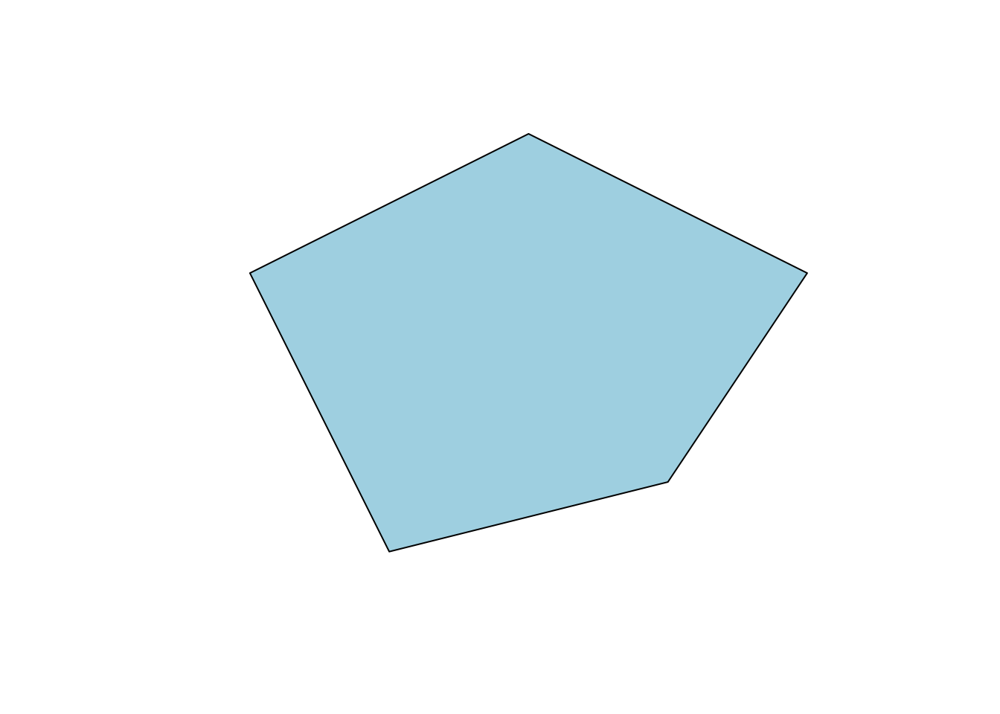
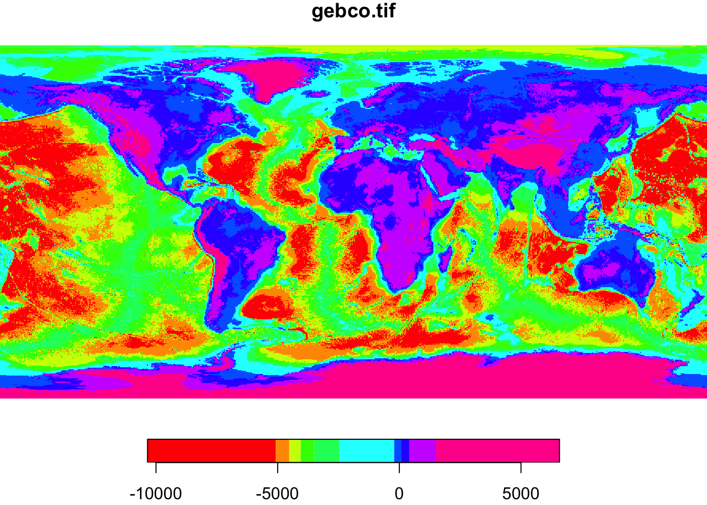

# (PART) Пространственные данные в R {-}

# Пространственные данные в R {#spatial_data}


[Программный код главы](https://github.com/tsamsonov/r-geo-course/blob/master/code/07-SpatialData.R)

__Необходимые пакеты:__ `sf, raster, dplyr`

Данный модуль посвящен введению в работу с пространственными данными в R. Рассмотрены общие вопросы моделирования реального мира средствами моделей пространственных данных. Рассматривается чтение векторных и растровых данных, их визуализация стандартными средствами.

## Модели пространственных данных {#spatial_models}

__Пространственные данные__ --- это данные о пространственных объектах и их наборах. В свою очередь, пространственный объект определяется как _цифровая модель материального или абстрактного объекта реального или виртуального мира с указанием его идентификатора, координатных и атрибутивных данных_ ^[ГОСТ Р 52438-2005 <<Географические информационные системы. Термины и определения>>. В стандарте поясняется, что объектом может быть неподвижный или движущийся простой или сложный объект, явление, событие, процесс и ситуация. Моделируемый объект может относиться к территории, акватории, недрам и воздушному пространству Земли, околоземному космическому пространству, другим космическим телам и небесной сфере. В широком смысле под пространственным объектом в геоинформатике понимается как сам объект, так и адекватная ему цифровая модель].

Если говорить по сути, то пространственные данные можно определить как _данные о географических объектах или явлениях, фиксирующие их местоположение и/или распределение в системе координат, привязанной к телу Земли или любого другого небесного тела_. Таким образом, отличительной особенностью пространственных данных перед непространственными является координатное описание местоположения. Важно знать отличия между векторной и растровой моделью пространственных данных. 

__Векторная модель__ пространственных данных включает описание координатных данных пространственных объектов и, возможно, топологических отношений между ними. Векторные данные фиксируют местоположение и форму объектов в виде геометрических примитивов, таких как точки, линии, полигоны, объемные тела. Выбор модели объекта (например, представить город точкой или полигоном) зависит от масштаба анализа и целей исследования. Векторная модель данных является объектно-ориентированной. 

__Растровая модель__ описывает не объекты, а пространственное распределение некоторой (выбранной исследователем) характеристики. Пространство разбивается регулярной сеткой ячеек, в каждой ячейке фиксируется значение исследуемого параметра (путем статистического осреднения, семплирования в центре ячейки и т.п.). Растровые данные могут быть как количественными (например, поле температуры), так и качественными (например, растр классифицированного снимка, каждая ячейка которого фиксирует принадлежность к тому или иному типу объекта). Таким образом, растровая модель является пространственно-ориентированной (или феномен-ориентированной).

Существуют и другие модели пространственных данных, однако их рассмотрение выходит за рамки настоящей лекции.

В настоящей лекции мы познакомимся с чтением и визуализацией пространственных данных в векторном и растровом формате, а также рассмотрим вопросы связанные с использованием картографических проекций.

### Векторные данные {#simple_features}

__Simple Features__ (официально _Simple Features Access_) --- это стандарт [OGC 06-103](http://www.opengeospatial.org/standards/sfa), разработанный Open Geospatial Consortium (OGC) и реализованный также в виде международного стандарта [ISO 19125](https://www.iso.org/standard/40114.html), который определяет общую модель хранения и доступа к векторным объектам (точка, линия, многоугольник, мульти точечные, мультилинии и т. д.), в географических информационных системах.

Геометрическое представление пространственных объектов базируется на следующих принципах:

- Все геометрии состоят из точек. 
- Точки являются координатами в 2-, 3- или 4-мерном пространстве. 
- Все точки в геометрии имеют одинаковую размерность. 

В дополнение к координатам $X$ и $Y$ имеются два дополнительных дополнительных параметра:

- координата $Z$, обозначающая высоту
- координата $M$, обозначающая некоторую меру, связанную с точкой, а не с признаком в целом (в этом случае это будет атрибут объекта). 

Измерение $M$ может быть использовано, например, для представления времени или линейных координат (для маршрутов).

Координаты простой геометрии всегда содержат компоненты $X$ и $Y$, поэтому все разнообразие возможных представлений определяется наличием или отсутствием дополнительных измерений $Z$ и $M$ Таким образом, получаем __четыре__ варианта геометрии:

- двумерные точки $XY$
- трехмерные точки $XYZ$
- трехмерные точки $XYM$
- четырехмерные точки $XYZM$

В случае использования широт и долгот $X$ соответствует долготе, $Y$ соответствует широте.

Всего стандарт __Simple Features__ включает в себя 17 типов геометрий. Из них наиболее употребительными являются следующие 7:

Тип |	Описание
----|--------------------------------------------------------------------------------
`POINT`	| нуль-мерная геометрия, содержащая одну точку
`LINESTRING` | последовательность точек, соединенных прямыми, несамопересекающимися отрезками; одномерная геометрия
`POLYGON`	| геометрия с положительной площадью (двумерная); последовательность точек, отрезки между которыми формируют замкнутое кольцо без самопересечений; первое кольцо является внешним, ноль и более остальных колец представляют дырки внетри полигона
`MULTIPOINT` | множество точек; геометрия типа `MULTIPOINT` называется _простой_ если ни одна пара точек в `MULTIPOINT` не совпадает
`MULTILINESTRING`	| множество линий
`MULTIPOLYGON`	| множество полигонов
`GEOMETRYCOLLECTION`	| множество геометрий произвольного типа за исключением `GEOMETRYCOLLECTION`

Примеры различных видов геометрий представлены на рисунке ниже:


```
## Linking to GEOS 3.6.1, GDAL 2.1.3, proj.4 4.9.3
```


Оставшиеся виды геометрий _Simple Features_ включают: `CIRCULARSTRING`, `COMPOUNDCURVE`, `CURVEPOLYGON`, `MULTICURVE`, `MULTISURFACE`, `CURVE`, `SURFACE`, `POLYHEDRALSURFACE`, `TIN`, `TRIANGLE`.

Существует два официально закрепленных формата представления SF: _Well-Known Text (WKT)_ и _Well-Known Binary (WKB)_, которые необходимы для чтения таких данных человеком и машиной соответственно.

__Well-Known Text (WKT)__ --- стандарт представления геометрии в виде множества списков координат, в которых координаты вершин разделены пробелами, вершины разделены запятыми, а компоненты полигонов и мультигеометрий заключены в круглые скобки и также разделены запятыми. Вышеприведенной картинке соответствуют следующие строки _WKT_:


```
## MULTIPOINT (3.2 4, 3 4.6, 3.8 4.4, 3.5 3.8, 3.4 3.6, 3.9 4.5)
## LINESTRING (0 3, 0 4, 1 5, 2 5)
## MULTILINESTRING ((0 3, 0 4, 1 5, 2 5), (0.2 3, 0.2 4, 1 4.8, 2 4.8), (0 4.4, 0.6 5))
## POLYGON ((0 0, 1 0, 3 2, 2 4, 1 4, 0 0), (1 1, 1 2, 2 2, 1 1))
## MULTIPOLYGON (((0 0, 1 0, 3 2, 2 4, 1 4, 0 0), (1 1, 1 2, 2 2, 1 1)), ((3 0, 4 0, 4 1, 3 1, 3 0), (3.3 0.3, 3.3 0.8, 3.8 0.8, 3.8 0.3, 3.3 0.3)), ((3 3, 4 2, 4 3, 3 3)))
## GEOMETRYCOLLECTION (MULTIPOINT (3.2 4, 3 4.6, 3.8 4.4, 3.5 3.8, 3.4 3.6, 3.9 4.5), MULTIPOLYGON (((0 0, 1 0, 3 2, 2 4, 1 4, 0 0), (1 1, 1 2, 2 2, 1 1)), ((3 0, 4 0, 4 1, 3 1, 3 0), (3.3 0.3, 3.3 0.8, 3.8 0.8, 3.8 0.3, 3.3 0.3)), ((3 3, 4 2, 4 3, 3 3))), LINESTRING (0 3, 0 4, 1 5, 2 5))
```

__Well-Known Binary (WKB)__ --- бинарный формат хранения координат. Именно этот формат фактически используется в базах данных, поскольку он обеспечивает высокую скорость чтения и записи данных (в отлиие от текстового). Однако внешний вид данных в формате WKB мало о чем говорит человеку, поскольку он предназначен для чтения компьютером. Например, вышеприведенная строка `LINESTRING` будет выглядеть так:


```
## 01 02 00 00 00 04 00 00 00 00 00 00 00 00 00 00 00 00 00 00 00 00 00 08 40 00 00 00 00 00 00 00 00 00 00 00 00 00 00 10 40 00 00 00 00 00 00 f0 3f 00 00 00 00 00 00 14 40 00 00 00 00 00 00 00 40 00 00 00 00 00 00 14 40
```

### Растровые данные {#raster_data}

__Растр__ представляет из себя матрицу значений. Каждой ячейке матрицы соответствует прямоугольная пространственная область фиксированного размера, которая называется _пикселом_. Различают растры _непрерывные_ и _категориальные (классифицированные)_. Также необходимо разделять _одноканальные_ и _многоканальные растры_. Примером одноканального растра является цифровая модель рельфа. В виде многоканальных растров часто представляют космические снимки.

В отличие от векторных данных, которые требут указания координат для каждой вершины, регулярно-ячеистый характер растровой модели позволяет вычислять координаты пикселов на основе их индексов. Поэтому фактически растровые данные хранятся в виде линейно упорядоченного списка значений _(raster values)_ и описания геометрии растра _(raster geometry)_.

__Геометрия растра__ определяет, где именно располагаются в пространстве пикселы растра и может быть описана путем указания следующих компонент^[Названия перечисленных компонент геометрии растра укоренились благодаря распространенности стандарта [Esri ASCII Grid](https://en.wikipedia.org/wiki/Esri_grid)]:

Параметр | Назначение
---------|---------
`NCOLS` | Количество столбцов
`NROWS` | Количество строк
`XLLCENTER` | Координата $X$ центра левой нижней ячейки растра
`YLLCENTER` | Координата $Y$ центра левой нижней ячейки растра
`CELLSIZE` | Размер ячейки

Иногда вместо параметров `XLLCENTER`/`YLLCENTER` указываются `XLLCORNER`/`YLLCORNER`, которые кодируют координаты левого нижнего угла, а не центра левой нижней ячейки растра. Выбор одного из двух этих вариантов определяет тип _регистрации растра_, а их значения указывают, в какое именно место необходимо "посадить" растр, чтобы его ячейки заняли соответствующие им области в системе координат. Если геометрия растра характеризуется _анизотропией_, то вместо одного значения `CELLSIZE` могут быть указаны разные размеры ячеек по осям координат `CELLSIZEX` и `CELLSIZEY`. 

В отличие от векторной модели, которая позволяет хранить данные только о нужных географических локациях, растровая модель такой свободы не предоставляет. Матрица ячеек растра всегда покрывает область данных целиком, и за простоту растровой структуры приходится расплачиваться ее неэкономичностью.  Поскольку часто данные имеются не на всю территорию, возникает необходимость кодирования ячеек, для которых данные не известны, специальным числом (назовем его условно `NODATA_VALUE`). Значение этого числа хранится в метаданных растра и позволяет интерпретировать соответствующие ячейки как пустые.

## Пространственная привязка {#spatref}

### Компоненты пространственной привязки {#spatref_components}

__Пространственная привязка__ (_spatial reference_ или _georeference_) — важнейшая составляющая пространственных данных, которая говорит нам о том, как правильно интерпретировать координаты объектов. Пространственная привязка в простейшем случае включает несколько фундаментальных компонент:

1. _Эллипсоид вращения_ --- тело, по отношению к которому вычисляются геодезические координаты точек (широты и долготы)
1. _Исходные геодезические даты (датум)_ --- параметры положения эллипсоида в теле Земли
1. _Географическая система координат_ --- включает датум, положение начального меридиана и единицы измерения широт и долгот
1. _Проекция_ --- математический спопоб перехода от географических координат на эллипсоиде к плоским прямоугольным координатам карты.
1. _Плоская прямоугольная система координат_ --- включает проекцию, ее параметры и единицы измерения координат.

Если точки имеют также координаты $Z$, то для их правильной интерпретации необходимы дополнительные компоненты пространственной привязки:

1. _Система счета высот_ (геодезические, нормальные, ортометрические) - определяют содержательный смысл и порядок вычисления высот и глубин (координата Z)
1. _Модель геоида, квазигеоида или эллипсоида_ --- определяет поверхность, относительно которой вычисляются высоты точек.
1. _Вертикальная система координат_ --- фактическая реализация системы счета высот относительно конкретной поверхности относимости с заданным положением нулевого уровня. Например, в России это _Балтийская система нормальных высот_ с нулем в г. Кронштадт.

Аналогичным образом требуется введение системы счета дополнительных координат $M$, если они используются в представлении координат.

### Форматы описания пространственной привязки {#spatref_formats}

Существует три распространенных способа задания (хранения) пространственной привязки:

- _PROJ.4 String_ --- представление в виде строки.
- _WKT (Well-Known Text)_ --- представление в виде иерархического списка.
- _EPSG (European Petroleum Survey Group)_ --- представление в виде числового кода.

Для поиска проекций в перечисленных форматах представления удобно воспользоваться порталом [spatialreference.org](spatialreference.org).

__PROJ.4 String__ --- строковый формат представления информации о пространственной привязки, используемый в библиотеке [PROJ.4](http://proj4.org). Данная библиотека лежит в основе координатных систем пространственных данных, используется в __R__, __Python__, __QGIS__ и прочих средах. Основные параметры строки:
```
+datum     Datum name (see `proj -ld`)
+ellps     Ellipsoid name (see `proj -le`)
+lat_0     Latitude of origin
+lat_1     Latitude of first standard parallel
+lat_2     Latitude of second standard parallel
+lat_ts    Latitude of true scale
+lon_0     Central meridian
+proj      Projection name (see `proj -l`)
+units     meters, US survey feet, etc.
+vunits    vertical units.
+x_0       False easting
+y_0       False northing
+zone      UTM zone
```
Примеры записи координат в формате PROJ.4:

- Географические координаты в _WGS84_ (без проекции):

```
## +proj=longlat +datum=WGS84 +no_defs
```

- Координаты в проекции _Web Mercator_ (проекция Google Maps, Яндекс.Карт и т.д.):

```
## +proj=merc +a=6378137 +b=6378137 +lat_ts=0.0 +lon_0=0.0 +x_0=0.0 +y_0=0 +k=1.0 +units=m +nadgrids=@null +wktext +no_defs
```

- Координаты в _конической равнопромежуточной проекции_:

```
## +proj=eqdc +lat_0=0 +lon_0=0 +lat_1=60 +lat_2=60 +x_0=0 +y_0=0 +datum=WGS84 +units=m +no_defs
```

- Координаты в проекции _UTM, зона 37_:

```
## +proj=utm +zone=37 +datum=WGS84 +units=m +no_defs
```

Запись координат в формате WKT предполагает представление вышеуказанных компонент пространственной привязки к виде иерерхического списка. Например, так будет выглядеть информация о _полярной стереографической проекции для карт России_:

```
PROJCS["WGS 84 / EPSG Russia Polar Stereographic",
    GEOGCS["WGS 84",
        DATUM["WGS_1984",
            SPHEROID["WGS 84",6378137,298.257223563,
                AUTHORITY["EPSG","7030"]],
            AUTHORITY["EPSG","6326"]],
        PRIMEM["Greenwich",0,
            AUTHORITY["EPSG","8901"]],
        UNIT["degree",0.0174532925199433,
            AUTHORITY["EPSG","9122"]],
        AUTHORITY["EPSG","4326"]],
    PROJECTION["Polar_Stereographic"],
    PARAMETER["latitude_of_origin",90],
    PARAMETER["central_meridian",105],
    PARAMETER["scale_factor",0.994],
    PARAMETER["false_easting",2000000],
    PARAMETER["false_northing",2000000],
    UNIT["metre",1,
        AUTHORITY["EPSG","9001"]],
    AXIS["X",EAST],
    AXIS["Y",NORTH],
    AUTHORITY["EPSG","5940"]]
```

__EPSG (European Petroleum Survey Group)__ --- европейская рабочая группа нефтегазовой области, которая ведет реестр систем координат с уникальными цифровыми кодами вида `EPSG:xxxxxx`. Коды EPSG оказались настолько удобны, что используются повсеместно для быстрой инициализации проекций со стандартными параметрами. Например, вышеприведенные проекции имеют следующие коды EPSG:

- _WGS84_: `EPSG:4326`
- _Web Mercator_: `EPSG:3857`
- _UTM_: `EPSG:326..` , например для UTM 37N: `EPSG:32637`

### Преобразование координат {#spatref_transform}

Преобразование координат включает три различных операции:

1. __Трансформирование__ --- пересчет географических координат с одного датума на другой

1. __Проецирование__ --- переход от географических координат к плоским прямоугольным

1. __Обратное проецирование__ --- переход от плоских координат к прямоугольным.

Например, чтобы пересчитать координаты _UTM_ в проекцию _Гаусса-Крюгера_, необходимо:

1. Обратно проецировать координаты в географические _WGS84_
1. Трансформировать географические координаты c _WGS84_ в _ГСК-2011_
1. Проецировать координаты _ГСК-2011_ в проекцию _Гаусса-Крюгера_

_Несоответствие датумов часто является причиной того, что данные из разных наборов плохо совмещаются друг с другом_

## Векторные данные {#vector_data_r}

### Базовые библиотеки {#vector_data_packages}

В R существует высоко развитая инфраструктура для работы с векторными данными, которая обеспечивается пакетом [sf](https://cran.r-project.org/web/packages/sf/index.html). Этот пакет появился сосвсем недавно (в 2016 году). Ранее поддержка пространственных данных обеспечивалась пакетом [sp](https://cran.r-project.org/web/packages/sp/index.html), который по прежнему активно используется, и на который "завязано" множество других библиотек. Существующая в настоящий момент инфраструктура кратко показана ниже:


Исторический пакет `sp` обеспечивал (и продолжает обеспечивать) поддержку пространственных данных в виде специальных классов данных типа `Spatial`, реализуя классы как для чисто геометрических объектов (`SpatialPolygons`), так и для пространственных объектов с атрибутами (`SpatialPolygonsDataFrame`). Во втором случае набор объектов имеет ассоциированную с ним таблицу атрибутов. С классами типа `Spatial` существут несколько проблем. Во-первых, они не являются объектами типа `data.frame` (не расширяют их), а являются самостоятельным классом объектов, поэтому к ним часто невозможно корректно применить стандартные операции трансформации таблиц (типа тех, что доступны в пакете __dplyr__). Во-вторых, объекты типа `Spatial` не реализуют существующие стандарты представления пространственных данных (типа _Simple Features_), что накладывает ограничения на их интероперабельность с современными форматами данных (например, [GeoPackage](http://www.geopackage.org)). 

Пакет [sf](https://cran.r-project.org/web/packages/sf/index.html) решает все эти проблемы. Множество функций, которые были раньше разбросаны по нескольким пакетам __R__ (sp, rgdal, rgeos), теперь доступны в одном интерфейсе:


```r
library(sf)
methods(class = "sf") # Посмотрим, какие методы доступных для объектов класса sf
##  [1] [                     [[<-                  $<-                  
##  [4] aggregate             as.data.frame         cbind                
##  [7] coerce                dbDataType            dbWriteTable         
## [10] identify              initialize            merge                
## [13] plot                  print                 rbind                
## [16] show                  slotsFromS3           st_agr               
## [19] st_agr<-              st_as_sf              st_bbox              
## [22] st_boundary           st_buffer             st_cast              
## [25] st_centroid           st_collection_extract st_convex_hull       
## [28] st_coordinates        st_crs                st_crs<-             
## [31] st_difference         st_geometry           st_geometry<-        
## [34] st_intersection       st_is                 st_line_merge        
## [37] st_node               st_point_on_surface   st_polygonize        
## [40] st_precision          st_segmentize         st_set_precision     
## [43] st_simplify           st_snap               st_sym_difference    
## [46] st_transform          st_triangulate        st_union             
## [49] st_voronoi            st_wrap_dateline      st_write             
## [52] st_zm                
## see '?methods' for accessing help and source code
```

Cо многими из этих функций мы познакомимся в последующих разделах нашего курса. Некоторые из них (такие как `arrange`, `filter`, `mutate` из пакета __dplyr__), должны быть уже знакомы вам по предыдущим лекциям. Можно обратить внимание на то, что практически все функции начинаются с префикса `st_`, что означает __"spatiotemporal"__. Данные префиксы были выбраны для унификации с аналогичными названиями функций, используемых в широко распространенной СУБД PostgreSQL для оперирования объектами Simple Features.

### Чтение {#vector_data_reading}

Существует большое множество форматов хранения пространственных данных. Но в общем и целом их можно разделить на две категории: файловые форматы (наиболее привычные пользователям) и хранение данных в СУБД --- системах управления базами данных. Благодаря библиотеке GDAL пакет __sf__ имеет возможность читать и записывать [более 90 различных форматов векторных даных](http://www.gdal.org/ogr_formats.html). Разумеется, не все из них общеупотребительны. Исторически наиболее распространенным форматом был (и остается) [ESRI Shapefile](https://www.esri.com/library/whitepapers/pdfs/shapefile.pdf). Данный формат, однако не отвечает современным техническим требованиям с точки зрения гибкости, соответствия стандартам и возможностям хранения разнообразных типов геометрий (напомним, что в стандарте Simple Features их 17, а с учетом четырех вариантов размерности точек получается целых 68 ). Современный формат, который позволяет делать это (и не только), это [GeoPackage](http://www.geopackage.org). Именно его мы и будем использовать в нашем практикуме.

Для чтения данных средствами sf необходимо использовать функцию `st_read()`:

```r
countries <- st_read('ne/countries.gpkg')
## Reading layer `admin_0_map_units' from data source `/Users/tsamsonov/GitHub/r-geo-course/data/ne/countries.gpkg' using driver `GPKG'
## Simple feature collection with 183 features and 72 fields
## geometry type:  MULTIPOLYGON
## dimension:      XY
## bbox:           xmin: -180 ymin: -90 xmax: 180 ymax: 83.64513
## epsg (SRID):    4326
## proj4string:    +proj=longlat +datum=WGS84 +no_defs
```

Лог функции сообщил нам следующую информацию:

- Набор данных представляет собой коллекцию из 183 пространственных объектов с 72 атрибутами
- Тип геометрии `MULTIPOLYGON`
- Размерность геометрии $XY$
- Ограничивающий прямоугольник (разброс координат) по осям $X$ и $Y$ имеет диапазон $[-180, 180] \times [-90, 83.64513]$
- EPSG-код пространственной привязки равен `4326`
- PROJ.4-строка пространственной привязки равна `+proj=longlat +datum=WGS84 +no_defs`

### Внутренняя структура  {#sf_structure}

Традиционно во всех ГИС-приложениях и базах пространственных данных множество пространственных объектов представляется в виде таблицы атрибутов, где каждая строка соответствует объекту, а каждый столбец — атрибуту объекта. С каждой строкой таблицы должна быть ассоциирована информация о геометрии объекта, которая, в зависимости от формата данных, может либо храниться непосредственно в таблице (в специальном столбце), либо быть вынесена в отдельную структуру данных, которая связана с таблицей атрибутов посредством ключа^[Например, в широко распространенном формате __Esri Shapefile__ атрибутивная таблица хранится в файле `*.dbf` формата _DBASE_, геометрия хранится в отдельном файле `*.shp`, а связь между ними осуществляется через файл `*.shx`. Разбиение формата хранения на несколько файлов --- это одна из уязвимостей шейп-файлов: при отсутствии хотя бы одного из этих файлов данные прочесть стандартными средствами (без дополнительного хакинга) будет нельзя.].

В __R__ используется первый подход, в котором информация о геометрии хранится в специальном столбце таблицы. Каждая ячейка этого столбца соответствует геометрическому объекту _Simple Features_. Представление геометрических объектов реализовано стандартными средствами, такими как списки, матрицы и векторы. Эти структуры данных упорядоченным образом хранят координаты объектов и естественным образом соответствуют способу организации данных, который регламентируется стандартом _Simple Features_. Поскольку геометрический столбец хранит не обычные переменные, а структуры данных, он реализуется в виде так называемого _списка-колонки (list-column)_, каждый элемент которой соответствует отдельному объекту.

Исходя из этих соображений, представление пространственных объектов реализовано в __R__ в виде иерархии из трех классов объектов:

1. `sf` (simple features) --- объект класса `data.frame`, представляющий множество пространственных объектов со списком-колонкой для хранения геометрии 
1. `sfc` (simple features geometry column) --- список-колонка в объекте `sf`, представляющий множество геометрий пространственных объектов
1. `sfg` (simple feature geometry) --- геометрия пространственного объекта внутри списка `sfc`

В соответствии с перечисленными спецификациями происходит работа с пространственными объектами. То что, объекты типа Simple Features реализованы в виде самых обычных фреймов данных, означает что _любая операция, применимая к фрейму данных, будет также применима к объекту типа_ `sf`. Это очень важная особенность объектов типа sf, которой сильно не хватало в экосистеме исторического пакета `sp`.

Посмотрим, как все это реализовано, на конкретном примере:

```r
class(countries)
## [1] "sf"         "data.frame"
```

Данная форма записи говорит о том, что прочитанный слой имеет класс _sf_, который, в свою очередь, является расширением класса _data.frame_. 

А теперь посмотрим на последние колонки в первых строках таблицы:

```r
head(countries[tail(colnames(countries))])
```

<div data-pagedtable="false">
  <script data-pagedtable-source type="application/json">
{"columns":[{"label":[""],"name":["_rn_"],"type":[""],"align":["left"]},{"label":["tiny"],"name":[1],"type":["dbl"],"align":["right"]},{"label":["homepart"],"name":[2],"type":["dbl"],"align":["right"]},{"label":["min_zoom"],"name":[3],"type":["dbl"],"align":["right"]},{"label":["min_label"],"name":[4],"type":["dbl"],"align":["right"]},{"label":["max_label"],"name":[5],"type":["dbl"],"align":["right"]},{"label":["geometry"],"name":[6],"type":["S3: sfc_MULTIPOLYGON"],"align":["right"]}],"data":[{"1":"-99","2":"1","3":"0","4":"3","5":"7","6":"<S3: sfc_MULTIPOLYGON>","_rn_":"1"},{"1":"-99","2":"1","3":"0","4":"3","5":"7","6":"<S3: sfc_MULTIPOLYGON>","_rn_":"2"},{"1":"-99","2":"1","3":"0","4":"5","5":"10","6":"<S3: sfc_MULTIPOLYGON>","_rn_":"3"},{"1":"-99","2":"1","3":"0","4":"4","5":"9","6":"<S3: sfc_MULTIPOLYGON>","_rn_":"4"},{"1":"-99","2":"1","3":"0","4":"2","5":"7","6":"<S3: sfc_MULTIPOLYGON>","_rn_":"5"},{"1":"-99","2":"1","3":"0","4":"5","5":"10","6":"<S3: sfc_MULTIPOLYGON>","_rn_":"6"}],"options":{"columns":{"min":{},"max":[10]},"rows":{"min":[10],"max":[10]},"pages":{}}}
  </script>
</div>

Видно, что геометрия пространственных объектов хранится в заключительном столбце с названием `geometry`. Данный столбец можно быстро извлечь, применив функцию `st_geometry()`. Полученный объект будет иметь тип __sfc__ (Simple Feature Geometry Column)


```r
outlines <- st_geometry(countries)
class(outlines)
## [1] "sfc_MULTIPOLYGON" "sfc"
```
Полученный вывод говорит нам о том, что наши объекты имеют класс `sfc_MULTIPOLYGON`, который является расширением класса `sfc` (simple feature geometry column).

Теперь если просмотреть начало данных, то мы увидим, что это больше не фрейм данных, а аннотированный список:

```r
head(outlines)
## Geometry set for 6 features 
## geometry type:  MULTIPOLYGON
## dimension:      XY
## bbox:           xmin: -73.41544 ymin: -55.25 xmax: 75.15803 ymax: 42.68825
## epsg (SRID):    4326
## proj4string:    +proj=longlat +datum=WGS84 +no_defs
## First 5 geometries:
## MULTIPOLYGON (((61.21082 35.65007, 62.23065 35....
## MULTIPOLYGON (((23.90415 -11.72228, 24.07991 -1...
## MULTIPOLYGON (((21.02004 40.84273, 20.99999 40....
## MULTIPOLYGON (((51.57952 24.2455, 51.75744 24.2...
## MULTIPOLYGON (((-66.95992 -54.89681, -67.56244 ...
```

Далее можно опуститься на базовый уровень геометрии, получив доступ к отдельному объекту. Поскольку объект класса `sfc` представляет собой список, любой элемент можно извлечь по его порядковому номеру. Класс полученного объекта будет:

```r
class(outlines[[8]])
## [1] "XY"           "MULTIPOLYGON" "sfg"
```
Исходя из полученной информации можно сделать вывод, что геометрия 8-го объекта таблицы `countries` имеет класс `sfg`, реализованный в виде мультиполигонов (`MULTIPOLYGON`) с плоскими координатами (`XY`)

Наконец, чтобы добраться до координат в чистом виде, необходимо развернуть иерархию списков, из которых состоит объект `sfg`. Количество уровней вложенности всегда зависит от конкретного объекта, их может быть достаточно много, особенно если объекты представлены мультиполигонами (несколько компонент связности), каждый из которых такж состоит из полигонов с дырками. В нашем случае все достаточно просто, так как в слое `countries` дырок в полигонах нет, а 8-й по счету полигон состоит из одной-единственной геометрии, координаты которой в виде матрицы можно извлечь как:

```r
outlines[[8]][[1]]
## [[1]]
##          [,1]     [,2]
##  [1,] 68.9350 -48.6250
##  [2,] 69.5800 -48.9400
##  [3,] 70.5250 -49.0650
##  [4,] 70.5600 -49.2550
##  [5,] 70.2800 -49.7100
##  [6,] 68.7450 -49.7750
##  [7,] 68.7200 -49.2425
##  [8,] 68.8675 -48.8300
##  [9,] 68.9350 -48.6250
```

### Визуализация {#sf_plotting}

#### Базовые возможности {#sf_plotting_basic}

Если попытаться применить функцию `plot()` к геометрии объекта, она попытается нарисовать тематические карты по всем имеющимся атрибутам (но остановится, если их более 9):

```r
plot(countries)
```


Если задача стоит нарисовать границы объектов, то нужно отображать объект __sfc__:

```r
plot(outlines, col = 'red')
```


Для быстрого построения тематических карт по выбранному показателю необходимо при вызове функции `plot()` указать соответствующий атрибут фрейма данных:

```r
plot(countries['sovereignt'], key.pos = NULL) # Здесь легенда не нужна
```


Для отображения координатной сетки надо указать параметр `graticule = TRUE`, а подписей координат --- `axes = TRUE`:

```r
plot(countries['gdp_md_est'], graticule = TRUE, axes = TRUE)
```


#### Совмещение слоев {#sf_plotting_basic}

Для совмещения нескольких слоев на одной карте необходимо при втором и последующих вызовах функции `plot()` указать параметр `add = TRUE`:

```r
oceans <- st_read('ne/oceans.gpkg')
## Reading layer `ocean' from data source `/Users/tsamsonov/GitHub/r-geo-course/data/ne/oceans.gpkg' using driver `GPKG'
## Simple feature collection with 2 features and 4 fields
## geometry type:  POLYGON
## dimension:      XY
## bbox:           xmin: -180 ymin: -85.60904 xmax: 180 ymax: 90
## epsg (SRID):    4326
## proj4string:    +proj=longlat +datum=WGS84 +no_defs
rivers <- st_read('ne/rivers.gpkg')
## Reading layer `rivers_lake_centerlines' from data source `/Users/tsamsonov/GitHub/r-geo-course/data/ne/rivers.gpkg' using driver `GPKG'
## Simple feature collection with 13 features and 8 fields
## geometry type:  LINESTRING
## dimension:      XY
## bbox:           xmin: -135.3134 ymin: -33.99358 xmax: 129.956 ymax: 72.90651
## epsg (SRID):    4326
## proj4string:    +proj=longlat +datum=WGS84 +no_defs
lakes <- st_read('ne/lakes.gpkg')
## Reading layer `lakes' from data source `/Users/tsamsonov/GitHub/r-geo-course/data/ne/lakes.gpkg' using driver `GPKG'
## Simple feature collection with 25 features and 8 fields
## geometry type:  POLYGON
## dimension:      XY
## bbox:           xmin: -124.9536 ymin: -16.53641 xmax: 109.9298 ymax: 66.9693
## epsg (SRID):    4326
## proj4string:    +proj=longlat +datum=WGS84 +no_defs

plot(countries %>% st_geometry, lwd = 0.5, border = 'gray')
plot(oceans %>% st_geometry, col = 'steelblue1', border = 'steelblue', add = TRUE)
plot(lakes %>% st_geometry, col = 'steelblue1', border = 'steelblue', add = TRUE)
plot(rivers %>% st_geometry, col = 'steelblue', add = TRUE)
```


> __Внимание__: чтобы слои совместились на карте, они должна иметь одинаковую систему координат.

Ясно, что на полученных нами картах можно много что улучшить, однако это мы отложим до следующей главы, где подробно разбирается построение тематических карт в __R__.

### Системы координат и проекции {#sf_crs}

Работа с пространственной привязкой данных в R состоит в основном из четырех операций:

- чтение информации о системе координат
- создание информации о системе координат
- замена информации о системе координат
- изменение системы координат (проецирование)

Первые три операции (чтение, создание, замена) осуществляются функцией `st_crs()`. Чтобы прочитать информацию о проекции, достаточно передать в качестве параметра объект типа `sf`:

```r
st_crs(countries)    # Координатная система
## Coordinate Reference System:
##   EPSG: 4326 
##   proj4string: "+proj=longlat +datum=WGS84 +no_defs"
```
Эта же функция позволяет создать новую координатную систему, путем передачи ей кода _EPSG_ или строки _PROJ.4_:

```r
st_crs(3857) # Проекция Меркатора для карт мира
## Coordinate Reference System:
##   EPSG: 3857 
##   proj4string: "+proj=merc +a=6378137 +b=6378137 +lat_ts=0.0 +lon_0=0.0 +x_0=0.0 +y_0=0 +k=1.0 +units=m +nadgrids=@null +wktext +no_defs"
st_crs(54030) # Проекция Робинсона для карт мира
## Coordinate Reference System:
##   EPSG: 54030 
##   proj4string: "+proj=robin +lon_0=0 +x_0=0 +y_0=0 +datum=WGS84 +units=m +no_defs"

# Проекция UTM, зона 37.
st_crs('+proj=utm +zone=37 +datum=WGS84 +units=m')
## Coordinate Reference System:
##   EPSG: 32637 
##   proj4string: "+proj=utm +zone=37 +datum=WGS84 +units=m +no_defs"
```

Замена координатной системы требуется в тех случаях, когда слой не имеет пространственной привязки, или же она задана некореектно. В этом случае необходимо вызвать для слоя функцию `st_crs()` и перезаписать результат.


```r
st_crs(countries) <- NA
st_crs(countries) 
## Coordinate Reference System: NA

st_crs(countries) <- st_crs(4326)
st_crs(countries)
## Coordinate Reference System:
##   EPSG: 4326 
##   proj4string: "+proj=longlat +datum=WGS84 +no_defs"
```

> __Внимание__: замена координатной системы не осуществляет перепроецирования данных и не меняет координаты точек. Она лишь влияет на то, как эти координаты будут интерпретироваться. Если вместо проецирования выполнить замену информации о координатной системе, данные будут позиционироваться в неправильном месте.

Для трансформирования данных в другую проекцию следует использовать функцию `st_tranform(x, crs)`. Данная функция принимает в качестве параметров класс объектов _sf_ и координатную систему, в которую необхоимо проецировать данные.


```r
# Проекция Меркатора
countries.merc <- st_transform(countries, 3857)

plot(st_geometry(countries.merc), 
     col = 'lightgray',
     lwd = 0.5,
     graticule = TRUE, 
     axes = TRUE)
```




```r
# Проекция Робинсона (используем dplyr)
countries.rob <- countries %>% st_transform(54030)
plot(st_geometry(countries.rob), 
     col = 'lightgray',
     lwd = 0.5,
     graticule = TRUE, 
     axes = TRUE)
```


```r
# Зарубежная Европа в Конической равнопромежуточной проекции. 
# Задаем только необходимые параметры проекции
europe.conic <- countries %>% 
  dplyr::filter(continent == 'Europe' & sovereignt != 'Russia') %>% 
  st_transform('+proj=eqdc +lon_0=10 +lat_1=30 +lat_2=60 +datum=WGS84 +units=m')

plot(st_geometry(europe.conic), 
     col = 'lightgray',
     lwd = 0.5,
     graticule = TRUE, 
     axes = TRUE)
```


> __Внимание__: чтобы слои данных можно было совместно анализировать и наносить на одну карту, они должны иметь одну и ту же координатную систему (проекцию).

### Атрибутивные операции {#sf_attrs}

Поскольку пространственные объекты хранятся в фреймах данных, к ним можно применять стандартные операции выборки по атрибутам и преобразования таблиц. Например, можно выбрать Италию и отобразить ее на отдельной карте:


```r
library(dplyr)

italy <- countries %>% filter(sovereignt == 'Italy')
plot(st_geometry(italy))
```


Следующий пример иллюстрирует как выбрать страны с населением более 100 млн человек:

```r
largest <- countries %>% select(pop_est) %>% filter(pop_est > 100000000)
plot(outlines, col = 'lightgrey')
plot(largest, col = 'red', add = TRUE)
```


Обратите внимание на то, что при вызове функции `select()` столец `geometry` не был указан в числе выбираемых переменных. Тем не менее, то, что мы смоги построить карту по результатам выборки, говорит о том, что данный столбец был сохранен. _Функции __dplyr__ определены для объектов `sf` таким образом, чтобы всегда сохранять геометрический столбец._ 

Еще интереснее работает агрегирование объектов по атрибутам. В случае, когда агрегируются пространственные объекты, необходимо объединять и их геометрию. При этом если у агрегируемых объектов имеется общая граница, ее необходимо удалить, а если объекты разнесены в пространстве, из них нужно собрать новый мульти-объект.

Например, мы можем агрегировать валовый региональный продукт по континентам:


```r
continents <- countries %>% 
  group_by(continent) %>% 
  summarise(gdp = sum(gdp_md_est))
plot(continents['gdp'])
```


Потрясающе просто, не правда ли? Вдобавок, мы еще и получили границы континентов (достаточно условные, конечно), которых у нас раньше не было. Данный пример также показывает, что атрибутивные операции над пространственными объектами всегда учитывают их геометрию.

### Пространственные операции {#sf_spat_selection}

Поиск объектов по местоположению базируется на проверке топологических отношений между объектами. Топологические отношения описывают взаимное расположение объектов. Различные варианты топологических отношений для площадных объектов представлены на следующем рисунке, где серым цветом показаны пересечения _внутренних областей_ объектов $A$ и $B$, синим цветом --- пересечения _границ_ объектов $A$ и $B$:


Отношение _Пересекает (intersects)_ будет истинно для любого случая когда две геометрии имеют хотя бы одну общую точку, то есть во всех случаях кроме _Не пересекает (disjoint)_. Для проверки этих, а также некоторых других отношений, в пакете `sf` существуует ряд функций:

Функция                       | Топологическое отношение
------------------------------|--------------------------------------------------------------------
`st_intersects(x, y)`         | `x` имеет общие точки с `y`
`st_disjoint(x, y)`           | `x` не имеет общих точек с `y`
`st_touches(x, y)`            | `x` касается `y` (граница `x` имеет общие точки с границей `y` И внутренняя область `x` не имеет имеет общих точек с внутренней областью `y`)
`st_crosses(x, y)`            | `x` пересекает `y` (граница `x` имеет общие точки с границей `y`, при этом размерность их пересечения меньше размерности хотя бы одного из исходных обхектов)
`st_within(x, y)`             | `x` внутри `y` (все точки `x` содержатся в `y` И внутренняя область `x` имеет общие точки с внутренней областью `y`)
`st_contains(x, y)`           | `x` содержит `y` (все точки `y` содержатся в `x` И внутренняя область `y` имеет общие точки с внутренней областью `x`)
`st_contains_properly(x, y)`  | `x` содержит `y` полностью (все точки `y` содержатся в `x` И граница `x` не имеет общих точек с границей `y`)
`st_overlaps(x, y)`           | `x` перекрывает `y` (внутренняя область `x` имеет как общие, так и не общие точки с внутренней областью `y`)
`st_equals(x, y)`             | `x` совпадает `y` (множества точек `x` и `y` совпадают)
`st_covers(x, y)`             | `x` покрывает `y` (все точки `y` содержатся в `x`)
`st_covered_by(x, y)`         | `x` покрыт `y` (все точки `x` содержатся в `y`)
`st_equals_exact(x, y)`       | `x` совпадает `y` точно (упорядоченные множества точек `x` и `y` совпадают)

Между `covered_by` и `within`, а также `covers` и `contains` нет разницы в случае, когда оба объекта являются площадными. Эта разница будет сказываться если хотя бы один из объектов является линией либо точкой. В этом случае `within`, `contains` и `contains_properly` будут давать ложный результат (FALSE), поскольку ни у линий, ни у точек нет внутренней области.

Проверка топологических отношений используется для выполнения выборки объектов по местоположению — _пространственной выборки_. Наиболее простой способ выбрать объекты по пространственному местоположению --- это использовать один слой в качестве фильтра для другого слоя. В этом случае будет по умолчанию использовано отношение `st_intersects()` (пересекает). Никаких отличий от работы с обычными таблицами нет. Например, вот так можно выбрать точки, находящиеся внутри ранее отобранных стран с максимальным ВВП:


```r
cities <- st_read('ne/cities.gpkg')
## Reading layer `populated_places' from data source `/Users/tsamsonov/GitHub/r-geo-course/data/ne/cities.gpkg' using driver `GPKG'
## Simple feature collection with 243 features and 103 fields
## geometry type:  POINT
## dimension:      XY
## bbox:           xmin: -175.2206 ymin: -41.29999 xmax: 179.2166 ymax: 64.15002
## epsg (SRID):    4326
## proj4string:    +proj=longlat +datum=WGS84 +no_defs
city.pts <- st_geometry(cities)

# Наносим исходную конфигурацию
plot(outlines, lwd = 0.5)
plot(cities, col = 'black', pch = 20, cex = 0.5, add = TRUE)
```


```r

# Отбираем точки внутри стран с максимальным ВВП
sel <- cities[largest, ]
## although coordinates are longitude/latitude, st_intersects assumes that they are planar

# Смотрим что получилось
plot(outlines, lwd = 0.5)
plot(largest, col = 'gray', add = TRUE)
plot(sel, pch = 20, col = 'black', add = TRUE)
```


Разумеется, при выполнении пространственных запросов могут возникать и другие пространственные отношения. Например, мы можем выбрать все страны, имеющие общую границу с Чехией. Для этого можно использовать топологическое отношение `st_touches` вместо `st_intersects` --- это будет гарантировать, что сама Чехия в результате не выберется (касающиеся объекты не могут перекрываться). Тип отношения необходимо поставить в параметр `op = ` при выполнении фильтрации фрейма данных:


```r
cz <- countries %>% filter(sovereignt == 'Czechia')
neighbors <- countries[cz, op = st_touches]
## although coordinates are longitude/latitude, st_touches assumes that they are planar

plot(st_geometry(neighbors), col = 'lightgray', lwd = 0.5)
plot(cz, col = 'darkgray', add = TRUE)
```


### Создание пространственных объектов {#sf_creation}

Пространственные объекты в R можно собирать "вручную", если есть такая необходимость. Например, вам известны координаты границ участков полевого обследования, полученные посредством GPS, а вам необходимо превратить их в полигоны, чтобы выполнить анализ и картографирование. Придется из координат собрать полигоны программным путем. Процесс создания пространственных объектов осуществляется в последовательности их иерархического соподчинения: __sfg__ > __sfc__ > __sf__.

####  Геометрические объекты (sfg) {#sf_sfg}

Для создания геометрических объектов в пакете sf существует ряд функций с говорящими названиями:

Функция                   | Тип пространственного объекта
--------------------------|-----------------------------------
`st_point()`              | _POINT_
`st_linestring()`         | _LINESTRING_
`st_polygon()`            | _POLYGON_
`st_multipoint()`         | _MULTIPOINT_
`st_multilinestring()`    | _MULTILINESTRING_
`st_multipolygon()`       | _MULTIPOLYGON_
`st_geometrycollection()` | _GEOMETRYCOLLECTION_

В зависимости от типа создаваемого объекта, данные функции принимают координаты, организованные в виде одной из трех структур данных:

- Вектор координат (_POINT_)
- Матрица координат (_MULTIPOINT_ или _LINESTRING_), в которой строки соответствуют точкам, столбцы --- координатам
- Список (для всех остальных типов)

Проще всего создаются отдельные __точки__ (_POINT_):

```r
st_point(c(0, 2)) # XY POINT
## POINT (0 2)
st_point(c(0, 2, -1)) # XYZ POINT
## POINT Z (0 2 -1)
st_point(c(0, 2, 5), dim = 'XYM') # XYM POINT
## POINT M (0 2 5)
st_point(c(0, 2, -1, 5)) # XYZM POINT
## POINT ZM (0 2 -1 5)
```
Дополнительный параметр `dim=` служит для уточнения типа геометрии точек и по сути нужен только тогда, когда необходимо создать редко используемые точки типа _XYM_. во всех остальных случаях (_XY_, _XYZ_, _XYZM_) размерность геометрии распознается по умолчанию.

При создании __мультиточек__ (_MULTIPOINT_) и __линий__ (_LINESTRING_) необходимо подавать на вход функции уже матрицу координат:

```r
coords <- matrix(c(
  0, 2,
  1, 3,
  3, 1,
  5, 0
), ncol = 2, byrow = TRUE)

mp <- st_multipoint(coords) # XY MULTIPOINT
print(mp)
## MULTIPOINT (0 2, 1 3, 3 1, 5 0)

ls <- st_linestring(coords) # XY LINESTRING
print(ls)
## LINESTRING (0 2, 1 3, 3 1, 5 0)
```

В первом случае геометрия состоит из отдельных точек. Во втором случае те же самые точки соединены линией:

```r

plot(ls)
plot(mp, col = 'red', pch = 19, add = TRUE)
```


Создание трех-(_XYZ_, _XYM_) и четрехмерных (_ZYXM_) мультиточек и линий выполняется аналогично, но матрица должна содержать не 2, а, соответственно 3 или 4 столбца, и при необходимости параметр `dim = 'XYM'`.

Создание __полигонов__ (_POLYGON_), __мультиполигонов__ (_MULTIPOLYGON_) и __мультилиний__ (_MULTILINESTRING_) требует уже создания списков из матриц.

Почему нельзя представить обычный (не мульти) полигон просто матрицей координат? Потому что полигон может содержать дырки. Например, контур леса может содержать дырку в том месте, где находится озеро. Или озеро может содержать дырку в том месте, где находится остров. Природа предлагает нам бесконечное число таких примеров. В целях универсализации приходится закладываться на возможность наличия дырок в полигонах, поэтому даже полигоны без дырок представляются в виде списков. При этом действу.т следующее правила:

- Первая матрица координат в списке отвечает за контур полигона
- Все остальные матрицы координат отвечают за дыры в полигоне
- Координаты первой и последней точки в каждой матрице должны совпадать

Если дыр в полигоне нет, его список будет содержать только одну матрицу. Рассмотрим оба примера построения __полигонов__:

```r
coords <- matrix(c( # Координаты главного полигона
  1, 0,
  0, 2,
  2, 3,
  4, 2,
  3, 0.5,
  1, 0
), ncol = 2, byrow = TRUE)

pol <- st_polygon(list(coords)) # Простой полигон
print(pol)
## POLYGON ((1 0, 0 2, 2 3, 4 2, 3 0.5, 1 0))

plot(pol, col = 'lightblue')
```


```r

hole <- matrix(c( # Координаты дыры
  2, 1,
  3, 1.5,
  3, 2,
  2, 2,
  1.5, 1.5,
  2, 1
), ncol = 2, byrow = TRUE)

pol2 <- st_polygon(list(coords, hole)) # Полигон с дырой
print(pol2)
## POLYGON ((1 0, 0 2, 2 3, 4 2, 3 0.5, 1 0), (2 1, 3 1.5, 3 2, 2 2, 1.5 1.5, 2 1))

plot(pol2, col = 'lightblue')
```


Мультиполигоны (_MULTIPOLYGON_) и мультилинии (_MULTILINESTRING_) требуются тогда, когда один и тот же географический объект состоит из нескольких геометрических объектов. Простейший пример --- островные государства. Чтобы представить страну, занимающую архипелаг (Багамские острова, Индонезия, Япония и т.д.) как один пространственный объект, необходимо создать мультиполигон. Все компоненты мультиполигона будут иметь общий набор атрибутов (непространственных характеристик). Мультилинии используются реже мультиполигонов и необходимы для представления линейных объектов, разорванных в пространстве. Примером такого объекта может быть любая река или канал, которые разорваны в тех местах, где они протекают через озеро или водохранилище, представленное полигональным объектом.

В мультиполигонах добавляется еще один уровень списка, то есть искомые матрицы координат будут располагаться как минимум на втором уровне вложенности: 


```r
coords1 <- matrix(c(
  0.5, 0,
  0, 1,
  1, 1.5,
  2, 1,
  1.5, 0.25,
  0.5, 0
), ncol = 2, byrow = TRUE)

coords2 <- matrix(c(
  3, 1,
  2.5, 2,
  3.5, 2.5,
  4, 2,
  4, 1.25,
  3, 1
), ncol = 2, byrow = TRUE)

mpol <- st_multipolygon(list(list(coords1), list(coords2)))

print(mpol)
## MULTIPOLYGON (((0.5 0, 0 1, 1 1.5, 2 1, 1.5 0.25, 0.5 0)), ((3 1, 2.5 2, 3.5 2.5, 4 2, 4 1.25, 3 1)))

plot(pol, col = 'grey') # Обычный полигон (серый)
plot(mpol, col = 'pink', add = TRUE) # Мультиполигон (розовый)
```


Как насчет острова на озере? Если остров и суша, окружающая озеро, составляют единое целое (например, подлежат учету как единый массив леса), их можно собрать как мультиполигон. В этом случае первая компонента мультиполигона будет представлять собой полигон с дыркой, а вторая компонента — остров. Порядок компонент в данном случае роли не играет:

```r
coords4 <- matrix(c(
  2.2, 1.2,
  2.8, 1.5,
  2.8, 1.8,
  2.2, 1.8,
  2.0, 1.6,
  2.2, 1.2
), ncol = 2, byrow = TRUE)

island <- st_polygon(list(coords4))

mpol2 <- st_multipolygon(list(pol2, island))

print(mpol2)
## MULTIPOLYGON (((1 0, 0 2, 2 3, 4 2, 3 0.5, 1 0), (2 1, 3 1.5, 3 2, 2 2, 1.5 1.5, 2 1)), ((2.2 1.2, 2.8 1.5, 2.8 1.8, 2.2 1.8, 2 1.6, 2.2 1.2)))

plot(mpol2, col = 'darkolivegreen4')
```


Из данного примера также видно, что при сборе мультиполигона на самом нижнем уровне вложености можно подавать не списки матриц координат, а готовые полигоны.

Мультилиния, в отличие от мультиполигона, не требует дополнительного списка верхнего уровня, поскольку линии не могут содержать дыр. Например, можно собрать мультилинию из двух частей, соответствующих участкам реки до и после озера:

```r
coords1 <- matrix(c(
  -3, 0,
  -1, 2,
  0, 2
), ncol = 2, byrow = TRUE)

coords2 <- matrix(c(
  4, 2,
  5, 3,
  6, 5
), ncol = 2, byrow = TRUE)

mline <- st_multilinestring(list(coords1, coords2))
print(mline)
## MULTILINESTRING ((-3 0, -1 2, 0 2), (4 2, 5 3, 6 5))

plot(mline, lwd = 3, col = 'blue')
plot(pol2, col = 'lightblue', add = TRUE)
```


Наконец, еще один вид геометрии --- это геометрическая коллекция (GEOMETRYCOLLECTION), который позволяет хранить вместе любые виды геометрий. Эта возможность используется достаточно редко, тем не менее, рассмотреть ее нужно. Геометрическая коллекция собирается из списка объектов с простыми типами геометрии (мы создали их ранее):

```r
col <- st_geometrycollection(list(ls, mp, mline, pol2))
print(col)
## GEOMETRYCOLLECTION (LINESTRING (0 2, 1 3, 3 1, 5 0), MULTIPOINT (0 2, 1 3, 3 1, 5 0), MULTILINESTRING ((-3 0, -1 2, 0 2), (4 2, 5 3, 6 5)), POLYGON ((1 0, 0 2, 2 3, 4 2, 3 0.5, 1 0), (2 1, 3 1.5, 3 2, 2 2, 1.5 1.5, 2 1)))
plot(col)
```


####  Списки геометрических объектов (sfc) {#sf_sfc}

Списки геометрических объектов (класс `sfc`) используются в таблицах пространственных объектов в качестве столбца, который хранит геометрию объектов. Создание таких списков осуществляется функцией `st_sfc()`, которой достаточно передать в качестве перечня параметров объекты типа `sfg`. Расмотрим создание списка геометрий на примере точечных объектов (для остальных типов объектов порядок действий не меняется):


```r
moscow.sfg <- st_point(c(37.615, 55.752))
irkutsk.sfg <- st_point(c(104.296, 52.298))
petro.sfg <- st_point(c(158.651, 53.044))

cities.sfc <- st_sfc(moscow.sfg, irkutsk.sfg, petro.sfg)
print(cities.sfc)
## Geometry set for 3 features 
## geometry type:  POINT
## dimension:      XY
## bbox:           xmin: 37.615 ymin: 52.298 xmax: 158.651 ymax: 55.752
## epsg (SRID):    NA
## proj4string:    NA
## POINT (37.615 55.752)
## POINT (104.296 52.298)
## POINT (158.651 53.044)
```

При создании списка геометрий для него может быть определена система координат (это можно сделать и позднее при создании таблицы пространственных объектов). Для этого используем уже знакомую нам функцию `st_crs()`:

```r
st_crs(cities.sfc) <- st_crs(4326) # WGS84
print(cities.sfc)
## Geometry set for 3 features 
## geometry type:  POINT
## dimension:      XY
## bbox:           xmin: 37.615 ymin: 52.298 xmax: 158.651 ymax: 55.752
## epsg (SRID):    4326
## proj4string:    +proj=longlat +datum=WGS84 +no_defs
## POINT (37.615 55.752)
## POINT (104.296 52.298)
## POINT (158.651 53.044)
```

> Для списка геометрий может быть определена только одна система координат

Можно посмотреть, куда легли наши точки:

```r
plot(cities.sfc, pch = 19)
countries %>% filter(sovereignt == 'Russia') %>% st_geometry() %>% plot(add = TRUE)
```


####  Пространственные объекты (sf) {#sf_sf}

Пространственные объекты (класс `sf`) организуются в виде фрейма данных, один из столбцов которого имеет класс `sfc`. Для этого следует сначала создать обычный фрейм данных с атрибутами, а затем соединить его со списком геометрий посредством функции `st_sf`:

```r
city.attr <- data.frame(
  name = c('Москва', 'Иркутск', 'Петропавловск-Камчатский'),
  established = c(1147, 1661, 1740),
  population = c(12500, 620, 180)
)

cites.sf <- st_sf(city.attr, geometry = cities.sfc)
print(cites.sf)
## Simple feature collection with 3 features and 3 fields
## geometry type:  POINT
## dimension:      XY
## bbox:           xmin: 37.615 ymin: 52.298 xmax: 158.651 ymax: 55.752
## epsg (SRID):    4326
## proj4string:    +proj=longlat +datum=WGS84 +no_defs
##                       name established population               geometry
## 1                   Москва        1147      12500  POINT (37.615 55.752)
## 2                  Иркутск        1661        620 POINT (104.296 52.298)
## 3 Петропавловск-Камчатский        1740        180 POINT (158.651 53.044)
```

#### Преобразование типов геометрии {#sf_cast}

Для преобразования типов геометрии существует функция `st_cast()`. Функция принимает объекты классов `sfg`, `sfc` или `sf`, а также название типа геометрии, к которому необходимо привести входные объекты. Довольно часто возникает задача конвертации площадного объекта в линейный и обратно, а также задача получения координат вершин линейного или площадного объекта в виде точек. Примеры преобразований:


```r
italy.borders <- st_cast(italy, 'MULTILINESTRING')
class(st_geometry(italy.borders))
## [1] "sfc_MULTILINESTRING" "sfc"

italy.regions <- st_cast(italy.borders, 'MULTIPOLYGON')
class(st_geometry(italy.regions))
## [1] "sfc_MULTIPOLYGON" "sfc"

italy.points <- st_cast(italy.borders, 'POINT')
class(st_geometry(italy.points))
## [1] "sfc_POINT" "sfc"

plot(st_geometry(italy.regions), lwd = 0.5)
plot(italy.points, pch = 20, add = TRUE)
```


#### Полигонизация и разбиение линий {#sf_polygonize}

__Полигонизация__ --- это процесс преобразования линии или мультилинии в полигон(ы). Полигон может быть образован последовательностью из одной и более линий, для которых выполняются следующие условия:

1. Каждая линия является простой (не имеет самопересечений)
2. Линии касаются только своими начальными и конечными точками
3. Линии образуют замкнутую последовательность (т.е. выйдя из любой конечной точки и двигаясь вдоль множества линий, можно вернуться в ту жже точку.)

Полигонизация может применяться только к одному геометрическому объекту (simple feature geometry). Соответственно, это должна быть либо просто замкнутая линия, либо мультилиния, компоненты которой образуют замкнутую последовательность.

Рассмотрим операции полигонизации и добавления узлов на простом примере трех пересекающихся отрезков:

```r
# Создадим три линии
coords1 = rbind(c(0, 0), c(0, 6))
line1 <- st_linestring(coords1)

coords2 = rbind(c(-1,1), c(5,1))
line2 = st_linestring(coords2)

coords3 = rbind(c(-1,5), c(4,0))
line3 = st_linestring(coords3)

# Создадим мультилинию
mls <- st_multilinestring(list(line1, line2, line3))
plot(mls)

# Посмотрим на ее точки
points <- st_cast(mls, 'MULTIPOINT')
plot(points, pch = 20, add = TRUE)
```


Из рисунка видно, что линии образуют треугольную замкнутую область. Также рисунок показывает, что у компонент мультилинии нет вершин в точках пересечения. Мы можем попытаться найти замкнутые области и превратить их в полигоны, используя `st_polygonize()`:

```r
st_polygonize(mls)
## GEOMETRYCOLLECTION EMPTY
```
Операция завершилась возвратом пустой геометрической коллекции, то есть программа не смогла выделить замкнутые области. Это произошло по причине того, что линии не разбиты в точках пересечения. Разбить их на компоненты можно, используя функцию `st_node()`:

```r
mls2 <- st_node(mls)
poly2 <- st_polygonize(mls2)
points2 <- st_cast(mls2, 'MULTIPOINT')

plot(mls2)
plot(poly2, col = 'grey', add = TRUE)
plot(points2, pch = 20, add = TRUE)
```


Таким образом, после разбиения линий на куски в точках пересечения стала возможной операция полигонизации.

### Геометрические атрибуты {#sf_geom_attrs}

К описательным характеристикам геометрии относятся ограничивающий прямоугольник, периметр (для линий и полигонов) и площадь (для полигонов), которые можно получить с помощью функций `st_bbox()`, `st_area()` и `st_length()` соответственно. Функции корректно работают для простых объектов, мультиобъектов, списков геометрий и пространственных объектов. Применительно к полигону Италии эти параметры будут учитывать части геометрии, занимаемые островами:


```r
st_bbox(italy)   # Координаты органичивающего прямоугольника
##      xmin      ymin      xmax      ymax 
##  6.749955 36.619987 18.480247 47.115393
st_area(italy)   # Площадь
## 315104851198 m^2
st_length(italy) # Периметр
## 5323111 m
```

Обратите внимание на то, что площадь и перметр выводятся с указанием единиц измерений! Это возможно благодаря тому, что объекты типа `sf` поддерживают единицы измерений на основе пакета [units](https://cran.r-project.org/web/packages/units/index.html). 

> Если данные находятся в плоской прямоугольной системе координат, то единицы измерения как правило указываются в параметрах проекции --- следовательно, они могут быть использованы при вычислении геометрических параметров объектов. Если же данные хранятся в широтах и долготах, то вычисление геометрических параметров осуществляется пакетом _sf_ по формулам сферической тригонометрии через пакет [geosphere](https://cran.r-project.org/web/packages/geosphere/index.html). Это позволяет выводить результат в плоских единицах измерения.

Ограничивающий прямоугольник можно быстро преобразовать в полигон и нанести на карту, применив функцию `st_as_sfc()`:


```r
box <- st_as_sfc(st_bbox(italy)) # Ограничивающий прямоугольник

plot(italy %>% st_geometry(), 
     col = 'lightgrey')
plot(box, 
     border = 'red', 
     add = TRUE)
```


### Экспорт {#sf_export}

Для экспорта векторных пространственных данных можно воспользоваться функцией `st_write()`, которая определит формат выходного файла по указанному вами расширению:

```r
st_write(cites.sf, 'mycities.shp') # Шейп-файл
```


## Растровые данные {#raster_data_r}

Работа с растровыми данными в целом гораздо проще, чем работа с векторными объектами. Это обусловлено в том числе жесткой сеточной структурой данных, которая предоставляет не так много свободы в различных сценариях обработки данных. В то же время, эта жесткая структура позволяет сделать растровые алгоритмы универсальными и робастными, многие задачи решаются в растровом виде быстрее и проще, чем в векторном.

В настоящее время для работы с растровыми данными в R используется мощный и достаточно универсальный пакет [__raster__](https://cran.r-project.org/web/packages/raster/index.html)^[В настоящий момент ведется разработка нового пакета [__stars__](https://www.rdocumentation.org/packages/stars/versions/0.0), который рассматривается как замена пакету raster и будет поддерживать большие массивы многовременных растровых данных, однако пока что пакет не доступен для использования.].

### Чтение {#raster_read}

Для чтения одноканальных растров (например, цифровых моделей рельефа или полей распределения метеорологических величин) используется функция `raster()`, она создает _растровый слой_ (Raster Layer). Многоканальные растры (например, космические снимки или файлы NetCDF) читаются с помощью функции `stack()`, она создает _растровый стек_ (Raster Stack):


```r
library(raster)
## Загрузка требуемого пакета: sp
## 
## Присоединяю пакет: 'raster'
## Следующий объект скрыт от 'package:dplyr':
## 
##     select

dem <- raster('world/gebco.tif') # Цифровая модель рельефа
class(dem)
## [1] "RasterLayer"
## attr(,"package")
## [1] "raster"

img <- stack('world/BlueMarbleJuly.tif') # Цветной космический снимок (RGB)
class(img)
## [1] "RasterStack"
## attr(,"package")
## [1] "raster"
class(img[[1]])
## [1] "RasterLayer"
## attr(,"package")
## [1] "raster"
```

Вы также можете прочитать каналы многоканального растра по отдельности. Для этого необходимо использовать функцию `raster()`, указав ей в качестве второго параметра номер канала, который вы хотите прочитать. Если потом потребуется собрать поканальные растры в один стек, для этого можно снова использовать функцию `stack()`:

```r
ch1 <- raster('world/BlueMarbleJuly.tif', 1)
ch2 <- raster('world/BlueMarbleJuly.tif', 2)
ch3 <- raster('world/BlueMarbleJuly.tif', 3)

img <- stack(ch1, ch2, ch3)
```

### Визуализация {#raster_viz}

#### Одноканальные растры  {#raster_viz_single}

Для визуализации одноканальных растров используется функция `plot()`. В простейшем виде ей достаточно просто передать визуализруемый растр:

```r
par(mfrow = c(1,1))
plot(dem)
```


Поскольку растры часто используют в классифицированном виде, вы можете сформировать вектор граничных значений классов, вектор цветов классов, и передать их в параметры `breaks` и `col` функции `plot()` соответственно. Если параметр `breaks` не определять, то весь диапазон значений растра будет разбит на равные интервалы соответственно количеству цветов. Если не определять параметр `col`, то будет применена стандартная палитра `terrain.colors`. Вы также можете использовать одну из готовых палитр цветов или создать ее вручную (см. посвященную графической подсистеме R):

```r
brks <- c(-12000, 0, 200, 500, 1000, 2000, 4000, 8000)
clrs <- c(
  "steelblue4",
  "darkseagreen",
  "lightgoldenrod1",
  "darkgoldenrod1",
  "darkorange",
  "coral2",
  "firebrick3")

plot(dem, breaks = brks, col = clrs)
```


```r

plot(ch1, col = colorRampPalette(c("black", "white"))(255))
```


```r

plot(ch1, col = rainbow(10))
```



#### Многоканальные растры {#raster_viz_multi}

Для визуализации растрового стека (многоканального растра) следует использовать функцию `plotRBG()`:

```r
plotRGB(img)
```


Поскольку при визуализации космических снимков часто используют различные варианты синтеза каналов (чтобы лучше дешифрировать те или иные категории объектов), функция `plotRGB()` предоставляет такую возможность. Достаточно перечислить последовательность каналов растрового стека (по умолчанию эти каналы будут подставлены в каналы R, G и B соответсвенно):

```r
par(mfrow = c(3,2))
plotRGB(img, 1, 2, 3)
plotRGB(img, 1, 3, 2)
plotRGB(img, 2, 1, 3)
plotRGB(img, 2, 3, 1)
plotRGB(img, 3, 1, 2)
plotRGB(img, 3, 2, 1)
```


```r
par(mfrow = c(1,1))
```

#### Совмещение слоев  {#raster_combine}

Вы можете совмещать на картах несколько растровых и векторных слоев точно так же как и при совмещении векторных данных (указав параметр `add = TRUE` при вызове функции `plot()`):

```r
plotRGB(img)
plot(outlines, border = "white", lwd = 0.5, add = TRUE)
```


### Системы координат и проекции {#raster_proj}

Как и в случае с векторными данными, работа с проекцией растровых данных предполагает четыре возомжных процедуры: чтение, создание, замена и проецирование. Для чтения и замены информации о системе координат растра используется функция `crs()`. Она возвращает и принимает строку в формате _PROJ.4_. Для создания информации о системе координат можно использовать уже знакомую нам функцию `st_crs()` из пакета `sf`. Данная функция возвращает список, вторая компонента которого и есть искомая строка:


```r
crs(dem) # читаем систему координат
## CRS arguments:
##  +proj=longlat +datum=WGS84 +no_defs +ellps=WGS84 +towgs84=0,0,0
crs(dem) <- NA # очищаем систему координат
crs(dem)
## CRS arguments: NA
crs(dem) <- st_crs(4326)[[2]] # создаем систему координат
crs(dem)
## CRS arguments:
##  +proj=longlat +datum=WGS84 +no_defs +ellps=WGS84 +towgs84=0,0,0
```

Для проецирования растра в новую систему координат необходимо использовать функцию `projectRaster()`. В эту функцию необходимо передать как минимум два параметра: `from=` отвечает за входной растр и `crs=` отвечает за выходную систему координат в формате PROJ.4. Дополнительно можно указать разрешение растра (`res=`), метод передискретизации (`method=`) и растр-шаблон (`to=` --- можно создать растр в выходной системе координат заранее и как бы "перенести" значения пикселей входного растра на пиксели шаблона). Есть и другие пераметры, с которыми можно ознакомиться в справке функции `projectRaster()`.

Приведем несколько примеров проецирования:


```r
# Проекция Меркатора:
img.merc <- projectRaster(img, crs = st_crs(3857)[[2]])
plotRGB(img.merc)
plot(st_geometry(countries.merc), 
     border = rgb(1,1,1,0.2), lwd = 0.5, add = TRUE)
```


```r
# Проекция Робинсона:
img.merc <- projectRaster(img, crs = st_crs(54030)[[2]])
plotRGB(img.merc)
plot(st_geometry(countries.rob), 
     border = rgb(1,1,1,0.2), lwd = 0.5, add = TRUE)
```


### Операции со значениями

Операции со значениями растров чрезвычайно разнообразны, поэтому подробно они разбираются в одной из последующих глав. Здесь же мы кратко познакомимся с _локальными операциями_ над растром, такими как фильтрация и арифметические преобразования. В локальных операциях каждый пиксел растра анализируется отдельно, независимо от остальных пикселов. Поэтому локальные операции наиболее просты в применении. Но это не означает, что они менее важны, чем более сложные операции. Как раз наоборот: фильтрация и арифметика представялют собой важнейшие операции растровой алгебры. 

Особенность растровой алгебры заключается в том, что растры используются в выражениях как обычные переменные --- это делает преобразования растров простыми и наглядными. 

Чтобы произвести __фильрацию__ (выбор) ячеек по значениям, необходимо соорудить логическое выражение с участием растра. Все пикселы, удовлетворяющие критерию, получат в результирующем растре значение `1`, а все остальные — `0`. Несколько примеров:


```r
below.zero <- dem < 0
plot(below.zero)
```


```r

highlands <- dem > 100 & dem < 500
plot(highlands)
```


```r

mountains <- dem > 1000
plot(mountains)
```


С помощью локальных операций растровой алгебры можно складывать, вычитать, перемножать и делить растры (а также брать из них квадратные корни, логарифмы, тригонометрические функции), точно так же как это происходит с обычными числами. Соответственно, бывают бинарные (два растра) и унарные (один растр) операции.

> Чтобы получать предсказуемые результаты бинарных операций растровой алгебры, необходимо, чтобы геометрия растров совпадала.

Покажем возможности растровой алгебры на примере определения толщины покровного оледенения. Глобальная цифровая модель рельефа [ETOPO1](https://data.nodc.noaa.gov/cgi-bin/iso?id=gov.noaa.ngdc.mgg.dem:316) поставляется в двух вариантах: Ice Surface (поверхность с учетом покровного оледенения) и Bedrock (подстилающая поверхность). Если вычесть из первой вторую, можно узнать толщину льда в Гренландии и на Антарктиде:

```r
bed <- raster('world/etopo1_bed.tif')
ice <- raster('world/etopo1_ice.tif')

ice.depth <- ice - bed

plot(ice.depth, col = cm.colors(255))
plot(outlines, border = 'black', lwd = 0.5, add = TRUE)
```


Чтобы маскировать значения растра, необходимо воспользоваться функцией `values()`, которая обнажает список значений растра. Например, можно превратить в NA все пикселы, в которых толщина льда меньше или равна нулю:

```r
values(ice.depth)[values(ice.depth) <= 0] <- NA

plot(ice.depth, col = cm.colors(255))
plot(outlines, border = 'black', lwd = 0.5, add = TRUE)
```


### Экспорт

Чтобы экспортировать (сохранить в файл) любой растр, можно воспользоваться функцией `writeRaster()`, указав имя выходного файла:

```r
writeRaster(ice.depth, 'world/ice_depth.tif')
```

<!--
## Контрольные вопросы и задачи {#questions_tasks_spatial}

### Вопросы {#questions_spatial}

### Задачи {#tasks_spatial}
--> 

----
_Самсонов Т.Е._ **Визуализация и анализ географических данных на языке R.** М.: Географический факультет МГУ, 2017. DOI: 10.5281/zenodo.901911
----
