# Основы картографии {#maps}


## Предварительные требования {#maps_prerequisites}

Необходимые для работы пакеты:

```r
library(sf)
library(stars)
library(dplyr)
library(ggplot2)
library(ggrepel)
library(ggnewscale)
library(rnaturalearth)
library(RColorBrewer)
```


## Введение

В настоящей главе рассматриваются общие принципы автоматизированного построения карт. Картографическая визуализация базируется на комплексе аспектов, таких как:

- содержание карты;
- охват и масштаб/размер карты;
- картографическая основа;
- генерализация;
- проекция;
- градусная сетка;
- оформление данных;
- легенда;
- компоновка.

При этом многие компоненты неразрывно связаны друг с другом. Например, картографическая основа должна обладать оптимальной детализацией. То есть не быть излишне подробной или, наоборот, генерализованной для выбранного масштаба картографирования. Проекция, в свою очередь, влияет не величину масштаба при фиксированном размере карты, а легенда должны отражать выбранное содержание карты.

В настоящей теме кратко рассмотрены все перечисленные аспекты. В качестве библиотеки для визуализации используется ggplot2. Как и в случае с построением обычных графиков, использование данной библиотеки позволяет достичь гораздо лучшего по сравнению с базовой графикой R контроля над внешним видом изображения. Что позволяет в свою очередь достичь выского качества карт.

## Данные Natural Earth {#spatial_natural}

В качестве источника открытых данных мы будем использовать [Natural Earth](https://www.naturalearthdata.com/) и [WorldClim](http://www.worldclim.org/).

[Natural Earth](https://www.naturalearthdata.com/) — это открытые мелкомасштабные картографические данные высокого качества. Данные доступны для трех масштабов: 1:10М, 1:50М и 1:110М. Для доступа к этим данным из среды R без загрузки исходных файлов можно использовать пакет [__rnaturalearth__](https://cran.r-project.org/web/packages/rnaturalearth/index.html). Пакет позволяет выгружать данные из внешнего репозитория, а также содержит три предзакачанных слоя:

- `ne_countries()` границы стран
- `ne_states()` границы единиц АТД 1 порядка
- `ne_coastline()` береговая линия

Для загрузки других слоев необходимо использовать функцию `ne_download()`, передав ей масштаб, название слоя и его категорию. Для начала мы поработаем с данными масштаба 110 млн:


```r
countries = ne_countries(scale = 110, returnclass = 'sf')
coast = ne_coastline(scale = 110, returnclass = 'sf')

ocean = ne_download(scale = 110,
                    type = 'ocean',
                    category = 'physical',
                    returnclass = 'sf')
## OGR data source with driver: ESRI Shapefile 
## Source: "/private/var/folders/5s/rkxr4m8j24569d_p6nj9ld200000gn/T/RtmphtbhzV", layer: "ne_110m_ocean"
## with 2 features
## It has 3 fields

cities = ne_download(scale = 110,
                     type = 'populated_places',
                     category = 'cultural',
                     returnclass = 'sf')
## OGR data source with driver: ESRI Shapefile 
## Source: "/private/var/folders/5s/rkxr4m8j24569d_p6nj9ld200000gn/T/RtmphtbhzV", layer: "ne_110m_populated_places"
## with 243 features
## It has 119 fields
## Integer64 fields read as strings:  wof_id ne_id
```

В то же время, каждый раз выкачивать данные для работы бывает неэффективно. Поэтому вы можете скачать себе полную базу данных Natural Earth в формате GeoPackage (GPKG) по ссылке https://www.naturalearthdata.com/downloads/ и положить ее в любую удобную локацию. В этом случае общение с интернетом в процессе построения карт не потребуется:


```r
ne = '/Volumes/Data/Spatial/Natural Earth/natural_earth_vector.gpkg'
rivers = st_read(ne, 'ne_110m_rivers_lake_centerlines')
## Reading layer `ne_110m_rivers_lake_centerlines' from data source 
##   `/Volumes/Data/Spatial/Natural Earth/natural_earth_vector.gpkg' 
##   using driver `GPKG'
## Simple feature collection with 13 features and 31 fields
## Geometry type: LINESTRING
## Dimension:     XY
## Bounding box:  xmin: -135.3134 ymin: -33.99358 xmax: 129.956 ymax: 72.90651
## Geodetic CRS:  WGS 84
lakes = st_read(ne, 'ne_110m_lakes')
## Reading layer `ne_110m_lakes' from data source 
##   `/Volumes/Data/Spatial/Natural Earth/natural_earth_vector.gpkg' 
##   using driver `GPKG'
## Simple feature collection with 25 features and 33 fields
## Geometry type: POLYGON
## Dimension:     XY
## Bounding box:  xmin: -124.9536 ymin: -16.53641 xmax: 109.9298 ymax: 66.9693
## Geodetic CRS:  WGS 84
land = st_read(ne, 'ne_110m_land')
## Reading layer `ne_110m_land' from data source 
##   `/Volumes/Data/Spatial/Natural Earth/natural_earth_vector.gpkg' 
##   using driver `GPKG'
## Simple feature collection with 127 features and 3 fields
## Geometry type: POLYGON
## Dimension:     XY
## Bounding box:  xmin: -180 ymin: -90 xmax: 180 ymax: 83.64513
## Geodetic CRS:  WGS 84
borders = st_read(ne, 'ne_110m_admin_0_boundary_lines_land')
## Reading layer `ne_110m_admin_0_boundary_lines_land' from data source 
##   `/Volumes/Data/Spatial/Natural Earth/natural_earth_vector.gpkg' 
##   using driver `GPKG'
## Simple feature collection with 186 features and 5 fields
## Geometry type: LINESTRING
## Dimension:     XY
## Bounding box:  xmin: -140.9978 ymin: -54.89681 xmax: 141.0339 ymax: 70.16419
## Geodetic CRS:  WGS 84
```

В дальнейшем нам понадобятся данные другой детализации, поэтому объединим текущие данные в список, соответствующий масштабу 110М. Для этого используем функцию `lst` из пакета _tibble_, которая элементам списка дает такие же имена как объединяемым элементам:


```r
lyr110 = lst(ocean, land, coast, countries, rivers, lakes, cities, borders)
```

## Визуализация средствами ggplot2 {#spatial_ggplot2}

Пространственные данные поддерживаются в графической подсистеме ggplot2. Для этого [существует](https://ggplot2.tidyverse.org/reference/ggsf.html) несколько специализированных функций:

- `geom_sf()` вызывает `stat_sf()` и `coord_sf()` чтобы отобразить объекты типа `sf` в нужной системе координат;
- `geom_stars()` отображает объекты типа `stars`;
- `coord_sf()` обеспечивает поддержку картографических проекций и позволяет отображать данные в нужной системе координат на лету;
- `stat_sf()` отвечает за отображение переменных данных на графические переменные для пространственных данных;
- `geom_sf_label()` позволяет отображать подписи объектов на плашке;
- `geom_sf_text()` позволяет размещать подписи объектов без плашки.

Создадим на основе прочитанных данных простую карту мира. Будем конструировать карту последовательно, обсуждая что необходимо в ней поменять, чтобы она стала лучше. Для начала просто покажем страны:


```r
ggplot() +
  geom_sf(data = lyr110$countries) +
  theme_void()
```

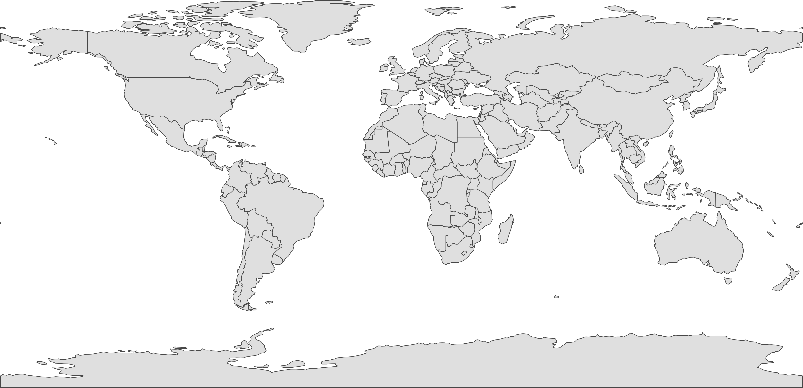

Можно обратить внимание на то, что когда вы отображаете страны полигонами с заливкой, на карте появляются несуществующие границы: на южном полюсе (Антарктида) и вдоль 180-го меридана (на Чукотке). Чтобы такого не происходило, страны всегда визуализируют в 2 слоя: полигонами без обводки и линейными границами поверх:


```r
ggplot() +
  geom_sf(data = lyr110$countries, color = NA) +
  geom_sf(data = lyr110$borders, size = 0.2) +
  theme_void()
```


Убрав обводку стран, мы потеряли береговую линию. Будет логично добавить на карту океан. Однако если отобразить его полигоном с обводкой, как мы попытались изначально поступить при визуализации стран, по границе карты возникнут несуществующие береговые линии:

```r
ggplot() +
  geom_sf(data = lyr110$countries, color = NA) +
  geom_sf(data = lyr110$borders, size = 0.2) +
  geom_sf(data = lyr110$ocean, size = 0.4, fill = 'azure', color = 'steelblue') +
  theme_void()
```


Это означает, что для отображения морских акваторий следует использовать аналогичный прием совмещения полигональных объектов без обводки и их линейной границы:


```r
ggplot() +
  geom_sf(data = lyr110$countries, color = NA) +
  geom_sf(data = lyr110$borders, size = 0.2) +
  geom_sf(data = lyr110$ocean, fill = 'azure', color = NA) +
  geom_sf(data = lyr110$coast, size = 0.4, color = 'steelblue') +
  theme_void()
```

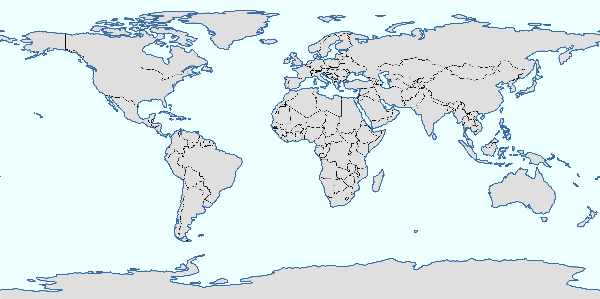

Добавим раскраску стран по их политической принадлежности. При отображении пространственных данных действуют принципы задания графических переменных, аналогичные построению обычных графиков: через `mapping = aes(...)`. Воспользуемся готовым атрибутивным полем в таблице данных для создания политико-административной раскраски:

```r
ggplot() +
  geom_sf(data = lyr110$countries, color = NA, 
          mapping = aes(fill = as.factor(mapcolor7)), show.legend = FALSE) +
  scale_fill_manual(values = brewer.pal(7, 'Set2')) +
  geom_sf(data = lyr110$borders, size = 0.2) +
  geom_sf(data = lyr110$ocean, fill = 'azure', color = NA) +
  geom_sf(data = lyr110$coast, size = 0.4, color = 'steelblue4') +
  theme_void()
```


Нанесем на карту точки и подписи крупнейших столиц. Для нанесения подписей используем `geom_sf_text()` с параметром `nudge_y`, чтобы сдвинуть подписи вверх относительно пунсонов. Помимо этого, чтобы понизить многословность кода, для дальнейших экспериментов перенесем посторяющиеся слои вы список:

```r
lyr110$megacities = lyr110$cities |> 
  filter(SCALERANK == 0, 
         ! NAME %in% c('Washington, D.C.', 'Paris', 'Riyadh', 'Rome', 'São Paulo', 'Kolkata'))
basemap = list(
  geom_sf(data = lyr110$countries, color = NA, 
          mapping = aes(fill = as.factor(mapcolor7)), show.legend = FALSE),
  scale_fill_manual(values = brewer.pal(7, 'Set2')),
  geom_sf(data = lyr110$borders, size = 0.2),
  geom_sf(data = lyr110$ocean, fill = 'azure', color = NA),
  geom_sf(data = lyr110$coast, size = 0.4, color = 'steelblue4'),
  geom_sf(data = lyr110$megacities, shape = 21, fill = 'white', stroke = 0.75, size = 2)
)

ggplot() +
  basemap +
  geom_sf_text(data = lyr110$megacities, mapping = aes(label = name_en),
               size = 3, nudge_y = 5, family = 'Open Sans', fontface = 'bold') +
  theme_void()
```


С подписями точечных объектов, однако, более удобно работать с применением пакета `ggrepel`, который расставляет их автоматически вокруг точек:

```r
ggplot() +
  basemap +
  geom_text_repel(data = lyr110$megacities, stat = "sf_coordinates",
                  size = 3, aes(label = NAME, geometry = geometry), 
                  family = 'Open Sans', fontface = 'bold') +
  theme_void()
```

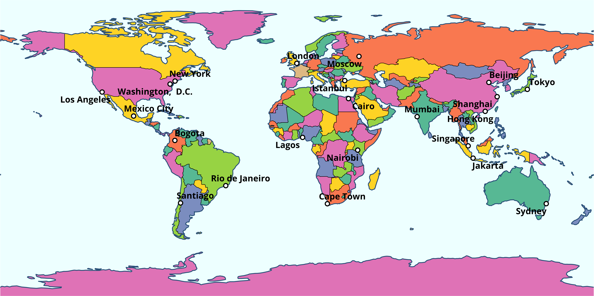

В данном случае все неплохо, но подписи читаются недостаточно хорошо из-за контраста с фоном и береговой линией. Для улучшения читаемости можно сделать заливку стран менее насыщенной, увеличив прозрачность. При этом надо и обводку для точек сделать менее контрастной, чтобы она не выделялась на фоне стран — все-таки, на общегеографических и политико-административных картах равнозначны:


```r
ggplot() +
  basemap +
  geom_text_repel(data = lyr110$megacities, stat = "sf_coordinates",
                  size = 3, aes(label = NAME, geometry = geometry), 
                  family = 'Open Sans', fontface = 'bold') +
  theme_void()
```

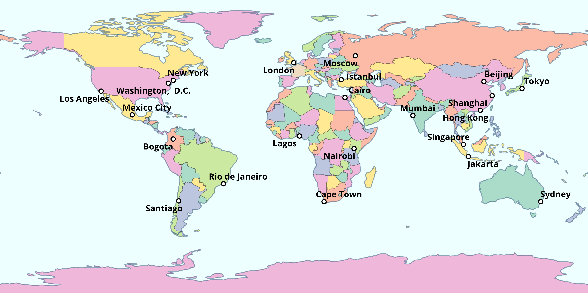

В качестве альтернативного решения можно добавить лекий полупрозрачный фон под подписями городов. Для этого нужно изменить геометрию с `geom_text_repel` на `geom_label_repel` и определить цвет заливки фона:

```r
ggplot() +
  basemap +
  geom_label_repel(data = lyr110$megacities, stat = "sf_coordinates",
                  aes(label = NAME, geometry = geometry), 
                  size = 3, 
                  label.size = NA, 
                  label.padding=.1, 
                  fill = alpha("white", 0.7), 
                  family = 'Open Sans', fontface = 'bold') +
  theme_void()
```

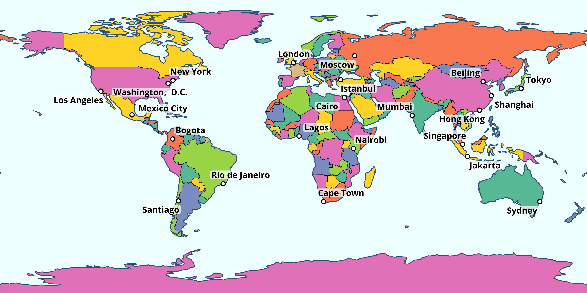


## Проекции и градусные сетки

Когда вы отображаете данные в градусах, не определяя проекцию, они визуализируются в цилиндрической равнопромежуточной проекции. Такая проекция не очень удобна для визуализации земного шара. Запишем исходную карту без проекции в отдельную переменную и визуализируем ее с помощью разных проекций:

```r
map = ggplot() +
  geom_sf(data = lyr110$countries, color = NA,
          mapping = aes(fill = as.factor(mapcolor7)), show.legend = FALSE) +
  scale_fill_manual(values = brewer.pal(7, 'Set2')) +
  geom_sf(data = lyr110$borders, size = 0.2) +
  geom_sf(data = lyr110$ocean, fill = 'azure', color = NA) +
  geom_sf(data = st_wrap_dateline(lyr110$coast), size = 0.4, color = 'steelblue4') +
  geom_sf(data = lyr110$megacities, shape = 21, fill = 'white', stroke = 0.75, size = 2) +
  geom_label_repel(
    data = lyr110$megacities, stat = "sf_coordinates",
    aes(label = NAME, geometry = geometry),
    size = 3,
    label.size = NA,
    label.padding=.1,
    fill = alpha("white", 0.7),
    family = 'Open Sans', fontface = 'bold'
  ) +
  labs(x = NULL, y = NULL) +
  theme_minimal()

map + coord_sf(crs = "+proj=eck3")
```

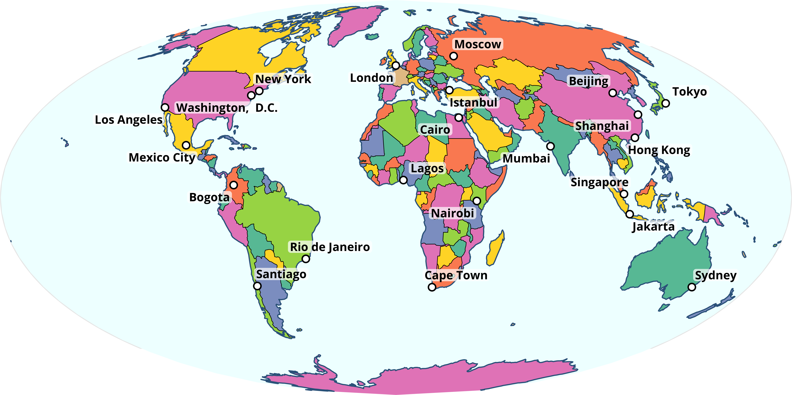

```r
map + coord_sf(crs = "+proj=eqearth")
```

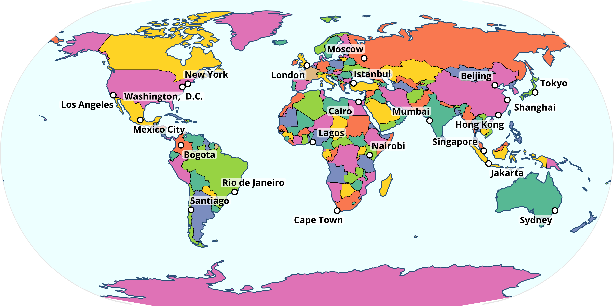

```r
map + coord_sf(crs = "+proj=times")
```


```r
map + coord_sf(crs = "+proj=moll")
```

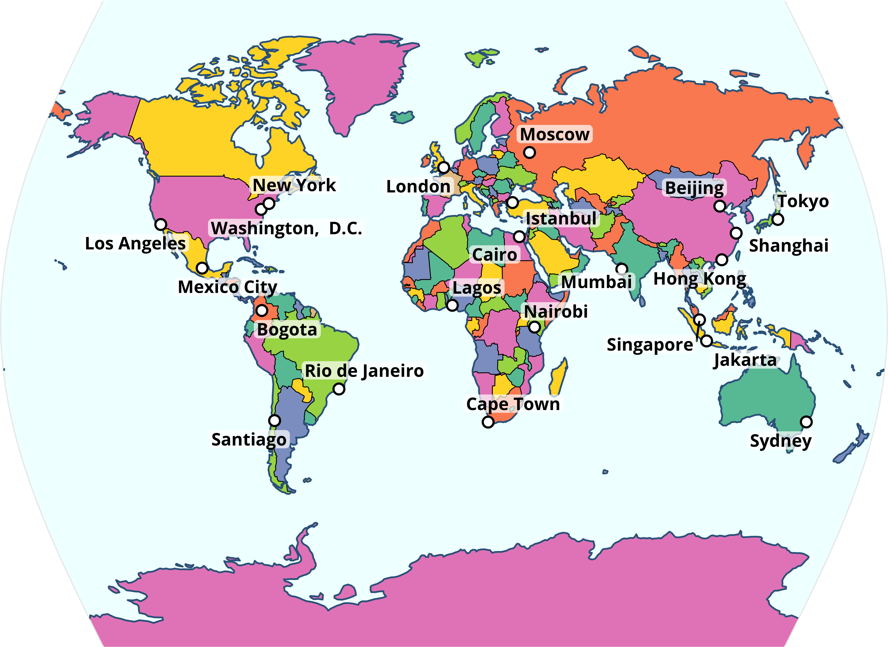


```r
lons = seq(-180, 180, by = 30)
lats = seq(-90, 90, by = 30)

grat = st_graticule(lon = lons, lat = lats)

degree_labels = function(grat, vjust, hjust, size, lon = T, lat = T) {
  pts = grat |>  
    st_cast('POINT') |> 
    group_by(degree, type, degree_label) |> 
    filter(row_number() == 1)
    
  list(
    if (lon) geom_sf_text(data = filter(pts, type == 'E'), vjust = vjust, size = size,
                 mapping = aes(label = degree_label), parse = TRUE),
    if (lat) geom_sf_text(data = filter(pts, type == 'N'), hjust = hjust, size = size,
                 mapping = aes(label = degree_label), parse = TRUE)
  )  
}

map + 
  geom_sf(data = grat, size = 0.1) +
  coord_sf(crs = "+proj=eck3") +
  degree_labels(grat, vjust = +1.5, hjust = +1.5, size = 3)
```

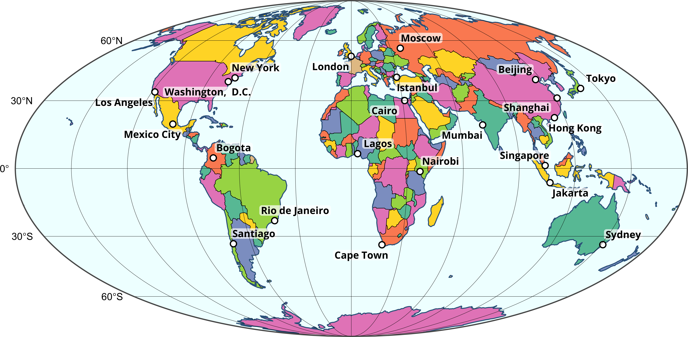

```r


map + 
  geom_sf(data = grat, size = 0.1) +
  coord_sf(crs = "+proj=eqearth") +
  degree_labels(grat, vjust = +1.5, hjust = +1.5, size = 3)
```


```r

map + 
  geom_sf(data = grat, size = 0.1) +
  coord_sf(crs = "+proj=times") +
  degree_labels(grat, vjust = +1.5, hjust = +1.5, size = 3)
```

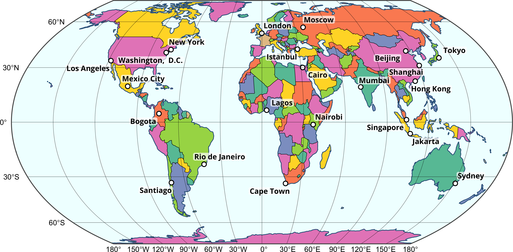

```r

map + 
  geom_sf(data = grat, size = 0.1) +
  coord_sf(crs = "+proj=moll") +
  degree_labels(grat, vjust = +1.5, hjust = +1.5, size = 3, lon = F)
```


### Отображение растровых данных

На общегеографических картах довольно часто присутствует изображение рельефа. Чтобы добавить его на карту, можно использовать специальный тип геометрии `geom_stars`:

```r
dem = read_stars('data/world/gebco.tif') # Цифровая модель рельефа
img = read_stars('data/world/BlueMarbleJuly.tif') # Цветной космический снимок (RGB)

ggplot() +
  geom_stars(data = dem) +
  geom_sf(data = lyr110$coast, size = 0.4, color = 'white') +
  coord_sf() +
  theme_void()
```


Для начала попробуем раскрасить рельеф в традиционной цветовой шкале, и посмотреть как это будет выглядеть:

```r
pal = c('navyblue', 'steelblue', 'azure', 'darkslategray', 'olivedrab', 'lightyellow', 'firebrick', 'pink', 'white')

# Вынесем повторяющиемя слои в отдельный список
hydro_lyrs = list(
  geom_sf(data = lyr110$coast, size = 0.4, color = 'steelblue4'),
  geom_sf(data = lyr110$rivers, size = 0.3, color = 'steelblue4'),
  geom_sf(data = lyr110$lakes, size = 0.3, color = 'steelblue4', fill = 'azure')
)

ggplot() +
  geom_stars(data = dem) +
  scale_fill_gradientn(colours = pal) +
  hydro_lyrs +
  coord_sf() +
  theme_void()
```


Видно, что по умолчаню цвета распределяются равномерно вдоль шкалы. Нам же необходимо ассоциировать их с конкретными высотами. Это можно сделать, определив в функции `scale_fill_gradientn` параметр `values`. Он принимает значения от 0 до 1 и указывает позицию цвета между минимумом и максимум. Чтобы сформировать такие позиции, необходимо сначала сделать гипсометрическую шкалу в метрах, а затем отмасштабировать ее на дипазон $[0, 1]$ посредством функции `rescale` из пакета `scales`:


```r
val = c(min(dem[[1]]), -4000, -200, 0, 100, 300, 1000, 2500, max(dem[[1]])) |> 
  scales::rescale()

ggplot() +
  geom_stars(data = dem) +
  scale_fill_gradientn(colours = pal, values = val) +
  hydro_lyrs +
  coord_sf() +
  theme_void()
```

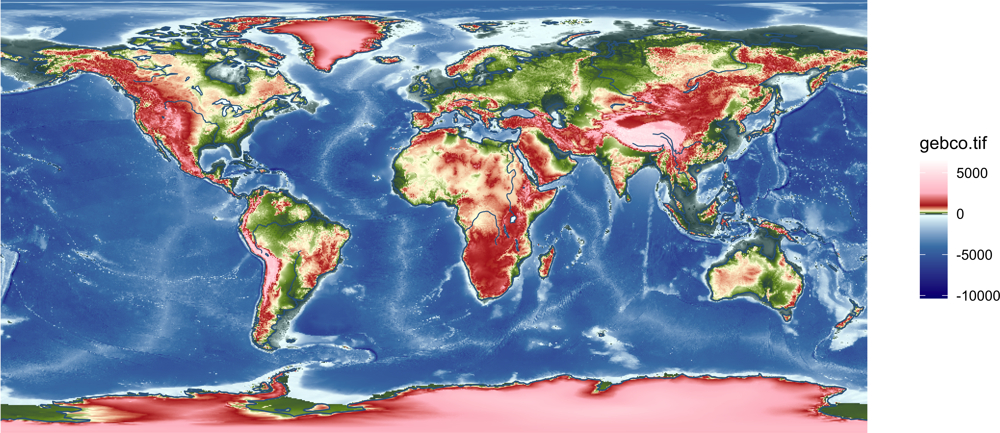

На первый взгляд может показаться, что все в порядке, но есть 2 проблемы:
- отрицательные высоты на суше закрашиваются таким же цветом, как и отрицательные высота на море
- нет резкого перехода через отметку 0, при котором цвет должен меняться с голубого на темно-зеленый.

Чтобы убедиться в этом рассмотрим фрагмент карты подробнее, обратив внимание на Персидский залив, Каспийское и Черное моря:

```r
anno = list(
  annotate("rect", xmin = 45, xmax = 60, ymin = 22, ymax = 32, 
           color = 'white', size = 2, fill = NA),
  annotate("rect", xmin = 45, xmax = 57, ymin = 35, ymax = 48, 
           color = 'white', size = 2, fill = NA),
  annotate("rect", xmin = 26, xmax = 43, ymin = 40, ymax = 48, 
           color = 'white', size = 2, fill = NA)
)

ggplot() +
  geom_stars(data = dem) +
  scale_fill_gradientn(colours = pal, values = val) +
  hydro_lyrs +
  anno +
  coord_sf(xlim = c(10, 75), ylim = c(20, 50)) +
  theme_void()
```


Чтобы не возникало такого эффекта, необходимо разделить цифровую модель рельефа на ldt: одна для суши, вторая для мора. Для этого используем стандартный синтаксис вида `stars[sf]`, который позволяет обрезать объект типа `stars` заданным объектом типа `sf`:

```r
sf_use_s2(FALSE)
## Spherical geometry (s2) switched off
dem_land = dem[lyr110$land]
dem_ocean = dem[lyr110$ocean]

map = ggplot() +
  geom_stars(data = dem_ocean) +
  scale_fill_gradientn(
    colours = c('navyblue', 'steelblue4', 'skyblue2', 'azure', 'azure'),
    values = scales::rescale(
      c(min(dem_ocean[[1]], na.rm = T), 
        -4000, -200, 0, 
        max(dem_ocean[[1]], na.rm = T))
    ),
    na.value = NA
  ) +
  new_scale_fill() +
  geom_stars(data = dem_land) +
  scale_fill_gradientn(
    colours = c('darkslategray', 'darkslategray', 'olivedrab', 
                'lightyellow', 'firebrick', 'pink', 'white'), 
    values = scales::rescale(
      c(min(dem_land[[1]], na.rm = T), 
        -50, 100, 300, 1500, 3500, 
        max(dem_land[[1]], na.rm = T)
      )
    ), 
    na.value = NA
  ) +
  hydro_lyrs +
  coord_sf() +
  theme_void()

map
```


Проверим ранее указанную область:

```r
map +
  coord_sf(xlim = c(10, 75), ylim = c(20, 50)) +
  anno
```

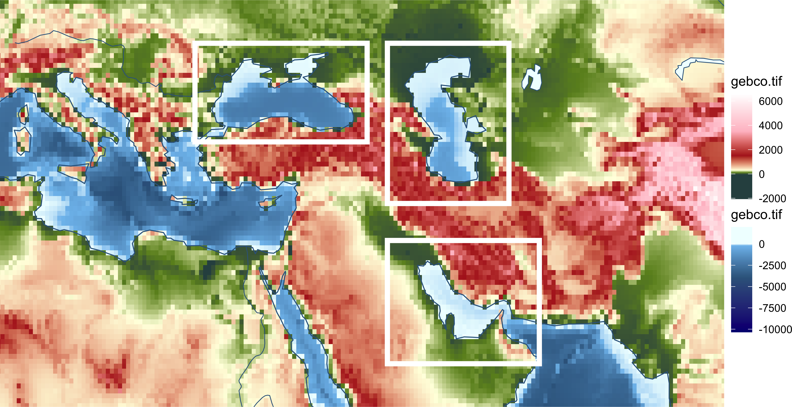


### Вопросы {#questions_maps}

1. Назовите пакет (и одноименную функцию), с помощью которых можно быстро осуществлять интерактивный просмотр пространственных данных.

----
_Самсонов Т.Е._ **Визуализация и анализ географических данных на языке R.** М.: Географический факультет МГУ, 2021. DOI: [10.5281/zenodo.901911](https://doi.org/10.5281/zenodo.901911)
----
