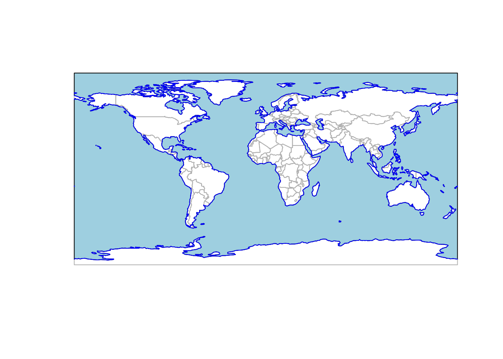
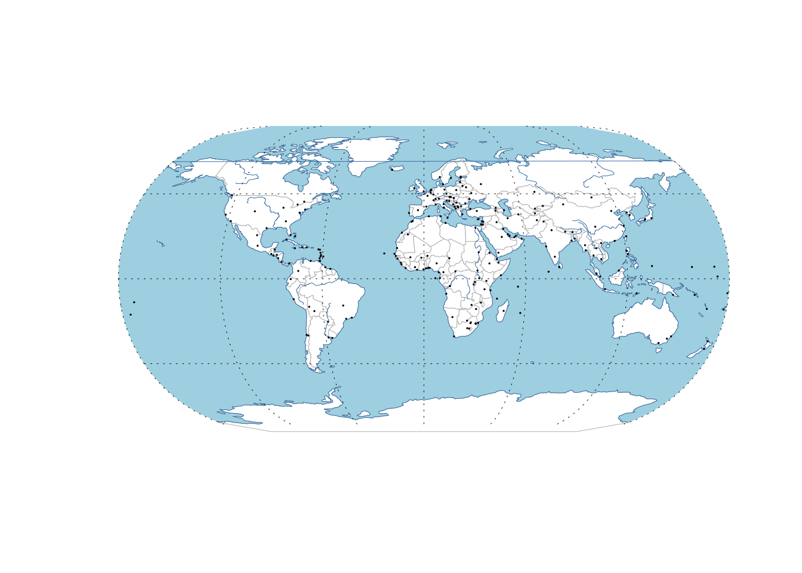
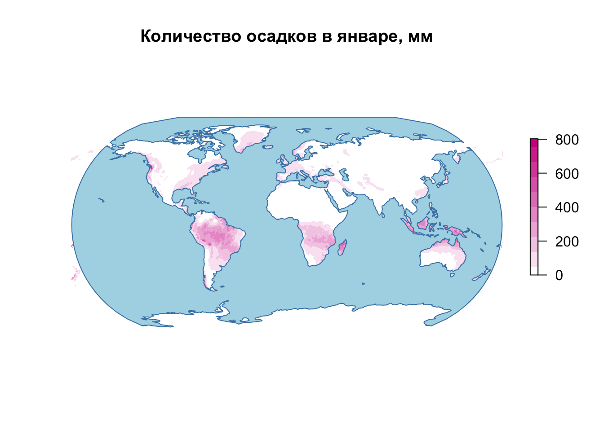
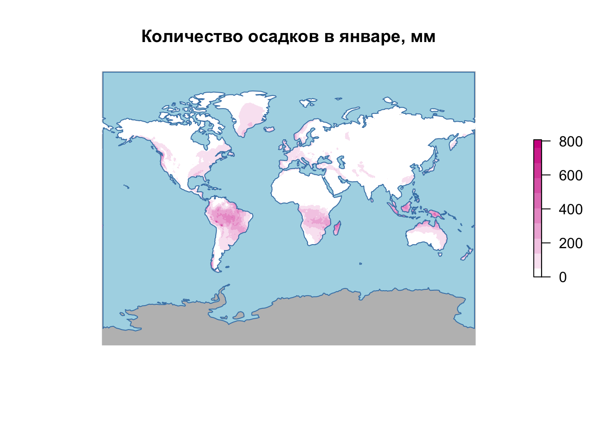

# Тематические карты в R {#thematic_mapping}


Для выполнения кода данной лекции вам понадобятся следующие пакеты:

```r
library(sf)
library(tmap)
library(readxl)
library(raster)
library(mapview)
library(classInt)
library(gapminder)
library(tidyverse)
library(googlesheets)
library(rnaturalearth)
```

## Данные Natural Earth {#thematic_mapping_ne}

[Natural Earth](https://www.naturalearthdata.com/) — это открытые мелкомасштабные картографические данные высокого качества. Данные доступны для трех масштабов: 1:10М, 1:50М и 1:110М. Для доступа к этимм данным из среды R без загрущзки исходных файлов можно использоват пакет [__rnaturalearth__](https://cran.r-project.org/web/packages/rnaturalearth/index.html). Пакет позволяет выгружать данные из внешнего репозитория, а также содержит три предзакачанных слоя:

- `ne_countries()` границы стран
- `ne_states()` границы единиц АТД 1 порядка
- `ne_coastline()` береговая линия

Для загрузки других слоев необходимо использовать функцию `ne_download()`, передав ей масштаб, название слоя и его категорию: 


```r
countries = ne_countries() %>% 
  st_as_sf()
coast = ne_coastline() %>% 
  st_as_sf()

ocean = ne_download(scale = 110, type = 'ocean', category = 'physical')
## OGR data source with driver: ESRI Shapefile 
## Source: "/private/var/folders/h1/_pw8qgdd6y7gy251_ttnq8240000gn/T/RtmpitJbb1", layer: "ne_110m_ocean"
## with 2 features
## It has 3 fields

plot(countries %>% st_geometry(), border = 'grey')
plot(ocean, col = 'lightblue', add = TRUE)
plot(coast, add = TRUE, col = 'blue')
```



## Тематические карты tmap {#thematic_mapping_tmap}

Пакет tmap предоставляет простой в использовании и достаточно мощный механизм формирования тематических карт. Шаблон построения карты в этом пакете напоминает _ggplot_ и выглядит следующим образом:

```r
tm_shape(<DATA>) +
  tm_<METHOD>(<PARAMETERS>)
```

где:

- `DATA` - объект пространственного типа (`sf`, `sp`, `stars` или `raster`)
- `METHOD` - метод визуализации этого объекта (спопоб изображения)
- `PARAMETERS` - параметры метода

### Способы изображений {#thematic_mapping_qual}

Для реализации качественного и количественного фона, а также картограмм используется метод `tm_polygons()`. Он автоматически определяет тип переменной и строит соответствующую шкалу:

```r
tm_shape(countries) +
  tm_polygons('economy') # качественная переменная
```



Количественный фон или картограммы получаются при картографировании числового показателя:

```r
('1H3nzTwbn8z4lJ5gJ_WfDgCeGEXK3PVGcNjQ_U5og8eo' %>% # продолжительность жизни
  gs_key(lookup = FALSE) %>% # не используем авторизацию
  gs_read(ws = 1) %>% 
  rename(name = 1) %>% 
  gather(year, lifexp, -name) %>% 
  filter(year == 2016) %>% 
  left_join(read_excel('gapminder.xlsx', 2)) %>% 
  mutate(geo = stringr::str_to_upper(geo)) -> lifedf) # выгружаем данные по ВВП на душу населения и сохраняем в переменную lifedf
## # A tibble: 260 x 13
##    name  year  lifexp geo   four_regions eight_regions six_regions
##    <chr> <chr>  <dbl> <chr> <chr>        <chr>         <chr>      
##  1 Abkh… 2016    NA   <NA>  <NA>         <NA>          <NA>       
##  2 Afgh… 2016    52.7 AFG   asia         asia_west     south_asia 
##  3 Akro… 2016    NA   <NA>  <NA>         <NA>          <NA>       
##  4 Alba… 2016    78.1 ALB   europe       europe_east   europe_cen…
##  5 Alge… 2016    76.5 DZA   africa       africa_north  middle_eas…
##  6 Amer… 2016    73   <NA>  <NA>         <NA>          <NA>       
##  7 Ando… 2016    84.8 AND   europe       europe_west   europe_cen…
##  8 Ango… 2016    60   AGO   africa       africa_sub_s… sub_sahara…
##  9 Angu… 2016    NA   <NA>  <NA>         <NA>          <NA>       
## 10 Anti… 2016    76.5 ATG   americas     america_north america    
## # ... with 250 more rows, and 6 more variables: members_oecd_g77 <chr>,
## #   Latitude <dbl>, Longitude <dbl>, `UN member since` <dttm>, `World bank
## #   region` <chr>, `World bank income group 2017` <chr>

coun = countries %>% left_join(lifedf, by = c('adm0_a3' = 'geo'))

tm_shape(coun) +
  tm_polygons('lifexp') # количественная переменная
```



Для реализации способа картодиаграмм используется геометрия `tm_bubbles()`. Чтобы оставить отображение границ полигонов, нам необходимо к одной геометрии применить несколько способов изображения:

```r
tm_shape(ocean)+
  tm_fill(col = 'lightblue') +
tm_shape(coun) +
  tm_fill() +
  tm_borders() +
  tm_bubbles('gdp_md_est', 
             scale = 3,
             col = 'red', 
             alpha = 0.5) # количественная переменная
```




----
_Самсонов Т.Е._ **Визуализация и анализ географических данных на языке R.** М.: Географический факультет МГУ, 2017. DOI: 10.5281/zenodo.901911
----
