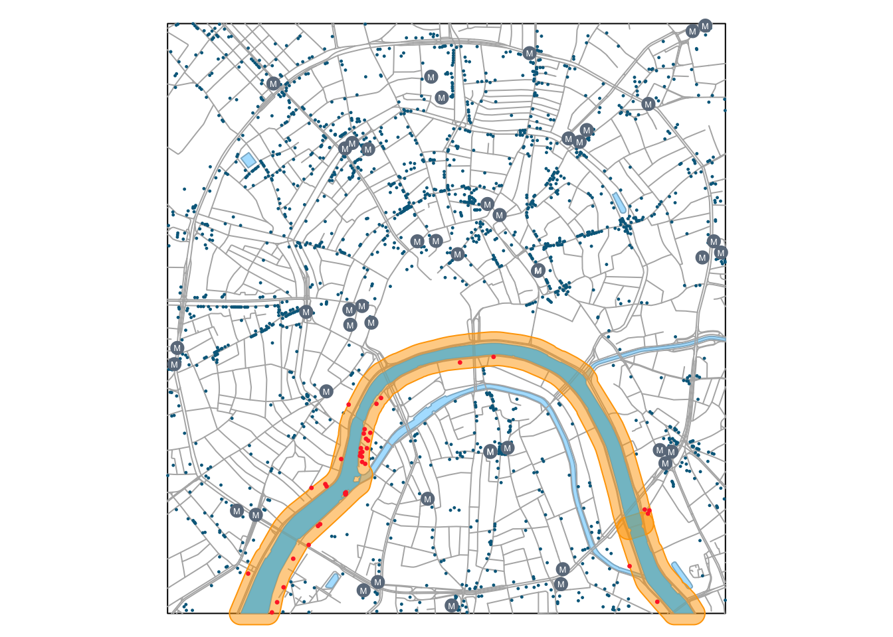
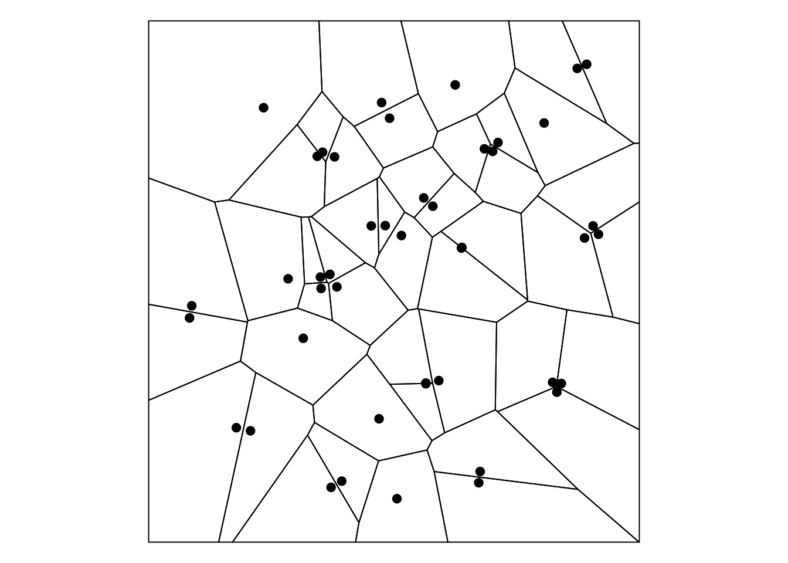
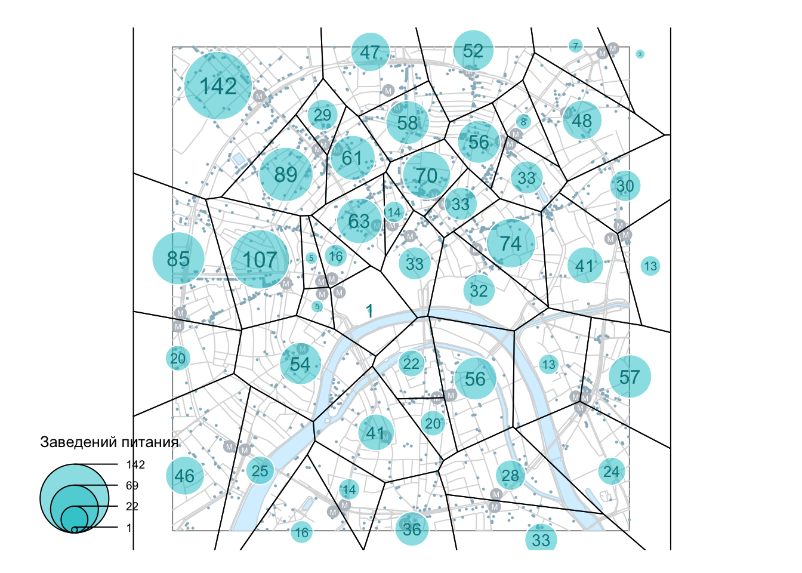
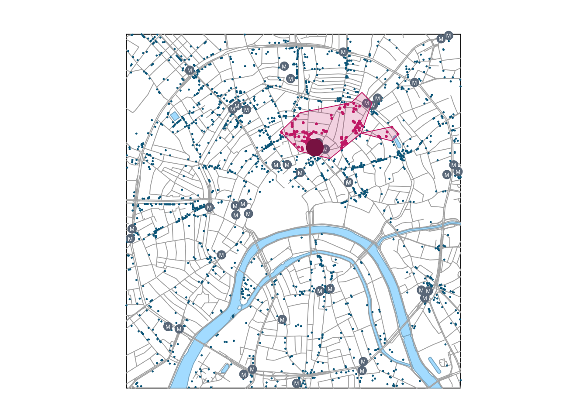
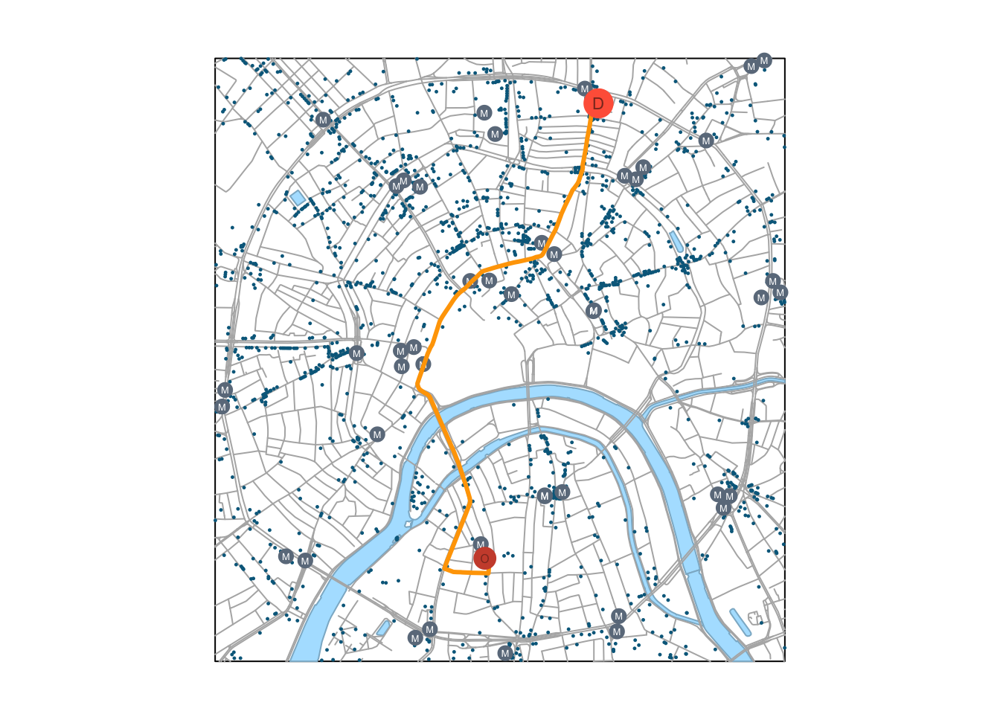

# Векторный и сетевой анализ {#vector_analysis}


Данный модуль посвящен пространственному анализу в R. Несмотря на то, что пространственный анализ — чрезвычайно широкая и многогранная область геоинформатики, все методы, которые объединяются под этим заголовком, базируются на ограниченном числе базовых операций, таких как вычисление расстояний, оценка плотности распределения, построение буферных зон и выполнение пространственных запросов. В настоящем модуле мы рассмотрим, как одно и то же множество пространственных объектов можно анализировать в различных контекстах, используя базовые методы пространственного анализа

Пространственный анализ связан с оценкой _размещения_ объектов и _распределения_ величин в географическом пространстве. В геоинформатике для этих целей используется два подхода: геометрический и статистический. Эти подходы образуют две ступени пространственного анализа: как правило, данные геометрического анализа представляют собой входную информацию для анализа статистического.

Геометрический подход связан с вычислением расстояний между географическими локациями, а также агрегированием объектов/интегрированием показателей в пределах заданных областей, вдоль линий или в окрестности точек. Поиск входной информации для агрегирования решается путем выполнения _пространственных запросов_.

## Пространственные запросы  {#spatial_queries}

__Пространственные запросы__ связаны с поиском объектов (географических локаций), удовлетворяющих условию, заданному на множестве пространственных отношений. В свою очередь, пространственные отношения бывают трех типов: _дирекционные_ (направления), _метрические_ (расстояния) и _топологические_ (взаимное размещение). Примеры пространственных запросов знакомы любому географу:

* Найти все объекты внутри административного района (топологические отношения)
* Найти все объекты не далее 100 метров от дороги (метрические отношения)
* Найти все объекты, расположенные к северу от точки (дирекционные отношения) 

Пространственные запросы могут объединять несколько условий. Можно найти объекты, удовлетворяющие одновременно _всем_ (_логическое И_) вышеперечисленным условиям: внутри района, не далее 100 м от дороги и к северу от выбранной точки; или _хотя бы одному_ (_логическое ИЛИ_) из вышеперечисленных условий. Результат выполнения такого комплексного запроса будет являться, соответственно, пересечением множеств объектов, полученных каждым из запросов, или их объединением.

Наконец, пространственные запросы можно объединять с _атрибутивными_ и _временными_. Атрибутивные запросы связаны с поиском объектов (географических локаций), удовлетворяющих условию, заданному на множестве характеристик объектов. Временные запросы определены на множестве шкалы времени. Например, можно найти все населенные пункты населением свыше 10 000 человек (атрибутивный запрос), находящиеся в пределах выбранного административного района (пространственный запрос, основанный на топологических отношениях), время движения от которых до районного центра не превышает 90 минут (временной запрос).

### Контекстные и целевые объекты {#context_objects}

При выполнении пространственного анализа, в общем случае, имеются множества объектов двух типов:

* __контекстные__ --- объекты, относительно которых будет оцениваться размещение других объектов, то есть, определяющие _контекст анализа_
* __целевые__ --- объекты, размещение которых анализируется по отношению к контекстным объектам, что является _целью_ анализа

Эти множества, разумеется, могут совпадать. Скажем, мы можем проанализировать размещение магазинов относительно других магазинов.

### Зоны окружения объектов {#zones}

Весьма часто в качестве контекстного множества используются не реальные пространственные объекты, а набор абстрактных геометрических объектов, каждый из которых является производным от оригинального пространственного объекта. Как правило, такие геометрии представляют из себя _зоны окружения_ объектов, построенные по некоторому формальному признаку.

Методы построения зон окружения можно разделить по двум критериям: учету взаимного размещения объектов (абсолютные и конкурентные зоны) и пространству признаков, в котором эти зоны строятся.

Если зоны окружения строятся без учета взаимного размещения объектов, то есть, независимо для каждого объекта, то мы будем называть их абсолютными. Абсолютные зоны окружения строятся путем фиксации порогового расстояния либо времени движения относительно исходного объекта. Такие зоны носят название буферных зон (по расстоянию) или зон доступности (по времени). Границей абсолютной зоны окружения является изолиния, построенная по соответствующему показателю. В случае времени это будет _изохрона_. Примеры абсолютных зон окружения:

* Водоохранная зона реки 200 метров (буферная зона)
* Площадь городской территории, в любую точку которой вы можете доехать из дома на машине в течение 30 минут (зона доступности)

Если же при построении зон окружения учитывается взаимное размещение объектов, то в данном случае зоны доступности строятся не исходя из порогового значения показателя (хотя оно может использоваться дополнительно), а исходя из того, какой объект является ближайшим. Конкурентные зоны окружения представляют собой [разбиение](https://ru.wikipedia.org/wiki/Разбиение_множества) пространства на неперекрывающиеся участки без дыр, каждый из которых является зоной окружения соответствующего пространственного объекта. При этом любая точка внутри зоны окружения объекта ближе к этому объекту по выбранному признаку (времени или расстоянию), нежели к любому другому объекту. Конкурентные зоны окружения, построенные по расстоянию, можно реализовать средствами [диаграммы Вороного](https://ru.wikipedia.org/wiki/Диаграмма_Вороного).

## Постановка задач и изучение данных {#use_case}

В настоящем модуле мы рассмотрим вышеперечисленные методы на примере анализа размещения пунктов общественного питания --- кафе, ресторанов и т.д. Используя методы пространственного анализа в среде R, мы ответим на следующие вопросы:

* Какие улицы являются местами наибольшей концентрации заведений общественного питания?
* Как распределены заведения общественного питания по районам центра Москвы?
* Какие заведения общественного питания находятся вблизи метро и на берегу реки?
* В какие заведения общественного питания можно доехать от выбранной точки в течение 5 минут?
* Каков оптимальный маршрут между вашим местоположением и заведением, в котором вы хотите пообедать?

В качестве источника данных используем [OpenStreetMap](http://www.openstreetmap.org) --- краудсорсинговый интернет-проект по созданию бесплатных и открытых пространственных данных глобального охвата. Данные OpenStreetMap в удобном для использования в ГИС виде доступны на [портале GIS-Lab](http://beryllium.gis-lab.info/project/osmshp/).

Для решения задач настоящего модуля нам понадобятся следующие дополнительные пакеты, которые мы не использовали ранее:

* [osrm](https://cran.r-project.org/web/packages/osrm/index.html) --- построение зон доступности, маршрутов и матриц корреспонденции онлайн на основе данных OpenStreetMap и [OSRM API](http://project-osrm.org).
* [cartography](https://cran.r-project.org/web/packages/cartography/index.html) --- пакет, облегчающий построение тематических карт и легенд средствами стандартной функции `plot()`.

Начнем наше исследование с визуального анализа исходных данных

```r
library(sf)
library(dplyr)
library(classInt)
library(osrm) # Использование онлайн-сервиса маршрутизации OSRM
library(cartography) # Удобное построение тематических карт средствами plot()

# Чтение данных
roads = st_read("roads.gpkg") # Дороги
poi = st_read("poi_point.gpkg") # Точки интереса
rayons = st_read("boundary_polygon.gpkg") # Границы районов
stations = st_read("metro_stations.gpkg") # Станции метро
water = st_read("water_polygon.gpkg") # Водные объекты

# Прочитаем текущие параметры компоновки
def = par(no.readonly = TRUE)

# Уберем поля, чтобы карта занимала весь экран
par(mar = c(0,0,0,0))

# Получим ограничивающий прямоугольник слоя дорог в качестве общего охвата карты
frame = roads %>% st_bbox() %>% st_as_sfc() %>% st_geometry()

## ОБЗОР ИСХОДНЫХ ДАННЫХ -------------------------------------

# Визуализируем входные данные
plot(frame)
plot(water %>% st_geometry(), 
     col = "lightskyblue1",
     border = "lightskyblue3",
     add = TRUE)
plot(roads %>% st_geometry(),
     col = "gray70", 
     add = TRUE)
plot(poi %>% st_geometry(), 
     col = "deepskyblue4", 
     pch = 20, 
     cex = 0.2, 
     add = TRUE)
```


Теперь приступим к изучению данных, хранящихся в слое `poi` (от англ. POI --- Point Of Interest). Данный слой содержит все точечные маркеры OSM, которыми были отмечены на карте объекты, представляющие (по мнению создателей данных) интерес для пользователей. В POI включаются самые разнообразные объекты, такие как: объекты сферы услуг (amenity), места для отдыха (leisure), офисные здания (office), магазины и торговые центры (shop), туристические достопримечательности (tourism), спортивные объекты (sport), примечательные инженерные сооружения (man_made). В наших данных информация разнесена по соответствующим полям, каждый объект снабжен уникальным идентификатором:

```r
View(poi)
```
<div data-pagedtable="false">
  <script data-pagedtable-source type="application/json">
{"columns":[{"label":["OSM_ID"],"name":[1],"type":["dbl"],"align":["right"]},{"label":["NAME"],"name":[2],"type":["fctr"],"align":["left"]},{"label":["MAN_MADE"],"name":[3],"type":["fctr"],"align":["left"]},{"label":["LEISURE"],"name":[4],"type":["fctr"],"align":["left"]},{"label":["AMENITY"],"name":[5],"type":["fctr"],"align":["left"]},{"label":["OFFICE"],"name":[6],"type":["fctr"],"align":["left"]},{"label":["SHOP"],"name":[7],"type":["fctr"],"align":["left"]},{"label":["TOURISM"],"name":[8],"type":["fctr"],"align":["left"]},{"label":["SPORT"],"name":[9],"type":["fctr"],"align":["left"]},{"label":["geometry"],"name":[10],"type":["S3: sfc_POINT"],"align":["right"]}],"data":[{"1":"2932331614","2":"Арт-квартал","3":"NA","4":"NA","5":"NA","6":"NA","7":"doityourself","8":"NA","9":"NA","10":"<S3: sfc_POINT>"},{"1":"3639408399","2":"NA","3":"NA","4":"NA","5":"pharmacy","6":"NA","7":"NA","8":"NA","9":"NA","10":"<S3: sfc_POINT>"},{"1":"3707882299","2":"NA","3":"NA","4":"NA","5":"parking_entrance","6":"NA","7":"NA","8":"NA","9":"NA","10":"<S3: sfc_POINT>"},{"1":"3639408396","2":"Стиль золото","3":"NA","4":"NA","5":"NA","6":"NA","7":"jewelry","8":"NA","9":"NA","10":"<S3: sfc_POINT>"},{"1":"3639408397","2":"Цветочная база №1","3":"NA","4":"NA","5":"NA","6":"NA","7":"florist","8":"NA","9":"NA","10":"<S3: sfc_POINT>"},{"1":"1413216563","2":"Азбука Вкуса","3":"NA","4":"NA","5":"NA","6":"NA","7":"supermarket","8":"NA","9":"NA","10":"<S3: sfc_POINT>"},{"1":"3641139540","2":"NA","3":"NA","4":"NA","5":"waste_disposal","6":"NA","7":"NA","8":"NA","9":"NA","10":"<S3: sfc_POINT>"},{"1":"3636920934","2":"Аршин","3":"NA","4":"NA","5":"restaurant","6":"NA","7":"NA","8":"NA","9":"NA","10":"<S3: sfc_POINT>"},{"1":"3644422074","2":"Адамас","3":"NA","4":"NA","5":"NA","6":"NA","7":"jewelry","8":"NA","9":"NA","10":"<S3: sfc_POINT>"},{"1":"3424516009","2":"Андерсон","3":"NA","4":"NA","5":"restaurant","6":"NA","7":"NA","8":"NA","9":"NA","10":"<S3: sfc_POINT>"},{"1":"3638910848","2":"NA","3":"NA","4":"NA","5":"NA","6":"NA","7":"convenience","8":"NA","9":"NA","10":"<S3: sfc_POINT>"},{"1":"3640349651","2":"NA","3":"NA","4":"NA","5":"NA","6":"NA","7":"shoes","8":"NA","9":"NA","10":"<S3: sfc_POINT>"},{"1":"3640349618","2":"Алкомаркет","3":"NA","4":"NA","5":"NA","6":"NA","7":"alcohol","8":"NA","9":"NA","10":"<S3: sfc_POINT>"},{"1":"3141565913","2":"Holynoot","3":"NA","4":"NA","5":"fast_food","6":"NA","7":"NA","8":"NA","9":"NA","10":"<S3: sfc_POINT>"},{"1":"1839631442","2":"Полярные совы","3":"NA","4":"NA","5":"NA","6":"NA","7":"NA","8":"attraction","9":"NA","10":"<S3: sfc_POINT>"},{"1":"3636920955","2":"NA","3":"NA","4":"NA","5":"NA","6":"NA","7":"hardware","8":"NA","9":"NA","10":"<S3: sfc_POINT>"},{"1":"3644652513","2":"NA","3":"NA","4":"NA","5":"NA","6":"NA","7":"pawnbroker","8":"NA","9":"NA","10":"<S3: sfc_POINT>"},{"1":"2219502356","2":"NA","3":"NA","4":"NA","5":"NA","6":"NA","7":"clothes","8":"NA","9":"NA","10":"<S3: sfc_POINT>"},{"1":"3640349652","2":"NA","3":"NA","4":"NA","5":"pharmacy","6":"NA","7":"NA","8":"NA","9":"NA","10":"<S3: sfc_POINT>"},{"1":"2575626696","2":"NA","3":"NA","4":"NA","5":"atm","6":"NA","7":"NA","8":"NA","9":"NA","10":"<S3: sfc_POINT>"},{"1":"3641139528","2":"NA","3":"NA","4":"NA","5":"waste_disposal","6":"NA","7":"NA","8":"NA","9":"NA","10":"<S3: sfc_POINT>"},{"1":"3636920935","2":"Горздрав","3":"NA","4":"NA","5":"pharmacy","6":"NA","7":"NA","8":"NA","9":"NA","10":"<S3: sfc_POINT>"},{"1":"3639014756","2":"NA","3":"NA","4":"NA","5":"NA","6":"NA","7":"optician","8":"NA","9":"NA","10":"<S3: sfc_POINT>"},{"1":"3644652299","2":"Библиотека им. Гоголя","3":"NA","4":"NA","5":"library","6":"NA","7":"NA","8":"NA","9":"NA","10":"<S3: sfc_POINT>"},{"1":"3123637874","2":"Росавтобанк","3":"NA","4":"NA","5":"bank","6":"NA","7":"NA","8":"NA","9":"NA","10":"<S3: sfc_POINT>"},{"1":"2528148637","2":"Gayane's","3":"NA","4":"NA","5":"restaurant","6":"NA","7":"NA","8":"NA","9":"NA","10":"<S3: sfc_POINT>"},{"1":"3727984255","2":"Порше Центр Москва","3":"NA","4":"NA","5":"NA","6":"NA","7":"car","8":"NA","9":"NA","10":"<S3: sfc_POINT>"},{"1":"3133624932","2":"Molon Lave","3":"NA","4":"NA","5":"restaurant","6":"NA","7":"NA","8":"NA","9":"NA","10":"<S3: sfc_POINT>"},{"1":"2934001384","2":"Лик","3":"NA","4":"NA","5":"dentist","6":"NA","7":"NA","8":"NA","9":"NA","10":"<S3: sfc_POINT>"},{"1":"3219325186","2":"Дербент","3":"NA","4":"NA","5":"NA","6":"NA","7":"alcohol","8":"NA","9":"NA","10":"<S3: sfc_POINT>"},{"1":"2463674026","2":"Шоколадница","3":"NA","4":"NA","5":"cafe","6":"NA","7":"NA","8":"NA","9":"NA","10":"<S3: sfc_POINT>"},{"1":"3636920938","2":"Отдохни","3":"NA","4":"NA","5":"NA","6":"NA","7":"alcohol","8":"NA","9":"NA","10":"<S3: sfc_POINT>"},{"1":"2808914711","2":"NA","3":"NA","4":"NA","5":"NA","6":"NA","7":"ticket","8":"NA","9":"NA","10":"<S3: sfc_POINT>"},{"1":"2575625325","2":"NA","3":"NA","4":"NA","5":"toilets","6":"NA","7":"NA","8":"NA","9":"NA","10":"<S3: sfc_POINT>"},{"1":"2540409715","2":"Шоколадница","3":"NA","4":"NA","5":"cafe","6":"NA","7":"NA","8":"NA","9":"NA","10":"<S3: sfc_POINT>"},{"1":"3219325872","2":"Цитадель","3":"NA","4":"NA","5":"cafe","6":"NA","7":"NA","8":"NA","9":"NA","10":"<S3: sfc_POINT>"},{"1":"3636920936","2":"МясновЪ","3":"NA","4":"NA","5":"NA","6":"NA","7":"butcher","8":"NA","9":"NA","10":"<S3: sfc_POINT>"},{"1":"2491694034","2":"Монетка","3":"NA","4":"NA","5":"NA","6":"NA","7":"convenience","8":"NA","9":"NA","10":"<S3: sfc_POINT>"},{"1":"3219316059","2":"Кулинар","3":"NA","4":"NA","5":"NA","6":"NA","7":"deli","8":"NA","9":"NA","10":"<S3: sfc_POINT>"},{"1":"2621942431","2":"Zodiac","3":"NA","4":"NA","5":"restaurant","6":"NA","7":"NA","8":"NA","9":"NA","10":"<S3: sfc_POINT>"},{"1":"3475693954","2":"Ку-Ка","3":"NA","4":"NA","5":"cafe","6":"NA","7":"NA","8":"NA","9":"NA","10":"<S3: sfc_POINT>"},{"1":"3673025329","2":"Balzi Rossi","3":"NA","4":"NA","5":"restaurant","6":"NA","7":"NA","8":"NA","9":"NA","10":"<S3: sfc_POINT>"},{"1":"3043173588","2":"аптечный пункт","3":"NA","4":"NA","5":"pharmacy","6":"NA","7":"NA","8":"NA","9":"NA","10":"<S3: sfc_POINT>"},{"1":"2541226792","2":"Luciano","3":"NA","4":"NA","5":"restaurant","6":"NA","7":"NA","8":"NA","9":"NA","10":"<S3: sfc_POINT>"},{"1":"3636920941","2":"Арт Карандаш","3":"NA","4":"NA","5":"NA","6":"NA","7":"stationery","8":"NA","9":"NA","10":"<S3: sfc_POINT>"},{"1":"2463911737","2":"Сайгон","3":"NA","4":"NA","5":"restaurant","6":"NA","7":"NA","8":"NA","9":"NA","10":"<S3: sfc_POINT>"},{"1":"2738045990","2":"Планета Суши","3":"NA","4":"NA","5":"restaurant","6":"NA","7":"NA","8":"NA","9":"NA","10":"<S3: sfc_POINT>"},{"1":"1815311511","2":"NA","3":"NA","4":"NA","5":"NA","6":"NA","7":"convenience","8":"NA","9":"NA","10":"<S3: sfc_POINT>"},{"1":"2528148639","2":"Панаехали","3":"NA","4":"NA","5":"restaurant","6":"NA","7":"NA","8":"NA","9":"NA","10":"<S3: sfc_POINT>"},{"1":"1838704625","2":"Белые медведи","3":"NA","4":"NA","5":"NA","6":"NA","7":"NA","8":"attraction","9":"NA","10":"<S3: sfc_POINT>"},{"1":"2675862175","2":"Lucky Noodles","3":"NA","4":"NA","5":"fast_food","6":"NA","7":"NA","8":"NA","9":"NA","10":"<S3: sfc_POINT>"},{"1":"3644652307","2":"Натаниэль","3":"NA","4":"NA","5":"NA","6":"NA","7":"beauty","8":"NA","9":"NA","10":"<S3: sfc_POINT>"},{"1":"938253590","2":"Банкомат - Банк Москвы","3":"NA","4":"NA","5":"atm","6":"NA","7":"NA","8":"NA","9":"NA","10":"<S3: sfc_POINT>"},{"1":"2463911728","2":"Дикси","3":"NA","4":"NA","5":"NA","6":"NA","7":"supermarket","8":"NA","9":"NA","10":"<S3: sfc_POINT>"},{"1":"904569980","2":"Банк Москвы","3":"NA","4":"NA","5":"bank","6":"NA","7":"NA","8":"NA","9":"NA","10":"<S3: sfc_POINT>"},{"1":"428737110","2":"Отделение связи №119121","3":"NA","4":"NA","5":"post_office","6":"NA","7":"NA","8":"NA","9":"NA","10":"<S3: sfc_POINT>"},{"1":"904570066","2":"NA","3":"NA","4":"NA","5":"toilets","6":"NA","7":"NA","8":"NA","9":"NA","10":"<S3: sfc_POINT>"},{"1":"2277752703","2":"NA","3":"NA","4":"NA","5":"NA","6":"NA","7":"shoes","8":"NA","9":"NA","10":"<S3: sfc_POINT>"},{"1":"2738045983","2":"IL Патио","3":"NA","4":"NA","5":"restaurant","6":"NA","7":"NA","8":"NA","9":"NA","10":"<S3: sfc_POINT>"},{"1":"2277752662","2":"Кофе Хауз","3":"NA","4":"NA","5":"cafe","6":"NA","7":"NA","8":"NA","9":"NA","10":"<S3: sfc_POINT>"},{"1":"3043173590","2":"NA","3":"NA","4":"NA","5":"NA","6":"NA","7":"kiosk","8":"NA","9":"NA","10":"<S3: sfc_POINT>"},{"1":"3043173591","2":"NA","3":"NA","4":"NA","5":"NA","6":"NA","7":"kiosk","8":"NA","9":"NA","10":"<S3: sfc_POINT>"},{"1":"3043173586","2":"Мороженое","3":"NA","4":"NA","5":"ice_cream","6":"NA","7":"NA","8":"NA","9":"NA","10":"<S3: sfc_POINT>"},{"1":"3043173592","2":"NA","3":"NA","4":"NA","5":"NA","6":"NA","7":"kiosk","8":"NA","9":"NA","10":"<S3: sfc_POINT>"},{"1":"3043173589","2":"Стардог!s","3":"NA","4":"NA","5":"fast_food","6":"NA","7":"NA","8":"NA","9":"NA","10":"<S3: sfc_POINT>"},{"1":"619163928","2":"Зелёный Перекрёсток","3":"NA","4":"NA","5":"NA","6":"NA","7":"supermarket","8":"NA","9":"NA","10":"<S3: sfc_POINT>"},{"1":"3431817438","2":"NA","3":"NA","4":"NA","5":"bench","6":"NA","7":"NA","8":"NA","9":"NA","10":"<S3: sfc_POINT>"},{"1":"3638722827","2":"Кофе Хауз","3":"NA","4":"NA","5":"cafe","6":"NA","7":"NA","8":"NA","9":"NA","10":"<S3: sfc_POINT>"},{"1":"1728524384","2":"Шоколад","3":"NA","4":"NA","5":"cafe","6":"NA","7":"NA","8":"NA","9":"NA","10":"<S3: sfc_POINT>"},{"1":"3043173587","2":"Посылочный отдел Почты России","3":"NA","4":"NA","5":"post_office","6":"NA","7":"NA","8":"NA","9":"NA","10":"<S3: sfc_POINT>"},{"1":"1826627013","2":"NA","3":"NA","4":"NA","5":"fountain","6":"NA","7":"NA","8":"NA","9":"NA","10":"<S3: sfc_POINT>"},{"1":"2318124178","2":"Гастроном","3":"NA","4":"NA","5":"NA","6":"NA","7":"convenience","8":"NA","9":"NA","10":"<S3: sfc_POINT>"},{"1":"3223317691","2":"NA","3":"NA","4":"NA","5":"bicycle_rental","6":"NA","7":"NA","8":"NA","9":"NA","10":"<S3: sfc_POINT>"},{"1":"2641981268","2":"Oбъект","3":"NA","4":"NA","5":"NA","6":"NA","7":"furniture","8":"NA","9":"NA","10":"<S3: sfc_POINT>"},{"1":"3727984252","2":"Клеопатра","3":"NA","4":"NA","5":"NA","6":"NA","7":"shoes","8":"NA","9":"NA","10":"<S3: sfc_POINT>"},{"1":"3043238768","2":"Нотариус Зюнина Елена Вильевна","3":"NA","4":"NA","5":"NA","6":"lawyer","7":"NA","8":"NA","9":"NA","10":"<S3: sfc_POINT>"},{"1":"3431817448","2":"NA","3":"NA","4":"NA","5":"bench","6":"NA","7":"NA","8":"NA","9":"NA","10":"<S3: sfc_POINT>"},{"1":"3431817445","2":"NA","3":"NA","4":"NA","5":"bench","6":"NA","7":"NA","8":"NA","9":"NA","10":"<S3: sfc_POINT>"},{"1":"2291301771","2":"Прана","3":"NA","4":"sports_centre","5":"NA","6":"NA","7":"NA","8":"NA","9":"yoga","10":"<S3: sfc_POINT>"},{"1":"2530927063","2":"People","3":"NA","4":"NA","5":"NA","6":"NA","7":"NA","8":"hostel","9":"NA","10":"<S3: sfc_POINT>"},{"1":"3650549469","2":"Cosmotheca","3":"NA","4":"NA","5":"NA","6":"NA","7":"cosmetics","8":"NA","9":"NA","10":"<S3: sfc_POINT>"},{"1":"2641981276","2":"Связь банк","3":"NA","4":"NA","5":"bureau_de_change","6":"NA","7":"NA","8":"NA","9":"NA","10":"<S3: sfc_POINT>"},{"1":"3632921595","2":"NA","3":"NA","4":"NA","5":"waste_disposal","6":"NA","7":"NA","8":"NA","9":"NA","10":"<S3: sfc_POINT>"},{"1":"1250611645","2":"Институт проблем охраны труда","3":"NA","4":"NA","5":"university","6":"NA","7":"NA","8":"NA","9":"NA","10":"<S3: sfc_POINT>"},{"1":"2277752704","2":"Отделение связи №121099","3":"NA","4":"NA","5":"post_office","6":"NA","7":"NA","8":"NA","9":"NA","10":"<S3: sfc_POINT>"},{"1":"3638722823","2":"Cosmotheca","3":"NA","4":"NA","5":"NA","6":"NA","7":"beauty","8":"NA","9":"NA","10":"<S3: sfc_POINT>"},{"1":"3431817456","2":"NA","3":"NA","4":"NA","5":"bench","6":"NA","7":"NA","8":"NA","9":"NA","10":"<S3: sfc_POINT>"},{"1":"2575629275","2":"NA","3":"NA","4":"NA","5":"toilets","6":"NA","7":"NA","8":"NA","9":"NA","10":"<S3: sfc_POINT>"},{"1":"3711746881","2":"Chicha","3":"NA","4":"NA","5":"restaurant","6":"NA","7":"NA","8":"NA","9":"NA","10":"<S3: sfc_POINT>"},{"1":"2461679590","2":"Доможилов","3":"NA","4":"NA","5":"restaurant","6":"NA","7":"NA","8":"NA","9":"NA","10":"<S3: sfc_POINT>"},{"1":"2575693870","2":"Clumba Club","3":"NA","4":"NA","5":"restaurant","6":"NA","7":"NA","8":"NA","9":"NA","10":"<S3: sfc_POINT>"},{"1":"2641981275","2":"Психоневрологический диспансер №2","3":"NA","4":"NA","5":"doctors","6":"NA","7":"NA","8":"NA","9":"NA","10":"<S3: sfc_POINT>"},{"1":"1839631447","2":"Турья горка","3":"NA","4":"NA","5":"NA","6":"NA","7":"NA","8":"attraction","9":"NA","10":"<S3: sfc_POINT>"},{"1":"1201984193","2":"Урюк","3":"NA","4":"NA","5":"cafe","6":"NA","7":"NA","8":"NA","9":"NA","10":"<S3: sfc_POINT>"},{"1":"2641981280","2":"NA","3":"NA","4":"NA","5":"bureau_de_change","6":"NA","7":"NA","8":"NA","9":"NA","10":"<S3: sfc_POINT>"},{"1":"2276187140","2":"Проездные билеты","3":"NA","4":"NA","5":"NA","6":"NA","7":"ticket","8":"NA","9":"NA","10":"<S3: sfc_POINT>"},{"1":"3315662921","2":"Angelov","3":"NA","4":"NA","5":"bar","6":"NA","7":"NA","8":"NA","9":"NA","10":"<S3: sfc_POINT>"},{"1":"1672340839","2":"Центральная библиотека №36 им. Н. А. Добролюбова","3":"NA","4":"NA","5":"library","6":"NA","7":"NA","8":"NA","9":"NA","10":"<S3: sfc_POINT>"},{"1":"904570056","2":"Сбербанк","3":"NA","4":"NA","5":"atm","6":"NA","7":"NA","8":"NA","9":"NA","10":"<S3: sfc_POINT>"},{"1":"1768825114","2":"Нацинвестпромбанк","3":"NA","4":"NA","5":"bank","6":"NA","7":"NA","8":"NA","9":"NA","10":"<S3: sfc_POINT>"},{"1":"3638722832","2":"Русалочка-шик","3":"NA","4":"NA","5":"NA","6":"NA","7":"hairdresser","8":"NA","9":"NA","10":"<S3: sfc_POINT>"},{"1":"2528546096","2":"1st Arbat Hotel","3":"NA","4":"NA","5":"NA","6":"NA","7":"NA","8":"hostel","9":"NA","10":"<S3: sfc_POINT>"},{"1":"2205436226","2":"Продукты","3":"NA","4":"NA","5":"NA","6":"NA","7":"convenience","8":"NA","9":"NA","10":"<S3: sfc_POINT>"},{"1":"702725368","2":"ВТБ24","3":"NA","4":"NA","5":"bank","6":"NA","7":"NA","8":"NA","9":"NA","10":"<S3: sfc_POINT>"},{"1":"2641981273","2":"Персона","3":"NA","4":"NA","5":"NA","6":"NA","7":"hairdresser","8":"NA","9":"NA","10":"<S3: sfc_POINT>"},{"1":"2738045982","2":"Gant","3":"NA","4":"NA","5":"NA","6":"NA","7":"clothes","8":"NA","9":"NA","10":"<S3: sfc_POINT>"},{"1":"3043238767","2":"Мороженое","3":"NA","4":"NA","5":"NA","6":"NA","7":"ice_cream","8":"NA","9":"NA","10":"<S3: sfc_POINT>"},{"1":"3431817459","2":"NA","3":"NA","4":"NA","5":"bench","6":"NA","7":"NA","8":"NA","9":"NA","10":"<S3: sfc_POINT>"},{"1":"2641981274","2":"Проминвестрасчет","3":"NA","4":"NA","5":"bank","6":"NA","7":"NA","8":"NA","9":"NA","10":"<S3: sfc_POINT>"},{"1":"702725369","2":"Moscow Home-Hostel","3":"NA","4":"NA","5":"NA","6":"NA","7":"NA","8":"hostel","9":"NA","10":"<S3: sfc_POINT>"},{"1":"3323008262","2":"Звезда Хостел Арбат","3":"NA","4":"NA","5":"NA","6":"NA","7":"NA","8":"hostel","9":"NA","10":"<S3: sfc_POINT>"},{"1":"2450453718","2":"Фан","3":"NA","4":"NA","5":"NA","6":"NA","7":"copyshop","8":"NA","9":"NA","10":"<S3: sfc_POINT>"},{"1":"2641981270","2":"Кофе&пончики","3":"NA","4":"NA","5":"cafe","6":"NA","7":"NA","8":"NA","9":"NA","10":"<S3: sfc_POINT>"},{"1":"2738045996","2":"Starbucks","3":"NA","4":"NA","5":"cafe","6":"NA","7":"NA","8":"NA","9":"NA","10":"<S3: sfc_POINT>"},{"1":"3327424399","2":"Погостим у метро Белорусская","3":"NA","4":"NA","5":"NA","6":"NA","7":"NA","8":"hostel","9":"NA","10":"<S3: sfc_POINT>"},{"1":"2738045987","2":"Открытие","3":"NA","4":"NA","5":"bank","6":"NA","7":"NA","8":"NA","9":"NA","10":"<S3: sfc_POINT>"},{"1":"2641981272","2":"Мосстройэкономбанк","3":"NA","4":"NA","5":"bank","6":"NA","7":"NA","8":"NA","9":"NA","10":"<S3: sfc_POINT>"},{"1":"2640796039","2":"Хлеб Насущный","3":"NA","4":"NA","5":"cafe","6":"NA","7":"bakery","8":"NA","9":"NA","10":"<S3: sfc_POINT>"},{"1":"2641981282","2":"NA","3":"NA","4":"NA","5":"NA","6":"NA","7":"convenience","8":"NA","9":"NA","10":"<S3: sfc_POINT>"},{"1":"2640796040","2":"детская библиотека им. Горького","3":"NA","4":"NA","5":"library","6":"NA","7":"NA","8":"NA","9":"NA","10":"<S3: sfc_POINT>"},{"1":"2641981269","2":"Каудаль","3":"NA","4":"NA","5":"NA","6":"NA","7":"alcohol","8":"NA","9":"NA","10":"<S3: sfc_POINT>"},{"1":"2640796036","2":"Мособлбанк","3":"NA","4":"NA","5":"bank","6":"NA","7":"NA","8":"NA","9":"NA","10":"<S3: sfc_POINT>"},{"1":"1000852663","2":"DHL","3":"NA","4":"NA","5":"post_office","6":"NA","7":"NA","8":"NA","9":"NA","10":"<S3: sfc_POINT>"},{"1":"2738045984","2":"Альфа-Банк","3":"NA","4":"NA","5":"bank","6":"NA","7":"NA","8":"NA","9":"NA","10":"<S3: sfc_POINT>"},{"1":"2641981271","2":"Кулинариум","3":"NA","4":"NA","5":"cafe","6":"NA","7":"NA","8":"NA","9":"NA","10":"<S3: sfc_POINT>"},{"1":"904570024","2":"Кредит Европа Банк","3":"NA","4":"NA","5":"bank","6":"NA","7":"NA","8":"NA","9":"NA","10":"<S3: sfc_POINT>"},{"1":"2587554648","2":"Wild Donkey","3":"NA","4":"NA","5":"bar","6":"NA","7":"NA","8":"NA","9":"NA","10":"<S3: sfc_POINT>"},{"1":"2738045985","2":"Итальянский трикотаж","3":"NA","4":"NA","5":"NA","6":"NA","7":"clothes","8":"NA","9":"NA","10":"<S3: sfc_POINT>"},{"1":"3431817462","2":"NA","3":"NA","4":"NA","5":"bench","6":"NA","7":"NA","8":"NA","9":"NA","10":"<S3: sfc_POINT>"},{"1":"1436508002","2":"Центр развития ребёнка №2364","3":"NA","4":"NA","5":"kindergarten","6":"NA","7":"NA","8":"NA","9":"NA","10":"<S3: sfc_POINT>"},{"1":"3129150824","2":"NA","3":"NA","4":"NA","5":"telephone","6":"NA","7":"NA","8":"NA","9":"NA","10":"<S3: sfc_POINT>"},{"1":"2587554650","2":"Синяя река","3":"NA","4":"NA","5":"restaurant","6":"NA","7":"NA","8":"NA","9":"NA","10":"<S3: sfc_POINT>"},{"1":"2205436521","2":"Ист Гавань","3":"NA","4":"NA","5":"restaurant","6":"NA","7":"NA","8":"NA","9":"NA","10":"<S3: sfc_POINT>"},{"1":"1201984164","2":"City bank","3":"NA","4":"NA","5":"bank","6":"NA","7":"NA","8":"NA","9":"NA","10":"<S3: sfc_POINT>"},{"1":"2640796035","2":"Моне","3":"NA","4":"NA","5":"NA","6":"NA","7":"hairdresser","8":"NA","9":"NA","10":"<S3: sfc_POINT>"},{"1":"2830287844","2":"FreshМаркет","3":"NA","4":"NA","5":"NA","6":"NA","7":"convenience","8":"NA","9":"NA","10":"<S3: sfc_POINT>"},{"1":"3221647482","2":"NA","3":"NA","4":"NA","5":"bicycle_rental","6":"NA","7":"NA","8":"NA","9":"NA","10":"<S3: sfc_POINT>"},{"1":"3129150810","2":"А5","3":"NA","4":"NA","5":"pharmacy","6":"NA","7":"NA","8":"NA","9":"NA","10":"<S3: sfc_POINT>"},{"1":"1201984183","2":"Де Марко","3":"NA","4":"NA","5":"restaurant","6":"NA","7":"NA","8":"NA","9":"NA","10":"<S3: sfc_POINT>"},{"1":"2470071106","2":"Paul","3":"NA","4":"NA","5":"cafe","6":"NA","7":"NA","8":"NA","9":"NA","10":"<S3: sfc_POINT>"},{"1":"3636920939","2":"Персонал для вас","3":"NA","4":"NA","5":"NA","6":"employment_agency","7":"NA","8":"NA","9":"NA","10":"<S3: sfc_POINT>"},{"1":"3338557875","2":"Krispy Kreme","3":"NA","4":"NA","5":"cafe","6":"NA","7":"NA","8":"NA","9":"NA","10":"<S3: sfc_POINT>"},{"1":"3338557880","2":"Прайм Стар","3":"NA","4":"NA","5":"cafe","6":"NA","7":"NA","8":"NA","9":"NA","10":"<S3: sfc_POINT>"},{"1":"3727984251","2":"Ишбанк","3":"NA","4":"NA","5":"bank","6":"NA","7":"NA","8":"NA","9":"NA","10":"<S3: sfc_POINT>"},{"1":"928627847","2":"Гастроном \"Смоленский\"","3":"NA","4":"NA","5":"NA","6":"NA","7":"supermarket","8":"NA","9":"NA","10":"<S3: sfc_POINT>"},{"1":"2277752663","2":"Л'Этуаль","3":"NA","4":"NA","5":"NA","6":"NA","7":"cosmetics","8":"NA","9":"NA","10":"<S3: sfc_POINT>"},{"1":"2277752675","2":"Шоколадница","3":"NA","4":"NA","5":"cafe","6":"NA","7":"NA","8":"NA","9":"NA","10":"<S3: sfc_POINT>"},{"1":"904570100","2":"Росбанк","3":"NA","4":"NA","5":"bank","6":"NA","7":"NA","8":"NA","9":"NA","10":"<S3: sfc_POINT>"},{"1":"3636930063","2":"Шантиль","3":"NA","4":"NA","5":"restaurant","6":"NA","7":"NA","8":"NA","9":"NA","10":"<S3: sfc_POINT>"},{"1":"3733212924","2":"Иль де Ботэ","3":"NA","4":"NA","5":"NA","6":"NA","7":"cosmetics","8":"NA","9":"NA","10":"<S3: sfc_POINT>"},{"1":"2446451432","2":"Гудман","3":"NA","4":"NA","5":"restaurant","6":"NA","7":"NA","8":"NA","9":"NA","10":"<S3: sfc_POINT>"},{"1":"1666841210","2":"Шеш-Беш","3":"NA","4":"NA","5":"restaurant","6":"NA","7":"NA","8":"NA","9":"NA","10":"<S3: sfc_POINT>"},{"1":"2601280434","2":"GlowSubs","3":"NA","4":"NA","5":"fast_food","6":"NA","7":"NA","8":"NA","9":"NA","10":"<S3: sfc_POINT>"},{"1":"1666841209","2":"Мир Пиццы","3":"NA","4":"NA","5":"restaurant","6":"NA","7":"NA","8":"NA","9":"NA","10":"<S3: sfc_POINT>"},{"1":"1798703907","2":"посольство Саудовской Аравии","3":"NA","4":"NA","5":"embassy","6":"NA","7":"NA","8":"NA","9":"NA","10":"<S3: sfc_POINT>"},{"1":"3045541900","2":"NA","3":"NA","4":"NA","5":"bicycle_parking","6":"NA","7":"NA","8":"NA","9":"NA","10":"<S3: sfc_POINT>"},{"1":"1427996071","2":"Детский сад №1931","3":"NA","4":"NA","5":"kindergarten","6":"NA","7":"NA","8":"NA","9":"NA","10":"<S3: sfc_POINT>"},{"1":"1815311517","2":"Росэксимпбанк","3":"NA","4":"NA","5":"bank","6":"NA","7":"NA","8":"NA","9":"NA","10":"<S3: sfc_POINT>"},{"1":"2277752672","2":"NA","3":"NA","4":"NA","5":"NA","6":"NA","7":"sports","8":"NA","9":"NA","10":"<S3: sfc_POINT>"},{"1":"3733213031","2":"Продукты","3":"NA","4":"NA","5":"NA","6":"NA","7":"convenience","8":"NA","9":"NA","10":"<S3: sfc_POINT>"},{"1":"2671597069","2":"ТоДаСё","3":"NA","4":"NA","5":"restaurant","6":"NA","7":"NA","8":"NA","9":"NA","10":"<S3: sfc_POINT>"},{"1":"1828508567","2":"Про-Сервис","3":"NA","4":"NA","5":"NA","6":"NA","7":"mobile_phone","8":"NA","9":"NA","10":"<S3: sfc_POINT>"},{"1":"2640796034","2":"Дом-музей Шаляпина","3":"NA","4":"NA","5":"NA","6":"NA","7":"NA","8":"museum","9":"NA","10":"<S3: sfc_POINT>"},{"1":"3636920937","2":"Оперативная типография","3":"NA","4":"NA","5":"NA","6":"company","7":"NA","8":"NA","9":"NA","10":"<S3: sfc_POINT>"},{"1":"1745754100","2":"Bear hostel","3":"NA","4":"NA","5":"NA","6":"NA","7":"NA","8":"hostel","9":"NA","10":"<S3: sfc_POINT>"},{"1":"2907324786","2":"Selfie","3":"NA","4":"NA","5":"restaurant","6":"NA","7":"NA","8":"NA","9":"NA","10":"<S3: sfc_POINT>"},{"1":"904570014","2":"Жилой дом с лавками","3":"NA","4":"NA","5":"NA","6":"NA","7":"NA","8":"attraction","9":"NA","10":"<S3: sfc_POINT>"},{"1":"1839631444","2":"Обезьянник","3":"NA","4":"NA","5":"NA","6":"NA","7":"NA","8":"attraction","9":"NA","10":"<S3: sfc_POINT>"},{"1":"1666841208","2":"Джон Булл Паб","3":"NA","4":"NA","5":"pub","6":"NA","7":"NA","8":"NA","9":"NA","10":"<S3: sfc_POINT>"},{"1":"2575636028","2":"Maserati","3":"NA","4":"NA","5":"NA","6":"NA","7":"car","8":"NA","9":"NA","10":"<S3: sfc_POINT>"},{"1":"2584198338","2":"NA","3":"NA","4":"NA","5":"waste_disposal","6":"NA","7":"NA","8":"NA","9":"NA","10":"<S3: sfc_POINT>"},{"1":"3638722829","2":"Нава","3":"NA","4":"NA","5":"dentist","6":"NA","7":"NA","8":"NA","9":"NA","10":"<S3: sfc_POINT>"},{"1":"3638722824","2":"La Casa","3":"NA","4":"NA","5":"NA","6":"NA","7":"furniture","8":"NA","9":"NA","10":"<S3: sfc_POINT>"},{"1":"3659111385","2":"NA","3":"NA","4":"NA","5":"bicycle_rental","6":"NA","7":"NA","8":"NA","9":"NA","10":"<S3: sfc_POINT>"},{"1":"2587554651","2":"ТоДаСё","3":"NA","4":"NA","5":"restaurant","6":"NA","7":"NA","8":"NA","9":"NA","10":"<S3: sfc_POINT>"},{"1":"2355550314","2":"БФ \"Детские сердца\"","3":"NA","4":"NA","5":"NA","6":"ngo","7":"NA","8":"NA","9":"NA","10":"<S3: sfc_POINT>"},{"1":"3501050337","2":"Интерактивный музей \"Лунариум\"","3":"NA","4":"NA","5":"NA","6":"NA","7":"NA","8":"museum","9":"NA","10":"<S3: sfc_POINT>"},{"1":"3130102869","2":"Здоровые люди","3":"NA","4":"NA","5":"pharmacy","6":"NA","7":"NA","8":"NA","9":"NA","10":"<S3: sfc_POINT>"},{"1":"3069147949","2":"Goodmax","3":"NA","4":"NA","5":"NA","6":"NA","7":"furniture","8":"NA","9":"NA","10":"<S3: sfc_POINT>"},{"1":"1347158881","2":"Московский Планетарий","3":"NA","4":"NA","5":"NA","6":"NA","7":"NA","8":"museum","9":"NA","10":"<S3: sfc_POINT>"},{"1":"1723670218","2":"Lotte Plaza (30 минут бесплатно)","3":"NA","4":"NA","5":"parking","6":"NA","7":"NA","8":"NA","9":"NA","10":"<S3: sfc_POINT>"},{"1":"1839631476","2":"Остров зверей","3":"NA","4":"NA","5":"NA","6":"NA","7":"NA","8":"attraction","9":"NA","10":"<S3: sfc_POINT>"},{"1":"1413216553","2":"Перекресток","3":"NA","4":"NA","5":"NA","6":"NA","7":"supermarket","8":"NA","9":"NA","10":"<S3: sfc_POINT>"},{"1":"3644652296","2":"Mirra","3":"NA","4":"NA","5":"NA","6":"NA","7":"cosmetics","8":"NA","9":"NA","10":"<S3: sfc_POINT>"},{"1":"2559963229","2":"Mulata","3":"NA","4":"NA","5":"bar","6":"NA","7":"NA","8":"NA","9":"NA","10":"<S3: sfc_POINT>"},{"1":"2463345527","2":"Megu","3":"NA","4":"NA","5":"restaurant","6":"NA","7":"NA","8":"NA","9":"NA","10":"<S3: sfc_POINT>"},{"1":"3069147951","2":"NA","3":"NA","4":"NA","5":"NA","6":"NA","7":"jewelry","8":"NA","9":"NA","10":"<S3: sfc_POINT>"},{"1":"2277752702","2":"NA","3":"NA","4":"NA","5":"NA","6":"NA","7":"florist","8":"NA","9":"NA","10":"<S3: sfc_POINT>"},{"1":"3638722826","2":"Vianor","3":"NA","4":"NA","5":"NA","6":"NA","7":"tyres","8":"NA","9":"NA","10":"<S3: sfc_POINT>"},{"1":"3632921609","2":"NA","3":"NA","4":"playground","5":"NA","6":"NA","7":"NA","8":"NA","9":"NA","10":"<S3: sfc_POINT>"},{"1":"1839631446","2":"Верблюды","3":"NA","4":"NA","5":"NA","6":"NA","7":"NA","8":"attraction","9":"NA","10":"<S3: sfc_POINT>"},{"1":"1431966479","2":"Твоё","3":"NA","4":"NA","5":"NA","6":"NA","7":"clothes","8":"NA","9":"NA","10":"<S3: sfc_POINT>"},{"1":"1408791411","2":"Магнолия","3":"NA","4":"NA","5":"NA","6":"NA","7":"supermarket","8":"NA","9":"NA","10":"<S3: sfc_POINT>"},{"1":"3748026497","2":"NA","3":"NA","4":"NA","5":"waste_disposal","6":"NA","7":"NA","8":"NA","9":"NA","10":"<S3: sfc_POINT>"},{"1":"1987143711","2":"Му-Му","3":"NA","4":"NA","5":"cafe","6":"NA","7":"NA","8":"NA","9":"NA","10":"<S3: sfc_POINT>"},{"1":"2143314848","2":"Азбука Вкуса","3":"NA","4":"NA","5":"NA","6":"NA","7":"supermarket","8":"NA","9":"NA","10":"<S3: sfc_POINT>"},{"1":"3748026502","2":"NA","3":"NA","4":"NA","5":"vending_machine","6":"NA","7":"NA","8":"NA","9":"NA","10":"<S3: sfc_POINT>"},{"1":"3638910840","2":"NA","3":"NA","4":"NA","5":"NA","6":"NA","7":"car_repair","8":"NA","9":"NA","10":"<S3: sfc_POINT>"},{"1":"3644652298","2":"VIP букет","3":"NA","4":"NA","5":"NA","6":"NA","7":"florist","8":"NA","9":"NA","10":"<S3: sfc_POINT>"},{"1":"2932605969","2":"Zafferano","3":"NA","4":"NA","5":"restaurant","6":"NA","7":"NA","8":"NA","9":"NA","10":"<S3: sfc_POINT>"},{"1":"3638722830","2":"Папирус","3":"NA","4":"NA","5":"NA","6":"NA","7":"beauty","8":"NA","9":"NA","10":"<S3: sfc_POINT>"},{"1":"2538776980","2":"Джу-Джу","3":"NA","4":"NA","5":"restaurant","6":"NA","7":"NA","8":"NA","9":"NA","10":"<S3: sfc_POINT>"},{"1":"3646341865","2":"Пиво-воды","3":"NA","4":"NA","5":"NA","6":"NA","7":"alcohol","8":"NA","9":"NA","10":"<S3: sfc_POINT>"},{"1":"984661289","2":"Вареничная №1","3":"NA","4":"NA","5":"restaurant","6":"NA","7":"NA","8":"NA","9":"NA","10":"<S3: sfc_POINT>"},{"1":"3130102924","2":"NA","3":"NA","4":"NA","5":"NA","6":"NA","7":"florist","8":"NA","9":"NA","10":"<S3: sfc_POINT>"},{"1":"3748026478","2":"Реднор","3":"NA","4":"NA","5":"doctors","6":"NA","7":"NA","8":"NA","9":"NA","10":"<S3: sfc_POINT>"},{"1":"3118452324","2":"Mercure Arbat Moscow","3":"NA","4":"NA","5":"NA","6":"NA","7":"NA","8":"hotel","9":"NA","10":"<S3: sfc_POINT>"},{"1":"3759046224","2":"Абрау-Дюрсо","3":"NA","4":"NA","5":"NA","6":"NA","7":"wine","8":"NA","9":"NA","10":"<S3: sfc_POINT>"},{"1":"2934001385","2":"Эдоко","3":"NA","4":"NA","5":"restaurant","6":"NA","7":"NA","8":"NA","9":"NA","10":"<S3: sfc_POINT>"},{"1":"3646372200","2":"Фрукты-овощи","3":"NA","4":"NA","5":"NA","6":"NA","7":"greengrocer","8":"NA","9":"NA","10":"<S3: sfc_POINT>"},{"1":"3130102868","2":"Диана","3":"NA","4":"NA","5":"NA","6":"NA","7":"dry_cleaning","8":"NA","9":"NA","10":"<S3: sfc_POINT>"},{"1":"3130102870","2":"Шабалин","3":"NA","4":"NA","5":"NA","6":"NA","7":"beauty","8":"NA","9":"NA","10":"<S3: sfc_POINT>"},{"1":"2934383517","2":"Останкино","3":"NA","4":"NA","5":"cafe","6":"NA","7":"NA","8":"NA","9":"NA","10":"<S3: sfc_POINT>"},{"1":"3727807219","2":"Бикрам-йога Россия","3":"NA","4":"sports_centre","5":"NA","6":"NA","7":"NA","8":"NA","9":"yoga","10":"<S3: sfc_POINT>"},{"1":"2463731635","2":"Lotte Hotel Moscow","3":"NA","4":"NA","5":"NA","6":"NA","7":"NA","8":"hotel","9":"NA","10":"<S3: sfc_POINT>"},{"1":"3638722857","2":"NA","3":"NA","4":"NA","5":"NA","6":"NA","7":"optician","8":"NA","9":"NA","10":"<S3: sfc_POINT>"},{"1":"2626849746","2":"Банк УРАЛСИБ","3":"NA","4":"NA","5":"atm","6":"NA","7":"NA","8":"NA","9":"NA","10":"<S3: sfc_POINT>"},{"1":"904570079","2":"ЮниКредит Банк","3":"NA","4":"NA","5":"bank","6":"NA","7":"NA","8":"NA","9":"NA","10":"<S3: sfc_POINT>"},{"1":"2330476680","2":"Останкино","3":"NA","4":"NA","5":"NA","6":"NA","7":"butcher","8":"NA","9":"NA","10":"<S3: sfc_POINT>"},{"1":"3638722822","2":"A5","3":"NA","4":"NA","5":"pharmacy","6":"NA","7":"NA","8":"NA","9":"NA","10":"<S3: sfc_POINT>"},{"1":"1839631470","2":"Экзотариум","3":"NA","4":"NA","5":"NA","6":"NA","7":"NA","8":"attraction","9":"NA","10":"<S3: sfc_POINT>"},{"1":"3652974047","2":"Лента Мёбиуса","3":"NA","4":"NA","5":"NA","6":"NA","7":"NA","8":"artwork","9":"NA","10":"<S3: sfc_POINT>"},{"1":"984661260","2":"Кофе Хауз","3":"NA","4":"NA","5":"cafe","6":"NA","7":"NA","8":"NA","9":"NA","10":"<S3: sfc_POINT>"},{"1":"702805252","2":"Рыжая борода","3":"NA","4":"NA","5":"restaurant","6":"NA","7":"NA","8":"NA","9":"NA","10":"<S3: sfc_POINT>"},{"1":"3727807220","2":"Съестная лавка","3":"NA","4":"NA","5":"NA","6":"NA","7":"convenience","8":"NA","9":"NA","10":"<S3: sfc_POINT>"},{"1":"904570001","2":"Сбербанк","3":"NA","4":"NA","5":"bank","6":"NA","7":"NA","8":"NA","9":"NA","10":"<S3: sfc_POINT>"},{"1":"3727984256","2":"Продукты","3":"NA","4":"NA","5":"NA","6":"NA","7":"convenience","8":"NA","9":"NA","10":"<S3: sfc_POINT>"},{"1":"2530845512","2":"Апельсин","3":"NA","4":"NA","5":"NA","6":"NA","7":"NA","8":"hostel","9":"NA","10":"<S3: sfc_POINT>"},{"1":"3638722825","2":"Raiffeisen","3":"NA","4":"NA","5":"bank","6":"NA","7":"NA","8":"NA","9":"NA","10":"<S3: sfc_POINT>"},{"1":"1201984066","2":"Райффайзенбанк","3":"NA","4":"NA","5":"bank","6":"NA","7":"NA","8":"NA","9":"NA","10":"<S3: sfc_POINT>"},{"1":"3118452323","2":"Coral Travel","3":"NA","4":"NA","5":"NA","6":"travel_agent","7":"NA","8":"NA","9":"NA","10":"<S3: sfc_POINT>"},{"1":"3727984258","2":"NA","3":"NA","4":"NA","5":"NA","6":"NA","7":"florist","8":"NA","9":"NA","10":"<S3: sfc_POINT>"},{"1":"3327439826","2":"Арт Хаус на Маяковской","3":"NA","4":"NA","5":"NA","6":"NA","7":"NA","8":"hostel","9":"NA","10":"<S3: sfc_POINT>"},{"1":"904569995","2":"Ригла","3":"NA","4":"NA","5":"pharmacy","6":"NA","7":"NA","8":"NA","9":"NA","10":"<S3: sfc_POINT>"},{"1":"3118452325","2":"Даймекс","3":"NA","4":"NA","5":"NA","6":"NA","7":"hairdresser","8":"NA","9":"NA","10":"<S3: sfc_POINT>"},{"1":"2470195938","2":"Балкон","3":"NA","4":"NA","5":"restaurant","6":"NA","7":"NA","8":"NA","9":"NA","10":"<S3: sfc_POINT>"},{"1":"3130102901","2":"NA","3":"NA","4":"NA","5":"vending_machine","6":"NA","7":"NA","8":"NA","9":"NA","10":"<S3: sfc_POINT>"},{"1":"3646232656","2":"NA","3":"NA","4":"NA","5":"vending_machine","6":"NA","7":"NA","8":"NA","9":"NA","10":"<S3: sfc_POINT>"},{"1":"3069147955","2":"NA","3":"NA","4":"NA","5":"bureau_de_change","6":"NA","7":"NA","8":"NA","9":"NA","10":"<S3: sfc_POINT>"},{"1":"2446410169","2":"Ваби Саби","3":"NA","4":"NA","5":"restaurant","6":"NA","7":"NA","8":"NA","9":"NA","10":"<S3: sfc_POINT>"},{"1":"928627846","2":"Макдоналдс","3":"NA","4":"NA","5":"fast_food","6":"NA","7":"NA","8":"NA","9":"NA","10":"<S3: sfc_POINT>"},{"1":"3727984254","2":"Первобанк","3":"NA","4":"NA","5":"bank","6":"NA","7":"NA","8":"NA","9":"NA","10":"<S3: sfc_POINT>"},{"1":"3727984257","2":"NA","3":"NA","4":"NA","5":"atm","6":"NA","7":"NA","8":"NA","9":"NA","10":"<S3: sfc_POINT>"},{"1":"3729392537","2":"NA","3":"NA","4":"NA","5":"vending_machine","6":"NA","7":"NA","8":"NA","9":"NA","10":"<S3: sfc_POINT>"},{"1":"2442399972","2":"Ботаника","3":"NA","4":"NA","5":"restaurant","6":"NA","7":"NA","8":"NA","9":"NA","10":"<S3: sfc_POINT>"},{"1":"3118452326","2":"Спик","3":"NA","4":"NA","5":"clinic","6":"NA","7":"NA","8":"NA","9":"NA","10":"<S3: sfc_POINT>"},{"1":"3774811250","2":"NA","3":"NA","4":"NA","5":"waste_basket","6":"NA","7":"NA","8":"NA","9":"NA","10":"<S3: sfc_POINT>"},{"1":"748210505","2":"Магнолия","3":"NA","4":"NA","5":"NA","6":"NA","7":"supermarket","8":"NA","9":"NA","10":"<S3: sfc_POINT>"},{"1":"3727984250","2":"Горздрав","3":"NA","4":"NA","5":"pharmacy","6":"NA","7":"NA","8":"NA","9":"NA","10":"<S3: sfc_POINT>"},{"1":"1306492500","2":"Чебуречная","3":"NA","4":"NA","5":"cafe","6":"NA","7":"NA","8":"NA","9":"NA","10":"<S3: sfc_POINT>"},{"1":"2277752671","2":"Спорт-бар","3":"NA","4":"NA","5":"bar","6":"NA","7":"NA","8":"NA","9":"NA","10":"<S3: sfc_POINT>"},{"1":"3228978221","2":"NA","3":"NA","4":"NA","5":"bicycle_rental","6":"NA","7":"NA","8":"NA","9":"NA","10":"<S3: sfc_POINT>"},{"1":"1251943884","2":"Книга.ру","3":"NA","4":"NA","5":"NA","6":"NA","7":"books","8":"NA","9":"NA","10":"<S3: sfc_POINT>"},{"1":"3774811249","2":"NA","3":"NA","4":"NA","5":"waste_basket","6":"NA","7":"NA","8":"NA","9":"NA","10":"<S3: sfc_POINT>"},{"1":"2640796037","2":"Самсон-фарма","3":"NA","4":"NA","5":"pharmacy","6":"NA","7":"NA","8":"NA","9":"NA","10":"<S3: sfc_POINT>"},{"1":"2284990125","2":"Тики-Бар","3":"NA","4":"NA","5":"bar","6":"NA","7":"NA","8":"NA","9":"NA","10":"<S3: sfc_POINT>"},{"1":"904570081","2":"Столичные Аптеки","3":"NA","4":"NA","5":"pharmacy","6":"NA","7":"NA","8":"NA","9":"NA","10":"<S3: sfc_POINT>"},{"1":"3727984249","2":"Ароматный мир","3":"NA","4":"NA","5":"NA","6":"NA","7":"alcohol","8":"NA","9":"NA","10":"<S3: sfc_POINT>"},{"1":"2461849009","2":"Лодка","3":"NA","4":"NA","5":"restaurant","6":"NA","7":"NA","8":"NA","9":"NA","10":"<S3: sfc_POINT>"},{"1":"2595588839","2":"Лель","3":"NA","4":"NA","5":"NA","6":"NA","7":"hairdresser","8":"NA","9":"NA","10":"<S3: sfc_POINT>"},{"1":"3748026476","2":"Межтрастбанк","3":"NA","4":"NA","5":"bureau_de_change","6":"NA","7":"NA","8":"NA","9":"NA","10":"<S3: sfc_POINT>"},{"1":"1557268629","2":"ЮниКредит Банк","3":"NA","4":"NA","5":"bank","6":"NA","7":"NA","8":"NA","9":"NA","10":"<S3: sfc_POINT>"},{"1":"2474342103","2":"Чайное место","3":"NA","4":"NA","5":"NA","6":"NA","7":"tea","8":"NA","9":"NA","10":"<S3: sfc_POINT>"},{"1":"2038035108","2":"NA","3":"NA","4":"playground","5":"NA","6":"NA","7":"NA","8":"NA","9":"NA","10":"<S3: sfc_POINT>"},{"1":"2830287847","2":"Нежный возраст","3":"NA","4":"NA","5":"NA","6":"NA","7":"clothes","8":"NA","9":"NA","10":"<S3: sfc_POINT>"},{"1":"2626849747","2":"Банк УРАЛСИБ","3":"NA","4":"NA","5":"atm","6":"NA","7":"NA","8":"NA","9":"NA","10":"<S3: sfc_POINT>"},{"1":"3759046243","2":"NA","3":"NA","4":"NA","5":"waste_disposal","6":"NA","7":"NA","8":"NA","9":"NA","10":"<S3: sfc_POINT>"},{"1":"809903200","2":"Bavarius","3":"NA","4":"NA","5":"restaurant","6":"NA","7":"NA","8":"NA","9":"NA","10":"<S3: sfc_POINT>"},{"1":"3244565394","2":"Франсуа","3":"NA","4":"NA","5":"cafe","6":"NA","7":"bakery","8":"NA","9":"NA","10":"<S3: sfc_POINT>"},{"1":"1250611656","2":"NA","3":"ventilation_shaft","4":"NA","5":"NA","6":"NA","7":"NA","8":"NA","9":"NA","10":"<S3: sfc_POINT>"},{"1":"3655639225","2":"NA","3":"NA","4":"NA","5":"waste_disposal","6":"NA","7":"NA","8":"NA","9":"NA","10":"<S3: sfc_POINT>"},{"1":"2959291159","2":"Елена Эвальд","3":"NA","4":"NA","5":"NA","6":"NA","7":"beauty","8":"NA","9":"NA","10":"<S3: sfc_POINT>"},{"1":"2698562716","2":"Red Espresso Bar","3":"NA","4":"NA","5":"cafe","6":"NA","7":"NA","8":"NA","9":"NA","10":"<S3: sfc_POINT>"},{"1":"3615462495","2":"Brusnika","3":"NA","4":"NA","5":"NA","6":"NA","7":"clothes","8":"NA","9":"NA","10":"<S3: sfc_POINT>"},{"1":"3733138646","2":"NA","3":"NA","4":"NA","5":"parking_entrance","6":"NA","7":"NA","8":"NA","9":"NA","10":"<S3: sfc_POINT>"},{"1":"3733213033","2":"NA","3":"NA","4":"NA","5":"bicycle_parking","6":"NA","7":"NA","8":"NA","9":"NA","10":"<S3: sfc_POINT>"},{"1":"2830287843","2":"Bogner","3":"NA","4":"NA","5":"NA","6":"NA","7":"clothes","8":"NA","9":"NA","10":"<S3: sfc_POINT>"},{"1":"2277752657","2":"Burger King","3":"NA","4":"NA","5":"fast_food","6":"NA","7":"NA","8":"NA","9":"NA","10":"<S3: sfc_POINT>"},{"1":"3638722833","2":"Советская чебуречная","3":"NA","4":"NA","5":"restaurant","6":"NA","7":"NA","8":"NA","9":"NA","10":"<S3: sfc_POINT>"},{"1":"2872753225","2":"Хамовники","3":"NA","4":"NA","5":"restaurant","6":"NA","7":"NA","8":"NA","9":"NA","10":"<S3: sfc_POINT>"},{"1":"1430419667","2":"ДОУ №729","3":"NA","4":"NA","5":"kindergarten","6":"NA","7":"NA","8":"NA","9":"NA","10":"<S3: sfc_POINT>"},{"1":"3642148662","2":"NA","3":"NA","4":"NA","5":"bicycle_rental","6":"NA","7":"NA","8":"NA","9":"NA","10":"<S3: sfc_POINT>"},{"1":"3655584104","2":"Шоколадница","3":"NA","4":"NA","5":"cafe","6":"NA","7":"NA","8":"NA","9":"NA","10":"<S3: sfc_POINT>"},{"1":"2929306132","2":"МФЦ района Хамовники","3":"NA","4":"NA","5":"NA","6":"administrative","7":"NA","8":"NA","9":"NA","10":"<S3: sfc_POINT>"},{"1":"3430822311","2":"Hyundai MotorStudio","3":"NA","4":"NA","5":"NA","6":"NA","7":"car","8":"NA","9":"NA","10":"<S3: sfc_POINT>"},{"1":"3659068600","2":"Marson","3":"NA","4":"NA","5":"NA","6":"NA","7":"clothes","8":"NA","9":"NA","10":"<S3: sfc_POINT>"},{"1":"3745933825","2":"Ecco","3":"NA","4":"NA","5":"NA","6":"NA","7":"shoes","8":"NA","9":"NA","10":"<S3: sfc_POINT>"},{"1":"3644652303","2":"Комиссионный","3":"NA","4":"NA","5":"NA","6":"NA","7":"clothes","8":"NA","9":"NA","10":"<S3: sfc_POINT>"},{"1":"2277752676","2":"Шоколадница","3":"NA","4":"NA","5":"cafe","6":"NA","7":"NA","8":"NA","9":"NA","10":"<S3: sfc_POINT>"},{"1":"2830287845","2":"Podium","3":"NA","4":"NA","5":"NA","6":"NA","7":"clothes","8":"NA","9":"NA","10":"<S3: sfc_POINT>"},{"1":"3533091921","2":"Liebherr","3":"NA","4":"NA","5":"NA","6":"NA","7":"electronics","8":"NA","9":"NA","10":"<S3: sfc_POINT>"},{"1":"3733212921","2":"Express Nails","3":"NA","4":"NA","5":"NA","6":"NA","7":"beauty","8":"NA","9":"NA","10":"<S3: sfc_POINT>"},{"1":"3652974076","2":"NA","3":"NA","4":"NA","5":"bench","6":"NA","7":"NA","8":"NA","9":"NA","10":"<S3: sfc_POINT>"},{"1":"3646753199","2":"NA","3":"NA","4":"NA","5":"vending_machine","6":"NA","7":"NA","8":"NA","9":"NA","10":"<S3: sfc_POINT>"},{"1":"3638722831","2":"Ростехнадзор","3":"NA","4":"NA","5":"NA","6":"administrative","7":"NA","8":"NA","9":"NA","10":"<S3: sfc_POINT>"},{"1":"702805253","2":"Кампус","3":"NA","4":"NA","5":"restaurant","6":"NA","7":"NA","8":"NA","9":"NA","10":"<S3: sfc_POINT>"},{"1":"3646255319","2":"NA","3":"NA","4":"NA","5":"bench","6":"NA","7":"NA","8":"NA","9":"NA","10":"<S3: sfc_POINT>"},{"1":"813653604","2":"Subway","3":"NA","4":"NA","5":"fast_food","6":"NA","7":"NA","8":"NA","9":"NA","10":"<S3: sfc_POINT>"},{"1":"3072485878","2":"NA","3":"NA","4":"NA","5":"bicycle_rental","6":"NA","7":"NA","8":"NA","9":"NA","10":"<S3: sfc_POINT>"},{"1":"3533091925","2":"Цветы на десерт","3":"NA","4":"NA","5":"NA","6":"NA","7":"florist","8":"NA","9":"NA","10":"<S3: sfc_POINT>"},{"1":"3611607564","2":"Winil","3":"NA","4":"NA","5":"bar","6":"NA","7":"NA","8":"NA","9":"NA","10":"<S3: sfc_POINT>"},{"1":"3615462508","2":"Пижама пати","3":"NA","4":"NA","5":"NA","6":"NA","7":"clothes","8":"NA","9":"NA","10":"<S3: sfc_POINT>"},{"1":"3646255321","2":"NA","3":"NA","4":"NA","5":"bench","6":"NA","7":"NA","8":"NA","9":"NA","10":"<S3: sfc_POINT>"},{"1":"3533091923","2":"Галина","3":"NA","4":"NA","5":"NA","6":"NA","7":"beauty","8":"NA","9":"NA","10":"<S3: sfc_POINT>"},{"1":"2038035107","2":"NA","3":"NA","4":"NA","5":"NA","6":"NA","7":"ticket","8":"NA","9":"NA","10":"<S3: sfc_POINT>"},{"1":"2562944497","2":"Kalina","3":"NA","4":"NA","5":"bar","6":"NA","7":"NA","8":"NA","9":"NA","10":"<S3: sfc_POINT>"},{"1":"3729392538","2":"NA","3":"NA","4":"NA","5":"recycling","6":"NA","7":"NA","8":"NA","9":"NA","10":"<S3: sfc_POINT>"},{"1":"3615462505","2":"Музенидис Трэвел","3":"NA","4":"NA","5":"NA","6":"travel_agent","7":"travel_agency","8":"NA","9":"NA","10":"<S3: sfc_POINT>"},{"1":"1423632877","2":"Гитары","3":"NA","4":"NA","5":"NA","6":"NA","7":"musical_instrument","8":"NA","9":"NA","10":"<S3: sfc_POINT>"},{"1":"2470071112","2":"Денди кафе","3":"NA","4":"NA","5":"restaurant","6":"NA","7":"NA","8":"NA","9":"NA","10":"<S3: sfc_POINT>"},{"1":"429838676","2":"Horizont","3":"NA","4":"NA","5":"cinema","6":"NA","7":"NA","8":"NA","9":"NA","10":"<S3: sfc_POINT>"},{"1":"3533091924","2":"Л'Этуаль","3":"NA","4":"NA","5":"NA","6":"NA","7":"cosmetics","8":"NA","9":"NA","10":"<S3: sfc_POINT>"},{"1":"1423632876","2":"Ариадна","3":"NA","4":"NA","5":"NA","6":"NA","7":"hairdresser","8":"NA","9":"NA","10":"<S3: sfc_POINT>"},{"1":"3615462501","2":"КМ","3":"NA","4":"NA","5":"NA","6":"NA","7":"clothes","8":"NA","9":"NA","10":"<S3: sfc_POINT>"},{"1":"3646255341","2":"NA","3":"NA","4":"NA","5":"bench","6":"NA","7":"NA","8":"NA","9":"NA","10":"<S3: sfc_POINT>"},{"1":"3533091922","2":"Pandora","3":"NA","4":"NA","5":"NA","6":"NA","7":"jewelry","8":"NA","9":"NA","10":"<S3: sfc_POINT>"},{"1":"2830398817","2":"Pandora","3":"NA","4":"NA","5":"NA","6":"NA","7":"jewelry","8":"NA","9":"NA","10":"<S3: sfc_POINT>"},{"1":"3644459696","2":"GPStrade.ru","3":"NA","4":"NA","5":"NA","6":"NA","7":"motorcycle","8":"NA","9":"NA","10":"<S3: sfc_POINT>"},{"1":"904570053","2":"Шоколадница","3":"NA","4":"NA","5":"cafe","6":"NA","7":"NA","8":"NA","9":"NA","10":"<S3: sfc_POINT>"},{"1":"2523707951","2":"Central Hostel","3":"NA","4":"NA","5":"NA","6":"NA","7":"NA","8":"hostel","9":"NA","10":"<S3: sfc_POINT>"},{"1":"1667502080","2":"Кабанчик","3":"NA","4":"NA","5":"restaurant","6":"NA","7":"NA","8":"NA","9":"NA","10":"<S3: sfc_POINT>"},{"1":"3644652304","2":"Комиссионный","3":"NA","4":"NA","5":"NA","6":"NA","7":"clothes","8":"NA","9":"NA","10":"<S3: sfc_POINT>"},{"1":"3615462496","2":"CP-Stom","3":"NA","4":"NA","5":"dentist","6":"NA","7":"NA","8":"NA","9":"NA","10":"<S3: sfc_POINT>"},{"1":"3737405837","2":"NA","3":"NA","4":"NA","5":"vending_machine","6":"NA","7":"NA","8":"NA","9":"NA","10":"<S3: sfc_POINT>"},{"1":"1413216511","2":"Седьмой континент","3":"NA","4":"NA","5":"NA","6":"NA","7":"supermarket","8":"NA","9":"NA","10":"<S3: sfc_POINT>"},{"1":"3615462509","2":"Солнышко","3":"NA","4":"NA","5":"pharmacy","6":"NA","7":"NA","8":"NA","9":"NA","10":"<S3: sfc_POINT>"},{"1":"3338763456","2":"Royal Arbat","3":"NA","4":"NA","5":"nightclub","6":"NA","7":"NA","8":"NA","9":"NA","10":"<S3: sfc_POINT>"},{"1":"703631197","2":"Ля Прованс","3":"NA","4":"NA","5":"pharmacy","6":"NA","7":"NA","8":"NA","9":"NA","10":"<S3: sfc_POINT>"},{"1":"3045541902","2":"NA","3":"NA","4":"NA","5":"waste_disposal","6":"NA","7":"NA","8":"NA","9":"NA","10":"<S3: sfc_POINT>"},{"1":"2830398816","2":"NA","3":"NA","4":"NA","5":"NA","6":"NA","7":"vacant","8":"NA","9":"NA","10":"<S3: sfc_POINT>"},{"1":"3638722854","2":"NA","3":"NA","4":"NA","5":"NA","6":"NA","7":"copyshop","8":"NA","9":"NA","10":"<S3: sfc_POINT>"},{"1":"2528546091","2":"1st Arbat Hostel","3":"NA","4":"NA","5":"NA","6":"NA","7":"NA","8":"hostel","9":"NA","10":"<S3: sfc_POINT>"},{"1":"3637249979","2":"NA","3":"NA","4":"NA","5":"waste_disposal","6":"NA","7":"NA","8":"NA","9":"NA","10":"<S3: sfc_POINT>"},{"1":"1437551190","2":"Концертный зал Центра Павла Слободкина","3":"NA","4":"NA","5":"theatre","6":"NA","7":"NA","8":"NA","9":"NA","10":"<S3: sfc_POINT>"},{"1":"3655639243","2":"NA","3":"NA","4":"NA","5":"bureau_de_change","6":"NA","7":"NA","8":"NA","9":"NA","10":"<S3: sfc_POINT>"},{"1":"3644652300","2":"Венский ДеликатЕссен Бар","3":"NA","4":"NA","5":"restaurant","6":"NA","7":"NA","8":"NA","9":"NA","10":"<S3: sfc_POINT>"},{"1":"3615462498","2":"Thomas Munz","3":"NA","4":"NA","5":"NA","6":"NA","7":"shoes","8":"NA","9":"NA","10":"<S3: sfc_POINT>"},{"1":"3024267634","2":"Mr.KG","3":"NA","4":"NA","5":"NA","6":"NA","7":"hairdresser","8":"NA","9":"NA","10":"<S3: sfc_POINT>"},{"1":"2523707953","2":"Версаль","3":"NA","4":"NA","5":"NA","6":"NA","7":"NA","8":"hostel","9":"NA","10":"<S3: sfc_POINT>"},{"1":"3748028199","2":"NA","3":"NA","4":"NA","5":"telephone","6":"NA","7":"NA","8":"NA","9":"NA","10":"<S3: sfc_POINT>"},{"1":"2869126678","2":"NA","3":"NA","4":"NA","5":"bicycle_parking","6":"NA","7":"NA","8":"NA","9":"NA","10":"<S3: sfc_POINT>"},{"1":"2764000054","2":"Паприколли","3":"NA","4":"NA","5":"restaurant","6":"NA","7":"NA","8":"NA","9":"NA","10":"<S3: sfc_POINT>"},{"1":"3045541903","2":"NA","3":"NA","4":"NA","5":"dentist","6":"NA","7":"NA","8":"NA","9":"NA","10":"<S3: sfc_POINT>"},{"1":"2538776983","2":"Киш-Миш","3":"NA","4":"NA","5":"restaurant","6":"NA","7":"NA","8":"NA","9":"NA","10":"<S3: sfc_POINT>"},{"1":"3137533950","2":"Альтиссимо","3":"NA","4":"NA","5":"NA","6":"NA","7":"beauty","8":"NA","9":"NA","10":"<S3: sfc_POINT>"},{"1":"2291301770","2":"Аштанга йога центр","3":"NA","4":"sports_centre","5":"NA","6":"NA","7":"NA","8":"NA","9":"yoga","10":"<S3: sfc_POINT>"},{"1":"3644652301","2":"Горздрав","3":"NA","4":"NA","5":"pharmacy","6":"NA","7":"NA","8":"NA","9":"NA","10":"<S3: sfc_POINT>"},{"1":"3400546338","2":"Carabas","3":"NA","4":"NA","5":"bar","6":"NA","7":"NA","8":"NA","9":"NA","10":"<S3: sfc_POINT>"},{"1":"3501044091","2":"Музей \"П.И. Чайковский и Москва\"","3":"NA","4":"NA","5":"NA","6":"NA","7":"NA","8":"museum","9":"NA","10":"<S3: sfc_POINT>"},{"1":"3650420658","2":"Зоосалон на Пресне","3":"NA","4":"NA","5":"NA","6":"NA","7":"pet_grooming","8":"NA","9":"NA","10":"<S3: sfc_POINT>"},{"1":"3650420659","2":"История одного букета","3":"NA","4":"NA","5":"NA","6":"NA","7":"florist","8":"NA","9":"NA","10":"<S3: sfc_POINT>"},{"1":"3120409479","2":"Белый","3":"NA","4":"NA","5":"restaurant","6":"NA","7":"NA","8":"NA","9":"NA","10":"<S3: sfc_POINT>"},{"1":"3221647470","2":"NA","3":"NA","4":"NA","5":"bicycle_rental","6":"NA","7":"NA","8":"NA","9":"NA","10":"<S3: sfc_POINT>"},{"1":"2334580719","2":"NA","3":"NA","4":"NA","5":"bicycle_parking","6":"NA","7":"NA","8":"NA","9":"NA","10":"<S3: sfc_POINT>"},{"1":"3637330232","2":"NA","3":"NA","4":"playground","5":"NA","6":"NA","7":"NA","8":"NA","9":"NA","10":"<S3: sfc_POINT>"},{"1":"3774811268","2":"NA","3":"NA","4":"NA","5":"clock","6":"NA","7":"NA","8":"NA","9":"NA","10":"<S3: sfc_POINT>"},{"1":"3142790601","2":"СГБ","3":"NA","4":"NA","5":"bank","6":"NA","7":"NA","8":"NA","9":"NA","10":"<S3: sfc_POINT>"},{"1":"2451930644","2":"Кофемания","3":"NA","4":"NA","5":"cafe","6":"NA","7":"NA","8":"NA","9":"NA","10":"<S3: sfc_POINT>"},{"1":"2567838577","2":"Mne Nravitsya","3":"NA","4":"NA","5":"restaurant","6":"NA","7":"NA","8":"NA","9":"NA","10":"<S3: sfc_POINT>"},{"1":"3500710699","2":"Мемориальная квартира Андрея Белого","3":"NA","4":"NA","5":"NA","6":"NA","7":"NA","8":"museum","9":"NA","10":"<S3: sfc_POINT>"},{"1":"984569482","2":"Ragout","3":"NA","4":"NA","5":"restaurant","6":"NA","7":"NA","8":"NA","9":"NA","10":"<S3: sfc_POINT>"},{"1":"3759046311","2":"NA","3":"NA","4":"NA","5":"waste_disposal","6":"NA","7":"NA","8":"NA","9":"NA","10":"<S3: sfc_POINT>"},{"1":"2564696408","2":"Fresco","3":"NA","4":"NA","5":"restaurant","6":"NA","7":"NA","8":"NA","9":"NA","10":"<S3: sfc_POINT>"},{"1":"1672460120","2":"Корчма Тарас Бульба","3":"NA","4":"NA","5":"restaurant","6":"NA","7":"NA","8":"NA","9":"NA","10":"<S3: sfc_POINT>"},{"1":"1432236940","2":"Жан-Жак","3":"NA","4":"NA","5":"restaurant","6":"NA","7":"NA","8":"NA","9":"NA","10":"<S3: sfc_POINT>"},{"1":"3366427598","2":"Институт Сервантеса в Москве","3":"NA","4":"NA","5":"college","6":"NA","7":"NA","8":"NA","9":"NA","10":"<S3: sfc_POINT>"},{"1":"3655661591","2":"1000 мелочей","3":"NA","4":"NA","5":"NA","6":"NA","7":"houseware","8":"NA","9":"NA","10":"<S3: sfc_POINT>"},{"1":"3644652308","2":"Ренессанс кредит","3":"NA","4":"NA","5":"bank","6":"NA","7":"NA","8":"NA","9":"NA","10":"<S3: sfc_POINT>"},{"1":"3638722828","2":"Мода из комода","3":"NA","4":"NA","5":"NA","6":"NA","7":"second_hand","8":"NA","9":"NA","10":"<S3: sfc_POINT>"},{"1":"3120463429","2":"Лаборатория движения","3":"NA","4":"NA","5":"pharmacy","6":"NA","7":"NA","8":"NA","9":"NA","10":"<S3: sfc_POINT>"},{"1":"2585282672","2":"Леформ","3":"NA","4":"NA","5":"NA","6":"NA","7":"clothes","8":"NA","9":"NA","10":"<S3: sfc_POINT>"},{"1":"2277752659","2":"NA","3":"NA","4":"NA","5":"NA","6":"NA","7":"clothes","8":"NA","9":"NA","10":"<S3: sfc_POINT>"},{"1":"3602623618","2":"Город красоты","3":"NA","4":"NA","5":"NA","6":"NA","7":"hairdresser","8":"NA","9":"NA","10":"<S3: sfc_POINT>"},{"1":"1432236937","2":"Джон Донн","3":"NA","4":"NA","5":"pub","6":"NA","7":"NA","8":"NA","9":"NA","10":"<S3: sfc_POINT>"},{"1":"984569822","2":"Моне","3":"NA","4":"NA","5":"NA","6":"NA","7":"beauty","8":"NA","9":"NA","10":"<S3: sfc_POINT>"},{"1":"3562262000","2":"Double B","3":"NA","4":"NA","5":"cafe","6":"NA","7":"NA","8":"NA","9":"NA","10":"<S3: sfc_POINT>"},{"1":"3727814029","2":"NA","3":"NA","4":"NA","5":"bicycle_parking","6":"NA","7":"NA","8":"NA","9":"NA","10":"<S3: sfc_POINT>"},{"1":"3646255336","2":"NA","3":"NA","4":"NA","5":"bench","6":"NA","7":"NA","8":"NA","9":"NA","10":"<S3: sfc_POINT>"},{"1":"3241777992","2":"NA","3":"NA","4":"NA","5":"bench","6":"NA","7":"NA","8":"NA","9":"NA","10":"<S3: sfc_POINT>"},{"1":"3241778003","2":"NA","3":"NA","4":"NA","5":"bench","6":"NA","7":"NA","8":"NA","9":"NA","10":"<S3: sfc_POINT>"},{"1":"1461019820","2":"Отделение связи №123056","3":"NA","4":"NA","5":"post_office","6":"NA","7":"NA","8":"NA","9":"NA","10":"<S3: sfc_POINT>"},{"1":"2820163501","2":"Сбербанк","3":"NA","4":"NA","5":"bank","6":"NA","7":"NA","8":"NA","9":"NA","10":"<S3: sfc_POINT>"},{"1":"1461019821","2":"NA","3":"NA","4":"NA","5":"post_box","6":"NA","7":"NA","8":"NA","9":"NA","10":"<S3: sfc_POINT>"},{"1":"3759046225","2":"Досуговый клуб \"Ровесник\"","3":"NA","4":"NA","5":"community_centre","6":"NA","7":"NA","8":"NA","9":"NA","10":"<S3: sfc_POINT>"},{"1":"2696132339","2":"Long Island Diner & Bar","3":"NA","4":"NA","5":"restaurant","6":"NA","7":"NA","8":"NA","9":"NA","10":"<S3: sfc_POINT>"},{"1":"3229028858","2":"NA","3":"NA","4":"NA","5":"bicycle_rental","6":"NA","7":"NA","8":"NA","9":"NA","10":"<S3: sfc_POINT>"},{"1":"2870319823","2":"Райффайзенбанк","3":"NA","4":"NA","5":"atm","6":"NA","7":"NA","8":"NA","9":"NA","10":"<S3: sfc_POINT>"},{"1":"2112514461","2":"Яндекс.Деньги","3":"NA","4":"NA","5":"NA","6":"company","7":"NA","8":"NA","9":"NA","10":"<S3: sfc_POINT>"},{"1":"3727814030","2":"NA","3":"NA","4":"NA","5":"bicycle_parking","6":"NA","7":"NA","8":"NA","9":"NA","10":"<S3: sfc_POINT>"},{"1":"2317415001","2":"Посольство Тунисской республики","3":"NA","4":"NA","5":"embassy","6":"NA","7":"NA","8":"NA","9":"NA","10":"<S3: sfc_POINT>"},{"1":"703628600","2":"Музей-квартира А.С.Пушкина","3":"NA","4":"NA","5":"NA","6":"NA","7":"NA","8":"museum","9":"NA","10":"<S3: sfc_POINT>"},{"1":"3241778007","2":"NA","3":"NA","4":"NA","5":"bench","6":"NA","7":"NA","8":"NA","9":"NA","10":"<S3: sfc_POINT>"},{"1":"2600662681","2":"Чайхона №1","3":"NA","4":"NA","5":"restaurant","6":"NA","7":"NA","8":"NA","9":"NA","10":"<S3: sfc_POINT>"},{"1":"2544647453","2":"Каретный двор","3":"NA","4":"NA","5":"restaurant","6":"NA","7":"NA","8":"NA","9":"NA","10":"<S3: sfc_POINT>"},{"1":"2381366019","2":"Ростелеком","3":"NA","4":"NA","5":"NA","6":"telecommunication","7":"NA","8":"NA","9":"NA","10":"<S3: sfc_POINT>"},{"1":"3241777995","2":"NA","3":"NA","4":"NA","5":"bench","6":"NA","7":"NA","8":"NA","9":"NA","10":"<S3: sfc_POINT>"},{"1":"3439093080","2":"Цветы","3":"NA","4":"NA","5":"NA","6":"NA","7":"florist","8":"NA","9":"NA","10":"<S3: sfc_POINT>"},{"1":"3644652297","2":"Studio Ventuno","3":"NA","4":"NA","5":"NA","6":"company","7":"NA","8":"NA","9":"NA","10":"<S3: sfc_POINT>"},{"1":"3748026521","2":"NA","3":"NA","4":"NA","5":"recycling","6":"NA","7":"NA","8":"NA","9":"NA","10":"<S3: sfc_POINT>"},{"1":"813653723","2":"NA","3":"NA","4":"NA","5":"cafe","6":"NA","7":"NA","8":"NA","9":"NA","10":"<S3: sfc_POINT>"},{"1":"3727814036","2":"NA","3":"NA","4":"NA","5":"bicycle_parking","6":"NA","7":"NA","8":"NA","9":"NA","10":"<S3: sfc_POINT>"},{"1":"2393248740","2":"NA","3":"NA","4":"NA","5":"NA","6":"NA","7":"convenience","8":"NA","9":"NA","10":"<S3: sfc_POINT>"},{"1":"3439093079","2":"Katrin","3":"NA","4":"NA","5":"NA","6":"NA","7":"clothes","8":"NA","9":"NA","10":"<S3: sfc_POINT>"},{"1":"2523343454","2":"China Club","3":"NA","4":"NA","5":"restaurant","6":"NA","7":"NA","8":"NA","9":"NA","10":"<S3: sfc_POINT>"},{"1":"3327475388","2":"Love Russia","3":"NA","4":"NA","5":"NA","6":"NA","7":"NA","8":"hostel","9":"NA","10":"<S3: sfc_POINT>"},{"1":"3142790600","2":"Русский самовар","3":"NA","4":"NA","5":"NA","6":"NA","7":"gift","8":"NA","9":"NA","10":"<S3: sfc_POINT>"},{"1":"3733213032","2":"Цветы","3":"NA","4":"NA","5":"NA","6":"NA","7":"florist","8":"NA","9":"NA","10":"<S3: sfc_POINT>"},{"1":"3644652309","2":"Рыбная мануфактура №1","3":"NA","4":"NA","5":"NA","6":"NA","7":"seafood","8":"NA","9":"NA","10":"<S3: sfc_POINT>"},{"1":"984569773","2":"Булка","3":"NA","4":"NA","5":"cafe","6":"NA","7":"bakery","8":"NA","9":"NA","10":"<S3: sfc_POINT>"},{"1":"3387496562","2":"Дом-музей А.П. Чехова","3":"NA","4":"NA","5":"NA","6":"NA","7":"NA","8":"museum","9":"NA","10":"<S3: sfc_POINT>"},{"1":"3733212923","2":"Ганг","3":"NA","4":"NA","5":"NA","6":"NA","7":"gift","8":"NA","9":"NA","10":"<S3: sfc_POINT>"},{"1":"3702838285","2":"Русский Торговый Банк","3":"NA","4":"NA","5":"bank","6":"NA","7":"NA","8":"NA","9":"NA","10":"<S3: sfc_POINT>"},{"1":"3423365500","2":"World Class","3":"NA","4":"sports_centre","5":"NA","6":"NA","7":"NA","8":"NA","9":"fitness","10":"<S3: sfc_POINT>"},{"1":"3724924759","2":"Утки и вафли","3":"NA","4":"NA","5":"restaurant","6":"NA","7":"NA","8":"NA","9":"NA","10":"<S3: sfc_POINT>"},{"1":"2934061754","2":"Барашка","3":"NA","4":"NA","5":"restaurant","6":"NA","7":"NA","8":"NA","9":"NA","10":"<S3: sfc_POINT>"},{"1":"3223317694","2":"NA","3":"NA","4":"NA","5":"bicycle_rental","6":"NA","7":"NA","8":"NA","9":"NA","10":"<S3: sfc_POINT>"},{"1":"2598930107","2":"Шеш-Беш","3":"NA","4":"NA","5":"restaurant","6":"NA","7":"NA","8":"NA","9":"NA","10":"<S3: sfc_POINT>"},{"1":"3423309124","2":"Юлина кухня","3":"NA","4":"NA","5":"restaurant","6":"NA","7":"NA","8":"NA","9":"NA","10":"<S3: sfc_POINT>"},{"1":"2954874365","2":"NA","3":"NA","4":"NA","5":"bicycle_parking","6":"NA","7":"NA","8":"NA","9":"NA","10":"<S3: sfc_POINT>"},{"1":"1437551197","2":"Сказка","3":"NA","4":"NA","5":"NA","6":"NA","7":"gift","8":"NA","9":"NA","10":"<S3: sfc_POINT>"},{"1":"3734167516","2":"OliOli","3":"NA","4":"NA","5":"restaurant","6":"NA","7":"NA","8":"NA","9":"NA","10":"<S3: sfc_POINT>"},{"1":"1125109234","2":"NA","3":"NA","4":"NA","5":"parking_entrance","6":"NA","7":"NA","8":"NA","9":"NA","10":"<S3: sfc_POINT>"},{"1":"2714848166","2":"Сбербанк","3":"NA","4":"NA","5":"bank","6":"NA","7":"NA","8":"NA","9":"NA","10":"<S3: sfc_POINT>"},{"1":"3682473703","2":"NA","3":"NA","4":"NA","5":"bicycle_rental","6":"NA","7":"NA","8":"NA","9":"NA","10":"<S3: sfc_POINT>"},{"1":"1868454410","2":"Медицинский центр \"Юнона\"","3":"NA","4":"NA","5":"doctors","6":"NA","7":"NA","8":"NA","9":"NA","10":"<S3: sfc_POINT>"},{"1":"3646385739","2":"NA","3":"NA","4":"NA","5":"toilets","6":"NA","7":"NA","8":"NA","9":"NA","10":"<S3: sfc_POINT>"},{"1":"984569469","2":"NA","3":"NA","4":"NA","5":"NA","6":"NA","7":"florist","8":"NA","9":"NA","10":"<S3: sfc_POINT>"},{"1":"2598918838","2":"Молли Гвинн'з","3":"NA","4":"NA","5":"pub","6":"NA","7":"NA","8":"NA","9":"NA","10":"<S3: sfc_POINT>"},{"1":"2858172896","2":"Столовая","3":"NA","4":"NA","5":"fast_food","6":"NA","7":"NA","8":"NA","9":"NA","10":"<S3: sfc_POINT>"},{"1":"3241777976","2":"NA","3":"NA","4":"NA","5":"waste_disposal","6":"NA","7":"NA","8":"NA","9":"NA","10":"<S3: sfc_POINT>"},{"1":"3327468514","2":"Томас","3":"NA","4":"NA","5":"NA","6":"NA","7":"NA","8":"hostel","9":"NA","10":"<S3: sfc_POINT>"},{"1":"3655661553","2":"Гагра","3":"NA","4":"NA","5":"cafe","6":"NA","7":"NA","8":"NA","9":"NA","10":"<S3: sfc_POINT>"},{"1":"3323048409","2":"Нарния на Арбате","3":"NA","4":"NA","5":"NA","6":"NA","7":"NA","8":"hostel","9":"NA","10":"<S3: sfc_POINT>"},{"1":"3644652369","2":"NA","3":"NA","4":"NA","5":"pharmacy","6":"NA","7":"NA","8":"NA","9":"NA","10":"<S3: sfc_POINT>"},{"1":"2671597061","2":"Siberia","3":"NA","4":"NA","5":"restaurant","6":"NA","7":"NA","8":"NA","9":"NA","10":"<S3: sfc_POINT>"},{"1":"1437551188","2":"Русские сувениры","3":"NA","4":"NA","5":"NA","6":"NA","7":"gift","8":"NA","9":"NA","10":"<S3: sfc_POINT>"},{"1":"3774811245","2":"Отдохни","3":"NA","4":"NA","5":"NA","6":"NA","7":"alcohol","8":"NA","9":"NA","10":"<S3: sfc_POINT>"},{"1":"2277752651","2":"Москва гостям не верит","3":"NA","4":"NA","5":"restaurant","6":"NA","7":"NA","8":"NA","9":"NA","10":"<S3: sfc_POINT>"},{"1":"2186938274","2":"Letto","3":"NA","4":"NA","5":"restaurant","6":"NA","7":"NA","8":"NA","9":"NA","10":"<S3: sfc_POINT>"},{"1":"3115604638","2":"Hard Rock Cafe","3":"NA","4":"NA","5":"restaurant","6":"NA","7":"NA","8":"NA","9":"NA","10":"<S3: sfc_POINT>"},{"1":"3727807218","2":"Miltronic","3":"NA","4":"sports_centre","5":"NA","6":"NA","7":"NA","8":"NA","9":"fitness","10":"<S3: sfc_POINT>"},{"1":"1125103158","2":"NA","3":"NA","4":"NA","5":"parking_entrance","6":"NA","7":"NA","8":"NA","9":"NA","10":"<S3: sfc_POINT>"},{"1":"2934097336","2":"Сентябрь","3":"NA","4":"NA","5":"restaurant","6":"NA","7":"NA","8":"NA","9":"NA","10":"<S3: sfc_POINT>"},{"1":"3327460320","2":"Симба","3":"NA","4":"NA","5":"NA","6":"NA","7":"NA","8":"hostel","9":"NA","10":"<S3: sfc_POINT>"},{"1":"3774811243","2":"МясновЪ","3":"NA","4":"NA","5":"NA","6":"NA","7":"convenience","8":"NA","9":"NA","10":"<S3: sfc_POINT>"},{"1":"3301434908","2":"Хлебная лавка","3":"NA","4":"NA","5":"cafe","6":"NA","7":"bakery","8":"NA","9":"NA","10":"<S3: sfc_POINT>"},{"1":"3602623131","2":"Элегант","3":"NA","4":"NA","5":"NA","6":"NA","7":"hairdresser","8":"NA","9":"NA","10":"<S3: sfc_POINT>"},{"1":"3644652507","2":"NA","3":"NA","4":"NA","5":"waste_disposal","6":"NA","7":"NA","8":"NA","9":"NA","10":"<S3: sfc_POINT>"},{"1":"3412920080","2":"Red","3":"NA","4":"NA","5":"doctors","6":"NA","7":"NA","8":"NA","9":"NA","10":"<S3: sfc_POINT>"},{"1":"3347564467","2":"AQ Kitchen","3":"NA","4":"NA","5":"restaurant","6":"NA","7":"NA","8":"NA","9":"NA","10":"<S3: sfc_POINT>"},{"1":"3466483979","2":"NA","3":"NA","4":"NA","5":"vending_machine","6":"NA","7":"NA","8":"NA","9":"NA","10":"<S3: sfc_POINT>"},{"1":"3644652305","2":"Крокус банк","3":"NA","4":"NA","5":"bank","6":"NA","7":"NA","8":"NA","9":"NA","10":"<S3: sfc_POINT>"},{"1":"1413216560","2":"Пятёрочка","3":"NA","4":"NA","5":"NA","6":"NA","7":"supermarket","8":"NA","9":"NA","10":"<S3: sfc_POINT>"},{"1":"2934061752","2":"Pandora","3":"NA","4":"NA","5":"NA","6":"NA","7":"jewelry","8":"NA","9":"NA","10":"<S3: sfc_POINT>"},{"1":"1434238335","2":"ЦРР детский сад № 1842","3":"NA","4":"NA","5":"kindergarten","6":"NA","7":"NA","8":"NA","9":"NA","10":"<S3: sfc_POINT>"},{"1":"1306865561","2":"Корнер Бургер","3":"NA","4":"NA","5":"restaurant","6":"NA","7":"NA","8":"NA","9":"NA","10":"<S3: sfc_POINT>"},{"1":"988899989","2":"Самсон-Фарма на Арбате","3":"NA","4":"NA","5":"pharmacy","6":"NA","7":"NA","8":"NA","9":"NA","10":"<S3: sfc_POINT>"},{"1":"1395955779","2":"Газпромнефть","3":"NA","4":"NA","5":"fuel","6":"NA","7":"kiosk","8":"NA","9":"NA","10":"<S3: sfc_POINT>"},{"1":"2582950694","2":"Росбанк","3":"NA","4":"NA","5":"bank","6":"NA","7":"NA","8":"NA","9":"NA","10":"<S3: sfc_POINT>"},{"1":"938253598","2":"Банк Москвы","3":"NA","4":"NA","5":"bank","6":"NA","7":"NA","8":"NA","9":"NA","10":"<S3: sfc_POINT>"},{"1":"3644652302","2":"Калинка Джем","3":"NA","4":"NA","5":"cafe","6":"NA","7":"NA","8":"NA","9":"NA","10":"<S3: sfc_POINT>"},{"1":"3466483914","2":"Дом И.С. Остроухова в Трубниках","3":"NA","4":"NA","5":"NA","6":"NA","7":"NA","8":"museum","9":"NA","10":"<S3: sfc_POINT>"},{"1":"3115604643","2":"Шоколадница","3":"NA","4":"NA","5":"cafe","6":"NA","7":"NA","8":"NA","9":"NA","10":"<S3: sfc_POINT>"},{"1":"3748028198","2":"NA","3":"NA","4":"NA","5":"telephone","6":"NA","7":"NA","8":"NA","9":"NA","10":"<S3: sfc_POINT>"},{"1":"813653325","2":"Sehr Gut!","3":"NA","4":"NA","5":"pub","6":"NA","7":"NA","8":"NA","9":"NA","10":"<S3: sfc_POINT>"},{"1":"3387496563","2":"Субботица","3":"NA","4":"NA","5":"restaurant","6":"NA","7":"NA","8":"NA","9":"NA","10":"<S3: sfc_POINT>"},{"1":"3478472276","2":"Изя Гриль","3":"NA","4":"NA","5":"restaurant","6":"NA","7":"NA","8":"NA","9":"NA","10":"<S3: sfc_POINT>"},{"1":"3586097267","2":"NA","3":"NA","4":"NA","5":"vehicle_inspection","6":"NA","7":"NA","8":"NA","9":"NA","10":"<S3: sfc_POINT>"},{"1":"2463830619","2":"Cantinetta Antinori","3":"NA","4":"NA","5":"restaurant","6":"NA","7":"NA","8":"NA","9":"NA","10":"<S3: sfc_POINT>"},{"1":"3256380679","2":"The 21","3":"NA","4":"NA","5":"food_court","6":"NA","7":"NA","8":"NA","9":"NA","10":"<S3: sfc_POINT>"},{"1":"1437551208","2":"Продукты","3":"NA","4":"NA","5":"NA","6":"NA","7":"convenience","8":"NA","9":"NA","10":"<S3: sfc_POINT>"},{"1":"3774811272","2":"NA","3":"NA","4":"NA","5":"vending_machine","6":"NA","7":"NA","8":"NA","9":"NA","10":"<S3: sfc_POINT>"},{"1":"3586097268","2":"NA","3":"NA","4":"NA","5":"NA","6":"NA","7":"car_repair","8":"NA","9":"NA","10":"<S3: sfc_POINT>"},{"1":"2463345532","2":"Upside Down Cake Co.","3":"NA","4":"NA","5":"cafe","6":"NA","7":"NA","8":"NA","9":"NA","10":"<S3: sfc_POINT>"},{"1":"3759046328","2":"NA","3":"NA","4":"NA","5":"waste_disposal","6":"NA","7":"NA","8":"NA","9":"NA","10":"<S3: sfc_POINT>"},{"1":"1437551180","2":"Авиабилеты, туризм","3":"NA","4":"NA","5":"NA","6":"travel_agent","7":"NA","8":"NA","9":"NA","10":"<S3: sfc_POINT>"},{"1":"2544647437","2":"Shishas Lounge Bar","3":"NA","4":"NA","5":"bar","6":"NA","7":"NA","8":"NA","9":"NA","10":"<S3: sfc_POINT>"},{"1":"3775151215","2":"Чабан-хаус","3":"NA","4":"NA","5":"restaurant","6":"NA","7":"NA","8":"NA","9":"NA","10":"<S3: sfc_POINT>"},{"1":"2874393244","2":"Моя прекрасная леди","3":"NA","4":"NA","5":"NA","6":"NA","7":"beauty","8":"NA","9":"NA","10":"<S3: sfc_POINT>"},{"1":"1437551202","2":"NA","3":"NA","4":"NA","5":"NA","6":"NA","7":"gift","8":"NA","9":"NA","10":"<S3: sfc_POINT>"},{"1":"3327432322","2":"Колумб","3":"NA","4":"NA","5":"NA","6":"NA","7":"NA","8":"hostel","9":"NA","10":"<S3: sfc_POINT>"},{"1":"988899984","2":"Булочная","3":"NA","4":"NA","5":"NA","6":"NA","7":"convenience","8":"NA","9":"NA","10":"<S3: sfc_POINT>"},{"1":"3637254094","2":"NA","3":"NA","4":"NA","5":"bench","6":"NA","7":"NA","8":"NA","9":"NA","10":"<S3: sfc_POINT>"},{"1":"3466483911","2":"Cut House","3":"NA","4":"NA","5":"NA","6":"NA","7":"beauty","8":"NA","9":"NA","10":"<S3: sfc_POINT>"},{"1":"2081480710","2":"Кулинарная лавка братьев Караваевых","3":"NA","4":"NA","5":"cafe","6":"NA","7":"NA","8":"NA","9":"NA","10":"<S3: sfc_POINT>"},{"1":"2582950689","2":"Салон оптики Игоря Медведева","3":"NA","4":"NA","5":"NA","6":"NA","7":"optician","8":"NA","9":"NA","10":"<S3: sfc_POINT>"},{"1":"2268625085","2":"Л'Этуаль","3":"NA","4":"NA","5":"NA","6":"NA","7":"cosmetics","8":"NA","9":"NA","10":"<S3: sfc_POINT>"},{"1":"3463273263","2":"Ready Fen Bar","3":"NA","4":"NA","5":"NA","6":"NA","7":"beauty","8":"NA","9":"NA","10":"<S3: sfc_POINT>"},{"1":"2538711157","2":"Luce","3":"NA","4":"NA","5":"restaurant","6":"NA","7":"NA","8":"NA","9":"NA","10":"<S3: sfc_POINT>"},{"1":"2562767935","2":"Моника Белуччи","3":"NA","4":"NA","5":"restaurant","6":"NA","7":"NA","8":"NA","9":"NA","10":"<S3: sfc_POINT>"},{"1":"3637330242","2":"АСНА","3":"NA","4":"NA","5":"pharmacy","6":"NA","7":"NA","8":"NA","9":"NA","10":"<S3: sfc_POINT>"},{"1":"2675826158","2":"Старбакс","3":"NA","4":"NA","5":"cafe","6":"NA","7":"NA","8":"NA","9":"NA","10":"<S3: sfc_POINT>"},{"1":"3120409482","2":"Мокба","3":"NA","4":"NA","5":"NA","6":"NA","7":"NA","8":"hotel","9":"NA","10":"<S3: sfc_POINT>"},{"1":"1437551186","2":"Консул","3":"NA","4":"NA","5":"NA","6":"NA","7":"watches","8":"NA","9":"NA","10":"<S3: sfc_POINT>"},{"1":"3737405674","2":"NA","3":"NA","4":"NA","5":"vending_machine","6":"NA","7":"NA","8":"NA","9":"NA","10":"<S3: sfc_POINT>"},{"1":"3637330211","2":"Белорусский фермер","3":"NA","4":"NA","5":"NA","6":"NA","7":"convenience","8":"NA","9":"NA","10":"<S3: sfc_POINT>"},{"1":"3658773381","2":"NA","3":"NA","4":"NA","5":"waste_disposal","6":"NA","7":"NA","8":"NA","9":"NA","10":"<S3: sfc_POINT>"},{"1":"3651472309","2":"Толстой","3":"NA","4":"NA","5":"pub","6":"NA","7":"NA","8":"NA","9":"NA","10":"<S3: sfc_POINT>"},{"1":"3466483912","2":"Арбат Эстетик","3":"NA","4":"NA","5":"doctors","6":"NA","7":"NA","8":"NA","9":"NA","10":"<S3: sfc_POINT>"},{"1":"3759046223","2":"re:Store","3":"NA","4":"NA","5":"NA","6":"NA","7":"computer","8":"NA","9":"NA","10":"<S3: sfc_POINT>"},{"1":"3120409504","2":"NA","3":"NA","4":"NA","5":"NA","6":"NA","7":"pawnbroker","8":"NA","9":"NA","10":"<S3: sfc_POINT>"},{"1":"3774811244","2":"Он Клиник","3":"NA","4":"NA","5":"clinic","6":"NA","7":"NA","8":"NA","9":"NA","10":"<S3: sfc_POINT>"},{"1":"2907080850","2":"Медси","3":"NA","4":"NA","5":"clinic","6":"NA","7":"NA","8":"NA","9":"NA","10":"<S3: sfc_POINT>"},{"1":"3223156836","2":"Doolittle","3":"NA","4":"NA","5":"bar","6":"NA","7":"NA","8":"NA","9":"NA","10":"<S3: sfc_POINT>"},{"1":"3072485876","2":"Бристоль","3":"NA","4":"NA","5":"restaurant","6":"NA","7":"NA","8":"NA","9":"NA","10":"<S3: sfc_POINT>"},{"1":"3120409480","2":"Дом ужаса","3":"NA","4":"NA","5":"NA","6":"NA","7":"NA","8":"theme_park","9":"NA","10":"<S3: sfc_POINT>"},{"1":"2268625086","2":"Связной","3":"NA","4":"NA","5":"NA","6":"NA","7":"mobile_phone","8":"NA","9":"NA","10":"<S3: sfc_POINT>"},{"1":"984569931","2":"Темпл Бар","3":"NA","4":"NA","5":"restaurant","6":"NA","7":"NA","8":"NA","9":"NA","10":"<S3: sfc_POINT>"},{"1":"2739029831","2":"ЦДЛ","3":"NA","4":"NA","5":"restaurant","6":"NA","7":"NA","8":"NA","9":"NA","10":"<S3: sfc_POINT>"},{"1":"3759046261","2":"NA","3":"NA","4":"NA","5":"waste_disposal","6":"NA","7":"NA","8":"NA","9":"NA","10":"<S3: sfc_POINT>"},{"1":"1437551185","2":"Евросеть","3":"NA","4":"NA","5":"NA","6":"NA","7":"mobile_phone","8":"NA","9":"NA","10":"<S3: sfc_POINT>"},{"1":"3224458854","2":"NA","3":"NA","4":"NA","5":"parking_entrance","6":"NA","7":"NA","8":"NA","9":"NA","10":"<S3: sfc_POINT>"},{"1":"2562063496","2":"Образ Жизни","3":"NA","4":"NA","5":"restaurant","6":"NA","7":"NA","8":"NA","9":"NA","10":"<S3: sfc_POINT>"},{"1":"2799239955","2":"Дом танца «Дуэт со звездами»","3":"NA","4":"NA","5":"training","6":"NA","7":"NA","8":"NA","9":"NA","10":"<S3: sfc_POINT>"},{"1":"3598622345","2":"NA","3":"NA","4":"NA","5":"bicycle_rental","6":"NA","7":"NA","8":"NA","9":"NA","10":"<S3: sfc_POINT>"},{"1":"3759046222","2":"Grange","3":"NA","4":"NA","5":"restaurant","6":"NA","7":"NA","8":"NA","9":"NA","10":"<S3: sfc_POINT>"},{"1":"2515638049","2":"Булгаков","3":"NA","4":"NA","5":"NA","6":"NA","7":"NA","8":"hostel","9":"NA","10":"<S3: sfc_POINT>"},{"1":"3218390301","2":"NA","3":"NA","4":"NA","5":"atm","6":"NA","7":"NA","8":"NA","9":"NA","10":"<S3: sfc_POINT>"},{"1":"3647818287","2":"NA","3":"NA","4":"NA","5":"vending_machine","6":"NA","7":"NA","8":"NA","9":"NA","10":"<S3: sfc_POINT>"},{"1":"3748028186","2":"NA","3":"NA","4":"NA","5":"vending_machine","6":"NA","7":"NA","8":"NA","9":"NA","10":"<S3: sfc_POINT>"},{"1":"3327460047","2":"Mac","3":"NA","4":"NA","5":"NA","6":"NA","7":"NA","8":"hostel","9":"NA","10":"<S3: sfc_POINT>"},{"1":"3423365495","2":"Bocca di Bacco","3":"NA","4":"NA","5":"restaurant","6":"NA","7":"NA","8":"NA","9":"NA","10":"<S3: sfc_POINT>"},{"1":"1868614367","2":"D-sport","3":"NA","4":"sports_centre","5":"NA","6":"NA","7":"NA","8":"NA","9":"athletics","10":"<S3: sfc_POINT>"},{"1":"3749077354","2":"Нэклис","3":"NA","4":"NA","5":"bank","6":"NA","7":"NA","8":"NA","9":"NA","10":"<S3: sfc_POINT>"},{"1":"1407466082","2":"Бахетле","3":"NA","4":"NA","5":"NA","6":"NA","7":"supermarket","8":"NA","9":"NA","10":"<S3: sfc_POINT>"},{"1":"2582950670","2":"А5","3":"NA","4":"NA","5":"pharmacy","6":"NA","7":"NA","8":"NA","9":"NA","10":"<S3: sfc_POINT>"},{"1":"2529002926","2":"l'Abordage","3":"NA","4":"NA","5":"NA","6":"NA","7":"NA","8":"hostel","9":"NA","10":"<S3: sfc_POINT>"},{"1":"846812374","2":"посольство Чили","3":"NA","4":"NA","5":"embassy","6":"NA","7":"NA","8":"NA","9":"NA","10":"<S3: sfc_POINT>"},{"1":"3291472204","2":"Евро-Клиник","3":"NA","4":"NA","5":"clinic","6":"NA","7":"NA","8":"NA","9":"NA","10":"<S3: sfc_POINT>"},{"1":"1437551210","2":"NA","3":"NA","4":"NA","5":"post_box","6":"NA","7":"NA","8":"NA","9":"NA","10":"<S3: sfc_POINT>"},{"1":"1505600844","2":"Дом Кино","3":"NA","4":"NA","5":"restaurant","6":"NA","7":"NA","8":"NA","9":"NA","10":"<S3: sfc_POINT>"},{"1":"2463980852","2":"Montalto","3":"NA","4":"NA","5":"restaurant","6":"NA","7":"NA","8":"NA","9":"NA","10":"<S3: sfc_POINT>"},{"1":"1437551207","2":"Почта","3":"NA","4":"NA","5":"post_office","6":"NA","7":"NA","8":"NA","9":"NA","10":"<S3: sfc_POINT>"},{"1":"3412920079","2":"Gynecolase","3":"NA","4":"NA","5":"doctors","6":"NA","7":"NA","8":"NA","9":"NA","10":"<S3: sfc_POINT>"},{"1":"1141991492","2":"Starbucks","3":"NA","4":"NA","5":"cafe","6":"NA","7":"NA","8":"NA","9":"NA","10":"<S3: sfc_POINT>"},{"1":"3447459644","2":"NA","3":"NA","4":"NA","5":"bicycle_parking","6":"NA","7":"NA","8":"NA","9":"NA","10":"<S3: sfc_POINT>"},{"1":"1251943387","2":"Dessange","3":"NA","4":"NA","5":"NA","6":"NA","7":"hairdresser","8":"NA","9":"NA","10":"<S3: sfc_POINT>"},{"1":"2562063497","2":"Шоколадница","3":"NA","4":"NA","5":"cafe","6":"NA","7":"NA","8":"NA","9":"NA","10":"<S3: sfc_POINT>"},{"1":"3071876664","2":"Почтмейстер","3":"NA","4":"NA","5":"restaurant","6":"NA","7":"NA","8":"NA","9":"NA","10":"<S3: sfc_POINT>"},{"1":"3734167517","2":"NA","3":"NA","4":"NA","5":"vending_machine","6":"NA","7":"NA","8":"NA","9":"NA","10":"<S3: sfc_POINT>"},{"1":"3180984403","2":"Салон красоты","3":"NA","4":"NA","5":"NA","6":"NA","7":"beauty","8":"NA","9":"NA","10":"<S3: sfc_POINT>"},{"1":"3759046226","2":"Карамелли","3":"NA","4":"NA","5":"NA","6":"NA","7":"clothes","8":"NA","9":"NA","10":"<S3: sfc_POINT>"},{"1":"3413575543","2":"Нефтепромбанк","3":"NA","4":"NA","5":"bank","6":"NA","7":"NA","8":"NA","9":"NA","10":"<S3: sfc_POINT>"},{"1":"3774811240","2":"Top Nails","3":"NA","4":"NA","5":"NA","6":"NA","7":"beauty","8":"NA","9":"NA","10":"<S3: sfc_POINT>"},{"1":"2583683706","2":"Босфор","3":"NA","4":"NA","5":"restaurant","6":"NA","7":"NA","8":"NA","9":"NA","10":"<S3: sfc_POINT>"},{"1":"3412920088","2":"Русский лен","3":"NA","4":"NA","5":"NA","6":"NA","7":"bed","8":"NA","9":"NA","10":"<S3: sfc_POINT>"},{"1":"3733213030","2":"Продукты","3":"NA","4":"NA","5":"NA","6":"NA","7":"convenience","8":"NA","9":"NA","10":"<S3: sfc_POINT>"},{"1":"3412920083","2":"Дил-банк","3":"NA","4":"NA","5":"bank","6":"NA","7":"NA","8":"NA","9":"NA","10":"<S3: sfc_POINT>"},{"1":"982386557","2":"Каро Фильм Октябрь","3":"NA","4":"NA","5":"cinema","6":"NA","7":"NA","8":"NA","9":"NA","10":"<S3: sfc_POINT>"},{"1":"1142662936","2":"Памятник Б. Ш. Окуджаве","3":"NA","4":"NA","5":"NA","6":"NA","7":"NA","8":"attraction","9":"NA","10":"<S3: sfc_POINT>"},{"1":"2934037593","2":"Emporio Armani","3":"NA","4":"NA","5":"NA","6":"NA","7":"clothes","8":"NA","9":"NA","10":"<S3: sfc_POINT>"},{"1":"2294118485","2":"Пельмени","3":"NA","4":"NA","5":"fast_food","6":"NA","7":"NA","8":"NA","9":"NA","10":"<S3: sfc_POINT>"},{"1":"3120409517","2":"NA","3":"NA","4":"NA","5":"recycling","6":"NA","7":"NA","8":"NA","9":"NA","10":"<S3: sfc_POINT>"},{"1":"1343376403","2":"Лошадь \"Вечерняя Москва\"","3":"NA","4":"NA","5":"NA","6":"NA","7":"NA","8":"artwork","9":"NA","10":"<S3: sfc_POINT>"},{"1":"3412920081","2":"Zуб&Co","3":"NA","4":"NA","5":"dentist","6":"NA","7":"NA","8":"NA","9":"NA","10":"<S3: sfc_POINT>"},{"1":"3142790598","2":"Клуб 27","3":"NA","4":"NA","5":"NA","6":"NA","7":"NA","8":"hotel","9":"NA","10":"<S3: sfc_POINT>"},{"1":"3115604642","2":"Ломбард 38","3":"NA","4":"NA","5":"NA","6":"NA","7":"pawnbroker","8":"NA","9":"NA","10":"<S3: sfc_POINT>"},{"1":"1437425701","2":"Шашлык-машлык","3":"NA","4":"NA","5":"restaurant","6":"NA","7":"NA","8":"NA","9":"NA","10":"<S3: sfc_POINT>"},{"1":"2405388997","2":"NA","3":"NA","4":"NA","5":"parking_entrance","6":"NA","7":"NA","8":"NA","9":"NA","10":"<S3: sfc_POINT>"},{"1":"2081480713","2":"NA","3":"NA","4":"NA","5":"pharmacy","6":"NA","7":"NA","8":"NA","9":"NA","10":"<S3: sfc_POINT>"},{"1":"3774811242","2":"Медтехника","3":"NA","4":"NA","5":"NA","6":"NA","7":"medical_supply","8":"NA","9":"NA","10":"<S3: sfc_POINT>"},{"1":"2582950702","2":"NA","3":"NA","4":"NA","5":"NA","6":"NA","7":"furniture","8":"NA","9":"NA","10":"<S3: sfc_POINT>"},{"1":"1722570006","2":"МПГУ (хим. фак.)","3":"NA","4":"NA","5":"university","6":"NA","7":"NA","8":"NA","9":"NA","10":"<S3: sfc_POINT>"},{"1":"2405388995","2":"NA","3":"NA","4":"NA","5":"parking_entrance","6":"NA","7":"NA","8":"NA","9":"NA","10":"<S3: sfc_POINT>"},{"1":"3449338383","2":"NA","3":"NA","4":"NA","5":"bicycle_parking","6":"NA","7":"NA","8":"NA","9":"NA","10":"<S3: sfc_POINT>"},{"1":"2268625082","2":"NA","3":"NA","4":"NA","5":"bank","6":"NA","7":"NA","8":"NA","9":"NA","10":"<S3: sfc_POINT>"},{"1":"704441862","2":"Му-Му","3":"NA","4":"NA","5":"cafe","6":"NA","7":"NA","8":"NA","9":"NA","10":"<S3: sfc_POINT>"},{"1":"3759046282","2":"NA","3":"mineshaft","4":"NA","5":"NA","6":"NA","7":"NA","8":"NA","9":"NA","10":"<S3: sfc_POINT>"},{"1":"3774811241","2":"ДентаВита","3":"NA","4":"NA","5":"dentist","6":"NA","7":"NA","8":"NA","9":"NA","10":"<S3: sfc_POINT>"},{"1":"3733213027","2":"Московский ювелирный завод","3":"NA","4":"NA","5":"NA","6":"NA","7":"jewelry","8":"NA","9":"NA","10":"<S3: sfc_POINT>"},{"1":"1636851977","2":"Фирменный магазин фабрики \"Красный Октябрь\"","3":"NA","4":"NA","5":"NA","6":"NA","7":"confectionery","8":"NA","9":"NA","10":"<S3: sfc_POINT>"},{"1":"2207213655","2":"Pane & Olio","3":"NA","4":"NA","5":"restaurant","6":"NA","7":"NA","8":"NA","9":"NA","10":"<S3: sfc_POINT>"},{"1":"3647628784","2":"NA","3":"NA","4":"NA","5":"bench","6":"NA","7":"NA","8":"NA","9":"NA","10":"<S3: sfc_POINT>"},{"1":"2959291186","2":"Вторая жизнь","3":"NA","4":"NA","5":"NA","6":"NA","7":"clothes","8":"NA","9":"NA","10":"<S3: sfc_POINT>"},{"1":"3754703181","2":"NA","3":"NA","4":"NA","5":"parking_entrance","6":"NA","7":"NA","8":"NA","9":"NA","10":"<S3: sfc_POINT>"},{"1":"3115604639","2":"Антиквариат, нумизматика","3":"NA","4":"NA","5":"NA","6":"NA","7":"antiques","8":"NA","9":"NA","10":"<S3: sfc_POINT>"},{"1":"3071716157","2":"NA","3":"NA","4":"NA","5":"bicycle_rental","6":"NA","7":"NA","8":"NA","9":"NA","10":"<S3: sfc_POINT>"},{"1":"813653880","2":"Барракуда","3":"NA","4":"NA","5":"pub","6":"NA","7":"NA","8":"NA","9":"NA","10":"<S3: sfc_POINT>"},{"1":"3174891963","2":"NA","3":"NA","4":"NA","5":"vending_machine","6":"NA","7":"NA","8":"NA","9":"NA","10":"<S3: sfc_POINT>"},{"1":"3115604640","2":"Венеция","3":"NA","4":"NA","5":"restaurant","6":"NA","7":"NA","8":"NA","9":"NA","10":"<S3: sfc_POINT>"},{"1":"3115604641","2":"Историческая справедливость","3":"NA","4":"NA","5":"NA","6":"NA","7":"antiques","8":"NA","9":"NA","10":"<S3: sfc_POINT>"},{"1":"3725026903","2":"Райффайзенбанк","3":"NA","4":"NA","5":"atm","6":"NA","7":"NA","8":"NA","9":"NA","10":"<S3: sfc_POINT>"},{"1":"1413189473","2":"NA","3":"NA","4":"NA","5":"NA","6":"NA","7":"convenience","8":"NA","9":"NA","10":"<S3: sfc_POINT>"},{"1":"2595569227","2":"Волшебный мир","3":"NA","4":"NA","5":"NA","6":"NA","7":"beauty","8":"NA","9":"NA","10":"<S3: sfc_POINT>"},{"1":"2446936659","2":"Chop-Chop","3":"NA","4":"NA","5":"NA","6":"NA","7":"hairdresser","8":"NA","9":"NA","10":"<S3: sfc_POINT>"},{"1":"3642902912","2":"Кофемания","3":"NA","4":"NA","5":"cafe","6":"NA","7":"NA","8":"NA","9":"NA","10":"<S3: sfc_POINT>"},{"1":"809903175","2":"Viaggio","3":"NA","4":"NA","5":"restaurant","6":"NA","7":"NA","8":"NA","9":"NA","10":"<S3: sfc_POINT>"},{"1":"3412920085","2":"Канадский центр стоматологии","3":"NA","4":"NA","5":"dentist","6":"NA","7":"NA","8":"NA","9":"NA","10":"<S3: sfc_POINT>"},{"1":"3071876661","2":"Tutti Frutti","3":"NA","4":"NA","5":"cafe","6":"NA","7":"NA","8":"NA","9":"NA","10":"<S3: sfc_POINT>"},{"1":"1343376409","2":"Лошадь \"Клоун\"","3":"NA","4":"NA","5":"NA","6":"NA","7":"NA","8":"artwork","9":"NA","10":"<S3: sfc_POINT>"},{"1":"2268625083","2":"NA","3":"NA","4":"NA","5":"bank","6":"NA","7":"NA","8":"NA","9":"NA","10":"<S3: sfc_POINT>"},{"1":"3647628742","2":"NA","3":"NA","4":"NA","5":"bench","6":"NA","7":"NA","8":"NA","9":"NA","10":"<S3: sfc_POINT>"},{"1":"2112691672","2":"Райффайзенбанк","3":"NA","4":"NA","5":"atm","6":"NA","7":"NA","8":"NA","9":"NA","10":"<S3: sfc_POINT>"},{"1":"2306608452","2":"NA","3":"NA","4":"NA","5":"bicycle_parking","6":"NA","7":"NA","8":"NA","9":"NA","10":"<S3: sfc_POINT>"},{"1":"2425418588","2":"NA","3":"NA","4":"NA","5":"parking","6":"NA","7":"NA","8":"NA","9":"NA","10":"<S3: sfc_POINT>"},{"1":"3646510087","2":"NA","3":"NA","4":"NA","5":"waste_basket","6":"NA","7":"NA","8":"NA","9":"NA","10":"<S3: sfc_POINT>"},{"1":"3646296893","2":"NA","3":"NA","4":"NA","5":"NA","6":"NA","7":"convenience","8":"NA","9":"NA","10":"<S3: sfc_POINT>"},{"1":"3646510088","2":"NA","3":"NA","4":"NA","5":"waste_basket","6":"NA","7":"NA","8":"NA","9":"NA","10":"<S3: sfc_POINT>"},{"1":"3461709685","2":"Консерватор","3":"NA","4":"NA","5":"NA","6":"NA","7":"furniture","8":"NA","9":"NA","10":"<S3: sfc_POINT>"},{"1":"2112691667","2":"Открытие","3":"NA","4":"NA","5":"atm","6":"NA","7":"NA","8":"NA","9":"NA","10":"<S3: sfc_POINT>"},{"1":"951407576","2":"Плотников паб","3":"NA","4":"NA","5":"pub","6":"NA","7":"NA","8":"NA","9":"NA","10":"<S3: sfc_POINT>"},{"1":"2268625084","2":"NA","3":"NA","4":"NA","5":"NA","6":"NA","7":"jewelry","8":"NA","9":"NA","10":"<S3: sfc_POINT>"},{"1":"698906217","2":"посольство Сомали","3":"NA","4":"NA","5":"embassy","6":"NA","7":"NA","8":"NA","9":"NA","10":"<S3: sfc_POINT>"},{"1":"3071876662","2":"Восточный квартал","3":"NA","4":"NA","5":"restaurant","6":"NA","7":"NA","8":"NA","9":"NA","10":"<S3: sfc_POINT>"},{"1":"2586573777","2":"Shake Shack","3":"NA","4":"NA","5":"fast_food","6":"NA","7":"NA","8":"NA","9":"NA","10":"<S3: sfc_POINT>"},{"1":"2559963230","2":"Барбара Бар","3":"NA","4":"NA","5":"restaurant","6":"NA","7":"NA","8":"NA","9":"NA","10":"<S3: sfc_POINT>"},{"1":"2750673983","2":"NA","3":"NA","4":"NA","5":"kindergarten","6":"NA","7":"NA","8":"NA","9":"NA","10":"<S3: sfc_POINT>"},{"1":"701117744","2":"Урал фд","3":"NA","4":"NA","5":"bank","6":"NA","7":"NA","8":"NA","9":"NA","10":"<S3: sfc_POINT>"},{"1":"3109754733","2":"Хинкальная","3":"NA","4":"NA","5":"restaurant","6":"NA","7":"NA","8":"NA","9":"NA","10":"<S3: sfc_POINT>"},{"1":"2294118486","2":"Цветение сакуры","3":"NA","4":"NA","5":"restaurant","6":"NA","7":"NA","8":"NA","9":"NA","10":"<S3: sfc_POINT>"},{"1":"1352894909","2":"Раз Два Пицца","3":"NA","4":"NA","5":"fast_food","6":"NA","7":"NA","8":"NA","9":"NA","10":"<S3: sfc_POINT>"},{"1":"2306433195","2":"NA","3":"NA","4":"NA","5":"bicycle_parking","6":"NA","7":"NA","8":"NA","9":"NA","10":"<S3: sfc_POINT>"},{"1":"2229548543","2":"NA","3":"NA","4":"NA","5":"NA","6":"NA","7":"beauty","8":"NA","9":"NA","10":"<S3: sfc_POINT>"},{"1":"3413575542","2":"Ирис","3":"NA","4":"NA","5":"NA","6":"NA","7":"florist","8":"NA","9":"NA","10":"<S3: sfc_POINT>"},{"1":"2959291161","2":"TF Motors","3":"NA","4":"NA","5":"NA","6":"NA","7":"car_repair","8":"NA","9":"NA","10":"<S3: sfc_POINT>"},{"1":"3723970380","2":"Белый сад","3":"NA","4":"NA","5":"NA","6":"NA","7":"beauty","8":"NA","9":"NA","10":"<S3: sfc_POINT>"},{"1":"3646383656","2":"негосударственный пенсионный фонд \"Лукойл-Гарант\"","3":"NA","4":"NA","5":"NA","6":"company","7":"NA","8":"NA","9":"NA","10":"<S3: sfc_POINT>"},{"1":"3414025952","2":"Якорь","3":"NA","4":"NA","5":"restaurant","6":"NA","7":"NA","8":"NA","9":"NA","10":"<S3: sfc_POINT>"},{"1":"3646383657","2":"Пенсионный фонд электроэнергетики","3":"NA","4":"NA","5":"NA","6":"company","7":"NA","8":"NA","9":"NA","10":"<S3: sfc_POINT>"},{"1":"3466483915","2":"Он Клиник","3":"NA","4":"NA","5":"clinic","6":"NA","7":"NA","8":"NA","9":"NA","10":"<S3: sfc_POINT>"},{"1":"1251943378","2":"ЮниКредит Банк","3":"NA","4":"NA","5":"bank","6":"NA","7":"NA","8":"NA","9":"NA","10":"<S3: sfc_POINT>"},{"1":"1413216509","2":"Диана","3":"NA","4":"NA","5":"NA","6":"NA","7":"dry_cleaning","8":"NA","9":"NA","10":"<S3: sfc_POINT>"},{"1":"968968057","2":"Открытие","3":"NA","4":"NA","5":"bank","6":"NA","7":"NA","8":"NA","9":"NA","10":"<S3: sfc_POINT>"},{"1":"2626487198","2":"Уралсиб","3":"NA","4":"NA","5":"atm","6":"NA","7":"NA","8":"NA","9":"NA","10":"<S3: sfc_POINT>"},{"1":"3749077356","2":"NA","3":"NA","4":"NA","5":"vending_machine","6":"NA","7":"NA","8":"NA","9":"NA","10":"<S3: sfc_POINT>"},{"1":"2641458672","2":"Весна","3":"NA","4":"NA","5":"NA","6":"NA","7":"department_store","8":"NA","9":"NA","10":"<S3: sfc_POINT>"},{"1":"904570018","2":"Отделение связи №121069","3":"NA","4":"NA","5":"post_office","6":"NA","7":"NA","8":"NA","9":"NA","10":"<S3: sfc_POINT>"},{"1":"1868454411","2":"Остров Мечты","3":"NA","4":"NA","5":"NA","6":"NA","7":"travel_agency","8":"NA","9":"NA","10":"<S3: sfc_POINT>"},{"1":"3521821943","2":"Московское агентство недвижимости","3":"NA","4":"NA","5":"NA","6":"estate_agent","7":"NA","8":"NA","9":"NA","10":"<S3: sfc_POINT>"},{"1":"1917108172","2":"Продукты","3":"NA","4":"NA","5":"NA","6":"NA","7":"convenience","8":"NA","9":"NA","10":"<S3: sfc_POINT>"},{"1":"2656028316","2":"Долькабар","3":"NA","4":"NA","5":"cafe","6":"NA","7":"NA","8":"NA","9":"NA","10":"<S3: sfc_POINT>"},{"1":"3071876663","2":"Новая Заря","3":"NA","4":"NA","5":"NA","6":"NA","7":"cosmetics","8":"NA","9":"NA","10":"<S3: sfc_POINT>"},{"1":"1925253775","2":"Отделение связи №123001","3":"NA","4":"NA","5":"post_office","6":"NA","7":"NA","8":"NA","9":"NA","10":"<S3: sfc_POINT>"},{"1":"3774811252","2":"NA","3":"mineshaft","4":"NA","5":"NA","6":"NA","7":"NA","8":"NA","9":"NA","10":"<S3: sfc_POINT>"},{"1":"3646383658","2":"NA","3":"NA","4":"NA","5":"waste_basket","6":"NA","7":"NA","8":"NA","9":"NA","10":"<S3: sfc_POINT>"},{"1":"1437425692","2":"Кружка","3":"NA","4":"NA","5":"pub","6":"NA","7":"NA","8":"NA","9":"NA","10":"<S3: sfc_POINT>"},{"1":"1306865935","2":"NA","3":"NA","4":"NA","5":"fountain","6":"NA","7":"NA","8":"NA","9":"NA","10":"<S3: sfc_POINT>"},{"1":"2405389092","2":"NA","3":"NA","4":"NA","5":"parking_entrance","6":"NA","7":"NA","8":"NA","9":"NA","10":"<S3: sfc_POINT>"},{"1":"2206004936","2":"Dessange","3":"NA","4":"NA","5":"NA","6":"NA","7":"beauty","8":"NA","9":"NA","10":"<S3: sfc_POINT>"},{"1":"3461709686","2":"Элитные ткани","3":"NA","4":"NA","5":"NA","6":"NA","7":"fabric","8":"NA","9":"NA","10":"<S3: sfc_POINT>"},{"1":"3646476449","2":"инвестиционная компания \"Спарта-финанс\"","3":"NA","4":"NA","5":"NA","6":"company","7":"NA","8":"NA","9":"NA","10":"<S3: sfc_POINT>"},{"1":"1437425705","2":"Коллекция древностей","3":"NA","4":"NA","5":"NA","6":"NA","7":"antiques","8":"NA","9":"NA","10":"<S3: sfc_POINT>"},{"1":"3646296895","2":"Алекса","3":"NA","4":"NA","5":"NA","6":"NA","7":"hairdresser","8":"NA","9":"NA","10":"<S3: sfc_POINT>"},{"1":"3646476448","2":"Строй-инвест Атропат","3":"NA","4":"NA","5":"NA","6":"company","7":"NA","8":"NA","9":"NA","10":"<S3: sfc_POINT>"},{"1":"3646476447","2":"Русская факторинговая компания","3":"NA","4":"NA","5":"NA","6":"company","7":"NA","8":"NA","9":"NA","10":"<S3: sfc_POINT>"},{"1":"3414500947","2":"Дом фарфора","3":"NA","4":"NA","5":"NA","6":"NA","7":"tableware","8":"NA","9":"NA","10":"<S3: sfc_POINT>"},{"1":"3646510086","2":"onlinetours","3":"NA","4":"NA","5":"NA","6":"NA","7":"travel_agency","8":"NA","9":"NA","10":"<S3: sfc_POINT>"},{"1":"1413216532","2":"NA","3":"NA","4":"NA","5":"NA","6":"NA","7":"convenience","8":"NA","9":"NA","10":"<S3: sfc_POINT>"},{"1":"272669303","2":"Особняк Миндовского","3":"NA","4":"NA","5":"NA","6":"NA","7":"NA","8":"attraction","9":"NA","10":"<S3: sfc_POINT>"},{"1":"3699841062","2":"Тусар-Банк","3":"NA","4":"NA","5":"bank","6":"NA","7":"NA","8":"NA","9":"NA","10":"<S3: sfc_POINT>"},{"1":"1437425702","2":"Яшма Золото","3":"NA","4":"NA","5":"NA","6":"NA","7":"jewelry","8":"NA","9":"NA","10":"<S3: sfc_POINT>"},{"1":"2655823643","2":"Старопрамен","3":"NA","4":"NA","5":"pub","6":"NA","7":"NA","8":"NA","9":"NA","10":"<S3: sfc_POINT>"},{"1":"2959291157","2":"Yu-Ki","3":"NA","4":"NA","5":"NA","6":"NA","7":"beauty","8":"NA","9":"NA","10":"<S3: sfc_POINT>"},{"1":"1186543665","2":"Детская библиотека","3":"NA","4":"NA","5":"library","6":"NA","7":"NA","8":"NA","9":"NA","10":"<S3: sfc_POINT>"},{"1":"3450432552","2":"Республика","3":"NA","4":"NA","5":"NA","6":"NA","7":"books","8":"NA","9":"NA","10":"<S3: sfc_POINT>"},{"1":"2206004935","2":"NA","3":"NA","4":"NA","5":"bank","6":"NA","7":"NA","8":"NA","9":"NA","10":"<S3: sfc_POINT>"},{"1":"1918663114","2":"Банк24.ру","3":"NA","4":"NA","5":"bank","6":"NA","7":"NA","8":"NA","9":"NA","10":"<S3: sfc_POINT>"},{"1":"3646383655","2":"ВТБ24","3":"NA","4":"NA","5":"bank","6":"NA","7":"NA","8":"NA","9":"NA","10":"<S3: sfc_POINT>"},{"1":"3521471099","2":"Wake Up Cafe","3":"NA","4":"NA","5":"cafe","6":"NA","7":"NA","8":"NA","9":"NA","10":"<S3: sfc_POINT>"},{"1":"3646476462","2":"NA","3":"NA","4":"NA","5":"waste_basket","6":"NA","7":"NA","8":"NA","9":"NA","10":"<S3: sfc_POINT>"},{"1":"3109754734","2":"Шёлк","3":"NA","4":"NA","5":"NA","6":"NA","7":"beauty","8":"NA","9":"NA","10":"<S3: sfc_POINT>"},{"1":"2403659089","2":"NA","3":"NA","4":"NA","5":"bicycle_parking","6":"NA","7":"NA","8":"NA","9":"NA","10":"<S3: sfc_POINT>"},{"1":"3745933826","2":"Кофе Хауз","3":"NA","4":"NA","5":"cafe","6":"NA","7":"NA","8":"NA","9":"NA","10":"<S3: sfc_POINT>"},{"1":"3702838286","2":"Dance Secret - Балет для взрослых","3":"NA","4":"NA","5":"training","6":"NA","7":"NA","8":"NA","9":"NA","10":"<S3: sfc_POINT>"},{"1":"2523707962","2":"Версаль","3":"NA","4":"NA","5":"NA","6":"NA","7":"NA","8":"hostel","9":"NA","10":"<S3: sfc_POINT>"},{"1":"3699841063","2":"NA","3":"NA","4":"NA","5":"NA","6":"NA","7":"pet","8":"NA","9":"NA","10":"<S3: sfc_POINT>"},{"1":"3646476461","2":"NA","3":"NA","4":"NA","5":"waste_basket","6":"NA","7":"NA","8":"NA","9":"NA","10":"<S3: sfc_POINT>"},{"1":"3186389766","2":"Raff House","3":"NA","4":"NA","5":"NA","6":"NA","7":"watches","8":"NA","9":"NA","10":"<S3: sfc_POINT>"},{"1":"1437425699","2":"Сувенирград","3":"NA","4":"NA","5":"NA","6":"NA","7":"gift","8":"NA","9":"NA","10":"<S3: sfc_POINT>"},{"1":"701811553","2":"ГринКомБанк","3":"NA","4":"NA","5":"bank","6":"NA","7":"NA","8":"NA","9":"NA","10":"<S3: sfc_POINT>"},{"1":"3521471100","2":"Инвитро","3":"NA","4":"NA","5":"doctors","6":"NA","7":"NA","8":"NA","9":"NA","10":"<S3: sfc_POINT>"},{"1":"2697604872","2":"ТоДаСё","3":"NA","4":"NA","5":"restaurant","6":"NA","7":"NA","8":"NA","9":"NA","10":"<S3: sfc_POINT>"},{"1":"3423365497","2":"Gentalion","3":"NA","4":"NA","5":"NA","6":"NA","7":"NA","8":"hotel","9":"NA","10":"<S3: sfc_POINT>"},{"1":"2277752652","2":"NA","3":"NA","4":"NA","5":"dentist","6":"NA","7":"NA","8":"NA","9":"NA","10":"<S3: sfc_POINT>"},{"1":"3424652734","2":"Африка","3":"NA","4":"NA","5":"NA","6":"NA","7":"beauty","8":"NA","9":"NA","10":"<S3: sfc_POINT>"},{"1":"1918663142","2":"Райффайзенбанк","3":"NA","4":"NA","5":"bank","6":"NA","7":"NA","8":"NA","9":"NA","10":"<S3: sfc_POINT>"},{"1":"2641458673","2":"Ньокки","3":"NA","4":"NA","5":"restaurant","6":"NA","7":"NA","8":"NA","9":"NA","10":"<S3: sfc_POINT>"},{"1":"3466483913","2":"Ателье Маруси Дубковой","3":"NA","4":"NA","5":"NA","6":"NA","7":"tailor","8":"NA","9":"NA","10":"<S3: sfc_POINT>"},{"1":"2405389077","2":"NA","3":"NA","4":"NA","5":"parking_entrance","6":"NA","7":"NA","8":"NA","9":"NA","10":"<S3: sfc_POINT>"},{"1":"3180984414","2":"NA","3":"NA","4":"NA","5":"NA","6":"NA","7":"florist","8":"NA","9":"NA","10":"<S3: sfc_POINT>"},{"1":"3070893087","2":"СБ банк","3":"NA","4":"NA","5":"bank","6":"NA","7":"NA","8":"NA","9":"NA","10":"<S3: sfc_POINT>"},{"1":"3109754730","2":"Tantuni Organic Rolls","3":"NA","4":"NA","5":"fast_food","6":"NA","7":"NA","8":"NA","9":"NA","10":"<S3: sfc_POINT>"},{"1":"2463074862","2":"Ходя-ходя","3":"NA","4":"NA","5":"restaurant","6":"NA","7":"NA","8":"NA","9":"NA","10":"<S3: sfc_POINT>"},{"1":"2934097334","2":"Волконский","3":"NA","4":"NA","5":"NA","6":"NA","7":"bakery","8":"NA","9":"NA","10":"<S3: sfc_POINT>"},{"1":"3071876665","2":"Ювелирный, подарки","3":"NA","4":"NA","5":"NA","6":"NA","7":"jewelry","8":"NA","9":"NA","10":"<S3: sfc_POINT>"},{"1":"2641458671","2":"Chesterfield Bar & Grill","3":"NA","4":"NA","5":"restaurant","6":"NA","7":"NA","8":"NA","9":"NA","10":"<S3: sfc_POINT>"},{"1":"3024118892","2":"Антикафе \"d6games\"","3":"NA","4":"NA","5":"cafe","6":"NA","7":"NA","8":"NA","9":"NA","10":"<S3: sfc_POINT>"},{"1":"3109754732","2":"Табак","3":"NA","4":"NA","5":"NA","6":"NA","7":"tobacco","8":"NA","9":"NA","10":"<S3: sfc_POINT>"},{"1":"928648457","2":"ОВД \"Арбат\"","3":"NA","4":"NA","5":"police","6":"NA","7":"NA","8":"NA","9":"NA","10":"<S3: sfc_POINT>"},{"1":"3186389765","2":"Anatoly Komm for Raff House","3":"NA","4":"NA","5":"restaurant","6":"NA","7":"NA","8":"NA","9":"NA","10":"<S3: sfc_POINT>"},{"1":"3699841064","2":"Галерея \"Сов-Арт\"","3":"NA","4":"NA","5":"NA","6":"NA","7":"antiques","8":"NA","9":"NA","10":"<S3: sfc_POINT>"},{"1":"2900563452","2":"Мосигра","3":"NA","4":"NA","5":"NA","6":"NA","7":"toys","8":"NA","9":"NA","10":"<S3: sfc_POINT>"},{"1":"3424652736","2":"Продукты","3":"NA","4":"NA","5":"NA","6":"NA","7":"convenience","8":"NA","9":"NA","10":"<S3: sfc_POINT>"},{"1":"3109754735","2":"NA","3":"NA","4":"NA","5":"NA","6":"NA","7":"antiques","8":"NA","9":"NA","10":"<S3: sfc_POINT>"},{"1":"3466483922","2":"NA","3":"NA","4":"NA","5":"NA","6":"NA","7":"florist","8":"NA","9":"NA","10":"<S3: sfc_POINT>"},{"1":"904570109","2":"Городская усадьба С.С. Гагарина","3":"NA","4":"NA","5":"NA","6":"NA","7":"NA","8":"attraction","9":"NA","10":"<S3: sfc_POINT>"},{"1":"3656614005","2":"NA","3":"NA","4":"NA","5":"vending_machine","6":"NA","7":"NA","8":"NA","9":"NA","10":"<S3: sfc_POINT>"},{"1":"2775416987","2":"Teacupcake","3":"NA","4":"NA","5":"cafe","6":"NA","7":"NA","8":"NA","9":"NA","10":"<S3: sfc_POINT>"},{"1":"1059081731","2":"NA","3":"NA","4":"NA","5":"bank","6":"NA","7":"NA","8":"NA","9":"NA","10":"<S3: sfc_POINT>"},{"1":"3808300792","2":"Landmark","3":"NA","4":"NA","5":"NA","6":"NA","7":"NA","8":"hostel","9":"NA","10":"<S3: sfc_POINT>"},{"1":"1437425691","2":"Букинист","3":"NA","4":"NA","5":"NA","6":"NA","7":"books","8":"NA","9":"NA","10":"<S3: sfc_POINT>"},{"1":"1936744213","2":"РоссельхозБанк","3":"NA","4":"NA","5":"bank","6":"NA","7":"NA","8":"NA","9":"NA","10":"<S3: sfc_POINT>"},{"1":"3699841065","2":"Panificio","3":"NA","4":"NA","5":"restaurant","6":"NA","7":"NA","8":"NA","9":"NA","10":"<S3: sfc_POINT>"},{"1":"2463802490","2":"Correa's","3":"NA","4":"NA","5":"restaurant","6":"NA","7":"NA","8":"NA","9":"NA","10":"<S3: sfc_POINT>"},{"1":"2959291156","2":"FF Restaurant & Bar","3":"NA","4":"NA","5":"restaurant","6":"NA","7":"NA","8":"NA","9":"NA","10":"<S3: sfc_POINT>"},{"1":"3142790599","2":"Нотра","3":"NA","4":"NA","5":"NA","6":"estate_agent","7":"NA","8":"NA","9":"NA","10":"<S3: sfc_POINT>"},{"1":"2562130756","2":"Terrine","3":"NA","4":"NA","5":"restaurant","6":"NA","7":"NA","8":"NA","9":"NA","10":"<S3: sfc_POINT>"},{"1":"3424652733","2":"Yana","3":"NA","4":"NA","5":"NA","6":"NA","7":"interior_decoration","8":"NA","9":"NA","10":"<S3: sfc_POINT>"},{"1":"2906978618","2":"Shaggy Dog","3":"NA","4":"NA","5":"restaurant","6":"NA","7":"NA","8":"NA","9":"NA","10":"<S3: sfc_POINT>"},{"1":"941316003","2":"Кулинарная лавка братьев Караваевых","3":"NA","4":"NA","5":"cafe","6":"NA","7":"NA","8":"NA","9":"NA","10":"<S3: sfc_POINT>"},{"1":"2329790602","2":"NA","3":"NA","4":"playground","5":"NA","6":"NA","7":"NA","8":"NA","9":"NA","10":"<S3: sfc_POINT>"},{"1":"1413117347","2":"NA","3":"NA","4":"NA","5":"waste_disposal","6":"NA","7":"NA","8":"NA","9":"NA","10":"<S3: sfc_POINT>"},{"1":"3699841066","2":"NA","3":"NA","4":"NA","5":"NA","6":"NA","7":"beauty","8":"NA","9":"NA","10":"<S3: sfc_POINT>"},{"1":"3702713456","2":"Росавтур","3":"NA","4":"NA","5":"NA","6":"company","7":"NA","8":"NA","9":"NA","10":"<S3: sfc_POINT>"},{"1":"1918663148","2":"СМП банк","3":"NA","4":"NA","5":"bank","6":"NA","7":"NA","8":"NA","9":"NA","10":"<S3: sfc_POINT>"},{"1":"984570060","2":"Персона","3":"NA","4":"NA","5":"NA","6":"NA","7":"hairdresser","8":"NA","9":"NA","10":"<S3: sfc_POINT>"},{"1":"3759046227","2":"Стардог!s","3":"NA","4":"NA","5":"fast_food","6":"NA","7":"NA","8":"NA","9":"NA","10":"<S3: sfc_POINT>"},{"1":"904569997","2":"NA","3":"NA","4":"NA","5":"bench","6":"NA","7":"NA","8":"NA","9":"NA","10":"<S3: sfc_POINT>"},{"1":"942430587","2":"Correa's","3":"NA","4":"NA","5":"restaurant","6":"NA","7":"NA","8":"NA","9":"NA","10":"<S3: sfc_POINT>"},{"1":"3051602763","2":"Джаганнат","3":"NA","4":"NA","5":"restaurant","6":"NA","7":"NA","8":"NA","9":"NA","10":"<S3: sfc_POINT>"},{"1":"3754704652","2":"NA","3":"NA","4":"NA","5":"NA","6":"NA","7":"convenience","8":"NA","9":"NA","10":"<S3: sfc_POINT>"},{"1":"1437425700","2":"Теремок","3":"NA","4":"NA","5":"fast_food","6":"NA","7":"NA","8":"NA","9":"NA","10":"<S3: sfc_POINT>"},{"1":"1840623292","2":"NA","3":"NA","4":"NA","5":"pharmacy","6":"NA","7":"NA","8":"NA","9":"NA","10":"<S3: sfc_POINT>"},{"1":"2698576974","2":"Две палочки","3":"NA","4":"NA","5":"restaurant","6":"NA","7":"NA","8":"NA","9":"NA","10":"<S3: sfc_POINT>"},{"1":"912959835","2":"Райффайзенбанк","3":"NA","4":"NA","5":"atm","6":"NA","7":"NA","8":"NA","9":"NA","10":"<S3: sfc_POINT>"},{"1":"904570097","2":"NA","3":"NA","4":"NA","5":"bench","6":"NA","7":"NA","8":"NA","9":"NA","10":"<S3: sfc_POINT>"},{"1":"2453586127","2":"Полуев Дент","3":"NA","4":"NA","5":"dentist","6":"NA","7":"NA","8":"NA","9":"NA","10":"<S3: sfc_POINT>"},{"1":"3779584723","2":"Цветы","3":"NA","4":"NA","5":"NA","6":"NA","7":"florist","8":"NA","9":"NA","10":"<S3: sfc_POINT>"},{"1":"1437425695","2":"Русские сувениры","3":"NA","4":"NA","5":"NA","6":"NA","7":"gift","8":"NA","9":"NA","10":"<S3: sfc_POINT>"},{"1":"904570037","2":"NA","3":"NA","4":"NA","5":"bench","6":"NA","7":"NA","8":"NA","9":"NA","10":"<S3: sfc_POINT>"},{"1":"984569537","2":"Hertz","3":"NA","4":"NA","5":"car_rental","6":"NA","7":"NA","8":"NA","9":"NA","10":"<S3: sfc_POINT>"},{"1":"2830430197","2":"Персона","3":"NA","4":"NA","5":"NA","6":"NA","7":"hairdresser","8":"NA","9":"NA","10":"<S3: sfc_POINT>"},{"1":"3221647487","2":"NA","3":"NA","4":"NA","5":"bicycle_rental","6":"NA","7":"NA","8":"NA","9":"NA","10":"<S3: sfc_POINT>"},{"1":"3501052203","2":"Stella Art Foundation","3":"NA","4":"NA","5":"arts_centre","6":"NA","7":"NA","8":"NA","9":"NA","10":"<S3: sfc_POINT>"},{"1":"3699841120","2":"Тайки","3":"NA","4":"NA","5":"NA","6":"NA","7":"travel_agency","8":"NA","9":"NA","10":"<S3: sfc_POINT>"},{"1":"3424710798","2":"Glent","3":"NA","4":"NA","5":"NA","6":"NA","7":"beauty","8":"NA","9":"NA","10":"<S3: sfc_POINT>"},{"1":"1918663151","2":"Ситибанк","3":"NA","4":"NA","5":"bank","6":"NA","7":"NA","8":"NA","9":"NA","10":"<S3: sfc_POINT>"},{"1":"3461710579","2":"NA","3":"NA","4":"NA","5":"vending_machine","6":"NA","7":"NA","8":"NA","9":"NA","10":"<S3: sfc_POINT>"},{"1":"3699841124","2":"Luck","3":"NA","4":"NA","5":"NA","6":"NA","7":"beauty","8":"NA","9":"NA","10":"<S3: sfc_POINT>"},{"1":"3659111383","2":"NA","3":"NA","4":"NA","5":"bicycle_rental","6":"NA","7":"NA","8":"NA","9":"NA","10":"<S3: sfc_POINT>"},{"1":"3646753198","2":"NA","3":"NA","4":"NA","5":"vending_machine","6":"NA","7":"NA","8":"NA","9":"NA","10":"<S3: sfc_POINT>"},{"1":"2027578587","2":"Рай","3":"NA","4":"NA","5":"NA","6":"NA","7":"convenience","8":"NA","9":"NA","10":"<S3: sfc_POINT>"},{"1":"984569698","2":"Удобный магазин","3":"NA","4":"NA","5":"NA","6":"NA","7":"convenience","8":"NA","9":"NA","10":"<S3: sfc_POINT>"},{"1":"3109754731","2":"МегаФон","3":"NA","4":"NA","5":"NA","6":"telecommunication","7":"mobile_phone","8":"NA","9":"NA","10":"<S3: sfc_POINT>"},{"1":"2842897504","2":"NA","3":"NA","4":"NA","5":"parking_entrance","6":"NA","7":"NA","8":"NA","9":"NA","10":"<S3: sfc_POINT>"},{"1":"2112514460","2":"Fornetto","3":"NA","4":"NA","5":"restaurant","6":"NA","7":"NA","8":"NA","9":"NA","10":"<S3: sfc_POINT>"},{"1":"3646415733","2":"NA","3":"NA","4":"NA","5":"police","6":"NA","7":"NA","8":"NA","9":"NA","10":"<S3: sfc_POINT>"},{"1":"3748026482","2":"NA","3":"NA","4":"NA","5":"pharmacy","6":"NA","7":"NA","8":"NA","9":"NA","10":"<S3: sfc_POINT>"},{"1":"3412920084","2":"Еврейский культурный центр","3":"NA","4":"NA","5":"arts_centre","6":"NA","7":"NA","8":"NA","9":"NA","10":"<S3: sfc_POINT>"},{"1":"3756053507","2":"NA","3":"NA","4":"NA","5":"NA","6":"NA","7":"florist","8":"NA","9":"NA","10":"<S3: sfc_POINT>"},{"1":"2665265769","2":"Хлеб Насущный","3":"NA","4":"NA","5":"cafe","6":"NA","7":"bakery","8":"NA","9":"NA","10":"<S3: sfc_POINT>"},{"1":"1918663121","2":"Глобэкс","3":"NA","4":"NA","5":"bank","6":"NA","7":"NA","8":"NA","9":"NA","10":"<S3: sfc_POINT>"},{"1":"1437425708","2":"NA","3":"NA","4":"NA","5":"NA","6":"NA","7":"optician","8":"NA","9":"NA","10":"<S3: sfc_POINT>"},{"1":"3699841122","2":"Орион","3":"NA","4":"NA","5":"NA","6":"NA","7":"beauty","8":"NA","9":"NA","10":"<S3: sfc_POINT>"},{"1":"3600106784","2":"АЭИ ПРАЙМ","3":"NA","4":"NA","5":"NA","6":"news_agency","7":"NA","8":"NA","9":"NA","10":"<S3: sfc_POINT>"},{"1":"3756053504","2":"Codered","3":"NA","4":"NA","5":"NA","6":"NA","7":"clothes","8":"NA","9":"NA","10":"<S3: sfc_POINT>"},{"1":"2481793213","2":"Прайм Стар","3":"NA","4":"NA","5":"cafe","6":"NA","7":"NA","8":"NA","9":"NA","10":"<S3: sfc_POINT>"},{"1":"2206004971","2":"NA","3":"NA","4":"NA","5":"NA","6":"NA","7":"gift","8":"NA","9":"NA","10":"<S3: sfc_POINT>"},{"1":"3051602759","2":"Boss","3":"NA","4":"NA","5":"NA","6":"NA","7":"clothes","8":"NA","9":"NA","10":"<S3: sfc_POINT>"},{"1":"3699842355","2":"Прокуратура ЦАО","3":"NA","4":"NA","5":"NA","6":"government","7":"NA","8":"NA","9":"NA","10":"<S3: sfc_POINT>"},{"1":"2529040612","2":"Симба","3":"NA","4":"NA","5":"NA","6":"NA","7":"NA","8":"hostel","9":"NA","10":"<S3: sfc_POINT>"},{"1":"3774811246","2":"Стоматология докторов Копыловых","3":"NA","4":"NA","5":"dentist","6":"NA","7":"NA","8":"NA","9":"NA","10":"<S3: sfc_POINT>"},{"1":"2206004974","2":"NA","3":"NA","4":"NA","5":"NA","6":"NA","7":"furniture","8":"NA","9":"NA","10":"<S3: sfc_POINT>"},{"1":"1437425709","2":"NA","3":"NA","4":"NA","5":"NA","6":"NA","7":"pawnbroker","8":"NA","9":"NA","10":"<S3: sfc_POINT>"},{"1":"1186543638","2":"Распутин","3":"NA","4":"NA","5":"restaurant","6":"NA","7":"NA","8":"NA","9":"NA","10":"<S3: sfc_POINT>"},{"1":"2934037598","2":"Лига ставок","3":"NA","4":"NA","5":"NA","6":"NA","7":"bookmaker","8":"NA","9":"NA","10":"<S3: sfc_POINT>"},{"1":"2958386474","2":"Математическая книга","3":"NA","4":"NA","5":"NA","6":"NA","7":"books","8":"NA","9":"NA","10":"<S3: sfc_POINT>"},{"1":"1952546280","2":"Сбербанк","3":"NA","4":"NA","5":"bank","6":"NA","7":"NA","8":"NA","9":"NA","10":"<S3: sfc_POINT>"},{"1":"3699842325","2":"NA","3":"NA","4":"NA","5":"NA","6":"NA","7":"clothes","8":"NA","9":"NA","10":"<S3: sfc_POINT>"},{"1":"3423365505","2":"Служба ремонта одежды","3":"NA","4":"NA","5":"NA","6":"NA","7":"tailor","8":"NA","9":"NA","10":"<S3: sfc_POINT>"},{"1":"3737405672","2":"English First","3":"NA","4":"NA","5":"training","6":"NA","7":"NA","8":"NA","9":"NA","10":"<S3: sfc_POINT>"},{"1":"3749361022","2":"NA","3":"NA","4":"NA","5":"vending_machine","6":"NA","7":"NA","8":"NA","9":"NA","10":"<S3: sfc_POINT>"},{"1":"3778402506","2":"NA","3":"NA","4":"NA","5":"vending_machine","6":"NA","7":"NA","8":"NA","9":"NA","10":"<S3: sfc_POINT>"},{"1":"3702838284","2":"NA","3":"NA","4":"NA","5":"bicycle_parking","6":"NA","7":"NA","8":"NA","9":"NA","10":"<S3: sfc_POINT>"},{"1":"984569839","2":"NA","3":"NA","4":"NA","5":"NA","6":"NA","7":"beauty","8":"NA","9":"NA","10":"<S3: sfc_POINT>"},{"1":"3733213028","2":"Московский ювелирный завод","3":"NA","4":"NA","5":"NA","6":"NA","7":"jewelry","8":"NA","9":"NA","10":"<S3: sfc_POINT>"},{"1":"2626487197","2":"Банк УРАЛСИБ","3":"NA","4":"NA","5":"atm","6":"NA","7":"NA","8":"NA","9":"NA","10":"<S3: sfc_POINT>"},{"1":"1437425710","2":"Зоомагазин","3":"NA","4":"NA","5":"NA","6":"NA","7":"pet","8":"NA","9":"NA","10":"<S3: sfc_POINT>"},{"1":"2229548554","2":"NA","3":"NA","4":"NA","5":"NA","6":"NA","7":"convenience","8":"NA","9":"NA","10":"<S3: sfc_POINT>"},{"1":"3699842334","2":"Зелёное кресло","3":"NA","4":"NA","5":"NA","6":"NA","7":"beauty","8":"NA","9":"NA","10":"<S3: sfc_POINT>"},{"1":"3699842326","2":"Беби Джоли","3":"NA","4":"NA","5":"cafe","6":"NA","7":"NA","8":"NA","9":"NA","10":"<S3: sfc_POINT>"},{"1":"1918663139","2":"Траст","3":"NA","4":"NA","5":"bank","6":"NA","7":"NA","8":"NA","9":"NA","10":"<S3: sfc_POINT>"},{"1":"3600111893","2":"Р-Спорт","3":"NA","4":"NA","5":"NA","6":"news_agency","7":"NA","8":"NA","9":"NA","10":"<S3: sfc_POINT>"},{"1":"2830398818","2":"Архитектор","3":"NA","4":"NA","5":"restaurant","6":"NA","7":"NA","8":"NA","9":"NA","10":"<S3: sfc_POINT>"},{"1":"1186543631","2":"NA","3":"NA","4":"NA","5":"bank","6":"NA","7":"NA","8":"NA","9":"NA","10":"<S3: sfc_POINT>"},{"1":"2934037599","2":"Теремок","3":"NA","4":"NA","5":"fast_food","6":"NA","7":"NA","8":"NA","9":"NA","10":"<S3: sfc_POINT>"},{"1":"3733213029","2":"Открытие","3":"NA","4":"NA","5":"bank","6":"NA","7":"NA","8":"NA","9":"NA","10":"<S3: sfc_POINT>"},{"1":"1952535998","2":"Ароматный мир","3":"NA","4":"NA","5":"NA","6":"NA","7":"alcohol","8":"NA","9":"NA","10":"<S3: sfc_POINT>"},{"1":"984569707","2":"ОТП Банк","3":"NA","4":"NA","5":"bank","6":"NA","7":"NA","8":"NA","9":"NA","10":"<S3: sfc_POINT>"},{"1":"3733213052","2":"NA","3":"NA","4":"NA","5":"atm","6":"NA","7":"NA","8":"NA","9":"NA","10":"<S3: sfc_POINT>"},{"1":"2444894923","2":"NA","3":"NA","4":"NA","5":"parking","6":"NA","7":"NA","8":"NA","9":"NA","10":"<S3: sfc_POINT>"},{"1":"698892110","2":"посольство Австрии","3":"NA","4":"NA","5":"embassy","6":"NA","7":"NA","8":"NA","9":"NA","10":"<S3: sfc_POINT>"},{"1":"3518739695","2":"Торговый дом фигурного катания","3":"NA","4":"NA","5":"NA","6":"NA","7":"sports","8":"NA","9":"NA","10":"<S3: sfc_POINT>"},{"1":"1413216551","2":"Starbucks","3":"NA","4":"NA","5":"cafe","6":"NA","7":"NA","8":"NA","9":"NA","10":"<S3: sfc_POINT>"},{"1":"1745754099","2":"Bear hostel","3":"NA","4":"NA","5":"NA","6":"NA","7":"NA","8":"hostel","9":"NA","10":"<S3: sfc_POINT>"},{"1":"3514057725","2":"Винный рынок","3":"NA","4":"NA","5":"bar","6":"NA","7":"NA","8":"NA","9":"NA","10":"<S3: sfc_POINT>"},{"1":"3424710799","2":"Кредит Европа Банк","3":"NA","4":"NA","5":"bank","6":"NA","7":"NA","8":"NA","9":"NA","10":"<S3: sfc_POINT>"},{"1":"3737405673","2":"HomeMe","3":"NA","4":"NA","5":"NA","6":"NA","7":"furniture","8":"NA","9":"NA","10":"<S3: sfc_POINT>"},{"1":"3733112907","2":"NA","3":"NA","4":"NA","5":"telephone","6":"NA","7":"NA","8":"NA","9":"NA","10":"<S3: sfc_POINT>"},{"1":"1437425696","2":"Сбербанк","3":"NA","4":"NA","5":"bank","6":"NA","7":"NA","8":"NA","9":"NA","10":"<S3: sfc_POINT>"},{"1":"2973162372","2":"Fresh","3":"NA","4":"NA","5":"restaurant","6":"NA","7":"NA","8":"NA","9":"NA","10":"<S3: sfc_POINT>"},{"1":"3749366418","2":"Coral travel","3":"NA","4":"NA","5":"NA","6":"NA","7":"travel_agency","8":"NA","9":"NA","10":"<S3: sfc_POINT>"},{"1":"3749366419","2":"Копирка","3":"NA","4":"NA","5":"NA","6":"NA","7":"copyshop","8":"NA","9":"NA","10":"<S3: sfc_POINT>"},{"1":"2442797247","2":"Этаж","3":"NA","4":"NA","5":"restaurant","6":"NA","7":"NA","8":"NA","9":"NA","10":"<S3: sfc_POINT>"},{"1":"814443897","2":"ЦНИИ стоматологии и челюстно-лицевой хирургии","3":"NA","4":"NA","5":"dentist","6":"NA","7":"NA","8":"NA","9":"NA","10":"<S3: sfc_POINT>"},{"1":"1251943345","2":"36,6","3":"NA","4":"NA","5":"pharmacy","6":"NA","7":"NA","8":"NA","9":"NA","10":"<S3: sfc_POINT>"},{"1":"2842897545","2":"NA","3":"NA","4":"NA","5":"parking_entrance","6":"NA","7":"NA","8":"NA","9":"NA","10":"<S3: sfc_POINT>"},{"1":"3733213026","2":"Минимаркет","3":"NA","4":"NA","5":"NA","6":"NA","7":"convenience","8":"NA","9":"NA","10":"<S3: sfc_POINT>"},{"1":"3045638228","2":"Совет ветеранов района Арбат","3":"NA","4":"NA","5":"public_building","6":"NA","7":"NA","8":"NA","9":"NA","10":"<S3: sfc_POINT>"},{"1":"2523286147","2":"Крылов","3":"NA","4":"NA","5":"restaurant","6":"NA","7":"NA","8":"NA","9":"NA","10":"<S3: sfc_POINT>"},{"1":"2206004975","2":"NA","3":"NA","4":"NA","5":"pharmacy","6":"NA","7":"NA","8":"NA","9":"NA","10":"<S3: sfc_POINT>"},{"1":"3045638224","2":"Кулинария","3":"NA","4":"NA","5":"NA","6":"NA","7":"confectionery","8":"NA","9":"NA","10":"<S3: sfc_POINT>"},{"1":"2481793259","2":"Прайм Стар","3":"NA","4":"NA","5":"cafe","6":"NA","7":"NA","8":"NA","9":"NA","10":"<S3: sfc_POINT>"},{"1":"3600106629","2":"РАПСИ","3":"NA","4":"NA","5":"NA","6":"news_agency","7":"NA","8":"NA","9":"NA","10":"<S3: sfc_POINT>"},{"1":"3045638221","2":"Ароматный мир","3":"NA","4":"NA","5":"NA","6":"NA","7":"alcohol","8":"NA","9":"NA","10":"<S3: sfc_POINT>"},{"1":"3646989940","2":"NA","3":"NA","4":"NA","5":"cafe","6":"NA","7":"NA","8":"NA","9":"NA","10":"<S3: sfc_POINT>"},{"1":"1745750387","2":"Bear hostel","3":"NA","4":"NA","5":"NA","6":"NA","7":"NA","8":"hostel","9":"NA","10":"<S3: sfc_POINT>"},{"1":"3406262340","2":"DeLight","3":"NA","4":"NA","5":"NA","6":"NA","7":"interior_decoration","8":"NA","9":"NA","10":"<S3: sfc_POINT>"},{"1":"813653742","2":"NA","3":"NA","4":"NA","5":"NA","6":"NA","7":"bakery","8":"NA","9":"NA","10":"<S3: sfc_POINT>"},{"1":"3723970383","2":"Евросеть","3":"NA","4":"NA","5":"NA","6":"NA","7":"mobile_phone","8":"NA","9":"NA","10":"<S3: sfc_POINT>"},{"1":"2523286149","2":"Сулико на Патриарших","3":"NA","4":"NA","5":"restaurant","6":"NA","7":"NA","8":"NA","9":"NA","10":"<S3: sfc_POINT>"},{"1":"2934037595","2":"Баскин Роббинс","3":"NA","4":"NA","5":"cafe","6":"NA","7":"NA","8":"NA","9":"NA","10":"<S3: sfc_POINT>"},{"1":"1840623130","2":"Продукты","3":"NA","4":"NA","5":"NA","6":"NA","7":"supermarket","8":"NA","9":"NA","10":"<S3: sfc_POINT>"},{"1":"3659111388","2":"NA","3":"NA","4":"NA","5":"bicycle_rental","6":"NA","7":"NA","8":"NA","9":"NA","10":"<S3: sfc_POINT>"},{"1":"3646753264","2":"NA","3":"NA","4":"NA","5":"vending_machine","6":"NA","7":"NA","8":"NA","9":"NA","10":"<S3: sfc_POINT>"},{"1":"2444894922","2":"Сити-банк","3":"NA","4":"NA","5":"bank","6":"NA","7":"NA","8":"NA","9":"NA","10":"<S3: sfc_POINT>"},{"1":"968170685","2":"Комитет по государственной экспертизе проектов и ценообразования в строительстве","3":"NA","4":"NA","5":"NA","6":"administrative","7":"NA","8":"NA","9":"NA","10":"<S3: sfc_POINT>"},{"1":"1918663131","2":"МДМ Банк","3":"NA","4":"NA","5":"bank","6":"NA","7":"NA","8":"NA","9":"NA","10":"<S3: sfc_POINT>"},{"1":"813653902","2":"Шоколадница","3":"NA","4":"NA","5":"cafe","6":"NA","7":"NA","8":"NA","9":"NA","10":"<S3: sfc_POINT>"},{"1":"2206004938","2":"Райффайзен Банк","3":"NA","4":"NA","5":"bank","6":"NA","7":"NA","8":"NA","9":"NA","10":"<S3: sfc_POINT>"},{"1":"3424710803","2":"Российский капитал","3":"NA","4":"NA","5":"bank","6":"NA","7":"NA","8":"NA","9":"NA","10":"<S3: sfc_POINT>"},{"1":"3372091675","2":"Продукты","3":"NA","4":"NA","5":"NA","6":"NA","7":"convenience","8":"NA","9":"NA","10":"<S3: sfc_POINT>"},{"1":"1413216562","2":"NA","3":"NA","4":"NA","5":"NA","6":"NA","7":"kiosk","8":"NA","9":"NA","10":"<S3: sfc_POINT>"},{"1":"3656614016","2":"NA","3":"NA","4":"NA","5":"vending_machine","6":"NA","7":"NA","8":"NA","9":"NA","10":"<S3: sfc_POINT>"},{"1":"1251943339","2":"Ваби Саби","3":"NA","4":"NA","5":"restaurant","6":"NA","7":"NA","8":"NA","9":"NA","10":"<S3: sfc_POINT>"},{"1":"3071876682","2":"NA","3":"NA","4":"NA","5":"toilets","6":"NA","7":"NA","8":"NA","9":"NA","10":"<S3: sfc_POINT>"},{"1":"2934037597","2":"Кофе Хауз","3":"NA","4":"NA","5":"cafe","6":"NA","7":"NA","8":"NA","9":"NA","10":"<S3: sfc_POINT>"},{"1":"3424710808","2":"NA","3":"NA","4":"NA","5":"atm","6":"NA","7":"NA","8":"NA","9":"NA","10":"<S3: sfc_POINT>"},{"1":"968170740","2":"NA","3":"NA","4":"NA","5":"NA","6":"NA","7":"florist","8":"NA","9":"NA","10":"<S3: sfc_POINT>"},{"1":"1437398653","2":"Моситалмед","3":"NA","4":"NA","5":"clinic","6":"NA","7":"NA","8":"NA","9":"NA","10":"<S3: sfc_POINT>"},{"1":"3758931768","2":"ООО \"Ситибет\"","3":"NA","4":"NA","5":"NA","6":"company","7":"NA","8":"NA","9":"NA","10":"<S3: sfc_POINT>"},{"1":"3045638222","2":"Городская поликлиника №3 Филиал №3","3":"NA","4":"NA","5":"clinic","6":"NA","7":"NA","8":"NA","9":"NA","10":"<S3: sfc_POINT>"},{"1":"3793553876","2":"NA","3":"NA","4":"NA","5":"vending_machine","6":"NA","7":"NA","8":"NA","9":"NA","10":"<S3: sfc_POINT>"},{"1":"3615462497","2":"Foto.ru","3":"NA","4":"NA","5":"NA","6":"NA","7":"camera","8":"NA","9":"NA","10":"<S3: sfc_POINT>"},{"1":"1927750437","2":"Детская художественная школа им. В.А. Серова","3":"NA","4":"NA","5":"school","6":"NA","7":"NA","8":"NA","9":"NA","10":"<S3: sfc_POINT>"},{"1":"3646753263","2":"NA","3":"NA","4":"NA","5":"pharmacy","6":"NA","7":"NA","8":"NA","9":"NA","10":"<S3: sfc_POINT>"},{"1":"1936885914","2":"NA","3":"NA","4":"NA","5":"bank","6":"NA","7":"NA","8":"NA","9":"NA","10":"<S3: sfc_POINT>"},{"1":"3779585354","2":"NA","3":"NA","4":"NA","5":"vending_machine","6":"NA","7":"NA","8":"NA","9":"NA","10":"<S3: sfc_POINT>"},{"1":"1437425713","2":"NA","3":"NA","4":"NA","5":"telephone","6":"NA","7":"NA","8":"NA","9":"NA","10":"<S3: sfc_POINT>"},{"1":"2769035727","2":"Кулинарная лавка братьев Караваевых","3":"NA","4":"NA","5":"cafe","6":"NA","7":"NA","8":"NA","9":"NA","10":"<S3: sfc_POINT>"},{"1":"2277752674","2":"Шоколадница","3":"NA","4":"NA","5":"cafe","6":"NA","7":"NA","8":"NA","9":"NA","10":"<S3: sfc_POINT>"},{"1":"614953798","2":"NA","3":"NA","4":"NA","5":"library","6":"NA","7":"NA","8":"NA","9":"NA","10":"<S3: sfc_POINT>"},{"1":"2624695929","2":"Стена Цоя","3":"NA","4":"NA","5":"NA","6":"NA","7":"NA","8":"attraction","9":"NA","10":"<S3: sfc_POINT>"},{"1":"3406262345","2":"Безцензуры","3":"NA","4":"NA","5":"NA","6":"NA","7":"clothes","8":"NA","9":"NA","10":"<S3: sfc_POINT>"},{"1":"689339057","2":"NA","3":"NA","4":"NA","5":"telephone","6":"NA","7":"NA","8":"NA","9":"NA","10":"<S3: sfc_POINT>"},{"1":"3430822313","2":"Лакки Лучано","3":"NA","4":"NA","5":"restaurant","6":"NA","7":"NA","8":"NA","9":"NA","10":"<S3: sfc_POINT>"},{"1":"3691120632","2":"NA","3":"NA","4":"NA","5":"waste_disposal","6":"NA","7":"NA","8":"NA","9":"NA","10":"<S3: sfc_POINT>"},{"1":"2857768432","2":"ПромСвязьбанк","3":"NA","4":"NA","5":"bank","6":"NA","7":"NA","8":"NA","9":"NA","10":"<S3: sfc_POINT>"},{"1":"1413216552","2":"Волконский","3":"NA","4":"NA","5":"NA","6":"NA","7":"bakery","8":"NA","9":"NA","10":"<S3: sfc_POINT>"},{"1":"1016012499","2":"Продукты","3":"NA","4":"NA","5":"NA","6":"NA","7":"supermarket","8":"NA","9":"NA","10":"<S3: sfc_POINT>"},{"1":"3045639878","2":"NA","3":"NA","4":"NA","5":"waste_disposal","6":"NA","7":"NA","8":"NA","9":"NA","10":"<S3: sfc_POINT>"},{"1":"2269145161","2":"Титан","3":"NA","4":"NA","5":"NA","6":"NA","7":"bicycle","8":"NA","9":"NA","10":"<S3: sfc_POINT>"},{"1":"703390611","2":"Сбербанк","3":"NA","4":"NA","5":"bank","6":"NA","7":"NA","8":"NA","9":"NA","10":"<S3: sfc_POINT>"},{"1":"3070132400","2":"ВТБ 24","3":"NA","4":"NA","5":"bank","6":"NA","7":"NA","8":"NA","9":"NA","10":"<S3: sfc_POINT>"},{"1":"2203181084","2":"NA","3":"NA","4":"NA","5":"atm","6":"NA","7":"NA","8":"NA","9":"NA","10":"<S3: sfc_POINT>"},{"1":"809903178","2":"NA","3":"NA","4":"NA","5":"pharmacy","6":"NA","7":"optician","8":"NA","9":"NA","10":"<S3: sfc_POINT>"},{"1":"3423479187","2":"Продукты","3":"NA","4":"NA","5":"NA","6":"NA","7":"convenience","8":"NA","9":"NA","10":"<S3: sfc_POINT>"},{"1":"3450432551","2":"Вареничная №1","3":"NA","4":"NA","5":"restaurant","6":"NA","7":"NA","8":"NA","9":"NA","10":"<S3: sfc_POINT>"},{"1":"3406262367","2":"Grape","3":"NA","4":"NA","5":"bar","6":"NA","7":"NA","8":"NA","9":"NA","10":"<S3: sfc_POINT>"},{"1":"3723970384","2":"МегаФон","3":"NA","4":"NA","5":"NA","6":"telecommunication","7":"mobile_phone","8":"NA","9":"NA","10":"<S3: sfc_POINT>"},{"1":"2625815289","2":"NA","3":"NA","4":"NA","5":"parking_entrance","6":"NA","7":"NA","8":"NA","9":"NA","10":"<S3: sfc_POINT>"},{"1":"3742832795","2":"Хлеб Насущный","3":"NA","4":"NA","5":"cafe","6":"NA","7":"bakery","8":"NA","9":"NA","10":"<S3: sfc_POINT>"},{"1":"3733112888","2":"NA","3":"NA","4":"NA","5":"vending_machine","6":"NA","7":"NA","8":"NA","9":"NA","10":"<S3: sfc_POINT>"},{"1":"3412920086","2":"Покупай","3":"NA","4":"NA","5":"NA","6":"NA","7":"supermarket","8":"NA","9":"NA","10":"<S3: sfc_POINT>"},{"1":"984569918","2":"Постоянная выставка по градостроительству г. Москвы","3":"NA","4":"NA","5":"NA","6":"NA","7":"NA","8":"museum","9":"NA","10":"<S3: sfc_POINT>"},{"1":"3423483937","2":"NA","3":"NA","4":"playground","5":"NA","6":"NA","7":"NA","8":"NA","9":"NA","10":"<S3: sfc_POINT>"},{"1":"3543532393","2":"GlowSubs","3":"NA","4":"NA","5":"fast_food","6":"NA","7":"NA","8":"NA","9":"NA","10":"<S3: sfc_POINT>"},{"1":"3045639877","2":"NA","3":"NA","4":"NA","5":"NA","6":"lawyer","7":"NA","8":"NA","9":"NA","10":"<S3: sfc_POINT>"},{"1":"3406262346","2":"Граф Элизе","3":"NA","4":"NA","5":"NA","6":"NA","7":"interior_decoration","8":"NA","9":"NA","10":"<S3: sfc_POINT>"},{"1":"2463345549","2":"Zю кафе","3":"NA","4":"NA","5":"restaurant","6":"NA","7":"NA","8":"NA","9":"NA","10":"<S3: sfc_POINT>"},{"1":"3427040625","2":"NA","3":"NA","4":"NA","5":"vending_machine","6":"NA","7":"NA","8":"NA","9":"NA","10":"<S3: sfc_POINT>"},{"1":"2601481067","2":"Универсум","3":"NA","4":"NA","5":"NA","6":"NA","7":"antiques","8":"NA","9":"NA","10":"<S3: sfc_POINT>"},{"1":"3456603128","2":"NA","3":"NA","4":"NA","5":"NA","6":"NA","7":"vacant","8":"NA","9":"NA","10":"<S3: sfc_POINT>"},{"1":"3656614008","2":"NA","3":"NA","4":"NA","5":"vending_machine","6":"NA","7":"NA","8":"NA","9":"NA","10":"<S3: sfc_POINT>"},{"1":"3779639585","2":"Сбербанк","3":"NA","4":"NA","5":"bank","6":"NA","7":"NA","8":"NA","9":"NA","10":"<S3: sfc_POINT>"},{"1":"3026653000","2":"NA","3":"NA","4":"NA","5":"waste_disposal","6":"NA","7":"NA","8":"NA","9":"NA","10":"<S3: sfc_POINT>"},{"1":"3026652993","2":"NA","3":"NA","4":"NA","5":"parking_entrance","6":"NA","7":"NA","8":"NA","9":"NA","10":"<S3: sfc_POINT>"},{"1":"3748026479","2":"NA","3":"NA","4":"NA","5":"NA","6":"NA","7":"vacant","8":"NA","9":"NA","10":"<S3: sfc_POINT>"},{"1":"984570006","2":"Сбербанк","3":"NA","4":"NA","5":"bank","6":"NA","7":"NA","8":"NA","9":"NA","10":"<S3: sfc_POINT>"},{"1":"2444894846","2":"NA","3":"NA","4":"NA","5":"NA","6":"NA","7":"beauty","8":"NA","9":"NA","10":"<S3: sfc_POINT>"},{"1":"2519740485","2":"Артист","3":"NA","4":"NA","5":"NA","6":"NA","7":"NA","8":"hostel","9":"NA","10":"<S3: sfc_POINT>"},{"1":"3026652989","2":"NA","3":"NA","4":"NA","5":"parking_entrance","6":"NA","7":"NA","8":"NA","9":"NA","10":"<S3: sfc_POINT>"},{"1":"2835536936","2":"Бургер Кинг","3":"NA","4":"NA","5":"fast_food","6":"NA","7":"NA","8":"NA","9":"NA","10":"<S3: sfc_POINT>"},{"1":"3406262342","2":"Nailology","3":"NA","4":"NA","5":"NA","6":"NA","7":"beauty","8":"NA","9":"NA","10":"<S3: sfc_POINT>"},{"1":"3700830500","2":"Wellness клуб DAO Центр восточных оздоровительных практик","3":"NA","4":"sports_centre","5":"NA","6":"NA","7":"NA","8":"NA","9":"multi","10":"<S3: sfc_POINT>"},{"1":"2140237416","2":"NA","3":"NA","4":"NA","5":"atm","6":"NA","7":"NA","8":"NA","9":"NA","10":"<S3: sfc_POINT>"},{"1":"3667121825","2":"Инженерная служба","3":"NA","4":"NA","5":"NA","6":"administrative","7":"NA","8":"NA","9":"NA","10":"<S3: sfc_POINT>"},{"1":"3702713431","2":"Messe Dusseldorf","3":"NA","4":"NA","5":"NA","6":"company","7":"NA","8":"NA","9":"NA","10":"<S3: sfc_POINT>"},{"1":"3045638220","2":"Амбарчик","3":"NA","4":"NA","5":"cafe","6":"NA","7":"NA","8":"NA","9":"NA","10":"<S3: sfc_POINT>"},{"1":"1927750438","2":"Магнолия","3":"NA","4":"NA","5":"NA","6":"NA","7":"supermarket","8":"NA","9":"NA","10":"<S3: sfc_POINT>"},{"1":"3656613979","2":"Биркенхоф","3":"NA","4":"NA","5":"pharmacy","6":"NA","7":"NA","8":"NA","9":"NA","10":"<S3: sfc_POINT>"},{"1":"2504775160","2":"NA","3":"NA","4":"NA","5":"NA","6":"NA","7":"convenience","8":"NA","9":"NA","10":"<S3: sfc_POINT>"},{"1":"1918663117","2":"Восточный","3":"NA","4":"NA","5":"bank","6":"NA","7":"NA","8":"NA","9":"NA","10":"<S3: sfc_POINT>"},{"1":"1118303084","2":"NA","3":"NA","4":"NA","5":"parking_entrance","6":"NA","7":"NA","8":"NA","9":"NA","10":"<S3: sfc_POINT>"},{"1":"2857768433","2":"Аптеки Столицы","3":"NA","4":"NA","5":"pharmacy","6":"NA","7":"NA","8":"NA","9":"NA","10":"<S3: sfc_POINT>"},{"1":"3656613985","2":"Фен Dry Bar","3":"NA","4":"NA","5":"NA","6":"NA","7":"beauty","8":"NA","9":"NA","10":"<S3: sfc_POINT>"},{"1":"3048767545","2":"NA","3":"NA","4":"NA","5":"vending_machine","6":"NA","7":"NA","8":"NA","9":"NA","10":"<S3: sfc_POINT>"},{"1":"2659136330","2":"Мост","3":"NA","4":"NA","5":"theatre","6":"NA","7":"NA","8":"NA","9":"NA","10":"<S3: sfc_POINT>"},{"1":"2108747231","2":"Сбербанк","3":"NA","4":"NA","5":"bank","6":"NA","7":"NA","8":"NA","9":"NA","10":"<S3: sfc_POINT>"},{"1":"2504775159","2":"NA","3":"NA","4":"NA","5":"cafe","6":"NA","7":"NA","8":"NA","9":"NA","10":"<S3: sfc_POINT>"},{"1":"3691130121","2":"Московский театр миниатюр под руководством М М Жванецкого","3":"NA","4":"NA","5":"theatre","6":"NA","7":"NA","8":"NA","9":"NA","10":"<S3: sfc_POINT>"},{"1":"3723970387","2":"У Палыча","3":"NA","4":"NA","5":"NA","6":"NA","7":"convenience","8":"NA","9":"NA","10":"<S3: sfc_POINT>"},{"1":"1067900158","2":"Л'Этуаль","3":"NA","4":"NA","5":"NA","6":"NA","7":"chemist","8":"NA","9":"NA","10":"<S3: sfc_POINT>"},{"1":"3642902910","2":"Scramble Cafe","3":"NA","4":"NA","5":"cafe","6":"NA","7":"NA","8":"NA","9":"NA","10":"<S3: sfc_POINT>"},{"1":"3554560003","2":"Caffe'del Parco","3":"NA","4":"NA","5":"cafe","6":"NA","7":"NA","8":"NA","9":"NA","10":"<S3: sfc_POINT>"},{"1":"2537213184","2":"Гамбринус","3":"NA","4":"NA","5":"restaurant","6":"NA","7":"NA","8":"NA","9":"NA","10":"<S3: sfc_POINT>"},{"1":"2857768434","2":"МастБанк","3":"NA","4":"NA","5":"bank","6":"NA","7":"NA","8":"NA","9":"NA","10":"<S3: sfc_POINT>"},{"1":"2520379503","2":"Сувенир","3":"NA","4":"NA","5":"NA","6":"NA","7":"NA","8":"hostel","9":"NA","10":"<S3: sfc_POINT>"},{"1":"2504775154","2":"Моя прекрасная леди","3":"NA","4":"NA","5":"NA","6":"NA","7":"beauty","8":"NA","9":"NA","10":"<S3: sfc_POINT>"},{"1":"2520379494","2":"Calicano","3":"NA","4":"NA","5":"restaurant","6":"NA","7":"NA","8":"NA","9":"NA","10":"<S3: sfc_POINT>"},{"1":"2601481049","2":"Гардероб","3":"NA","4":"NA","5":"NA","6":"NA","7":"clothes","8":"NA","9":"NA","10":"<S3: sfc_POINT>"},{"1":"3742832789","2":"Marina Rimer","3":"NA","4":"NA","5":"NA","6":"NA","7":"clothes","8":"NA","9":"NA","10":"<S3: sfc_POINT>"},{"1":"2830398902","2":"NA","3":"NA","4":"NA","5":"NA","6":"NA","7":"convenience","8":"NA","9":"NA","10":"<S3: sfc_POINT>"},{"1":"3726244809","2":"NA","3":"NA","4":"dog_park","5":"NA","6":"NA","7":"NA","8":"NA","9":"NA","10":"<S3: sfc_POINT>"},{"1":"3729392540","2":"NA","3":"NA","4":"NA","5":"telephone","6":"NA","7":"NA","8":"NA","9":"NA","10":"<S3: sfc_POINT>"},{"1":"3500729458","2":"Дом-музей А.И. Герцена","3":"NA","4":"NA","5":"NA","6":"NA","7":"NA","8":"museum","9":"NA","10":"<S3: sfc_POINT>"},{"1":"3026653001","2":"NA","3":"NA","4":"NA","5":"parking_entrance","6":"NA","7":"NA","8":"NA","9":"NA","10":"<S3: sfc_POINT>"},{"1":"3439844829","2":"NA","3":"NA","4":"NA","5":"waste_disposal","6":"NA","7":"NA","8":"NA","9":"NA","10":"<S3: sfc_POINT>"},{"1":"2504775152","2":"Mr.Right","3":"NA","4":"NA","5":"NA","6":"NA","7":"hairdresser","8":"NA","9":"NA","10":"<S3: sfc_POINT>"},{"1":"3048767543","2":"Соль","3":"NA","4":"NA","5":"NA","6":"NA","7":"tailor","8":"NA","9":"NA","10":"<S3: sfc_POINT>"},{"1":"3742832798","2":"NA","3":"NA","4":"NA","5":"telephone","6":"NA","7":"NA","8":"NA","9":"NA","10":"<S3: sfc_POINT>"},{"1":"1437398655","2":"Самоцветы","3":"NA","4":"NA","5":"NA","6":"NA","7":"jewelry","8":"NA","9":"NA","10":"<S3: sfc_POINT>"},{"1":"3414028211","2":"Магнолия","3":"NA","4":"NA","5":"NA","6":"NA","7":"supermarket","8":"NA","9":"NA","10":"<S3: sfc_POINT>"},{"1":"3729390921","2":"Грация","3":"NA","4":"NA","5":"NA","6":"NA","7":"clothes","8":"NA","9":"NA","10":"<S3: sfc_POINT>"},{"1":"3742832797","2":"NA","3":"NA","4":"NA","5":"bicycle_parking","6":"NA","7":"NA","8":"NA","9":"NA","10":"<S3: sfc_POINT>"},{"1":"3749360989","2":"Ладомед","3":"NA","4":"NA","5":"NA","6":"NA","7":"orthopedics","8":"NA","9":"NA","10":"<S3: sfc_POINT>"},{"1":"3070132402","2":"Центральный дом актёра","3":"NA","4":"NA","5":"arts_centre","6":"NA","7":"NA","8":"NA","9":"NA","10":"<S3: sfc_POINT>"},{"1":"3221647480","2":"NA","3":"NA","4":"NA","5":"bicycle_rental","6":"NA","7":"NA","8":"NA","9":"NA","10":"<S3: sfc_POINT>"},{"1":"2520379493","2":"I love cake","3":"NA","4":"NA","5":"cafe","6":"NA","7":"NA","8":"NA","9":"NA","10":"<S3: sfc_POINT>"},{"1":"1429094469","2":"Точка G","3":"NA","4":"NA","5":"NA","6":"NA","7":"NA","8":"museum","9":"NA","10":"<S3: sfc_POINT>"},{"1":"2462756092","2":"Тарантино","3":"NA","4":"NA","5":"restaurant","6":"NA","7":"NA","8":"NA","9":"NA","10":"<S3: sfc_POINT>"},{"1":"3742832796","2":"NA","3":"NA","4":"NA","5":"telephone","6":"NA","7":"NA","8":"NA","9":"NA","10":"<S3: sfc_POINT>"},{"1":"3723970388","2":"Цветы","3":"NA","4":"NA","5":"NA","6":"NA","7":"florist","8":"NA","9":"NA","10":"<S3: sfc_POINT>"},{"1":"2625815017","2":"NA","3":"NA","4":"NA","5":"parking_entrance","6":"NA","7":"NA","8":"NA","9":"NA","10":"<S3: sfc_POINT>"},{"1":"2444894847","2":"NA","3":"NA","4":"playground","5":"NA","6":"NA","7":"NA","8":"NA","9":"NA","10":"<S3: sfc_POINT>"},{"1":"1024733996","2":"Принцесса Турандот","3":"NA","4":"NA","5":"fountain","6":"NA","7":"NA","8":"NA","9":"NA","10":"<S3: sfc_POINT>"},{"1":"3026652938","2":"NA","3":"NA","4":"NA","5":"waste_disposal","6":"NA","7":"NA","8":"NA","9":"NA","10":"<S3: sfc_POINT>"},{"1":"3656613983","2":"Катя Волга","3":"NA","4":"NA","5":"NA","6":"NA","7":"florist","8":"NA","9":"NA","10":"<S3: sfc_POINT>"},{"1":"3051602766","2":"Харчо","3":"NA","4":"NA","5":"restaurant","6":"NA","7":"NA","8":"NA","9":"NA","10":"<S3: sfc_POINT>"},{"1":"1201983708","2":"Гранитогрес art","3":"NA","4":"NA","5":"NA","6":"NA","7":"doityourself","8":"NA","9":"NA","10":"<S3: sfc_POINT>"},{"1":"2110817800","2":"Полиграфия для вас","3":"NA","4":"NA","5":"NA","6":"NA","7":"copyshop","8":"NA","9":"NA","10":"<S3: sfc_POINT>"},{"1":"1413216542","2":"NA","3":"NA","4":"NA","5":"NA","6":"NA","7":"convenience","8":"NA","9":"NA","10":"<S3: sfc_POINT>"},{"1":"3525951281","2":"Кассы театра им. Евгения Вахтангова","3":"NA","4":"NA","5":"NA","6":"NA","7":"ticket","8":"NA","9":"NA","10":"<S3: sfc_POINT>"},{"1":"1431384318","2":"Гурия","3":"NA","4":"NA","5":"restaurant","6":"NA","7":"NA","8":"NA","9":"NA","10":"<S3: sfc_POINT>"},{"1":"664104815","2":"Московский музей современного искусства","3":"NA","4":"NA","5":"NA","6":"NA","7":"NA","8":"museum","9":"NA","10":"<S3: sfc_POINT>"},{"1":"2601280428","2":"GlowSubs","3":"NA","4":"NA","5":"fast_food","6":"NA","7":"NA","8":"NA","9":"NA","10":"<S3: sfc_POINT>"},{"1":"3026652904","2":"NA","3":"NA","4":"NA","5":"parking_entrance","6":"NA","7":"NA","8":"NA","9":"NA","10":"<S3: sfc_POINT>"},{"1":"968170712","2":"Цветы и люди","3":"NA","4":"NA","5":"NA","6":"NA","7":"florist","8":"NA","9":"NA","10":"<S3: sfc_POINT>"},{"1":"3742832799","2":"NA","3":"NA","4":"NA","5":"bicycle_parking","6":"NA","7":"NA","8":"NA","9":"NA","10":"<S3: sfc_POINT>"},{"1":"3742832793","2":"Евросеть","3":"NA","4":"NA","5":"NA","6":"NA","7":"mobile_phone","8":"NA","9":"NA","10":"<S3: sfc_POINT>"},{"1":"3726227510","2":"NA","3":"NA","4":"NA","5":"NA","6":"NA","7":"antiques","8":"NA","9":"NA","10":"<S3: sfc_POINT>"},{"1":"3423510101","2":"Мемориальный музей-квартира Е.Ф.Гнесиной","3":"NA","4":"NA","5":"NA","6":"NA","7":"NA","8":"museum","9":"NA","10":"<S3: sfc_POINT>"},{"1":"2934037594","2":"Menza","3":"NA","4":"NA","5":"restaurant","6":"NA","7":"NA","8":"NA","9":"NA","10":"<S3: sfc_POINT>"},{"1":"2588512269","2":"NA","3":"NA","4":"NA","5":"bureau_de_change","6":"NA","7":"NA","8":"NA","9":"NA","10":"<S3: sfc_POINT>"},{"1":"2523674517","2":"My Hostel Rooms","3":"NA","4":"NA","5":"NA","6":"NA","7":"NA","8":"hostel","9":"NA","10":"<S3: sfc_POINT>"},{"1":"2588512270","2":"NA","3":"NA","4":"NA","5":"NA","6":"NA","7":"jewelry","8":"NA","9":"NA","10":"<S3: sfc_POINT>"},{"1":"3777084846","2":"NA","3":"NA","4":"NA","5":"waste_basket","6":"NA","7":"NA","8":"NA","9":"NA","10":"<S3: sfc_POINT>"},{"1":"2564701029","2":"Фудзи-ко","3":"NA","4":"NA","5":"restaurant","6":"NA","7":"NA","8":"NA","9":"NA","10":"<S3: sfc_POINT>"},{"1":"3733112886","2":"NA","3":"NA","4":"NA","5":"bicycle_parking","6":"NA","7":"NA","8":"NA","9":"NA","10":"<S3: sfc_POINT>"},{"1":"3777084854","2":"NA","3":"NA","4":"NA","5":"bench","6":"NA","7":"NA","8":"NA","9":"NA","10":"<S3: sfc_POINT>"},{"1":"3777084847","2":"NA","3":"NA","4":"NA","5":"bench","6":"NA","7":"NA","8":"NA","9":"NA","10":"<S3: sfc_POINT>"},{"1":"2084476717","2":"Strudel","3":"NA","4":"NA","5":"restaurant","6":"NA","7":"NA","8":"NA","9":"NA","10":"<S3: sfc_POINT>"},{"1":"2588512254","2":"Фасон","3":"NA","4":"NA","5":"NA","6":"NA","7":"chemist","8":"NA","9":"NA","10":"<S3: sfc_POINT>"},{"1":"3045638223","2":"Институт красоты на Арбате","3":"NA","4":"NA","5":"clinic","6":"NA","7":"NA","8":"NA","9":"NA","10":"<S3: sfc_POINT>"},{"1":"713817546","2":"Сбербанк","3":"NA","4":"NA","5":"bank","6":"NA","7":"NA","8":"NA","9":"NA","10":"<S3: sfc_POINT>"},{"1":"3048767539","2":"Milanery","3":"NA","4":"NA","5":"NA","6":"NA","7":"beauty","8":"NA","9":"NA","10":"<S3: sfc_POINT>"},{"1":"2588512271","2":"NA","3":"NA","4":"NA","5":"NA","6":"NA","7":"toys","8":"NA","9":"NA","10":"<S3: sfc_POINT>"},{"1":"2588512273","2":"NA","3":"NA","4":"NA","5":"NA","6":"NA","7":"dry_cleaning","8":"NA","9":"NA","10":"<S3: sfc_POINT>"},{"1":"3779639621","2":"NA","3":"NA","4":"NA","5":"waste_disposal","6":"NA","7":"NA","8":"NA","9":"NA","10":"<S3: sfc_POINT>"},{"1":"2859834306","2":"NA","3":"NA","4":"NA","5":"parking_entrance","6":"NA","7":"NA","8":"NA","9":"NA","10":"<S3: sfc_POINT>"},{"1":"3048871152","2":"Arne","3":"NA","4":"NA","5":"NA","6":"NA","7":"jewelry","8":"NA","9":"NA","10":"<S3: sfc_POINT>"},{"1":"1413216510","2":"Хлеб&Co","3":"NA","4":"NA","5":"NA","6":"NA","7":"bakery","8":"NA","9":"NA","10":"<S3: sfc_POINT>"},{"1":"2877576430","2":"Перекрёсток","3":"NA","4":"NA","5":"NA","6":"NA","7":"supermarket","8":"NA","9":"NA","10":"<S3: sfc_POINT>"},{"1":"3736271273","2":"NA","3":"NA","4":"NA","5":"bench","6":"NA","7":"NA","8":"NA","9":"NA","10":"<S3: sfc_POINT>"},{"1":"2776317228","2":"Гамбринус","3":"NA","4":"NA","5":"restaurant","6":"NA","7":"NA","8":"NA","9":"NA","10":"<S3: sfc_POINT>"},{"1":"2588512247","2":"Пряжа","3":"NA","4":"NA","5":"NA","6":"NA","7":"fabric","8":"NA","9":"NA","10":"<S3: sfc_POINT>"},{"1":"3412764364","2":"Концертный зал РАМ им. Гнесиных","3":"NA","4":"NA","5":"theatre","6":"NA","7":"NA","8":"NA","9":"NA","10":"<S3: sfc_POINT>"},{"1":"3405469762","2":"Человек","3":"NA","4":"NA","5":"theatre","6":"NA","7":"NA","8":"NA","9":"NA","10":"<S3: sfc_POINT>"},{"1":"3736271272","2":"NA","3":"NA","4":"NA","5":"bench","6":"NA","7":"NA","8":"NA","9":"NA","10":"<S3: sfc_POINT>"},{"1":"2588512250","2":"Санрайз Тур","3":"NA","4":"NA","5":"NA","6":"NA","7":"travel_agency","8":"NA","9":"NA","10":"<S3: sfc_POINT>"},{"1":"2588512234","2":"Азбука вкуса","3":"NA","4":"NA","5":"NA","6":"NA","7":"supermarket","8":"NA","9":"NA","10":"<S3: sfc_POINT>"},{"1":"2588512233","2":"Castle Grill Bar","3":"NA","4":"NA","5":"restaurant","6":"NA","7":"NA","8":"NA","9":"NA","10":"<S3: sfc_POINT>"},{"1":"3026652944","2":"NA","3":"NA","4":"NA","5":"parking_entrance","6":"NA","7":"NA","8":"NA","9":"NA","10":"<S3: sfc_POINT>"},{"1":"3656471069","2":"Obed Bufet","3":"NA","4":"NA","5":"cafe","6":"NA","7":"NA","8":"NA","9":"NA","10":"<S3: sfc_POINT>"},{"1":"3424710805","2":"Стратегия","3":"NA","4":"NA","5":"bank","6":"NA","7":"NA","8":"NA","9":"NA","10":"<S3: sfc_POINT>"},{"1":"3736271271","2":"NA","3":"NA","4":"NA","5":"bench","6":"NA","7":"NA","8":"NA","9":"NA","10":"<S3: sfc_POINT>"},{"1":"3656613975","2":"Republique Du Pont","3":"NA","4":"NA","5":"NA","6":"NA","7":"clothes","8":"NA","9":"NA","10":"<S3: sfc_POINT>"},{"1":"1437398649","2":"Библиотека истории русской философии и культуры \"Дом А.Ф. Лосева\"","3":"NA","4":"NA","5":"library","6":"NA","7":"NA","8":"NA","9":"NA","10":"<S3: sfc_POINT>"},{"1":"3736271270","2":"NA","3":"NA","4":"NA","5":"bench","6":"NA","7":"NA","8":"NA","9":"NA","10":"<S3: sfc_POINT>"},{"1":"3749361001","2":"NA","3":"NA","4":"NA","5":"atm","6":"NA","7":"NA","8":"NA","9":"NA","10":"<S3: sfc_POINT>"},{"1":"3428608228","2":"Верховный Суд Российской Федерации","3":"NA","4":"NA","5":"courthouse","6":"NA","7":"NA","8":"NA","9":"NA","10":"<S3: sfc_POINT>"},{"1":"3749361000","2":"NA","3":"NA","4":"NA","5":"atm","6":"NA","7":"NA","8":"NA","9":"NA","10":"<S3: sfc_POINT>"},{"1":"1151091462","2":"Якитория","3":"NA","4":"NA","5":"restaurant","6":"NA","7":"NA","8":"NA","9":"NA","10":"<S3: sfc_POINT>"},{"1":"3736271269","2":"NA","3":"NA","4":"NA","5":"bench","6":"NA","7":"NA","8":"NA","9":"NA","10":"<S3: sfc_POINT>"},{"1":"2015158815","2":"English First","3":"NA","4":"NA","5":"school","6":"NA","7":"NA","8":"NA","9":"NA","10":"<S3: sfc_POINT>"},{"1":"591033080","2":"Эвалар","3":"NA","4":"NA","5":"pharmacy","6":"NA","7":"NA","8":"NA","9":"NA","10":"<S3: sfc_POINT>"},{"1":"2355592560","2":"Благотворительное сообщество переводчиков «Настоящее будущее»","3":"NA","4":"NA","5":"NA","6":"ngo","7":"NA","8":"NA","9":"NA","10":"<S3: sfc_POINT>"},{"1":"3656613972","2":"Moussa Project","3":"NA","4":"NA","5":"NA","6":"NA","7":"clothes","8":"NA","9":"NA","10":"<S3: sfc_POINT>"},{"1":"2415129069","2":"NA","3":"NA","4":"NA","5":"toilets","6":"NA","7":"NA","8":"NA","9":"NA","10":"<S3: sfc_POINT>"},{"1":"3749360999","2":"NA","3":"NA","4":"NA","5":"atm","6":"NA","7":"NA","8":"NA","9":"NA","10":"<S3: sfc_POINT>"},{"1":"2588512272","2":"NA","3":"NA","4":"NA","5":"parking","6":"NA","7":"NA","8":"NA","9":"NA","10":"<S3: sfc_POINT>"},{"1":"3736271268","2":"NA","3":"NA","4":"NA","5":"bench","6":"NA","7":"NA","8":"NA","9":"NA","10":"<S3: sfc_POINT>"},{"1":"3777084795","2":"Дольче Эстейт","3":"NA","4":"NA","5":"NA","6":"NA","7":"beauty","8":"NA","9":"NA","10":"<S3: sfc_POINT>"},{"1":"3736271267","2":"NA","3":"NA","4":"NA","5":"bench","6":"NA","7":"NA","8":"NA","9":"NA","10":"<S3: sfc_POINT>"},{"1":"3048871154","2":"У царевен","3":"NA","4":"NA","5":"NA","6":"NA","7":"florist","8":"NA","9":"NA","10":"<S3: sfc_POINT>"},{"1":"1437398659","2":"Ювелирторг-А","3":"NA","4":"NA","5":"NA","6":"NA","7":"antiques","8":"NA","9":"NA","10":"<S3: sfc_POINT>"},{"1":"3423483962","2":"NA","3":"NA","4":"NA","5":"bicycle_parking","6":"NA","7":"NA","8":"NA","9":"NA","10":"<S3: sfc_POINT>"},{"1":"3736271266","2":"NA","3":"NA","4":"NA","5":"bench","6":"NA","7":"NA","8":"NA","9":"NA","10":"<S3: sfc_POINT>"},{"1":"3729392535","2":"NA","3":"NA","4":"NA","5":"telephone","6":"NA","7":"NA","8":"NA","9":"NA","10":"<S3: sfc_POINT>"},{"1":"813653387","2":"Штолле","3":"NA","4":"NA","5":"cafe","6":"NA","7":"NA","8":"NA","9":"NA","10":"<S3: sfc_POINT>"},{"1":"3048767536","2":"Annie Hall","3":"NA","4":"NA","5":"NA","6":"NA","7":"beauty","8":"NA","9":"NA","10":"<S3: sfc_POINT>"},{"1":"2239423117","2":"ВТБ24","3":"NA","4":"NA","5":"bank","6":"NA","7":"NA","8":"NA","9":"NA","10":"<S3: sfc_POINT>"},{"1":"3026653019","2":"NA","3":"NA","4":"NA","5":"parking_entrance","6":"NA","7":"NA","8":"NA","9":"NA","10":"<S3: sfc_POINT>"},{"1":"3656613967","2":"Five kids","3":"NA","4":"NA","5":"NA","6":"NA","7":"clothes","8":"NA","9":"NA","10":"<S3: sfc_POINT>"},{"1":"3656614019","2":"NA","3":"NA","4":"NA","5":"vending_machine","6":"NA","7":"NA","8":"NA","9":"NA","10":"<S3: sfc_POINT>"},{"1":"2578029562","2":"De Nachtwacht","3":"NA","4":"NA","5":"bar","6":"NA","7":"NA","8":"NA","9":"NA","10":"<S3: sfc_POINT>"},{"1":"3656613980","2":"Галерея Кирилла Данелия","3":"NA","4":"NA","5":"NA","6":"NA","7":"antiques","8":"NA","9":"NA","10":"<S3: sfc_POINT>"},{"1":"2714011990","2":"Республика","3":"NA","4":"NA","5":"NA","6":"NA","7":"books","8":"NA","9":"NA","10":"<S3: sfc_POINT>"},{"1":"3734167519","2":"NA","3":"NA","4":"NA","5":"parking_entrance","6":"NA","7":"NA","8":"NA","9":"NA","10":"<S3: sfc_POINT>"},{"1":"2106573960","2":"NA","3":"NA","4":"NA","5":"NA","6":"NA","7":"shoe_repair","8":"NA","9":"NA","10":"<S3: sfc_POINT>"},{"1":"3048767537","2":"Colonial Art","3":"NA","4":"NA","5":"NA","6":"NA","7":"furniture","8":"NA","9":"NA","10":"<S3: sfc_POINT>"},{"1":"3778402461","2":"NA","3":"NA","4":"NA","5":"waste_disposal","6":"NA","7":"NA","8":"NA","9":"NA","10":"<S3: sfc_POINT>"},{"1":"809903197","2":"Сбербанк","3":"NA","4":"NA","5":"bank","6":"NA","7":"NA","8":"NA","9":"NA","10":"<S3: sfc_POINT>"},{"1":"2106573965","2":"Городская театральная касса №97","3":"NA","4":"NA","5":"NA","6":"NA","7":"ticket","8":"NA","9":"NA","10":"<S3: sfc_POINT>"},{"1":"3069977166","2":"Русская вышивка, кружево","3":"NA","4":"NA","5":"NA","6":"NA","7":"gift","8":"NA","9":"NA","10":"<S3: sfc_POINT>"},{"1":"3223156838","2":"Дворец царевны","3":"NA","4":"NA","5":"stripclub","6":"NA","7":"NA","8":"NA","9":"NA","10":"<S3: sfc_POINT>"},{"1":"3726165693","2":"Стрижки-прически","3":"NA","4":"NA","5":"NA","6":"NA","7":"hairdresser","8":"NA","9":"NA","10":"<S3: sfc_POINT>"},{"1":"3424710810","2":"NA","3":"NA","4":"NA","5":"NA","6":"NA","7":"convenience","8":"NA","9":"NA","10":"<S3: sfc_POINT>"},{"1":"1456346335","2":"NA","3":"NA","4":"NA","5":"waste_disposal","6":"NA","7":"NA","8":"NA","9":"NA","10":"<S3: sfc_POINT>"},{"1":"2520379497","2":"Дом на Патриарших","3":"NA","4":"NA","5":"restaurant","6":"NA","7":"NA","8":"NA","9":"NA","10":"<S3: sfc_POINT>"},{"1":"3045638225","2":"Музей оптических иллюзий","3":"NA","4":"NA","5":"NA","6":"NA","7":"NA","8":"theme_park","9":"NA","10":"<S3: sfc_POINT>"},{"1":"1760700318","2":"Теремок","3":"NA","4":"NA","5":"fast_food","6":"NA","7":"NA","8":"NA","9":"NA","10":"<S3: sfc_POINT>"},{"1":"3656613978","2":"Visan","3":"NA","4":"NA","5":"NA","6":"NA","7":"beauty","8":"NA","9":"NA","10":"<S3: sfc_POINT>"},{"1":"968170600","2":"\"Моспроект\"","3":"NA","4":"NA","5":"NA","6":"company","7":"NA","8":"NA","9":"NA","10":"<S3: sfc_POINT>"},{"1":"2251772283","2":"NA","3":"NA","4":"NA","5":"toilets","6":"NA","7":"NA","8":"NA","9":"NA","10":"<S3: sfc_POINT>"},{"1":"3723970390","2":"NA","3":"NA","4":"NA","5":"NA","6":"NA","7":"ticket","8":"NA","9":"NA","10":"<S3: sfc_POINT>"},{"1":"3691430025","2":"Театр им. Р. Симонова","3":"NA","4":"NA","5":"theatre","6":"NA","7":"NA","8":"NA","9":"NA","10":"<S3: sfc_POINT>"},{"1":"3140214830","2":"Nude","3":"NA","4":"NA","5":"bar","6":"NA","7":"NA","8":"NA","9":"NA","10":"<S3: sfc_POINT>"},{"1":"1437398664","2":"Антиквариат","3":"NA","4":"NA","5":"NA","6":"NA","7":"antiques","8":"NA","9":"NA","10":"<S3: sfc_POINT>"},{"1":"2651812018","2":"Parisienne","3":"NA","4":"NA","5":"NA","6":"NA","7":"clothes","8":"NA","9":"NA","10":"<S3: sfc_POINT>"},{"1":"698906212","2":"посольство ДРК","3":"NA","4":"NA","5":"embassy","6":"NA","7":"NA","8":"NA","9":"NA","10":"<S3: sfc_POINT>"},{"1":"2600662682","2":"Чайхона №1","3":"NA","4":"NA","5":"restaurant","6":"NA","7":"NA","8":"NA","9":"NA","10":"<S3: sfc_POINT>"},{"1":"1455697258","2":"Чебуречная №1","3":"NA","4":"NA","5":"fast_food","6":"NA","7":"NA","8":"NA","9":"NA","10":"<S3: sfc_POINT>"},{"1":"3726225583","2":"NA","3":"NA","4":"NA","5":"bench","6":"NA","7":"NA","8":"NA","9":"NA","10":"<S3: sfc_POINT>"},{"1":"2546076975","2":"Галерея художника","3":"NA","4":"NA","5":"restaurant","6":"NA","7":"NA","8":"NA","9":"NA","10":"<S3: sfc_POINT>"},{"1":"3733213025","2":"МТС-банк","3":"NA","4":"NA","5":"bank","6":"NA","7":"NA","8":"NA","9":"NA","10":"<S3: sfc_POINT>"},{"1":"3656614006","2":"NA","3":"NA","4":"NA","5":"cafe","6":"NA","7":"NA","8":"NA","9":"NA","10":"<S3: sfc_POINT>"},{"1":"2588512297","2":"NA","3":"NA","4":"NA","5":"toilets","6":"NA","7":"NA","8":"NA","9":"NA","10":"<S3: sfc_POINT>"},{"1":"3733213053","2":"NA","3":"NA","4":"NA","5":"atm","6":"NA","7":"NA","8":"NA","9":"NA","10":"<S3: sfc_POINT>"},{"1":"1437398654","2":"Раритет","3":"NA","4":"NA","5":"NA","6":"NA","7":"antiques","8":"NA","9":"NA","10":"<S3: sfc_POINT>"},{"1":"2444894920","2":"NA","3":"NA","4":"NA","5":"NA","6":"NA","7":"florist","8":"NA","9":"NA","10":"<S3: sfc_POINT>"},{"1":"3742832800","2":"NA","3":"NA","4":"NA","5":"telephone","6":"NA","7":"NA","8":"NA","9":"NA","10":"<S3: sfc_POINT>"},{"1":"3414033424","2":"36,6","3":"NA","4":"NA","5":"pharmacy","6":"NA","7":"NA","8":"NA","9":"NA","10":"<S3: sfc_POINT>"},{"1":"968170587","2":"\"НИ и ПИ Генплана Москвы\"","3":"NA","4":"NA","5":"NA","6":"company","7":"NA","8":"NA","9":"NA","10":"<S3: sfc_POINT>"},{"1":"2528979104","2":"Ветер","3":"NA","4":"NA","5":"NA","6":"NA","7":"NA","8":"hostel","9":"NA","10":"<S3: sfc_POINT>"},{"1":"1760700321","2":"Сейджи","3":"NA","4":"NA","5":"restaurant","6":"NA","7":"NA","8":"NA","9":"NA","10":"<S3: sfc_POINT>"},{"1":"3723970382","2":"Городской туалет","3":"NA","4":"NA","5":"toilets","6":"NA","7":"NA","8":"NA","9":"NA","10":"<S3: sfc_POINT>"},{"1":"3040103341","2":"36.6","3":"NA","4":"NA","5":"pharmacy","6":"NA","7":"NA","8":"NA","9":"NA","10":"<S3: sfc_POINT>"},{"1":"2444894849","2":"А5","3":"NA","4":"NA","5":"pharmacy","6":"NA","7":"NA","8":"NA","9":"NA","10":"<S3: sfc_POINT>"},{"1":"593423896","2":"Отделение связи №119021","3":"NA","4":"NA","5":"post_office","6":"NA","7":"NA","8":"NA","9":"NA","10":"<S3: sfc_POINT>"},{"1":"3726227509","2":"NA","3":"NA","4":"NA","5":"waste_basket","6":"NA","7":"NA","8":"NA","9":"NA","10":"<S3: sfc_POINT>"},{"1":"1437398660","2":"Япоша","3":"NA","4":"NA","5":"restaurant","6":"NA","7":"NA","8":"NA","9":"NA","10":"<S3: sfc_POINT>"},{"1":"2588512283","2":"NA","3":"NA","4":"NA","5":"NA","6":"NA","7":"newsagent","8":"NA","9":"NA","10":"<S3: sfc_POINT>"},{"1":"2578029565","2":"Бегемот","3":"NA","4":"NA","5":"cafe","6":"NA","7":"NA","8":"NA","9":"NA","10":"<S3: sfc_POINT>"},{"1":"3026652913","2":"NA","3":"NA","4":"NA","5":"parking_entrance","6":"NA","7":"NA","8":"NA","9":"NA","10":"<S3: sfc_POINT>"},{"1":"2419782786","2":"Mi Piace","3":"NA","4":"NA","5":"restaurant","6":"NA","7":"NA","8":"NA","9":"NA","10":"<S3: sfc_POINT>"},{"1":"2562767934","2":"Accenti","3":"NA","4":"NA","5":"restaurant","6":"NA","7":"NA","8":"NA","9":"NA","10":"<S3: sfc_POINT>"},{"1":"3726227298","2":"NA","3":"NA","4":"NA","5":"bench","6":"NA","7":"NA","8":"NA","9":"NA","10":"<S3: sfc_POINT>"},{"1":"2463911722","2":"Белый журавль","3":"NA","4":"NA","5":"restaurant","6":"NA","7":"NA","8":"NA","9":"NA","10":"<S3: sfc_POINT>"},{"1":"1437398670","2":"Русская бронза","3":"NA","4":"NA","5":"NA","6":"NA","7":"pawnbroker","8":"NA","9":"NA","10":"<S3: sfc_POINT>"},{"1":"3656614021","2":"NA","3":"NA","4":"NA","5":"waste_disposal","6":"NA","7":"NA","8":"NA","9":"NA","10":"<S3: sfc_POINT>"},{"1":"3414035650","2":"МТС","3":"NA","4":"NA","5":"NA","6":"telecommunication","7":"mobile_phone","8":"NA","9":"NA","10":"<S3: sfc_POINT>"},{"1":"3338763459","2":"Foil","3":"NA","4":"NA","5":"restaurant","6":"NA","7":"NA","8":"NA","9":"NA","10":"<S3: sfc_POINT>"},{"1":"2918758157","2":"Дом 12","3":"NA","4":"NA","5":"bar","6":"NA","7":"NA","8":"NA","9":"NA","10":"<S3: sfc_POINT>"},{"1":"3777084837","2":"NA","3":"NA","4":"NA","5":"vending_machine","6":"NA","7":"NA","8":"NA","9":"NA","10":"<S3: sfc_POINT>"},{"1":"2990115915","2":"Оптика Карл Цейсс","3":"NA","4":"NA","5":"NA","6":"NA","7":"optician","8":"NA","9":"NA","10":"<S3: sfc_POINT>"},{"1":"3575458266","2":"Город-Сад","3":"NA","4":"NA","5":"NA","6":"NA","7":"farm","8":"NA","9":"NA","10":"<S3: sfc_POINT>"},{"1":"813653471","2":"Кофе Хауз","3":"NA","4":"NA","5":"cafe","6":"NA","7":"NA","8":"NA","9":"NA","10":"<S3: sfc_POINT>"},{"1":"3726227585","2":"NA","3":"NA","4":"NA","5":"waste_basket","6":"NA","7":"NA","8":"NA","9":"NA","10":"<S3: sfc_POINT>"},{"1":"3723970381","2":"Городской туалет","3":"NA","4":"NA","5":"toilets","6":"NA","7":"NA","8":"NA","9":"NA","10":"<S3: sfc_POINT>"},{"1":"3733112884","2":"NA","3":"NA","4":"NA","5":"telephone","6":"NA","7":"NA","8":"NA","9":"NA","10":"<S3: sfc_POINT>"},{"1":"3742540583","2":"Прайм Стар","3":"NA","4":"NA","5":"cafe","6":"NA","7":"NA","8":"NA","9":"NA","10":"<S3: sfc_POINT>"},{"1":"3070132401","2":"Тату Дракон","3":"NA","4":"NA","5":"NA","6":"NA","7":"tattoo","8":"NA","9":"NA","10":"<S3: sfc_POINT>"},{"1":"2844273808","2":"NA","3":"NA","4":"NA","5":"NA","6":"NA","7":"newsagent","8":"NA","9":"NA","10":"<S3: sfc_POINT>"},{"1":"3406262341","2":"Dessange","3":"NA","4":"NA","5":"cafe","6":"NA","7":"NA","8":"NA","9":"NA","10":"<S3: sfc_POINT>"},{"1":"3726227297","2":"NA","3":"NA","4":"NA","5":"bench","6":"NA","7":"NA","8":"NA","9":"NA","10":"<S3: sfc_POINT>"},{"1":"3338763460","2":"Ближние горки","3":"NA","4":"NA","5":"NA","6":"NA","7":"farm","8":"NA","9":"NA","10":"<S3: sfc_POINT>"},{"1":"3069977165","2":"Вареничная №1","3":"NA","4":"NA","5":"restaurant","6":"NA","7":"NA","8":"NA","9":"NA","10":"<S3: sfc_POINT>"},{"1":"1437398672","2":"NA","3":"NA","4":"NA","5":"telephone","6":"NA","7":"NA","8":"NA","9":"NA","10":"<S3: sfc_POINT>"},{"1":"1067900177","2":"Bork","3":"NA","4":"NA","5":"NA","6":"NA","7":"electronics","8":"NA","9":"NA","10":"<S3: sfc_POINT>"},{"1":"2330794121","2":"NA","3":"NA","4":"NA","5":"clock","6":"NA","7":"NA","8":"NA","9":"NA","10":"<S3: sfc_POINT>"},{"1":"2929095283","2":"Les","3":"NA","4":"NA","5":"cafe","6":"NA","7":"NA","8":"NA","9":"NA","10":"<S3: sfc_POINT>"},{"1":"3733112875","2":"NA","3":"NA","4":"NA","5":"bicycle_parking","6":"NA","7":"NA","8":"NA","9":"NA","10":"<S3: sfc_POINT>"},{"1":"3726169249","2":"Гастрономия","3":"NA","4":"NA","5":"NA","6":"NA","7":"convenience","8":"NA","9":"NA","10":"<S3: sfc_POINT>"},{"1":"3314146980","2":"Хлеб и вино","3":"NA","4":"NA","5":"bar","6":"NA","7":"NA","8":"NA","9":"NA","10":"<S3: sfc_POINT>"},{"1":"1437398675","2":"Русские сувениры","3":"NA","4":"NA","5":"NA","6":"NA","7":"gift","8":"NA","9":"NA","10":"<S3: sfc_POINT>"},{"1":"3414032262","2":"Бинбанк","3":"NA","4":"NA","5":"bank","6":"NA","7":"NA","8":"NA","9":"NA","10":"<S3: sfc_POINT>"},{"1":"2990115914","2":"МФЦ района Арбат","3":"NA","4":"NA","5":"NA","6":"administrative","7":"NA","8":"NA","9":"NA","10":"<S3: sfc_POINT>"},{"1":"3414081516","2":"NA","3":"NA","4":"NA","5":"atm","6":"NA","7":"NA","8":"NA","9":"NA","10":"<S3: sfc_POINT>"},{"1":"3215631046","2":"Перекресток Экспресс","3":"NA","4":"NA","5":"NA","6":"NA","7":"supermarket","8":"NA","9":"NA","10":"<S3: sfc_POINT>"},{"1":"3726227507","2":"NA","3":"NA","4":"NA","5":"waste_basket","6":"NA","7":"NA","8":"NA","9":"NA","10":"<S3: sfc_POINT>"},{"1":"3048767541","2":"Продукты","3":"NA","4":"NA","5":"NA","6":"NA","7":"convenience","8":"NA","9":"NA","10":"<S3: sfc_POINT>"},{"1":"3323005582","2":"Boxhostels","3":"NA","4":"NA","5":"NA","6":"NA","7":"NA","8":"hostel","9":"NA","10":"<S3: sfc_POINT>"},{"1":"2857800038","2":"Шоколадница","3":"NA","4":"NA","5":"restaurant","6":"NA","7":"NA","8":"NA","9":"NA","10":"<S3: sfc_POINT>"},{"1":"3221647497","2":"NA","3":"NA","4":"NA","5":"bicycle_rental","6":"NA","7":"NA","8":"NA","9":"NA","10":"<S3: sfc_POINT>"},{"1":"2317959407","2":"Росизо","3":"NA","4":"NA","5":"arts_centre","6":"NA","7":"NA","8":"NA","9":"NA","10":"<S3: sfc_POINT>"},{"1":"3414081514","2":"Incanto","3":"NA","4":"NA","5":"NA","6":"NA","7":"clothes","8":"NA","9":"NA","10":"<S3: sfc_POINT>"},{"1":"1437398650","2":"Doolin House","3":"NA","4":"NA","5":"pub","6":"NA","7":"NA","8":"NA","9":"NA","10":"<S3: sfc_POINT>"},{"1":"3656613962","2":"Bianca","3":"NA","4":"NA","5":"NA","6":"NA","7":"dry_cleaning","8":"NA","9":"NA","10":"<S3: sfc_POINT>"},{"1":"3225763636","2":"NA","3":"NA","4":"NA","5":"bicycle_rental","6":"NA","7":"NA","8":"NA","9":"NA","10":"<S3: sfc_POINT>"},{"1":"1437398658","2":"Шоколадница","3":"NA","4":"NA","5":"cafe","6":"NA","7":"NA","8":"NA","9":"NA","10":"<S3: sfc_POINT>"},{"1":"3742832791","2":"Детский медицинский центр Института аллергологии и клинической иммунологии","3":"NA","4":"NA","5":"clinic","6":"NA","7":"NA","8":"NA","9":"NA","10":"<S3: sfc_POINT>"},{"1":"3412928493","2":"NA","3":"NA","4":"NA","5":"atm","6":"NA","7":"NA","8":"NA","9":"NA","10":"<S3: sfc_POINT>"},{"1":"968170733","2":"МосКомАрхитектура г. Москва","3":"NA","4":"NA","5":"NA","6":"company","7":"NA","8":"NA","9":"NA","10":"<S3: sfc_POINT>"},{"1":"3412920082","2":"ВТБ24","3":"NA","4":"NA","5":"bank","6":"NA","7":"NA","8":"NA","9":"NA","10":"<S3: sfc_POINT>"},{"1":"2444894893","2":"Инвестиционный союз","3":"NA","4":"NA","5":"bank","6":"NA","7":"NA","8":"NA","9":"NA","10":"<S3: sfc_POINT>"},{"1":"3414081515","2":"МегаФон","3":"NA","4":"NA","5":"NA","6":"telecommunication","7":"mobile_phone","8":"NA","9":"NA","10":"<S3: sfc_POINT>"},{"1":"2317959639","2":"NA","3":"NA","4":"playground","5":"NA","6":"NA","7":"NA","8":"NA","9":"NA","10":"<S3: sfc_POINT>"},{"1":"2444894919","2":"Эгоист","3":"NA","4":"NA","5":"cafe","6":"NA","7":"NA","8":"NA","9":"NA","10":"<S3: sfc_POINT>"},{"1":"1437398677","2":"Книжная лавка журнала \"Москва\"","3":"NA","4":"NA","5":"NA","6":"NA","7":"books","8":"NA","9":"NA","10":"<S3: sfc_POINT>"},{"1":"3412920087","2":"Пышка","3":"NA","4":"NA","5":"NA","6":"NA","7":"clothes","8":"NA","9":"NA","10":"<S3: sfc_POINT>"},{"1":"968170591","2":"Архитектор","3":"NA","4":"NA","5":"cafe","6":"NA","7":"NA","8":"NA","9":"NA","10":"<S3: sfc_POINT>"},{"1":"3412928506","2":"NA","3":"NA","4":"NA","5":"atm","6":"NA","7":"NA","8":"NA","9":"NA","10":"<S3: sfc_POINT>"},{"1":"3048767538","2":"I Do","3":"NA","4":"NA","5":"NA","6":"NA","7":"clothes","8":"NA","9":"NA","10":"<S3: sfc_POINT>"},{"1":"1962300297","2":"Отделение связи №125047","3":"NA","4":"NA","5":"post_office","6":"NA","7":"NA","8":"NA","9":"NA","10":"<S3: sfc_POINT>"},{"1":"3777084806","2":"NA","3":"NA","4":"NA","5":"bicycle_parking","6":"NA","7":"NA","8":"NA","9":"NA","10":"<S3: sfc_POINT>"},{"1":"2539913690","2":"Time Out Bar","3":"NA","4":"NA","5":"bar","6":"NA","7":"NA","8":"NA","9":"NA","10":"<S3: sfc_POINT>"},{"1":"3412920089","2":"СМП Банк","3":"NA","4":"NA","5":"bank","6":"NA","7":"NA","8":"NA","9":"NA","10":"<S3: sfc_POINT>"},{"1":"3439125097","2":"Оранжевый","3":"NA","4":"NA","5":"bank","6":"NA","7":"NA","8":"NA","9":"NA","10":"<S3: sfc_POINT>"},{"1":"1437398669","2":"Smart Vision","3":"NA","4":"NA","5":"NA","6":"NA","7":"optician","8":"NA","9":"NA","10":"<S3: sfc_POINT>"},{"1":"3609498828","2":"NA","3":"NA","4":"NA","5":"bicycle_parking","6":"NA","7":"NA","8":"NA","9":"NA","10":"<S3: sfc_POINT>"},{"1":"3040100819","2":"Связной","3":"NA","4":"NA","5":"NA","6":"NA","7":"mobile_phone","8":"NA","9":"NA","10":"<S3: sfc_POINT>"},{"1":"3777084805","2":"NA","3":"NA","4":"NA","5":"bicycle_parking","6":"NA","7":"NA","8":"NA","9":"NA","10":"<S3: sfc_POINT>"},{"1":"3749077351","2":"Вкусная история","3":"NA","4":"NA","5":"cafe","6":"NA","7":"NA","8":"NA","9":"NA","10":"<S3: sfc_POINT>"},{"1":"3742832794","2":"Маргарита","3":"NA","4":"NA","5":"restaurant","6":"NA","7":"NA","8":"NA","9":"NA","10":"<S3: sfc_POINT>"},{"1":"3412764363","2":"Milk","3":"NA","4":"NA","5":"NA","6":"NA","7":"beauty","8":"NA","9":"NA","10":"<S3: sfc_POINT>"},{"1":"1962300296","2":"Омега","3":"NA","4":"NA","5":"NA","6":"NA","7":"watches","8":"NA","9":"NA","10":"<S3: sfc_POINT>"},{"1":"3439125100","2":"NA","3":"NA","4":"NA","5":"atm","6":"NA","7":"NA","8":"NA","9":"NA","10":"<S3: sfc_POINT>"},{"1":"1983132363","2":"МБ-студия","3":"NA","4":"NA","5":"NA","6":"NA","7":"clothes","8":"NA","9":"NA","10":"<S3: sfc_POINT>"},{"1":"1437398678","2":"Антиквар","3":"NA","4":"NA","5":"NA","6":"NA","7":"antiques","8":"NA","9":"NA","10":"<S3: sfc_POINT>"},{"1":"3412920091","2":"NA","3":"NA","4":"playground","5":"NA","6":"NA","7":"NA","8":"NA","9":"NA","10":"<S3: sfc_POINT>"},{"1":"3327481487","2":"Gindza Hostel Patriarshie Ponds","3":"NA","4":"NA","5":"NA","6":"NA","7":"NA","8":"hostel","9":"NA","10":"<S3: sfc_POINT>"},{"1":"1201993303","2":"Росбанк","3":"NA","4":"NA","5":"bank","6":"NA","7":"NA","8":"NA","9":"NA","10":"<S3: sfc_POINT>"},{"1":"3174765294","2":"NA","3":"NA","4":"NA","5":"vending_machine","6":"NA","7":"NA","8":"NA","9":"NA","10":"<S3: sfc_POINT>"},{"1":"3777084804","2":"NA","3":"NA","4":"NA","5":"bench","6":"NA","7":"NA","8":"NA","9":"NA","10":"<S3: sfc_POINT>"},{"1":"3361538621","2":"Государственный музей М. А. Булгакова","3":"NA","4":"NA","5":"NA","6":"NA","7":"NA","8":"museum","9":"NA","10":"<S3: sfc_POINT>"},{"1":"2588512236","2":"Крымский","3":"NA","4":"NA","5":"restaurant","6":"NA","7":"NA","8":"NA","9":"NA","10":"<S3: sfc_POINT>"},{"1":"968170750","2":"Евросеть","3":"NA","4":"NA","5":"NA","6":"NA","7":"mobile_phone","8":"NA","9":"NA","10":"<S3: sfc_POINT>"},{"1":"3554560005","2":"Музей АЗ","3":"NA","4":"NA","5":"NA","6":"NA","7":"NA","8":"museum","9":"NA","10":"<S3: sfc_POINT>"},{"1":"3048861953","2":"Параdox","3":"NA","4":"NA","5":"NA","6":"NA","7":"shoes","8":"NA","9":"NA","10":"<S3: sfc_POINT>"},{"1":"3040100807","2":"Swatch","3":"NA","4":"NA","5":"NA","6":"NA","7":"clock","8":"NA","9":"NA","10":"<S3: sfc_POINT>"},{"1":"2591380680","2":"NA","3":"NA","4":"NA","5":"clock","6":"NA","7":"NA","8":"NA","9":"NA","10":"<S3: sfc_POINT>"},{"1":"2562130751","2":"Музей Москвы","3":"NA","4":"NA","5":"NA","6":"NA","7":"NA","8":"museum","9":"NA","10":"<S3: sfc_POINT>"},{"1":"3048861949","2":"Agent Provocateur","3":"NA","4":"NA","5":"NA","6":"NA","7":"clothes","8":"NA","9":"NA","10":"<S3: sfc_POINT>"},{"1":"3749077353","2":"Музей истории русского шоколада","3":"NA","4":"NA","5":"NA","6":"NA","7":"NA","8":"museum","9":"NA","10":"<S3: sfc_POINT>"},{"1":"3200014378","2":"NA","3":"NA","4":"NA","5":"bicycle_parking","6":"NA","7":"NA","8":"NA","9":"NA","10":"<S3: sfc_POINT>"},{"1":"813653788","2":"Либерти","3":"NA","4":"NA","5":"cafe","6":"NA","7":"NA","8":"NA","9":"NA","10":"<S3: sfc_POINT>"},{"1":"2400977903","2":"Киноклуб \"Фитиль\"","3":"NA","4":"NA","5":"cinema","6":"NA","7":"NA","8":"NA","9":"NA","10":"<S3: sfc_POINT>"},{"1":"3777084802","2":"NA","3":"NA","4":"NA","5":"bench","6":"NA","7":"NA","8":"NA","9":"NA","10":"<S3: sfc_POINT>"},{"1":"3323064550","2":"Арт Хостел","3":"NA","4":"NA","5":"NA","6":"NA","7":"NA","8":"hostel","9":"NA","10":"<S3: sfc_POINT>"},{"1":"2869126675","2":"Центр документального кино","3":"NA","4":"NA","5":"cinema","6":"NA","7":"NA","8":"NA","9":"NA","10":"<S3: sfc_POINT>"},{"1":"3325191511","2":"Юнидент","3":"NA","4":"NA","5":"dentist","6":"NA","7":"NA","8":"NA","9":"NA","10":"<S3: sfc_POINT>"},{"1":"3026652905","2":"NA","3":"NA","4":"NA","5":"parking_entrance","6":"NA","7":"NA","8":"NA","9":"NA","10":"<S3: sfc_POINT>"},{"1":"3040100809","2":"NA","3":"NA","4":"NA","5":"NA","6":"NA","7":"jewelry","8":"NA","9":"NA","10":"<S3: sfc_POINT>"},{"1":"3519312330","2":"Киану","3":"NA","4":"NA","5":"restaurant","6":"NA","7":"NA","8":"NA","9":"NA","10":"<S3: sfc_POINT>"},{"1":"3439711322","2":"NA","3":"NA","4":"NA","5":"vending_machine","6":"NA","7":"NA","8":"NA","9":"NA","10":"<S3: sfc_POINT>"},{"1":"2793302273","2":"NA","3":"NA","4":"playground","5":"NA","6":"NA","7":"NA","8":"NA","9":"NA","10":"<S3: sfc_POINT>"},{"1":"1962300301","2":"Евросеть","3":"NA","4":"NA","5":"NA","6":"NA","7":"mobile_phone","8":"NA","9":"NA","10":"<S3: sfc_POINT>"},{"1":"2551430137","2":"NA","3":"NA","4":"NA","5":"NA","6":"administrative","7":"NA","8":"NA","9":"NA","10":"<S3: sfc_POINT>"},{"1":"3048861951","2":"Катя Dobrяkova","3":"NA","4":"NA","5":"NA","6":"NA","7":"clothes","8":"NA","9":"NA","10":"<S3: sfc_POINT>"},{"1":"1437398657","2":"Серебряный ряд","3":"NA","4":"NA","5":"NA","6":"NA","7":"antiques","8":"NA","9":"NA","10":"<S3: sfc_POINT>"},{"1":"3742832801","2":"NA","3":"NA","4":"NA","5":"telephone","6":"NA","7":"NA","8":"NA","9":"NA","10":"<S3: sfc_POINT>"},{"1":"1413216530","2":"Магнолия","3":"NA","4":"NA","5":"NA","6":"NA","7":"supermarket","8":"NA","9":"NA","10":"<S3: sfc_POINT>"},{"1":"2673281309","2":"Москва","3":"NA","4":"NA","5":"nightclub","6":"NA","7":"NA","8":"NA","9":"NA","10":"<S3: sfc_POINT>"},{"1":"3026652722","2":"NA","3":"NA","4":"NA","5":"waste_disposal","6":"NA","7":"NA","8":"NA","9":"NA","10":"<S3: sfc_POINT>"},{"1":"3048861948","2":"Deja Vu","3":"NA","4":"NA","5":"NA","6":"NA","7":"florist","8":"NA","9":"NA","10":"<S3: sfc_POINT>"},{"1":"2857800036","2":"МДМ","3":"NA","4":"NA","5":"bank","6":"NA","7":"NA","8":"NA","9":"NA","10":"<S3: sfc_POINT>"},{"1":"2440580211","2":"Якитория","3":"NA","4":"NA","5":"restaurant","6":"NA","7":"NA","8":"NA","9":"NA","10":"<S3: sfc_POINT>"},{"1":"1962300295","2":"Koffee Times","3":"NA","4":"NA","5":"cafe","6":"NA","7":"NA","8":"NA","9":"NA","10":"<S3: sfc_POINT>"},{"1":"2528148638","2":"el Gauchito","3":"NA","4":"NA","5":"restaurant","6":"NA","7":"NA","8":"NA","9":"NA","10":"<S3: sfc_POINT>"},{"1":"1983132361","2":"Продукты","3":"NA","4":"NA","5":"NA","6":"NA","7":"convenience","8":"NA","9":"NA","10":"<S3: sfc_POINT>"},{"1":"1437398648","2":"Арбатская лавица","3":"NA","4":"NA","5":"NA","6":"NA","7":"gift","8":"NA","9":"NA","10":"<S3: sfc_POINT>"},{"1":"2084476715","2":"Клава","3":"NA","4":"NA","5":"bar","6":"NA","7":"NA","8":"NA","9":"NA","10":"<S3: sfc_POINT>"},{"1":"729997890","2":"NA","3":"NA","4":"NA","5":"parking","6":"NA","7":"NA","8":"NA","9":"NA","10":"<S3: sfc_POINT>"},{"1":"2857800037","2":"Евросеть","3":"NA","4":"NA","5":"NA","6":"NA","7":"mobile_phone","8":"NA","9":"NA","10":"<S3: sfc_POINT>"},{"1":"3325191507","2":"Джерси","3":"NA","4":"NA","5":"NA","6":"NA","7":"clothes","8":"NA","9":"NA","10":"<S3: sfc_POINT>"},{"1":"3656613965","2":"Fijie","3":"NA","4":"NA","5":"NA","6":"NA","7":"beauty","8":"NA","9":"NA","10":"<S3: sfc_POINT>"},{"1":"3045638226","2":"Перекрёсток экспресс","3":"NA","4":"NA","5":"NA","6":"NA","7":"supermarket","8":"NA","9":"NA","10":"<S3: sfc_POINT>"},{"1":"2015158816","2":"РОСНО","3":"NA","4":"NA","5":"NA","6":"insurance","7":"NA","8":"NA","9":"NA","10":"<S3: sfc_POINT>"},{"1":"2830430195","2":"Менорабанк","3":"NA","4":"NA","5":"bank","6":"NA","7":"NA","8":"NA","9":"NA","10":"<S3: sfc_POINT>"},{"1":"3406262343","2":"Аида","3":"NA","4":"NA","5":"NA","6":"NA","7":"beauty","8":"NA","9":"NA","10":"<S3: sfc_POINT>"},{"1":"1067900021","2":"Промышленно-Торговый Банк","3":"NA","4":"NA","5":"bank","6":"NA","7":"NA","8":"NA","9":"NA","10":"<S3: sfc_POINT>"},{"1":"3325191510","2":"Тройка-Д","3":"NA","4":"NA","5":"bank","6":"NA","7":"NA","8":"NA","9":"NA","10":"<S3: sfc_POINT>"},{"1":"3639254642","2":"Gutai","3":"NA","4":"NA","5":"restaurant","6":"NA","7":"NA","8":"NA","9":"NA","10":"<S3: sfc_POINT>"},{"1":"3325191513","2":"NA","3":"NA","4":"NA","5":"atm","6":"NA","7":"NA","8":"NA","9":"NA","10":"<S3: sfc_POINT>"},{"1":"2751375729","2":"Клиника ОАО \"Медицина\"","3":"NA","4":"NA","5":"clinic","6":"NA","7":"NA","8":"NA","9":"NA","10":"<S3: sfc_POINT>"},{"1":"3048861950","2":"Иль де Ботэ","3":"NA","4":"NA","5":"NA","6":"NA","7":"cosmetics","8":"NA","9":"NA","10":"<S3: sfc_POINT>"},{"1":"3032267515","2":"NA","3":"NA","4":"NA","5":"bicycle_rental","6":"NA","7":"NA","8":"NA","9":"NA","10":"<S3: sfc_POINT>"},{"1":"3423483952","2":"NA","3":"NA","4":"NA","5":"vending_machine","6":"NA","7":"NA","8":"NA","9":"NA","10":"<S3: sfc_POINT>"},{"1":"3054509348","2":"Тодасе Кафе","3":"NA","4":"NA","5":"cafe","6":"NA","7":"NA","8":"NA","9":"NA","10":"<S3: sfc_POINT>"},{"1":"1436380458","2":"The Sixties Diner","3":"NA","4":"NA","5":"restaurant","6":"NA","7":"NA","8":"NA","9":"NA","10":"<S3: sfc_POINT>"},{"1":"3656613971","2":"Mai Tai","3":"NA","4":"NA","5":"NA","6":"NA","7":"beauty","8":"NA","9":"NA","10":"<S3: sfc_POINT>"},{"1":"3656613984","2":"Киноспектакль","3":"NA","4":"NA","5":"theatre","6":"NA","7":"NA","8":"NA","9":"NA","10":"<S3: sfc_POINT>"},{"1":"3325191508","2":"Ладомед","3":"NA","4":"NA","5":"NA","6":"NA","7":"orthopedics","8":"NA","9":"NA","10":"<S3: sfc_POINT>"},{"1":"3778400610","2":"Диасфарм","3":"NA","4":"NA","5":"pharmacy","6":"NA","7":"NA","8":"NA","9":"NA","10":"<S3: sfc_POINT>"},{"1":"3234461966","2":"Хачапурная Пиросмани","3":"NA","4":"NA","5":"restaurant","6":"NA","7":"NA","8":"NA","9":"NA","10":"<S3: sfc_POINT>"},{"1":"3656613964","2":"Christian Louboutin","3":"NA","4":"NA","5":"NA","6":"NA","7":"shoes","8":"NA","9":"NA","10":"<S3: sfc_POINT>"},{"1":"3405469761","2":"BBcafe","3":"NA","4":"NA","5":"restaurant","6":"NA","7":"NA","8":"NA","9":"NA","10":"<S3: sfc_POINT>"},{"1":"3325191509","2":"Музей русской гармоники А. Мирека","3":"NA","4":"NA","5":"NA","6":"NA","7":"NA","8":"museum","9":"NA","10":"<S3: sfc_POINT>"},{"1":"2795913678","2":"LavkaLavka","3":"NA","4":"NA","5":"NA","6":"NA","7":"farm","8":"NA","9":"NA","10":"<S3: sfc_POINT>"},{"1":"3424710801","2":"НаВоке","3":"NA","4":"NA","5":"fast_food","6":"NA","7":"NA","8":"NA","9":"NA","10":"<S3: sfc_POINT>"},{"1":"2314135527","2":"Дон Педро","3":"NA","4":"NA","5":"restaurant","6":"NA","7":"NA","8":"NA","9":"NA","10":"<S3: sfc_POINT>"},{"1":"3439844795","2":"NA","3":"NA","4":"NA","5":"parking_entrance","6":"NA","7":"NA","8":"NA","9":"NA","10":"<S3: sfc_POINT>"},{"1":"2528979102","2":"Faro","3":"NA","4":"NA","5":"NA","6":"NA","7":"NA","8":"hostel","9":"NA","10":"<S3: sfc_POINT>"},{"1":"3656613987","2":"Чиполлино","3":"NA","4":"NA","5":"dentist","6":"NA","7":"NA","8":"NA","9":"NA","10":"<S3: sfc_POINT>"},{"1":"3425339710","2":"Арбат Хаус","3":"NA","4":"NA","5":"NA","6":"NA","7":"NA","8":"hotel","9":"NA","10":"<S3: sfc_POINT>"},{"1":"2521987480","2":"Хлеб & Co","3":"NA","4":"NA","5":"NA","6":"NA","7":"bakery","8":"NA","9":"NA","10":"<S3: sfc_POINT>"},{"1":"2595546347","2":"Эстас","3":"NA","4":"NA","5":"NA","6":"NA","7":"hairdresser","8":"NA","9":"NA","10":"<S3: sfc_POINT>"},{"1":"3656613968","2":"Giuseppe Zanotti Design","3":"NA","4":"NA","5":"NA","6":"NA","7":"shoes","8":"NA","9":"NA","10":"<S3: sfc_POINT>"},{"1":"2611760890","2":"Транскапиталбанк","3":"NA","4":"NA","5":"atm","6":"NA","7":"NA","8":"NA","9":"NA","10":"<S3: sfc_POINT>"},{"1":"3069191137","2":"Чайхана на Арбате","3":"NA","4":"NA","5":"cafe","6":"NA","7":"NA","8":"NA","9":"NA","10":"<S3: sfc_POINT>"},{"1":"2469658243","2":"NA","3":"NA","4":"NA","5":"NA","6":"NA","7":"kiosk","8":"NA","9":"NA","10":"<S3: sfc_POINT>"},{"1":"1867999904","2":"СТБ-турс","3":"NA","4":"NA","5":"NA","6":"NA","7":"travel_agency","8":"NA","9":"NA","10":"<S3: sfc_POINT>"},{"1":"3777084815","2":"NA","3":"NA","4":"NA","5":"bicycle_parking","6":"NA","7":"NA","8":"NA","9":"NA","10":"<S3: sfc_POINT>"},{"1":"3406262338","2":"Brow Bar Moscow","3":"NA","4":"NA","5":"NA","6":"NA","7":"beauty","8":"NA","9":"NA","10":"<S3: sfc_POINT>"},{"1":"2523286145","2":"Davidoff Малая Бронная","3":"NA","4":"NA","5":"bar","6":"NA","7":"NA","8":"NA","9":"NA","10":"<S3: sfc_POINT>"},{"1":"3742832802","2":"NA","3":"NA","4":"NA","5":"vending_machine","6":"NA","7":"NA","8":"NA","9":"NA","10":"<S3: sfc_POINT>"},{"1":"3048861955","2":"Стриж","3":"NA","4":"NA","5":"NA","6":"NA","7":"hairdresser","8":"NA","9":"NA","10":"<S3: sfc_POINT>"},{"1":"3412681063","2":"NA","3":"NA","4":"NA","5":"bicycle_parking","6":"NA","7":"NA","8":"NA","9":"NA","10":"<S3: sfc_POINT>"},{"1":"3801742364","2":"Дом великана","3":"NA","4":"NA","5":"NA","6":"NA","7":"NA","8":"theme_park","9":"NA","10":"<S3: sfc_POINT>"},{"1":"2142795441","2":"Chop-Chop","3":"NA","4":"NA","5":"NA","6":"NA","7":"hairdresser","8":"NA","9":"NA","10":"<S3: sfc_POINT>"},{"1":"2624042930","2":"NA","3":"NA","4":"NA","5":"vending_machine","6":"NA","7":"NA","8":"NA","9":"NA","10":"<S3: sfc_POINT>"},{"1":"3048767540","2":"Stephen Webster","3":"NA","4":"NA","5":"NA","6":"NA","7":"jewelry","8":"NA","9":"NA","10":"<S3: sfc_POINT>"},{"1":"956231545","2":"Практика","3":"NA","4":"NA","5":"theatre","6":"NA","7":"NA","8":"NA","9":"NA","10":"<S3: sfc_POINT>"},{"1":"3656613969","2":"Icon Paris","3":"NA","4":"NA","5":"NA","6":"NA","7":"beauty","8":"NA","9":"NA","10":"<S3: sfc_POINT>"},{"1":"3040100816","2":"Consul","3":"NA","4":"NA","5":"NA","6":"NA","7":"jewelry","8":"NA","9":"NA","10":"<S3: sfc_POINT>"},{"1":"3048861952","2":"Квартирное бюро \"Нотабене\"","3":"NA","4":"NA","5":"NA","6":"estate_agent","7":"NA","8":"NA","9":"NA","10":"<S3: sfc_POINT>"},{"1":"2317959591","2":"NA","3":"NA","4":"playground","5":"NA","6":"NA","7":"NA","8":"NA","9":"NA","10":"<S3: sfc_POINT>"},{"1":"3733212922","2":"Айви банк","3":"NA","4":"NA","5":"bank","6":"NA","7":"NA","8":"NA","9":"NA","10":"<S3: sfc_POINT>"},{"1":"813653566","2":"ПЭКО","3":"NA","4":"NA","5":"restaurant","6":"NA","7":"NA","8":"NA","9":"NA","10":"<S3: sfc_POINT>"},{"1":"3733213054","2":"NA","3":"NA","4":"NA","5":"atm","6":"NA","7":"NA","8":"NA","9":"NA","10":"<S3: sfc_POINT>"},{"1":"3779585291","2":"NA","3":"NA","4":"NA","5":"vending_machine","6":"NA","7":"NA","8":"NA","9":"NA","10":"<S3: sfc_POINT>"},{"1":"3179508665","2":"R.E.D.","3":"NA","4":"NA","5":"NA","6":"NA","7":"clothes","8":"NA","9":"NA","10":"<S3: sfc_POINT>"},{"1":"3500707688","2":"Музей истории телесных наказаний","3":"NA","4":"NA","5":"NA","6":"NA","7":"NA","8":"museum","9":"NA","10":"<S3: sfc_POINT>"},{"1":"2463980851","2":"Grand Cru","3":"NA","4":"NA","5":"bar","6":"NA","7":"NA","8":"NA","9":"NA","10":"<S3: sfc_POINT>"},{"1":"3656613981","2":"ДентаВита","3":"NA","4":"NA","5":"dentist","6":"NA","7":"NA","8":"NA","9":"NA","10":"<S3: sfc_POINT>"},{"1":"3069191135","2":"Данкин Донатс","3":"NA","4":"NA","5":"cafe","6":"NA","7":"NA","8":"NA","9":"NA","10":"<S3: sfc_POINT>"},{"1":"1067900060","2":"Риолла","3":"NA","4":"NA","5":"NA","6":"NA","7":"hairdresser","8":"NA","9":"NA","10":"<S3: sfc_POINT>"},{"1":"3778400612","2":"Цветы","3":"NA","4":"NA","5":"NA","6":"NA","7":"florist","8":"NA","9":"NA","10":"<S3: sfc_POINT>"},{"1":"3040100812","2":"NA","3":"NA","4":"NA","5":"NA","6":"NA","7":"toys","8":"NA","9":"NA","10":"<S3: sfc_POINT>"},{"1":"3428608229","2":"Открытая сцена","3":"NA","4":"NA","5":"theatre","6":"NA","7":"NA","8":"NA","9":"NA","10":"<S3: sfc_POINT>"},{"1":"610282694","2":"Лавка и кафе Студии Артемия Лебедева","3":"NA","4":"NA","5":"restaurant","6":"NA","7":"gift","8":"NA","9":"NA","10":"<S3: sfc_POINT>"},{"1":"2521987479","2":"Донна Клара","3":"NA","4":"NA","5":"restaurant","6":"NA","7":"NA","8":"NA","9":"NA","10":"<S3: sfc_POINT>"},{"1":"3778400609","2":"Булочка Бриош","3":"NA","4":"NA","5":"NA","6":"NA","7":"bakery","8":"NA","9":"NA","10":"<S3: sfc_POINT>"},{"1":"956231581","2":"Manders","3":"NA","4":"NA","5":"NA","6":"NA","7":"doityourself","8":"NA","9":"NA","10":"<S3: sfc_POINT>"},{"1":"3048861956","2":"Le voyage du the","3":"NA","4":"NA","5":"NA","6":"NA","7":"tea","8":"NA","9":"NA","10":"<S3: sfc_POINT>"},{"1":"1867999903","2":"Медицина для Вас","3":"NA","4":"NA","5":"pharmacy","6":"NA","7":"NA","8":"NA","9":"NA","10":"<S3: sfc_POINT>"},{"1":"2517259850","2":"FMcafe","3":"NA","4":"NA","5":"restaurant","6":"NA","7":"NA","8":"NA","9":"NA","10":"<S3: sfc_POINT>"},{"1":"3778400611","2":"Перекресток Экспресс","3":"NA","4":"NA","5":"NA","6":"NA","7":"supermarket","8":"NA","9":"NA","10":"<S3: sfc_POINT>"},{"1":"3073021644","2":"Ceiling Group","3":"NA","4":"NA","5":"NA","6":"NA","7":"interior_decoration","8":"NA","9":"NA","10":"<S3: sfc_POINT>"},{"1":"2578029563","2":"Rehabshop","3":"NA","4":"NA","5":"NA","6":"NA","7":"clothes","8":"NA","9":"NA","10":"<S3: sfc_POINT>"},{"1":"1297049634","2":"Перекресток","3":"NA","4":"NA","5":"NA","6":"NA","7":"convenience","8":"NA","9":"NA","10":"<S3: sfc_POINT>"},{"1":"3153083372","2":"Don Giulio Salumeria","3":"NA","4":"NA","5":"NA","6":"NA","7":"deli","8":"NA","9":"NA","10":"<S3: sfc_POINT>"},{"1":"956231570","2":"Fire Ballet Dance Studio","3":"NA","4":"dance","5":"NA","6":"NA","7":"NA","8":"NA","9":"NA","10":"<S3: sfc_POINT>"},{"1":"2627597737","2":"NA","3":"NA","4":"NA","5":"atm","6":"NA","7":"NA","8":"NA","9":"NA","10":"<S3: sfc_POINT>"},{"1":"3521471101","2":"Сахарок","3":"NA","4":"NA","5":"NA","6":"NA","7":"jewelry","8":"NA","9":"NA","10":"<S3: sfc_POINT>"},{"1":"3733410506","2":"Первая пироговая мануфактура","3":"NA","4":"NA","5":"cafe","6":"NA","7":"NA","8":"NA","9":"NA","10":"<S3: sfc_POINT>"},{"1":"3778400613","2":"Четверть часа","3":"NA","4":"NA","5":"NA","6":"NA","7":"furniture","8":"NA","9":"NA","10":"<S3: sfc_POINT>"},{"1":"1436380450","2":"Синий троллейбус","3":"NA","4":"NA","5":"cafe","6":"NA","7":"NA","8":"NA","9":"NA","10":"<S3: sfc_POINT>"},{"1":"2518516492","2":"Отделение связи №123102","3":"NA","4":"NA","5":"post_office","6":"NA","7":"NA","8":"NA","9":"NA","10":"<S3: sfc_POINT>"},{"1":"3069190032","2":"Harat's","3":"NA","4":"NA","5":"pub","6":"NA","7":"NA","8":"NA","9":"NA","10":"<S3: sfc_POINT>"},{"1":"3406262347","2":"Моне","3":"NA","4":"NA","5":"NA","6":"NA","7":"beauty","8":"NA","9":"NA","10":"<S3: sfc_POINT>"},{"1":"3644738349","2":"Lucky place","3":"NA","4":"NA","5":"NA","6":"NA","7":"NA","8":"hostel","9":"NA","10":"<S3: sfc_POINT>"},{"1":"1059142000","2":"NA","3":"NA","4":"NA","5":"bench","6":"NA","7":"NA","8":"NA","9":"NA","10":"<S3: sfc_POINT>"},{"1":"956231549","2":"Производственно Коммерческая Дирекция","3":"NA","4":"NA","5":"NA","6":"company","7":"NA","8":"NA","9":"NA","10":"<S3: sfc_POINT>"},{"1":"2314135495","2":"На Малой Бронной","3":"NA","4":"NA","5":"pharmacy","6":"NA","7":"NA","8":"NA","9":"NA","10":"<S3: sfc_POINT>"},{"1":"1413182159","2":"Дорогая, я перезвоню...","3":"NA","4":"NA","5":"bar","6":"NA","7":"NA","8":"NA","9":"NA","10":"<S3: sfc_POINT>"},{"1":"3040100820","2":"NA","3":"NA","4":"NA","5":"pub","6":"NA","7":"NA","8":"NA","9":"NA","10":"<S3: sfc_POINT>"},{"1":"3073021645","2":"Express Nails","3":"NA","4":"NA","5":"NA","6":"NA","7":"beauty","8":"NA","9":"NA","10":"<S3: sfc_POINT>"},{"1":"1059141986","2":"NA","3":"NA","4":"NA","5":"bench","6":"NA","7":"NA","8":"NA","9":"NA","10":"<S3: sfc_POINT>"},{"1":"3428639519","2":"Oh So Indie House","3":"NA","4":"NA","5":"NA","6":"NA","7":"NA","8":"hostel","9":"NA","10":"<S3: sfc_POINT>"},{"1":"1341042568","2":"Чебуречная","3":"NA","4":"NA","5":"fast_food","6":"NA","7":"NA","8":"NA","9":"NA","10":"<S3: sfc_POINT>"},{"1":"1316770604","2":"Букинист","3":"NA","4":"NA","5":"NA","6":"NA","7":"books","8":"NA","9":"NA","10":"<S3: sfc_POINT>"},{"1":"2605985508","2":"JNBY","3":"NA","4":"NA","5":"NA","6":"NA","7":"clothes","8":"NA","9":"NA","10":"<S3: sfc_POINT>"},{"1":"2518516487","2":"Аризонская Мечта","3":"NA","4":"NA","5":"NA","6":"NA","7":"NA","8":"hostel","9":"NA","10":"<S3: sfc_POINT>"},{"1":"610915799","2":"Старлайт","3":"NA","4":"NA","5":"restaurant","6":"NA","7":"NA","8":"NA","9":"NA","10":"<S3: sfc_POINT>"},{"1":"3733506543","2":"NA","3":"NA","4":"NA","5":"NA","6":"NA","7":"newsagent","8":"NA","9":"NA","10":"<S3: sfc_POINT>"},{"1":"1353681238","2":"Пилзнер","3":"NA","4":"NA","5":"restaurant","6":"NA","7":"NA","8":"NA","9":"NA","10":"<S3: sfc_POINT>"},{"1":"2521987481","2":"Cream Dream","3":"NA","4":"NA","5":"NA","6":"NA","7":"confectionery","8":"NA","9":"NA","10":"<S3: sfc_POINT>"},{"1":"1059142014","2":"NA","3":"NA","4":"NA","5":"bench","6":"NA","7":"NA","8":"NA","9":"NA","10":"<S3: sfc_POINT>"},{"1":"3733410349","2":"NA","3":"NA","4":"NA","5":"bench","6":"NA","7":"NA","8":"NA","9":"NA","10":"<S3: sfc_POINT>"},{"1":"3733410368","2":"NA","3":"NA","4":"NA","5":"bench","6":"NA","7":"NA","8":"NA","9":"NA","10":"<S3: sfc_POINT>"},{"1":"3040103335","2":"NA","3":"NA","4":"NA","5":"NA","6":"NA","7":"shoes","8":"NA","9":"NA","10":"<S3: sfc_POINT>"},{"1":"3026652208","2":"NA","3":"NA","4":"NA","5":"waste_disposal","6":"NA","7":"NA","8":"NA","9":"NA","10":"<S3: sfc_POINT>"},{"1":"1059142026","2":"NA","3":"NA","4":"NA","5":"bench","6":"NA","7":"NA","8":"NA","9":"NA","10":"<S3: sfc_POINT>"},{"1":"1983132870","2":"Детский сад №45","3":"NA","4":"NA","5":"kindergarten","6":"NA","7":"NA","8":"NA","9":"NA","10":"<S3: sfc_POINT>"},{"1":"3655649795","2":"NA","3":"NA","4":"NA","5":"vending_machine","6":"NA","7":"NA","8":"NA","9":"NA","10":"<S3: sfc_POINT>"},{"1":"3069191146","2":"NA","3":"NA","4":"NA","5":"toilets","6":"NA","7":"NA","8":"NA","9":"NA","10":"<S3: sfc_POINT>"},{"1":"2329970917","2":"Ароматный мир","3":"NA","4":"NA","5":"NA","6":"NA","7":"alcohol","8":"NA","9":"NA","10":"<S3: sfc_POINT>"},{"1":"2329970916","2":"Uilliam's","3":"NA","4":"NA","5":"restaurant","6":"NA","7":"NA","8":"NA","9":"NA","10":"<S3: sfc_POINT>"},{"1":"3054467906","2":"NA","3":"NA","4":"NA","5":"telephone","6":"NA","7":"NA","8":"NA","9":"NA","10":"<S3: sfc_POINT>"},{"1":"3406201879","2":"Сад впечатлений","3":"NA","4":"NA","5":"NA","6":"NA","7":"florist","8":"NA","9":"NA","10":"<S3: sfc_POINT>"},{"1":"956231543","2":"Немецкая стоматология на патриарших","3":"NA","4":"NA","5":"dentist","6":"NA","7":"NA","8":"NA","9":"NA","10":"<S3: sfc_POINT>"},{"1":"3733410340","2":"NA","3":"NA","4":"NA","5":"bench","6":"NA","7":"NA","8":"NA","9":"NA","10":"<S3: sfc_POINT>"},{"1":"3779641451","2":"Салон красоты на Остоженке","3":"NA","4":"NA","5":"NA","6":"NA","7":"beauty","8":"NA","9":"NA","10":"<S3: sfc_POINT>"},{"1":"2572814351","2":"Beverly Hills Diner","3":"NA","4":"NA","5":"restaurant","6":"NA","7":"NA","8":"NA","9":"NA","10":"<S3: sfc_POINT>"},{"1":"1316750801","2":"Халва","3":"NA","4":"NA","5":"restaurant","6":"NA","7":"NA","8":"NA","9":"NA","10":"<S3: sfc_POINT>"},{"1":"2616537783","2":"Алмаз","3":"NA","4":"NA","5":"NA","6":"NA","7":"jewelry","8":"NA","9":"NA","10":"<S3: sfc_POINT>"},{"1":"3733410391","2":"NA","3":"NA","4":"NA","5":"bench","6":"NA","7":"NA","8":"NA","9":"NA","10":"<S3: sfc_POINT>"},{"1":"3635079299","2":"Отделение почтовой связи 119034","3":"NA","4":"NA","5":"post_office","6":"NA","7":"NA","8":"NA","9":"NA","10":"<S3: sfc_POINT>"},{"1":"3186204617","2":"Why not wine","3":"NA","4":"NA","5":"bar","6":"NA","7":"NA","8":"NA","9":"NA","10":"<S3: sfc_POINT>"},{"1":"3026652835","2":"NA","3":"NA","4":"NA","5":"waste_disposal","6":"NA","7":"NA","8":"NA","9":"NA","10":"<S3: sfc_POINT>"},{"1":"3733424908","2":"NA","3":"NA","4":"NA","5":"NA","6":"NA","7":"NA","8":"information","9":"NA","10":"<S3: sfc_POINT>"},{"1":"729997937","2":"NA","3":"NA","4":"NA","5":"fountain","6":"NA","7":"NA","8":"NA","9":"NA","10":"<S3: sfc_POINT>"},{"1":"2477705649","2":"Ess-Thetik","3":"NA","4":"NA","5":"cafe","6":"NA","7":"NA","8":"NA","9":"NA","10":"<S3: sfc_POINT>"},{"1":"3733410329","2":"NA","3":"NA","4":"NA","5":"bench","6":"NA","7":"NA","8":"NA","9":"NA","10":"<S3: sfc_POINT>"},{"1":"3733410403","2":"NA","3":"NA","4":"NA","5":"bench","6":"NA","7":"NA","8":"NA","9":"NA","10":"<S3: sfc_POINT>"},{"1":"2031789270","2":"Аптека на Остоженке","3":"NA","4":"NA","5":"pharmacy","6":"NA","7":"NA","8":"NA","9":"NA","10":"<S3: sfc_POINT>"},{"1":"2378986427","2":"Friends forever","3":"NA","4":"NA","5":"restaurant","6":"NA","7":"NA","8":"NA","9":"NA","10":"<S3: sfc_POINT>"},{"1":"3024369344","2":"Zinger Grill","3":"NA","4":"NA","5":"restaurant","6":"NA","7":"NA","8":"NA","9":"NA","10":"<S3: sfc_POINT>"},{"1":"3742832790","2":"Ticketland.ru","3":"NA","4":"NA","5":"NA","6":"NA","7":"ticket","8":"NA","9":"NA","10":"<S3: sfc_POINT>"},{"1":"2616537787","2":"Берёзка","3":"NA","4":"NA","5":"NA","6":"NA","7":"shoes","8":"NA","9":"NA","10":"<S3: sfc_POINT>"},{"1":"3789015876","2":"Промсвязьбанк","3":"NA","4":"NA","5":"bank","6":"NA","7":"NA","8":"NA","9":"NA","10":"<S3: sfc_POINT>"},{"1":"2671420540","2":"Double B","3":"NA","4":"NA","5":"cafe","6":"NA","7":"NA","8":"NA","9":"NA","10":"<S3: sfc_POINT>"},{"1":"956231557","2":"Форум","3":"NA","4":"NA","5":"restaurant","6":"NA","7":"NA","8":"NA","9":"NA","10":"<S3: sfc_POINT>"},{"1":"2463980854","2":"Мари Ванна","3":"NA","4":"NA","5":"restaurant","6":"NA","7":"NA","8":"NA","9":"NA","10":"<S3: sfc_POINT>"},{"1":"2334580714","2":"NA","3":"NA","4":"NA","5":"bicycle_parking","6":"NA","7":"NA","8":"NA","9":"NA","10":"<S3: sfc_POINT>"},{"1":"3406201878","2":"Icon","3":"NA","4":"NA","5":"NA","6":"NA","7":"tailor","8":"NA","9":"NA","10":"<S3: sfc_POINT>"},{"1":"1436380459","2":"NA","3":"NA","4":"NA","5":"NA","6":"NA","7":"gift","8":"NA","9":"NA","10":"<S3: sfc_POINT>"},{"1":"3040100818","2":"L'Etoile","3":"NA","4":"NA","5":"NA","6":"NA","7":"cosmetics","8":"NA","9":"NA","10":"<S3: sfc_POINT>"},{"1":"3733410326","2":"NA","3":"NA","4":"NA","5":"bench","6":"NA","7":"NA","8":"NA","9":"NA","10":"<S3: sfc_POINT>"},{"1":"566683529","2":"Памятник В. В. Маяковскому","3":"NA","4":"NA","5":"NA","6":"NA","7":"NA","8":"attraction","9":"NA","10":"<S3: sfc_POINT>"},{"1":"3423427032","2":"Нотариус Карнаухова А.Э.","3":"NA","4":"NA","5":"NA","6":"lawyer","7":"NA","8":"NA","9":"NA","10":"<S3: sfc_POINT>"},{"1":"3069191145","2":"NA","3":"NA","4":"NA","5":"telephone","6":"NA","7":"NA","8":"NA","9":"NA","10":"<S3: sfc_POINT>"},{"1":"938070114","2":"NA","3":"NA","4":"NA","5":"atm","6":"NA","7":"NA","8":"NA","9":"NA","10":"<S3: sfc_POINT>"},{"1":"2613521746","2":"ЕвроАксисБанк","3":"NA","4":"NA","5":"bank","6":"NA","7":"NA","8":"NA","9":"NA","10":"<S3: sfc_POINT>"},{"1":"2562927547","2":"NA","3":"NA","4":"NA","5":"fountain","6":"NA","7":"NA","8":"NA","9":"NA","10":"<S3: sfc_POINT>"},{"1":"3457757350","2":"Маяковский","3":"NA","4":"NA","5":"NA","6":"NA","7":"NA","8":"hostel","9":"NA","10":"<S3: sfc_POINT>"},{"1":"1974955466","2":"Лаки","3":"NA","4":"NA","5":"NA","6":"NA","7":"beauty","8":"NA","9":"NA","10":"<S3: sfc_POINT>"},{"1":"3073021647","2":"Банк Москвы","3":"NA","4":"NA","5":"bank","6":"NA","7":"NA","8":"NA","9":"NA","10":"<S3: sfc_POINT>"},{"1":"2229548553","2":"Тифлисский дворик","3":"NA","4":"NA","5":"restaurant","6":"NA","7":"NA","8":"NA","9":"NA","10":"<S3: sfc_POINT>"},{"1":"3733410428","2":"NA","3":"NA","4":"NA","5":"bench","6":"NA","7":"NA","8":"NA","9":"NA","10":"<S3: sfc_POINT>"},{"1":"3188482363","2":"Кулинарная лавка братьев Караваевых","3":"NA","4":"NA","5":"cafe","6":"NA","7":"NA","8":"NA","9":"NA","10":"<S3: sfc_POINT>"},{"1":"3733410341","2":"NA","3":"NA","4":"NA","5":"bench","6":"NA","7":"NA","8":"NA","9":"NA","10":"<S3: sfc_POINT>"},{"1":"3758776340","2":"Allfoods","3":"NA","4":"NA","5":"NA","6":"NA","7":"convenience","8":"NA","9":"NA","10":"<S3: sfc_POINT>"},{"1":"3650549470","2":"Ndombi Stella","3":"NA","4":"NA","5":"NA","6":"NA","7":"clothes","8":"NA","9":"NA","10":"<S3: sfc_POINT>"},{"1":"3733410427","2":"NA","3":"NA","4":"NA","5":"bench","6":"NA","7":"NA","8":"NA","9":"NA","10":"<S3: sfc_POINT>"},{"1":"1436380461","2":"Русские сувениры","3":"NA","4":"NA","5":"NA","6":"NA","7":"gift","8":"NA","9":"NA","10":"<S3: sfc_POINT>"},{"1":"956231548","2":"NA","3":"NA","4":"NA","5":"toilets","6":"NA","7":"NA","8":"NA","9":"NA","10":"<S3: sfc_POINT>"},{"1":"3733410346","2":"NA","3":"NA","4":"NA","5":"bench","6":"NA","7":"NA","8":"NA","9":"NA","10":"<S3: sfc_POINT>"},{"1":"3069066677","2":"Выставочный зал \"АхДи\"","3":"NA","4":"NA","5":"NA","6":"NA","7":"NA","8":"museum","9":"NA","10":"<S3: sfc_POINT>"},{"1":"3733410438","2":"NA","3":"NA","4":"NA","5":"bench","6":"NA","7":"NA","8":"NA","9":"NA","10":"<S3: sfc_POINT>"},{"1":"2562767936","2":"Оранжерея","3":"NA","4":"NA","5":"restaurant","6":"NA","7":"NA","8":"NA","9":"NA","10":"<S3: sfc_POINT>"},{"1":"3439708382","2":"NA","3":"NA","4":"NA","5":"vending_machine","6":"NA","7":"NA","8":"NA","9":"NA","10":"<S3: sfc_POINT>"},{"1":"608527161","2":"NA","3":"NA","4":"NA","5":"parking","6":"NA","7":"NA","8":"NA","9":"NA","10":"<S3: sfc_POINT>"},{"1":"3040100814","2":"NA","3":"NA","4":"NA","5":"NA","6":"NA","7":"electronics","8":"NA","9":"NA","10":"<S3: sfc_POINT>"},{"1":"3655649794","2":"Дипломат Клиник","3":"NA","4":"NA","5":"clinic","6":"NA","7":"NA","8":"NA","9":"NA","10":"<S3: sfc_POINT>"},{"1":"3073021648","2":"Унция","3":"NA","4":"NA","5":"NA","6":"NA","7":"tea","8":"NA","9":"NA","10":"<S3: sfc_POINT>"},{"1":"3650549464","2":"Boudoir Boheme","3":"NA","4":"NA","5":"NA","6":"NA","7":"clothes","8":"NA","9":"NA","10":"<S3: sfc_POINT>"},{"1":"3733410382","2":"NA","3":"NA","4":"NA","5":"bench","6":"NA","7":"NA","8":"NA","9":"NA","10":"<S3: sfc_POINT>"},{"1":"3733410363","2":"NA","3":"NA","4":"NA","5":"bench","6":"NA","7":"NA","8":"NA","9":"NA","10":"<S3: sfc_POINT>"},{"1":"3733410394","2":"NA","3":"NA","4":"NA","5":"bench","6":"NA","7":"NA","8":"NA","9":"NA","10":"<S3: sfc_POINT>"},{"1":"3069191134","2":"Билайн","3":"NA","4":"NA","5":"NA","6":"telecommunication","7":"mobile_phone","8":"NA","9":"NA","10":"<S3: sfc_POINT>"},{"1":"3783047348","2":"NA","3":"NA","4":"NA","5":"toilets","6":"NA","7":"NA","8":"NA","9":"NA","10":"<S3: sfc_POINT>"},{"1":"3733502594","2":"NA","3":"NA","4":"NA","5":"bench","6":"NA","7":"NA","8":"NA","9":"NA","10":"<S3: sfc_POINT>"},{"1":"2798956269","2":"Руккола","3":"NA","4":"NA","5":"restaurant","6":"NA","7":"NA","8":"NA","9":"NA","10":"<S3: sfc_POINT>"},{"1":"3733502591","2":"NA","3":"NA","4":"NA","5":"bench","6":"NA","7":"NA","8":"NA","9":"NA","10":"<S3: sfc_POINT>"},{"1":"3733410402","2":"NA","3":"NA","4":"NA","5":"bench","6":"NA","7":"NA","8":"NA","9":"NA","10":"<S3: sfc_POINT>"},{"1":"3733502607","2":"NA","3":"NA","4":"NA","5":"bench","6":"NA","7":"NA","8":"NA","9":"NA","10":"<S3: sfc_POINT>"},{"1":"1253061058","2":"Крымский мост","3":"NA","4":"NA","5":"ferry_terminal","6":"NA","7":"NA","8":"NA","9":"NA","10":"<S3: sfc_POINT>"},{"1":"3656613977","2":"Saint Crispin's","3":"NA","4":"NA","5":"NA","6":"NA","7":"shoes","8":"NA","9":"NA","10":"<S3: sfc_POINT>"},{"1":"3069191136","2":"Новая Заря","3":"NA","4":"NA","5":"NA","6":"NA","7":"cosmetics","8":"NA","9":"NA","10":"<S3: sfc_POINT>"},{"1":"2330483588","2":"Эларджи","3":"NA","4":"NA","5":"restaurant","6":"NA","7":"NA","8":"NA","9":"NA","10":"<S3: sfc_POINT>"},{"1":"3174765273","2":"Nail Spot","3":"NA","4":"NA","5":"NA","6":"NA","7":"beauty","8":"NA","9":"NA","10":"<S3: sfc_POINT>"},{"1":"3733502600","2":"NA","3":"NA","4":"NA","5":"bench","6":"NA","7":"NA","8":"NA","9":"NA","10":"<S3: sfc_POINT>"},{"1":"2924055585","2":"Lucky Lori","3":"NA","4":"NA","5":"cafe","6":"NA","7":"NA","8":"NA","9":"NA","10":"<S3: sfc_POINT>"},{"1":"3656613966","2":"Finamore 1925","3":"NA","4":"NA","5":"NA","6":"NA","7":"clothes","8":"NA","9":"NA","10":"<S3: sfc_POINT>"},{"1":"3650549468","2":"Cosmotheca","3":"NA","4":"NA","5":"NA","6":"NA","7":"cosmetics","8":"NA","9":"NA","10":"<S3: sfc_POINT>"},{"1":"3733502620","2":"NA","3":"NA","4":"NA","5":"bench","6":"NA","7":"NA","8":"NA","9":"NA","10":"<S3: sfc_POINT>"},{"1":"2229548547","2":"Кебур Палас","3":"NA","4":"NA","5":"NA","6":"NA","7":"NA","8":"hotel","9":"NA","10":"<S3: sfc_POINT>"},{"1":"3069191133","2":"Yves Rocher","3":"NA","4":"NA","5":"NA","6":"NA","7":"cosmetics","8":"NA","9":"NA","10":"<S3: sfc_POINT>"},{"1":"2048421625","2":"Он и она","3":"NA","4":"NA","5":"NA","6":"NA","7":"erotic","8":"NA","9":"NA","10":"<S3: sfc_POINT>"},{"1":"3026652192","2":"NA","3":"NA","4":"NA","5":"parking_entrance","6":"NA","7":"NA","8":"NA","9":"NA","10":"<S3: sfc_POINT>"},{"1":"3733502614","2":"NA","3":"NA","4":"NA","5":"bench","6":"NA","7":"NA","8":"NA","9":"NA","10":"<S3: sfc_POINT>"},{"1":"3342282879","2":"Incanto","3":"NA","4":"NA","5":"NA","6":"NA","7":"clothes","8":"NA","9":"NA","10":"<S3: sfc_POINT>"},{"1":"3073021646","2":"Villeroy & Boch","3":"NA","4":"NA","5":"NA","6":"NA","7":"ceramics","8":"NA","9":"NA","10":"<S3: sfc_POINT>"},{"1":"3054467905","2":"Плов","3":"NA","4":"NA","5":"restaurant","6":"NA","7":"NA","8":"NA","9":"NA","10":"<S3: sfc_POINT>"},{"1":"1436380453","2":"Старбакс","3":"NA","4":"NA","5":"cafe","6":"NA","7":"NA","8":"NA","9":"NA","10":"<S3: sfc_POINT>"},{"1":"3733506332","2":"NA","3":"NA","4":"NA","5":"bench","6":"NA","7":"NA","8":"NA","9":"NA","10":"<S3: sfc_POINT>"},{"1":"3733506326","2":"NA","3":"NA","4":"NA","5":"bench","6":"NA","7":"NA","8":"NA","9":"NA","10":"<S3: sfc_POINT>"},{"1":"2693315048","2":"NA","3":"NA","4":"NA","5":"toilets","6":"NA","7":"NA","8":"NA","9":"NA","10":"<S3: sfc_POINT>"},{"1":"1113593209","2":"IL Патио","3":"NA","4":"NA","5":"restaurant","6":"NA","7":"NA","8":"NA","9":"NA","10":"<S3: sfc_POINT>"},{"1":"3057178714","2":"NA","3":"NA","4":"NA","5":"bicycle_rental","6":"NA","7":"NA","8":"NA","9":"NA","10":"<S3: sfc_POINT>"},{"1":"1436380445","2":"Московский ювелирный завод","3":"NA","4":"NA","5":"NA","6":"NA","7":"jewelry","8":"NA","9":"NA","10":"<S3: sfc_POINT>"},{"1":"2031796674","2":"Kauffman","3":"NA","4":"NA","5":"NA","6":"NA","7":"alcohol","8":"NA","9":"NA","10":"<S3: sfc_POINT>"},{"1":"3733506345","2":"NA","3":"NA","4":"NA","5":"bench","6":"NA","7":"NA","8":"NA","9":"NA","10":"<S3: sfc_POINT>"},{"1":"2334580718","2":"NA","3":"NA","4":"NA","5":"bicycle_parking","6":"NA","7":"NA","8":"NA","9":"NA","10":"<S3: sfc_POINT>"},{"1":"2084476718","2":"Brix","3":"NA","4":"NA","5":"restaurant","6":"NA","7":"NA","8":"NA","9":"NA","10":"<S3: sfc_POINT>"},{"1":"2136775788","2":"Пекарня Мишеля","3":"NA","4":"NA","5":"cafe","6":"NA","7":"NA","8":"NA","9":"NA","10":"<S3: sfc_POINT>"},{"1":"3733506337","2":"NA","3":"NA","4":"NA","5":"bench","6":"NA","7":"NA","8":"NA","9":"NA","10":"<S3: sfc_POINT>"},{"1":"3342282880","2":"Red Cup","3":"NA","4":"NA","5":"cafe","6":"NA","7":"NA","8":"NA","9":"NA","10":"<S3: sfc_POINT>"},{"1":"1704413774","2":"Кофе Хауз","3":"NA","4":"NA","5":"cafe","6":"NA","7":"NA","8":"NA","9":"NA","10":"<S3: sfc_POINT>"},{"1":"2229548552","2":"NA","3":"NA","4":"NA","5":"NA","6":"NA","7":"convenience","8":"NA","9":"NA","10":"<S3: sfc_POINT>"},{"1":"1413216527","2":"Чайковский","3":"NA","4":"NA","5":"restaurant","6":"NA","7":"NA","8":"NA","9":"NA","10":"<S3: sfc_POINT>"},{"1":"1436380437","2":"Nike","3":"NA","4":"NA","5":"NA","6":"NA","7":"clothes","8":"NA","9":"NA","10":"<S3: sfc_POINT>"},{"1":"2403500814","2":"Восьмое желание","3":"NA","4":"NA","5":"NA","6":"NA","7":"beauty","8":"NA","9":"NA","10":"<S3: sfc_POINT>"},{"1":"2229548575","2":"NA","3":"NA","4":"NA","5":"NA","6":"NA","7":"florist","8":"NA","9":"NA","10":"<S3: sfc_POINT>"},{"1":"3342282883","2":"Горячая выпечка","3":"NA","4":"NA","5":"fast_food","6":"NA","7":"NA","8":"NA","9":"NA","10":"<S3: sfc_POINT>"},{"1":"3342282892","2":"Чичилаки","3":"NA","4":"NA","5":"restaurant","6":"NA","7":"NA","8":"NA","9":"NA","10":"<S3: sfc_POINT>"},{"1":"1936864926","2":"Траст","3":"NA","4":"NA","5":"bank","6":"NA","7":"NA","8":"NA","9":"NA","10":"<S3: sfc_POINT>"},{"1":"902887970","2":"5-й отдел ГИБДД на спецтрассе","3":"NA","4":"NA","5":"police","6":"NA","7":"NA","8":"NA","9":"NA","10":"<S3: sfc_POINT>"},{"1":"1436380464","2":"Sunlight","3":"NA","4":"NA","5":"NA","6":"NA","7":"jewelry","8":"NA","9":"NA","10":"<S3: sfc_POINT>"},{"1":"3733506362","2":"NA","3":"NA","4":"NA","5":"bench","6":"NA","7":"NA","8":"NA","9":"NA","10":"<S3: sfc_POINT>"},{"1":"1436380460","2":"Торговый Дом \"Сувениров\"","3":"NA","4":"NA","5":"NA","6":"NA","7":"gift","8":"NA","9":"NA","10":"<S3: sfc_POINT>"},{"1":"306895142","2":"Агана","3":"NA","4":"NA","5":"bank","6":"NA","7":"NA","8":"NA","9":"NA","10":"<S3: sfc_POINT>"},{"1":"3733506354","2":"NA","3":"NA","4":"NA","5":"bench","6":"NA","7":"NA","8":"NA","9":"NA","10":"<S3: sfc_POINT>"},{"1":"2031808119","2":"Азия Кафе","3":"NA","4":"NA","5":"restaurant","6":"NA","7":"NA","8":"NA","9":"NA","10":"<S3: sfc_POINT>"},{"1":"3026652211","2":"NA","3":"NA","4":"NA","5":"waste_disposal","6":"NA","7":"NA","8":"NA","9":"NA","10":"<S3: sfc_POINT>"},{"1":"3412764362","2":"InDuke","3":"NA","4":"NA","5":"bar","6":"NA","7":"NA","8":"NA","9":"NA","10":"<S3: sfc_POINT>"},{"1":"3655649793","2":"La Pivoine","3":"NA","4":"NA","5":"NA","6":"NA","7":"florist","8":"NA","9":"NA","10":"<S3: sfc_POINT>"},{"1":"3349823971","2":"МЕДСИ","3":"NA","4":"NA","5":"clinic","6":"NA","7":"NA","8":"NA","9":"NA","10":"<S3: sfc_POINT>"},{"1":"3032270970","2":"NA","3":"NA","4":"NA","5":"bicycle_rental","6":"NA","7":"NA","8":"NA","9":"NA","10":"<S3: sfc_POINT>"},{"1":"2031803592","2":"NA","3":"NA","4":"NA","5":"NA","6":"NA","7":"convenience","8":"NA","9":"NA","10":"<S3: sfc_POINT>"},{"1":"3174765275","2":"Две Лилии","3":"NA","4":"NA","5":"NA","6":"NA","7":"florist","8":"NA","9":"NA","10":"<S3: sfc_POINT>"},{"1":"3789015872","2":"PasternakBar","3":"NA","4":"NA","5":"pub","6":"NA","7":"NA","8":"NA","9":"NA","10":"<S3: sfc_POINT>"},{"1":"3733506383","2":"NA","3":"NA","4":"NA","5":"bench","6":"NA","7":"NA","8":"NA","9":"NA","10":"<S3: sfc_POINT>"},{"1":"3314925495","2":"NA","3":"NA","4":"NA","5":"telephone","6":"NA","7":"NA","8":"NA","9":"NA","10":"<S3: sfc_POINT>"},{"1":"3733506375","2":"NA","3":"NA","4":"NA","5":"bench","6":"NA","7":"NA","8":"NA","9":"NA","10":"<S3: sfc_POINT>"},{"1":"1436380457","2":"Эконика","3":"NA","4":"NA","5":"NA","6":"NA","7":"shoes","8":"NA","9":"NA","10":"<S3: sfc_POINT>"},{"1":"937230148","2":"Райффайзенбанк","3":"NA","4":"NA","5":"bank","6":"NA","7":"NA","8":"NA","9":"NA","10":"<S3: sfc_POINT>"},{"1":"3342282891","2":"Центр Ювелир","3":"NA","4":"NA","5":"NA","6":"NA","7":"jewelry","8":"NA","9":"NA","10":"<S3: sfc_POINT>"},{"1":"968170731","2":"KFC","3":"NA","4":"NA","5":"fast_food","6":"NA","7":"NA","8":"NA","9":"NA","10":"<S3: sfc_POINT>"},{"1":"3405256533","2":"Мир эспрессо","3":"NA","4":"NA","5":"NA","6":"NA","7":"coffee","8":"NA","9":"NA","10":"<S3: sfc_POINT>"},{"1":"3174765274","2":"Twins","3":"NA","4":"NA","5":"restaurant","6":"NA","7":"NA","8":"NA","9":"NA","10":"<S3: sfc_POINT>"},{"1":"3254966493","2":"Чайковский в Тифлисе","3":"NA","4":"NA","5":"restaurant","6":"NA","7":"NA","8":"NA","9":"NA","10":"<S3: sfc_POINT>"},{"1":"3342282889","2":"Ситибанк","3":"NA","4":"NA","5":"bank","6":"NA","7":"NA","8":"NA","9":"NA","10":"<S3: sfc_POINT>"},{"1":"2658288316","2":"Brownie cafe","3":"NA","4":"NA","5":"cafe","6":"NA","7":"NA","8":"NA","9":"NA","10":"<S3: sfc_POINT>"},{"1":"1426429476","2":"Сбербанк","3":"NA","4":"NA","5":"bank","6":"NA","7":"NA","8":"NA","9":"NA","10":"<S3: sfc_POINT>"},{"1":"2124539554","2":"Chop-Chop","3":"NA","4":"NA","5":"NA","6":"NA","7":"hairdresser","8":"NA","9":"NA","10":"<S3: sfc_POINT>"},{"1":"1962300300","2":"Билайн","3":"NA","4":"NA","5":"NA","6":"telecommunication","7":"mobile_phone","8":"NA","9":"NA","10":"<S3: sfc_POINT>"},{"1":"3349872847","2":"Моне","3":"NA","4":"NA","5":"NA","6":"NA","7":"beauty","8":"NA","9":"NA","10":"<S3: sfc_POINT>"},{"1":"2612251138","2":"Village Kitchen","3":"NA","4":"NA","5":"restaurant","6":"NA","7":"NA","8":"NA","9":"NA","10":"<S3: sfc_POINT>"},{"1":"2624042935","2":"NA","3":"NA","4":"NA","5":"vending_machine","6":"NA","7":"NA","8":"NA","9":"NA","10":"<S3: sfc_POINT>"},{"1":"2229548550","2":"NA","3":"NA","4":"NA","5":"bank","6":"NA","7":"NA","8":"NA","9":"NA","10":"<S3: sfc_POINT>"},{"1":"3349872844","2":"Гриосъ","3":"NA","4":"NA","5":"fast_food","6":"NA","7":"NA","8":"NA","9":"NA","10":"<S3: sfc_POINT>"},{"1":"2567728685","2":"Шпатен-Хаус","3":"NA","4":"NA","5":"pub","6":"NA","7":"NA","8":"NA","9":"NA","10":"<S3: sfc_POINT>"},{"1":"2930675909","2":"NA","3":"NA","4":"NA","5":"waste_disposal","6":"NA","7":"NA","8":"NA","9":"NA","10":"<S3: sfc_POINT>"},{"1":"797201499","2":"NA","3":"NA","4":"NA","5":"NA","6":"company","7":"NA","8":"NA","9":"NA","10":"<S3: sfc_POINT>"},{"1":"2523674518","2":"Сity Loft Rooms","3":"NA","4":"NA","5":"NA","6":"NA","7":"NA","8":"hostel","9":"NA","10":"<S3: sfc_POINT>"},{"1":"2219502268","2":"Мемориальный музей-квартира А.Н. Толстого","3":"NA","4":"NA","5":"NA","6":"NA","7":"NA","8":"museum","9":"NA","10":"<S3: sfc_POINT>"},{"1":"2508374068","2":"Saxon+Parole","3":"NA","4":"NA","5":"restaurant","6":"NA","7":"NA","8":"NA","9":"NA","10":"<S3: sfc_POINT>"},{"1":"3745933828","2":"Мосхозторг","3":"NA","4":"NA","5":"NA","6":"NA","7":"hardware","8":"NA","9":"NA","10":"<S3: sfc_POINT>"},{"1":"3314925496","2":"Адамас","3":"NA","4":"NA","5":"NA","6":"NA","7":"jewelry","8":"NA","9":"NA","10":"<S3: sfc_POINT>"},{"1":"3069066678","2":"Музей истории аквариумистики","3":"NA","4":"NA","5":"NA","6":"NA","7":"NA","8":"museum","9":"NA","10":"<S3: sfc_POINT>"},{"1":"3342282882","2":"Геликон-опера","3":"NA","4":"NA","5":"theatre","6":"NA","7":"NA","8":"NA","9":"NA","10":"<S3: sfc_POINT>"},{"1":"3656614020","2":"NA","3":"NA","4":"NA","5":"vending_machine","6":"NA","7":"NA","8":"NA","9":"NA","10":"<S3: sfc_POINT>"},{"1":"1962300302","2":"Мастер Банк","3":"NA","4":"NA","5":"atm","6":"NA","7":"NA","8":"NA","9":"NA","10":"<S3: sfc_POINT>"},{"1":"3179508670","2":"Теремок","3":"NA","4":"NA","5":"fast_food","6":"NA","7":"NA","8":"NA","9":"NA","10":"<S3: sfc_POINT>"},{"1":"3221647488","2":"NA","3":"NA","4":"NA","5":"bicycle_rental","6":"NA","7":"NA","8":"NA","9":"NA","10":"<S3: sfc_POINT>"},{"1":"2542281174","2":"Ёлки-Палки","3":"NA","4":"NA","5":"restaurant","6":"NA","7":"NA","8":"NA","9":"NA","10":"<S3: sfc_POINT>"},{"1":"3139885057","2":"Pugachev","3":"NA","4":"NA","5":"restaurant","6":"NA","7":"NA","8":"NA","9":"NA","10":"<S3: sfc_POINT>"},{"1":"2868239484","2":"Beatrice","3":"NA","4":"NA","5":"restaurant","6":"NA","7":"NA","8":"NA","9":"NA","10":"<S3: sfc_POINT>"},{"1":"2665926425","2":"What's Up Dog!","3":"NA","4":"NA","5":"fast_food","6":"NA","7":"NA","8":"NA","9":"NA","10":"<S3: sfc_POINT>"},{"1":"3178383173","2":"Стардог!s","3":"NA","4":"NA","5":"fast_food","6":"NA","7":"NA","8":"NA","9":"NA","10":"<S3: sfc_POINT>"},{"1":"3447562623","2":"Посольство Кении","3":"NA","4":"NA","5":"embassy","6":"NA","7":"NA","8":"NA","9":"NA","10":"<S3: sfc_POINT>"},{"1":"938070115","2":"NA","3":"NA","4":"NA","5":"atm","6":"NA","7":"NA","8":"NA","9":"NA","10":"<S3: sfc_POINT>"},{"1":"2031800479","2":"Сбербанк","3":"NA","4":"NA","5":"bank","6":"NA","7":"NA","8":"NA","9":"NA","10":"<S3: sfc_POINT>"},{"1":"3342282885","2":"Жигули","3":"NA","4":"NA","5":"pub","6":"NA","7":"NA","8":"NA","9":"NA","10":"<S3: sfc_POINT>"},{"1":"1436380440","2":"Генацвале","3":"NA","4":"NA","5":"restaurant","6":"NA","7":"NA","8":"NA","9":"NA","10":"<S3: sfc_POINT>"},{"1":"3450432550","2":"Rouge Bunny Rouge","3":"NA","4":"NA","5":"NA","6":"NA","7":"cosmetics","8":"NA","9":"NA","10":"<S3: sfc_POINT>"},{"1":"3179508671","2":"Цветы","3":"NA","4":"NA","5":"NA","6":"NA","7":"florist","8":"NA","9":"NA","10":"<S3: sfc_POINT>"},{"1":"2141303508","2":"Школа № 1233","3":"NA","4":"NA","5":"school","6":"NA","7":"NA","8":"NA","9":"NA","10":"<S3: sfc_POINT>"},{"1":"1436380451","2":"Старая улица","3":"NA","4":"NA","5":"NA","6":"NA","7":"department_store","8":"NA","9":"NA","10":"<S3: sfc_POINT>"},{"1":"1436380439","2":"Бразильеро","3":"NA","4":"NA","5":"restaurant","6":"NA","7":"NA","8":"NA","9":"NA","10":"<S3: sfc_POINT>"},{"1":"3349872848","2":"NA","3":"NA","4":"NA","5":"NA","6":"NA","7":"convenience","8":"NA","9":"NA","10":"<S3: sfc_POINT>"},{"1":"3604728692","2":"NA","3":"NA","4":"marina","5":"NA","6":"NA","7":"NA","8":"NA","9":"NA","10":"<S3: sfc_POINT>"},{"1":"3342282884","2":"Да Еда","3":"NA","4":"NA","5":"fast_food","6":"NA","7":"NA","8":"NA","9":"NA","10":"<S3: sfc_POINT>"},{"1":"3069235604","2":"NA","3":"NA","4":"NA","5":"parking_entrance","6":"NA","7":"NA","8":"NA","9":"NA","10":"<S3: sfc_POINT>"},{"1":"3342282886","2":"Пян-Се","3":"NA","4":"NA","5":"fast_food","6":"NA","7":"NA","8":"NA","9":"NA","10":"<S3: sfc_POINT>"},{"1":"3342282881","2":"VIP донер-кебаб","3":"NA","4":"NA","5":"fast_food","6":"NA","7":"NA","8":"NA","9":"NA","10":"<S3: sfc_POINT>"},{"1":"3179508667","2":"Продукты","3":"NA","4":"NA","5":"NA","6":"NA","7":"convenience","8":"NA","9":"NA","10":"<S3: sfc_POINT>"},{"1":"3349872842","2":"Ekepeople","3":"NA","4":"NA","5":"NA","6":"NA","7":"clothes","8":"NA","9":"NA","10":"<S3: sfc_POINT>"},{"1":"3600190940","2":"РОСБАЛТ","3":"NA","4":"NA","5":"NA","6":"news_agency","7":"NA","8":"NA","9":"NA","10":"<S3: sfc_POINT>"},{"1":"3600135675","2":"Интерфакс","3":"NA","4":"NA","5":"NA","6":"news_agency","7":"NA","8":"NA","9":"NA","10":"<S3: sfc_POINT>"},{"1":"3314938106","2":"NA","3":"NA","4":"NA","5":"telephone","6":"NA","7":"NA","8":"NA","9":"NA","10":"<S3: sfc_POINT>"},{"1":"2968169951","2":"Пян-се","3":"NA","4":"NA","5":"fast_food","6":"NA","7":"NA","8":"NA","9":"NA","10":"<S3: sfc_POINT>"},{"1":"2798179186","2":"Государственный музей Л.Н. Толстого","3":"NA","4":"NA","5":"NA","6":"NA","7":"NA","8":"museum","9":"NA","10":"<S3: sfc_POINT>"},{"1":"3186204755","2":"2 Doma","3":"NA","4":"NA","5":"NA","6":"NA","7":"furniture","8":"NA","9":"NA","10":"<S3: sfc_POINT>"},{"1":"3179508666","2":"NA","3":"NA","4":"NA","5":"fast_food","6":"NA","7":"NA","8":"NA","9":"NA","10":"<S3: sfc_POINT>"},{"1":"3225763634","2":"NA","3":"NA","4":"NA","5":"bicycle_rental","6":"NA","7":"NA","8":"NA","9":"NA","10":"<S3: sfc_POINT>"},{"1":"1146899658","2":"Ригла","3":"NA","4":"NA","5":"pharmacy","6":"NA","7":"NA","8":"NA","9":"NA","10":"<S3: sfc_POINT>"},{"1":"2968169950","2":"Selfie","3":"NA","4":"NA","5":"NA","6":"NA","7":"beauty","8":"NA","9":"NA","10":"<S3: sfc_POINT>"},{"1":"3650549472","2":"Персона","3":"NA","4":"NA","5":"NA","6":"NA","7":"hairdresser","8":"NA","9":"NA","10":"<S3: sfc_POINT>"},{"1":"3742540594","2":"NA","3":"NA","4":"NA","5":"bureau_de_change","6":"NA","7":"NA","8":"NA","9":"NA","10":"<S3: sfc_POINT>"},{"1":"3757337551","2":"Перекресток Экспресс","3":"NA","4":"NA","5":"NA","6":"NA","7":"supermarket","8":"NA","9":"NA","10":"<S3: sfc_POINT>"},{"1":"3428608230","2":"Продукты","3":"NA","4":"NA","5":"NA","6":"NA","7":"convenience","8":"NA","9":"NA","10":"<S3: sfc_POINT>"},{"1":"1149758923","2":"G-style shop","3":"NA","4":"NA","5":"NA","6":"NA","7":"clothes","8":"NA","9":"NA","10":"<S3: sfc_POINT>"},{"1":"3349872846","2":"Инвестиционный союз","3":"NA","4":"NA","5":"bank","6":"NA","7":"NA","8":"NA","9":"NA","10":"<S3: sfc_POINT>"},{"1":"1795360099","2":"NA","3":"NA","4":"NA","5":"bicycle_rental","6":"NA","7":"NA","8":"NA","9":"NA","10":"<S3: sfc_POINT>"},{"1":"3632408193","2":"P'titCREF","3":"NA","4":"NA","5":"training","6":"NA","7":"NA","8":"NA","9":"NA","10":"<S3: sfc_POINT>"},{"1":"1455697245","2":"Coffee Room","3":"NA","4":"NA","5":"cafe","6":"NA","7":"NA","8":"NA","9":"NA","10":"<S3: sfc_POINT>"},{"1":"2594732376","2":"Ханты-Мансийский банк","3":"NA","4":"NA","5":"bank","6":"NA","7":"NA","8":"NA","9":"NA","10":"<S3: sfc_POINT>"},{"1":"2967468694","2":"NA","3":"NA","4":"NA","5":"bureau_de_change","6":"NA","7":"NA","8":"NA","9":"NA","10":"<S3: sfc_POINT>"},{"1":"2594732715","2":"Ханты-Мансийский банк","3":"NA","4":"NA","5":"atm","6":"NA","7":"NA","8":"NA","9":"NA","10":"<S3: sfc_POINT>"},{"1":"3655649792","2":"Decoconcept","3":"NA","4":"NA","5":"NA","6":"NA","7":"furniture","8":"NA","9":"NA","10":"<S3: sfc_POINT>"},{"1":"3293297149","2":"Pinch","3":"NA","4":"NA","5":"restaurant","6":"NA","7":"NA","8":"NA","9":"NA","10":"<S3: sfc_POINT>"},{"1":"3789015884","2":"NA","3":"NA","4":"NA","5":"telephone","6":"NA","7":"NA","8":"NA","9":"NA","10":"<S3: sfc_POINT>"},{"1":"3026652162","2":"Babylon Vapeshop","3":"NA","4":"NA","5":"NA","6":"NA","7":"e-cigarette","8":"NA","9":"NA","10":"<S3: sfc_POINT>"},{"1":"3632408393","2":"Bambusta","3":"NA","4":"NA","5":"cafe","6":"NA","7":"NA","8":"NA","9":"NA","10":"<S3: sfc_POINT>"},{"1":"3789015885","2":"NA","3":"NA","4":"NA","5":"bicycle_parking","6":"NA","7":"NA","8":"NA","9":"NA","10":"<S3: sfc_POINT>"},{"1":"3650549465","2":"Cosmotheca","3":"NA","4":"NA","5":"NA","6":"NA","7":"cosmetics","8":"NA","9":"NA","10":"<S3: sfc_POINT>"},{"1":"3179787013","2":"Express Nails","3":"NA","4":"NA","5":"NA","6":"NA","7":"beauty","8":"NA","9":"NA","10":"<S3: sfc_POINT>"},{"1":"2523004359","2":"The Burger Brothers","3":"NA","4":"NA","5":"cafe","6":"NA","7":"NA","8":"NA","9":"NA","10":"<S3: sfc_POINT>"},{"1":"2216302139","2":"Рецептор","3":"NA","4":"NA","5":"restaurant","6":"NA","7":"NA","8":"NA","9":"NA","10":"<S3: sfc_POINT>"},{"1":"3336224898","2":"Pivbar","3":"NA","4":"NA","5":"pub","6":"NA","7":"NA","8":"NA","9":"NA","10":"<S3: sfc_POINT>"},{"1":"2659136332","2":"На Патриарших","3":"NA","4":"NA","5":"NA","6":"NA","7":"antiques","8":"NA","9":"NA","10":"<S3: sfc_POINT>"},{"1":"2868239485","2":"Amici Cafe","3":"NA","4":"NA","5":"restaurant","6":"NA","7":"NA","8":"NA","9":"NA","10":"<S3: sfc_POINT>"},{"1":"1839995025","2":"GE Money Bank","3":"NA","4":"NA","5":"bank","6":"NA","7":"NA","8":"NA","9":"NA","10":"<S3: sfc_POINT>"},{"1":"2031794390","2":"NA","3":"NA","4":"NA","5":"pharmacy","6":"NA","7":"NA","8":"NA","9":"NA","10":"<S3: sfc_POINT>"},{"1":"3174765276","2":"Салон красоты на Бронной","3":"NA","4":"NA","5":"NA","6":"NA","7":"beauty","8":"NA","9":"NA","10":"<S3: sfc_POINT>"},{"1":"2516300023","2":"Николай","3":"NA","4":"NA","5":"cafe","6":"NA","7":"NA","8":"NA","9":"NA","10":"<S3: sfc_POINT>"},{"1":"273355916","2":"Государственный музей А.С.Пушкина","3":"NA","4":"NA","5":"NA","6":"NA","7":"NA","8":"museum","9":"NA","10":"<S3: sfc_POINT>"},{"1":"3604736497","2":"NA","3":"NA","4":"marina","5":"NA","6":"NA","7":"NA","8":"NA","9":"NA","10":"<S3: sfc_POINT>"},{"1":"2562968844","2":"Журфак","3":"NA","4":"NA","5":"restaurant","6":"NA","7":"NA","8":"NA","9":"NA","10":"<S3: sfc_POINT>"},{"1":"3609498838","2":"NA","3":"NA","4":"NA","5":"bicycle_parking","6":"NA","7":"NA","8":"NA","9":"NA","10":"<S3: sfc_POINT>"},{"1":"3315662925","2":"Tajj Mahal","3":"NA","4":"NA","5":"restaurant","6":"NA","7":"NA","8":"NA","9":"NA","10":"<S3: sfc_POINT>"},{"1":"3632383793","2":"Продукты","3":"NA","4":"NA","5":"NA","6":"NA","7":"convenience","8":"NA","9":"NA","10":"<S3: sfc_POINT>"},{"1":"3632383693","2":"Овощи-фрукты","3":"NA","4":"NA","5":"NA","6":"NA","7":"greengrocer","8":"NA","9":"NA","10":"<S3: sfc_POINT>"},{"1":"2419782493","2":"Хинкальная","3":"NA","4":"NA","5":"restaurant","6":"NA","7":"NA","8":"NA","9":"NA","10":"<S3: sfc_POINT>"},{"1":"3742540581","2":"МiрЪ БанкЪ","3":"NA","4":"NA","5":"bank","6":"NA","7":"NA","8":"NA","9":"NA","10":"<S3: sfc_POINT>"},{"1":"3040100813","2":"Еврокафе","3":"NA","4":"NA","5":"cafe","6":"NA","7":"NA","8":"NA","9":"NA","10":"<S3: sfc_POINT>"},{"1":"1918663124","2":"Еврокредит банк","3":"NA","4":"NA","5":"bank","6":"NA","7":"NA","8":"NA","9":"NA","10":"<S3: sfc_POINT>"},{"1":"3040100815","2":"NA","3":"NA","4":"NA","5":"NA","6":"NA","7":"florist","8":"NA","9":"NA","10":"<S3: sfc_POINT>"},{"1":"2869021914","2":"NA","3":"NA","4":"NA","5":"waste_disposal","6":"NA","7":"NA","8":"NA","9":"NA","10":"<S3: sfc_POINT>"},{"1":"3342282890","2":"Табак","3":"NA","4":"NA","5":"NA","6":"NA","7":"tobacco","8":"NA","9":"NA","10":"<S3: sfc_POINT>"},{"1":"2378986425","2":"Breakfast Cafe","3":"NA","4":"NA","5":"cafe","6":"NA","7":"NA","8":"NA","9":"NA","10":"<S3: sfc_POINT>"},{"1":"2659136336","2":"Эдельвейс","3":"NA","4":"NA","5":"dentist","6":"NA","7":"NA","8":"NA","9":"NA","10":"<S3: sfc_POINT>"},{"1":"3130172277","2":"Выпечка","3":"NA","4":"NA","5":"NA","6":"NA","7":"bakery","8":"NA","9":"NA","10":"<S3: sfc_POINT>"},{"1":"2967477658","2":"Салон цветов","3":"NA","4":"NA","5":"NA","6":"NA","7":"florist","8":"NA","9":"NA","10":"<S3: sfc_POINT>"},{"1":"3174766232","2":"NA","3":"NA","4":"NA","5":"vending_machine","6":"NA","7":"NA","8":"NA","9":"NA","10":"<S3: sfc_POINT>"},{"1":"1212056547","2":"Dr. Loder","3":"NA","4":"NA","5":"gym","6":"NA","7":"NA","8":"NA","9":"NA","10":"<S3: sfc_POINT>"},{"1":"3139885054","2":"Laffa Laffa","3":"NA","4":"NA","5":"cafe","6":"NA","7":"NA","8":"NA","9":"NA","10":"<S3: sfc_POINT>"},{"1":"2562816606","2":"Жеральдин","3":"NA","4":"NA","5":"restaurant","6":"NA","7":"NA","8":"NA","9":"NA","10":"<S3: sfc_POINT>"},{"1":"3522044395","2":"Хлеб Насущный","3":"NA","4":"NA","5":"cafe","6":"NA","7":"bakery","8":"NA","9":"NA","10":"<S3: sfc_POINT>"},{"1":"3522044393","2":"Планета","3":"NA","4":"NA","5":"restaurant","6":"NA","7":"NA","8":"NA","9":"NA","10":"<S3: sfc_POINT>"},{"1":"2562992861","2":"Double B","3":"NA","4":"NA","5":"cafe","6":"NA","7":"NA","8":"NA","9":"NA","10":"<S3: sfc_POINT>"},{"1":"3040103338","2":"NA","3":"NA","4":"NA","5":"bureau_de_change","6":"NA","7":"NA","8":"NA","9":"NA","10":"<S3: sfc_POINT>"},{"1":"2331640612","2":"Coffee@Парк Горького","3":"NA","4":"NA","5":"cafe","6":"NA","7":"NA","8":"NA","9":"NA","10":"<S3: sfc_POINT>"},{"1":"2562968845","2":"Токио","3":"NA","4":"NA","5":"restaurant","6":"NA","7":"NA","8":"NA","9":"NA","10":"<S3: sfc_POINT>"},{"1":"2463074859","2":"Lawson’s Bar","3":"NA","4":"NA","5":"bar","6":"NA","7":"NA","8":"NA","9":"NA","10":"<S3: sfc_POINT>"},{"1":"3174765272","2":"A la Russe","3":"NA","4":"NA","5":"NA","6":"NA","7":"clothes","8":"NA","9":"NA","10":"<S3: sfc_POINT>"},{"1":"2967468687","2":"Шелк","3":"NA","4":"NA","5":"NA","6":"NA","7":"beauty","8":"NA","9":"NA","10":"<S3: sfc_POINT>"},{"1":"2465559335","2":"Академия","3":"NA","4":"NA","5":"restaurant","6":"NA","7":"NA","8":"NA","9":"NA","10":"<S3: sfc_POINT>"},{"1":"3130172276","2":"Bingo Boom","3":"NA","4":"NA","5":"NA","6":"NA","7":"bookmaker","8":"NA","9":"NA","10":"<S3: sfc_POINT>"},{"1":"2967477657","2":"Время есть","3":"NA","4":"NA","5":"NA","6":"NA","7":"bakery","8":"NA","9":"NA","10":"<S3: sfc_POINT>"},{"1":"3806916716","2":"Vape mafia. Магазин электронных сигарет","3":"NA","4":"NA","5":"NA","6":"NA","7":"e-cigarette","8":"NA","9":"NA","10":"<S3: sfc_POINT>"},{"1":"3789015875","2":"Луук","3":"NA","4":"NA","5":"NA","6":"NA","7":"clothes","8":"NA","9":"NA","10":"<S3: sfc_POINT>"},{"1":"3501463294","2":"Семь сорок","3":"NA","4":"NA","5":"restaurant","6":"NA","7":"NA","8":"NA","9":"NA","10":"<S3: sfc_POINT>"},{"1":"3789015874","2":"Воскуримся","3":"NA","4":"NA","5":"NA","6":"NA","7":"tobacco","8":"NA","9":"NA","10":"<S3: sfc_POINT>"},{"1":"3327448218","2":"Eesti Аirlines","3":"NA","4":"NA","5":"NA","6":"NA","7":"NA","8":"hostel","9":"NA","10":"<S3: sfc_POINT>"},{"1":"3691407122","2":"Центр оперного пения Галины Вишневской","3":"NA","4":"NA","5":"theatre","6":"NA","7":"NA","8":"NA","9":"NA","10":"<S3: sfc_POINT>"},{"1":"807932378","2":"Фонтан-ротонда \"Наталья и Александр\"","3":"NA","4":"NA","5":"fountain","6":"NA","7":"NA","8":"attraction","9":"NA","10":"<S3: sfc_POINT>"},{"1":"3059605545","2":"МегаФон","3":"NA","4":"NA","5":"NA","6":"telecommunication","7":"mobile_phone","8":"NA","9":"NA","10":"<S3: sfc_POINT>"},{"1":"3130172294","2":"NA","3":"NA","4":"NA","5":"telephone","6":"NA","7":"NA","8":"NA","9":"NA","10":"<S3: sfc_POINT>"},{"1":"3604728689","2":"NA","3":"NA","4":"marina","5":"NA","6":"NA","7":"NA","8":"NA","9":"NA","10":"<S3: sfc_POINT>"},{"1":"1435552733","2":"Russian Souvenirs","3":"NA","4":"NA","5":"NA","6":"NA","7":"gift","8":"NA","9":"NA","10":"<S3: sfc_POINT>"},{"1":"2412052886","2":"LavkaLavka","3":"NA","4":"NA","5":"NA","6":"NA","7":"farm","8":"NA","9":"NA","10":"<S3: sfc_POINT>"},{"1":"3312002399","2":"Горчица","3":"NA","4":"NA","5":"restaurant","6":"NA","7":"NA","8":"NA","9":"NA","10":"<S3: sfc_POINT>"},{"1":"2562968843","2":"Гоголь-моголь","3":"NA","4":"NA","5":"cafe","6":"NA","7":"NA","8":"NA","9":"NA","10":"<S3: sfc_POINT>"},{"1":"529550645","2":"Шоколадница","3":"NA","4":"NA","5":"cafe","6":"NA","7":"NA","8":"NA","9":"NA","10":"<S3: sfc_POINT>"},{"1":"2594733393","2":"Сбербанк","3":"NA","4":"NA","5":"bank","6":"NA","7":"NA","8":"NA","9":"NA","10":"<S3: sfc_POINT>"},{"1":"2594731723","2":"Объединенный банк промышленных инвестиций","3":"NA","4":"NA","5":"bank","6":"NA","7":"NA","8":"NA","9":"NA","10":"<S3: sfc_POINT>"},{"1":"2522118963","2":"Рыбный базар","3":"NA","4":"NA","5":"restaurant","6":"NA","7":"NA","8":"NA","9":"NA","10":"<S3: sfc_POINT>"},{"1":"813653686","2":"Бавариус","3":"NA","4":"NA","5":"restaurant","6":"NA","7":"NA","8":"NA","9":"NA","10":"<S3: sfc_POINT>"},{"1":"3312002401","2":"Планета здоровья","3":"NA","4":"NA","5":"pharmacy","6":"NA","7":"NA","8":"NA","9":"NA","10":"<S3: sfc_POINT>"},{"1":"2043705972","2":"Продукты","3":"NA","4":"NA","5":"NA","6":"NA","7":"convenience","8":"NA","9":"NA","10":"<S3: sfc_POINT>"},{"1":"2612265691","2":"Самсон-Фарма","3":"NA","4":"NA","5":"pharmacy","6":"NA","7":"NA","8":"NA","9":"NA","10":"<S3: sfc_POINT>"},{"1":"3573306106","2":"Крабстер","3":"NA","4":"NA","5":"restaurant","6":"NA","7":"NA","8":"NA","9":"NA","10":"<S3: sfc_POINT>"},{"1":"1435552669","2":"Русские часы","3":"NA","4":"NA","5":"NA","6":"NA","7":"watches","8":"NA","9":"NA","10":"<S3: sfc_POINT>"},{"1":"1194037202","2":"Новоарбатская","3":"NA","4":"NA","5":"pharmacy","6":"NA","7":"NA","8":"NA","9":"NA","10":"<S3: sfc_POINT>"},{"1":"3312002400","2":"Обувай-ка","3":"NA","4":"NA","5":"NA","6":"NA","7":"shoes","8":"NA","9":"NA","10":"<S3: sfc_POINT>"},{"1":"3184308705","2":"Манито","3":"NA","4":"NA","5":"restaurant","6":"NA","7":"NA","8":"NA","9":"NA","10":"<S3: sfc_POINT>"},{"1":"3789015873","2":"Вкусная еда","3":"NA","4":"NA","5":"fast_food","6":"NA","7":"NA","8":"NA","9":"NA","10":"<S3: sfc_POINT>"},{"1":"1435552634","2":"Букинист","3":"NA","4":"NA","5":"NA","6":"NA","7":"books","8":"NA","9":"NA","10":"<S3: sfc_POINT>"},{"1":"2658288350","2":"Трехпрудный, 5","3":"NA","4":"NA","5":"NA","6":"NA","7":"florist","8":"NA","9":"NA","10":"<S3: sfc_POINT>"},{"1":"1141775357","2":"NA","3":"NA","4":"NA","5":"NA","6":"NA","7":"convenience","8":"NA","9":"NA","10":"<S3: sfc_POINT>"},{"1":"2968568477","2":"Tupperware","3":"NA","4":"NA","5":"NA","6":"NA","7":"houseware","8":"NA","9":"NA","10":"<S3: sfc_POINT>"},{"1":"3179736718","2":"Podium Jewellery","3":"NA","4":"NA","5":"NA","6":"NA","7":"jewelry","8":"NA","9":"NA","10":"<S3: sfc_POINT>"},{"1":"2894955916","2":"Crazy Daisy","3":"NA","4":"NA","5":"bar","6":"NA","7":"NA","8":"NA","9":"NA","10":"<S3: sfc_POINT>"},{"1":"2403500815","2":"Театр на Малой Бронной","3":"NA","4":"NA","5":"theatre","6":"NA","7":"NA","8":"NA","9":"NA","10":"<S3: sfc_POINT>"},{"1":"1435552633","2":"Вуле-Ву","3":"NA","4":"NA","5":"restaurant","6":"NA","7":"NA","8":"NA","9":"NA","10":"<S3: sfc_POINT>"},{"1":"2520383868","2":"Бамбук","3":"NA","4":"NA","5":"NA","6":"NA","7":"NA","8":"hostel","9":"NA","10":"<S3: sfc_POINT>"},{"1":"2528563292","2":"Да! Хостел!","3":"NA","4":"NA","5":"NA","6":"NA","7":"NA","8":"hostel","9":"NA","10":"<S3: sfc_POINT>"},{"1":"3026652689","2":"NA","3":"NA","4":"NA","5":"waste_disposal","6":"NA","7":"NA","8":"NA","9":"NA","10":"<S3: sfc_POINT>"},{"1":"2522118961","2":"Minibar","3":"NA","4":"NA","5":"restaurant","6":"NA","7":"NA","8":"NA","9":"NA","10":"<S3: sfc_POINT>"},{"1":"3179736720","2":"Дом моды Тантал","3":"NA","4":"NA","5":"NA","6":"NA","7":"clothes","8":"NA","9":"NA","10":"<S3: sfc_POINT>"},{"1":"3632360395","2":"NA","3":"NA","4":"NA","5":"pharmacy","6":"NA","7":"NA","8":"NA","9":"NA","10":"<S3: sfc_POINT>"},{"1":"2205929436","2":"NA","3":"NA","4":"NA","5":"biergarten","6":"NA","7":"NA","8":"NA","9":"NA","10":"<S3: sfc_POINT>"},{"1":"2043705991","2":"Булочная-кондитерская","3":"NA","4":"NA","5":"NA","6":"NA","7":"bakery","8":"NA","9":"NA","10":"<S3: sfc_POINT>"},{"1":"2968568479","2":"Продукты","3":"NA","4":"NA","5":"NA","6":"NA","7":"convenience","8":"NA","9":"NA","10":"<S3: sfc_POINT>"},{"1":"3447547797","2":"WaffleStory","3":"NA","4":"NA","5":"cafe","6":"NA","7":"NA","8":"NA","9":"NA","10":"<S3: sfc_POINT>"},{"1":"3059605543","2":"Данкин Донатс","3":"NA","4":"NA","5":"cafe","6":"NA","7":"NA","8":"NA","9":"NA","10":"<S3: sfc_POINT>"},{"1":"1859394248","2":"Россия","3":"NA","4":"NA","5":"bank","6":"NA","7":"NA","8":"NA","9":"NA","10":"<S3: sfc_POINT>"},{"1":"3632391094","2":"Все для дома","3":"NA","4":"NA","5":"NA","6":"NA","7":"stationery","8":"NA","9":"NA","10":"<S3: sfc_POINT>"},{"1":"2690962680","2":"Тай Тай","3":"NA","4":"NA","5":"restaurant","6":"NA","7":"NA","8":"NA","9":"NA","10":"<S3: sfc_POINT>"},{"1":"3632391093","2":"Крафтовые пенные напитки","3":"NA","4":"NA","5":"NA","6":"NA","7":"beverages","8":"NA","9":"NA","10":"<S3: sfc_POINT>"},{"1":"984570031","2":"Сады Сальвадора","3":"NA","4":"NA","5":"NA","6":"NA","7":"florist","8":"NA","9":"NA","10":"<S3: sfc_POINT>"},{"1":"1435552640","2":"Pandora","3":"NA","4":"NA","5":"NA","6":"NA","7":"jewelry","8":"NA","9":"NA","10":"<S3: sfc_POINT>"},{"1":"3632406393","2":"ЧайнаТерия_ДАО","3":"NA","4":"NA","5":"cafe","6":"NA","7":"NA","8":"NA","9":"NA","10":"<S3: sfc_POINT>"},{"1":"3632393293","2":"ЮрПартнер","3":"NA","4":"NA","5":"NA","6":"lawyer","7":"NA","8":"NA","9":"NA","10":"<S3: sfc_POINT>"},{"1":"3179736719","2":"Амарант","3":"NA","4":"NA","5":"NA","6":"NA","7":"clothes","8":"NA","9":"NA","10":"<S3: sfc_POINT>"},{"1":"2532625853","2":"Академия красоты","3":"NA","4":"NA","5":"NA","6":"NA","7":"beauty","8":"NA","9":"NA","10":"<S3: sfc_POINT>"},{"1":"2665926476","2":"NA","3":"NA","4":"NA","5":"toilets","6":"NA","7":"NA","8":"NA","9":"NA","10":"<S3: sfc_POINT>"},{"1":"3425534954","2":"Трика","3":"NA","4":"NA","5":"pharmacy","6":"NA","7":"NA","8":"NA","9":"NA","10":"<S3: sfc_POINT>"},{"1":"614945569","2":"Casa Di Mosca","3":"NA","4":"NA","5":"restaurant","6":"NA","7":"NA","8":"NA","9":"NA","10":"<S3: sfc_POINT>"},{"1":"2968568472","2":"Перекресток Экспресс","3":"NA","4":"NA","5":"NA","6":"NA","7":"supermarket","8":"NA","9":"NA","10":"<S3: sfc_POINT>"},{"1":"1141776199","2":"NA","3":"NA","4":"NA","5":"pharmacy","6":"NA","7":"NA","8":"NA","9":"NA","10":"<S3: sfc_POINT>"},{"1":"2567134863","2":"Иерусалим","3":"NA","4":"NA","5":"restaurant","6":"NA","7":"NA","8":"NA","9":"NA","10":"<S3: sfc_POINT>"},{"1":"3632368195","2":"Первая профессорская","3":"NA","4":"NA","5":"dentist","6":"NA","7":"NA","8":"NA","9":"NA","10":"<S3: sfc_POINT>"},{"1":"3439352928","2":"Диана","3":"NA","4":"NA","5":"NA","6":"NA","7":"dry_cleaning","8":"NA","9":"NA","10":"<S3: sfc_POINT>"},{"1":"2214781347","2":"Дети райка","3":"NA","4":"NA","5":"restaurant","6":"NA","7":"NA","8":"NA","9":"NA","10":"<S3: sfc_POINT>"},{"1":"3424710856","2":"NA","3":"NA","4":"NA","5":"bicycle_parking","6":"NA","7":"NA","8":"NA","9":"NA","10":"<S3: sfc_POINT>"},{"1":"2659136319","2":"Costume Code","3":"NA","4":"NA","5":"NA","6":"NA","7":"clothes","8":"NA","9":"NA","10":"<S3: sfc_POINT>"},{"1":"3059605569","2":"NA","3":"NA","4":"NA","5":"bureau_de_change","6":"NA","7":"NA","8":"NA","9":"NA","10":"<S3: sfc_POINT>"},{"1":"3179736717","2":"Altosenso","3":"NA","4":"NA","5":"NA","6":"NA","7":"beauty","8":"NA","9":"NA","10":"<S3: sfc_POINT>"},{"1":"3059605544","2":"Добрынинский","3":"NA","4":"NA","5":"NA","6":"NA","7":"convenience","8":"NA","9":"NA","10":"<S3: sfc_POINT>"},{"1":"3656613976","2":"RightWayStyle","3":"NA","4":"NA","5":"NA","6":"NA","7":"beauty","8":"NA","9":"NA","10":"<S3: sfc_POINT>"},{"1":"3656613974","2":"NJOY","3":"NA","4":"NA","5":"NA","6":"NA","7":"beauty","8":"NA","9":"NA","10":"<S3: sfc_POINT>"},{"1":"1435552714","2":"Культурный центр Украины","3":"NA","4":"NA","5":"arts_centre","6":"NA","7":"NA","8":"NA","9":"NA","10":"<S3: sfc_POINT>"},{"1":"3325864665","2":"Росбанк","3":"NA","4":"NA","5":"bank","6":"NA","7":"NA","8":"NA","9":"NA","10":"<S3: sfc_POINT>"},{"1":"2522118962","2":"Посольство Абхазии","3":"NA","4":"NA","5":"embassy","6":"NA","7":"NA","8":"NA","9":"NA","10":"<S3: sfc_POINT>"},{"1":"2532617091","2":"Ароматный мир","3":"NA","4":"NA","5":"NA","6":"NA","7":"alcohol","8":"NA","9":"NA","10":"<S3: sfc_POINT>"},{"1":"3325865194","2":"NA","3":"NA","4":"NA","5":"atm","6":"NA","7":"NA","8":"NA","9":"NA","10":"<S3: sfc_POINT>"},{"1":"2214781350","2":"Хлеб & Co","3":"NA","4":"NA","5":"NA","6":"NA","7":"bakery","8":"NA","9":"NA","10":"<S3: sfc_POINT>"},{"1":"3656613993","2":"NA","3":"NA","4":"NA","5":"vending_machine","6":"NA","7":"NA","8":"NA","9":"NA","10":"<S3: sfc_POINT>"},{"1":"3059605542","2":"Баскин Роббинс","3":"NA","4":"NA","5":"cafe","6":"NA","7":"NA","8":"NA","9":"NA","10":"<S3: sfc_POINT>"},{"1":"3059605581","2":"585 Золотой Дисконт","3":"NA","4":"NA","5":"NA","6":"NA","7":"jewelry","8":"NA","9":"NA","10":"<S3: sfc_POINT>"},{"1":"2309538159","2":"Маленький гений","3":"NA","4":"NA","5":"NA","6":"NA","7":"toys","8":"NA","9":"NA","10":"<S3: sfc_POINT>"},{"1":"3604736494","2":"NA","3":"NA","4":"NA","5":"bench","6":"NA","7":"NA","8":"NA","9":"NA","10":"<S3: sfc_POINT>"},{"1":"3425534949","2":"Белиссимо","3":"NA","4":"NA","5":"NA","6":"NA","7":"beauty","8":"NA","9":"NA","10":"<S3: sfc_POINT>"},{"1":"2968568478","2":"Лекрус","3":"NA","4":"NA","5":"pharmacy","6":"NA","7":"NA","8":"NA","9":"NA","10":"<S3: sfc_POINT>"},{"1":"2205929446","2":"Посольство Аргентины","3":"NA","4":"NA","5":"embassy","6":"NA","7":"NA","8":"NA","9":"NA","10":"<S3: sfc_POINT>"},{"1":"3026652205","2":"NA","3":"NA","4":"NA","5":"waste_disposal","6":"NA","7":"NA","8":"NA","9":"NA","10":"<S3: sfc_POINT>"},{"1":"2532610762","2":"Крутон","3":"NA","4":"NA","5":"NA","6":"NA","7":"NA","8":"hotel","9":"NA","10":"<S3: sfc_POINT>"},{"1":"3632360394","2":"Masterskaya","3":"NA","4":"NA","5":"NA","6":"NA","7":"NA","8":"gallery","9":"NA","10":"<S3: sfc_POINT>"},{"1":"2513358600","2":"Grunge John Orchestra. Explosion","3":"NA","4":"NA","5":"NA","6":"NA","7":"clothes","8":"NA","9":"NA","10":"<S3: sfc_POINT>"},{"1":"1435552723","2":"Украинская книга","3":"NA","4":"NA","5":"NA","6":"NA","7":"books","8":"NA","9":"NA","10":"<S3: sfc_POINT>"},{"1":"3632391095","2":"Angelohair","3":"NA","4":"NA","5":"NA","6":"NA","7":"hairdresser","8":"NA","9":"NA","10":"<S3: sfc_POINT>"},{"1":"2737112897","2":"DuckStar's","3":"NA","4":"NA","5":"bar","6":"NA","7":"NA","8":"NA","9":"NA","10":"<S3: sfc_POINT>"},{"1":"2476486704","2":"Меркато","3":"NA","4":"NA","5":"restaurant","6":"NA","7":"NA","8":"NA","9":"NA","10":"<S3: sfc_POINT>"},{"1":"3691431210","2":"Театральный дом \"Старый Арбат\"","3":"NA","4":"NA","5":"theatre","6":"NA","7":"NA","8":"NA","9":"NA","10":"<S3: sfc_POINT>"},{"1":"2850345851","2":"Sekta","3":"NA","4":"NA","5":"restaurant","6":"NA","7":"NA","8":"NA","9":"NA","10":"<S3: sfc_POINT>"},{"1":"3632394993","2":"Dekorator","3":"NA","4":"NA","5":"NA","6":"NA","7":"furniture","8":"NA","9":"NA","10":"<S3: sfc_POINT>"},{"1":"3783311134","2":"Мособлбанк","3":"NA","4":"NA","5":"bank","6":"NA","7":"NA","8":"NA","9":"NA","10":"<S3: sfc_POINT>"},{"1":"813972359","2":"Палаццо Дукале","3":"NA","4":"NA","5":"restaurant","6":"NA","7":"NA","8":"NA","9":"NA","10":"<S3: sfc_POINT>"},{"1":"3223156835","2":"Cork","3":"NA","4":"NA","5":"bar","6":"NA","7":"NA","8":"NA","9":"NA","10":"<S3: sfc_POINT>"},{"1":"2968568473","2":"Natura Siberica","3":"NA","4":"NA","5":"NA","6":"NA","7":"cosmetics","8":"NA","9":"NA","10":"<S3: sfc_POINT>"},{"1":"1739241170","2":"Парк Культуры (малый)","3":"NA","4":"NA","5":"ferry_terminal","6":"NA","7":"NA","8":"NA","9":"NA","10":"<S3: sfc_POINT>"},{"1":"2659136347","2":"NA","3":"NA","4":"playground","5":"NA","6":"NA","7":"NA","8":"NA","9":"NA","10":"<S3: sfc_POINT>"},{"1":"813653482","2":"Де Марко","3":"NA","4":"NA","5":"restaurant","6":"NA","7":"NA","8":"NA","9":"NA","10":"<S3: sfc_POINT>"},{"1":"3783312686","2":"NA","3":"NA","4":"NA","5":"atm","6":"NA","7":"NA","8":"NA","9":"NA","10":"<S3: sfc_POINT>"},{"1":"2432685773","2":"JP Burger","3":"NA","4":"NA","5":"restaurant","6":"NA","7":"NA","8":"NA","9":"NA","10":"<S3: sfc_POINT>"},{"1":"3659068605","2":"Денталь","3":"NA","4":"NA","5":"dentist","6":"NA","7":"NA","8":"NA","9":"NA","10":"<S3: sfc_POINT>"},{"1":"1435552620","2":"IL Патио","3":"NA","4":"NA","5":"restaurant","6":"NA","7":"NA","8":"NA","9":"NA","10":"<S3: sfc_POINT>"},{"1":"2613521751","2":"Смотри","3":"NA","4":"NA","5":"NA","6":"NA","7":"optician","8":"NA","9":"NA","10":"<S3: sfc_POINT>"},{"1":"2585282671","2":"UK Style","3":"NA","4":"NA","5":"NA","6":"NA","7":"clothes","8":"NA","9":"NA","10":"<S3: sfc_POINT>"},{"1":"3632393593","2":"Бест новострой","3":"NA","4":"NA","5":"NA","6":"estate_agent","7":"NA","8":"NA","9":"NA","10":"<S3: sfc_POINT>"},{"1":"2968568476","2":"Императорский фарфор","3":"NA","4":"NA","5":"NA","6":"NA","7":"tableware","8":"NA","9":"NA","10":"<S3: sfc_POINT>"},{"1":"3713494730","2":"ООО «ДипломТайм»","3":"NA","4":"NA","5":"NA","6":"company","7":"NA","8":"NA","9":"NA","10":"<S3: sfc_POINT>"},{"1":"2659136326","2":"Gold24.ru","3":"NA","4":"NA","5":"NA","6":"NA","7":"jewelry","8":"NA","9":"NA","10":"<S3: sfc_POINT>"},{"1":"3349872845","2":"Добрынинский","3":"NA","4":"NA","5":"NA","6":"NA","7":"confectionery","8":"NA","9":"NA","10":"<S3: sfc_POINT>"},{"1":"3632395894","2":"Guinot","3":"NA","4":"NA","5":"NA","6":"NA","7":"beauty","8":"NA","9":"NA","10":"<S3: sfc_POINT>"},{"1":"3059605541","2":"Mesopotamia","3":"NA","4":"NA","5":"restaurant","6":"NA","7":"NA","8":"NA","9":"NA","10":"<S3: sfc_POINT>"},{"1":"3632395893","2":"Военно-промышленный банк","3":"NA","4":"NA","5":"bank","6":"NA","7":"NA","8":"NA","9":"NA","10":"<S3: sfc_POINT>"},{"1":"3221647493","2":"NA","3":"NA","4":"NA","5":"bicycle_rental","6":"NA","7":"NA","8":"NA","9":"NA","10":"<S3: sfc_POINT>"},{"1":"3425534962","2":"NA","3":"NA","4":"NA","5":"NA","6":"NA","7":"optician","8":"NA","9":"NA","10":"<S3: sfc_POINT>"},{"1":"3386070839","2":"David B Cafe","3":"NA","4":"NA","5":"cafe","6":"NA","7":"NA","8":"NA","9":"NA","10":"<S3: sfc_POINT>"},{"1":"2651812022","2":"Траффик","3":"NA","4":"NA","5":"NA","6":"NA","7":"clothes","8":"NA","9":"NA","10":"<S3: sfc_POINT>"},{"1":"3442684567","2":"NA","3":"NA","4":"NA","5":"bicycle_parking","6":"NA","7":"NA","8":"NA","9":"NA","10":"<S3: sfc_POINT>"},{"1":"3425534957","2":"Цветы на Бронной","3":"NA","4":"NA","5":"NA","6":"NA","7":"florist","8":"NA","9":"NA","10":"<S3: sfc_POINT>"},{"1":"2968568482","2":"NA","3":"NA","4":"NA","5":"bureau_de_change","6":"NA","7":"NA","8":"NA","9":"NA","10":"<S3: sfc_POINT>"},{"1":"1839947911","2":"NA","3":"NA","4":"NA","5":"waste_disposal","6":"NA","7":"NA","8":"NA","9":"NA","10":"<S3: sfc_POINT>"},{"1":"1839934286","2":"Манкс & Нанс","3":"NA","4":"NA","5":"bar","6":"NA","7":"NA","8":"NA","9":"NA","10":"<S3: sfc_POINT>"},{"1":"1435552666","2":"Планета Суши","3":"NA","4":"NA","5":"restaurant","6":"NA","7":"NA","8":"NA","9":"NA","10":"<S3: sfc_POINT>"},{"1":"3322995918","2":"Винегрет","3":"NA","4":"NA","5":"NA","6":"NA","7":"NA","8":"hostel","9":"NA","10":"<S3: sfc_POINT>"},{"1":"2520379496","2":"Ванилла","3":"NA","4":"NA","5":"NA","6":"NA","7":"NA","8":"hostel","9":"NA","10":"<S3: sfc_POINT>"},{"1":"2562927545","2":"Этре","3":"NA","4":"NA","5":"restaurant","6":"NA","7":"NA","8":"NA","9":"NA","10":"<S3: sfc_POINT>"},{"1":"2931566456","2":"Кладовая","3":"NA","4":"NA","5":"cafe","6":"NA","7":"NA","8":"NA","9":"NA","10":"<S3: sfc_POINT>"},{"1":"2519907875","2":"Fresh Hostel","3":"NA","4":"NA","5":"NA","6":"NA","7":"NA","8":"hostel","9":"NA","10":"<S3: sfc_POINT>"},{"1":"1435552623","2":"Адамас","3":"NA","4":"NA","5":"NA","6":"NA","7":"jewelry","8":"NA","9":"NA","10":"<S3: sfc_POINT>"},{"1":"2968568475","2":"Евросеть","3":"NA","4":"NA","5":"NA","6":"NA","7":"mobile_phone","8":"NA","9":"NA","10":"<S3: sfc_POINT>"},{"1":"3379669077","2":"NA","3":"NA","4":"NA","5":"parking_entrance","6":"NA","7":"NA","8":"NA","9":"NA","10":"<S3: sfc_POINT>"},{"1":"3648700234","2":"Nebo","3":"NA","4":"NA","5":"NA","6":"NA","7":"clothes","8":"NA","9":"NA","10":"<S3: sfc_POINT>"},{"1":"3425534948","2":"Express Nails","3":"NA","4":"NA","5":"NA","6":"NA","7":"beauty","8":"NA","9":"NA","10":"<S3: sfc_POINT>"},{"1":"3656614015","2":"NA","3":"NA","4":"NA","5":"vending_machine","6":"NA","7":"NA","8":"NA","9":"NA","10":"<S3: sfc_POINT>"},{"1":"3312002402","2":"Хмель & Эль","3":"NA","4":"NA","5":"restaurant","6":"NA","7":"NA","8":"NA","9":"NA","10":"<S3: sfc_POINT>"},{"1":"1435552663","2":"Онегин","3":"NA","4":"NA","5":"NA","6":"NA","7":"gift","8":"NA","9":"NA","10":"<S3: sfc_POINT>"},{"1":"2968621821","2":"Нормандия-Неман","3":"NA","4":"NA","5":"restaurant","6":"NA","7":"NA","8":"NA","9":"NA","10":"<S3: sfc_POINT>"},{"1":"3447562631","2":"NA","3":"NA","4":"NA","5":"atm","6":"NA","7":"NA","8":"NA","9":"NA","10":"<S3: sfc_POINT>"},{"1":"3424710806","2":"Чародейка","3":"NA","4":"NA","5":"NA","6":"NA","7":"beauty","8":"NA","9":"NA","10":"<S3: sfc_POINT>"},{"1":"938070086","2":"Банк Москвы","3":"NA","4":"NA","5":"atm","6":"NA","7":"NA","8":"NA","9":"NA","10":"<S3: sfc_POINT>"},{"1":"2330489605","2":"Продукты","3":"NA","4":"NA","5":"NA","6":"NA","7":"convenience","8":"NA","9":"NA","10":"<S3: sfc_POINT>"},{"1":"3181243810","2":"Wine Room","3":"NA","4":"NA","5":"NA","6":"NA","7":"alcohol","8":"NA","9":"NA","10":"<S3: sfc_POINT>"},{"1":"3744149103","2":"Elegance Line","3":"NA","4":"NA","5":"NA","6":"NA","7":"beauty","8":"NA","9":"NA","10":"<S3: sfc_POINT>"},{"1":"1839934283","2":"Антикварный салон \"Давность\"","3":"NA","4":"NA","5":"NA","6":"NA","7":"antiques","8":"NA","9":"NA","10":"<S3: sfc_POINT>"},{"1":"2968568474","2":"re:Store","3":"NA","4":"NA","5":"NA","6":"NA","7":"computer","8":"NA","9":"NA","10":"<S3: sfc_POINT>"},{"1":"3442684554","2":"Церих","3":"NA","4":"NA","5":"bank","6":"NA","7":"NA","8":"NA","9":"NA","10":"<S3: sfc_POINT>"},{"1":"2628393711","2":"Венеция","3":"NA","4":"NA","5":"restaurant","6":"NA","7":"NA","8":"NA","9":"NA","10":"<S3: sfc_POINT>"},{"1":"1489490936","2":"NA","3":"NA","4":"playground","5":"NA","6":"NA","7":"NA","8":"NA","9":"NA","10":"<S3: sfc_POINT>"},{"1":"2572750676","2":"Emporio","3":"NA","4":"NA","5":"restaurant","6":"NA","7":"NA","8":"NA","9":"NA","10":"<S3: sfc_POINT>"},{"1":"1839934582","2":"5 специй","3":"NA","4":"NA","5":"restaurant","6":"NA","7":"NA","8":"NA","9":"NA","10":"<S3: sfc_POINT>"},{"1":"2560866356","2":"NA","3":"NA","4":"NA","5":"toilets","6":"NA","7":"NA","8":"NA","9":"NA","10":"<S3: sfc_POINT>"},{"1":"1352896439","2":"Му-Му","3":"NA","4":"NA","5":"cafe","6":"NA","7":"NA","8":"NA","9":"NA","10":"<S3: sfc_POINT>"},{"1":"3424710800","2":"Московский дантистъ","3":"NA","4":"NA","5":"dentist","6":"NA","7":"NA","8":"NA","9":"NA","10":"<S3: sfc_POINT>"},{"1":"3656613970","2":"King's gallery","3":"NA","4":"NA","5":"NA","6":"NA","7":"NA","8":"gallery","9":"NA","10":"<S3: sfc_POINT>"},{"1":"1435552729","2":"Шоколадница","3":"NA","4":"NA","5":"cafe","6":"NA","7":"NA","8":"NA","9":"NA","10":"<S3: sfc_POINT>"},{"1":"3414536085","2":"Kurakin","3":"NA","4":"NA","5":"NA","6":"NA","7":"beauty","8":"NA","9":"NA","10":"<S3: sfc_POINT>"},{"1":"1003575723","2":"Ноты","3":"NA","4":"NA","5":"NA","6":"NA","7":"books","8":"NA","9":"NA","10":"<S3: sfc_POINT>"},{"1":"3345527318","2":"АрбатДЕКО","3":"NA","4":"NA","5":"NA","6":"NA","7":"convenience","8":"NA","9":"NA","10":"<S3: sfc_POINT>"},{"1":"1435552646","2":"Иван царевич","3":"NA","4":"NA","5":"NA","6":"NA","7":"gift","8":"NA","9":"NA","10":"<S3: sfc_POINT>"},{"1":"2330489603","2":"Волконский","3":"NA","4":"NA","5":"NA","6":"NA","7":"bakery","8":"NA","9":"NA","10":"<S3: sfc_POINT>"},{"1":"3425534952","2":"Русскiй модернъ","3":"NA","4":"NA","5":"NA","6":"NA","7":"antiques","8":"NA","9":"NA","10":"<S3: sfc_POINT>"},{"1":"3325864662","2":"Визовый центр Индии","3":"NA","4":"NA","5":"NA","6":"company","7":"NA","8":"NA","9":"NA","10":"<S3: sfc_POINT>"},{"1":"2613521740","2":"Canali","3":"NA","4":"NA","5":"NA","6":"NA","7":"clothes","8":"NA","9":"NA","10":"<S3: sfc_POINT>"},{"1":"2528563301","2":"Отель в Москве","3":"NA","4":"NA","5":"NA","6":"NA","7":"NA","8":"hostel","9":"NA","10":"<S3: sfc_POINT>"},{"1":"3424710802","2":"Профиль","3":"NA","4":"NA","5":"NA","6":"NA","7":"optician","8":"NA","9":"NA","10":"<S3: sfc_POINT>"},{"1":"2043705976","2":"Сбербанк","3":"NA","4":"NA","5":"bank","6":"NA","7":"NA","8":"NA","9":"NA","10":"<S3: sfc_POINT>"},{"1":"1141775705","2":"A'petit","3":"NA","4":"NA","5":"cafe","6":"NA","7":"NA","8":"NA","9":"NA","10":"<S3: sfc_POINT>"},{"1":"3425534950","2":"Диана","3":"NA","4":"NA","5":"NA","6":"NA","7":"cosmetics","8":"NA","9":"NA","10":"<S3: sfc_POINT>"},{"1":"3671944502","2":"Chop-Chop","3":"NA","4":"NA","5":"NA","6":"NA","7":"hairdresser","8":"NA","9":"NA","10":"<S3: sfc_POINT>"},{"1":"3069275263","2":"Firm","3":"NA","4":"NA","5":"NA","6":"NA","7":"hairdresser","8":"NA","9":"NA","10":"<S3: sfc_POINT>"},{"1":"813653889","2":"Эль Гаучо","3":"NA","4":"NA","5":"restaurant","6":"NA","7":"NA","8":"NA","9":"NA","10":"<S3: sfc_POINT>"},{"1":"3551766614","2":"45","3":"NA","4":"NA","5":"bar","6":"NA","7":"NA","8":"NA","9":"NA","10":"<S3: sfc_POINT>"},{"1":"1455699542","2":"Coffeeshop company","3":"NA","4":"NA","5":"cafe","6":"NA","7":"NA","8":"NA","9":"NA","10":"<S3: sfc_POINT>"},{"1":"813972182","2":"Синдбад","3":"NA","4":"NA","5":"cafe","6":"NA","7":"NA","8":"NA","9":"NA","10":"<S3: sfc_POINT>"},{"1":"3442684566","2":"NA","3":"NA","4":"NA","5":"vending_machine","6":"NA","7":"NA","8":"NA","9":"NA","10":"<S3: sfc_POINT>"},{"1":"2309538141","2":"Bistrot Canaille","3":"NA","4":"NA","5":"restaurant","6":"NA","7":"NA","8":"NA","9":"NA","10":"<S3: sfc_POINT>"},{"1":"3182704483","2":"Babor","3":"NA","4":"NA","5":"NA","6":"NA","7":"beauty","8":"NA","9":"NA","10":"<S3: sfc_POINT>"},{"1":"2594740775","2":"Мир Виски","3":"NA","4":"NA","5":"NA","6":"NA","7":"alcohol","8":"NA","9":"NA","10":"<S3: sfc_POINT>"},{"1":"3574451194","2":"Магнолия","3":"NA","4":"NA","5":"NA","6":"NA","7":"supermarket","8":"NA","9":"NA","10":"<S3: sfc_POINT>"},{"1":"1203193433","2":"Альфа-Банк","3":"NA","4":"NA","5":"bank","6":"NA","7":"NA","8":"NA","9":"NA","10":"<S3: sfc_POINT>"},{"1":"2609308089","2":"Роза Азора","3":"NA","4":"NA","5":"NA","6":"NA","7":"gift","8":"gallery","9":"NA","10":"<S3: sfc_POINT>"},{"1":"2355373389","2":"Помоги.орг","3":"NA","4":"NA","5":"NA","6":"ngo","7":"NA","8":"NA","9":"NA","10":"<S3: sfc_POINT>"},{"1":"2968646970","2":"Консул","3":"NA","4":"NA","5":"NA","6":"NA","7":"watches","8":"NA","9":"NA","10":"<S3: sfc_POINT>"},{"1":"2671597029","2":"G Lounge","3":"NA","4":"NA","5":"restaurant","6":"NA","7":"NA","8":"NA","9":"NA","10":"<S3: sfc_POINT>"},{"1":"3609498829","2":"NA","3":"NA","4":"NA","5":"bicycle_parking","6":"NA","7":"NA","8":"NA","9":"NA","10":"<S3: sfc_POINT>"},{"1":"2594744195","2":"Московский музей современного искусства","3":"NA","4":"NA","5":"NA","6":"NA","7":"NA","8":"museum","9":"NA","10":"<S3: sfc_POINT>"},{"1":"3425534956","2":"Цветы и подарки","3":"NA","4":"NA","5":"NA","6":"NA","7":"florist","8":"NA","9":"NA","10":"<S3: sfc_POINT>"},{"1":"3425534963","2":"NA","3":"NA","4":"NA","5":"bicycle_parking","6":"NA","7":"NA","8":"NA","9":"NA","10":"<S3: sfc_POINT>"},{"1":"2214781351","2":"У Никитских ворот","3":"NA","4":"NA","5":"theatre","6":"NA","7":"NA","8":"NA","9":"NA","10":"<S3: sfc_POINT>"},{"1":"2378986426","2":"Conversation","3":"NA","4":"NA","5":"restaurant","6":"NA","7":"NA","8":"NA","9":"NA","10":"<S3: sfc_POINT>"},{"1":"3024245002","2":"Едим Стоя","3":"NA","4":"NA","5":"fast_food","6":"NA","7":"NA","8":"NA","9":"NA","10":"<S3: sfc_POINT>"},{"1":"1490194318","2":"GlowSubs","3":"NA","4":"NA","5":"fast_food","6":"NA","7":"NA","8":"NA","9":"NA","10":"<S3: sfc_POINT>"},{"1":"3043118660","2":"Моя прекрасная леди","3":"NA","4":"NA","5":"NA","6":"NA","7":"beauty","8":"NA","9":"NA","10":"<S3: sfc_POINT>"},{"1":"3574451193","2":"Кулинарная лавка братьев Караваевых","3":"NA","4":"NA","5":"cafe","6":"NA","7":"NA","8":"NA","9":"NA","10":"<S3: sfc_POINT>"},{"1":"3043118659","2":"Морошка Маркет","3":"NA","4":"NA","5":"NA","6":"NA","7":"deli","8":"NA","9":"NA","10":"<S3: sfc_POINT>"},{"1":"3349823972","2":"Чук и Гик","3":"NA","4":"NA","5":"NA","6":"NA","7":"books","8":"NA","9":"NA","10":"<S3: sfc_POINT>"},{"1":"3043118658","2":"Ланта-Банк","3":"NA","4":"NA","5":"bank","6":"NA","7":"NA","8":"NA","9":"NA","10":"<S3: sfc_POINT>"},{"1":"1435552647","2":"Кофе Хауз","3":"NA","4":"NA","5":"cafe","6":"NA","7":"NA","8":"NA","9":"NA","10":"<S3: sfc_POINT>"},{"1":"2432251096","2":"Генацвале","3":"NA","4":"NA","5":"restaurant","6":"NA","7":"NA","8":"NA","9":"NA","10":"<S3: sfc_POINT>"},{"1":"3182704486","2":"Оркестр","3":"NA","4":"NA","5":"NA","6":"NA","7":"musical_instrument","8":"NA","9":"NA","10":"<S3: sfc_POINT>"},{"1":"3442684553","2":"Swiss Smile","3":"NA","4":"NA","5":"dentist","6":"NA","7":"NA","8":"NA","9":"NA","10":"<S3: sfc_POINT>"},{"1":"1194227711","2":"Алые Паруса","3":"NA","4":"NA","5":"NA","6":"NA","7":"supermarket","8":"NA","9":"NA","10":"<S3: sfc_POINT>"},{"1":"2357811207","2":"Novodel","3":"NA","4":"NA","5":"NA","6":"NA","7":"gift","8":"NA","9":"NA","10":"<S3: sfc_POINT>"},{"1":"3059605547","2":"Япоша","3":"NA","4":"NA","5":"restaurant","6":"NA","7":"NA","8":"NA","9":"NA","10":"<S3: sfc_POINT>"},{"1":"2528546085","2":"Новый Арбат","3":"NA","4":"NA","5":"NA","6":"NA","7":"NA","8":"hostel","9":"NA","10":"<S3: sfc_POINT>"},{"1":"3104234129","2":"Zotman Pizza Pie","3":"NA","4":"NA","5":"restaurant","6":"NA","7":"NA","8":"NA","9":"NA","10":"<S3: sfc_POINT>"},{"1":"813972115","2":"Чемодан","3":"NA","4":"NA","5":"restaurant","6":"NA","7":"NA","8":"NA","9":"NA","10":"<S3: sfc_POINT>"},{"1":"2572703776","2":"Тан","3":"NA","4":"NA","5":"restaurant","6":"NA","7":"NA","8":"NA","9":"NA","10":"<S3: sfc_POINT>"},{"1":"3744149112","2":"NA","3":"NA","4":"NA","5":"atm","6":"NA","7":"NA","8":"NA","9":"NA","10":"<S3: sfc_POINT>"},{"1":"1435552626","2":"Азия Кафе","3":"NA","4":"NA","5":"restaurant","6":"NA","7":"NA","8":"NA","9":"NA","10":"<S3: sfc_POINT>"},{"1":"2968646971","2":"Неоголд","3":"NA","4":"NA","5":"NA","6":"NA","7":"jewelry","8":"NA","9":"NA","10":"<S3: sfc_POINT>"},{"1":"3425534947","2":"Domini Q","3":"NA","4":"NA","5":"NA","6":"NA","7":"beauty","8":"NA","9":"NA","10":"<S3: sfc_POINT>"},{"1":"2214781348","2":"Кофе Хауз","3":"NA","4":"NA","5":"cafe","6":"NA","7":"NA","8":"NA","9":"NA","10":"<S3: sfc_POINT>"},{"1":"2815048001","2":"GlowSubs","3":"NA","4":"NA","5":"fast_food","6":"NA","7":"NA","8":"NA","9":"NA","10":"<S3: sfc_POINT>"},{"1":"2815027101","2":"Воккер","3":"NA","4":"NA","5":"fast_food","6":"NA","7":"NA","8":"NA","9":"NA","10":"<S3: sfc_POINT>"},{"1":"3789015877","2":"NA","3":"NA","4":"NA","5":"telephone","6":"NA","7":"NA","8":"NA","9":"NA","10":"<S3: sfc_POINT>"},{"1":"3188451784","2":"Чайхона №1","3":"NA","4":"NA","5":"restaurant","6":"NA","7":"NA","8":"NA","9":"NA","10":"<S3: sfc_POINT>"},{"1":"2528563298","2":"Москва 444","3":"NA","4":"NA","5":"NA","6":"NA","7":"NA","8":"hostel","9":"NA","10":"<S3: sfc_POINT>"},{"1":"3223317690","2":"NA","3":"NA","4":"NA","5":"bicycle_rental","6":"NA","7":"NA","8":"NA","9":"NA","10":"<S3: sfc_POINT>"},{"1":"3140214832","2":"Точка I Калашный, 9","3":"NA","4":"NA","5":"NA","6":"NA","7":"convenience","8":"NA","9":"NA","10":"<S3: sfc_POINT>"},{"1":"2606862102","2":"NA","3":"NA","4":"NA","5":"vending_machine","6":"NA","7":"NA","8":"NA","9":"NA","10":"<S3: sfc_POINT>"},{"1":"3349823970","2":"Гемотест","3":"NA","4":"NA","5":"doctors","6":"NA","7":"NA","8":"NA","9":"NA","10":"<S3: sfc_POINT>"},{"1":"3221647489","2":"NA","3":"NA","4":"NA","5":"bicycle_rental","6":"NA","7":"NA","8":"NA","9":"NA","10":"<S3: sfc_POINT>"},{"1":"3447547796","2":"Porta 9","3":"NA","4":"NA","5":"NA","6":"NA","7":"shoes","8":"NA","9":"NA","10":"<S3: sfc_POINT>"},{"1":"3221647479","2":"NA","3":"NA","4":"NA","5":"bicycle_rental","6":"NA","7":"NA","8":"NA","9":"NA","10":"<S3: sfc_POINT>"},{"1":"1141775698","2":"NA","3":"NA","4":"NA","5":"NA","6":"NA","7":"convenience","8":"NA","9":"NA","10":"<S3: sfc_POINT>"},{"1":"1435552667","2":"Райффайзен","3":"NA","4":"NA","5":"bank","6":"NA","7":"NA","8":"NA","9":"NA","10":"<S3: sfc_POINT>"},{"1":"2543407725","2":"Crabs are coming","3":"NA","4":"NA","5":"restaurant","6":"NA","7":"NA","8":"NA","9":"NA","10":"<S3: sfc_POINT>"},{"1":"3609498837","2":"NA","3":"NA","4":"NA","5":"bicycle_parking","6":"NA","7":"NA","8":"NA","9":"NA","10":"<S3: sfc_POINT>"},{"1":"2465559319","2":"Академия","3":"NA","4":"NA","5":"restaurant","6":"NA","7":"NA","8":"NA","9":"NA","10":"<S3: sfc_POINT>"},{"1":"3425534951","2":"Отделение связи №123104","3":"NA","4":"NA","5":"post_office","6":"NA","7":"NA","8":"NA","9":"NA","10":"<S3: sfc_POINT>"},{"1":"2968646973","2":"Продукты","3":"NA","4":"NA","5":"NA","6":"NA","7":"convenience","8":"NA","9":"NA","10":"<S3: sfc_POINT>"},{"1":"3188726128","2":"Военно-промышленный банк","3":"NA","4":"NA","5":"bank","6":"NA","7":"NA","8":"NA","9":"NA","10":"<S3: sfc_POINT>"},{"1":"3418250587","2":"Прага","3":"NA","4":"NA","5":"NA","6":"NA","7":"confectionery","8":"NA","9":"NA","10":"<S3: sfc_POINT>"},{"1":"2335186752","2":"Cockney’s","3":"NA","4":"NA","5":"pub","6":"NA","7":"NA","8":"NA","9":"NA","10":"<S3: sfc_POINT>"},{"1":"3223317692","2":"NA","3":"NA","4":"NA","5":"bicycle_rental","6":"NA","7":"NA","8":"NA","9":"NA","10":"<S3: sfc_POINT>"},{"1":"1902477185","2":"Starbucks","3":"NA","4":"NA","5":"cafe","6":"NA","7":"NA","8":"NA","9":"NA","10":"<S3: sfc_POINT>"},{"1":"1435552622","2":"Прайм Стар","3":"NA","4":"NA","5":"cafe","6":"NA","7":"NA","8":"NA","9":"NA","10":"<S3: sfc_POINT>"},{"1":"641303982","2":"Органный зал Музея Музыкальной Культуры им. М.И. Глинки","3":"NA","4":"NA","5":"arts_centre","6":"NA","7":"NA","8":"NA","9":"NA","10":"<S3: sfc_POINT>"},{"1":"2613597034","2":"Музей искусства народов Востока","3":"NA","4":"NA","5":"NA","6":"NA","7":"NA","8":"museum","9":"NA","10":"<S3: sfc_POINT>"},{"1":"3032270836","2":"NA","3":"NA","4":"NA","5":"bicycle_rental","6":"NA","7":"NA","8":"NA","9":"NA","10":"<S3: sfc_POINT>"},{"1":"3582496793","2":"NA","3":"NA","4":"NA","5":"toilets","6":"NA","7":"NA","8":"NA","9":"NA","10":"<S3: sfc_POINT>"},{"1":"332271770","2":"Hostel Moscow","3":"NA","4":"NA","5":"NA","6":"NA","7":"NA","8":"hostel","9":"NA","10":"<S3: sfc_POINT>"},{"1":"2613521750","2":"Связной 3","3":"NA","4":"NA","5":"NA","6":"NA","7":"mobile_phone","8":"NA","9":"NA","10":"<S3: sfc_POINT>"},{"1":"3744330251","2":"Женская одежда","3":"NA","4":"NA","5":"NA","6":"NA","7":"clothes","8":"NA","9":"NA","10":"<S3: sfc_POINT>"},{"1":"813972378","2":"Гоголевский.31","3":"NA","4":"NA","5":"restaurant","6":"NA","7":"NA","8":"NA","9":"NA","10":"<S3: sfc_POINT>"},{"1":"3656613982","2":"Карамелль","3":"NA","4":"NA","5":"NA","6":"NA","7":"beauty","8":"NA","9":"NA","10":"<S3: sfc_POINT>"},{"1":"2594729621","2":"Моя прекрасная леди","3":"NA","4":"NA","5":"NA","6":"NA","7":"hairdresser","8":"NA","9":"NA","10":"<S3: sfc_POINT>"},{"1":"2560866216","2":"Галерея Шон","3":"NA","4":"NA","5":"NA","6":"NA","7":"antiques","8":"NA","9":"NA","10":"<S3: sfc_POINT>"},{"1":"2465559340","2":"Ароматный мир","3":"NA","4":"NA","5":"NA","6":"NA","7":"alcohol","8":"NA","9":"NA","10":"<S3: sfc_POINT>"},{"1":"2606862088","2":"Essensuals","3":"NA","4":"NA","5":"NA","6":"NA","7":"beauty","8":"NA","9":"NA","10":"<S3: sfc_POINT>"},{"1":"3221647491","2":"NA","3":"NA","4":"NA","5":"bicycle_rental","6":"NA","7":"NA","8":"NA","9":"NA","10":"<S3: sfc_POINT>"},{"1":"2906978617","2":"Good Enough Coffee","3":"NA","4":"NA","5":"cafe","6":"NA","7":"NA","8":"NA","9":"NA","10":"<S3: sfc_POINT>"},{"1":"1435552649","2":"МТС","3":"NA","4":"NA","5":"NA","6":"telecommunication","7":"mobile_phone","8":"NA","9":"NA","10":"<S3: sfc_POINT>"},{"1":"3547086581","2":"Double B","3":"NA","4":"NA","5":"cafe","6":"NA","7":"NA","8":"NA","9":"NA","10":"<S3: sfc_POINT>"},{"1":"2620352802","2":"NA","3":"NA","4":"NA","5":"telephone","6":"NA","7":"NA","8":"NA","9":"NA","10":"<S3: sfc_POINT>"},{"1":"3632412293","2":"Форабанк","3":"NA","4":"NA","5":"bank","6":"NA","7":"NA","8":"NA","9":"NA","10":"<S3: sfc_POINT>"},{"1":"2525487843","2":"36,6","3":"NA","4":"NA","5":"pharmacy","6":"NA","7":"NA","8":"NA","9":"NA","10":"<S3: sfc_POINT>"},{"1":"813972707","2":"Subway","3":"NA","4":"NA","5":"fast_food","6":"NA","7":"NA","8":"NA","9":"NA","10":"<S3: sfc_POINT>"},{"1":"2594729302","2":"ГорЗдрав","3":"NA","4":"NA","5":"pharmacy","6":"NA","7":"NA","8":"NA","9":"NA","10":"<S3: sfc_POINT>"},{"1":"2968646972","2":"Оптикстудио","3":"NA","4":"NA","5":"NA","6":"NA","7":"optician","8":"NA","9":"NA","10":"<S3: sfc_POINT>"},{"1":"2606862089","2":"Антикварная лавка в Калашном переулке","3":"NA","4":"NA","5":"NA","6":"NA","7":"antiques","8":"NA","9":"NA","10":"<S3: sfc_POINT>"},{"1":"3582518293","2":"Контраст","3":"NA","4":"NA","5":"NA","6":"NA","7":"laundry","8":"NA","9":"NA","10":"<S3: sfc_POINT>"},{"1":"3450347592","2":"NA","3":"NA","4":"NA","5":"bicycle_rental","6":"NA","7":"NA","8":"NA","9":"NA","10":"<S3: sfc_POINT>"},{"1":"3766978790","2":"Персона","3":"NA","4":"NA","5":"NA","6":"NA","7":"hairdresser","8":"NA","9":"NA","10":"<S3: sfc_POINT>"},{"1":"3234461962","2":"Поедем.ру","3":"NA","4":"NA","5":"NA","6":"travel_agent","7":"NA","8":"NA","9":"NA","10":"<S3: sfc_POINT>"},{"1":"2611760892","2":"Транскапиталбанк","3":"NA","4":"NA","5":"atm","6":"NA","7":"NA","8":"NA","9":"NA","10":"<S3: sfc_POINT>"},{"1":"2594728761","2":"Мой Париж","3":"NA","4":"NA","5":"NA","6":"NA","7":"hairdresser","8":"NA","9":"NA","10":"<S3: sfc_POINT>"},{"1":"1435552684","2":"Связной 3","3":"NA","4":"NA","5":"NA","6":"NA","7":"mobile_phone","8":"NA","9":"NA","10":"<S3: sfc_POINT>"},{"1":"2540406799","2":"NA","3":"NA","4":"NA","5":"vending_machine","6":"NA","7":"NA","8":"NA","9":"NA","10":"<S3: sfc_POINT>"},{"1":"813972239","2":"Недальний восток","3":"NA","4":"NA","5":"restaurant","6":"NA","7":"NA","8":"NA","9":"NA","10":"<S3: sfc_POINT>"},{"1":"529550646","2":"36,6","3":"NA","4":"NA","5":"pharmacy","6":"NA","7":"NA","8":"NA","9":"NA","10":"<S3: sfc_POINT>"},{"1":"3744330256","2":"Торговый дом \"Софрино\"","3":"NA","4":"NA","5":"NA","6":"NA","7":"religion","8":"NA","9":"NA","10":"<S3: sfc_POINT>"},{"1":"2532586701","2":"Россельхозбанк","3":"NA","4":"NA","5":"bank","6":"NA","7":"NA","8":"NA","9":"NA","10":"<S3: sfc_POINT>"},{"1":"3632368193","2":"Tescao","3":"NA","4":"NA","5":"NA","6":"union","7":"NA","8":"NA","9":"NA","10":"<S3: sfc_POINT>"},{"1":"2620352811","2":"NA","3":"NA","4":"NA","5":"vending_machine","6":"NA","7":"NA","8":"NA","9":"NA","10":"<S3: sfc_POINT>"},{"1":"3182704484","2":"Московский музей современного искусства","3":"NA","4":"NA","5":"NA","6":"NA","7":"NA","8":"museum","9":"NA","10":"<S3: sfc_POINT>"},{"1":"3632415993","2":"Выставочный зал дома Гоголя","3":"NA","4":"NA","5":"NA","6":"NA","7":"NA","8":"gallery","9":"NA","10":"<S3: sfc_POINT>"},{"1":"2540997892","2":"АпАРТе","3":"NA","4":"NA","5":"theatre","6":"NA","7":"NA","8":"NA","9":"NA","10":"<S3: sfc_POINT>"},{"1":"3742540582","2":"МТС","3":"NA","4":"NA","5":"NA","6":"telecommunication","7":"mobile_phone","8":"NA","9":"NA","10":"<S3: sfc_POINT>"},{"1":"2579585104","2":"Birdie","3":"NA","4":"NA","5":"NA","6":"NA","7":"hairdresser","8":"NA","9":"NA","10":"<S3: sfc_POINT>"},{"1":"2968647005","2":"NA","3":"NA","4":"NA","5":"telephone","6":"NA","7":"NA","8":"NA","9":"NA","10":"<S3: sfc_POINT>"},{"1":"813653207","2":"Метро","3":"NA","4":"NA","5":"pub","6":"NA","7":"NA","8":"NA","9":"NA","10":"<S3: sfc_POINT>"},{"1":"2451696171","2":"Мадам Буланже","3":"NA","4":"NA","5":"NA","6":"NA","7":"bakery","8":"NA","9":"NA","10":"<S3: sfc_POINT>"},{"1":"1531266602","2":"Сбербанк","3":"NA","4":"NA","5":"bank","6":"NA","7":"NA","8":"NA","9":"NA","10":"<S3: sfc_POINT>"},{"1":"3744330254","2":"Православная аптека","3":"NA","4":"NA","5":"pharmacy","6":"NA","7":"NA","8":"NA","9":"NA","10":"<S3: sfc_POINT>"},{"1":"2449346524","2":"Ковры на Никитской","3":"NA","4":"NA","5":"NA","6":"NA","7":"carpet","8":"NA","9":"NA","10":"<S3: sfc_POINT>"},{"1":"2423627147","2":"NA","3":"NA","4":"NA","5":"NA","6":"NA","7":"supermarket","8":"NA","9":"NA","10":"<S3: sfc_POINT>"},{"1":"2617398250","2":"MedSwiss","3":"NA","4":"NA","5":"clinic","6":"NA","7":"NA","8":"NA","9":"NA","10":"<S3: sfc_POINT>"},{"1":"1141776015","2":"Детский сад №1951","3":"NA","4":"NA","5":"kindergarten","6":"NA","7":"NA","8":"NA","9":"NA","10":"<S3: sfc_POINT>"},{"1":"3806834368","2":"NA","3":"NA","4":"NA","5":"vending_machine","6":"NA","7":"NA","8":"NA","9":"NA","10":"<S3: sfc_POINT>"},{"1":"1531266598","2":"Сбербанк","3":"NA","4":"NA","5":"atm","6":"NA","7":"NA","8":"NA","9":"NA","10":"<S3: sfc_POINT>"},{"1":"3425534955","2":"Фрешмаркет","3":"NA","4":"NA","5":"NA","6":"NA","7":"convenience","8":"NA","9":"NA","10":"<S3: sfc_POINT>"},{"1":"3742540578","2":"Dr.Test","3":"NA","4":"NA","5":"doctors","6":"NA","7":"NA","8":"NA","9":"NA","10":"<S3: sfc_POINT>"},{"1":"3806834362","2":"NA","3":"NA","4":"NA","5":"vending_machine","6":"NA","7":"NA","8":"NA","9":"NA","10":"<S3: sfc_POINT>"},{"1":"3794298653","2":"Музей шахмат Российской шахматной федерации","3":"NA","4":"NA","5":"NA","6":"NA","7":"NA","8":"museum","9":"NA","10":"<S3: sfc_POINT>"},{"1":"2515009226","2":"NA","3":"NA","4":"NA","5":"bench","6":"NA","7":"NA","8":"NA","9":"NA","10":"<S3: sfc_POINT>"},{"1":"813972467","2":"Nord 55","3":"NA","4":"NA","5":"restaurant","6":"NA","7":"NA","8":"NA","9":"NA","10":"<S3: sfc_POINT>"},{"1":"3234457058","2":"Chez Maman","3":"NA","4":"NA","5":"restaurant","6":"NA","7":"NA","8":"NA","9":"NA","10":"<S3: sfc_POINT>"},{"1":"3314929717","2":"NA","3":"NA","4":"NA","5":"taxi","6":"NA","7":"NA","8":"NA","9":"NA","10":"<S3: sfc_POINT>"},{"1":"813972084","2":"Азия Кафе","3":"NA","4":"NA","5":"restaurant","6":"NA","7":"NA","8":"NA","9":"NA","10":"<S3: sfc_POINT>"},{"1":"2572750677","2":"Касабланка","3":"NA","4":"NA","5":"restaurant","6":"NA","7":"NA","8":"NA","9":"NA","10":"<S3: sfc_POINT>"},{"1":"2330489604","2":"Лица","3":"NA","4":"NA","5":"restaurant","6":"NA","7":"NA","8":"NA","9":"NA","10":"<S3: sfc_POINT>"},{"1":"813972570","2":"Конфаэль","3":"NA","4":"NA","5":"NA","6":"NA","7":"confectionery","8":"NA","9":"NA","10":"<S3: sfc_POINT>"},{"1":"3221647476","2":"NA","3":"NA","4":"NA","5":"bicycle_rental","6":"NA","7":"NA","8":"NA","9":"NA","10":"<S3: sfc_POINT>"},{"1":"3744149107","2":"White Story","3":"NA","4":"NA","5":"dentist","6":"NA","7":"NA","8":"NA","9":"NA","10":"<S3: sfc_POINT>"},{"1":"3609498836","2":"NA","3":"NA","4":"NA","5":"bicycle_parking","6":"NA","7":"NA","8":"NA","9":"NA","10":"<S3: sfc_POINT>"},{"1":"813972222","2":"Джон Донн","3":"NA","4":"NA","5":"pub","6":"NA","7":"NA","8":"NA","9":"NA","10":"<S3: sfc_POINT>"},{"1":"2613521742","2":"Samsung","3":"NA","4":"NA","5":"NA","6":"NA","7":"electronics","8":"NA","9":"NA","10":"<S3: sfc_POINT>"},{"1":"3806834363","2":"NA","3":"NA","4":"NA","5":"telephone","6":"NA","7":"NA","8":"NA","9":"NA","10":"<S3: sfc_POINT>"},{"1":"3231597517","2":"Noir","3":"NA","4":"NA","5":"NA","6":"NA","7":"hairdresser","8":"NA","9":"NA","10":"<S3: sfc_POINT>"},{"1":"641303980","2":"Гута Клиник","3":"NA","4":"NA","5":"clinic","6":"NA","7":"NA","8":"NA","9":"NA","10":"<S3: sfc_POINT>"},{"1":"3327477352","2":"Moscow Hostel на Богословском","3":"NA","4":"NA","5":"NA","6":"NA","7":"NA","8":"hostel","9":"NA","10":"<S3: sfc_POINT>"},{"1":"2239554850","2":"NA","3":"NA","4":"NA","5":"NA","6":"NA","7":"beauty","8":"NA","9":"NA","10":"<S3: sfc_POINT>"},{"1":"813972332","2":"Баба Марта","3":"NA","4":"NA","5":"restaurant","6":"NA","7":"NA","8":"NA","9":"NA","10":"<S3: sfc_POINT>"},{"1":"2441527290","2":"Noor Electro","3":"NA","4":"NA","5":"bar","6":"NA","7":"NA","8":"NA","9":"NA","10":"<S3: sfc_POINT>"},{"1":"813972611","2":"Капучино","3":"NA","4":"NA","5":"cafe","6":"NA","7":"NA","8":"NA","9":"NA","10":"<S3: sfc_POINT>"},{"1":"2613521741","2":"Charisma","3":"NA","4":"NA","5":"NA","6":"NA","7":"clothes","8":"NA","9":"NA","10":"<S3: sfc_POINT>"},{"1":"815405703","2":"Теремок","3":"NA","4":"NA","5":"fast_food","6":"NA","7":"NA","8":"NA","9":"NA","10":"<S3: sfc_POINT>"},{"1":"3323051821","2":"Kind Cat","3":"NA","4":"NA","5":"NA","6":"NA","7":"NA","8":"hostel","9":"NA","10":"<S3: sfc_POINT>"},{"1":"2451930638","2":"Бахетле","3":"NA","4":"NA","5":"NA","6":"NA","7":"supermarket","8":"NA","9":"NA","10":"<S3: sfc_POINT>"},{"1":"3639254648","2":"Хачапурия","3":"NA","4":"NA","5":"cafe","6":"NA","7":"NA","8":"NA","9":"NA","10":"<S3: sfc_POINT>"},{"1":"3221647486","2":"NA","3":"NA","4":"NA","5":"bicycle_rental","6":"NA","7":"NA","8":"NA","9":"NA","10":"<S3: sfc_POINT>"},{"1":"813972443","2":"Жан-Жак","3":"NA","4":"NA","5":"restaurant","6":"NA","7":"NA","8":"NA","9":"NA","10":"<S3: sfc_POINT>"},{"1":"3640280293","2":"Фотоцентр","3":"NA","4":"NA","5":"NA","6":"NA","7":"NA","8":"gallery","9":"NA","10":"<S3: sfc_POINT>"},{"1":"1430914738","2":"Центр психолого-педагогической реабилитации и коррекции \"Тверской\"","3":"NA","4":"NA","5":"social_facility","6":"NA","7":"NA","8":"NA","9":"NA","10":"<S3: sfc_POINT>"},{"1":"1704413776","2":"NA","3":"NA","4":"NA","5":"cafe","6":"NA","7":"NA","8":"NA","9":"NA","10":"<S3: sfc_POINT>"},{"1":"3632358193","2":"Selena","3":"NA","4":"NA","5":"NA","6":"NA","7":"beauty","8":"NA","9":"NA","10":"<S3: sfc_POINT>"},{"1":"2357607831","2":"Пальчики","3":"NA","4":"NA","5":"NA","6":"NA","7":"beauty","8":"NA","9":"NA","10":"<S3: sfc_POINT>"},{"1":"3632360494","2":"Инвитро","3":"NA","4":"NA","5":"clinic","6":"NA","7":"NA","8":"NA","9":"NA","10":"<S3: sfc_POINT>"},{"1":"3040100817","2":"Кухни Мебель Интерьеры","3":"NA","4":"NA","5":"NA","6":"NA","7":"interior_decoration","8":"NA","9":"NA","10":"<S3: sfc_POINT>"},{"1":"2613601176","2":"NA","3":"NA","4":"NA","5":"vending_machine","6":"NA","7":"NA","8":"NA","9":"NA","10":"<S3: sfc_POINT>"},{"1":"3425182962","2":"Де Пари","3":"NA","4":"NA","5":"NA","6":"NA","7":"NA","8":"hotel","9":"NA","10":"<S3: sfc_POINT>"},{"1":"3640276196","2":"Turambia Travel","3":"NA","4":"NA","5":"NA","6":"NA","7":"travel_agency","8":"NA","9":"NA","10":"<S3: sfc_POINT>"},{"1":"2451930647","2":"Кофемания","3":"NA","4":"NA","5":"cafe","6":"NA","7":"NA","8":"NA","9":"NA","10":"<S3: sfc_POINT>"},{"1":"3632360493","2":"Анастасия стайл","3":"NA","4":"NA","5":"NA","6":"NA","7":"beauty","8":"NA","9":"NA","10":"<S3: sfc_POINT>"},{"1":"2613601171","2":"Carl Zeiss","3":"NA","4":"NA","5":"NA","6":"NA","7":"optician","8":"NA","9":"NA","10":"<S3: sfc_POINT>"},{"1":"3554560010","2":"15 Kitchen+Bar","3":"NA","4":"NA","5":"restaurant","6":"NA","7":"NA","8":"NA","9":"NA","10":"<S3: sfc_POINT>"},{"1":"2830430198","2":"Покупай","3":"NA","4":"NA","5":"NA","6":"NA","7":"supermarket","8":"NA","9":"NA","10":"<S3: sfc_POINT>"},{"1":"2572750678","2":"Ричи","3":"NA","4":"NA","5":"bar","6":"NA","7":"NA","8":"NA","9":"NA","10":"<S3: sfc_POINT>"},{"1":"3744149239","2":"NA","3":"NA","4":"NA","5":"vending_machine","6":"NA","7":"NA","8":"NA","9":"NA","10":"<S3: sfc_POINT>"},{"1":"3632360393","2":"Очкарик","3":"NA","4":"NA","5":"NA","6":"NA","7":"optician","8":"NA","9":"NA","10":"<S3: sfc_POINT>"},{"1":"3425182961","2":"Де Пари","3":"NA","4":"NA","5":"restaurant","6":"NA","7":"NA","8":"NA","9":"NA","10":"<S3: sfc_POINT>"},{"1":"3632357793","2":"Город цветов","3":"NA","4":"NA","5":"NA","6":"NA","7":"florist","8":"NA","9":"NA","10":"<S3: sfc_POINT>"},{"1":"3349734346","2":"СтомАвеню","3":"NA","4":"NA","5":"dentist","6":"NA","7":"NA","8":"NA","9":"NA","10":"<S3: sfc_POINT>"},{"1":"3656613963","2":"Charisma","3":"NA","4":"NA","5":"cafe","6":"NA","7":"NA","8":"NA","9":"NA","10":"<S3: sfc_POINT>"},{"1":"2357607823","2":"Just.ru","3":"NA","4":"NA","5":"NA","6":"NA","7":"computer","8":"NA","9":"NA","10":"<S3: sfc_POINT>"},{"1":"3305934408","2":"NA","3":"NA","4":"NA","5":"bicycle_parking","6":"NA","7":"NA","8":"NA","9":"NA","10":"<S3: sfc_POINT>"},{"1":"2615222306","2":"NA","3":"NA","4":"NA","5":"vending_machine","6":"NA","7":"NA","8":"NA","9":"NA","10":"<S3: sfc_POINT>"},{"1":"2239554856","2":"City Bank","3":"NA","4":"NA","5":"bank","6":"NA","7":"NA","8":"NA","9":"NA","10":"<S3: sfc_POINT>"},{"1":"3737537203","2":"Воронеж","3":"NA","4":"NA","5":"cafe","6":"NA","7":"NA","8":"NA","9":"NA","10":"<S3: sfc_POINT>"},{"1":"3086614733","2":"DCH clinic","3":"NA","4":"NA","5":"dentist","6":"NA","7":"NA","8":"NA","9":"NA","10":"<S3: sfc_POINT>"},{"1":"1359113167","2":"NA","3":"NA","4":"NA","5":"toilets","6":"NA","7":"NA","8":"NA","9":"NA","10":"<S3: sfc_POINT>"},{"1":"815405695","2":"Пафф Пойнт","3":"NA","4":"NA","5":"fast_food","6":"NA","7":"NA","8":"NA","9":"NA","10":"<S3: sfc_POINT>"},{"1":"3682445395","2":"NA","3":"NA","4":"NA","5":"bicycle_parking","6":"NA","7":"NA","8":"NA","9":"NA","10":"<S3: sfc_POINT>"},{"1":"2572814354","2":"What's Up Dog!","3":"NA","4":"NA","5":"fast_food","6":"NA","7":"NA","8":"NA","9":"NA","10":"<S3: sfc_POINT>"},{"1":"529550649","2":"Электротеатр «Станиславский»","3":"NA","4":"NA","5":"theatre","6":"NA","7":"NA","8":"NA","9":"NA","10":"<S3: sfc_POINT>"},{"1":"3744149104","2":"Forte","3":"NA","4":"NA","5":"restaurant","6":"NA","7":"NA","8":"NA","9":"NA","10":"<S3: sfc_POINT>"},{"1":"2615462725","2":"NA","3":"NA","4":"NA","5":"parking_entrance","6":"NA","7":"NA","8":"NA","9":"NA","10":"<S3: sfc_POINT>"},{"1":"2394494378","2":"Шоколадница","3":"NA","4":"NA","5":"cafe","6":"NA","7":"NA","8":"NA","9":"NA","10":"<S3: sfc_POINT>"},{"1":"3752620043","2":"Воронеж","3":"NA","4":"NA","5":"restaurant","6":"NA","7":"NA","8":"NA","9":"NA","10":"<S3: sfc_POINT>"},{"1":"2601306207","2":"Венские сказки","3":"NA","4":"NA","5":"NA","6":"NA","7":"bakery","8":"NA","9":"NA","10":"<S3: sfc_POINT>"},{"1":"2357105712","2":"Мамы","3":"NA","4":"NA","5":"restaurant","6":"NA","7":"NA","8":"NA","9":"NA","10":"<S3: sfc_POINT>"},{"1":"2615576339","2":"Медицинский центр на Леонтьевском","3":"NA","4":"NA","5":"clinic","6":"NA","7":"NA","8":"NA","9":"NA","10":"<S3: sfc_POINT>"},{"1":"2239554842","2":"NA","3":"NA","4":"NA","5":"kindergarten","6":"NA","7":"NA","8":"NA","9":"NA","10":"<S3: sfc_POINT>"},{"1":"3730553767","2":"Мосхозторг","3":"NA","4":"NA","5":"NA","6":"NA","7":"hardware","8":"NA","9":"NA","10":"<S3: sfc_POINT>"},{"1":"3732989638","2":"Birdie","3":"NA","4":"NA","5":"NA","6":"NA","7":"hairdresser","8":"NA","9":"NA","10":"<S3: sfc_POINT>"},{"1":"3744330255","2":"Ренессанс Кредит","3":"NA","4":"NA","5":"bank","6":"NA","7":"NA","8":"NA","9":"NA","10":"<S3: sfc_POINT>"},{"1":"2615222195","2":"Русская бронза","3":"NA","4":"NA","5":"NA","6":"NA","7":"gift","8":"NA","9":"NA","10":"<S3: sfc_POINT>"},{"1":"1233306188","2":"Татфондбанк","3":"NA","4":"NA","5":"bank","6":"NA","7":"NA","8":"NA","9":"NA","10":"<S3: sfc_POINT>"},{"1":"2601280430","2":"GlowSubs","3":"NA","4":"NA","5":"fast_food","6":"NA","7":"NA","8":"NA","9":"NA","10":"<S3: sfc_POINT>"},{"1":"2560864673","2":"Читальный зал дяди Гиляя","3":"NA","4":"NA","5":"NA","6":"NA","7":"books","8":"NA","9":"NA","10":"<S3: sfc_POINT>"},{"1":"3182704487","2":"Самсон Букет","3":"NA","4":"NA","5":"NA","6":"NA","7":"florist","8":"NA","9":"NA","10":"<S3: sfc_POINT>"},{"1":"3656614017","2":"NA","3":"NA","4":"NA","5":"vending_machine","6":"NA","7":"NA","8":"NA","9":"NA","10":"<S3: sfc_POINT>"},{"1":"2560947547","2":"InterContinental Moscow Tverskaya","3":"NA","4":"NA","5":"NA","6":"NA","7":"NA","8":"hotel","9":"NA","10":"<S3: sfc_POINT>"},{"1":"2947387700","2":"Mr. Pit","3":"NA","4":"NA","5":"fast_food","6":"NA","7":"NA","8":"NA","9":"NA","10":"<S3: sfc_POINT>"},{"1":"2165362260","2":"Da Pino","3":"NA","4":"NA","5":"restaurant","6":"NA","7":"NA","8":"NA","9":"NA","10":"<S3: sfc_POINT>"},{"1":"2555621768","2":"Bar Cervetti","3":"NA","4":"NA","5":"restaurant","6":"NA","7":"NA","8":"NA","9":"NA","10":"<S3: sfc_POINT>"},{"1":"2530845507","2":"Апельсин","3":"NA","4":"NA","5":"NA","6":"NA","7":"NA","8":"hostel","9":"NA","10":"<S3: sfc_POINT>"},{"1":"2476486703","2":"Red Espresso Bar","3":"NA","4":"NA","5":"cafe","6":"NA","7":"NA","8":"NA","9":"NA","10":"<S3: sfc_POINT>"},{"1":"3727084030","2":"NA","3":"NA","4":"NA","5":"bench","6":"NA","7":"NA","8":"NA","9":"NA","10":"<S3: sfc_POINT>"},{"1":"2239554860","2":"Unicredit","3":"NA","4":"NA","5":"bank","6":"NA","7":"NA","8":"NA","9":"NA","10":"<S3: sfc_POINT>"},{"1":"3727084028","2":"NA","3":"NA","4":"NA","5":"waste_basket","6":"NA","7":"NA","8":"NA","9":"NA","10":"<S3: sfc_POINT>"},{"1":"3147475929","2":"NA","3":"NA","4":"NA","5":"NA","6":"NA","7":"shoes","8":"NA","9":"NA","10":"<S3: sfc_POINT>"},{"1":"3258063999","2":"Одежда - сумки","3":"NA","4":"NA","5":"NA","6":"NA","7":"clothes","8":"NA","9":"NA","10":"<S3: sfc_POINT>"},{"1":"2601306209","2":"NA","3":"NA","4":"NA","5":"NA","6":"NA","7":"convenience","8":"NA","9":"NA","10":"<S3: sfc_POINT>"},{"1":"2331641604","2":"NA","3":"NA","4":"NA","5":"fast_food","6":"NA","7":"NA","8":"NA","9":"NA","10":"<S3: sfc_POINT>"},{"1":"3727084027","2":"NA","3":"NA","4":"NA","5":"bench","6":"NA","7":"NA","8":"NA","9":"NA","10":"<S3: sfc_POINT>"},{"1":"3656613986","2":"Фрешмания","3":"NA","4":"NA","5":"NA","6":"NA","7":"beauty","8":"NA","9":"NA","10":"<S3: sfc_POINT>"},{"1":"3727081024","2":"NA","3":"NA","4":"NA","5":"waste_basket","6":"NA","7":"NA","8":"NA","9":"NA","10":"<S3: sfc_POINT>"},{"1":"2601306210","2":"Во имя розы","3":"NA","4":"NA","5":"NA","6":"NA","7":"florist","8":"NA","9":"NA","10":"<S3: sfc_POINT>"},{"1":"2615383378","2":"Patrick Hellman Collection","3":"NA","4":"NA","5":"NA","6":"NA","7":"clothes","8":"NA","9":"NA","10":"<S3: sfc_POINT>"},{"1":"3727081023","2":"NA","3":"NA","4":"NA","5":"bench","6":"NA","7":"NA","8":"NA","9":"NA","10":"<S3: sfc_POINT>"},{"1":"916076622","2":"Шоколадница","3":"NA","4":"NA","5":"cafe","6":"NA","7":"NA","8":"NA","9":"NA","10":"<S3: sfc_POINT>"},{"1":"3380800511","2":"NA","3":"NA","4":"NA","5":"NA","6":"NA","7":"NA","8":"artwork","9":"NA","10":"<S3: sfc_POINT>"},{"1":"3221647490","2":"NA","3":"NA","4":"NA","5":"bicycle_rental","6":"NA","7":"NA","8":"NA","9":"NA","10":"<S3: sfc_POINT>"},{"1":"2607957145","2":"Графика","3":"NA","4":"NA","5":"NA","6":"NA","7":"copyshop","8":"NA","9":"NA","10":"<S3: sfc_POINT>"},{"1":"2967468685","2":"Chekhonte","3":"NA","4":"NA","5":"restaurant","6":"NA","7":"NA","8":"NA","9":"NA","10":"<S3: sfc_POINT>"},{"1":"3609498830","2":"NA","3":"NA","4":"NA","5":"bicycle_parking","6":"NA","7":"NA","8":"NA","9":"NA","10":"<S3: sfc_POINT>"},{"1":"3258063998","2":"МегаФон","3":"NA","4":"NA","5":"NA","6":"telecommunication","7":"mobile_phone","8":"NA","9":"NA","10":"<S3: sfc_POINT>"},{"1":"1334689146","2":"NA","3":"NA","4":"NA","5":"post_office","6":"NA","7":"NA","8":"NA","9":"NA","10":"<S3: sfc_POINT>"},{"1":"1194037203","2":"Сбербанк","3":"NA","4":"NA","5":"atm","6":"NA","7":"NA","8":"NA","9":"NA","10":"<S3: sfc_POINT>"},{"1":"3727081022","2":"NA","3":"NA","4":"NA","5":"bench","6":"NA","7":"NA","8":"NA","9":"NA","10":"<S3: sfc_POINT>"},{"1":"1697397323","2":"Самсон-Фарма","3":"NA","4":"NA","5":"pharmacy","6":"NA","7":"NA","8":"NA","9":"NA","10":"<S3: sfc_POINT>"},{"1":"813972498","2":"Домжур","3":"NA","4":"NA","5":"restaurant","6":"NA","7":"NA","8":"NA","9":"NA","10":"<S3: sfc_POINT>"},{"1":"3727084025","2":"NA","3":"NA","4":"NA","5":"waste_basket","6":"NA","7":"NA","8":"NA","9":"NA","10":"<S3: sfc_POINT>"},{"1":"1233308052","2":"Росбанк","3":"NA","4":"NA","5":"atm","6":"NA","7":"NA","8":"NA","9":"NA","10":"<S3: sfc_POINT>"},{"1":"3349734344","2":"Волконский","3":"NA","4":"NA","5":"NA","6":"NA","7":"bakery","8":"NA","9":"NA","10":"<S3: sfc_POINT>"},{"1":"3727084026","2":"NA","3":"NA","4":"NA","5":"bench","6":"NA","7":"NA","8":"NA","9":"NA","10":"<S3: sfc_POINT>"},{"1":"2357607838","2":"Понарошку","3":"NA","4":"NA","5":"NA","6":"NA","7":"toys","8":"NA","9":"NA","10":"<S3: sfc_POINT>"},{"1":"3727084029","2":"NA","3":"NA","4":"NA","5":"waste_basket","6":"NA","7":"NA","8":"NA","9":"NA","10":"<S3: sfc_POINT>"},{"1":"3640294193","2":"Общественная приемная министра обороны РФ","3":"NA","4":"NA","5":"NA","6":"administrative","7":"NA","8":"NA","9":"NA","10":"<S3: sfc_POINT>"},{"1":"2451843150","2":"Кинозал Домжур","3":"NA","4":"NA","5":"cinema","6":"NA","7":"NA","8":"NA","9":"NA","10":"<S3: sfc_POINT>"},{"1":"1266964338","2":"AltoSenso","3":"NA","4":"NA","5":"NA","6":"NA","7":"beauty","8":"NA","9":"NA","10":"<S3: sfc_POINT>"},{"1":"1795360097","2":"NA","3":"NA","4":"NA","5":"car_wash","6":"NA","7":"NA","8":"NA","9":"NA","10":"<S3: sfc_POINT>"},{"1":"3727084031","2":"NA","3":"NA","4":"NA","5":"bench","6":"NA","7":"NA","8":"NA","9":"NA","10":"<S3: sfc_POINT>"},{"1":"3727084032","2":"NA","3":"NA","4":"NA","5":"waste_basket","6":"NA","7":"NA","8":"NA","9":"NA","10":"<S3: sfc_POINT>"},{"1":"3727084033","2":"NA","3":"NA","4":"NA","5":"bench","6":"NA","7":"NA","8":"NA","9":"NA","10":"<S3: sfc_POINT>"},{"1":"2615222197","2":"Эвита Студия","3":"NA","4":"NA","5":"dentist","6":"NA","7":"NA","8":"NA","9":"NA","10":"<S3: sfc_POINT>"},{"1":"2615222196","2":"Студия Дмитрия Винокурова","3":"NA","4":"NA","5":"NA","6":"NA","7":"beauty","8":"NA","9":"NA","10":"<S3: sfc_POINT>"},{"1":"3405256531","2":"Apparenza","3":"NA","4":"NA","5":"NA","6":"NA","7":"clothes","8":"NA","9":"NA","10":"<S3: sfc_POINT>"},{"1":"2205929435","2":"NA","3":"NA","4":"NA","5":"NA","6":"NA","7":"furniture","8":"NA","9":"NA","10":"<S3: sfc_POINT>"},{"1":"2607957146","2":"Чайка","3":"NA","4":"NA","5":"driving_school","6":"NA","7":"NA","8":"NA","9":"NA","10":"<S3: sfc_POINT>"},{"1":"2084480194","2":"Маяк","3":"NA","4":"NA","5":"bar","6":"NA","7":"NA","8":"NA","9":"NA","10":"<S3: sfc_POINT>"},{"1":"3349734345","2":"Неофарм","3":"NA","4":"NA","5":"pharmacy","6":"NA","7":"NA","8":"NA","9":"NA","10":"<S3: sfc_POINT>"},{"1":"2468882313","2":"Чай & кофе","3":"NA","4":"NA","5":"cafe","6":"NA","7":"NA","8":"NA","9":"NA","10":"<S3: sfc_POINT>"},{"1":"2239554897","2":"NA","3":"NA","4":"NA","5":"NA","6":"NA","7":"beauty","8":"NA","9":"NA","10":"<S3: sfc_POINT>"},{"1":"3744330252","2":"Мобил Элемент","3":"NA","4":"NA","5":"NA","6":"NA","7":"mobile_phone","8":"NA","9":"NA","10":"<S3: sfc_POINT>"},{"1":"3736091405","2":"Буфет от столовой №9 ОРС Метрополитена","3":"NA","4":"NA","5":"cafe","6":"NA","7":"NA","8":"NA","9":"NA","10":"<S3: sfc_POINT>"},{"1":"2427436153","2":"NA","3":"NA","4":"NA","5":"drinking_water","6":"NA","7":"NA","8":"NA","9":"NA","10":"<S3: sfc_POINT>"},{"1":"1141775890","2":"NA","3":"NA","4":"NA","5":"NA","6":"NA","7":"florist","8":"NA","9":"NA","10":"<S3: sfc_POINT>"},{"1":"1684243150","2":"Театр им. Вл. Маяковского","3":"NA","4":"NA","5":"theatre","6":"NA","7":"NA","8":"NA","9":"NA","10":"<S3: sfc_POINT>"},{"1":"2560868921","2":"Отделение Пенсионного фонда РФ по г. Москве и Московской области","3":"NA","4":"NA","5":"NA","6":"government","7":"NA","8":"NA","9":"NA","10":"<S3: sfc_POINT>"},{"1":"2239554846","2":"NA","3":"NA","4":"NA","5":"NA","6":"NA","7":"books","8":"NA","9":"NA","10":"<S3: sfc_POINT>"},{"1":"1194227708","2":"Театр им. Пушкина","3":"NA","4":"NA","5":"theatre","6":"NA","7":"NA","8":"NA","9":"NA","10":"<S3: sfc_POINT>"},{"1":"3258063997","2":"Евросеть","3":"NA","4":"NA","5":"NA","6":"NA","7":"mobile_phone","8":"NA","9":"NA","10":"<S3: sfc_POINT>"},{"1":"1787298763","2":"Аптека №5","3":"NA","4":"NA","5":"pharmacy","6":"NA","7":"NA","8":"NA","9":"NA","10":"<S3: sfc_POINT>"},{"1":"3609498835","2":"NA","3":"NA","4":"NA","5":"bicycle_parking","6":"NA","7":"NA","8":"NA","9":"NA","10":"<S3: sfc_POINT>"},{"1":"2398594460","2":"NA","3":"NA","4":"NA","5":"bench","6":"NA","7":"NA","8":"NA","9":"NA","10":"<S3: sfc_POINT>"},{"1":"2815697234","2":"Flowers Fusion","3":"NA","4":"NA","5":"NA","6":"NA","7":"florist","8":"NA","9":"NA","10":"<S3: sfc_POINT>"},{"1":"2815697235","2":"West 4","3":"NA","4":"NA","5":"cafe","6":"NA","7":"NA","8":"NA","9":"NA","10":"<S3: sfc_POINT>"},{"1":"2540406791","2":"ЛукКафе","3":"NA","4":"NA","5":"restaurant","6":"NA","7":"NA","8":"NA","9":"NA","10":"<S3: sfc_POINT>"},{"1":"2390655684","2":"NA","3":"NA","4":"NA","5":"toilets","6":"NA","7":"NA","8":"NA","9":"NA","10":"<S3: sfc_POINT>"},{"1":"2523343458","2":"Main Bar","3":"NA","4":"NA","5":"bar","6":"NA","7":"NA","8":"NA","9":"NA","10":"<S3: sfc_POINT>"},{"1":"3727081014","2":"NA","3":"NA","4":"NA","5":"bench","6":"NA","7":"NA","8":"NA","9":"NA","10":"<S3: sfc_POINT>"},{"1":"2476486701","2":"Garage","3":"NA","4":"NA","5":"restaurant","6":"NA","7":"NA","8":"NA","9":"NA","10":"<S3: sfc_POINT>"},{"1":"3727081013","2":"NA","3":"NA","4":"NA","5":"bench","6":"NA","7":"NA","8":"NA","9":"NA","10":"<S3: sfc_POINT>"},{"1":"3727081016","2":"NA","3":"NA","4":"NA","5":"waste_basket","6":"NA","7":"NA","8":"NA","9":"NA","10":"<S3: sfc_POINT>"},{"1":"2465580144","2":"Академия","3":"NA","4":"NA","5":"restaurant","6":"NA","7":"NA","8":"NA","9":"NA","10":"<S3: sfc_POINT>"},{"1":"3207706720","2":"Хлеб & Co","3":"NA","4":"NA","5":"NA","6":"NA","7":"bakery","8":"NA","9":"NA","10":"<S3: sfc_POINT>"},{"1":"3727081017","2":"NA","3":"NA","4":"NA","5":"bench","6":"NA","7":"NA","8":"NA","9":"NA","10":"<S3: sfc_POINT>"},{"1":"3727081011","2":"NA","3":"NA","4":"NA","5":"waste_basket","6":"NA","7":"NA","8":"NA","9":"NA","10":"<S3: sfc_POINT>"},{"1":"3727081018","2":"NA","3":"NA","4":"NA","5":"waste_basket","6":"NA","7":"NA","8":"NA","9":"NA","10":"<S3: sfc_POINT>"},{"1":"2229548551","2":"Il Forno","3":"NA","4":"NA","5":"restaurant","6":"NA","7":"NA","8":"NA","9":"NA","10":"<S3: sfc_POINT>"},{"1":"2560867711","2":"Столовая","3":"NA","4":"NA","5":"cafe","6":"NA","7":"NA","8":"NA","9":"NA","10":"<S3: sfc_POINT>"},{"1":"2468882310","2":"Автотехцентр","3":"NA","4":"NA","5":"NA","6":"NA","7":"car_repair","8":"NA","9":"NA","10":"<S3: sfc_POINT>"},{"1":"3727081019","2":"NA","3":"NA","4":"NA","5":"bench","6":"NA","7":"NA","8":"NA","9":"NA","10":"<S3: sfc_POINT>"},{"1":"1719456185","2":"NA","3":"NA","4":"NA","5":"waste_disposal","6":"NA","7":"NA","8":"NA","9":"NA","10":"<S3: sfc_POINT>"},{"1":"3727081010","2":"NA","3":"NA","4":"NA","5":"bench","6":"NA","7":"NA","8":"NA","9":"NA","10":"<S3: sfc_POINT>"},{"1":"3727081020","2":"NA","3":"NA","4":"NA","5":"waste_basket","6":"NA","7":"NA","8":"NA","9":"NA","10":"<S3: sfc_POINT>"},{"1":"3727081021","2":"NA","3":"NA","4":"NA","5":"bench","6":"NA","7":"NA","8":"NA","9":"NA","10":"<S3: sfc_POINT>"},{"1":"3727081008","2":"NA","3":"NA","4":"NA","5":"waste_basket","6":"NA","7":"NA","8":"NA","9":"NA","10":"<S3: sfc_POINT>"},{"1":"1210548877","2":"Мир музыки","3":"NA","4":"NA","5":"NA","6":"NA","7":"musical_instrument","8":"NA","9":"NA","10":"<S3: sfc_POINT>"},{"1":"3682445400","2":"NA","3":"NA","4":"NA","5":"NA","6":"NA","7":"ice_cream","8":"NA","9":"NA","10":"<S3: sfc_POINT>"},{"1":"3727081007","2":"NA","3":"NA","4":"NA","5":"bench","6":"NA","7":"NA","8":"NA","9":"NA","10":"<S3: sfc_POINT>"},{"1":"3247029593","2":"Pinzeria by Bontempi","3":"NA","4":"NA","5":"restaurant","6":"NA","7":"NA","8":"NA","9":"NA","10":"<S3: sfc_POINT>"},{"1":"2608201969","2":"NA","3":"NA","4":"NA","5":"vending_machine","6":"NA","7":"NA","8":"NA","9":"NA","10":"<S3: sfc_POINT>"},{"1":"2540406781","2":"Cool","3":"NA","4":"NA","5":"cafe","6":"NA","7":"NA","8":"NA","9":"NA","10":"<S3: sfc_POINT>"},{"1":"3340709809","2":"Нега","3":"NA","4":"NA","5":"NA","6":"NA","7":"beauty","8":"NA","9":"NA","10":"<S3: sfc_POINT>"},{"1":"3221647496","2":"NA","3":"NA","4":"NA","5":"bicycle_rental","6":"NA","7":"NA","8":"NA","9":"NA","10":"<S3: sfc_POINT>"},{"1":"3640284693","2":"Смартбанк","3":"NA","4":"NA","5":"bank","6":"NA","7":"NA","8":"NA","9":"NA","10":"<S3: sfc_POINT>"},{"1":"3732989643","2":"Ароматный мир","3":"NA","4":"NA","5":"NA","6":"NA","7":"alcohol","8":"NA","9":"NA","10":"<S3: sfc_POINT>"},{"1":"2620232129","2":"NA","3":"NA","4":"NA","5":"vending_machine","6":"NA","7":"NA","8":"NA","9":"NA","10":"<S3: sfc_POINT>"},{"1":"1722577439","2":"ЮниКредит Банк","3":"NA","4":"NA","5":"bank","6":"NA","7":"NA","8":"NA","9":"NA","10":"<S3: sfc_POINT>"},{"1":"2858256942","2":"Прайм Стар","3":"NA","4":"NA","5":"cafe","6":"NA","7":"NA","8":"NA","9":"NA","10":"<S3: sfc_POINT>"},{"1":"3640925433","2":"Bubble Mania","3":"NA","4":"NA","5":"cafe","6":"NA","7":"NA","8":"NA","9":"NA","10":"<S3: sfc_POINT>"},{"1":"2309538150","2":"Pie point","3":"NA","4":"NA","5":"cafe","6":"NA","7":"NA","8":"NA","9":"NA","10":"<S3: sfc_POINT>"},{"1":"1141351178","2":"NA","3":"NA","4":"NA","5":"NA","6":"NA","7":"convenience","8":"NA","9":"NA","10":"<S3: sfc_POINT>"},{"1":"2608193500","2":"Лето","3":"NA","4":"NA","5":"NA","6":"NA","7":"beauty","8":"NA","9":"NA","10":"<S3: sfc_POINT>"},{"1":"3640273293","2":"Операционная касса","3":"NA","4":"NA","5":"bureau_de_change","6":"NA","7":"NA","8":"NA","9":"NA","10":"<S3: sfc_POINT>"},{"1":"3574451195","2":"Русский Ипотечный Банк","3":"NA","4":"NA","5":"bank","6":"NA","7":"NA","8":"NA","9":"NA","10":"<S3: sfc_POINT>"},{"1":"2540434807","2":"Эдем","3":"NA","4":"NA","5":"pharmacy","6":"NA","7":"NA","8":"NA","9":"NA","10":"<S3: sfc_POINT>"},{"1":"1373668721","2":"Bar Is","3":"NA","4":"NA","5":"bar","6":"NA","7":"NA","8":"NA","9":"NA","10":"<S3: sfc_POINT>"},{"1":"2615383381","2":"Элемент","3":"NA","4":"NA","5":"NA","6":"NA","7":"NA","8":"hotel","9":"NA","10":"<S3: sfc_POINT>"},{"1":"2540434806","2":"Эдем","3":"NA","4":"NA","5":"clinic","6":"NA","7":"NA","8":"NA","9":"NA","10":"<S3: sfc_POINT>"},{"1":"3656614013","2":"NA","3":"NA","4":"NA","5":"vending_machine","6":"NA","7":"NA","8":"NA","9":"NA","10":"<S3: sfc_POINT>"},{"1":"2665926481","2":"NA","3":"NA","4":"NA","5":"toilets","6":"NA","7":"NA","8":"NA","9":"NA","10":"<S3: sfc_POINT>"},{"1":"3744330248","2":"Vобразе","3":"NA","4":"NA","5":"NA","6":"NA","7":"beauty","8":"NA","9":"NA","10":"<S3: sfc_POINT>"},{"1":"3744330257","2":"Экран Оптика","3":"NA","4":"NA","5":"NA","6":"NA","7":"optician","8":"NA","9":"NA","10":"<S3: sfc_POINT>"},{"1":"3221647498","2":"NA","3":"NA","4":"NA","5":"bicycle_rental","6":"NA","7":"NA","8":"NA","9":"NA","10":"<S3: sfc_POINT>"},{"1":"2601306206","2":"Da Vita","3":"NA","4":"NA","5":"NA","6":"NA","7":"cosmetics","8":"NA","9":"NA","10":"<S3: sfc_POINT>"},{"1":"3656613973","2":"N-boutique","3":"NA","4":"NA","5":"NA","6":"NA","7":"beauty","8":"NA","9":"NA","10":"<S3: sfc_POINT>"},{"1":"2530845506","2":"Апельсин","3":"NA","4":"NA","5":"NA","6":"NA","7":"NA","8":"hostel","9":"NA","10":"<S3: sfc_POINT>"},{"1":"2398594443","2":"NA","3":"NA","4":"NA","5":"NA","6":"NA","7":"NA","8":"viewpoint","9":"NA","10":"<S3: sfc_POINT>"},{"1":"3744149102","2":"Crafter","3":"NA","4":"NA","5":"pub","6":"NA","7":"NA","8":"NA","9":"NA","10":"<S3: sfc_POINT>"},{"1":"2620218574","2":"НС Банк","3":"NA","4":"NA","5":"bank","6":"NA","7":"NA","8":"NA","9":"NA","10":"<S3: sfc_POINT>"},{"1":"2540406795","2":"Рюмочная","3":"NA","4":"NA","5":"bar","6":"NA","7":"NA","8":"NA","9":"NA","10":"<S3: sfc_POINT>"},{"1":"815405715","2":"Vаниль","3":"NA","4":"NA","5":"restaurant","6":"NA","7":"NA","8":"NA","9":"NA","10":"<S3: sfc_POINT>"},{"1":"2522216454","2":"Кофе Черри","3":"NA","4":"NA","5":"cafe","6":"NA","7":"NA","8":"NA","9":"NA","10":"<S3: sfc_POINT>"},{"1":"2613521744","2":"Tru Trussardi","3":"NA","4":"NA","5":"NA","6":"NA","7":"clothes","8":"NA","9":"NA","10":"<S3: sfc_POINT>"},{"1":"3656471078","2":"Хлеб и вино","3":"NA","4":"NA","5":"bar","6":"NA","7":"NA","8":"NA","9":"NA","10":"<S3: sfc_POINT>"},{"1":"2540406787","2":"Redken 5th Avenue NYC","3":"NA","4":"NA","5":"NA","6":"NA","7":"beauty","8":"NA","9":"NA","10":"<S3: sfc_POINT>"},{"1":"2465538119","2":"Прованс","3":"NA","4":"NA","5":"restaurant","6":"NA","7":"NA","8":"NA","9":"NA","10":"<S3: sfc_POINT>"},{"1":"2456908414","2":"Scandinavia","3":"NA","4":"NA","5":"restaurant","6":"NA","7":"NA","8":"NA","9":"NA","10":"<S3: sfc_POINT>"},{"1":"2449346522","2":"Royal Bank of Scotland","3":"NA","4":"NA","5":"bank","6":"NA","7":"NA","8":"NA","9":"NA","10":"<S3: sfc_POINT>"},{"1":"2658288335","2":"Rosso & Bianco Cafe","3":"NA","4":"NA","5":"restaurant","6":"NA","7":"NA","8":"NA","9":"NA","10":"<S3: sfc_POINT>"},{"1":"2523737249","2":"Щегол","3":"NA","4":"NA","5":"NA","6":"NA","7":"hairdresser","8":"NA","9":"NA","10":"<S3: sfc_POINT>"},{"1":"2309538166","2":"Обувь XXI века","3":"NA","4":"NA","5":"NA","6":"NA","7":"shoes","8":"NA","9":"NA","10":"<S3: sfc_POINT>"},{"1":"2615222194","2":"Rico","3":"NA","4":"NA","5":"restaurant","6":"NA","7":"NA","8":"NA","9":"NA","10":"<S3: sfc_POINT>"},{"1":"2616127218","2":"Муртуз","3":"NA","4":"NA","5":"NA","6":"NA","7":"art","8":"NA","9":"NA","10":"<S3: sfc_POINT>"},{"1":"2519916373","2":"Европа","3":"NA","4":"NA","5":"NA","6":"NA","7":"NA","8":"hostel","9":"NA","10":"<S3: sfc_POINT>"},{"1":"2968661156","2":"Прайм Стар","3":"NA","4":"NA","5":"cafe","6":"NA","7":"NA","8":"NA","9":"NA","10":"<S3: sfc_POINT>"},{"1":"2331641605","2":"NA","3":"NA","4":"NA","5":"fast_food","6":"NA","7":"NA","8":"NA","9":"NA","10":"<S3: sfc_POINT>"},{"1":"2205929452","2":"NA","3":"NA","4":"NA","5":"NA","6":"NA","7":"beauty","8":"NA","9":"NA","10":"<S3: sfc_POINT>"},{"1":"1359117594","2":"NA","3":"NA","4":"NA","5":"toilets","6":"NA","7":"NA","8":"NA","9":"NA","10":"<S3: sfc_POINT>"},{"1":"1719472333","2":"NA","3":"NA","4":"NA","5":"NA","6":"NA","7":"florist","8":"NA","9":"NA","10":"<S3: sfc_POINT>"},{"1":"2608193558","2":"NA","3":"NA","4":"NA","5":"vending_machine","6":"NA","7":"NA","8":"NA","9":"NA","10":"<S3: sfc_POINT>"},{"1":"2520379500","2":"Пушкин","3":"NA","4":"NA","5":"NA","6":"NA","7":"NA","8":"hostel","9":"NA","10":"<S3: sfc_POINT>"},{"1":"2357105718","2":"чебуречная \"СССР\"","3":"NA","4":"NA","5":"fast_food","6":"NA","7":"NA","8":"NA","9":"NA","10":"<S3: sfc_POINT>"},{"1":"3220029920","2":"Beverly Hills Diner","3":"NA","4":"NA","5":"restaurant","6":"NA","7":"NA","8":"NA","9":"NA","10":"<S3: sfc_POINT>"},{"1":"1873556721","2":"NA","3":"NA","4":"NA","5":"drinking_water","6":"NA","7":"NA","8":"NA","9":"NA","10":"<S3: sfc_POINT>"},{"1":"2084480195","2":"Квартира 44","3":"NA","4":"NA","5":"restaurant","6":"NA","7":"NA","8":"NA","9":"NA","10":"<S3: sfc_POINT>"},{"1":"2968661159","2":"Шоколадница","3":"NA","4":"NA","5":"cafe","6":"NA","7":"NA","8":"NA","9":"NA","10":"<S3: sfc_POINT>"},{"1":"1696240090","2":"Оки-Доки","3":"NA","4":"NA","5":"restaurant","6":"NA","7":"NA","8":"NA","9":"NA","10":"<S3: sfc_POINT>"},{"1":"3323047406","2":"Okey","3":"NA","4":"NA","5":"NA","6":"NA","7":"NA","8":"hostel","9":"NA","10":"<S3: sfc_POINT>"},{"1":"2591601495","2":"NA","3":"NA","4":"NA","5":"vending_machine","6":"NA","7":"NA","8":"NA","9":"NA","10":"<S3: sfc_POINT>"},{"1":"1719453567","2":"NA","3":"NA","4":"NA","5":"waste_disposal","6":"NA","7":"NA","8":"NA","9":"NA","10":"<S3: sfc_POINT>"},{"1":"2606624810","2":"NA","3":"NA","4":"NA","5":"parking_entrance","6":"NA","7":"NA","8":"NA","9":"NA","10":"<S3: sfc_POINT>"},{"1":"2616127199","2":"Togas","3":"NA","4":"NA","5":"NA","6":"NA","7":"bedding","8":"NA","9":"NA","10":"<S3: sfc_POINT>"},{"1":"2532578019","2":"Шеш-Беш","3":"NA","4":"NA","5":"restaurant","6":"NA","7":"NA","8":"NA","9":"NA","10":"<S3: sfc_POINT>"},{"1":"2608193498","2":"Guinot","3":"NA","4":"NA","5":"NA","6":"NA","7":"beauty","8":"NA","9":"NA","10":"<S3: sfc_POINT>"},{"1":"3414536088","2":"МегаФон","3":"NA","4":"NA","5":"NA","6":"telecommunication","7":"mobile_phone","8":"NA","9":"NA","10":"<S3: sfc_POINT>"},{"1":"2398594428","2":"NA","3":"NA","4":"NA","5":"bench","6":"NA","7":"NA","8":"NA","9":"NA","10":"<S3: sfc_POINT>"},{"1":"2968676414","2":"МАКС","3":"NA","4":"NA","5":"NA","6":"insurance","7":"NA","8":"NA","9":"NA","10":"<S3: sfc_POINT>"},{"1":"3260825115","2":"Перекрёсток-экспресс","3":"NA","4":"NA","5":"NA","6":"NA","7":"supermarket","8":"NA","9":"NA","10":"<S3: sfc_POINT>"},{"1":"3742540579","2":"Ochkov.net","3":"NA","4":"NA","5":"doctors","6":"NA","7":"NA","8":"NA","9":"NA","10":"<S3: sfc_POINT>"},{"1":"624307946","2":"Дора Медсервис","3":"NA","4":"NA","5":"dentist","6":"NA","7":"NA","8":"NA","9":"NA","10":"<S3: sfc_POINT>"},{"1":"2608193499","2":"КиноМода","3":"NA","4":"NA","5":"NA","6":"NA","7":"clothes","8":"NA","9":"NA","10":"<S3: sfc_POINT>"},{"1":"2620181105","2":"Лаборатория улыбки","3":"NA","4":"NA","5":"dentist","6":"NA","7":"NA","8":"NA","9":"NA","10":"<S3: sfc_POINT>"},{"1":"3322998495","2":"USSR","3":"NA","4":"NA","5":"NA","6":"NA","7":"NA","8":"hostel","9":"NA","10":"<S3: sfc_POINT>"},{"1":"2613521747","2":"Кулинарная лавка братьев Караваевых","3":"NA","4":"NA","5":"cafe","6":"NA","7":"NA","8":"NA","9":"NA","10":"<S3: sfc_POINT>"},{"1":"3744711929","2":"Кофе Хауз","3":"NA","4":"NA","5":"cafe","6":"NA","7":"NA","8":"NA","9":"NA","10":"<S3: sfc_POINT>"},{"1":"2321295669","2":"Рецептор","3":"NA","4":"NA","5":"restaurant","6":"NA","7":"NA","8":"NA","9":"NA","10":"<S3: sfc_POINT>"},{"1":"813653275","2":"Старый Пафос","3":"NA","4":"NA","5":"restaurant","6":"NA","7":"NA","8":"NA","9":"NA","10":"<S3: sfc_POINT>"},{"1":"3338763453","2":"Kaffebrod","3":"NA","4":"NA","5":"cafe","6":"NA","7":"NA","8":"NA","9":"NA","10":"<S3: sfc_POINT>"},{"1":"3742540586","2":"NA","3":"NA","4":"NA","5":"waste_disposal","6":"NA","7":"NA","8":"NA","9":"NA","10":"<S3: sfc_POINT>"},{"1":"3327460314","2":"Happy","3":"NA","4":"NA","5":"NA","6":"NA","7":"NA","8":"hostel","9":"NA","10":"<S3: sfc_POINT>"},{"1":"1697382469","2":"ДжонДжоли","3":"NA","4":"NA","5":"restaurant","6":"NA","7":"NA","8":"NA","9":"NA","10":"<S3: sfc_POINT>"},{"1":"1430804068","2":"Школа №1113","3":"NA","4":"NA","5":"school","6":"NA","7":"NA","8":"NA","9":"NA","10":"<S3: sfc_POINT>"},{"1":"3783311139","2":"NA","3":"NA","4":"NA","5":"toilets","6":"NA","7":"NA","8":"NA","9":"NA","10":"<S3: sfc_POINT>"},{"1":"2620218575","2":"Фотопроект","3":"NA","4":"NA","5":"NA","6":"NA","7":"photo_studio","8":"NA","9":"NA","10":"<S3: sfc_POINT>"},{"1":"2577843109","2":"Toni&Guy","3":"NA","4":"NA","5":"NA","6":"NA","7":"beauty","8":"NA","9":"NA","10":"<S3: sfc_POINT>"},{"1":"1148892088","2":"Гастроном","3":"NA","4":"NA","5":"NA","6":"NA","7":"convenience","8":"NA","9":"NA","10":"<S3: sfc_POINT>"},{"1":"3783311133","2":"Whisky rooms","3":"NA","4":"NA","5":"restaurant","6":"NA","7":"NA","8":"NA","9":"NA","10":"<S3: sfc_POINT>"},{"1":"2205929438","2":"NA","3":"NA","4":"NA","5":"clinic","6":"NA","7":"NA","8":"NA","9":"NA","10":"<S3: sfc_POINT>"},{"1":"2986798084","2":"Moscow Style","3":"NA","4":"NA","5":"NA","6":"NA","7":"NA","8":"guest_house","9":"NA","10":"<S3: sfc_POINT>"},{"1":"2523661486","2":"D’Hostels","3":"NA","4":"NA","5":"NA","6":"NA","7":"NA","8":"hostel","9":"NA","10":"<S3: sfc_POINT>"},{"1":"529550631","2":"Сбербанк","3":"NA","4":"NA","5":"bank","6":"NA","7":"NA","8":"NA","9":"NA","10":"<S3: sfc_POINT>"},{"1":"2616127193","2":"Ashanti","3":"NA","4":"NA","5":"NA","6":"NA","7":"beauty","8":"NA","9":"NA","10":"<S3: sfc_POINT>"},{"1":"2616127203","2":"Yoga Practika","3":"NA","4":"sports_centre","5":"NA","6":"NA","7":"NA","8":"NA","9":"yoga","10":"<S3: sfc_POINT>"},{"1":"1777421785","2":"Сбербанк","3":"NA","4":"NA","5":"atm","6":"NA","7":"NA","8":"NA","9":"NA","10":"<S3: sfc_POINT>"},{"1":"253038783","2":"Музей Рериха","3":"NA","4":"NA","5":"NA","6":"NA","7":"NA","8":"museum","9":"NA","10":"<S3: sfc_POINT>"},{"1":"2591601475","2":"КИТ Финанс","3":"NA","4":"NA","5":"bank","6":"NA","7":"NA","8":"NA","9":"NA","10":"<S3: sfc_POINT>"},{"1":"3783311132","2":"Les","3":"NA","4":"NA","5":"cafe","6":"NA","7":"NA","8":"NA","9":"NA","10":"<S3: sfc_POINT>"},{"1":"2616127207","2":"Кашемир и шёлк","3":"NA","4":"NA","5":"NA","6":"NA","7":"clothes","8":"NA","9":"NA","10":"<S3: sfc_POINT>"},{"1":"2530845508","2":"Апельсин","3":"NA","4":"NA","5":"NA","6":"NA","7":"NA","8":"hostel","9":"NA","10":"<S3: sfc_POINT>"},{"1":"2968676413","2":"Lush","3":"NA","4":"NA","5":"NA","6":"NA","7":"cosmetics","8":"NA","9":"NA","10":"<S3: sfc_POINT>"},{"1":"2616127221","2":"NA","3":"NA","4":"NA","5":"vending_machine","6":"NA","7":"NA","8":"NA","9":"NA","10":"<S3: sfc_POINT>"},{"1":"2968661155","2":"Incanto","3":"NA","4":"NA","5":"NA","6":"NA","7":"clothes","8":"NA","9":"NA","10":"<S3: sfc_POINT>"},{"1":"2616127213","2":"Мир цветов","3":"NA","4":"NA","5":"NA","6":"NA","7":"florist","8":"NA","9":"NA","10":"<S3: sfc_POINT>"},{"1":"1696225030","2":"Асна","3":"NA","4":"NA","5":"pharmacy","6":"NA","7":"NA","8":"NA","9":"NA","10":"<S3: sfc_POINT>"},{"1":"2522202240","2":"Продукты","3":"NA","4":"NA","5":"NA","6":"NA","7":"convenience","8":"NA","9":"NA","10":"<S3: sfc_POINT>"},{"1":"2349771980","2":"Бюро переводов \"Трактат\"","3":"NA","4":"NA","5":"NA","6":"NA","7":"translation","8":"NA","9":"NA","10":"<S3: sfc_POINT>"},{"1":"884375669","2":"Азбука Вкуса","3":"NA","4":"NA","5":"NA","6":"NA","7":"supermarket","8":"NA","9":"NA","10":"<S3: sfc_POINT>"},{"1":"2381366024","2":"Ростелеком","3":"NA","4":"NA","5":"NA","6":"telecommunication","7":"NA","8":"NA","9":"NA","10":"<S3: sfc_POINT>"},{"1":"2199683992","2":"Центр социальных программ МВД","3":"NA","4":"NA","5":"NA","6":"administrative","7":"NA","8":"NA","9":"NA","10":"<S3: sfc_POINT>"},{"1":"2967468690","2":"NA","3":"NA","4":"NA","5":"toilets","6":"NA","7":"NA","8":"NA","9":"NA","10":"<S3: sfc_POINT>"},{"1":"1952538415","2":"Шоколадница","3":"NA","4":"NA","5":"cafe","6":"NA","7":"NA","8":"NA","9":"NA","10":"<S3: sfc_POINT>"},{"1":"3425534946","2":"Dolce Italia","3":"NA","4":"NA","5":"fast_food","6":"NA","7":"NA","8":"NA","9":"NA","10":"<S3: sfc_POINT>"},{"1":"3325864661","2":"Бургер Кинг","3":"NA","4":"NA","5":"fast_food","6":"NA","7":"NA","8":"NA","9":"NA","10":"<S3: sfc_POINT>"},{"1":"2591601476","2":"Ситибанк","3":"NA","4":"NA","5":"bank","6":"NA","7":"NA","8":"NA","9":"NA","10":"<S3: sfc_POINT>"},{"1":"3186283501","2":"Ваби-Саби","3":"NA","4":"NA","5":"restaurant","6":"NA","7":"NA","8":"NA","9":"NA","10":"<S3: sfc_POINT>"},{"1":"3425534953","2":"Стардог!s","3":"NA","4":"NA","5":"fast_food","6":"NA","7":"NA","8":"NA","9":"NA","10":"<S3: sfc_POINT>"},{"1":"807976167","2":"NA","3":"NA","4":"NA","5":"toilets","6":"NA","7":"NA","8":"NA","9":"NA","10":"<S3: sfc_POINT>"},{"1":"2606638958","2":"Дом приёмов Правительства России","3":"NA","4":"NA","5":"NA","6":"government","7":"NA","8":"NA","9":"NA","10":"<S3: sfc_POINT>"},{"1":"1902477166","2":"Starbucks","3":"NA","4":"NA","5":"cafe","6":"NA","7":"NA","8":"NA","9":"NA","10":"<S3: sfc_POINT>"},{"1":"3043118657","2":"Vagabond","3":"NA","4":"NA","5":"NA","6":"NA","7":"NA","8":"hostel","9":"NA","10":"<S3: sfc_POINT>"},{"1":"813972384","2":"Бублик","3":"NA","4":"NA","5":"restaurant","6":"NA","7":"NA","8":"NA","9":"NA","10":"<S3: sfc_POINT>"},{"1":"2968676415","2":"NA","3":"NA","4":"NA","5":"vending_machine","6":"NA","7":"NA","8":"NA","9":"NA","10":"<S3: sfc_POINT>"},{"1":"3314920079","2":"РосЕвроБанк","3":"NA","4":"NA","5":"bank","6":"NA","7":"NA","8":"NA","9":"NA","10":"<S3: sfc_POINT>"},{"1":"3744330250","2":"Горячий хлеб","3":"NA","4":"NA","5":"NA","6":"NA","7":"bakery","8":"NA","9":"NA","10":"<S3: sfc_POINT>"},{"1":"1696220644","2":"Грабли","3":"NA","4":"NA","5":"cafe","6":"NA","7":"NA","8":"NA","9":"NA","10":"<S3: sfc_POINT>"},{"1":"2967468688","2":"Рив Гош","3":"NA","4":"NA","5":"NA","6":"NA","7":"cosmetics","8":"NA","9":"NA","10":"<S3: sfc_POINT>"},{"1":"3609498834","2":"NA","3":"NA","4":"NA","5":"bicycle_parking","6":"NA","7":"NA","8":"NA","9":"NA","10":"<S3: sfc_POINT>"},{"1":"2591601477","2":"ЮниКредит Банк","3":"NA","4":"NA","5":"bank","6":"NA","7":"NA","8":"NA","9":"NA","10":"<S3: sfc_POINT>"},{"1":"2522202228","2":"Алишан","3":"NA","4":"NA","5":"restaurant","6":"NA","7":"NA","8":"NA","9":"NA","10":"<S3: sfc_POINT>"},{"1":"2108747232","2":"Сбербанк","3":"NA","4":"NA","5":"atm","6":"NA","7":"NA","8":"NA","9":"NA","10":"<S3: sfc_POINT>"},{"1":"2968661162","2":"NA","3":"NA","4":"NA","5":"telephone","6":"NA","7":"NA","8":"NA","9":"NA","10":"<S3: sfc_POINT>"},{"1":"2968661157","2":"United Colors of Benetton","3":"NA","4":"NA","5":"NA","6":"NA","7":"clothes","8":"NA","9":"NA","10":"<S3: sfc_POINT>"},{"1":"1745744172","2":"Ля Рюси","3":"NA","4":"NA","5":"NA","6":"NA","7":"NA","8":"hostel","9":"NA","10":"<S3: sfc_POINT>"},{"1":"2465538115","2":"Beefbar","3":"NA","4":"NA","5":"restaurant","6":"NA","7":"NA","8":"NA","9":"NA","10":"<S3: sfc_POINT>"},{"1":"3193281095","2":"Фаренгейт","3":"NA","4":"NA","5":"restaurant","6":"NA","7":"NA","8":"NA","9":"NA","10":"<S3: sfc_POINT>"},{"1":"1983127754","2":"Сбербанк","3":"NA","4":"NA","5":"bank","6":"NA","7":"NA","8":"NA","9":"NA","10":"<S3: sfc_POINT>"},{"1":"1719476022","2":"NA","3":"NA","4":"NA","5":"parking","6":"NA","7":"NA","8":"NA","9":"NA","10":"<S3: sfc_POINT>"},{"1":"2705589526","2":"Bud House","3":"NA","4":"NA","5":"restaurant","6":"NA","7":"NA","8":"NA","9":"NA","10":"<S3: sfc_POINT>"},{"1":"3430141088","2":"Твербуль","3":"NA","4":"NA","5":"restaurant","6":"NA","7":"NA","8":"NA","9":"NA","10":"<S3: sfc_POINT>"},{"1":"1784528648","2":"Кремлёвская АЗС","3":"NA","4":"NA","5":"fuel","6":"NA","7":"NA","8":"NA","9":"NA","10":"<S3: sfc_POINT>"},{"1":"1719474939","2":"NA","3":"NA","4":"NA","5":"parking","6":"NA","7":"NA","8":"NA","9":"NA","10":"<S3: sfc_POINT>"},{"1":"2906978619","2":"Оранж 3","3":"NA","4":"NA","5":"restaurant","6":"NA","7":"NA","8":"NA","9":"NA","10":"<S3: sfc_POINT>"},{"1":"2468935318","2":"Nabi","3":"NA","4":"NA","5":"restaurant","6":"NA","7":"NA","8":"NA","9":"NA","10":"<S3: sfc_POINT>"},{"1":"2616161786","2":"Флэт Айрон","3":"NA","4":"NA","5":"restaurant","6":"NA","7":"NA","8":"NA","9":"NA","10":"<S3: sfc_POINT>"},{"1":"2616161795","2":"NA","3":"NA","4":"NA","5":"parking_entrance","6":"NA","7":"NA","8":"NA","9":"NA","10":"<S3: sfc_POINT>"},{"1":"3659572011","2":"NA","3":"NA","4":"NA","5":"bank","6":"NA","7":"NA","8":"NA","9":"NA","10":"<S3: sfc_POINT>"},{"1":"2620181337","2":"NA","3":"NA","4":"NA","5":"parking_entrance","6":"NA","7":"NA","8":"NA","9":"NA","10":"<S3: sfc_POINT>"},{"1":"2616221541","2":"Продукты","3":"NA","4":"NA","5":"NA","6":"NA","7":"convenience","8":"NA","9":"NA","10":"<S3: sfc_POINT>"},{"1":"3744149109","2":"Просто цветы","3":"NA","4":"NA","5":"NA","6":"NA","7":"florist","8":"NA","9":"NA","10":"<S3: sfc_POINT>"},{"1":"3058109028","2":"NA","3":"NA","4":"NA","5":"NA","6":"NA","7":"florist","8":"NA","9":"NA","10":"<S3: sfc_POINT>"},{"1":"2623543638","2":"ГаллериБульвар","3":"NA","4":"NA","5":"NA","6":"NA","7":"furniture","8":"NA","9":"NA","10":"<S3: sfc_POINT>"},{"1":"1719475229","2":"NA","3":"NA","4":"NA","5":"parking","6":"NA","7":"NA","8":"NA","9":"NA","10":"<S3: sfc_POINT>"},{"1":"536630115","2":"NA","3":"NA","4":"NA","5":"police","6":"NA","7":"NA","8":"NA","9":"NA","10":"<S3: sfc_POINT>"},{"1":"1719475624","2":"NA","3":"NA","4":"NA","5":"waste_disposal","6":"NA","7":"NA","8":"NA","9":"NA","10":"<S3: sfc_POINT>"},{"1":"1719476252","2":"NA","3":"NA","4":"NA","5":"parking","6":"NA","7":"NA","8":"NA","9":"NA","10":"<S3: sfc_POINT>"},{"1":"3744149108","2":"Пастерия Jam","3":"NA","4":"NA","5":"fast_food","6":"NA","7":"NA","8":"NA","9":"NA","10":"<S3: sfc_POINT>"},{"1":"2314135532","2":"Сбербанк","3":"NA","4":"NA","5":"bank","6":"NA","7":"NA","8":"NA","9":"NA","10":"<S3: sfc_POINT>"},{"1":"623350670","2":"Турандот","3":"NA","4":"NA","5":"restaurant","6":"NA","7":"NA","8":"NA","9":"NA","10":"<S3: sfc_POINT>"},{"1":"1719476182","2":"NA","3":"NA","4":"NA","5":"NA","6":"NA","7":"convenience","8":"NA","9":"NA","10":"<S3: sfc_POINT>"},{"1":"2519916375","2":"Шоколад","3":"NA","4":"NA","5":"NA","6":"NA","7":"NA","8":"hostel","9":"NA","10":"<S3: sfc_POINT>"},{"1":"2967468686","2":"Л'Этуаль","3":"NA","4":"NA","5":"NA","6":"NA","7":"cosmetics","8":"NA","9":"NA","10":"<S3: sfc_POINT>"},{"1":"3305935074","2":"Перекресток Экспресс","3":"NA","4":"NA","5":"NA","6":"NA","7":"supermarket","8":"NA","9":"NA","10":"<S3: sfc_POINT>"},{"1":"3744149105","2":"Machos Burgers","3":"NA","4":"NA","5":"fast_food","6":"NA","7":"NA","8":"NA","9":"NA","10":"<S3: sfc_POINT>"},{"1":"3744149101","2":"Cezve Coffee","3":"NA","4":"NA","5":"cafe","6":"NA","7":"NA","8":"NA","9":"NA","10":"<S3: sfc_POINT>"},{"1":"1719476108","2":"NA","3":"NA","4":"NA","5":"parking","6":"NA","7":"NA","8":"NA","9":"NA","10":"<S3: sfc_POINT>"},{"1":"1795361222","2":"NA","3":"NA","4":"NA","5":"NA","6":"NA","7":"NA","8":"artwork","9":"NA","10":"<S3: sfc_POINT>"},{"1":"623350682","2":"Каста Дива","3":"NA","4":"NA","5":"restaurant","6":"NA","7":"NA","8":"NA","9":"NA","10":"<S3: sfc_POINT>"},{"1":"815405665","2":"Yoko","3":"NA","4":"NA","5":"restaurant","6":"NA","7":"NA","8":"NA","9":"NA","10":"<S3: sfc_POINT>"},{"1":"1942984435","2":"Сбербанк","3":"NA","4":"NA","5":"bank","6":"NA","7":"NA","8":"NA","9":"NA","10":"<S3: sfc_POINT>"},{"1":"2201292631","2":"Look in Rooms","3":"NA","4":"NA","5":"nightclub","6":"NA","7":"NA","8":"NA","9":"NA","10":"<S3: sfc_POINT>"},{"1":"1719469951","2":"NA","3":"NA","4":"NA","5":"parking","6":"NA","7":"NA","8":"NA","9":"NA","10":"<S3: sfc_POINT>"},{"1":"2623543628","2":"Buccellati","3":"NA","4":"NA","5":"NA","6":"NA","7":"antiques","8":"NA","9":"NA","10":"<S3: sfc_POINT>"},{"1":"1942984430","2":"Сбербанк","3":"NA","4":"NA","5":"atm","6":"NA","7":"NA","8":"NA","9":"NA","10":"<S3: sfc_POINT>"},{"1":"1719455957","2":"NA","3":"NA","4":"NA","5":"parking","6":"NA","7":"NA","8":"NA","9":"NA","10":"<S3: sfc_POINT>"},{"1":"3609498833","2":"NA","3":"NA","4":"NA","5":"bicycle_parking","6":"NA","7":"NA","8":"NA","9":"NA","10":"<S3: sfc_POINT>"},{"1":"3609498832","2":"NA","3":"NA","4":"NA","5":"bicycle_parking","6":"NA","7":"NA","8":"NA","9":"NA","10":"<S3: sfc_POINT>"},{"1":"2623543723","2":"NA","3":"NA","4":"NA","5":"NA","6":"NA","7":"florist","8":"NA","9":"NA","10":"<S3: sfc_POINT>"},{"1":"2621594222","2":"NA","3":"NA","4":"NA","5":"parking_entrance","6":"NA","7":"NA","8":"NA","9":"NA","10":"<S3: sfc_POINT>"},{"1":"623350694","2":"Пушкинъ","3":"NA","4":"NA","5":"cafe","6":"NA","7":"NA","8":"NA","9":"NA","10":"<S3: sfc_POINT>"},{"1":"3682473702","2":"NA","3":"NA","4":"NA","5":"bicycle_rental","6":"NA","7":"NA","8":"NA","9":"NA","10":"<S3: sfc_POINT>"},{"1":"3048937257","2":"Отель","3":"NA","4":"NA","5":"restaurant","6":"NA","7":"NA","8":"NA","9":"NA","10":"<S3: sfc_POINT>"},{"1":"3482571254","2":"Медико-эстетический центр \"Руж\"","3":"NA","4":"NA","5":"clinic","6":"NA","7":"NA","8":"NA","9":"NA","10":"<S3: sfc_POINT>"},{"1":"3783462264","2":"Ригла","3":"NA","4":"NA","5":"pharmacy","6":"NA","7":"NA","8":"NA","9":"NA","10":"<S3: sfc_POINT>"},{"1":"3806830553","2":"ВТБ24","3":"NA","4":"NA","5":"bank","6":"NA","7":"NA","8":"NA","9":"NA","10":"<S3: sfc_POINT>"},{"1":"1146881784","2":"Кофемания","3":"NA","4":"NA","5":"cafe","6":"NA","7":"NA","8":"NA","9":"NA","10":"<S3: sfc_POINT>"},{"1":"2528979103","2":"Z-Hostel","3":"NA","4":"NA","5":"NA","6":"NA","7":"NA","8":"hostel","9":"NA","10":"<S3: sfc_POINT>"},{"1":"2622100946","2":"NA","3":"NA","4":"NA","5":"waste_disposal","6":"NA","7":"NA","8":"NA","9":"NA","10":"<S3: sfc_POINT>"},{"1":"2665926423","2":"Confetti","3":"NA","4":"NA","5":"cafe","6":"NA","7":"NA","8":"NA","9":"NA","10":"<S3: sfc_POINT>"},{"1":"2531873560","2":"Нани","3":"NA","4":"NA","5":"restaurant","6":"NA","7":"NA","8":"NA","9":"NA","10":"<S3: sfc_POINT>"},{"1":"2427434386","2":"NA","3":"NA","4":"NA","5":"toilets","6":"NA","7":"NA","8":"NA","9":"NA","10":"<S3: sfc_POINT>"},{"1":"2623543706","2":"NA","3":"NA","4":"NA","5":"vending_machine","6":"NA","7":"NA","8":"NA","9":"NA","10":"<S3: sfc_POINT>"},{"1":"2314135499","2":"NA","3":"NA","4":"NA","5":"NA","6":"NA","7":"convenience","8":"NA","9":"NA","10":"<S3: sfc_POINT>"},{"1":"2625306942","2":"NA","3":"NA","4":"NA","5":"vending_machine","6":"NA","7":"NA","8":"NA","9":"NA","10":"<S3: sfc_POINT>"},{"1":"2697604921","2":"ТоДаСё","3":"NA","4":"NA","5":"restaurant","6":"NA","7":"NA","8":"NA","9":"NA","10":"<S3: sfc_POINT>"},{"1":"3727081003","2":"NA","3":"NA","4":"NA","5":"bicycle_parking","6":"NA","7":"NA","8":"NA","9":"NA","10":"<S3: sfc_POINT>"},{"1":"3405256532","2":"Азиатско-Тихоокеанский банк","3":"NA","4":"NA","5":"bank","6":"NA","7":"NA","8":"NA","9":"NA","10":"<S3: sfc_POINT>"},{"1":"3405256534","2":"NA","3":"NA","4":"NA","5":"atm","6":"NA","7":"NA","8":"NA","9":"NA","10":"<S3: sfc_POINT>"},{"1":"2201292632","2":"Известия Hall","3":"NA","4":"NA","5":"nightclub","6":"NA","7":"NA","8":"NA","9":"NA","10":"<S3: sfc_POINT>"},{"1":"2317414996","2":"Бизон","3":"NA","4":"NA","5":"restaurant","6":"NA","7":"NA","8":"NA","9":"NA","10":"<S3: sfc_POINT>"},{"1":"1688106116","2":"Сбербанк","3":"NA","4":"NA","5":"bank","6":"NA","7":"NA","8":"NA","9":"NA","10":"<S3: sfc_POINT>"},{"1":"3682445413","2":"NA","3":"NA","4":"NA","5":"toilets","6":"NA","7":"NA","8":"NA","9":"NA","10":"<S3: sfc_POINT>"},{"1":"1688106117","2":"Сбербанк","3":"NA","4":"NA","5":"atm","6":"NA","7":"NA","8":"NA","9":"NA","10":"<S3: sfc_POINT>"},{"1":"3727084041","2":"NA","3":"NA","4":"NA","5":"telephone","6":"NA","7":"NA","8":"NA","9":"NA","10":"<S3: sfc_POINT>"},{"1":"3032267514","2":"NA","3":"NA","4":"NA","5":"bicycle_rental","6":"NA","7":"NA","8":"NA","9":"NA","10":"<S3: sfc_POINT>"},{"1":"2616240395","2":"NA","3":"NA","4":"NA","5":"parking_entrance","6":"NA","7":"NA","8":"NA","9":"NA","10":"<S3: sfc_POINT>"},{"1":"3628162397","2":"Блюм","3":"NA","4":"NA","5":"cafe","6":"NA","7":"NA","8":"NA","9":"NA","10":"<S3: sfc_POINT>"},{"1":"3456603138","2":"Стардог!s","3":"NA","4":"NA","5":"fast_food","6":"NA","7":"NA","8":"NA","9":"NA","10":"<S3: sfc_POINT>"},{"1":"2606862091","2":"NA","3":"NA","4":"NA","5":"vending_machine","6":"NA","7":"NA","8":"NA","9":"NA","10":"<S3: sfc_POINT>"},{"1":"1688106115","2":"Сбербанк","3":"NA","4":"NA","5":"bank","6":"NA","7":"NA","8":"NA","9":"NA","10":"<S3: sfc_POINT>"},{"1":"2588904968","2":"NA","3":"NA","4":"NA","5":"vending_machine","6":"NA","7":"NA","8":"NA","9":"NA","10":"<S3: sfc_POINT>"},{"1":"3150312171","2":"Moska","3":"NA","4":"NA","5":"bar","6":"NA","7":"NA","8":"NA","9":"NA","10":"<S3: sfc_POINT>"},{"1":"2317414998","2":"Фани Кабани","3":"NA","4":"NA","5":"restaurant","6":"NA","7":"NA","8":"NA","9":"NA","10":"<S3: sfc_POINT>"},{"1":"2560871014","2":"Армения","3":"NA","4":"NA","5":"restaurant","6":"NA","7":"NA","8":"NA","9":"NA","10":"<S3: sfc_POINT>"},{"1":"1272952617","2":"посольство Азербайджана","3":"NA","4":"NA","5":"embassy","6":"NA","7":"NA","8":"NA","9":"NA","10":"<S3: sfc_POINT>"},{"1":"3598622351","2":"NA","3":"NA","4":"NA","5":"bicycle_rental","6":"NA","7":"NA","8":"NA","9":"NA","10":"<S3: sfc_POINT>"},{"1":"529550634","2":"NA","3":"NA","4":"NA","5":"bench","6":"NA","7":"NA","8":"NA","9":"NA","10":"<S3: sfc_POINT>"},{"1":"2463980858","2":"Хачапури","3":"NA","4":"NA","5":"restaurant","6":"NA","7":"NA","8":"NA","9":"NA","10":"<S3: sfc_POINT>"},{"1":"2314135531","2":"Райффайзенбанк","3":"NA","4":"NA","5":"bank","6":"NA","7":"NA","8":"NA","9":"NA","10":"<S3: sfc_POINT>"},{"1":"2355373408","2":"Центр равных возможностей \"Вверх\"","3":"NA","4":"NA","5":"NA","6":"ngo","7":"NA","8":"NA","9":"NA","10":"<S3: sfc_POINT>"},{"1":"1146881761","2":"Российский капитал","3":"NA","4":"NA","5":"bank","6":"NA","7":"NA","8":"NA","9":"NA","10":"<S3: sfc_POINT>"},{"1":"1146881722","2":"Простые вещи","3":"NA","4":"NA","5":"restaurant","6":"NA","7":"NA","8":"NA","9":"NA","10":"<S3: sfc_POINT>"},{"1":"2606789099","2":"NA","3":"NA","4":"NA","5":"vending_machine","6":"NA","7":"NA","8":"NA","9":"NA","10":"<S3: sfc_POINT>"},{"1":"273354762","2":"Галерея искусства Европы и Америки","3":"NA","4":"NA","5":"NA","6":"NA","7":"NA","8":"museum","9":"NA","10":"<S3: sfc_POINT>"},{"1":"3517645695","2":"Русский институт","3":"NA","4":"NA","5":"NA","6":"NA","7":"books","8":"NA","9":"NA","10":"<S3: sfc_POINT>"},{"1":"3517645494","2":"Арт и Дизайн","3":"NA","4":"NA","5":"NA","6":"NA","7":"gift","8":"NA","9":"NA","10":"<S3: sfc_POINT>"},{"1":"813972385","2":"Costa Coffee","3":"NA","4":"NA","5":"cafe","6":"NA","7":"NA","8":"NA","9":"NA","10":"<S3: sfc_POINT>"},{"1":"2468908587","2":"Caffe'del Parco","3":"NA","4":"NA","5":"cafe","6":"NA","7":"NA","8":"NA","9":"NA","10":"<S3: sfc_POINT>"},{"1":"2625306936","2":"Армения","3":"NA","4":"NA","5":"NA","6":"NA","7":"convenience","8":"NA","9":"NA","10":"<S3: sfc_POINT>"},{"1":"2621068959","2":"Интеза","3":"NA","4":"NA","5":"bank","6":"NA","7":"NA","8":"NA","9":"NA","10":"<S3: sfc_POINT>"},{"1":"1201993395","2":"Росбанк","3":"NA","4":"NA","5":"bank","6":"NA","7":"NA","8":"NA","9":"NA","10":"<S3: sfc_POINT>"},{"1":"416562790","2":"Памятник А. С. Пушкину","3":"NA","4":"NA","5":"NA","6":"NA","7":"NA","8":"attraction","9":"NA","10":"<S3: sfc_POINT>"},{"1":"3221647477","2":"NA","3":"NA","4":"NA","5":"bicycle_rental","6":"NA","7":"NA","8":"NA","9":"NA","10":"<S3: sfc_POINT>"},{"1":"813972577","2":"Планета Суши","3":"NA","4":"NA","5":"restaurant","6":"NA","7":"NA","8":"NA","9":"NA","10":"<S3: sfc_POINT>"},{"1":"2591449854","2":"NA","3":"NA","4":"NA","5":"vending_machine","6":"NA","7":"NA","8":"NA","9":"NA","10":"<S3: sfc_POINT>"},{"1":"2588782053","2":"Крошка Картошка","3":"NA","4":"NA","5":"fast_food","6":"NA","7":"NA","8":"NA","9":"NA","10":"<S3: sfc_POINT>"},{"1":"529550633","2":"NA","3":"NA","4":"NA","5":"bench","6":"NA","7":"NA","8":"NA","9":"NA","10":"<S3: sfc_POINT>"},{"1":"3783311130","2":"Coon","3":"NA","4":"NA","5":"NA","6":"NA","7":"dry_cleaning","8":"NA","9":"NA","10":"<S3: sfc_POINT>"},{"1":"3307316173","2":"Coffee to go","3":"NA","4":"NA","5":"cafe","6":"NA","7":"NA","8":"NA","9":"NA","10":"<S3: sfc_POINT>"},{"1":"2317415000","2":"Эппл Бар","3":"NA","4":"NA","5":"cafe","6":"NA","7":"NA","8":"NA","9":"NA","10":"<S3: sfc_POINT>"},{"1":"3058115244","2":"Пломбир","3":"NA","4":"NA","5":"cafe","6":"NA","7":"NA","8":"NA","9":"NA","10":"<S3: sfc_POINT>"},{"1":"2658288347","2":"Старина Мюллер","3":"NA","4":"NA","5":"restaurant","6":"NA","7":"NA","8":"NA","9":"NA","10":"<S3: sfc_POINT>"},{"1":"1624799589","2":"ГИТИС (учебная сцена)","3":"NA","4":"NA","5":"theatre","6":"NA","7":"NA","8":"NA","9":"NA","10":"<S3: sfc_POINT>"},{"1":"813972546","2":"IL Патио","3":"NA","4":"NA","5":"restaurant","6":"NA","7":"NA","8":"NA","9":"NA","10":"<S3: sfc_POINT>"},{"1":"2308102698","2":"36.6","3":"NA","4":"NA","5":"pharmacy","6":"NA","7":"NA","8":"NA","9":"NA","10":"<S3: sfc_POINT>"},{"1":"529550636","2":"NA","3":"NA","4":"NA","5":"bench","6":"NA","7":"NA","8":"NA","9":"NA","10":"<S3: sfc_POINT>"},{"1":"1316770764","2":"NA","3":"NA","4":"NA","5":"arts_centre","6":"NA","7":"NA","8":"NA","9":"NA","10":"<S3: sfc_POINT>"},{"1":"1921838921","2":"NA","3":"NA","4":"NA","5":"waste_disposal","6":"NA","7":"NA","8":"NA","9":"NA","10":"<S3: sfc_POINT>"},{"1":"3315662926","2":"Tajj Mahal","3":"NA","4":"NA","5":"restaurant","6":"NA","7":"NA","8":"NA","9":"NA","10":"<S3: sfc_POINT>"},{"1":"3517645895","2":"Арт и Дизайн","3":"NA","4":"NA","5":"NA","6":"publisher","7":"NA","8":"NA","9":"NA","10":"<S3: sfc_POINT>"},{"1":"2584798293","2":"Big Bite","3":"NA","4":"NA","5":"restaurant","6":"NA","7":"NA","8":"NA","9":"NA","10":"<S3: sfc_POINT>"},{"1":"3307316172","2":"Take and wake","3":"NA","4":"NA","5":"cafe","6":"NA","7":"NA","8":"NA","9":"NA","10":"<S3: sfc_POINT>"},{"1":"813972102","2":"KFC","3":"NA","4":"NA","5":"fast_food","6":"NA","7":"NA","8":"NA","9":"NA","10":"<S3: sfc_POINT>"},{"1":"2504775151","2":"Meat Point","3":"NA","4":"NA","5":"fast_food","6":"NA","7":"NA","8":"NA","9":"NA","10":"<S3: sfc_POINT>"},{"1":"529550635","2":"NA","3":"NA","4":"NA","5":"bench","6":"NA","7":"NA","8":"NA","9":"NA","10":"<S3: sfc_POINT>"},{"1":"804015046","2":"NA","3":"NA","4":"NA","5":"atm","6":"NA","7":"NA","8":"NA","9":"NA","10":"<S3: sfc_POINT>"},{"1":"2588978258","2":"Шпинат","3":"NA","4":"NA","5":"restaurant","6":"NA","7":"NA","8":"NA","9":"NA","10":"<S3: sfc_POINT>"},{"1":"1983123361","2":"Бахетле","3":"NA","4":"NA","5":"NA","6":"NA","7":"supermarket","8":"NA","9":"NA","10":"<S3: sfc_POINT>"},{"1":"2513561779","2":"Шоколадница","3":"NA","4":"NA","5":"cafe","6":"NA","7":"NA","8":"NA","9":"NA","10":"<S3: sfc_POINT>"},{"1":"813972494","2":"123-кафе","3":"NA","4":"NA","5":"cafe","6":"NA","7":"NA","8":"NA","9":"NA","10":"<S3: sfc_POINT>"},{"1":"2860663893","2":"NA","3":"NA","4":"NA","5":"NA","6":"NA","7":"convenience","8":"NA","9":"NA","10":"<S3: sfc_POINT>"},{"1":"3628161795","2":"Волконский","3":"NA","4":"NA","5":"NA","6":"NA","7":"bakery","8":"NA","9":"NA","10":"<S3: sfc_POINT>"},{"1":"2308102697","2":"Во имя розы","3":"NA","4":"NA","5":"NA","6":"NA","7":"florist","8":"NA","9":"NA","10":"<S3: sfc_POINT>"},{"1":"2625306937","2":"Мегафон","3":"NA","4":"NA","5":"NA","6":"NA","7":"mobile_phone","8":"NA","9":"NA","10":"<S3: sfc_POINT>"},{"1":"2588978259","2":"NA","3":"NA","4":"NA","5":"vending_machine","6":"NA","7":"NA","8":"NA","9":"NA","10":"<S3: sfc_POINT>"},{"1":"1161652592","2":"Coffee Bean","3":"NA","4":"NA","5":"cafe","6":"NA","7":"NA","8":"NA","9":"NA","10":"<S3: sfc_POINT>"},{"1":"3552337974","2":"МТС","3":"NA","4":"NA","5":"NA","6":"telecommunication","7":"mobile_phone","8":"NA","9":"NA","10":"<S3: sfc_POINT>"},{"1":"2606789068","2":"NA","3":"NA","4":"NA","5":"vending_machine","6":"NA","7":"NA","8":"NA","9":"NA","10":"<S3: sfc_POINT>"},{"1":"922268626","2":"Hard Candy Fitness","3":"NA","4":"sports_centre","5":"NA","6":"NA","7":"NA","8":"NA","9":"fitness","10":"<S3: sfc_POINT>"},{"1":"1740047080","2":"NA","3":"NA","4":"NA","5":"parking","6":"NA","7":"NA","8":"NA","9":"NA","10":"<S3: sfc_POINT>"},{"1":"3727084042","2":"NA","3":"NA","4":"NA","5":"bicycle_parking","6":"NA","7":"NA","8":"NA","9":"NA","10":"<S3: sfc_POINT>"},{"1":"2621068958","2":"Арт-кафе","3":"NA","4":"NA","5":"cafe","6":"NA","7":"NA","8":"NA","9":"NA","10":"<S3: sfc_POINT>"},{"1":"2308102696","2":"Белая Русь","3":"NA","4":"NA","5":"restaurant","6":"NA","7":"NA","8":"NA","9":"NA","10":"<S3: sfc_POINT>"},{"1":"2519942464","2":"Полянка","3":"NA","4":"NA","5":"NA","6":"NA","7":"NA","8":"hostel","9":"NA","10":"<S3: sfc_POINT>"},{"1":"2625306938","2":"NA","3":"NA","4":"NA","5":"NA","6":"NA","7":"vacant","8":"NA","9":"NA","10":"<S3: sfc_POINT>"},{"1":"2606360010","2":"NA","3":"NA","4":"NA","5":"parking_entrance","6":"NA","7":"NA","8":"NA","9":"NA","10":"<S3: sfc_POINT>"},{"1":"2110739169","2":"NA","3":"NA","4":"NA","5":"car_wash","6":"NA","7":"NA","8":"NA","9":"NA","10":"<S3: sfc_POINT>"},{"1":"2630265319","2":"Мегаполюс Турс","3":"NA","4":"NA","5":"NA","6":"travel_agent","7":"NA","8":"NA","9":"NA","10":"<S3: sfc_POINT>"},{"1":"2562944498","2":"Кому жить хорошо","3":"NA","4":"NA","5":"restaurant","6":"NA","7":"NA","8":"NA","9":"NA","10":"<S3: sfc_POINT>"},{"1":"3628161894","2":"Brusov Art Space","3":"NA","4":"NA","5":"NA","6":"NA","7":"NA","8":"gallery","9":"NA","10":"<S3: sfc_POINT>"},{"1":"2145729975","2":"Tiffany & Co.","3":"NA","4":"NA","5":"NA","6":"NA","7":"jewelry","8":"NA","9":"NA","10":"<S3: sfc_POINT>"},{"1":"2145729999","2":"Продукты","3":"NA","4":"NA","5":"NA","6":"NA","7":"convenience","8":"NA","9":"NA","10":"<S3: sfc_POINT>"},{"1":"2145729971","2":"Mercury","3":"NA","4":"NA","5":"NA","6":"NA","7":"jewelry","8":"NA","9":"NA","10":"<S3: sfc_POINT>"},{"1":"2575566194","2":"Концертный зал \"На Кисловке\"","3":"NA","4":"NA","5":"arts_centre","6":"NA","7":"NA","8":"NA","9":"NA","10":"<S3: sfc_POINT>"},{"1":"2577149441","2":"Открытие","3":"NA","4":"NA","5":"bank","6":"NA","7":"NA","8":"NA","9":"NA","10":"<S3: sfc_POINT>"},{"1":"807976192","2":"NA","3":"NA","4":"NA","5":"place_of_worship","6":"NA","7":"NA","8":"NA","9":"NA","10":"<S3: sfc_POINT>"},{"1":"2587777715","2":"Адресс","3":"NA","4":"NA","5":"NA","6":"NA","7":"clothes","8":"NA","9":"NA","10":"<S3: sfc_POINT>"},{"1":"2591449938","2":"NA","3":"NA","4":"NA","5":"telephone","6":"NA","7":"NA","8":"NA","9":"NA","10":"<S3: sfc_POINT>"},{"1":"2145730006","2":"Торгово-деловой центр «Галерея Актёр»","3":"NA","4":"NA","5":"NA","6":"NA","7":"mall","8":"NA","9":"NA","10":"<S3: sfc_POINT>"},{"1":"807932379","2":"NA","3":"NA","4":"NA","5":"fountain","6":"NA","7":"NA","8":"NA","9":"NA","10":"<S3: sfc_POINT>"},{"1":"2506826093","2":"Транскредитбанк","3":"NA","4":"NA","5":"bank","6":"NA","7":"NA","8":"NA","9":"NA","10":"<S3: sfc_POINT>"},{"1":"3727080999","2":"Православная трапеза","3":"NA","4":"NA","5":"cafe","6":"NA","7":"NA","8":"NA","9":"NA","10":"<S3: sfc_POINT>"},{"1":"2506826091","2":"НПФ Благосостояние","3":"NA","4":"NA","5":"NA","6":"insurance","7":"NA","8":"NA","9":"NA","10":"<S3: sfc_POINT>"},{"1":"813972654","2":"На Пушкинской","3":"NA","4":"NA","5":"bar","6":"NA","7":"NA","8":"NA","9":"NA","10":"<S3: sfc_POINT>"},{"1":"838569813","2":"посольство Южной Осетии","3":"NA","4":"NA","5":"embassy","6":"NA","7":"NA","8":"NA","9":"NA","10":"<S3: sfc_POINT>"},{"1":"2587777716","2":"Эсте","3":"NA","4":"NA","5":"NA","6":"NA","7":"beauty","8":"NA","9":"NA","10":"<S3: sfc_POINT>"},{"1":"2506826088","2":"Sartorial","3":"NA","4":"NA","5":"NA","6":"NA","7":"clothes","8":"NA","9":"NA","10":"<S3: sfc_POINT>"},{"1":"3806834361","2":"NA","3":"NA","4":"NA","5":"bicycle_parking","6":"NA","7":"NA","8":"NA","9":"NA","10":"<S3: sfc_POINT>"},{"1":"2591971058","2":"Bryusov Beauty","3":"NA","4":"NA","5":"NA","6":"NA","7":"beauty","8":"NA","9":"NA","10":"<S3: sfc_POINT>"},{"1":"3598622338","2":"NA","3":"NA","4":"NA","5":"bicycle_rental","6":"NA","7":"NA","8":"NA","9":"NA","10":"<S3: sfc_POINT>"},{"1":"2590667201","2":"NA","3":"NA","4":"NA","5":"vending_machine","6":"NA","7":"NA","8":"NA","9":"NA","10":"<S3: sfc_POINT>"},{"1":"3183738183","2":"Craft Republic","3":"NA","4":"NA","5":"pub","6":"NA","7":"NA","8":"NA","9":"NA","10":"<S3: sfc_POINT>"},{"1":"2468882311","2":"Третьяковская галерея на Крымском Валу","3":"NA","4":"NA","5":"NA","6":"NA","7":"NA","8":"museum","9":"NA","10":"<S3: sfc_POINT>"},{"1":"2630265405","2":"NA","3":"NA","4":"NA","5":"vending_machine","6":"NA","7":"NA","8":"NA","9":"NA","10":"<S3: sfc_POINT>"},{"1":"3732989641","2":"Double B","3":"NA","4":"NA","5":"cafe","6":"NA","7":"NA","8":"NA","9":"NA","10":"<S3: sfc_POINT>"},{"1":"444776930","2":"Альфа-Банк","3":"NA","4":"NA","5":"bank","6":"NA","7":"NA","8":"NA","9":"NA","10":"<S3: sfc_POINT>"},{"1":"2979241783","2":"Камчатка","3":"NA","4":"NA","5":"bar","6":"NA","7":"NA","8":"NA","9":"NA","10":"<S3: sfc_POINT>"},{"1":"2145729976","2":"Адамас","3":"NA","4":"NA","5":"NA","6":"NA","7":"jewelry","8":"NA","9":"NA","10":"<S3: sfc_POINT>"},{"1":"2461679570","2":"Chelsea","3":"NA","4":"NA","5":"pub","6":"NA","7":"NA","8":"NA","9":"NA","10":"<S3: sfc_POINT>"},{"1":"3711746883","2":"Old town","3":"NA","4":"NA","5":"bar","6":"NA","7":"NA","8":"NA","9":"NA","10":"<S3: sfc_POINT>"},{"1":"3808586868","2":"Babylon Vapeshop","3":"NA","4":"NA","5":"NA","6":"NA","7":"e-cigarette","8":"NA","9":"NA","10":"<S3: sfc_POINT>"},{"1":"698892149","2":"посольство Словении","3":"NA","4":"NA","5":"embassy","6":"NA","7":"NA","8":"NA","9":"NA","10":"<S3: sfc_POINT>"},{"1":"3587858538","2":"Firm","3":"NA","4":"NA","5":"NA","6":"NA","7":"hairdresser","8":"NA","9":"NA","10":"<S3: sfc_POINT>"},{"1":"2592086997","2":"NA","3":"NA","4":"NA","5":"parking_entrance","6":"NA","7":"NA","8":"NA","9":"NA","10":"<S3: sfc_POINT>"},{"1":"1696214669","2":"Шоколадница","3":"NA","4":"NA","5":"cafe","6":"NA","7":"NA","8":"NA","9":"NA","10":"<S3: sfc_POINT>"},{"1":"3552337992","2":"NA","3":"NA","4":"NA","5":"bicycle_parking","6":"NA","7":"NA","8":"NA","9":"NA","10":"<S3: sfc_POINT>"},{"1":"922268616","2":"Планета фитнес","3":"NA","4":"sports_centre","5":"NA","6":"NA","7":"NA","8":"NA","9":"fitness","10":"<S3: sfc_POINT>"},{"1":"2625306935","2":"Night Flight","3":"NA","4":"NA","5":"restaurant","6":"NA","7":"NA","8":"NA","9":"NA","10":"<S3: sfc_POINT>"},{"1":"3045658001","2":"Детский мир","3":"NA","4":"NA","5":"NA","6":"NA","7":"toys","8":"NA","9":"NA","10":"<S3: sfc_POINT>"},{"1":"3682445339","2":"Coffee and the City","3":"NA","4":"NA","5":"cafe","6":"NA","7":"NA","8":"NA","9":"NA","10":"<S3: sfc_POINT>"},{"1":"3552337986","2":"NA","3":"NA","4":"NA","5":"NA","6":"NA","7":"florist","8":"NA","9":"NA","10":"<S3: sfc_POINT>"},{"1":"3793470781","2":"Китай Чи","3":"NA","4":"NA","5":"cafe","6":"NA","7":"NA","8":"NA","9":"NA","10":"<S3: sfc_POINT>"},{"1":"2587658952","2":"Ugolёk","3":"NA","4":"NA","5":"restaurant","6":"NA","7":"NA","8":"NA","9":"NA","10":"<S3: sfc_POINT>"},{"1":"2593923122","2":"Диана","3":"NA","4":"NA","5":"NA","6":"NA","7":"dry_cleaning","8":"NA","9":"NA","10":"<S3: sfc_POINT>"},{"1":"3252059102","2":"NA","3":"NA","4":"NA","5":"bicycle_parking","6":"NA","7":"NA","8":"NA","9":"NA","10":"<S3: sfc_POINT>"},{"1":"3700912255","2":"Уста к Устам","3":"NA","4":"NA","5":"NA","6":"NA","7":"clothes","8":"NA","9":"NA","10":"<S3: sfc_POINT>"},{"1":"698892145","2":"посольство Судана","3":"NA","4":"NA","5":"embassy","6":"NA","7":"NA","8":"NA","9":"NA","10":"<S3: sfc_POINT>"},{"1":"2593923120","2":"D-Foto","3":"NA","4":"NA","5":"NA","6":"NA","7":"photo_studio","8":"NA","9":"NA","10":"<S3: sfc_POINT>"},{"1":"3088975980","2":"Red Kremlin Hostel","3":"NA","4":"NA","5":"NA","6":"NA","7":"NA","8":"hostel","9":"NA","10":"<S3: sfc_POINT>"},{"1":"2145729984","2":"Евросеть","3":"NA","4":"NA","5":"NA","6":"NA","7":"mobile_phone","8":"NA","9":"NA","10":"<S3: sfc_POINT>"},{"1":"3587858541","2":"Sito","3":"NA","4":"NA","5":"fast_food","6":"NA","7":"NA","8":"NA","9":"NA","10":"<S3: sfc_POINT>"},{"1":"2593923121","2":"Брюнетка","3":"NA","4":"NA","5":"NA","6":"NA","7":"beauty","8":"NA","9":"NA","10":"<S3: sfc_POINT>"},{"1":"2506826092","2":"Театр юного актёра","3":"NA","4":"NA","5":"theatre","6":"NA","7":"NA","8":"NA","9":"NA","10":"<S3: sfc_POINT>"},{"1":"3552337980","2":"NA","3":"NA","4":"NA","5":"bicycle_parking","6":"NA","7":"NA","8":"NA","9":"NA","10":"<S3: sfc_POINT>"},{"1":"3587858539","2":"Mams & Paps","3":"NA","4":"NA","5":"cafe","6":"NA","7":"NA","8":"NA","9":"NA","10":"<S3: sfc_POINT>"},{"1":"2630431485","2":"Просто так","3":"NA","4":"NA","5":"NA","6":"NA","7":"gift","8":"NA","9":"NA","10":"<S3: sfc_POINT>"},{"1":"2601481074","2":"Фаланстер","3":"NA","4":"NA","5":"NA","6":"NA","7":"books","8":"NA","9":"NA","10":"<S3: sfc_POINT>"},{"1":"3552337979","2":"NA","3":"NA","4":"NA","5":"bicycle_parking","6":"NA","7":"NA","8":"NA","9":"NA","10":"<S3: sfc_POINT>"},{"1":"3727084060","2":"NA","3":"NA","4":"NA","5":"bench","6":"NA","7":"NA","8":"NA","9":"NA","10":"<S3: sfc_POINT>"},{"1":"2591971053","2":"Martinson","3":"NA","4":"NA","5":"NA","6":"NA","7":"photo_studio","8":"NA","9":"NA","10":"<S3: sfc_POINT>"},{"1":"1719186976","2":"NA","3":"NA","4":"NA","5":"parking_entrance","6":"NA","7":"NA","8":"NA","9":"NA","10":"<S3: sfc_POINT>"},{"1":"3727084058","2":"NA","3":"NA","4":"NA","5":"bench","6":"NA","7":"NA","8":"NA","9":"NA","10":"<S3: sfc_POINT>"},{"1":"529550643","2":"Кофе Хауз","3":"NA","4":"NA","5":"cafe","6":"NA","7":"NA","8":"NA","9":"NA","10":"<S3: sfc_POINT>"},{"1":"2977551021","2":"Все твои друзья","3":"NA","4":"NA","5":"pub","6":"NA","7":"NA","8":"NA","9":"NA","10":"<S3: sfc_POINT>"},{"1":"3727084062","2":"NA","3":"NA","4":"NA","5":"waste_basket","6":"NA","7":"NA","8":"NA","9":"NA","10":"<S3: sfc_POINT>"},{"1":"3587858542","2":"Волна","3":"NA","4":"NA","5":"bar","6":"NA","7":"NA","8":"NA","9":"NA","10":"<S3: sfc_POINT>"},{"1":"3700912253","2":"На Чили","3":"NA","4":"NA","5":"fast_food","6":"NA","7":"NA","8":"NA","9":"NA","10":"<S3: sfc_POINT>"},{"1":"3727084061","2":"NA","3":"NA","4":"NA","5":"bench","6":"NA","7":"NA","8":"NA","9":"NA","10":"<S3: sfc_POINT>"},{"1":"2084482303","2":"Pizza Express","3":"NA","4":"NA","5":"restaurant","6":"NA","7":"NA","8":"NA","9":"NA","10":"<S3: sfc_POINT>"},{"1":"3727084059","2":"NA","3":"NA","4":"NA","5":"bench","6":"NA","7":"NA","8":"NA","9":"NA","10":"<S3: sfc_POINT>"},{"1":"2630431484","2":"Екатерининский","3":"NA","4":"NA","5":"bank","6":"NA","7":"NA","8":"NA","9":"NA","10":"<S3: sfc_POINT>"},{"1":"2800398004","2":"Ритм & Блюз","3":"NA","4":"NA","5":"cafe","6":"NA","7":"NA","8":"NA","9":"NA","10":"<S3: sfc_POINT>"},{"1":"1341256420","2":"Елисеевский","3":"NA","4":"NA","5":"NA","6":"NA","7":"supermarket","8":"NA","9":"NA","10":"<S3: sfc_POINT>"},{"1":"2577846522","2":"Штолле","3":"NA","4":"NA","5":"cafe","6":"NA","7":"NA","8":"NA","9":"NA","10":"<S3: sfc_POINT>"},{"1":"2331057984","2":"NA","3":"NA","4":"NA","5":"vending_machine","6":"NA","7":"NA","8":"NA","9":"NA","10":"<S3: sfc_POINT>"},{"1":"3318444516","2":"NA","3":"NA","4":"NA","5":"NA","6":"NA","7":"bodybuilding_supplement","8":"NA","9":"NA","10":"<S3: sfc_POINT>"},{"1":"3552337976","2":"Поколение","3":"NA","4":"NA","5":"cafe","6":"NA","7":"NA","8":"NA","9":"NA","10":"<S3: sfc_POINT>"},{"1":"2630431483","2":"StudioFloristic","3":"NA","4":"NA","5":"NA","6":"NA","7":"florist","8":"NA","9":"NA","10":"<S3: sfc_POINT>"},{"1":"2530415951","2":"Центр традиционной восточной медицины","3":"NA","4":"NA","5":"clinic","6":"NA","7":"NA","8":"NA","9":"NA","10":"<S3: sfc_POINT>"},{"1":"1272879662","2":"Му-Му","3":"NA","4":"NA","5":"cafe","6":"NA","7":"NA","8":"NA","9":"NA","10":"<S3: sfc_POINT>"},{"1":"2145730004","2":"Связной","3":"NA","4":"NA","5":"NA","6":"NA","7":"mobile_phone","8":"NA","9":"NA","10":"<S3: sfc_POINT>"},{"1":"3700912252","2":"Дуб и просто дерево","3":"NA","4":"NA","5":"NA","6":"NA","7":"musical_instrument","8":"NA","9":"NA","10":"<S3: sfc_POINT>"},{"1":"3727081000","2":"Трапезная","3":"NA","4":"NA","5":"cafe","6":"NA","7":"NA","8":"NA","9":"NA","10":"<S3: sfc_POINT>"},{"1":"3711746884","2":"Rule Taproom","3":"NA","4":"NA","5":"pub","6":"NA","7":"NA","8":"NA","9":"NA","10":"<S3: sfc_POINT>"},{"1":"2591297094","2":"NA","3":"NA","4":"NA","5":"telephone","6":"NA","7":"NA","8":"NA","9":"NA","10":"<S3: sfc_POINT>"},{"1":"3700912251","2":"Велоцветочница","3":"NA","4":"NA","5":"NA","6":"NA","7":"florist","8":"NA","9":"NA","10":"<S3: sfc_POINT>"},{"1":"2694460681","2":"Чайхона №1","3":"NA","4":"NA","5":"restaurant","6":"NA","7":"NA","8":"NA","9":"NA","10":"<S3: sfc_POINT>"},{"1":"2145729997","2":"Zю кафе","3":"NA","4":"NA","5":"restaurant","6":"NA","7":"NA","8":"NA","9":"NA","10":"<S3: sfc_POINT>"},{"1":"2145729998","2":"Pizza Express","3":"NA","4":"NA","5":"restaurant","6":"NA","7":"NA","8":"NA","9":"NA","10":"<S3: sfc_POINT>"},{"1":"273354709","2":"Отдел личных коллекций","3":"NA","4":"NA","5":"NA","6":"NA","7":"NA","8":"museum","9":"NA","10":"<S3: sfc_POINT>"},{"1":"1795361220","2":"NA","3":"NA","4":"NA","5":"NA","6":"NA","7":"NA","8":"artwork","9":"NA","10":"<S3: sfc_POINT>"},{"1":"3727080994","2":"Les","3":"NA","4":"NA","5":"cafe","6":"NA","7":"NA","8":"NA","9":"NA","10":"<S3: sfc_POINT>"},{"1":"3628305593","2":"Арка","3":"NA","4":"NA","5":"NA","6":"NA","7":"NA","8":"gallery","9":"NA","10":"<S3: sfc_POINT>"},{"1":"2590667121","2":"ЛОМО-оптика","3":"NA","4":"NA","5":"NA","6":"NA","7":"optician","8":"NA","9":"NA","10":"<S3: sfc_POINT>"},{"1":"3587858540","2":"Physika","3":"NA","4":"NA","5":"NA","6":"NA","7":"clothes","8":"NA","9":"NA","10":"<S3: sfc_POINT>"},{"1":"2629946290","2":"Beverly Hills Diner","3":"NA","4":"NA","5":"restaurant","6":"NA","7":"NA","8":"NA","9":"NA","10":"<S3: sfc_POINT>"},{"1":"2528546080","2":"Landmark","3":"NA","4":"NA","5":"NA","6":"NA","7":"NA","8":"hostel","9":"NA","10":"<S3: sfc_POINT>"},{"1":"3220029921","2":"Porky's","3":"NA","4":"NA","5":"restaurant","6":"NA","7":"NA","8":"NA","9":"NA","10":"<S3: sfc_POINT>"},{"1":"3737275917","2":"Пунктум","3":"NA","4":"NA","5":"arts_centre","6":"NA","7":"NA","8":"NA","9":"NA","10":"<S3: sfc_POINT>"},{"1":"3252059101","2":"Берикони","3":"NA","4":"NA","5":"restaurant","6":"NA","7":"NA","8":"NA","9":"NA","10":"<S3: sfc_POINT>"},{"1":"2967377223","2":"NA","3":"NA","4":"NA","5":"bureau_de_change","6":"NA","7":"NA","8":"NA","9":"NA","10":"<S3: sfc_POINT>"},{"1":"3727084046","2":"NA","3":"NA","4":"NA","5":"drinking_water","6":"NA","7":"NA","8":"NA","9":"NA","10":"<S3: sfc_POINT>"},{"1":"2506826065","2":"Arts palace","3":"NA","4":"NA","5":"restaurant","6":"NA","7":"NA","8":"NA","9":"NA","10":"<S3: sfc_POINT>"},{"1":"3644574919","2":"Добрынинский и партнеры","3":"NA","4":"NA","5":"NA","6":"NA","7":"confectionery","8":"NA","9":"NA","10":"<S3: sfc_POINT>"},{"1":"2630431529","2":"NA","3":"NA","4":"NA","5":"vending_machine","6":"NA","7":"NA","8":"NA","9":"NA","10":"<S3: sfc_POINT>"},{"1":"3642902909","2":"Ploveberry","3":"NA","4":"NA","5":"fast_food","6":"NA","7":"NA","8":"NA","9":"NA","10":"<S3: sfc_POINT>"},{"1":"2145729973","2":"Glenfield","3":"NA","4":"NA","5":"NA","6":"NA","7":"clothes","8":"NA","9":"NA","10":"<S3: sfc_POINT>"},{"1":"3653122425","2":"Лей Пей","3":"NA","4":"NA","5":"NA","6":"NA","7":"beverages","8":"NA","9":"NA","10":"<S3: sfc_POINT>"},{"1":"2671597053","2":"O'Jules","3":"NA","4":"NA","5":"pub","6":"NA","7":"NA","8":"NA","9":"NA","10":"<S3: sfc_POINT>"},{"1":"2775416973","2":"Costa Coffee","3":"NA","4":"NA","5":"cafe","6":"NA","7":"NA","8":"NA","9":"NA","10":"<S3: sfc_POINT>"},{"1":"2590667115","2":"Идеал-Дент","3":"NA","4":"NA","5":"dentist","6":"NA","7":"NA","8":"NA","9":"NA","10":"<S3: sfc_POINT>"},{"1":"3786242868","2":"Честер","3":"NA","4":"NA","5":"NA","6":"NA","7":"shoes","8":"NA","9":"NA","10":"<S3: sfc_POINT>"},{"1":"2561426683","2":"Андерсон","3":"NA","4":"NA","5":"restaurant","6":"NA","7":"NA","8":"NA","9":"NA","10":"<S3: sfc_POINT>"},{"1":"2470071091","2":"Barbados","3":"NA","4":"NA","5":"bar","6":"NA","7":"NA","8":"NA","9":"NA","10":"<S3: sfc_POINT>"},{"1":"2587282199","2":"NA","3":"NA","4":"NA","5":"vending_machine","6":"NA","7":"NA","8":"NA","9":"NA","10":"<S3: sfc_POINT>"},{"1":"2967377222","2":"Braccialini","3":"NA","4":"NA","5":"NA","6":"NA","7":"bag","8":"NA","9":"NA","10":"<S3: sfc_POINT>"},{"1":"3183738186","2":"Бенуа","3":"NA","4":"NA","5":"restaurant","6":"NA","7":"NA","8":"NA","9":"NA","10":"<S3: sfc_POINT>"},{"1":"3150312172","2":"Россия","3":"NA","4":"NA","5":"NA","6":"NA","7":"ticket","8":"NA","9":"NA","10":"<S3: sfc_POINT>"},{"1":"2588923891","2":"NA","3":"NA","4":"NA","5":"vending_machine","6":"NA","7":"NA","8":"NA","9":"NA","10":"<S3: sfc_POINT>"},{"1":"2506826089","2":"Альта-Банк","3":"NA","4":"NA","5":"bank","6":"NA","7":"NA","8":"NA","9":"NA","10":"<S3: sfc_POINT>"},{"1":"3809084056","2":"Духless","3":"NA","4":"NA","5":"bar","6":"NA","7":"NA","8":"NA","9":"NA","10":"<S3: sfc_POINT>"},{"1":"2967377221","2":"Baldinini","3":"NA","4":"NA","5":"NA","6":"NA","7":"shoes","8":"NA","9":"NA","10":"<S3: sfc_POINT>"},{"1":"2506826094","2":"Энерготехкомплект","3":"NA","4":"NA","5":"NA","6":"yes","7":"NA","8":"NA","9":"NA","10":"<S3: sfc_POINT>"},{"1":"2136783163","2":"Счастье","3":"NA","4":"NA","5":"restaurant","6":"NA","7":"NA","8":"NA","9":"NA","10":"<S3: sfc_POINT>"},{"1":"1835260995","2":"IL Патио","3":"NA","4":"NA","5":"restaurant","6":"NA","7":"NA","8":"NA","9":"NA","10":"<S3: sfc_POINT>"},{"1":"2145730001","2":"Рандеву","3":"NA","4":"NA","5":"NA","6":"NA","7":"shoes","8":"NA","9":"NA","10":"<S3: sfc_POINT>"},{"1":"3792621612","2":"Meat Stop","3":"NA","4":"NA","5":"fast_food","6":"NA","7":"NA","8":"NA","9":"NA","10":"<S3: sfc_POINT>"},{"1":"3139885056","2":"Le Rouge","3":"NA","4":"NA","5":"stripclub","6":"NA","7":"NA","8":"NA","9":"NA","10":"<S3: sfc_POINT>"},{"1":"2322476566","2":"Музей шоколада","3":"NA","4":"NA","5":"NA","6":"NA","7":"confectionery","8":"NA","9":"NA","10":"<S3: sfc_POINT>"},{"1":"813972506","2":"Япоша","3":"NA","4":"NA","5":"restaurant","6":"NA","7":"NA","8":"NA","9":"NA","10":"<S3: sfc_POINT>"},{"1":"2595387871","2":"NA","3":"NA","4":"NA","5":"parking_entrance","6":"NA","7":"NA","8":"NA","9":"NA","10":"<S3: sfc_POINT>"},{"1":"3393538790","2":"Голову с плеч","3":"NA","4":"NA","5":"bar","6":"NA","7":"hairdresser","8":"NA","9":"NA","10":"<S3: sfc_POINT>"},{"1":"2835536938","2":"Просто цветы","3":"NA","4":"NA","5":"NA","6":"NA","7":"florist","8":"NA","9":"NA","10":"<S3: sfc_POINT>"},{"1":"3689700051","2":"Хлеб и вино","3":"NA","4":"NA","5":"bar","6":"NA","7":"NA","8":"NA","9":"NA","10":"<S3: sfc_POINT>"},{"1":"3133624930","2":"Black Thai","3":"NA","4":"NA","5":"restaurant","6":"NA","7":"NA","8":"NA","9":"NA","10":"<S3: sfc_POINT>"},{"1":"3727080997","2":"Билеты на прогулочные теплоходы","3":"NA","4":"NA","5":"NA","6":"NA","7":"ticket","8":"NA","9":"NA","10":"<S3: sfc_POINT>"},{"1":"2145730007","2":"Центр Ювелир","3":"NA","4":"NA","5":"NA","6":"NA","7":"jewelry","8":"NA","9":"NA","10":"<S3: sfc_POINT>"},{"1":"2698065720","2":"Прайм Стар","3":"NA","4":"NA","5":"cafe","6":"NA","7":"NA","8":"NA","9":"NA","10":"<S3: sfc_POINT>"},{"1":"2590234488","2":"Доктор 2000","3":"NA","4":"NA","5":"clinic","6":"NA","7":"NA","8":"NA","9":"NA","10":"<S3: sfc_POINT>"},{"1":"1118924970","2":"NA","3":"NA","4":"NA","5":"atm","6":"NA","7":"NA","8":"NA","9":"NA","10":"<S3: sfc_POINT>"},{"1":"3337558985","2":"Билайн","3":"NA","4":"NA","5":"NA","6":"telecommunication","7":"mobile_phone","8":"NA","9":"NA","10":"<S3: sfc_POINT>"},{"1":"2568132812","2":"NA","3":"NA","4":"NA","5":"fountain","6":"NA","7":"NA","8":"NA","9":"NA","10":"<S3: sfc_POINT>"},{"1":"2145729970","2":"Massimo Dutti","3":"NA","4":"NA","5":"NA","6":"NA","7":"clothes","8":"NA","9":"NA","10":"<S3: sfc_POINT>"},{"1":"1359110545","2":"Китайский уголок","3":"NA","4":"NA","5":"NA","6":"NA","7":"NA","8":"theme_park","9":"NA","10":"<S3: sfc_POINT>"},{"1":"2613521745","2":"А5","3":"NA","4":"NA","5":"pharmacy","6":"NA","7":"NA","8":"NA","9":"NA","10":"<S3: sfc_POINT>"},{"1":"3653096943","2":"Tverskaya Street","3":"NA","4":"NA","5":"NA","6":"NA","7":"NA","8":"hostel","9":"NA","10":"<S3: sfc_POINT>"},{"1":"3337558987","2":"36,6","3":"NA","4":"NA","5":"pharmacy","6":"NA","7":"NA","8":"NA","9":"NA","10":"<S3: sfc_POINT>"},{"1":"2145729974","2":"TJ Collection","3":"NA","4":"NA","5":"NA","6":"NA","7":"clothes","8":"NA","9":"NA","10":"<S3: sfc_POINT>"},{"1":"3139885058","2":"Оскар Ярд","3":"NA","4":"NA","5":"NA","6":"NA","7":"bookmaker","8":"NA","9":"NA","10":"<S3: sfc_POINT>"},{"1":"2617251193","2":"NA","3":"NA","4":"NA","5":"telephone","6":"NA","7":"NA","8":"NA","9":"NA","10":"<S3: sfc_POINT>"},{"1":"2512899042","2":"Бирхаус","3":"NA","4":"NA","5":"restaurant","6":"NA","7":"NA","8":"NA","9":"NA","10":"<S3: sfc_POINT>"},{"1":"3628333693","2":"Макс","3":"NA","4":"NA","5":"NA","6":"NA","7":"boutique","8":"NA","9":"NA","10":"<S3: sfc_POINT>"},{"1":"3727084044","2":"NA","3":"NA","4":"NA","5":"bicycle_parking","6":"NA","7":"NA","8":"NA","9":"NA","10":"<S3: sfc_POINT>"},{"1":"813972449","2":"Венеция","3":"NA","4":"NA","5":"restaurant","6":"NA","7":"NA","8":"NA","9":"NA","10":"<S3: sfc_POINT>"},{"1":"1922161466","2":"NA","3":"NA","4":"NA","5":"waste_disposal","6":"NA","7":"NA","8":"NA","9":"NA","10":"<S3: sfc_POINT>"},{"1":"2912538562","2":"NA","3":"NA","4":"NA","5":"NA","6":"NA","7":"convenience","8":"NA","9":"NA","10":"<S3: sfc_POINT>"},{"1":"2617251192","2":"NA","3":"NA","4":"NA","5":"telephone","6":"NA","7":"NA","8":"NA","9":"NA","10":"<S3: sfc_POINT>"},{"1":"2355162696","2":"Циферблат","3":"NA","4":"NA","5":"cafe","6":"NA","7":"NA","8":"NA","9":"NA","10":"<S3: sfc_POINT>"},{"1":"2590723232","2":"NA","3":"NA","4":"NA","5":"vending_machine","6":"NA","7":"NA","8":"NA","9":"NA","10":"<S3: sfc_POINT>"},{"1":"1161652566","2":"ВьетКафе","3":"NA","4":"NA","5":"restaurant","6":"NA","7":"NA","8":"NA","9":"NA","10":"<S3: sfc_POINT>"},{"1":"3338763458","2":"White Eagles","3":"NA","4":"NA","5":"pub","6":"NA","7":"NA","8":"NA","9":"NA","10":"<S3: sfc_POINT>"},{"1":"2808914710","2":"Последняя капля","3":"NA","4":"NA","5":"bar","6":"NA","7":"NA","8":"NA","9":"NA","10":"<S3: sfc_POINT>"},{"1":"529550641","2":"Росбанк","3":"NA","4":"NA","5":"bank","6":"NA","7":"NA","8":"NA","9":"NA","10":"<S3: sfc_POINT>"},{"1":"3727084045","2":"NA","3":"NA","4":"playground","5":"NA","6":"NA","7":"NA","8":"NA","9":"NA","10":"<S3: sfc_POINT>"},{"1":"3139885059","2":"Росбанк","3":"NA","4":"NA","5":"bank","6":"NA","7":"NA","8":"NA","9":"NA","10":"<S3: sfc_POINT>"},{"1":"938070047","2":"NA","3":"NA","4":"NA","5":"atm","6":"NA","7":"NA","8":"NA","9":"NA","10":"<S3: sfc_POINT>"},{"1":"3727084043","2":"NA","3":"NA","4":"NA","5":"toilets","6":"NA","7":"NA","8":"NA","9":"NA","10":"<S3: sfc_POINT>"},{"1":"3323065267","2":"Happy Хостел","3":"NA","4":"NA","5":"NA","6":"NA","7":"NA","8":"hostel","9":"NA","10":"<S3: sfc_POINT>"},{"1":"2519942463","2":"Moscow Style","3":"NA","4":"NA","5":"NA","6":"NA","7":"NA","8":"hostel","9":"NA","10":"<S3: sfc_POINT>"},{"1":"2769552448","2":"И. П. Павлов","3":"NA","4":"NA","5":"NA","6":"NA","7":"NA","8":"artwork","9":"NA","10":"<S3: sfc_POINT>"},{"1":"2587282154","2":"Кофе Шенк","3":"NA","4":"NA","5":"cafe","6":"NA","7":"NA","8":"NA","9":"NA","10":"<S3: sfc_POINT>"},{"1":"2617251191","2":"NA","3":"NA","4":"NA","5":"telephone","6":"NA","7":"NA","8":"NA","9":"NA","10":"<S3: sfc_POINT>"},{"1":"2835536940","2":"Эхо","3":"NA","4":"NA","5":"bar","6":"NA","7":"NA","8":"NA","9":"NA","10":"<S3: sfc_POINT>"},{"1":"3799307872","2":"Никола Тесла","3":"NA","4":"NA","5":"restaurant","6":"NA","7":"NA","8":"NA","9":"NA","10":"<S3: sfc_POINT>"},{"1":"3790160197","2":"NA","3":"NA","4":"NA","5":"vending_machine","6":"NA","7":"NA","8":"NA","9":"NA","10":"<S3: sfc_POINT>"},{"1":"3150295090","2":"Тбилиси","3":"NA","4":"NA","5":"cafe","6":"NA","7":"NA","8":"NA","9":"NA","10":"<S3: sfc_POINT>"},{"1":"710059435","2":"Картинная галерея А. Шилова","3":"NA","4":"NA","5":"NA","6":"NA","7":"NA","8":"museum","9":"NA","10":"<S3: sfc_POINT>"},{"1":"3628335093","2":"Мосцветторг","3":"NA","4":"NA","5":"NA","6":"NA","7":"florist","8":"NA","9":"NA","10":"<S3: sfc_POINT>"},{"1":"2769552450","2":"NA","3":"NA","4":"NA","5":"NA","6":"NA","7":"NA","8":"artwork","9":"NA","10":"<S3: sfc_POINT>"},{"1":"2733381437","2":"Пельмени & Пельмени","3":"NA","4":"NA","5":"cafe","6":"NA","7":"NA","8":"NA","9":"NA","10":"<S3: sfc_POINT>"},{"1":"3456603134","2":"Виноман&я","3":"NA","4":"NA","5":"bar","6":"NA","7":"NA","8":"NA","9":"NA","10":"<S3: sfc_POINT>"},{"1":"1922161802","2":"NA","3":"NA","4":"NA","5":"waste_disposal","6":"NA","7":"NA","8":"NA","9":"NA","10":"<S3: sfc_POINT>"},{"1":"813972220","2":"Шоколадница","3":"NA","4":"NA","5":"cafe","6":"NA","7":"NA","8":"NA","9":"NA","10":"<S3: sfc_POINT>"},{"1":"2769552477","2":"NA","3":"NA","4":"NA","5":"NA","6":"NA","7":"NA","8":"artwork","9":"NA","10":"<S3: sfc_POINT>"},{"1":"813972637","2":"Бокончино","3":"NA","4":"NA","5":"restaurant","6":"NA","7":"NA","8":"NA","9":"NA","10":"<S3: sfc_POINT>"},{"1":"3628336293","2":"Конфаэль","3":"NA","4":"NA","5":"cafe","6":"NA","7":"confectionery","8":"NA","9":"NA","10":"<S3: sfc_POINT>"},{"1":"2483431882","2":"Country","3":"NA","4":"NA","5":"pub","6":"NA","7":"NA","8":"NA","9":"NA","10":"<S3: sfc_POINT>"},{"1":"2568201202","2":"Веранда 32.05","3":"NA","4":"NA","5":"restaurant","6":"NA","7":"NA","8":"NA","9":"NA","10":"<S3: sfc_POINT>"},{"1":"3628308494","2":"Московское агентство недвижимости","3":"NA","4":"NA","5":"NA","6":"estate_agent","7":"NA","8":"NA","9":"NA","10":"<S3: sfc_POINT>"},{"1":"3744330253","2":"Подарки на Волхонке","3":"NA","4":"NA","5":"NA","6":"NA","7":"gift","8":"NA","9":"NA","10":"<S3: sfc_POINT>"},{"1":"2590276567","2":"Экос","3":"NA","4":"NA","5":"NA","6":"NA","7":"beauty","8":"NA","9":"NA","10":"<S3: sfc_POINT>"},{"1":"2769552440","2":"Ч. Дарвин","3":"NA","4":"NA","5":"NA","6":"NA","7":"NA","8":"artwork","9":"NA","10":"<S3: sfc_POINT>"},{"1":"3601406681","2":"Dobro","3":"NA","4":"NA","5":"bar","6":"NA","7":"NA","8":"NA","9":"NA","10":"<S3: sfc_POINT>"},{"1":"3109151679","2":"Beermarket","3":"NA","4":"NA","5":"pub","6":"NA","7":"NA","8":"NA","9":"NA","10":"<S3: sfc_POINT>"},{"1":"3653097026","2":"Ковчег","3":"NA","4":"NA","5":"community_centre","6":"NA","7":"NA","8":"NA","9":"NA","10":"<S3: sfc_POINT>"},{"1":"3221647474","2":"NA","3":"NA","4":"NA","5":"bicycle_rental","6":"NA","7":"NA","8":"NA","9":"NA","10":"<S3: sfc_POINT>"},{"1":"2519907880","2":"Амели","3":"NA","4":"NA","5":"NA","6":"NA","7":"NA","8":"hostel","9":"NA","10":"<S3: sfc_POINT>"},{"1":"2483431883","2":"Harat's","3":"NA","4":"NA","5":"pub","6":"NA","7":"NA","8":"NA","9":"NA","10":"<S3: sfc_POINT>"},{"1":"2804034329","2":"миссия Мальтийского Ордена","3":"NA","4":"NA","5":"embassy","6":"NA","7":"NA","8":"NA","9":"NA","10":"<S3: sfc_POINT>"},{"1":"3337558986","2":"Продукты","3":"NA","4":"NA","5":"NA","6":"NA","7":"convenience","8":"NA","9":"NA","10":"<S3: sfc_POINT>"},{"1":"2769552472","2":"NA","3":"NA","4":"NA","5":"NA","6":"NA","7":"NA","8":"artwork","9":"NA","10":"<S3: sfc_POINT>"},{"1":"3552337973","2":"Горздрав","3":"NA","4":"NA","5":"pharmacy","6":"NA","7":"NA","8":"NA","9":"NA","10":"<S3: sfc_POINT>"},{"1":"3744711928","2":"Департамент государственной службы и кадров МВД России","3":"NA","4":"NA","5":"police","6":"NA","7":"NA","8":"NA","9":"NA","10":"<S3: sfc_POINT>"},{"1":"2525487842","2":"medswiss","3":"NA","4":"NA","5":"doctors","6":"NA","7":"NA","8":"NA","9":"NA","10":"<S3: sfc_POINT>"},{"1":"3327454892","2":"Chekhov Bro","3":"NA","4":"NA","5":"NA","6":"NA","7":"NA","8":"hostel","9":"NA","10":"<S3: sfc_POINT>"},{"1":"2519907879","2":"Tverskaya Loft","3":"NA","4":"NA","5":"NA","6":"NA","7":"NA","8":"hostel","9":"NA","10":"<S3: sfc_POINT>"},{"1":"3628336294","2":"Medclub","3":"NA","4":"NA","5":"clinic","6":"NA","7":"NA","8":"NA","9":"NA","10":"<S3: sfc_POINT>"},{"1":"2568132718","2":"Сфера","3":"NA","4":"NA","5":"theatre","6":"NA","7":"NA","8":"NA","9":"NA","10":"<S3: sfc_POINT>"},{"1":"3659111386","2":"NA","3":"NA","4":"NA","5":"bicycle_rental","6":"NA","7":"NA","8":"NA","9":"NA","10":"<S3: sfc_POINT>"},{"1":"2483431886","2":"Ларт недвижимость","3":"NA","4":"NA","5":"NA","6":"estate_agent","7":"NA","8":"NA","9":"NA","10":"<S3: sfc_POINT>"},{"1":"3744330249","2":"А5","3":"NA","4":"NA","5":"pharmacy","6":"NA","7":"NA","8":"NA","9":"NA","10":"<S3: sfc_POINT>"},{"1":"2769552459","2":"NA","3":"NA","4":"NA","5":"NA","6":"NA","7":"NA","8":"artwork","9":"NA","10":"<S3: sfc_POINT>"},{"1":"3184286093","2":"Dictatura Estetica","3":"NA","4":"NA","5":"NA","6":"NA","7":"clothes","8":"NA","9":"NA","10":"<S3: sfc_POINT>"},{"1":"2483431885","2":"Дополнительный офис \"Чеховский\"","3":"NA","4":"NA","5":"NA","6":"insurance","7":"NA","8":"NA","9":"NA","10":"<S3: sfc_POINT>"},{"1":"3552337977","2":"Стардог!s","3":"NA","4":"NA","5":"fast_food","6":"NA","7":"NA","8":"NA","9":"NA","10":"<S3: sfc_POINT>"},{"1":"2145730002","2":"Сбербанк","3":"NA","4":"NA","5":"bank","6":"NA","7":"NA","8":"NA","9":"NA","10":"<S3: sfc_POINT>"},{"1":"3184286095","2":"Красный октябрь","3":"NA","4":"NA","5":"NA","6":"NA","7":"confectionery","8":"NA","9":"NA","10":"<S3: sfc_POINT>"},{"1":"2703187722","2":"Пышка Доната","3":"NA","4":"NA","5":"cafe","6":"NA","7":"NA","8":"NA","9":"NA","10":"<S3: sfc_POINT>"},{"1":"2339815797","2":"Шоколад","3":"NA","4":"NA","5":"restaurant","6":"NA","7":"NA","8":"NA","9":"NA","10":"<S3: sfc_POINT>"},{"1":"2460993069","2":"Ватрушка","3":"NA","4":"NA","5":"restaurant","6":"NA","7":"NA","8":"NA","9":"NA","10":"<S3: sfc_POINT>"},{"1":"3727084055","2":"NA","3":"NA","4":"NA","5":"bicycle_parking","6":"NA","7":"NA","8":"NA","9":"NA","10":"<S3: sfc_POINT>"},{"1":"2769552454","2":"NA","3":"NA","4":"NA","5":"NA","6":"NA","7":"NA","8":"artwork","9":"NA","10":"<S3: sfc_POINT>"},{"1":"3475762228","2":"Эпифит","3":"NA","4":"NA","5":"NA","6":"NA","7":"beauty","8":"NA","9":"NA","10":"<S3: sfc_POINT>"},{"1":"2653375084","2":"Октябрь Event Hall","3":"NA","4":"NA","5":"restaurant","6":"NA","7":"NA","8":"NA","9":"NA","10":"<S3: sfc_POINT>"},{"1":"3552337978","2":"NA","3":"NA","4":"NA","5":"NA","6":"NA","7":"florist","8":"NA","9":"NA","10":"<S3: sfc_POINT>"},{"1":"2534115260","2":"Urban Cafe","3":"NA","4":"NA","5":"cafe","6":"NA","7":"NA","8":"NA","9":"NA","10":"<S3: sfc_POINT>"},{"1":"2523707956","2":"Версаль","3":"NA","4":"NA","5":"NA","6":"NA","7":"NA","8":"hostel","9":"NA","10":"<S3: sfc_POINT>"},{"1":"2519907882","2":"Оазис","3":"NA","4":"NA","5":"NA","6":"NA","7":"NA","8":"hostel","9":"NA","10":"<S3: sfc_POINT>"},{"1":"2758278217","2":"Музей книги","3":"NA","4":"NA","5":"NA","6":"NA","7":"NA","8":"museum","9":"NA","10":"<S3: sfc_POINT>"},{"1":"2769552446","2":"NA","3":"NA","4":"NA","5":"NA","6":"NA","7":"NA","8":"artwork","9":"NA","10":"<S3: sfc_POINT>"},{"1":"2411909266","2":"Фокачча","3":"NA","4":"NA","5":"restaurant","6":"NA","7":"NA","8":"NA","9":"NA","10":"<S3: sfc_POINT>"},{"1":"2481112871","2":"Медицинская Лига XXI Век","3":"NA","4":"NA","5":"clinic","6":"NA","7":"NA","8":"NA","9":"NA","10":"<S3: sfc_POINT>"},{"1":"2609191808","2":"Московский дом композиторов","3":"NA","4":"NA","5":"arts_centre","6":"NA","7":"NA","8":"NA","9":"NA","10":"<S3: sfc_POINT>"},{"1":"2601139330","2":"Zю кафе","3":"NA","4":"NA","5":"restaurant","6":"NA","7":"NA","8":"NA","9":"NA","10":"<S3: sfc_POINT>"},{"1":"1205905734","2":"Научно-техническая библиотека МИСиС","3":"NA","4":"NA","5":"library","6":"NA","7":"NA","8":"NA","9":"NA","10":"<S3: sfc_POINT>"},{"1":"2402553940","2":"Библиотека им. А.П.Чехова","3":"NA","4":"NA","5":"library","6":"NA","7":"NA","8":"NA","9":"NA","10":"<S3: sfc_POINT>"},{"1":"1359110644","2":"Японский садик","3":"NA","4":"NA","5":"NA","6":"NA","7":"NA","8":"theme_park","9":"NA","10":"<S3: sfc_POINT>"},{"1":"1145199255","2":"Фа-соль","3":"NA","4":"NA","5":"cafe","6":"NA","7":"NA","8":"NA","9":"NA","10":"<S3: sfc_POINT>"},{"1":"2503578614","2":"Река","3":"NA","4":"NA","5":"restaurant","6":"NA","7":"NA","8":"NA","9":"NA","10":"<S3: sfc_POINT>"},{"1":"2891277218","2":"Suitsupply","3":"NA","4":"NA","5":"NA","6":"NA","7":"clothes","8":"NA","9":"NA","10":"<S3: sfc_POINT>"},{"1":"3573306104","2":"Ваня нальёт","3":"NA","4":"NA","5":"pub","6":"NA","7":"NA","8":"NA","9":"NA","10":"<S3: sfc_POINT>"},{"1":"2578309291","2":"NA","3":"NA","4":"NA","5":"parking_entrance","6":"NA","7":"NA","8":"NA","9":"NA","10":"<S3: sfc_POINT>"},{"1":"2783119762","2":"Брюс Ли","3":"NA","4":"NA","5":"bar","6":"NA","7":"NA","8":"NA","9":"NA","10":"<S3: sfc_POINT>"},{"1":"3715975888","2":"NA","3":"mineshaft","4":"NA","5":"NA","6":"NA","7":"NA","8":"NA","9":"NA","10":"<S3: sfc_POINT>"},{"1":"2703187739","2":"С утра","3":"NA","4":"NA","5":"restaurant","6":"NA","7":"NA","8":"NA","9":"NA","10":"<S3: sfc_POINT>"},{"1":"3349872843","2":"Ticketland.ru","3":"NA","4":"NA","5":"NA","6":"NA","7":"ticket","8":"NA","9":"NA","10":"<S3: sfc_POINT>"},{"1":"3552337975","2":"Неофарм","3":"NA","4":"NA","5":"pharmacy","6":"NA","7":"NA","8":"NA","9":"NA","10":"<S3: sfc_POINT>"},{"1":"3542675823","2":"NA","3":"NA","4":"NA","5":"toilets","6":"NA","7":"NA","8":"NA","9":"NA","10":"<S3: sfc_POINT>"},{"1":"1014793348","2":"Райффайзенбанк","3":"NA","4":"NA","5":"bank","6":"NA","7":"NA","8":"NA","9":"NA","10":"<S3: sfc_POINT>"},{"1":"614515218","2":"Pizza Peppe","3":"NA","4":"NA","5":"restaurant","6":"NA","7":"NA","8":"NA","9":"NA","10":"<S3: sfc_POINT>"},{"1":"2481112870","2":"Боб N Кок","3":"NA","4":"NA","5":"NA","6":"NA","7":"beauty","8":"NA","9":"NA","10":"<S3: sfc_POINT>"},{"1":"2609191809","2":"Союз Композиторов","3":"NA","4":"NA","5":"restaurant","6":"NA","7":"NA","8":"NA","9":"NA","10":"<S3: sfc_POINT>"},{"1":"2228526612","2":"Bontempi","3":"NA","4":"NA","5":"restaurant","6":"NA","7":"NA","8":"NA","9":"NA","10":"<S3: sfc_POINT>"},{"1":"447645714","2":"Москва","3":"NA","4":"NA","5":"NA","6":"NA","7":"books","8":"NA","9":"NA","10":"<S3: sfc_POINT>"},{"1":"2044217302","2":"Сбербанк","3":"NA","4":"NA","5":"bank","6":"NA","7":"NA","8":"NA","9":"NA","10":"<S3: sfc_POINT>"},{"1":"2460993068","2":"Бифштекс","3":"NA","4":"NA","5":"restaurant","6":"NA","7":"NA","8":"NA","9":"NA","10":"<S3: sfc_POINT>"},{"1":"2769099627","2":"NA","3":"NA","4":"NA","5":"NA","6":"NA","7":"NA","8":"artwork","9":"NA","10":"<S3: sfc_POINT>"},{"1":"2528507344","2":"Под мухой","3":"NA","4":"NA","5":"bar","6":"NA","7":"NA","8":"NA","9":"NA","10":"<S3: sfc_POINT>"},{"1":"2769099625","2":"NA","3":"NA","4":"NA","5":"NA","6":"NA","7":"NA","8":"artwork","9":"NA","10":"<S3: sfc_POINT>"},{"1":"2587282208","2":"NA","3":"NA","4":"NA","5":"vending_machine","6":"NA","7":"NA","8":"NA","9":"NA","10":"<S3: sfc_POINT>"},{"1":"2769099623","2":"NA","3":"NA","4":"NA","5":"NA","6":"NA","7":"NA","8":"artwork","9":"NA","10":"<S3: sfc_POINT>"},{"1":"2411252954","2":"Стрелка","3":"NA","4":"NA","5":"restaurant","6":"NA","7":"NA","8":"NA","9":"NA","10":"<S3: sfc_POINT>"},{"1":"2769099621","2":"NA","3":"NA","4":"NA","5":"NA","6":"NA","7":"NA","8":"artwork","9":"NA","10":"<S3: sfc_POINT>"},{"1":"3711746886","2":"Пян-се","3":"NA","4":"NA","5":"fast_food","6":"NA","7":"NA","8":"NA","9":"NA","10":"<S3: sfc_POINT>"},{"1":"2788217118","2":"Гута Банк","3":"NA","4":"NA","5":"bank","6":"NA","7":"NA","8":"NA","9":"NA","10":"<S3: sfc_POINT>"},{"1":"2769099617","2":"NA","3":"NA","4":"NA","5":"NA","6":"NA","7":"NA","8":"artwork","9":"NA","10":"<S3: sfc_POINT>"},{"1":"3127690259","2":"Lumas","3":"NA","4":"NA","5":"NA","6":"NA","7":"art","8":"NA","9":"NA","10":"<S3: sfc_POINT>"},{"1":"3682445342","2":"Волконский","3":"NA","4":"NA","5":"NA","6":"NA","7":"bakery","8":"NA","9":"NA","10":"<S3: sfc_POINT>"},{"1":"2788217093","2":"Продукты","3":"NA","4":"NA","5":"NA","6":"NA","7":"convenience","8":"NA","9":"NA","10":"<S3: sfc_POINT>"},{"1":"2769099628","2":"NA","3":"NA","4":"NA","5":"NA","6":"NA","7":"NA","8":"artwork","9":"NA","10":"<S3: sfc_POINT>"},{"1":"3648960135","2":"NA","3":"NA","4":"NA","5":"parking_entrance","6":"NA","7":"NA","8":"NA","9":"NA","10":"<S3: sfc_POINT>"},{"1":"3648960153","2":"NA","3":"NA","4":"NA","5":"parking_entrance","6":"NA","7":"NA","8":"NA","9":"NA","10":"<S3: sfc_POINT>"},{"1":"2769099618","2":"NA","3":"NA","4":"NA","5":"NA","6":"NA","7":"NA","8":"artwork","9":"NA","10":"<S3: sfc_POINT>"},{"1":"2769099619","2":"NA","3":"NA","4":"NA","5":"NA","6":"NA","7":"NA","8":"artwork","9":"NA","10":"<S3: sfc_POINT>"},{"1":"2769099626","2":"NA","3":"NA","4":"NA","5":"NA","6":"NA","7":"NA","8":"artwork","9":"NA","10":"<S3: sfc_POINT>"},{"1":"3183738185","2":"Wok-Away","3":"NA","4":"NA","5":"fast_food","6":"NA","7":"NA","8":"NA","9":"NA","10":"<S3: sfc_POINT>"},{"1":"2769099620","2":"NA","3":"NA","4":"NA","5":"NA","6":"NA","7":"NA","8":"artwork","9":"NA","10":"<S3: sfc_POINT>"},{"1":"3056436819","2":"NA","3":"NA","4":"NA","5":"telephone","6":"NA","7":"NA","8":"NA","9":"NA","10":"<S3: sfc_POINT>"},{"1":"3170285115","2":"Российская государственная библиотека","3":"NA","4":"NA","5":"library","6":"NA","7":"NA","8":"NA","9":"NA","10":"<S3: sfc_POINT>"},{"1":"2914203131","2":"Joys","3":"NA","4":"NA","5":"bar","6":"NA","7":"NA","8":"NA","9":"NA","10":"<S3: sfc_POINT>"},{"1":"3223317686","2":"NA","3":"NA","4":"NA","5":"bicycle_rental","6":"NA","7":"NA","8":"NA","9":"NA","10":"<S3: sfc_POINT>"},{"1":"2776317130","2":"Chicago","3":"NA","4":"NA","5":"bar","6":"NA","7":"NA","8":"NA","9":"NA","10":"<S3: sfc_POINT>"},{"1":"2769099622","2":"NA","3":"NA","4":"NA","5":"NA","6":"NA","7":"NA","8":"artwork","9":"NA","10":"<S3: sfc_POINT>"},{"1":"3674742938","2":"Mr. Ливанец","3":"NA","4":"NA","5":"restaurant","6":"NA","7":"NA","8":"NA","9":"NA","10":"<S3: sfc_POINT>"},{"1":"938070076","2":"Банк Москвы","3":"NA","4":"NA","5":"bank","6":"NA","7":"NA","8":"NA","9":"NA","10":"<S3: sfc_POINT>"},{"1":"2769099624","2":"NA","3":"NA","4":"NA","5":"NA","6":"NA","7":"NA","8":"artwork","9":"NA","10":"<S3: sfc_POINT>"},{"1":"2586525793","2":"NA","3":"NA","4":"NA","5":"parking_entrance","6":"NA","7":"NA","8":"NA","9":"NA","10":"<S3: sfc_POINT>"},{"1":"2304875188","2":"Альба Альянс","3":"NA","4":"NA","5":"bank","6":"NA","7":"NA","8":"NA","9":"NA","10":"<S3: sfc_POINT>"},{"1":"2562927544","2":"Романов Синема","3":"NA","4":"NA","5":"cinema","6":"NA","7":"NA","8":"NA","9":"NA","10":"<S3: sfc_POINT>"},{"1":"2574862249","2":"NA","3":"NA","4":"NA","5":"dentist","6":"NA","7":"NA","8":"NA","9":"NA","10":"<S3: sfc_POINT>"},{"1":"1983124647","2":"Москва","3":"NA","4":"NA","5":"NA","6":"NA","7":"books","8":"NA","9":"NA","10":"<S3: sfc_POINT>"},{"1":"3302500819","2":"Silver Panda","3":"NA","4":"NA","5":"cafe","6":"NA","7":"NA","8":"NA","9":"NA","10":"<S3: sfc_POINT>"},{"1":"2788217082","2":"Markin","3":"NA","4":"NA","5":"NA","6":"NA","7":"jewelry","8":"NA","9":"NA","10":"<S3: sfc_POINT>"},{"1":"2574862235","2":"NA","3":"NA","4":"NA","5":"bank","6":"NA","7":"NA","8":"NA","9":"NA","10":"<S3: sfc_POINT>"},{"1":"273355572","2":"Всероссийский музей декоративно-прикладного и народного искусства","3":"NA","4":"NA","5":"NA","6":"NA","7":"NA","8":"museum","9":"NA","10":"<S3: sfc_POINT>"},{"1":"3323049397","2":"Волхонка","3":"NA","4":"NA","5":"NA","6":"NA","7":"NA","8":"hostel","9":"NA","10":"<S3: sfc_POINT>"},{"1":"2769588352","2":"NA","3":"NA","4":"NA","5":"cafe","6":"NA","7":"NA","8":"NA","9":"NA","10":"<S3: sfc_POINT>"},{"1":"2606655283","2":"NA","3":"NA","4":"NA","5":"toilets","6":"NA","7":"NA","8":"NA","9":"NA","10":"<S3: sfc_POINT>"},{"1":"3184286091","2":"Chateau de Fantomas","3":"NA","4":"NA","5":"nightclub","6":"NA","7":"NA","8":"NA","9":"NA","10":"<S3: sfc_POINT>"},{"1":"2481112872","2":"Оптика на Крымском валу","3":"NA","4":"NA","5":"NA","6":"NA","7":"optician","8":"NA","9":"NA","10":"<S3: sfc_POINT>"},{"1":"3056436820","2":"NA","3":"NA","4":"NA","5":"bicycle_rental","6":"NA","7":"NA","8":"NA","9":"NA","10":"<S3: sfc_POINT>"},{"1":"2683406511","2":"Отделение связи №125032","3":"NA","4":"NA","5":"post_office","6":"NA","7":"NA","8":"NA","9":"NA","10":"<S3: sfc_POINT>"},{"1":"2914203133","2":"Wunderbar","3":"NA","4":"NA","5":"bar","6":"NA","7":"NA","8":"NA","9":"NA","10":"<S3: sfc_POINT>"},{"1":"3787556790","2":"NA","3":"NA","4":"NA","5":"bench","6":"NA","7":"NA","8":"NA","9":"NA","10":"<S3: sfc_POINT>"},{"1":"416562793","2":"Ф. М. Достоевскому","3":"NA","4":"NA","5":"NA","6":"NA","7":"NA","8":"artwork","9":"NA","10":"<S3: sfc_POINT>"},{"1":"2575496531","2":"St.Peters & St.Anton","3":"NA","4":"NA","5":"pub","6":"NA","7":"NA","8":"NA","9":"NA","10":"<S3: sfc_POINT>"},{"1":"3347296179","2":"ООО \"ПКФ \"ДиПОС\" Группа компаний \"ДиПОС\"","3":"NA","4":"NA","5":"NA","6":"company","7":"NA","8":"NA","9":"NA","10":"<S3: sfc_POINT>"},{"1":"2528507323","2":"Hediard","3":"NA","4":"NA","5":"restaurant","6":"NA","7":"NA","8":"NA","9":"NA","10":"<S3: sfc_POINT>"},{"1":"3349872890","2":"911","3":"NA","4":"NA","5":"bar","6":"NA","7":"NA","8":"NA","9":"NA","10":"<S3: sfc_POINT>"},{"1":"3184286092","2":"City Golf","3":"NA","4":"golf_course","5":"NA","6":"NA","7":"NA","8":"NA","9":"NA","10":"<S3: sfc_POINT>"},{"1":"3068070871","2":"Dolmama","3":"NA","4":"NA","5":"restaurant","6":"NA","7":"NA","8":"NA","9":"NA","10":"<S3: sfc_POINT>"},{"1":"2590877091","2":"Музей-квартира В.Э. Мейерхольда","3":"NA","4":"NA","5":"NA","6":"NA","7":"NA","8":"museum","9":"NA","10":"<S3: sfc_POINT>"},{"1":"3727080995","2":"Wakecup","3":"NA","4":"NA","5":"cafe","6":"NA","7":"NA","8":"NA","9":"NA","10":"<S3: sfc_POINT>"},{"1":"3674742939","2":"Нефтяной альянс","3":"NA","4":"NA","5":"bank","6":"NA","7":"NA","8":"NA","9":"NA","10":"<S3: sfc_POINT>"},{"1":"2703050632","2":"Paul","3":"NA","4":"NA","5":"cafe","6":"NA","7":"NA","8":"NA","9":"NA","10":"<S3: sfc_POINT>"},{"1":"2574862228","2":"NA","3":"NA","4":"NA","5":"cafe","6":"NA","7":"NA","8":"NA","9":"NA","10":"<S3: sfc_POINT>"},{"1":"2481112873","2":"Ортека","3":"NA","4":"NA","5":"NA","6":"NA","7":"orthopedics","8":"NA","9":"NA","10":"<S3: sfc_POINT>"},{"1":"2467558197","2":"Boy Cut","3":"NA","4":"NA","5":"NA","6":"NA","7":"hairdresser","8":"NA","9":"NA","10":"<S3: sfc_POINT>"},{"1":"940003025","2":"NA","3":"NA","4":"NA","5":"parking","6":"NA","7":"NA","8":"NA","9":"NA","10":"<S3: sfc_POINT>"},{"1":"3521487183","2":"Gipsy","3":"NA","4":"NA","5":"nightclub","6":"NA","7":"NA","8":"NA","9":"NA","10":"<S3: sfc_POINT>"},{"1":"1747838192","2":"BKC International House","3":"NA","4":"NA","5":"school","6":"NA","7":"NA","8":"NA","9":"NA","10":"<S3: sfc_POINT>"},{"1":"2954028396","2":"NA","3":"NA","4":"NA","5":"NA","6":"NA","7":"books","8":"NA","9":"NA","10":"<S3: sfc_POINT>"},{"1":"3050575050","2":"Центральная научная библиотека Союза театральных деятелей","3":"NA","4":"NA","5":"library","6":"NA","7":"NA","8":"NA","9":"NA","10":"<S3: sfc_POINT>"},{"1":"659554107","2":"Русская деревня","3":"NA","4":"NA","5":"NA","6":"NA","7":"books","8":"NA","9":"NA","10":"<S3: sfc_POINT>"},{"1":"813653897","2":"Костанай","3":"NA","4":"NA","5":"restaurant","6":"NA","7":"NA","8":"NA","9":"NA","10":"<S3: sfc_POINT>"},{"1":"3234457057","2":"Caffe'del Parco","3":"NA","4":"NA","5":"cafe","6":"NA","7":"NA","8":"NA","9":"NA","10":"<S3: sfc_POINT>"},{"1":"2590816084","2":"NA","3":"NA","4":"NA","5":"atm","6":"NA","7":"NA","8":"NA","9":"NA","10":"<S3: sfc_POINT>"},{"1":"2145729994","2":"Российские сети вещания и оповещения","3":"NA","4":"NA","5":"NA","6":"company","7":"NA","8":"NA","9":"NA","10":"<S3: sfc_POINT>"},{"1":"2460993070","2":"Мизандари","3":"NA","4":"NA","5":"restaurant","6":"NA","7":"NA","8":"NA","9":"NA","10":"<S3: sfc_POINT>"},{"1":"2954028391","2":"Добрынинский и партнеры","3":"NA","4":"NA","5":"NA","6":"NA","7":"convenience","8":"NA","9":"NA","10":"<S3: sfc_POINT>"},{"1":"2481112874","2":"Ригла","3":"NA","4":"NA","5":"pharmacy","6":"NA","7":"NA","8":"NA","9":"NA","10":"<S3: sfc_POINT>"},{"1":"3600165421","2":"ИА REGNUM","3":"NA","4":"NA","5":"NA","6":"news_agency","7":"NA","8":"NA","9":"NA","10":"<S3: sfc_POINT>"},{"1":"2587201352","2":"Кружка","3":"NA","4":"NA","5":"pub","6":"NA","7":"NA","8":"NA","9":"NA","10":"<S3: sfc_POINT>"},{"1":"1885077369","2":"ИКБ \"ОЛМА-Банк\"","3":"NA","4":"NA","5":"bank","6":"NA","7":"NA","8":"NA","9":"NA","10":"<S3: sfc_POINT>"},{"1":"2411252956","2":"Центр фотографии им. братьев Люмьер","3":"NA","4":"NA","5":"NA","6":"NA","7":"NA","8":"museum","9":"NA","10":"<S3: sfc_POINT>"},{"1":"3323072302","2":"Honeycomb","3":"NA","4":"NA","5":"NA","6":"NA","7":"NA","8":"hostel","9":"NA","10":"<S3: sfc_POINT>"},{"1":"1145283047","2":"Сбербанк","3":"NA","4":"NA","5":"bank","6":"NA","7":"NA","8":"NA","9":"NA","10":"<S3: sfc_POINT>"},{"1":"1869015489","2":"Сбербанк","3":"NA","4":"NA","5":"bank","6":"NA","7":"NA","8":"NA","9":"NA","10":"<S3: sfc_POINT>"},{"1":"3453898012","2":"The Burger Brothers","3":"NA","4":"NA","5":"cafe","6":"NA","7":"NA","8":"NA","9":"NA","10":"<S3: sfc_POINT>"},{"1":"2145729988","2":"МБА-Москва","3":"NA","4":"NA","5":"bank","6":"NA","7":"NA","8":"NA","9":"NA","10":"<S3: sfc_POINT>"},{"1":"2572703766","2":"Code7","3":"NA","4":"NA","5":"NA","6":"NA","7":"clothes","8":"NA","9":"NA","10":"<S3: sfc_POINT>"},{"1":"2954028392","2":"Палермо Дисконт","3":"NA","4":"NA","5":"NA","6":"NA","7":"clothes","8":"NA","9":"NA","10":"<S3: sfc_POINT>"},{"1":"2411916658","2":"Rolling Stone","3":"NA","4":"NA","5":"nightclub","6":"NA","7":"NA","8":"NA","9":"NA","10":"<S3: sfc_POINT>"},{"1":"3711746882","2":"Irish Pub","3":"NA","4":"NA","5":"pub","6":"NA","7":"NA","8":"NA","9":"NA","10":"<S3: sfc_POINT>"},{"1":"2973091641","2":"Mr.Green","3":"NA","4":"NA","5":"NA","6":"NA","7":"bicycle","8":"NA","9":"NA","10":"<S3: sfc_POINT>"},{"1":"813653548","2":"Шоколадница","3":"NA","4":"NA","5":"cafe","6":"NA","7":"NA","8":"NA","9":"NA","10":"<S3: sfc_POINT>"},{"1":"3784818438","2":"Открытие","3":"NA","4":"NA","5":"bank","6":"NA","7":"NA","8":"NA","9":"NA","10":"<S3: sfc_POINT>"},{"1":"3672862625","2":"Мортон","3":"NA","4":"NA","5":"NA","6":"estate_agent","7":"NA","8":"NA","9":"NA","10":"<S3: sfc_POINT>"},{"1":"2590864677","2":"Hour Passion","3":"NA","4":"NA","5":"NA","6":"NA","7":"watches","8":"NA","9":"NA","10":"<S3: sfc_POINT>"},{"1":"3254658482","2":"NA","3":"NA","4":"NA","5":"bicycle_rental","6":"NA","7":"NA","8":"NA","9":"NA","10":"<S3: sfc_POINT>"},{"1":"2145729992","2":"C-store","3":"NA","4":"NA","5":"NA","6":"NA","7":"electronics","8":"NA","9":"NA","10":"<S3: sfc_POINT>"},{"1":"2467541465","2":"Primitivo","3":"NA","4":"NA","5":"restaurant","6":"NA","7":"NA","8":"NA","9":"NA","10":"<S3: sfc_POINT>"},{"1":"3787556776","2":"NA","3":"NA","4":"NA","5":"bench","6":"NA","7":"NA","8":"NA","9":"NA","10":"<S3: sfc_POINT>"},{"1":"3542675805","2":"Shawarma Republic","3":"NA","4":"NA","5":"fast_food","6":"NA","7":"NA","8":"NA","9":"NA","10":"<S3: sfc_POINT>"},{"1":"1146881723","2":"NA","3":"NA","4":"NA","5":"parking","6":"NA","7":"NA","8":"NA","9":"NA","10":"<S3: sfc_POINT>"},{"1":"3221647478","2":"NA","3":"NA","4":"NA","5":"bicycle_rental","6":"NA","7":"NA","8":"NA","9":"NA","10":"<S3: sfc_POINT>"},{"1":"2145729972","2":"Pandora","3":"NA","4":"NA","5":"NA","6":"NA","7":"jewelry","8":"NA","9":"NA","10":"<S3: sfc_POINT>"},{"1":"2515018267","2":"NA","3":"NA","4":"NA","5":"NA","6":"NA","7":"NA","8":"viewpoint","9":"NA","10":"<S3: sfc_POINT>"},{"1":"1145199296","2":"Дума","3":"NA","4":"NA","5":"bar","6":"NA","7":"NA","8":"NA","9":"NA","10":"<S3: sfc_POINT>"},{"1":"2574862256","2":"NA","3":"NA","4":"NA","5":"NA","6":"NA","7":"dry_cleaning","8":"NA","9":"NA","10":"<S3: sfc_POINT>"},{"1":"2587146329","2":"Скрипичный салон в Никитском","3":"NA","4":"NA","5":"NA","6":"NA","7":"musical_instrument","8":"NA","9":"NA","10":"<S3: sfc_POINT>"},{"1":"3292663530","2":"Кафе О Ле","3":"NA","4":"NA","5":"cafe","6":"NA","7":"NA","8":"NA","9":"NA","10":"<S3: sfc_POINT>"},{"1":"2519784665","2":"Fabrica","3":"NA","4":"NA","5":"NA","6":"NA","7":"NA","8":"hostel","9":"NA","10":"<S3: sfc_POINT>"},{"1":"2587146328","2":"Дом антикварной книги в Никитском","3":"NA","4":"NA","5":"NA","6":"NA","7":"books","8":"NA","9":"NA","10":"<S3: sfc_POINT>"},{"1":"447645716","2":"Музыкальный театр им. Станиславского и Немировича-Данченко","3":"NA","4":"NA","5":"theatre","6":"NA","7":"NA","8":"NA","9":"NA","10":"<S3: sfc_POINT>"},{"1":"2587282207","2":"NA","3":"NA","4":"NA","5":"vending_machine","6":"NA","7":"NA","8":"NA","9":"NA","10":"<S3: sfc_POINT>"},{"1":"2145729989","2":"Мосаптека","3":"NA","4":"NA","5":"pharmacy","6":"NA","7":"NA","8":"NA","9":"NA","10":"<S3: sfc_POINT>"},{"1":"940002572","2":"Chicago Prime","3":"NA","4":"NA","5":"restaurant","6":"NA","7":"NA","8":"NA","9":"NA","10":"<S3: sfc_POINT>"},{"1":"3414536086","2":"Yulia Prokhorova","3":"NA","4":"NA","5":"NA","6":"NA","7":"boutique","8":"NA","9":"NA","10":"<S3: sfc_POINT>"},{"1":"3787556775","2":"NA","3":"NA","4":"NA","5":"bench","6":"NA","7":"NA","8":"NA","9":"NA","10":"<S3: sfc_POINT>"},{"1":"2145800805","2":"NA","3":"NA","4":"NA","5":"bench","6":"NA","7":"NA","8":"NA","9":"NA","10":"<S3: sfc_POINT>"},{"1":"2205929478","2":"NA","3":"NA","4":"NA","5":"pharmacy","6":"NA","7":"NA","8":"NA","9":"NA","10":"<S3: sfc_POINT>"},{"1":"2145730038","2":"Перекресток. Экспресс","3":"NA","4":"NA","5":"NA","6":"NA","7":"convenience","8":"NA","9":"NA","10":"<S3: sfc_POINT>"},{"1":"2387292363","2":"Промсвязьбанк","3":"NA","4":"NA","5":"bank","6":"NA","7":"NA","8":"NA","9":"NA","10":"<S3: sfc_POINT>"},{"1":"2145800807","2":"NA","3":"NA","4":"NA","5":"waste_basket","6":"NA","7":"NA","8":"NA","9":"NA","10":"<S3: sfc_POINT>"},{"1":"3787556777","2":"NA","3":"NA","4":"NA","5":"bench","6":"NA","7":"NA","8":"NA","9":"NA","10":"<S3: sfc_POINT>"},{"1":"1722598958","2":"Театр Эстрады","3":"NA","4":"NA","5":"ferry_terminal","6":"NA","7":"NA","8":"NA","9":"NA","10":"<S3: sfc_POINT>"},{"1":"2145729980","2":"Главмосстрой","3":"NA","4":"NA","5":"NA","6":"company","7":"NA","8":"NA","9":"NA","10":"<S3: sfc_POINT>"},{"1":"2145800809","2":"NA","3":"NA","4":"NA","5":"bench","6":"NA","7":"NA","8":"NA","9":"NA","10":"<S3: sfc_POINT>"},{"1":"2512540617","2":"Menza","3":"NA","4":"NA","5":"restaurant","6":"NA","7":"NA","8":"NA","9":"NA","10":"<S3: sfc_POINT>"},{"1":"529550637","2":"Макдоналдс","3":"NA","4":"NA","5":"fast_food","6":"NA","7":"NA","8":"NA","9":"NA","10":"<S3: sfc_POINT>"},{"1":"2145730003","2":"Связной","3":"NA","4":"NA","5":"NA","6":"NA","7":"mobile_phone","8":"NA","9":"NA","10":"<S3: sfc_POINT>"},{"1":"2145800811","2":"NA","3":"NA","4":"NA","5":"waste_basket","6":"NA","7":"NA","8":"NA","9":"NA","10":"<S3: sfc_POINT>"},{"1":"813972077","2":"Кофе Хауз","3":"NA","4":"NA","5":"cafe","6":"NA","7":"NA","8":"NA","9":"NA","10":"<S3: sfc_POINT>"},{"1":"2145800812","2":"NA","3":"NA","4":"NA","5":"bench","6":"NA","7":"NA","8":"NA","9":"NA","10":"<S3: sfc_POINT>"},{"1":"2145800818","2":"NA","3":"NA","4":"NA","5":"bench","6":"NA","7":"NA","8":"NA","9":"NA","10":"<S3: sfc_POINT>"},{"1":"2858091933","2":"Нудл-мама","3":"NA","4":"NA","5":"fast_food","6":"NA","7":"NA","8":"NA","9":"NA","10":"<S3: sfc_POINT>"},{"1":"2463763073","2":"Русские сезоны","3":"NA","4":"NA","5":"restaurant","6":"NA","7":"NA","8":"NA","9":"NA","10":"<S3: sfc_POINT>"},{"1":"2723747584","2":"Без повода","3":"NA","4":"NA","5":"restaurant","6":"NA","7":"NA","8":"NA","9":"NA","10":"<S3: sfc_POINT>"},{"1":"2145800819","2":"NA","3":"NA","4":"NA","5":"waste_basket","6":"NA","7":"NA","8":"NA","9":"NA","10":"<S3: sfc_POINT>"},{"1":"1606486479","2":"NA","3":"NA","4":"NA","5":"cafe","6":"NA","7":"NA","8":"NA","9":"NA","10":"<S3: sfc_POINT>"},{"1":"3607000452","2":"NA","3":"NA","4":"NA","5":"toilets","6":"NA","7":"NA","8":"NA","9":"NA","10":"<S3: sfc_POINT>"},{"1":"2145729987","2":"Интимиссими","3":"NA","4":"NA","5":"NA","6":"NA","7":"clothes","8":"NA","9":"NA","10":"<S3: sfc_POINT>"},{"1":"2145800822","2":"NA","3":"NA","4":"NA","5":"bench","6":"NA","7":"NA","8":"NA","9":"NA","10":"<S3: sfc_POINT>"},{"1":"2914203134","2":"Спорт-бар","3":"NA","4":"NA","5":"bar","6":"NA","7":"NA","8":"NA","9":"NA","10":"<S3: sfc_POINT>"},{"1":"2518516495","2":"Цитрус","3":"NA","4":"NA","5":"NA","6":"NA","7":"NA","8":"hostel","9":"NA","10":"<S3: sfc_POINT>"},{"1":"2145800824","2":"NA","3":"NA","4":"NA","5":"waste_basket","6":"NA","7":"NA","8":"NA","9":"NA","10":"<S3: sfc_POINT>"},{"1":"2584297887","2":"Приемная Государственной Думы","3":"NA","4":"NA","5":"NA","6":"government","7":"NA","8":"NA","9":"NA","10":"<S3: sfc_POINT>"},{"1":"1566761923","2":"NA","3":"NA","4":"NA","5":"fountain","6":"NA","7":"NA","8":"NA","9":"NA","10":"<S3: sfc_POINT>"},{"1":"2145800779","2":"NA","3":"NA","4":"NA","5":"bench","6":"NA","7":"NA","8":"NA","9":"NA","10":"<S3: sfc_POINT>"},{"1":"2590864684","2":"Nespresso","3":"NA","4":"NA","5":"NA","6":"NA","7":"coffee","8":"NA","9":"NA","10":"<S3: sfc_POINT>"},{"1":"2145800825","2":"NA","3":"NA","4":"NA","5":"bench","6":"NA","7":"NA","8":"NA","9":"NA","10":"<S3: sfc_POINT>"},{"1":"3542675832","2":"NA","3":"NA","4":"NA","5":"bicycle_parking","6":"NA","7":"NA","8":"NA","9":"NA","10":"<S3: sfc_POINT>"},{"1":"3221647475","2":"NA","3":"NA","4":"NA","5":"bicycle_rental","6":"NA","7":"NA","8":"NA","9":"NA","10":"<S3: sfc_POINT>"},{"1":"2518516491","2":"Кактус","3":"NA","4":"NA","5":"NA","6":"NA","7":"NA","8":"hostel","9":"NA","10":"<S3: sfc_POINT>"},{"1":"2145800780","2":"NA","3":"NA","4":"NA","5":"waste_basket","6":"NA","7":"NA","8":"NA","9":"NA","10":"<S3: sfc_POINT>"},{"1":"3261757893","2":"Fix price","3":"NA","4":"NA","5":"NA","6":"NA","7":"variety_store","8":"NA","9":"NA","10":"<S3: sfc_POINT>"},{"1":"2463830620","2":"Delicatessen","3":"NA","4":"NA","5":"restaurant","6":"NA","7":"NA","8":"NA","9":"NA","10":"<S3: sfc_POINT>"},{"1":"2145800783","2":"NA","3":"NA","4":"NA","5":"bench","6":"NA","7":"NA","8":"NA","9":"NA","10":"<S3: sfc_POINT>"},{"1":"3184286094","2":"Чиптрип","3":"NA","4":"NA","5":"NA","6":"travel_agent","7":"NA","8":"NA","9":"NA","10":"<S3: sfc_POINT>"},{"1":"2145800785","2":"NA","3":"NA","4":"NA","5":"waste_basket","6":"NA","7":"NA","8":"NA","9":"NA","10":"<S3: sfc_POINT>"},{"1":"2954028389","2":"La Prima","3":"NA","4":"NA","5":"restaurant","6":"NA","7":"NA","8":"NA","9":"NA","10":"<S3: sfc_POINT>"},{"1":"3056436816","2":"Форабанк","3":"NA","4":"NA","5":"bank","6":"NA","7":"NA","8":"NA","9":"NA","10":"<S3: sfc_POINT>"},{"1":"3787556769","2":"NA","3":"NA","4":"NA","5":"bench","6":"NA","7":"NA","8":"NA","9":"NA","10":"<S3: sfc_POINT>"},{"1":"3526774697","2":"NA","3":"NA","4":"NA","5":"dentist","6":"NA","7":"NA","8":"NA","9":"NA","10":"<S3: sfc_POINT>"},{"1":"3145243448","2":"RED","3":"NA","4":"NA","5":"nightclub","6":"NA","7":"NA","8":"NA","9":"NA","10":"<S3: sfc_POINT>"},{"1":"2965965660","2":"Томас Сабо","3":"NA","4":"NA","5":"NA","6":"NA","7":"jewelry","8":"NA","9":"NA","10":"<S3: sfc_POINT>"},{"1":"2145800786","2":"NA","3":"NA","4":"NA","5":"bench","6":"NA","7":"NA","8":"NA","9":"NA","10":"<S3: sfc_POINT>"},{"1":"1967006318","2":"На Страстном","3":"NA","4":"NA","5":"theatre","6":"NA","7":"NA","8":"NA","9":"NA","10":"<S3: sfc_POINT>"},{"1":"2145800790","2":"NA","3":"NA","4":"NA","5":"bench","6":"NA","7":"NA","8":"NA","9":"NA","10":"<S3: sfc_POINT>"},{"1":"3221647462","2":"NA","3":"NA","4":"NA","5":"bicycle_rental","6":"NA","7":"NA","8":"NA","9":"NA","10":"<S3: sfc_POINT>"},{"1":"2590864690","2":"Reserved","3":"NA","4":"NA","5":"NA","6":"NA","7":"clothes","8":"NA","9":"NA","10":"<S3: sfc_POINT>"},{"1":"2145800792","2":"NA","3":"NA","4":"NA","5":"waste_basket","6":"NA","7":"NA","8":"NA","9":"NA","10":"<S3: sfc_POINT>"},{"1":"1024073856","2":"NA","3":"NA","4":"NA","5":"parking","6":"NA","7":"NA","8":"NA","9":"NA","10":"<S3: sfc_POINT>"},{"1":"2587201369","2":"NA","3":"NA","4":"NA","5":"telephone","6":"NA","7":"NA","8":"NA","9":"NA","10":"<S3: sfc_POINT>"},{"1":"2574862255","2":"NA","3":"NA","4":"NA","5":"bank","6":"NA","7":"NA","8":"NA","9":"NA","10":"<S3: sfc_POINT>"},{"1":"2145800794","2":"NA","3":"NA","4":"NA","5":"bench","6":"NA","7":"NA","8":"NA","9":"NA","10":"<S3: sfc_POINT>"},{"1":"2145729968","2":"Henderson","3":"NA","4":"NA","5":"NA","6":"NA","7":"clothes","8":"NA","9":"NA","10":"<S3: sfc_POINT>"},{"1":"2145800795","2":"NA","3":"NA","4":"NA","5":"waste_basket","6":"NA","7":"NA","8":"NA","9":"NA","10":"<S3: sfc_POINT>"},{"1":"2145851676","2":"NA","3":"NA","4":"NA","5":"fountain","6":"NA","7":"NA","8":"NA","9":"NA","10":"<S3: sfc_POINT>"},{"1":"2145800796","2":"NA","3":"NA","4":"NA","5":"bench","6":"NA","7":"NA","8":"NA","9":"NA","10":"<S3: sfc_POINT>"},{"1":"2145851677","2":"NA","3":"NA","4":"NA","5":"fountain","6":"NA","7":"NA","8":"NA","9":"NA","10":"<S3: sfc_POINT>"},{"1":"3787556772","2":"NA","3":"NA","4":"NA","5":"bench","6":"NA","7":"NA","8":"NA","9":"NA","10":"<S3: sfc_POINT>"},{"1":"2954028394","2":"Шоколадница","3":"NA","4":"NA","5":"cafe","6":"NA","7":"NA","8":"NA","9":"NA","10":"<S3: sfc_POINT>"},{"1":"2519815993","2":"Столичный","3":"NA","4":"NA","5":"NA","6":"NA","7":"NA","8":"hostel","9":"NA","10":"<S3: sfc_POINT>"},{"1":"3787556771","2":"NA","3":"NA","4":"NA","5":"bench","6":"NA","7":"NA","8":"NA","9":"NA","10":"<S3: sfc_POINT>"},{"1":"1145283014","2":"Отделение связи №125009","3":"NA","4":"NA","5":"post_office","6":"NA","7":"NA","8":"NA","9":"NA","10":"<S3: sfc_POINT>"},{"1":"1819201141","2":"NA","3":"NA","4":"NA","5":"fountain","6":"NA","7":"NA","8":"NA","9":"NA","10":"<S3: sfc_POINT>"},{"1":"1669233196","2":"Бургер Кинг","3":"NA","4":"NA","5":"fast_food","6":"NA","7":"NA","8":"NA","9":"NA","10":"<S3: sfc_POINT>"},{"1":"2587201353","2":"ТоДаСё","3":"NA","4":"NA","5":"restaurant","6":"NA","7":"NA","8":"NA","9":"NA","10":"<S3: sfc_POINT>"},{"1":"2145851675","2":"NA","3":"NA","4":"NA","5":"fountain","6":"NA","7":"NA","8":"NA","9":"NA","10":"<S3: sfc_POINT>"},{"1":"1233924733","2":"Поварёшка","3":"NA","4":"NA","5":"fast_food","6":"NA","7":"NA","8":"NA","9":"NA","10":"<S3: sfc_POINT>"},{"1":"2145730005","2":"Ситибанк","3":"NA","4":"NA","5":"bank","6":"NA","7":"NA","8":"NA","9":"NA","10":"<S3: sfc_POINT>"},{"1":"2519907877","2":"Moscow Hostel","3":"NA","4":"NA","5":"NA","6":"NA","7":"NA","8":"hostel","9":"NA","10":"<S3: sfc_POINT>"},{"1":"2965965655","2":"Calzedonia","3":"NA","4":"NA","5":"NA","6":"NA","7":"clothes","8":"NA","9":"NA","10":"<S3: sfc_POINT>"},{"1":"2145730091","2":"NA","3":"NA","4":"NA","5":"bench","6":"NA","7":"NA","8":"NA","9":"NA","10":"<S3: sfc_POINT>"},{"1":"2145730092","2":"NA","3":"NA","4":"NA","5":"waste_basket","6":"NA","7":"NA","8":"NA","9":"NA","10":"<S3: sfc_POINT>"},{"1":"2965965656","2":"Falconeri","3":"NA","4":"NA","5":"NA","6":"NA","7":"clothes","8":"NA","9":"NA","10":"<S3: sfc_POINT>"},{"1":"2145730093","2":"NA","3":"NA","4":"NA","5":"bench","6":"NA","7":"NA","8":"NA","9":"NA","10":"<S3: sfc_POINT>"},{"1":"2145730094","2":"NA","3":"NA","4":"NA","5":"waste_basket","6":"NA","7":"NA","8":"NA","9":"NA","10":"<S3: sfc_POINT>"},{"1":"2542238883","2":"Авокадо","3":"NA","4":"NA","5":"restaurant","6":"NA","7":"NA","8":"NA","9":"NA","10":"<S3: sfc_POINT>"},{"1":"2145730095","2":"NA","3":"NA","4":"NA","5":"bench","6":"NA","7":"NA","8":"NA","9":"NA","10":"<S3: sfc_POINT>"},{"1":"2145730097","2":"NA","3":"NA","4":"NA","5":"waste_basket","6":"NA","7":"NA","8":"NA","9":"NA","10":"<S3: sfc_POINT>"},{"1":"2145730098","2":"NA","3":"NA","4":"NA","5":"bench","6":"NA","7":"NA","8":"NA","9":"NA","10":"<S3: sfc_POINT>"},{"1":"3682445340","2":"Ticketland.ru","3":"NA","4":"NA","5":"NA","6":"NA","7":"ticket","8":"NA","9":"NA","10":"<S3: sfc_POINT>"},{"1":"3145243447","2":"Icon","3":"NA","4":"NA","5":"nightclub","6":"NA","7":"NA","8":"NA","9":"NA","10":"<S3: sfc_POINT>"},{"1":"2145729967","2":"Fabi","3":"NA","4":"NA","5":"NA","6":"NA","7":"shoes","8":"NA","9":"NA","10":"<S3: sfc_POINT>"},{"1":"619910548","2":"театр Эстрады","3":"NA","4":"NA","5":"theatre","6":"NA","7":"NA","8":"NA","9":"NA","10":"<S3: sfc_POINT>"},{"1":"3058109029","2":"NA","3":"NA","4":"NA","5":"NA","6":"NA","7":"clock","8":"NA","9":"NA","10":"<S3: sfc_POINT>"},{"1":"3058109023","2":"NA","3":"NA","4":"NA","5":"NA","6":"NA","7":"ticket","8":"NA","9":"NA","10":"<S3: sfc_POINT>"},{"1":"2329953284","2":"Кото","3":"NA","4":"NA","5":"restaurant","6":"NA","7":"NA","8":"NA","9":"NA","10":"<S3: sfc_POINT>"},{"1":"1606487785","2":"Галилея","3":"NA","4":"NA","5":"restaurant","6":"NA","7":"NA","8":"NA","9":"NA","10":"<S3: sfc_POINT>"},{"1":"1233924737","2":"Сбарро","3":"NA","4":"NA","5":"fast_food","6":"NA","7":"NA","8":"NA","9":"NA","10":"<S3: sfc_POINT>"},{"1":"2329953285","2":"Фасолька","3":"NA","4":"NA","5":"restaurant","6":"NA","7":"NA","8":"NA","9":"NA","10":"<S3: sfc_POINT>"},{"1":"2465980721","2":"ОВД Тверской","3":"NA","4":"NA","5":"police","6":"NA","7":"NA","8":"NA","9":"NA","10":"<S3: sfc_POINT>"},{"1":"1855187308","2":"iVan Hostel","3":"NA","4":"NA","5":"NA","6":"NA","7":"NA","8":"hostel","9":"NA","10":"<S3: sfc_POINT>"},{"1":"2528507337","2":"Бали","3":"NA","4":"NA","5":"restaurant","6":"NA","7":"NA","8":"NA","9":"NA","10":"<S3: sfc_POINT>"},{"1":"1206955383","2":"Гин-но Таки","3":"NA","4":"NA","5":"restaurant","6":"NA","7":"NA","8":"NA","9":"NA","10":"<S3: sfc_POINT>"},{"1":"2145730061","2":"NA","3":"NA","4":"NA","5":"bench","6":"NA","7":"NA","8":"NA","9":"NA","10":"<S3: sfc_POINT>"},{"1":"2145730062","2":"NA","3":"NA","4":"NA","5":"waste_basket","6":"NA","7":"NA","8":"NA","9":"NA","10":"<S3: sfc_POINT>"},{"1":"2145730063","2":"NA","3":"NA","4":"NA","5":"bench","6":"NA","7":"NA","8":"NA","9":"NA","10":"<S3: sfc_POINT>"},{"1":"1152477879","2":"Silver's","3":"NA","4":"NA","5":"pub","6":"NA","7":"NA","8":"NA","9":"NA","10":"<S3: sfc_POINT>"},{"1":"2145730064","2":"NA","3":"NA","4":"NA","5":"waste_basket","6":"NA","7":"NA","8":"NA","9":"NA","10":"<S3: sfc_POINT>"},{"1":"2145729983","2":"Евросеть","3":"NA","4":"NA","5":"NA","6":"NA","7":"mobile_phone","8":"NA","9":"NA","10":"<S3: sfc_POINT>"},{"1":"2145730065","2":"NA","3":"NA","4":"NA","5":"bench","6":"NA","7":"NA","8":"NA","9":"NA","10":"<S3: sfc_POINT>"},{"1":"1206955384","2":"Шоколадница","3":"NA","4":"NA","5":"cafe","6":"NA","7":"NA","8":"NA","9":"NA","10":"<S3: sfc_POINT>"},{"1":"1145199288","2":"Николь","3":"NA","4":"NA","5":"bar","6":"NA","7":"NA","8":"NA","9":"NA","10":"<S3: sfc_POINT>"},{"1":"2145730066","2":"NA","3":"NA","4":"NA","5":"waste_basket","6":"NA","7":"NA","8":"NA","9":"NA","10":"<S3: sfc_POINT>"},{"1":"3058109026","2":"Летите с нами","3":"NA","4":"NA","5":"NA","6":"NA","7":"travel_agency","8":"NA","9":"NA","10":"<S3: sfc_POINT>"},{"1":"2145730067","2":"NA","3":"NA","4":"NA","5":"bench","6":"NA","7":"NA","8":"NA","9":"NA","10":"<S3: sfc_POINT>"},{"1":"2914203132","2":"Shakti Terrace","3":"NA","4":"NA","5":"restaurant","6":"NA","7":"NA","8":"NA","9":"NA","10":"<S3: sfc_POINT>"},{"1":"2145729979","2":"Гин-но Таки","3":"NA","4":"NA","5":"restaurant","6":"NA","7":"NA","8":"NA","9":"NA","10":"<S3: sfc_POINT>"},{"1":"2387292364","2":"Эвалар","3":"NA","4":"NA","5":"pharmacy","6":"NA","7":"NA","8":"NA","9":"NA","10":"<S3: sfc_POINT>"},{"1":"3742540584","2":"Прайм Стар","3":"NA","4":"NA","5":"cafe","6":"NA","7":"NA","8":"NA","9":"NA","10":"<S3: sfc_POINT>"},{"1":"3526774269","2":"NA","3":"NA","4":"NA","5":"NA","6":"NA","7":"shoes","8":"NA","9":"NA","10":"<S3: sfc_POINT>"},{"1":"3526774275","2":"Авангард","3":"NA","4":"NA","5":"bank","6":"NA","7":"NA","8":"NA","9":"NA","10":"<S3: sfc_POINT>"},{"1":"3526774271","2":"Харбин","3":"NA","4":"NA","5":"restaurant","6":"NA","7":"NA","8":"NA","9":"NA","10":"<S3: sfc_POINT>"},{"1":"3526774270","2":"Росбанк","3":"NA","4":"NA","5":"bank","6":"NA","7":"NA","8":"NA","9":"NA","10":"<S3: sfc_POINT>"},{"1":"3526774274","2":"Pancho Village","3":"NA","4":"NA","5":"cafe","6":"NA","7":"NA","8":"NA","9":"NA","10":"<S3: sfc_POINT>"},{"1":"3526774272","2":"Иль де Ботэ","3":"NA","4":"NA","5":"NA","6":"NA","7":"cosmetics","8":"NA","9":"NA","10":"<S3: sfc_POINT>"},{"1":"3526774273","2":"VASSA&Co","3":"NA","4":"NA","5":"NA","6":"NA","7":"clothes","8":"NA","9":"NA","10":"<S3: sfc_POINT>"},{"1":"2591971064","2":"Минкомсвязь России","3":"NA","4":"NA","5":"NA","6":"government","7":"NA","8":"NA","9":"NA","10":"<S3: sfc_POINT>"},{"1":"1152477871","2":"Шоколадница","3":"NA","4":"NA","5":"cafe","6":"NA","7":"NA","8":"NA","9":"NA","10":"<S3: sfc_POINT>"},{"1":"3542675824","2":"NA","3":"NA","4":"NA","5":"bicycle_parking","6":"NA","7":"NA","8":"NA","9":"NA","10":"<S3: sfc_POINT>"},{"1":"3526774264","2":"ВкусВилл","3":"NA","4":"NA","5":"NA","6":"NA","7":"convenience","8":"NA","9":"NA","10":"<S3: sfc_POINT>"},{"1":"3526774285","2":"Центр-ювелир","3":"NA","4":"NA","5":"NA","6":"NA","7":"jewelry","8":"NA","9":"NA","10":"<S3: sfc_POINT>"},{"1":"2298789061","2":"Сбербанк","3":"NA","4":"NA","5":"bank","6":"NA","7":"NA","8":"NA","9":"NA","10":"<S3: sfc_POINT>"},{"1":"3526774284","2":"Ichibana Boshi","3":"NA","4":"NA","5":"restaurant","6":"NA","7":"NA","8":"NA","9":"NA","10":"<S3: sfc_POINT>"},{"1":"2965965659","2":"Бронницкий ювелир","3":"NA","4":"NA","5":"NA","6":"NA","7":"jewelry","8":"NA","9":"NA","10":"<S3: sfc_POINT>"},{"1":"1592025111","2":"Государственный краеведческий музей \"Дом на Набережной\"","3":"NA","4":"NA","5":"NA","6":"NA","7":"NA","8":"museum","9":"NA","10":"<S3: sfc_POINT>"},{"1":"3609498831","2":"NA","3":"NA","4":"NA","5":"bicycle_parking","6":"NA","7":"NA","8":"NA","9":"NA","10":"<S3: sfc_POINT>"},{"1":"3521499109","2":"Мумий Тролль","3":"NA","4":"NA","5":"bar","6":"NA","7":"NA","8":"NA","9":"NA","10":"<S3: sfc_POINT>"},{"1":"2542238882","2":"Ёлки-Палки","3":"NA","4":"NA","5":"restaurant","6":"NA","7":"NA","8":"NA","9":"NA","10":"<S3: sfc_POINT>"},{"1":"3252076687","2":"Служебный вход","3":"NA","4":"NA","5":"restaurant","6":"NA","7":"NA","8":"NA","9":"NA","10":"<S3: sfc_POINT>"},{"1":"2145729993","2":"Мосгорсправка","3":"NA","4":"NA","5":"NA","6":"NA","7":"NA","8":"information","9":"NA","10":"<S3: sfc_POINT>"},{"1":"2145729985","2":"Иль де Ботэ","3":"NA","4":"NA","5":"NA","6":"NA","7":"cosmetics","8":"NA","9":"NA","10":"<S3: sfc_POINT>"},{"1":"1271065859","2":"BSGV","3":"NA","4":"NA","5":"bank","6":"NA","7":"NA","8":"NA","9":"NA","10":"<S3: sfc_POINT>"},{"1":"2586900329","2":"Булочка бриош","3":"NA","4":"NA","5":"NA","6":"NA","7":"bakery","8":"NA","9":"NA","10":"<S3: sfc_POINT>"},{"1":"1156130000","2":"NA","3":"NA","4":"NA","5":"fountain","6":"NA","7":"NA","8":"NA","9":"NA","10":"<S3: sfc_POINT>"},{"1":"2430226130","2":"Магнолия","3":"NA","4":"NA","5":"NA","6":"NA","7":"supermarket","8":"NA","9":"NA","10":"<S3: sfc_POINT>"},{"1":"3072485877","2":"NA","3":"NA","4":"NA","5":"bicycle_rental","6":"NA","7":"NA","8":"NA","9":"NA","10":"<S3: sfc_POINT>"},{"1":"2613521743","2":"Редакция","3":"NA","4":"NA","5":"bar","6":"NA","7":"NA","8":"NA","9":"NA","10":"<S3: sfc_POINT>"},{"1":"2852308866","2":"бесплатный","3":"NA","4":"NA","5":"toilets","6":"NA","7":"NA","8":"NA","9":"NA","10":"<S3: sfc_POINT>"},{"1":"1388811048","2":"NA","3":"NA","4":"NA","5":"toilets","6":"NA","7":"NA","8":"NA","9":"NA","10":"<S3: sfc_POINT>"},{"1":"2638346464","2":"Армия России","3":"NA","4":"NA","5":"NA","6":"NA","7":"clothes","8":"NA","9":"NA","10":"<S3: sfc_POINT>"},{"1":"3056436815","2":"Хинкальная","3":"NA","4":"NA","5":"restaurant","6":"NA","7":"NA","8":"NA","9":"NA","10":"<S3: sfc_POINT>"},{"1":"1819201460","2":"NA","3":"NA","4":"NA","5":"fountain","6":"NA","7":"NA","8":"NA","9":"NA","10":"<S3: sfc_POINT>"},{"1":"3305859593","2":"Джаз-клуб Игоря Бутмана","3":"NA","4":"NA","5":"arts_centre","6":"NA","7":"NA","8":"NA","9":"NA","10":"<S3: sfc_POINT>"},{"1":"813972437","2":"РайффайзенБанк","3":"NA","4":"NA","5":"bank","6":"NA","7":"NA","8":"NA","9":"NA","10":"<S3: sfc_POINT>"},{"1":"3221647495","2":"NA","3":"NA","4":"NA","5":"bicycle_rental","6":"NA","7":"NA","8":"NA","9":"NA","10":"<S3: sfc_POINT>"},{"1":"1161887337","2":"Yves Rocher. Салон красоты","3":"NA","4":"NA","5":"NA","6":"NA","7":"beauty","8":"NA","9":"NA","10":"<S3: sfc_POINT>"},{"1":"3127843764","2":"Школа-студия (вуз) им. Вл. И. Немировича-Данченко при МХАТ им. А. П. Чехова","3":"NA","4":"NA","5":"university","6":"NA","7":"NA","8":"NA","9":"NA","10":"<S3: sfc_POINT>"},{"1":"2145729986","2":"Yves Rocher","3":"NA","4":"NA","5":"NA","6":"NA","7":"beauty","8":"NA","9":"NA","10":"<S3: sfc_POINT>"},{"1":"3783311135","2":"Новикомбанк","3":"NA","4":"NA","5":"bank","6":"NA","7":"NA","8":"NA","9":"NA","10":"<S3: sfc_POINT>"},{"1":"3233679015","2":"NA","3":"NA","4":"NA","5":"cafe","6":"NA","7":"NA","8":"NA","9":"NA","10":"<S3: sfc_POINT>"},{"1":"529550639","2":"Театр им. М.Н. Ермоловой","3":"NA","4":"NA","5":"theatre","6":"NA","7":"NA","8":"NA","9":"NA","10":"<S3: sfc_POINT>"},{"1":"2329993113","2":"Жан-Жак","3":"NA","4":"NA","5":"restaurant","6":"NA","7":"NA","8":"NA","9":"NA","10":"<S3: sfc_POINT>"},{"1":"3783312674","2":"NA","3":"NA","4":"NA","5":"atm","6":"NA","7":"NA","8":"NA","9":"NA","10":"<S3: sfc_POINT>"},{"1":"2519815976","2":"ABC","3":"NA","4":"NA","5":"NA","6":"NA","7":"NA","8":"hostel","9":"NA","10":"<S3: sfc_POINT>"},{"1":"3221647463","2":"NA","3":"NA","4":"NA","5":"bicycle_rental","6":"NA","7":"NA","8":"NA","9":"NA","10":"<S3: sfc_POINT>"},{"1":"3249932561","2":"Lush","3":"NA","4":"NA","5":"NA","6":"NA","7":"cosmetics","8":"NA","9":"NA","10":"<S3: sfc_POINT>"},{"1":"1475286148","2":"NA","3":"NA","4":"NA","5":"toilets","6":"NA","7":"NA","8":"NA","9":"NA","10":"<S3: sfc_POINT>"},{"1":"2453046105","2":"The Сад","3":"NA","4":"NA","5":"restaurant","6":"NA","7":"NA","8":"NA","9":"NA","10":"<S3: sfc_POINT>"},{"1":"2601648647","2":"ВТБ 24","3":"NA","4":"NA","5":"bank","6":"NA","7":"NA","8":"NA","9":"NA","10":"<S3: sfc_POINT>"},{"1":"2965965657","2":"Motivi","3":"NA","4":"NA","5":"NA","6":"NA","7":"clothes","8":"NA","9":"NA","10":"<S3: sfc_POINT>"},{"1":"938070072","2":"NA","3":"NA","4":"NA","5":"atm","6":"NA","7":"NA","8":"NA","9":"NA","10":"<S3: sfc_POINT>"},{"1":"1775559139","2":"Детская библиотека","3":"NA","4":"NA","5":"library","6":"NA","7":"NA","8":"NA","9":"NA","10":"<S3: sfc_POINT>"},{"1":"1601619343","2":"NA","3":"NA","4":"NA","5":"post_office","6":"NA","7":"NA","8":"NA","9":"NA","10":"<S3: sfc_POINT>"},{"1":"2330001851","2":"Coyote Ugly","3":"NA","4":"NA","5":"bar","6":"NA","7":"NA","8":"NA","9":"NA","10":"<S3: sfc_POINT>"},{"1":"2835536937","2":"Крик","3":"NA","4":"NA","5":"bar","6":"NA","7":"NA","8":"NA","9":"NA","10":"<S3: sfc_POINT>"},{"1":"2459967752","2":"NA","3":"NA","4":"NA","5":"bench","6":"NA","7":"NA","8":"NA","9":"NA","10":"<S3: sfc_POINT>"},{"1":"2459967756","2":"NA","3":"NA","4":"NA","5":"bench","6":"NA","7":"NA","8":"NA","9":"NA","10":"<S3: sfc_POINT>"},{"1":"2459967768","2":"NA","3":"NA","4":"NA","5":"bench","6":"NA","7":"NA","8":"NA","9":"NA","10":"<S3: sfc_POINT>"},{"1":"2145730021","2":"Кристалл","3":"NA","4":"NA","5":"NA","6":"NA","7":"jewelry","8":"NA","9":"NA","10":"<S3: sfc_POINT>"},{"1":"2459967773","2":"NA","3":"NA","4":"NA","5":"bench","6":"NA","7":"NA","8":"NA","9":"NA","10":"<S3: sfc_POINT>"},{"1":"1140804624","2":"Кофе Хауз","3":"NA","4":"NA","5":"cafe","6":"NA","7":"NA","8":"NA","9":"NA","10":"<S3: sfc_POINT>"},{"1":"2459967803","2":"NA","3":"NA","4":"NA","5":"bench","6":"NA","7":"NA","8":"NA","9":"NA","10":"<S3: sfc_POINT>"},{"1":"2587098859","2":"Чеховъ","3":"NA","4":"NA","5":"restaurant","6":"NA","7":"NA","8":"NA","9":"NA","10":"<S3: sfc_POINT>"},{"1":"2459967809","2":"NA","3":"NA","4":"NA","5":"bench","6":"NA","7":"NA","8":"NA","9":"NA","10":"<S3: sfc_POINT>"},{"1":"2459967823","2":"NA","3":"NA","4":"NA","5":"bench","6":"NA","7":"NA","8":"NA","9":"NA","10":"<S3: sfc_POINT>"},{"1":"3249940461","2":"Мосигра","3":"NA","4":"NA","5":"NA","6":"NA","7":"hobby","8":"NA","9":"NA","10":"<S3: sfc_POINT>"},{"1":"3348761189","2":"O2 Lounge","3":"NA","4":"NA","5":"restaurant","6":"NA","7":"NA","8":"NA","9":"NA","10":"<S3: sfc_POINT>"},{"1":"2954028393","2":"Подиум Винтаж","3":"NA","4":"NA","5":"NA","6":"NA","7":"clothes","8":"NA","9":"NA","10":"<S3: sfc_POINT>"},{"1":"2459967816","2":"NA","3":"NA","4":"NA","5":"bench","6":"NA","7":"NA","8":"NA","9":"NA","10":"<S3: sfc_POINT>"},{"1":"2145729996","2":"Мособлбанк","3":"NA","4":"NA","5":"bank","6":"NA","7":"NA","8":"NA","9":"NA","10":"<S3: sfc_POINT>"},{"1":"2459967841","2":"NA","3":"NA","4":"NA","5":"bench","6":"NA","7":"NA","8":"NA","9":"NA","10":"<S3: sfc_POINT>"},{"1":"2459967872","2":"NA","3":"NA","4":"NA","5":"bench","6":"NA","7":"NA","8":"NA","9":"NA","10":"<S3: sfc_POINT>"},{"1":"2465559327","2":"Академия","3":"NA","4":"NA","5":"restaurant","6":"NA","7":"NA","8":"NA","9":"NA","10":"<S3: sfc_POINT>"},{"1":"2459967849","2":"NA","3":"NA","4":"NA","5":"bench","6":"NA","7":"NA","8":"NA","9":"NA","10":"<S3: sfc_POINT>"},{"1":"2965965658","2":"Samura","3":"NA","4":"NA","5":"NA","6":"NA","7":"knife","8":"NA","9":"NA","10":"<S3: sfc_POINT>"},{"1":"2459967865","2":"NA","3":"NA","4":"NA","5":"bench","6":"NA","7":"NA","8":"NA","9":"NA","10":"<S3: sfc_POINT>"},{"1":"2461848974","2":"Cafe Russe","3":"NA","4":"NA","5":"restaurant","6":"NA","7":"NA","8":"NA","9":"NA","10":"<S3: sfc_POINT>"},{"1":"2459967888","2":"NA","3":"NA","4":"NA","5":"bench","6":"NA","7":"NA","8":"NA","9":"NA","10":"<S3: sfc_POINT>"},{"1":"3244565393","2":"Leonidas","3":"NA","4":"NA","5":"NA","6":"NA","7":"confectionery","8":"NA","9":"NA","10":"<S3: sfc_POINT>"},{"1":"2145729995","2":"Московский ювелирный завод","3":"NA","4":"NA","5":"NA","6":"NA","7":"jewelry","8":"NA","9":"NA","10":"<S3: sfc_POINT>"},{"1":"2459967889","2":"NA","3":"NA","4":"NA","5":"bench","6":"NA","7":"NA","8":"NA","9":"NA","10":"<S3: sfc_POINT>"},{"1":"2459967893","2":"NA","3":"NA","4":"NA","5":"bench","6":"NA","7":"NA","8":"NA","9":"NA","10":"<S3: sfc_POINT>"},{"1":"2459967894","2":"NA","3":"NA","4":"NA","5":"bench","6":"NA","7":"NA","8":"NA","9":"NA","10":"<S3: sfc_POINT>"},{"1":"1753705128","2":"Седьмой континент","3":"NA","4":"NA","5":"NA","6":"NA","7":"supermarket","8":"NA","9":"NA","10":"<S3: sfc_POINT>"},{"1":"2459967901","2":"NA","3":"NA","4":"NA","5":"bench","6":"NA","7":"NA","8":"NA","9":"NA","10":"<S3: sfc_POINT>"},{"1":"2519907881","2":"Дмитровка","3":"NA","4":"NA","5":"NA","6":"NA","7":"NA","8":"hostel","9":"NA","10":"<S3: sfc_POINT>"},{"1":"2459967900","2":"NA","3":"NA","4":"NA","5":"bench","6":"NA","7":"NA","8":"NA","9":"NA","10":"<S3: sfc_POINT>"},{"1":"2459967902","2":"NA","3":"NA","4":"NA","5":"bench","6":"NA","7":"NA","8":"NA","9":"NA","10":"<S3: sfc_POINT>"},{"1":"2835536933","2":"CarloBay","3":"NA","4":"NA","5":"NA","6":"NA","7":"beauty","8":"NA","9":"NA","10":"<S3: sfc_POINT>"},{"1":"2954028388","2":"Frame","3":"NA","4":"NA","5":"NA","6":"NA","7":"boutique","8":"NA","9":"NA","10":"<S3: sfc_POINT>"},{"1":"3326292137","2":"Седьмой Континент","3":"NA","4":"NA","5":"NA","6":"NA","7":"supermarket","8":"NA","9":"NA","10":"<S3: sfc_POINT>"},{"1":"3500803059","2":"Музей \"Дом на Набережной\"","3":"NA","4":"NA","5":"NA","6":"NA","7":"NA","8":"museum","9":"NA","10":"<S3: sfc_POINT>"},{"1":"2459967903","2":"NA","3":"NA","4":"NA","5":"bench","6":"NA","7":"NA","8":"NA","9":"NA","10":"<S3: sfc_POINT>"},{"1":"3344160909","2":"Good Enough","3":"NA","4":"NA","5":"cafe","6":"NA","7":"NA","8":"NA","9":"NA","10":"<S3: sfc_POINT>"},{"1":"2946492150","2":"Глобэкс","3":"NA","4":"NA","5":"bank","6":"NA","7":"NA","8":"NA","9":"NA","10":"<S3: sfc_POINT>"},{"1":"2585295758","2":"NA","3":"NA","4":"NA","5":"parking_entrance","6":"NA","7":"NA","8":"NA","9":"NA","10":"<S3: sfc_POINT>"},{"1":"2459967909","2":"NA","3":"NA","4":"NA","5":"bench","6":"NA","7":"NA","8":"NA","9":"NA","10":"<S3: sfc_POINT>"},{"1":"922260189","2":"МДК Студент","3":"NA","4":"NA","5":"NA","6":"NA","7":"books","8":"NA","9":"NA","10":"<S3: sfc_POINT>"},{"1":"2459967910","2":"NA","3":"NA","4":"NA","5":"bench","6":"NA","7":"NA","8":"NA","9":"NA","10":"<S3: sfc_POINT>"},{"1":"2459967913","2":"NA","3":"NA","4":"NA","5":"bench","6":"NA","7":"NA","8":"NA","9":"NA","10":"<S3: sfc_POINT>"},{"1":"3344160910","2":"Conde Nast Россия","3":"NA","4":"NA","5":"NA","6":"publisher","7":"NA","8":"NA","9":"NA","10":"<S3: sfc_POINT>"},{"1":"3783061846","2":"JM","3":"NA","4":"NA","5":"NA","6":"NA","7":"jewelry","8":"NA","9":"NA","10":"<S3: sfc_POINT>"},{"1":"3183761042","2":"Театр Корша","3":"NA","4":"NA","5":"restaurant","6":"NA","7":"NA","8":"NA","9":"NA","10":"<S3: sfc_POINT>"},{"1":"1716573679","2":"Газпромбанк","3":"NA","4":"NA","5":"bank","6":"NA","7":"NA","8":"NA","9":"NA","10":"<S3: sfc_POINT>"},{"1":"2459967914","2":"NA","3":"NA","4":"NA","5":"bench","6":"NA","7":"NA","8":"NA","9":"NA","10":"<S3: sfc_POINT>"},{"1":"1952422551","2":"Scotland Yard","3":"NA","4":"NA","5":"pub","6":"NA","7":"NA","8":"NA","9":"NA","10":"<S3: sfc_POINT>"},{"1":"2995717312","2":"Продукты","3":"NA","4":"NA","5":"NA","6":"NA","7":"convenience","8":"NA","9":"NA","10":"<S3: sfc_POINT>"},{"1":"2459967922","2":"NA","3":"NA","4":"NA","5":"bench","6":"NA","7":"NA","8":"NA","9":"NA","10":"<S3: sfc_POINT>"},{"1":"1161887310","2":"Космос Золото","3":"NA","4":"NA","5":"NA","6":"NA","7":"jewelry","8":"NA","9":"NA","10":"<S3: sfc_POINT>"},{"1":"3542675806","2":"NA","3":"NA","4":"NA","5":"bicycle_parking","6":"NA","7":"NA","8":"NA","9":"NA","10":"<S3: sfc_POINT>"},{"1":"1606530808","2":"Шелковый путь","3":"NA","4":"NA","5":"NA","6":"NA","7":"carpet","8":"NA","9":"NA","10":"<S3: sfc_POINT>"},{"1":"2459967923","2":"NA","3":"NA","4":"NA","5":"bench","6":"NA","7":"NA","8":"NA","9":"NA","10":"<S3: sfc_POINT>"},{"1":"2459967924","2":"NA","3":"NA","4":"NA","5":"bench","6":"NA","7":"NA","8":"NA","9":"NA","10":"<S3: sfc_POINT>"},{"1":"2606008890","2":"От Кутюр","3":"NA","4":"NA","5":"restaurant","6":"NA","7":"NA","8":"NA","9":"NA","10":"<S3: sfc_POINT>"},{"1":"2459967925","2":"NA","3":"NA","4":"NA","5":"bench","6":"NA","7":"NA","8":"NA","9":"NA","10":"<S3: sfc_POINT>"},{"1":"3223317689","2":"NA","3":"NA","4":"NA","5":"bicycle_rental","6":"NA","7":"NA","8":"NA","9":"NA","10":"<S3: sfc_POINT>"},{"1":"858796798","2":"NA","3":"NA","4":"NA","5":"parking","6":"NA","7":"NA","8":"NA","9":"NA","10":"<S3: sfc_POINT>"},{"1":"2954028387","2":"Angelo Galasso","3":"NA","4":"NA","5":"NA","6":"NA","7":"boutique","8":"NA","9":"NA","10":"<S3: sfc_POINT>"},{"1":"1716573689","2":"Инвино","3":"NA","4":"NA","5":"restaurant","6":"NA","7":"NA","8":"NA","9":"NA","10":"<S3: sfc_POINT>"},{"1":"3326292138","2":"Хон Гиль Дон","3":"NA","4":"NA","5":"bar","6":"NA","7":"NA","8":"NA","9":"NA","10":"<S3: sfc_POINT>"},{"1":"3326292136","2":"Берсень","3":"NA","4":"NA","5":"NA","6":"NA","7":"beauty","8":"NA","9":"NA","10":"<S3: sfc_POINT>"},{"1":"2459967935","2":"NA","3":"NA","4":"NA","5":"NA","6":"NA","7":"NA","8":"viewpoint","9":"NA","10":"<S3: sfc_POINT>"},{"1":"3327483909","2":"Art","3":"NA","4":"NA","5":"NA","6":"NA","7":"NA","8":"hostel","9":"NA","10":"<S3: sfc_POINT>"},{"1":"3579379846","2":"Чайхона №1","3":"NA","4":"NA","5":"restaurant","6":"NA","7":"NA","8":"NA","9":"NA","10":"<S3: sfc_POINT>"},{"1":"1359121554","2":"NA","3":"NA","4":"NA","5":"fountain","6":"NA","7":"NA","8":"NA","9":"NA","10":"<S3: sfc_POINT>"},{"1":"1576994995","2":"Галерея Якиманка","3":"NA","4":"NA","5":"NA","6":"NA","7":"toys","8":"NA","9":"NA","10":"<S3: sfc_POINT>"},{"1":"2954028390","2":"Santa Maria Novella","3":"NA","4":"NA","5":"NA","6":"NA","7":"cosmetics","8":"NA","9":"NA","10":"<S3: sfc_POINT>"},{"1":"1563541722","2":"NA","3":"NA","4":"NA","5":"shelter","6":"NA","7":"NA","8":"NA","9":"NA","10":"<S3: sfc_POINT>"},{"1":"2953931303","2":"Lancel","3":"NA","4":"NA","5":"NA","6":"NA","7":"bag","8":"NA","9":"NA","10":"<S3: sfc_POINT>"},{"1":"3783061847","2":"Sputnik","3":"NA","4":"NA","5":"NA","6":"NA","7":"NA","8":"hostel","9":"NA","10":"<S3: sfc_POINT>"},{"1":"1359121578","2":"NA","3":"NA","4":"NA","5":"fountain","6":"NA","7":"NA","8":"NA","9":"NA","10":"<S3: sfc_POINT>"},{"1":"3780885963","2":"NA","3":"NA","4":"NA","5":"bench","6":"NA","7":"NA","8":"NA","9":"NA","10":"<S3: sfc_POINT>"},{"1":"2946492149","2":"BB King","3":"NA","4":"NA","5":"bar","6":"NA","7":"NA","8":"NA","9":"NA","10":"<S3: sfc_POINT>"},{"1":"3780885962","2":"NA","3":"NA","4":"NA","5":"waste_basket","6":"NA","7":"NA","8":"NA","9":"NA","10":"<S3: sfc_POINT>"},{"1":"2463137961","2":"Nobu","3":"NA","4":"NA","5":"restaurant","6":"NA","7":"NA","8":"NA","9":"NA","10":"<S3: sfc_POINT>"},{"1":"2953931304","2":"Parmigiani","3":"NA","4":"NA","5":"NA","6":"NA","7":"watches","8":"NA","9":"NA","10":"<S3: sfc_POINT>"},{"1":"3780885961","2":"NA","3":"NA","4":"NA","5":"bench","6":"NA","7":"NA","8":"NA","9":"NA","10":"<S3: sfc_POINT>"},{"1":"1201993425","2":"Росбанк","3":"NA","4":"NA","5":"bank","6":"NA","7":"NA","8":"NA","9":"NA","10":"<S3: sfc_POINT>"},{"1":"3212573819","2":"Анталбанк","3":"NA","4":"NA","5":"bank","6":"NA","7":"NA","8":"NA","9":"NA","10":"<S3: sfc_POINT>"},{"1":"2416154110","2":"Novikov","3":"NA","4":"NA","5":"restaurant","6":"NA","7":"NA","8":"NA","9":"NA","10":"<S3: sfc_POINT>"},{"1":"2953931302","2":"Jitrois","3":"NA","4":"NA","5":"NA","6":"NA","7":"boutique","8":"NA","9":"NA","10":"<S3: sfc_POINT>"},{"1":"3639254645","2":"Semiramis","3":"NA","4":"NA","5":"restaurant","6":"NA","7":"NA","8":"NA","9":"NA","10":"<S3: sfc_POINT>"},{"1":"2946492153","2":"Продукты","3":"NA","4":"NA","5":"NA","6":"NA","7":"convenience","8":"NA","9":"NA","10":"<S3: sfc_POINT>"},{"1":"3780885960","2":"NA","3":"NA","4":"NA","5":"bench","6":"NA","7":"NA","8":"NA","9":"NA","10":"<S3: sfc_POINT>"},{"1":"3183761039","2":"Tap&Barrel","3":"NA","4":"NA","5":"pub","6":"NA","7":"NA","8":"NA","9":"NA","10":"<S3: sfc_POINT>"},{"1":"2559901723","2":"Rose bar","3":"NA","4":"NA","5":"restaurant","6":"NA","7":"NA","8":"NA","9":"NA","10":"<S3: sfc_POINT>"},{"1":"566683885","2":"NA","3":"NA","4":"NA","5":"parking_entrance","6":"NA","7":"NA","8":"NA","9":"NA","10":"<S3: sfc_POINT>"},{"1":"3780885959","2":"NA","3":"NA","4":"NA","5":"waste_basket","6":"NA","7":"NA","8":"NA","9":"NA","10":"<S3: sfc_POINT>"},{"1":"2606008891","2":"Хмурое утро","3":"NA","4":"NA","5":"restaurant","6":"NA","7":"NA","8":"NA","9":"NA","10":"<S3: sfc_POINT>"},{"1":"2519815984","2":"Старый замок","3":"NA","4":"NA","5":"NA","6":"NA","7":"NA","8":"hostel","9":"NA","10":"<S3: sfc_POINT>"},{"1":"3780885958","2":"NA","3":"NA","4":"NA","5":"bench","6":"NA","7":"NA","8":"NA","9":"NA","10":"<S3: sfc_POINT>"},{"1":"2463980850","2":"Fresh","3":"NA","4":"NA","5":"restaurant","6":"NA","7":"NA","8":"NA","9":"NA","10":"<S3: sfc_POINT>"},{"1":"2675578284","2":"China Coffee","3":"NA","4":"NA","5":"restaurant","6":"NA","7":"NA","8":"NA","9":"NA","10":"<S3: sfc_POINT>"},{"1":"3691477681","2":"Удивительная театральная студия Ю. Мартынычева","3":"NA","4":"NA","5":"theatre","6":"NA","7":"NA","8":"NA","9":"NA","10":"<S3: sfc_POINT>"},{"1":"2946492152","2":"Межтрастбанк","3":"NA","4":"NA","5":"bank","6":"NA","7":"NA","8":"NA","9":"NA","10":"<S3: sfc_POINT>"},{"1":"1606424726","2":"Сбербанк","3":"NA","4":"NA","5":"bank","6":"NA","7":"NA","8":"NA","9":"NA","10":"<S3: sfc_POINT>"},{"1":"2459968001","2":"NA","3":"NA","4":"NA","5":"NA","6":"NA","7":"NA","8":"viewpoint","9":"NA","10":"<S3: sfc_POINT>"},{"1":"2145730008","2":"Эвалар","3":"NA","4":"NA","5":"pharmacy","6":"NA","7":"NA","8":"NA","9":"NA","10":"<S3: sfc_POINT>"},{"1":"3183768925","2":"Перекресток","3":"NA","4":"NA","5":"NA","6":"NA","7":"convenience","8":"NA","9":"NA","10":"<S3: sfc_POINT>"},{"1":"2779014631","2":"Prada","3":"NA","4":"NA","5":"NA","6":"NA","7":"boutique","8":"NA","9":"NA","10":"<S3: sfc_POINT>"},{"1":"1161887096","2":"Kitchenette","3":"NA","4":"NA","5":"restaurant","6":"NA","7":"NA","8":"NA","9":"NA","10":"<S3: sfc_POINT>"},{"1":"3780885957","2":"NA","3":"NA","4":"NA","5":"bench","6":"NA","7":"NA","8":"NA","9":"NA","10":"<S3: sfc_POINT>"},{"1":"3442452659","2":"Котики и люди","3":"NA","4":"NA","5":"cafe","6":"NA","7":"NA","8":"NA","9":"NA","10":"<S3: sfc_POINT>"},{"1":"2329993112","2":"Louis Vuitton","3":"NA","4":"NA","5":"NA","6":"NA","7":"boutique","8":"NA","9":"NA","10":"<S3: sfc_POINT>"},{"1":"2946492154","2":"Химчистка №1","3":"NA","4":"NA","5":"NA","6":"NA","7":"dry_cleaning","8":"NA","9":"NA","10":"<S3: sfc_POINT>"},{"1":"3780884956","2":"NA","3":"NA","4":"NA","5":"waste_basket","6":"NA","7":"NA","8":"NA","9":"NA","10":"<S3: sfc_POINT>"},{"1":"3056419711","2":"Камергерский","3":"NA","4":"NA","5":"NA","6":"NA","7":"NA","8":"hotel","9":"NA","10":"<S3: sfc_POINT>"},{"1":"1161887164","2":"Учебный театр Школы-студии МХАТ","3":"NA","4":"NA","5":"theatre","6":"NA","7":"NA","8":"NA","9":"NA","10":"<S3: sfc_POINT>"},{"1":"3780884955","2":"NA","3":"NA","4":"NA","5":"bench","6":"NA","7":"NA","8":"NA","9":"NA","10":"<S3: sfc_POINT>"},{"1":"2145729982","2":"Евросеть","3":"NA","4":"NA","5":"NA","6":"NA","7":"mobile_phone","8":"NA","9":"NA","10":"<S3: sfc_POINT>"},{"1":"2578029564","2":"Woolspirit","3":"NA","4":"NA","5":"NA","6":"NA","7":"clothes","8":"NA","9":"NA","10":"<S3: sfc_POINT>"},{"1":"1606493871","2":"NA","3":"NA","4":"NA","5":"NA","6":"NA","7":"florist","8":"NA","9":"NA","10":"<S3: sfc_POINT>"},{"1":"1233929664","2":"ВьетКафе","3":"NA","4":"NA","5":"restaurant","6":"NA","7":"NA","8":"NA","9":"NA","10":"<S3: sfc_POINT>"},{"1":"2675578287","2":"Хинкальная","3":"NA","4":"NA","5":"restaurant","6":"NA","7":"NA","8":"NA","9":"NA","10":"<S3: sfc_POINT>"},{"1":"2459968019","2":"NA","3":"NA","4":"NA","5":"NA","6":"NA","7":"NA","8":"viewpoint","9":"NA","10":"<S3: sfc_POINT>"},{"1":"2953931301","2":"Icon","3":"NA","4":"NA","5":"NA","6":"NA","7":"tailor","8":"NA","9":"NA","10":"<S3: sfc_POINT>"},{"1":"3780884954","2":"NA","3":"NA","4":"NA","5":"bench","6":"NA","7":"NA","8":"NA","9":"NA","10":"<S3: sfc_POINT>"},{"1":"3672852025","2":"Зам-Зам","3":"NA","4":"NA","5":"cafe","6":"NA","7":"NA","8":"NA","9":"NA","10":"<S3: sfc_POINT>"},{"1":"1161887113","2":"Il Патио","3":"NA","4":"NA","5":"restaurant","6":"NA","7":"NA","8":"NA","9":"NA","10":"<S3: sfc_POINT>"},{"1":"3780884953","2":"NA","3":"NA","4":"NA","5":"waste_basket","6":"NA","7":"NA","8":"NA","9":"NA","10":"<S3: sfc_POINT>"},{"1":"813972630","2":"Ти-Бон","3":"NA","4":"NA","5":"restaurant","6":"NA","7":"NA","8":"NA","9":"NA","10":"<S3: sfc_POINT>"},{"1":"2329993109","2":"Fendi","3":"NA","4":"NA","5":"NA","6":"NA","7":"boutique","8":"NA","9":"NA","10":"<S3: sfc_POINT>"},{"1":"2953931306","2":"Екатерина","3":"NA","4":"NA","5":"NA","6":"NA","7":"clothes","8":"NA","9":"NA","10":"<S3: sfc_POINT>"},{"1":"3780884952","2":"NA","3":"NA","4":"NA","5":"bench","6":"NA","7":"NA","8":"NA","9":"NA","10":"<S3: sfc_POINT>"},{"1":"2675578290","2":"Медицинская книга","3":"NA","4":"NA","5":"NA","6":"NA","7":"books","8":"NA","9":"NA","10":"<S3: sfc_POINT>"},{"1":"3336378018","2":"Welovemagic","3":"NA","4":"NA","5":"NA","6":"NA","7":"florist","8":"NA","9":"NA","10":"<S3: sfc_POINT>"},{"1":"529550640","2":"Банк Москвы","3":"NA","4":"NA","5":"bank","6":"NA","7":"NA","8":"NA","9":"NA","10":"<S3: sfc_POINT>"},{"1":"2649561088","2":"Monoroom","3":"NA","4":"NA","5":"NA","6":"NA","7":"clothes","8":"NA","9":"NA","10":"<S3: sfc_POINT>"},{"1":"813972248","2":"Ла Маре","3":"NA","4":"NA","5":"restaurant","6":"NA","7":"NA","8":"NA","9":"NA","10":"<S3: sfc_POINT>"},{"1":"2459967987","2":"NA","3":"NA","4":"NA","5":"NA","6":"NA","7":"NA","8":"viewpoint","9":"NA","10":"<S3: sfc_POINT>"},{"1":"2946492151","2":"Детская мода","3":"NA","4":"NA","5":"NA","6":"NA","7":"clothes","8":"NA","9":"NA","10":"<S3: sfc_POINT>"},{"1":"2390706732","2":"Памятник патриарху Гермогену","3":"NA","4":"NA","5":"NA","6":"NA","7":"NA","8":"artwork","9":"NA","10":"<S3: sfc_POINT>"},{"1":"1958638302","2":"NA","3":"NA","4":"NA","5":"waste_basket","6":"NA","7":"NA","8":"NA","9":"NA","10":"<S3: sfc_POINT>"},{"1":"2559864080","2":"Му-Му","3":"NA","4":"NA","5":"cafe","6":"NA","7":"NA","8":"NA","9":"NA","10":"<S3: sfc_POINT>"},{"1":"2512438477","2":"Hidden","3":"NA","4":"NA","5":"bar","6":"NA","7":"NA","8":"NA","9":"NA","10":"<S3: sfc_POINT>"},{"1":"2528110289","2":"Burberry","3":"NA","4":"NA","5":"NA","6":"NA","7":"boutique","8":"NA","9":"NA","10":"<S3: sfc_POINT>"},{"1":"1177058148","2":"Colin's","3":"NA","4":"NA","5":"NA","6":"NA","7":"clothes","8":"NA","9":"NA","10":"<S3: sfc_POINT>"},{"1":"2779014630","2":"Slimbar","3":"NA","4":"NA","5":"NA","6":"NA","7":"beauty","8":"NA","9":"NA","10":"<S3: sfc_POINT>"},{"1":"813653394","2":"Settebello","3":"NA","4":"NA","5":"restaurant","6":"NA","7":"NA","8":"NA","9":"NA","10":"<S3: sfc_POINT>"},{"1":"1606442804","2":"NA","3":"NA","4":"NA","5":"NA","6":"NA","7":"travel_agency","8":"NA","9":"NA","10":"<S3: sfc_POINT>"},{"1":"3780884951","2":"NA","3":"NA","4":"NA","5":"waste_basket","6":"NA","7":"NA","8":"NA","9":"NA","10":"<S3: sfc_POINT>"},{"1":"813972235","2":"Корчма Тарас Бульба","3":"NA","4":"NA","5":"restaurant","6":"NA","7":"NA","8":"NA","9":"NA","10":"<S3: sfc_POINT>"},{"1":"900711140","2":"Торговый комплекс «Охотный ряд»","3":"NA","4":"NA","5":"NA","6":"NA","7":"mall","8":"NA","9":"NA","10":"<S3: sfc_POINT>"},{"1":"3252076686","2":"After Seven","3":"NA","4":"NA","5":"restaurant","6":"NA","7":"NA","8":"NA","9":"NA","10":"<S3: sfc_POINT>"},{"1":"2572609855","2":"Энтузиаст","3":"NA","4":"NA","5":"bar","6":"NA","7":"NA","8":"NA","9":"NA","10":"<S3: sfc_POINT>"},{"1":"3054509349","2":"Piazza Rossa","3":"NA","4":"NA","5":"restaurant","6":"NA","7":"NA","8":"NA","9":"NA","10":"<S3: sfc_POINT>"},{"1":"2434364589","2":"Двитекс","3":"NA","4":"NA","5":"NA","6":"lawyer","7":"NA","8":"NA","9":"NA","10":"<S3: sfc_POINT>"},{"1":"3001281201","2":"Смоленские бриллианты","3":"NA","4":"NA","5":"NA","6":"NA","7":"jewelry","8":"NA","9":"NA","10":"<S3: sfc_POINT>"},{"1":"3475762224","2":"Genere Mio","3":"NA","4":"NA","5":"NA","6":"NA","7":"beauty","8":"NA","9":"NA","10":"<S3: sfc_POINT>"},{"1":"2779014632","2":"Галерея Михайлов","3":"NA","4":"NA","5":"NA","6":"NA","7":"jewelry","8":"NA","9":"NA","10":"<S3: sfc_POINT>"},{"1":"2675578292","2":"Старбакс","3":"NA","4":"NA","5":"cafe","6":"NA","7":"NA","8":"NA","9":"NA","10":"<S3: sfc_POINT>"},{"1":"2990690185","2":"Piaget","3":"NA","4":"NA","5":"NA","6":"NA","7":"watches","8":"NA","9":"NA","10":"<S3: sfc_POINT>"},{"1":"3406262344","2":"Безцензуры","3":"NA","4":"NA","5":"NA","6":"NA","7":"clothes","8":"NA","9":"NA","10":"<S3: sfc_POINT>"},{"1":"2329993107","2":"Denis Simachёv","3":"NA","4":"NA","5":"bar","6":"NA","7":"NA","8":"NA","9":"NA","10":"<S3: sfc_POINT>"},{"1":"3056419709","2":"Gusto","3":"NA","4":"NA","5":"restaurant","6":"NA","7":"NA","8":"NA","9":"NA","10":"<S3: sfc_POINT>"},{"1":"2413717112","2":"NA","3":"NA","4":"NA","5":"toilets","6":"NA","7":"NA","8":"NA","9":"NA","10":"<S3: sfc_POINT>"},{"1":"2537129495","2":"Manway 1960","3":"NA","4":"NA","5":"NA","6":"NA","7":"hairdresser","8":"NA","9":"NA","10":"<S3: sfc_POINT>"},{"1":"3406262339","2":"Clineirence","3":"NA","4":"NA","5":"doctors","6":"NA","7":"NA","8":"NA","9":"NA","10":"<S3: sfc_POINT>"},{"1":"2601648648","2":"Две палочки","3":"NA","4":"NA","5":"restaurant","6":"NA","7":"NA","8":"NA","9":"NA","10":"<S3: sfc_POINT>"},{"1":"2459968010","2":"NA","3":"NA","4":"NA","5":"NA","6":"NA","7":"NA","8":"viewpoint","9":"NA","10":"<S3: sfc_POINT>"},{"1":"1891683162","2":"МТС","3":"NA","4":"NA","5":"NA","6":"telecommunication","7":"NA","8":"NA","9":"NA","10":"<S3: sfc_POINT>"},{"1":"3104234130","2":"Dr. Живаго","3":"NA","4":"NA","5":"restaurant","6":"NA","7":"NA","8":"NA","9":"NA","10":"<S3: sfc_POINT>"},{"1":"2591340423","2":"NA","3":"NA","4":"NA","5":"clock","6":"NA","7":"NA","8":"NA","9":"NA","10":"<S3: sfc_POINT>"},{"1":"1196600438","2":"Государственный академический Центральный театр кукол имени С.В. Образцова","3":"NA","4":"NA","5":"theatre","6":"NA","7":"NA","8":"NA","9":"NA","10":"<S3: sfc_POINT>"},{"1":"3336378015","2":"Iceclub","3":"NA","4":"NA","5":"nightclub","6":"NA","7":"NA","8":"NA","9":"NA","10":"<S3: sfc_POINT>"},{"1":"2481375927","2":"Прайм Стар","3":"NA","4":"NA","5":"cafe","6":"NA","7":"NA","8":"NA","9":"NA","10":"<S3: sfc_POINT>"},{"1":"3223317695","2":"NA","3":"NA","4":"NA","5":"bicycle_rental","6":"NA","7":"NA","8":"NA","9":"NA","10":"<S3: sfc_POINT>"},{"1":"3252076688","2":"NA","3":"NA","4":"NA","5":"bicycle_parking","6":"NA","7":"NA","8":"NA","9":"NA","10":"<S3: sfc_POINT>"},{"1":"3325864666","2":"Цветы","3":"NA","4":"NA","5":"NA","6":"NA","7":"florist","8":"NA","9":"NA","10":"<S3: sfc_POINT>"},{"1":"3213965862","2":"Double B","3":"NA","4":"NA","5":"cafe","6":"NA","7":"NA","8":"NA","9":"NA","10":"<S3: sfc_POINT>"},{"1":"3302932204","2":"Aizel","3":"NA","4":"NA","5":"NA","6":"NA","7":"boutique","8":"NA","9":"NA","10":"<S3: sfc_POINT>"},{"1":"2600548991","2":"Рис и рыба","3":"NA","4":"NA","5":"restaurant","6":"NA","7":"NA","8":"NA","9":"NA","10":"<S3: sfc_POINT>"},{"1":"1161887242","2":"Музей С. С. Прокофьева","3":"NA","4":"NA","5":"NA","6":"NA","7":"NA","8":"museum","9":"NA","10":"<S3: sfc_POINT>"},{"1":"2631599731","2":"Chop-Chop","3":"NA","4":"NA","5":"NA","6":"NA","7":"hairdresser","8":"NA","9":"NA","10":"<S3: sfc_POINT>"},{"1":"3152358382","2":"Поехали","3":"NA","4":"NA","5":"restaurant","6":"NA","7":"NA","8":"NA","9":"NA","10":"<S3: sfc_POINT>"},{"1":"3410478225","2":"West 4","3":"NA","4":"NA","5":"cafe","6":"NA","7":"NA","8":"NA","9":"NA","10":"<S3: sfc_POINT>"},{"1":"2559864091","2":"NA","3":"NA","4":"NA","5":"toilets","6":"NA","7":"NA","8":"NA","9":"NA","10":"<S3: sfc_POINT>"},{"1":"447645709","2":"Шоколадница","3":"NA","4":"NA","5":"cafe","6":"NA","7":"NA","8":"NA","9":"NA","10":"<S3: sfc_POINT>"},{"1":"2990690172","2":"Cartier","3":"NA","4":"NA","5":"NA","6":"NA","7":"boutique","8":"NA","9":"NA","10":"<S3: sfc_POINT>"},{"1":"2990690176","2":"Hermes","3":"NA","4":"NA","5":"NA","6":"NA","7":"boutique","8":"NA","9":"NA","10":"<S3: sfc_POINT>"},{"1":"2537129494","2":"Март","3":"NA","4":"NA","5":"restaurant","6":"NA","7":"NA","8":"NA","9":"NA","10":"<S3: sfc_POINT>"},{"1":"2432685772","2":"Молоко","3":"NA","4":"NA","5":"restaurant","6":"NA","7":"NA","8":"NA","9":"NA","10":"<S3: sfc_POINT>"},{"1":"3058109030","2":"NA","3":"NA","4":"NA","5":"NA","6":"NA","7":"watches","8":"NA","9":"NA","10":"<S3: sfc_POINT>"},{"1":"1177058138","2":"Bosco sport","3":"NA","4":"NA","5":"NA","6":"NA","7":"clothes","8":"NA","9":"NA","10":"<S3: sfc_POINT>"},{"1":"2651812020","2":"van Laack","3":"NA","4":"NA","5":"NA","6":"NA","7":"clothes","8":"NA","9":"NA","10":"<S3: sfc_POINT>"},{"1":"2601648650","2":"Камергерка","3":"NA","4":"NA","5":"bar","6":"NA","7":"NA","8":"NA","9":"NA","10":"<S3: sfc_POINT>"},{"1":"2965965662","2":"NA","3":"NA","4":"NA","5":"toilets","6":"NA","7":"NA","8":"NA","9":"NA","10":"<S3: sfc_POINT>"},{"1":"3283787088","2":"Продукты","3":"NA","4":"NA","5":"NA","6":"NA","7":"convenience","8":"NA","9":"NA","10":"<S3: sfc_POINT>"},{"1":"2675578286","2":"Coffeeshop Company","3":"NA","4":"NA","5":"cafe","6":"NA","7":"NA","8":"NA","9":"NA","10":"<S3: sfc_POINT>"},{"1":"3152358385","2":"NA","3":"NA","4":"NA","5":"telephone","6":"NA","7":"NA","8":"NA","9":"NA","10":"<S3: sfc_POINT>"},{"1":"3152358384","2":"мягкаяобувь.рф","3":"NA","4":"NA","5":"NA","6":"NA","7":"shoes","8":"NA","9":"NA","10":"<S3: sfc_POINT>"},{"1":"2627783586","2":"NA","3":"NA","4":"NA","5":"atm","6":"NA","7":"NA","8":"NA","9":"NA","10":"<S3: sfc_POINT>"},{"1":"2291301769","2":"Аштанга йога центр","3":"NA","4":"sports_centre","5":"NA","6":"NA","7":"NA","8":"NA","9":"yoga","10":"<S3: sfc_POINT>"},{"1":"3152358380","2":"Rado","3":"NA","4":"NA","5":"NA","6":"NA","7":"watches","8":"NA","9":"NA","10":"<S3: sfc_POINT>"},{"1":"3223317696","2":"NA","3":"NA","4":"NA","5":"bicycle_parking","6":"NA","7":"NA","8":"NA","9":"NA","10":"<S3: sfc_POINT>"},{"1":"2949001251","2":"NA","3":"NA","4":"playground","5":"NA","6":"NA","7":"NA","8":"NA","9":"NA","10":"<S3: sfc_POINT>"},{"1":"1563533028","2":"Глобус Гурмэ","3":"NA","4":"NA","5":"NA","6":"NA","7":"supermarket","8":"NA","9":"NA","10":"<S3: sfc_POINT>"},{"1":"2452881823","2":"Япоша","3":"NA","4":"NA","5":"restaurant","6":"NA","7":"NA","8":"NA","9":"NA","10":"<S3: sfc_POINT>"},{"1":"2303694518","2":"Усачи","3":"NA","4":"NA","5":"NA","6":"NA","7":"hairdresser","8":"NA","9":"NA","10":"<S3: sfc_POINT>"},{"1":"2512436253","2":"Укроп. Пельменная","3":"NA","4":"NA","5":"cafe","6":"NA","7":"NA","8":"NA","9":"NA","10":"<S3: sfc_POINT>"},{"1":"3058109024","2":"NA","3":"NA","4":"NA","5":"NA","6":"NA","7":"florist","8":"NA","9":"NA","10":"<S3: sfc_POINT>"},{"1":"2953931305","2":"Екатерина","3":"NA","4":"NA","5":"NA","6":"NA","7":"clothes","8":"NA","9":"NA","10":"<S3: sfc_POINT>"},{"1":"3152358383","2":"Российский дизайнер","3":"NA","4":"NA","5":"NA","6":"NA","7":"clothes","8":"NA","9":"NA","10":"<S3: sfc_POINT>"},{"1":"2512437540","2":"Хлеб Насущный","3":"NA","4":"NA","5":"cafe","6":"NA","7":"bakery","8":"NA","9":"NA","10":"<S3: sfc_POINT>"},{"1":"2990690183","2":"Montblanc","3":"NA","4":"NA","5":"NA","6":"NA","7":"boutique","8":"NA","9":"NA","10":"<S3: sfc_POINT>"},{"1":"1016527890","2":"Сбарро","3":"NA","4":"NA","5":"cafe","6":"NA","7":"NA","8":"NA","9":"NA","10":"<S3: sfc_POINT>"},{"1":"1666070899","2":"Памятник-обелиск в Александровском саду","3":"NA","4":"NA","5":"NA","6":"NA","7":"NA","8":"attraction","9":"NA","10":"<S3: sfc_POINT>"},{"1":"3283787093","2":"Дикси","3":"NA","4":"NA","5":"NA","6":"NA","7":"supermarket","8":"NA","9":"NA","10":"<S3: sfc_POINT>"},{"1":"2528110296","2":"Акварель","3":"NA","4":"NA","5":"NA","6":"NA","7":"NA","8":"hotel","9":"NA","10":"<S3: sfc_POINT>"},{"1":"3325864663","2":"Гармония Моды","3":"NA","4":"NA","5":"NA","6":"NA","7":"clothes","8":"NA","9":"NA","10":"<S3: sfc_POINT>"},{"1":"2675578289","2":"Кебаб-Сити","3":"NA","4":"NA","5":"restaurant","6":"NA","7":"NA","8":"NA","9":"NA","10":"<S3: sfc_POINT>"},{"1":"1360182767","2":"Арт Декор Фрейм","3":"NA","4":"NA","5":"NA","6":"NA","7":"frame","8":"NA","9":"NA","10":"<S3: sfc_POINT>"},{"1":"2518591867","2":"Джанни","3":"NA","4":"NA","5":"restaurant","6":"NA","7":"NA","8":"NA","9":"NA","10":"<S3: sfc_POINT>"},{"1":"3183761040","2":"Union Jack","3":"NA","4":"NA","5":"pub","6":"NA","7":"NA","8":"NA","9":"NA","10":"<S3: sfc_POINT>"},{"1":"3152358381","2":"НоготОК","3":"NA","4":"NA","5":"NA","6":"NA","7":"beauty","8":"NA","9":"NA","10":"<S3: sfc_POINT>"},{"1":"1098001563","2":"ДерибасЪ","3":"NA","4":"NA","5":"restaurant","6":"NA","7":"NA","8":"NA","9":"NA","10":"<S3: sfc_POINT>"},{"1":"813972549","2":"Де Марко","3":"NA","4":"NA","5":"restaurant","6":"NA","7":"NA","8":"NA","9":"NA","10":"<S3: sfc_POINT>"},{"1":"3056419710","2":"Древний Китай","3":"NA","4":"NA","5":"NA","6":"NA","7":"beauty","8":"NA","9":"NA","10":"<S3: sfc_POINT>"},{"1":"2456205052","2":"Хинкальная","3":"NA","4":"NA","5":"restaurant","6":"NA","7":"NA","8":"NA","9":"NA","10":"<S3: sfc_POINT>"},{"1":"2990690177","2":"Jaeger-LeCoultre","3":"NA","4":"NA","5":"NA","6":"NA","7":"watches","8":"NA","9":"NA","10":"<S3: sfc_POINT>"},{"1":"2990690182","2":"Miu Miu","3":"NA","4":"NA","5":"NA","6":"NA","7":"boutique","8":"NA","9":"NA","10":"<S3: sfc_POINT>"},{"1":"2953931308","2":"ЮниКредит","3":"NA","4":"NA","5":"bank","6":"NA","7":"NA","8":"NA","9":"NA","10":"<S3: sfc_POINT>"},{"1":"3053780833","2":"Savoca","3":"NA","4":"NA","5":"NA","6":"NA","7":"hairdresser","8":"NA","9":"NA","10":"<S3: sfc_POINT>"},{"1":"3342282888","2":"СБ Банк","3":"NA","4":"NA","5":"bank","6":"NA","7":"NA","8":"NA","9":"NA","10":"<S3: sfc_POINT>"},{"1":"2456205047","2":"Semplice","3":"NA","4":"NA","5":"restaurant","6":"NA","7":"NA","8":"NA","9":"NA","10":"<S3: sfc_POINT>"},{"1":"3336378019","2":"Гранат","3":"NA","4":"NA","5":"restaurant","6":"NA","7":"NA","8":"NA","9":"NA","10":"<S3: sfc_POINT>"},{"1":"2601648649","2":"Древний Китай","3":"NA","4":"NA","5":"restaurant","6":"NA","7":"NA","8":"NA","9":"NA","10":"<S3: sfc_POINT>"},{"1":"3065936780","2":"NA","3":"NA","4":"NA","5":"waste_disposal","6":"NA","7":"NA","8":"NA","9":"NA","10":"<S3: sfc_POINT>"},{"1":"2611672578","2":"Транскапиталбанк","3":"NA","4":"NA","5":"atm","6":"NA","7":"NA","8":"NA","9":"NA","10":"<S3: sfc_POINT>"},{"1":"2368887575","2":"Церковь Рождества Богородицы на Сенях (Воскрешения Лазаря)","3":"NA","4":"NA","5":"place_of_worship","6":"NA","7":"NA","8":"NA","9":"NA","10":"<S3: sfc_POINT>"},{"1":"2949001259","2":"NA","3":"NA","4":"NA","5":"waste_disposal","6":"NA","7":"NA","8":"NA","9":"NA","10":"<S3: sfc_POINT>"},{"1":"2628393710","2":"Венеция","3":"NA","4":"NA","5":"restaurant","6":"NA","7":"NA","8":"NA","9":"NA","10":"<S3: sfc_POINT>"},{"1":"2990690187","2":"TAG Heuer","3":"NA","4":"NA","5":"NA","6":"NA","7":"watches","8":"NA","9":"NA","10":"<S3: sfc_POINT>"},{"1":"2537129493","2":"Китежъ-град","3":"NA","4":"NA","5":"restaurant","6":"NA","7":"NA","8":"NA","9":"NA","10":"<S3: sfc_POINT>"},{"1":"2990690188","2":"Van Cleef & Arpels","3":"NA","4":"NA","5":"NA","6":"NA","7":"jewelry","8":"NA","9":"NA","10":"<S3: sfc_POINT>"},{"1":"3001281195","2":"Uomo Collezioni","3":"NA","4":"NA","5":"NA","6":"NA","7":"clothes","8":"NA","9":"NA","10":"<S3: sfc_POINT>"},{"1":"3808300790","2":"FriendHouse","3":"NA","4":"NA","5":"NA","6":"NA","7":"NA","8":"hostel","9":"NA","10":"<S3: sfc_POINT>"},{"1":"444776963","2":"Альфа-Банк","3":"NA","4":"NA","5":"atm","6":"NA","7":"NA","8":"NA","9":"NA","10":"<S3: sfc_POINT>"},{"1":"2990690173","2":"Cassaforte","3":"NA","4":"NA","5":"NA","6":"NA","7":"watches","8":"NA","9":"NA","10":"<S3: sfc_POINT>"},{"1":"3656471071","2":"Вареничная №1","3":"NA","4":"NA","5":"restaurant","6":"NA","7":"NA","8":"NA","9":"NA","10":"<S3: sfc_POINT>"},{"1":"3342286993","2":"NA","3":"NA","4":"NA","5":"atm","6":"NA","7":"NA","8":"NA","9":"NA","10":"<S3: sfc_POINT>"},{"1":"2520379499","2":"Петровка Лофт","3":"NA","4":"NA","5":"NA","6":"NA","7":"NA","8":"hostel","9":"NA","10":"<S3: sfc_POINT>"},{"1":"3342282887","2":"Росевробанк","3":"NA","4":"NA","5":"bank","6":"NA","7":"NA","8":"NA","9":"NA","10":"<S3: sfc_POINT>"},{"1":"2430226123","2":"NA","3":"NA","4":"NA","5":"public_building","6":"NA","7":"NA","8":"NA","9":"NA","10":"<S3: sfc_POINT>"},{"1":"2207320510","2":"Волконский","3":"NA","4":"NA","5":"NA","6":"NA","7":"bakery","8":"NA","9":"NA","10":"<S3: sfc_POINT>"},{"1":"3325864664","2":"Омега","3":"NA","4":"NA","5":"NA","6":"NA","7":"watches","8":"NA","9":"NA","10":"<S3: sfc_POINT>"},{"1":"3730553768","2":"NA","3":"NA","4":"NA","5":"bicycle_parking","6":"NA","7":"NA","8":"NA","9":"NA","10":"<S3: sfc_POINT>"},{"1":"1666070895","2":"Грот «Руины»","3":"NA","4":"NA","5":"NA","6":"NA","7":"NA","8":"attraction","9":"NA","10":"<S3: sfc_POINT>"},{"1":"813653358","2":"Hummus Sapiens","3":"NA","4":"NA","5":"fast_food","6":"NA","7":"NA","8":"NA","9":"NA","10":"<S3: sfc_POINT>"},{"1":"2461743808","2":"LavkaLavka","3":"NA","4":"NA","5":"NA","6":"NA","7":"deli","8":"NA","9":"NA","10":"<S3: sfc_POINT>"},{"1":"3221647473","2":"NA","3":"NA","4":"NA","5":"bicycle_rental","6":"NA","7":"NA","8":"NA","9":"NA","10":"<S3: sfc_POINT>"},{"1":"3642902904","2":"BQ","3":"NA","4":"NA","5":"restaurant","6":"NA","7":"NA","8":"NA","9":"NA","10":"<S3: sfc_POINT>"},{"1":"3223317677","2":"NA","3":"NA","4":"NA","5":"bicycle_rental","6":"NA","7":"NA","8":"NA","9":"NA","10":"<S3: sfc_POINT>"},{"1":"2024799448","2":"Гоголь","3":"NA","4":"NA","5":"bar","6":"NA","7":"NA","8":"NA","9":"NA","10":"<S3: sfc_POINT>"},{"1":"3027389524","2":"Barius","3":"NA","4":"NA","5":"bar","6":"NA","7":"NA","8":"NA","9":"NA","10":"<S3: sfc_POINT>"},{"1":"3575458268","2":"Илья Муромец","3":"NA","4":"NA","5":"restaurant","6":"NA","7":"NA","8":"NA","9":"NA","10":"<S3: sfc_POINT>"},{"1":"2798156198","2":"Государственный литературный музей","3":"NA","4":"NA","5":"NA","6":"NA","7":"NA","8":"museum","9":"NA","10":"<S3: sfc_POINT>"},{"1":"3336378016","2":"Originals","3":"NA","4":"NA","5":"pub","6":"NA","7":"NA","8":"NA","9":"NA","10":"<S3: sfc_POINT>"},{"1":"2990690180","2":"Loro Piana","3":"NA","4":"NA","5":"NA","6":"NA","7":"boutique","8":"NA","9":"NA","10":"<S3: sfc_POINT>"},{"1":"2355331418","2":"Дети Марии","3":"NA","4":"NA","5":"NA","6":"ngo","7":"NA","8":"NA","9":"NA","10":"<S3: sfc_POINT>"},{"1":"2990690174","2":"Chaumet","3":"NA","4":"NA","5":"NA","6":"NA","7":"watches","8":"NA","9":"NA","10":"<S3: sfc_POINT>"},{"1":"2470071116","2":"Джельсомино","3":"NA","4":"NA","5":"restaurant","6":"NA","7":"NA","8":"NA","9":"NA","10":"<S3: sfc_POINT>"},{"1":"2607606923","2":"NA","3":"flagpole","4":"NA","5":"NA","6":"NA","7":"NA","8":"NA","9":"NA","10":"<S3: sfc_POINT>"},{"1":"990244072","2":"Ригла","3":"NA","4":"NA","5":"pharmacy","6":"NA","7":"NA","8":"NA","9":"NA","10":"<S3: sfc_POINT>"},{"1":"2368886164","2":"Теремной дворец","3":"NA","4":"NA","5":"NA","6":"NA","7":"NA","8":"museum","9":"NA","10":"<S3: sfc_POINT>"},{"1":"2530845509","2":"Апельсин","3":"NA","4":"NA","5":"NA","6":"NA","7":"NA","8":"hostel","9":"NA","10":"<S3: sfc_POINT>"},{"1":"2990690175","2":"Damiani","3":"NA","4":"NA","5":"NA","6":"NA","7":"jewelry","8":"NA","9":"NA","10":"<S3: sfc_POINT>"},{"1":"3598622341","2":"NA","3":"NA","4":"NA","5":"bicycle_rental","6":"NA","7":"NA","8":"NA","9":"NA","10":"<S3: sfc_POINT>"},{"1":"3599930093","2":"Донер","3":"NA","4":"NA","5":"fast_food","6":"NA","7":"NA","8":"NA","9":"NA","10":"<S3: sfc_POINT>"},{"1":"1070716609","2":"NA","3":"NA","4":"NA","5":"fountain","6":"NA","7":"NA","8":"NA","9":"NA","10":"<S3: sfc_POINT>"},{"1":"2675578283","2":"British Queen","3":"NA","4":"NA","5":"pub","6":"NA","7":"NA","8":"NA","9":"NA","10":"<S3: sfc_POINT>"},{"1":"3001281194","2":"NA","3":"NA","4":"NA","5":"NA","6":"NA","7":"vacant","8":"NA","9":"NA","10":"<S3: sfc_POINT>"},{"1":"2772621340","2":"NA","3":"flagpole","4":"NA","5":"NA","6":"NA","7":"NA","8":"NA","9":"NA","10":"<S3: sfc_POINT>"},{"1":"2600548990","2":"Кофемания","3":"NA","4":"NA","5":"cafe","6":"NA","7":"NA","8":"NA","9":"NA","10":"<S3: sfc_POINT>"},{"1":"2990690178","2":"Jimmy Choo","3":"NA","4":"NA","5":"NA","6":"NA","7":"shoes","8":"NA","9":"NA","10":"<S3: sfc_POINT>"},{"1":"2537129491","2":"Barcelona","3":"NA","4":"NA","5":"restaurant","6":"NA","7":"NA","8":"NA","9":"NA","10":"<S3: sfc_POINT>"},{"1":"2603026068","2":"Sehr Schon","3":"NA","4":"NA","5":"bar","6":"NA","7":"NA","8":"NA","9":"NA","10":"<S3: sfc_POINT>"},{"1":"3001281198","2":"Кашемир и шёлк","3":"NA","4":"NA","5":"NA","6":"NA","7":"clothes","8":"NA","9":"NA","10":"<S3: sfc_POINT>"},{"1":"2205929443","2":"NA","3":"NA","4":"NA","5":"NA","6":"NA","7":"convenience","8":"NA","9":"NA","10":"<S3: sfc_POINT>"},{"1":"3001281199","2":"Оптика на Петровке","3":"NA","4":"NA","5":"NA","6":"NA","7":"optician","8":"NA","9":"NA","10":"<S3: sfc_POINT>"},{"1":"2459968025","2":"NA","3":"NA","4":"NA","5":"NA","6":"NA","7":"NA","8":"viewpoint","9":"NA","10":"<S3: sfc_POINT>"},{"1":"3787556766","2":"Департамент городского имущества г. Москвы","3":"NA","4":"NA","5":"NA","6":"administrative","7":"NA","8":"NA","9":"NA","10":"<S3: sfc_POINT>"},{"1":"3001281200","2":"Сакурами","3":"NA","4":"NA","5":"NA","6":"NA","7":"beauty","8":"NA","9":"NA","10":"<S3: sfc_POINT>"},{"1":"256396523","2":"Могила Неизвестного Солдата","3":"NA","4":"NA","5":"NA","6":"NA","7":"NA","8":"attraction","9":"NA","10":"<S3: sfc_POINT>"},{"1":"2990690186","2":"Salvatore Ferragamo","3":"NA","4":"NA","5":"NA","6":"NA","7":"boutique","8":"NA","9":"NA","10":"<S3: sfc_POINT>"},{"1":"698892153","2":"посольство Венесуэлы","3":"NA","4":"NA","5":"embassy","6":"NA","7":"NA","8":"NA","9":"NA","10":"<S3: sfc_POINT>"},{"1":"2412093665","2":"Вильям Басс","3":"NA","4":"NA","5":"pub","6":"NA","7":"NA","8":"NA","9":"NA","10":"<S3: sfc_POINT>"},{"1":"3001128282","2":"re:Store","3":"NA","4":"NA","5":"NA","6":"NA","7":"computer","8":"NA","9":"NA","10":"<S3: sfc_POINT>"},{"1":"764878354","2":"Worldclass Житная","3":"NA","4":"sports_centre","5":"NA","6":"NA","7":"NA","8":"NA","9":"NA","10":"<S3: sfc_POINT>"},{"1":"2143314849","2":"Азбука Вкуса","3":"NA","4":"NA","5":"NA","6":"NA","7":"supermarket","8":"NA","9":"NA","10":"<S3: sfc_POINT>"},{"1":"3327476635","2":"Houseton","3":"NA","4":"NA","5":"NA","6":"NA","7":"NA","8":"hostel","9":"NA","10":"<S3: sfc_POINT>"},{"1":"2572703771","2":"Fred Perry","3":"NA","4":"NA","5":"NA","6":"NA","7":"clothes","8":"NA","9":"NA","10":"<S3: sfc_POINT>"},{"1":"639654349","2":"Старлайт","3":"NA","4":"NA","5":"restaurant","6":"NA","7":"NA","8":"NA","9":"NA","10":"<S3: sfc_POINT>"},{"1":"3001128283","2":"Императорский фарфор","3":"NA","4":"NA","5":"NA","6":"NA","7":"porcelain","8":"NA","9":"NA","10":"<S3: sfc_POINT>"},{"1":"2368887551","2":"Верхоспасский собор","3":"NA","4":"NA","5":"place_of_worship","6":"NA","7":"NA","8":"NA","9":"NA","10":"<S3: sfc_POINT>"},{"1":"3001128281","2":"Sergio Rossi","3":"NA","4":"NA","5":"NA","6":"NA","7":"shoes","8":"NA","9":"NA","10":"<S3: sfc_POINT>"},{"1":"3027389525","2":"Старый город","3":"NA","4":"NA","5":"NA","6":"NA","7":"NA","8":"hotel","9":"NA","10":"<S3: sfc_POINT>"},{"1":"2600543497","2":"Мираторг","3":"NA","4":"NA","5":"NA","6":"NA","7":"supermarket","8":"NA","9":"NA","10":"<S3: sfc_POINT>"},{"1":"2638346417","2":"Podium Market","3":"NA","4":"NA","5":"NA","6":"NA","7":"clothes","8":"NA","9":"NA","10":"<S3: sfc_POINT>"},{"1":"813653322","2":"Vivace","3":"NA","4":"NA","5":"restaurant","6":"NA","7":"NA","8":"NA","9":"NA","10":"<S3: sfc_POINT>"},{"1":"2559854555","2":"Let's Rock","3":"NA","4":"NA","5":"bar","6":"NA","7":"NA","8":"NA","9":"NA","10":"<S3: sfc_POINT>"},{"1":"3001281196","2":"Антикварный салон","3":"NA","4":"NA","5":"NA","6":"NA","7":"antiques","8":"NA","9":"NA","10":"<S3: sfc_POINT>"},{"1":"990244066","2":"Ля Гурмэ","3":"NA","4":"NA","5":"restaurant","6":"NA","7":"NA","8":"NA","9":"NA","10":"<S3: sfc_POINT>"},{"1":"2990690184","2":"Patek Philippe","3":"NA","4":"NA","5":"NA","6":"NA","7":"watches","8":"NA","9":"NA","10":"<S3: sfc_POINT>"},{"1":"2519755767","2":"3 пингвина","3":"NA","4":"NA","5":"NA","6":"NA","7":"NA","8":"hostel","9":"NA","10":"<S3: sfc_POINT>"},{"1":"2651812021","2":"Леформ","3":"NA","4":"NA","5":"NA","6":"NA","7":"clothes","8":"NA","9":"NA","10":"<S3: sfc_POINT>"},{"1":"2368886170","2":"Золотая Царицына палата","3":"NA","4":"NA","5":"NA","6":"NA","7":"NA","8":"museum","9":"NA","10":"<S3: sfc_POINT>"},{"1":"3001128286","2":"NA","3":"NA","4":"NA","5":"pharmacy","6":"NA","7":"NA","8":"NA","9":"NA","10":"<S3: sfc_POINT>"},{"1":"2949001239","2":"Элефант","3":"NA","4":"NA","5":"restaurant","6":"NA","7":"NA","8":"NA","9":"NA","10":"<S3: sfc_POINT>"},{"1":"598219017","2":"Годзилас","3":"NA","4":"NA","5":"NA","6":"NA","7":"NA","8":"hostel","9":"NA","10":"<S3: sfc_POINT>"},{"1":"2583844083","2":"Сахли","3":"NA","4":"NA","5":"restaurant","6":"NA","7":"NA","8":"NA","9":"NA","10":"<S3: sfc_POINT>"},{"1":"2536114154","2":"NA","3":"NA","4":"NA","5":"parking_entrance","6":"NA","7":"NA","8":"NA","9":"NA","10":"<S3: sfc_POINT>"},{"1":"2430226131","2":"Перекресток","3":"NA","4":"NA","5":"NA","6":"NA","7":"supermarket","8":"NA","9":"NA","10":"<S3: sfc_POINT>"},{"1":"698892150","2":"посольство Алжира","3":"NA","4":"NA","5":"embassy","6":"NA","7":"NA","8":"NA","9":"NA","10":"<S3: sfc_POINT>"},{"1":"3001281193","2":"Alexander Terekhov","3":"NA","4":"NA","5":"NA","6":"NA","7":"boutique","8":"NA","9":"NA","10":"<S3: sfc_POINT>"},{"1":"3642902924","2":"55","3":"NA","4":"NA","5":"NA","6":"NA","7":"florist","8":"NA","9":"NA","10":"<S3: sfc_POINT>"},{"1":"2600543485","2":"Take Five","3":"NA","4":"NA","5":"restaurant","6":"NA","7":"NA","8":"NA","9":"NA","10":"<S3: sfc_POINT>"},{"1":"990244078","2":"NA","3":"NA","4":"NA","5":"parking","6":"NA","7":"NA","8":"NA","9":"NA","10":"<S3: sfc_POINT>"},{"1":"2949001238","2":"Пещера Алладина","3":"NA","4":"NA","5":"restaurant","6":"NA","7":"NA","8":"NA","9":"NA","10":"<S3: sfc_POINT>"},{"1":"1417517782","2":"Sally O'Brien's","3":"NA","4":"NA","5":"pub","6":"NA","7":"NA","8":"NA","9":"NA","10":"<S3: sfc_POINT>"},{"1":"3246125628","2":"Мир экзотики","3":"NA","4":"NA","5":"NA","6":"NA","7":"florist","8":"NA","9":"NA","10":"<S3: sfc_POINT>"},{"1":"3574451196","2":"NA","3":"NA","4":"NA","5":"bank","6":"NA","7":"NA","8":"NA","9":"NA","10":"<S3: sfc_POINT>"},{"1":"3323001748","2":"Хостелы Рус - Полянка","3":"NA","4":"NA","5":"NA","6":"NA","7":"NA","8":"hostel","9":"NA","10":"<S3: sfc_POINT>"},{"1":"3493672873","2":"NA","3":"NA","4":"NA","5":"bench","6":"NA","7":"NA","8":"NA","9":"NA","10":"<S3: sfc_POINT>"},{"1":"3642902913","2":"Мандариновый гусь","3":"NA","4":"NA","5":"cafe","6":"NA","7":"NA","8":"NA","9":"NA","10":"<S3: sfc_POINT>"},{"1":"3001281197","2":"Екатерина","3":"NA","4":"NA","5":"NA","6":"NA","7":"clothes","8":"NA","9":"NA","10":"<S3: sfc_POINT>"},{"1":"2990690179","2":"Kiton","3":"NA","4":"NA","5":"NA","6":"NA","7":"boutique","8":"NA","9":"NA","10":"<S3: sfc_POINT>"},{"1":"2450934174","2":"Ювелирный салон","3":"NA","4":"NA","5":"NA","6":"NA","7":"jewelry","8":"NA","9":"NA","10":"<S3: sfc_POINT>"},{"1":"2330001852","2":"Cuba libre","3":"NA","4":"NA","5":"bar","6":"NA","7":"NA","8":"NA","9":"NA","10":"<S3: sfc_POINT>"},{"1":"2368887564","2":"Церковь Ризоположения","3":"NA","4":"NA","5":"place_of_worship","6":"NA","7":"NA","8":"NA","9":"NA","10":"<S3: sfc_POINT>"},{"1":"3001128284","2":"Тайм Авеню","3":"NA","4":"NA","5":"NA","6":"NA","7":"watches","8":"NA","9":"NA","10":"<S3: sfc_POINT>"},{"1":"3001128287","2":"NA","3":"NA","4":"NA","5":"atm","6":"NA","7":"NA","8":"NA","9":"NA","10":"<S3: sfc_POINT>"},{"1":"3053778133","2":"Участковый пункт полиции N 66","3":"NA","4":"NA","5":"police","6":"NA","7":"NA","8":"NA","9":"NA","10":"<S3: sfc_POINT>"},{"1":"2995717311","2":"Калинка","3":"NA","4":"NA","5":"NA","6":"NA","7":"NA","8":"hostel","9":"NA","10":"<S3: sfc_POINT>"},{"1":"2450934172","2":"Палермо","3":"NA","4":"NA","5":"NA","6":"NA","7":"clothes","8":"NA","9":"NA","10":"<S3: sfc_POINT>"},{"1":"3493672872","2":"NA","3":"NA","4":"NA","5":"bench","6":"NA","7":"NA","8":"NA","9":"NA","10":"<S3: sfc_POINT>"},{"1":"3000136003","2":"Парад","3":"NA","4":"NA","5":"NA","6":"NA","7":"shoes","8":"NA","9":"NA","10":"<S3: sfc_POINT>"},{"1":"1531118373","2":"Моне","3":"NA","4":"NA","5":"NA","6":"NA","7":"beauty","8":"NA","9":"NA","10":"<S3: sfc_POINT>"},{"1":"3116832624","2":"Бобо","3":"NA","4":"sports_centre","5":"NA","6":"NA","7":"NA","8":"NA","9":"boxing","10":"<S3: sfc_POINT>"},{"1":"2918756679","2":"Сбербанк","3":"NA","4":"NA","5":"bank","6":"NA","7":"NA","8":"NA","9":"NA","10":"<S3: sfc_POINT>"},{"1":"3563265994","2":"Santo Spirito","3":"NA","4":"NA","5":"bar","6":"NA","7":"NA","8":"NA","9":"NA","10":"<S3: sfc_POINT>"},{"1":"2600662680","2":"Чайхона №1","3":"NA","4":"NA","5":"restaurant","6":"NA","7":"NA","8":"NA","9":"NA","10":"<S3: sfc_POINT>"},{"1":"2451476335","2":"Brut Bar","3":"NA","4":"NA","5":"bar","6":"NA","7":"NA","8":"NA","9":"NA","10":"<S3: sfc_POINT>"},{"1":"2470195930","2":"Piccolino","3":"NA","4":"NA","5":"restaurant","6":"NA","7":"NA","8":"NA","9":"NA","10":"<S3: sfc_POINT>"},{"1":"3501886728","2":"Участковый пункт полиции","3":"NA","4":"NA","5":"police","6":"NA","7":"NA","8":"NA","9":"NA","10":"<S3: sfc_POINT>"},{"1":"2990690181","2":"Mercury","3":"NA","4":"NA","5":"NA","6":"NA","7":"watches","8":"NA","9":"NA","10":"<S3: sfc_POINT>"},{"1":"2450934170","2":"Отделение связи №119180","3":"NA","4":"NA","5":"post_office","6":"NA","7":"NA","8":"NA","9":"NA","10":"<S3: sfc_POINT>"},{"1":"2918758156","2":"Haggis","3":"NA","4":"NA","5":"restaurant","6":"NA","7":"NA","8":"NA","9":"NA","10":"<S3: sfc_POINT>"},{"1":"3615331571","2":"Mexican Club","3":"NA","4":"NA","5":"restaurant","6":"NA","7":"NA","8":"NA","9":"NA","10":"<S3: sfc_POINT>"},{"1":"797196577","2":"Международная организация труда (МОТ) в РФ","3":"NA","4":"NA","5":"NA","6":"yes","7":"NA","8":"NA","9":"NA","10":"<S3: sfc_POINT>"},{"1":"3493672871","2":"NA","3":"NA","4":"NA","5":"bench","6":"NA","7":"NA","8":"NA","9":"NA","10":"<S3: sfc_POINT>"},{"1":"3615331573","2":"Quadrum","3":"NA","4":"NA","5":"restaurant","6":"NA","7":"NA","8":"NA","9":"NA","10":"<S3: sfc_POINT>"},{"1":"1411348807","2":"РайффайзенБанк","3":"NA","4":"NA","5":"bank","6":"NA","7":"NA","8":"NA","9":"NA","10":"<S3: sfc_POINT>"},{"1":"2559926166","2":"Шербет","3":"NA","4":"NA","5":"restaurant","6":"NA","7":"NA","8":"NA","9":"NA","10":"<S3: sfc_POINT>"},{"1":"3028683360","2":"Дом педагогической книги. Отдел «На Кузнецком»","3":"NA","4":"NA","5":"NA","6":"NA","7":"books","8":"NA","9":"NA","10":"<S3: sfc_POINT>"},{"1":"2205929444","2":"Реднор","3":"NA","4":"NA","5":"NA","6":"NA","7":"beauty","8":"NA","9":"NA","10":"<S3: sfc_POINT>"},{"1":"2368886148","2":"Грановитая палата","3":"NA","4":"NA","5":"NA","6":"NA","7":"NA","8":"museum","9":"NA","10":"<S3: sfc_POINT>"},{"1":"2953931316","2":"NA","3":"NA","4":"NA","5":"NA","6":"NA","7":"convenience","8":"NA","9":"NA","10":"<S3: sfc_POINT>"},{"1":"2990690171","2":"Agnona","3":"NA","4":"NA","5":"NA","6":"NA","7":"boutique","8":"NA","9":"NA","10":"<S3: sfc_POINT>"},{"1":"3493672870","2":"NA","3":"NA","4":"NA","5":"bench","6":"NA","7":"NA","8":"NA","9":"NA","10":"<S3: sfc_POINT>"},{"1":"2519782039","2":"Гараж","3":"NA","4":"NA","5":"nightclub","6":"NA","7":"NA","8":"NA","9":"NA","10":"<S3: sfc_POINT>"},{"1":"2995717314","2":"NA","3":"NA","4":"NA","5":"NA","6":"NA","7":"clothes","8":"NA","9":"NA","10":"<S3: sfc_POINT>"},{"1":"3218033068","2":"Модный сезон","3":"NA","4":"NA","5":"NA","6":"NA","7":"department_store","8":"NA","9":"NA","10":"<S3: sfc_POINT>"},{"1":"938070122","2":"NA","3":"NA","4":"NA","5":"atm","6":"NA","7":"NA","8":"NA","9":"NA","10":"<S3: sfc_POINT>"},{"1":"2519916366","2":"Chillax","3":"NA","4":"NA","5":"NA","6":"NA","7":"NA","8":"hostel","9":"NA","10":"<S3: sfc_POINT>"},{"1":"3783311131","2":"Gold Union","3":"NA","4":"NA","5":"NA","6":"NA","7":"jewelry","8":"NA","9":"NA","10":"<S3: sfc_POINT>"},{"1":"3493672869","2":"NA","3":"NA","4":"NA","5":"bicycle_parking","6":"NA","7":"NA","8":"NA","9":"NA","10":"<S3: sfc_POINT>"},{"1":"3246125623","2":"Бонви","3":"NA","4":"NA","5":"NA","6":"NA","7":"tobacco","8":"NA","9":"NA","10":"<S3: sfc_POINT>"},{"1":"3578172170","2":"My bar","3":"NA","4":"NA","5":"bar","6":"NA","7":"NA","8":"NA","9":"NA","10":"<S3: sfc_POINT>"},{"1":"3223317676","2":"NA","3":"NA","4":"NA","5":"bicycle_rental","6":"NA","7":"NA","8":"NA","9":"NA","10":"<S3: sfc_POINT>"},{"1":"2949168635","2":"Ортодонт-Центр","3":"NA","4":"NA","5":"dentist","6":"NA","7":"NA","8":"NA","9":"NA","10":"<S3: sfc_POINT>"},{"1":"2995717310","2":"Nespresso","3":"NA","4":"NA","5":"NA","6":"NA","7":"coffee","8":"NA","9":"NA","10":"<S3: sfc_POINT>"},{"1":"365383468","2":"Лукойл","3":"NA","4":"NA","5":"fuel","6":"NA","7":"NA","8":"NA","9":"NA","10":"<S3: sfc_POINT>"},{"1":"2283030158","2":"Магнолия","3":"NA","4":"NA","5":"NA","6":"NA","7":"supermarket","8":"NA","9":"NA","10":"<S3: sfc_POINT>"},{"1":"3493672868","2":"NA","3":"NA","4":"NA","5":"bench","6":"NA","7":"NA","8":"NA","9":"NA","10":"<S3: sfc_POINT>"},{"1":"3127816189","2":"Российская правовая академия Министерства юстиции Российской Федерации","3":"NA","4":"NA","5":"university","6":"NA","7":"NA","8":"NA","9":"NA","10":"<S3: sfc_POINT>"},{"1":"3410478224","2":"G.Graf","3":"NA","4":"NA","5":"restaurant","6":"NA","7":"NA","8":"NA","9":"NA","10":"<S3: sfc_POINT>"},{"1":"1261920644","2":"Onegin","3":"NA","4":"sports_centre","5":"NA","6":"NA","7":"NA","8":"NA","9":"NA","10":"<S3: sfc_POINT>"},{"1":"3689700043","2":"Gray","3":"NA","4":"NA","5":"NA","6":"NA","7":"clothes","8":"NA","9":"NA","10":"<S3: sfc_POINT>"},{"1":"2998660634","2":"NA","3":"NA","4":"NA","5":"toilets","6":"NA","7":"NA","8":"NA","9":"NA","10":"<S3: sfc_POINT>"},{"1":"2949001252","2":"NA","3":"NA","4":"playground","5":"NA","6":"NA","7":"NA","8":"NA","9":"NA","10":"<S3: sfc_POINT>"},{"1":"2283030159","2":"Фанки Лаб","3":"NA","4":"NA","5":"restaurant","6":"NA","7":"NA","8":"NA","9":"NA","10":"<S3: sfc_POINT>"},{"1":"3053762140","2":"Центр здоровья и красоты","3":"NA","4":"NA","5":"NA","6":"NA","7":"beauty","8":"NA","9":"NA","10":"<S3: sfc_POINT>"},{"1":"3642902906","2":"Dirty Blonde","3":"NA","4":"NA","5":"bar","6":"NA","7":"NA","8":"NA","9":"NA","10":"<S3: sfc_POINT>"},{"1":"3641279492","2":"Юлина кухня","3":"NA","4":"NA","5":"restaurant","6":"NA","7":"NA","8":"NA","9":"NA","10":"<S3: sfc_POINT>"},{"1":"1531118353","2":"Бонви","3":"NA","4":"NA","5":"NA","6":"NA","7":"alcohol","8":"NA","9":"NA","10":"<S3: sfc_POINT>"},{"1":"3223317681","2":"NA","3":"NA","4":"NA","5":"bicycle_rental","6":"NA","7":"NA","8":"NA","9":"NA","10":"<S3: sfc_POINT>"},{"1":"2088643970","2":"Кофе Хауз","3":"NA","4":"NA","5":"cafe","6":"NA","7":"NA","8":"NA","9":"NA","10":"<S3: sfc_POINT>"},{"1":"938070111","2":"NA","3":"NA","4":"NA","5":"atm","6":"NA","7":"NA","8":"NA","9":"NA","10":"<S3: sfc_POINT>"},{"1":"2949168633","2":"Charlie Home","3":"NA","4":"NA","5":"NA","6":"NA","7":"NA","8":"hostel","9":"NA","10":"<S3: sfc_POINT>"},{"1":"2205929479","2":"NA","3":"NA","4":"NA","5":"pharmacy","6":"NA","7":"NA","8":"NA","9":"NA","10":"<S3: sfc_POINT>"},{"1":"2463858068","2":"Квартира 44","3":"NA","4":"NA","5":"restaurant","6":"NA","7":"NA","8":"NA","9":"NA","10":"<S3: sfc_POINT>"},{"1":"2953931307","2":"Женская одежда","3":"NA","4":"NA","5":"NA","6":"NA","7":"clothes","8":"NA","9":"NA","10":"<S3: sfc_POINT>"},{"1":"2519782043","2":"Гостиный двор на Полянке","3":"NA","4":"NA","5":"NA","6":"NA","7":"NA","8":"hostel","9":"NA","10":"<S3: sfc_POINT>"},{"1":"3247403213","2":"NA","3":"NA","4":"NA","5":"bicycle_parking","6":"NA","7":"NA","8":"NA","9":"NA","10":"<S3: sfc_POINT>"},{"1":"365383472","2":"NA","3":"NA","4":"NA","5":"car_wash","6":"NA","7":"NA","8":"NA","9":"NA","10":"<S3: sfc_POINT>"},{"1":"3658508025","2":"Буддийский культурный центр","3":"NA","4":"NA","5":"training","6":"NA","7":"NA","8":"NA","9":"NA","10":"<S3: sfc_POINT>"},{"1":"3685945025","2":"Bork","3":"NA","4":"NA","5":"NA","6":"NA","7":"electronics","8":"NA","9":"NA","10":"<S3: sfc_POINT>"},{"1":"784052391","2":"NA","3":"NA","4":"NA","5":"toilets","6":"NA","7":"NA","8":"NA","9":"NA","10":"<S3: sfc_POINT>"},{"1":"906872238","2":"Надин","3":"NA","4":"NA","5":"NA","6":"NA","7":"beverages","8":"NA","9":"NA","10":"<S3: sfc_POINT>"},{"1":"3246125640","2":"NA","3":"NA","4":"NA","5":"bicycle_parking","6":"NA","7":"NA","8":"NA","9":"NA","10":"<S3: sfc_POINT>"},{"1":"2433146512","2":"NA","3":"NA","4":"NA","5":"parking","6":"NA","7":"NA","8":"NA","9":"NA","10":"<S3: sfc_POINT>"},{"1":"2852308867","2":"бесплатный","3":"NA","4":"NA","5":"toilets","6":"NA","7":"NA","8":"NA","9":"NA","10":"<S3: sfc_POINT>"},{"1":"3218033069","2":"Москва","3":"NA","4":"NA","5":"cinema","6":"NA","7":"NA","8":"NA","9":"NA","10":"<S3: sfc_POINT>"},{"1":"2538776988","2":"Fumisawa Sushi","3":"NA","4":"NA","5":"restaurant","6":"NA","7":"NA","8":"NA","9":"NA","10":"<S3: sfc_POINT>"},{"1":"2995684776","2":"Piquadro","3":"NA","4":"NA","5":"NA","6":"NA","7":"bag","8":"NA","9":"NA","10":"<S3: sfc_POINT>"},{"1":"1400255309","2":"NA","3":"NA","4":"NA","5":"toilets","6":"NA","7":"NA","8":"NA","9":"NA","10":"<S3: sfc_POINT>"},{"1":"2330001853","2":"Harman","3":"NA","4":"NA","5":"NA","6":"NA","7":"hifi","8":"NA","9":"NA","10":"<S3: sfc_POINT>"},{"1":"2998660315","2":"Van Der Bauwede","3":"NA","4":"NA","5":"NA","6":"NA","7":"watches","8":"NA","9":"NA","10":"<S3: sfc_POINT>"},{"1":"2478289044","2":"Кабинет","3":"NA","4":"NA","5":"restaurant","6":"NA","7":"NA","8":"NA","9":"NA","10":"<S3: sfc_POINT>"},{"1":"813653264","2":"Корчма \"Тарас Бульба\"","3":"NA","4":"NA","5":"restaurant","6":"NA","7":"NA","8":"NA","9":"NA","10":"<S3: sfc_POINT>"},{"1":"2998660308","2":"Chanel","3":"NA","4":"NA","5":"NA","6":"NA","7":"boutique","8":"NA","9":"NA","10":"<S3: sfc_POINT>"},{"1":"3338763462","2":"Массимилиано","3":"NA","4":"NA","5":"restaurant","6":"NA","7":"NA","8":"NA","9":"NA","10":"<S3: sfc_POINT>"},{"1":"2998660316","2":"Vertu","3":"NA","4":"NA","5":"NA","6":"NA","7":"mobile_phone","8":"NA","9":"NA","10":"<S3: sfc_POINT>"},{"1":"3689700049","2":"Прекрасное общество","3":"NA","4":"NA","5":"restaurant","6":"NA","7":"NA","8":"NA","9":"NA","10":"<S3: sfc_POINT>"},{"1":"2737112910","2":"NA","3":"NA","4":"playground","5":"NA","6":"NA","7":"NA","8":"NA","9":"NA","10":"<S3: sfc_POINT>"},{"1":"2949001244","2":"NA","3":"NA","4":"playground","5":"NA","6":"NA","7":"NA","8":"NA","9":"NA","10":"<S3: sfc_POINT>"},{"1":"2205929434","2":"Hogl","3":"NA","4":"NA","5":"NA","6":"NA","7":"shoes","8":"NA","9":"NA","10":"<S3: sfc_POINT>"},{"1":"1717793881","2":"Молли Гвинн'з","3":"NA","4":"NA","5":"pub","6":"NA","7":"NA","8":"NA","9":"NA","10":"<S3: sfc_POINT>"},{"1":"2638346468","2":"Зеленый Перекресток","3":"NA","4":"NA","5":"NA","6":"NA","7":"supermarket","8":"NA","9":"NA","10":"<S3: sfc_POINT>"},{"1":"2995717313","2":"Турбийон","3":"NA","4":"NA","5":"NA","6":"NA","7":"watches","8":"NA","9":"NA","10":"<S3: sfc_POINT>"},{"1":"3069303514","2":"NA","3":"NA","4":"NA","5":"police","6":"NA","7":"NA","8":"NA","9":"NA","10":"<S3: sfc_POINT>"},{"1":"698892188","2":"посольство Ливана","3":"NA","4":"NA","5":"embassy","6":"NA","7":"NA","8":"NA","9":"NA","10":"<S3: sfc_POINT>"},{"1":"2998660318","2":"NA","3":"NA","4":"NA","5":"clock","6":"NA","7":"NA","8":"NA","9":"NA","10":"<S3: sfc_POINT>"},{"1":"2998660314","2":"Vacheron Constantin","3":"NA","4":"NA","5":"NA","6":"NA","7":"watches","8":"NA","9":"NA","10":"<S3: sfc_POINT>"},{"1":"583204619","2":"Нулевой километр","3":"NA","4":"NA","5":"NA","6":"NA","7":"NA","8":"attraction","9":"NA","10":"<S3: sfc_POINT>"},{"1":"1732724908","2":"Молодежный театр (РАМТ)","3":"NA","4":"NA","5":"theatre","6":"NA","7":"NA","8":"NA","9":"NA","10":"<S3: sfc_POINT>"},{"1":"990244081","2":"NA","3":"NA","4":"NA","5":"waste_disposal","6":"NA","7":"NA","8":"NA","9":"NA","10":"<S3: sfc_POINT>"},{"1":"444776965","2":"Альфа-Банк","3":"NA","4":"NA","5":"atm","6":"NA","7":"NA","8":"NA","9":"NA","10":"<S3: sfc_POINT>"},{"1":"2133387190","2":"Кузнецкий Инн","3":"NA","4":"NA","5":"NA","6":"NA","7":"NA","8":"hotel","9":"NA","10":"<S3: sfc_POINT>"},{"1":"2998660313","2":"Roger Dubuis","3":"NA","4":"NA","5":"NA","6":"NA","7":"watches","8":"NA","9":"NA","10":"<S3: sfc_POINT>"},{"1":"3164266637","2":"NA","3":"NA","4":"NA","5":"car_wash","6":"NA","7":"NA","8":"NA","9":"NA","10":"<S3: sfc_POINT>"},{"1":"2465638865","2":"Lucky Noodles","3":"NA","4":"NA","5":"fast_food","6":"NA","7":"NA","8":"NA","9":"NA","10":"<S3: sfc_POINT>"},{"1":"2600543491","2":"Дориан Грей","3":"NA","4":"NA","5":"restaurant","6":"NA","7":"NA","8":"NA","9":"NA","10":"<S3: sfc_POINT>"},{"1":"1814969472","2":"HOGL","3":"NA","4":"NA","5":"NA","6":"NA","7":"shoes","8":"NA","9":"NA","10":"<S3: sfc_POINT>"},{"1":"2330001850","2":"Brasserie Мост","3":"NA","4":"NA","5":"restaurant","6":"NA","7":"NA","8":"NA","9":"NA","10":"<S3: sfc_POINT>"},{"1":"2559963228","2":"Mendeleev","3":"NA","4":"NA","5":"bar","6":"NA","7":"NA","8":"NA","9":"NA","10":"<S3: sfc_POINT>"},{"1":"3164266636","2":"NA","3":"NA","4":"NA","5":"NA","6":"NA","7":"car_repair","8":"NA","9":"NA","10":"<S3: sfc_POINT>"},{"1":"2110345584","2":"Музей истории ГУЛАГа","3":"NA","4":"NA","5":"NA","6":"NA","7":"NA","8":"museum","9":"NA","10":"<S3: sfc_POINT>"},{"1":"2998660307","2":"Cartier","3":"NA","4":"NA","5":"NA","6":"NA","7":"boutique","8":"NA","9":"NA","10":"<S3: sfc_POINT>"},{"1":"3526824258","2":"Альфа-Банк","3":"NA","4":"NA","5":"atm","6":"NA","7":"NA","8":"NA","9":"NA","10":"<S3: sfc_POINT>"},{"1":"1411348812","2":"БайкалБанк","3":"NA","4":"NA","5":"atm","6":"NA","7":"NA","8":"NA","9":"NA","10":"<S3: sfc_POINT>"},{"1":"3065936760","2":"NA","3":"NA","4":"NA","5":"NA","6":"NA","7":"beauty","8":"NA","9":"NA","10":"<S3: sfc_POINT>"},{"1":"1531118387","2":"Штолле","3":"NA","4":"NA","5":"cafe","6":"NA","7":"NA","8":"NA","9":"NA","10":"<S3: sfc_POINT>"},{"1":"1531118365","2":"Клуб Лайма-тур","3":"NA","4":"NA","5":"NA","6":"NA","7":"travel_agency","8":"NA","9":"NA","10":"<S3: sfc_POINT>"},{"1":"2453046115","2":"Страна которой нет","3":"NA","4":"NA","5":"restaurant","6":"NA","7":"NA","8":"NA","9":"NA","10":"<S3: sfc_POINT>"},{"1":"2519907885","2":"Сафари","3":"NA","4":"NA","5":"NA","6":"NA","7":"NA","8":"hostel","9":"NA","10":"<S3: sfc_POINT>"},{"1":"311999396","2":"Царь-пушка","3":"NA","4":"NA","5":"NA","6":"NA","7":"NA","8":"attraction","9":"NA","10":"<S3: sfc_POINT>"},{"1":"2575335656","2":"Дэнто-эль","3":"NA","4":"NA","5":"dentist","6":"NA","7":"NA","8":"NA","9":"NA","10":"<S3: sfc_POINT>"},{"1":"3775151213","2":"Табуле","3":"NA","4":"NA","5":"restaurant","6":"NA","7":"NA","8":"NA","9":"NA","10":"<S3: sfc_POINT>"},{"1":"2949001245","2":"NA","3":"NA","4":"playground","5":"NA","6":"NA","7":"NA","8":"NA","9":"NA","10":"<S3: sfc_POINT>"},{"1":"2998660310","2":"Dunhill","3":"NA","4":"NA","5":"NA","6":"NA","7":"clothes","8":"NA","9":"NA","10":"<S3: sfc_POINT>"},{"1":"3261478561","2":"Jamie’s Italian","3":"NA","4":"NA","5":"restaurant","6":"NA","7":"NA","8":"NA","9":"NA","10":"<S3: sfc_POINT>"},{"1":"813653431","2":"Сыр","3":"NA","4":"NA","5":"restaurant","6":"NA","7":"NA","8":"NA","9":"NA","10":"<S3: sfc_POINT>"},{"1":"1341044292","2":"Интеркоммерц","3":"NA","4":"NA","5":"bank","6":"NA","7":"NA","8":"NA","9":"NA","10":"<S3: sfc_POINT>"},{"1":"2463911716","2":"Барашка","3":"NA","4":"NA","5":"restaurant","6":"NA","7":"NA","8":"NA","9":"NA","10":"<S3: sfc_POINT>"},{"1":"1411348818","2":"БайкалБанк","3":"NA","4":"NA","5":"bank","6":"NA","7":"NA","8":"NA","9":"NA","10":"<S3: sfc_POINT>"},{"1":"3575458493","2":"NA","3":"mast","4":"NA","5":"NA","6":"NA","7":"NA","8":"NA","9":"NA","10":"<S3: sfc_POINT>"},{"1":"1286587341","2":"МИнБ","3":"NA","4":"NA","5":"atm","6":"NA","7":"NA","8":"NA","9":"NA","10":"<S3: sfc_POINT>"},{"1":"1201993420","2":"Росбанк","3":"NA","4":"NA","5":"bank","6":"NA","7":"NA","8":"NA","9":"NA","10":"<S3: sfc_POINT>"},{"1":"2600662676","2":"Tamerlan","3":"NA","4":"NA","5":"restaurant","6":"NA","7":"NA","8":"NA","9":"NA","10":"<S3: sfc_POINT>"},{"1":"2434364690","2":"NA","3":"NA","4":"NA","5":"NA","6":"lawyer","7":"NA","8":"NA","9":"NA","10":"<S3: sfc_POINT>"},{"1":"1475286171","2":"NA","3":"NA","4":"NA","5":"parking_entrance","6":"NA","7":"NA","8":"NA","9":"NA","10":"<S3: sfc_POINT>"},{"1":"2638346467","2":"Гудман","3":"NA","4":"NA","5":"restaurant","6":"NA","7":"NA","8":"NA","9":"NA","10":"<S3: sfc_POINT>"},{"1":"3065936775","2":"NA","3":"NA","4":"NA","5":"NA","6":"NA","7":"beauty","8":"NA","9":"NA","10":"<S3: sfc_POINT>"},{"1":"2416154127","2":"Ботаника","3":"NA","4":"NA","5":"restaurant","6":"NA","7":"NA","8":"NA","9":"NA","10":"<S3: sfc_POINT>"},{"1":"2538711159","2":"Roni","3":"NA","4":"NA","5":"restaurant","6":"NA","7":"NA","8":"NA","9":"NA","10":"<S3: sfc_POINT>"},{"1":"1081354476","2":"Автоломбард","3":"NA","4":"NA","5":"NA","6":"NA","7":"car","8":"NA","9":"NA","10":"<S3: sfc_POINT>"},{"1":"2356983191","2":"Bolshoi","3":"NA","4":"NA","5":"restaurant","6":"NA","7":"NA","8":"NA","9":"NA","10":"<S3: sfc_POINT>"},{"1":"2462945360","2":"La Bottega Siciliana","3":"NA","4":"NA","5":"restaurant","6":"NA","7":"NA","8":"NA","9":"NA","10":"<S3: sfc_POINT>"},{"1":"1795360100","2":"NA","3":"NA","4":"NA","5":"NA","6":"NA","7":"alcohol","8":"NA","9":"NA","10":"<S3: sfc_POINT>"},{"1":"1531118380","2":"Росно","3":"NA","4":"NA","5":"NA","6":"insurance","7":"NA","8":"NA","9":"NA","10":"<S3: sfc_POINT>"},{"1":"1716463761","2":"Министерство образования Московской области","3":"NA","4":"NA","5":"NA","6":"government","7":"NA","8":"NA","9":"NA","10":"<S3: sfc_POINT>"},{"1":"3775151211","2":"Little Craft Bar","3":"NA","4":"NA","5":"pub","6":"NA","7":"NA","8":"NA","9":"NA","10":"<S3: sfc_POINT>"},{"1":"2998660309","2":"Chips","3":"NA","4":"NA","5":"restaurant","6":"NA","7":"NA","8":"NA","9":"NA","10":"<S3: sfc_POINT>"},{"1":"311999397","2":"Царь-колокол","3":"NA","4":"NA","5":"NA","6":"NA","7":"NA","8":"attraction","9":"NA","10":"<S3: sfc_POINT>"},{"1":"1341044293","2":"Житная 10","3":"NA","4":"NA","5":"restaurant","6":"NA","7":"NA","8":"NA","9":"NA","10":"<S3: sfc_POINT>"},{"1":"2998660317","2":"Цветы","3":"NA","4":"NA","5":"NA","6":"NA","7":"florist","8":"NA","9":"NA","10":"<S3: sfc_POINT>"},{"1":"2998660312","2":"Karen Millen","3":"NA","4":"NA","5":"NA","6":"NA","7":"clothes","8":"NA","9":"NA","10":"<S3: sfc_POINT>"},{"1":"1531118359","2":"Ваш семейный юрист","3":"NA","4":"NA","5":"NA","6":"lawyer","7":"NA","8":"NA","9":"NA","10":"<S3: sfc_POINT>"},{"1":"2356983194","2":"Федеральное агентство морского и речного транспорта","3":"NA","4":"NA","5":"NA","6":"government","7":"NA","8":"NA","9":"NA","10":"<S3: sfc_POINT>"},{"1":"2786384890","2":"Визовый центр Италии","3":"NA","4":"NA","5":"NA","6":"company","7":"NA","8":"NA","9":"NA","10":"<S3: sfc_POINT>"},{"1":"1531118352","2":"Solvex","3":"NA","4":"NA","5":"NA","6":"NA","7":"travel_agency","8":"NA","9":"NA","10":"<S3: sfc_POINT>"},{"1":"2998660311","2":"NA","3":"NA","4":"NA","5":"NA","6":"NA","7":"vacant","8":"NA","9":"NA","10":"<S3: sfc_POINT>"},{"1":"3526824259","2":"Посольство султана Оман","3":"NA","4":"NA","5":"embassy","6":"NA","7":"NA","8":"NA","9":"NA","10":"<S3: sfc_POINT>"},{"1":"3150444112","2":"Музей Отечественной войны 1812 года","3":"NA","4":"NA","5":"NA","6":"NA","7":"NA","8":"museum","9":"NA","10":"<S3: sfc_POINT>"},{"1":"1733781050","2":"NA","3":"NA","4":"NA","5":"NA","6":"NA","7":"beauty","8":"NA","9":"NA","10":"<S3: sfc_POINT>"},{"1":"1531118372","2":"Конкор-Тур","3":"NA","4":"NA","5":"NA","6":"NA","7":"travel_agency","8":"NA","9":"NA","10":"<S3: sfc_POINT>"},{"1":"2470195944","2":"Куршевель","3":"NA","4":"NA","5":"restaurant","6":"NA","7":"NA","8":"NA","9":"NA","10":"<S3: sfc_POINT>"},{"1":"2600131460","2":"NA","3":"NA","4":"NA","5":"NA","6":"NA","7":"jewelry","8":"NA","9":"NA","10":"<S3: sfc_POINT>"},{"1":"2420792672","2":"Tommy Hilfiger","3":"NA","4":"NA","5":"NA","6":"NA","7":"clothes","8":"NA","9":"NA","10":"<S3: sfc_POINT>"},{"1":"2574214593","2":"Винчи","3":"NA","4":"NA","5":"restaurant","6":"NA","7":"NA","8":"NA","9":"NA","10":"<S3: sfc_POINT>"},{"1":"3682445346","2":"Поликлиника №2 имени Семашко","3":"NA","4":"NA","5":"clinic","6":"NA","7":"NA","8":"NA","9":"NA","10":"<S3: sfc_POINT>"},{"1":"2601481031","2":"Brandshop","3":"NA","4":"NA","5":"NA","6":"NA","7":"clothes","8":"NA","9":"NA","10":"<S3: sfc_POINT>"},{"1":"813653524","2":"Market","3":"NA","4":"NA","5":"restaurant","6":"NA","7":"NA","8":"NA","9":"NA","10":"<S3: sfc_POINT>"},{"1":"2452881821","2":"Paul & Shark","3":"NA","4":"NA","5":"NA","6":"NA","7":"clothes","8":"NA","9":"NA","10":"<S3: sfc_POINT>"},{"1":"3534111752","2":"Шоколадница","3":"NA","4":"NA","5":"cafe","6":"NA","7":"NA","8":"NA","9":"NA","10":"<S3: sfc_POINT>"},{"1":"2730569477","2":"Babor","3":"NA","4":"NA","5":"NA","6":"NA","7":"beauty","8":"NA","9":"NA","10":"<S3: sfc_POINT>"},{"1":"2640718869","2":"NA","3":"NA","4":"NA","5":"NA","6":"NA","7":"milk","8":"NA","9":"NA","10":"<S3: sfc_POINT>"},{"1":"983734663","2":"NA","3":"NA","4":"NA","5":"fountain","6":"NA","7":"NA","8":"NA","9":"NA","10":"<S3: sfc_POINT>"},{"1":"3744711931","2":"Скамья примирения","3":"NA","4":"NA","5":"bench","6":"NA","7":"NA","8":"attraction","9":"NA","10":"<S3: sfc_POINT>"},{"1":"3000136002","2":"Elena Miro","3":"NA","4":"NA","5":"NA","6":"NA","7":"clothes","8":"NA","9":"NA","10":"<S3: sfc_POINT>"},{"1":"1576995002","2":"Молодая Гвардия","3":"NA","4":"NA","5":"NA","6":"NA","7":"books","8":"NA","9":"NA","10":"<S3: sfc_POINT>"},{"1":"2730581575","2":"Поль бейкери","3":"NA","4":"NA","5":"cafe","6":"NA","7":"NA","8":"NA","9":"NA","10":"<S3: sfc_POINT>"},{"1":"938253576","2":"NA","3":"NA","4":"NA","5":"atm","6":"NA","7":"NA","8":"NA","9":"NA","10":"<S3: sfc_POINT>"},{"1":"3028683353","2":"Harmont & Blaine","3":"NA","4":"NA","5":"NA","6":"NA","7":"clothes","8":"NA","9":"NA","10":"<S3: sfc_POINT>"},{"1":"900712595","2":"Театральный","3":"NA","4":"NA","5":"fountain","6":"NA","7":"NA","8":"NA","9":"NA","10":"<S3: sfc_POINT>"},{"1":"2477830169","2":"Costa Coffee","3":"NA","4":"NA","5":"cafe","6":"NA","7":"NA","8":"NA","9":"NA","10":"<S3: sfc_POINT>"},{"1":"3611219793","2":"Ping Pong Club Moscow","3":"NA","4":"NA","5":"cafe","6":"NA","7":"NA","8":"NA","9":"NA","10":"<S3: sfc_POINT>"},{"1":"1711328201","2":"Ситибанк","3":"NA","4":"NA","5":"atm","6":"NA","7":"NA","8":"NA","9":"NA","10":"<S3: sfc_POINT>"},{"1":"1711328208","2":"NA","3":"NA","4":"NA","5":"atm","6":"NA","7":"NA","8":"NA","9":"NA","10":"<S3: sfc_POINT>"},{"1":"3715312827","2":"Le Colon","3":"NA","4":"NA","5":"NA","6":"NA","7":"beauty","8":"NA","9":"NA","10":"<S3: sfc_POINT>"},{"1":"3534217132","2":"Тарталетка","3":"NA","4":"NA","5":"NA","6":"NA","7":"bakery","8":"NA","9":"NA","10":"<S3: sfc_POINT>"},{"1":"2607605421","2":"NA","3":"flagpole","4":"NA","5":"NA","6":"NA","7":"NA","8":"NA","9":"NA","10":"<S3: sfc_POINT>"},{"1":"2538711169","2":"Будапешт","3":"NA","4":"NA","5":"NA","6":"NA","7":"NA","8":"hotel","9":"NA","10":"<S3: sfc_POINT>"},{"1":"3344197255","2":"СМП Банк","3":"NA","4":"NA","5":"bank","6":"NA","7":"NA","8":"NA","9":"NA","10":"<S3: sfc_POINT>"},{"1":"3534217131","2":"Кофе Хауз","3":"NA","4":"NA","5":"cafe","6":"NA","7":"NA","8":"NA","9":"NA","10":"<S3: sfc_POINT>"},{"1":"2934747860","2":"Мечты Виктории","3":"NA","4":"NA","5":"NA","6":"NA","7":"beauty","8":"NA","9":"NA","10":"<S3: sfc_POINT>"},{"1":"983729169","2":"NA","3":"NA","4":"NA","5":"fountain","6":"NA","7":"NA","8":"NA","9":"NA","10":"<S3: sfc_POINT>"},{"1":"3199983747","2":"Hot news","3":"NA","4":"NA","5":"fast_food","6":"NA","7":"NA","8":"NA","9":"NA","10":"<S3: sfc_POINT>"},{"1":"3042281668","2":"NA","3":"NA","4":"NA","5":"bank","6":"NA","7":"NA","8":"NA","9":"NA","10":"<S3: sfc_POINT>"},{"1":"2453046106","2":"Zupperia","3":"NA","4":"NA","5":"cafe","6":"NA","7":"NA","8":"NA","9":"NA","10":"<S3: sfc_POINT>"},{"1":"2730569791","2":"Верхневолжский","3":"NA","4":"NA","5":"bank","6":"NA","7":"NA","8":"NA","9":"NA","10":"<S3: sfc_POINT>"},{"1":"3028683356","2":"Mr Lee","3":"NA","4":"NA","5":"restaurant","6":"NA","7":"NA","8":"NA","9":"NA","10":"<S3: sfc_POINT>"},{"1":"2542178025","2":"Чердак","3":"NA","4":"NA","5":"restaurant","6":"NA","7":"NA","8":"NA","9":"NA","10":"<S3: sfc_POINT>"},{"1":"3658496129","2":"Империя часов","3":"NA","4":"NA","5":"NA","6":"NA","7":"watches","8":"NA","9":"NA","10":"<S3: sfc_POINT>"},{"1":"813653218","2":"Glenuill","3":"NA","4":"NA","5":"restaurant","6":"NA","7":"NA","8":"NA","9":"NA","10":"<S3: sfc_POINT>"},{"1":"1081354475","2":"Дети — жертвы пороков взрослых","3":"NA","4":"NA","5":"NA","6":"NA","7":"NA","8":"attraction","9":"NA","10":"<S3: sfc_POINT>"},{"1":"1869020744","2":"NA","3":"NA","4":"NA","5":"parking","6":"NA","7":"NA","8":"NA","9":"NA","10":"<S3: sfc_POINT>"},{"1":"3028683355","2":"Le Colon","3":"NA","4":"NA","5":"NA","6":"NA","7":"beauty","8":"NA","9":"NA","10":"<S3: sfc_POINT>"},{"1":"3344197254","2":"ТН-Клиника","3":"NA","4":"NA","5":"clinic","6":"NA","7":"NA","8":"NA","9":"NA","10":"<S3: sfc_POINT>"},{"1":"2791715266","2":"Церковная лавка Казанского собора на Красной площади","3":"NA","4":"NA","5":"NA","6":"NA","7":"religion","8":"NA","9":"NA","10":"<S3: sfc_POINT>"},{"1":"1716463763","2":"Пилзнер","3":"NA","4":"NA","5":"restaurant","6":"NA","7":"NA","8":"NA","9":"NA","10":"<S3: sfc_POINT>"},{"1":"617560114","2":"NA","3":"NA","4":"NA","5":"fountain","6":"NA","7":"NA","8":"NA","9":"NA","10":"<S3: sfc_POINT>"},{"1":"2110751038","2":"Камчатка","3":"NA","4":"NA","5":"bar","6":"NA","7":"NA","8":"NA","9":"NA","10":"<S3: sfc_POINT>"},{"1":"3598622339","2":"NA","3":"NA","4":"NA","5":"bicycle_rental","6":"NA","7":"NA","8":"NA","9":"NA","10":"<S3: sfc_POINT>"},{"1":"813653961","2":"Чайхона №1","3":"NA","4":"NA","5":"restaurant","6":"NA","7":"NA","8":"NA","9":"NA","10":"<S3: sfc_POINT>"},{"1":"3410453522","2":"Минимаркет","3":"NA","4":"NA","5":"NA","6":"NA","7":"convenience","8":"NA","9":"NA","10":"<S3: sfc_POINT>"},{"1":"2791715262","2":"Дрова","3":"NA","4":"NA","5":"restaurant","6":"NA","7":"NA","8":"NA","9":"NA","10":"<S3: sfc_POINT>"},{"1":"3672114480","2":"Игровед","3":"NA","4":"NA","5":"NA","6":"NA","7":"hobby","8":"NA","9":"NA","10":"<S3: sfc_POINT>"},{"1":"3732989642","2":"Double B","3":"NA","4":"NA","5":"cafe","6":"NA","7":"NA","8":"NA","9":"NA","10":"<S3: sfc_POINT>"},{"1":"2995684779","2":"Пётр I","3":"NA","4":"NA","5":"NA","6":"NA","7":"NA","8":"hotel","9":"NA","10":"<S3: sfc_POINT>"},{"1":"3298948765","2":"Возрождение","3":"NA","4":"NA","5":"atm","6":"NA","7":"NA","8":"NA","9":"NA","10":"<S3: sfc_POINT>"},{"1":"3672138430","2":"Мосцветторг","3":"NA","4":"NA","5":"NA","6":"NA","7":"florist","8":"NA","9":"NA","10":"<S3: sfc_POINT>"},{"1":"2995684780","2":"Романов","3":"NA","4":"NA","5":"restaurant","6":"NA","7":"NA","8":"NA","9":"NA","10":"<S3: sfc_POINT>"},{"1":"2538711171","2":"Хинкальная","3":"NA","4":"NA","5":"restaurant","6":"NA","7":"NA","8":"NA","9":"NA","10":"<S3: sfc_POINT>"},{"1":"3032552399","2":"IL Quattro","3":"NA","4":"NA","5":"NA","6":"NA","7":"shoes","8":"NA","9":"NA","10":"<S3: sfc_POINT>"},{"1":"2626472048","2":"Банк УРАЛСИБ","3":"NA","4":"NA","5":"atm","6":"NA","7":"NA","8":"NA","9":"NA","10":"<S3: sfc_POINT>"},{"1":"3298948766","2":"Lesartists","3":"NA","4":"NA","5":"restaurant","6":"NA","7":"NA","8":"NA","9":"NA","10":"<S3: sfc_POINT>"},{"1":"784052422","2":"Фонтан Витали","3":"NA","4":"NA","5":"fountain","6":"NA","7":"NA","8":"NA","9":"NA","10":"<S3: sfc_POINT>"},{"1":"3410453517","2":"Grande Premiere","3":"NA","4":"NA","5":"NA","6":"NA","7":"beauty","8":"NA","9":"NA","10":"<S3: sfc_POINT>"},{"1":"3298968761","2":"Bosco Аптека","3":"NA","4":"NA","5":"pharmacy","6":"NA","7":"NA","8":"NA","9":"NA","10":"<S3: sfc_POINT>"},{"1":"3298948767","2":"Articoli","3":"NA","4":"NA","5":"NA","6":"NA","7":"beauty","8":"NA","9":"NA","10":"<S3: sfc_POINT>"},{"1":"3410453515","2":"GamePost.ru","3":"NA","4":"NA","5":"NA","6":"NA","7":"video_games","8":"NA","9":"NA","10":"<S3: sfc_POINT>"},{"1":"2995663533","2":"Castello d'Oro","3":"NA","4":"NA","5":"NA","6":"NA","7":"clothes","8":"NA","9":"NA","10":"<S3: sfc_POINT>"},{"1":"2356983192","2":"Vogue Cafe","3":"NA","4":"NA","5":"restaurant","6":"NA","7":"NA","8":"NA","9":"NA","10":"<S3: sfc_POINT>"},{"1":"2951442459","2":"NA","3":"NA","4":"NA","5":"parking_entrance","6":"NA","7":"NA","8":"NA","9":"NA","10":"<S3: sfc_POINT>"},{"1":"2951442519","2":"NA","3":"NA","4":"NA","5":"parking_entrance","6":"NA","7":"NA","8":"NA","9":"NA","10":"<S3: sfc_POINT>"},{"1":"2791715273","2":"NA","3":"NA","4":"NA","5":"NA","6":"NA","7":"jewelry","8":"NA","9":"NA","10":"<S3: sfc_POINT>"},{"1":"3639254643","2":"H.a.n.d.","3":"NA","4":"NA","5":"cafe","6":"NA","7":"NA","8":"NA","9":"NA","10":"<S3: sfc_POINT>"},{"1":"3644613840","2":"Металлинвестбанк","3":"NA","4":"NA","5":"bank","6":"NA","7":"NA","8":"NA","9":"NA","10":"<S3: sfc_POINT>"},{"1":"3221647467","2":"NA","3":"NA","4":"NA","5":"bicycle_rental","6":"NA","7":"NA","8":"NA","9":"NA","10":"<S3: sfc_POINT>"},{"1":"1693972693","2":"Русское географическое общество (Московское отделение)","3":"NA","4":"NA","5":"NA","6":"administrative","7":"NA","8":"NA","9":"NA","10":"<S3: sfc_POINT>"},{"1":"3639254647","2":"Tapas & Pintxos","3":"NA","4":"NA","5":"restaurant","6":"NA","7":"NA","8":"NA","9":"NA","10":"<S3: sfc_POINT>"},{"1":"3672115228","2":"Антонина","3":"NA","4":"NA","5":"cafe","6":"NA","7":"NA","8":"NA","9":"NA","10":"<S3: sfc_POINT>"},{"1":"2791715263","2":"Обувь XXI века","3":"NA","4":"NA","5":"NA","6":"NA","7":"shoes","8":"NA","9":"NA","10":"<S3: sfc_POINT>"},{"1":"2446830338","2":"Узбекистан","3":"NA","4":"NA","5":"restaurant","6":"NA","7":"NA","8":"NA","9":"NA","10":"<S3: sfc_POINT>"},{"1":"3672103622","2":"Гостевой дом на Цветном","3":"NA","4":"NA","5":"NA","6":"NA","7":"NA","8":"guest_house","9":"NA","10":"<S3: sfc_POINT>"},{"1":"3221647472","2":"NA","3":"NA","4":"NA","5":"bicycle_rental","6":"NA","7":"NA","8":"NA","9":"NA","10":"<S3: sfc_POINT>"},{"1":"2207320512","2":"NA","3":"NA","4":"NA","5":"NA","6":"NA","7":"bakery","8":"NA","9":"NA","10":"<S3: sfc_POINT>"},{"1":"3503035852","2":"Союзники и Ленд-Лиз","3":"NA","4":"NA","5":"NA","6":"NA","7":"NA","8":"museum","9":"NA","10":"<S3: sfc_POINT>"},{"1":"3524301387","2":"NA","3":"NA","4":"NA","5":"police","6":"NA","7":"NA","8":"NA","9":"NA","10":"<S3: sfc_POINT>"},{"1":"1829531008","2":"ВТБ 24","3":"NA","4":"NA","5":"bank","6":"NA","7":"NA","8":"NA","9":"NA","10":"<S3: sfc_POINT>"},{"1":"3004273269","2":"Scabal","3":"NA","4":"NA","5":"NA","6":"NA","7":"clothes","8":"NA","9":"NA","10":"<S3: sfc_POINT>"},{"1":"3180351041","2":"Vasanta","3":"NA","4":"NA","5":"restaurant","6":"NA","7":"NA","8":"NA","9":"NA","10":"<S3: sfc_POINT>"},{"1":"3658513525","2":"Много цветов","3":"NA","4":"NA","5":"NA","6":"NA","7":"florist","8":"NA","9":"NA","10":"<S3: sfc_POINT>"},{"1":"3575458262","2":"Serge Lutens","3":"NA","4":"NA","5":"NA","6":"NA","7":"cosmetics","8":"NA","9":"NA","10":"<S3: sfc_POINT>"},{"1":"3223317683","2":"NA","3":"NA","4":"NA","5":"bicycle_rental","6":"NA","7":"NA","8":"NA","9":"NA","10":"<S3: sfc_POINT>"},{"1":"2995684777","2":"Восточный","3":"NA","4":"NA","5":"bank","6":"NA","7":"NA","8":"NA","9":"NA","10":"<S3: sfc_POINT>"},{"1":"3150353746","2":"Bosco cafe","3":"NA","4":"NA","5":"cafe","6":"NA","7":"NA","8":"NA","9":"NA","10":"<S3: sfc_POINT>"},{"1":"2110751037","2":"Парковка ЦУМа","3":"NA","4":"NA","5":"parking","6":"NA","7":"NA","8":"NA","9":"NA","10":"<S3: sfc_POINT>"},{"1":"2591301797","2":"NA","3":"NA","4":"NA","5":"clock","6":"NA","7":"NA","8":"NA","9":"NA","10":"<S3: sfc_POINT>"},{"1":"3199869799","2":"Чир-чир","3":"NA","4":"NA","5":"fast_food","6":"NA","7":"NA","8":"NA","9":"NA","10":"<S3: sfc_POINT>"},{"1":"1664161608","2":"Pandora","3":"NA","4":"NA","5":"NA","6":"NA","7":"jewelry","8":"NA","9":"NA","10":"<S3: sfc_POINT>"},{"1":"3223317669","2":"Papa John's","3":"NA","4":"NA","5":"cafe","6":"NA","7":"NA","8":"NA","9":"NA","10":"<S3: sfc_POINT>"},{"1":"3672114307","2":"NA","3":"NA","4":"NA","5":"dentist","6":"NA","7":"NA","8":"NA","9":"NA","10":"<S3: sfc_POINT>"},{"1":"2730572316","2":"NA","3":"NA","4":"playground","5":"NA","6":"NA","7":"NA","8":"NA","9":"NA","10":"<S3: sfc_POINT>"},{"1":"2995663542","2":"Сбербанк","3":"NA","4":"NA","5":"bank","6":"NA","7":"NA","8":"NA","9":"NA","10":"<S3: sfc_POINT>"},{"1":"3139885055","2":"Laffa Laffa","3":"NA","4":"NA","5":"cafe","6":"NA","7":"NA","8":"NA","9":"NA","10":"<S3: sfc_POINT>"},{"1":"3234457059","2":"The White Hart","3":"NA","4":"NA","5":"pub","6":"NA","7":"NA","8":"NA","9":"NA","10":"<S3: sfc_POINT>"},{"1":"2953468321","2":"Сбербанк","3":"NA","4":"NA","5":"atm","6":"NA","7":"NA","8":"NA","9":"NA","10":"<S3: sfc_POINT>"},{"1":"3400988358","2":"Krispy Kreme","3":"NA","4":"NA","5":"cafe","6":"NA","7":"NA","8":"NA","9":"NA","10":"<S3: sfc_POINT>"},{"1":"2995663543","2":"Хинкали","3":"NA","4":"NA","5":"restaurant","6":"NA","7":"NA","8":"NA","9":"NA","10":"<S3: sfc_POINT>"},{"1":"3223317670","2":"Волконский","3":"NA","4":"NA","5":"NA","6":"NA","7":"bakery","8":"NA","9":"NA","10":"<S3: sfc_POINT>"},{"1":"2791715257","2":"Glenfield","3":"NA","4":"NA","5":"NA","6":"NA","7":"clothes","8":"NA","9":"NA","10":"<S3: sfc_POINT>"},{"1":"444776932","2":"Альфа-Банк","3":"NA","4":"NA","5":"bank","6":"NA","7":"NA","8":"NA","9":"NA","10":"<S3: sfc_POINT>"},{"1":"3004273272","2":"Контраст","3":"NA","4":"NA","5":"NA","6":"NA","7":"dry_cleaning","8":"NA","9":"NA","10":"<S3: sfc_POINT>"},{"1":"3300333799","2":"Райффайзен","3":"NA","4":"NA","5":"atm","6":"NA","7":"NA","8":"NA","9":"NA","10":"<S3: sfc_POINT>"},{"1":"2626849748","2":"NA","3":"NA","4":"NA","5":"atm","6":"NA","7":"NA","8":"NA","9":"NA","10":"<S3: sfc_POINT>"},{"1":"3004273270","2":"Ароматный мир","3":"NA","4":"NA","5":"NA","6":"NA","7":"alcohol","8":"NA","9":"NA","10":"<S3: sfc_POINT>"},{"1":"2446830337","2":"Белое солнце пустыни","3":"NA","4":"NA","5":"restaurant","6":"NA","7":"NA","8":"NA","9":"NA","10":"<S3: sfc_POINT>"},{"1":"2543407724","2":"Barlotti","3":"NA","4":"NA","5":"restaurant","6":"NA","7":"NA","8":"NA","9":"NA","10":"<S3: sfc_POINT>"},{"1":"3183761041","2":"Старбакс","3":"NA","4":"NA","5":"cafe","6":"NA","7":"NA","8":"NA","9":"NA","10":"<S3: sfc_POINT>"},{"1":"2914300514","2":"Сомбреро","3":"NA","4":"NA","5":"restaurant","6":"NA","7":"NA","8":"NA","9":"NA","10":"<S3: sfc_POINT>"},{"1":"1346733548","2":"Старая Башня","3":"NA","4":"NA","5":"restaurant","6":"NA","7":"NA","8":"NA","9":"NA","10":"<S3: sfc_POINT>"},{"1":"3658513425","2":"Генбанк","3":"NA","4":"NA","5":"bank","6":"NA","7":"NA","8":"NA","9":"NA","10":"<S3: sfc_POINT>"},{"1":"3783311136","2":"Рандеву","3":"NA","4":"NA","5":"NA","6":"NA","7":"shoes","8":"NA","9":"NA","10":"<S3: sfc_POINT>"},{"1":"3004273271","2":"Добрынинский и партнёры","3":"NA","4":"NA","5":"NA","6":"NA","7":"convenience","8":"NA","9":"NA","10":"<S3: sfc_POINT>"},{"1":"3775151209","2":"Colors","3":"NA","4":"NA","5":"restaurant","6":"NA","7":"NA","8":"NA","9":"NA","10":"<S3: sfc_POINT>"},{"1":"1123341079","2":"Неглинный верх","3":"NA","4":"NA","5":"restaurant","6":"NA","7":"NA","8":"NA","9":"NA","10":"<S3: sfc_POINT>"},{"1":"3408621604","2":"Петров и Васечка","3":"NA","4":"NA","5":"bar","6":"NA","7":"NA","8":"NA","9":"NA","10":"<S3: sfc_POINT>"},{"1":"2135437869","2":"МегаФон","3":"NA","4":"NA","5":"NA","6":"telecommunication","7":"mobile_phone","8":"NA","9":"NA","10":"<S3: sfc_POINT>"},{"1":"3658498825","2":"Лей-Пей","3":"NA","4":"NA","5":"NA","6":"NA","7":"alcohol","8":"NA","9":"NA","10":"<S3: sfc_POINT>"},{"1":"2791715256","2":"Flo&jo","3":"NA","4":"NA","5":"NA","6":"NA","7":"clothes","8":"NA","9":"NA","10":"<S3: sfc_POINT>"},{"1":"2465538116","2":"Il Forno","3":"NA","4":"NA","5":"restaurant","6":"NA","7":"NA","8":"NA","9":"NA","10":"<S3: sfc_POINT>"},{"1":"3575458261","2":"Кинза","3":"NA","4":"NA","5":"restaurant","6":"NA","7":"NA","8":"NA","9":"NA","10":"<S3: sfc_POINT>"},{"1":"3658512725","2":"Ma Cherie","3":"NA","4":"NA","5":"NA","6":"NA","7":"beauty","8":"NA","9":"NA","10":"<S3: sfc_POINT>"},{"1":"2443482458","2":"NA","3":"NA","4":"NA","5":"NA","6":"NA","7":"travel_agency","8":"NA","9":"NA","10":"<S3: sfc_POINT>"},{"1":"2443482441","2":"Авиакасса","3":"NA","4":"NA","5":"NA","6":"NA","7":"ticket","8":"NA","9":"NA","10":"<S3: sfc_POINT>"},{"1":"2134708357","2":"NA","3":"NA","4":"NA","5":"telephone","6":"NA","7":"NA","8":"NA","9":"NA","10":"<S3: sfc_POINT>"},{"1":"2791715260","2":"Алсу","3":"NA","4":"NA","5":"NA","6":"NA","7":"jewelry","8":"NA","9":"NA","10":"<S3: sfc_POINT>"},{"1":"2995663536","2":"TJ Collection","3":"NA","4":"NA","5":"NA","6":"NA","7":"clothes","8":"NA","9":"NA","10":"<S3: sfc_POINT>"},{"1":"2134694753","2":"NA","3":"NA","4":"NA","5":"atm","6":"NA","7":"NA","8":"NA","9":"NA","10":"<S3: sfc_POINT>"},{"1":"2953468322","2":"Сбербанк","3":"NA","4":"NA","5":"atm","6":"NA","7":"NA","8":"NA","9":"NA","10":"<S3: sfc_POINT>"},{"1":"1481207836","2":"Справочно-информационный центр ЦБ РФ","3":"NA","4":"NA","5":"library","6":"NA","7":"NA","8":"NA","9":"NA","10":"<S3: sfc_POINT>"},{"1":"3410453516","2":"GlowSubs","3":"NA","4":"NA","5":"fast_food","6":"NA","7":"NA","8":"NA","9":"NA","10":"<S3: sfc_POINT>"},{"1":"2953468323","2":"NA","3":"NA","4":"NA","5":"pharmacy","6":"NA","7":"NA","8":"NA","9":"NA","10":"<S3: sfc_POINT>"},{"1":"2134693227","2":"Шоколадница","3":"NA","4":"NA","5":"cafe","6":"NA","7":"NA","8":"NA","9":"NA","10":"<S3: sfc_POINT>"},{"1":"2135389214","2":"NA","3":"NA","4":"NA","5":"telephone","6":"NA","7":"NA","8":"NA","9":"NA","10":"<S3: sfc_POINT>"},{"1":"2134687501","2":"NA","3":"NA","4":"NA","5":"telephone","6":"NA","7":"NA","8":"NA","9":"NA","10":"<S3: sfc_POINT>"},{"1":"3028683362","2":"Кузнецкий мост","3":"NA","4":"NA","5":"NA","6":"NA","7":"convenience","8":"NA","9":"NA","10":"<S3: sfc_POINT>"},{"1":"3685929576","2":"Сбербанк","3":"NA","4":"NA","5":"atm","6":"NA","7":"NA","8":"NA","9":"NA","10":"<S3: sfc_POINT>"},{"1":"2134694639","2":"Бургер Кинг","3":"NA","4":"NA","5":"fast_food","6":"NA","7":"NA","8":"NA","9":"NA","10":"<S3: sfc_POINT>"},{"1":"2306349218","2":"Почтовое отделение 109112","3":"NA","4":"NA","5":"post_office","6":"NA","7":"NA","8":"NA","9":"NA","10":"<S3: sfc_POINT>"},{"1":"2995663541","2":"СМП Банк","3":"NA","4":"NA","5":"bank","6":"NA","7":"NA","8":"NA","9":"NA","10":"<S3: sfc_POINT>"},{"1":"2140675157","2":"NA","3":"NA","4":"NA","5":"parking_entrance","6":"NA","7":"NA","8":"NA","9":"NA","10":"<S3: sfc_POINT>"},{"1":"2135437878","2":"ТоДаСё","3":"NA","4":"NA","5":"restaurant","6":"NA","7":"NA","8":"NA","9":"NA","10":"<S3: sfc_POINT>"},{"1":"2134702576","2":"Грабли","3":"NA","4":"NA","5":"cafe","6":"NA","7":"NA","8":"NA","9":"NA","10":"<S3: sfc_POINT>"},{"1":"2134703212","2":"Chokkolatta","3":"NA","4":"NA","5":"cafe","6":"NA","7":"NA","8":"NA","9":"NA","10":"<S3: sfc_POINT>"},{"1":"3410538467","2":"Ticketland.ru","3":"NA","4":"NA","5":"NA","6":"NA","7":"ticket","8":"NA","9":"NA","10":"<S3: sfc_POINT>"},{"1":"3028683359","2":"Винтаж Вояж","3":"NA","4":"NA","5":"NA","6":"NA","7":"clothes","8":"NA","9":"NA","10":"<S3: sfc_POINT>"},{"1":"3338763465","2":"Прайм Стар","3":"NA","4":"NA","5":"cafe","6":"NA","7":"NA","8":"NA","9":"NA","10":"<S3: sfc_POINT>"},{"1":"3004273273","2":"Неглинная 18","3":"NA","4":"NA","5":"dentist","6":"NA","7":"NA","8":"NA","9":"NA","10":"<S3: sfc_POINT>"},{"1":"2995663538","2":"Карлсон Туризм","3":"NA","4":"NA","5":"NA","6":"NA","7":"travel_agency","8":"NA","9":"NA","10":"<S3: sfc_POINT>"},{"1":"2135437871","2":"Новая крепость","3":"NA","4":"NA","5":"cafe","6":"NA","7":"NA","8":"NA","9":"NA","10":"<S3: sfc_POINT>"},{"1":"3410453730","2":"NA","3":"NA","4":"NA","5":"bicycle_parking","6":"NA","7":"NA","8":"NA","9":"NA","10":"<S3: sfc_POINT>"},{"1":"2460565642","2":"Krispy Kreme","3":"NA","4":"NA","5":"cafe","6":"NA","7":"NA","8":"NA","9":"NA","10":"<S3: sfc_POINT>"},{"1":"3150424386","2":"NA","3":"NA","4":"NA","5":"NA","6":"NA","7":"jewelry","8":"NA","9":"NA","10":"<S3: sfc_POINT>"},{"1":"3636392093","2":"Самсон-фарма","3":"NA","4":"NA","5":"pharmacy","6":"NA","7":"NA","8":"NA","9":"NA","10":"<S3: sfc_POINT>"},{"1":"1485851432","2":"Ароматный мир","3":"NA","4":"NA","5":"NA","6":"NA","7":"alcohol","8":"NA","9":"NA","10":"<S3: sfc_POINT>"},{"1":"1869020763","2":"Wok To Walk","3":"NA","4":"NA","5":"fast_food","6":"NA","7":"NA","8":"NA","9":"NA","10":"<S3: sfc_POINT>"},{"1":"3338557881","2":"Промсвязьбанк","3":"NA","4":"NA","5":"bank","6":"NA","7":"NA","8":"NA","9":"NA","10":"<S3: sfc_POINT>"},{"1":"2135437865","2":"Пипл & паста","3":"NA","4":"NA","5":"cafe","6":"NA","7":"NA","8":"NA","9":"NA","10":"<S3: sfc_POINT>"},{"1":"3336224899","2":"АВ Daily","3":"NA","4":"NA","5":"NA","6":"NA","7":"supermarket","8":"NA","9":"NA","10":"<S3: sfc_POINT>"},{"1":"1485851559","2":"Кредит ЕвропаБанк","3":"NA","4":"NA","5":"bank","6":"NA","7":"NA","8":"NA","9":"NA","10":"<S3: sfc_POINT>"},{"1":"3028683358","2":"Атласы и карты","3":"NA","4":"NA","5":"NA","6":"NA","7":"maps","8":"NA","9":"NA","10":"<S3: sfc_POINT>"},{"1":"2134708127","2":"Черетто","3":"NA","4":"NA","5":"restaurant","6":"NA","7":"NA","8":"NA","9":"NA","10":"<S3: sfc_POINT>"},{"1":"2135437883","2":"Отделение связи №127051","3":"NA","4":"NA","5":"post_office","6":"NA","7":"NA","8":"NA","9":"NA","10":"<S3: sfc_POINT>"},{"1":"2135437868","2":"Кофе Хауз","3":"NA","4":"NA","5":"cafe","6":"NA","7":"NA","8":"NA","9":"NA","10":"<S3: sfc_POINT>"},{"1":"2135437864","2":"Tesarte","3":"NA","4":"NA","5":"NA","6":"NA","7":"jewelry","8":"NA","9":"NA","10":"<S3: sfc_POINT>"},{"1":"3338557877","2":"Krispy Kreme","3":"NA","4":"NA","5":"cafe","6":"NA","7":"NA","8":"NA","9":"NA","10":"<S3: sfc_POINT>"},{"1":"3338557879","2":"Мосигра","3":"NA","4":"NA","5":"NA","6":"NA","7":"hobby","8":"NA","9":"NA","10":"<S3: sfc_POINT>"},{"1":"3338557878","2":"Миллион цветов","3":"NA","4":"NA","5":"NA","6":"NA","7":"florist","8":"NA","9":"NA","10":"<S3: sfc_POINT>"},{"1":"2705589541","2":"Крем-Карамель","3":"NA","4":"NA","5":"cafe","6":"NA","7":"NA","8":"NA","9":"NA","10":"<S3: sfc_POINT>"},{"1":"3246125626","2":"МАКС","3":"NA","4":"NA","5":"NA","6":"insurance","7":"NA","8":"NA","9":"NA","10":"<S3: sfc_POINT>"},{"1":"2135437852","2":"Lavash","3":"NA","4":"NA","5":"restaurant","6":"NA","7":"NA","8":"NA","9":"NA","10":"<S3: sfc_POINT>"},{"1":"2893305203","2":"Nippon","3":"NA","4":"NA","5":"NA","6":"NA","7":"convenience","8":"NA","9":"NA","10":"<S3: sfc_POINT>"},{"1":"2893305204","2":"Лето банк","3":"NA","4":"NA","5":"bank","6":"NA","7":"NA","8":"NA","9":"NA","10":"<S3: sfc_POINT>"},{"1":"2134709002","2":"BB&Burgers","3":"NA","4":"NA","5":"cafe","6":"NA","7":"NA","8":"NA","9":"NA","10":"<S3: sfc_POINT>"},{"1":"2135437874","2":"Ригла","3":"NA","4":"NA","5":"pharmacy","6":"NA","7":"NA","8":"NA","9":"NA","10":"<S3: sfc_POINT>"},{"1":"3689092875","2":"Диана","3":"NA","4":"NA","5":"NA","6":"NA","7":"dry_cleaning","8":"NA","9":"NA","10":"<S3: sfc_POINT>"},{"1":"2135437866","2":"Ботаника","3":"NA","4":"NA","5":"NA","6":"NA","7":"shoes","8":"NA","9":"NA","10":"<S3: sfc_POINT>"},{"1":"2135437870","2":"Натали Турс","3":"NA","4":"NA","5":"NA","6":"NA","7":"travel_agency","8":"NA","9":"NA","10":"<S3: sfc_POINT>"},{"1":"3616887593","2":"Букетберри","3":"NA","4":"NA","5":"NA","6":"NA","7":"florist","8":"NA","9":"NA","10":"<S3: sfc_POINT>"},{"1":"2135437872","2":"Оптика на Цветном","3":"NA","4":"NA","5":"NA","6":"NA","7":"optician","8":"NA","9":"NA","10":"<S3: sfc_POINT>"},{"1":"3203938826","2":"Оденься для счастья","3":"NA","4":"NA","5":"NA","6":"NA","7":"clothes","8":"NA","9":"NA","10":"<S3: sfc_POINT>"},{"1":"3616892093","2":"Айсберри","3":"NA","4":"NA","5":"ice_cream","6":"NA","7":"NA","8":"NA","9":"NA","10":"<S3: sfc_POINT>"},{"1":"2135437886","2":"NA","3":"NA","4":"NA","5":"telephone","6":"NA","7":"NA","8":"NA","9":"NA","10":"<S3: sfc_POINT>"},{"1":"2572632983","2":"Рондо","3":"NA","4":"NA","5":"NA","6":"NA","7":"musical_instrument","8":"NA","9":"NA","10":"<S3: sfc_POINT>"},{"1":"3410453521","2":"Кассы Малого театра","3":"NA","4":"NA","5":"NA","6":"NA","7":"ticket","8":"NA","9":"NA","10":"<S3: sfc_POINT>"},{"1":"3323021068","2":"Арт Хаус Хостел на Полянке","3":"NA","4":"NA","5":"NA","6":"NA","7":"NA","8":"hostel","9":"NA","10":"<S3: sfc_POINT>"},{"1":"654048836","2":"Центральный прививочный пункт","3":"NA","4":"NA","5":"doctors","6":"NA","7":"NA","8":"NA","9":"NA","10":"<S3: sfc_POINT>"},{"1":"3636391693","2":"Pro Trener","3":"NA","4":"fitness_centre","5":"NA","6":"NA","7":"NA","8":"NA","9":"NA","10":"<S3: sfc_POINT>"},{"1":"2394495351","2":"Продукты","3":"NA","4":"NA","5":"NA","6":"NA","7":"convenience","8":"NA","9":"NA","10":"<S3: sfc_POINT>"},{"1":"3547086582","2":"Искусно и Вкусно","3":"NA","4":"NA","5":"cafe","6":"NA","7":"NA","8":"NA","9":"NA","10":"<S3: sfc_POINT>"},{"1":"2134689719","2":"NA","3":"NA","4":"NA","5":"toilets","6":"NA","7":"NA","8":"NA","9":"NA","10":"<S3: sfc_POINT>"},{"1":"3536208949","2":"Братья Третьяковы","3":"NA","4":"NA","5":"restaurant","6":"NA","7":"NA","8":"NA","9":"NA","10":"<S3: sfc_POINT>"},{"1":"1869020674","2":"Памятник Ю. В. Никулину","3":"NA","4":"NA","5":"NA","6":"NA","7":"NA","8":"attraction","9":"NA","10":"<S3: sfc_POINT>"},{"1":"3784948911","2":"NA","3":"NA","4":"NA","5":"vending_machine","6":"NA","7":"NA","8":"NA","9":"NA","10":"<S3: sfc_POINT>"},{"1":"3150424364","2":"Годунов","3":"NA","4":"NA","5":"restaurant","6":"NA","7":"NA","8":"NA","9":"NA","10":"<S3: sfc_POINT>"},{"1":"3150424363","2":"Бургомистр","3":"NA","4":"NA","5":"restaurant","6":"NA","7":"NA","8":"NA","9":"NA","10":"<S3: sfc_POINT>"},{"1":"2675826163","2":"Сыто Piano","3":"NA","4":"NA","5":"restaurant","6":"NA","7":"NA","8":"NA","9":"NA","10":"<S3: sfc_POINT>"},{"1":"3355646856","2":"Red Mango","3":"NA","4":"NA","5":"cafe","6":"NA","7":"NA","8":"NA","9":"NA","10":"<S3: sfc_POINT>"},{"1":"3410453534","2":"NA","3":"NA","4":"NA","5":"bicycle_parking","6":"NA","7":"NA","8":"NA","9":"NA","10":"<S3: sfc_POINT>"},{"1":"1201993436","2":"Росбанк","3":"NA","4":"NA","5":"bank","6":"NA","7":"NA","8":"NA","9":"NA","10":"<S3: sfc_POINT>"},{"1":"3028683363","2":"Люксоптика","3":"NA","4":"NA","5":"NA","6":"NA","7":"optician","8":"NA","9":"NA","10":"<S3: sfc_POINT>"},{"1":"302501119","2":"Школа современной пьесы","3":"NA","4":"NA","5":"theatre","6":"NA","7":"NA","8":"NA","9":"NA","10":"<S3: sfc_POINT>"},{"1":"3150424365","2":"Зодиак","3":"NA","4":"NA","5":"NA","6":"NA","7":"jewelry","8":"NA","9":"NA","10":"<S3: sfc_POINT>"},{"1":"2576175448","2":"Ди-джей Трейд","3":"NA","4":"NA","5":"NA","6":"NA","7":"musical_instrument","8":"NA","9":"NA","10":"<S3: sfc_POINT>"},{"1":"2572632982","2":"МузТорг-Маэстро","3":"NA","4":"NA","5":"NA","6":"NA","7":"musical_instrument","8":"NA","9":"NA","10":"<S3: sfc_POINT>"},{"1":"699049187","2":"посольство Узбекистана","3":"NA","4":"NA","5":"embassy","6":"NA","7":"NA","8":"NA","9":"NA","10":"<S3: sfc_POINT>"},{"1":"3634414220","2":"Otokomae","3":"NA","4":"NA","5":"bar","6":"NA","7":"NA","8":"NA","9":"NA","10":"<S3: sfc_POINT>"},{"1":"3004273268","2":"Sarah Pacini","3":"NA","4":"NA","5":"NA","6":"NA","7":"boutique","8":"NA","9":"NA","10":"<S3: sfc_POINT>"},{"1":"1074714708","2":"Росбанк","3":"NA","4":"NA","5":"bank","6":"NA","7":"NA","8":"NA","9":"NA","10":"<S3: sfc_POINT>"},{"1":"3261478566","2":"Театральное кафе","3":"NA","4":"NA","5":"restaurant","6":"NA","7":"NA","8":"NA","9":"NA","10":"<S3: sfc_POINT>"},{"1":"3501463293","2":"Savva","3":"NA","4":"NA","5":"restaurant","6":"NA","7":"NA","8":"NA","9":"NA","10":"<S3: sfc_POINT>"},{"1":"3658496229","2":"NA","3":"NA","4":"NA","5":"bureau_de_change","6":"NA","7":"NA","8":"NA","9":"NA","10":"<S3: sfc_POINT>"},{"1":"2791715267","2":"Эконика","3":"NA","4":"NA","5":"NA","6":"NA","7":"shoes","8":"NA","9":"NA","10":"<S3: sfc_POINT>"},{"1":"2402080306","2":"Кеды","3":"NA","4":"NA","5":"NA","6":"NA","7":"shoes","8":"NA","9":"NA","10":"<S3: sfc_POINT>"},{"1":"3636391593","2":"NA","3":"NA","4":"NA","5":"NA","6":"NA","7":"hairdresser","8":"NA","9":"NA","10":"<S3: sfc_POINT>"},{"1":"2228515337","2":"Sanduny","3":"NA","4":"NA","5":"restaurant","6":"NA","7":"NA","8":"NA","9":"NA","10":"<S3: sfc_POINT>"},{"1":"2463345566","2":"Метрополь","3":"NA","4":"NA","5":"restaurant","6":"NA","7":"NA","8":"NA","9":"NA","10":"<S3: sfc_POINT>"},{"1":"3644613839","2":"Rodeo","3":"NA","4":"NA","5":"bar","6":"NA","7":"NA","8":"NA","9":"NA","10":"<S3: sfc_POINT>"},{"1":"3127825732","2":"Высшее театральное училище (институт) имени М.С. Щепкина","3":"NA","4":"NA","5":"university","6":"NA","7":"NA","8":"NA","9":"NA","10":"<S3: sfc_POINT>"},{"1":"2790472666","2":"Крошка Картошка","3":"NA","4":"NA","5":"fast_food","6":"NA","7":"NA","8":"NA","9":"NA","10":"<S3: sfc_POINT>"},{"1":"1869020764","2":"Крошка-картошка","3":"NA","4":"NA","5":"fast_food","6":"NA","7":"NA","8":"NA","9":"NA","10":"<S3: sfc_POINT>"},{"1":"3598622354","2":"NA","3":"NA","4":"NA","5":"bicycle_rental","6":"NA","7":"NA","8":"NA","9":"NA","10":"<S3: sfc_POINT>"},{"1":"2356983193","2":"Zara","3":"NA","4":"NA","5":"NA","6":"NA","7":"clothes","8":"NA","9":"NA","10":"<S3: sfc_POINT>"},{"1":"2995663534","2":"Ekaterina Smolina","3":"NA","4":"NA","5":"NA","6":"NA","7":"clothes","8":"NA","9":"NA","10":"<S3: sfc_POINT>"},{"1":"3598622355","2":"NA","3":"NA","4":"NA","5":"bicycle_rental","6":"NA","7":"NA","8":"NA","9":"NA","10":"<S3: sfc_POINT>"},{"1":"2791715259","2":"Tervolina","3":"NA","4":"NA","5":"NA","6":"NA","7":"shoes","8":"NA","9":"NA","10":"<S3: sfc_POINT>"},{"1":"1359100060","2":"Римский дом","3":"NA","4":"NA","5":"NA","6":"NA","7":"NA","8":"artwork","9":"NA","10":"<S3: sfc_POINT>"},{"1":"3307316175","2":"Superstar Moscow","3":"NA","4":"NA","5":"NA","6":"NA","7":"sports","8":"NA","9":"NA","10":"<S3: sfc_POINT>"},{"1":"2574236444","2":"Казан-Мангал","3":"NA","4":"NA","5":"restaurant","6":"NA","7":"NA","8":"NA","9":"NA","10":"<S3: sfc_POINT>"},{"1":"3032552398","2":"Calzedonia","3":"NA","4":"NA","5":"NA","6":"NA","7":"clothes","8":"NA","9":"NA","10":"<S3: sfc_POINT>"},{"1":"3261478562","2":"Kvadrat","3":"NA","4":"NA","5":"cafe","6":"NA","7":"NA","8":"NA","9":"NA","10":"<S3: sfc_POINT>"},{"1":"1994968044","2":"Кремлёвские куранты","3":"NA","4":"NA","5":"clock","6":"NA","7":"NA","8":"attraction","9":"NA","10":"<S3: sfc_POINT>"},{"1":"3787744557","2":"Арарат","3":"NA","4":"NA","5":"restaurant","6":"NA","7":"NA","8":"NA","9":"NA","10":"<S3: sfc_POINT>"},{"1":"1118331940","2":"Kupika.pro","3":"NA","4":"NA","5":"NA","6":"NA","7":"clothes","8":"NA","9":"NA","10":"<S3: sfc_POINT>"},{"1":"2995663535","2":"Garbage Bar","3":"NA","4":"NA","5":"bar","6":"NA","7":"NA","8":"NA","9":"NA","10":"<S3: sfc_POINT>"},{"1":"2452855290","2":"Лондон Гриль","3":"NA","4":"NA","5":"pub","6":"NA","7":"NA","8":"NA","9":"NA","10":"<S3: sfc_POINT>"},{"1":"2143314850","2":"Азбука Вкуса","3":"NA","4":"NA","5":"NA","6":"NA","7":"supermarket","8":"NA","9":"NA","10":"<S3: sfc_POINT>"},{"1":"1701990893","2":"Авангард","3":"NA","4":"NA","5":"bank","6":"NA","7":"NA","8":"NA","9":"NA","10":"<S3: sfc_POINT>"},{"1":"1400255317","2":"NA","3":"NA","4":"NA","5":"fountain","6":"NA","7":"NA","8":"NA","9":"NA","10":"<S3: sfc_POINT>"},{"1":"3032552401","2":"Прайм","3":"NA","4":"NA","5":"cafe","6":"NA","7":"NA","8":"NA","9":"NA","10":"<S3: sfc_POINT>"},{"1":"2574236452","2":"Сок","3":"NA","4":"NA","5":"restaurant","6":"NA","7":"NA","8":"NA","9":"NA","10":"<S3: sfc_POINT>"},{"1":"3032477093","2":"Люкс Сервис","3":"NA","4":"NA","5":"NA","6":"NA","7":"tailor","8":"NA","9":"NA","10":"<S3: sfc_POINT>"},{"1":"3028683351","2":"Boss","3":"NA","4":"NA","5":"NA","6":"NA","7":"clothes","8":"NA","9":"NA","10":"<S3: sfc_POINT>"},{"1":"3223317688","2":"NA","3":"NA","4":"NA","5":"bicycle_rental","6":"NA","7":"NA","8":"NA","9":"NA","10":"<S3: sfc_POINT>"},{"1":"2737112891","2":"DuckStar's","3":"NA","4":"NA","5":"bar","6":"NA","7":"NA","8":"NA","9":"NA","10":"<S3: sfc_POINT>"},{"1":"2451930643","2":"Кофемания","3":"NA","4":"NA","5":"cafe","6":"NA","7":"NA","8":"NA","9":"NA","10":"<S3: sfc_POINT>"},{"1":"2791715265","2":"Сити Обувь","3":"NA","4":"NA","5":"NA","6":"NA","7":"shoes","8":"NA","9":"NA","10":"<S3: sfc_POINT>"},{"1":"807976202","2":"NA","3":"NA","4":"NA","5":"toilets","6":"NA","7":"NA","8":"NA","9":"NA","10":"<S3: sfc_POINT>"},{"1":"3212573821","2":"Гастронавт","3":"NA","4":"NA","5":"restaurant","6":"NA","7":"NA","8":"NA","9":"NA","10":"<S3: sfc_POINT>"},{"1":"1756961154","2":"Union Jack","3":"NA","4":"NA","5":"pub","6":"NA","7":"NA","8":"NA","9":"NA","10":"<S3: sfc_POINT>"},{"1":"2995663539","2":"Персона","3":"NA","4":"NA","5":"NA","6":"NA","7":"hairdresser","8":"NA","9":"NA","10":"<S3: sfc_POINT>"},{"1":"2914249307","2":"Кадашевская","3":"NA","4":"NA","5":"NA","6":"NA","7":"NA","8":"hotel","9":"NA","10":"<S3: sfc_POINT>"},{"1":"2585282670","2":"Podium","3":"NA","4":"NA","5":"NA","6":"NA","7":"clothes","8":"NA","9":"NA","10":"<S3: sfc_POINT>"},{"1":"510125144","2":"Перекресток","3":"NA","4":"NA","5":"NA","6":"NA","7":"supermarket","8":"NA","9":"NA","10":"<S3: sfc_POINT>"},{"1":"3028683361","2":"Интерьеры махараджей","3":"NA","4":"NA","5":"NA","6":"NA","7":"furniture","8":"NA","9":"NA","10":"<S3: sfc_POINT>"},{"1":"1525940501","2":"SПБ","3":"NA","4":"NA","5":"pub","6":"NA","7":"NA","8":"NA","9":"NA","10":"<S3: sfc_POINT>"},{"1":"1869020698","2":"NA","3":"NA","4":"NA","5":"NA","6":"NA","7":"NA","8":"attraction","9":"NA","10":"<S3: sfc_POINT>"},{"1":"2793797962","2":"Церковная лавка Заиконоспасского монастыря","3":"NA","4":"NA","5":"NA","6":"NA","7":"religion","8":"NA","9":"NA","10":"<S3: sfc_POINT>"},{"1":"1074714687","2":"Гастроном №1","3":"NA","4":"NA","5":"NA","6":"NA","7":"supermarket","8":"NA","9":"NA","10":"<S3: sfc_POINT>"},{"1":"2451930646","2":"Кофемания","3":"NA","4":"NA","5":"cafe","6":"NA","7":"NA","8":"NA","9":"NA","10":"<S3: sfc_POINT>"},{"1":"2166046690","2":"МКБ","3":"NA","4":"NA","5":"bank","6":"NA","7":"NA","8":"NA","9":"NA","10":"<S3: sfc_POINT>"},{"1":"2793797961","2":"Танцы","3":"NA","4":"NA","5":"bar","6":"NA","7":"NA","8":"NA","9":"NA","10":"<S3: sfc_POINT>"},{"1":"938070084","2":"Банк Москвы","3":"NA","4":"NA","5":"bank","6":"NA","7":"NA","8":"NA","9":"NA","10":"<S3: sfc_POINT>"},{"1":"3261478564","2":"Годунов","3":"NA","4":"NA","5":"NA","6":"NA","7":"NA","8":"hotel","9":"NA","10":"<S3: sfc_POINT>"},{"1":"2228515338","2":"TNT","3":"NA","4":"NA","5":"NA","6":"NA","7":"NA","8":"hostel","9":"NA","10":"<S3: sfc_POINT>"},{"1":"3784948942","2":"NA","3":"NA","4":"NA","5":"telephone","6":"NA","7":"NA","8":"NA","9":"NA","10":"<S3: sfc_POINT>"},{"1":"3032477092","2":"Лилия","3":"NA","4":"NA","5":"NA","6":"NA","7":"florist","8":"NA","9":"NA","10":"<S3: sfc_POINT>"},{"1":"2914249308","2":"Мамма Джованна","3":"NA","4":"NA","5":"restaurant","6":"NA","7":"NA","8":"NA","9":"NA","10":"<S3: sfc_POINT>"},{"1":"3028683365","2":"Подарю","3":"NA","4":"NA","5":"NA","6":"NA","7":"gift","8":"NA","9":"NA","10":"<S3: sfc_POINT>"},{"1":"3615075293","2":"Песня","3":"NA","4":"NA","5":"NA","6":"NA","7":"NA","8":"artwork","9":"NA","10":"<S3: sfc_POINT>"},{"1":"2675617159","2":"Кофе Хауз","3":"NA","4":"NA","5":"cafe","6":"NA","7":"NA","8":"NA","9":"NA","10":"<S3: sfc_POINT>"},{"1":"2166046683","2":"Агропромкредит","3":"NA","4":"NA","5":"bank","6":"NA","7":"NA","8":"NA","9":"NA","10":"<S3: sfc_POINT>"},{"1":"2140675152","2":"NA","3":"NA","4":"NA","5":"parking","6":"NA","7":"NA","8":"NA","9":"NA","10":"<S3: sfc_POINT>"},{"1":"2166046703","2":"Он клиник","3":"NA","4":"NA","5":"clinic","6":"NA","7":"NA","8":"NA","9":"NA","10":"<S3: sfc_POINT>"},{"1":"3032477091","2":"Антикварный центр на Пушечной","3":"NA","4":"NA","5":"NA","6":"NA","7":"antiques","8":"NA","9":"NA","10":"<S3: sfc_POINT>"},{"1":"2166046707","2":"Сбербанк","3":"NA","4":"NA","5":"bank","6":"NA","7":"NA","8":"NA","9":"NA","10":"<S3: sfc_POINT>"},{"1":"3028683366","2":"Федеральная служба судебных приставов России","3":"NA","4":"NA","5":"NA","6":"government","7":"NA","8":"NA","9":"NA","10":"<S3: sfc_POINT>"},{"1":"1409381613","2":"IL Патио","3":"NA","4":"NA","5":"restaurant","6":"NA","7":"NA","8":"NA","9":"NA","10":"<S3: sfc_POINT>"},{"1":"2992105966","2":"Dolci e Fiori","3":"NA","4":"NA","5":"NA","6":"NA","7":"florist","8":"NA","9":"NA","10":"<S3: sfc_POINT>"},{"1":"2483394132","2":"Научная педагогическая библиотека им. К.Д. Ушинского","3":"NA","4":"NA","5":"library","6":"NA","7":"NA","8":"NA","9":"NA","10":"<S3: sfc_POINT>"},{"1":"1499847608","2":"Солнышко","3":"NA","4":"NA","5":"pharmacy","6":"NA","7":"NA","8":"NA","9":"NA","10":"<S3: sfc_POINT>"},{"1":"2019609770","2":"МАКС-М","3":"NA","4":"NA","5":"NA","6":"insurance","7":"NA","8":"NA","9":"NA","10":"<S3: sfc_POINT>"},{"1":"3723272315","2":"Backyard de Moscou","3":"NA","4":"NA","5":"bar","6":"NA","7":"NA","8":"NA","9":"NA","10":"<S3: sfc_POINT>"},{"1":"2523343456","2":"Пряности & Радости","3":"NA","4":"NA","5":"restaurant","6":"NA","7":"NA","8":"NA","9":"NA","10":"<S3: sfc_POINT>"},{"1":"2166046681","2":"Пряности&Радости","3":"NA","4":"NA","5":"restaurant","6":"NA","7":"NA","8":"NA","9":"NA","10":"<S3: sfc_POINT>"},{"1":"3784948908","2":"NA","3":"NA","4":"NA","5":"vending_machine","6":"NA","7":"NA","8":"NA","9":"NA","10":"<S3: sfc_POINT>"},{"1":"3685924869","2":"NA","3":"NA","4":"NA","5":"telephone","6":"NA","7":"NA","8":"NA","9":"NA","10":"<S3: sfc_POINT>"},{"1":"2513746827","2":"Леди Джейн","3":"NA","4":"NA","5":"bar","6":"NA","7":"NA","8":"NA","9":"NA","10":"<S3: sfc_POINT>"},{"1":"3691434217","2":"Театр на французском языке ГБУ МГДУ","3":"NA","4":"NA","5":"theatre","6":"NA","7":"NA","8":"NA","9":"NA","10":"<S3: sfc_POINT>"},{"1":"2601648651","2":"Шоколадница","3":"NA","4":"NA","5":"cafe","6":"NA","7":"NA","8":"NA","9":"NA","10":"<S3: sfc_POINT>"},{"1":"2513746826","2":"Stakan","3":"NA","4":"NA","5":"restaurant","6":"NA","7":"NA","8":"NA","9":"NA","10":"<S3: sfc_POINT>"},{"1":"3029246999","2":"Книжная лавка писателей","3":"NA","4":"NA","5":"NA","6":"NA","7":"books","8":"NA","9":"NA","10":"<S3: sfc_POINT>"},{"1":"1378700996","2":"NA","3":"NA","4":"NA","5":"fountain","6":"NA","7":"NA","8":"NA","9":"NA","10":"<S3: sfc_POINT>"},{"1":"1074714712","2":"36,6","3":"NA","4":"NA","5":"pharmacy","6":"NA","7":"NA","8":"NA","9":"NA","10":"<S3: sfc_POINT>"},{"1":"2791715264","2":"Ригла","3":"NA","4":"NA","5":"pharmacy","6":"NA","7":"NA","8":"NA","9":"NA","10":"<S3: sfc_POINT>"},{"1":"2166046686","2":"Жан-Жак","3":"NA","4":"NA","5":"restaurant","6":"NA","7":"NA","8":"NA","9":"NA","10":"<S3: sfc_POINT>"},{"1":"2651812019","2":"Sneakerhead","3":"NA","4":"NA","5":"NA","6":"NA","7":"shoes","8":"NA","9":"NA","10":"<S3: sfc_POINT>"},{"1":"1680006755","2":"Столовая","3":"NA","4":"NA","5":"cafe","6":"NA","7":"NA","8":"NA","9":"NA","10":"<S3: sfc_POINT>"},{"1":"2574236440","2":"Coffeshop Company","3":"NA","4":"NA","5":"cafe","6":"NA","7":"NA","8":"NA","9":"NA","10":"<S3: sfc_POINT>"},{"1":"3784948862","2":"Гнездо глухаря","3":"NA","4":"NA","5":"bar","6":"NA","7":"NA","8":"NA","9":"NA","10":"<S3: sfc_POINT>"},{"1":"1378574552","2":"Наша Чебуречная","3":"NA","4":"NA","5":"cafe","6":"NA","7":"NA","8":"NA","9":"NA","10":"<S3: sfc_POINT>"},{"1":"3784948866","2":"Циркус","3":"NA","4":"NA","5":"NA","6":"NA","7":"NA","8":"hotel","9":"NA","10":"<S3: sfc_POINT>"},{"1":"2093422858","2":"NA","3":"NA","4":"NA","5":"parking","6":"NA","7":"NA","8":"NA","9":"NA","10":"<S3: sfc_POINT>"},{"1":"1867891323","2":"Terra&Mare","3":"NA","4":"NA","5":"restaurant","6":"NA","7":"NA","8":"NA","9":"NA","10":"<S3: sfc_POINT>"},{"1":"3410453576","2":"NA","3":"NA","4":"NA","5":"atm","6":"NA","7":"NA","8":"NA","9":"NA","10":"<S3: sfc_POINT>"},{"1":"3636388093","2":"Кредпромбанк","3":"NA","4":"NA","5":"bank","6":"NA","7":"NA","8":"NA","9":"NA","10":"<S3: sfc_POINT>"},{"1":"3476405048","2":"Оптика","3":"NA","4":"NA","5":"pharmacy","6":"NA","7":"NA","8":"NA","9":"NA","10":"<S3: sfc_POINT>"},{"1":"3671292929","2":"NA","3":"NA","4":"NA","5":"parking_space","6":"NA","7":"NA","8":"NA","9":"NA","10":"<S3: sfc_POINT>"},{"1":"3642902917","2":"NA","3":"NA","4":"NA","5":"parking_entrance","6":"NA","7":"NA","8":"NA","9":"NA","10":"<S3: sfc_POINT>"},{"1":"561252412","2":"Дымов №1","3":"NA","4":"NA","5":"restaurant","6":"NA","7":"NA","8":"NA","9":"NA","10":"<S3: sfc_POINT>"},{"1":"1123352949","2":"Дом иностранной книги","3":"NA","4":"NA","5":"NA","6":"NA","7":"books","8":"NA","9":"NA","10":"<S3: sfc_POINT>"},{"1":"2166046714","2":"Урюк","3":"NA","4":"NA","5":"cafe","6":"NA","7":"NA","8":"NA","9":"NA","10":"<S3: sfc_POINT>"},{"1":"3784948864","2":"Мирасов","3":"NA","4":"NA","5":"NA","6":"NA","7":"beauty","8":"NA","9":"NA","10":"<S3: sfc_POINT>"},{"1":"2992105969","2":"Матрёшка","3":"NA","4":"NA","5":"NA","6":"NA","7":"NA","8":"hotel","9":"NA","10":"<S3: sfc_POINT>"},{"1":"3682445347","2":"Сабвэй","3":"NA","4":"NA","5":"fast_food","6":"NA","7":"NA","8":"NA","9":"NA","10":"<S3: sfc_POINT>"},{"1":"2260787406","2":"Джаганнат","3":"NA","4":"NA","5":"restaurant","6":"NA","7":"NA","8":"NA","9":"NA","10":"<S3: sfc_POINT>"},{"1":"1732706925","2":"Му-Му","3":"NA","4":"NA","5":"cafe","6":"NA","7":"NA","8":"NA","9":"NA","10":"<S3: sfc_POINT>"},{"1":"3410453519","2":"Дом моды Натальи Нафталиевой","3":"NA","4":"NA","5":"NA","6":"NA","7":"clothes","8":"NA","9":"NA","10":"<S3: sfc_POINT>"},{"1":"3587243494","2":"Салон цветов","3":"NA","4":"NA","5":"NA","6":"NA","7":"florist","8":"NA","9":"NA","10":"<S3: sfc_POINT>"},{"1":"3034425953","2":"585","3":"NA","4":"NA","5":"NA","6":"NA","7":"jewelry","8":"NA","9":"NA","10":"<S3: sfc_POINT>"},{"1":"3682446450","2":"NA","3":"NA","4":"NA","5":"NA","6":"NA","7":"tobacco","8":"NA","9":"NA","10":"<S3: sfc_POINT>"},{"1":"1234547857","2":"NA","3":"NA","4":"NA","5":"NA","6":"NA","7":"jewelry","8":"NA","9":"NA","10":"<S3: sfc_POINT>"},{"1":"3685921491","2":"NA","3":"NA","4":"NA","5":"vending_machine","6":"NA","7":"NA","8":"NA","9":"NA","10":"<S3: sfc_POINT>"},{"1":"2473512083","2":"Посольство Молдовы","3":"NA","4":"NA","5":"embassy","6":"NA","7":"NA","8":"NA","9":"NA","10":"<S3: sfc_POINT>"},{"1":"2446451441","2":"Гудман","3":"NA","4":"NA","5":"restaurant","6":"NA","7":"NA","8":"NA","9":"NA","10":"<S3: sfc_POINT>"},{"1":"2698562719","2":"Май","3":"NA","4":"NA","5":"pub","6":"NA","7":"NA","8":"NA","9":"NA","10":"<S3: sfc_POINT>"},{"1":"1234547893","2":"VS","3":"NA","4":"NA","5":"NA","6":"NA","7":"shoes","8":"NA","9":"NA","10":"<S3: sfc_POINT>"},{"1":"588069756","2":"Банк Москвы","3":"NA","4":"NA","5":"bank","6":"NA","7":"NA","8":"NA","9":"NA","10":"<S3: sfc_POINT>"},{"1":"3682445345","2":"МТС","3":"NA","4":"NA","5":"NA","6":"telecommunication","7":"mobile_phone","8":"NA","9":"NA","10":"<S3: sfc_POINT>"},{"1":"1234547877","2":"M. Shoes","3":"NA","4":"NA","5":"NA","6":"NA","7":"shoes","8":"NA","9":"NA","10":"<S3: sfc_POINT>"},{"1":"1074714681","2":"Фестивальное","3":"NA","4":"NA","5":"cafe","6":"NA","7":"NA","8":"NA","9":"NA","10":"<S3: sfc_POINT>"},{"1":"3476405049","2":"СтарДогс","3":"NA","4":"NA","5":"fast_food","6":"NA","7":"NA","8":"NA","9":"NA","10":"<S3: sfc_POINT>"},{"1":"3029355032","2":"Молдова","3":"NA","4":"NA","5":"restaurant","6":"NA","7":"NA","8":"NA","9":"NA","10":"<S3: sfc_POINT>"},{"1":"3029246998","2":"Togas","3":"NA","4":"NA","5":"NA","6":"NA","7":"bed","8":"NA","9":"NA","10":"<S3: sfc_POINT>"},{"1":"1234547871","2":"Связной","3":"NA","4":"NA","5":"NA","6":"NA","7":"mobile_phone","8":"NA","9":"NA","10":"<S3: sfc_POINT>"},{"1":"3682446442","2":"NA","3":"NA","4":"NA","5":"bureau_de_change","6":"NA","7":"NA","8":"NA","9":"NA","10":"<S3: sfc_POINT>"},{"1":"3034425952","2":"NA","3":"NA","4":"NA","5":"NA","6":"NA","7":"florist","8":"NA","9":"NA","10":"<S3: sfc_POINT>"},{"1":"472269097","2":"NA","3":"NA","4":"NA","5":"pharmacy","6":"NA","7":"NA","8":"NA","9":"NA","10":"<S3: sfc_POINT>"},{"1":"1352509825","2":"NA","3":"NA","4":"NA","5":"police","6":"NA","7":"NA","8":"NA","9":"NA","10":"<S3: sfc_POINT>"},{"1":"1234547888","2":"Империя сумок","3":"NA","4":"NA","5":"NA","6":"NA","7":"bag","8":"NA","9":"NA","10":"<S3: sfc_POINT>"},{"1":"3682446433","2":"NA","3":"NA","4":"NA","5":"NA","6":"NA","7":"florist","8":"NA","9":"NA","10":"<S3: sfc_POINT>"},{"1":"1234547891","2":"Лаптевъ","3":"NA","4":"NA","5":"NA","6":"NA","7":"shoes","8":"NA","9":"NA","10":"<S3: sfc_POINT>"},{"1":"2891277219","2":"Ломбард 24","3":"NA","4":"NA","5":"NA","6":"NA","7":"pawnbroker","8":"NA","9":"NA","10":"<S3: sfc_POINT>"},{"1":"3682445341","2":"Авиакасса","3":"NA","4":"NA","5":"NA","6":"NA","7":"ticket","8":"NA","9":"NA","10":"<S3: sfc_POINT>"},{"1":"2463802491","2":"Correa's","3":"NA","4":"NA","5":"restaurant","6":"NA","7":"NA","8":"NA","9":"NA","10":"<S3: sfc_POINT>"},{"1":"1074714701","2":"NA","3":"NA","4":"NA","5":"toilets","6":"NA","7":"NA","8":"NA","9":"NA","10":"<S3: sfc_POINT>"},{"1":"3615331574","2":"Viani","3":"NA","4":"NA","5":"cafe","6":"NA","7":"NA","8":"NA","9":"NA","10":"<S3: sfc_POINT>"},{"1":"3228364074","2":"церковь Входа Господня в Иерусалим","3":"NA","4":"NA","5":"place_of_worship","6":"NA","7":"NA","8":"NA","9":"NA","10":"<S3: sfc_POINT>"},{"1":"2473512081","2":"Прайм Стар","3":"NA","4":"NA","5":"cafe","6":"NA","7":"NA","8":"NA","9":"NA","10":"<S3: sfc_POINT>"},{"1":"3520348908","2":"Альдебаран","3":"NA","4":"NA","5":"cafe","6":"NA","7":"NA","8":"NA","9":"NA","10":"<S3: sfc_POINT>"},{"1":"2698562717","2":"Де Марко","3":"NA","4":"NA","5":"restaurant","6":"NA","7":"NA","8":"NA","9":"NA","10":"<S3: sfc_POINT>"},{"1":"2071843577","2":"Probka","3":"NA","4":"NA","5":"restaurant","6":"NA","7":"NA","8":"NA","9":"NA","10":"<S3: sfc_POINT>"},{"1":"3026682702","2":"NA","3":"NA","4":"NA","5":"recycling","6":"NA","7":"NA","8":"NA","9":"NA","10":"<S3: sfc_POINT>"},{"1":"3223317679","2":"NA","3":"NA","4":"NA","5":"bicycle_rental","6":"NA","7":"NA","8":"NA","9":"NA","10":"<S3: sfc_POINT>"},{"1":"2363272319","2":"церковь Григория Армянского","3":"NA","4":"NA","5":"place_of_worship","6":"NA","7":"NA","8":"NA","9":"NA","10":"<S3: sfc_POINT>"},{"1":"2415129059","2":"NA","3":"NA","4":"NA","5":"toilets","6":"NA","7":"NA","8":"NA","9":"NA","10":"<S3: sfc_POINT>"},{"1":"2511446248","2":"Бизон","3":"NA","4":"NA","5":"restaurant","6":"NA","7":"NA","8":"NA","9":"NA","10":"<S3: sfc_POINT>"},{"1":"2891277221","2":"Хлеб Насущный","3":"NA","4":"NA","5":"cafe","6":"NA","7":"bakery","8":"NA","9":"NA","10":"<S3: sfc_POINT>"},{"1":"1431097050","2":"Сбербанк","3":"NA","4":"NA","5":"bank","6":"NA","7":"NA","8":"NA","9":"NA","10":"<S3: sfc_POINT>"},{"1":"2071843572","2":"Emirates","3":"NA","4":"NA","5":"NA","6":"company","7":"NA","8":"NA","9":"NA","10":"<S3: sfc_POINT>"},{"1":"3658494025","2":"Представительство Красноярского края","3":"NA","4":"NA","5":"NA","6":"administrative","7":"NA","8":"NA","9":"NA","10":"<S3: sfc_POINT>"},{"1":"1123362187","2":"Линзмастер","3":"NA","4":"NA","5":"NA","6":"NA","7":"optician","8":"NA","9":"NA","10":"<S3: sfc_POINT>"},{"1":"2363272320","2":"церковь Киприана и Иустины","3":"NA","4":"NA","5":"place_of_worship","6":"NA","7":"NA","8":"NA","9":"NA","10":"<S3: sfc_POINT>"},{"1":"1234547860","2":"NA","3":"NA","4":"NA","5":"bar","6":"NA","7":"NA","8":"NA","9":"NA","10":"<S3: sfc_POINT>"},{"1":"2363272316","2":"церковь Варлаама Хутынского","3":"NA","4":"NA","5":"place_of_worship","6":"NA","7":"NA","8":"NA","9":"NA","10":"<S3: sfc_POINT>"},{"1":"3587314693","2":"Лора Эшли","3":"NA","4":"NA","5":"NA","6":"NA","7":"household","8":"NA","9":"NA","10":"<S3: sfc_POINT>"},{"1":"2793797959","2":"Пельмешка","3":"NA","4":"NA","5":"fast_food","6":"NA","7":"NA","8":"NA","9":"NA","10":"<S3: sfc_POINT>"},{"1":"3587304293","2":"Даблби","3":"NA","4":"NA","5":"cafe","6":"NA","7":"NA","8":"NA","9":"NA","10":"<S3: sfc_POINT>"},{"1":"1234547884","2":"Япоша","3":"NA","4":"NA","5":"restaurant","6":"NA","7":"NA","8":"NA","9":"NA","10":"<S3: sfc_POINT>"},{"1":"3642902905","2":"BQ","3":"NA","4":"NA","5":"restaurant","6":"NA","7":"NA","8":"NA","9":"NA","10":"<S3: sfc_POINT>"},{"1":"1680006839","2":"NA","3":"NA","4":"NA","5":"fountain","6":"NA","7":"NA","8":"NA","9":"NA","10":"<S3: sfc_POINT>"},{"1":"2452881819","2":"Costa Coffee","3":"NA","4":"NA","5":"cafe","6":"NA","7":"NA","8":"NA","9":"NA","10":"<S3: sfc_POINT>"},{"1":"2671597065","2":"БирХаус","3":"NA","4":"NA","5":"pub","6":"NA","7":"NA","8":"NA","9":"NA","10":"<S3: sfc_POINT>"},{"1":"2363272322","2":"церковь Покрова Богородицы","3":"NA","4":"NA","5":"place_of_worship","6":"NA","7":"NA","8":"NA","9":"NA","10":"<S3: sfc_POINT>"},{"1":"2774677691","2":"Max Brenner","3":"NA","4":"NA","5":"cafe","6":"NA","7":"NA","8":"NA","9":"NA","10":"<S3: sfc_POINT>"},{"1":"3034425950","2":"Авиакассы","3":"NA","4":"NA","5":"NA","6":"NA","7":"ticket","8":"NA","9":"NA","10":"<S3: sfc_POINT>"},{"1":"2452766571","2":"Жареная лисица","3":"NA","4":"NA","5":"restaurant","6":"NA","7":"NA","8":"NA","9":"NA","10":"<S3: sfc_POINT>"},{"1":"2363272324","2":"церковь Трёх Патриархов","3":"NA","4":"NA","5":"place_of_worship","6":"NA","7":"NA","8":"NA","9":"NA","10":"<S3: sfc_POINT>"},{"1":"3659111379","2":"NA","3":"NA","4":"NA","5":"bicycle_rental","6":"NA","7":"NA","8":"NA","9":"NA","10":"<S3: sfc_POINT>"},{"1":"1234547886","2":"Рив Гош","3":"NA","4":"NA","5":"NA","6":"NA","7":"chemist","8":"NA","9":"NA","10":"<S3: sfc_POINT>"},{"1":"2465538117","2":"Red Pepper","3":"NA","4":"NA","5":"restaurant","6":"NA","7":"NA","8":"NA","9":"NA","10":"<S3: sfc_POINT>"},{"1":"2694533377","2":"Япоша","3":"NA","4":"NA","5":"restaurant","6":"NA","7":"NA","8":"NA","9":"NA","10":"<S3: sfc_POINT>"},{"1":"2363272321","2":"церковь Николы Великорецкого","3":"NA","4":"NA","5":"place_of_worship","6":"NA","7":"NA","8":"NA","9":"NA","10":"<S3: sfc_POINT>"},{"1":"3344205393","2":"Останкино","3":"NA","4":"NA","5":"NA","6":"NA","7":"butcher","8":"NA","9":"NA","10":"<S3: sfc_POINT>"},{"1":"1378700990","2":"Кофе Хауз","3":"NA","4":"NA","5":"cafe","6":"NA","7":"NA","8":"NA","9":"NA","10":"<S3: sfc_POINT>"},{"1":"3461857896","2":"Казан-бар","3":"NA","4":"NA","5":"restaurant","6":"NA","7":"NA","8":"NA","9":"NA","10":"<S3: sfc_POINT>"},{"1":"3655166026","2":"Кофе Хауз","3":"NA","4":"NA","5":"cafe","6":"NA","7":"NA","8":"NA","9":"NA","10":"<S3: sfc_POINT>"},{"1":"3344201642","2":"NA","3":"NA","4":"NA","5":"NA","6":"NA","7":"florist","8":"NA","9":"NA","10":"<S3: sfc_POINT>"},{"1":"1123362179","2":"Самсон-Фарма","3":"NA","4":"NA","5":"pharmacy","6":"NA","7":"NA","8":"NA","9":"NA","10":"<S3: sfc_POINT>"},{"1":"2363272317","2":"церковь Василия Блаженного","3":"NA","4":"NA","5":"place_of_worship","6":"NA","7":"NA","8":"NA","9":"NA","10":"<S3: sfc_POINT>"},{"1":"2363272315","2":"церковь Александра Свирского","3":"NA","4":"NA","5":"place_of_worship","6":"NA","7":"NA","8":"NA","9":"NA","10":"<S3: sfc_POINT>"},{"1":"1074714713","2":"Столовая №57","3":"NA","4":"NA","5":"cafe","6":"NA","7":"NA","8":"NA","9":"NA","10":"<S3: sfc_POINT>"},{"1":"3029247000","2":"Magnolia Bakery","3":"NA","4":"NA","5":"cafe","6":"NA","7":"NA","8":"NA","9":"NA","10":"<S3: sfc_POINT>"},{"1":"2363272323","2":"церковь Святой Троицы","3":"NA","4":"NA","5":"place_of_worship","6":"NA","7":"NA","8":"NA","9":"NA","10":"<S3: sfc_POINT>"},{"1":"3032477094","2":"Савой","3":"NA","4":"NA","5":"restaurant","6":"NA","7":"NA","8":"NA","9":"NA","10":"<S3: sfc_POINT>"},{"1":"3004273267","2":"IL Патио","3":"NA","4":"NA","5":"restaurant","6":"NA","7":"NA","8":"NA","9":"NA","10":"<S3: sfc_POINT>"},{"1":"2401834252","2":"ГУМ-Парковка","3":"NA","4":"NA","5":"parking","6":"NA","7":"NA","8":"NA","9":"NA","10":"<S3: sfc_POINT>"},{"1":"2790472670","2":"Сабвэй","3":"NA","4":"NA","5":"fast_food","6":"NA","7":"NA","8":"NA","9":"NA","10":"<S3: sfc_POINT>"},{"1":"3002699472","2":"Книжная лавка архитектора","3":"NA","4":"NA","5":"NA","6":"NA","7":"books","8":"NA","9":"NA","10":"<S3: sfc_POINT>"},{"1":"3587275594","2":"Салон красоты Ирина Баранова","3":"NA","4":"NA","5":"NA","6":"NA","7":"hairdresser","8":"NA","9":"NA","10":"<S3: sfc_POINT>"},{"1":"916076946","2":"Сбербанк","3":"NA","4":"NA","5":"bank","6":"NA","7":"NA","8":"NA","9":"NA","10":"<S3: sfc_POINT>"},{"1":"2349771981","2":"Бюро переводов \"Трактат\"","3":"NA","4":"NA","5":"NA","6":"NA","7":"translation","8":"NA","9":"NA","10":"<S3: sfc_POINT>"},{"1":"2460993067","2":"Buddha-bar Moscow","3":"NA","4":"NA","5":"restaurant","6":"NA","7":"NA","8":"NA","9":"NA","10":"<S3: sfc_POINT>"},{"1":"3513036613","2":"Free Hugs","3":"NA","4":"NA","5":"cafe","6":"NA","7":"NA","8":"NA","9":"NA","10":"<S3: sfc_POINT>"},{"1":"3030712201","2":"Эконика","3":"NA","4":"NA","5":"NA","6":"NA","7":"shoes","8":"NA","9":"NA","10":"<S3: sfc_POINT>"},{"1":"3030712194","2":"Vis-a-Vis","3":"NA","4":"NA","5":"NA","6":"NA","7":"clothes","8":"NA","9":"NA","10":"<S3: sfc_POINT>"},{"1":"1123362163","2":"Камерный музыкальный театр оперы им. Б.А. Покровского","3":"NA","4":"NA","5":"theatre","6":"NA","7":"NA","8":"NA","9":"NA","10":"<S3: sfc_POINT>"},{"1":"3030712197","2":"Дядюшка Сэм","3":"NA","4":"NA","5":"NA","6":"NA","7":"clothes","8":"NA","9":"NA","10":"<S3: sfc_POINT>"},{"1":"2564648316","2":"Кон-Тики","3":"NA","4":"NA","5":"restaurant","6":"NA","7":"NA","8":"NA","9":"NA","10":"<S3: sfc_POINT>"},{"1":"2452881822","2":"Сабвэй","3":"NA","4":"NA","5":"fast_food","6":"NA","7":"NA","8":"NA","9":"NA","10":"<S3: sfc_POINT>"},{"1":"3004281582","2":"Балтийский банк","3":"NA","4":"NA","5":"bank","6":"NA","7":"NA","8":"NA","9":"NA","10":"<S3: sfc_POINT>"},{"1":"2452881818","2":"Coffeeshop Company","3":"NA","4":"NA","5":"cafe","6":"NA","7":"NA","8":"NA","9":"NA","10":"<S3: sfc_POINT>"},{"1":"3030712196","2":"Бинбанк","3":"NA","4":"NA","5":"bank","6":"NA","7":"NA","8":"NA","9":"NA","10":"<S3: sfc_POINT>"},{"1":"704441922","2":"Му-Му","3":"NA","4":"NA","5":"cafe","6":"NA","7":"NA","8":"NA","9":"NA","10":"<S3: sfc_POINT>"},{"1":"2564648317","2":"Манхэттен","3":"NA","4":"NA","5":"bar","6":"NA","7":"NA","8":"NA","9":"NA","10":"<S3: sfc_POINT>"},{"1":"2574236449","2":"Поручик Ржевский","3":"NA","4":"NA","5":"restaurant","6":"NA","7":"NA","8":"NA","9":"NA","10":"<S3: sfc_POINT>"},{"1":"2081245602","2":"Аптека №15/1","3":"NA","4":"NA","5":"pharmacy","6":"NA","7":"NA","8":"NA","9":"NA","10":"<S3: sfc_POINT>"},{"1":"2517242786","2":"FAQ-Cafe creative studio","3":"NA","4":"NA","5":"restaurant","6":"NA","7":"NA","8":"NA","9":"NA","10":"<S3: sfc_POINT>"},{"1":"3574451197","2":"NA","3":"NA","4":"NA","5":"bicycle_parking","6":"NA","7":"NA","8":"NA","9":"NA","10":"<S3: sfc_POINT>"},{"1":"3344206950","2":"Добрынинский","3":"NA","4":"NA","5":"NA","6":"NA","7":"bakery","8":"NA","9":"NA","10":"<S3: sfc_POINT>"},{"1":"3261478563","2":"Port","3":"NA","4":"NA","5":"bar","6":"NA","7":"NA","8":"NA","9":"NA","10":"<S3: sfc_POINT>"},{"1":"784234025","2":"NA","3":"NA","4":"NA","5":"pharmacy","6":"NA","7":"NA","8":"NA","9":"NA","10":"<S3: sfc_POINT>"},{"1":"3228473272","2":"Кружка","3":"NA","4":"NA","5":"pub","6":"NA","7":"NA","8":"NA","9":"NA","10":"<S3: sfc_POINT>"},{"1":"699049191","2":"Посольство Израиля","3":"NA","4":"NA","5":"embassy","6":"NA","7":"NA","8":"NA","9":"NA","10":"<S3: sfc_POINT>"},{"1":"3002699478","2":"NA","3":"NA","4":"NA","5":"NA","6":"NA","7":"tailor","8":"NA","9":"NA","10":"<S3: sfc_POINT>"},{"1":"938070061","2":"NA","3":"NA","4":"NA","5":"atm","6":"NA","7":"NA","8":"NA","9":"NA","10":"<S3: sfc_POINT>"},{"1":"3344201641","2":"NA","3":"NA","4":"NA","5":"toilets","6":"NA","7":"NA","8":"NA","9":"NA","10":"<S3: sfc_POINT>"},{"1":"3030712199","2":"Кристалл мечты","3":"NA","4":"NA","5":"NA","6":"NA","7":"jewelry","8":"NA","9":"NA","10":"<S3: sfc_POINT>"},{"1":"2794581622","2":"Tous","3":"NA","4":"NA","5":"NA","6":"NA","7":"jewelry","8":"NA","9":"NA","10":"<S3: sfc_POINT>"},{"1":"3030712198","2":"ИтаИта","3":"NA","4":"NA","5":"NA","6":"NA","7":"shoes","8":"NA","9":"NA","10":"<S3: sfc_POINT>"},{"1":"3002699479","2":"NA","3":"NA","4":"NA","5":"NA","6":"NA","7":"hairdresser","8":"NA","9":"NA","10":"<S3: sfc_POINT>"},{"1":"2473517863","2":"МегаФон","3":"NA","4":"NA","5":"NA","6":"telecommunication","7":"mobile_phone","8":"NA","9":"NA","10":"<S3: sfc_POINT>"},{"1":"2473517868","2":"От заката до заката","3":"NA","4":"NA","5":"restaurant","6":"NA","7":"NA","8":"NA","9":"NA","10":"<S3: sfc_POINT>"},{"1":"3002385207","2":"Связной 3","3":"NA","4":"NA","5":"NA","6":"NA","7":"mobile_phone","8":"NA","9":"NA","10":"<S3: sfc_POINT>"},{"1":"2992105972","2":"Спирит","3":"NA","4":"NA","5":"bar","6":"NA","7":"NA","8":"NA","9":"NA","10":"<S3: sfc_POINT>"},{"1":"3030712195","2":"Бизнес-Леди","3":"NA","4":"NA","5":"NA","6":"NA","7":"clothes","8":"NA","9":"NA","10":"<S3: sfc_POINT>"},{"1":"784233979","2":"Макдоналдс","3":"NA","4":"NA","5":"fast_food","6":"NA","7":"NA","8":"NA","9":"NA","10":"<S3: sfc_POINT>"},{"1":"3030712200","2":"Маска","3":"NA","4":"NA","5":"restaurant","6":"NA","7":"NA","8":"NA","9":"NA","10":"<S3: sfc_POINT>"},{"1":"2992105967","2":"Капитал","3":"NA","4":"NA","5":"pub","6":"NA","7":"NA","8":"NA","9":"NA","10":"<S3: sfc_POINT>"},{"1":"2461848995","2":"Romanov bar","3":"NA","4":"NA","5":"restaurant","6":"NA","7":"NA","8":"NA","9":"NA","10":"<S3: sfc_POINT>"},{"1":"3148934791","2":"№1 Beauty","3":"NA","4":"NA","5":"NA","6":"NA","7":"beauty","8":"NA","9":"NA","10":"<S3: sfc_POINT>"},{"1":"2891277220","2":"Хинкальная","3":"NA","4":"NA","5":"restaurant","6":"NA","7":"NA","8":"NA","9":"NA","10":"<S3: sfc_POINT>"},{"1":"3726000525","2":"NA","3":"NA","4":"NA","5":"NA","6":"NA","7":"florist","8":"NA","9":"NA","10":"<S3: sfc_POINT>"},{"1":"2794581623","2":"Ulysse Nardin","3":"NA","4":"NA","5":"NA","6":"NA","7":"watches","8":"NA","9":"NA","10":"<S3: sfc_POINT>"},{"1":"2303693107","2":"Банк Москвы","3":"NA","4":"NA","5":"bank","6":"NA","7":"NA","8":"NA","9":"NA","10":"<S3: sfc_POINT>"},{"1":"3410453518","2":"Абсолют Банк","3":"NA","4":"NA","5":"bank","6":"NA","7":"NA","8":"NA","9":"NA","10":"<S3: sfc_POINT>"},{"1":"2401834274","2":"NA","3":"NA","4":"NA","5":"parking_entrance","6":"NA","7":"NA","8":"NA","9":"NA","10":"<S3: sfc_POINT>"},{"1":"3587257493","2":"Монастырская выпечка","3":"NA","4":"NA","5":"cafe","6":"NA","7":"NA","8":"NA","9":"NA","10":"<S3: sfc_POINT>"},{"1":"699049190","2":"Посольство Кыргызтана","3":"NA","4":"NA","5":"embassy","6":"NA","7":"NA","8":"NA","9":"NA","10":"<S3: sfc_POINT>"},{"1":"3002385203","2":"Антиспид","3":"NA","4":"NA","5":"pharmacy","6":"NA","7":"NA","8":"NA","9":"NA","10":"<S3: sfc_POINT>"},{"1":"1857066112","2":"Beverly Hills Diner","3":"NA","4":"NA","5":"restaurant","6":"NA","7":"NA","8":"NA","9":"NA","10":"<S3: sfc_POINT>"},{"1":"2992105987","2":"NA","3":"NA","4":"NA","5":"NA","6":"NA","7":"hardware","8":"NA","9":"NA","10":"<S3: sfc_POINT>"},{"1":"2165084861","2":"Браво-Д","3":"NA","4":"NA","5":"NA","6":"NA","7":"alcohol","8":"NA","9":"NA","10":"<S3: sfc_POINT>"},{"1":"1111717651","2":"Кукушка","3":"NA","4":"NA","5":"restaurant","6":"NA","7":"NA","8":"NA","9":"NA","10":"<S3: sfc_POINT>"},{"1":"1119363930","2":"Кофемания","3":"NA","4":"NA","5":"cafe","6":"NA","7":"NA","8":"NA","9":"NA","10":"<S3: sfc_POINT>"},{"1":"2450453705","2":"Фан","3":"NA","4":"NA","5":"NA","6":"NA","7":"copyshop","8":"NA","9":"NA","10":"<S3: sfc_POINT>"},{"1":"2794581621","2":"Roberto Cavalli","3":"NA","4":"NA","5":"NA","6":"NA","7":"boutique","8":"NA","9":"NA","10":"<S3: sfc_POINT>"},{"1":"1832004110","2":"NA","3":"NA","4":"playground","5":"NA","6":"NA","7":"NA","8":"NA","9":"NA","10":"<S3: sfc_POINT>"},{"1":"2992105965","2":"Boston Party Pub","3":"NA","4":"NA","5":"pub","6":"NA","7":"NA","8":"NA","9":"NA","10":"<S3: sfc_POINT>"},{"1":"2995663548","2":"NA","3":"NA","4":"NA","5":"NA","6":"NA","7":"bakery","8":"NA","9":"NA","10":"<S3: sfc_POINT>"},{"1":"571445154","2":"Две палочки","3":"NA","4":"NA","5":"restaurant","6":"NA","7":"NA","8":"NA","9":"NA","10":"<S3: sfc_POINT>"},{"1":"3043356340","2":"Каудаль","3":"NA","4":"NA","5":"NA","6":"NA","7":"alcohol","8":"NA","9":"NA","10":"<S3: sfc_POINT>"},{"1":"3744711927","2":"Билет.KG","3":"NA","4":"NA","5":"NA","6":"NA","7":"ticket","8":"NA","9":"NA","10":"<S3: sfc_POINT>"},{"1":"813653558","2":"Королёк","3":"NA","4":"NA","5":"restaurant","6":"NA","7":"NA","8":"NA","9":"NA","10":"<S3: sfc_POINT>"},{"1":"3202423564","2":"Хинкальная","3":"NA","4":"NA","5":"restaurant","6":"NA","7":"NA","8":"NA","9":"NA","10":"<S3: sfc_POINT>"},{"1":"3441521458","2":"Мир Hamleys","3":"NA","4":"NA","5":"NA","6":"NA","7":"toys","8":"NA","9":"NA","10":"<S3: sfc_POINT>"},{"1":"2634830897","2":"Тибет Гималаи","3":"NA","4":"NA","5":"restaurant","6":"NA","7":"NA","8":"NA","9":"NA","10":"<S3: sfc_POINT>"},{"1":"3002385204","2":"Кузнецкий мост 20. Выставочный зал","3":"NA","4":"NA","5":"NA","6":"NA","7":"NA","8":"gallery","9":"NA","10":"<S3: sfc_POINT>"},{"1":"3441521460","2":"KFC","3":"NA","4":"NA","5":"fast_food","6":"NA","7":"NA","8":"NA","9":"NA","10":"<S3: sfc_POINT>"},{"1":"3034425949","2":"Lalique","3":"NA","4":"NA","5":"NA","6":"NA","7":"boutique","8":"NA","9":"NA","10":"<S3: sfc_POINT>"},{"1":"2995663537","2":"Антракт","3":"NA","4":"NA","5":"cafe","6":"NA","7":"NA","8":"NA","9":"NA","10":"<S3: sfc_POINT>"},{"1":"2995663544","2":"Шаурма хаус","3":"NA","4":"NA","5":"fast_food","6":"NA","7":"NA","8":"NA","9":"NA","10":"<S3: sfc_POINT>"},{"1":"3641104897","2":"Русская деревня","3":"NA","4":"NA","5":"NA","6":"NA","7":"books","8":"NA","9":"NA","10":"<S3: sfc_POINT>"},{"1":"3441521459","2":"Сувениры ЦДМ","3":"NA","4":"NA","5":"NA","6":"NA","7":"gift","8":"NA","9":"NA","10":"<S3: sfc_POINT>"},{"1":"2995663540","2":"Продукты","3":"NA","4":"NA","5":"NA","6":"NA","7":"convenience","8":"NA","9":"NA","10":"<S3: sfc_POINT>"},{"1":"3726001225","2":"NA","3":"NA","4":"NA","5":"NA","6":"NA","7":"mobile_phone","8":"NA","9":"NA","10":"<S3: sfc_POINT>"},{"1":"938070071","2":"Банк Москвы","3":"NA","4":"NA","5":"atm","6":"NA","7":"NA","8":"NA","9":"NA","10":"<S3: sfc_POINT>"},{"1":"448316218","2":"Шоколадница","3":"NA","4":"NA","5":"cafe","6":"NA","7":"NA","8":"NA","9":"NA","10":"<S3: sfc_POINT>"},{"1":"3410453525","2":"Сабвэй","3":"NA","4":"NA","5":"fast_food","6":"NA","7":"NA","8":"NA","9":"NA","10":"<S3: sfc_POINT>"},{"1":"3726012625","2":"Озерки","3":"NA","4":"NA","5":"pharmacy","6":"NA","7":"NA","8":"NA","9":"NA","10":"<S3: sfc_POINT>"},{"1":"3202423562","2":"Профиль Professional","3":"NA","4":"NA","5":"NA","6":"NA","7":"beauty","8":"NA","9":"NA","10":"<S3: sfc_POINT>"},{"1":"2992105970","2":"Продукты","3":"NA","4":"NA","5":"NA","6":"NA","7":"convenience","8":"NA","9":"NA","10":"<S3: sfc_POINT>"},{"1":"3441521468","2":"Крошка-Картошка","3":"NA","4":"NA","5":"fast_food","6":"NA","7":"NA","8":"NA","9":"NA","10":"<S3: sfc_POINT>"},{"1":"3202423060","2":"Медсервис Профи","3":"NA","4":"NA","5":"dentist","6":"NA","7":"NA","8":"NA","9":"NA","10":"<S3: sfc_POINT>"},{"1":"3043356339","2":"Все цветы","3":"NA","4":"NA","5":"NA","6":"NA","7":"florist","8":"NA","9":"NA","10":"<S3: sfc_POINT>"},{"1":"1123344229","2":"Росбанк","3":"NA","4":"NA","5":"atm","6":"NA","7":"NA","8":"NA","9":"NA","10":"<S3: sfc_POINT>"},{"1":"2460993066","2":"Baccarat Cristal Room","3":"NA","4":"NA","5":"restaurant","6":"NA","7":"NA","8":"NA","9":"NA","10":"<S3: sfc_POINT>"},{"1":"938070095","2":"NA","3":"NA","4":"NA","5":"atm","6":"NA","7":"NA","8":"NA","9":"NA","10":"<S3: sfc_POINT>"},{"1":"2601481057","2":"Кузнецкий Мост 20","3":"NA","4":"NA","5":"NA","6":"NA","7":"clothes","8":"NA","9":"NA","10":"<S3: sfc_POINT>"},{"1":"3069275264","2":"Академия","3":"NA","4":"NA","5":"restaurant","6":"NA","7":"NA","8":"NA","9":"NA","10":"<S3: sfc_POINT>"},{"1":"3723256785","2":"Кузнецкий Мост, 20","3":"NA","4":"NA","5":"restaurant","6":"NA","7":"NA","8":"NA","9":"NA","10":"<S3: sfc_POINT>"},{"1":"3441521469","2":"Burger King","3":"NA","4":"NA","5":"fast_food","6":"NA","7":"NA","8":"NA","9":"NA","10":"<S3: sfc_POINT>"},{"1":"2794581631","2":"Фойе live bar","3":"NA","4":"NA","5":"restaurant","6":"NA","7":"NA","8":"NA","9":"NA","10":"<S3: sfc_POINT>"},{"1":"1680006798","2":"NA","3":"NA","4":"NA","5":"toilets","6":"NA","7":"NA","8":"NA","9":"NA","10":"<S3: sfc_POINT>"},{"1":"448316219","2":"NA","3":"NA","4":"NA","5":"pharmacy","6":"NA","7":"NA","8":"NA","9":"NA","10":"<S3: sfc_POINT>"},{"1":"3784948858","2":"Estel","3":"NA","4":"NA","5":"NA","6":"NA","7":"beauty","8":"NA","9":"NA","10":"<S3: sfc_POINT>"},{"1":"3441521470","2":"Макдоналдс","3":"NA","4":"NA","5":"fast_food","6":"NA","7":"NA","8":"NA","9":"NA","10":"<S3: sfc_POINT>"},{"1":"3512452649","2":"Альфа-Банк","3":"NA","4":"NA","5":"atm","6":"NA","7":"NA","8":"NA","9":"NA","10":"<S3: sfc_POINT>"},{"1":"3510483277","2":"ПФС-Банк","3":"NA","4":"NA","5":"bank","6":"NA","7":"NA","8":"NA","9":"NA","10":"<S3: sfc_POINT>"},{"1":"2465638864","2":"Bon App","3":"NA","4":"NA","5":"restaurant","6":"NA","7":"NA","8":"NA","9":"NA","10":"<S3: sfc_POINT>"},{"1":"2519907876","2":"Фреш Хостел Кузнецкий мост","3":"NA","4":"NA","5":"NA","6":"NA","7":"NA","8":"hostel","9":"NA","10":"<S3: sfc_POINT>"},{"1":"3441521462","2":"NA","3":"NA","4":"NA","5":"toilets","6":"NA","7":"NA","8":"NA","9":"NA","10":"<S3: sfc_POINT>"},{"1":"3032233448","2":"AN-2","3":"NA","4":"NA","5":"NA","6":"NA","7":"clothes","8":"NA","9":"NA","10":"<S3: sfc_POINT>"},{"1":"2626629798","2":"Банк УРАЛСИБ","3":"NA","4":"NA","5":"atm","6":"NA","7":"NA","8":"NA","9":"NA","10":"<S3: sfc_POINT>"},{"1":"2649561090","2":"Noyan Tun","3":"NA","4":"NA","5":"restaurant","6":"NA","7":"NA","8":"NA","9":"NA","10":"<S3: sfc_POINT>"},{"1":"2567764279","2":"Асадор","3":"NA","4":"NA","5":"restaurant","6":"NA","7":"NA","8":"NA","9":"NA","10":"<S3: sfc_POINT>"},{"1":"3002385206","2":"Русская бронза","3":"NA","4":"NA","5":"NA","6":"NA","7":"gift","8":"NA","9":"NA","10":"<S3: sfc_POINT>"},{"1":"2868787301","2":"SПБ","3":"NA","4":"NA","5":"bar","6":"NA","7":"NA","8":"NA","9":"NA","10":"<S3: sfc_POINT>"},{"1":"3441521465","2":"Те самые пончики","3":"NA","4":"NA","5":"fast_food","6":"NA","7":"NA","8":"NA","9":"NA","10":"<S3: sfc_POINT>"},{"1":"3218570854","2":"Межгосударственный авиационный комитет","3":"NA","4":"NA","5":"NA","6":"administrative","7":"NA","8":"NA","9":"NA","10":"<S3: sfc_POINT>"},{"1":"3784948865","2":"О.К.Банк","3":"NA","4":"NA","5":"bank","6":"NA","7":"NA","8":"NA","9":"NA","10":"<S3: sfc_POINT>"},{"1":"3441521463","2":"Подземная парковка","3":"NA","4":"NA","5":"parking","6":"NA","7":"NA","8":"NA","9":"NA","10":"<S3: sfc_POINT>"},{"1":"3441536248","2":"NA","3":"NA","4":"NA","5":"atm","6":"NA","7":"NA","8":"NA","9":"NA","10":"<S3: sfc_POINT>"},{"1":"1684400409","2":"1 отд. МОТОТРЭР ГИБДД","3":"NA","4":"NA","5":"police","6":"NA","7":"NA","8":"NA","9":"NA","10":"<S3: sfc_POINT>"},{"1":"3032233450","2":"Рукодельница","3":"NA","4":"NA","5":"NA","6":"NA","7":"fabric","8":"NA","9":"NA","10":"<S3: sfc_POINT>"},{"1":"2453466095","2":"Япоша","3":"NA","4":"NA","5":"restaurant","6":"NA","7":"NA","8":"NA","9":"NA","10":"<S3: sfc_POINT>"},{"1":"1332146851","2":"Райффайзенбанк","3":"NA","4":"NA","5":"atm","6":"NA","7":"NA","8":"NA","9":"NA","10":"<S3: sfc_POINT>"},{"1":"3002385205","2":"Ростовская финифть","3":"NA","4":"NA","5":"NA","6":"NA","7":"jewelry","8":"NA","9":"NA","10":"<S3: sfc_POINT>"},{"1":"3428546659","2":"Азбука вкуса","3":"NA","4":"NA","5":"NA","6":"NA","7":"supermarket","8":"NA","9":"NA","10":"<S3: sfc_POINT>"},{"1":"1119385381","2":"Банк Москвы","3":"NA","4":"NA","5":"bank","6":"NA","7":"NA","8":"NA","9":"NA","10":"<S3: sfc_POINT>"},{"1":"3032233449","2":"Донер кебаб","3":"NA","4":"NA","5":"fast_food","6":"NA","7":"NA","8":"NA","9":"NA","10":"<S3: sfc_POINT>"},{"1":"2797808840","2":"Кофе ON","3":"NA","4":"NA","5":"cafe","6":"NA","7":"NA","8":"NA","9":"NA","10":"<S3: sfc_POINT>"},{"1":"2794581619","2":"Papa's","3":"NA","4":"NA","5":"bar","6":"NA","7":"NA","8":"NA","9":"NA","10":"<S3: sfc_POINT>"},{"1":"2973091642","2":"Бар №7","3":"NA","4":"NA","5":"bar","6":"NA","7":"NA","8":"NA","9":"NA","10":"<S3: sfc_POINT>"},{"1":"3410453523","2":"Поляна","3":"NA","4":"NA","5":"cafe","6":"NA","7":"NA","8":"NA","9":"NA","10":"<S3: sfc_POINT>"},{"1":"3441521464","2":"Формула кино","3":"NA","4":"NA","5":"cinema","6":"NA","7":"NA","8":"NA","9":"NA","10":"<S3: sfc_POINT>"},{"1":"3414536089","2":"Персона","3":"NA","4":"NA","5":"NA","6":"NA","7":"hairdresser","8":"NA","9":"NA","10":"<S3: sfc_POINT>"},{"1":"3784948929","2":"NA","3":"NA","4":"NA","5":"vending_machine","6":"NA","7":"NA","8":"NA","9":"NA","10":"<S3: sfc_POINT>"},{"1":"2973091640","2":"Estettika","3":"NA","4":"NA","5":"NA","6":"NA","7":"beauty","8":"NA","9":"NA","10":"<S3: sfc_POINT>"},{"1":"2476422652","2":"Абажур","3":"NA","4":"NA","5":"restaurant","6":"NA","7":"NA","8":"NA","9":"NA","10":"<S3: sfc_POINT>"},{"1":"3510483276","2":"НБК-Банк","3":"NA","4":"NA","5":"bank","6":"NA","7":"NA","8":"NA","9":"NA","10":"<S3: sfc_POINT>"},{"1":"3300339744","2":"Магнолия","3":"NA","4":"NA","5":"NA","6":"NA","7":"convenience","8":"NA","9":"NA","10":"<S3: sfc_POINT>"},{"1":"2973091643","2":"Кулинарная лавка братьев Караваевых","3":"NA","4":"NA","5":"cafe","6":"NA","7":"NA","8":"NA","9":"NA","10":"<S3: sfc_POINT>"},{"1":"2794581626","2":"ZenQ","3":"NA","4":"NA","5":"restaurant","6":"NA","7":"NA","8":"NA","9":"NA","10":"<S3: sfc_POINT>"},{"1":"1729188236","2":"Продукты","3":"NA","4":"NA","5":"NA","6":"NA","7":"convenience","8":"NA","9":"NA","10":"<S3: sfc_POINT>"},{"1":"2794581617","2":"Il Pittore","3":"NA","4":"NA","5":"restaurant","6":"NA","7":"NA","8":"NA","9":"NA","10":"<S3: sfc_POINT>"},{"1":"1432501757","2":"Menza","3":"NA","4":"NA","5":"restaurant","6":"NA","7":"NA","8":"NA","9":"NA","10":"<S3: sfc_POINT>"},{"1":"2597224716","2":"Гастрономия","3":"NA","4":"NA","5":"NA","6":"NA","7":"convenience","8":"NA","9":"NA","10":"<S3: sfc_POINT>"},{"1":"2401834292","2":"NA","3":"NA","4":"NA","5":"vending_machine","6":"NA","7":"NA","8":"NA","9":"NA","10":"<S3: sfc_POINT>"},{"1":"2567775448","2":"Los Bandidos","3":"NA","4":"NA","5":"restaurant","6":"NA","7":"NA","8":"NA","9":"NA","10":"<S3: sfc_POINT>"},{"1":"2140498987","2":"Отделение связи №107031","3":"NA","4":"NA","5":"post_office","6":"NA","7":"NA","8":"NA","9":"NA","10":"<S3: sfc_POINT>"},{"1":"3441521461","2":"Теремок","3":"NA","4":"NA","5":"restaurant","6":"NA","7":"NA","8":"NA","9":"NA","10":"<S3: sfc_POINT>"},{"1":"3441521467","2":"Музей детства","3":"NA","4":"NA","5":"NA","6":"NA","7":"NA","8":"museum","9":"NA","10":"<S3: sfc_POINT>"},{"1":"3600764902","2":"Студия косметологии","3":"NA","4":"NA","5":"NA","6":"NA","7":"beauty","8":"NA","9":"NA","10":"<S3: sfc_POINT>"},{"1":"3726001869","2":"МГТС","3":"NA","4":"NA","5":"NA","6":"NA","7":"mobile_phone","8":"NA","9":"NA","10":"<S3: sfc_POINT>"},{"1":"2631591644","2":"Dissident","3":"NA","4":"NA","5":"restaurant","6":"NA","7":"NA","8":"NA","9":"NA","10":"<S3: sfc_POINT>"},{"1":"3682445343","2":"ДайвПринт","3":"NA","4":"NA","5":"NA","6":"NA","7":"copyshop","8":"NA","9":"NA","10":"<S3: sfc_POINT>"},{"1":"444776943","2":"Альфа-Банк","3":"NA","4":"NA","5":"bank","6":"NA","7":"NA","8":"NA","9":"NA","10":"<S3: sfc_POINT>"},{"1":"2631591649","2":"Loft","3":"NA","4":"NA","5":"restaurant","6":"NA","7":"NA","8":"NA","9":"NA","10":"<S3: sfc_POINT>"},{"1":"3784948857","2":"Da Vinci Fleur","3":"NA","4":"NA","5":"NA","6":"NA","7":"florist","8":"NA","9":"NA","10":"<S3: sfc_POINT>"},{"1":"3183738188","2":"Назаров","3":"NA","4":"NA","5":"NA","6":"NA","7":"hifi","8":"NA","9":"NA","10":"<S3: sfc_POINT>"},{"1":"2567838576","2":"Бакинский очаг","3":"NA","4":"NA","5":"restaurant","6":"NA","7":"NA","8":"NA","9":"NA","10":"<S3: sfc_POINT>"},{"1":"3034425951","2":"Перекрёсток-Экспресс","3":"NA","4":"NA","5":"NA","6":"NA","7":"convenience","8":"NA","9":"NA","10":"<S3: sfc_POINT>"},{"1":"3784948863","2":"Леда","3":"NA","4":"NA","5":"NA","6":"NA","7":"dry_cleaning","8":"NA","9":"NA","10":"<S3: sfc_POINT>"},{"1":"2797808841","2":"Мерси","3":"NA","4":"NA","5":"restaurant","6":"NA","7":"NA","8":"NA","9":"NA","10":"<S3: sfc_POINT>"},{"1":"3784948917","2":"NA","3":"NA","4":"NA","5":"vending_machine","6":"NA","7":"NA","8":"NA","9":"NA","10":"<S3: sfc_POINT>"},{"1":"2794581625","2":"Farш","3":"NA","4":"NA","5":"cafe","6":"NA","7":"NA","8":"NA","9":"NA","10":"<S3: sfc_POINT>"},{"1":"3410453524","2":"Продукты","3":"NA","4":"NA","5":"NA","6":"NA","7":"convenience","8":"NA","9":"NA","10":"<S3: sfc_POINT>"},{"1":"1332152772","2":"Райффайзен Банк","3":"NA","4":"NA","5":"bank","6":"NA","7":"NA","8":"NA","9":"NA","10":"<S3: sfc_POINT>"},{"1":"3410453520","2":"Императорский фарфор","3":"NA","4":"NA","5":"NA","6":"NA","7":"tableware","8":"NA","9":"NA","10":"<S3: sfc_POINT>"},{"1":"3784948861","2":"Вишневый сад","3":"NA","4":"NA","5":"NA","6":"NA","7":"books","8":"NA","9":"NA","10":"<S3: sfc_POINT>"},{"1":"3725988834","2":"МТС","3":"NA","4":"NA","5":"NA","6":"NA","7":"mobile_phone","8":"NA","9":"NA","10":"<S3: sfc_POINT>"},{"1":"3600764901","2":"Платиnor","3":"NA","4":"NA","5":"NA","6":"NA","7":"jewelry","8":"NA","9":"NA","10":"<S3: sfc_POINT>"},{"1":"3600764900","2":"Военно-промышленный банк","3":"NA","4":"NA","5":"bank","6":"NA","7":"NA","8":"NA","9":"NA","10":"<S3: sfc_POINT>"},{"1":"3600764903","2":"NA","3":"NA","4":"NA","5":"NA","6":"NA","7":"florist","8":"NA","9":"NA","10":"<S3: sfc_POINT>"},{"1":"3784948886","2":"NA","3":"NA","4":"NA","5":"vending_machine","6":"NA","7":"NA","8":"NA","9":"NA","10":"<S3: sfc_POINT>"},{"1":"983732295","2":"NA","3":"NA","4":"NA","5":"parking","6":"NA","7":"NA","8":"NA","9":"NA","10":"<S3: sfc_POINT>"},{"1":"3784948860","2":"Виа Манзони","3":"NA","4":"NA","5":"NA","6":"NA","7":"clothes","8":"NA","9":"NA","10":"<S3: sfc_POINT>"},{"1":"2598947567","2":"Читай-город","3":"NA","4":"NA","5":"NA","6":"NA","7":"books","8":"NA","9":"NA","10":"<S3: sfc_POINT>"},{"1":"3732989639","2":"Burger Heroes","3":"NA","4":"NA","5":"cafe","6":"NA","7":"NA","8":"NA","9":"NA","10":"<S3: sfc_POINT>"},{"1":"1729188256","2":"Дом обуви \"Садовое кольцо\"","3":"NA","4":"NA","5":"NA","6":"NA","7":"shoes","8":"NA","9":"NA","10":"<S3: sfc_POINT>"},{"1":"2519755765","2":"Seasons","3":"NA","4":"NA","5":"NA","6":"NA","7":"NA","8":"hostel","9":"NA","10":"<S3: sfc_POINT>"},{"1":"3323032691","2":"MosWelcome","3":"NA","4":"NA","5":"NA","6":"NA","7":"NA","8":"hostel","9":"NA","10":"<S3: sfc_POINT>"},{"1":"3441523981","2":"36.6","3":"NA","4":"NA","5":"pharmacy","6":"NA","7":"NA","8":"NA","9":"NA","10":"<S3: sfc_POINT>"},{"1":"3642902908","2":"Pitcher","3":"NA","4":"NA","5":"pub","6":"NA","7":"NA","8":"NA","9":"NA","10":"<S3: sfc_POINT>"},{"1":"3223156837","2":"Maverick","3":"NA","4":"NA","5":"NA","6":"NA","7":"hairdresser","8":"NA","9":"NA","10":"<S3: sfc_POINT>"},{"1":"3636360293","2":"Империя роз","3":"NA","4":"NA","5":"NA","6":"NA","7":"florist","8":"NA","9":"NA","10":"<S3: sfc_POINT>"},{"1":"2794581628","2":"Мохито","3":"NA","4":"NA","5":"bar","6":"NA","7":"NA","8":"NA","9":"NA","10":"<S3: sfc_POINT>"},{"1":"3043356338","2":"БентоWok","3":"NA","4":"NA","5":"fast_food","6":"NA","7":"NA","8":"NA","9":"NA","10":"<S3: sfc_POINT>"},{"1":"1828670624","2":"NA","3":"NA","4":"playground","5":"NA","6":"NA","7":"NA","8":"NA","9":"NA","10":"<S3: sfc_POINT>"},{"1":"2165033334","2":"Московский индустриальный банк","3":"NA","4":"NA","5":"bank","6":"NA","7":"NA","8":"NA","9":"NA","10":"<S3: sfc_POINT>"},{"1":"2460565648","2":"Mosaic","3":"NA","4":"NA","5":"restaurant","6":"NA","7":"NA","8":"NA","9":"NA","10":"<S3: sfc_POINT>"},{"1":"2881588169","2":"Квартира 44","3":"NA","4":"NA","5":"restaurant","6":"NA","7":"NA","8":"NA","9":"NA","10":"<S3: sfc_POINT>"},{"1":"2476506708","2":"Fancy Crew","3":"NA","4":"NA","5":"NA","6":"NA","7":"clothes","8":"NA","9":"NA","10":"<S3: sfc_POINT>"},{"1":"3744711932","2":"NA","3":"NA","4":"NA","5":"waste_basket","6":"NA","7":"NA","8":"NA","9":"NA","10":"<S3: sfc_POINT>"},{"1":"2460565650","2":"Рулет","3":"NA","4":"NA","5":"restaurant","6":"NA","7":"NA","8":"NA","9":"NA","10":"<S3: sfc_POINT>"},{"1":"463257310","2":"Макдоналдс","3":"NA","4":"NA","5":"fast_food","6":"NA","7":"NA","8":"NA","9":"NA","10":"<S3: sfc_POINT>"},{"1":"1286587302","2":"МИнБ","3":"NA","4":"NA","5":"atm","6":"NA","7":"NA","8":"NA","9":"NA","10":"<S3: sfc_POINT>"},{"1":"3784948859","2":"Friseur Haus Studio","3":"NA","4":"NA","5":"NA","6":"NA","7":"beauty","8":"NA","9":"NA","10":"<S3: sfc_POINT>"},{"1":"3043356335","2":"Chabi","3":"NA","4":"NA","5":"NA","6":"NA","7":"furniture","8":"NA","9":"NA","10":"<S3: sfc_POINT>"},{"1":"3331847729","2":"Юность","3":"NA","4":"NA","5":"restaurant","6":"NA","7":"NA","8":"NA","9":"NA","10":"<S3: sfc_POINT>"},{"1":"3387503176","2":"Винум","3":"NA","4":"NA","5":"NA","6":"NA","7":"wine","8":"NA","9":"NA","10":"<S3: sfc_POINT>"},{"1":"3636284795","2":"NA","3":"NA","4":"NA","5":"NA","6":"notary","7":"NA","8":"NA","9":"NA","10":"<S3: sfc_POINT>"},{"1":"2093422854","2":"NA","3":"NA","4":"NA","5":"parking","6":"NA","7":"NA","8":"NA","9":"NA","10":"<S3: sfc_POINT>"},{"1":"3387503179","2":"Перекресток Экспресс","3":"NA","4":"NA","5":"NA","6":"NA","7":"supermarket","8":"NA","9":"NA","10":"<S3: sfc_POINT>"},{"1":"3387503175","2":"А5","3":"NA","4":"NA","5":"pharmacy","6":"NA","7":"NA","8":"NA","9":"NA","10":"<S3: sfc_POINT>"},{"1":"3002643692","2":"Пилзнер","3":"NA","4":"NA","5":"restaurant","6":"NA","7":"NA","8":"NA","9":"NA","10":"<S3: sfc_POINT>"},{"1":"3636360294","2":"Coraltravel","3":"NA","4":"NA","5":"NA","6":"travel_agent","7":"NA","8":"NA","9":"NA","10":"<S3: sfc_POINT>"},{"1":"2396181829","2":"Страховая компания «МАКС»","3":"NA","4":"NA","5":"NA","6":"insurance","7":"NA","8":"NA","9":"NA","10":"<S3: sfc_POINT>"},{"1":"3655169825","2":"Fashion Confession","3":"NA","4":"NA","5":"NA","6":"NA","7":"boutique","8":"NA","9":"NA","10":"<S3: sfc_POINT>"},{"1":"2401834348","2":"NA","3":"NA","4":"NA","5":"parking_entrance","6":"NA","7":"NA","8":"NA","9":"NA","10":"<S3: sfc_POINT>"},{"1":"2140498989","2":"Советские времена","3":"NA","4":"NA","5":"fast_food","6":"NA","7":"NA","8":"NA","9":"NA","10":"<S3: sfc_POINT>"},{"1":"1421150386","2":"NA","3":"NA","4":"NA","5":"parking","6":"NA","7":"NA","8":"NA","9":"NA","10":"<S3: sfc_POINT>"},{"1":"3387503177","2":"Легио","3":"NA","4":"NA","5":"restaurant","6":"NA","7":"NA","8":"NA","9":"NA","10":"<S3: sfc_POINT>"},{"1":"3275006295","2":"NA","3":"NA","4":"NA","5":"recycling","6":"NA","7":"NA","8":"NA","9":"NA","10":"<S3: sfc_POINT>"},{"1":"3043356341","2":"Траттория Semplice","3":"NA","4":"NA","5":"restaurant","6":"NA","7":"NA","8":"NA","9":"NA","10":"<S3: sfc_POINT>"},{"1":"2093422895","2":"Дом текстиля Togas","3":"NA","4":"NA","5":"NA","6":"NA","7":"bed","8":"NA","9":"NA","10":"<S3: sfc_POINT>"},{"1":"3129788311","2":"NA","3":"NA","4":"NA","5":"bicycle_rental","6":"NA","7":"NA","8":"NA","9":"NA","10":"<S3: sfc_POINT>"},{"1":"1611748611","2":"NA","3":"NA","4":"NA","5":"atm","6":"NA","7":"NA","8":"NA","9":"NA","10":"<S3: sfc_POINT>"},{"1":"3600764904","2":"NA","3":"NA","4":"NA","5":"pharmacy","6":"NA","7":"NA","8":"NA","9":"NA","10":"<S3: sfc_POINT>"},{"1":"3636265997","2":"Кузнецкий мост 19","3":"NA","4":"NA","5":"nightclub","6":"NA","7":"NA","8":"NA","9":"NA","10":"<S3: sfc_POINT>"},{"1":"3043356343","2":"NA","3":"NA","4":"NA","5":"bicycle_parking","6":"NA","7":"NA","8":"NA","9":"NA","10":"<S3: sfc_POINT>"},{"1":"3636362794","2":"Шифр","3":"NA","4":"NA","5":"NA","6":"NA","7":"locksmith","8":"NA","9":"NA","10":"<S3: sfc_POINT>"},{"1":"3636362793","2":"Центрдорстрой","3":"NA","4":"NA","5":"NA","6":"company","7":"NA","8":"NA","9":"NA","10":"<S3: sfc_POINT>"},{"1":"3387503178","2":"Моя прекрасная леди","3":"NA","4":"NA","5":"NA","6":"NA","7":"beauty","8":"NA","9":"NA","10":"<S3: sfc_POINT>"},{"1":"2412093667","2":"The St. Regis Moscow Nikolskaya","3":"NA","4":"NA","5":"NA","6":"NA","7":"NA","8":"hotel","9":"NA","10":"<S3: sfc_POINT>"},{"1":"3587243493","2":"Gala Form","3":"NA","4":"NA","5":"NA","6":"company","7":"NA","8":"NA","9":"NA","10":"<S3: sfc_POINT>"},{"1":"2598961089","2":"Палисад","3":"NA","4":"NA","5":"restaurant","6":"NA","7":"NA","8":"NA","9":"NA","10":"<S3: sfc_POINT>"},{"1":"3002643684","2":"Cartier","3":"NA","4":"NA","5":"NA","6":"NA","7":"boutique","8":"NA","9":"NA","10":"<S3: sfc_POINT>"},{"1":"2597221098","2":"3,14 Project","3":"NA","4":"NA","5":"NA","6":"NA","7":"clothes","8":"NA","9":"NA","10":"<S3: sfc_POINT>"},{"1":"1828670602","2":"NA","3":"NA","4":"NA","5":"NA","6":"lawyer","7":"NA","8":"NA","9":"NA","10":"<S3: sfc_POINT>"},{"1":"3387496559","2":"Briolin","3":"NA","4":"NA","5":"NA","6":"NA","7":"hairdresser","8":"NA","9":"NA","10":"<S3: sfc_POINT>"},{"1":"3772641646","2":"The Dome","3":"NA","4":"NA","5":"nightclub","6":"NA","7":"NA","8":"NA","9":"NA","10":"<S3: sfc_POINT>"},{"1":"2638364115","2":"Амстердам","3":"NA","4":"NA","5":"restaurant","6":"NA","7":"NA","8":"NA","9":"NA","10":"<S3: sfc_POINT>"},{"1":"3134809896","2":"Сбербанк","3":"NA","4":"NA","5":"bank","6":"NA","7":"NA","8":"NA","9":"NA","10":"<S3: sfc_POINT>"},{"1":"934761822","2":"Отделение связи №115035","3":"NA","4":"NA","5":"post_office","6":"NA","7":"NA","8":"NA","9":"NA","10":"<S3: sfc_POINT>"},{"1":"2868787302","2":"Театр Луны","3":"NA","4":"NA","5":"theatre","6":"NA","7":"NA","8":"NA","9":"NA","10":"<S3: sfc_POINT>"},{"1":"2461848987","2":"Mandarin Combustible","3":"NA","4":"NA","5":"bar","6":"NA","7":"NA","8":"NA","9":"NA","10":"<S3: sfc_POINT>"},{"1":"2527552701","2":"Югос","3":"NA","4":"NA","5":"restaurant","6":"NA","7":"NA","8":"NA","9":"NA","10":"<S3: sfc_POINT>"},{"1":"1828670610","2":"NA","3":"NA","4":"NA","5":"dentist","6":"NA","7":"NA","8":"NA","9":"NA","10":"<S3: sfc_POINT>"},{"1":"927219920","2":"Starbucks","3":"NA","4":"NA","5":"cafe","6":"NA","7":"NA","8":"NA","9":"NA","10":"<S3: sfc_POINT>"},{"1":"3522041791","2":"Universo","3":"NA","4":"NA","5":"cafe","6":"NA","7":"NA","8":"NA","9":"NA","10":"<S3: sfc_POINT>"},{"1":"3441521466","2":"Смотровая площадка на крыше","3":"NA","4":"NA","5":"NA","6":"NA","7":"NA","8":"viewpoint","9":"NA","10":"<S3: sfc_POINT>"},{"1":"3587241193","2":"Театральная жизнь","3":"NA","4":"NA","5":"NA","6":"newspaper","7":"NA","8":"NA","9":"NA","10":"<S3: sfc_POINT>"},{"1":"2579570631","2":"Персона","3":"NA","4":"NA","5":"NA","6":"NA","7":"hairdresser","8":"NA","9":"NA","10":"<S3: sfc_POINT>"},{"1":"2723588051","2":"Пафф Пойнт","3":"NA","4":"NA","5":"fast_food","6":"NA","7":"NA","8":"NA","9":"NA","10":"<S3: sfc_POINT>"},{"1":"3002699470","2":"Alina Zanskar","3":"NA","4":"NA","5":"NA","6":"NA","7":"cosmetics","8":"NA","9":"NA","10":"<S3: sfc_POINT>"},{"1":"1729188249","2":"Глобэкс","3":"NA","4":"NA","5":"bank","6":"NA","7":"NA","8":"NA","9":"NA","10":"<S3: sfc_POINT>"},{"1":"3808300791","2":"HQ.Loft","3":"NA","4":"NA","5":"NA","6":"NA","7":"NA","8":"hostel","9":"NA","10":"<S3: sfc_POINT>"},{"1":"3043356342","2":"Цветы на Пятницкой","3":"NA","4":"NA","5":"NA","6":"NA","7":"florist","8":"NA","9":"NA","10":"<S3: sfc_POINT>"},{"1":"3587234793","2":"I-yoga","3":"NA","4":"dance","5":"NA","6":"NA","7":"NA","8":"NA","9":"NA","10":"<S3: sfc_POINT>"},{"1":"3063056898","2":"Formula","3":"NA","4":"NA","5":"NA","6":"NA","7":"clothes","8":"NA","9":"NA","10":"<S3: sfc_POINT>"},{"1":"3043356337","2":"MBT","3":"NA","4":"NA","5":"NA","6":"NA","7":"shoes","8":"NA","9":"NA","10":"<S3: sfc_POINT>"},{"1":"1201993319","2":"Росбанк","3":"NA","4":"NA","5":"bank","6":"NA","7":"NA","8":"NA","9":"NA","10":"<S3: sfc_POINT>"},{"1":"2460565633","2":"A Tavola","3":"NA","4":"NA","5":"restaurant","6":"NA","7":"NA","8":"NA","9":"NA","10":"<S3: sfc_POINT>"},{"1":"3188482362","2":"Кулинарная лавка братьев Караваевых","3":"NA","4":"NA","5":"cafe","6":"NA","7":"NA","8":"NA","9":"NA","10":"<S3: sfc_POINT>"},{"1":"561252413","2":"Балчуг 5","3":"NA","4":"NA","5":"restaurant","6":"NA","7":"NA","8":"NA","9":"NA","10":"<S3: sfc_POINT>"},{"1":"1485851439","2":"ВТБ24","3":"NA","4":"NA","5":"bank","6":"NA","7":"NA","8":"NA","9":"NA","10":"<S3: sfc_POINT>"},{"1":"3002643691","2":"Ткани солнца","3":"NA","4":"NA","5":"NA","6":"NA","7":"fabric","8":"NA","9":"NA","10":"<S3: sfc_POINT>"},{"1":"2782836972","2":"iHELP","3":"NA","4":"NA","5":"NA","6":"NA","7":"mobile_phone","8":"NA","9":"NA","10":"<S3: sfc_POINT>"},{"1":"3510483278","2":"Салон цветов","3":"NA","4":"NA","5":"NA","6":"NA","7":"florist","8":"NA","9":"NA","10":"<S3: sfc_POINT>"},{"1":"3323027348","2":"Сapital Хостел","3":"NA","4":"NA","5":"NA","6":"NA","7":"NA","8":"hostel","9":"NA","10":"<S3: sfc_POINT>"},{"1":"3510483279","2":"Связной 3","3":"NA","4":"NA","5":"NA","6":"NA","7":"mobile_phone","8":"NA","9":"NA","10":"<S3: sfc_POINT>"},{"1":"3808185868","2":"Мандарин. Лапша и утки","3":"NA","4":"NA","5":"restaurant","6":"NA","7":"NA","8":"NA","9":"NA","10":"<S3: sfc_POINT>"},{"1":"3757213186","2":"Белый лист","3":"NA","4":"NA","5":"cafe","6":"NA","7":"NA","8":"NA","9":"NA","10":"<S3: sfc_POINT>"},{"1":"2339811282","2":"Газпромбанк","3":"NA","4":"NA","5":"bank","6":"NA","7":"NA","8":"NA","9":"NA","10":"<S3: sfc_POINT>"},{"1":"3323054063","2":"Бумеранг","3":"NA","4":"NA","5":"NA","6":"NA","7":"NA","8":"hostel","9":"NA","10":"<S3: sfc_POINT>"},{"1":"3503097494","2":"Музей Игоря Талькова","3":"NA","4":"NA","5":"NA","6":"NA","7":"NA","8":"museum","9":"NA","10":"<S3: sfc_POINT>"},{"1":"2527553048","2":"Мюнхен","3":"NA","4":"NA","5":"restaurant","6":"NA","7":"NA","8":"NA","9":"NA","10":"<S3: sfc_POINT>"},{"1":"1352476294","2":"Сбербанк","3":"NA","4":"NA","5":"bank","6":"NA","7":"NA","8":"NA","9":"NA","10":"<S3: sfc_POINT>"},{"1":"1581229801","2":"ВТБ Страхование","3":"NA","4":"NA","5":"NA","6":"insurance","7":"NA","8":"NA","9":"NA","10":"<S3: sfc_POINT>"},{"1":"3775151210","2":"La Pasta","3":"NA","4":"NA","5":"restaurant","6":"NA","7":"NA","8":"NA","9":"NA","10":"<S3: sfc_POINT>"},{"1":"3002643686","2":"Vera Wang","3":"NA","4":"NA","5":"NA","6":"NA","7":"clothes","8":"NA","9":"NA","10":"<S3: sfc_POINT>"},{"1":"2519782050","2":"108 минут","3":"NA","4":"NA","5":"NA","6":"NA","7":"NA","8":"hostel","9":"NA","10":"<S3: sfc_POINT>"},{"1":"2638364116","2":"Императорский портной","3":"NA","4":"NA","5":"NA","6":"NA","7":"tailor","8":"NA","9":"NA","10":"<S3: sfc_POINT>"},{"1":"2143204156","2":"Золотой ключик","3":"NA","4":"NA","5":"dentist","6":"NA","7":"NA","8":"NA","9":"NA","10":"<S3: sfc_POINT>"},{"1":"3178741606","2":"Verba","3":"NA","4":"NA","5":"NA","6":"NA","7":"clothes","8":"NA","9":"NA","10":"<S3: sfc_POINT>"},{"1":"3202423058","2":"Дебют","3":"NA","4":"NA","5":"NA","6":"NA","7":"clothes","8":"NA","9":"NA","10":"<S3: sfc_POINT>"},{"1":"3662617730","2":"Квартира","3":"NA","4":"NA","5":"NA","6":"NA","7":"beauty","8":"NA","9":"NA","10":"<S3: sfc_POINT>"},{"1":"2582258951","2":"Express Nails","3":"NA","4":"NA","5":"NA","6":"NA","7":"beauty","8":"NA","9":"NA","10":"<S3: sfc_POINT>"},{"1":"1359123836","2":"Дом-музей А.Н. Островского","3":"NA","4":"NA","5":"NA","6":"NA","7":"NA","8":"museum","9":"NA","10":"<S3: sfc_POINT>"},{"1":"2339811286","2":"Чебуречная №1","3":"NA","4":"NA","5":"fast_food","6":"NA","7":"NA","8":"NA","9":"NA","10":"<S3: sfc_POINT>"},{"1":"2582258953","2":"Второе дыхание","3":"NA","4":"NA","5":"NA","6":"NA","7":"second_hand","8":"NA","9":"NA","10":"<S3: sfc_POINT>"},{"1":"1828670551","2":"NA","3":"NA","4":"NA","5":"parking","6":"NA","7":"NA","8":"NA","9":"NA","10":"<S3: sfc_POINT>"},{"1":"3002699471","2":"Lanri Clinic","3":"NA","4":"NA","5":"dentist","6":"NA","7":"NA","8":"NA","9":"NA","10":"<S3: sfc_POINT>"},{"1":"2207335520","2":"Ароматный мир","3":"NA","4":"NA","5":"NA","6":"NA","7":"alcohol","8":"NA","9":"NA","10":"<S3: sfc_POINT>"},{"1":"3659111384","2":"NA","3":"NA","4":"NA","5":"bicycle_rental","6":"NA","7":"NA","8":"NA","9":"NA","10":"<S3: sfc_POINT>"},{"1":"2451930645","2":"Кофемания","3":"NA","4":"NA","5":"cafe","6":"NA","7":"NA","8":"NA","9":"NA","10":"<S3: sfc_POINT>"},{"1":"2207335522","2":"Теремок","3":"NA","4":"NA","5":"fast_food","6":"NA","7":"NA","8":"NA","9":"NA","10":"<S3: sfc_POINT>"},{"1":"3526824262","2":"NA","3":"NA","4":"NA","5":"toilets","6":"NA","7":"NA","8":"NA","9":"NA","10":"<S3: sfc_POINT>"},{"1":"3002643685","2":"Feru","3":"NA","4":"NA","5":"NA","6":"NA","7":"boutique","8":"NA","9":"NA","10":"<S3: sfc_POINT>"},{"1":"3711746888","2":"NA","3":"NA","4":"NA","5":"bench","6":"NA","7":"NA","8":"NA","9":"NA","10":"<S3: sfc_POINT>"},{"1":"3626335594","2":"Клиника современных технологий","3":"NA","4":"NA","5":"clinic","6":"NA","7":"NA","8":"NA","9":"NA","10":"<S3: sfc_POINT>"},{"1":"3711746889","2":"NA","3":"NA","4":"NA","5":"bench","6":"NA","7":"NA","8":"NA","9":"NA","10":"<S3: sfc_POINT>"},{"1":"2598947565","2":"Holly Food by Bryan","3":"NA","4":"NA","5":"restaurant","6":"NA","7":"NA","8":"NA","9":"NA","10":"<S3: sfc_POINT>"},{"1":"2087101370","2":"Les","3":"NA","4":"NA","5":"cafe","6":"NA","7":"NA","8":"NA","9":"NA","10":"<S3: sfc_POINT>"},{"1":"3587231493","2":"Все Звёзды","3":"NA","4":"NA","5":"NA","6":"NA","7":"beauty","8":"NA","9":"NA","10":"<S3: sfc_POINT>"},{"1":"3711746890","2":"NA","3":"NA","4":"NA","5":"bench","6":"NA","7":"NA","8":"NA","9":"NA","10":"<S3: sfc_POINT>"},{"1":"3662627425","2":"Сивилла","3":"NA","4":"NA","5":"NA","6":"NA","7":"beauty","8":"NA","9":"NA","10":"<S3: sfc_POINT>"},{"1":"2513308816","2":"Добрынинский кондитерский комбинат","3":"NA","4":"NA","5":"NA","6":"NA","7":"confectionery","8":"NA","9":"NA","10":"<S3: sfc_POINT>"},{"1":"3711746891","2":"NA","3":"NA","4":"NA","5":"bench","6":"NA","7":"NA","8":"NA","9":"NA","10":"<S3: sfc_POINT>"},{"1":"473430314","2":"Гомеопатическая аптека","3":"NA","4":"NA","5":"pharmacy","6":"NA","7":"NA","8":"NA","9":"NA","10":"<S3: sfc_POINT>"},{"1":"3711746892","2":"NA","3":"NA","4":"NA","5":"bench","6":"NA","7":"NA","8":"NA","9":"NA","10":"<S3: sfc_POINT>"},{"1":"2513308814","2":"Berluti","3":"NA","4":"NA","5":"NA","6":"NA","7":"boutique","8":"NA","9":"NA","10":"<S3: sfc_POINT>"},{"1":"3747702232","2":"Отклик","3":"NA","4":"NA","5":"NA","6":"company","7":"NA","8":"NA","9":"NA","10":"<S3: sfc_POINT>"},{"1":"3598996893","2":"Караоке-бар для дел","3":"NA","4":"NA","5":"bar","6":"NA","7":"NA","8":"NA","9":"NA","10":"<S3: sfc_POINT>"},{"1":"3786456365","2":"БинБанк","3":"NA","4":"NA","5":"bank","6":"NA","7":"NA","8":"NA","9":"NA","10":"<S3: sfc_POINT>"},{"1":"2598947566","2":"Кофе Хауз","3":"NA","4":"NA","5":"cafe","6":"NA","7":"NA","8":"NA","9":"NA","10":"<S3: sfc_POINT>"},{"1":"2582258952","2":"Балтика","3":"NA","4":"NA","5":"bank","6":"NA","7":"NA","8":"NA","9":"NA","10":"<S3: sfc_POINT>"},{"1":"3063056899","2":"Интерьеры Colombo Mobili","3":"NA","4":"NA","5":"NA","6":"NA","7":"furniture","8":"NA","9":"NA","10":"<S3: sfc_POINT>"},{"1":"3711746895","2":"NA","3":"NA","4":"NA","5":"public_bookcase","6":"NA","7":"NA","8":"NA","9":"NA","10":"<S3: sfc_POINT>"},{"1":"3711746893","2":"NA","3":"NA","4":"NA","5":"bench","6":"NA","7":"NA","8":"NA","9":"NA","10":"<S3: sfc_POINT>"},{"1":"2207386245","2":"Грiльяжъ","3":"NA","4":"NA","5":"restaurant","6":"NA","7":"NA","8":"NA","9":"NA","10":"<S3: sfc_POINT>"},{"1":"2582258956","2":"Росбанк","3":"NA","4":"NA","5":"bank","6":"NA","7":"NA","8":"NA","9":"NA","10":"<S3: sfc_POINT>"},{"1":"2513308820","2":"Старбакс","3":"NA","4":"NA","5":"cafe","6":"NA","7":"NA","8":"NA","9":"NA","10":"<S3: sfc_POINT>"},{"1":"1485851568","2":"NA","3":"NA","4":"NA","5":"NA","6":"NA","7":"florist","8":"NA","9":"NA","10":"<S3: sfc_POINT>"},{"1":"3666931944","2":"Верный спутник Марса","3":"NA","4":"NA","5":"cafe","6":"NA","7":"NA","8":"NA","9":"NA","10":"<S3: sfc_POINT>"},{"1":"3063056900","2":"Момо","3":"NA","4":"NA","5":"restaurant","6":"NA","7":"NA","8":"NA","9":"NA","10":"<S3: sfc_POINT>"},{"1":"3711746894","2":"NA","3":"NA","4":"NA","5":"bench","6":"NA","7":"NA","8":"NA","9":"NA","10":"<S3: sfc_POINT>"},{"1":"3630827495","2":"L'Art de la Vie","3":"NA","4":"NA","5":"clinic","6":"NA","7":"NA","8":"NA","9":"NA","10":"<S3: sfc_POINT>"},{"1":"3218033065","2":"Bjorn","3":"NA","4":"NA","5":"restaurant","6":"NA","7":"NA","8":"NA","9":"NA","10":"<S3: sfc_POINT>"},{"1":"3002699473","2":"Студия красоты","3":"NA","4":"NA","5":"NA","6":"NA","7":"beauty","8":"NA","9":"NA","10":"<S3: sfc_POINT>"},{"1":"3002643688","2":"Евроальянс","3":"NA","4":"NA","5":"bank","6":"NA","7":"NA","8":"NA","9":"NA","10":"<S3: sfc_POINT>"},{"1":"2456908425","2":"The Burger Co","3":"NA","4":"NA","5":"restaurant","6":"NA","7":"NA","8":"NA","9":"NA","10":"<S3: sfc_POINT>"},{"1":"3120409481","2":"Кимчи","3":"NA","4":"NA","5":"restaurant","6":"NA","7":"NA","8":"NA","9":"NA","10":"<S3: sfc_POINT>"},{"1":"3711746896","2":"NA","3":"NA","4":"NA","5":"bench","6":"NA","7":"NA","8":"NA","9":"NA","10":"<S3: sfc_POINT>"},{"1":"2582215538","2":"Нияма","3":"NA","4":"NA","5":"restaurant","6":"NA","7":"NA","8":"NA","9":"NA","10":"<S3: sfc_POINT>"},{"1":"2661164191","2":"Coin","3":"NA","4":"NA","5":"restaurant","6":"NA","7":"NA","8":"NA","9":"NA","10":"<S3: sfc_POINT>"},{"1":"2516300020","2":"Готье нищий","3":"NA","4":"NA","5":"restaurant","6":"NA","7":"NA","8":"NA","9":"NA","10":"<S3: sfc_POINT>"},{"1":"3510483271","2":"Билайн","3":"NA","4":"NA","5":"NA","6":"telecommunication","7":"mobile_phone","8":"NA","9":"NA","10":"<S3: sfc_POINT>"},{"1":"3034464784","2":"Сады любви","3":"NA","4":"NA","5":"NA","6":"NA","7":"florist","8":"NA","9":"NA","10":"<S3: sfc_POINT>"},{"1":"3002643690","2":"Подарки вМесте с Воровским","3":"NA","4":"NA","5":"NA","6":"NA","7":"gift","8":"NA","9":"NA","10":"<S3: sfc_POINT>"},{"1":"2588781506","2":"Глас","3":"NA","4":"NA","5":"theatre","6":"NA","7":"NA","8":"NA","9":"NA","10":"<S3: sfc_POINT>"},{"1":"3650444748","2":"Душистый горошек","3":"NA","4":"NA","5":"NA","6":"NA","7":"florist","8":"NA","9":"NA","10":"<S3: sfc_POINT>"},{"1":"3711746897","2":"NA","3":"NA","4":"NA","5":"bench","6":"NA","7":"NA","8":"NA","9":"NA","10":"<S3: sfc_POINT>"},{"1":"3043356344","2":"NA","3":"NA","4":"NA","5":"bicycle_parking","6":"NA","7":"NA","8":"NA","9":"NA","10":"<S3: sfc_POINT>"},{"1":"1732724942","2":"NA","3":"NA","4":"NA","5":"toilets","6":"NA","7":"NA","8":"NA","9":"NA","10":"<S3: sfc_POINT>"},{"1":"3522041789","2":"Mitzva Bar","3":"NA","4":"NA","5":"restaurant","6":"NA","7":"NA","8":"NA","9":"NA","10":"<S3: sfc_POINT>"},{"1":"893110455","2":"36,6","3":"NA","4":"NA","5":"pharmacy","6":"NA","7":"NA","8":"NA","9":"NA","10":"<S3: sfc_POINT>"},{"1":"272253579","2":"Колокольня Храма Усекновения Главы Иоанна Предтечи под Бором","3":"NA","4":"NA","5":"place_of_worship","6":"NA","7":"NA","8":"NA","9":"NA","10":"<S3: sfc_POINT>"},{"1":"2214457504","2":"The Oldschool pub","3":"NA","4":"NA","5":"pub","6":"NA","7":"NA","8":"NA","9":"NA","10":"<S3: sfc_POINT>"},{"1":"2516300025","2":"Штолле","3":"NA","4":"NA","5":"cafe","6":"NA","7":"NA","8":"NA","9":"NA","10":"<S3: sfc_POINT>"},{"1":"3573306105","2":"Жига Дрыга","3":"NA","4":"NA","5":"bar","6":"NA","7":"NA","8":"NA","9":"NA","10":"<S3: sfc_POINT>"},{"1":"3400988357","2":"Don Giulio","3":"NA","4":"NA","5":"NA","6":"NA","7":"deli","8":"NA","9":"NA","10":"<S3: sfc_POINT>"},{"1":"3711746898","2":"NA","3":"NA","4":"NA","5":"bench","6":"NA","7":"NA","8":"NA","9":"NA","10":"<S3: sfc_POINT>"},{"1":"3120409483","2":"Русское географическое общество","3":"NA","4":"NA","5":"restaurant","6":"NA","7":"NA","8":"NA","9":"NA","10":"<S3: sfc_POINT>"},{"1":"3054509352","2":"Робкафе","3":"NA","4":"NA","5":"restaurant","6":"NA","7":"NA","8":"NA","9":"NA","10":"<S3: sfc_POINT>"},{"1":"2564696410","2":"Ти-Бон","3":"NA","4":"NA","5":"restaurant","6":"NA","7":"NA","8":"NA","9":"NA","10":"<S3: sfc_POINT>"},{"1":"3662604630","2":"Entelia","3":"NA","4":"NA","5":"NA","6":"NA","7":"beauty","8":"NA","9":"NA","10":"<S3: sfc_POINT>"},{"1":"1367895173","2":"Немецкая обувь","3":"NA","4":"NA","5":"NA","6":"NA","7":"clothes","8":"NA","9":"NA","10":"<S3: sfc_POINT>"},{"1":"3711746899","2":"NA","3":"NA","4":"NA","5":"bench","6":"NA","7":"NA","8":"NA","9":"NA","10":"<S3: sfc_POINT>"},{"1":"2084484174","2":"Хлеб Насущный","3":"NA","4":"NA","5":"cafe","6":"NA","7":"bakery","8":"NA","9":"NA","10":"<S3: sfc_POINT>"},{"1":"1455775678","2":"Coffee Bean","3":"NA","4":"NA","5":"cafe","6":"NA","7":"NA","8":"NA","9":"NA","10":"<S3: sfc_POINT>"},{"1":"3630820097","2":"Часовой ломбард","3":"NA","4":"NA","5":"NA","6":"NA","7":"pawnbroker","8":"NA","9":"NA","10":"<S3: sfc_POINT>"},{"1":"2705589536","2":"Джон Донн","3":"NA","4":"NA","5":"pub","6":"NA","7":"NA","8":"NA","9":"NA","10":"<S3: sfc_POINT>"},{"1":"893110544","2":"Две палочки","3":"NA","4":"NA","5":"restaurant","6":"NA","7":"NA","8":"NA","9":"NA","10":"<S3: sfc_POINT>"},{"1":"3034464783","2":"ЛокоБанк","3":"NA","4":"NA","5":"bank","6":"NA","7":"NA","8":"NA","9":"NA","10":"<S3: sfc_POINT>"},{"1":"3002643687","2":"Дом Виски","3":"NA","4":"NA","5":"NA","6":"NA","7":"alcohol","8":"NA","9":"NA","10":"<S3: sfc_POINT>"},{"1":"2207386242","2":"Вермель","3":"NA","4":"NA","5":"bar","6":"NA","7":"NA","8":"NA","9":"NA","10":"<S3: sfc_POINT>"},{"1":"3655168525","2":"Поклонный крест","3":"NA","4":"NA","5":"NA","6":"NA","7":"NA","8":"attraction","9":"NA","10":"<S3: sfc_POINT>"},{"1":"2214457506","2":"GoodBeef","3":"NA","4":"NA","5":"restaurant","6":"NA","7":"NA","8":"NA","9":"NA","10":"<S3: sfc_POINT>"},{"1":"1142038127","2":"Punch & Judy","3":"NA","4":"NA","5":"pub","6":"NA","7":"NA","8":"NA","9":"NA","10":"<S3: sfc_POINT>"},{"1":"3034464782","2":"Городская сберегательная касса","3":"NA","4":"NA","5":"NA","6":"NA","7":"money_lender","8":"NA","9":"NA","10":"<S3: sfc_POINT>"},{"1":"2355585988","2":"Благотворительный фонд «Добросердие»","3":"NA","4":"NA","5":"NA","6":"ngo","7":"NA","8":"NA","9":"NA","10":"<S3: sfc_POINT>"},{"1":"1346733549","2":"Прайм Стар","3":"NA","4":"NA","5":"cafe","6":"NA","7":"NA","8":"NA","9":"NA","10":"<S3: sfc_POINT>"},{"1":"2401834316","2":"NA","3":"NA","4":"NA","5":"vending_machine","6":"NA","7":"NA","8":"NA","9":"NA","10":"<S3: sfc_POINT>"},{"1":"3034464785","2":"Легенды","3":"NA","4":"NA","5":"pub","6":"NA","7":"NA","8":"NA","9":"NA","10":"<S3: sfc_POINT>"},{"1":"2461848999","2":"Woody Cafe","3":"NA","4":"NA","5":"restaurant","6":"NA","7":"NA","8":"NA","9":"NA","10":"<S3: sfc_POINT>"},{"1":"3002643693","2":"5th Avenue","3":"NA","4":"NA","5":"NA","6":"NA","7":"beauty","8":"NA","9":"NA","10":"<S3: sfc_POINT>"},{"1":"3161224871","2":"Бобры и утки","3":"NA","4":"NA","5":"restaurant","6":"NA","7":"NA","8":"NA","9":"NA","10":"<S3: sfc_POINT>"},{"1":"1082892422","2":"Пронто","3":"NA","4":"NA","5":"restaurant","6":"NA","7":"NA","8":"NA","9":"NA","10":"<S3: sfc_POINT>"},{"1":"2588781505","2":"ПастиЛатте","3":"NA","4":"NA","5":"restaurant","6":"NA","7":"NA","8":"NA","9":"NA","10":"<S3: sfc_POINT>"},{"1":"2588781503","2":"Моне","3":"NA","4":"NA","5":"NA","6":"NA","7":"beauty","8":"NA","9":"NA","10":"<S3: sfc_POINT>"},{"1":"2539913684","2":"SmartCut","3":"NA","4":"NA","5":"NA","6":"NA","7":"hairdresser","8":"NA","9":"NA","10":"<S3: sfc_POINT>"},{"1":"2584963215","2":"ТоДаСё","3":"NA","4":"NA","5":"restaurant","6":"NA","7":"NA","8":"NA","9":"NA","10":"<S3: sfc_POINT>"},{"1":"2267689089","2":"Копировальный центр ULTRA","3":"NA","4":"NA","5":"NA","6":"NA","7":"copyshop","8":"NA","9":"NA","10":"<S3: sfc_POINT>"},{"1":"2582449803","2":"Чугунный мост","3":"NA","4":"NA","5":"restaurant","6":"NA","7":"NA","8":"NA","9":"NA","10":"<S3: sfc_POINT>"},{"1":"2588781504","2":"Отделение связи №115095","3":"NA","4":"NA","5":"post_office","6":"NA","7":"NA","8":"NA","9":"NA","10":"<S3: sfc_POINT>"},{"1":"3215943444","2":"NA","3":"NA","4":"NA","5":"telephone","6":"NA","7":"NA","8":"NA","9":"NA","10":"<S3: sfc_POINT>"},{"1":"2214457503","2":"Casa Agave","3":"NA","4":"NA","5":"restaurant","6":"NA","7":"NA","8":"NA","9":"NA","10":"<S3: sfc_POINT>"},{"1":"1262615400","2":"Панглосс","3":"NA","4":"NA","5":"NA","6":"NA","7":"books","8":"NA","9":"NA","10":"<S3: sfc_POINT>"},{"1":"2207320513","2":"NA","3":"NA","4":"NA","5":"clinic","6":"NA","7":"NA","8":"NA","9":"NA","10":"<S3: sfc_POINT>"},{"1":"1685704395","2":"NA","3":"NA","4":"NA","5":"parking","6":"NA","7":"NA","8":"NA","9":"NA","10":"<S3: sfc_POINT>"},{"1":"2372317044","2":"Сбербанк","3":"NA","4":"NA","5":"bank","6":"NA","7":"NA","8":"NA","9":"NA","10":"<S3: sfc_POINT>"},{"1":"3626437295","2":"Содис","3":"NA","4":"NA","5":"NA","6":"travel_agent","7":"NA","8":"NA","9":"NA","10":"<S3: sfc_POINT>"},{"1":"2973091644","2":"МегаФон","3":"NA","4":"NA","5":"NA","6":"telecommunication","7":"mobile_phone","8":"NA","9":"NA","10":"<S3: sfc_POINT>"},{"1":"3043381983","2":"Дабур","3":"NA","4":"NA","5":"NA","6":"NA","7":"tailor","8":"NA","9":"NA","10":"<S3: sfc_POINT>"},{"1":"2519755764","2":"Kremlin","3":"NA","4":"NA","5":"NA","6":"NA","7":"NA","8":"hostel","9":"NA","10":"<S3: sfc_POINT>"},{"1":"3659111380","2":"NA","3":"NA","4":"NA","5":"bicycle_rental","6":"NA","7":"NA","8":"NA","9":"NA","10":"<S3: sfc_POINT>"},{"1":"2093422900","2":"Русский стандарт","3":"NA","4":"NA","5":"bank","6":"NA","7":"NA","8":"NA","9":"NA","10":"<S3: sfc_POINT>"},{"1":"2582449796","2":"Incanto","3":"NA","4":"NA","5":"NA","6":"NA","7":"clothes","8":"NA","9":"NA","10":"<S3: sfc_POINT>"},{"1":"2659476278","2":"5642 Высота","3":"NA","4":"NA","5":"restaurant","6":"NA","7":"NA","8":"NA","9":"NA","10":"<S3: sfc_POINT>"},{"1":"2513308817","2":"Секреты и булочки","3":"NA","4":"NA","5":"cafe","6":"NA","7":"NA","8":"NA","9":"NA","10":"<S3: sfc_POINT>"},{"1":"2940446129","2":"Продукты","3":"NA","4":"NA","5":"NA","6":"NA","7":"convenience","8":"NA","9":"NA","10":"<S3: sfc_POINT>"},{"1":"893110503","2":"Шоколадница","3":"NA","4":"NA","5":"cafe","6":"NA","7":"NA","8":"NA","9":"NA","10":"<S3: sfc_POINT>"},{"1":"2582449797","2":"Jeansoff","3":"NA","4":"NA","5":"NA","6":"NA","7":"clothes","8":"NA","9":"NA","10":"<S3: sfc_POINT>"},{"1":"2519755766","2":"3 пингвина","3":"NA","4":"NA","5":"NA","6":"NA","7":"NA","8":"hostel","9":"NA","10":"<S3: sfc_POINT>"},{"1":"3027258462","2":"Илларион","3":"NA","4":"NA","5":"restaurant","6":"NA","7":"NA","8":"NA","9":"NA","10":"<S3: sfc_POINT>"},{"1":"2582258955","2":"Ригла","3":"NA","4":"NA","5":"pharmacy","6":"NA","7":"NA","8":"NA","9":"NA","10":"<S3: sfc_POINT>"},{"1":"3404299441","2":"NA","3":"NA","4":"NA","5":"emergency_phone","6":"NA","7":"NA","8":"NA","9":"NA","10":"<S3: sfc_POINT>"},{"1":"3642063093","2":"Шарм","3":"NA","4":"NA","5":"NA","6":"NA","7":"beauty","8":"NA","9":"NA","10":"<S3: sfc_POINT>"},{"1":"2582449804","2":"Универсам на Пятницкой","3":"NA","4":"NA","5":"NA","6":"NA","7":"convenience","8":"NA","9":"NA","10":"<S3: sfc_POINT>"},{"1":"2909922910","2":"Оливер Байкс","3":"NA","4":"NA","5":"bicycle_rental","6":"NA","7":"NA","8":"NA","9":"NA","10":"<S3: sfc_POINT>"},{"1":"3043356336","2":"Galleria Murano","3":"NA","4":"NA","5":"NA","6":"NA","7":"gift","8":"NA","9":"NA","10":"<S3: sfc_POINT>"},{"1":"1736413369","2":"NA","3":"NA","4":"NA","5":"parking","6":"NA","7":"NA","8":"NA","9":"NA","10":"<S3: sfc_POINT>"},{"1":"1078370928","2":"Му-Му","3":"NA","4":"NA","5":"cafe","6":"NA","7":"NA","8":"NA","9":"NA","10":"<S3: sfc_POINT>"},{"1":"2598918840","2":"Персона","3":"NA","4":"NA","5":"NA","6":"NA","7":"hairdresser","8":"NA","9":"NA","10":"<S3: sfc_POINT>"},{"1":"3218033066","2":"ДомКафе","3":"NA","4":"NA","5":"restaurant","6":"NA","7":"NA","8":"NA","9":"NA","10":"<S3: sfc_POINT>"},{"1":"3043356334","2":"Bamax","3":"NA","4":"NA","5":"NA","6":"NA","7":"furniture","8":"NA","9":"NA","10":"<S3: sfc_POINT>"},{"1":"2582449799","2":"Реалист","3":"NA","4":"NA","5":"NA","6":"NA","7":"clothes","8":"NA","9":"NA","10":"<S3: sfc_POINT>"},{"1":"3501032524","2":"Археологический выставочный комплекс \"Старый Гостиный двор\"","3":"NA","4":"NA","5":"NA","6":"NA","7":"NA","8":"museum","9":"NA","10":"<S3: sfc_POINT>"},{"1":"3043381984","2":"Инвестсоцбанк","3":"NA","4":"NA","5":"bank","6":"NA","7":"NA","8":"NA","9":"NA","10":"<S3: sfc_POINT>"},{"1":"1828670742","2":"NA","3":"NA","4":"NA","5":"parking","6":"NA","7":"NA","8":"NA","9":"NA","10":"<S3: sfc_POINT>"},{"1":"1697882465","2":"Фаворит","3":"NA","4":"NA","5":"cafe","6":"NA","7":"NA","8":"NA","9":"NA","10":"<S3: sfc_POINT>"},{"1":"2674838658","2":"Ваби Саби","3":"NA","4":"NA","5":"restaurant","6":"NA","7":"NA","8":"NA","9":"NA","10":"<S3: sfc_POINT>"},{"1":"3626437294","2":"Наш маркет","3":"NA","4":"NA","5":"NA","6":"NA","7":"convenience","8":"NA","9":"NA","10":"<S3: sfc_POINT>"},{"1":"2339811283","2":"Хинкальная","3":"NA","4":"NA","5":"restaurant","6":"NA","7":"NA","8":"NA","9":"NA","10":"<S3: sfc_POINT>"},{"1":"3044414340","2":"Восточный","3":"NA","4":"NA","5":"bank","6":"NA","7":"NA","8":"NA","9":"NA","10":"<S3: sfc_POINT>"},{"1":"3441513442","2":"Пресса","3":"NA","4":"NA","5":"NA","6":"NA","7":"kiosk","8":"NA","9":"NA","10":"<S3: sfc_POINT>"},{"1":"3338763468","2":"Шоколадница","3":"NA","4":"NA","5":"cafe","6":"NA","7":"NA","8":"NA","9":"NA","10":"<S3: sfc_POINT>"},{"1":"3043381982","2":"Всё для танца и театра","3":"NA","4":"NA","5":"NA","6":"NA","7":"clothes","8":"NA","9":"NA","10":"<S3: sfc_POINT>"},{"1":"3338763454","2":"Montis Friends","3":"NA","4":"NA","5":"restaurant","6":"NA","7":"NA","8":"NA","9":"NA","10":"<S3: sfc_POINT>"},{"1":"595386996","2":"Тануки","3":"NA","4":"NA","5":"restaurant","6":"NA","7":"NA","8":"NA","9":"NA","10":"<S3: sfc_POINT>"},{"1":"444776964","2":"Альфа-Банк","3":"NA","4":"NA","5":"atm","6":"NA","7":"NA","8":"NA","9":"NA","10":"<S3: sfc_POINT>"},{"1":"2513308815","2":"Главпивторг","3":"NA","4":"NA","5":"restaurant","6":"NA","7":"NA","8":"NA","9":"NA","10":"<S3: sfc_POINT>"},{"1":"2516300021","2":"Николай","3":"NA","4":"NA","5":"cafe","6":"NA","7":"NA","8":"NA","9":"NA","10":"<S3: sfc_POINT>"},{"1":"3044414341","2":"Народный кредит","3":"NA","4":"NA","5":"bank","6":"NA","7":"NA","8":"NA","9":"NA","10":"<S3: sfc_POINT>"},{"1":"3575246047","2":"Русский Акцент","3":"NA","4":"NA","5":"restaurant","6":"NA","7":"NA","8":"NA","9":"NA","10":"<S3: sfc_POINT>"},{"1":"2207335519","2":"Альфа-Банк","3":"NA","4":"NA","5":"bank","6":"NA","7":"NA","8":"NA","9":"NA","10":"<S3: sfc_POINT>"},{"1":"3510483274","2":"Комфорт-Москва","3":"NA","4":"NA","5":"NA","6":"NA","7":"NA","8":"hotel","9":"NA","10":"<S3: sfc_POINT>"},{"1":"1242276656","2":"Дайкон","3":"NA","4":"NA","5":"restaurant","6":"NA","7":"NA","8":"NA","9":"NA","10":"<S3: sfc_POINT>"},{"1":"1525940506","2":"NA","3":"NA","4":"NA","5":"NA","6":"NA","7":"greengrocer","8":"NA","9":"NA","10":"<S3: sfc_POINT>"},{"1":"3685923709","2":"NA","3":"NA","4":"NA","5":"vending_machine","6":"NA","7":"NA","8":"NA","9":"NA","10":"<S3: sfc_POINT>"},{"1":"3161224870","2":"Алтай","3":"NA","4":"NA","5":"restaurant","6":"NA","7":"NA","8":"NA","9":"NA","10":"<S3: sfc_POINT>"},{"1":"1272865762","2":"ЮниКредит банк","3":"NA","4":"NA","5":"bank","6":"NA","7":"NA","8":"NA","9":"NA","10":"<S3: sfc_POINT>"},{"1":"781539465","2":"Фонд культуры \"Екатерина\"","3":"NA","4":"NA","5":"arts_centre","6":"NA","7":"NA","8":"museum","9":"NA","10":"<S3: sfc_POINT>"},{"1":"2519782033","2":"БМ","3":"NA","4":"NA","5":"NA","6":"NA","7":"NA","8":"hostel","9":"NA","10":"<S3: sfc_POINT>"},{"1":"2379495162","2":"Brix","3":"NA","4":"NA","5":"restaurant","6":"NA","7":"NA","8":"NA","9":"NA","10":"<S3: sfc_POINT>"},{"1":"2734573900","2":"Kask","3":"NA","4":"NA","5":"pub","6":"NA","7":"NA","8":"NA","9":"NA","10":"<S3: sfc_POINT>"},{"1":"1352483346","2":"Райффайзен","3":"NA","4":"NA","5":"bank","6":"NA","7":"NA","8":"NA","9":"NA","10":"<S3: sfc_POINT>"},{"1":"2440308970","2":"Корчма «Тарас Бульба»","3":"NA","4":"NA","5":"restaurant","6":"NA","7":"NA","8":"NA","9":"NA","10":"<S3: sfc_POINT>"},{"1":"3662604629","2":"Вирджиния","3":"NA","4":"NA","5":"NA","6":"NA","7":"beauty","8":"NA","9":"NA","10":"<S3: sfc_POINT>"},{"1":"1581229819","2":"Пловная Шашлычная","3":"NA","4":"NA","5":"restaurant","6":"NA","7":"NA","8":"NA","9":"NA","10":"<S3: sfc_POINT>"},{"1":"2582460246","2":"Chester","3":"NA","4":"NA","5":"NA","6":"NA","7":"shoes","8":"NA","9":"NA","10":"<S3: sfc_POINT>"},{"1":"3647237374","2":"NA","3":"NA","4":"NA","5":"NA","6":"NA","7":"florist","8":"NA","9":"NA","10":"<S3: sfc_POINT>"},{"1":"2582460250","2":"Салон Московского фонда культуры","3":"NA","4":"NA","5":"NA","6":"NA","7":"gift","8":"NA","9":"NA","10":"<S3: sfc_POINT>"},{"1":"2582460247","2":"MAG Джинсы","3":"NA","4":"NA","5":"NA","6":"NA","7":"clothes","8":"NA","9":"NA","10":"<S3: sfc_POINT>"},{"1":"2915213293","2":"La positivi","3":"NA","4":"NA","5":"NA","6":"NA","7":"clothes","8":"NA","9":"NA","10":"<S3: sfc_POINT>"},{"1":"3221647468","2":"NA","3":"NA","4":"NA","5":"bicycle_rental","6":"NA","7":"NA","8":"NA","9":"NA","10":"<S3: sfc_POINT>"},{"1":"2558872819","2":"Луизиана","3":"NA","4":"NA","5":"restaurant","6":"NA","7":"NA","8":"NA","9":"NA","10":"<S3: sfc_POINT>"},{"1":"3659111387","2":"NA","3":"NA","4":"NA","5":"bicycle_rental","6":"NA","7":"NA","8":"NA","9":"NA","10":"<S3: sfc_POINT>"},{"1":"1367897937","2":"Очкарик","3":"NA","4":"NA","5":"NA","6":"NA","7":"optician","8":"NA","9":"NA","10":"<S3: sfc_POINT>"},{"1":"3626442193","2":"Доктор Линз","3":"NA","4":"NA","5":"NA","6":"NA","7":"optician","8":"NA","9":"NA","10":"<S3: sfc_POINT>"},{"1":"3404307755","2":"NA","3":"NA","4":"NA","5":"emergency_phone","6":"NA","7":"NA","8":"NA","9":"NA","10":"<S3: sfc_POINT>"},{"1":"2582460248","2":"Mascotte","3":"NA","4":"NA","5":"NA","6":"NA","7":"shoes","8":"NA","9":"NA","10":"<S3: sfc_POINT>"},{"1":"2582460249","2":"Норма","3":"NA","4":"NA","5":"pharmacy","6":"NA","7":"NA","8":"NA","9":"NA","10":"<S3: sfc_POINT>"},{"1":"2992105968","2":"Контраст","3":"NA","4":"NA","5":"NA","6":"NA","7":"dry_cleaning","8":"NA","9":"NA","10":"<S3: sfc_POINT>"},{"1":"3044414339","2":"Бинбанк","3":"NA","4":"NA","5":"bank","6":"NA","7":"NA","8":"NA","9":"NA","10":"<S3: sfc_POINT>"},{"1":"1535403602","2":"Седьмой континент","3":"NA","4":"NA","5":"NA","6":"NA","7":"supermarket","8":"NA","9":"NA","10":"<S3: sfc_POINT>"},{"1":"2674838659","2":"Вилла Паста","3":"NA","4":"NA","5":"restaurant","6":"NA","7":"NA","8":"NA","9":"NA","10":"<S3: sfc_POINT>"},{"1":"3044414345","2":"NA","3":"NA","4":"NA","5":"NA","6":"NA","7":"photo_studio","8":"NA","9":"NA","10":"<S3: sfc_POINT>"},{"1":"3044414342","2":"Подарки","3":"NA","4":"NA","5":"NA","6":"NA","7":"gift","8":"NA","9":"NA","10":"<S3: sfc_POINT>"},{"1":"1901849415","2":"Московский ювелирный завод","3":"NA","4":"NA","5":"NA","6":"NA","7":"jewelry","8":"NA","9":"NA","10":"<S3: sfc_POINT>"},{"1":"2470071098","2":"Paul","3":"NA","4":"NA","5":"cafe","6":"NA","7":"NA","8":"NA","9":"NA","10":"<S3: sfc_POINT>"},{"1":"1581229783","2":"Villeroy & Boch Фарфор","3":"NA","4":"NA","5":"NA","6":"NA","7":"hardware","8":"NA","9":"NA","10":"<S3: sfc_POINT>"},{"1":"2874583784","2":"Mama Tao","3":"NA","4":"NA","5":"restaurant","6":"NA","7":"NA","8":"NA","9":"NA","10":"<S3: sfc_POINT>"},{"1":"3202423563","2":"Россельхозбанк","3":"NA","4":"NA","5":"bank","6":"NA","7":"NA","8":"NA","9":"NA","10":"<S3: sfc_POINT>"},{"1":"3044414343","2":"Трио интерьер","3":"NA","4":"NA","5":"NA","6":"NA","7":"furniture","8":"NA","9":"NA","10":"<S3: sfc_POINT>"},{"1":"2598947564","2":"Бинго-Бум","3":"NA","4":"bingo","5":"NA","6":"NA","7":"NA","8":"NA","9":"NA","10":"<S3: sfc_POINT>"},{"1":"745271763","2":"Молли Гвинн'з","3":"NA","4":"NA","5":"pub","6":"NA","7":"NA","8":"NA","9":"NA","10":"<S3: sfc_POINT>"},{"1":"482430489","2":"Шеш-Беш","3":"NA","4":"NA","5":"restaurant","6":"NA","7":"NA","8":"NA","9":"NA","10":"<S3: sfc_POINT>"},{"1":"745271757","2":"Кондитерский","3":"NA","4":"NA","5":"NA","6":"NA","7":"convenience","8":"NA","9":"NA","10":"<S3: sfc_POINT>"},{"1":"745271749","2":"Чай Кофе","3":"NA","4":"NA","5":"NA","6":"NA","7":"tea","8":"NA","9":"NA","10":"<S3: sfc_POINT>"},{"1":"2093422896","2":"МТС","3":"NA","4":"NA","5":"NA","6":"telecommunication","7":"mobile_phone","8":"NA","9":"NA","10":"<S3: sfc_POINT>"},{"1":"2598918841","2":"Промсвязьбанк","3":"NA","4":"NA","5":"bank","6":"NA","7":"NA","8":"NA","9":"NA","10":"<S3: sfc_POINT>"},{"1":"745271760","2":"Винный погребок","3":"NA","4":"NA","5":"NA","6":"NA","7":"alcohol","8":"NA","9":"NA","10":"<S3: sfc_POINT>"},{"1":"745271767","2":"Винный погребок","3":"NA","4":"NA","5":"restaurant","6":"NA","7":"NA","8":"NA","9":"NA","10":"<S3: sfc_POINT>"},{"1":"2659485274","2":"Де Ролан","3":"NA","4":"NA","5":"restaurant","6":"NA","7":"NA","8":"NA","9":"NA","10":"<S3: sfc_POINT>"},{"1":"2734579153","2":"Гута Банк","3":"NA","4":"NA","5":"bank","6":"NA","7":"NA","8":"NA","9":"NA","10":"<S3: sfc_POINT>"},{"1":"3510483273","2":"Вторая жизнь","3":"NA","4":"NA","5":"NA","6":"NA","7":"clothes","8":"NA","9":"NA","10":"<S3: sfc_POINT>"},{"1":"2167788777","2":"Военно-страховая компания","3":"NA","4":"NA","5":"NA","6":"company","7":"NA","8":"NA","9":"NA","10":"<S3: sfc_POINT>"},{"1":"3510483272","2":"Ваше здоровье","3":"NA","4":"NA","5":"pharmacy","6":"NA","7":"NA","8":"NA","9":"NA","10":"<S3: sfc_POINT>"},{"1":"1807800069","2":"NA","3":"NA","4":"NA","5":"NA","6":"NA","7":"convenience","8":"NA","9":"NA","10":"<S3: sfc_POINT>"},{"1":"3441513443","2":"NA","3":"NA","4":"NA","5":"toilets","6":"NA","7":"NA","8":"NA","9":"NA","10":"<S3: sfc_POINT>"},{"1":"3510484001","2":"NA","3":"NA","4":"NA","5":"NA","6":"NA","7":"photo_studio","8":"NA","9":"NA","10":"<S3: sfc_POINT>"},{"1":"3510483270","2":"Ecco","3":"NA","4":"NA","5":"NA","6":"NA","7":"shoes","8":"NA","9":"NA","10":"<S3: sfc_POINT>"},{"1":"1736413397","2":"NA","3":"NA","4":"playground","5":"NA","6":"NA","7":"NA","8":"NA","9":"NA","10":"<S3: sfc_POINT>"},{"1":"3057538921","2":"NA","3":"NA","4":"NA","5":"waste_disposal","6":"NA","7":"NA","8":"NA","9":"NA","10":"<S3: sfc_POINT>"},{"1":"1253885308","2":"NA","3":"NA","4":"playground","5":"NA","6":"NA","7":"NA","8":"NA","9":"NA","10":"<S3: sfc_POINT>"},{"1":"1829809614","2":"NA","3":"NA","4":"playground","5":"NA","6":"NA","7":"NA","8":"NA","9":"NA","10":"<S3: sfc_POINT>"},{"1":"3150172694","2":"Emile Marqu Предметы & Идеи","3":"NA","4":"NA","5":"NA","6":"NA","7":"hardware","8":"NA","9":"NA","10":"<S3: sfc_POINT>"},{"1":"3441399016","2":"Банк Миръ","3":"NA","4":"NA","5":"bank","6":"NA","7":"NA","8":"NA","9":"NA","10":"<S3: sfc_POINT>"},{"1":"2673526372","2":"NA","3":"NA","4":"NA","5":"NA","6":"NA","7":"antiques","8":"NA","9":"NA","10":"<S3: sfc_POINT>"},{"1":"1686990407","2":"Банк Москвы","3":"NA","4":"NA","5":"bank","6":"NA","7":"NA","8":"NA","9":"NA","10":"<S3: sfc_POINT>"},{"1":"3044414344","2":"Центрокредит","3":"NA","4":"NA","5":"bank","6":"NA","7":"NA","8":"NA","9":"NA","10":"<S3: sfc_POINT>"},{"1":"2143204160","2":"Лик","3":"NA","4":"NA","5":"dentist","6":"NA","7":"NA","8":"NA","9":"NA","10":"<S3: sfc_POINT>"},{"1":"1262615404","2":"NA","3":"NA","4":"NA","5":"cafe","6":"NA","7":"NA","8":"NA","9":"NA","10":"<S3: sfc_POINT>"},{"1":"3630820198","2":"NA","3":"NA","4":"playground","5":"NA","6":"NA","7":"NA","8":"NA","9":"NA","10":"<S3: sfc_POINT>"},{"1":"3598622342","2":"NA","3":"NA","4":"NA","5":"bicycle_rental","6":"NA","7":"NA","8":"NA","9":"NA","10":"<S3: sfc_POINT>"},{"1":"1643210524","2":"Мастер-банк","3":"NA","4":"NA","5":"atm","6":"NA","7":"NA","8":"NA","9":"NA","10":"<S3: sfc_POINT>"},{"1":"3404315071","2":"NA","3":"NA","4":"NA","5":"bicycle_parking","6":"NA","7":"NA","8":"NA","9":"NA","10":"<S3: sfc_POINT>"},{"1":"3327478338","2":"Рус - Барбарис","3":"NA","4":"NA","5":"NA","6":"NA","7":"NA","8":"hostel","9":"NA","10":"<S3: sfc_POINT>"},{"1":"2456226692","2":"Оки Доки","3":"NA","4":"NA","5":"restaurant","6":"NA","7":"NA","8":"NA","9":"NA","10":"<S3: sfc_POINT>"},{"1":"2456226694","2":"Связной","3":"NA","4":"NA","5":"NA","6":"NA","7":"mobile_phone","8":"NA","9":"NA","10":"<S3: sfc_POINT>"},{"1":"2451461128","2":"ДжонДжоли","3":"NA","4":"NA","5":"restaurant","6":"NA","7":"NA","8":"NA","9":"NA","10":"<S3: sfc_POINT>"},{"1":"1367895175","2":"Спотыкач","3":"NA","4":"NA","5":"NA","6":"NA","7":"alcohol","8":"NA","9":"NA","10":"<S3: sfc_POINT>"},{"1":"3575458264","2":"Ателье","3":"NA","4":"NA","5":"NA","6":"NA","7":"tailor","8":"NA","9":"NA","10":"<S3: sfc_POINT>"},{"1":"3575458267","2":"Жюли","3":"NA","4":"NA","5":"NA","6":"NA","7":"beauty","8":"NA","9":"NA","10":"<S3: sfc_POINT>"},{"1":"3161224872","2":"Хинкалoff","3":"NA","4":"NA","5":"restaurant","6":"NA","7":"NA","8":"NA","9":"NA","10":"<S3: sfc_POINT>"},{"1":"1643207329","2":"Мастер-банк","3":"NA","4":"NA","5":"atm","6":"NA","7":"NA","8":"NA","9":"NA","10":"<S3: sfc_POINT>"},{"1":"463257309","2":"Грабли","3":"NA","4":"NA","5":"cafe","6":"NA","7":"NA","8":"NA","9":"NA","10":"<S3: sfc_POINT>"},{"1":"831119630","2":"BQ","3":"NA","4":"NA","5":"restaurant","6":"NA","7":"NA","8":"NA","9":"NA","10":"<S3: sfc_POINT>"},{"1":"2067056168","2":"Политеатр","3":"NA","4":"NA","5":"theatre","6":"NA","7":"NA","8":"NA","9":"NA","10":"<S3: sfc_POINT>"},{"1":"1901849414","2":"NA","3":"NA","4":"NA","5":"NA","6":"NA","7":"jewelry","8":"NA","9":"NA","10":"<S3: sfc_POINT>"},{"1":"2456226693","2":"Песто кафе","3":"NA","4":"NA","5":"restaurant","6":"NA","7":"NA","8":"NA","9":"NA","10":"<S3: sfc_POINT>"},{"1":"2207320509","2":"Волконский","3":"NA","4":"NA","5":"NA","6":"NA","7":"bakery","8":"NA","9":"NA","10":"<S3: sfc_POINT>"},{"1":"3626437293","2":"NA","3":"NA","4":"NA","5":"NA","6":"NA","7":"beauty","8":"NA","9":"NA","10":"<S3: sfc_POINT>"},{"1":"1262615403","2":"Московский детский центр автомобильного дизайна","3":"NA","4":"NA","5":"school","6":"NA","7":"NA","8":"NA","9":"NA","10":"<S3: sfc_POINT>"},{"1":"3598988293","2":"Новый Акрополь","3":"NA","4":"NA","5":"community_centre","6":"NA","7":"NA","8":"NA","9":"NA","10":"<S3: sfc_POINT>"},{"1":"3053920691","2":"NA","3":"NA","4":"NA","5":"bicycle_parking","6":"NA","7":"NA","8":"NA","9":"NA","10":"<S3: sfc_POINT>"},{"1":"815105342","2":"Хинкальная \"Хижина\"","3":"NA","4":"NA","5":"restaurant","6":"NA","7":"NA","8":"NA","9":"NA","10":"<S3: sfc_POINT>"},{"1":"3650549481","2":"NA","3":"NA","4":"NA","5":"atm","6":"NA","7":"NA","8":"NA","9":"NA","10":"<S3: sfc_POINT>"},{"1":"2066561155","2":"NA","3":"NA","4":"playground","5":"NA","6":"NA","7":"NA","8":"NA","9":"NA","10":"<S3: sfc_POINT>"},{"1":"2071566627","2":"ВТБ24","3":"NA","4":"NA","5":"bank","6":"NA","7":"NA","8":"NA","9":"NA","10":"<S3: sfc_POINT>"},{"1":"2140675006","2":"NA","3":"NA","4":"NA","5":"NA","6":"company","7":"NA","8":"NA","9":"NA","10":"<S3: sfc_POINT>"},{"1":"2582096461","2":"NA","3":"NA","4":"NA","5":"waste_disposal","6":"NA","7":"NA","8":"NA","9":"NA","10":"<S3: sfc_POINT>"},{"1":"2456226695","2":"Эссе","3":"NA","4":"NA","5":"restaurant","6":"NA","7":"NA","8":"NA","9":"NA","10":"<S3: sfc_POINT>"},{"1":"3150184991","2":"24 КопиЦентр","3":"NA","4":"NA","5":"NA","6":"NA","7":"copyshop","8":"NA","9":"NA","10":"<S3: sfc_POINT>"},{"1":"3201885838","2":"Кулинария","3":"NA","4":"NA","5":"NA","6":"NA","7":"convenience","8":"NA","9":"NA","10":"<S3: sfc_POINT>"},{"1":"2140675123","2":"NA","3":"NA","4":"NA","5":"NA","6":"NA","7":"NA","8":"attraction","9":"NA","10":"<S3: sfc_POINT>"},{"1":"3110550874","2":"Продукты","3":"NA","4":"NA","5":"NA","6":"NA","7":"convenience","8":"NA","9":"NA","10":"<S3: sfc_POINT>"},{"1":"2638346469","2":"Лубянка Караоке","3":"NA","4":"NA","5":"cafe","6":"NA","7":"NA","8":"NA","9":"NA","10":"<S3: sfc_POINT>"},{"1":"1581229825","2":"Интим","3":"NA","4":"NA","5":"NA","6":"NA","7":"erotic","8":"NA","9":"NA","10":"<S3: sfc_POINT>"},{"1":"2086900385","2":"Кондитерские изделия","3":"NA","4":"NA","5":"NA","6":"NA","7":"kiosk","8":"NA","9":"NA","10":"<S3: sfc_POINT>"},{"1":"2513308822","2":"Центральный клуб МВД","3":"NA","4":"NA","5":"arts_centre","6":"NA","7":"NA","8":"NA","9":"NA","10":"<S3: sfc_POINT>"},{"1":"3004376990","2":"Хозяйственный на Рождественском","3":"NA","4":"NA","5":"NA","6":"NA","7":"hardware","8":"NA","9":"NA","10":"<S3: sfc_POINT>"},{"1":"2673526479","2":"NA","3":"NA","4":"NA","5":"waste_disposal","6":"NA","7":"NA","8":"NA","9":"NA","10":"<S3: sfc_POINT>"},{"1":"2775416995","2":"Youngs","3":"NA","4":"NA","5":"pub","6":"NA","7":"NA","8":"NA","9":"NA","10":"<S3: sfc_POINT>"},{"1":"3808185867","2":"Малевич","3":"NA","4":"NA","5":"bar","6":"NA","7":"NA","8":"NA","9":"NA","10":"<S3: sfc_POINT>"},{"1":"2411947808","2":"Stariki Bar","3":"NA","4":"NA","5":"bar","6":"NA","7":"NA","8":"NA","9":"NA","10":"<S3: sfc_POINT>"},{"1":"2673526393","2":"Deutsche Bank","3":"NA","4":"NA","5":"bank","6":"NA","7":"NA","8":"NA","9":"NA","10":"<S3: sfc_POINT>"},{"1":"3786456703","2":"NA","3":"NA","4":"NA","5":"dentist","6":"NA","7":"NA","8":"NA","9":"NA","10":"<S3: sfc_POINT>"},{"1":"1352488509","2":"Восточный Экспресс","3":"NA","4":"NA","5":"bank","6":"NA","7":"NA","8":"NA","9":"NA","10":"<S3: sfc_POINT>"},{"1":"595610037","2":"Пилигрим Паб","3":"NA","4":"NA","5":"pub","6":"NA","7":"NA","8":"NA","9":"NA","10":"<S3: sfc_POINT>"},{"1":"2673526382","2":"NA","3":"NA","4":"NA","5":"NA","6":"NA","7":"hairdresser","8":"NA","9":"NA","10":"<S3: sfc_POINT>"},{"1":"2673526388","2":"NA","3":"NA","4":"NA","5":"NA","6":"newspaper","7":"NA","8":"NA","9":"NA","10":"<S3: sfc_POINT>"},{"1":"2674838657","2":"GlowSubs","3":"NA","4":"NA","5":"fast_food","6":"NA","7":"NA","8":"NA","9":"NA","10":"<S3: sfc_POINT>"},{"1":"1548522511","2":"Покупай","3":"NA","4":"NA","5":"NA","6":"NA","7":"supermarket","8":"NA","9":"NA","10":"<S3: sfc_POINT>"},{"1":"1414398192","2":"Детская стоматологическая поликлиника № 36","3":"NA","4":"NA","5":"dentist","6":"NA","7":"NA","8":"NA","9":"NA","10":"<S3: sfc_POINT>"},{"1":"3156867904","2":"NA","3":"NA","4":"NA","5":"parking_entrance","6":"NA","7":"NA","8":"NA","9":"NA","10":"<S3: sfc_POINT>"},{"1":"2483391737","2":"Простые вещи","3":"NA","4":"NA","5":"restaurant","6":"NA","7":"NA","8":"NA","9":"NA","10":"<S3: sfc_POINT>"},{"1":"3623476494","2":"Железный Феникс","3":"NA","4":"NA","5":"NA","6":"NA","7":"tea","8":"NA","9":"NA","10":"<S3: sfc_POINT>"},{"1":"2261574848","2":"Марукамэ","3":"NA","4":"NA","5":"restaurant","6":"NA","7":"NA","8":"NA","9":"NA","10":"<S3: sfc_POINT>"},{"1":"3662612928","2":"ФПБ Банк","3":"NA","4":"NA","5":"bank","6":"NA","7":"NA","8":"NA","9":"NA","10":"<S3: sfc_POINT>"},{"1":"2456226690","2":"Козловица","3":"NA","4":"NA","5":"restaurant","6":"NA","7":"NA","8":"NA","9":"NA","10":"<S3: sfc_POINT>"},{"1":"3154686822","2":"NA","3":"NA","4":"NA","5":"parking","6":"NA","7":"NA","8":"NA","9":"NA","10":"<S3: sfc_POINT>"},{"1":"2066561163","2":"NA","3":"NA","4":"playground","5":"NA","6":"NA","7":"NA","8":"NA","9":"NA","10":"<S3: sfc_POINT>"},{"1":"2670951528","2":"Bootmaster","3":"NA","4":"fitness_centre","5":"NA","6":"NA","7":"NA","8":"NA","9":"NA","10":"<S3: sfc_POINT>"},{"1":"2638346380","2":"French Kiss","3":"NA","4":"NA","5":"NA","6":"NA","7":"confectionery","8":"NA","9":"NA","10":"<S3: sfc_POINT>"},{"1":"3575458270","2":"Судебный участок мирового судьи №399","3":"NA","4":"NA","5":"courthouse","6":"NA","7":"NA","8":"NA","9":"NA","10":"<S3: sfc_POINT>"},{"1":"3228464682","2":"Цветы","3":"NA","4":"NA","5":"NA","6":"NA","7":"florist","8":"NA","9":"NA","10":"<S3: sfc_POINT>"},{"1":"2428404611","2":"DiG","3":"NA","4":"NA","5":"NA","6":"NA","7":"music","8":"NA","9":"NA","10":"<S3: sfc_POINT>"},{"1":"3110550875","2":"NA","3":"NA","4":"NA","5":"waste_disposal","6":"NA","7":"NA","8":"NA","9":"NA","10":"<S3: sfc_POINT>"},{"1":"3503058809","2":"Московский музей образования","3":"NA","4":"NA","5":"NA","6":"NA","7":"NA","8":"museum","9":"NA","10":"<S3: sfc_POINT>"},{"1":"3626427993","2":"Да!","3":"NA","4":"NA","5":"NA","6":"financial","7":"NA","8":"NA","9":"NA","10":"<S3: sfc_POINT>"},{"1":"3156592136","2":"Оптика","3":"NA","4":"NA","5":"NA","6":"NA","7":"optician","8":"NA","9":"NA","10":"<S3: sfc_POINT>"},{"1":"3379758182","2":"ГлавПивМаг","3":"NA","4":"NA","5":"NA","6":"NA","7":"alcohol","8":"NA","9":"NA","10":"<S3: sfc_POINT>"},{"1":"1262615406","2":"NA","3":"NA","4":"NA","5":"cafe","6":"NA","7":"NA","8":"NA","9":"NA","10":"<S3: sfc_POINT>"},{"1":"3184102778","2":"Volvach Clinic","3":"NA","4":"NA","5":"dentist","6":"NA","7":"NA","8":"NA","9":"NA","10":"<S3: sfc_POINT>"},{"1":"1814969494","2":"NA","3":"NA","4":"NA","5":"bank","6":"NA","7":"NA","8":"NA","9":"NA","10":"<S3: sfc_POINT>"},{"1":"1106845052","2":"Музей В.В. Маяковского","3":"NA","4":"NA","5":"NA","6":"NA","7":"NA","8":"museum","9":"NA","10":"<S3: sfc_POINT>"},{"1":"3786466086","2":"ЦентрКомБанк","3":"NA","4":"NA","5":"bank","6":"NA","7":"NA","8":"NA","9":"NA","10":"<S3: sfc_POINT>"},{"1":"3575458265","2":"Бистро","3":"NA","4":"NA","5":"cafe","6":"NA","7":"NA","8":"NA","9":"NA","10":"<S3: sfc_POINT>"},{"1":"2845840901","2":"Шашлычная","3":"NA","4":"NA","5":"cafe","6":"NA","7":"NA","8":"NA","9":"NA","10":"<S3: sfc_POINT>"},{"1":"1828670574","2":"NA","3":"NA","4":"playground","5":"NA","6":"NA","7":"NA","8":"NA","9":"NA","10":"<S3: sfc_POINT>"},{"1":"3798468612","2":"NA","3":"NA","4":"NA","5":"bicycle_parking","6":"NA","7":"NA","8":"NA","9":"NA","10":"<S3: sfc_POINT>"},{"1":"1772717813","2":"Европейский трастовый банк","3":"NA","4":"NA","5":"bank","6":"NA","7":"NA","8":"NA","9":"NA","10":"<S3: sfc_POINT>"},{"1":"1828670620","2":"NA","3":"NA","4":"NA","5":"NA","6":"NA","7":"beauty","8":"NA","9":"NA","10":"<S3: sfc_POINT>"},{"1":"3786460456","2":"NA","3":"NA","4":"NA","5":"parking","6":"NA","7":"NA","8":"NA","9":"NA","10":"<S3: sfc_POINT>"},{"1":"1525940503","2":"Связной","3":"NA","4":"NA","5":"NA","6":"NA","7":"mobile_phone","8":"NA","9":"NA","10":"<S3: sfc_POINT>"},{"1":"2093422853","2":"NA","3":"NA","4":"NA","5":"parking","6":"NA","7":"NA","8":"NA","9":"NA","10":"<S3: sfc_POINT>"},{"1":"1367901762","2":"Совкомбанк","3":"NA","4":"NA","5":"bank","6":"NA","7":"NA","8":"NA","9":"NA","10":"<S3: sfc_POINT>"},{"1":"2876249896","2":"Циолковский","3":"NA","4":"NA","5":"NA","6":"NA","7":"books","8":"NA","9":"NA","10":"<S3: sfc_POINT>"},{"1":"795888754","2":"Пять звезд на Новокузнецкой","3":"NA","4":"NA","5":"cinema","6":"NA","7":"NA","8":"NA","9":"NA","10":"<S3: sfc_POINT>"},{"1":"2143204167","2":"МКБ","3":"NA","4":"NA","5":"bank","6":"NA","7":"NA","8":"NA","9":"NA","10":"<S3: sfc_POINT>"},{"1":"2277752698","2":"NA","3":"NA","4":"NA","5":"NA","6":"estate_agent","7":"NA","8":"NA","9":"NA","10":"<S3: sfc_POINT>"},{"1":"2984341935","2":"Школа-студия авторской песни Остров","3":"NA","4":"NA","5":"NA","6":"educational_institution","7":"NA","8":"NA","9":"NA","10":"<S3: sfc_POINT>"},{"1":"3587213193","2":"Кроссовки","3":"NA","4":"NA","5":"NA","6":"NA","7":"shoes","8":"NA","9":"NA","10":"<S3: sfc_POINT>"},{"1":"1581229829","2":"Пора отдохнуть","3":"NA","4":"NA","5":"NA","6":"NA","7":"travel_agency","8":"NA","9":"NA","10":"<S3: sfc_POINT>"},{"1":"1394760548","2":"Дорогая, я перезвоню...","3":"NA","4":"NA","5":"bar","6":"NA","7":"NA","8":"NA","9":"NA","10":"<S3: sfc_POINT>"},{"1":"2583474835","2":"Второе дыхание","3":"NA","4":"NA","5":"bar","6":"NA","7":"NA","8":"NA","9":"NA","10":"<S3: sfc_POINT>"},{"1":"2572623210","2":"Сам пришел","3":"NA","4":"NA","5":"restaurant","6":"NA","7":"NA","8":"NA","9":"NA","10":"<S3: sfc_POINT>"},{"1":"2935371999","2":"Вай Мэ!","3":"NA","4":"NA","5":"cafe","6":"NA","7":"NA","8":"NA","9":"NA","10":"<S3: sfc_POINT>"},{"1":"3399848735","2":"Просто цветы","3":"NA","4":"NA","5":"NA","6":"NA","7":"florist","8":"NA","9":"NA","10":"<S3: sfc_POINT>"},{"1":"3228464953","2":"Цветы","3":"NA","4":"NA","5":"NA","6":"NA","7":"kiosk","8":"NA","9":"NA","10":"<S3: sfc_POINT>"},{"1":"2992066147","2":"Продукты","3":"NA","4":"NA","5":"NA","6":"NA","7":"convenience","8":"NA","9":"NA","10":"<S3: sfc_POINT>"},{"1":"3510484000","2":"Bonjour","3":"NA","4":"NA","5":"cafe","6":"NA","7":"NA","8":"NA","9":"NA","10":"<S3: sfc_POINT>"},{"1":"1394780763","2":"Траттория Semplice","3":"NA","4":"NA","5":"restaurant","6":"NA","7":"NA","8":"NA","9":"NA","10":"<S3: sfc_POINT>"},{"1":"1394780764","2":"Медея","3":"NA","4":"NA","5":"NA","6":"NA","7":"NA","8":"hotel","9":"NA","10":"<S3: sfc_POINT>"},{"1":"2808972049","2":"NA","3":"NA","4":"NA","5":"atm","6":"NA","7":"NA","8":"NA","9":"NA","10":"<S3: sfc_POINT>"},{"1":"3080576752","2":"NA","3":"NA","4":"NA","5":"bicycle_rental","6":"NA","7":"NA","8":"NA","9":"NA","10":"<S3: sfc_POINT>"},{"1":"3764065868","2":"NA","3":"NA","4":"NA","5":"emergency_phone","6":"NA","7":"NA","8":"NA","9":"NA","10":"<S3: sfc_POINT>"},{"1":"1732706924","2":"МДМ Банк","3":"NA","4":"NA","5":"bank","6":"NA","7":"NA","8":"NA","9":"NA","10":"<S3: sfc_POINT>"},{"1":"1394796562","2":"Цветы","3":"NA","4":"NA","5":"NA","6":"NA","7":"florist","8":"NA","9":"NA","10":"<S3: sfc_POINT>"},{"1":"1684400406","2":"Департамент ОБДД МВД РФ","3":"NA","4":"NA","5":"police","6":"NA","7":"NA","8":"NA","9":"NA","10":"<S3: sfc_POINT>"},{"1":"3587204096","2":"Роберто","3":"NA","4":"NA","5":"restaurant","6":"NA","7":"NA","8":"NA","9":"NA","10":"<S3: sfc_POINT>"},{"1":"2140675050","2":"ФПБ Банк","3":"NA","4":"NA","5":"bank","6":"NA","7":"NA","8":"NA","9":"NA","10":"<S3: sfc_POINT>"},{"1":"272247334","2":"\"Взыскание погибших\" иконы Божией Матери на Щипке","3":"NA","4":"NA","5":"place_of_worship","6":"NA","7":"NA","8":"NA","9":"NA","10":"<S3: sfc_POINT>"},{"1":"3006633513","2":"АВ Daily","3":"NA","4":"NA","5":"NA","6":"NA","7":"supermarket","8":"NA","9":"NA","10":"<S3: sfc_POINT>"},{"1":"3616770400","2":"Сретение","3":"NA","4":"NA","5":"NA","6":"NA","7":"books","8":"NA","9":"NA","10":"<S3: sfc_POINT>"},{"1":"3201885839","2":"Мегаполюс турс","3":"NA","4":"NA","5":"NA","6":"travel_agent","7":"NA","8":"NA","9":"NA","10":"<S3: sfc_POINT>"},{"1":"2778366532","2":"Персона","3":"NA","4":"NA","5":"NA","6":"NA","7":"hairdresser","8":"NA","9":"NA","10":"<S3: sfc_POINT>"},{"1":"815105253","2":"Огни","3":"NA","4":"NA","5":"restaurant","6":"NA","7":"NA","8":"NA","9":"NA","10":"<S3: sfc_POINT>"},{"1":"1367901763","2":"Л'Этуаль","3":"NA","4":"NA","5":"NA","6":"NA","7":"cosmetics","8":"NA","9":"NA","10":"<S3: sfc_POINT>"},{"1":"944325199","2":"Туннель","3":"NA","4":"NA","5":"restaurant","6":"NA","7":"NA","8":"NA","9":"NA","10":"<S3: sfc_POINT>"},{"1":"3655166025","2":"NA","3":"NA","4":"NA","5":"toilets","6":"NA","7":"NA","8":"NA","9":"NA","10":"<S3: sfc_POINT>"},{"1":"3241228434","2":"Правильные игрушки","3":"NA","4":"NA","5":"NA","6":"NA","7":"toys","8":"NA","9":"NA","10":"<S3: sfc_POINT>"},{"1":"3201885835","2":"Baga bar","3":"NA","4":"NA","5":"bar","6":"NA","7":"NA","8":"NA","9":"NA","10":"<S3: sfc_POINT>"},{"1":"1394776516","2":"Ватрушка","3":"NA","4":"NA","5":"NA","6":"NA","7":"bakery","8":"NA","9":"NA","10":"<S3: sfc_POINT>"},{"1":"1394791719","2":"Антиквариат","3":"NA","4":"NA","5":"NA","6":"NA","7":"antiques","8":"NA","9":"NA","10":"<S3: sfc_POINT>"},{"1":"1367901765","2":"Ол Гуд","3":"NA","4":"NA","5":"NA","6":"NA","7":"chemist","8":"NA","9":"NA","10":"<S3: sfc_POINT>"},{"1":"1394776515","2":"Эра здоровья","3":"NA","4":"NA","5":"pharmacy","6":"NA","7":"NA","8":"NA","9":"NA","10":"<S3: sfc_POINT>"},{"1":"1367901768","2":"Путь к себе","3":"NA","4":"NA","5":"NA","6":"NA","7":"gift","8":"NA","9":"NA","10":"<S3: sfc_POINT>"},{"1":"2670951046","2":"Malinari","3":"NA","4":"NA","5":"NA","6":"NA","7":"hairdresser","8":"NA","9":"NA","10":"<S3: sfc_POINT>"},{"1":"1367897940","2":"ДентаВита","3":"NA","4":"NA","5":"dentist","6":"NA","7":"NA","8":"NA","9":"NA","10":"<S3: sfc_POINT>"},{"1":"3573306107","2":"Чук и Гик","3":"NA","4":"NA","5":"NA","6":"NA","7":"books","8":"NA","9":"NA","10":"<S3: sfc_POINT>"},{"1":"1762649545","2":"NA","3":"NA","4":"NA","5":"waste_disposal","6":"NA","7":"NA","8":"NA","9":"NA","10":"<S3: sfc_POINT>"},{"1":"2579535813","2":"Моне","3":"NA","4":"NA","5":"NA","6":"NA","7":"beauty","8":"NA","9":"NA","10":"<S3: sfc_POINT>"},{"1":"2140675145","2":"NA","3":"NA","4":"NA","5":"waste_disposal","6":"NA","7":"NA","8":"NA","9":"NA","10":"<S3: sfc_POINT>"},{"1":"1367901761","2":"Дом мёда","3":"NA","4":"NA","5":"NA","6":"NA","7":"convenience","8":"NA","9":"NA","10":"<S3: sfc_POINT>"},{"1":"3575458272","2":"NA","3":"NA","4":"NA","5":"NA","6":"NA","7":"pawnbroker","8":"NA","9":"NA","10":"<S3: sfc_POINT>"},{"1":"1394761600","2":"Гроссбир","3":"NA","4":"NA","5":"pub","6":"NA","7":"NA","8":"NA","9":"NA","10":"<S3: sfc_POINT>"},{"1":"3339601856","2":"NA","3":"NA","4":"NA","5":"cafe","6":"NA","7":"NA","8":"NA","9":"NA","10":"<S3: sfc_POINT>"},{"1":"3356303657","2":"NA","3":"NA","4":"NA","5":"toilets","6":"NA","7":"NA","8":"NA","9":"NA","10":"<S3: sfc_POINT>"},{"1":"1106845050","2":"Библио-Глобус","3":"NA","4":"NA","5":"NA","6":"NA","7":"books","8":"NA","9":"NA","10":"<S3: sfc_POINT>"},{"1":"815105306","2":"Courvoisier","3":"NA","4":"NA","5":"cafe","6":"NA","7":"NA","8":"NA","9":"NA","10":"<S3: sfc_POINT>"},{"1":"3587210593","2":"Ремонт обуви","3":"NA","4":"NA","5":"NA","6":"NA","7":"shoe_repair","8":"NA","9":"NA","10":"<S3: sfc_POINT>"},{"1":"2102499246","2":"NA","3":"NA","4":"NA","5":"bureau_de_change","6":"NA","7":"NA","8":"NA","9":"NA","10":"<S3: sfc_POINT>"},{"1":"1398476623","2":"Отделение связи №129090","3":"NA","4":"NA","5":"post_office","6":"NA","7":"NA","8":"NA","9":"NA","10":"<S3: sfc_POINT>"},{"1":"1398476610","2":"Сбербанк","3":"NA","4":"NA","5":"bank","6":"NA","7":"NA","8":"NA","9":"NA","10":"<S3: sfc_POINT>"},{"1":"2277752660","2":"Дикси","3":"NA","4":"NA","5":"NA","6":"NA","7":"supermarket","8":"NA","9":"NA","10":"<S3: sfc_POINT>"},{"1":"1828670660","2":"NA","3":"NA","4":"playground","5":"NA","6":"NA","7":"NA","8":"NA","9":"NA","10":"<S3: sfc_POINT>"},{"1":"2722998326","2":"Китайская грамота","3":"NA","4":"NA","5":"restaurant","6":"NA","7":"NA","8":"NA","9":"NA","10":"<S3: sfc_POINT>"},{"1":"3655165725","2":"Белый налив","3":"NA","4":"NA","5":"bar","6":"NA","7":"NA","8":"NA","9":"NA","10":"<S3: sfc_POINT>"},{"1":"1367901766","2":"Лаферм","3":"NA","4":"NA","5":"cafe","6":"NA","7":"NA","8":"NA","9":"NA","10":"<S3: sfc_POINT>"},{"1":"2579527486","2":"Ланта-банк","3":"NA","4":"NA","5":"bank","6":"NA","7":"NA","8":"NA","9":"NA","10":"<S3: sfc_POINT>"},{"1":"2143204166","2":"Рок'н'ролл","3":"NA","4":"NA","5":"bar","6":"NA","7":"NA","8":"NA","9":"NA","10":"<S3: sfc_POINT>"},{"1":"1394751167","2":"Butik.ru","3":"NA","4":"NA","5":"NA","6":"NA","7":"clothes","8":"NA","9":"NA","10":"<S3: sfc_POINT>"},{"1":"3339601857","2":"NA","3":"NA","4":"NA","5":"food_court","6":"NA","7":"NA","8":"NA","9":"NA","10":"<S3: sfc_POINT>"},{"1":"1717508542","2":"Дорогая, я перезвоню…","3":"NA","4":"NA","5":"bar","6":"NA","7":"NA","8":"NA","9":"NA","10":"<S3: sfc_POINT>"},{"1":"2131227224","2":"Идеальный дом","3":"NA","4":"NA","5":"NA","6":"NA","7":"gift","8":"NA","9":"NA","10":"<S3: sfc_POINT>"},{"1":"3339601855","2":"NA","3":"NA","4":"NA","5":"cafe","6":"NA","7":"NA","8":"NA","9":"NA","10":"<S3: sfc_POINT>"},{"1":"1263107230","2":"Сбербанк","3":"NA","4":"NA","5":"bank","6":"NA","7":"NA","8":"NA","9":"NA","10":"<S3: sfc_POINT>"},{"1":"3004376989","2":"Продукты","3":"NA","4":"NA","5":"NA","6":"NA","7":"convenience","8":"NA","9":"NA","10":"<S3: sfc_POINT>"},{"1":"3598897494","2":"Tabera","3":"NA","4":"NA","5":"cafe","6":"NA","7":"NA","8":"NA","9":"NA","10":"<S3: sfc_POINT>"},{"1":"2095526782","2":"NA","3":"NA","4":"NA","5":"parking","6":"NA","7":"NA","8":"NA","9":"NA","10":"<S3: sfc_POINT>"},{"1":"2095526805","2":"NA","3":"NA","4":"NA","5":"parking_entrance","6":"NA","7":"NA","8":"NA","9":"NA","10":"<S3: sfc_POINT>"},{"1":"3339600034","2":"Атак","3":"NA","4":"NA","5":"NA","6":"NA","7":"supermarket","8":"NA","9":"NA","10":"<S3: sfc_POINT>"},{"1":"983375037","2":"NA","3":"NA","4":"NA","5":"fountain","6":"NA","7":"NA","8":"NA","9":"NA","10":"<S3: sfc_POINT>"},{"1":"1352490952","2":"Белфаст","3":"NA","4":"NA","5":"pub","6":"NA","7":"NA","8":"NA","9":"NA","10":"<S3: sfc_POINT>"},{"1":"2582301890","2":"Идеалбанк","3":"NA","4":"NA","5":"bank","6":"NA","7":"NA","8":"NA","9":"NA","10":"<S3: sfc_POINT>"},{"1":"1367901764","2":"Медицина для Вас","3":"NA","4":"NA","5":"pharmacy","6":"NA","7":"NA","8":"NA","9":"NA","10":"<S3: sfc_POINT>"},{"1":"2519907884","2":"Очарованный странник","3":"NA","4":"NA","5":"NA","6":"NA","7":"NA","8":"hostel","9":"NA","10":"<S3: sfc_POINT>"},{"1":"2518516488","2":"Day'n'Night","3":"NA","4":"NA","5":"NA","6":"NA","7":"NA","8":"hostel","9":"NA","10":"<S3: sfc_POINT>"},{"1":"2440637565","2":"Якитория","3":"NA","4":"NA","5":"restaurant","6":"NA","7":"NA","8":"NA","9":"NA","10":"<S3: sfc_POINT>"},{"1":"2527548153","2":"Пироговая лавка","3":"NA","4":"NA","5":"cafe","6":"NA","7":"bakery","8":"NA","9":"NA","10":"<S3: sfc_POINT>"},{"1":"2143204164","2":"Отель Бульвар","3":"NA","4":"NA","5":"NA","6":"NA","7":"NA","8":"hotel","9":"NA","10":"<S3: sfc_POINT>"},{"1":"2143204172","2":"Martinez","3":"NA","4":"NA","5":"bar","6":"NA","7":"NA","8":"NA","9":"NA","10":"<S3: sfc_POINT>"},{"1":"2092870514","2":"NA","3":"NA","4":"NA","5":"atm","6":"NA","7":"NA","8":"NA","9":"NA","10":"<S3: sfc_POINT>"},{"1":"3798472544","2":"Стихийная бесплатная парковка","3":"NA","4":"NA","5":"parking","6":"NA","7":"NA","8":"NA","9":"NA","10":"<S3: sfc_POINT>"},{"1":"1394751179","2":"Аркадия","3":"NA","4":"NA","5":"parking_entrance","6":"NA","7":"NA","8":"NA","9":"NA","10":"<S3: sfc_POINT>"},{"1":"3118185244","2":"Театр им. Маяковского. Сцена на Сретенке","3":"NA","4":"NA","5":"theatre","6":"NA","7":"NA","8":"NA","9":"NA","10":"<S3: sfc_POINT>"},{"1":"3808082010","2":"NA","3":"NA","4":"NA","5":"bicycle_parking","6":"NA","7":"NA","8":"NA","9":"NA","10":"<S3: sfc_POINT>"},{"1":"2133905378","2":"Самсон Фарма","3":"NA","4":"NA","5":"pharmacy","6":"NA","7":"NA","8":"NA","9":"NA","10":"<S3: sfc_POINT>"},{"1":"3323055657","2":"Gindza Hostel Sretenka","3":"NA","4":"NA","5":"NA","6":"NA","7":"NA","8":"hostel","9":"NA","10":"<S3: sfc_POINT>"},{"1":"3356246327","2":"NA","3":"NA","4":"NA","5":"parking","6":"NA","7":"NA","8":"NA","9":"NA","10":"<S3: sfc_POINT>"},{"1":"941301023","2":"Лига Пап","3":"NA","4":"NA","5":"pub","6":"NA","7":"NA","8":"NA","9":"NA","10":"<S3: sfc_POINT>"},{"1":"3786457121","2":"Станция скорой помощи","3":"NA","4":"NA","5":"hospital","6":"NA","7":"NA","8":"NA","9":"NA","10":"<S3: sfc_POINT>"},{"1":"3652333325","2":"Весы-11","3":"NA","4":"NA","5":"NA","6":"NA","7":"convenience","8":"NA","9":"NA","10":"<S3: sfc_POINT>"},{"1":"3656471080","2":"Чагин","3":"NA","4":"NA","5":"pub","6":"NA","7":"NA","8":"NA","9":"NA","10":"<S3: sfc_POINT>"},{"1":"3772626823","2":"Продукты","3":"NA","4":"NA","5":"NA","6":"NA","7":"convenience","8":"NA","9":"NA","10":"<S3: sfc_POINT>"},{"1":"2518516489","2":"Rainbow","3":"NA","4":"NA","5":"NA","6":"NA","7":"NA","8":"hostel","9":"NA","10":"<S3: sfc_POINT>"},{"1":"2402541808","2":"Beverly Hills Diner","3":"NA","4":"NA","5":"restaurant","6":"NA","7":"NA","8":"NA","9":"NA","10":"<S3: sfc_POINT>"},{"1":"3659744425","2":"Cref","3":"NA","4":"NA","5":"training","6":"NA","7":"NA","8":"NA","9":"NA","10":"<S3: sfc_POINT>"},{"1":"3732989640","2":"Dodo space","3":"NA","4":"NA","5":"NA","6":"NA","7":"books","8":"NA","9":"NA","10":"<S3: sfc_POINT>"},{"1":"2670948842","2":"Столичная медицинская клиника","3":"NA","4":"NA","5":"clinic","6":"NA","7":"NA","8":"NA","9":"NA","10":"<S3: sfc_POINT>"},{"1":"2143204169","2":"Магазин Козерог","3":"NA","4":"NA","5":"NA","6":"NA","7":"convenience","8":"NA","9":"NA","10":"<S3: sfc_POINT>"},{"1":"3630817993","2":"Спецбуфет N1","3":"NA","4":"NA","5":"cafe","6":"NA","7":"NA","8":"NA","9":"NA","10":"<S3: sfc_POINT>"},{"1":"2634922201","2":"МФЦ района Красносельский","3":"NA","4":"NA","5":"NA","6":"administrative","7":"NA","8":"NA","9":"NA","10":"<S3: sfc_POINT>"},{"1":"2277752665","2":"NA","3":"NA","4":"NA","5":"NA","6":"NA","7":"travel_agency","8":"NA","9":"NA","10":"<S3: sfc_POINT>"},{"1":"1866420919","2":"NA","3":"NA","4":"NA","5":"NA","6":"NA","7":"tableware","8":"NA","9":"NA","10":"<S3: sfc_POINT>"},{"1":"2143204168","2":"Цветы на Сретенке","3":"NA","4":"NA","5":"NA","6":"NA","7":"florist","8":"NA","9":"NA","10":"<S3: sfc_POINT>"},{"1":"560539612","2":"Азбука Вкуса","3":"NA","4":"NA","5":"NA","6":"NA","7":"supermarket","8":"NA","9":"NA","10":"<S3: sfc_POINT>"},{"1":"2066561168","2":"NA","3":"NA","4":"playground","5":"NA","6":"NA","7":"NA","8":"NA","9":"NA","10":"<S3: sfc_POINT>"},{"1":"2066561175","2":"NA","3":"NA","4":"NA","5":"waste_disposal","6":"NA","7":"NA","8":"NA","9":"NA","10":"<S3: sfc_POINT>"},{"1":"2559829811","2":"NA","3":"NA","4":"NA","5":"waste_disposal","6":"NA","7":"NA","8":"NA","9":"NA","10":"<S3: sfc_POINT>"},{"1":"1753729514","2":"На Сухаревской","3":"NA","4":"NA","5":"NA","6":"NA","7":"NA","8":"hotel","9":"NA","10":"<S3: sfc_POINT>"},{"1":"2611708771","2":"Транскапиталбанк","3":"NA","4":"NA","5":"atm","6":"NA","7":"NA","8":"NA","9":"NA","10":"<S3: sfc_POINT>"},{"1":"2140395739","2":"Аптека N8","3":"NA","4":"NA","5":"pharmacy","6":"NA","7":"NA","8":"NA","9":"NA","10":"<S3: sfc_POINT>"},{"1":"2579546578","2":"NA","3":"NA","4":"NA","5":"NA","6":"NA","7":"convenience","8":"NA","9":"NA","10":"<S3: sfc_POINT>"},{"1":"2290923321","2":"Point Rouge","3":"NA","4":"NA","5":"stripclub","6":"NA","7":"NA","8":"NA","9":"NA","10":"<S3: sfc_POINT>"},{"1":"1395152323","2":"Пальчики","3":"NA","4":"NA","5":"NA","6":"NA","7":"beauty","8":"NA","9":"NA","10":"<S3: sfc_POINT>"},{"1":"3652331225","2":"NA","3":"NA","4":"NA","5":"police","6":"NA","7":"NA","8":"NA","9":"NA","10":"<S3: sfc_POINT>"},{"1":"3575458269","2":"Норма","3":"NA","4":"NA","5":"pharmacy","6":"NA","7":"NA","8":"NA","9":"NA","10":"<S3: sfc_POINT>"},{"1":"3202423597","2":"NA","3":"NA","4":"NA","5":"telephone","6":"NA","7":"NA","8":"NA","9":"NA","10":"<S3: sfc_POINT>"},{"1":"2579546562","2":"Дикси","3":"NA","4":"NA","5":"NA","6":"NA","7":"supermarket","8":"NA","9":"NA","10":"<S3: sfc_POINT>"},{"1":"1166185807","2":"NA","3":"NA","4":"NA","5":"NA","6":"NA","7":"computer","8":"NA","9":"NA","10":"<S3: sfc_POINT>"},{"1":"3004376987","2":"Eurotime","3":"NA","4":"NA","5":"NA","6":"NA","7":"jewelry","8":"NA","9":"NA","10":"<S3: sfc_POINT>"},{"1":"3575458260","2":"Crazy","3":"NA","4":"NA","5":"NA","6":"NA","7":"tattoo","8":"NA","9":"NA","10":"<S3: sfc_POINT>"},{"1":"3552330096","2":"NA","3":"NA","4":"NA","5":"telephone","6":"NA","7":"NA","8":"NA","9":"NA","10":"<S3: sfc_POINT>"},{"1":"2277752673","2":"Шоколадница","3":"NA","4":"NA","5":"cafe","6":"NA","7":"NA","8":"NA","9":"NA","10":"<S3: sfc_POINT>"},{"1":"3616859093","2":"Loft Cinema","3":"NA","4":"NA","5":"cinema","6":"NA","7":"NA","8":"NA","9":"NA","10":"<S3: sfc_POINT>"},{"1":"2523286146","2":"DeFAQto","3":"NA","4":"NA","5":"bar","6":"NA","7":"NA","8":"NA","9":"NA","10":"<S3: sfc_POINT>"},{"1":"3598906493","2":"Кулинарная лавка","3":"NA","4":"NA","5":"NA","6":"NA","7":"kiosk","8":"NA","9":"NA","10":"<S3: sfc_POINT>"},{"1":"3552330094","2":"Чаёк Кофеёк","3":"NA","4":"NA","5":"NA","6":"NA","7":"tea","8":"NA","9":"NA","10":"<S3: sfc_POINT>"},{"1":"1395364201","2":"NA","3":"NA","4":"NA","5":"NA","6":"NA","7":"convenience","8":"NA","9":"NA","10":"<S3: sfc_POINT>"},{"1":"1263102677","2":"Маяк на Павелецкой","3":"NA","4":"NA","5":"pharmacy","6":"NA","7":"NA","8":"NA","9":"NA","10":"<S3: sfc_POINT>"},{"1":"2121260243","2":"D.Style","3":"NA","4":"NA","5":"NA","6":"NA","7":"clothes","8":"NA","9":"NA","10":"<S3: sfc_POINT>"},{"1":"3223870962","2":"Охотничий Домик","3":"NA","4":"NA","5":"NA","6":"NA","7":"hunting","8":"NA","9":"NA","10":"<S3: sfc_POINT>"},{"1":"3053915788","2":"NA","3":"NA","4":"NA","5":"telephone","6":"NA","7":"NA","8":"NA","9":"NA","10":"<S3: sfc_POINT>"},{"1":"2330493523","2":"Double B","3":"NA","4":"NA","5":"cafe","6":"NA","7":"NA","8":"NA","9":"NA","10":"<S3: sfc_POINT>"},{"1":"1395364134","2":"Дом Книги на Сретенке","3":"NA","4":"NA","5":"NA","6":"NA","7":"books","8":"NA","9":"NA","10":"<S3: sfc_POINT>"},{"1":"2873680706","2":"Московские каникулы","3":"NA","4":"NA","5":"restaurant","6":"NA","7":"NA","8":"NA","9":"NA","10":"<S3: sfc_POINT>"},{"1":"3722538601","2":"NA","3":"NA","4":"NA","5":"bicycle_parking","6":"NA","7":"NA","8":"NA","9":"NA","10":"<S3: sfc_POINT>"},{"1":"2174859949","2":"Продукты","3":"NA","4":"NA","5":"NA","6":"NA","7":"convenience","8":"NA","9":"NA","10":"<S3: sfc_POINT>"},{"1":"2830320056","2":"Cosmotheca","3":"NA","4":"NA","5":"NA","6":"NA","7":"cosmetics","8":"NA","9":"NA","10":"<S3: sfc_POINT>"},{"1":"3115162031","2":"МегаФон","3":"NA","4":"NA","5":"NA","6":"telecommunication","7":"mobile_phone","8":"NA","9":"NA","10":"<S3: sfc_POINT>"},{"1":"1768626669","2":"Loft Bar","3":"NA","4":"NA","5":"bar","6":"NA","7":"NA","8":"NA","9":"NA","10":"<S3: sfc_POINT>"},{"1":"3552325292","2":"Империя часов","3":"NA","4":"NA","5":"NA","6":"NA","7":"clock","8":"NA","9":"NA","10":"<S3: sfc_POINT>"},{"1":"2514413871","2":"Столовая","3":"NA","4":"NA","5":"fast_food","6":"NA","7":"NA","8":"NA","9":"NA","10":"<S3: sfc_POINT>"},{"1":"2290923325","2":"Dark Patrick's","3":"NA","4":"NA","5":"pub","6":"NA","7":"NA","8":"NA","9":"NA","10":"<S3: sfc_POINT>"},{"1":"3202423059","2":"Императорский фарфор","3":"NA","4":"NA","5":"NA","6":"NA","7":"tableware","8":"NA","9":"NA","10":"<S3: sfc_POINT>"},{"1":"2477656639","2":"Borgato","3":"NA","4":"NA","5":"restaurant","6":"NA","7":"NA","8":"NA","9":"NA","10":"<S3: sfc_POINT>"},{"1":"2184524097","2":"A.v.e","3":"NA","4":"NA","5":"pharmacy","6":"NA","7":"NA","8":"NA","9":"NA","10":"<S3: sfc_POINT>"},{"1":"1528509968","2":"Евросеть","3":"NA","4":"NA","5":"NA","6":"NA","7":"mobile_phone","8":"NA","9":"NA","10":"<S3: sfc_POINT>"},{"1":"2580627658","2":"Интеркоммерцбанк","3":"NA","4":"NA","5":"bank","6":"NA","7":"NA","8":"NA","9":"NA","10":"<S3: sfc_POINT>"},{"1":"3197967217","2":"L'Etoile","3":"NA","4":"NA","5":"NA","6":"NA","7":"chemist","8":"NA","9":"NA","10":"<S3: sfc_POINT>"},{"1":"2174859936","2":"NA","3":"NA","4":"NA","5":"NA","6":"NA","7":"shoes","8":"NA","9":"NA","10":"<S3: sfc_POINT>"},{"1":"1203350557","2":"Новый Книжный","3":"NA","4":"NA","5":"NA","6":"NA","7":"books","8":"NA","9":"NA","10":"<S3: sfc_POINT>"},{"1":"510113927","2":"Шоколадница","3":"NA","4":"NA","5":"cafe","6":"NA","7":"NA","8":"NA","9":"NA","10":"<S3: sfc_POINT>"},{"1":"3722528223","2":"Немецкий мультимаркет света","3":"NA","4":"NA","5":"NA","6":"NA","7":"convenience","8":"NA","9":"NA","10":"<S3: sfc_POINT>"},{"1":"2174859940","2":"Японский фарфор","3":"NA","4":"NA","5":"NA","6":"NA","7":"tableware","8":"NA","9":"NA","10":"<S3: sfc_POINT>"},{"1":"3243304961","2":"Vino & Мясо","3":"NA","4":"NA","5":"restaurant","6":"NA","7":"NA","8":"NA","9":"NA","10":"<S3: sfc_POINT>"},{"1":"3057537544","2":"NA","3":"NA","4":"NA","5":"emergency_phone","6":"NA","7":"NA","8":"NA","9":"NA","10":"<S3: sfc_POINT>"},{"1":"3223317687","2":"NA","3":"NA","4":"NA","5":"bicycle_rental","6":"NA","7":"NA","8":"NA","9":"NA","10":"<S3: sfc_POINT>"},{"1":"1724246610","2":"Козловица","3":"NA","4":"NA","5":"pub","6":"NA","7":"NA","8":"NA","9":"NA","10":"<S3: sfc_POINT>"},{"1":"1866421305","2":"Охотник","3":"NA","4":"NA","5":"cafe","6":"NA","7":"hunting","8":"NA","9":"NA","10":"<S3: sfc_POINT>"},{"1":"1395364140","2":"Макдоналдс","3":"NA","4":"NA","5":"fast_food","6":"NA","7":"NA","8":"NA","9":"NA","10":"<S3: sfc_POINT>"},{"1":"3461472843","2":"Гастроном","3":"NA","4":"NA","5":"NA","6":"NA","7":"convenience","8":"NA","9":"NA","10":"<S3: sfc_POINT>"},{"1":"1768626664","2":"Лицей им. А. Дюма при посольстве Франции","3":"NA","4":"NA","5":"school","6":"NA","7":"NA","8":"NA","9":"NA","10":"<S3: sfc_POINT>"},{"1":"3638766593","2":"Eurotime","3":"NA","4":"NA","5":"NA","6":"NA","7":"watches","8":"NA","9":"NA","10":"<S3: sfc_POINT>"},{"1":"2513308821","2":"Трактир \"Черная кошка на Лубянке\"","3":"NA","4":"NA","5":"restaurant","6":"NA","7":"NA","8":"NA","9":"NA","10":"<S3: sfc_POINT>"},{"1":"3202423057","2":"А5","3":"NA","4":"NA","5":"pharmacy","6":"NA","7":"NA","8":"NA","9":"NA","10":"<S3: sfc_POINT>"},{"1":"3592009807","2":"Московско-Парижский банк","3":"NA","4":"NA","5":"bank","6":"NA","7":"NA","8":"NA","9":"NA","10":"<S3: sfc_POINT>"},{"1":"1367902040","2":"Алые паруса","3":"NA","4":"NA","5":"NA","6":"NA","7":"supermarket","8":"NA","9":"NA","10":"<S3: sfc_POINT>"},{"1":"2510721804","2":"NA","3":"NA","4":"NA","5":"parking_entrance","6":"NA","7":"NA","8":"NA","9":"NA","10":"<S3: sfc_POINT>"},{"1":"2510721765","2":"NA","3":"NA","4":"NA","5":"parking_entrance","6":"NA","7":"NA","8":"NA","9":"NA","10":"<S3: sfc_POINT>"},{"1":"3051602761","2":"Гинкго","3":"NA","4":"NA","5":"restaurant","6":"NA","7":"NA","8":"NA","9":"NA","10":"<S3: sfc_POINT>"},{"1":"1866420938","2":"Шоколадница","3":"NA","4":"NA","5":"cafe","6":"NA","7":"NA","8":"NA","9":"NA","10":"<S3: sfc_POINT>"},{"1":"1732724946","2":"Доктор Столетов","3":"NA","4":"NA","5":"pharmacy","6":"NA","7":"NA","8":"NA","9":"NA","10":"<S3: sfc_POINT>"},{"1":"3630806894","2":"Ваятель","3":"NA","4":"NA","5":"training","6":"NA","7":"NA","8":"NA","9":"NA","10":"<S3: sfc_POINT>"},{"1":"2140395744","2":"Школа драматического искусства","3":"NA","4":"NA","5":"theatre","6":"NA","7":"NA","8":"NA","9":"NA","10":"<S3: sfc_POINT>"},{"1":"3043155480","2":"Yves Rocher","3":"NA","4":"NA","5":"NA","6":"NA","7":"cosmetics","8":"NA","9":"NA","10":"<S3: sfc_POINT>"},{"1":"2700041506","2":"Долма","3":"NA","4":"NA","5":"restaurant","6":"NA","7":"NA","8":"NA","9":"NA","10":"<S3: sfc_POINT>"},{"1":"3552330093","2":"Мечта","3":"NA","4":"NA","5":"NA","6":"NA","7":"beauty","8":"NA","9":"NA","10":"<S3: sfc_POINT>"},{"1":"3737537202","2":"Grand Cru","3":"NA","4":"NA","5":"NA","6":"NA","7":"wine","8":"NA","9":"NA","10":"<S3: sfc_POINT>"},{"1":"1866420952","2":"Ножи-посуда","3":"NA","4":"NA","5":"NA","6":"NA","7":"tableware","8":"NA","9":"NA","10":"<S3: sfc_POINT>"},{"1":"1640168067","2":"Молитвенный Дом ЦИХСПД","3":"NA","4":"NA","5":"place_of_worship","6":"NA","7":"NA","8":"NA","9":"NA","10":"<S3: sfc_POINT>"},{"1":"2559829800","2":"Сахар","3":"NA","4":"NA","5":"nightclub","6":"NA","7":"NA","8":"NA","9":"NA","10":"<S3: sfc_POINT>"},{"1":"2121260232","2":"Perfection","3":"NA","4":"NA","5":"NA","6":"NA","7":"beauty","8":"NA","9":"NA","10":"<S3: sfc_POINT>"},{"1":"3179548409","2":"Плюшка","3":"NA","4":"NA","5":"cafe","6":"NA","7":"NA","8":"NA","9":"NA","10":"<S3: sfc_POINT>"},{"1":"1367903510","2":"Православный Свято-Тихоновский гуманитарный университет в Москве","3":"NA","4":"NA","5":"university","6":"NA","7":"NA","8":"NA","9":"NA","10":"<S3: sfc_POINT>"},{"1":"1332150431","2":"Райффайзен Банк","3":"NA","4":"NA","5":"bank","6":"NA","7":"NA","8":"NA","9":"NA","10":"<S3: sfc_POINT>"},{"1":"1259895306","2":"Сбербанк","3":"NA","4":"NA","5":"bank","6":"NA","7":"NA","8":"NA","9":"NA","10":"<S3: sfc_POINT>"},{"1":"941301026","2":"Паста и Баста","3":"NA","4":"NA","5":"restaurant","6":"NA","7":"NA","8":"NA","9":"NA","10":"<S3: sfc_POINT>"},{"1":"3202423565","2":"Цветы","3":"NA","4":"NA","5":"NA","6":"NA","7":"florist","8":"NA","9":"NA","10":"<S3: sfc_POINT>"},{"1":"3630800393","2":"Smirvald","3":"NA","4":"NA","5":"training","6":"NA","7":"NA","8":"NA","9":"NA","10":"<S3: sfc_POINT>"},{"1":"2167788752","2":"NA","3":"NA","4":"NA","5":"atm","6":"NA","7":"NA","8":"NA","9":"NA","10":"<S3: sfc_POINT>"},{"1":"2559829795","2":"Borodach","3":"NA","4":"NA","5":"bar","6":"NA","7":"NA","8":"NA","9":"NA","10":"<S3: sfc_POINT>"},{"1":"3786413262","2":"NA","3":"NA","4":"NA","5":"emergency_phone","6":"NA","7":"NA","8":"NA","9":"NA","10":"<S3: sfc_POINT>"},{"1":"2891289181","2":"ЛяМур","3":"NA","4":"NA","5":"stripclub","6":"NA","7":"NA","8":"NA","9":"NA","10":"<S3: sfc_POINT>"},{"1":"2121260230","2":"NA","3":"NA","4":"NA","5":"NA","6":"NA","7":"beauty","8":"NA","9":"NA","10":"<S3: sfc_POINT>"},{"1":"267336195","2":"Му-Му","3":"NA","4":"NA","5":"fast_food","6":"NA","7":"NA","8":"NA","9":"NA","10":"<S3: sfc_POINT>"},{"1":"2167788783","2":"Сбербанк","3":"NA","4":"NA","5":"bank","6":"NA","7":"NA","8":"NA","9":"NA","10":"<S3: sfc_POINT>"},{"1":"3598887493","2":"Донер","3":"NA","4":"NA","5":"fast_food","6":"NA","7":"NA","8":"NA","9":"NA","10":"<S3: sfc_POINT>"},{"1":"3552325291","2":"Стардогс","3":"NA","4":"NA","5":"fast_food","6":"NA","7":"NA","8":"NA","9":"NA","10":"<S3: sfc_POINT>"},{"1":"3630806893","2":"Зеленая дверь","3":"NA","4":"NA","5":"cafe","6":"NA","7":"NA","8":"NA","9":"NA","10":"<S3: sfc_POINT>"},{"1":"3704862267","2":"PORTAK STUDIO татуировошная","3":"NA","4":"NA","5":"NA","6":"NA","7":"tattoo","8":"NA","9":"NA","10":"<S3: sfc_POINT>"},{"1":"2578029567","2":"Расчесошная","3":"NA","4":"NA","5":"NA","6":"NA","7":"hairdresser","8":"NA","9":"NA","10":"<S3: sfc_POINT>"},{"1":"2531123347","2":"Кофе Хауз","3":"NA","4":"NA","5":"cafe","6":"NA","7":"NA","8":"NA","9":"NA","10":"<S3: sfc_POINT>"},{"1":"2509793555","2":"Marea","3":"NA","4":"NA","5":"restaurant","6":"NA","7":"NA","8":"NA","9":"NA","10":"<S3: sfc_POINT>"},{"1":"3552330095","2":"Шоколадница","3":"NA","4":"NA","5":"cafe","6":"NA","7":"NA","8":"NA","9":"NA","10":"<S3: sfc_POINT>"},{"1":"2510721861","2":"NA","3":"NA","4":"NA","5":"parking","6":"NA","7":"NA","8":"NA","9":"NA","10":"<S3: sfc_POINT>"},{"1":"2140675146","2":"NA","3":"NA","4":"NA","5":"NA","6":"lawyer","7":"NA","8":"NA","9":"NA","10":"<S3: sfc_POINT>"},{"1":"3652287926","2":"Центр психологии Влада Светоча","3":"NA","4":"NA","5":"training","6":"NA","7":"NA","8":"NA","9":"NA","10":"<S3: sfc_POINT>"},{"1":"2140675002","2":"NA","3":"NA","4":"NA","5":"NA","6":"NA","7":"travel_agency","8":"NA","9":"NA","10":"<S3: sfc_POINT>"},{"1":"3630788693","2":"Кафедра общественного здоровья и здравоохранения МГМСУ","3":"NA","4":"NA","5":"university","6":"NA","7":"NA","8":"NA","9":"NA","10":"<S3: sfc_POINT>"},{"1":"2277752666","2":"Открытие","3":"NA","4":"NA","5":"bank","6":"NA","7":"NA","8":"NA","9":"NA","10":"<S3: sfc_POINT>"},{"1":"2093422852","2":"NA","3":"NA","4":"NA","5":"toilets","6":"NA","7":"NA","8":"NA","9":"NA","10":"<S3: sfc_POINT>"},{"1":"1712546977","2":"Coral Travel","3":"NA","4":"NA","5":"NA","6":"NA","7":"travel_agency","8":"NA","9":"NA","10":"<S3: sfc_POINT>"},{"1":"3552330101","2":"NA","3":"NA","4":"NA","5":"NA","6":"NA","7":"photo_studio","8":"NA","9":"NA","10":"<S3: sfc_POINT>"},{"1":"2331057985","2":"NA","3":"NA","4":"NA","5":"vending_machine","6":"NA","7":"NA","8":"NA","9":"NA","10":"<S3: sfc_POINT>"},{"1":"3722536517","2":"NA","3":"NA","4":"NA","5":"dentist","6":"NA","7":"NA","8":"NA","9":"NA","10":"<S3: sfc_POINT>"},{"1":"1753729517","2":"Пегас Туристик","3":"NA","4":"NA","5":"NA","6":"NA","7":"travel_agency","8":"NA","9":"NA","10":"<S3: sfc_POINT>"},{"1":"2103478899","2":"Crazy Daisy","3":"NA","4":"NA","5":"bar","6":"NA","7":"NA","8":"NA","9":"NA","10":"<S3: sfc_POINT>"},{"1":"2094546731","2":"БалтБет","3":"NA","4":"NA","5":"NA","6":"NA","7":"bookmaker","8":"NA","9":"NA","10":"<S3: sfc_POINT>"},{"1":"2139634913","2":"Мясновъ","3":"NA","4":"NA","5":"NA","6":"NA","7":"butcher","8":"NA","9":"NA","10":"<S3: sfc_POINT>"},{"1":"1712547053","2":"CORSOCOMO","3":"NA","4":"NA","5":"NA","6":"NA","7":"shoes","8":"NA","9":"NA","10":"<S3: sfc_POINT>"},{"1":"1730672601","2":"РЕСО страхование","3":"NA","4":"NA","5":"NA","6":"insurance","7":"NA","8":"NA","9":"NA","10":"<S3: sfc_POINT>"},{"1":"3110555002","2":"NA","3":"NA","4":"NA","5":"waste_disposal","6":"NA","7":"NA","8":"NA","9":"NA","10":"<S3: sfc_POINT>"},{"1":"941304673","2":"Кулинарная лавка братьев Караваевых","3":"NA","4":"NA","5":"cafe","6":"NA","7":"NA","8":"NA","9":"NA","10":"<S3: sfc_POINT>"},{"1":"2922999455","2":"Калимера!","3":"NA","4":"NA","5":"fast_food","6":"NA","7":"NA","8":"NA","9":"NA","10":"<S3: sfc_POINT>"},{"1":"2093422908","2":"Эконика","3":"NA","4":"NA","5":"NA","6":"NA","7":"shoes","8":"NA","9":"NA","10":"<S3: sfc_POINT>"},{"1":"1814969473","2":"Волконский","3":"NA","4":"NA","5":"NA","6":"NA","7":"bakery","8":"NA","9":"NA","10":"<S3: sfc_POINT>"},{"1":"3423872235","2":"A5","3":"NA","4":"NA","5":"pharmacy","6":"NA","7":"NA","8":"NA","9":"NA","10":"<S3: sfc_POINT>"},{"1":"3642902907","2":"Mr. Pit","3":"NA","4":"NA","5":"fast_food","6":"NA","7":"NA","8":"NA","9":"NA","10":"<S3: sfc_POINT>"},{"1":"2509793554","2":"Бизон","3":"NA","4":"NA","5":"restaurant","6":"NA","7":"NA","8":"NA","9":"NA","10":"<S3: sfc_POINT>"},{"1":"3737537204","2":"Хорошее дело","3":"NA","4":"NA","5":"cafe","6":"NA","7":"NA","8":"NA","9":"NA","10":"<S3: sfc_POINT>"},{"1":"2559829805","2":"Шотландская клетка","3":"NA","4":"NA","5":"restaurant","6":"NA","7":"NA","8":"NA","9":"NA","10":"<S3: sfc_POINT>"},{"1":"2140675199","2":"36.6","3":"NA","4":"NA","5":"pharmacy","6":"NA","7":"NA","8":"NA","9":"NA","10":"<S3: sfc_POINT>"},{"1":"3652293125","2":"АртТрофи","3":"NA","4":"NA","5":"NA","6":"NA","7":"NA","8":"gallery","9":"NA","10":"<S3: sfc_POINT>"},{"1":"2147014664","2":"NA","3":"NA","4":"NA","5":"atm","6":"NA","7":"NA","8":"NA","9":"NA","10":"<S3: sfc_POINT>"},{"1":"2140675019","2":"МегаФон","3":"NA","4":"NA","5":"NA","6":"telecommunication","7":"mobile_phone","8":"NA","9":"NA","10":"<S3: sfc_POINT>"},{"1":"3630774694","2":"Наталья Нафталиева. Фабрика моды","3":"NA","4":"NA","5":"training","6":"NA","7":"NA","8":"NA","9":"NA","10":"<S3: sfc_POINT>"},{"1":"2291287022","2":"Аштанга йога центр","3":"NA","4":"sports_centre","5":"NA","6":"NA","7":"NA","8":"NA","9":"yoga","10":"<S3: sfc_POINT>"},{"1":"2316909590","2":"BM","3":"NA","4":"NA","5":"restaurant","6":"NA","7":"NA","8":"NA","9":"NA","10":"<S3: sfc_POINT>"},{"1":"941301022","2":"Сбербанк","3":"NA","4":"NA","5":"bank","6":"NA","7":"NA","8":"NA","9":"NA","10":"<S3: sfc_POINT>"},{"1":"2121260229","2":"NA","3":"NA","4":"NA","5":"NA","6":"lawyer","7":"NA","8":"NA","9":"NA","10":"<S3: sfc_POINT>"},{"1":"2773990759","2":"Луна","3":"NA","4":"NA","5":"nightclub","6":"NA","7":"NA","8":"NA","9":"NA","10":"<S3: sfc_POINT>"},{"1":"2523042389","2":"Dada","3":"NA","4":"NA","5":"restaurant","6":"NA","7":"NA","8":"NA","9":"NA","10":"<S3: sfc_POINT>"},{"1":"2509793552","2":"in Rocky","3":"NA","4":"NA","5":"restaurant","6":"NA","7":"NA","8":"NA","9":"NA","10":"<S3: sfc_POINT>"},{"1":"2564619098","2":"Discovery Club","3":"NA","4":"NA","5":"restaurant","6":"NA","7":"NA","8":"NA","9":"NA","10":"<S3: sfc_POINT>"},{"1":"3051602765","2":"Паскуччи","3":"NA","4":"NA","5":"cafe","6":"NA","7":"NA","8":"NA","9":"NA","10":"<S3: sfc_POINT>"},{"1":"1398513036","2":"Coffee Bean","3":"NA","4":"NA","5":"cafe","6":"NA","7":"NA","8":"NA","9":"NA","10":"<S3: sfc_POINT>"},{"1":"3592009809","2":"Студия маникюра Лены Лениной","3":"NA","4":"NA","5":"NA","6":"NA","7":"beauty","8":"NA","9":"NA","10":"<S3: sfc_POINT>"},{"1":"1127937178","2":"NA","3":"NA","4":"NA","5":"parking","6":"NA","7":"NA","8":"NA","9":"NA","10":"<S3: sfc_POINT>"},{"1":"3336312820","2":"Мальдивиана","3":"NA","4":"NA","5":"NA","6":"travel_agent","7":"NA","8":"NA","9":"NA","10":"<S3: sfc_POINT>"},{"1":"3592009806","2":"Кинзадза","3":"NA","4":"NA","5":"restaurant","6":"NA","7":"NA","8":"NA","9":"NA","10":"<S3: sfc_POINT>"},{"1":"3626335593","2":"Панч&Джуди","3":"NA","4":"NA","5":"pub","6":"NA","7":"NA","8":"NA","9":"NA","10":"<S3: sfc_POINT>"},{"1":"1286587377","2":"МИнБ","3":"NA","4":"NA","5":"atm","6":"NA","7":"NA","8":"NA","9":"NA","10":"<S3: sfc_POINT>"},{"1":"3179548410","2":"Продукты","3":"NA","4":"NA","5":"NA","6":"NA","7":"convenience","8":"NA","9":"NA","10":"<S3: sfc_POINT>"},{"1":"3722536516","2":"NA","3":"NA","4":"NA","5":"waste_disposal","6":"NA","7":"NA","8":"NA","9":"NA","10":"<S3: sfc_POINT>"},{"1":"2523042390","2":"Ароматный мир","3":"NA","4":"NA","5":"NA","6":"NA","7":"alcohol","8":"NA","9":"NA","10":"<S3: sfc_POINT>"},{"1":"2873700122","2":"Seleznyoff","3":"NA","4":"NA","5":"cafe","6":"NA","7":"NA","8":"NA","9":"NA","10":"<S3: sfc_POINT>"},{"1":"2140675090","2":"Сретенка","3":"NA","4":"NA","5":"cafe","6":"NA","7":"NA","8":"NA","9":"NA","10":"<S3: sfc_POINT>"},{"1":"3776187173","2":"NA","3":"NA","4":"playground","5":"NA","6":"NA","7":"NA","8":"NA","9":"NA","10":"<S3: sfc_POINT>"},{"1":"2452766585","2":"Пломбир","3":"NA","4":"NA","5":"cafe","6":"NA","7":"NA","8":"NA","9":"NA","10":"<S3: sfc_POINT>"},{"1":"1859394243","2":"Банк Россия","3":"NA","4":"NA","5":"bank","6":"NA","7":"NA","8":"NA","9":"NA","10":"<S3: sfc_POINT>"},{"1":"3115162030","2":"Дикси","3":"NA","4":"NA","5":"NA","6":"NA","7":"supermarket","8":"NA","9":"NA","10":"<S3: sfc_POINT>"},{"1":"2510722069","2":"NA","3":"NA","4":"NA","5":"parking_entrance","6":"NA","7":"NA","8":"NA","9":"NA","10":"<S3: sfc_POINT>"},{"1":"3652292525","2":"Косметология Dr. Vasilenko","3":"NA","4":"NA","5":"clinic","6":"NA","7":"NA","8":"NA","9":"NA","10":"<S3: sfc_POINT>"},{"1":"1434538297","2":"ЦППРиК \"Практик\"","3":"NA","4":"NA","5":"school","6":"NA","7":"NA","8":"NA","9":"NA","10":"<S3: sfc_POINT>"},{"1":"2615983176","2":"Рамен Клаб","3":"NA","4":"NA","5":"cafe","6":"NA","7":"NA","8":"NA","9":"NA","10":"<S3: sfc_POINT>"},{"1":"3444748582","2":"Кружка","3":"NA","4":"NA","5":"pub","6":"NA","7":"NA","8":"NA","9":"NA","10":"<S3: sfc_POINT>"},{"1":"2873700123","2":"Л'Этуаль","3":"NA","4":"NA","5":"NA","6":"NA","7":"cosmetics","8":"NA","9":"NA","10":"<S3: sfc_POINT>"},{"1":"2510722232","2":"NA","3":"NA","4":"NA","5":"parking_entrance","6":"NA","7":"NA","8":"NA","9":"NA","10":"<S3: sfc_POINT>"},{"1":"2891289180","2":"Jimmy Poy","3":"NA","4":"NA","5":"bar","6":"NA","7":"NA","8":"NA","9":"NA","10":"<S3: sfc_POINT>"},{"1":"2605985516","2":"Китайские продукты","3":"NA","4":"NA","5":"NA","6":"NA","7":"convenience","8":"NA","9":"NA","10":"<S3: sfc_POINT>"},{"1":"3115162029","2":"Бургер Кинг","3":"NA","4":"NA","5":"fast_food","6":"NA","7":"NA","8":"NA","9":"NA","10":"<S3: sfc_POINT>"},{"1":"2605985515","2":"Дайкон","3":"NA","4":"NA","5":"restaurant","6":"NA","7":"NA","8":"NA","9":"NA","10":"<S3: sfc_POINT>"},{"1":"2277752654","2":"Баловень","3":"NA","4":"NA","5":"cafe","6":"NA","7":"NA","8":"NA","9":"NA","10":"<S3: sfc_POINT>"},{"1":"1398513037","2":"Кофе Хауз","3":"NA","4":"NA","5":"cafe","6":"NA","7":"NA","8":"NA","9":"NA","10":"<S3: sfc_POINT>"},{"1":"3155928530","2":"NA","3":"NA","4":"NA","5":"parking","6":"NA","7":"NA","8":"NA","9":"NA","10":"<S3: sfc_POINT>"},{"1":"2873700124","2":"МФБанк","3":"NA","4":"NA","5":"bank","6":"NA","7":"NA","8":"NA","9":"NA","10":"<S3: sfc_POINT>"},{"1":"3338557874","2":"BB&Burgers","3":"NA","4":"NA","5":"cafe","6":"NA","7":"NA","8":"NA","9":"NA","10":"<S3: sfc_POINT>"},{"1":"3338557876","2":"Krispy Kreme","3":"NA","4":"NA","5":"cafe","6":"NA","7":"NA","8":"NA","9":"NA","10":"<S3: sfc_POINT>"},{"1":"3293297151","2":"Китай Чи","3":"NA","4":"NA","5":"cafe","6":"NA","7":"NA","8":"NA","9":"NA","10":"<S3: sfc_POINT>"},{"1":"3197967218","2":"medi","3":"NA","4":"NA","5":"NA","6":"NA","7":"medical_supply","8":"NA","9":"NA","10":"<S3: sfc_POINT>"},{"1":"1258863644","2":"Copy General","3":"NA","4":"NA","5":"NA","6":"NA","7":"copyshop","8":"NA","9":"NA","10":"<S3: sfc_POINT>"},{"1":"1814665336","2":"Шербет","3":"NA","4":"NA","5":"restaurant","6":"NA","7":"NA","8":"NA","9":"NA","10":"<S3: sfc_POINT>"},{"1":"2437946061","2":"Презервативная","3":"NA","4":"NA","5":"NA","6":"NA","7":"erotic","8":"NA","9":"NA","10":"<S3: sfc_POINT>"},{"1":"1525940500","2":"SПБ","3":"NA","4":"NA","5":"pub","6":"NA","7":"NA","8":"NA","9":"NA","10":"<S3: sfc_POINT>"},{"1":"1561551438","2":"Salita","3":"NA","4":"NA","5":"NA","6":"NA","7":"shoes","8":"NA","9":"NA","10":"<S3: sfc_POINT>"},{"1":"3650550430","2":"NA","3":"NA","4":"NA","5":"vending_machine","6":"NA","7":"NA","8":"NA","9":"NA","10":"<S3: sfc_POINT>"},{"1":"3752620046","2":"Табак","3":"NA","4":"NA","5":"NA","6":"NA","7":"tobacco","8":"NA","9":"NA","10":"<S3: sfc_POINT>"},{"1":"3752620045","2":"Норок","3":"NA","4":"NA","5":"restaurant","6":"NA","7":"NA","8":"NA","9":"NA","10":"<S3: sfc_POINT>"},{"1":"1753729518","2":"Садовое Кольцо","3":"NA","4":"NA","5":"NA","6":"NA","7":"NA","8":"hotel","9":"NA","10":"<S3: sfc_POINT>"},{"1":"3757337550","2":"Ньокки","3":"NA","4":"NA","5":"restaurant","6":"NA","7":"NA","8":"NA","9":"NA","10":"<S3: sfc_POINT>"},{"1":"3592009801","2":"Pandora","3":"NA","4":"NA","5":"NA","6":"NA","7":"jewelry","8":"NA","9":"NA","10":"<S3: sfc_POINT>"},{"1":"3655164025","2":"БЕСТ","3":"NA","4":"NA","5":"NA","6":"estate_agent","7":"NA","8":"NA","9":"NA","10":"<S3: sfc_POINT>"},{"1":"3722536515","2":"NA","3":"NA","4":"playground","5":"NA","6":"NA","7":"NA","8":"NA","9":"NA","10":"<S3: sfc_POINT>"},{"1":"2174859929","2":"Bourbon Street","3":"NA","4":"NA","5":"bar","6":"NA","7":"NA","8":"NA","9":"NA","10":"<S3: sfc_POINT>"},{"1":"2186351291","2":"Ваби Саби","3":"NA","4":"NA","5":"restaurant","6":"NA","7":"NA","8":"NA","9":"NA","10":"<S3: sfc_POINT>"},{"1":"1561551427","2":"Hugo Boss","3":"NA","4":"NA","5":"NA","6":"NA","7":"clothes","8":"NA","9":"NA","10":"<S3: sfc_POINT>"},{"1":"3336312821","2":"Московский ювелирный завод","3":"NA","4":"NA","5":"NA","6":"NA","7":"jewelry","8":"NA","9":"NA","10":"<S3: sfc_POINT>"},{"1":"2591217665","2":"NA","3":"NA","4":"NA","5":"toilets","6":"NA","7":"NA","8":"NA","9":"NA","10":"<S3: sfc_POINT>"},{"1":"3115162032","2":"Старбакс","3":"NA","4":"NA","5":"cafe","6":"NA","7":"NA","8":"NA","9":"NA","10":"<S3: sfc_POINT>"},{"1":"2531121544","2":"Варварка","3":"NA","4":"NA","5":"cafe","6":"NA","7":"NA","8":"NA","9":"NA","10":"<S3: sfc_POINT>"},{"1":"1697882461","2":"Simple Pleasures","3":"NA","4":"NA","5":"restaurant","6":"NA","7":"NA","8":"NA","9":"NA","10":"<S3: sfc_POINT>"},{"1":"3243297061","2":"Крыша","3":"NA","4":"NA","5":"NA","6":"NA","7":"NA","8":"hostel","9":"NA","10":"<S3: sfc_POINT>"},{"1":"272249820","2":"Храм Михаила Архангела","3":"NA","4":"NA","5":"place_of_worship","6":"NA","7":"NA","8":"NA","9":"NA","10":"<S3: sfc_POINT>"},{"1":"3757337555","2":"Хозяйственный на Сретенке","3":"NA","4":"NA","5":"NA","6":"NA","7":"hardware","8":"NA","9":"NA","10":"<S3: sfc_POINT>"},{"1":"3053911627","2":"Райффайзен","3":"NA","4":"NA","5":"bank","6":"NA","7":"NA","8":"NA","9":"NA","10":"<S3: sfc_POINT>"},{"1":"3051602760","2":"The Podwall","3":"NA","4":"NA","5":"bar","6":"NA","7":"NA","8":"NA","9":"NA","10":"<S3: sfc_POINT>"},{"1":"3500895400","2":"Музей кукол \"Кукольный дом\"","3":"NA","4":"NA","5":"NA","6":"NA","7":"NA","8":"museum","9":"NA","10":"<S3: sfc_POINT>"},{"1":"2830320017","2":"NA","3":"NA","4":"NA","5":"NA","6":"research","7":"NA","8":"NA","9":"NA","10":"<S3: sfc_POINT>"},{"1":"3783061848","2":"День","3":"NA","4":"NA","5":"restaurant","6":"NA","7":"NA","8":"NA","9":"NA","10":"<S3: sfc_POINT>"},{"1":"2277752667","2":"NA","3":"NA","4":"NA","5":"NA","6":"NA","7":"clothes","8":"NA","9":"NA","10":"<S3: sfc_POINT>"},{"1":"2830320021","2":"NA","3":"NA","4":"NA","5":"NA","6":"administrative","7":"NA","8":"NA","9":"NA","10":"<S3: sfc_POINT>"},{"1":"1902203781","2":"Пропаганда","3":"NA","4":"NA","5":"nightclub","6":"NA","7":"NA","8":"NA","9":"NA","10":"<S3: sfc_POINT>"},{"1":"1866420977","2":"Филиал","3":"NA","4":"NA","5":"restaurant","6":"NA","7":"NA","8":"NA","9":"NA","10":"<S3: sfc_POINT>"},{"1":"3642148664","2":"NA","3":"NA","4":"NA","5":"bicycle_rental","6":"NA","7":"NA","8":"NA","9":"NA","10":"<S3: sfc_POINT>"},{"1":"2121260246","2":"Сандал","3":"NA","4":"NA","5":"cafe","6":"NA","7":"NA","8":"NA","9":"NA","10":"<S3: sfc_POINT>"},{"1":"1813892460","2":"UPJET Travel Group","3":"NA","4":"NA","5":"NA","6":"NA","7":"travel_agency","8":"NA","9":"NA","10":"<S3: sfc_POINT>"},{"1":"2509793551","2":"Pulito","3":"NA","4":"NA","5":"NA","6":"NA","7":"laundry","8":"NA","9":"NA","10":"<S3: sfc_POINT>"},{"1":"3757337547","2":"Апико","3":"NA","4":"NA","5":"NA","6":"NA","7":"electronics","8":"NA","9":"NA","10":"<S3: sfc_POINT>"},{"1":"2140675013","2":"Крошка-картошка","3":"NA","4":"NA","5":"fast_food","6":"NA","7":"NA","8":"NA","9":"NA","10":"<S3: sfc_POINT>"},{"1":"3221647484","2":"NA","3":"NA","4":"NA","5":"bicycle_rental","6":"NA","7":"NA","8":"NA","9":"NA","10":"<S3: sfc_POINT>"},{"1":"2320185871","2":"Бо","3":"NA","4":"NA","5":"restaurant","6":"NA","7":"NA","8":"NA","9":"NA","10":"<S3: sfc_POINT>"},{"1":"3197967222","2":"Bingo Boom","3":"NA","4":"NA","5":"NA","6":"NA","7":"bookmaker","8":"NA","9":"NA","10":"<S3: sfc_POINT>"},{"1":"815105328","2":"Шоколадница","3":"NA","4":"NA","5":"cafe","6":"NA","7":"NA","8":"NA","9":"NA","10":"<S3: sfc_POINT>"},{"1":"2891277217","2":"Hooters","3":"NA","4":"NA","5":"restaurant","6":"NA","7":"NA","8":"NA","9":"NA","10":"<S3: sfc_POINT>"},{"1":"2186351296","2":"Ригла","3":"NA","4":"NA","5":"pharmacy","6":"NA","7":"NA","8":"NA","9":"NA","10":"<S3: sfc_POINT>"},{"1":"2675269892","2":"ТоДаСё","3":"NA","4":"NA","5":"restaurant","6":"NA","7":"NA","8":"NA","9":"NA","10":"<S3: sfc_POINT>"},{"1":"1930875395","2":"NA","3":"NA","4":"NA","5":"waste_disposal","6":"NA","7":"NA","8":"NA","9":"NA","10":"<S3: sfc_POINT>"},{"1":"3509241748","2":"NA","3":"NA","4":"NA","5":"pharmacy","6":"NA","7":"NA","8":"NA","9":"NA","10":"<S3: sfc_POINT>"},{"1":"3203085323","2":"Рандеву","3":"NA","4":"NA","5":"NA","6":"NA","7":"shoes","8":"NA","9":"NA","10":"<S3: sfc_POINT>"},{"1":"1561289131","2":"Рыбачьте с нами","3":"NA","4":"NA","5":"NA","6":"NA","7":"fishing","8":"NA","9":"NA","10":"<S3: sfc_POINT>"},{"1":"3792503781","2":"УголОК","3":"NA","4":"NA","5":"NA","6":"NA","7":"NA","8":"hostel","9":"NA","10":"<S3: sfc_POINT>"},{"1":"3179548411","2":"Юниверсал Моторс","3":"NA","4":"NA","5":"NA","6":"NA","7":"motorcycle","8":"NA","9":"NA","10":"<S3: sfc_POINT>"},{"1":"1751359768","2":"Стоматологическая клиника Генри Кларка","3":"NA","4":"NA","5":"dentist","6":"NA","7":"NA","8":"NA","9":"NA","10":"<S3: sfc_POINT>"},{"1":"1736413632","2":"Интелком","3":"NA","4":"NA","5":"NA","6":"telecommunication","7":"NA","8":"NA","9":"NA","10":"<S3: sfc_POINT>"},{"1":"3327475682","2":"Третьяковка","3":"NA","4":"NA","5":"NA","6":"NA","7":"NA","8":"hostel","9":"NA","10":"<S3: sfc_POINT>"},{"1":"2511414925","2":"Колковна","3":"NA","4":"NA","5":"restaurant","6":"NA","7":"NA","8":"NA","9":"NA","10":"<S3: sfc_POINT>"},{"1":"3020648894","2":"NA","3":"NA","4":"NA","5":"bicycle_parking","6":"NA","7":"NA","8":"NA","9":"NA","10":"<S3: sfc_POINT>"},{"1":"1561551469","2":"Владислав Лисовец","3":"NA","4":"NA","5":"NA","6":"NA","7":"hairdresser","8":"NA","9":"NA","10":"<S3: sfc_POINT>"},{"1":"3624387093","2":"Nail's secrets","3":"NA","4":"NA","5":"NA","6":"NA","7":"beauty","8":"NA","9":"NA","10":"<S3: sfc_POINT>"},{"1":"1359130967","2":"NA","3":"NA","4":"playground","5":"NA","6":"NA","7":"NA","8":"NA","9":"NA","10":"<S3: sfc_POINT>"},{"1":"2124415223","2":"NA","3":"NA","4":"NA","5":"NA","6":"NA","7":"mobile_phone","8":"NA","9":"NA","10":"<S3: sfc_POINT>"},{"1":"3319200097","2":"NA","3":"NA","4":"NA","5":"parking","6":"NA","7":"NA","8":"NA","9":"NA","10":"<S3: sfc_POINT>"},{"1":"2531119245","2":"Китайгородская стена","3":"NA","4":"NA","5":"restaurant","6":"NA","7":"NA","8":"NA","9":"NA","10":"<S3: sfc_POINT>"},{"1":"2463911704","2":"The Standard Bar","3":"NA","4":"NA","5":"bar","6":"NA","7":"NA","8":"NA","9":"NA","10":"<S3: sfc_POINT>"},{"1":"631020242","2":"Пронто Пиццерия","3":"NA","4":"NA","5":"fast_food","6":"NA","7":"NA","8":"NA","9":"NA","10":"<S3: sfc_POINT>"},{"1":"2444894845","2":"Тамаси","3":"NA","4":"NA","5":"restaurant","6":"NA","7":"NA","8":"NA","9":"NA","10":"<S3: sfc_POINT>"},{"1":"3327477557","2":"PS","3":"NA","4":"NA","5":"NA","6":"NA","7":"NA","8":"hostel","9":"NA","10":"<S3: sfc_POINT>"},{"1":"3616841994","2":"Тема","3":"NA","4":"NA","5":"NA","6":"company","7":"NA","8":"NA","9":"NA","10":"<S3: sfc_POINT>"},{"1":"3156200235","2":"NA","3":"NA","4":"NA","5":"waste_disposal","6":"NA","7":"NA","8":"NA","9":"NA","10":"<S3: sfc_POINT>"},{"1":"2518516494","2":"Пижамас","3":"NA","4":"NA","5":"NA","6":"NA","7":"NA","8":"hostel","9":"NA","10":"<S3: sfc_POINT>"},{"1":"3652287925","2":"Связист Плюс","3":"NA","4":"NA","5":"NA","6":"NA","7":"NA","8":"hotel","9":"NA","10":"<S3: sfc_POINT>"},{"1":"518963207","2":"Историческая мечеть","3":"NA","4":"NA","5":"place_of_worship","6":"NA","7":"NA","8":"NA","9":"NA","10":"<S3: sfc_POINT>"},{"1":"3057550791","2":"NA","3":"NA","4":"NA","5":"waste_disposal","6":"NA","7":"NA","8":"NA","9":"NA","10":"<S3: sfc_POINT>"},{"1":"1454283682","2":"Мир Библии","3":"NA","4":"NA","5":"NA","6":"NA","7":"books","8":"NA","9":"NA","10":"<S3: sfc_POINT>"},{"1":"2860748867","2":"NA","3":"NA","4":"NA","5":"parking","6":"NA","7":"NA","8":"NA","9":"NA","10":"<S3: sfc_POINT>"},{"1":"2277752699","2":"NA","3":"NA","4":"NA","5":"post_office","6":"NA","7":"NA","8":"NA","9":"NA","10":"<S3: sfc_POINT>"},{"1":"2564696409","2":"Гриль Хофф","3":"NA","4":"NA","5":"restaurant","6":"NA","7":"NA","8":"NA","9":"NA","10":"<S3: sfc_POINT>"},{"1":"2186351299","2":"NA","3":"NA","4":"NA","5":"NA","6":"NA","7":"vacant","8":"NA","9":"NA","10":"<S3: sfc_POINT>"},{"1":"1966876886","2":"Крошка-картошка","3":"NA","4":"NA","5":"fast_food","6":"NA","7":"NA","8":"NA","9":"NA","10":"<S3: sfc_POINT>"},{"1":"3500891969","2":"Музей Ю.В. Никулина","3":"NA","4":"NA","5":"NA","6":"NA","7":"NA","8":"museum","9":"NA","10":"<S3: sfc_POINT>"},{"1":"2518516493","2":"Панамас","3":"NA","4":"NA","5":"NA","6":"NA","7":"NA","8":"hostel","9":"NA","10":"<S3: sfc_POINT>"},{"1":"3223317693","2":"NA","3":"NA","4":"NA","5":"bicycle_rental","6":"NA","7":"NA","8":"NA","9":"NA","10":"<S3: sfc_POINT>"},{"1":"3380531948","2":"NA","3":"NA","4":"NA","5":"payment_terminal","6":"NA","7":"NA","8":"NA","9":"NA","10":"<S3: sfc_POINT>"},{"1":"1736413627","2":"Индийские специи","3":"NA","4":"NA","5":"NA","6":"NA","7":"deli","8":"NA","9":"NA","10":"<S3: sfc_POINT>"},{"1":"3641980193","2":"NA","3":"NA","4":"NA","5":"fountain","6":"NA","7":"NA","8":"NA","9":"NA","10":"<S3: sfc_POINT>"},{"1":"1814665330","2":"Коллаж сервис","3":"NA","4":"NA","5":"NA","6":"NA","7":"travel_agency","8":"NA","9":"NA","10":"<S3: sfc_POINT>"},{"1":"2121260227","2":"Latte","3":"NA","4":"NA","5":"cafe","6":"NA","7":"NA","8":"NA","9":"NA","10":"<S3: sfc_POINT>"},{"1":"3659111382","2":"NA","3":"NA","4":"NA","5":"bicycle_rental","6":"NA","7":"NA","8":"NA","9":"NA","10":"<S3: sfc_POINT>"},{"1":"1711235853","2":"Медицинская газета","3":"NA","4":"NA","5":"NA","6":"newspaper","7":"NA","8":"NA","9":"NA","10":"<S3: sfc_POINT>"},{"1":"3203085318","2":"Клеопатра","3":"NA","4":"NA","5":"NA","6":"NA","7":"cosmetics","8":"NA","9":"NA","10":"<S3: sfc_POINT>"},{"1":"3203085335","2":"NA","3":"NA","4":"NA","5":"telephone","6":"NA","7":"NA","8":"NA","9":"NA","10":"<S3: sfc_POINT>"},{"1":"2775416982","2":"OpenArtCafe","3":"NA","4":"NA","5":"cafe","6":"NA","7":"NA","8":"NA","9":"NA","10":"<S3: sfc_POINT>"},{"1":"2535835835","2":"Имидж-студия Ольги Колесниковой","3":"NA","4":"NA","5":"NA","6":"NA","7":"hairdresser","8":"NA","9":"NA","10":"<S3: sfc_POINT>"},{"1":"3228431668","2":"SubWay","3":"NA","4":"NA","5":"fast_food","6":"NA","7":"NA","8":"NA","9":"NA","10":"<S3: sfc_POINT>"},{"1":"1367911836","2":"Отделение связи №115184","3":"NA","4":"NA","5":"post_office","6":"NA","7":"NA","8":"NA","9":"NA","10":"<S3: sfc_POINT>"},{"1":"3589818437","2":"Покупай","3":"NA","4":"NA","5":"NA","6":"NA","7":"supermarket","8":"NA","9":"NA","10":"<S3: sfc_POINT>"},{"1":"3757337584","2":"NA","3":"NA","4":"NA","5":"bicycle_parking","6":"NA","7":"NA","8":"NA","9":"NA","10":"<S3: sfc_POINT>"},{"1":"3203085315","2":"Адамас","3":"NA","4":"NA","5":"NA","6":"NA","7":"jewelry","8":"NA","9":"NA","10":"<S3: sfc_POINT>"},{"1":"1561289129","2":"Рыбачьте с нами","3":"NA","4":"NA","5":"NA","6":"newspaper","7":"NA","8":"NA","9":"NA","10":"<S3: sfc_POINT>"},{"1":"1561551444","2":"Бюро переводов \"Профессионал\"","3":"NA","4":"NA","5":"NA","6":"lawyer","7":"NA","8":"NA","9":"NA","10":"<S3: sfc_POINT>"},{"1":"3671918560","2":"Эль и стаут","3":"NA","4":"NA","5":"pub","6":"NA","7":"NA","8":"NA","9":"NA","10":"<S3: sfc_POINT>"},{"1":"3203085321","2":"Мода & комфорт","3":"NA","4":"NA","5":"NA","6":"NA","7":"shoes","8":"NA","9":"NA","10":"<S3: sfc_POINT>"},{"1":"3587201593","2":"МультиОптика","3":"NA","4":"NA","5":"NA","6":"NA","7":"optician","8":"NA","9":"NA","10":"<S3: sfc_POINT>"},{"1":"1561551422","2":"Fresh Hostel","3":"NA","4":"NA","5":"NA","6":"NA","7":"NA","8":"hostel","9":"NA","10":"<S3: sfc_POINT>"},{"1":"2474342109","2":"Геокафе","3":"NA","4":"NA","5":"restaurant","6":"NA","7":"NA","8":"NA","9":"NA","10":"<S3: sfc_POINT>"},{"1":"659555322","2":"Пир О.Г.И.","3":"NA","4":"NA","5":"bar","6":"NA","7":"NA","8":"NA","9":"NA","10":"<S3: sfc_POINT>"},{"1":"1561289132","2":"Чебуречная \"Дружба\"","3":"NA","4":"NA","5":"fast_food","6":"NA","7":"NA","8":"NA","9":"NA","10":"<S3: sfc_POINT>"},{"1":"3592009802","2":"БукВышка","3":"NA","4":"NA","5":"NA","6":"NA","7":"books","8":"NA","9":"NA","10":"<S3: sfc_POINT>"},{"1":"1561551467","2":"Сретенский двор","3":"NA","4":"NA","5":"NA","6":"NA","7":"NA","8":"hotel","9":"NA","10":"<S3: sfc_POINT>"},{"1":"2860748863","2":"NA","3":"NA","4":"NA","5":"parking_entrance","6":"NA","7":"NA","8":"NA","9":"NA","10":"<S3: sfc_POINT>"},{"1":"3203085319","2":"МегаФон","3":"NA","4":"NA","5":"NA","6":"telecommunication","7":"mobile_phone","8":"NA","9":"NA","10":"<S3: sfc_POINT>"},{"1":"444776955","2":"Альфа-Банк","3":"NA","4":"NA","5":"bank","6":"NA","7":"NA","8":"NA","9":"NA","10":"<S3: sfc_POINT>"},{"1":"3228468929","2":"NA","3":"NA","4":"NA","5":"pharmacy","6":"NA","7":"NA","8":"NA","9":"NA","10":"<S3: sfc_POINT>"},{"1":"1421150337","2":"NA","3":"NA","4":"NA","5":"parking","6":"NA","7":"NA","8":"NA","9":"NA","10":"<S3: sfc_POINT>"},{"1":"3113230080","2":"SubWay","3":"NA","4":"NA","5":"fast_food","6":"NA","7":"NA","8":"NA","9":"NA","10":"<S3: sfc_POINT>"},{"1":"2082338200","2":"Военно-промышленный банк","3":"NA","4":"NA","5":"bank","6":"NA","7":"NA","8":"NA","9":"NA","10":"<S3: sfc_POINT>"},{"1":"3159130367","2":"NA","3":"NA","4":"NA","5":"library","6":"NA","7":"NA","8":"NA","9":"NA","10":"<S3: sfc_POINT>"},{"1":"2474342090","2":"DSBW-tours","3":"NA","4":"NA","5":"NA","6":"NA","7":"travel_agency","8":"NA","9":"NA","10":"<S3: sfc_POINT>"},{"1":"3228468928","2":"NA","3":"NA","4":"NA","5":"dentist","6":"NA","7":"NA","8":"NA","9":"NA","10":"<S3: sfc_POINT>"},{"1":"2509793560","2":"Старый кремль","3":"NA","4":"NA","5":"bank","6":"NA","7":"NA","8":"NA","9":"NA","10":"<S3: sfc_POINT>"},{"1":"1561551442","2":"Пальчики","3":"NA","4":"NA","5":"NA","6":"NA","7":"beauty","8":"NA","9":"NA","10":"<S3: sfc_POINT>"},{"1":"3247015520","2":"Федор","3":"NA","4":"NA","5":"bar","6":"NA","7":"NA","8":"NA","9":"NA","10":"<S3: sfc_POINT>"},{"1":"3336312817","2":"D-style","3":"NA","4":"NA","5":"NA","6":"NA","7":"clothes","8":"NA","9":"NA","10":"<S3: sfc_POINT>"},{"1":"560539618","2":"Шоколадница","3":"NA","4":"NA","5":"cafe","6":"NA","7":"NA","8":"NA","9":"NA","10":"<S3: sfc_POINT>"},{"1":"1696151584","2":"Отделение связи №107045","3":"NA","4":"NA","5":"post_office","6":"NA","7":"NA","8":"NA","9":"NA","10":"<S3: sfc_POINT>"},{"1":"1444816938","2":"Ригла","3":"NA","4":"NA","5":"pharmacy","6":"NA","7":"NA","8":"NA","9":"NA","10":"<S3: sfc_POINT>"},{"1":"3240460908","2":"NA","3":"NA","4":"NA","5":"parking","6":"NA","7":"NA","8":"NA","9":"NA","10":"<S3: sfc_POINT>"},{"1":"1751386477","2":"Урюк-кафе","3":"NA","4":"NA","5":"restaurant","6":"NA","7":"NA","8":"NA","9":"NA","10":"<S3: sfc_POINT>"},{"1":"2509780514","2":"Mokba","3":"NA","4":"NA","5":"NA","6":"NA","7":"NA","8":"hostel","9":"NA","10":"<S3: sfc_POINT>"},{"1":"3203085334","2":"NA","3":"NA","4":"NA","5":"NA","6":"NA","7":"photo_studio","8":"NA","9":"NA","10":"<S3: sfc_POINT>"},{"1":"2174859935","2":"Московский индустриальный банк","3":"NA","4":"NA","5":"bank","6":"NA","7":"NA","8":"NA","9":"NA","10":"<S3: sfc_POINT>"},{"1":"2859194190","2":"NA","3":"NA","4":"NA","5":"parking_entrance","6":"NA","7":"NA","8":"NA","9":"NA","10":"<S3: sfc_POINT>"},{"1":"2303686406","2":"МДМ Банк","3":"NA","4":"NA","5":"bank","6":"NA","7":"NA","8":"NA","9":"NA","10":"<S3: sfc_POINT>"},{"1":"3624377793","2":"Золотое Руно","3":"NA","4":"NA","5":"NA","6":"NA","7":"antiques","8":"NA","9":"NA","10":"<S3: sfc_POINT>"},{"1":"3202423635","2":"NA","3":"NA","4":"NA","5":"telephone","6":"NA","7":"NA","8":"NA","9":"NA","10":"<S3: sfc_POINT>"},{"1":"2737112959","2":"NA","3":"NA","4":"NA","5":"toilets","6":"NA","7":"NA","8":"NA","9":"NA","10":"<S3: sfc_POINT>"},{"1":"3722547768","2":"Beauty Med Club","3":"NA","4":"NA","5":"doctors","6":"NA","7":"NA","8":"NA","9":"NA","10":"<S3: sfc_POINT>"},{"1":"2174859934","2":"Иль де Ботэ","3":"NA","4":"NA","5":"NA","6":"NA","7":"cosmetics","8":"NA","9":"NA","10":"<S3: sfc_POINT>"},{"1":"3228431667","2":"NA","3":"NA","4":"NA","5":"cafe","6":"NA","7":"NA","8":"NA","9":"NA","10":"<S3: sfc_POINT>"},{"1":"1561381506","2":"NA","3":"NA","4":"NA","5":"waste_disposal","6":"NA","7":"NA","8":"NA","9":"NA","10":"<S3: sfc_POINT>"},{"1":"3471570983","2":"NA","3":"NA","4":"NA","5":"bicycle_parking","6":"NA","7":"NA","8":"NA","9":"NA","10":"<S3: sfc_POINT>"},{"1":"2186351298","2":"Связной","3":"NA","4":"NA","5":"NA","6":"NA","7":"mobile_phone","8":"NA","9":"NA","10":"<S3: sfc_POINT>"},{"1":"2737112954","2":"NA","3":"NA","4":"NA","5":"toilets","6":"NA","7":"NA","8":"NA","9":"NA","10":"<S3: sfc_POINT>"},{"1":"625804863","2":"Бьянка-Люкс","3":"NA","4":"NA","5":"NA","6":"NA","7":"hairdresser","8":"NA","9":"NA","10":"<S3: sfc_POINT>"},{"1":"3423871306","2":"IMHO","3":"NA","4":"NA","5":"cafe","6":"NA","7":"NA","8":"NA","9":"NA","10":"<S3: sfc_POINT>"},{"1":"560539619","2":"Salamander","3":"NA","4":"NA","5":"NA","6":"NA","7":"shoes","8":"NA","9":"NA","10":"<S3: sfc_POINT>"},{"1":"3592009810","2":"NA","3":"NA","4":"NA","5":"NA","6":"NA","7":"clothes","8":"NA","9":"NA","10":"<S3: sfc_POINT>"},{"1":"3587194393","2":"Фасоль. Экспресс","3":"NA","4":"NA","5":"NA","6":"NA","7":"supermarket","8":"NA","9":"NA","10":"<S3: sfc_POINT>"},{"1":"3704154631","2":"NA","3":"NA","4":"NA","5":"bench","6":"NA","7":"NA","8":"NA","9":"NA","10":"<S3: sfc_POINT>"},{"1":"1367911830","2":"Седьмой континент","3":"NA","4":"NA","5":"NA","6":"NA","7":"supermarket","8":"NA","9":"NA","10":"<S3: sfc_POINT>"},{"1":"2207320511","2":"NA","3":"NA","4":"NA","5":"NA","6":"NA","7":"bakery","8":"NA","9":"NA","10":"<S3: sfc_POINT>"},{"1":"3704154630","2":"NA","3":"NA","4":"NA","5":"bench","6":"NA","7":"NA","8":"NA","9":"NA","10":"<S3: sfc_POINT>"},{"1":"3247015523","2":"NA","3":"NA","4":"NA","5":"telephone","6":"NA","7":"NA","8":"NA","9":"NA","10":"<S3: sfc_POINT>"},{"1":"2611760893","2":"Транскапиталбанк","3":"NA","4":"NA","5":"atm","6":"NA","7":"NA","8":"NA","9":"NA","10":"<S3: sfc_POINT>"},{"1":"3396921669","2":"Паб Ло Пикассо","3":"NA","4":"NA","5":"restaurant","6":"NA","7":"NA","8":"NA","9":"NA","10":"<S3: sfc_POINT>"},{"1":"3704154629","2":"NA","3":"NA","4":"NA","5":"bench","6":"NA","7":"NA","8":"NA","9":"NA","10":"<S3: sfc_POINT>"},{"1":"3589818435","2":"МТС","3":"NA","4":"NA","5":"NA","6":"telecommunication","7":"mobile_phone","8":"NA","9":"NA","10":"<S3: sfc_POINT>"},{"1":"3319202861","2":"NA","3":"NA","4":"playground","5":"NA","6":"NA","7":"NA","8":"NA","9":"NA","10":"<S3: sfc_POINT>"},{"1":"3323066975","2":"Сан-Франциско","3":"NA","4":"NA","5":"NA","6":"NA","7":"NA","8":"hostel","9":"NA","10":"<S3: sfc_POINT>"},{"1":"1444816939","2":"NA","3":"NA","4":"NA","5":"pharmacy","6":"NA","7":"NA","8":"NA","9":"NA","10":"<S3: sfc_POINT>"},{"1":"2511420188","2":"Амадеус","3":"NA","4":"NA","5":"restaurant","6":"NA","7":"NA","8":"NA","9":"NA","10":"<S3: sfc_POINT>"},{"1":"2473478809","2":"Джаганнат","3":"NA","4":"NA","5":"restaurant","6":"NA","7":"NA","8":"NA","9":"NA","10":"<S3: sfc_POINT>"},{"1":"1367911841","2":"Кафе диван","3":"NA","4":"NA","5":"cafe","6":"NA","7":"NA","8":"NA","9":"NA","10":"<S3: sfc_POINT>"},{"1":"2474342172","2":"NA","3":"NA","4":"NA","5":"doctors","6":"NA","7":"NA","8":"NA","9":"NA","10":"<S3: sfc_POINT>"},{"1":"3203085327","2":"Двери Ягуар","3":"NA","4":"NA","5":"NA","6":"NA","7":"doityourself","8":"NA","9":"NA","10":"<S3: sfc_POINT>"},{"1":"2121260247","2":"Эдельшталь","3":"NA","4":"NA","5":"NA","6":"NA","7":"tableware","8":"NA","9":"NA","10":"<S3: sfc_POINT>"},{"1":"1127938101","2":"NA","3":"NA","4":"NA","5":"parking","6":"NA","7":"NA","8":"NA","9":"NA","10":"<S3: sfc_POINT>"},{"1":"1751373243","2":"Экспобанк","3":"NA","4":"NA","5":"bank","6":"NA","7":"NA","8":"NA","9":"NA","10":"<S3: sfc_POINT>"},{"1":"2174859937","2":"Оргбанк","3":"NA","4":"NA","5":"bank","6":"NA","7":"NA","8":"NA","9":"NA","10":"<S3: sfc_POINT>"},{"1":"3203938830","2":"Экслибрис","3":"NA","4":"NA","5":"cafe","6":"NA","7":"NA","8":"NA","9":"NA","10":"<S3: sfc_POINT>"},{"1":"1264782495","2":"ГорЗдрав","3":"NA","4":"NA","5":"pharmacy","6":"NA","7":"NA","8":"NA","9":"NA","10":"<S3: sfc_POINT>"},{"1":"2514413866","2":"Сити Комфорт","3":"NA","4":"NA","5":"NA","6":"NA","7":"NA","8":"hotel","9":"NA","10":"<S3: sfc_POINT>"},{"1":"2703187714","2":"Corrida","3":"NA","4":"NA","5":"restaurant","6":"NA","7":"NA","8":"NA","9":"NA","10":"<S3: sfc_POINT>"},{"1":"3616841993","2":"DanceFox","3":"NA","4":"NA","5":"NA","6":"NA","7":"clothes","8":"NA","9":"NA","10":"<S3: sfc_POINT>"},{"1":"1560617216","2":"Кружка","3":"NA","4":"NA","5":"pub","6":"NA","7":"NA","8":"NA","9":"NA","10":"<S3: sfc_POINT>"},{"1":"941303361","2":"Dantes","3":"NA","4":"NA","5":"restaurant","6":"NA","7":"NA","8":"NA","9":"NA","10":"<S3: sfc_POINT>"},{"1":"1443473012","2":"Flash Computers","3":"NA","4":"NA","5":"NA","6":"NA","7":"computer","8":"NA","9":"NA","10":"<S3: sfc_POINT>"},{"1":"2323720140","2":"Наполеон","3":"NA","4":"NA","5":"NA","6":"NA","7":"NA","8":"hostel","9":"NA","10":"<S3: sfc_POINT>"},{"1":"2873680705","2":"Кутузовский проспект","3":"NA","4":"NA","5":"NA","6":"estate_agent","7":"NA","8":"NA","9":"NA","10":"<S3: sfc_POINT>"},{"1":"2527546664","2":"Бенвенуто","3":"NA","4":"NA","5":"restaurant","6":"NA","7":"NA","8":"NA","9":"NA","10":"<S3: sfc_POINT>"},{"1":"2509782849","2":"Православный магазин","3":"NA","4":"NA","5":"NA","6":"NA","7":"books","8":"NA","9":"NA","10":"<S3: sfc_POINT>"},{"1":"3057555250","2":"Промрегионбанк","3":"NA","4":"NA","5":"bank","6":"NA","7":"NA","8":"NA","9":"NA","10":"<S3: sfc_POINT>"},{"1":"3150668996","2":"NA","3":"NA","4":"NA","5":"bicycle_parking","6":"NA","7":"NA","8":"NA","9":"NA","10":"<S3: sfc_POINT>"},{"1":"2437946063","2":"NA","3":"NA","4":"NA","5":"vending_machine","6":"NA","7":"NA","8":"NA","9":"NA","10":"<S3: sfc_POINT>"},{"1":"560539614","2":"Гудман","3":"NA","4":"NA","5":"restaurant","6":"NA","7":"NA","8":"NA","9":"NA","10":"<S3: sfc_POINT>"},{"1":"3197967221","2":"NA","3":"NA","4":"NA","5":"waste_disposal","6":"NA","7":"NA","8":"NA","9":"NA","10":"<S3: sfc_POINT>"},{"1":"748943393","2":"Макдоналдс","3":"NA","4":"NA","5":"fast_food","6":"NA","7":"NA","8":"NA","9":"NA","10":"<S3: sfc_POINT>"},{"1":"3615462512","2":"Шато Бобров","3":"NA","4":"NA","5":"restaurant","6":"NA","7":"NA","8":"NA","9":"NA","10":"<S3: sfc_POINT>"},{"1":"3691496272","2":"Живая вода","3":"NA","4":"NA","5":"theatre","6":"NA","7":"NA","8":"NA","9":"NA","10":"<S3: sfc_POINT>"},{"1":"2650118270","2":"NA","3":"NA","4":"NA","5":"child_care","6":"NA","7":"NA","8":"NA","9":"NA","10":"<S3: sfc_POINT>"},{"1":"2830320020","2":"Центр перевода","3":"NA","4":"NA","5":"NA","6":"notary","7":"NA","8":"NA","9":"NA","10":"<S3: sfc_POINT>"},{"1":"1286587049","2":"МИнБ","3":"NA","4":"NA","5":"atm","6":"NA","7":"NA","8":"NA","9":"NA","10":"<S3: sfc_POINT>"},{"1":"2705589530","2":"XIX","3":"NA","4":"NA","5":"restaurant","6":"NA","7":"NA","8":"NA","9":"NA","10":"<S3: sfc_POINT>"},{"1":"1685948233","2":"NA","3":"NA","4":"NA","5":"parking","6":"NA","7":"NA","8":"NA","9":"NA","10":"<S3: sfc_POINT>"},{"1":"3592009803","2":"Во имя розы","3":"NA","4":"NA","5":"NA","6":"NA","7":"florist","8":"NA","9":"NA","10":"<S3: sfc_POINT>"},{"1":"2474342157","2":"NA","3":"NA","4":"NA","5":"NA","6":"lawyer","7":"NA","8":"NA","9":"NA","10":"<S3: sfc_POINT>"},{"1":"2473478798","2":"Бардак","3":"NA","4":"NA","5":"restaurant","6":"NA","7":"NA","8":"NA","9":"NA","10":"<S3: sfc_POINT>"},{"1":"2186351293","2":"Две палочки","3":"NA","4":"NA","5":"restaurant","6":"NA","7":"NA","8":"NA","9":"NA","10":"<S3: sfc_POINT>"},{"1":"2173107299","2":"Юниаструм банк","3":"NA","4":"NA","5":"bank","6":"NA","7":"NA","8":"NA","9":"NA","10":"<S3: sfc_POINT>"},{"1":"1098868819","2":"Mollie's Pub","3":"NA","4":"NA","5":"pub","6":"NA","7":"NA","8":"NA","9":"NA","10":"<S3: sfc_POINT>"},{"1":"2830320036","2":"NA","3":"NA","4":"NA","5":"NA","6":"lawyer","7":"NA","8":"NA","9":"NA","10":"<S3: sfc_POINT>"},{"1":"3203118526","2":"Pegas Touristik","3":"NA","4":"NA","5":"NA","6":"travel_agent","7":"NA","8":"NA","9":"NA","10":"<S3: sfc_POINT>"},{"1":"3767168591","2":"Fott","3":"NA","4":"NA","5":"NA","6":"NA","7":"shoes","8":"NA","9":"NA","10":"<S3: sfc_POINT>"},{"1":"3592009800","2":"Dr. Test","3":"NA","4":"NA","5":"doctors","6":"NA","7":"NA","8":"NA","9":"NA","10":"<S3: sfc_POINT>"},{"1":"2474342094","2":"NA","3":"NA","4":"NA","5":"NA","6":"NA","7":"ticket","8":"NA","9":"NA","10":"<S3: sfc_POINT>"},{"1":"3156163384","2":"Столовая","3":"NA","4":"NA","5":"cafe","6":"NA","7":"NA","8":"NA","9":"NA","10":"<S3: sfc_POINT>"},{"1":"1712547065","2":"NA","3":"NA","4":"NA","5":"NA","6":"NA","7":"kiosk","8":"NA","9":"NA","10":"<S3: sfc_POINT>"},{"1":"3548273987","2":"Мацони","3":"NA","4":"NA","5":"cafe","6":"NA","7":"NA","8":"NA","9":"NA","10":"<S3: sfc_POINT>"},{"1":"3528024728","2":"Визовый центр Новой Зеландии","3":"NA","4":"NA","5":"NA","6":"company","7":"NA","8":"NA","9":"NA","10":"<S3: sfc_POINT>"},{"1":"1797849640","2":"А5","3":"NA","4":"NA","5":"pharmacy","6":"NA","7":"NA","8":"NA","9":"NA","10":"<S3: sfc_POINT>"},{"1":"2736526390","2":"NA","3":"NA","4":"NA","5":"NA","6":"NA","7":"beauty","8":"NA","9":"NA","10":"<S3: sfc_POINT>"},{"1":"2858256940","2":"Евросеть","3":"NA","4":"NA","5":"NA","6":"NA","7":"mobile_phone","8":"NA","9":"NA","10":"<S3: sfc_POINT>"},{"1":"3592009804","2":"Горздрав","3":"NA","4":"NA","5":"pharmacy","6":"NA","7":"NA","8":"NA","9":"NA","10":"<S3: sfc_POINT>"},{"1":"3009142332","2":"Ювелирный Ломбард 24 на Маросейке","3":"NA","4":"NA","5":"NA","6":"NA","7":"pawnbroker","8":"NA","9":"NA","10":"<S3: sfc_POINT>"},{"1":"2173107291","2":"Китайский летчик Джао Да","3":"NA","4":"NA","5":"bar","6":"NA","7":"NA","8":"NA","9":"NA","10":"<S3: sfc_POINT>"},{"1":"1885892897","2":"ДАВС","3":"NA","4":"NA","5":"NA","6":"NA","7":"ticket","8":"NA","9":"NA","10":"<S3: sfc_POINT>"},{"1":"1751466088","2":"Абсолют Банк","3":"NA","4":"NA","5":"bank","6":"NA","7":"NA","8":"NA","9":"NA","10":"<S3: sfc_POINT>"},{"1":"1866421303","2":"Антикваръ","3":"NA","4":"NA","5":"NA","6":"NA","7":"antiques","8":"NA","9":"NA","10":"<S3: sfc_POINT>"},{"1":"3630754593","2":"Checkpoint","3":"NA","4":"NA","5":"cafe","6":"NA","7":"NA","8":"NA","9":"NA","10":"<S3: sfc_POINT>"},{"1":"1885892894","2":"NA","3":"NA","4":"NA","5":"NA","6":"NA","7":"florist","8":"NA","9":"NA","10":"<S3: sfc_POINT>"},{"1":"1367903514","2":"C-cafe","3":"NA","4":"NA","5":"cafe","6":"NA","7":"NA","8":"NA","9":"NA","10":"<S3: sfc_POINT>"},{"1":"2122409700","2":"China-town-cafe","3":"NA","4":"NA","5":"cafe","6":"NA","7":"NA","8":"NA","9":"NA","10":"<S3: sfc_POINT>"},{"1":"3441516064","2":"NA","3":"NA","4":"NA","5":"toilets","6":"NA","7":"NA","8":"NA","9":"NA","10":"<S3: sfc_POINT>"},{"1":"3203085332","2":"Розовый кролик","3":"NA","4":"NA","5":"NA","6":"NA","7":"erotic","8":"NA","9":"NA","10":"<S3: sfc_POINT>"},{"1":"3626315993","2":"Билайн","3":"NA","4":"NA","5":"NA","6":"NA","7":"mobile_phone","8":"NA","9":"NA","10":"<S3: sfc_POINT>"},{"1":"3589818434","2":"Indigo","3":"NA","4":"NA","5":"NA","6":"NA","7":"beauty","8":"NA","9":"NA","10":"<S3: sfc_POINT>"},{"1":"3247015519","2":"Китай-город","3":"NA","4":"NA","5":"NA","6":"NA","7":"NA","8":"hotel","9":"NA","10":"<S3: sfc_POINT>"},{"1":"2173107296","2":"Промсвязьбанк","3":"NA","4":"NA","5":"bank","6":"NA","7":"NA","8":"NA","9":"NA","10":"<S3: sfc_POINT>"},{"1":"3127596598","2":"JJ Stars","3":"NA","4":"NA","5":"training","6":"NA","7":"NA","8":"NA","9":"NA","10":"<S3: sfc_POINT>"},{"1":"2474342123","2":"NA","3":"NA","4":"NA","5":"cafe","6":"NA","7":"NA","8":"NA","9":"NA","10":"<S3: sfc_POINT>"},{"1":"985222614","2":"Теремок","3":"NA","4":"NA","5":"fast_food","6":"NA","7":"NA","8":"NA","9":"NA","10":"<S3: sfc_POINT>"},{"1":"3641975593","2":"Арт-квартал","3":"NA","4":"NA","5":"NA","6":"NA","7":"stationery","8":"NA","9":"NA","10":"<S3: sfc_POINT>"},{"1":"560539615","2":"Ситибанк","3":"NA","4":"NA","5":"bank","6":"NA","7":"NA","8":"NA","9":"NA","10":"<S3: sfc_POINT>"},{"1":"2518599336","2":"Friday","3":"NA","4":"NA","5":"NA","6":"NA","7":"NA","8":"hostel","9":"NA","10":"<S3: sfc_POINT>"},{"1":"2858256941","2":"Прайм Стар","3":"NA","4":"NA","5":"cafe","6":"NA","7":"NA","8":"NA","9":"NA","10":"<S3: sfc_POINT>"},{"1":"1866421319","2":"РайффайзенБанк","3":"NA","4":"NA","5":"bank","6":"NA","7":"NA","8":"NA","9":"NA","10":"<S3: sfc_POINT>"},{"1":"2173107293","2":"КраSота","3":"NA","4":"NA","5":"NA","6":"NA","7":"beauty","8":"NA","9":"NA","10":"<S3: sfc_POINT>"},{"1":"3722559041","2":"NA","3":"NA","4":"NA","5":"bank","6":"NA","7":"NA","8":"NA","9":"NA","10":"<S3: sfc_POINT>"},{"1":"2665352132","2":"Krispy Kreme","3":"NA","4":"NA","5":"cafe","6":"NA","7":"NA","8":"NA","9":"NA","10":"<S3: sfc_POINT>"},{"1":"2185742523","2":"Жан-Жак","3":"NA","4":"NA","5":"restaurant","6":"NA","7":"NA","8":"NA","9":"NA","10":"<S3: sfc_POINT>"},{"1":"3662579729","2":"Алиби","3":"NA","4":"NA","5":"cafe","6":"NA","7":"NA","8":"NA","9":"NA","10":"<S3: sfc_POINT>"},{"1":"2121260228","2":"NA","3":"NA","4":"NA","5":"parking","6":"NA","7":"NA","8":"NA","9":"NA","10":"<S3: sfc_POINT>"},{"1":"3630763993","2":"Династия","3":"NA","4":"NA","5":"NA","6":"NA","7":"pawnbroker","8":"NA","9":"NA","10":"<S3: sfc_POINT>"},{"1":"3630774693","2":"Орхидея","3":"NA","4":"NA","5":"NA","6":"NA","7":"beauty","8":"NA","9":"NA","10":"<S3: sfc_POINT>"},{"1":"2173107290","2":"Пороселло","3":"NA","4":"NA","5":"bar","6":"NA","7":"NA","8":"NA","9":"NA","10":"<S3: sfc_POINT>"},{"1":"3223156832","2":"AmelieBrowBar","3":"NA","4":"NA","5":"NA","6":"NA","7":"beauty","8":"NA","9":"NA","10":"<S3: sfc_POINT>"},{"1":"3630754594","2":"Добрые традиции","3":"NA","4":"NA","5":"restaurant","6":"NA","7":"NA","8":"NA","9":"NA","10":"<S3: sfc_POINT>"},{"1":"2457225179","2":"МФБанк","3":"NA","4":"NA","5":"bank","6":"NA","7":"NA","8":"NA","9":"NA","10":"<S3: sfc_POINT>"},{"1":"2516276350","2":"Букбридж","3":"NA","4":"NA","5":"NA","6":"NA","7":"books","8":"NA","9":"NA","10":"<S3: sfc_POINT>"},{"1":"1736413597","2":"NA","3":"NA","4":"playground","5":"NA","6":"NA","7":"NA","8":"NA","9":"NA","10":"<S3: sfc_POINT>"},{"1":"3630765393","2":"Help","3":"NA","4":"NA","5":"clinic","6":"NA","7":"NA","8":"NA","9":"NA","10":"<S3: sfc_POINT>"},{"1":"1751373247","2":"Сбербанк","3":"NA","4":"NA","5":"atm","6":"NA","7":"NA","8":"NA","9":"NA","10":"<S3: sfc_POINT>"},{"1":"3624372493","2":"Redwoods","3":"NA","4":"NA","5":"bar","6":"NA","7":"NA","8":"NA","9":"NA","10":"<S3: sfc_POINT>"},{"1":"2186351290","2":"Mao Zoo","3":"NA","4":"NA","5":"NA","6":"NA","7":"clothes","8":"NA","9":"NA","10":"<S3: sfc_POINT>"},{"1":"698892160","2":"посольство Армении","3":"NA","4":"NA","5":"embassy","6":"NA","7":"NA","8":"NA","9":"NA","10":"<S3: sfc_POINT>"},{"1":"3239524997","2":"1929","3":"NA","4":"NA","5":"bar","6":"NA","7":"NA","8":"NA","9":"NA","10":"<S3: sfc_POINT>"},{"1":"3428265295","2":"АРТО","3":"NA","4":"NA","5":"theatre","6":"NA","7":"NA","8":"NA","9":"NA","10":"<S3: sfc_POINT>"},{"1":"2509793563","2":"Sanctions","3":"NA","4":"NA","5":"bar","6":"NA","7":"NA","8":"NA","9":"NA","10":"<S3: sfc_POINT>"},{"1":"1866421306","2":"Погребок","3":"NA","4":"NA","5":"cafe","6":"NA","7":"NA","8":"NA","9":"NA","10":"<S3: sfc_POINT>"},{"1":"3203118531","2":"Thomas Munz","3":"NA","4":"NA","5":"NA","6":"NA","7":"shoes","8":"NA","9":"NA","10":"<S3: sfc_POINT>"},{"1":"560539616","2":"NA","3":"NA","4":"NA","5":"bank","6":"NA","7":"NA","8":"NA","9":"NA","10":"<S3: sfc_POINT>"},{"1":"2173107297","2":"Связной 3","3":"NA","4":"NA","5":"NA","6":"NA","7":"mobile_phone","8":"NA","9":"NA","10":"<S3: sfc_POINT>"},{"1":"1866421322","2":"Ситибанк","3":"NA","4":"NA","5":"bank","6":"NA","7":"NA","8":"NA","9":"NA","10":"<S3: sfc_POINT>"},{"1":"1753729515","2":"Пегас Туристик","3":"NA","4":"NA","5":"NA","6":"NA","7":"travel_agency","8":"NA","9":"NA","10":"<S3: sfc_POINT>"},{"1":"2186351295","2":"Кофе Хауз","3":"NA","4":"NA","5":"cafe","6":"NA","7":"NA","8":"NA","9":"NA","10":"<S3: sfc_POINT>"},{"1":"3650549488","2":"NA","3":"NA","4":"NA","5":"parking_entrance","6":"NA","7":"NA","8":"NA","9":"NA","10":"<S3: sfc_POINT>"},{"1":"3243291061","2":"Звезда караоке","3":"NA","4":"NA","5":"nightclub","6":"NA","7":"NA","8":"NA","9":"NA","10":"<S3: sfc_POINT>"},{"1":"3722559040","2":"Мебель & кухни","3":"NA","4":"NA","5":"NA","6":"NA","7":"convenience","8":"NA","9":"NA","10":"<S3: sfc_POINT>"},{"1":"2174859933","2":"Хлеб Насущный","3":"NA","4":"NA","5":"cafe","6":"NA","7":"bakery","8":"NA","9":"NA","10":"<S3: sfc_POINT>"},{"1":"1367911838","2":"Сбербанк","3":"NA","4":"NA","5":"bank","6":"NA","7":"NA","8":"NA","9":"NA","10":"<S3: sfc_POINT>"},{"1":"2891277216","2":"Boy Cut","3":"NA","4":"NA","5":"NA","6":"NA","7":"hairdresser","8":"NA","9":"NA","10":"<S3: sfc_POINT>"},{"1":"2173107295","2":"Прожектор","3":"NA","4":"NA","5":"restaurant","6":"NA","7":"NA","8":"NA","9":"NA","10":"<S3: sfc_POINT>"},{"1":"3662592325","2":"Токио","3":"NA","4":"NA","5":"NA","6":"NA","7":"beauty","8":"NA","9":"NA","10":"<S3: sfc_POINT>"},{"1":"2173107292","2":"Кофе Хауз","3":"NA","4":"NA","5":"cafe","6":"NA","7":"NA","8":"NA","9":"NA","10":"<S3: sfc_POINT>"},{"1":"2509793564","2":"Республика","3":"NA","4":"NA","5":"NA","6":"NA","7":"books","8":"NA","9":"NA","10":"<S3: sfc_POINT>"},{"1":"2173107294","2":"Перекресток","3":"NA","4":"NA","5":"NA","6":"NA","7":"supermarket","8":"NA","9":"NA","10":"<S3: sfc_POINT>"},{"1":"3203118529","2":"Salamander","3":"NA","4":"NA","5":"NA","6":"NA","7":"shoes","8":"NA","9":"NA","10":"<S3: sfc_POINT>"},{"1":"3336378017","2":"Sisters Grimm","3":"NA","4":"NA","5":"restaurant","6":"NA","7":"NA","8":"NA","9":"NA","10":"<S3: sfc_POINT>"},{"1":"3327443620","2":"Фантомас","3":"NA","4":"NA","5":"NA","6":"NA","7":"NA","8":"hostel","9":"NA","10":"<S3: sfc_POINT>"},{"1":"2519907883","2":"Олимп","3":"NA","4":"NA","5":"NA","6":"NA","7":"NA","8":"hostel","9":"NA","10":"<S3: sfc_POINT>"},{"1":"3650549493","2":"NA","3":"NA","4":"NA","5":"vending_machine","6":"NA","7":"NA","8":"NA","9":"NA","10":"<S3: sfc_POINT>"},{"1":"3336312825","2":"NA","3":"NA","4":"NA","5":"bicycle_rental","6":"NA","7":"NA","8":"NA","9":"NA","10":"<S3: sfc_POINT>"},{"1":"3253325971","2":"Л'Этуаль","3":"NA","4":"NA","5":"NA","6":"NA","7":"yes","8":"NA","9":"NA","10":"<S3: sfc_POINT>"},{"1":"3246125627","2":"МТС","3":"NA","4":"NA","5":"NA","6":"telecommunication","7":"mobile_phone","8":"NA","9":"NA","10":"<S3: sfc_POINT>"},{"1":"1395364143","2":"Московский театр детской книги \"Волшебная лампа\"","3":"NA","4":"NA","5":"theatre","6":"NA","7":"NA","8":"NA","9":"NA","10":"<S3: sfc_POINT>"},{"1":"2510248578","2":"Ферма Фуд","3":"NA","4":"NA","5":"restaurant","6":"NA","7":"NA","8":"NA","9":"NA","10":"<S3: sfc_POINT>"},{"1":"946096047","2":"Поликлиника №1 РАН","3":"NA","4":"NA","5":"clinic","6":"NA","7":"NA","8":"NA","9":"NA","10":"<S3: sfc_POINT>"},{"1":"2567134874","2":"Римон","3":"NA","4":"NA","5":"restaurant","6":"NA","7":"NA","8":"NA","9":"NA","10":"<S3: sfc_POINT>"},{"1":"2511987422","2":"NA","3":"NA","4":"NA","5":"NA","6":"NA","7":"optician","8":"NA","9":"NA","10":"<S3: sfc_POINT>"},{"1":"778886785","2":"Большое кафе Студии Артемия Лебедева","3":"NA","4":"NA","5":"restaurant","6":"NA","7":"NA","8":"NA","9":"NA","10":"<S3: sfc_POINT>"},{"1":"2349772021","2":"NA","3":"NA","4":"NA","5":"recycling","6":"NA","7":"NA","8":"NA","9":"NA","10":"<S3: sfc_POINT>"},{"1":"2910009244","2":"Натахтари","3":"NA","4":"NA","5":"restaurant","6":"NA","7":"NA","8":"NA","9":"NA","10":"<S3: sfc_POINT>"},{"1":"3183738184","2":"TownHouse","3":"NA","4":"NA","5":"restaurant","6":"NA","7":"NA","8":"NA","9":"NA","10":"<S3: sfc_POINT>"},{"1":"3221666716","2":"NA","3":"NA","4":"NA","5":"bicycle_rental","6":"NA","7":"NA","8":"NA","9":"NA","10":"<S3: sfc_POINT>"},{"1":"2509793553","2":"Babetta","3":"NA","4":"NA","5":"cafe","6":"NA","7":"NA","8":"NA","9":"NA","10":"<S3: sfc_POINT>"},{"1":"3239524995","2":"Liberty","3":"NA","4":"NA","5":"bar","6":"NA","7":"NA","8":"NA","9":"NA","10":"<S3: sfc_POINT>"},{"1":"2509793561","2":"МосТрансАгенство","3":"NA","4":"NA","5":"NA","6":"administrative","7":"NA","8":"NA","9":"NA","10":"<S3: sfc_POINT>"},{"1":"2510248577","2":"Ферма Дэнс","3":"NA","4":"NA","5":"bar","6":"NA","7":"NA","8":"NA","9":"NA","10":"<S3: sfc_POINT>"},{"1":"2173107298","2":"Экспромт","3":"NA","4":"NA","5":"restaurant","6":"NA","7":"NA","8":"NA","9":"NA","10":"<S3: sfc_POINT>"},{"1":"3203118535","2":"Проминвестбанк","3":"NA","4":"NA","5":"bank","6":"NA","7":"NA","8":"NA","9":"NA","10":"<S3: sfc_POINT>"},{"1":"2470195919","2":"Carlson","3":"NA","4":"NA","5":"restaurant","6":"NA","7":"NA","8":"NA","9":"NA","10":"<S3: sfc_POINT>"},{"1":"3592009812","2":"NA","3":"NA","4":"NA","5":"vending_machine","6":"NA","7":"NA","8":"NA","9":"NA","10":"<S3: sfc_POINT>"},{"1":"1098460309","2":"Bobby Dazzler","3":"NA","4":"NA","5":"pub","6":"NA","7":"NA","8":"NA","9":"NA","10":"<S3: sfc_POINT>"},{"1":"3203085316","2":"Бьюти Центр","3":"NA","4":"NA","5":"NA","6":"NA","7":"beauty","8":"NA","9":"NA","10":"<S3: sfc_POINT>"},{"1":"1594085609","2":"NA","3":"NA","4":"NA","5":"toilets","6":"NA","7":"NA","8":"NA","9":"NA","10":"<S3: sfc_POINT>"},{"1":"2509793556","2":"Две палочки","3":"NA","4":"NA","5":"restaurant","6":"NA","7":"NA","8":"NA","9":"NA","10":"<S3: sfc_POINT>"},{"1":"3228469670","2":"36.6","3":"NA","4":"NA","5":"pharmacy","6":"NA","7":"NA","8":"NA","9":"NA","10":"<S3: sfc_POINT>"},{"1":"3609457000","2":"NA","3":"NA","4":"NA","5":"public_bookcase","6":"NA","7":"NA","8":"NA","9":"NA","10":"<S3: sfc_POINT>"},{"1":"3471571137","2":"NA","3":"NA","4":"NA","5":"bicycle_parking","6":"NA","7":"NA","8":"NA","9":"NA","10":"<S3: sfc_POINT>"},{"1":"2432685770","2":"Lumberjack","3":"NA","4":"NA","5":"bar","6":"NA","7":"NA","8":"NA","9":"NA","10":"<S3: sfc_POINT>"},{"1":"2519907887","2":"7 Sky","3":"NA","4":"NA","5":"NA","6":"NA","7":"NA","8":"hostel","9":"NA","10":"<S3: sfc_POINT>"},{"1":"1866421304","2":"Богема","3":"NA","4":"NA","5":"NA","6":"NA","7":"beauty","8":"NA","9":"NA","10":"<S3: sfc_POINT>"},{"1":"1736413585","2":"NA","3":"NA","4":"playground","5":"NA","6":"NA","7":"NA","8":"NA","9":"NA","10":"<S3: sfc_POINT>"},{"1":"3655145825","2":"NA","3":"NA","4":"NA","5":"NA","6":"notary","7":"NA","8":"NA","9":"NA","10":"<S3: sfc_POINT>"},{"1":"3659111381","2":"NA","3":"NA","4":"NA","5":"bicycle_rental","6":"NA","7":"NA","8":"NA","9":"NA","10":"<S3: sfc_POINT>"},{"1":"2509793558","2":"Кофе Хауз","3":"NA","4":"NA","5":"cafe","6":"NA","7":"NA","8":"NA","9":"NA","10":"<S3: sfc_POINT>"},{"1":"3808229057","2":"Печать","3":"NA","4":"NA","5":"NA","6":"NA","7":"newsagent","8":"NA","9":"NA","10":"<S3: sfc_POINT>"},{"1":"2881906220","2":"Югра","3":"NA","4":"NA","5":"bank","6":"NA","7":"NA","8":"NA","9":"NA","10":"<S3: sfc_POINT>"},{"1":"3650549519","2":"А-Сретенка","3":"NA","4":"NA","5":"NA","6":"NA","7":"hairdresser","8":"NA","9":"NA","10":"<S3: sfc_POINT>"},{"1":"3239524996","2":"Stay True Bar","3":"NA","4":"NA","5":"bar","6":"NA","7":"NA","8":"NA","9":"NA","10":"<S3: sfc_POINT>"},{"1":"3592009811","2":"NA","3":"NA","4":"NA","5":"NA","6":"NA","7":"beauty","8":"NA","9":"NA","10":"<S3: sfc_POINT>"},{"1":"3218560499","2":"Аура","3":"NA","4":"NA","5":"NA","6":"NA","7":"tattoo","8":"NA","9":"NA","10":"<S3: sfc_POINT>"},{"1":"2097044389","2":"NA","3":"NA","4":"NA","5":"parking_entrance","6":"NA","7":"NA","8":"NA","9":"NA","10":"<S3: sfc_POINT>"},{"1":"2983547022","2":"ibis Москва Центр Бахрушина","3":"NA","4":"NA","5":"NA","6":"NA","7":"NA","8":"hotel","9":"NA","10":"<S3: sfc_POINT>"},{"1":"2515638048","2":"Comrade","3":"NA","4":"NA","5":"NA","6":"NA","7":"NA","8":"hostel","9":"NA","10":"<S3: sfc_POINT>"},{"1":"2638346373","2":"Didu","3":"NA","4":"NA","5":"restaurant","6":"NA","7":"NA","8":"NA","9":"NA","10":"<S3: sfc_POINT>"},{"1":"3650549521","2":"Московский паркинг","3":"NA","4":"NA","5":"vending_machine","6":"NA","7":"NA","8":"NA","9":"NA","10":"<S3: sfc_POINT>"},{"1":"560539617","2":"Кофе Хауз","3":"NA","4":"NA","5":"cafe","6":"NA","7":"NA","8":"NA","9":"NA","10":"<S3: sfc_POINT>"},{"1":"253470706","2":"Московская хоральная синагога","3":"NA","4":"NA","5":"place_of_worship","6":"NA","7":"NA","8":"NA","9":"NA","10":"<S3: sfc_POINT>"},{"1":"1751373261","2":"БКС Премьер","3":"NA","4":"NA","5":"bank","6":"NA","7":"NA","8":"NA","9":"NA","10":"<S3: sfc_POINT>"},{"1":"1875961270","2":"КредитЕвропаБанк","3":"NA","4":"NA","5":"bank","6":"NA","7":"NA","8":"NA","9":"NA","10":"<S3: sfc_POINT>"},{"1":"2509793550","2":"DreamBar","3":"NA","4":"NA","5":"bar","6":"NA","7":"NA","8":"NA","9":"NA","10":"<S3: sfc_POINT>"},{"1":"444785277","2":"Устьинский мост","3":"NA","4":"NA","5":"ferry_terminal","6":"NA","7":"NA","8":"NA","9":"NA","10":"<S3: sfc_POINT>"},{"1":"1564376452","2":"Поварёшка","3":"NA","4":"NA","5":"cafe","6":"NA","7":"NA","8":"NA","9":"NA","10":"<S3: sfc_POINT>"},{"1":"1533806505","2":"NA","3":"NA","4":"playground","5":"NA","6":"NA","7":"NA","8":"NA","9":"NA","10":"<S3: sfc_POINT>"},{"1":"2512004865","2":"Огни Москвы","3":"NA","4":"NA","5":"bank","6":"NA","7":"NA","8":"NA","9":"NA","10":"<S3: sfc_POINT>"},{"1":"510113935","2":"Шоколадница","3":"NA","4":"NA","5":"cafe","6":"NA","7":"NA","8":"NA","9":"NA","10":"<S3: sfc_POINT>"},{"1":"2509793557","2":"Женская консультация №6","3":"NA","4":"NA","5":"doctors","6":"NA","7":"NA","8":"NA","9":"NA","10":"<S3: sfc_POINT>"},{"1":"2687439206","2":"NA","3":"NA","4":"NA","5":"parking_entrance","6":"NA","7":"NA","8":"NA","9":"NA","10":"<S3: sfc_POINT>"},{"1":"2474342142","2":"NA","3":"NA","4":"NA","5":"NA","6":"lawyer","7":"NA","8":"NA","9":"NA","10":"<S3: sfc_POINT>"},{"1":"3650549471","2":"Первая помощь","3":"NA","4":"NA","5":"pharmacy","6":"NA","7":"NA","8":"NA","9":"NA","10":"<S3: sfc_POINT>"},{"1":"2509793565","2":"Сбербанк","3":"NA","4":"NA","5":"bank","6":"NA","7":"NA","8":"NA","9":"NA","10":"<S3: sfc_POINT>"},{"1":"2437935748","2":"Гастроном","3":"NA","4":"NA","5":"NA","6":"NA","7":"convenience","8":"NA","9":"NA","10":"<S3: sfc_POINT>"},{"1":"1557268617","2":"Юникредит Банк","3":"NA","4":"NA","5":"bank","6":"NA","7":"NA","8":"NA","9":"NA","10":"<S3: sfc_POINT>"},{"1":"2474342139","2":"NA","3":"NA","4":"NA","5":"payment_terminal","6":"NA","7":"NA","8":"NA","9":"NA","10":"<S3: sfc_POINT>"},{"1":"2515638061","2":"NA","3":"NA","4":"NA","5":"parking","6":"NA","7":"NA","8":"NA","9":"NA","10":"<S3: sfc_POINT>"},{"1":"2474342127","2":"NA","3":"NA","4":"NA","5":"NA","6":"NA","7":"florist","8":"NA","9":"NA","10":"<S3: sfc_POINT>"},{"1":"1561683593","2":"Литературная газета","3":"NA","4":"NA","5":"NA","6":"newspaper","7":"NA","8":"NA","9":"NA","10":"<S3: sfc_POINT>"},{"1":"3246125631","2":"Студия маникюра Лены Лениной","3":"NA","4":"NA","5":"NA","6":"NA","7":"beauty","8":"NA","9":"NA","10":"<S3: sfc_POINT>"},{"1":"2545460880","2":"Manifest","3":"NA","4":"NA","5":"bar","6":"NA","7":"NA","8":"NA","9":"NA","10":"<S3: sfc_POINT>"},{"1":"2812150883","2":"NA","3":"NA","4":"NA","5":"NA","6":"NA","7":"bakery","8":"NA","9":"NA","10":"<S3: sfc_POINT>"},{"1":"2474342131","2":"NA","3":"NA","4":"NA","5":"toilets","6":"NA","7":"NA","8":"NA","9":"NA","10":"<S3: sfc_POINT>"},{"1":"1866421325","2":"Эвалар","3":"NA","4":"NA","5":"pharmacy","6":"NA","7":"NA","8":"NA","9":"NA","10":"<S3: sfc_POINT>"},{"1":"2808143347","2":"Одесса-мама","3":"NA","4":"NA","5":"restaurant","6":"NA","7":"NA","8":"NA","9":"NA","10":"<S3: sfc_POINT>"},{"1":"2196651535","2":"Crazy Daisy","3":"NA","4":"NA","5":"bar","6":"NA","7":"NA","8":"NA","9":"NA","10":"<S3: sfc_POINT>"},{"1":"3228469717","2":"Цветы","3":"NA","4":"NA","5":"NA","6":"NA","7":"kiosk","8":"NA","9":"NA","10":"<S3: sfc_POINT>"},{"1":"2509793566","2":"Шербет","3":"NA","4":"NA","5":"restaurant","6":"NA","7":"NA","8":"NA","9":"NA","10":"<S3: sfc_POINT>"},{"1":"3359807885","2":"R.Lab","3":"NA","4":"NA","5":"NA","6":"it","7":"NA","8":"NA","9":"NA","10":"<S3: sfc_POINT>"},{"1":"3746215128","2":"EF English First","3":"NA","4":"NA","5":"training","6":"NA","7":"NA","8":"NA","9":"NA","10":"<S3: sfc_POINT>"},{"1":"2175865757","2":"NA","3":"NA","4":"playground","5":"NA","6":"NA","7":"NA","8":"NA","9":"NA","10":"<S3: sfc_POINT>"},{"1":"2657228244","2":"ДжонДжоли","3":"NA","4":"NA","5":"restaurant","6":"NA","7":"NA","8":"NA","9":"NA","10":"<S3: sfc_POINT>"},{"1":"1685948355","2":"NA","3":"NA","4":"playground","5":"NA","6":"NA","7":"NA","8":"NA","9":"NA","10":"<S3: sfc_POINT>"},{"1":"2638346466","2":"БезЗабот","3":"NA","4":"NA","5":"cafe","6":"NA","7":"NA","8":"NA","9":"NA","10":"<S3: sfc_POINT>"},{"1":"3013850340","2":"Double B","3":"NA","4":"NA","5":"cafe","6":"NA","7":"NA","8":"NA","9":"NA","10":"<S3: sfc_POINT>"},{"1":"2859194171","2":"NA","3":"NA","4":"NA","5":"waste_disposal","6":"NA","7":"NA","8":"NA","9":"NA","10":"<S3: sfc_POINT>"},{"1":"2184565552","2":"Просто цветы","3":"NA","4":"NA","5":"NA","6":"NA","7":"florist","8":"NA","9":"NA","10":"<S3: sfc_POINT>"},{"1":"1875953543","2":"NA","3":"NA","4":"NA","5":"toilets","6":"NA","7":"NA","8":"NA","9":"NA","10":"<S3: sfc_POINT>"},{"1":"2287704994","2":"Чай-Кофе","3":"NA","4":"NA","5":"NA","6":"NA","7":"tea","8":"NA","9":"NA","10":"<S3: sfc_POINT>"},{"1":"2184565582","2":"Чебуречная","3":"NA","4":"NA","5":"fast_food","6":"NA","7":"NA","8":"NA","9":"NA","10":"<S3: sfc_POINT>"},{"1":"3156124832","2":"NA","3":"NA","4":"NA","5":"waste_disposal","6":"NA","7":"NA","8":"NA","9":"NA","10":"<S3: sfc_POINT>"},{"1":"2021902809","2":"HSBC","3":"NA","4":"NA","5":"bank","6":"NA","7":"NA","8":"NA","9":"NA","10":"<S3: sfc_POINT>"},{"1":"2835544579","2":"Хачапури","3":"NA","4":"NA","5":"restaurant","6":"NA","7":"NA","8":"NA","9":"NA","10":"<S3: sfc_POINT>"},{"1":"1849508570","2":"Шоколадница","3":"NA","4":"NA","5":"cafe","6":"NA","7":"NA","8":"NA","9":"NA","10":"<S3: sfc_POINT>"},{"1":"3451035808","2":"ББ&Бургерс","3":"NA","4":"NA","5":"cafe","6":"NA","7":"NA","8":"NA","9":"NA","10":"<S3: sfc_POINT>"},{"1":"3172081658","2":"Adagio Москва Павелецкая","3":"NA","4":"NA","5":"NA","6":"NA","7":"NA","8":"hotel","9":"NA","10":"<S3: sfc_POINT>"},{"1":"1351779698","2":"МТС","3":"NA","4":"NA","5":"NA","6":"telecommunication","7":"mobile_phone","8":"NA","9":"NA","10":"<S3: sfc_POINT>"},{"1":"2812150882","2":"NA","3":"NA","4":"NA","5":"NA","6":"NA","7":"ticket","8":"NA","9":"NA","10":"<S3: sfc_POINT>"},{"1":"1800293462","2":"NA","3":"NA","4":"NA","5":"kindergarten","6":"NA","7":"NA","8":"NA","9":"NA","10":"<S3: sfc_POINT>"},{"1":"2175865825","2":"NA","3":"NA","4":"playground","5":"NA","6":"NA","7":"NA","8":"NA","9":"NA","10":"<S3: sfc_POINT>"},{"1":"3356272738","2":"NA","3":"NA","4":"NA","5":"telephone","6":"NA","7":"NA","8":"NA","9":"NA","10":"<S3: sfc_POINT>"},{"1":"2734608413","2":"Чебуреки","3":"NA","4":"NA","5":"cafe","6":"NA","7":"NA","8":"NA","9":"NA","10":"<S3: sfc_POINT>"},{"1":"1727347414","2":"Участковый пункт милиции № 24","3":"NA","4":"NA","5":"police","6":"NA","7":"NA","8":"NA","9":"NA","10":"<S3: sfc_POINT>"},{"1":"2293088080","2":"Солнышко","3":"NA","4":"NA","5":"pharmacy","6":"NA","7":"NA","8":"NA","9":"NA","10":"<S3: sfc_POINT>"},{"1":"2320185872","2":"NA","3":"NA","4":"NA","5":"NA","6":"NA","7":"NA","8":"attraction","9":"NA","10":"<S3: sfc_POINT>"},{"1":"2474342321","2":"NA","3":"NA","4":"NA","5":"pharmacy","6":"NA","7":"NA","8":"NA","9":"NA","10":"<S3: sfc_POINT>"},{"1":"3246125629","2":"Поль Бейкери","3":"NA","4":"NA","5":"cafe","6":"NA","7":"bakery","8":"NA","9":"NA","10":"<S3: sfc_POINT>"},{"1":"1800295062","2":"NA","3":"NA","4":"playground","5":"NA","6":"NA","7":"NA","8":"NA","9":"NA","10":"<S3: sfc_POINT>"},{"1":"2474342098","2":"NA","3":"NA","4":"NA","5":"NA","6":"NA","7":"deli","8":"NA","9":"NA","10":"<S3: sfc_POINT>"},{"1":"3775034863","2":"Московский электротранспорт","3":"NA","4":"NA","5":"charging_station","6":"NA","7":"NA","8":"NA","9":"NA","10":"<S3: sfc_POINT>"},{"1":"3246125622","2":"Банк Москвы","3":"NA","4":"NA","5":"bank","6":"NA","7":"NA","8":"NA","9":"NA","10":"<S3: sfc_POINT>"},{"1":"2186351287","2":"Damas","3":"NA","4":"NA","5":"restaurant","6":"NA","7":"NA","8":"NA","9":"NA","10":"<S3: sfc_POINT>"},{"1":"3223317685","2":"NA","3":"NA","4":"NA","5":"bicycle_rental","6":"NA","7":"NA","8":"NA","9":"NA","10":"<S3: sfc_POINT>"},{"1":"3356268192","2":"NA","3":"NA","4":"NA","5":"toilets","6":"NA","7":"NA","8":"NA","9":"NA","10":"<S3: sfc_POINT>"},{"1":"3246125625","2":"Крошка Картошка","3":"NA","4":"NA","5":"fast_food","6":"NA","7":"NA","8":"NA","9":"NA","10":"<S3: sfc_POINT>"},{"1":"2284383379","2":"Старбакс","3":"NA","4":"NA","5":"cafe","6":"NA","7":"NA","8":"NA","9":"NA","10":"<S3: sfc_POINT>"},{"1":"3246125634","2":"NA","3":"NA","4":"NA","5":"NA","6":"NA","7":"beauty","8":"NA","9":"NA","10":"<S3: sfc_POINT>"},{"1":"2196651557","2":"ХЦ. Сретенский универмаг","3":"NA","4":"NA","5":"NA","6":"NA","7":"clothes","8":"NA","9":"NA","10":"<S3: sfc_POINT>"},{"1":"1435519088","2":"NA","3":"NA","4":"playground","5":"NA","6":"NA","7":"NA","8":"NA","9":"NA","10":"<S3: sfc_POINT>"},{"1":"3642902903","2":"BB&Burgers","3":"NA","4":"NA","5":"cafe","6":"NA","7":"NA","8":"NA","9":"NA","10":"<S3: sfc_POINT>"},{"1":"2634866805","2":"МФЦ района Замоскворечье","3":"NA","4":"NA","5":"NA","6":"administrative","7":"NA","8":"NA","9":"NA","10":"<S3: sfc_POINT>"},{"1":"3748881748","2":"Добрая аптека","3":"NA","4":"NA","5":"pharmacy","6":"NA","7":"NA","8":"NA","9":"NA","10":"<S3: sfc_POINT>"},{"1":"3788710589","2":"Лавка сладостей","3":"NA","4":"NA","5":"NA","6":"NA","7":"confectionery","8":"NA","9":"NA","10":"<S3: sfc_POINT>"},{"1":"1561551478","2":"Юниверсал Турс","3":"NA","4":"NA","5":"NA","6":"NA","7":"travel_agency","8":"NA","9":"NA","10":"<S3: sfc_POINT>"},{"1":"2465853775","2":"Универсам на Мясницкой","3":"NA","4":"NA","5":"NA","6":"NA","7":"convenience","8":"NA","9":"NA","10":"<S3: sfc_POINT>"},{"1":"3125413773","2":"Табак","3":"NA","4":"NA","5":"NA","6":"NA","7":"tobacco","8":"NA","9":"NA","10":"<S3: sfc_POINT>"},{"1":"1611748605","2":"Сбербанк","3":"NA","4":"NA","5":"atm","6":"NA","7":"NA","8":"NA","9":"NA","10":"<S3: sfc_POINT>"},{"1":"3696667093","2":"Смена","3":"NA","4":"NA","5":"bar","6":"NA","7":"NA","8":"NA","9":"NA","10":"<S3: sfc_POINT>"},{"1":"1262615389","2":"Люди как люди","3":"NA","4":"NA","5":"cafe","6":"NA","7":"NA","8":"NA","9":"NA","10":"<S3: sfc_POINT>"},{"1":"1258863643","2":"CopyMax","3":"NA","4":"NA","5":"NA","6":"NA","7":"copyshop","8":"NA","9":"NA","10":"<S3: sfc_POINT>"},{"1":"3307316176","2":"Workshop lab.","3":"NA","4":"NA","5":"NA","6":"NA","7":"clothes","8":"NA","9":"NA","10":"<S3: sfc_POINT>"},{"1":"2509789080","2":"За За Зу","3":"NA","4":"NA","5":"NA","6":"NA","7":"NA","8":"hostel","9":"NA","10":"<S3: sfc_POINT>"},{"1":"2734616308","2":"Новый акрополь. Культурный центр","3":"NA","4":"NA","5":"community_centre","6":"NA","7":"NA","8":"NA","9":"NA","10":"<S3: sfc_POINT>"},{"1":"2638346465","2":"Дома Бар","3":"NA","4":"NA","5":"restaurant","6":"NA","7":"NA","8":"NA","9":"NA","10":"<S3: sfc_POINT>"},{"1":"2186351288","2":"Union Jack","3":"NA","4":"NA","5":"pub","6":"NA","7":"NA","8":"NA","9":"NA","10":"<S3: sfc_POINT>"},{"1":"3336312823","2":"Реджио","3":"NA","4":"NA","5":"cafe","6":"NA","7":"NA","8":"NA","9":"NA","10":"<S3: sfc_POINT>"},{"1":"2734609739","2":"Jeffrey's coffee","3":"NA","4":"NA","5":"cafe","6":"NA","7":"NA","8":"NA","9":"NA","10":"<S3: sfc_POINT>"},{"1":"2277752697","2":"NA","3":"NA","4":"NA","5":"NA","6":"NA","7":"ticket","8":"NA","9":"NA","10":"<S3: sfc_POINT>"},{"1":"2515602413","2":"Брусника","3":"NA","4":"NA","5":"cafe","6":"NA","7":"NA","8":"NA","9":"NA","10":"<S3: sfc_POINT>"},{"1":"1495143245","2":"Moscow Ideal Hostel","3":"NA","4":"NA","5":"NA","6":"NA","7":"NA","8":"hostel","9":"NA","10":"<S3: sfc_POINT>"},{"1":"2277752670","2":"NA","3":"NA","4":"NA","5":"NA","6":"NA","7":"mobile_phone","8":"NA","9":"NA","10":"<S3: sfc_POINT>"},{"1":"3327430156","2":"Московская Квартира","3":"NA","4":"NA","5":"NA","6":"NA","7":"NA","8":"hostel","9":"NA","10":"<S3: sfc_POINT>"},{"1":"2277752696","2":"Ригла","3":"NA","4":"NA","5":"pharmacy","6":"NA","7":"NA","8":"NA","9":"NA","10":"<S3: sfc_POINT>"},{"1":"2665265678","2":"Персона","3":"NA","4":"NA","5":"NA","6":"NA","7":"hairdresser","8":"NA","9":"NA","10":"<S3: sfc_POINT>"},{"1":"3522693119","2":"NA","3":"NA","4":"playground","5":"NA","6":"NA","7":"NA","8":"NA","9":"NA","10":"<S3: sfc_POINT>"},{"1":"2665265696","2":"Хлеб Насущный","3":"NA","4":"NA","5":"cafe","6":"NA","7":"bakery","8":"NA","9":"NA","10":"<S3: sfc_POINT>"},{"1":"2277752655","2":"NA","3":"NA","4":"NA","5":"bank","6":"NA","7":"NA","8":"NA","9":"NA","10":"<S3: sfc_POINT>"},{"1":"3203118534","2":"Ортека","3":"NA","4":"NA","5":"NA","6":"NA","7":"orthopedics","8":"NA","9":"NA","10":"<S3: sfc_POINT>"},{"1":"1479194257","2":"NA","3":"NA","4":"NA","5":"NA","6":"NA","7":"optician","8":"NA","9":"NA","10":"<S3: sfc_POINT>"},{"1":"2277752658","2":"NA","3":"NA","4":"NA","5":"bank","6":"NA","7":"NA","8":"NA","9":"NA","10":"<S3: sfc_POINT>"},{"1":"2184565530","2":"Винный магазин","3":"NA","4":"NA","5":"NA","6":"NA","7":"alcohol","8":"NA","9":"NA","10":"<S3: sfc_POINT>"},{"1":"2519259213","2":"Master hostel","3":"NA","4":"NA","5":"NA","6":"NA","7":"NA","8":"hostel","9":"NA","10":"<S3: sfc_POINT>"},{"1":"1711235874","2":"Центр риэлторских услуг","3":"NA","4":"NA","5":"NA","6":"estate_agent","7":"NA","8":"NA","9":"NA","10":"<S3: sfc_POINT>"},{"1":"1558110728","2":"Урюк","3":"NA","4":"NA","5":"restaurant","6":"NA","7":"NA","8":"NA","9":"NA","10":"<S3: sfc_POINT>"},{"1":"2071945452","2":"Мир Кино","3":"NA","4":"NA","5":"NA","6":"NA","7":"video","8":"NA","9":"NA","10":"<S3: sfc_POINT>"},{"1":"1435519042","2":"Салон-ателье Виктории Витвицкой","3":"NA","4":"NA","5":"NA","6":"NA","7":"dressmaker","8":"NA","9":"NA","10":"<S3: sfc_POINT>"},{"1":"1866421186","2":"NA","3":"NA","4":"playground","5":"NA","6":"NA","7":"NA","8":"NA","9":"NA","10":"<S3: sfc_POINT>"},{"1":"2184565540","2":"Дорогая, я перезвоню...","3":"NA","4":"NA","5":"bar","6":"NA","7":"NA","8":"NA","9":"NA","10":"<S3: sfc_POINT>"},{"1":"1561551454","2":"Italclean","3":"NA","4":"NA","5":"NA","6":"NA","7":"dry_cleaning","8":"NA","9":"NA","10":"<S3: sfc_POINT>"},{"1":"815105213","2":"Boondock","3":"NA","4":"NA","5":"pub","6":"NA","7":"NA","8":"NA","9":"NA","10":"<S3: sfc_POINT>"},{"1":"1116701756","2":"Fotoproekt","3":"NA","4":"NA","5":"photolab","6":"NA","7":"photography","8":"NA","9":"NA","10":"<S3: sfc_POINT>"},{"1":"3203085326","2":"Экономка","3":"NA","4":"NA","5":"NA","6":"NA","7":"hairdresser","8":"NA","9":"NA","10":"<S3: sfc_POINT>"},{"1":"2133905458","2":"NA","3":"NA","4":"NA","5":"payment_terminal","6":"NA","7":"NA","8":"NA","9":"NA","10":"<S3: sfc_POINT>"},{"1":"3203118527","2":"Лолли","3":"NA","4":"NA","5":"NA","6":"NA","7":"beauty","8":"NA","9":"NA","10":"<S3: sfc_POINT>"},{"1":"3808185869","2":"Пян-се","3":"NA","4":"NA","5":"fast_food","6":"NA","7":"NA","8":"NA","9":"NA","10":"<S3: sfc_POINT>"},{"1":"1479194256","2":"ВТБ24","3":"NA","4":"NA","5":"bank","6":"NA","7":"NA","8":"NA","9":"NA","10":"<S3: sfc_POINT>"},{"1":"2184565614","2":"NA","3":"NA","4":"NA","5":"NA","6":"NA","7":"convenience","8":"NA","9":"NA","10":"<S3: sfc_POINT>"},{"1":"3203085313","2":"Bubble Mania","3":"NA","4":"NA","5":"cafe","6":"NA","7":"NA","8":"NA","9":"NA","10":"<S3: sfc_POINT>"},{"1":"3540401607","2":"Федеральная служба по надзору в сфере связи, информационных технологий и массовых коммуникаций","3":"NA","4":"NA","5":"NA","6":"government","7":"NA","8":"NA","9":"NA","10":"<S3: sfc_POINT>"},{"1":"2339811278","2":"Coffee Point","3":"NA","4":"NA","5":"cafe","6":"NA","7":"NA","8":"NA","9":"NA","10":"<S3: sfc_POINT>"},{"1":"3203085314","2":"Made in China","3":"NA","4":"NA","5":"NA","6":"NA","7":"gift","8":"NA","9":"NA","10":"<S3: sfc_POINT>"},{"1":"2639644164","2":"Замоскворецкий ЗАГС","3":"NA","4":"NA","5":"register_office","6":"NA","7":"NA","8":"NA","9":"NA","10":"<S3: sfc_POINT>"},{"1":"2510257432","2":"Продукты","3":"NA","4":"NA","5":"NA","6":"NA","7":"convenience","8":"NA","9":"NA","10":"<S3: sfc_POINT>"},{"1":"2519259219","2":"Старая Москва","3":"NA","4":"NA","5":"NA","6":"NA","7":"NA","8":"hostel","9":"NA","10":"<S3: sfc_POINT>"},{"1":"2808972020","2":"МегаФон","3":"NA","4":"NA","5":"NA","6":"telecommunication","7":"mobile_phone","8":"NA","9":"NA","10":"<S3: sfc_POINT>"},{"1":"1435519043","2":"Сургутнефтегазбанк, московский филиал","3":"NA","4":"NA","5":"bank","6":"NA","7":"NA","8":"NA","9":"NA","10":"<S3: sfc_POINT>"},{"1":"3203085317","2":"Интеза","3":"NA","4":"NA","5":"bank","6":"NA","7":"NA","8":"NA","9":"NA","10":"<S3: sfc_POINT>"},{"1":"2184565572","2":"Хинкальная №1","3":"NA","4":"NA","5":"restaurant","6":"NA","7":"NA","8":"NA","9":"NA","10":"<S3: sfc_POINT>"},{"1":"3223317684","2":"NA","3":"NA","4":"NA","5":"bicycle_rental","6":"NA","7":"NA","8":"NA","9":"NA","10":"<S3: sfc_POINT>"},{"1":"3513209808","2":"ОАО \"Метрогипротранс\"","3":"NA","4":"NA","5":"NA","6":"company","7":"NA","8":"NA","9":"NA","10":"<S3: sfc_POINT>"},{"1":"2282603597","2":"NA","3":"NA","4":"NA","5":"pharmacy","6":"NA","7":"NA","8":"NA","9":"NA","10":"<S3: sfc_POINT>"},{"1":"1736413638","2":"Обмен валюты","3":"NA","4":"NA","5":"bureau_de_change","6":"NA","7":"NA","8":"NA","9":"NA","10":"<S3: sfc_POINT>"},{"1":"1346733551","2":"Aquamarine","3":"NA","4":"NA","5":"NA","6":"NA","7":"NA","8":"hotel","9":"NA","10":"<S3: sfc_POINT>"},{"1":"2476422653","2":"Петрович","3":"NA","4":"NA","5":"restaurant","6":"NA","7":"NA","8":"NA","9":"NA","10":"<S3: sfc_POINT>"},{"1":"1800288902","2":"NA","3":"NA","4":"playground","5":"NA","6":"NA","7":"NA","8":"NA","9":"NA","10":"<S3: sfc_POINT>"},{"1":"2509793602","2":"NA","3":"NA","4":"NA","5":"waste_disposal","6":"NA","7":"NA","8":"NA","9":"NA","10":"<S3: sfc_POINT>"},{"1":"2184565581","2":"Цветы","3":"NA","4":"NA","5":"NA","6":"NA","7":"florist","8":"NA","9":"NA","10":"<S3: sfc_POINT>"},{"1":"3725310810","2":"Diskus","3":"NA","4":"NA","5":"NA","6":"NA","7":"dive","8":"NA","9":"NA","10":"<S3: sfc_POINT>"},{"1":"2339811284","2":"Сабвэй","3":"NA","4":"NA","5":"fast_food","6":"NA","7":"NA","8":"NA","9":"NA","10":"<S3: sfc_POINT>"},{"1":"3314146979","2":"Хлеб и вино","3":"NA","4":"NA","5":"bar","6":"NA","7":"NA","8":"NA","9":"NA","10":"<S3: sfc_POINT>"},{"1":"1441726135","2":"Reflex","3":"NA","4":"NA","5":"NA","6":"NA","7":"hairdresser","8":"NA","9":"NA","10":"<S3: sfc_POINT>"},{"1":"2582238975","2":"Штолле","3":"NA","4":"NA","5":"cafe","6":"NA","7":"NA","8":"NA","9":"NA","10":"<S3: sfc_POINT>"},{"1":"1393073757","2":"Магнолия","3":"NA","4":"NA","5":"NA","6":"NA","7":"supermarket","8":"NA","9":"NA","10":"<S3: sfc_POINT>"},{"1":"2184565616","2":"NA","3":"NA","4":"NA","5":"NA","6":"NA","7":"jewelry","8":"NA","9":"NA","10":"<S3: sfc_POINT>"},{"1":"2401861967","2":"Продукты","3":"NA","4":"NA","5":"NA","6":"NA","7":"convenience","8":"NA","9":"NA","10":"<S3: sfc_POINT>"},{"1":"2465853845","2":"NA","3":"NA","4":"playground","5":"NA","6":"NA","7":"NA","8":"NA","9":"NA","10":"<S3: sfc_POINT>"},{"1":"1441726134","2":"Тур Круг","3":"NA","4":"NA","5":"NA","6":"NA","7":"travel_agency","8":"NA","9":"NA","10":"<S3: sfc_POINT>"},{"1":"2472254171","2":"Супермаркет","3":"NA","4":"NA","5":"NA","6":"NA","7":"convenience","8":"NA","9":"NA","10":"<S3: sfc_POINT>"},{"1":"1452434682","2":"NA","3":"NA","4":"NA","5":"NA","6":"NA","7":"beauty","8":"NA","9":"NA","10":"<S3: sfc_POINT>"},{"1":"3203085325","2":"Цветмаркет","3":"NA","4":"NA","5":"NA","6":"NA","7":"florist","8":"NA","9":"NA","10":"<S3: sfc_POINT>"},{"1":"1389935959","2":"Учительская газета","3":"NA","4":"NA","5":"NA","6":"newspaper","7":"NA","8":"NA","9":"NA","10":"<S3: sfc_POINT>"},{"1":"1722357440","2":"Отделение связи №101000","3":"NA","4":"NA","5":"post_office","6":"NA","7":"NA","8":"NA","9":"NA","10":"<S3: sfc_POINT>"},{"1":"1435519078","2":"seahunter.ru","3":"NA","4":"NA","5":"NA","6":"NA","7":"dive","8":"NA","9":"NA","10":"<S3: sfc_POINT>"},{"1":"970069167","2":"Голкипер","3":"NA","4":"NA","5":"cafe","6":"NA","7":"NA","8":"NA","9":"NA","10":"<S3: sfc_POINT>"},{"1":"2339811281","2":"Бонви","3":"NA","4":"NA","5":"NA","6":"NA","7":"alcohol","8":"NA","9":"NA","10":"<S3: sfc_POINT>"},{"1":"1556664182","2":"NA","3":"NA","4":"NA","5":"NA","6":"NA","7":"florist","8":"NA","9":"NA","10":"<S3: sfc_POINT>"},{"1":"1420252049","2":"BMF Style","3":"NA","4":"NA","5":"NA","6":"NA","7":"florist","8":"NA","9":"NA","10":"<S3: sfc_POINT>"},{"1":"2462188398","2":"Перекресток Экспресс","3":"NA","4":"NA","5":"NA","6":"NA","7":"convenience","8":"NA","9":"NA","10":"<S3: sfc_POINT>"},{"1":"1435519041","2":"Эрро","3":"NA","4":"NA","5":"cafe","6":"NA","7":"NA","8":"NA","9":"NA","10":"<S3: sfc_POINT>"},{"1":"2776119987","2":"NA","3":"NA","4":"NA","5":"parking","6":"NA","7":"NA","8":"NA","9":"NA","10":"<S3: sfc_POINT>"},{"1":"2306313761","2":"Feelosophy","3":"NA","4":"NA","5":"NA","6":"NA","7":"fashion","8":"NA","9":"NA","10":"<S3: sfc_POINT>"},{"1":"3562262004","2":"Оболенский","3":"NA","4":"NA","5":"restaurant","6":"NA","7":"NA","8":"NA","9":"NA","10":"<S3: sfc_POINT>"},{"1":"2186351294","2":"Жан-Жак","3":"NA","4":"NA","5":"bar","6":"NA","7":"NA","8":"NA","9":"NA","10":"<S3: sfc_POINT>"},{"1":"2509793559","2":"Латания","3":"NA","4":"NA","5":"NA","6":"NA","7":"clothes","8":"NA","9":"NA","10":"<S3: sfc_POINT>"},{"1":"2476506713","2":"Maverick Tattoo","3":"NA","4":"NA","5":"NA","6":"NA","7":"tattoo","8":"NA","9":"NA","10":"<S3: sfc_POINT>"},{"1":"3203118528","2":"Roy Robson","3":"NA","4":"NA","5":"NA","6":"NA","7":"clothes","8":"NA","9":"NA","10":"<S3: sfc_POINT>"},{"1":"2282603553","2":"Цветочный супермаркет","3":"NA","4":"NA","5":"NA","6":"NA","7":"florist","8":"NA","9":"NA","10":"<S3: sfc_POINT>"},{"1":"3348761191","2":"Индейка","3":"NA","4":"NA","5":"fast_food","6":"NA","7":"NA","8":"NA","9":"NA","10":"<S3: sfc_POINT>"},{"1":"2282603550","2":"NA","3":"NA","4":"NA","5":"fast_food","6":"NA","7":"NA","8":"NA","9":"NA","10":"<S3: sfc_POINT>"},{"1":"2282603603","2":"NA","3":"NA","4":"NA","5":"NA","6":"NA","7":"shoes","8":"NA","9":"NA","10":"<S3: sfc_POINT>"},{"1":"2184565527","2":"Viaggio","3":"NA","4":"NA","5":"restaurant","6":"NA","7":"NA","8":"NA","9":"NA","10":"<S3: sfc_POINT>"},{"1":"3161280942","2":"Самса №1","3":"NA","4":"NA","5":"fast_food","6":"NA","7":"NA","8":"NA","9":"NA","10":"<S3: sfc_POINT>"},{"1":"2282603592","2":"NA","3":"NA","4":"NA","5":"NA","6":"NA","7":"erotic","8":"NA","9":"NA","10":"<S3: sfc_POINT>"},{"1":"2282603586","2":"Ирис","3":"NA","4":"NA","5":"NA","6":"NA","7":"florist","8":"NA","9":"NA","10":"<S3: sfc_POINT>"},{"1":"1757644802","2":"MusicMag","3":"NA","4":"NA","5":"NA","6":"NA","7":"musical_instrument","8":"NA","9":"NA","10":"<S3: sfc_POINT>"},{"1":"3203085322","2":"Прио-Внешторгбанк","3":"NA","4":"NA","5":"bank","6":"NA","7":"NA","8":"NA","9":"NA","10":"<S3: sfc_POINT>"},{"1":"2184565612","2":"Республиканский ломбард","3":"NA","4":"NA","5":"NA","6":"NA","7":"pawnbroker","8":"NA","9":"NA","10":"<S3: sfc_POINT>"},{"1":"1729221890","2":"NA","3":"NA","4":"NA","5":"NA","6":"NA","7":"copyshop","8":"NA","9":"NA","10":"<S3: sfc_POINT>"},{"1":"3156127478","2":"NA","3":"NA","4":"playground","5":"NA","6":"NA","7":"NA","8":"NA","9":"NA","10":"<S3: sfc_POINT>"},{"1":"1628504229","2":"Нотариальная контора","3":"NA","4":"NA","5":"NA","6":"lawyer","7":"NA","8":"NA","9":"NA","10":"<S3: sfc_POINT>"},{"1":"1732797395","2":"NA","3":"NA","4":"NA","5":"NA","6":"NA","7":"photo_studio","8":"NA","9":"NA","10":"<S3: sfc_POINT>"},{"1":"1753697760","2":"У Максима","3":"NA","4":"NA","5":"NA","6":"NA","7":"NA","8":"hotel","9":"NA","10":"<S3: sfc_POINT>"},{"1":"1376660473","2":"Втб24","3":"NA","4":"NA","5":"bank","6":"NA","7":"NA","8":"NA","9":"NA","10":"<S3: sfc_POINT>"},{"1":"2282603554","2":"NA","3":"NA","4":"NA","5":"NA","6":"NA","7":"shoes","8":"NA","9":"NA","10":"<S3: sfc_POINT>"},{"1":"2196651533","2":"NA","3":"NA","4":"NA","5":"NA","6":"accountant","7":"NA","8":"NA","9":"NA","10":"<S3: sfc_POINT>"},{"1":"1435519044","2":"Уралсиб","3":"NA","4":"NA","5":"bank","6":"NA","7":"NA","8":"NA","9":"NA","10":"<S3: sfc_POINT>"},{"1":"2627662766","2":"Банк УРАЛСИБ","3":"NA","4":"NA","5":"atm","6":"NA","7":"NA","8":"NA","9":"NA","10":"<S3: sfc_POINT>"},{"1":"2512027276","2":"NA","3":"NA","4":"NA","5":"fountain","6":"NA","7":"NA","8":"NA","9":"NA","10":"<S3: sfc_POINT>"},{"1":"560539620","2":"Пять звезд на Павелецкой","3":"NA","4":"NA","5":"cinema","6":"NA","7":"NA","8":"NA","9":"NA","10":"<S3: sfc_POINT>"},{"1":"1383675954","2":"NA","3":"NA","4":"NA","5":"cafe","6":"NA","7":"NA","8":"NA","9":"NA","10":"<S3: sfc_POINT>"},{"1":"1702414284","2":"NA","3":"NA","4":"NA","5":"parking","6":"NA","7":"NA","8":"NA","9":"NA","10":"<S3: sfc_POINT>"},{"1":"2591230647","2":"Outlet Италия","3":"NA","4":"NA","5":"NA","6":"NA","7":"clothes","8":"NA","9":"NA","10":"<S3: sfc_POINT>"},{"1":"1757644808","2":"Зиг Заг","3":"NA","4":"NA","5":"NA","6":"NA","7":"ticket","8":"NA","9":"NA","10":"<S3: sfc_POINT>"},{"1":"3326240863","2":"Медисан","3":"NA","4":"NA","5":"clinic","6":"NA","7":"NA","8":"NA","9":"NA","10":"<S3: sfc_POINT>"},{"1":"3203118533","2":"Линзмастер","3":"NA","4":"NA","5":"NA","6":"NA","7":"optician","8":"NA","9":"NA","10":"<S3: sfc_POINT>"},{"1":"2282603546","2":"Il Patio","3":"NA","4":"NA","5":"restaurant","6":"NA","7":"NA","8":"NA","9":"NA","10":"<S3: sfc_POINT>"},{"1":"966278911","2":"Coffeeshop Company","3":"NA","4":"NA","5":"cafe","6":"NA","7":"NA","8":"NA","9":"NA","10":"<S3: sfc_POINT>"},{"1":"1931935526","2":"Chianti","3":"NA","4":"NA","5":"restaurant","6":"NA","7":"NA","8":"NA","9":"NA","10":"<S3: sfc_POINT>"},{"1":"1594085599","2":"NA","3":"NA","4":"NA","5":"toilets","6":"NA","7":"NA","8":"NA","9":"NA","10":"<S3: sfc_POINT>"},{"1":"1430295523","2":"Glance","3":"NA","4":"NA","5":"NA","6":"NA","7":"clothes","8":"NA","9":"NA","10":"<S3: sfc_POINT>"},{"1":"1497081081","2":"Планета вкуса","3":"NA","4":"NA","5":"NA","6":"NA","7":"convenience","8":"NA","9":"NA","10":"<S3: sfc_POINT>"},{"1":"2184565570","2":"Ультра","3":"NA","4":"NA","5":"cafe","6":"NA","7":"NA","8":"NA","9":"NA","10":"<S3: sfc_POINT>"},{"1":"1446934958","2":"NA","3":"NA","4":"playground","5":"NA","6":"NA","7":"NA","8":"NA","9":"NA","10":"<S3: sfc_POINT>"},{"1":"805014320","2":"Отделение связи №101000","3":"NA","4":"NA","5":"post_office","6":"NA","7":"NA","8":"NA","9":"NA","10":"<S3: sfc_POINT>"},{"1":"2451461115","2":"ДжонДжоли","3":"NA","4":"NA","5":"restaurant","6":"NA","7":"NA","8":"NA","9":"NA","10":"<S3: sfc_POINT>"},{"1":"3659572016","2":"NA","3":"NA","4":"NA","5":"parking","6":"NA","7":"NA","8":"NA","9":"NA","10":"<S3: sfc_POINT>"},{"1":"2184565601","2":"Кулинарная лавка братьев Караваевых","3":"NA","4":"NA","5":"cafe","6":"NA","7":"bakery","8":"NA","9":"NA","10":"<S3: sfc_POINT>"},{"1":"2184565555","2":"Ол!Гуд","3":"NA","4":"NA","5":"NA","6":"NA","7":"hardware","8":"NA","9":"NA","10":"<S3: sfc_POINT>"},{"1":"2733375039","2":"MazoCafe","3":"NA","4":"NA","5":"restaurant","6":"NA","7":"NA","8":"NA","9":"NA","10":"<S3: sfc_POINT>"},{"1":"1449349553","2":"NA","3":"NA","4":"NA","5":"waste_disposal","6":"NA","7":"NA","8":"NA","9":"NA","10":"<S3: sfc_POINT>"},{"1":"2782825715","2":"Сервисный центр по ремонту техники Apple","3":"NA","4":"NA","5":"NA","6":"NA","7":"mobile_phone","8":"NA","9":"NA","10":"<S3: sfc_POINT>"},{"1":"3326240894","2":"NA","3":"NA","4":"playground","5":"NA","6":"NA","7":"NA","8":"NA","9":"NA","10":"<S3: sfc_POINT>"},{"1":"1559711844","2":"Следственный отдел по Замоскворецкому району г. Москвы","3":"NA","4":"NA","5":"NA","6":"government","7":"NA","8":"NA","9":"NA","10":"<S3: sfc_POINT>"},{"1":"1559711826","2":"Замоскворецкая межрайонная прокуратура","3":"NA","4":"NA","5":"NA","6":"government","7":"NA","8":"NA","9":"NA","10":"<S3: sfc_POINT>"},{"1":"1685948323","2":"TopClean","3":"NA","4":"NA","5":"car_wash","6":"NA","7":"NA","8":"NA","9":"NA","10":"<S3: sfc_POINT>"},{"1":"1393073783","2":"36.6","3":"NA","4":"NA","5":"pharmacy","6":"NA","7":"NA","8":"NA","9":"NA","10":"<S3: sfc_POINT>"},{"1":"2665265782","2":"Хлеб Насущный","3":"NA","4":"NA","5":"cafe","6":"NA","7":"bakery","8":"NA","9":"NA","10":"<S3: sfc_POINT>"},{"1":"1722357434","2":"EMS Russian Post","3":"NA","4":"NA","5":"post_office","6":"NA","7":"NA","8":"NA","9":"NA","10":"<S3: sfc_POINT>"},{"1":"2184565537","2":"Все для ЭВМ","3":"NA","4":"NA","5":"NA","6":"NA","7":"computer","8":"NA","9":"NA","10":"<S3: sfc_POINT>"},{"1":"2133905422","2":"NA","3":"NA","4":"NA","5":"NA","6":"NA","7":"beauty","8":"NA","9":"NA","10":"<S3: sfc_POINT>"},{"1":"2780193474","2":"NA","3":"NA","4":"NA","5":"parking","6":"NA","7":"NA","8":"NA","9":"NA","10":"<S3: sfc_POINT>"},{"1":"2282590358","2":"NA","3":"NA","4":"NA","5":"NA","6":"NA","7":"fabric","8":"NA","9":"NA","10":"<S3: sfc_POINT>"},{"1":"3392676568","2":"Убежище","3":"NA","4":"NA","5":"cafe","6":"NA","7":"NA","8":"NA","9":"NA","10":"<S3: sfc_POINT>"},{"1":"2196651665","2":"NA","3":"NA","4":"NA","5":"NA","6":"NA","7":"ticket","8":"NA","9":"NA","10":"<S3: sfc_POINT>"},{"1":"2277752695","2":"Отделение связи №102151","3":"NA","4":"NA","5":"post_office","6":"NA","7":"NA","8":"NA","9":"NA","10":"<S3: sfc_POINT>"},{"1":"2184565584","2":"Япоша","3":"NA","4":"NA","5":"restaurant","6":"NA","7":"NA","8":"NA","9":"NA","10":"<S3: sfc_POINT>"},{"1":"1421168472","2":"Ароматный Мир","3":"NA","4":"NA","5":"NA","6":"NA","7":"alcohol","8":"NA","9":"NA","10":"<S3: sfc_POINT>"},{"1":"2184565558","2":"Реалист","3":"NA","4":"NA","5":"NA","6":"NA","7":"clothes","8":"NA","9":"NA","10":"<S3: sfc_POINT>"},{"1":"2184565546","2":"Зоомагазин","3":"NA","4":"NA","5":"NA","6":"NA","7":"pet","8":"NA","9":"NA","10":"<S3: sfc_POINT>"},{"1":"656132952","2":"ВТБ 24","3":"NA","4":"NA","5":"atm","6":"NA","7":"NA","8":"NA","9":"NA","10":"<S3: sfc_POINT>"},{"1":"2184565524","2":"Lush","3":"NA","4":"NA","5":"NA","6":"NA","7":"cosmetics","8":"NA","9":"NA","10":"<S3: sfc_POINT>"},{"1":"3082460207","2":"Государственная классическая академия им. Маймонида","3":"NA","4":"NA","5":"university","6":"NA","7":"NA","8":"NA","9":"NA","10":"<S3: sfc_POINT>"},{"1":"2793055126","2":"NA","3":"NA","4":"NA","5":"parking","6":"NA","7":"NA","8":"NA","9":"NA","10":"<S3: sfc_POINT>"},{"1":"1446934961","2":"NA","3":"NA","4":"playground","5":"NA","6":"NA","7":"NA","8":"NA","9":"NA","10":"<S3: sfc_POINT>"},{"1":"3775151214","2":"Хинкали Point","3":"NA","4":"NA","5":"cafe","6":"NA","7":"NA","8":"NA","9":"NA","10":"<S3: sfc_POINT>"},{"1":"1428656719","2":"Центр Ювелир","3":"NA","4":"NA","5":"NA","6":"NA","7":"jewelry","8":"NA","9":"NA","10":"<S3: sfc_POINT>"},{"1":"2282590350","2":"NA","3":"NA","4":"NA","5":"pub","6":"NA","7":"NA","8":"NA","9":"NA","10":"<S3: sfc_POINT>"},{"1":"3736300442","2":"NA","3":"NA","4":"NA","5":"bicycle_parking","6":"NA","7":"NA","8":"NA","9":"NA","10":"<S3: sfc_POINT>"},{"1":"1445387363","2":"Graff Lounge","3":"NA","4":"NA","5":"restaurant","6":"NA","7":"NA","8":"NA","9":"NA","10":"<S3: sfc_POINT>"},{"1":"3319199561","2":"NA","3":"NA","4":"NA","5":"waste_disposal","6":"NA","7":"NA","8":"NA","9":"NA","10":"<S3: sfc_POINT>"},{"1":"3722657199","2":"Яуза 48","3":"NA","4":"NA","5":"bar","6":"NA","7":"NA","8":"NA","9":"NA","10":"<S3: sfc_POINT>"},{"1":"1559711836","2":"Поликлиника №51 ЦАО","3":"NA","4":"NA","5":"doctors","6":"NA","7":"NA","8":"NA","9":"NA","10":"<S3: sfc_POINT>"},{"1":"698892155","2":"посольство Беларуси","3":"NA","4":"NA","5":"embassy","6":"NA","7":"NA","8":"NA","9":"NA","10":"<S3: sfc_POINT>"},{"1":"3326240861","2":"Medi expert","3":"NA","4":"NA","5":"NA","6":"NA","7":"orthopedics","8":"NA","9":"NA","10":"<S3: sfc_POINT>"},{"1":"2782236115","2":"NA","3":"NA","4":"NA","5":"parking","6":"NA","7":"NA","8":"NA","9":"NA","10":"<S3: sfc_POINT>"},{"1":"815105230","2":"Бушон","3":"NA","4":"NA","5":"cafe","6":"NA","7":"NA","8":"NA","9":"NA","10":"<S3: sfc_POINT>"},{"1":"1559711830","2":"Замоскворецкий районный суд","3":"NA","4":"NA","5":"courthouse","6":"NA","7":"NA","8":"NA","9":"NA","10":"<S3: sfc_POINT>"},{"1":"2184565517","2":"Biba","3":"NA","4":"NA","5":"NA","6":"NA","7":"clothes","8":"NA","9":"NA","10":"<S3: sfc_POINT>"},{"1":"1566344347","2":"Стоматология на Татарской","3":"NA","4":"NA","5":"dentist","6":"NA","7":"NA","8":"NA","9":"NA","10":"<S3: sfc_POINT>"},{"1":"2196651546","2":"NA","3":"NA","4":"NA","5":"NA","6":"estate_agent","7":"NA","8":"NA","9":"NA","10":"<S3: sfc_POINT>"},{"1":"2957032839","2":"NA","3":"NA","4":"NA","5":"vending_machine","6":"NA","7":"NA","8":"NA","9":"NA","10":"<S3: sfc_POINT>"},{"1":"1842973476","2":"Чай-Кофе","3":"NA","4":"NA","5":"NA","6":"NA","7":"grocer","8":"NA","9":"NA","10":"<S3: sfc_POINT>"},{"1":"1704240410","2":"Netprint.ru","3":"NA","4":"NA","5":"NA","6":"NA","7":"photo_studio","8":"NA","9":"NA","10":"<S3: sfc_POINT>"},{"1":"3203118539","2":"NA","3":"NA","4":"NA","5":"NA","6":"NA","7":"religion","8":"NA","9":"NA","10":"<S3: sfc_POINT>"},{"1":"2782236113","2":"NA","3":"NA","4":"NA","5":"waste_disposal","6":"NA","7":"NA","8":"NA","9":"NA","10":"<S3: sfc_POINT>"},{"1":"273356351","2":"Государственный центральный театральный музей им. А.А.Бахрушина","3":"NA","4":"NA","5":"NA","6":"NA","7":"NA","8":"museum","9":"NA","10":"<S3: sfc_POINT>"},{"1":"2628379331","2":"Артист","3":"NA","4":"NA","5":"NA","6":"NA","7":"NA","8":"hostel","9":"NA","10":"<S3: sfc_POINT>"},{"1":"1842973469","2":"Мегафон","3":"NA","4":"NA","5":"NA","6":"telecommunication","7":"mobile_phone","8":"NA","9":"NA","10":"<S3: sfc_POINT>"},{"1":"3500887936","2":"Музей Императорского православного палестинского общества","3":"NA","4":"NA","5":"NA","6":"NA","7":"NA","8":"museum","9":"NA","10":"<S3: sfc_POINT>"},{"1":"815105288","2":"Бахетле","3":"NA","4":"NA","5":"NA","6":"NA","7":"supermarket","8":"NA","9":"NA","10":"<S3: sfc_POINT>"},{"1":"1420665957","2":"Сбербанк","3":"NA","4":"NA","5":"bank","6":"NA","7":"NA","8":"NA","9":"NA","10":"<S3: sfc_POINT>"},{"1":"1842973471","2":"Связной","3":"NA","4":"NA","5":"NA","6":"NA","7":"mobile_phone","8":"NA","9":"NA","10":"<S3: sfc_POINT>"},{"1":"2184565561","2":"Свежесть","3":"NA","4":"NA","5":"NA","6":"NA","7":"supermarket","8":"NA","9":"NA","10":"<S3: sfc_POINT>"},{"1":"1842973383","2":"NA","3":"NA","4":"NA","5":"NA","6":"NA","7":"florist","8":"NA","9":"NA","10":"<S3: sfc_POINT>"},{"1":"2512027275","2":"Детский фонд","3":"NA","4":"NA","5":"public_building","6":"NA","7":"NA","8":"NA","9":"NA","10":"<S3: sfc_POINT>"},{"1":"3722558638","2":"Центр имплантологии","3":"NA","4":"NA","5":"dentist","6":"NA","7":"NA","8":"NA","9":"NA","10":"<S3: sfc_POINT>"},{"1":"2488726534","2":"Продукты из Греции","3":"NA","4":"NA","5":"NA","6":"NA","7":"kiosk","8":"NA","9":"NA","10":"<S3: sfc_POINT>"},{"1":"1810846399","2":"H2O","3":"NA","4":"NA","5":"pharmacy","6":"NA","7":"NA","8":"NA","9":"NA","10":"<S3: sfc_POINT>"},{"1":"2391801489","2":"АКБ «Металлинвестбанк»","3":"NA","4":"NA","5":"bank","6":"NA","7":"NA","8":"NA","9":"NA","10":"<S3: sfc_POINT>"},{"1":"2808972050","2":"NA","3":"NA","4":"NA","5":"NA","6":"NA","7":"convenience","8":"NA","9":"NA","10":"<S3: sfc_POINT>"},{"1":"2196651553","2":"NA","3":"NA","4":"NA","5":"NA","6":"NA","7":"clothes","8":"NA","9":"NA","10":"<S3: sfc_POINT>"},{"1":"1346733550","2":"Giovedi Cafe","3":"NA","4":"NA","5":"restaurant","6":"NA","7":"NA","8":"NA","9":"NA","10":"<S3: sfc_POINT>"},{"1":"2957032838","2":"NA","3":"NA","4":"NA","5":"NA","6":"NA","7":"convenience","8":"NA","9":"NA","10":"<S3: sfc_POINT>"},{"1":"1625736898","2":"НИЦ Профилактической медицины","3":"NA","4":"NA","5":"hospital","6":"NA","7":"NA","8":"NA","9":"NA","10":"<S3: sfc_POINT>"},{"1":"1842973368","2":"NA","3":"NA","4":"NA","5":"pharmacy","6":"NA","7":"NA","8":"NA","9":"NA","10":"<S3: sfc_POINT>"},{"1":"3659572009","2":"Акибанк","3":"NA","4":"NA","5":"bank","6":"NA","7":"NA","8":"NA","9":"NA","10":"<S3: sfc_POINT>"},{"1":"1801556212","2":"NA","3":"NA","4":"NA","5":"telephone","6":"NA","7":"NA","8":"NA","9":"NA","10":"<S3: sfc_POINT>"},{"1":"1842973408","2":"NA","3":"NA","4":"NA","5":"NA","6":"NA","7":"hairdresser","8":"NA","9":"NA","10":"<S3: sfc_POINT>"},{"1":"1421168474","2":"ИнтерПрогрессБанк","3":"NA","4":"NA","5":"bank","6":"NA","7":"NA","8":"NA","9":"NA","10":"<S3: sfc_POINT>"},{"1":"1859863243","2":"МТС","3":"NA","4":"NA","5":"NA","6":"telecommunication","7":"mobile_phone","8":"NA","9":"NA","10":"<S3: sfc_POINT>"},{"1":"3346996731","2":"NA","3":"NA","4":"NA","5":"NA","6":"lawyer","7":"NA","8":"NA","9":"NA","10":"<S3: sfc_POINT>"},{"1":"1683196347","2":"NA","3":"NA","4":"NA","5":"parking","6":"NA","7":"NA","8":"NA","9":"NA","10":"<S3: sfc_POINT>"},{"1":"1777917756","2":"Семейная психологическая консультация","3":"NA","4":"NA","5":"social_facility","6":"NA","7":"NA","8":"NA","9":"NA","10":"<S3: sfc_POINT>"},{"1":"1098870076","2":"Макдоналдс","3":"NA","4":"NA","5":"fast_food","6":"NA","7":"NA","8":"NA","9":"NA","10":"<S3: sfc_POINT>"},{"1":"3617790099","2":"Профессор Пуф","3":"NA","4":"NA","5":"fast_food","6":"NA","7":"NA","8":"NA","9":"NA","10":"<S3: sfc_POINT>"},{"1":"2957032833","2":"Стардог!s","3":"NA","4":"NA","5":"fast_food","6":"NA","7":"NA","8":"NA","9":"NA","10":"<S3: sfc_POINT>"},{"1":"2184565587","2":"галерея \"На Солянке\"","3":"NA","4":"NA","5":"NA","6":"NA","7":"NA","8":"museum","9":"NA","10":"<S3: sfc_POINT>"},{"1":"1753697756","2":"Cухаревка","3":"NA","4":"NA","5":"NA","6":"NA","7":"NA","8":"hotel","9":"NA","10":"<S3: sfc_POINT>"},{"1":"2184565596","2":"NA","3":"NA","4":"NA","5":"pharmacy","6":"NA","7":"NA","8":"NA","9":"NA","10":"<S3: sfc_POINT>"},{"1":"1777917757","2":"Совет ветеранов","3":"NA","4":"NA","5":"social_facility","6":"NA","7":"NA","8":"NA","9":"NA","10":"<S3: sfc_POINT>"},{"1":"2957031831","2":"Продукты","3":"NA","4":"NA","5":"NA","6":"NA","7":"convenience","8":"NA","9":"NA","10":"<S3: sfc_POINT>"},{"1":"1842973470","2":"Мобил элемент","3":"NA","4":"NA","5":"NA","6":"NA","7":"mobile_phone","8":"NA","9":"NA","10":"<S3: sfc_POINT>"},{"1":"2196651663","2":"NA","3":"NA","4":"NA","5":"telephone","6":"NA","7":"NA","8":"NA","9":"NA","10":"<S3: sfc_POINT>"},{"1":"2196651664","2":"NA","3":"NA","4":"NA","5":"NA","6":"NA","7":"florist","8":"NA","9":"NA","10":"<S3: sfc_POINT>"},{"1":"1421168473","2":"NA","3":"NA","4":"NA","5":"NA","6":"NA","7":"bakery","8":"NA","9":"NA","10":"<S3: sfc_POINT>"},{"1":"1526491530","2":"Магнолия","3":"NA","4":"NA","5":"NA","6":"NA","7":"convenience","8":"NA","9":"NA","10":"<S3: sfc_POINT>"},{"1":"1842973364","2":"Шаверма","3":"NA","4":"NA","5":"fast_food","6":"NA","7":"NA","8":"NA","9":"NA","10":"<S3: sfc_POINT>"},{"1":"2282590374","2":"NA","3":"NA","4":"NA","5":"NA","6":"NA","7":"beauty","8":"NA","9":"NA","10":"<S3: sfc_POINT>"},{"1":"1683196323","2":"NA","3":"NA","4":"NA","5":"parking","6":"NA","7":"NA","8":"NA","9":"NA","10":"<S3: sfc_POINT>"},{"1":"2957000167","2":"NA","3":"NA","4":"NA","5":"NA","6":"NA","7":"photo_studio","8":"NA","9":"NA","10":"<S3: sfc_POINT>"},{"1":"1842973424","2":"NA","3":"NA","4":"NA","5":"NA","6":"NA","7":"pawnbroker","8":"NA","9":"NA","10":"<S3: sfc_POINT>"},{"1":"2339811280","2":"Pizzeria Il Pomodoro","3":"NA","4":"NA","5":"restaurant","6":"NA","7":"NA","8":"NA","9":"NA","10":"<S3: sfc_POINT>"},{"1":"1541223646","2":"Гостиница \"Альянс Уланская\"","3":"NA","4":"NA","5":"NA","6":"NA","7":"NA","8":"hotel","9":"NA","10":"<S3: sfc_POINT>"},{"1":"1842973468","2":"Евросеть","3":"NA","4":"NA","5":"NA","6":"NA","7":"mobile_phone","8":"NA","9":"NA","10":"<S3: sfc_POINT>"},{"1":"2687439176","2":"NA","3":"NA","4":"NA","5":"parking","6":"NA","7":"NA","8":"NA","9":"NA","10":"<S3: sfc_POINT>"},{"1":"2874583788","2":"ГорЗдрав","3":"NA","4":"NA","5":"pharmacy","6":"NA","7":"NA","8":"NA","9":"NA","10":"<S3: sfc_POINT>"},{"1":"2462188401","2":"Просто так","3":"NA","4":"NA","5":"NA","6":"NA","7":"gift","8":"NA","9":"NA","10":"<S3: sfc_POINT>"},{"1":"2956991672","2":"Гранд Тур Вояж","3":"NA","4":"NA","5":"NA","6":"travel_agent","7":"NA","8":"NA","9":"NA","10":"<S3: sfc_POINT>"},{"1":"1562848441","2":"NA","3":"NA","4":"NA","5":"waste_disposal","6":"NA","7":"NA","8":"NA","9":"NA","10":"<S3: sfc_POINT>"},{"1":"1724507508","2":"Утконос","3":"NA","4":"NA","5":"NA","6":"NA","7":"convenience","8":"NA","9":"NA","10":"<S3: sfc_POINT>"},{"1":"1842973387","2":"NA","3":"NA","4":"NA","5":"NA","6":"NA","7":"florist","8":"NA","9":"NA","10":"<S3: sfc_POINT>"},{"1":"1698023319","2":"Траст","3":"NA","4":"NA","5":"bank","6":"NA","7":"NA","8":"NA","9":"NA","10":"<S3: sfc_POINT>"},{"1":"2510079148","2":"NA","3":"NA","4":"NA","5":"NA","6":"lawyer","7":"NA","8":"NA","9":"NA","10":"<S3: sfc_POINT>"},{"1":"3246125621","2":"MBT","3":"NA","4":"NA","5":"NA","6":"NA","7":"shoes","8":"NA","9":"NA","10":"<S3: sfc_POINT>"},{"1":"3221647466","2":"NA","3":"NA","4":"NA","5":"bicycle_rental","6":"NA","7":"NA","8":"NA","9":"NA","10":"<S3: sfc_POINT>"},{"1":"2133905412","2":"У Палыча","3":"NA","4":"NA","5":"NA","6":"NA","7":"convenience","8":"NA","9":"NA","10":"<S3: sfc_POINT>"},{"1":"2510079135","2":"Галерея искусств \"Монмартр\"","3":"NA","4":"NA","5":"arts_centre","6":"NA","7":"NA","8":"NA","9":"NA","10":"<S3: sfc_POINT>"},{"1":"2956991674","2":"Персона","3":"NA","4":"NA","5":"NA","6":"NA","7":"hairdresser","8":"NA","9":"NA","10":"<S3: sfc_POINT>"},{"1":"2104827635","2":"Tesarte","3":"NA","4":"NA","5":"NA","6":"NA","7":"jewelry","8":"NA","9":"NA","10":"<S3: sfc_POINT>"},{"1":"3221647481","2":"NA","3":"NA","4":"NA","5":"bicycle_rental","6":"NA","7":"NA","8":"NA","9":"NA","10":"<S3: sfc_POINT>"},{"1":"1842973380","2":"NA","3":"NA","4":"NA","5":"NA","6":"NA","7":"convenience","8":"NA","9":"NA","10":"<S3: sfc_POINT>"},{"1":"1277457037","2":"NA","3":"NA","4":"NA","5":"shelter","6":"NA","7":"NA","8":"NA","9":"NA","10":"<S3: sfc_POINT>"},{"1":"3246125632","2":"Унция","3":"NA","4":"NA","5":"NA","6":"NA","7":"tea","8":"NA","9":"NA","10":"<S3: sfc_POINT>"},{"1":"2874583786","2":"Мос.донер","3":"NA","4":"NA","5":"fast_food","6":"NA","7":"NA","8":"NA","9":"NA","10":"<S3: sfc_POINT>"},{"1":"2957031832","2":"Сабвэй","3":"NA","4":"NA","5":"fast_food","6":"NA","7":"NA","8":"NA","9":"NA","10":"<S3: sfc_POINT>"},{"1":"1542051324","2":"Moments","3":"NA","4":"NA","5":"restaurant","6":"NA","7":"NA","8":"NA","9":"NA","10":"<S3: sfc_POINT>"},{"1":"3246125620","2":"Glance","3":"NA","4":"NA","5":"NA","6":"NA","7":"clothes","8":"NA","9":"NA","10":"<S3: sfc_POINT>"},{"1":"2956991671","2":"Волконский","3":"NA","4":"NA","5":"NA","6":"NA","7":"bakery","8":"NA","9":"NA","10":"<S3: sfc_POINT>"},{"1":"2186873781","2":"NA","3":"NA","4":"NA","5":"NA","6":"NA","7":"vacant","8":"NA","9":"NA","10":"<S3: sfc_POINT>"},{"1":"3228452798","2":"Забота и здоровье","3":"NA","4":"NA","5":"pharmacy","6":"NA","7":"NA","8":"NA","9":"NA","10":"<S3: sfc_POINT>"},{"1":"255742645","2":"Кружка","3":"NA","4":"NA","5":"pub","6":"NA","7":"NA","8":"NA","9":"NA","10":"<S3: sfc_POINT>"},{"1":"1777917755","2":"Coral Travel","3":"NA","4":"NA","5":"NA","6":"NA","7":"travel_agency","8":"NA","9":"NA","10":"<S3: sfc_POINT>"},{"1":"1286587240","2":"МИнБ","3":"NA","4":"NA","5":"atm","6":"NA","7":"NA","8":"NA","9":"NA","10":"<S3: sfc_POINT>"},{"1":"2184565533","2":"Во имя розы","3":"NA","4":"NA","5":"NA","6":"NA","7":"florist","8":"NA","9":"NA","10":"<S3: sfc_POINT>"},{"1":"2956991675","2":"Теремок","3":"NA","4":"NA","5":"fast_food","6":"NA","7":"NA","8":"NA","9":"NA","10":"<S3: sfc_POINT>"},{"1":"3310950591","2":"VolosLux","3":"NA","4":"NA","5":"NA","6":"NA","7":"beauty","8":"NA","9":"NA","10":"<S3: sfc_POINT>"},{"1":"1724507394","2":"NA","3":"NA","4":"playground","5":"NA","6":"NA","7":"NA","8":"NA","9":"NA","10":"<S3: sfc_POINT>"},{"1":"2104827636","2":"NA","3":"NA","4":"NA","5":"bench","6":"NA","7":"NA","8":"NA","9":"NA","10":"<S3: sfc_POINT>"},{"1":"3221666723","2":"NA","3":"NA","4":"NA","5":"bicycle_rental","6":"NA","7":"NA","8":"NA","9":"NA","10":"<S3: sfc_POINT>"},{"1":"2957000166","2":"Доктор Пластик","3":"NA","4":"NA","5":"clinic","6":"NA","7":"NA","8":"NA","9":"NA","10":"<S3: sfc_POINT>"},{"1":"3310944733","2":"Millenium","3":"NA","4":"NA","5":"NA","6":"NA","7":"beauty","8":"NA","9":"NA","10":"<S3: sfc_POINT>"},{"1":"1781424683","2":"Банк Агросоюз","3":"NA","4":"NA","5":"bank","6":"NA","7":"NA","8":"NA","9":"NA","10":"<S3: sfc_POINT>"},{"1":"2874583783","2":"Follow Me","3":"NA","4":"NA","5":"bar","6":"NA","7":"NA","8":"NA","9":"NA","10":"<S3: sfc_POINT>"},{"1":"2956991670","2":"Богемия","3":"NA","4":"NA","5":"restaurant","6":"NA","7":"NA","8":"NA","9":"NA","10":"<S3: sfc_POINT>"},{"1":"3221666714","2":"NA","3":"NA","4":"NA","5":"bicycle_rental","6":"NA","7":"NA","8":"NA","9":"NA","10":"<S3: sfc_POINT>"},{"1":"1386819646","2":"NA","3":"NA","4":"playground","5":"NA","6":"NA","7":"NA","8":"NA","9":"NA","10":"<S3: sfc_POINT>"},{"1":"1842973473","2":"Столичные аптеки","3":"NA","4":"NA","5":"pharmacy","6":"NA","7":"NA","8":"NA","9":"NA","10":"<S3: sfc_POINT>"},{"1":"3285568174","2":"Дарбарс","3":"NA","4":"NA","5":"restaurant","6":"NA","7":"NA","8":"NA","9":"NA","10":"<S3: sfc_POINT>"},{"1":"1570020290","2":"Аптечный пункт","3":"NA","4":"NA","5":"pharmacy","6":"NA","7":"NA","8":"NA","9":"NA","10":"<S3: sfc_POINT>"},{"1":"2520383870","2":"Бамбук","3":"NA","4":"NA","5":"NA","6":"NA","7":"NA","8":"hostel","9":"NA","10":"<S3: sfc_POINT>"},{"1":"2104827637","2":"NA","3":"NA","4":"NA","5":"bench","6":"NA","7":"NA","8":"NA","9":"NA","10":"<S3: sfc_POINT>"},{"1":"3744711926","2":"Cafezinho do Brasil","3":"NA","4":"NA","5":"restaurant","6":"NA","7":"NA","8":"NA","9":"NA","10":"<S3: sfc_POINT>"},{"1":"3630431894","2":"Бьюти Смайл","3":"NA","4":"NA","5":"dentist","6":"NA","7":"NA","8":"NA","9":"NA","10":"<S3: sfc_POINT>"},{"1":"1359130170","2":"NA","3":"NA","4":"playground","5":"NA","6":"NA","7":"NA","8":"NA","9":"NA","10":"<S3: sfc_POINT>"},{"1":"1512519830","2":"Эль Гаучо","3":"NA","4":"NA","5":"restaurant","6":"NA","7":"NA","8":"NA","9":"NA","10":"<S3: sfc_POINT>"},{"1":"1657634843","2":"NA","3":"NA","4":"playground","5":"NA","6":"NA","7":"NA","8":"NA","9":"NA","10":"<S3: sfc_POINT>"},{"1":"1526126077","2":"Банк УРАЛСИБ","3":"NA","4":"NA","5":"atm","6":"NA","7":"NA","8":"NA","9":"NA","10":"<S3: sfc_POINT>"},{"1":"2510079136","2":"Заочный народный университет искусств","3":"NA","4":"NA","5":"college","6":"NA","7":"NA","8":"NA","9":"NA","10":"<S3: sfc_POINT>"},{"1":"2343128546","2":"NA","3":"NA","4":"NA","5":"pharmacy","6":"NA","7":"NA","8":"NA","9":"NA","10":"<S3: sfc_POINT>"},{"1":"3630530293","2":"СкиллСэт","3":"NA","4":"NA","5":"training","6":"NA","7":"NA","8":"NA","9":"NA","10":"<S3: sfc_POINT>"},{"1":"3326240864","2":"Художественный салон на Старосадском","3":"NA","4":"NA","5":"NA","6":"NA","7":"gift","8":"NA","9":"NA","10":"<S3: sfc_POINT>"},{"1":"1842973437","2":"Испанская лавка","3":"NA","4":"NA","5":"NA","6":"NA","7":"deli","8":"NA","9":"NA","10":"<S3: sfc_POINT>"},{"1":"2874583787","2":"Штолле","3":"NA","4":"NA","5":"cafe","6":"NA","7":"NA","8":"NA","9":"NA","10":"<S3: sfc_POINT>"},{"1":"2956991673","2":"Живут-поживают","3":"NA","4":"NA","5":"cafe","6":"NA","7":"bakery","8":"NA","9":"NA","10":"<S3: sfc_POINT>"},{"1":"1448626615","2":"Хинкальная на Спасской","3":"NA","4":"NA","5":"restaurant","6":"NA","7":"NA","8":"NA","9":"NA","10":"<S3: sfc_POINT>"},{"1":"3336312822","2":"Персона","3":"NA","4":"NA","5":"NA","6":"NA","7":"hairdresser","8":"NA","9":"NA","10":"<S3: sfc_POINT>"},{"1":"3630545293","2":"Аида","3":"NA","4":"NA","5":"NA","6":"NA","7":"beauty","8":"NA","9":"NA","10":"<S3: sfc_POINT>"},{"1":"1701121359","2":"Цайт","3":"NA","4":"NA","5":"cafe","6":"NA","7":"NA","8":"NA","9":"NA","10":"<S3: sfc_POINT>"},{"1":"3630545793","2":"Маякопия","3":"NA","4":"NA","5":"NA","6":"NA","7":"copyshop","8":"NA","9":"NA","10":"<S3: sfc_POINT>"},{"1":"2956991676","2":"Шоколадница","3":"NA","4":"NA","5":"cafe","6":"NA","7":"NA","8":"NA","9":"NA","10":"<S3: sfc_POINT>"},{"1":"2674838660","2":"Жан де Баран","3":"NA","4":"NA","5":"restaurant","6":"NA","7":"NA","8":"NA","9":"NA","10":"<S3: sfc_POINT>"},{"1":"2874583785","2":"Булочная и кондитерская","3":"NA","4":"NA","5":"NA","6":"NA","7":"bakery","8":"NA","9":"NA","10":"<S3: sfc_POINT>"},{"1":"1769539835","2":"NA","3":"NA","4":"playground","5":"NA","6":"NA","7":"NA","8":"NA","9":"NA","10":"<S3: sfc_POINT>"},{"1":"2901774308","2":"NA","3":"NA","4":"NA","5":"telephone","6":"NA","7":"NA","8":"NA","9":"NA","10":"<S3: sfc_POINT>"},{"1":"2511951123","2":"Сверчков","3":"NA","4":"NA","5":"NA","6":"NA","7":"NA","8":"hotel","9":"NA","10":"<S3: sfc_POINT>"},{"1":"3336312819","2":"Иль-де-Франс","3":"NA","4":"NA","5":"NA","6":"NA","7":"interior_decoration","8":"NA","9":"NA","10":"<S3: sfc_POINT>"},{"1":"2511951287","2":"NA","3":"NA","4":"NA","5":"bench","6":"NA","7":"NA","8":"NA","9":"NA","10":"<S3: sfc_POINT>"},{"1":"3630431895","2":"Babylon Vapeshop","3":"NA","4":"NA","5":"NA","6":"NA","7":"e-cigarette","8":"NA","9":"NA","10":"<S3: sfc_POINT>"},{"1":"3440417809","2":"36.6","3":"NA","4":"NA","5":"pharmacy","6":"NA","7":"NA","8":"NA","9":"NA","10":"<S3: sfc_POINT>"},{"1":"2437946062","2":"NA","3":"NA","4":"NA","5":"vending_machine","6":"NA","7":"NA","8":"NA","9":"NA","10":"<S3: sfc_POINT>"},{"1":"1902195008","2":"Ароматный мир","3":"NA","4":"NA","5":"NA","6":"NA","7":"alcohol","8":"NA","9":"NA","10":"<S3: sfc_POINT>"},{"1":"631020228","2":"Сирена","3":"NA","4":"NA","5":"restaurant","6":"NA","7":"NA","8":"NA","9":"NA","10":"<S3: sfc_POINT>"},{"1":"2688639841","2":"Автоджаз","3":"NA","4":"NA","5":"car_wash","6":"NA","7":"NA","8":"NA","9":"NA","10":"<S3: sfc_POINT>"},{"1":"2541320221","2":"Зейтун","3":"NA","4":"NA","5":"NA","6":"NA","7":"cosmetics","8":"NA","9":"NA","10":"<S3: sfc_POINT>"},{"1":"830154263","2":"Золотая Вобла","3":"NA","4":"NA","5":"pub","6":"NA","7":"NA","8":"NA","9":"NA","10":"<S3: sfc_POINT>"},{"1":"2511951278","2":"NA","3":"NA","4":"NA","5":"bench","6":"NA","7":"NA","8":"NA","9":"NA","10":"<S3: sfc_POINT>"},{"1":"1657634836","2":"NA","3":"NA","4":"playground","5":"NA","6":"NA","7":"NA","8":"NA","9":"NA","10":"<S3: sfc_POINT>"},{"1":"1902195003","2":"Бобры и утки","3":"NA","4":"NA","5":"restaurant","6":"NA","7":"NA","8":"NA","9":"NA","10":"<S3: sfc_POINT>"},{"1":"3626284794","2":"Даев 33","3":"NA","4":"NA","5":"NA","6":"NA","7":"NA","8":"gallery","9":"NA","10":"<S3: sfc_POINT>"},{"1":"3197967220","2":"NA","3":"NA","4":"NA","5":"waste_disposal","6":"NA","7":"NA","8":"NA","9":"NA","10":"<S3: sfc_POINT>"},{"1":"444776953","2":"Альфа-Банк","3":"NA","4":"NA","5":"atm","6":"NA","7":"NA","8":"NA","9":"NA","10":"<S3: sfc_POINT>"},{"1":"3785949537","2":"Subway","3":"NA","4":"NA","5":"fast_food","6":"NA","7":"NA","8":"NA","9":"NA","10":"<S3: sfc_POINT>"},{"1":"1359223198","2":"NA","3":"NA","4":"playground","5":"NA","6":"NA","7":"NA","8":"NA","9":"NA","10":"<S3: sfc_POINT>"},{"1":"2400135090","2":"Aloha","3":"NA","4":"NA","5":"bar","6":"NA","7":"NA","8":"NA","9":"NA","10":"<S3: sfc_POINT>"},{"1":"2402113741","2":"KFC","3":"NA","4":"NA","5":"fast_food","6":"NA","7":"NA","8":"NA","9":"NA","10":"<S3: sfc_POINT>"},{"1":"3218380016","2":"ЛИКАРД","3":"NA","4":"NA","5":"NA","6":"company","7":"NA","8":"NA","9":"NA","10":"<S3: sfc_POINT>"},{"1":"1730893495","2":"Мамина клиника","3":"NA","4":"NA","5":"clinic","6":"NA","7":"NA","8":"NA","9":"NA","10":"<S3: sfc_POINT>"},{"1":"3803717752","2":"NA","3":"NA","4":"NA","5":"NA","6":"NA","7":"religion","8":"NA","9":"NA","10":"<S3: sfc_POINT>"},{"1":"2308476157","2":"NA","3":"NA","4":"playground","5":"NA","6":"NA","7":"NA","8":"NA","9":"NA","10":"<S3: sfc_POINT>"},{"1":"3202951600","2":"Сбербанк","3":"NA","4":"NA","5":"bank","6":"NA","7":"NA","8":"NA","9":"NA","10":"<S3: sfc_POINT>"},{"1":"938253614","2":"NA","3":"NA","4":"NA","5":"atm","6":"NA","7":"NA","8":"NA","9":"NA","10":"<S3: sfc_POINT>"},{"1":"2412093672","2":"NA","3":"NA","4":"NA","5":"NA","6":"NA","7":"florist","8":"NA","9":"NA","10":"<S3: sfc_POINT>"},{"1":"3785949538","2":"NA","3":"NA","4":"NA","5":"NA","6":"NA","7":"convenience","8":"NA","9":"NA","10":"<S3: sfc_POINT>"},{"1":"1842973393","2":"NA","3":"NA","4":"NA","5":"waste_disposal","6":"NA","7":"NA","8":"NA","9":"NA","10":"<S3: sfc_POINT>"},{"1":"2564619103","2":"Pane & Olio","3":"NA","4":"NA","5":"restaurant","6":"NA","7":"NA","8":"NA","9":"NA","10":"<S3: sfc_POINT>"},{"1":"3641899493","2":"Jim'n'Jack","3":"NA","4":"NA","5":"bar","6":"NA","7":"NA","8":"NA","9":"NA","10":"<S3: sfc_POINT>"},{"1":"2097044410","2":"NA","3":"NA","4":"NA","5":"parking","6":"NA","7":"NA","8":"NA","9":"NA","10":"<S3: sfc_POINT>"},{"1":"3641234016","2":"Моне","3":"NA","4":"NA","5":"NA","6":"NA","7":"beauty","8":"NA","9":"NA","10":"<S3: sfc_POINT>"},{"1":"3679213634","2":"Вьетхауз","3":"NA","4":"NA","5":"restaurant","6":"NA","7":"NA","8":"NA","9":"NA","10":"<S3: sfc_POINT>"},{"1":"2428194688","2":"Тема","3":"NA","4":"NA","5":"bar","6":"NA","7":"NA","8":"NA","9":"NA","10":"<S3: sfc_POINT>"},{"1":"2412093669","2":"Сити пицца","3":"NA","4":"NA","5":"restaurant","6":"NA","7":"NA","8":"NA","9":"NA","10":"<S3: sfc_POINT>"},{"1":"2688639840","2":"Автоджаз","3":"NA","4":"NA","5":"NA","6":"NA","7":"car","8":"NA","9":"NA","10":"<S3: sfc_POINT>"},{"1":"3127690263","2":"NA","3":"NA","4":"NA","5":"vending_machine","6":"NA","7":"NA","8":"NA","9":"NA","10":"<S3: sfc_POINT>"},{"1":"2284990122","2":"Бинбанк","3":"NA","4":"NA","5":"bank","6":"NA","7":"NA","8":"NA","9":"NA","10":"<S3: sfc_POINT>"},{"1":"2883190160","2":"NA","3":"NA","4":"NA","5":"NA","6":"NA","7":"ticket","8":"NA","9":"NA","10":"<S3: sfc_POINT>"},{"1":"2104827634","2":"Мяснов","3":"NA","4":"NA","5":"NA","6":"NA","7":"butcher","8":"NA","9":"NA","10":"<S3: sfc_POINT>"},{"1":"3127690261","2":"Вок хауз","3":"NA","4":"NA","5":"restaurant","6":"NA","7":"NA","8":"NA","9":"NA","10":"<S3: sfc_POINT>"},{"1":"1542040477","2":"Песто кафе","3":"NA","4":"NA","5":"restaurant","6":"NA","7":"NA","8":"NA","9":"NA","10":"<S3: sfc_POINT>"},{"1":"2558872816","2":"Кафе Дяди Сэма","3":"NA","4":"NA","5":"restaurant","6":"NA","7":"NA","8":"NA","9":"billards","10":"<S3: sfc_POINT>"},{"1":"3329679206","2":"Ivanoff","3":"NA","4":"NA","5":"restaurant","6":"NA","7":"NA","8":"NA","9":"NA","10":"<S3: sfc_POINT>"},{"1":"3119994929","2":"ГУП МосгортрансНИИпроект","3":"NA","4":"NA","5":"NA","6":"research","7":"NA","8":"NA","9":"NA","10":"<S3: sfc_POINT>"},{"1":"3476270852","2":"The Bagel Bar","3":"NA","4":"NA","5":"cafe","6":"NA","7":"NA","8":"NA","9":"NA","10":"<S3: sfc_POINT>"},{"1":"3641929193","2":"Отдохни","3":"NA","4":"NA","5":"NA","6":"NA","7":"alcohol","8":"NA","9":"NA","10":"<S3: sfc_POINT>"},{"1":"1411003221","2":"Union Jack","3":"NA","4":"NA","5":"pub","6":"NA","7":"NA","8":"NA","9":"NA","10":"<S3: sfc_POINT>"},{"1":"3053319019","2":"Мистер Картошка","3":"NA","4":"NA","5":"cafe","6":"NA","7":"NA","8":"NA","9":"NA","10":"<S3: sfc_POINT>"},{"1":"1730893493","2":"Art-motion dance","3":"NA","4":"NA","5":"dancing_school","6":"NA","7":"NA","8":"NA","9":"NA","10":"<S3: sfc_POINT>"},{"1":"2284990123","2":"Росэнергобанк","3":"NA","4":"NA","5":"bank","6":"NA","7":"NA","8":"NA","9":"NA","10":"<S3: sfc_POINT>"},{"1":"2290923326","2":"Pikolinos","3":"NA","4":"NA","5":"NA","6":"NA","7":"shoes","8":"NA","9":"NA","10":"<S3: sfc_POINT>"},{"1":"1781424684","2":"Интеркоммерц","3":"NA","4":"NA","5":"bank","6":"NA","7":"NA","8":"NA","9":"NA","10":"<S3: sfc_POINT>"},{"1":"3183244571","2":"Brow Bar Number One","3":"NA","4":"NA","5":"NA","6":"NA","7":"beauty","8":"NA","9":"NA","10":"<S3: sfc_POINT>"},{"1":"1542040478","2":"Оки Доки","3":"NA","4":"NA","5":"restaurant","6":"NA","7":"NA","8":"NA","9":"NA","10":"<S3: sfc_POINT>"},{"1":"2511951122","2":"Музей книги","3":"NA","4":"NA","5":"NA","6":"NA","7":"NA","8":"museum","9":"NA","10":"<S3: sfc_POINT>"},{"1":"2520788385","2":"Ламбик","3":"NA","4":"NA","5":"restaurant","6":"NA","7":"NA","8":"NA","9":"NA","10":"<S3: sfc_POINT>"},{"1":"1730893494","2":"To be Bride","3":"NA","4":"NA","5":"NA","6":"NA","7":"clothes","8":"NA","9":"NA","10":"<S3: sfc_POINT>"},{"1":"3641913093","2":"Эстамп","3":"NA","4":"NA","5":"NA","6":"NA","7":"frame","8":"NA","9":"NA","10":"<S3: sfc_POINT>"},{"1":"2290923320","2":"Pacha","3":"NA","4":"NA","5":"restaurant","6":"NA","7":"NA","8":"NA","9":"NA","10":"<S3: sfc_POINT>"},{"1":"2428194686","2":"Крапива","3":"NA","4":"NA","5":"pub","6":"NA","7":"NA","8":"NA","9":"NA","10":"<S3: sfc_POINT>"},{"1":"2514418301","2":"Запасник","3":"NA","4":"NA","5":"bar","6":"NA","7":"NA","8":"NA","9":"NA","10":"<S3: sfc_POINT>"},{"1":"1839127559","2":"Дед Пихто","3":"NA","4":"NA","5":"restaurant","6":"NA","7":"NA","8":"NA","9":"NA","10":"<S3: sfc_POINT>"},{"1":"3641948593","2":"Росфинмониторинг","3":"NA","4":"NA","5":"NA","6":"government","7":"NA","8":"NA","9":"NA","10":"<S3: sfc_POINT>"},{"1":"1256947521","2":"NA","3":"NA","4":"NA","5":"fuel","6":"NA","7":"NA","8":"NA","9":"NA","10":"<S3: sfc_POINT>"},{"1":"1679608496","2":"Цветочные истории","3":"NA","4":"NA","5":"NA","6":"NA","7":"florist","8":"NA","9":"NA","10":"<S3: sfc_POINT>"},{"1":"3729341684","2":"Шаги","3":"NA","4":"NA","5":"bar","6":"NA","7":"NA","8":"NA","9":"NA","10":"<S3: sfc_POINT>"},{"1":"1575765482","2":"NA","3":"NA","4":"NA","5":"parking","6":"NA","7":"NA","8":"NA","9":"NA","10":"<S3: sfc_POINT>"},{"1":"2408969174","2":"Saperavi Cafe","3":"NA","4":"NA","5":"restaurant","6":"NA","7":"NA","8":"NA","9":"NA","10":"<S3: sfc_POINT>"},{"1":"2900632636","2":"Мосигра","3":"NA","4":"NA","5":"NA","6":"NA","7":"toys","8":"NA","9":"NA","10":"<S3: sfc_POINT>"},{"1":"3053319020","2":"Хлеб&Соль","3":"NA","4":"NA","5":"NA","6":"NA","7":"bakery","8":"NA","9":"NA","10":"<S3: sfc_POINT>"},{"1":"3228452797","2":"Печать","3":"NA","4":"NA","5":"NA","6":"NA","7":"kiosk","8":"NA","9":"NA","10":"<S3: sfc_POINT>"},{"1":"3203221411","2":"Трикотаж-клуб","3":"NA","4":"NA","5":"NA","6":"NA","7":"clothes","8":"NA","9":"NA","10":"<S3: sfc_POINT>"},{"1":"2104827629","2":"Императорский фарфор","3":"NA","4":"NA","5":"NA","6":"NA","7":"tableware","8":"NA","9":"NA","10":"<S3: sfc_POINT>"},{"1":"631020209","2":"Волга","3":"NA","4":"NA","5":"NA","6":"NA","7":"NA","8":"hotel","9":"NA","10":"<S3: sfc_POINT>"},{"1":"2269965554","2":"Backpacker","3":"NA","4":"NA","5":"NA","6":"NA","7":"NA","8":"hostel","9":"NA","10":"<S3: sfc_POINT>"},{"1":"698892171","2":"посольство Швейцарии","3":"NA","4":"NA","5":"embassy","6":"NA","7":"NA","8":"NA","9":"NA","10":"<S3: sfc_POINT>"},{"1":"2428194685","2":"ДевОчки","3":"NA","4":"NA","5":"NA","6":"NA","7":"beauty","8":"NA","9":"NA","10":"<S3: sfc_POINT>"},{"1":"2782227398","2":"Fabrika","3":"NA","4":"NA","5":"NA","6":"NA","7":"NA","8":"hostel","9":"NA","10":"<S3: sfc_POINT>"},{"1":"1515072848","2":"Старбакс","3":"NA","4":"NA","5":"cafe","6":"NA","7":"NA","8":"NA","9":"NA","10":"<S3: sfc_POINT>"},{"1":"2339783698","2":"Домашние кинотеатры","3":"NA","4":"NA","5":"NA","6":"NA","7":"electronics","8":"NA","9":"NA","10":"<S3: sfc_POINT>"},{"1":"1859394219","2":"NA","3":"NA","4":"NA","5":"NA","6":"NA","7":"beauty","8":"NA","9":"NA","10":"<S3: sfc_POINT>"},{"1":"3228436041","2":"Водительская медкомиссия","3":"NA","4":"NA","5":"doctors","6":"NA","7":"NA","8":"NA","9":"NA","10":"<S3: sfc_POINT>"},{"1":"2511951176","2":"NA","3":"NA","4":"NA","5":"waste_disposal","6":"NA","7":"NA","8":"NA","9":"NA","10":"<S3: sfc_POINT>"},{"1":"2511951121","2":"Клиника на Потаповскомъ","3":"NA","4":"NA","5":"clinic","6":"NA","7":"NA","8":"NA","9":"NA","10":"<S3: sfc_POINT>"},{"1":"3203221410","2":"Теремок","3":"NA","4":"NA","5":"fast_food","6":"NA","7":"NA","8":"NA","9":"NA","10":"<S3: sfc_POINT>"},{"1":"2097044490","2":"NA","3":"NA","4":"NA","5":"parking_entrance","6":"NA","7":"NA","8":"NA","9":"NA","10":"<S3: sfc_POINT>"},{"1":"1376660352","2":"Пилзнер","3":"NA","4":"NA","5":"restaurant","6":"NA","7":"NA","8":"NA","9":"NA","10":"<S3: sfc_POINT>"},{"1":"3440400361","2":"Стоматология","3":"NA","4":"NA","5":"dentist","6":"NA","7":"NA","8":"NA","9":"NA","10":"<S3: sfc_POINT>"},{"1":"2339783699","2":"Марэ ди Фиор","3":"NA","4":"NA","5":"NA","6":"NA","7":"florist","8":"NA","9":"NA","10":"<S3: sfc_POINT>"},{"1":"2339783700","2":"Шантимэль","3":"NA","4":"NA","5":"cafe","6":"NA","7":"NA","8":"NA","9":"NA","10":"<S3: sfc_POINT>"},{"1":"3327426854","2":"Полянка на Чистых Прудах","3":"NA","4":"NA","5":"NA","6":"NA","7":"NA","8":"hostel","9":"NA","10":"<S3: sfc_POINT>"},{"1":"795880515","2":"Ноев Ковчег","3":"NA","4":"NA","5":"restaurant","6":"NA","7":"NA","8":"NA","9":"NA","10":"<S3: sfc_POINT>"},{"1":"2186929474","2":"Тай Тай","3":"NA","4":"NA","5":"restaurant","6":"NA","7":"NA","8":"NA","9":"NA","10":"<S3: sfc_POINT>"},{"1":"1864400513","2":"NA","3":"NA","4":"NA","5":"pharmacy","6":"NA","7":"NA","8":"NA","9":"NA","10":"<S3: sfc_POINT>"},{"1":"1875944289","2":"Острова","3":"NA","4":"NA","5":"restaurant","6":"NA","7":"NA","8":"NA","9":"NA","10":"<S3: sfc_POINT>"},{"1":"1683196280","2":"NA","3":"NA","4":"NA","5":"parking","6":"NA","7":"NA","8":"NA","9":"NA","10":"<S3: sfc_POINT>"},{"1":"1352532978","2":"Райффайзенбанк","3":"NA","4":"NA","5":"bank","6":"NA","7":"NA","8":"NA","9":"NA","10":"<S3: sfc_POINT>"},{"1":"2426851493","2":"Комус","3":"NA","4":"NA","5":"NA","6":"NA","7":"stationery","8":"NA","9":"NA","10":"<S3: sfc_POINT>"},{"1":"1864400516","2":"Айсберри","3":"NA","4":"NA","5":"ice_cream","6":"NA","7":"NA","8":"NA","9":"NA","10":"<S3: sfc_POINT>"},{"1":"1440050943","2":"Интенс","3":"NA","4":"NA","5":"NA","6":"NA","7":"hairdresser","8":"NA","9":"NA","10":"<S3: sfc_POINT>"},{"1":"1875944806","2":"Продукты","3":"NA","4":"NA","5":"NA","6":"NA","7":"convenience","8":"NA","9":"NA","10":"<S3: sfc_POINT>"},{"1":"2426851491","2":"Акварель","3":"NA","4":"NA","5":"NA","6":"NA","7":"stationery","8":"NA","9":"NA","10":"<S3: sfc_POINT>"},{"1":"2426851492","2":"Кафетеррия","3":"NA","4":"NA","5":"cafe","6":"NA","7":"NA","8":"NA","9":"NA","10":"<S3: sfc_POINT>"},{"1":"2420565586","2":"Мегафон","3":"NA","4":"NA","5":"NA","6":"NA","7":"electronics","8":"NA","9":"NA","10":"<S3: sfc_POINT>"},{"1":"1859394238","2":"Бакинский дворик","3":"NA","4":"NA","5":"restaurant","6":"NA","7":"NA","8":"NA","9":"NA","10":"<S3: sfc_POINT>"},{"1":"2428059553","2":"Империя часов","3":"NA","4":"NA","5":"NA","6":"NA","7":"clock","8":"NA","9":"NA","10":"<S3: sfc_POINT>"},{"1":"1452434586","2":"Капри","3":"NA","4":"NA","5":"restaurant","6":"NA","7":"NA","8":"NA","9":"NA","10":"<S3: sfc_POINT>"},{"1":"2481793222","2":"Прайм Стар","3":"NA","4":"NA","5":"cafe","6":"NA","7":"NA","8":"NA","9":"NA","10":"<S3: sfc_POINT>"},{"1":"3755165655","2":"Smile Театр","3":"NA","4":"NA","5":"theatre","6":"NA","7":"NA","8":"NA","9":"NA","10":"<S3: sfc_POINT>"},{"1":"3125417039","2":"Белые облака","3":"NA","4":"NA","5":"NA","6":"NA","7":"gift","8":"NA","9":"NA","10":"<S3: sfc_POINT>"},{"1":"2398109054","2":"NA","3":"NA","4":"NA","5":"parking_entrance","6":"NA","7":"NA","8":"NA","9":"NA","10":"<S3: sfc_POINT>"},{"1":"2865071631","2":"NA","3":"NA","4":"NA","5":"atm","6":"NA","7":"NA","8":"NA","9":"NA","10":"<S3: sfc_POINT>"},{"1":"3396961527","2":"15 сестер","3":"NA","4":"NA","5":"restaurant","6":"NA","7":"NA","8":"NA","9":"NA","10":"<S3: sfc_POINT>"},{"1":"2465638867","2":"У Бурчо","3":"NA","4":"NA","5":"restaurant","6":"NA","7":"NA","8":"NA","9":"NA","10":"<S3: sfc_POINT>"},{"1":"2426851494","2":"Мегуми","3":"NA","4":"NA","5":"NA","6":"NA","7":"cosmetics","8":"NA","9":"NA","10":"<S3: sfc_POINT>"},{"1":"1440050942","2":"Пегас Туристик","3":"NA","4":"NA","5":"NA","6":"NA","7":"travel_agency","8":"NA","9":"NA","10":"<S3: sfc_POINT>"},{"1":"2133131324","2":"NA","3":"NA","4":"NA","5":"NA","6":"NA","7":"erotic","8":"NA","9":"NA","10":"<S3: sfc_POINT>"},{"1":"1864400509","2":"NA","3":"NA","4":"NA","5":"NA","6":"NA","7":"ticket","8":"NA","9":"NA","10":"<S3: sfc_POINT>"},{"1":"3221666725","2":"NA","3":"NA","4":"NA","5":"bicycle_rental","6":"NA","7":"NA","8":"NA","9":"NA","10":"<S3: sfc_POINT>"},{"1":"3509241708","2":"NA","3":"NA","4":"NA","5":"NA","6":"NA","7":"florist","8":"NA","9":"NA","10":"<S3: sfc_POINT>"},{"1":"1452456454","2":"М.Видео","3":"NA","4":"NA","5":"NA","6":"NA","7":"electronics","8":"NA","9":"NA","10":"<S3: sfc_POINT>"},{"1":"2339761668","2":"Студия красоты","3":"NA","4":"NA","5":"NA","6":"NA","7":"beauty","8":"NA","9":"NA","10":"<S3: sfc_POINT>"},{"1":"2186929480","2":"Шоколадница","3":"NA","4":"NA","5":"cafe","6":"NA","7":"NA","8":"NA","9":"NA","10":"<S3: sfc_POINT>"},{"1":"1753628801","2":"Из рук в руки","3":"NA","4":"NA","5":"NA","6":"newspaper","7":"NA","8":"NA","9":"NA","10":"<S3: sfc_POINT>"},{"1":"3221666722","2":"NA","3":"NA","4":"NA","5":"bicycle_rental","6":"NA","7":"NA","8":"NA","9":"NA","10":"<S3: sfc_POINT>"},{"1":"1859394253","2":"Банк Россия","3":"NA","4":"NA","5":"bank","6":"NA","7":"NA","8":"NA","9":"NA","10":"<S3: sfc_POINT>"},{"1":"1534053105","2":"АлтайЭнергоБанк","3":"NA","4":"NA","5":"bank","6":"NA","7":"NA","8":"NA","9":"NA","10":"<S3: sfc_POINT>"},{"1":"698892169","2":"Посольство Казахстана","3":"NA","4":"NA","5":"embassy","6":"NA","7":"NA","8":"NA","9":"NA","10":"<S3: sfc_POINT>"},{"1":"2453046104","2":"Paulaner Brauhaus","3":"NA","4":"NA","5":"pub","6":"NA","7":"NA","8":"NA","9":"NA","10":"<S3: sfc_POINT>"},{"1":"3500852153","2":"Музей-квартира Г. С. Улановой","3":"NA","4":"NA","5":"NA","6":"NA","7":"NA","8":"museum","9":"NA","10":"<S3: sfc_POINT>"},{"1":"3327421702","2":"Континент","3":"NA","4":"NA","5":"NA","6":"NA","7":"NA","8":"hostel","9":"NA","10":"<S3: sfc_POINT>"},{"1":"2734841819","2":"Золотая рыбка","3":"NA","4":"NA","5":"restaurant","6":"NA","7":"NA","8":"NA","9":"NA","10":"<S3: sfc_POINT>"},{"1":"2428194687","2":"Пальчики","3":"NA","4":"NA","5":"NA","6":"NA","7":"beauty","8":"NA","9":"NA","10":"<S3: sfc_POINT>"},{"1":"795880842","2":"Экспедиция","3":"NA","4":"NA","5":"restaurant","6":"NA","7":"NA","8":"NA","9":"NA","10":"<S3: sfc_POINT>"},{"1":"1769539748","2":"NA","3":"NA","4":"NA","5":"NA","6":"insurance","7":"NA","8":"NA","9":"NA","10":"<S3: sfc_POINT>"},{"1":"1526337772","2":"Френч","3":"NA","4":"NA","5":"NA","6":"NA","7":"beauty","8":"NA","9":"NA","10":"<S3: sfc_POINT>"},{"1":"2734841236","2":"Хитровка","3":"NA","4":"NA","5":"NA","6":"NA","7":"NA","8":"hotel","9":"NA","10":"<S3: sfc_POINT>"},{"1":"2675826112","2":"NA","3":"NA","4":"NA","5":"NA","6":"NA","7":"vacant","8":"NA","9":"NA","10":"<S3: sfc_POINT>"},{"1":"3043155481","2":"NA","3":"NA","4":"NA","5":"bicycle_rental","6":"NA","7":"NA","8":"NA","9":"NA","10":"<S3: sfc_POINT>"},{"1":"820839944","2":"Smoke Lounge","3":"NA","4":"NA","5":"cafe","6":"NA","7":"NA","8":"NA","9":"NA","10":"<S3: sfc_POINT>"},{"1":"3562261999","2":"BIBI","3":"NA","4":"NA","5":"cafe","6":"NA","7":"NA","8":"NA","9":"NA","10":"<S3: sfc_POINT>"},{"1":"3203221419","2":"NA","3":"NA","4":"NA","5":"telephone","6":"NA","7":"NA","8":"NA","9":"NA","10":"<S3: sfc_POINT>"},{"1":"1896896052","2":"Альта-Банк","3":"NA","4":"NA","5":"bank","6":"NA","7":"NA","8":"NA","9":"NA","10":"<S3: sfc_POINT>"},{"1":"1683196204","2":"NA","3":"NA","4":"NA","5":"parking","6":"NA","7":"NA","8":"NA","9":"NA","10":"<S3: sfc_POINT>"},{"1":"1859863236","2":"Trust","3":"NA","4":"NA","5":"bank","6":"NA","7":"NA","8":"NA","9":"NA","10":"<S3: sfc_POINT>"},{"1":"2104827632","2":"Цветочная база","3":"NA","4":"NA","5":"NA","6":"NA","7":"florist","8":"NA","9":"NA","10":"<S3: sfc_POINT>"},{"1":"2734840953","2":"Бордо Club","3":"NA","4":"NA","5":"nightclub","6":"NA","7":"NA","8":"NA","9":"NA","10":"<S3: sfc_POINT>"},{"1":"2147014665","2":"Сбербанк","3":"NA","4":"NA","5":"bank","6":"NA","7":"NA","8":"NA","9":"NA","10":"<S3: sfc_POINT>"},{"1":"3701005144","2":"Согаз","3":"NA","4":"NA","5":"NA","6":"insurance","7":"NA","8":"NA","9":"NA","10":"<S3: sfc_POINT>"},{"1":"3757337554","2":"Управление по организации дознания МВД России","3":"NA","4":"NA","5":"police","6":"NA","7":"NA","8":"NA","9":"NA","10":"<S3: sfc_POINT>"},{"1":"3522041790","2":"ReaderONE","3":"NA","4":"NA","5":"NA","6":"NA","7":"electronics","8":"NA","9":"NA","10":"<S3: sfc_POINT>"},{"1":"1452456452","2":"Bork","3":"NA","4":"NA","5":"NA","6":"NA","7":"electronics","8":"NA","9":"NA","10":"<S3: sfc_POINT>"},{"1":"2873680704","2":"Sisters cafe","3":"NA","4":"NA","5":"restaurant","6":"NA","7":"NA","8":"NA","9":"NA","10":"<S3: sfc_POINT>"},{"1":"3522041792","2":"Марков двор","3":"NA","4":"NA","5":"cafe","6":"NA","7":"NA","8":"NA","9":"NA","10":"<S3: sfc_POINT>"},{"1":"3440416138","2":"Продукты","3":"NA","4":"NA","5":"NA","6":"NA","7":"convenience","8":"NA","9":"NA","10":"<S3: sfc_POINT>"},{"1":"1846075062","2":"Федеральный кадастровый центр \"Земля\"","3":"NA","4":"NA","5":"NA","6":"administrative","7":"NA","8":"NA","9":"NA","10":"<S3: sfc_POINT>"},{"1":"3601128588","2":"Зенит","3":"NA","4":"NA","5":"bank","6":"NA","7":"NA","8":"NA","9":"NA","10":"<S3: sfc_POINT>"},{"1":"1864400471","2":"На брудершафт","3":"NA","4":"NA","5":"pub","6":"NA","7":"NA","8":"NA","9":"NA","10":"<S3: sfc_POINT>"},{"1":"1669957505","2":"Воккер","3":"NA","4":"NA","5":"fast_food","6":"NA","7":"NA","8":"NA","9":"NA","10":"<S3: sfc_POINT>"},{"1":"420586752","2":"Трейдинвест","3":"NA","4":"NA","5":"NA","6":"NA","7":"car","8":"NA","9":"NA","10":"<S3: sfc_POINT>"},{"1":"3326240862","2":"Брассар","3":"NA","4":"NA","5":"NA","6":"NA","7":"beauty","8":"NA","9":"NA","10":"<S3: sfc_POINT>"},{"1":"1568894170","2":"Correa's","3":"NA","4":"NA","5":"restaurant","6":"NA","7":"NA","8":"NA","9":"NA","10":"<S3: sfc_POINT>"},{"1":"2196651544","2":"Andy's Friends","3":"NA","4":"NA","5":"restaurant","6":"NA","7":"NA","8":"NA","9":"NA","10":"<S3: sfc_POINT>"},{"1":"622006644","2":"посольство Австралии","3":"NA","4":"NA","5":"embassy","6":"NA","7":"NA","8":"NA","9":"NA","10":"<S3: sfc_POINT>"},{"1":"2612237446","2":"Транскапиталбанк","3":"NA","4":"NA","5":"bank","6":"NA","7":"NA","8":"NA","9":"NA","10":"<S3: sfc_POINT>"},{"1":"1457216054","2":"36,6","3":"NA","4":"NA","5":"pharmacy","6":"NA","7":"NA","8":"NA","9":"NA","10":"<S3: sfc_POINT>"},{"1":"1479202636","2":"re:Store","3":"NA","4":"NA","5":"NA","6":"NA","7":"computer","8":"NA","9":"NA","10":"<S3: sfc_POINT>"},{"1":"3203221424","2":"NA","3":"NA","4":"NA","5":"NA","6":"NA","7":"tailor","8":"NA","9":"NA","10":"<S3: sfc_POINT>"},{"1":"1352532406","2":"ИТБ","3":"NA","4":"NA","5":"bank","6":"NA","7":"NA","8":"NA","9":"NA","10":"<S3: sfc_POINT>"},{"1":"1512519652","2":"Мечта","3":"NA","4":"NA","5":"cafe","6":"NA","7":"NA","8":"NA","9":"NA","10":"<S3: sfc_POINT>"},{"1":"1849508563","2":"АиФ","3":"NA","4":"NA","5":"NA","6":"newspaper","7":"NA","8":"NA","9":"NA","10":"<S3: sfc_POINT>"},{"1":"2451930641","2":"Кофемания","3":"NA","4":"NA","5":"cafe","6":"NA","7":"NA","8":"NA","9":"NA","10":"<S3: sfc_POINT>"},{"1":"1102126344","2":"Красный карандаш","3":"NA","4":"NA","5":"NA","6":"NA","7":"stationery","8":"NA","9":"NA","10":"<S3: sfc_POINT>"},{"1":"2186929472","2":"Трика","3":"NA","4":"NA","5":"pharmacy","6":"NA","7":"NA","8":"NA","9":"NA","10":"<S3: sfc_POINT>"},{"1":"2339679828","2":"Barmalini","3":"NA","4":"NA","5":"restaurant","6":"NA","7":"NA","8":"NA","9":"NA","10":"<S3: sfc_POINT>"},{"1":"1846074943","2":"Аптекамаркет","3":"NA","4":"NA","5":"pharmacy","6":"NA","7":"NA","8":"NA","9":"NA","10":"<S3: sfc_POINT>"},{"1":"3487356685","2":"NA","3":"NA","4":"NA","5":"waste_basket","6":"NA","7":"NA","8":"NA","9":"NA","10":"<S3: sfc_POINT>"},{"1":"1376658043","2":"Райффайзен","3":"NA","4":"NA","5":"bank","6":"NA","7":"NA","8":"NA","9":"NA","10":"<S3: sfc_POINT>"},{"1":"2398109045","2":"NA","3":"NA","4":"NA","5":"parking_entrance","6":"NA","7":"NA","8":"NA","9":"NA","10":"<S3: sfc_POINT>"},{"1":"2459146863","2":"NA","3":"NA","4":"NA","5":"bicycle_rental","6":"NA","7":"NA","8":"NA","9":"NA","10":"<S3: sfc_POINT>"},{"1":"1864400489","2":"NA","3":"NA","4":"playground","5":"NA","6":"NA","7":"NA","8":"NA","9":"NA","10":"<S3: sfc_POINT>"},{"1":"266720662","2":"Жилой дом на Котельнической наб.","3":"NA","4":"NA","5":"NA","6":"NA","7":"NA","8":"attraction","9":"NA","10":"<S3: sfc_POINT>"},{"1":"1314990118","2":"Сбербанк","3":"NA","4":"NA","5":"bank","6":"NA","7":"NA","8":"NA","9":"NA","10":"<S3: sfc_POINT>"},{"1":"3203221413","2":"Хорошее настроение","3":"NA","4":"NA","5":"NA","6":"NA","7":"beauty","8":"NA","9":"NA","10":"<S3: sfc_POINT>"},{"1":"2957828499","2":"Хлеб & Co","3":"NA","4":"NA","5":"NA","6":"NA","7":"bakery","8":"NA","9":"NA","10":"<S3: sfc_POINT>"},{"1":"1849508575","2":"NA","3":"NA","4":"playground","5":"NA","6":"NA","7":"NA","8":"NA","9":"NA","10":"<S3: sfc_POINT>"},{"1":"3626301493","2":"Нотариус","3":"NA","4":"NA","5":"NA","6":"notary","7":"NA","8":"NA","9":"NA","10":"<S3: sfc_POINT>"},{"1":"3630556093","2":"Grand Clinic","3":"NA","4":"NA","5":"clinic","6":"NA","7":"NA","8":"NA","9":"NA","10":"<S3: sfc_POINT>"},{"1":"1875945394","2":"МТС Банк","3":"NA","4":"NA","5":"bank","6":"NA","7":"NA","8":"NA","9":"NA","10":"<S3: sfc_POINT>"},{"1":"1376659383","2":"Северный морской путь","3":"NA","4":"NA","5":"bank","6":"NA","7":"NA","8":"NA","9":"NA","10":"<S3: sfc_POINT>"},{"1":"3424443479","2":"Москва-Дели","3":"NA","4":"NA","5":"restaurant","6":"NA","7":"NA","8":"NA","9":"NA","10":"<S3: sfc_POINT>"},{"1":"2186929460","2":"Белорусская хата","3":"NA","4":"NA","5":"restaurant","6":"NA","7":"NA","8":"NA","9":"NA","10":"<S3: sfc_POINT>"},{"1":"2957828498","2":"Заволосы","3":"NA","4":"NA","5":"NA","6":"NA","7":"beauty","8":"NA","9":"NA","10":"<S3: sfc_POINT>"},{"1":"1848176966","2":"Старый лекарь","3":"NA","4":"NA","5":"pharmacy","6":"NA","7":"NA","8":"NA","9":"NA","10":"<S3: sfc_POINT>"},{"1":"3752620047","2":"Хохловка","3":"NA","4":"NA","5":"NA","6":"NA","7":"clothes","8":"NA","9":"NA","10":"<S3: sfc_POINT>"},{"1":"1201786411","2":"Гастроном","3":"NA","4":"NA","5":"NA","6":"NA","7":"convenience","8":"NA","9":"NA","10":"<S3: sfc_POINT>"},{"1":"1811735711","2":"Отделение связи №109240","3":"NA","4":"NA","5":"post_office","6":"NA","7":"NA","8":"NA","9":"NA","10":"<S3: sfc_POINT>"},{"1":"2812173325","2":"NA","3":"NA","4":"NA","5":"NA","6":"NA","7":"ticket","8":"NA","9":"NA","10":"<S3: sfc_POINT>"},{"1":"1811735719","2":"NA","3":"NA","4":"NA","5":"post_box","6":"NA","7":"NA","8":"NA","9":"NA","10":"<S3: sfc_POINT>"},{"1":"3203221406","2":"To be Queen","3":"NA","4":"NA","5":"NA","6":"NA","7":"clothes","8":"NA","9":"NA","10":"<S3: sfc_POINT>"},{"1":"2957828495","2":"Mrs. Right","3":"NA","4":"NA","5":"NA","6":"NA","7":"hairdresser","8":"NA","9":"NA","10":"<S3: sfc_POINT>"},{"1":"2125127402","2":"Кофе Пью","3":"NA","4":"NA","5":"restaurant","6":"NA","7":"NA","8":"NA","9":"NA","10":"<S3: sfc_POINT>"},{"1":"1846074942","2":"NA","3":"NA","4":"playground","5":"NA","6":"NA","7":"NA","8":"NA","9":"NA","10":"<S3: sfc_POINT>"},{"1":"2997630028","2":"Mr. Right","3":"NA","4":"NA","5":"NA","6":"NA","7":"hairdresser","8":"NA","9":"NA","10":"<S3: sfc_POINT>"},{"1":"1846075043","2":"NA","3":"NA","4":"NA","5":"waste_disposal","6":"NA","7":"NA","8":"NA","9":"NA","10":"<S3: sfc_POINT>"},{"1":"1685873194","2":"NA","3":"chimney","4":"NA","5":"NA","6":"NA","7":"NA","8":"NA","9":"NA","10":"<S3: sfc_POINT>"},{"1":"3316589567","2":"Smart food","3":"NA","4":"NA","5":"cafe","6":"NA","7":"NA","8":"NA","9":"NA","10":"<S3: sfc_POINT>"},{"1":"2690254285","2":"Чиптрип","3":"NA","4":"NA","5":"NA","6":"NA","7":"travel_agency","8":"NA","9":"NA","10":"<S3: sfc_POINT>"},{"1":"3218033067","2":"Латук","3":"NA","4":"NA","5":"restaurant","6":"NA","7":"NA","8":"NA","9":"NA","10":"<S3: sfc_POINT>"},{"1":"3338763455","2":"One Teaspoon","3":"NA","4":"NA","5":"cafe","6":"NA","7":"NA","8":"NA","9":"NA","10":"<S3: sfc_POINT>"},{"1":"2186929467","2":"Доктор Столетов","3":"NA","4":"NA","5":"pharmacy","6":"NA","7":"NA","8":"NA","9":"NA","10":"<S3: sfc_POINT>"},{"1":"3424440404","2":"Гиперион","3":"NA","4":"NA","5":"NA","6":"NA","7":"books","8":"NA","9":"NA","10":"<S3: sfc_POINT>"},{"1":"1811735715","2":"Отделение связи №109028","3":"NA","4":"NA","5":"post_office","6":"NA","7":"NA","8":"NA","9":"NA","10":"<S3: sfc_POINT>"},{"1":"2542238884","2":"Авокадо","3":"NA","4":"NA","5":"restaurant","6":"NA","7":"NA","8":"NA","9":"NA","10":"<S3: sfc_POINT>"},{"1":"2291287027","2":"Йога 108","3":"NA","4":"sports_centre","5":"NA","6":"NA","7":"NA","8":"NA","9":"yoga","10":"<S3: sfc_POINT>"},{"1":"2515935926","2":"NA","3":"NA","4":"playground","5":"NA","6":"NA","7":"NA","8":"NA","9":"NA","10":"<S3: sfc_POINT>"},{"1":"3031809140","2":"Кофе Хауз","3":"NA","4":"NA","5":"cafe","6":"NA","7":"NA","8":"NA","9":"NA","10":"<S3: sfc_POINT>"},{"1":"677363485","2":"Ролан","3":"NA","4":"NA","5":"cinema","6":"NA","7":"NA","8":"NA","9":"NA","10":"<S3: sfc_POINT>"},{"1":"3203221414","2":"Цветы и подарки","3":"NA","4":"NA","5":"NA","6":"NA","7":"florist","8":"NA","9":"NA","10":"<S3: sfc_POINT>"},{"1":"1849508564","2":"Басманная межрайонная прокуратура","3":"NA","4":"NA","5":"NA","6":"administrative","7":"NA","8":"NA","9":"NA","10":"<S3: sfc_POINT>"},{"1":"3203221409","2":"Обувь","3":"NA","4":"NA","5":"NA","6":"NA","7":"shoes","8":"NA","9":"NA","10":"<S3: sfc_POINT>"},{"1":"1683196507","2":"NA","3":"NA","4":"NA","5":"parking","6":"NA","7":"NA","8":"NA","9":"NA","10":"<S3: sfc_POINT>"},{"1":"2196651549","2":"NA","3":"NA","4":"NA","5":"clinic","6":"NA","7":"NA","8":"NA","9":"NA","10":"<S3: sfc_POINT>"},{"1":"3523987249","2":"City Space Bar","3":"NA","4":"NA","5":"bar","6":"NA","7":"NA","8":"NA","9":"NA","10":"<S3: sfc_POINT>"},{"1":"2537213194","2":"Ностальжи","3":"NA","4":"NA","5":"restaurant","6":"NA","7":"NA","8":"NA","9":"NA","10":"<S3: sfc_POINT>"},{"1":"1846074981","2":"NA","3":"NA","4":"playground","5":"NA","6":"NA","7":"NA","8":"NA","9":"NA","10":"<S3: sfc_POINT>"},{"1":"1352532275","2":"Часовня в память о погибших моряках и путешественниках в честь Святителя Николы Угодника","3":"NA","4":"NA","5":"place_of_worship","6":"NA","7":"NA","8":"NA","9":"NA","10":"<S3: sfc_POINT>"},{"1":"3414536087","2":"АйМаниБанк","3":"NA","4":"NA","5":"bank","6":"NA","7":"NA","8":"NA","9":"NA","10":"<S3: sfc_POINT>"},{"1":"1705982574","2":"NA","3":"NA","4":"NA","5":"NA","6":"NA","7":"convenience","8":"NA","9":"NA","10":"<S3: sfc_POINT>"},{"1":"2124415272","2":"NA","3":"NA","4":"NA","5":"parking","6":"NA","7":"NA","8":"NA","9":"NA","10":"<S3: sfc_POINT>"},{"1":"3764450291","2":"Пивнякъ-Дача","3":"NA","4":"NA","5":"restaurant","6":"NA","7":"NA","8":"NA","9":"NA","10":"<S3: sfc_POINT>"},{"1":"631020194","2":"Бюргер","3":"NA","4":"NA","5":"restaurant","6":"NA","7":"NA","8":"NA","9":"NA","10":"<S3: sfc_POINT>"},{"1":"3316763362","2":"А5","3":"NA","4":"NA","5":"pharmacy","6":"NA","7":"NA","8":"NA","9":"NA","10":"<S3: sfc_POINT>"},{"1":"2734701441","2":"ФМС России","3":"NA","4":"NA","5":"NA","6":"government","7":"NA","8":"NA","9":"NA","10":"<S3: sfc_POINT>"},{"1":"3521802831","2":"Beverly Hills Diner","3":"NA","4":"NA","5":"restaurant","6":"NA","7":"NA","8":"NA","9":"NA","10":"<S3: sfc_POINT>"},{"1":"1944101061","2":"NA","3":"NA","4":"NA","5":"parking","6":"NA","7":"NA","8":"NA","9":"NA","10":"<S3: sfc_POINT>"},{"1":"1849508568","2":"Московское Общество Защиты Потребителей","3":"NA","4":"NA","5":"NA","6":"quango","7":"NA","8":"NA","9":"NA","10":"<S3: sfc_POINT>"},{"1":"2124415233","2":"NA","3":"NA","4":"NA","5":"parking","6":"NA","7":"NA","8":"NA","9":"NA","10":"<S3: sfc_POINT>"},{"1":"3391726821","2":"Мюсли","3":"NA","4":"NA","5":"restaurant","6":"NA","7":"NA","8":"NA","9":"NA","10":"<S3: sfc_POINT>"},{"1":"2918790396","2":"Pizza Express","3":"NA","4":"NA","5":"restaurant","6":"NA","7":"NA","8":"NA","9":"NA","10":"<S3: sfc_POINT>"},{"1":"2196651548","2":"NA","3":"NA","4":"sports_centre","5":"NA","6":"NA","7":"NA","8":"NA","9":"NA","10":"<S3: sfc_POINT>"},{"1":"3400988363","2":"Бон Джорно","3":"NA","4":"NA","5":"restaurant","6":"NA","7":"NA","8":"NA","9":"NA","10":"<S3: sfc_POINT>"},{"1":"1839127564","2":"Железнодорожные кассы дальнего следования","3":"NA","4":"NA","5":"NA","6":"NA","7":"ticket","8":"NA","9":"NA","10":"<S3: sfc_POINT>"},{"1":"1944101078","2":"NA","3":"NA","4":"NA","5":"parking","6":"NA","7":"NA","8":"NA","9":"NA","10":"<S3: sfc_POINT>"},{"1":"2346909783","2":"NA","3":"NA","4":"NA","5":"waste_disposal","6":"NA","7":"NA","8":"NA","9":"NA","10":"<S3: sfc_POINT>"},{"1":"2437747339","2":"Корчма \"Тарас Бульба\"","3":"NA","4":"NA","5":"restaurant","6":"NA","7":"NA","8":"NA","9":"NA","10":"<S3: sfc_POINT>"},{"1":"3203221425","2":"NA","3":"NA","4":"NA","5":"vending_machine","6":"NA","7":"NA","8":"NA","9":"NA","10":"<S3: sfc_POINT>"},{"1":"2104742000","2":"Тема","3":"NA","4":"NA","5":"NA","6":"NA","7":"beauty","8":"NA","9":"NA","10":"<S3: sfc_POINT>"},{"1":"1847351069","2":"NA","3":"NA","4":"NA","5":"NA","6":"NA","7":"greengrocer","8":"NA","9":"NA","10":"<S3: sfc_POINT>"},{"1":"2515602412","2":"Acapella","3":"NA","4":"NA","5":"restaurant","6":"NA","7":"NA","8":"NA","9":"NA","10":"<S3: sfc_POINT>"},{"1":"2957867419","2":"Русский библиофил","3":"NA","4":"NA","5":"NA","6":"NA","7":"books","8":"NA","9":"NA","10":"<S3: sfc_POINT>"},{"1":"2186929489","2":"Ваш магазинчик","3":"NA","4":"NA","5":"NA","6":"NA","7":"convenience","8":"NA","9":"NA","10":"<S3: sfc_POINT>"},{"1":"1847351067","2":"NA","3":"NA","4":"NA","5":"NA","6":"NA","7":"kiosk","8":"NA","9":"NA","10":"<S3: sfc_POINT>"},{"1":"3206046372","2":"Музей уникальных кукол","3":"NA","4":"NA","5":"NA","6":"NA","7":"NA","8":"museum","9":"NA","10":"<S3: sfc_POINT>"},{"1":"1839127546","2":"Главпивтрест","3":"NA","4":"NA","5":"restaurant","6":"NA","7":"NA","8":"NA","9":"NA","10":"<S3: sfc_POINT>"},{"1":"2627597735","2":"Банк УРАЛСИБ","3":"NA","4":"NA","5":"atm","6":"NA","7":"NA","8":"NA","9":"NA","10":"<S3: sfc_POINT>"},{"1":"2308476129","2":"NA","3":"NA","4":"NA","5":"bank","6":"NA","7":"NA","8":"NA","9":"NA","10":"<S3: sfc_POINT>"},{"1":"2196651555","2":"NA","3":"NA","4":"NA","5":"bank","6":"NA","7":"NA","8":"NA","9":"NA","10":"<S3: sfc_POINT>"},{"1":"2336971774","2":"Циферблат","3":"NA","4":"NA","5":"cafe","6":"NA","7":"NA","8":"NA","9":"NA","10":"<S3: sfc_POINT>"},{"1":"2449472753","2":"Табак на Покровке","3":"NA","4":"NA","5":"NA","6":"NA","7":"tobacco","8":"NA","9":"NA","10":"<S3: sfc_POINT>"},{"1":"2812173323","2":"Пекарня","3":"NA","4":"NA","5":"NA","6":"NA","7":"bakery","8":"NA","9":"NA","10":"<S3: sfc_POINT>"},{"1":"1811735721","2":"NA","3":"NA","4":"NA","5":"atm","6":"NA","7":"NA","8":"NA","9":"NA","10":"<S3: sfc_POINT>"},{"1":"2519907886","2":"Сопс","3":"NA","4":"NA","5":"NA","6":"NA","7":"NA","8":"hostel","9":"NA","10":"<S3: sfc_POINT>"},{"1":"2671597077","2":"ТоДаСё","3":"NA","4":"NA","5":"restaurant","6":"NA","7":"NA","8":"NA","9":"NA","10":"<S3: sfc_POINT>"},{"1":"2196651661","2":"NA","3":"NA","4":"NA","5":"waste_disposal","6":"NA","7":"NA","8":"NA","9":"NA","10":"<S3: sfc_POINT>"},{"1":"1805844296","2":"Формоза","3":"NA","4":"NA","5":"NA","6":"NA","7":"computer","8":"NA","9":"NA","10":"<S3: sfc_POINT>"},{"1":"2207386253","2":"Траектория","3":"NA","4":"NA","5":"NA","6":"NA","7":"outdoor","8":"NA","9":"NA","10":"<S3: sfc_POINT>"},{"1":"1896895869","2":"NA","3":"NA","4":"NA","5":"NA","6":"NA","7":"vacant","8":"NA","9":"NA","10":"<S3: sfc_POINT>"},{"1":"302501273","2":"Шоколадница","3":"NA","4":"NA","5":"cafe","6":"NA","7":"NA","8":"NA","9":"NA","10":"<S3: sfc_POINT>"},{"1":"2346915664","2":"Продукты","3":"NA","4":"NA","5":"NA","6":"NA","7":"convenience","8":"NA","9":"NA","10":"<S3: sfc_POINT>"},{"1":"3107489890","2":"Пейтбольный магазин \"Arsgear\"","3":"NA","4":"NA","5":"NA","6":"NA","7":"paintball","8":"NA","9":"NA","10":"<S3: sfc_POINT>"},{"1":"420586751","2":"Swissotel Красные холмы","3":"NA","4":"NA","5":"NA","6":"NA","7":"NA","8":"hotel","9":"NA","10":"<S3: sfc_POINT>"},{"1":"1535158985","2":"Связь банк","3":"NA","4":"NA","5":"bank","6":"NA","7":"NA","8":"NA","9":"NA","10":"<S3: sfc_POINT>"},{"1":"2449472752","2":"Zwilling J.A. Henckels","3":"NA","4":"NA","5":"NA","6":"NA","7":"tableware","8":"NA","9":"NA","10":"<S3: sfc_POINT>"},{"1":"3682473705","2":"NA","3":"NA","4":"NA","5":"bicycle_rental","6":"NA","7":"NA","8":"NA","9":"NA","10":"<S3: sfc_POINT>"},{"1":"1691462742","2":"Буфет НИУ ВШЭ","3":"NA","4":"NA","5":"cafe","6":"NA","7":"NA","8":"NA","9":"NA","10":"<S3: sfc_POINT>"},{"1":"2136783161","2":"Счастье","3":"NA","4":"NA","5":"restaurant","6":"NA","7":"NA","8":"NA","9":"NA","10":"<S3: sfc_POINT>"},{"1":"2196651562","2":"Япоша","3":"NA","4":"NA","5":"restaurant","6":"NA","7":"NA","8":"NA","9":"NA","10":"<S3: sfc_POINT>"},{"1":"1811735700","2":"Nordea д/о \"Котельнический\"","3":"NA","4":"NA","5":"bank","6":"NA","7":"NA","8":"NA","9":"NA","10":"<S3: sfc_POINT>"},{"1":"1520833185","2":"Торро Гриль","3":"NA","4":"NA","5":"restaurant","6":"NA","7":"NA","8":"NA","9":"NA","10":"<S3: sfc_POINT>"},{"1":"1253820852","2":"Голос Родины","3":"NA","4":"NA","5":"NA","6":"newspaper","7":"NA","8":"NA","9":"NA","10":"<S3: sfc_POINT>"},{"1":"2450429434","2":"Фан","3":"NA","4":"NA","5":"NA","6":"NA","7":"copyshop","8":"NA","9":"NA","10":"<S3: sfc_POINT>"},{"1":"3107489889","2":"Yogin","3":"NA","4":"NA","5":"NA","6":"NA","7":"sports","8":"NA","9":"NA","10":"<S3: sfc_POINT>"},{"1":"677322340","2":"Пилзнер","3":"NA","4":"NA","5":"restaurant","6":"NA","7":"NA","8":"NA","9":"NA","10":"<S3: sfc_POINT>"},{"1":"2150976925","2":"NA","3":"NA","4":"NA","5":"bank","6":"NA","7":"NA","8":"NA","9":"NA","10":"<S3: sfc_POINT>"},{"1":"2196651672","2":"NA","3":"NA","4":"NA","5":"cafe","6":"NA","7":"NA","8":"NA","9":"NA","10":"<S3: sfc_POINT>"},{"1":"2450429424","2":"Компот","3":"NA","4":"NA","5":"restaurant","6":"NA","7":"NA","8":"NA","9":"NA","10":"<S3: sfc_POINT>"},{"1":"2639652106","2":"Объединенный архив ЗАГС","3":"NA","4":"NA","5":"register_office","6":"NA","7":"NA","8":"NA","9":"NA","10":"<S3: sfc_POINT>"},{"1":"3031804066","2":"Тэсти","3":"NA","4":"NA","5":"restaurant","6":"NA","7":"NA","8":"NA","9":"NA","10":"<S3: sfc_POINT>"},{"1":"2141706439","2":"Starbucks","3":"NA","4":"NA","5":"cafe","6":"NA","7":"NA","8":"NA","9":"NA","10":"<S3: sfc_POINT>"},{"1":"2911644905","2":"NA","3":"NA","4":"NA","5":"NA","6":"NA","7":"NA","8":"hostel","9":"NA","10":"<S3: sfc_POINT>"},{"1":"2086338714","2":"Армения","3":"NA","4":"NA","5":"NA","6":"NA","7":"convenience","8":"NA","9":"NA","10":"<S3: sfc_POINT>"},{"1":"2450429430","2":"Евросеть","3":"NA","4":"NA","5":"NA","6":"NA","7":"mobile_phone","8":"NA","9":"NA","10":"<S3: sfc_POINT>"},{"1":"2346909801","2":"Чикаго","3":"NA","4":"NA","5":"NA","6":"NA","7":"NA","8":"hostel","9":"NA","10":"<S3: sfc_POINT>"},{"1":"1958643767","2":"Прайм Стар","3":"NA","4":"NA","5":"cafe","6":"NA","7":"NA","8":"NA","9":"NA","10":"<S3: sfc_POINT>"},{"1":"781048859","2":"Иллюзион","3":"NA","4":"NA","5":"cinema","6":"NA","7":"NA","8":"NA","9":"NA","10":"<S3: sfc_POINT>"},{"1":"2402539689","2":"NA","3":"NA","4":"NA","5":"NA","6":"NA","7":"convenience","8":"NA","9":"NA","10":"<S3: sfc_POINT>"},{"1":"1676704052","2":"NA","3":"NA","4":"NA","5":"parking","6":"NA","7":"NA","8":"NA","9":"NA","10":"<S3: sfc_POINT>"},{"1":"2373255985","2":"Doodles","3":"NA","4":"NA","5":"fast_food","6":"NA","7":"NA","8":"NA","9":"NA","10":"<S3: sfc_POINT>"},{"1":"3115162033","2":"Юридический центр \"Советник Права\"","3":"NA","4":"NA","5":"NA","6":"lawyer","7":"NA","8":"NA","9":"NA","10":"<S3: sfc_POINT>"},{"1":"3592009805","2":"ДИЧ","3":"NA","4":"NA","5":"bar","6":"NA","7":"NA","8":"NA","9":"NA","10":"<S3: sfc_POINT>"},{"1":"1705988222","2":"Forbes","3":"NA","4":"NA","5":"restaurant","6":"NA","7":"NA","8":"NA","9":"NA","10":"<S3: sfc_POINT>"},{"1":"2450429418","2":"J.M.Brunel","3":"NA","4":"NA","5":"NA","6":"NA","7":"clothes","8":"NA","9":"NA","10":"<S3: sfc_POINT>"},{"1":"3327487174","2":"Хостел на Набережной","3":"NA","4":"NA","5":"NA","6":"NA","7":"NA","8":"hostel","9":"NA","10":"<S3: sfc_POINT>"},{"1":"2402539680","2":"Cuba libre","3":"NA","4":"NA","5":"bar","6":"NA","7":"NA","8":"NA","9":"NA","10":"<S3: sfc_POINT>"},{"1":"1676704057","2":"NA","3":"NA","4":"NA","5":"parking","6":"NA","7":"NA","8":"NA","9":"NA","10":"<S3: sfc_POINT>"},{"1":"2402539687","2":"Плюс 7","3":"NA","4":"NA","5":"NA","6":"NA","7":"photo_studio","8":"NA","9":"NA","10":"<S3: sfc_POINT>"},{"1":"442887410","2":"NA","3":"NA","4":"NA","5":"parking","6":"NA","7":"NA","8":"NA","9":"NA","10":"<S3: sfc_POINT>"},{"1":"3206882947","2":"Укулелешная","3":"NA","4":"NA","5":"bar","6":"NA","7":"musical_instrument","8":"NA","9":"NA","10":"<S3: sfc_POINT>"},{"1":"1515073642","2":"NA","3":"NA","4":"NA","5":"car_wash","6":"NA","7":"NA","8":"NA","9":"NA","10":"<S3: sfc_POINT>"},{"1":"3589818432","2":"GetCoffee","3":"NA","4":"NA","5":"cafe","6":"NA","7":"NA","8":"NA","9":"NA","10":"<S3: sfc_POINT>"},{"1":"941311738","2":"Кулинарная лавка братьев Караваевых","3":"NA","4":"NA","5":"cafe","6":"NA","7":"NA","8":"NA","9":"NA","10":"<S3: sfc_POINT>"},{"1":"1849508562","2":"Love story","3":"NA","4":"NA","5":"NA","6":"NA","7":"hairdresser","8":"NA","9":"NA","10":"<S3: sfc_POINT>"},{"1":"3642844093","2":"NA","3":"NA","4":"NA","5":"bicycle_rental","6":"NA","7":"NA","8":"NA","9":"NA","10":"<S3: sfc_POINT>"},{"1":"3589818436","2":"Планета здоровья","3":"NA","4":"NA","5":"pharmacy","6":"NA","7":"NA","8":"NA","9":"NA","10":"<S3: sfc_POINT>"},{"1":"1713280782","2":"Читалка","3":"NA","4":"NA","5":"NA","6":"NA","7":"books","8":"NA","9":"NA","10":"<S3: sfc_POINT>"},{"1":"3203221405","2":"Argentov","3":"NA","4":"NA","5":"NA","6":"NA","7":"jewelry","8":"NA","9":"NA","10":"<S3: sfc_POINT>"},{"1":"3213905401","2":"Дубинин","3":"NA","4":"NA","5":"restaurant","6":"NA","7":"NA","8":"NA","9":"NA","10":"<S3: sfc_POINT>"},{"1":"3477342555","2":"Мастерские театра им. Моссовета","3":"NA","4":"NA","5":"shop","6":"NA","7":"NA","8":"NA","9":"NA","10":"<S3: sfc_POINT>"},{"1":"3203221408","2":"Даниэель","3":"NA","4":"NA","5":"NA","6":"NA","7":"jewelry","8":"NA","9":"NA","10":"<S3: sfc_POINT>"},{"1":"2150976916","2":"Il Camino","3":"NA","4":"NA","5":"restaurant","6":"NA","7":"NA","8":"NA","9":"NA","10":"<S3: sfc_POINT>"},{"1":"3203221412","2":"Унция","3":"NA","4":"NA","5":"NA","6":"NA","7":"tea","8":"NA","9":"NA","10":"<S3: sfc_POINT>"},{"1":"1573000627","2":"Управление специальных и технических мероприятий ГУВД Москвы","3":"NA","4":"NA","5":"police","6":"NA","7":"NA","8":"NA","9":"NA","10":"<S3: sfc_POINT>"},{"1":"1286586784","2":"МИнБ","3":"NA","4":"NA","5":"atm","6":"NA","7":"NA","8":"NA","9":"NA","10":"<S3: sfc_POINT>"},{"1":"3221666720","2":"NA","3":"NA","4":"NA","5":"bicycle_rental","6":"NA","7":"NA","8":"NA","9":"NA","10":"<S3: sfc_POINT>"},{"1":"3336312818","2":"Вьет хауз","3":"NA","4":"NA","5":"restaurant","6":"NA","7":"NA","8":"NA","9":"NA","10":"<S3: sfc_POINT>"},{"1":"3127690258","2":"ExtraVirgin","3":"NA","4":"NA","5":"restaurant","6":"NA","7":"NA","8":"NA","9":"NA","10":"<S3: sfc_POINT>"},{"1":"2104827633","2":"Shanti","3":"NA","4":"NA","5":"restaurant","6":"NA","7":"NA","8":"NA","9":"NA","10":"<S3: sfc_POINT>"},{"1":"1729188241","2":"Глобэкс","3":"NA","4":"NA","5":"bank","6":"NA","7":"NA","8":"NA","9":"NA","10":"<S3: sfc_POINT>"},{"1":"2519289573","2":"Базилика","3":"NA","4":"NA","5":"NA","6":"NA","7":"NA","8":"hostel","9":"NA","10":"<S3: sfc_POINT>"},{"1":"2651812023","2":"Траффик","3":"NA","4":"NA","5":"NA","6":"NA","7":"clothes","8":"NA","9":"NA","10":"<S3: sfc_POINT>"},{"1":"3029265139","2":"Мята","3":"NA","4":"NA","5":"NA","6":"NA","7":"convenience","8":"NA","9":"NA","10":"<S3: sfc_POINT>"},{"1":"1839127247","2":"NA","3":"NA","4":"NA","5":"parking","6":"NA","7":"NA","8":"NA","9":"NA","10":"<S3: sfc_POINT>"},{"1":"3029235245","2":"NA","3":"NA","4":"NA","5":"bank","6":"NA","7":"NA","8":"NA","9":"NA","10":"<S3: sfc_POINT>"},{"1":"2911644912","2":"Серёгин и партнёры","3":"NA","4":"NA","5":"NA","6":"lawyer","7":"NA","8":"NA","9":"NA","10":"<S3: sfc_POINT>"},{"1":"2402539679","2":"Bad Room","3":"NA","4":"NA","5":"restaurant","6":"NA","7":"NA","8":"NA","9":"NA","10":"<S3: sfc_POINT>"},{"1":"2478258824","2":"NA","3":"NA","4":"NA","5":"dentist","6":"NA","7":"NA","8":"NA","9":"NA","10":"<S3: sfc_POINT>"},{"1":"2812173324","2":"Столовая","3":"NA","4":"NA","5":"fast_food","6":"NA","7":"NA","8":"NA","9":"NA","10":"<S3: sfc_POINT>"},{"1":"3477342557","2":"Московская городская поисково-спасательная служба на водных объектах","3":"NA","4":"NA","5":"public_building","6":"NA","7":"NA","8":"NA","9":"NA","10":"<S3: sfc_POINT>"},{"1":"3002756509","2":"Double B","3":"NA","4":"NA","5":"cafe","6":"NA","7":"NA","8":"NA","9":"NA","10":"<S3: sfc_POINT>"},{"1":"2402539681","2":"Mi Piace","3":"NA","4":"NA","5":"restaurant","6":"NA","7":"NA","8":"NA","9":"NA","10":"<S3: sfc_POINT>"},{"1":"2196651586","2":"NA","3":"NA","4":"playground","5":"NA","6":"NA","7":"NA","8":"NA","9":"NA","10":"<S3: sfc_POINT>"},{"1":"2434365331","2":"Россельхозбанк","3":"NA","4":"NA","5":"bank","6":"NA","7":"NA","8":"NA","9":"NA","10":"<S3: sfc_POINT>"},{"1":"2402539684","2":"Корнеева Наталья Васильевна","3":"NA","4":"NA","5":"NA","6":"lawyer","7":"NA","8":"NA","9":"NA","10":"<S3: sfc_POINT>"},{"1":"1550428915","2":"NA","3":"NA","4":"NA","5":"atm","6":"NA","7":"NA","8":"NA","9":"NA","10":"<S3: sfc_POINT>"},{"1":"3002385202","2":"I like wine","3":"NA","4":"NA","5":"bar","6":"NA","7":"NA","8":"NA","9":"NA","10":"<S3: sfc_POINT>"},{"1":"1526337855","2":"NA","3":"NA","4":"NA","5":"clinic","6":"NA","7":"NA","8":"NA","9":"NA","10":"<S3: sfc_POINT>"},{"1":"2615983168","2":"Вок-Стрит","3":"NA","4":"NA","5":"cafe","6":"NA","7":"NA","8":"NA","9":"NA","10":"<S3: sfc_POINT>"},{"1":"2478258813","2":"NA","3":"NA","4":"NA","5":"NA","6":"NA","7":"beauty","8":"NA","9":"NA","10":"<S3: sfc_POINT>"},{"1":"3535740916","2":"Шанти Green","3":"NA","4":"NA","5":"cafe","6":"NA","7":"NA","8":"NA","9":"NA","10":"<S3: sfc_POINT>"},{"1":"3716041749","2":"Castello","3":"NA","4":"NA","5":"bar","6":"NA","7":"NA","8":"NA","9":"NA","10":"<S3: sfc_POINT>"},{"1":"2250142414","2":"Центральный пограничный музей ФСБ России","3":"NA","4":"NA","5":"NA","6":"NA","7":"NA","8":"museum","9":"NA","10":"<S3: sfc_POINT>"},{"1":"3541533018","2":"Театр-студия под руководством О.Табакова","3":"NA","4":"NA","5":"theatre","6":"NA","7":"NA","8":"NA","9":"NA","10":"<S3: sfc_POINT>"},{"1":"2911638798","2":"Babor","3":"NA","4":"NA","5":"NA","6":"NA","7":"beauty","8":"NA","9":"NA","10":"<S3: sfc_POINT>"},{"1":"2402539683","2":"Долма","3":"NA","4":"NA","5":"restaurant","6":"NA","7":"NA","8":"NA","9":"NA","10":"<S3: sfc_POINT>"},{"1":"2451476108","2":"Дикси","3":"NA","4":"NA","5":"NA","6":"NA","7":"convenience","8":"NA","9":"NA","10":"<S3: sfc_POINT>"},{"1":"2911644913","2":"7 КРАСОК у Красных Ворот","3":"NA","4":"NA","5":"NA","6":"NA","7":"massage","8":"NA","9":"NA","10":"<S3: sfc_POINT>"},{"1":"2411464018","2":"Арегона-Тур","3":"NA","4":"NA","5":"NA","6":"NA","7":"travel_agency","8":"NA","9":"NA","10":"<S3: sfc_POINT>"},{"1":"2196651585","2":"NA","3":"NA","4":"NA","5":"NA","6":"NA","7":"photo_studio","8":"NA","9":"NA","10":"<S3: sfc_POINT>"},{"1":"3221647469","2":"NA","3":"NA","4":"NA","5":"bicycle_rental","6":"NA","7":"NA","8":"NA","9":"NA","10":"<S3: sfc_POINT>"},{"1":"2411464011","2":"Arredo","3":"NA","4":"NA","5":"NA","6":"NA","7":"furniture","8":"NA","9":"NA","10":"<S3: sfc_POINT>"},{"1":"1675823762","2":"NA","3":"NA","4":"NA","5":"car_wash","6":"NA","7":"NA","8":"NA","9":"NA","10":"<S3: sfc_POINT>"},{"1":"1001464570","2":"Траттория Semplice","3":"NA","4":"NA","5":"restaurant","6":"NA","7":"NA","8":"NA","9":"NA","10":"<S3: sfc_POINT>"},{"1":"3626284793","2":"Госинспекция по недвижимости","3":"NA","4":"NA","5":"NA","6":"administrative","7":"NA","8":"NA","9":"NA","10":"<S3: sfc_POINT>"},{"1":"1628504132","2":"NA","3":"NA","4":"NA","5":"NA","6":"lawyer","7":"NA","8":"NA","9":"NA","10":"<S3: sfc_POINT>"},{"1":"2537213172","2":"Гамбринус","3":"NA","4":"NA","5":"restaurant","6":"NA","7":"NA","8":"NA","9":"NA","10":"<S3: sfc_POINT>"},{"1":"1526337848","2":"NA","3":"NA","4":"NA","5":"NA","6":"NA","7":"car_repair","8":"NA","9":"NA","10":"<S3: sfc_POINT>"},{"1":"3203938828","2":"Секонд Хенд","3":"NA","4":"NA","5":"NA","6":"NA","7":"clothes","8":"NA","9":"NA","10":"<S3: sfc_POINT>"},{"1":"1685948322","2":"Кофемания","3":"NA","4":"NA","5":"cafe","6":"NA","7":"NA","8":"NA","9":"NA","10":"<S3: sfc_POINT>"},{"1":"3642902911","2":"ГлавПивМаг","3":"NA","4":"NA","5":"pub","6":"NA","7":"alcohol","8":"NA","9":"NA","10":"<S3: sfc_POINT>"},{"1":"2957867417","2":"Кристалл-Т","3":"NA","4":"NA","5":"NA","6":"NA","7":"alcohol","8":"NA","9":"NA","10":"<S3: sfc_POINT>"},{"1":"2934288671","2":"M!crobe","3":"NA","4":"NA","5":"bar","6":"NA","7":"NA","8":"NA","9":"NA","10":"<S3: sfc_POINT>"},{"1":"3477434434","2":"NA","3":"NA","4":"NA","5":"bench","6":"NA","7":"NA","8":"NA","9":"NA","10":"<S3: sfc_POINT>"},{"1":"664044404","2":"UniCredit","3":"NA","4":"NA","5":"bank","6":"NA","7":"NA","8":"NA","9":"NA","10":"<S3: sfc_POINT>"},{"1":"1528509979","2":"РосЕвроБанк","3":"NA","4":"NA","5":"bank","6":"NA","7":"NA","8":"NA","9":"NA","10":"<S3: sfc_POINT>"},{"1":"2693211442","2":"Caribe","3":"NA","4":"NA","5":"restaurant","6":"NA","7":"NA","8":"NA","9":"NA","10":"<S3: sfc_POINT>"},{"1":"3477434431","2":"NA","3":"NA","4":"NA","5":"bench","6":"NA","7":"NA","8":"NA","9":"NA","10":"<S3: sfc_POINT>"},{"1":"3477434437","2":"NA","3":"NA","4":"NA","5":"bench","6":"NA","7":"NA","8":"NA","9":"NA","10":"<S3: sfc_POINT>"},{"1":"1705988223","2":"Дача на Покровке","3":"NA","4":"NA","5":"restaurant","6":"NA","7":"NA","8":"NA","9":"NA","10":"<S3: sfc_POINT>"},{"1":"2479463253","2":"Институт Психологии и Психоанализа на Чистых прудах","3":"NA","4":"NA","5":"university","6":"NA","7":"NA","8":"NA","9":"NA","10":"<S3: sfc_POINT>"},{"1":"2479463229","2":"NA","3":"NA","4":"NA","5":"NA","6":"NA","7":"beauty","8":"NA","9":"NA","10":"<S3: sfc_POINT>"},{"1":"3327448799","2":"Покровка","3":"NA","4":"NA","5":"NA","6":"NA","7":"NA","8":"hostel","9":"NA","10":"<S3: sfc_POINT>"},{"1":"820839902","2":"На Мельнице","3":"NA","4":"NA","5":"restaurant","6":"NA","7":"NA","8":"NA","9":"NA","10":"<S3: sfc_POINT>"},{"1":"677322342","2":"Imagine","3":"NA","4":"NA","5":"bar","6":"NA","7":"NA","8":"NA","9":"NA","10":"<S3: sfc_POINT>"},{"1":"3477434435","2":"NA","3":"NA","4":"NA","5":"bench","6":"NA","7":"NA","8":"NA","9":"NA","10":"<S3: sfc_POINT>"},{"1":"2463830621","2":"Булка","3":"NA","4":"NA","5":"cafe","6":"NA","7":"bakery","8":"NA","9":"NA","10":"<S3: sfc_POINT>"},{"1":"2518516490","2":"Бананас","3":"NA","4":"NA","5":"NA","6":"NA","7":"NA","8":"hostel","9":"NA","10":"<S3: sfc_POINT>"},{"1":"1535158975","2":"Каприз","3":"NA","4":"NA","5":"bar","6":"NA","7":"NA","8":"NA","9":"NA","10":"<S3: sfc_POINT>"},{"1":"1705988219","2":"Сбербанк","3":"NA","4":"NA","5":"bank","6":"NA","7":"NA","8":"NA","9":"NA","10":"<S3: sfc_POINT>"},{"1":"2104827675","2":"NA","3":"NA","4":"NA","5":"parking","6":"NA","7":"NA","8":"NA","9":"NA","10":"<S3: sfc_POINT>"},{"1":"1546832168","2":"Детская библиотека-филиал № 6","3":"NA","4":"NA","5":"library","6":"NA","7":"NA","8":"NA","9":"NA","10":"<S3: sfc_POINT>"},{"1":"698892174","2":"посольство Латвии","3":"NA","4":"NA","5":"embassy","6":"NA","7":"NA","8":"NA","9":"NA","10":"<S3: sfc_POINT>"},{"1":"1000171907","2":"Ригла","3":"NA","4":"NA","5":"pharmacy","6":"NA","7":"NA","8":"NA","9":"NA","10":"<S3: sfc_POINT>"},{"1":"3528128353","2":"Moni","3":"NA","4":"NA","5":"restaurant","6":"NA","7":"NA","8":"NA","9":"NA","10":"<S3: sfc_POINT>"},{"1":"2934288672","2":"Mono Bar","3":"NA","4":"NA","5":"bar","6":"NA","7":"NA","8":"NA","9":"NA","10":"<S3: sfc_POINT>"},{"1":"3666931945","2":"Спутник 1985","3":"NA","4":"NA","5":"NA","6":"NA","7":"clothes","8":"NA","9":"NA","10":"<S3: sfc_POINT>"},{"1":"2693211447","2":"Региональная общественная организация охотников и рыболовов","3":"NA","4":"NA","5":"NA","6":"ngo","7":"NA","8":"NA","9":"NA","10":"<S3: sfc_POINT>"},{"1":"2663049515","2":"Студия красоты Павла Самодурова","3":"NA","4":"NA","5":"NA","6":"NA","7":"beauty","8":"NA","9":"NA","10":"<S3: sfc_POINT>"},{"1":"2323720171","2":"КМН Хостел","3":"NA","4":"NA","5":"NA","6":"NA","7":"NA","8":"hostel","9":"NA","10":"<S3: sfc_POINT>"},{"1":"904413853","2":"Печать","3":"NA","4":"NA","5":"NA","6":"NA","7":"newsagent","8":"NA","9":"NA","10":"<S3: sfc_POINT>"},{"1":"3143426655","2":"Ренессанс кредит","3":"NA","4":"NA","5":"bank","6":"NA","7":"NA","8":"NA","9":"NA","10":"<S3: sfc_POINT>"},{"1":"1542614944","2":"NA","3":"NA","4":"NA","5":"toilets","6":"NA","7":"NA","8":"NA","9":"NA","10":"<S3: sfc_POINT>"},{"1":"2150976933","2":"Барави-Т","3":"NA","4":"NA","5":"NA","6":"NA","7":"bakery","8":"NA","9":"NA","10":"<S3: sfc_POINT>"},{"1":"3598622352","2":"NA","3":"NA","4":"NA","5":"bicycle_rental","6":"NA","7":"NA","8":"NA","9":"NA","10":"<S3: sfc_POINT>"},{"1":"3128940687","2":"NA","3":"NA","4":"NA","5":"dentist","6":"NA","7":"NA","8":"NA","9":"NA","10":"<S3: sfc_POINT>"},{"1":"938253562","2":"Банк Москвы","3":"NA","4":"NA","5":"atm","6":"NA","7":"NA","8":"NA","9":"NA","10":"<S3: sfc_POINT>"},{"1":"3626257994","2":"Интеркоммерц Банк","3":"NA","4":"NA","5":"bank","6":"NA","7":"NA","8":"NA","9":"NA","10":"<S3: sfc_POINT>"},{"1":"1271048819","2":"Теплица","3":"NA","4":"NA","5":"restaurant","6":"NA","7":"NA","8":"NA","9":"NA","10":"<S3: sfc_POINT>"},{"1":"3589818439","2":"19","3":"NA","4":"NA","5":"bar","6":"NA","7":"NA","8":"NA","9":"NA","10":"<S3: sfc_POINT>"},{"1":"1528442268","2":"Глобэкс","3":"NA","4":"NA","5":"bank","6":"NA","7":"NA","8":"NA","9":"NA","10":"<S3: sfc_POINT>"},{"1":"2957867420","2":"Сбербанк","3":"NA","4":"NA","5":"bank","6":"NA","7":"NA","8":"NA","9":"NA","10":"<S3: sfc_POINT>"},{"1":"1000785712","2":"Эль Гаучо","3":"NA","4":"NA","5":"restaurant","6":"NA","7":"NA","8":"NA","9":"NA","10":"<S3: sfc_POINT>"},{"1":"2469978337","2":"Библиотека имени Достоевского","3":"NA","4":"NA","5":"library","6":"NA","7":"NA","8":"NA","9":"NA","10":"<S3: sfc_POINT>"},{"1":"2479463260","2":"NA","3":"NA","4":"NA","5":"NA","6":"NA","7":"massage","8":"NA","9":"NA","10":"<S3: sfc_POINT>"},{"1":"1753729516","2":"Пегас Туристик","3":"NA","4":"NA","5":"NA","6":"NA","7":"travel_agency","8":"NA","9":"NA","10":"<S3: sfc_POINT>"},{"1":"3078040740","2":"Массажный салон \"Опиум\"","3":"NA","4":"NA","5":"brothel","6":"NA","7":"NA","8":"NA","9":"NA","10":"<S3: sfc_POINT>"},{"1":"3326157028","2":"Берега","3":"NA","4":"NA","5":"restaurant","6":"NA","7":"NA","8":"NA","9":"NA","10":"<S3: sfc_POINT>"},{"1":"2104827631","2":"Финский дом одежды","3":"NA","4":"NA","5":"NA","6":"NA","7":"clothes","8":"NA","9":"NA","10":"<S3: sfc_POINT>"},{"1":"442887408","2":"NA","3":"NA","4":"NA","5":"parking","6":"NA","7":"NA","8":"NA","9":"NA","10":"<S3: sfc_POINT>"},{"1":"3323039083","2":"Hostel For You","3":"NA","4":"NA","5":"NA","6":"NA","7":"NA","8":"hostel","9":"NA","10":"<S3: sfc_POINT>"},{"1":"3626269693","2":"100 услуг","3":"NA","4":"NA","5":"NA","6":"NA","7":"hairdresser","8":"NA","9":"NA","10":"<S3: sfc_POINT>"},{"1":"3213965861","2":"Brasserie belge 0.33","3":"NA","4":"NA","5":"restaurant","6":"NA","7":"NA","8":"NA","9":"NA","10":"<S3: sfc_POINT>"},{"1":"2957867421","2":"Стоматологическая клиника имени Доктора Горинова","3":"NA","4":"NA","5":"dentist","6":"NA","7":"NA","8":"NA","9":"NA","10":"<S3: sfc_POINT>"},{"1":"2519740478","2":"Артист","3":"NA","4":"NA","5":"NA","6":"NA","7":"NA","8":"hostel","9":"NA","10":"<S3: sfc_POINT>"},{"1":"820839906","2":"Экспедиция","3":"NA","4":"NA","5":"pub","6":"NA","7":"NA","8":"NA","9":"NA","10":"<S3: sfc_POINT>"},{"1":"2957867414","2":"Rublev","3":"NA","4":"NA","5":"nightclub","6":"NA","7":"NA","8":"NA","9":"NA","10":"<S3: sfc_POINT>"},{"1":"2530845511","2":"Апельсин","3":"NA","4":"NA","5":"NA","6":"NA","7":"NA","8":"hostel","9":"NA","10":"<S3: sfc_POINT>"},{"1":"1711235866","2":"Территориальное управление Росимущества в городе Москве","3":"NA","4":"NA","5":"NA","6":"administrative","7":"NA","8":"NA","9":"NA","10":"<S3: sfc_POINT>"},{"1":"1951640861","2":"Сбербанк","3":"NA","4":"NA","5":"bank","6":"NA","7":"NA","8":"NA","9":"NA","10":"<S3: sfc_POINT>"},{"1":"2697604895","2":"ВьетКафе","3":"NA","4":"NA","5":"restaurant","6":"NA","7":"NA","8":"NA","9":"NA","10":"<S3: sfc_POINT>"},{"1":"2690254274","2":"Чиптрип","3":"NA","4":"NA","5":"NA","6":"travel_agent","7":"NA","8":"NA","9":"NA","10":"<S3: sfc_POINT>"},{"1":"1850495528","2":"GSL Audit Ltd","3":"NA","4":"NA","5":"NA","6":"lawyer","7":"NA","8":"NA","9":"NA","10":"<S3: sfc_POINT>"},{"1":"1848176960","2":"Магнолия","3":"NA","4":"NA","5":"NA","6":"NA","7":"supermarket","8":"NA","9":"NA","10":"<S3: sfc_POINT>"},{"1":"420588407","2":"NA","3":"NA","4":"NA","5":"atm","6":"NA","7":"NA","8":"NA","9":"NA","10":"<S3: sfc_POINT>"},{"1":"3589818433","2":"Godzillas","3":"NA","4":"NA","5":"NA","6":"NA","7":"NA","8":"hostel","9":"NA","10":"<S3: sfc_POINT>"},{"1":"3213901866","2":"Palati","3":"NA","4":"NA","5":"cafe","6":"NA","7":"NA","8":"NA","9":"NA","10":"<S3: sfc_POINT>"},{"1":"1675823760","2":"NA","3":"NA","4":"NA","5":"parking","6":"NA","7":"NA","8":"NA","9":"NA","10":"<S3: sfc_POINT>"},{"1":"2957867415","2":"Кальян","3":"NA","4":"NA","5":"restaurant","6":"NA","7":"NA","8":"NA","9":"NA","10":"<S3: sfc_POINT>"},{"1":"3147483829","2":"Subway","3":"NA","4":"NA","5":"fast_food","6":"NA","7":"NA","8":"NA","9":"NA","10":"<S3: sfc_POINT>"},{"1":"3134924668","2":"Кремлевский экспресс","3":"NA","4":"NA","5":"restaurant","6":"NA","7":"NA","8":"NA","9":"NA","10":"<S3: sfc_POINT>"},{"1":"1533816816","2":"Deutsche Welle","3":"NA","4":"NA","5":"dentist","6":"NA","7":"NA","8":"NA","9":"NA","10":"<S3: sfc_POINT>"},{"1":"3134923409","2":"СушиТун","3":"NA","4":"NA","5":"cafe","6":"NA","7":"NA","8":"NA","9":"NA","10":"<S3: sfc_POINT>"},{"1":"1849508569","2":"Участковый пункт милиции № 15","3":"NA","4":"NA","5":"police","6":"NA","7":"NA","8":"NA","9":"NA","10":"<S3: sfc_POINT>"},{"1":"3440417810","2":"Суши wok","3":"NA","4":"NA","5":"fast_food","6":"NA","7":"NA","8":"NA","9":"NA","10":"<S3: sfc_POINT>"},{"1":"3029844639","2":"NA","3":"NA","4":"NA","5":"bank","6":"NA","7":"NA","8":"NA","9":"NA","10":"<S3: sfc_POINT>"},{"1":"3293297152","2":"Рецептор","3":"NA","4":"NA","5":"restaurant","6":"NA","7":"NA","8":"NA","9":"NA","10":"<S3: sfc_POINT>"},{"1":"3107489888","2":"Subway","3":"NA","4":"NA","5":"fast_food","6":"NA","7":"NA","8":"NA","9":"NA","10":"<S3: sfc_POINT>"},{"1":"2519907878","2":"TimeHome","3":"NA","4":"NA","5":"NA","6":"NA","7":"NA","8":"hostel","9":"NA","10":"<S3: sfc_POINT>"},{"1":"2697604852","2":"Coffee Bean","3":"NA","4":"NA","5":"cafe","6":"NA","7":"NA","8":"NA","9":"NA","10":"<S3: sfc_POINT>"},{"1":"1533816814","2":"NA","3":"NA","4":"NA","5":"NA","6":"NA","7":"hairdresser","8":"NA","9":"NA","10":"<S3: sfc_POINT>"},{"1":"1535403661","2":"Киноплов","3":"NA","4":"NA","5":"restaurant","6":"NA","7":"NA","8":"NA","9":"NA","10":"<S3: sfc_POINT>"},{"1":"2478258814","2":"NA","3":"NA","4":"NA","5":"NA","6":"NA","7":"beauty","8":"NA","9":"NA","10":"<S3: sfc_POINT>"},{"1":"530204987","2":"Центральная акцизная таможня","3":"NA","4":"NA","5":"police","6":"NA","7":"NA","8":"NA","9":"NA","10":"<S3: sfc_POINT>"},{"1":"2479463230","2":"Музыкальный детский театр \"Экспромт\"","3":"NA","4":"NA","5":"theatre","6":"NA","7":"NA","8":"NA","9":"NA","10":"<S3: sfc_POINT>"},{"1":"1528214781","2":"Столичные Аптеки","3":"NA","4":"NA","5":"pharmacy","6":"NA","7":"NA","8":"NA","9":"NA","10":"<S3: sfc_POINT>"},{"1":"1573000802","2":"NA","3":"NA","4":"NA","5":"NA","6":"NA","7":"florist","8":"NA","9":"NA","10":"<S3: sfc_POINT>"},{"1":"2150976918","2":"NA","3":"NA","4":"NA","5":"dentist","6":"NA","7":"NA","8":"NA","9":"NA","10":"<S3: sfc_POINT>"},{"1":"1849508567","2":"Межтопэнергобанк","3":"NA","4":"NA","5":"bank","6":"NA","7":"NA","8":"NA","9":"NA","10":"<S3: sfc_POINT>"},{"1":"677322344","2":"Free Bar","3":"NA","4":"NA","5":"bar","6":"NA","7":"NA","8":"NA","9":"NA","10":"<S3: sfc_POINT>"},{"1":"1526337770","2":"ПромСвязьБанк","3":"NA","4":"NA","5":"bank","6":"NA","7":"NA","8":"NA","9":"NA","10":"<S3: sfc_POINT>"},{"1":"1811735704","2":"ЗАО \"Мосотделстрой-5\"","3":"NA","4":"NA","5":"NA","6":"company","7":"NA","8":"NA","9":"NA","10":"<S3: sfc_POINT>"},{"1":"1996905554","2":"NA","3":"NA","4":"NA","5":"dentist","6":"NA","7":"NA","8":"NA","9":"NA","10":"<S3: sfc_POINT>"},{"1":"3044662861","2":"NA","3":"NA","4":"NA","5":"NA","6":"government","7":"NA","8":"NA","9":"NA","10":"<S3: sfc_POINT>"},{"1":"2104827663","2":"NA","3":"NA","4":"NA","5":"parking","6":"NA","7":"NA","8":"NA","9":"NA","10":"<S3: sfc_POINT>"},{"1":"639648367","2":"Катерина","3":"NA","4":"NA","5":"NA","6":"NA","7":"NA","8":"hotel","9":"NA","10":"<S3: sfc_POINT>"},{"1":"3221666715","2":"NA","3":"NA","4":"NA","5":"bicycle_rental","6":"NA","7":"NA","8":"NA","9":"NA","10":"<S3: sfc_POINT>"},{"1":"904413846","2":"NA","3":"NA","4":"NA","5":"NA","6":"NA","7":"furniture","8":"NA","9":"NA","10":"<S3: sfc_POINT>"},{"1":"3598622340","2":"NA","3":"NA","4":"NA","5":"bicycle_rental","6":"NA","7":"NA","8":"NA","9":"NA","10":"<S3: sfc_POINT>"},{"1":"3477342561","2":"Салон красоты","3":"NA","4":"NA","5":"NA","6":"NA","7":"beauty","8":"NA","9":"NA","10":"<S3: sfc_POINT>"},{"1":"677322345","2":"Шоколадница","3":"NA","4":"NA","5":"cafe","6":"NA","7":"NA","8":"NA","9":"NA","10":"<S3: sfc_POINT>"},{"1":"3221666718","2":"NA","3":"NA","4":"NA","5":"bicycle_rental","6":"NA","7":"NA","8":"NA","9":"NA","10":"<S3: sfc_POINT>"},{"1":"1000171884","2":"NA","3":"NA","4":"NA","5":"NA","6":"NA","7":"convenience","8":"NA","9":"NA","10":"<S3: sfc_POINT>"},{"1":"1546839788","2":"Московский государственный лингвистический университет","3":"NA","4":"NA","5":"university","6":"NA","7":"NA","8":"NA","9":"NA","10":"<S3: sfc_POINT>"},{"1":"2898527938","2":"Сбербанк","3":"NA","4":"NA","5":"atm","6":"NA","7":"NA","8":"NA","9":"NA","10":"<S3: sfc_POINT>"},{"1":"3110749360","2":"Кредит Банк","3":"NA","4":"NA","5":"bank","6":"NA","7":"NA","8":"NA","9":"NA","10":"<S3: sfc_POINT>"},{"1":"3626257993","2":"Федеральная миграционная служба","3":"NA","4":"NA","5":"NA","6":"government","7":"NA","8":"NA","9":"NA","10":"<S3: sfc_POINT>"},{"1":"3044662863","2":"NA","3":"NA","4":"NA","5":"NA","6":"government","7":"NA","8":"NA","9":"NA","10":"<S3: sfc_POINT>"},{"1":"3327423504","2":"Рус - Дали","3":"NA","4":"NA","5":"NA","6":"NA","7":"NA","8":"hostel","9":"NA","10":"<S3: sfc_POINT>"},{"1":"1804973736","2":"Miratorg","3":"NA","4":"NA","5":"NA","6":"NA","7":"convenience","8":"NA","9":"NA","10":"<S3: sfc_POINT>"},{"1":"938253621","2":"NA","3":"NA","4":"NA","5":"atm","6":"NA","7":"NA","8":"NA","9":"NA","10":"<S3: sfc_POINT>"},{"1":"3477281473","2":"Булочная, кофейня","3":"NA","4":"NA","5":"cafe","6":"NA","7":"NA","8":"NA","9":"NA","10":"<S3: sfc_POINT>"},{"1":"1705988216","2":"NA","3":"NA","4":"NA","5":"NA","6":"NA","7":"convenience","8":"NA","9":"NA","10":"<S3: sfc_POINT>"},{"1":"2474342257","2":"NA","3":"NA","4":"NA","5":"fountain","6":"NA","7":"NA","8":"NA","9":"NA","10":"<S3: sfc_POINT>"},{"1":"2104739902","2":"NA","3":"NA","4":"NA","5":"NA","6":"lawyer","7":"NA","8":"NA","9":"NA","10":"<S3: sfc_POINT>"},{"1":"3477282084","2":"NA","3":"NA","4":"NA","5":"waste_disposal","6":"NA","7":"NA","8":"NA","9":"NA","10":"<S3: sfc_POINT>"},{"1":"2490203536","2":"Travel hunter","3":"NA","4":"NA","5":"NA","6":"NA","7":"travel_agency","8":"NA","9":"NA","10":"<S3: sfc_POINT>"},{"1":"3240618609","2":"NA","3":"NA","4":"NA","5":"restaurant","6":"NA","7":"NA","8":"NA","9":"NA","10":"<S3: sfc_POINT>"},{"1":"3461857894","2":"Mr. Laflafel","3":"NA","4":"NA","5":"cafe","6":"NA","7":"NA","8":"NA","9":"NA","10":"<S3: sfc_POINT>"},{"1":"1000171887","2":"Покупай","3":"NA","4":"NA","5":"NA","6":"NA","7":"convenience","8":"NA","9":"NA","10":"<S3: sfc_POINT>"},{"1":"1001464573","2":"Сбербанк","3":"NA","4":"NA","5":"atm","6":"NA","7":"NA","8":"NA","9":"NA","10":"<S3: sfc_POINT>"},{"1":"1676369407","2":"Болгарский культурный институт","3":"NA","4":"NA","5":"public_building","6":"NA","7":"NA","8":"NA","9":"NA","10":"<S3: sfc_POINT>"},{"1":"1296939895","2":"NA","3":"NA","4":"NA","5":"bank","6":"NA","7":"NA","8":"NA","9":"NA","10":"<S3: sfc_POINT>"},{"1":"1837774669","2":"NA","3":"NA","4":"NA","5":"bank","6":"NA","7":"NA","8":"NA","9":"NA","10":"<S3: sfc_POINT>"},{"1":"3477281476","2":"Салон красоты","3":"NA","4":"NA","5":"NA","6":"NA","7":"beauty","8":"NA","9":"NA","10":"<S3: sfc_POINT>"},{"1":"3044662862","2":"NA","3":"NA","4":"NA","5":"NA","6":"government","7":"NA","8":"NA","9":"NA","10":"<S3: sfc_POINT>"},{"1":"904413839","2":"Интермедсервис","3":"NA","4":"NA","5":"dentist","6":"NA","7":"NA","8":"NA","9":"NA","10":"<S3: sfc_POINT>"},{"1":"2305089841","2":"NA","3":"NA","4":"NA","5":"waste_disposal","6":"NA","7":"NA","8":"NA","9":"NA","10":"<S3: sfc_POINT>"},{"1":"3203938824","2":"Лавацца","3":"NA","4":"NA","5":"cafe","6":"NA","7":"NA","8":"NA","9":"NA","10":"<S3: sfc_POINT>"},{"1":"1000785709","2":"NA","3":"NA","4":"NA","5":"atm","6":"NA","7":"NA","8":"NA","9":"NA","10":"<S3: sfc_POINT>"},{"1":"1000171903","2":"ВиноГрад","3":"NA","4":"NA","5":"NA","6":"NA","7":"alcohol","8":"NA","9":"NA","10":"<S3: sfc_POINT>"},{"1":"3477342566","2":"NA","3":"NA","4":"NA","5":"clock","6":"NA","7":"NA","8":"NA","9":"NA","10":"<S3: sfc_POINT>"},{"1":"1000785708","2":"NA","3":"NA","4":"NA","5":"atm","6":"NA","7":"NA","8":"NA","9":"NA","10":"<S3: sfc_POINT>"},{"1":"2358370634","2":"Транспортное агентство московского метрополитена","3":"NA","4":"NA","5":"NA","6":"transportation","7":"NA","8":"NA","9":"NA","10":"<S3: sfc_POINT>"},{"1":"1541223637","2":"Mode de Paris","3":"NA","4":"NA","5":"NA","6":"NA","7":"clothes","8":"NA","9":"NA","10":"<S3: sfc_POINT>"},{"1":"1535158974","2":"Лада","3":"NA","4":"NA","5":"cafe","6":"NA","7":"NA","8":"NA","9":"NA","10":"<S3: sfc_POINT>"},{"1":"1296939902","2":"NA","3":"NA","4":"NA","5":"atm","6":"NA","7":"NA","8":"NA","9":"NA","10":"<S3: sfc_POINT>"},{"1":"1400255431","2":"NA","3":"NA","4":"NA","5":"toilets","6":"NA","7":"NA","8":"NA","9":"NA","10":"<S3: sfc_POINT>"},{"1":"2184524100","2":"Умные книги","3":"NA","4":"NA","5":"NA","6":"NA","7":"books","8":"NA","9":"NA","10":"<S3: sfc_POINT>"},{"1":"3477342558","2":"Наран","3":"NA","4":"NA","5":"clinic","6":"NA","7":"NA","8":"NA","9":"NA","10":"<S3: sfc_POINT>"},{"1":"2184524101","2":"Чайная высота","3":"NA","4":"NA","5":"cafe","6":"NA","7":"NA","8":"NA","9":"NA","10":"<S3: sfc_POINT>"},{"1":"1000785710","2":"NA","3":"NA","4":"NA","5":"pharmacy","6":"NA","7":"NA","8":"NA","9":"NA","10":"<S3: sfc_POINT>"},{"1":"1535158959","2":"Subway","3":"NA","4":"NA","5":"fast_food","6":"NA","7":"NA","8":"NA","9":"NA","10":"<S3: sfc_POINT>"},{"1":"1691462320","2":"Столовая НИУ ВШЭ","3":"NA","4":"NA","5":"cafe","6":"NA","7":"NA","8":"NA","9":"NA","10":"<S3: sfc_POINT>"},{"1":"3477342560","2":"Салон красоты Galaxy","3":"NA","4":"NA","5":"NA","6":"NA","7":"beauty","8":"NA","9":"NA","10":"<S3: sfc_POINT>"},{"1":"2081026766","2":"Свято-Филаретовский православно-христианский институт","3":"NA","4":"NA","5":"university","6":"NA","7":"NA","8":"NA","9":"NA","10":"<S3: sfc_POINT>"},{"1":"2184524098","2":"Виртуаль","3":"NA","4":"NA","5":"NA","6":"NA","7":"beauty","8":"NA","9":"NA","10":"<S3: sfc_POINT>"},{"1":"1753628813","2":"Фан","3":"NA","4":"NA","5":"NA","6":"NA","7":"copyshop","8":"NA","9":"NA","10":"<S3: sfc_POINT>"},{"1":"1839127303","2":"NA","3":"NA","4":"playground","5":"NA","6":"NA","7":"NA","8":"NA","9":"NA","10":"<S3: sfc_POINT>"},{"1":"1528509986","2":"ХЦ","3":"NA","4":"NA","5":"NA","6":"NA","7":"clothes","8":"NA","9":"NA","10":"<S3: sfc_POINT>"},{"1":"2260697822","2":"NA","3":"NA","4":"NA","5":"car_wash","6":"NA","7":"NA","8":"NA","9":"NA","10":"<S3: sfc_POINT>"},{"1":"1256947606","2":"NA","3":"NA","4":"NA","5":"fuel","6":"NA","7":"NA","8":"NA","9":"NA","10":"<S3: sfc_POINT>"},{"1":"669554317","2":"Булочная","3":"NA","4":"NA","5":"NA","6":"NA","7":"bakery","8":"NA","9":"NA","10":"<S3: sfc_POINT>"},{"1":"3642902915","2":"Шарми","3":"NA","4":"NA","5":"NA","6":"NA","7":"beauty","8":"NA","9":"NA","10":"<S3: sfc_POINT>"},{"1":"3476977403","2":"Федеральная миграционная служба","3":"NA","4":"NA","5":"NA","6":"government","7":"NA","8":"NA","9":"NA","10":"<S3: sfc_POINT>"},{"1":"1359128011","2":"NA","3":"NA","4":"NA","5":"NA","6":"NA","7":"NA","8":"theme_park","9":"NA","10":"<S3: sfc_POINT>"},{"1":"3477281474","2":"Продукты","3":"NA","4":"NA","5":"NA","6":"NA","7":"convenience","8":"NA","9":"NA","10":"<S3: sfc_POINT>"},{"1":"3326157037","2":"Этисэль","3":"NA","4":"NA","5":"NA","6":"NA","7":"beauty","8":"NA","9":"NA","10":"<S3: sfc_POINT>"},{"1":"3203938829","2":"Цветы подарки","3":"NA","4":"NA","5":"NA","6":"NA","7":"florist","8":"NA","9":"NA","10":"<S3: sfc_POINT>"},{"1":"1653181123","2":"Посольство Индии","3":"NA","4":"NA","5":"embassy","6":"NA","7":"NA","8":"NA","9":"NA","10":"<S3: sfc_POINT>"},{"1":"3204449050","2":"Транскапиталбанк","3":"NA","4":"NA","5":"bank","6":"NA","7":"NA","8":"NA","9":"NA","10":"<S3: sfc_POINT>"},{"1":"2437747338","2":"MFCafe","3":"NA","4":"NA","5":"cafe","6":"NA","7":"NA","8":"NA","9":"NA","10":"<S3: sfc_POINT>"},{"1":"2625463222","2":"Транскапиталбанк","3":"NA","4":"NA","5":"atm","6":"NA","7":"NA","8":"NA","9":"NA","10":"<S3: sfc_POINT>"},{"1":"3221666717","2":"NA","3":"NA","4":"NA","5":"bicycle_rental","6":"NA","7":"NA","8":"NA","9":"NA","10":"<S3: sfc_POINT>"},{"1":"3502941745","2":"Музей-квартира А.М. Васнецова","3":"NA","4":"NA","5":"NA","6":"NA","7":"NA","8":"museum","9":"NA","10":"<S3: sfc_POINT>"},{"1":"630992218","2":"Альфа-Банк","3":"NA","4":"NA","5":"atm","6":"NA","7":"NA","8":"NA","9":"NA","10":"<S3: sfc_POINT>"},{"1":"442887407","2":"NA","3":"NA","4":"NA","5":"parking","6":"NA","7":"NA","8":"NA","9":"NA","10":"<S3: sfc_POINT>"},{"1":"2479463232","2":"NA","3":"NA","4":"NA","5":"bank","6":"NA","7":"NA","8":"NA","9":"NA","10":"<S3: sfc_POINT>"},{"1":"2657930962","2":"Франсуа","3":"NA","4":"NA","5":"NA","6":"NA","7":"bakery","8":"NA","9":"NA","10":"<S3: sfc_POINT>"},{"1":"2196651602","2":"NA","3":"NA","4":"NA","5":"bureau_de_change","6":"NA","7":"NA","8":"NA","9":"NA","10":"<S3: sfc_POINT>"},{"1":"3342698160","2":"Феликс","3":"NA","4":"NA","5":"NA","6":"NA","7":"furniture","8":"NA","9":"NA","10":"<S3: sfc_POINT>"},{"1":"2640920313","2":"Don Giulio","3":"NA","4":"NA","5":"NA","6":"NA","7":"deli","8":"NA","9":"NA","10":"<S3: sfc_POINT>"},{"1":"2415345422","2":"NA","3":"NA","4":"NA","5":"NA","6":"NA","7":"beauty","8":"NA","9":"NA","10":"<S3: sfc_POINT>"},{"1":"1573000880","2":"NA","3":"NA","4":"playground","5":"NA","6":"NA","7":"NA","8":"NA","9":"NA","10":"<S3: sfc_POINT>"},{"1":"1535158969","2":"Авторские подарки","3":"NA","4":"NA","5":"NA","6":"NA","7":"gift","8":"NA","9":"NA","10":"<S3: sfc_POINT>"},{"1":"3342698159","2":"Мосцветторг","3":"NA","4":"NA","5":"NA","6":"NA","7":"florist","8":"NA","9":"NA","10":"<S3: sfc_POINT>"},{"1":"3598622348","2":"NA","3":"NA","4":"NA","5":"bicycle_rental","6":"NA","7":"NA","8":"NA","9":"NA","10":"<S3: sfc_POINT>"},{"1":"2128000310","2":"Ростелеком","3":"NA","4":"NA","5":"NA","6":"telecommunication","7":"NA","8":"NA","9":"NA","10":"<S3: sfc_POINT>"},{"1":"1296939900","2":"Травмпункт больницы № 13","3":"NA","4":"NA","5":"clinic","6":"NA","7":"NA","8":"NA","9":"NA","10":"<S3: sfc_POINT>"},{"1":"1691952003","2":"NA","3":"NA","4":"NA","5":"NA","6":"NA","7":"kiosk","8":"NA","9":"NA","10":"<S3: sfc_POINT>"},{"1":"1858202225","2":"Продукты","3":"NA","4":"NA","5":"NA","6":"NA","7":"convenience","8":"NA","9":"NA","10":"<S3: sfc_POINT>"},{"1":"2625463223","2":"Транскапиталбанк","3":"NA","4":"NA","5":"atm","6":"NA","7":"NA","8":"NA","9":"NA","10":"<S3: sfc_POINT>"},{"1":"1733049750","2":"Номос-Банк","3":"NA","4":"NA","5":"atm","6":"NA","7":"NA","8":"NA","9":"NA","10":"<S3: sfc_POINT>"},{"1":"1860092146","2":"Служба ремонта одежды","3":"NA","4":"NA","5":"NA","6":"NA","7":"dry_cleaning","8":"NA","9":"NA","10":"<S3: sfc_POINT>"},{"1":"1691462579","2":"Буфет НИУ ВШЭ","3":"NA","4":"NA","5":"cafe","6":"NA","7":"NA","8":"NA","9":"NA","10":"<S3: sfc_POINT>"},{"1":"1673222270","2":"NA","3":"NA","4":"NA","5":"cafe","6":"NA","7":"NA","8":"NA","9":"NA","10":"<S3: sfc_POINT>"},{"1":"905854477","2":"Репромед","3":"NA","4":"NA","5":"doctors","6":"NA","7":"NA","8":"NA","9":"NA","10":"<S3: sfc_POINT>"},{"1":"3406915141","2":"Подушкин","3":"NA","4":"NA","5":"NA","6":"NA","7":"NA","8":"hotel","9":"NA","10":"<S3: sfc_POINT>"},{"1":"905854502","2":"Репромед","3":"NA","4":"NA","5":"pharmacy","6":"NA","7":"NA","8":"NA","9":"NA","10":"<S3: sfc_POINT>"},{"1":"1673222263","2":"Прайм Стар","3":"NA","4":"NA","5":"cafe","6":"NA","7":"NA","8":"NA","9":"NA","10":"<S3: sfc_POINT>"},{"1":"3203938827","2":"Продукты","3":"NA","4":"NA","5":"NA","6":"NA","7":"convenience","8":"NA","9":"NA","10":"<S3: sfc_POINT>"},{"1":"2128000300","2":"Минимаркет","3":"NA","4":"NA","5":"NA","6":"NA","7":"convenience","8":"NA","9":"NA","10":"<S3: sfc_POINT>"},{"1":"3649021912","2":"ЭМА","3":"NA","4":"NA","5":"arts_centre","6":"NA","7":"NA","8":"NA","9":"NA","10":"<S3: sfc_POINT>"},{"1":"1534200845","2":"Райффайзенбанк","3":"NA","4":"NA","5":"bank","6":"NA","7":"NA","8":"NA","9":"NA","10":"<S3: sfc_POINT>"},{"1":"3476625573","2":"Трактир Чито-Грито","3":"NA","4":"NA","5":"restaurant","6":"NA","7":"NA","8":"NA","9":"NA","10":"<S3: sfc_POINT>"},{"1":"3476976191","2":"Клиника Интегритас","3":"NA","4":"NA","5":"doctors","6":"NA","7":"NA","8":"NA","9":"NA","10":"<S3: sfc_POINT>"},{"1":"2991909339","2":"GiperActive digital agency","3":"NA","4":"NA","5":"NA","6":"company","7":"NA","8":"NA","9":"NA","10":"<S3: sfc_POINT>"},{"1":"1733057309","2":"Бункер-42 (Музей холодной войны)","3":"NA","4":"NA","5":"NA","6":"NA","7":"NA","8":"museum","9":"NA","10":"<S3: sfc_POINT>"},{"1":"698892166","2":"Посольство Ирана","3":"NA","4":"NA","5":"embassy","6":"NA","7":"NA","8":"NA","9":"NA","10":"<S3: sfc_POINT>"},{"1":"2260697824","2":"NA","3":"NA","4":"NA","5":"parking_entrance","6":"NA","7":"NA","8":"NA","9":"NA","10":"<S3: sfc_POINT>"},{"1":"3477431637","2":"Лангуст","3":"NA","4":"NA","5":"hotel","6":"NA","7":"NA","8":"NA","9":"NA","10":"<S3: sfc_POINT>"},{"1":"1429367710","2":"Д/С №927","3":"NA","4":"NA","5":"kindergarten","6":"NA","7":"NA","8":"NA","9":"NA","10":"<S3: sfc_POINT>"},{"1":"1860092147","2":"NA","3":"NA","4":"playground","5":"NA","6":"NA","7":"NA","8":"NA","9":"NA","10":"<S3: sfc_POINT>"},{"1":"3323021102","2":"Руc-Оригами","3":"NA","4":"NA","5":"NA","6":"NA","7":"NA","8":"hostel","9":"NA","10":"<S3: sfc_POINT>"},{"1":"3477431636","2":"Лангуст","3":"NA","4":"NA","5":"restaurant","6":"NA","7":"NA","8":"NA","9":"NA","10":"<S3: sfc_POINT>"},{"1":"3033928351","2":"NA","3":"NA","4":"NA","5":"parking_entrance","6":"NA","7":"NA","8":"NA","9":"NA","10":"<S3: sfc_POINT>"},{"1":"2479463227","2":"Ароматный мир","3":"NA","4":"NA","5":"NA","6":"NA","7":"alcohol","8":"NA","9":"NA","10":"<S3: sfc_POINT>"},{"1":"3430994094","2":"Like Hostel","3":"NA","4":"NA","5":"NA","6":"NA","7":"NA","8":"hostel","9":"NA","10":"<S3: sfc_POINT>"},{"1":"3400988355","2":"Beer&Brut","3":"NA","4":"NA","5":"bar","6":"NA","7":"NA","8":"NA","9":"NA","10":"<S3: sfc_POINT>"},{"1":"2734739249","2":"Московская театральная школа Олега Табакова","3":"NA","4":"NA","5":"college","6":"NA","7":"NA","8":"NA","9":"NA","10":"<S3: sfc_POINT>"},{"1":"2128000238","2":"Автомойка","3":"NA","4":"NA","5":"car_wash","6":"NA","7":"NA","8":"NA","9":"NA","10":"<S3: sfc_POINT>"},{"1":"1730672614","2":"NA","3":"NA","4":"playground","5":"NA","6":"NA","7":"NA","8":"NA","9":"NA","10":"<S3: sfc_POINT>"},{"1":"3476625575","2":"Цветы и дизайн","3":"NA","4":"NA","5":"NA","6":"NA","7":"florist","8":"NA","9":"NA","10":"<S3: sfc_POINT>"},{"1":"1535158981","2":"Продукты Свежесть","3":"NA","4":"NA","5":"NA","6":"NA","7":"convenience","8":"NA","9":"NA","10":"<S3: sfc_POINT>"},{"1":"3476626086","2":"NA","3":"NA","4":"NA","5":"car_wash","6":"NA","7":"NA","8":"NA","9":"NA","10":"<S3: sfc_POINT>"},{"1":"2196651554","2":"NA","3":"NA","4":"NA","5":"NA","6":"NA","7":"fabric","8":"NA","9":"NA","10":"<S3: sfc_POINT>"},{"1":"3477281475","2":"Участковый пункт полуции №45","3":"NA","4":"NA","5":"police","6":"NA","7":"NA","8":"NA","9":"NA","10":"<S3: sfc_POINT>"},{"1":"3204449049","2":"Останкино","3":"NA","4":"NA","5":"NA","6":"NA","7":"butcher","8":"NA","9":"NA","10":"<S3: sfc_POINT>"},{"1":"2133131290","2":"Теремок","3":"NA","4":"NA","5":"cafe","6":"NA","7":"NA","8":"NA","9":"NA","10":"<S3: sfc_POINT>"},{"1":"3386070841","2":"Персия","3":"NA","4":"NA","5":"restaurant","6":"NA","7":"NA","8":"NA","9":"NA","10":"<S3: sfc_POINT>"},{"1":"2049287709","2":"Tattoo-Factory","3":"NA","4":"NA","5":"NA","6":"NA","7":"tattoo","8":"NA","9":"NA","10":"<S3: sfc_POINT>"},{"1":"3326157027","2":"Travel Cafe","3":"NA","4":"NA","5":"restaurant","6":"NA","7":"NA","8":"NA","9":"NA","10":"<S3: sfc_POINT>"},{"1":"1533796513","2":"Каменный цветок","3":"NA","4":"NA","5":"cafe","6":"NA","7":"NA","8":"NA","9":"NA","10":"<S3: sfc_POINT>"},{"1":"2196651552","2":"Ситистор","3":"NA","4":"NA","5":"NA","6":"NA","7":"supermarket","8":"NA","9":"NA","10":"<S3: sfc_POINT>"},{"1":"1351882529","2":"ГИМС","3":"NA","4":"NA","5":"NA","6":"administrative","7":"NA","8":"NA","9":"NA","10":"<S3: sfc_POINT>"},{"1":"2479463225","2":"Frendy's","3":"NA","4":"NA","5":"restaurant","6":"NA","7":"NA","8":"NA","9":"NA","10":"<S3: sfc_POINT>"},{"1":"3203938825","2":"ББР Банк","3":"NA","4":"NA","5":"bank","6":"NA","7":"NA","8":"NA","9":"NA","10":"<S3: sfc_POINT>"},{"1":"1485719446","2":"NA","3":"NA","4":"NA","5":"parking","6":"NA","7":"NA","8":"NA","9":"NA","10":"<S3: sfc_POINT>"},{"1":"1535158998","2":"NA","3":"NA","4":"NA","5":"bank","6":"NA","7":"NA","8":"NA","9":"NA","10":"<S3: sfc_POINT>"},{"1":"1535158972","2":"Блюм","3":"NA","4":"NA","5":"NA","6":"NA","7":"florist","8":"NA","9":"NA","10":"<S3: sfc_POINT>"},{"1":"3476626014","2":"NA","3":"NA","4":"NA","5":"waste_basket","6":"NA","7":"NA","8":"NA","9":"NA","10":"<S3: sfc_POINT>"},{"1":"3476626015","2":"NA","3":"NA","4":"NA","5":"bench","6":"NA","7":"NA","8":"NA","9":"NA","10":"<S3: sfc_POINT>"},{"1":"3476626013","2":"NA","3":"NA","4":"NA","5":"waste_basket","6":"NA","7":"NA","8":"NA","9":"NA","10":"<S3: sfc_POINT>"},{"1":"1550428913","2":"NA","3":"NA","4":"NA","5":"atm","6":"NA","7":"NA","8":"NA","9":"NA","10":"<S3: sfc_POINT>"},{"1":"1691952039","2":"NA","3":"NA","4":"NA","5":"NA","6":"lawyer","7":"NA","8":"NA","9":"NA","10":"<S3: sfc_POINT>"},{"1":"781076321","2":"Billa","3":"NA","4":"NA","5":"NA","6":"NA","7":"supermarket","8":"NA","9":"NA","10":"<S3: sfc_POINT>"},{"1":"1351882533","2":"Нотариус","3":"NA","4":"NA","5":"NA","6":"lawyer","7":"NA","8":"NA","9":"NA","10":"<S3: sfc_POINT>"},{"1":"3386070840","2":"Queen V","3":"NA","4":"NA","5":"pub","6":"NA","7":"NA","8":"NA","9":"NA","10":"<S3: sfc_POINT>"},{"1":"1535159000","2":"NA","3":"NA","4":"NA","5":"NA","6":"NA","7":"hairdresser","8":"NA","9":"NA","10":"<S3: sfc_POINT>"},{"1":"2260697823","2":"NA","3":"NA","4":"NA","5":"NA","6":"NA","7":"ticket","8":"NA","9":"NA","10":"<S3: sfc_POINT>"},{"1":"3476626008","2":"NA","3":"NA","4":"NA","5":"bench","6":"NA","7":"NA","8":"NA","9":"NA","10":"<S3: sfc_POINT>"},{"1":"2128000315","2":"Салон-Парикмахерская","3":"NA","4":"NA","5":"NA","6":"NA","7":"massage","8":"NA","9":"NA","10":"<S3: sfc_POINT>"},{"1":"3203938853","2":"NA","3":"NA","4":"NA","5":"telephone","6":"NA","7":"NA","8":"NA","9":"NA","10":"<S3: sfc_POINT>"},{"1":"3477342562","2":"Совет ветеранов","3":"NA","4":"NA","5":"public_building","6":"NA","7":"NA","8":"NA","9":"NA","10":"<S3: sfc_POINT>"},{"1":"3476626005","2":"NA","3":"NA","4":"NA","5":"waste_basket","6":"NA","7":"NA","8":"NA","9":"NA","10":"<S3: sfc_POINT>"},{"1":"2473478803","2":"Джаганнат","3":"NA","4":"NA","5":"restaurant","6":"NA","7":"NA","8":"NA","9":"NA","10":"<S3: sfc_POINT>"},{"1":"3289024852","2":"NA","3":"NA","4":"NA","5":"parking","6":"NA","7":"NA","8":"NA","9":"NA","10":"<S3: sfc_POINT>"},{"1":"1209017720","2":"Колесо времени","3":"NA","4":"NA","5":"restaurant","6":"NA","7":"NA","8":"NA","9":"NA","10":"<S3: sfc_POINT>"},{"1":"3477342551","2":"Ваш ломбард","3":"NA","4":"NA","5":"NA","6":"NA","7":"pawnbroker","8":"NA","9":"NA","10":"<S3: sfc_POINT>"},{"1":"698892163","2":"Посольство Индии","3":"NA","4":"NA","5":"embassy","6":"NA","7":"NA","8":"NA","9":"NA","10":"<S3: sfc_POINT>"},{"1":"2479463252","2":"Оденься для счастья","3":"NA","4":"NA","5":"NA","6":"NA","7":"clothes","8":"NA","9":"NA","10":"<S3: sfc_POINT>"},{"1":"3476625566","2":"Cosmo Travels","3":"NA","4":"NA","5":"NA","6":"NA","7":"travel_agency","8":"NA","9":"NA","10":"<S3: sfc_POINT>"},{"1":"2748288141","2":"Альфа-Банк","3":"NA","4":"NA","5":"atm","6":"NA","7":"NA","8":"NA","9":"NA","10":"<S3: sfc_POINT>"},{"1":"1527894517","2":"Якитория","3":"NA","4":"NA","5":"restaurant","6":"NA","7":"NA","8":"NA","9":"NA","10":"<S3: sfc_POINT>"},{"1":"1858202256","2":"NA","3":"NA","4":"NA","5":"waste_disposal","6":"NA","7":"NA","8":"NA","9":"NA","10":"<S3: sfc_POINT>"},{"1":"3055710933","2":"Ригла","3":"NA","4":"NA","5":"pharmacy","6":"NA","7":"NA","8":"NA","9":"NA","10":"<S3: sfc_POINT>"},{"1":"3476625570","2":"Медико-социальный центр \"Мега Профи\"","3":"NA","4":"NA","5":"clinic","6":"NA","7":"NA","8":"NA","9":"NA","10":"<S3: sfc_POINT>"},{"1":"3719915870","2":"Галерея антикварных подарков Лермонтов","3":"NA","4":"NA","5":"NA","6":"NA","7":"antiques","8":"NA","9":"NA","10":"<S3: sfc_POINT>"},{"1":"3476625973","2":"NA","3":"NA","4":"NA","5":"waste_basket","6":"NA","7":"NA","8":"NA","9":"NA","10":"<S3: sfc_POINT>"},{"1":"3567125588","2":"NA","3":"NA","4":"NA","5":"waste_disposal","6":"NA","7":"NA","8":"NA","9":"NA","10":"<S3: sfc_POINT>"},{"1":"3476625975","2":"NA","3":"NA","4":"NA","5":"bench","6":"NA","7":"NA","8":"NA","9":"NA","10":"<S3: sfc_POINT>"},{"1":"2479463228","2":"NA","3":"NA","4":"NA","5":"bank","6":"NA","7":"NA","8":"NA","9":"NA","10":"<S3: sfc_POINT>"},{"1":"2479463255","2":"Сосна и липа","3":"NA","4":"NA","5":"bar","6":"NA","7":"NA","8":"NA","9":"NA","10":"<S3: sfc_POINT>"},{"1":"1527894518","2":"Центр Ювелир","3":"NA","4":"NA","5":"NA","6":"NA","7":"jewelry","8":"NA","9":"NA","10":"<S3: sfc_POINT>"},{"1":"3476625977","2":"NA","3":"NA","4":"NA","5":"bench","6":"NA","7":"NA","8":"NA","9":"NA","10":"<S3: sfc_POINT>"},{"1":"3476625954","2":"NA","3":"NA","4":"NA","5":"waste_basket","6":"NA","7":"NA","8":"NA","9":"NA","10":"<S3: sfc_POINT>"},{"1":"3477342556","2":"Местное отделение партии \"Единая Россия\"","3":"NA","4":"NA","5":"public_building","6":"NA","7":"NA","8":"NA","9":"NA","10":"<S3: sfc_POINT>"},{"1":"3476625978","2":"NA","3":"NA","4":"NA","5":"waste_basket","6":"NA","7":"NA","8":"NA","9":"NA","10":"<S3: sfc_POINT>"},{"1":"3476625955","2":"NA","3":"NA","4":"NA","5":"bench","6":"NA","7":"NA","8":"NA","9":"NA","10":"<S3: sfc_POINT>"},{"1":"3476625568","2":"АкадемИмидж","3":"NA","4":"NA","5":"NA","6":"NA","7":"beauty","8":"NA","9":"NA","10":"<S3: sfc_POINT>"},{"1":"3671706275","2":"Музенидис Трэвел","3":"NA","4":"NA","5":"NA","6":"NA","7":"travel_agency","8":"NA","9":"NA","10":"<S3: sfc_POINT>"},{"1":"3437231384","2":"Grusha Market","3":"NA","4":"NA","5":"NA","6":"NA","7":"convenience","8":"NA","9":"NA","10":"<S3: sfc_POINT>"},{"1":"3476625957","2":"NA","3":"NA","4":"NA","5":"bench","6":"NA","7":"NA","8":"NA","9":"NA","10":"<S3: sfc_POINT>"},{"1":"3127690260","2":"Lumberjack","3":"NA","4":"NA","5":"NA","6":"NA","7":"hairdresser","8":"NA","9":"NA","10":"<S3: sfc_POINT>"},{"1":"2479463231","2":"NA","3":"NA","4":"NA","5":"bank","6":"NA","7":"NA","8":"NA","9":"NA","10":"<S3: sfc_POINT>"},{"1":"1745421983","2":"NA","3":"NA","4":"NA","5":"NA","6":"NA","7":"massage","8":"NA","9":"NA","10":"<S3: sfc_POINT>"},{"1":"3476625958","2":"NA","3":"NA","4":"NA","5":"waste_basket","6":"NA","7":"NA","8":"NA","9":"NA","10":"<S3: sfc_POINT>"},{"1":"2576189439","2":"Музторг","3":"NA","4":"NA","5":"NA","6":"NA","7":"musical_instrument","8":"NA","9":"NA","10":"<S3: sfc_POINT>"},{"1":"1860092145","2":"На Красных Воротах","3":"NA","4":"NA","5":"NA","6":"NA","7":"beauty","8":"NA","9":"NA","10":"<S3: sfc_POINT>"},{"1":"3598622350","2":"NA","3":"NA","4":"NA","5":"bicycle_rental","6":"NA","7":"NA","8":"NA","9":"NA","10":"<S3: sfc_POINT>"},{"1":"3378068596","2":"Fascino","3":"NA","4":"NA","5":"NA","6":"NA","7":"beauty","8":"NA","9":"NA","10":"<S3: sfc_POINT>"},{"1":"1001464571","2":"Омулевая бочка","3":"NA","4":"NA","5":"restaurant","6":"NA","7":"NA","8":"NA","9":"NA","10":"<S3: sfc_POINT>"},{"1":"3803690365","2":"Будка постового ДПС","3":"NA","4":"NA","5":"police","6":"NA","7":"NA","8":"NA","9":"NA","10":"<S3: sfc_POINT>"},{"1":"1527894520","2":"Продукты 24 часа","3":"NA","4":"NA","5":"NA","6":"NA","7":"convenience","8":"NA","9":"NA","10":"<S3: sfc_POINT>"},{"1":"3204791769","2":"Gipfel","3":"NA","4":"NA","5":"NA","6":"NA","7":"tableware","8":"NA","9":"NA","10":"<S3: sfc_POINT>"},{"1":"3477342559","2":"Продукты на Гончарном","3":"NA","4":"NA","5":"NA","6":"NA","7":"convenience","8":"NA","9":"NA","10":"<S3: sfc_POINT>"},{"1":"1536268026","2":"Одри","3":"NA","4":"NA","5":"NA","6":"NA","7":"hairdresser","8":"NA","9":"NA","10":"<S3: sfc_POINT>"},{"1":"3476626029","2":"NA","3":"NA","4":"NA","5":"waste_disposal","6":"NA","7":"NA","8":"NA","9":"NA","10":"<S3: sfc_POINT>"},{"1":"1223169308","2":"Сабвей","3":"NA","4":"NA","5":"fast_food","6":"NA","7":"NA","8":"NA","9":"NA","10":"<S3: sfc_POINT>"},{"1":"1688940763","2":"NA","3":"NA","4":"NA","5":"parking","6":"NA","7":"NA","8":"NA","9":"NA","10":"<S3: sfc_POINT>"},{"1":"1527894514","2":"Старый Лекарь","3":"NA","4":"NA","5":"pharmacy","6":"NA","7":"NA","8":"NA","9":"NA","10":"<S3: sfc_POINT>"},{"1":"1527894519","2":"NA","3":"NA","4":"NA","5":"NA","6":"NA","7":"photo_studio","8":"NA","9":"NA","10":"<S3: sfc_POINT>"},{"1":"2462188393","2":"Магнолия","3":"NA","4":"NA","5":"NA","6":"NA","7":"supermarket","8":"NA","9":"NA","10":"<S3: sfc_POINT>"},{"1":"1527894516","2":"Транспортная книга","3":"NA","4":"NA","5":"NA","6":"NA","7":"books","8":"NA","9":"NA","10":"<S3: sfc_POINT>"},{"1":"1753931280","2":"NA","3":"NA","4":"NA","5":"cafe","6":"NA","7":"NA","8":"NA","9":"NA","10":"<S3: sfc_POINT>"},{"1":"3222291356","2":"NA","3":"NA","4":"NA","5":"bicycle_parking","6":"NA","7":"NA","8":"NA","9":"NA","10":"<S3: sfc_POINT>"},{"1":"1424895002","2":"Гута-банк","3":"NA","4":"NA","5":"bank","6":"NA","7":"NA","8":"NA","9":"NA","10":"<S3: sfc_POINT>"},{"1":"2478258866","2":"NA","3":"NA","4":"NA","5":"parking","6":"NA","7":"NA","8":"NA","9":"NA","10":"<S3: sfc_POINT>"},{"1":"2984349075","2":"Sharmel","3":"NA","4":"NA","5":"NA","6":"NA","7":"clothes","8":"NA","9":"NA","10":"<S3: sfc_POINT>"},{"1":"1001464574","2":"Камадо","3":"NA","4":"NA","5":"restaurant","6":"NA","7":"NA","8":"NA","9":"NA","10":"<S3: sfc_POINT>"},{"1":"2940618757","2":"NA","3":"NA","4":"NA","5":"NA","6":"NA","7":"florist","8":"NA","9":"NA","10":"<S3: sfc_POINT>"},{"1":"1535158996","2":"NA","3":"NA","4":"NA","5":"NA","6":"NA","7":"clothes","8":"NA","9":"NA","10":"<S3: sfc_POINT>"},{"1":"3240599181","2":"Храм Успения Пресвятой Богородицы","3":"NA","4":"NA","5":"place_of_worship","6":"NA","7":"NA","8":"NA","9":"NA","10":"<S3: sfc_POINT>"},{"1":"1116704336","2":"Bodytransforming.ru school (fitness)","3":"NA","4":"NA","5":"school","6":"NA","7":"NA","8":"NA","9":"NA","10":"<S3: sfc_POINT>"},{"1":"2984349077","2":"Красное&Белое","3":"NA","4":"NA","5":"NA","6":"NA","7":"alcohol","8":"NA","9":"NA","10":"<S3: sfc_POINT>"},{"1":"2196651583","2":"Шахиня","3":"NA","4":"NA","5":"NA","6":"NA","7":"clothes","8":"NA","9":"NA","10":"<S3: sfc_POINT>"},{"1":"3477342554","2":"Лаборатория бега","3":"NA","4":"NA","5":"NA","6":"NA","7":"shoes","8":"NA","9":"NA","10":"<S3: sfc_POINT>"},{"1":"3289024825","2":"ИнтерПрогрессБанк","3":"NA","4":"NA","5":"atm","6":"NA","7":"NA","8":"NA","9":"NA","10":"<S3: sfc_POINT>"},{"1":"1690256860","2":"Бистро","3":"NA","4":"NA","5":"cafe","6":"NA","7":"NA","8":"NA","9":"NA","10":"<S3: sfc_POINT>"},{"1":"3289024823","2":"Банк Югра","3":"NA","4":"NA","5":"atm","6":"NA","7":"NA","8":"NA","9":"NA","10":"<S3: sfc_POINT>"},{"1":"3476977394","2":"Московский государственный гуманитурный университет им. М. А. Шолохова","3":"NA","4":"NA","5":"university","6":"NA","7":"NA","8":"NA","9":"NA","10":"<S3: sfc_POINT>"},{"1":"3289024826","2":"Шоколадница","3":"NA","4":"NA","5":"NA","6":"NA","7":"kiosk","8":"NA","9":"NA","10":"<S3: sfc_POINT>"},{"1":"1691952038","2":"NA","3":"NA","4":"NA","5":"NA","6":"NA","7":"ticket","8":"NA","9":"NA","10":"<S3: sfc_POINT>"},{"1":"2196651534","2":"Библио-Глобус","3":"NA","4":"NA","5":"NA","6":"NA","7":"travel_agency","8":"NA","9":"NA","10":"<S3: sfc_POINT>"},{"1":"1745422061","2":"ГУТА-Страхование","3":"NA","4":"NA","5":"NA","6":"insurance","7":"NA","8":"NA","9":"NA","10":"<S3: sfc_POINT>"},{"1":"1690256864","2":"NA","3":"NA","4":"NA","5":"parking","6":"NA","7":"NA","8":"NA","9":"NA","10":"<S3: sfc_POINT>"},{"1":"3567125590","2":"NA","3":"NA","4":"NA","5":"NA","6":"NA","7":"greengrocer","8":"NA","9":"NA","10":"<S3: sfc_POINT>"},{"1":"3476626001","2":"NA","3":"NA","4":"NA","5":"bench","6":"NA","7":"NA","8":"NA","9":"NA","10":"<S3: sfc_POINT>"},{"1":"3494064501","2":"NA","3":"NA","4":"NA","5":"fountain","6":"NA","7":"NA","8":"NA","9":"NA","10":"<S3: sfc_POINT>"},{"1":"3477342550","2":"Ароматный мир","3":"NA","4":"NA","5":"NA","6":"NA","7":"alcohol","8":"NA","9":"NA","10":"<S3: sfc_POINT>"},{"1":"2519305884","2":"Привет","3":"NA","4":"NA","5":"NA","6":"NA","7":"NA","8":"hostel","9":"NA","10":"<S3: sfc_POINT>"},{"1":"3671757064","2":"Союз художников России","3":"NA","4":"NA","5":"NA","6":"ngo","7":"NA","8":"NA","9":"NA","10":"<S3: sfc_POINT>"},{"1":"3476626133","2":"NA","3":"NA","4":"NA","5":"waste_disposal","6":"NA","7":"NA","8":"NA","9":"NA","10":"<S3: sfc_POINT>"},{"1":"2478258863","2":"NA","3":"NA","4":"playground","5":"NA","6":"NA","7":"NA","8":"NA","9":"NA","10":"<S3: sfc_POINT>"},{"1":"2453046110","2":"Светлый","3":"NA","4":"NA","5":"restaurant","6":"NA","7":"NA","8":"NA","9":"NA","10":"<S3: sfc_POINT>"},{"1":"1688940756","2":"NA","3":"NA","4":"NA","5":"parking","6":"NA","7":"NA","8":"NA","9":"NA","10":"<S3: sfc_POINT>"},{"1":"1966876952","2":"Городской букет","3":"NA","4":"NA","5":"NA","6":"NA","7":"florist","8":"NA","9":"NA","10":"<S3: sfc_POINT>"},{"1":"1296939896","2":"NA","3":"NA","4":"NA","5":"atm","6":"NA","7":"NA","8":"NA","9":"NA","10":"<S3: sfc_POINT>"},{"1":"2597507376","2":"Акустик","3":"NA","4":"NA","5":"NA","6":"NA","7":"hearing_aids","8":"NA","9":"NA","10":"<S3: sfc_POINT>"},{"1":"3476625992","2":"NA","3":"NA","4":"NA","5":"waste_disposal","6":"NA","7":"NA","8":"NA","9":"NA","10":"<S3: sfc_POINT>"},{"1":"3498917593","2":"Визовый центр Финляндии","3":"NA","4":"NA","5":"NA","6":"company","7":"NA","8":"NA","9":"NA","10":"<S3: sfc_POINT>"},{"1":"3477342553","2":"Вкусвилл","3":"NA","4":"NA","5":"NA","6":"NA","7":"farm","8":"NA","9":"NA","10":"<S3: sfc_POINT>"},{"1":"3477342563","2":"Ткани, шторы","3":"NA","4":"NA","5":"NA","6":"NA","7":"curtain","8":"NA","9":"NA","10":"<S3: sfc_POINT>"},{"1":"2504832583","2":"Дарбази","3":"NA","4":"NA","5":"restaurant","6":"NA","7":"NA","8":"NA","9":"NA","10":"<S3: sfc_POINT>"},{"1":"3477342565","2":"Юниаструм банк","3":"NA","4":"NA","5":"bank","6":"NA","7":"NA","8":"NA","9":"NA","10":"<S3: sfc_POINT>"},{"1":"1557059601","2":"Lafei-Nier","3":"NA","4":"NA","5":"NA","6":"NA","7":"clothes","8":"NA","9":"NA","10":"<S3: sfc_POINT>"},{"1":"3521576472","2":"МагБургер","3":"NA","4":"NA","5":"fast_food","6":"NA","7":"NA","8":"NA","9":"NA","10":"<S3: sfc_POINT>"},{"1":"3476977407","2":"Эко-инвест","3":"NA","4":"NA","5":"bank","6":"NA","7":"NA","8":"NA","9":"NA","10":"<S3: sfc_POINT>"},{"1":"3204791770","2":"Gross Pharma","3":"NA","4":"NA","5":"pharmacy","6":"NA","7":"NA","8":"NA","9":"NA","10":"<S3: sfc_POINT>"},{"1":"3521577151","2":"NA","3":"NA","4":"NA","5":"toilets","6":"NA","7":"NA","8":"NA","9":"NA","10":"<S3: sfc_POINT>"},{"1":"3521576468","2":"QuickShop","3":"NA","4":"NA","5":"NA","6":"NA","7":"convenience","8":"NA","9":"NA","10":"<S3: sfc_POINT>"},{"1":"1426845637","2":"Якорь","3":"NA","4":"NA","5":"NA","6":"insurance","7":"NA","8":"NA","9":"NA","10":"<S3: sfc_POINT>"},{"1":"2900530463","2":"Мосигра","3":"NA","4":"NA","5":"NA","6":"NA","7":"toys","8":"NA","9":"NA","10":"<S3: sfc_POINT>"},{"1":"2940618756","2":"Ватсон","3":"NA","4":"NA","5":"bar","6":"NA","7":"NA","8":"NA","9":"NA","10":"<S3: sfc_POINT>"},{"1":"1720552946","2":"Подземная стоянка","3":"NA","4":"NA","5":"parking","6":"NA","7":"NA","8":"NA","9":"NA","10":"<S3: sfc_POINT>"},{"1":"1573000941","2":"NA","3":"NA","4":"NA","5":"car_wash","6":"NA","7":"NA","8":"NA","9":"NA","10":"<S3: sfc_POINT>"},{"1":"3204791771","2":"Жан Луи Давид","3":"NA","4":"NA","5":"NA","6":"NA","7":"beauty","8":"NA","9":"NA","10":"<S3: sfc_POINT>"},{"1":"3477342552","2":"Винотека","3":"NA","4":"NA","5":"NA","6":"NA","7":"alcohol","8":"NA","9":"NA","10":"<S3: sfc_POINT>"},{"1":"2461679599","2":"Честная кухня","3":"NA","4":"NA","5":"restaurant","6":"NA","7":"NA","8":"NA","9":"NA","10":"<S3: sfc_POINT>"},{"1":"1712547070","2":"NA","3":"NA","4":"NA","5":"NA","6":"NA","7":"bakery","8":"NA","9":"NA","10":"<S3: sfc_POINT>"},{"1":"2128000633","2":"NA","3":"NA","4":"NA","5":"parking","6":"NA","7":"NA","8":"NA","9":"NA","10":"<S3: sfc_POINT>"},{"1":"1426845653","2":"Банк Союз","3":"NA","4":"NA","5":"atm","6":"NA","7":"NA","8":"NA","9":"NA","10":"<S3: sfc_POINT>"},{"1":"1244160661","2":"Единый центр продаж ГУП г .Москвы «Дирекция гаражного строительства»","3":"NA","4":"NA","5":"NA","6":"administrative","7":"NA","8":"NA","9":"NA","10":"<S3: sfc_POINT>"},{"1":"3476976183","2":"Ozon.ru","3":"NA","4":"NA","5":"post_office","6":"NA","7":"NA","8":"NA","9":"NA","10":"<S3: sfc_POINT>"},{"1":"3127690262","2":"Флей","3":"NA","4":"NA","5":"cafe","6":"NA","7":"NA","8":"NA","9":"NA","10":"<S3: sfc_POINT>"},{"1":"3221666724","2":"NA","3":"NA","4":"NA","5":"bicycle_rental","6":"NA","7":"NA","8":"NA","9":"NA","10":"<S3: sfc_POINT>"},{"1":"2984349102","2":"NA","3":"NA","4":"NA","5":"pharmacy","6":"NA","7":"NA","8":"NA","9":"NA","10":"<S3: sfc_POINT>"},{"1":"2394512909","2":"Eco Bike","3":"NA","4":"NA","5":"NA","6":"NA","7":"bicycle","8":"NA","9":"NA","10":"<S3: sfc_POINT>"},{"1":"3204791772","2":"Сати","3":"NA","4":"NA","5":"NA","6":"NA","7":"beauty","8":"NA","9":"NA","10":"<S3: sfc_POINT>"},{"1":"3479041841","2":"NA","3":"NA","4":"NA","5":"bench","6":"NA","7":"NA","8":"NA","9":"NA","10":"<S3: sfc_POINT>"},{"1":"1527894508","2":"Ketroy","3":"NA","4":"NA","5":"NA","6":"NA","7":"clothes","8":"NA","9":"NA","10":"<S3: sfc_POINT>"},{"1":"2128000270","2":"Владимир","3":"NA","4":"NA","5":"restaurant","6":"NA","7":"NA","8":"NA","9":"NA","10":"<S3: sfc_POINT>"},{"1":"3476976182","2":"Nail mania","3":"NA","4":"NA","5":"NA","6":"NA","7":"beauty","8":"NA","9":"NA","10":"<S3: sfc_POINT>"},{"1":"2733368944","2":"Пионер","3":"NA","4":"NA","5":"bar","6":"NA","7":"NA","8":"NA","9":"NA","10":"<S3: sfc_POINT>"},{"1":"3476625567","2":"Gramercy home","3":"NA","4":"NA","5":"NA","6":"NA","7":"furniture","8":"NA","9":"NA","10":"<S3: sfc_POINT>"},{"1":"1424895005","2":"Русский Стандарт","3":"NA","4":"NA","5":"bank","6":"NA","7":"NA","8":"NA","9":"NA","10":"<S3: sfc_POINT>"},{"1":"2196651560","2":"Ю-Мэ","3":"NA","4":"NA","5":"restaurant","6":"NA","7":"NA","8":"NA","9":"NA","10":"<S3: sfc_POINT>"},{"1":"3476976189","2":"Дом Русского зарубежья имени Александра Солженицына","3":"NA","4":"NA","5":"arts_centre","6":"NA","7":"NA","8":"NA","9":"NA","10":"<S3: sfc_POINT>"},{"1":"3476625571","2":"Ортопедический салон \"Ладомед\"","3":"NA","4":"NA","5":"pharmacy","6":"NA","7":"NA","8":"NA","9":"NA","10":"<S3: sfc_POINT>"},{"1":"3476977406","2":"Школа музыки \"Виртуозы\"","3":"NA","4":"NA","5":"training","6":"NA","7":"NA","8":"NA","9":"NA","10":"<S3: sfc_POINT>"},{"1":"3206046368","2":"Будо-спорт","3":"NA","4":"NA","5":"NA","6":"NA","7":"sports","8":"NA","9":"NA","10":"<S3: sfc_POINT>"},{"1":"3326157029","2":"Бинбанк","3":"NA","4":"NA","5":"bank","6":"NA","7":"NA","8":"NA","9":"NA","10":"<S3: sfc_POINT>"},{"1":"3326157031","2":"Зарубежье","3":"NA","4":"NA","5":"restaurant","6":"NA","7":"NA","8":"NA","9":"NA","10":"<S3: sfc_POINT>"},{"1":"3326157053","2":"NA","3":"NA","4":"NA","5":"atm","6":"NA","7":"NA","8":"NA","9":"NA","10":"<S3: sfc_POINT>"},{"1":"1707897400","2":"Аруба","3":"NA","4":"NA","5":"restaurant","6":"NA","7":"NA","8":"NA","9":"NA","10":"<S3: sfc_POINT>"},{"1":"1209016789","2":"Золотой дракон","3":"NA","4":"NA","5":"restaurant","6":"NA","7":"NA","8":"NA","9":"NA","10":"<S3: sfc_POINT>"},{"1":"1554355087","2":"Московский ювелирный завод","3":"NA","4":"NA","5":"NA","6":"NA","7":"jewelry","8":"NA","9":"NA","10":"<S3: sfc_POINT>"},{"1":"3476976190","2":"Золотой бамбук","3":"NA","4":"NA","5":"cafe","6":"NA","7":"NA","8":"NA","9":"NA","10":"<S3: sfc_POINT>"},{"1":"1000171898","2":"NA","3":"NA","4":"NA","5":"NA","6":"NA","7":"convenience","8":"NA","9":"NA","10":"<S3: sfc_POINT>"},{"1":"3476626141","2":"NA","3":"NA","4":"NA","5":"bench","6":"NA","7":"NA","8":"NA","9":"NA","10":"<S3: sfc_POINT>"},{"1":"3476976181","2":"Dizzy Dope","3":"NA","4":"NA","5":"bar","6":"NA","7":"NA","8":"NA","9":"NA","10":"<S3: sfc_POINT>"},{"1":"1702819461","2":"NA","3":"NA","4":"NA","5":"NA","6":"NA","7":"florist","8":"NA","9":"NA","10":"<S3: sfc_POINT>"},{"1":"1296939897","2":"Отделение связи №115172","3":"NA","4":"NA","5":"post_office","6":"NA","7":"NA","8":"NA","9":"NA","10":"<S3: sfc_POINT>"},{"1":"3206046369","2":"ГринФарм","3":"NA","4":"NA","5":"pharmacy","6":"NA","7":"NA","8":"NA","9":"NA","10":"<S3: sfc_POINT>"},{"1":"1702819488","2":"NA","3":"NA","4":"NA","5":"NA","6":"NA","7":"convenience","8":"NA","9":"NA","10":"<S3: sfc_POINT>"},{"1":"2715045290","2":"Дом Высоцкого на Таганке","3":"NA","4":"NA","5":"NA","6":"NA","7":"NA","8":"museum","9":"NA","10":"<S3: sfc_POINT>"},{"1":"2128000286","2":"Русское зарубежье","3":"NA","4":"NA","5":"NA","6":"NA","7":"books","8":"NA","9":"NA","10":"<S3: sfc_POINT>"},{"1":"1401877157","2":"Крошка-картошка","3":"NA","4":"NA","5":"fast_food","6":"NA","7":"NA","8":"NA","9":"NA","10":"<S3: sfc_POINT>"},{"1":"1573000624","2":"Восточный дворик","3":"NA","4":"NA","5":"cafe","6":"NA","7":"NA","8":"NA","9":"NA","10":"<S3: sfc_POINT>"},{"1":"3327472711","2":"Хостел на Лялином","3":"NA","4":"NA","5":"NA","6":"NA","7":"NA","8":"hostel","9":"NA","10":"<S3: sfc_POINT>"},{"1":"1554355099","2":"ТрансКредитБанк","3":"NA","4":"NA","5":"bank","6":"NA","7":"NA","8":"NA","9":"NA","10":"<S3: sfc_POINT>"},{"1":"3647237365","2":"NA","3":"NA","4":"NA","5":"NA","6":"NA","7":"beauty","8":"NA","9":"NA","10":"<S3: sfc_POINT>"},{"1":"3326157036","2":"Союзный","3":"NA","4":"NA","5":"bank","6":"NA","7":"NA","8":"NA","9":"NA","10":"<S3: sfc_POINT>"},{"1":"1573000625","2":"Охотник на Каланчёвке","3":"NA","4":"NA","5":"NA","6":"NA","7":"hunting","8":"NA","9":"NA","10":"<S3: sfc_POINT>"},{"1":"2196651595","2":"NA","3":"NA","4":"NA","5":"parking","6":"NA","7":"NA","8":"NA","9":"NA","10":"<S3: sfc_POINT>"},{"1":"3476625922","2":"NA","3":"NA","4":"NA","5":"waste_disposal","6":"NA","7":"NA","8":"NA","9":"NA","10":"<S3: sfc_POINT>"},{"1":"2984349076","2":"Булошная","3":"NA","4":"NA","5":"restaurant","6":"NA","7":"NA","8":"NA","9":"NA","10":"<S3: sfc_POINT>"},{"1":"1745421872","2":"Ellen Kloss","3":"NA","4":"NA","5":"NA","6":"NA","7":"clothes","8":"NA","9":"NA","10":"<S3: sfc_POINT>"},{"1":"1244154259","2":"Центр занятости населения отдел Басманный ЦАО г. Москвы","3":"NA","4":"NA","5":"NA","6":"administrative","7":"NA","8":"NA","9":"NA","10":"<S3: sfc_POINT>"},{"1":"1745421883","2":"Vassa & Co.","3":"NA","4":"NA","5":"NA","6":"NA","7":"clothes","8":"NA","9":"NA","10":"<S3: sfc_POINT>"},{"1":"2128000305","2":"Продукты","3":"NA","4":"NA","5":"NA","6":"NA","7":"convenience","8":"NA","9":"NA","10":"<S3: sfc_POINT>"},{"1":"3009192569","2":"NA","3":"NA","4":"NA","5":"parking","6":"NA","7":"NA","8":"NA","9":"NA","10":"<S3: sfc_POINT>"},{"1":"3476625572","2":"Стоматологическая поликлиника","3":"NA","4":"NA","5":"dentist","6":"NA","7":"NA","8":"NA","9":"NA","10":"<S3: sfc_POINT>"},{"1":"3204791767","2":"Coral Travel","3":"NA","4":"NA","5":"NA","6":"travel_agent","7":"NA","8":"NA","9":"NA","10":"<S3: sfc_POINT>"},{"1":"3170901581","2":"Moleskines.ru","3":"NA","4":"NA","5":"NA","6":"NA","7":"stationery","8":"NA","9":"NA","10":"<S3: sfc_POINT>"},{"1":"2128000244","2":"Банк «Транспортный»","3":"NA","4":"NA","5":"bank","6":"NA","7":"NA","8":"NA","9":"NA","10":"<S3: sfc_POINT>"},{"1":"2128000294","2":"Мегуми","3":"NA","4":"NA","5":"NA","6":"NA","7":"chemist","8":"NA","9":"NA","10":"<S3: sfc_POINT>"},{"1":"2128000518","2":"NA","3":"NA","4":"NA","5":"atm","6":"NA","7":"NA","8":"NA","9":"NA","10":"<S3: sfc_POINT>"},{"1":"1526337769","2":"Ecco","3":"NA","4":"NA","5":"NA","6":"NA","7":"shoes","8":"NA","9":"NA","10":"<S3: sfc_POINT>"},{"1":"3204791774","2":"Шоколадное ателье","3":"NA","4":"NA","5":"NA","6":"NA","7":"confectionery","8":"NA","9":"NA","10":"<S3: sfc_POINT>"},{"1":"2128000228","2":"iCases Store","3":"NA","4":"NA","5":"NA","6":"NA","7":"mobile_phone","8":"NA","9":"NA","10":"<S3: sfc_POINT>"},{"1":"3400988356","2":"Craft & Draft","3":"NA","4":"NA","5":"pub","6":"NA","7":"NA","8":"NA","9":"NA","10":"<S3: sfc_POINT>"},{"1":"2128000318","2":"Цветы","3":"NA","4":"NA","5":"NA","6":"NA","7":"florist","8":"NA","9":"NA","10":"<S3: sfc_POINT>"},{"1":"3620591650","2":"Cans & Beer","3":"NA","4":"NA","5":"pub","6":"NA","7":"NA","8":"NA","9":"NA","10":"<S3: sfc_POINT>"},{"1":"1521698873","2":"Кружка","3":"NA","4":"NA","5":"pub","6":"NA","7":"NA","8":"NA","9":"NA","10":"<S3: sfc_POINT>"},{"1":"1526337869","2":"Большевичка","3":"NA","4":"NA","5":"NA","6":"NA","7":"clothes","8":"NA","9":"NA","10":"<S3: sfc_POINT>"},{"1":"3476625574","2":"Хлеб на набережной","3":"NA","4":"NA","5":"NA","6":"NA","7":"bakery","8":"NA","9":"NA","10":"<S3: sfc_POINT>"},{"1":"3206046370","2":"МБА-Москва","3":"NA","4":"NA","5":"bank","6":"NA","7":"NA","8":"NA","9":"NA","10":"<S3: sfc_POINT>"},{"1":"3476977402","2":"Улыбка","3":"NA","4":"NA","5":"cafe","6":"NA","7":"NA","8":"NA","9":"NA","10":"<S3: sfc_POINT>"},{"1":"510113943","2":"Отделение связи №105062","3":"NA","4":"NA","5":"post_office","6":"NA","7":"NA","8":"NA","9":"NA","10":"<S3: sfc_POINT>"},{"1":"2451696167","2":"Джон Донн","3":"NA","4":"NA","5":"pub","6":"NA","7":"NA","8":"NA","9":"NA","10":"<S3: sfc_POINT>"},{"1":"820839909","2":"Шоколадница","3":"NA","4":"NA","5":"cafe","6":"NA","7":"NA","8":"NA","9":"NA","10":"<S3: sfc_POINT>"},{"1":"1741097104","2":"NA","3":"NA","4":"NA","5":"toilets","6":"NA","7":"NA","8":"NA","9":"NA","10":"<S3: sfc_POINT>"},{"1":"3476977398","2":"Салон цветов","3":"NA","4":"NA","5":"NA","6":"NA","7":"florist","8":"NA","9":"NA","10":"<S3: sfc_POINT>"},{"1":"3477480560","2":"NA","3":"NA","4":"NA","5":"NA","6":"lawyer","7":"NA","8":"NA","9":"NA","10":"<S3: sfc_POINT>"},{"1":"2451673876","2":"Жан-Жак","3":"NA","4":"NA","5":"restaurant","6":"NA","7":"NA","8":"NA","9":"NA","10":"<S3: sfc_POINT>"},{"1":"3204791773","2":"Сокровища шейха","3":"NA","4":"NA","5":"restaurant","6":"NA","7":"NA","8":"NA","9":"NA","10":"<S3: sfc_POINT>"},{"1":"3204791768","2":"Est-Caffe","3":"NA","4":"NA","5":"restaurant","6":"NA","7":"NA","8":"NA","9":"NA","10":"<S3: sfc_POINT>"},{"1":"3476977404","2":"Чайхона Баракат","3":"NA","4":"NA","5":"cafe","6":"NA","7":"NA","8":"NA","9":"NA","10":"<S3: sfc_POINT>"},{"1":"1521698872","2":"Крошка-картошка","3":"NA","4":"NA","5":"fast_food","6":"NA","7":"NA","8":"NA","9":"NA","10":"<S3: sfc_POINT>"},{"1":"3476976184","2":"Russfront.ru","3":"NA","4":"NA","5":"shop","6":"NA","7":"NA","8":"NA","9":"NA","10":"<S3: sfc_POINT>"},{"1":"3482184489","2":"NA","3":"NA","4":"NA","5":"bench","6":"NA","7":"NA","8":"NA","9":"NA","10":"<S3: sfc_POINT>"},{"1":"2196651545","2":"Магнолия","3":"NA","4":"NA","5":"NA","6":"NA","7":"convenience","8":"NA","9":"NA","10":"<S3: sfc_POINT>"},{"1":"1707897394","2":"Нияма","3":"NA","4":"NA","5":"restaurant","6":"NA","7":"NA","8":"NA","9":"NA","10":"<S3: sfc_POINT>"},{"1":"820839905","2":"Алтаргана","3":"NA","4":"NA","5":"restaurant","6":"NA","7":"NA","8":"NA","9":"NA","10":"<S3: sfc_POINT>"},{"1":"1551912899","2":"Серебряный мир","3":"NA","4":"NA","5":"NA","6":"NA","7":"jewelry","8":"NA","9":"NA","10":"<S3: sfc_POINT>"},{"1":"3476976185","2":"Атом","3":"NA","4":"NA","5":"NA","6":"NA","7":"mall","8":"NA","9":"NA","10":"<S3: sfc_POINT>"},{"1":"3477480561","2":"NA","3":"NA","4":"NA","5":"NA","6":"NA","7":"copyshop","8":"NA","9":"NA","10":"<S3: sfc_POINT>"},{"1":"3323055266","2":"Arbat City Hostel","3":"NA","4":"NA","5":"NA","6":"NA","7":"NA","8":"hostel","9":"NA","10":"<S3: sfc_POINT>"},{"1":"2196651667","2":"NA","3":"NA","4":"NA","5":"bureau_de_change","6":"NA","7":"NA","8":"NA","9":"NA","10":"<S3: sfc_POINT>"},{"1":"3476976186","2":"Бедуин","3":"NA","4":"NA","5":"cafe","6":"NA","7":"NA","8":"NA","9":"NA","10":"<S3: sfc_POINT>"},{"1":"3476977397","2":"Рыболов","3":"NA","4":"NA","5":"shop","6":"NA","7":"fishing","8":"NA","9":"NA","10":"<S3: sfc_POINT>"},{"1":"2196651530","2":"Jeansoff","3":"NA","4":"NA","5":"NA","6":"NA","7":"clothes","8":"NA","9":"NA","10":"<S3: sfc_POINT>"},{"1":"3476977396","2":"Очкарик","3":"NA","4":"NA","5":"NA","6":"NA","7":"optician","8":"NA","9":"NA","10":"<S3: sfc_POINT>"},{"1":"3476976187","2":"Блинница","3":"NA","4":"NA","5":"cafe","6":"NA","7":"NA","8":"NA","9":"NA","10":"<S3: sfc_POINT>"},{"1":"3477483970","2":"Санремо","3":"NA","4":"NA","5":"restaurant","6":"NA","7":"NA","8":"NA","9":"NA","10":"<S3: sfc_POINT>"},{"1":"3476976188","2":"Воронеж","3":"NA","4":"NA","5":"bank","6":"NA","7":"NA","8":"NA","9":"NA","10":"<S3: sfc_POINT>"},{"1":"3477483971","2":"Фермерская лавка","3":"NA","4":"NA","5":"NA","6":"NA","7":"convenience","8":"NA","9":"NA","10":"<S3: sfc_POINT>"},{"1":"3476977400","2":"Стойка","3":"NA","4":"NA","5":"bar","6":"NA","7":"NA","8":"NA","9":"NA","10":"<S3: sfc_POINT>"},{"1":"3482186196","2":"NA","3":"NA","4":"NA","5":"waste_disposal","6":"NA","7":"NA","8":"NA","9":"NA","10":"<S3: sfc_POINT>"},{"1":"3476977401","2":"Транснациональный банк","3":"NA","4":"NA","5":"bank","6":"NA","7":"NA","8":"NA","9":"NA","10":"<S3: sfc_POINT>"},{"1":"2481375926","2":"Прайм Стар","3":"NA","4":"NA","5":"cafe","6":"NA","7":"NA","8":"NA","9":"NA","10":"<S3: sfc_POINT>"},{"1":"3477483973","2":"NA","3":"NA","4":"NA","5":"cafe","6":"NA","7":"NA","8":"NA","9":"NA","10":"<S3: sfc_POINT>"},{"1":"1707897392","2":"Шоколадница","3":"NA","4":"NA","5":"cafe","6":"NA","7":"NA","8":"NA","9":"NA","10":"<S3: sfc_POINT>"},{"1":"3477483972","2":"NA","3":"NA","4":"NA","5":"pharmacy","6":"NA","7":"NA","8":"NA","9":"NA","10":"<S3: sfc_POINT>"},{"1":"3476977399","2":"Связной","3":"NA","4":"NA","5":"NA","6":"NA","7":"mobile_phone","8":"NA","9":"NA","10":"<S3: sfc_POINT>"},{"1":"3510513315","2":"NA","3":"NA","4":"NA","5":"toilets","6":"NA","7":"NA","8":"NA","9":"NA","10":"<S3: sfc_POINT>"},{"1":"2328657308","2":"NA","3":"NA","4":"NA","5":"driving_school","6":"NA","7":"NA","8":"NA","9":"NA","10":"<S3: sfc_POINT>"},{"1":"3640912495","2":"Чак Норрис","3":"NA","4":"NA","5":"pub","6":"NA","7":"NA","8":"NA","9":"NA","10":"<S3: sfc_POINT>"},{"1":"444765729","2":"Шоколадница","3":"NA","4":"NA","5":"cafe","6":"NA","7":"NA","8":"NA","9":"NA","10":"<S3: sfc_POINT>"},{"1":"3476977405","2":"Шашлычная","3":"NA","4":"NA","5":"fast_food","6":"NA","7":"NA","8":"NA","9":"NA","10":"<S3: sfc_POINT>"},{"1":"3486278186","2":"NA","3":"NA","4":"NA","5":"bench","6":"NA","7":"NA","8":"NA","9":"NA","10":"<S3: sfc_POINT>"},{"1":"3479133314","2":"NA","3":"NA","4":"NA","5":"parking","6":"NA","7":"NA","8":"NA","9":"NA","10":"<S3: sfc_POINT>"},{"1":"2477010115","2":"Бейрут","3":"NA","4":"NA","5":"restaurant","6":"NA","7":"NA","8":"NA","9":"NA","10":"<S3: sfc_POINT>"},{"1":"3476977502","2":"NA","3":"NA","4":"NA","5":"bureau_de_change","6":"NA","7":"NA","8":"NA","9":"NA","10":"<S3: sfc_POINT>"},{"1":"3478155498","2":"Я любимый","3":"NA","4":"NA","5":"NA","6":"NA","7":"convenience","8":"NA","9":"NA","10":"<S3: sfc_POINT>"},{"1":"3325926892","2":"Джардино","3":"NA","4":"NA","5":"restaurant","6":"NA","7":"NA","8":"NA","9":"NA","10":"<S3: sfc_POINT>"},{"1":"3048767542","2":"Соль","3":"NA","4":"NA","5":"NA","6":"NA","7":"tailor","8":"NA","9":"NA","10":"<S3: sfc_POINT>"},{"1":"2530011176","2":"Солнечный Арлекино","3":"NA","4":"NA","5":"restaurant","6":"NA","7":"NA","8":"NA","9":"NA","10":"<S3: sfc_POINT>"},{"1":"3476977508","2":"NA","3":"NA","4":"NA","5":"toilets","6":"NA","7":"NA","8":"NA","9":"NA","10":"<S3: sfc_POINT>"},{"1":"3482033723","2":"NA","3":"NA","4":"NA","5":"NA","6":"insurance","7":"NA","8":"NA","9":"NA","10":"<S3: sfc_POINT>"},{"1":"3476977489","2":"NA","3":"NA","4":"NA","5":"NA","6":"NA","7":"florist","8":"NA","9":"NA","10":"<S3: sfc_POINT>"},{"1":"3476977395","2":"Мосцветторг","3":"NA","4":"NA","5":"NA","6":"NA","7":"florist","8":"NA","9":"NA","10":"<S3: sfc_POINT>"},{"1":"995181086","2":"А+","3":"NA","4":"NA","5":"pharmacy","6":"NA","7":"NA","8":"NA","9":"NA","10":"<S3: sfc_POINT>"},{"1":"3476977485","2":"NA","3":"NA","4":"NA","5":"shop","6":"NA","7":"convenience","8":"NA","9":"NA","10":"<S3: sfc_POINT>"},{"1":"3326157032","2":"Наш хлеб","3":"NA","4":"NA","5":"NA","6":"NA","7":"bakery","8":"NA","9":"NA","10":"<S3: sfc_POINT>"},{"1":"3476977393","2":"Малая родина","3":"NA","4":"NA","5":"NA","6":"NA","7":"mall","8":"NA","9":"NA","10":"<S3: sfc_POINT>"},{"1":"3206046371","2":"Москва-Сити","3":"NA","4":"NA","5":"bank","6":"NA","7":"NA","8":"NA","9":"NA","10":"<S3: sfc_POINT>"},{"1":"3129494972","2":"Kalabasa","3":"NA","4":"NA","5":"cafe","6":"NA","7":"NA","8":"NA","9":"NA","10":"<S3: sfc_POINT>"},{"1":"1849508565","2":"Библиотека-филиал № 7 им. В. А. Жуковского","3":"NA","4":"NA","5":"library","6":"NA","7":"NA","8":"NA","9":"NA","10":"<S3: sfc_POINT>"},{"1":"3326157035","2":"Ренессанс Кредит","3":"NA","4":"NA","5":"bank","6":"NA","7":"NA","8":"NA","9":"NA","10":"<S3: sfc_POINT>"},{"1":"3325926894","2":"Стейкс","3":"NA","4":"NA","5":"restaurant","6":"NA","7":"NA","8":"NA","9":"NA","10":"<S3: sfc_POINT>"},{"1":"3476976192","2":"Крошка-картошка","3":"NA","4":"NA","5":"fast_food","6":"NA","7":"NA","8":"NA","9":"NA","10":"<S3: sfc_POINT>"},{"1":"3486278184","2":"NA","3":"NA","4":"NA","5":"bench","6":"NA","7":"NA","8":"NA","9":"NA","10":"<S3: sfc_POINT>"},{"1":"3478155496","2":"Homag","3":"NA","4":"NA","5":"NA","6":"company","7":"NA","8":"NA","9":"NA","10":"<S3: sfc_POINT>"},{"1":"1521698870","2":"Кофе Хауз","3":"NA","4":"NA","5":"cafe","6":"NA","7":"NA","8":"NA","9":"NA","10":"<S3: sfc_POINT>"},{"1":"3326157030","2":"Евросеть","3":"NA","4":"NA","5":"NA","6":"NA","7":"mobile_phone","8":"NA","9":"NA","10":"<S3: sfc_POINT>"},{"1":"2196651540","2":"NA","3":"NA","4":"NA","5":"NA","6":"NA","7":"books","8":"NA","9":"NA","10":"<S3: sfc_POINT>"},{"1":"3482106433","2":"Красный карандаш","3":"NA","4":"NA","5":"NA","6":"NA","7":"craft","8":"NA","9":"NA","10":"<S3: sfc_POINT>"},{"1":"1521698869","2":"Ваби Саби","3":"NA","4":"NA","5":"restaurant","6":"NA","7":"NA","8":"NA","9":"NA","10":"<S3: sfc_POINT>"},{"1":"3325926903","2":"NA","3":"NA","4":"NA","5":"toilets","6":"NA","7":"NA","8":"NA","9":"NA","10":"<S3: sfc_POINT>"},{"1":"444765730","2":"Новоспасский мост","3":"NA","4":"NA","5":"ferry_terminal","6":"NA","7":"NA","8":"NA","9":"NA","10":"<S3: sfc_POINT>"},{"1":"2665265709","2":"Хлеб Насущный","3":"NA","4":"NA","5":"cafe","6":"NA","7":"bakery","8":"NA","9":"NA","10":"<S3: sfc_POINT>"},{"1":"1551912895","2":"НОУ \"Русская Техническая Школа\"","3":"NA","4":"NA","5":"college","6":"NA","7":"NA","8":"NA","9":"NA","10":"<S3: sfc_POINT>"},{"1":"2477010092","2":"Научный Центр ЭФиС","3":"NA","4":"NA","5":"pharmacy","6":"NA","7":"NA","8":"NA","9":"NA","10":"<S3: sfc_POINT>"},{"1":"3326157047","2":"NA","3":"NA","4":"NA","5":"bicycle_parking","6":"NA","7":"NA","8":"NA","9":"NA","10":"<S3: sfc_POINT>"},{"1":"3325926893","2":"Содружество актёров Таганки","3":"NA","4":"NA","5":"theatre","6":"NA","7":"NA","8":"NA","9":"NA","10":"<S3: sfc_POINT>"},{"1":"3206131166","2":"Пальчики","3":"NA","4":"NA","5":"NA","6":"NA","7":"beauty","8":"NA","9":"NA","10":"<S3: sfc_POINT>"},{"1":"977446534","2":"Кулинарная лавка братьев Караваевых","3":"NA","4":"NA","5":"cafe","6":"NA","7":"NA","8":"NA","9":"NA","10":"<S3: sfc_POINT>"},{"1":"3586462994","2":"Institut Francais","3":"NA","4":"NA","5":"training","6":"NA","7":"NA","8":"NA","9":"NA","10":"<S3: sfc_POINT>"},{"1":"3641234018","2":"NA","3":"NA","4":"playground","5":"NA","6":"NA","7":"NA","8":"NA","9":"NA","10":"<S3: sfc_POINT>"},{"1":"2477010093","2":"Продукты","3":"NA","4":"NA","5":"NA","6":"NA","7":"convenience","8":"NA","9":"NA","10":"<S3: sfc_POINT>"},{"1":"3486278176","2":"NA","3":"NA","4":"NA","5":"bench","6":"NA","7":"NA","8":"NA","9":"NA","10":"<S3: sfc_POINT>"},{"1":"2196651561","2":"Юниаструм","3":"NA","4":"NA","5":"bank","6":"NA","7":"NA","8":"NA","9":"NA","10":"<S3: sfc_POINT>"},{"1":"2477010094","2":"Ренессанс Кредит","3":"NA","4":"NA","5":"bank","6":"NA","7":"NA","8":"NA","9":"NA","10":"<S3: sfc_POINT>"},{"1":"3486278171","2":"NA","3":"NA","4":"NA","5":"bench","6":"NA","7":"NA","8":"NA","9":"NA","10":"<S3: sfc_POINT>"},{"1":"1435421467","2":"Школа №1621 \"Эц Хаим\" (дошкольное отделение)","3":"NA","4":"NA","5":"kindergarten","6":"NA","7":"NA","8":"NA","9":"NA","10":"<S3: sfc_POINT>"},{"1":"3482184482","2":"Любава","3":"NA","4":"NA","5":"NA","6":"NA","7":"beauty","8":"NA","9":"NA","10":"<S3: sfc_POINT>"},{"1":"3482184484","2":"Цветагроторг","3":"NA","4":"NA","5":"NA","6":"NA","7":"florist","8":"NA","9":"NA","10":"<S3: sfc_POINT>"},{"1":"2196651528","2":"Canali","3":"NA","4":"NA","5":"NA","6":"NA","7":"clothes","8":"NA","9":"NA","10":"<S3: sfc_POINT>"},{"1":"3486278168","2":"NA","3":"NA","4":"NA","5":"bench","6":"NA","7":"NA","8":"NA","9":"NA","10":"<S3: sfc_POINT>"},{"1":"3482184481","2":"Всё для футбола","3":"NA","4":"NA","5":"NA","6":"NA","7":"sports","8":"NA","9":"soccer","10":"<S3: sfc_POINT>"},{"1":"3325926895","2":"Театр на Таганке","3":"NA","4":"NA","5":"theatre","6":"NA","7":"NA","8":"NA","9":"NA","10":"<S3: sfc_POINT>"},{"1":"3486278160","2":"NA","3":"NA","4":"NA","5":"bench","6":"NA","7":"NA","8":"NA","9":"NA","10":"<S3: sfc_POINT>"},{"1":"3499856027","2":"Азбука Вкуса","3":"NA","4":"NA","5":"NA","6":"NA","7":"supermarket","8":"NA","9":"NA","10":"<S3: sfc_POINT>"},{"1":"3400988368","2":"Чайхона №1","3":"NA","4":"NA","5":"restaurant","6":"NA","7":"NA","8":"NA","9":"NA","10":"<S3: sfc_POINT>"},{"1":"3206131243","2":"Интеза","3":"NA","4":"NA","5":"bank","6":"NA","7":"NA","8":"NA","9":"NA","10":"<S3: sfc_POINT>"},{"1":"3486278163","2":"NA","3":"NA","4":"NA","5":"bench","6":"NA","7":"NA","8":"NA","9":"NA","10":"<S3: sfc_POINT>"},{"1":"3679274770","2":"NA","3":"NA","4":"NA","5":"atm","6":"NA","7":"NA","8":"NA","9":"NA","10":"<S3: sfc_POINT>"},{"1":"3440277648","2":"Самсон-фарма","3":"NA","4":"NA","5":"pharmacy","6":"NA","7":"NA","8":"NA","9":"NA","10":"<S3: sfc_POINT>"},{"1":"1550997277","2":"Российские железные дороги","3":"NA","4":"NA","5":"pharmacy","6":"NA","7":"NA","8":"NA","9":"NA","10":"<S3: sfc_POINT>"},{"1":"2520788384","2":"Ламбик","3":"NA","4":"NA","5":"restaurant","6":"NA","7":"NA","8":"NA","9":"NA","10":"<S3: sfc_POINT>"},{"1":"1702819495","2":"NA","3":"NA","4":"NA","5":"NA","6":"NA","7":"car_repair","8":"NA","9":"NA","10":"<S3: sfc_POINT>"},{"1":"2731903590","2":"Продукты","3":"NA","4":"NA","5":"NA","6":"NA","7":"convenience","8":"NA","9":"NA","10":"<S3: sfc_POINT>"},{"1":"3486278162","2":"NA","3":"NA","4":"NA","5":"bench","6":"NA","7":"NA","8":"NA","9":"NA","10":"<S3: sfc_POINT>"},{"1":"3499856028","2":"NA","3":"NA","4":"NA","5":"pharmacy","6":"NA","7":"NA","8":"NA","9":"NA","10":"<S3: sfc_POINT>"},{"1":"1551912872","2":"reklama.ms - реклама в Москве","3":"NA","4":"NA","5":"NA","6":"company","7":"NA","8":"NA","9":"NA","10":"<S3: sfc_POINT>"},{"1":"3509241702","2":"NA","3":"NA","4":"NA","5":"cafe","6":"NA","7":"NA","8":"NA","9":"NA","10":"<S3: sfc_POINT>"},{"1":"2409793040","2":"Папа Джонс","3":"NA","4":"NA","5":"restaurant","6":"NA","7":"NA","8":"NA","9":"NA","10":"<S3: sfc_POINT>"},{"1":"3554593762","2":"Агиос Отель","3":"NA","4":"NA","5":"NA","6":"NA","7":"NA","8":"hotel","9":"NA","10":"<S3: sfc_POINT>"},{"1":"1998849996","2":"NA","3":"NA","4":"NA","5":"cafe","6":"NA","7":"NA","8":"NA","9":"NA","10":"<S3: sfc_POINT>"},{"1":"2976256387","2":"Delight","3":"NA","4":"NA","5":"NA","6":"NA","7":"NA","8":"hotel","9":"NA","10":"<S3: sfc_POINT>"},{"1":"3509241698","2":"Pandora","3":"NA","4":"NA","5":"NA","6":"NA","7":"jewelry","8":"NA","9":"NA","10":"<S3: sfc_POINT>"},{"1":"3289024881","2":"NA","3":"NA","4":"NA","5":"vending_machine","6":"NA","7":"NA","8":"NA","9":"NA","10":"<S3: sfc_POINT>"},{"1":"3522044394","2":"Хлеб & Co","3":"NA","4":"NA","5":"cafe","6":"NA","7":"bakery","8":"NA","9":"NA","10":"<S3: sfc_POINT>"},{"1":"1868630970","2":"Сбербанк","3":"NA","4":"NA","5":"atm","6":"NA","7":"NA","8":"NA","9":"NA","10":"<S3: sfc_POINT>"},{"1":"3478155497","2":"Премьер Футбол","3":"NA","4":"NA","5":"NA","6":"NA","7":"sports","8":"NA","9":"soccer","10":"<S3: sfc_POINT>"},{"1":"1392057768","2":"Джаббервоки","3":"NA","4":"NA","5":"NA","6":"NA","7":"books","8":"NA","9":"NA","10":"<S3: sfc_POINT>"},{"1":"658708799","2":"Чернышевский","3":"NA","4":"NA","5":"restaurant","6":"NA","7":"NA","8":"NA","9":"NA","10":"<S3: sfc_POINT>"},{"1":"3647237363","2":"Химчистка №1","3":"NA","4":"NA","5":"NA","6":"NA","7":"dry_cleaning","8":"NA","9":"NA","10":"<S3: sfc_POINT>"},{"1":"658708795","2":"35мм","3":"NA","4":"NA","5":"cinema","6":"NA","7":"NA","8":"NA","9":"NA","10":"<S3: sfc_POINT>"},{"1":"2196651551","2":"Продукты","3":"NA","4":"NA","5":"NA","6":"NA","7":"convenience","8":"NA","9":"NA","10":"<S3: sfc_POINT>"},{"1":"3509241725","2":"NA","3":"NA","4":"NA","5":"bureau_de_change","6":"NA","7":"NA","8":"NA","9":"NA","10":"<S3: sfc_POINT>"},{"1":"2727431841","2":"Стардог!s","3":"NA","4":"NA","5":"fast_food","6":"NA","7":"NA","8":"NA","9":"NA","10":"<S3: sfc_POINT>"},{"1":"3206131242","2":"NA","3":"NA","4":"NA","5":"telephone","6":"NA","7":"NA","8":"NA","9":"NA","10":"<S3: sfc_POINT>"},{"1":"3206131164","2":"NA","3":"NA","4":"NA","5":"bicycle_rental","6":"NA","7":"NA","8":"NA","9":"NA","10":"<S3: sfc_POINT>"},{"1":"3357436605","2":"Театр.doc","3":"NA","4":"NA","5":"theatre","6":"NA","7":"NA","8":"NA","9":"NA","10":"<S3: sfc_POINT>"},{"1":"3204954769","2":"NA","3":"NA","4":"NA","5":"telephone","6":"NA","7":"NA","8":"NA","9":"NA","10":"<S3: sfc_POINT>"},{"1":"3327448256","2":"Топ","3":"NA","4":"NA","5":"NA","6":"NA","7":"NA","8":"hostel","9":"NA","10":"<S3: sfc_POINT>"},{"1":"3671728815","2":"NA","3":"NA","4":"NA","5":"food_court","6":"NA","7":"NA","8":"NA","9":"NA","10":"<S3: sfc_POINT>"},{"1":"2477010128","2":"NA","3":"NA","4":"NA","5":"NA","6":"NA","7":"furniture","8":"NA","9":"NA","10":"<S3: sfc_POINT>"},{"1":"2519305883","2":"Dom","3":"NA","4":"NA","5":"NA","6":"NA","7":"NA","8":"hostel","9":"NA","10":"<S3: sfc_POINT>"},{"1":"3204954771","2":"NA","3":"NA","4":"NA","5":"bicycle_parking","6":"NA","7":"NA","8":"NA","9":"NA","10":"<S3: sfc_POINT>"},{"1":"2812096954","2":"NA","3":"NA","4":"NA","5":"NA","6":"NA","7":"ticket","8":"NA","9":"NA","10":"<S3: sfc_POINT>"},{"1":"3479236860","2":"NA","3":"NA","4":"pitch","5":"NA","6":"NA","7":"NA","8":"NA","9":"basketball","10":"<S3: sfc_POINT>"},{"1":"2409793015","2":"ВьетКафе","3":"NA","4":"NA","5":"restaurant","6":"NA","7":"NA","8":"NA","9":"NA","10":"<S3: sfc_POINT>"},{"1":"1707897389","2":"Китайский Квартал","3":"NA","4":"NA","5":"restaurant","6":"NA","7":"NA","8":"NA","9":"NA","10":"<S3: sfc_POINT>"},{"1":"3711746885","2":"Бутылка, кружка и котел","3":"NA","4":"NA","5":"pub","6":"NA","7":"NA","8":"NA","9":"NA","10":"<S3: sfc_POINT>"},{"1":"2409793054","2":"Российский университет театрального искусства ГИТИС","3":"NA","4":"NA","5":"university","6":"NA","7":"NA","8":"NA","9":"NA","10":"<S3: sfc_POINT>"},{"1":"2196651652","2":"Сандерм","3":"NA","4":"NA","5":"clinic","6":"NA","7":"NA","8":"NA","9":"NA","10":"<S3: sfc_POINT>"},{"1":"3679274769","2":"NA","3":"NA","4":"NA","5":"NA","6":"NA","7":"vacant","8":"NA","9":"NA","10":"<S3: sfc_POINT>"},{"1":"2575721891","2":"Кофе-Тайм","3":"NA","4":"NA","5":"cafe","6":"NA","7":"NA","8":"NA","9":"NA","10":"<S3: sfc_POINT>"},{"1":"3598622353","2":"NA","3":"NA","4":"NA","5":"bicycle_rental","6":"NA","7":"NA","8":"NA","9":"NA","10":"<S3: sfc_POINT>"},{"1":"3478159674","2":"Продукты","3":"NA","4":"NA","5":"NA","6":"NA","7":"convenience","8":"NA","9":"NA","10":"<S3: sfc_POINT>"},{"1":"3679274365","2":"БФГ-Кредит","3":"NA","4":"NA","5":"bank","6":"NA","7":"NA","8":"NA","9":"NA","10":"<S3: sfc_POINT>"},{"1":"3754142533","2":"NA","3":"NA","4":"NA","5":"vending_machine","6":"NA","7":"NA","8":"NA","9":"NA","10":"<S3: sfc_POINT>"},{"1":"3509117851","2":"Иберия Хаус","3":"NA","4":"NA","5":"restaurant","6":"NA","7":"NA","8":"NA","9":"NA","10":"<S3: sfc_POINT>"},{"1":"3671728812","2":"Храм в честь Казанской иконы Божией Матери","3":"NA","4":"NA","5":"place_of_worship","6":"NA","7":"NA","8":"NA","9":"NA","10":"<S3: sfc_POINT>"},{"1":"2625917249","2":"Sexo.ru","3":"NA","4":"NA","5":"NA","6":"NA","7":"erotic","8":"NA","9":"NA","10":"<S3: sfc_POINT>"},{"1":"3679274768","2":"NA","3":"NA","4":"NA","5":"atm","6":"NA","7":"NA","8":"NA","9":"NA","10":"<S3: sfc_POINT>"},{"1":"3478159671","2":"Dolce Vita Мебель & Интерьеры","3":"NA","4":"NA","5":"NA","6":"NA","7":"furniture","8":"NA","9":"NA","10":"<S3: sfc_POINT>"},{"1":"3509241709","2":"NA","3":"NA","4":"NA","5":"clinic","6":"NA","7":"NA","8":"NA","9":"NA","10":"<S3: sfc_POINT>"},{"1":"2409793021","2":"Дента Вита","3":"NA","4":"NA","5":"dentist","6":"NA","7":"NA","8":"NA","9":"NA","10":"<S3: sfc_POINT>"},{"1":"2409792999","2":"Natalie tours","3":"NA","4":"NA","5":"NA","6":"travel_agency","7":"NA","8":"NA","9":"NA","10":"<S3: sfc_POINT>"},{"1":"2196651556","2":"Уралсиб","3":"NA","4":"NA","5":"bank","6":"NA","7":"NA","8":"NA","9":"NA","10":"<S3: sfc_POINT>"},{"1":"2409793048","2":"Петровское","3":"NA","4":"NA","5":"NA","6":"insurance","7":"NA","8":"NA","9":"NA","10":"<S3: sfc_POINT>"},{"1":"2409793069","2":"Томат","3":"NA","4":"NA","5":"cafe","6":"NA","7":"NA","8":"NA","9":"NA","10":"<S3: sfc_POINT>"},{"1":"3221647485","2":"NA","3":"NA","4":"NA","5":"bicycle_rental","6":"NA","7":"NA","8":"NA","9":"NA","10":"<S3: sfc_POINT>"},{"1":"2934738183","2":"Дизайн мира","3":"NA","4":"NA","5":"NA","6":"NA","7":"interior_decoration","8":"NA","9":"NA","10":"<S3: sfc_POINT>"},{"1":"3671728811","2":"Сююмбике","3":"NA","4":"NA","5":"NA","6":"NA","7":"NA","8":"artwork","9":"NA","10":"<S3: sfc_POINT>"},{"1":"3509117853","2":"Трактир черная кошка","3":"NA","4":"NA","5":"restaurant","6":"NA","7":"NA","8":"NA","9":"NA","10":"<S3: sfc_POINT>"},{"1":"3509241699","2":"Trend","3":"NA","4":"NA","5":"NA","6":"NA","7":"beauty","8":"NA","9":"NA","10":"<S3: sfc_POINT>"},{"1":"2477010124","2":"NA","3":"NA","4":"NA","5":"NA","6":"NA","7":"florist","8":"NA","9":"NA","10":"<S3: sfc_POINT>"},{"1":"3486278158","2":"NA","3":"NA","4":"NA","5":"bench","6":"NA","7":"NA","8":"NA","9":"NA","10":"<S3: sfc_POINT>"},{"1":"2409793031","2":"Медицинский женский центр","3":"NA","4":"NA","5":"clinic","6":"NA","7":"NA","8":"NA","9":"NA","10":"<S3: sfc_POINT>"},{"1":"820839936","2":"Квасъ","3":"NA","4":"NA","5":"restaurant","6":"NA","7":"NA","8":"NA","9":"NA","10":"<S3: sfc_POINT>"},{"1":"3509241710","2":"NA","3":"NA","4":"NA","5":"cafe","6":"NA","7":"NA","8":"NA","9":"NA","10":"<S3: sfc_POINT>"},{"1":"2420951514","2":"NA","3":"NA","4":"NA","5":"NA","6":"NA","7":"beauty","8":"NA","9":"NA","10":"<S3: sfc_POINT>"},{"1":"2575721890","2":"Бирхоф","3":"NA","4":"NA","5":"restaurant","6":"NA","7":"NA","8":"NA","9":"NA","10":"<S3: sfc_POINT>"},{"1":"3478159673","2":"Мужские костюмы","3":"NA","4":"NA","5":"NA","6":"NA","7":"clothes","8":"NA","9":"NA","10":"<S3: sfc_POINT>"},{"1":"3509241701","2":"NA","3":"NA","4":"NA","5":"bank","6":"NA","7":"NA","8":"NA","9":"NA","10":"<S3: sfc_POINT>"},{"1":"2196651550","2":"Перекресток-экспресс","3":"NA","4":"NA","5":"NA","6":"NA","7":"convenience","8":"NA","9":"NA","10":"<S3: sfc_POINT>"},{"1":"2196651653","2":"театр \"На Покровке\"","3":"NA","4":"NA","5":"theatre","6":"NA","7":"NA","8":"NA","9":"NA","10":"<S3: sfc_POINT>"},{"1":"2420951513","2":"NA","3":"NA","4":"NA","5":"NA","6":"NA","7":"florist","8":"NA","9":"NA","10":"<S3: sfc_POINT>"},{"1":"3211452779","2":"il Патио","3":"NA","4":"NA","5":"fast_food","6":"NA","7":"NA","8":"NA","9":"NA","10":"<S3: sfc_POINT>"},{"1":"3509241704","2":"NA","3":"NA","4":"NA","5":"NA","6":"lawyer","7":"NA","8":"NA","9":"NA","10":"<S3: sfc_POINT>"},{"1":"3509241705","2":"NA","3":"NA","4":"NA","5":"bank","6":"NA","7":"NA","8":"NA","9":"NA","10":"<S3: sfc_POINT>"},{"1":"3211452795","2":"NA","3":"NA","4":"NA","5":"atm","6":"NA","7":"NA","8":"NA","9":"NA","10":"<S3: sfc_POINT>"},{"1":"2934738184","2":"Буррата","3":"NA","4":"NA","5":"restaurant","6":"NA","7":"NA","8":"NA","9":"NA","10":"<S3: sfc_POINT>"},{"1":"3509241703","2":"NA","3":"NA","4":"NA","5":"NA","6":"NA","7":"optician","8":"NA","9":"NA","10":"<S3: sfc_POINT>"},{"1":"3211452778","2":"Subway","3":"NA","4":"NA","5":"fast_food","6":"NA","7":"NA","8":"NA","9":"NA","10":"<S3: sfc_POINT>"},{"1":"2682568954","2":"Вижиталь","3":"NA","4":"NA","5":"NA","6":"NA","7":"beauty","8":"NA","9":"NA","10":"<S3: sfc_POINT>"},{"1":"447642791","2":"NA","3":"NA","4":"NA","5":"pharmacy","6":"NA","7":"NA","8":"NA","9":"NA","10":"<S3: sfc_POINT>"},{"1":"3211452796","2":"NA","3":"NA","4":"NA","5":"atm","6":"NA","7":"NA","8":"NA","9":"NA","10":"<S3: sfc_POINT>"},{"1":"3488951649","2":"NA","3":"NA","4":"NA","5":"waste_disposal","6":"NA","7":"NA","8":"NA","9":"NA","10":"<S3: sfc_POINT>"},{"1":"3478159672","2":"Verona Мебель & Кухни","3":"NA","4":"NA","5":"NA","6":"NA","7":"furniture","8":"NA","9":"NA","10":"<S3: sfc_POINT>"},{"1":"3211452797","2":"NA","3":"NA","4":"NA","5":"atm","6":"NA","7":"NA","8":"NA","9":"NA","10":"<S3: sfc_POINT>"},{"1":"3509241700","2":"NA","3":"NA","4":"NA","5":"bank","6":"NA","7":"NA","8":"NA","9":"NA","10":"<S3: sfc_POINT>"},{"1":"3211452792","2":"NA","3":"NA","4":"NA","5":"toilets","6":"NA","7":"NA","8":"NA","9":"NA","10":"<S3: sfc_POINT>"},{"1":"3509241726","2":"NA","3":"NA","4":"NA","5":"pharmacy","6":"NA","7":"NA","8":"NA","9":"NA","10":"<S3: sfc_POINT>"},{"1":"820839912","2":"Аэро Кафе","3":"NA","4":"NA","5":"restaurant","6":"NA","7":"NA","8":"NA","9":"NA","10":"<S3: sfc_POINT>"},{"1":"2420116609","2":"Шашлычная","3":"NA","4":"NA","5":"fast_food","6":"NA","7":"NA","8":"NA","9":"NA","10":"<S3: sfc_POINT>"},{"1":"3211452798","2":"NA","3":"NA","4":"NA","5":"atm","6":"NA","7":"NA","8":"NA","9":"NA","10":"<S3: sfc_POINT>"},{"1":"3671728814","2":"NA","3":"NA","4":"NA","5":"NA","6":"NA","7":"newsagent","8":"NA","9":"NA","10":"<S3: sfc_POINT>"},{"1":"3509241727","2":"NA","3":"NA","4":"NA","5":"NA","6":"NA","7":"beauty","8":"NA","9":"NA","10":"<S3: sfc_POINT>"},{"1":"3509241707","2":"NA","3":"NA","4":"NA","5":"NA","6":"NA","7":"gift","8":"NA","9":"NA","10":"<S3: sfc_POINT>"},{"1":"2196651543","2":"Кредит Европа Банк","3":"NA","4":"NA","5":"bank","6":"NA","7":"NA","8":"NA","9":"NA","10":"<S3: sfc_POINT>"},{"1":"3211452799","2":"NA","3":"NA","4":"NA","5":"atm","6":"NA","7":"NA","8":"NA","9":"NA","10":"<S3: sfc_POINT>"},{"1":"3211452800","2":"NA","3":"NA","4":"NA","5":"atm","6":"NA","7":"NA","8":"NA","9":"NA","10":"<S3: sfc_POINT>"},{"1":"3206131165","2":"МТС","3":"NA","4":"NA","5":"NA","6":"telecommunication","7":"mobile_phone","8":"NA","9":"NA","10":"<S3: sfc_POINT>"},{"1":"3461857895","2":"Варка","3":"NA","4":"NA","5":"pub","6":"NA","7":"NA","8":"NA","9":"NA","10":"<S3: sfc_POINT>"},{"1":"3509117852","2":"Семь пятниц","3":"NA","4":"NA","5":"restaurant","6":"NA","7":"NA","8":"NA","9":"NA","10":"<S3: sfc_POINT>"},{"1":"2820021919","2":"NA","3":"NA","4":"NA","5":"NA","6":"NA","7":"NA","8":"information","9":"NA","10":"<S3: sfc_POINT>"},{"1":"3689700047","2":"Trendsetter","3":"NA","4":"NA","5":"NA","6":"NA","7":"beauty","8":"NA","9":"NA","10":"<S3: sfc_POINT>"},{"1":"2196651558","2":"NA","3":"NA","4":"NA","5":"fast_food","6":"NA","7":"NA","8":"NA","9":"NA","10":"<S3: sfc_POINT>"},{"1":"3221647483","2":"NA","3":"NA","4":"NA","5":"bicycle_rental","6":"NA","7":"NA","8":"NA","9":"NA","10":"<S3: sfc_POINT>"},{"1":"3671728813","2":"NA","3":"NA","4":"NA","5":"pharmacy","6":"NA","7":"NA","8":"NA","9":"NA","10":"<S3: sfc_POINT>"},{"1":"2196651538","2":"Де Марко","3":"NA","4":"NA","5":"restaurant","6":"NA","7":"NA","8":"NA","9":"NA","10":"<S3: sfc_POINT>"},{"1":"2971333625","2":"NA","3":"NA","4":"NA","5":"waste_disposal","6":"NA","7":"NA","8":"NA","9":"NA","10":"<S3: sfc_POINT>"},{"1":"2402516967","2":"АудиоГалерея","3":"NA","4":"NA","5":"NA","6":"NA","7":"hifi","8":"NA","9":"NA","10":"<S3: sfc_POINT>"},{"1":"1707897393","2":"Море Суши","3":"NA","4":"NA","5":"restaurant","6":"NA","7":"NA","8":"NA","9":"NA","10":"<S3: sfc_POINT>"},{"1":"1235549083","2":"NA","3":"NA","4":"NA","5":"atm","6":"NA","7":"NA","8":"NA","9":"NA","10":"<S3: sfc_POINT>"},{"1":"3038768001","2":"Экспресс","3":"NA","4":"NA","5":"NA","6":"NA","7":"car_repair","8":"NA","9":"NA","10":"<S3: sfc_POINT>"},{"1":"1685948136","2":"А. Ф. Кони","3":"NA","4":"NA","5":"restaurant","6":"NA","7":"NA","8":"NA","9":"NA","10":"<S3: sfc_POINT>"},{"1":"1707897391","2":"Бургер Кинг","3":"NA","4":"NA","5":"fast_food","6":"NA","7":"NA","8":"NA","9":"NA","10":"<S3: sfc_POINT>"},{"1":"3476808307","2":"МТС","3":"NA","4":"NA","5":"NA","6":"telecommunication","7":"mobile_phone","8":"NA","9":"NA","10":"<S3: sfc_POINT>"},{"1":"3006972639","2":"NA","3":"NA","4":"NA","5":"waste_disposal","6":"NA","7":"NA","8":"NA","9":"NA","10":"<S3: sfc_POINT>"},{"1":"453233906","2":"Макдоналдс","3":"NA","4":"NA","5":"fast_food","6":"NA","7":"NA","8":"NA","9":"NA","10":"<S3: sfc_POINT>"},{"1":"3006972645","2":"NA","3":"NA","4":"NA","5":"waste_disposal","6":"NA","7":"NA","8":"NA","9":"NA","10":"<S3: sfc_POINT>"},{"1":"2196651529","2":"Citibank","3":"NA","4":"NA","5":"bank","6":"NA","7":"NA","8":"NA","9":"NA","10":"<S3: sfc_POINT>"},{"1":"3476624935","2":"Асна","3":"NA","4":"NA","5":"pharmacy","6":"NA","7":"NA","8":"NA","9":"NA","10":"<S3: sfc_POINT>"},{"1":"3689700045","2":"Right Bite","3":"NA","4":"NA","5":"fast_food","6":"NA","7":"NA","8":"NA","9":"NA","10":"<S3: sfc_POINT>"},{"1":"1707897397","2":"Лондон Гриль","3":"NA","4":"NA","5":"pub","6":"NA","7":"NA","8":"NA","9":"NA","10":"<S3: sfc_POINT>"},{"1":"1707897395","2":"KFC","3":"NA","4":"NA","5":"fast_food","6":"NA","7":"NA","8":"NA","9":"NA","10":"<S3: sfc_POINT>"},{"1":"3221666713","2":"NA","3":"NA","4":"NA","5":"bicycle_rental","6":"NA","7":"NA","8":"NA","9":"NA","10":"<S3: sfc_POINT>"},{"1":"2993544525","2":"Шиномонтаж","3":"NA","4":"NA","5":"NA","6":"NA","7":"car_repair","8":"NA","9":"NA","10":"<S3: sfc_POINT>"},{"1":"1707897387","2":"Блинная","3":"NA","4":"NA","5":"fast_food","6":"NA","7":"NA","8":"NA","9":"NA","10":"<S3: sfc_POINT>"},{"1":"3038768002","2":"Шиномонтаж","3":"NA","4":"NA","5":"NA","6":"NA","7":"car_repair","8":"NA","9":"NA","10":"<S3: sfc_POINT>"},{"1":"3647237362","2":"Русстройбанк","3":"NA","4":"NA","5":"bank","6":"NA","7":"NA","8":"NA","9":"NA","10":"<S3: sfc_POINT>"},{"1":"2534290244","2":"Благовест","3":"NA","4":"NA","5":"NA","6":"NA","7":"NA","8":"hostel","9":"NA","10":"<S3: sfc_POINT>"},{"1":"3639101329","2":"ТрастМед","3":"NA","4":"NA","5":"clinic","6":"NA","7":"NA","8":"NA","9":"NA","10":"<S3: sfc_POINT>"},{"1":"2591380681","2":"NA","3":"NA","4":"NA","5":"clock","6":"NA","7":"NA","8":"NA","9":"NA","10":"<S3: sfc_POINT>"},{"1":"2101648328","2":"Дикси","3":"NA","4":"NA","5":"NA","6":"NA","7":"convenience","8":"NA","9":"NA","10":"<S3: sfc_POINT>"},{"1":"3006949057","2":"NA","3":"NA","4":"NA","5":"parking_entrance","6":"NA","7":"NA","8":"NA","9":"NA","10":"<S3: sfc_POINT>"},{"1":"669947334","2":"BASK (сток)","3":"NA","4":"NA","5":"NA","6":"NA","7":"outdoor","8":"NA","9":"NA","10":"<S3: sfc_POINT>"},{"1":"3509117850","2":"Блины","3":"NA","4":"NA","5":"cafe","6":"NA","7":"NA","8":"NA","9":"NA","10":"<S3: sfc_POINT>"},{"1":"3482184483","2":"Паркет Холл","3":"NA","4":"NA","5":"NA","6":"NA","7":"doityourself","8":"NA","9":"NA","10":"<S3: sfc_POINT>"},{"1":"1511318287","2":"Московский государственный университет технологий и управления имени К. Г. Разумовского","3":"NA","4":"NA","5":"university","6":"NA","7":"NA","8":"NA","9":"NA","10":"<S3: sfc_POINT>"},{"1":"3206171019","2":"OWN Clinic Studio","3":"NA","4":"NA","5":"NA","6":"NA","7":"beauty","8":"NA","9":"NA","10":"<S3: sfc_POINT>"},{"1":"2420951515","2":"NA","3":"NA","4":"NA","5":"NA","6":"lawyer","7":"NA","8":"NA","9":"NA","10":"<S3: sfc_POINT>"},{"1":"1521069192","2":"Блинная","3":"NA","4":"NA","5":"cafe","6":"NA","7":"NA","8":"NA","9":"NA","10":"<S3: sfc_POINT>"},{"1":"3006951333","2":"Баклажан","3":"NA","4":"NA","5":"cafe","6":"NA","7":"NA","8":"NA","9":"NA","10":"<S3: sfc_POINT>"},{"1":"1270157551","2":"Дом культуры \"Гайдаровец\" (танцевальный зал)","3":"NA","4":"NA","5":"public_building","6":"NA","7":"NA","8":"NA","9":"NA","10":"<S3: sfc_POINT>"},{"1":"3495395324","2":"NA","3":"chimney","4":"NA","5":"NA","6":"NA","7":"NA","8":"NA","9":"NA","10":"<S3: sfc_POINT>"},{"1":"3006950333","2":"Суши WOK","3":"NA","4":"NA","5":"fast_food","6":"NA","7":"NA","8":"NA","9":"NA","10":"<S3: sfc_POINT>"},{"1":"820839968","2":"Чайхона №1","3":"NA","4":"NA","5":"restaurant","6":"NA","7":"NA","8":"NA","9":"NA","10":"<S3: sfc_POINT>"},{"1":"3006950033","2":"Аптека","3":"NA","4":"NA","5":"pharmacy","6":"NA","7":"NA","8":"NA","9":"NA","10":"<S3: sfc_POINT>"},{"1":"2534290247","2":"Спутник Уюта","3":"NA","4":"NA","5":"NA","6":"NA","7":"NA","8":"hostel","9":"NA","10":"<S3: sfc_POINT>"},{"1":"1027283896","2":"NA","3":"NA","4":"NA","5":"toilets","6":"NA","7":"NA","8":"NA","9":"NA","10":"<S3: sfc_POINT>"},{"1":"3009464382","2":"NA","3":"NA","4":"NA","5":"bench","6":"NA","7":"NA","8":"NA","9":"NA","10":"<S3: sfc_POINT>"},{"1":"2425876063","2":"Отдел регистрации прав на недвижимость по ЦАО Москвы","3":"NA","4":"NA","5":"NA","6":"administrative","7":"NA","8":"NA","9":"NA","10":"<S3: sfc_POINT>"},{"1":"2196651547","2":"NA","3":"NA","4":"NA","5":"bank","6":"NA","7":"NA","8":"NA","9":"NA","10":"<S3: sfc_POINT>"},{"1":"2196651531","2":"Азбука Вкуса","3":"NA","4":"NA","5":"NA","6":"NA","7":"supermarket","8":"NA","9":"NA","10":"<S3: sfc_POINT>"},{"1":"3006949733","2":"Студия цветов","3":"NA","4":"NA","5":"NA","6":"NA","7":"florist","8":"NA","9":"NA","10":"<S3: sfc_POINT>"},{"1":"3206171020","2":"NA","3":"NA","4":"NA","5":"bicycle_rental","6":"NA","7":"NA","8":"NA","9":"NA","10":"<S3: sfc_POINT>"},{"1":"2101648329","2":"Чаплин","3":"NA","4":"NA","5":"restaurant","6":"NA","7":"NA","8":"NA","9":"NA","10":"<S3: sfc_POINT>"},{"1":"1376665385","2":"IL Патио","3":"NA","4":"NA","5":"restaurant","6":"NA","7":"NA","8":"NA","9":"NA","10":"<S3: sfc_POINT>"},{"1":"1521069476","2":"NA","3":"NA","4":"NA","5":"NA","6":"NA","7":"convenience","8":"NA","9":"NA","10":"<S3: sfc_POINT>"},{"1":"1441578032","2":"Double Bourbon","3":"NA","4":"NA","5":"bar","6":"NA","7":"NA","8":"NA","9":"NA","10":"<S3: sfc_POINT>"},{"1":"1521069224","2":"NA","3":"NA","4":"NA","5":"NA","6":"NA","7":"florist","8":"NA","9":"NA","10":"<S3: sfc_POINT>"},{"1":"3484120452","2":"Усыпальница бояр Романовых","3":"NA","4":"NA","5":"NA","6":"NA","7":"NA","8":"museum","9":"NA","10":"<S3: sfc_POINT>"},{"1":"995181080","2":"Отделение связи №105064","3":"NA","4":"NA","5":"post_office","6":"NA","7":"NA","8":"NA","9":"NA","10":"<S3: sfc_POINT>"},{"1":"1707897399","2":"Планета","3":"NA","4":"NA","5":"restaurant","6":"NA","7":"NA","8":"NA","9":"NA","10":"<S3: sfc_POINT>"},{"1":"3671728810","2":"KFC","3":"NA","4":"NA","5":"fast_food","6":"NA","7":"NA","8":"NA","9":"NA","10":"<S3: sfc_POINT>"},{"1":"2774677694","2":"Аляска","3":"NA","4":"NA","5":"NA","6":"NA","7":"hairdresser","8":"NA","9":"NA","10":"<S3: sfc_POINT>"},{"1":"453233917","2":"NA","3":"NA","4":"NA","5":"toilets","6":"NA","7":"NA","8":"NA","9":"NA","10":"<S3: sfc_POINT>"},{"1":"2800668076","2":"NA","3":"NA","4":"NA","5":"atm","6":"NA","7":"NA","8":"NA","9":"NA","10":"<S3: sfc_POINT>"},{"1":"3206171024","2":"Перекресток Экспресс","3":"NA","4":"NA","5":"NA","6":"NA","7":"convenience","8":"NA","9":"NA","10":"<S3: sfc_POINT>"},{"1":"3006953833","2":"Кулинарная лавка братьев Караваевых","3":"NA","4":"NA","5":"cafe","6":"NA","7":"NA","8":"NA","9":"NA","10":"<S3: sfc_POINT>"},{"1":"1521069365","2":"Мистер картошка","3":"NA","4":"NA","5":"fast_food","6":"NA","7":"NA","8":"NA","9":"NA","10":"<S3: sfc_POINT>"},{"1":"3206171025","2":"Рикки Тейлор","3":"NA","4":"NA","5":"NA","6":"NA","7":"tailor","8":"NA","9":"NA","10":"<S3: sfc_POINT>"},{"1":"2936657403","2":"Шоколадница","3":"NA","4":"NA","5":"cafe","6":"NA","7":"NA","8":"NA","9":"NA","10":"<S3: sfc_POINT>"},{"1":"1521069271","2":"Продукты от Палыча","3":"NA","4":"NA","5":"NA","6":"NA","7":"convenience","8":"NA","9":"NA","10":"<S3: sfc_POINT>"},{"1":"1705997049","2":"Ригла","3":"NA","4":"NA","5":"pharmacy","6":"NA","7":"NA","8":"NA","9":"NA","10":"<S3: sfc_POINT>"},{"1":"1521069306","2":"Subway","3":"NA","4":"NA","5":"fast_food","6":"NA","7":"NA","8":"NA","9":"NA","10":"<S3: sfc_POINT>"},{"1":"2627662764","2":"NA","3":"NA","4":"NA","5":"atm","6":"NA","7":"NA","8":"NA","9":"NA","10":"<S3: sfc_POINT>"},{"1":"1707897396","2":"Гусятникоff","3":"NA","4":"NA","5":"restaurant","6":"NA","7":"NA","8":"NA","9":"NA","10":"<S3: sfc_POINT>"},{"1":"2693283945","2":"Банк расчетов и сбережений","3":"NA","4":"NA","5":"bank","6":"NA","7":"NA","8":"NA","9":"NA","10":"<S3: sfc_POINT>"},{"1":"3009464282","2":"NA","3":"NA","4":"NA","5":"waste_disposal","6":"NA","7":"NA","8":"NA","9":"NA","10":"<S3: sfc_POINT>"},{"1":"1707897390","2":"Старая Таганка","3":"NA","4":"NA","5":"restaurant","6":"NA","7":"NA","8":"NA","9":"NA","10":"<S3: sfc_POINT>"},{"1":"1426841337","2":"Подземная парковка","3":"NA","4":"NA","5":"parking","6":"NA","7":"NA","8":"NA","9":"NA","10":"<S3: sfc_POINT>"},{"1":"1558120336","2":"Уралсиб","3":"NA","4":"NA","5":"bank","6":"NA","7":"NA","8":"NA","9":"NA","10":"<S3: sfc_POINT>"},{"1":"3495962084","2":"NA","3":"NA","4":"NA","5":"waste_disposal","6":"NA","7":"NA","8":"NA","9":"NA","10":"<S3: sfc_POINT>"},{"1":"2111965181","2":"Нотик","3":"NA","4":"NA","5":"NA","6":"NA","7":"electronics","8":"NA","9":"NA","10":"<S3: sfc_POINT>"},{"1":"3437732377","2":"Музей воды","3":"NA","4":"NA","5":"NA","6":"NA","7":"NA","8":"museum","9":"NA","10":"<S3: sfc_POINT>"},{"1":"3481829140","2":"Местная общественная организация воинов-интернационалистов Афганистана","3":"NA","4":"NA","5":"NA","6":"ngo","7":"NA","8":"NA","9":"NA","10":"<S3: sfc_POINT>"},{"1":"2774677693","2":"Аддис Абеба","3":"NA","4":"NA","5":"restaurant","6":"NA","7":"NA","8":"NA","9":"NA","10":"<S3: sfc_POINT>"},{"1":"1184328571","2":"Поликлиника.ру","3":"NA","4":"NA","5":"doctors","6":"NA","7":"NA","8":"NA","9":"NA","10":"<S3: sfc_POINT>"},{"1":"3006953233","2":"Магнолия","3":"NA","4":"NA","5":"NA","6":"NA","7":"convenience","8":"NA","9":"NA","10":"<S3: sfc_POINT>"},{"1":"2542281175","2":"Ёлки-Палки","3":"NA","4":"NA","5":"restaurant","6":"NA","7":"NA","8":"NA","9":"NA","10":"<S3: sfc_POINT>"},{"1":"2886472531","2":"Клинико-диагностические лаборатории KDL","3":"NA","4":"NA","5":"clinic","6":"NA","7":"NA","8":"NA","9":"NA","10":"<S3: sfc_POINT>"},{"1":"3206171023","2":"Официальный магазин ПФК ЦСКА","3":"NA","4":"NA","5":"NA","6":"NA","7":"gift","8":"NA","9":"NA","10":"<S3: sfc_POINT>"},{"1":"447642786","2":"Поликлиника №104","3":"NA","4":"NA","5":"clinic","6":"NA","7":"NA","8":"NA","9":"NA","10":"<S3: sfc_POINT>"},{"1":"3481829137","2":"Barausse","3":"NA","4":"NA","5":"NA","6":"NA","7":"doors","8":"NA","9":"NA","10":"<S3: sfc_POINT>"},{"1":"3497100467","2":"NA","3":"NA","4":"NA","5":"NA","6":"NA","7":"pet","8":"NA","9":"NA","10":"<S3: sfc_POINT>"},{"1":"1203350284","2":"Столовая","3":"NA","4":"NA","5":"cafe","6":"NA","7":"NA","8":"NA","9":"NA","10":"<S3: sfc_POINT>"},{"1":"3206171021","2":"Мария","3":"NA","4":"NA","5":"NA","6":"NA","7":"kitchen","8":"NA","9":"NA","10":"<S3: sfc_POINT>"},{"1":"3206171026","2":"Химчистка №1","3":"NA","4":"NA","5":"NA","6":"NA","7":"dry_cleaning","8":"NA","9":"NA","10":"<S3: sfc_POINT>"},{"1":"2668799709","2":"Новая Италия","3":"NA","4":"NA","5":"NA","6":"NA","7":"clothes","8":"NA","9":"NA","10":"<S3: sfc_POINT>"},{"1":"3009463624","2":"NA","3":"NA","4":"NA","5":"NA","6":"NA","7":"NA","8":"artwork","9":"NA","10":"<S3: sfc_POINT>"},{"1":"3481829142","2":"Сесто Сенсо","3":"NA","4":"NA","5":"restaurant","6":"NA","7":"NA","8":"NA","9":"NA","10":"<S3: sfc_POINT>"},{"1":"3019853265","2":"Продукты","3":"NA","4":"NA","5":"NA","6":"NA","7":"convenience","8":"NA","9":"NA","10":"<S3: sfc_POINT>"},{"1":"3009463619","2":"NA","3":"NA","4":"NA","5":"NA","6":"NA","7":"NA","8":"artwork","9":"NA","10":"<S3: sfc_POINT>"},{"1":"2425876081","2":"АльбомЪ","3":"NA","4":"NA","5":"cafe","6":"NA","7":"NA","8":"NA","9":"NA","10":"<S3: sfc_POINT>"},{"1":"1521069564","2":"Евросеть","3":"NA","4":"NA","5":"NA","6":"NA","7":"mobile_phone","8":"NA","9":"NA","10":"<S3: sfc_POINT>"},{"1":"2516300022","2":"Николай","3":"NA","4":"NA","5":"cafe","6":"NA","7":"NA","8":"NA","9":"NA","10":"<S3: sfc_POINT>"},{"1":"3221666721","2":"NA","3":"NA","4":"NA","5":"bicycle_rental","6":"NA","7":"NA","8":"NA","9":"NA","10":"<S3: sfc_POINT>"},{"1":"444776951","2":"Альфа-Банк","3":"NA","4":"NA","5":"bank","6":"NA","7":"NA","8":"NA","9":"NA","10":"<S3: sfc_POINT>"},{"1":"2928888257","2":"Сабвей","3":"NA","4":"NA","5":"fast_food","6":"NA","7":"NA","8":"NA","9":"NA","10":"<S3: sfc_POINT>"},{"1":"1531266595","2":"Сбербанк","3":"NA","4":"NA","5":"bank","6":"NA","7":"NA","8":"NA","9":"NA","10":"<S3: sfc_POINT>"},{"1":"3009463622","2":"NA","3":"NA","4":"NA","5":"NA","6":"NA","7":"NA","8":"artwork","9":"NA","10":"<S3: sfc_POINT>"},{"1":"1027283925","2":"NA","3":"NA","4":"NA","5":"toilets","6":"NA","7":"NA","8":"NA","9":"NA","10":"<S3: sfc_POINT>"},{"1":"3702089270","2":"Рукав","3":"NA","4":"NA","5":"restaurant","6":"NA","7":"NA","8":"NA","9":"NA","10":"<S3: sfc_POINT>"},{"1":"3659572010","2":"Банк Агросоюз","3":"NA","4":"NA","5":"bank","6":"NA","7":"NA","8":"NA","9":"NA","10":"<S3: sfc_POINT>"},{"1":"3009463632","2":"NA","3":"NA","4":"NA","5":"NA","6":"NA","7":"NA","8":"artwork","9":"NA","10":"<S3: sfc_POINT>"},{"1":"1521069528","2":"NA","3":"NA","4":"NA","5":"NA","6":"NA","7":"florist","8":"NA","9":"NA","10":"<S3: sfc_POINT>"},{"1":"3772617845","2":"NA","3":"NA","4":"NA","5":"post_box","6":"NA","7":"NA","8":"NA","9":"NA","10":"<S3: sfc_POINT>"},{"1":"1369881397","2":"Парикмахерская","3":"NA","4":"NA","5":"NA","6":"NA","7":"hairdresser","8":"NA","9":"NA","10":"<S3: sfc_POINT>"},{"1":"3737822327","2":"Звезда","3":"NA","4":"NA","5":"cinema","6":"NA","7":"NA","8":"NA","9":"NA","10":"<S3: sfc_POINT>"},{"1":"2819997677","2":"Мастерская Александра Рукавишникова","3":"NA","4":"NA","5":"arts_centre","6":"NA","7":"NA","8":"NA","9":"NA","10":"<S3: sfc_POINT>"},{"1":"3009464134","2":"NA","3":"NA","4":"NA","5":"NA","6":"NA","7":"NA","8":"artwork","9":"NA","10":"<S3: sfc_POINT>"},{"1":"2121495419","2":"Шоколадница","3":"NA","4":"NA","5":"cafe","6":"NA","7":"NA","8":"NA","9":"NA","10":"<S3: sfc_POINT>"},{"1":"3480735237","2":"NA","3":"NA","4":"playground","5":"NA","6":"NA","7":"NA","8":"NA","9":"NA","10":"<S3: sfc_POINT>"},{"1":"3009463631","2":"NA","3":"NA","4":"NA","5":"NA","6":"NA","7":"NA","8":"artwork","9":"NA","10":"<S3: sfc_POINT>"},{"1":"1272980096","2":"Абсолют Банк","3":"NA","4":"NA","5":"bank","6":"NA","7":"NA","8":"NA","9":"NA","10":"<S3: sfc_POINT>"},{"1":"3718396125","2":"Бинбанк","3":"NA","4":"NA","5":"bank","6":"NA","7":"NA","8":"NA","9":"NA","10":"<S3: sfc_POINT>"},{"1":"3400988366","2":"Марчеллис","3":"NA","4":"NA","5":"restaurant","6":"NA","7":"NA","8":"NA","9":"NA","10":"<S3: sfc_POINT>"},{"1":"2473478813","2":"Джаганнат","3":"NA","4":"NA","5":"restaurant","6":"NA","7":"NA","8":"NA","9":"NA","10":"<S3: sfc_POINT>"},{"1":"1270158596","2":"Сбербанк","3":"NA","4":"NA","5":"bank","6":"NA","7":"NA","8":"NA","9":"NA","10":"<S3: sfc_POINT>"},{"1":"2516300024","2":"Хинкальная №1","3":"NA","4":"NA","5":"restaurant","6":"NA","7":"NA","8":"NA","9":"NA","10":"<S3: sfc_POINT>"},{"1":"1244162054","2":"Автозапчасти","3":"NA","4":"NA","5":"NA","6":"NA","7":"car_parts","8":"NA","9":"NA","10":"<S3: sfc_POINT>"},{"1":"3497100462","2":"NA","3":"NA","4":"NA","5":"pharmacy","6":"NA","7":"NA","8":"NA","9":"NA","10":"<S3: sfc_POINT>"},{"1":"3221666719","2":"NA","3":"NA","4":"NA","5":"bicycle_rental","6":"NA","7":"NA","8":"NA","9":"NA","10":"<S3: sfc_POINT>"},{"1":"2325211850","2":"Сбербанк","3":"NA","4":"NA","5":"bank","6":"NA","7":"NA","8":"NA","9":"NA","10":"<S3: sfc_POINT>"},{"1":"3481829143","2":"сирена","3":"NA","4":"NA","5":"NA","6":"NA","7":"beauty","8":"NA","9":"NA","10":"<S3: sfc_POINT>"},{"1":"3116960205","2":"ctm clinic","3":"NA","4":"NA","5":"clinic","6":"NA","7":"NA","8":"NA","9":"NA","10":"<S3: sfc_POINT>"},{"1":"3211452781","2":"NA","3":"NA","4":"NA","5":"payment_terminal","6":"NA","7":"NA","8":"NA","9":"NA","10":"<S3: sfc_POINT>"},{"1":"3006979112","2":"постоянное представительство Кабардино-Балканской республики при президенте Российской Федерации","3":"NA","4":"NA","5":"official","6":"NA","7":"NA","8":"NA","9":"NA","10":"<S3: sfc_POINT>"},{"1":"1951643940","2":"Сбербанк","3":"NA","4":"NA","5":"atm","6":"NA","7":"NA","8":"NA","9":"NA","10":"<S3: sfc_POINT>"},{"1":"2819971080","2":"NA","3":"NA","4":"NA","5":"NA","6":"NA","7":"NA","8":"information","9":"NA","10":"<S3: sfc_POINT>"},{"1":"2803105301","2":"Трапезная паломника","3":"NA","4":"NA","5":"cafe","6":"NA","7":"NA","8":"NA","9":"NA","10":"<S3: sfc_POINT>"},{"1":"1829740076","2":"NA","3":"NA","4":"NA","5":"NA","6":"NA","7":"hairdresser","8":"NA","9":"NA","10":"<S3: sfc_POINT>"},{"1":"3211452784","2":"NA","3":"NA","4":"NA","5":"payment_terminal","6":"NA","7":"NA","8":"NA","9":"NA","10":"<S3: sfc_POINT>"},{"1":"444765728","2":"Монетка","3":"NA","4":"NA","5":"NA","6":"NA","7":"supermarket","8":"NA","9":"NA","10":"<S3: sfc_POINT>"},{"1":"444776950","2":"Альфа-Банк","3":"NA","4":"NA","5":"bank","6":"NA","7":"NA","8":"NA","9":"NA","10":"<S3: sfc_POINT>"},{"1":"2420981894","2":"NA","3":"NA","4":"NA","5":"cafe","6":"NA","7":"NA","8":"NA","9":"NA","10":"<S3: sfc_POINT>"},{"1":"3116960207","2":"Родной","3":"NA","4":"NA","5":"NA","6":"NA","7":"convenience","8":"NA","9":"NA","10":"<S3: sfc_POINT>"},{"1":"3211452785","2":"NA","3":"NA","4":"NA","5":"payment_terminal","6":"NA","7":"NA","8":"NA","9":"NA","10":"<S3: sfc_POINT>"},{"1":"2420981891","2":"NA","3":"NA","4":"NA","5":"NA","6":"NA","7":"ticket","8":"NA","9":"NA","10":"<S3: sfc_POINT>"},{"1":"3481829141","2":"Обжора","3":"NA","4":"NA","5":"NA","6":"NA","7":"supermarket","8":"NA","9":"NA","10":"<S3: sfc_POINT>"},{"1":"3664063724","2":"Адвокатская контора","3":"NA","4":"NA","5":"NA","6":"lawyer","7":"NA","8":"NA","9":"NA","10":"<S3: sfc_POINT>"},{"1":"805012222","2":"Аптечный пункт №17","3":"NA","4":"NA","5":"pharmacy","6":"NA","7":"NA","8":"NA","9":"NA","10":"<S3: sfc_POINT>"},{"1":"3338763467","2":"Хинкальная","3":"NA","4":"NA","5":"restaurant","6":"NA","7":"NA","8":"NA","9":"NA","10":"<S3: sfc_POINT>"},{"1":"1411131686","2":"NA","3":"NA","4":"NA","5":"fuel","6":"NA","7":"NA","8":"NA","9":"NA","10":"<S3: sfc_POINT>"},{"1":"3211452786","2":"NA","3":"NA","4":"NA","5":"atm","6":"NA","7":"NA","8":"NA","9":"NA","10":"<S3: sfc_POINT>"},{"1":"3009464078","2":"NA","3":"NA","4":"NA","5":"waste_disposal","6":"NA","7":"NA","8":"NA","9":"NA","10":"<S3: sfc_POINT>"},{"1":"3804584621","2":"Продукты","3":"NA","4":"NA","5":"NA","6":"NA","7":"convenience","8":"NA","9":"NA","10":"<S3: sfc_POINT>"},{"1":"3647237364","2":"Я люблю цветы","3":"NA","4":"NA","5":"NA","6":"NA","7":"florist","8":"NA","9":"NA","10":"<S3: sfc_POINT>"},{"1":"2420981895","2":"NA","3":"NA","4":"NA","5":"NA","6":"NA","7":"general","8":"NA","9":"NA","10":"<S3: sfc_POINT>"},{"1":"3481829139","2":"Комус","3":"NA","4":"NA","5":"NA","6":"NA","7":"stationery","8":"NA","9":"NA","10":"<S3: sfc_POINT>"},{"1":"2698065714","2":"OMG!Coffee","3":"NA","4":"NA","5":"cafe","6":"NA","7":"NA","8":"NA","9":"NA","10":"<S3: sfc_POINT>"},{"1":"3647237359","2":"Билайн","3":"NA","4":"NA","5":"NA","6":"telecommunication","7":"mobile_phone","8":"NA","9":"NA","10":"<S3: sfc_POINT>"},{"1":"3481829138","2":"Da Vita. косметика мертвого моря","3":"NA","4":"NA","5":"NA","6":"NA","7":"cosmetics","8":"NA","9":"NA","10":"<S3: sfc_POINT>"},{"1":"2591340419","2":"NA","3":"NA","4":"NA","5":"clock","6":"NA","7":"NA","8":"NA","9":"NA","10":"<S3: sfc_POINT>"},{"1":"3479367345","2":"NA","3":"NA","4":"NA","5":"NA","6":"NA","7":"convenience","8":"NA","9":"NA","10":"<S3: sfc_POINT>"},{"1":"3476808309","2":"NA","3":"NA","4":"playground","5":"NA","6":"NA","7":"NA","8":"NA","9":"NA","10":"<S3: sfc_POINT>"},{"1":"3116960209","2":"Этюд","3":"NA","4":"NA","5":"NA","6":"NA","7":"beauty","8":"NA","9":"NA","10":"<S3: sfc_POINT>"},{"1":"3647237372","2":"NA","3":"NA","4":"NA","5":"NA","6":"NA","7":"bakery","8":"NA","9":"NA","10":"<S3: sfc_POINT>"},{"1":"820839907","2":"Пиццерия Semplice","3":"NA","4":"NA","5":"restaurant","6":"NA","7":"NA","8":"NA","9":"NA","10":"<S3: sfc_POINT>"},{"1":"1253040784","2":"Москва - Рязанский переулок","3":"NA","4":"NA","5":"bus_station","6":"NA","7":"NA","8":"NA","9":"NA","10":"<S3: sfc_POINT>"},{"1":"3440637053","2":"ССТВидео","3":"NA","4":"NA","5":"NA","6":"company","7":"NA","8":"NA","9":"NA","10":"<S3: sfc_POINT>"},{"1":"1768626668","2":"NA","3":"NA","4":"NA","5":"toilets","6":"NA","7":"NA","8":"NA","9":"NA","10":"<S3: sfc_POINT>"},{"1":"2325092998","2":"Банк Москвы","3":"NA","4":"NA","5":"bank","6":"NA","7":"NA","8":"NA","9":"NA","10":"<S3: sfc_POINT>"},{"1":"3116960365","2":"NA","3":"NA","4":"NA","5":"telephone","6":"NA","7":"NA","8":"NA","9":"NA","10":"<S3: sfc_POINT>"},{"1":"3484120454","2":"NA","3":"NA","4":"NA","5":"toilets","6":"NA","7":"NA","8":"NA","9":"NA","10":"<S3: sfc_POINT>"},{"1":"2300564957","2":"Florentini City Cafe","3":"NA","4":"NA","5":"restaurant","6":"NA","7":"NA","8":"NA","9":"NA","10":"<S3: sfc_POINT>"},{"1":"3338763466","2":"Суп и вино","3":"NA","4":"NA","5":"restaurant","6":"NA","7":"NA","8":"NA","9":"NA","10":"<S3: sfc_POINT>"},{"1":"3006955033","2":"Глобэкс банк","3":"NA","4":"NA","5":"bank","6":"NA","7":"NA","8":"NA","9":"NA","10":"<S3: sfc_POINT>"},{"1":"2420981896","2":"NA","3":"NA","4":"NA","5":"NA","6":"NA","7":"beauty","8":"NA","9":"NA","10":"<S3: sfc_POINT>"},{"1":"2542281163","2":"Ёлки-Палки","3":"NA","4":"NA","5":"restaurant","6":"NA","7":"NA","8":"NA","9":"NA","10":"<S3: sfc_POINT>"},{"1":"3476808308","2":"ЭКО Ткани","3":"NA","4":"NA","5":"NA","6":"NA","7":"fabric","8":"NA","9":"NA","10":"<S3: sfc_POINT>"},{"1":"3647237358","2":"Furreni","3":"NA","4":"NA","5":"NA","6":"NA","7":"clothes","8":"NA","9":"NA","10":"<S3: sfc_POINT>"},{"1":"938253585","2":"Банк Москвы","3":"NA","4":"NA","5":"atm","6":"NA","7":"NA","8":"NA","9":"NA","10":"<S3: sfc_POINT>"},{"1":"1707899363","2":"Шеш-Беш","3":"NA","4":"NA","5":"restaurant","6":"NA","7":"NA","8":"NA","9":"NA","10":"<S3: sfc_POINT>"},{"1":"444788077","2":"Сбербанк","3":"NA","4":"NA","5":"bank","6":"NA","7":"NA","8":"NA","9":"NA","10":"<S3: sfc_POINT>"},{"1":"3664068925","2":"Магия любви","3":"NA","4":"NA","5":"NA","6":"NA","7":"erotic","8":"NA","9":"NA","10":"<S3: sfc_POINT>"},{"1":"3713522625","2":"Paul & Shark","3":"NA","4":"NA","5":"NA","6":"NA","7":"clothes","8":"NA","9":"NA","10":"<S3: sfc_POINT>"},{"1":"2693197882","2":"Гастроном","3":"NA","4":"NA","5":"NA","6":"NA","7":"convenience","8":"NA","9":"NA","10":"<S3: sfc_POINT>"},{"1":"1828458921","2":"Азбука Морзе","3":"NA","4":"NA","5":"NA","6":"NA","7":"mobile_phone","8":"NA","9":"NA","10":"<S3: sfc_POINT>"},{"1":"3713507126","2":"Аптека 24","3":"NA","4":"NA","5":"pharmacy","6":"NA","7":"NA","8":"NA","9":"NA","10":"<S3: sfc_POINT>"},{"1":"3479413212","2":"Спектр","3":"NA","4":"NA","5":"NA","6":"NA","7":"NA","8":"hotel","9":"NA","10":"<S3: sfc_POINT>"},{"1":"2693275803","2":"Яппи","3":"NA","4":"NA","5":"NA","6":"NA","7":"supermarket","8":"NA","9":"NA","10":"<S3: sfc_POINT>"},{"1":"1828458922","2":"Детская музыкальная школа им. В. А. Моцарта","3":"NA","4":"NA","5":"musical_school","6":"NA","7":"NA","8":"NA","9":"NA","10":"<S3: sfc_POINT>"},{"1":"3478996649","2":"Икстайл Интерьер","3":"NA","4":"NA","5":"NA","6":"NA","7":"interior_decoration","8":"NA","9":"NA","10":"<S3: sfc_POINT>"},{"1":"3009464104","2":"NA","3":"NA","4":"NA","5":"waste_disposal","6":"NA","7":"NA","8":"NA","9":"NA","10":"<S3: sfc_POINT>"},{"1":"2813475548","2":"NA","3":"NA","4":"NA","5":"NA","6":"NA","7":"ticket","8":"NA","9":"NA","10":"<S3: sfc_POINT>"},{"1":"2451436558","2":"Филимонова и Янкель","3":"NA","4":"NA","5":"restaurant","6":"NA","7":"NA","8":"NA","9":"NA","10":"<S3: sfc_POINT>"},{"1":"1762170516","2":"ЗАО ГИСпроект","3":"NA","4":"NA","5":"commercial","6":"NA","7":"NA","8":"NA","9":"NA","10":"<S3: sfc_POINT>"},{"1":"3208448195","2":"NA","3":"NA","4":"NA","5":"bicycle_parking","6":"NA","7":"NA","8":"NA","9":"NA","10":"<S3: sfc_POINT>"},{"1":"2446451435","2":"Гудман","3":"NA","4":"NA","5":"restaurant","6":"NA","7":"NA","8":"NA","9":"NA","10":"<S3: sfc_POINT>"},{"1":"2693197884","2":"Октоберфест","3":"NA","4":"NA","5":"restaurant","6":"NA","7":"NA","8":"NA","9":"NA","10":"<S3: sfc_POINT>"},{"1":"3479413213","2":"NA","3":"NA","4":"playground","5":"NA","6":"NA","7":"NA","8":"NA","9":"NA","10":"<S3: sfc_POINT>"},{"1":"3476942781","2":"Фарма-Сити","3":"NA","4":"NA","5":"pharmacy","6":"NA","7":"NA","8":"NA","9":"NA","10":"<S3: sfc_POINT>"},{"1":"3479413211","2":"Costa La Familia","3":"NA","4":"NA","5":"restaurant","6":"NA","7":"NA","8":"NA","9":"NA","10":"<S3: sfc_POINT>"},{"1":"1027283904","2":"NA","3":"NA","4":"NA","5":"toilets","6":"NA","7":"NA","8":"NA","9":"NA","10":"<S3: sfc_POINT>"},{"1":"2670345211","2":"Промсвязьбанк","3":"NA","4":"NA","5":"bank","6":"NA","7":"NA","8":"NA","9":"NA","10":"<S3: sfc_POINT>"},{"1":"524512055","2":"Экспедиция","3":"NA","4":"NA","5":"NA","6":"NA","7":"outdoor","8":"NA","9":"NA","10":"<S3: sfc_POINT>"},{"1":"524512053","2":"36,6","3":"NA","4":"NA","5":"pharmacy","6":"NA","7":"NA","8":"NA","9":"NA","10":"<S3: sfc_POINT>"},{"1":"524512049","2":"Шоколадница","3":"NA","4":"NA","5":"cafe","6":"NA","7":"NA","8":"NA","9":"NA","10":"<S3: sfc_POINT>"},{"1":"524512039","2":"Юникредит Банк","3":"NA","4":"NA","5":"bank","6":"NA","7":"NA","8":"NA","9":"NA","10":"<S3: sfc_POINT>"},{"1":"524512043","2":"Ваби Саби","3":"NA","4":"NA","5":"restaurant","6":"NA","7":"NA","8":"NA","9":"NA","10":"<S3: sfc_POINT>"},{"1":"272607919","2":"Татнефть","3":"NA","4":"NA","5":"fuel","6":"NA","7":"NA","8":"NA","9":"NA","10":"<S3: sfc_POINT>"},{"1":"1868630968","2":"Райфайзенбанк","3":"NA","4":"NA","5":"atm","6":"NA","7":"NA","8":"NA","9":"NA","10":"<S3: sfc_POINT>"},{"1":"524512037","2":"Ригла","3":"NA","4":"NA","5":"pharmacy","6":"NA","7":"NA","8":"NA","9":"NA","10":"<S3: sfc_POINT>"},{"1":"524512034","2":"Банк Москвы","3":"NA","4":"NA","5":"bank","6":"NA","7":"NA","8":"NA","9":"NA","10":"<S3: sfc_POINT>"},{"1":"3478996656","2":"NA","3":"NA","4":"NA","5":"NA","6":"NA","7":"beauty","8":"NA","9":"NA","10":"<S3: sfc_POINT>"},{"1":"1868630969","2":"Сбербанк","3":"NA","4":"NA","5":"atm","6":"NA","7":"NA","8":"NA","9":"NA","10":"<S3: sfc_POINT>"},{"1":"1707899369","2":"Пронто","3":"NA","4":"NA","5":"restaurant","6":"NA","7":"NA","8":"NA","9":"NA","10":"<S3: sfc_POINT>"},{"1":"2481758854","2":"Прайм Стар","3":"NA","4":"NA","5":"cafe","6":"NA","7":"NA","8":"NA","9":"NA","10":"<S3: sfc_POINT>"},{"1":"3008237260","2":"Детский сад №802","3":"NA","4":"NA","5":"kindergarten","6":"NA","7":"NA","8":"NA","9":"NA","10":"<S3: sfc_POINT>"},{"1":"2567892337","2":"Ёлки-Палки","3":"NA","4":"NA","5":"restaurant","6":"NA","7":"NA","8":"NA","9":"NA","10":"<S3: sfc_POINT>"},{"1":"3691366160","2":"Кураж","3":"NA","4":"NA","5":"theatre","6":"NA","7":"NA","8":"NA","9":"NA","10":"<S3: sfc_POINT>"},{"1":"3478996663","2":"NA","3":"NA","4":"NA","5":"waste_disposal","6":"NA","7":"NA","8":"NA","9":"NA","10":"<S3: sfc_POINT>"},{"1":"3478996650","2":"Правильные люди","3":"NA","4":"NA","5":"NA","6":"employment_agency","7":"NA","8":"NA","9":"NA","10":"<S3: sfc_POINT>"},{"1":"3477591376","2":"ЮниКредит Банк","3":"NA","4":"NA","5":"bank","6":"NA","7":"NA","8":"NA","9":"NA","10":"<S3: sfc_POINT>"},{"1":"3009464289","2":"NA","3":"NA","4":"NA","5":"bench","6":"NA","7":"NA","8":"NA","9":"NA","10":"<S3: sfc_POINT>"},{"1":"3479413217","2":"NA","3":"NA","4":"NA","5":"NA","6":"NA","7":"florist","8":"NA","9":"NA","10":"<S3: sfc_POINT>"},{"1":"3510266129","2":"NA","3":"NA","4":"NA","5":"telephone","6":"NA","7":"NA","8":"NA","9":"NA","10":"<S3: sfc_POINT>"},{"1":"2900555490","2":"Мосигра","3":"NA","4":"NA","5":"NA","6":"NA","7":"toys","8":"NA","9":"NA","10":"<S3: sfc_POINT>"},{"1":"3476845499","2":"NA","3":"NA","4":"NA","5":"waste_disposal","6":"NA","7":"NA","8":"NA","9":"NA","10":"<S3: sfc_POINT>"},{"1":"524512024","2":"Теремок","3":"NA","4":"NA","5":"fast_food","6":"NA","7":"NA","8":"NA","9":"NA","10":"<S3: sfc_POINT>"},{"1":"3477591371","2":"Глобэкс","3":"NA","4":"NA","5":"bank","6":"NA","7":"NA","8":"NA","9":"NA","10":"<S3: sfc_POINT>"},{"1":"3125447812","2":"NA","3":"NA","4":"NA","5":"toilets","6":"NA","7":"NA","8":"NA","9":"NA","10":"<S3: sfc_POINT>"},{"1":"3069169385","2":"NA","3":"NA","4":"NA","5":"NA","6":"NA","7":"convenience","8":"NA","9":"NA","10":"<S3: sfc_POINT>"},{"1":"524512031","2":"Кофе Хауз","3":"NA","4":"NA","5":"cafe","6":"NA","7":"NA","8":"NA","9":"NA","10":"<S3: sfc_POINT>"},{"1":"1707899360","2":"Му-Му","3":"NA","4":"NA","5":"cafe","6":"NA","7":"NA","8":"NA","9":"NA","10":"<S3: sfc_POINT>"},{"1":"524512029","2":"Каро Фильм","3":"NA","4":"NA","5":"cinema","6":"NA","7":"NA","8":"NA","9":"NA","10":"<S3: sfc_POINT>"},{"1":"1828458924","2":"Театрально-художественный колледж № 60","3":"NA","4":"NA","5":"college","6":"NA","7":"NA","8":"NA","9":"NA","10":"<S3: sfc_POINT>"},{"1":"3009464296","2":"NA","3":"NA","4":"NA","5":"bench","6":"NA","7":"NA","8":"NA","9":"NA","10":"<S3: sfc_POINT>"},{"1":"524512026","2":"Adidas","3":"NA","4":"NA","5":"NA","6":"NA","7":"sports","8":"NA","9":"NA","10":"<S3: sfc_POINT>"},{"1":"524512018","2":"IL Патио","3":"NA","4":"NA","5":"restaurant","6":"NA","7":"NA","8":"NA","9":"NA","10":"<S3: sfc_POINT>"},{"1":"524512027","2":"Перекресток зеленый","3":"NA","4":"NA","5":"NA","6":"NA","7":"supermarket","8":"NA","9":"NA","10":"<S3: sfc_POINT>"},{"1":"524512022","2":"T.G.I. Friday's","3":"NA","4":"NA","5":"restaurant","6":"NA","7":"NA","8":"NA","9":"NA","10":"<S3: sfc_POINT>"},{"1":"2541226793","2":"Luciano","3":"NA","4":"NA","5":"restaurant","6":"NA","7":"NA","8":"NA","9":"NA","10":"<S3: sfc_POINT>"},{"1":"3510266130","2":"NA","3":"NA","4":"NA","5":"toilets","6":"NA","7":"NA","8":"NA","9":"NA","10":"<S3: sfc_POINT>"},{"1":"444765733","2":"Shell","3":"NA","4":"NA","5":"fuel","6":"NA","7":"NA","8":"NA","9":"NA","10":"<S3: sfc_POINT>"},{"1":"3556386324","2":"Hamley`s","3":"NA","4":"NA","5":"NA","6":"NA","7":"toys","8":"NA","9":"NA","10":"<S3: sfc_POINT>"},{"1":"3009464301","2":"NA","3":"NA","4":"NA","5":"bench","6":"NA","7":"NA","8":"NA","9":"NA","10":"<S3: sfc_POINT>"},{"1":"965891263","2":"ИГУПИТ","3":"NA","4":"NA","5":"university","6":"NA","7":"NA","8":"NA","9":"NA","10":"<S3: sfc_POINT>"},{"1":"3009464334","2":"NA","3":"NA","4":"NA","5":"waste_disposal","6":"NA","7":"NA","8":"NA","9":"NA","10":"<S3: sfc_POINT>"},{"1":"3486160073","2":"NA","3":"NA","4":"NA","5":"telephone","6":"NA","7":"NA","8":"NA","9":"NA","10":"<S3: sfc_POINT>"},{"1":"3446639368","2":"NA","3":"NA","4":"pitch","5":"NA","6":"NA","7":"NA","8":"NA","9":"athletics","10":"<S3: sfc_POINT>"},{"1":"3476937491","2":"NA","3":"NA","4":"NA","5":"waste_disposal","6":"NA","7":"NA","8":"NA","9":"NA","10":"<S3: sfc_POINT>"},{"1":"2726533368","2":"Столовая","3":"NA","4":"NA","5":"cafe","6":"NA","7":"NA","8":"NA","9":"NA","10":"<S3: sfc_POINT>"},{"1":"3510266131","2":"NA","3":"NA","4":"NA","5":"toilets","6":"NA","7":"NA","8":"NA","9":"NA","10":"<S3: sfc_POINT>"},{"1":"2534290241","2":"Post","3":"NA","4":"NA","5":"NA","6":"NA","7":"NA","8":"hotel","9":"NA","10":"<S3: sfc_POINT>"},{"1":"3009464312","2":"NA","3":"NA","4":"NA","5":"waste_disposal","6":"NA","7":"NA","8":"NA","9":"NA","10":"<S3: sfc_POINT>"},{"1":"2626638978","2":"Банк УРАЛСИБ","3":"NA","4":"NA","5":"atm","6":"NA","7":"NA","8":"NA","9":"NA","10":"<S3: sfc_POINT>"},{"1":"1890912011","2":"Пицца Соле Мио","3":"NA","4":"NA","5":"fast_food","6":"NA","7":"NA","8":"NA","9":"NA","10":"<S3: sfc_POINT>"},{"1":"3446639369","2":"NA","3":"NA","4":"NA","5":"toilets","6":"NA","7":"NA","8":"NA","9":"NA","10":"<S3: sfc_POINT>"},{"1":"3446639338","2":"NA","3":"NA","4":"NA","5":"bicycle_rental","6":"NA","7":"NA","8":"NA","9":"NA","10":"<S3: sfc_POINT>"},{"1":"3125447811","2":"NA","3":"NA","4":"NA","5":"toilets","6":"NA","7":"NA","8":"NA","9":"NA","10":"<S3: sfc_POINT>"},{"1":"1778780474","2":"Терасса","3":"NA","4":"NA","5":"fast_food","6":"NA","7":"NA","8":"NA","9":"NA","10":"<S3: sfc_POINT>"},{"1":"524512020","2":"Крошка-картошка","3":"NA","4":"NA","5":"fast_food","6":"NA","7":"NA","8":"NA","9":"NA","10":"<S3: sfc_POINT>"},{"1":"1780055933","2":"Золотая Вобла","3":"NA","4":"NA","5":"pub","6":"NA","7":"NA","8":"NA","9":"NA","10":"<S3: sfc_POINT>"},{"1":"1857305161","2":"Столовая","3":"NA","4":"NA","5":"cafe","6":"NA","7":"NA","8":"NA","9":"NA","10":"<S3: sfc_POINT>"},{"1":"1804360093","2":"СберБанк","3":"NA","4":"NA","5":"bank","6":"NA","7":"NA","8":"NA","9":"NA","10":"<S3: sfc_POINT>"},{"1":"3476845505","2":"NA","3":"NA","4":"NA","5":"waste_disposal","6":"NA","7":"NA","8":"NA","9":"NA","10":"<S3: sfc_POINT>"},{"1":"1778796817","2":"Рона","3":"NA","4":"NA","5":"fast_food","6":"NA","7":"NA","8":"NA","9":"NA","10":"<S3: sfc_POINT>"},{"1":"3446639305","2":"Продукты","3":"NA","4":"NA","5":"NA","6":"NA","7":"convenience","8":"NA","9":"NA","10":"<S3: sfc_POINT>"},{"1":"1777369004","2":"Сити Пицца","3":"NA","4":"NA","5":"fast_food","6":"NA","7":"NA","8":"NA","9":"NA","10":"<S3: sfc_POINT>"},{"1":"3441398604","2":"Меркато","3":"NA","4":"NA","5":"cafe","6":"NA","7":"NA","8":"NA","9":"NA","10":"<S3: sfc_POINT>"},{"1":"3476845503","2":"NA","3":"NA","4":"NA","5":"waste_disposal","6":"NA","7":"NA","8":"NA","9":"NA","10":"<S3: sfc_POINT>"},{"1":"2698576975","2":"Две палочки","3":"NA","4":"NA","5":"restaurant","6":"NA","7":"NA","8":"NA","9":"NA","10":"<S3: sfc_POINT>"},{"1":"3476803253","2":"NA","3":"NA","4":"NA","5":"waste_disposal","6":"NA","7":"NA","8":"NA","9":"NA","10":"<S3: sfc_POINT>"},{"1":"524512021","2":"KFC","3":"NA","4":"NA","5":"fast_food","6":"NA","7":"NA","8":"NA","9":"NA","10":"<S3: sfc_POINT>"},{"1":"3478996647","2":"Red Lodge","3":"NA","4":"NA","5":"NA","6":"NA","7":"beauty","8":"NA","9":"NA","10":"<S3: sfc_POINT>"},{"1":"2820058622","2":"NA","3":"NA","4":"NA","5":"toilets","6":"NA","7":"NA","8":"NA","9":"NA","10":"<S3: sfc_POINT>"},{"1":"3713659526","2":"NA","3":"NA","4":"NA","5":"NA","6":"NA","7":"convenience","8":"NA","9":"NA","10":"<S3: sfc_POINT>"},{"1":"2886629300","2":"Роса","3":"NA","4":"NA","5":"clinic","6":"NA","7":"NA","8":"NA","9":"NA","10":"<S3: sfc_POINT>"},{"1":"3009464304","2":"NA","3":"NA","4":"NA","5":"fountain","6":"NA","7":"NA","8":"NA","9":"NA","10":"<S3: sfc_POINT>"},{"1":"3477295535","2":"NA","3":"NA","4":"NA","5":"waste_basket","6":"NA","7":"NA","8":"NA","9":"NA","10":"<S3: sfc_POINT>"},{"1":"3006958047","2":"NA","3":"NA","4":"NA","5":"parking_entrance","6":"NA","7":"NA","8":"NA","9":"NA","10":"<S3: sfc_POINT>"},{"1":"3477295536","2":"Салон одежды","3":"NA","4":"NA","5":"NA","6":"NA","7":"clothes","8":"NA","9":"NA","10":"<S3: sfc_POINT>"},{"1":"3476937407","2":"Нева","3":"NA","4":"NA","5":"NA","6":"travel_agent","7":"NA","8":"NA","9":"NA","10":"<S3: sfc_POINT>"},{"1":"1286587375","2":"МИнБ","3":"NA","4":"NA","5":"atm","6":"NA","7":"NA","8":"NA","9":"NA","10":"<S3: sfc_POINT>"},{"1":"3477350081","2":"Vassa & Co","3":"NA","4":"NA","5":"NA","6":"NA","7":"clothes","8":"NA","9":"NA","10":"<S3: sfc_POINT>"},{"1":"3476912620","2":"NA","3":"NA","4":"NA","5":"parking","6":"NA","7":"NA","8":"NA","9":"NA","10":"<S3: sfc_POINT>"},{"1":"1890912015","2":"Этаж Прojект","3":"NA","4":"NA","5":"restaurant","6":"NA","7":"NA","8":"NA","9":"NA","10":"<S3: sfc_POINT>"},{"1":"3478996669","2":"Майская ярмарка","3":"NA","4":"NA","5":"NA","6":"NA","7":"cosmetics","8":"NA","9":"NA","10":"<S3: sfc_POINT>"},{"1":"1262615409","2":"NA","3":"NA","4":"NA","5":"NA","6":"NA","7":"jewelry","8":"NA","9":"NA","10":"<S3: sfc_POINT>"},{"1":"1890912005","2":"Старбакс","3":"NA","4":"NA","5":"cafe","6":"NA","7":"NA","8":"NA","9":"NA","10":"<S3: sfc_POINT>"},{"1":"3477295534","2":"NA","3":"NA","4":"NA","5":"NA","6":"NA","7":"books","8":"NA","9":"NA","10":"<S3: sfc_POINT>"},{"1":"1890912016","2":"Шоколадница","3":"NA","4":"NA","5":"cafe","6":"NA","7":"NA","8":"NA","9":"NA","10":"<S3: sfc_POINT>"},{"1":"3476845507","2":"NA","3":"NA","4":"NA","5":"waste_disposal","6":"NA","7":"NA","8":"NA","9":"NA","10":"<S3: sfc_POINT>"},{"1":"1401878495","2":"5 океан","3":"NA","4":"NA","5":"pub","6":"NA","7":"NA","8":"NA","9":"NA","10":"<S3: sfc_POINT>"},{"1":"3008237259","2":"Детский сад №2113","3":"NA","4":"NA","5":"kindergarten","6":"NA","7":"NA","8":"NA","9":"NA","10":"<S3: sfc_POINT>"},{"1":"3478996648","2":"Детская музыкально-хоровая школа имени И.И.Радченко","3":"NA","4":"NA","5":"school","6":"NA","7":"NA","8":"NA","9":"NA","10":"<S3: sfc_POINT>"},{"1":"2576175455","2":"Муздеталь","3":"NA","4":"NA","5":"NA","6":"NA","7":"musical_instrument","8":"NA","9":"NA","10":"<S3: sfc_POINT>"},{"1":"3008260274","2":"Продукты","3":"NA","4":"NA","5":"NA","6":"NA","7":"convenience","8":"NA","9":"NA","10":"<S3: sfc_POINT>"},{"1":"3009464551","2":"NA","3":"NA","4":"NA","5":"waste_disposal","6":"NA","7":"NA","8":"NA","9":"NA","10":"<S3: sfc_POINT>"},{"1":"3477350094","2":"NA","3":"NA","4":"NA","5":"waste_disposal","6":"NA","7":"NA","8":"NA","9":"NA","10":"<S3: sfc_POINT>"},{"1":"3478996674","2":"NA","3":"NA","4":"NA","5":"atm","6":"NA","7":"NA","8":"NA","9":"NA","10":"<S3: sfc_POINT>"},{"1":"3006981074","2":"NA","3":"NA","4":"NA","5":"NA","6":"NA","7":"florist","8":"NA","9":"NA","10":"<S3: sfc_POINT>"},{"1":"3479011534","2":"NA","3":"NA","4":"NA","5":"waste_disposal","6":"NA","7":"NA","8":"NA","9":"NA","10":"<S3: sfc_POINT>"},{"1":"3006979110","2":"Хлебушко церковная выпечка","3":"NA","4":"NA","5":"NA","6":"NA","7":"bakery","8":"NA","9":"NA","10":"<S3: sfc_POINT>"},{"1":"2501398027","2":"NA","3":"NA","4":"NA","5":"parking","6":"NA","7":"NA","8":"NA","9":"NA","10":"<S3: sfc_POINT>"},{"1":"3476803065","2":"NA","3":"NA","4":"NA","5":"parking","6":"NA","7":"NA","8":"NA","9":"NA","10":"<S3: sfc_POINT>"},{"1":"1203350373","2":"Столовая","3":"NA","4":"NA","5":"fast_food","6":"NA","7":"NA","8":"NA","9":"NA","10":"<S3: sfc_POINT>"},{"1":"3768556410","2":"NA","3":"NA","4":"NA","5":"atm","6":"NA","7":"NA","8":"NA","9":"NA","10":"<S3: sfc_POINT>"},{"1":"2886629299","2":"24 часа","3":"NA","4":"NA","5":"pharmacy","6":"NA","7":"NA","8":"NA","9":"NA","10":"<S3: sfc_POINT>"},{"1":"1771155505","2":"Holiday Inn Restaurant","3":"NA","4":"NA","5":"restaurant","6":"NA","7":"NA","8":"NA","9":"NA","10":"<S3: sfc_POINT>"},{"1":"0","2":"Центральный детский магазин","3":"NA","4":"NA","5":"NA","6":"NA","7":"toys","8":"NA","9":"NA","10":"<S3: sfc_POINT>"}],"options":{"columns":{"min":{},"max":[10]},"rows":{"min":[10],"max":[10]},"pages":{}}}
  </script>
</div>


Заведения общественного питания по классификатору OSM относятся к классу _amenity_. Поскольку данный классификатор представляет собой множество номинальных (категориальных) данных, можно начать изучение состава данных с помощью таблицы частот, которая строится средствами функции `table()`:

```r
stats = data.frame(table(poi$AMENITY))
```

```r
View(stats)
```
<div data-pagedtable="false">
  <script data-pagedtable-source type="application/json">
{"columns":[{"label":["Var1"],"name":[1],"type":["fctr"],"align":["left"]},{"label":["Freq"],"name":[2],"type":["int"],"align":["right"]}],"data":[{"1":"arts_centre","2":"17"},{"1":"atm","2":"153"},{"1":"bank","2":"407"},{"1":"bar","2":"161"},{"1":"bench","2":"210"},{"1":"bicycle_parking","2":"81"},{"1":"bicycle_rental","2":"116"},{"1":"biergarten","2":"1"},{"1":"brothel","2":"1"},{"1":"bureau_de_change","2":"21"},{"1":"bus_station","2":"1"},{"1":"cafe","2":"490"},{"1":"car_rental","2":"1"},{"1":"car_wash","2":"12"},{"1":"charging_station","2":"1"},{"1":"child_care","2":"1"},{"1":"cinema","2":"16"},{"1":"clinic","2":"51"},{"1":"clock","2":"10"},{"1":"college","2":"5"},{"1":"commercial","2":"1"},{"1":"community_centre","2":"4"},{"1":"courthouse","2":"3"},{"1":"dancing_school","2":"1"},{"1":"dentist","2":"58"},{"1":"doctors","2":"22"},{"1":"drinking_water","2":"3"},{"1":"driving_school","2":"2"},{"1":"embassy","2":"31"},{"1":"emergency_phone","2":"5"},{"1":"fast_food","2":"169"},{"1":"ferry_terminal","2":"5"},{"1":"food_court","2":"3"},{"1":"fountain","2":"32"},{"1":"fuel","2":"8"},{"1":"gym","2":"1"},{"1":"hospital","2":"2"},{"1":"hotel","2":"1"},{"1":"ice_cream","2":"3"},{"1":"kindergarten","2":"13"},{"1":"library","2":"17"},{"1":"musical_school","2":"1"},{"1":"nightclub","2":"19"},{"1":"official","2":"1"},{"1":"parking","2":"92"},{"1":"parking_entrance","2":"72"},{"1":"parking_space","2":"1"},{"1":"payment_terminal","2":"6"},{"1":"pharmacy","2":"166"},{"1":"photolab","2":"1"},{"1":"place_of_worship","2":"23"},{"1":"police","2":"21"},{"1":"post_box","2":"4"},{"1":"post_office","2":"37"},{"1":"pub","2":"96"},{"1":"public_bookcase","2":"2"},{"1":"public_building","2":"8"},{"1":"recycling","2":"6"},{"1":"register_office","2":"2"},{"1":"restaurant","2":"844"},{"1":"school","2":"10"},{"1":"shelter","2":"2"},{"1":"shop","2":"4"},{"1":"social_facility","2":"3"},{"1":"stripclub","2":"4"},{"1":"taxi","2":"1"},{"1":"telephone","2":"58"},{"1":"theatre","2":"48"},{"1":"toilets","2":"82"},{"1":"training","2":"15"},{"1":"university","2":"15"},{"1":"vehicle_inspection","2":"1"},{"1":"vending_machine","2":"98"},{"1":"waste_basket","2":"52"},{"1":"waste_disposal","2":"102"}],"options":{"columns":{"min":{},"max":[10]},"rows":{"min":[10],"max":[10]},"pages":{}}}
  </script>
</div>


Для дальнейшего анализа отберем из всего множества объектов сферы услуг заведения, где можно поесть: рестораны, кафе, бары, пабы и заведения быстрого питания (фастфуд). В классификаторе OSM эти заведения имеют тип _restaurant_, _bar_, _cafe_, _pub_ и _fast\_food_. Для отбора нужных строк и столбцов используем dplyr: 


```r
poi.food = poi %>% 
            select(NAME, AMENITY) %>% 
            filter(AMENITY %in% c("restaurant", "bar", "cafe", "pub", "fast_food"))
head(poi.food)
## Simple feature collection with 6 features and 2 fields
## geometry type:  POINT
## dimension:      XY
## bbox:           xmin: 410954.9 ymin: 6178842 xmax: 411023.8 ymax: 6181896
## epsg (SRID):    32637
## proj4string:    +proj=utm +zone=37 +datum=WGS84 +units=m +no_defs
##          NAME    AMENITY                 geometry
## 1       Аршин restaurant POINT (410975.2 6181661)
## 2    Андерсон restaurant POINT (410954.9 6180118)
## 3    Holynoot  fast_food POINT (410958.8 6179938)
## 4    Gayane's restaurant POINT (410958.4 6178842)
## 5  Molon Lave restaurant POINT (411013.7 6181448)
## 6 Шоколадница       cafe POINT (411023.8 6181896)
```

## Анализ расстояний  {#distance_analysis}

Метрические отношения связывают объекты в терминах расстояний между ними. Предположим, что мы хотим определить улицы, являющиеся сосредоточением заведений питания. Один из вариантов решения состоит в том, чтобы для каждого пункта обслуживания определить ближайшую к нему улицу и далее для каждой улицы просуммировать количество раз, которое улиц оказалось ближайшей. Подробнее алгоритм решения выглядит следующим образом:

1. Вычислить матрицу расстояний между пунктами обслуживания и улицами. Размер матрицы $M \times N$, где $M$ --- количество улиц (строк), $N$ --- количество пунктов (столбцов)
2. Найти в каждом столбце минимальное расстояние.
3. Получить идентификатор улицы (номер строки), соответствующий данному расстоянию.
4. Записать идентификатор в выходной вектор.

Таким образом, мы получим вектор из идентификаторов улиц, при этом каждый идентификатор будет встречаться в этом векторе столько раз, сколько раз данная улица оказалась ближайшей к какому-то объекту.

Вычислим матрицу расстояний с помощью функции `st_distance()` из пакета __sf__:


```r

## АНАЛИЗ РАССТОЯНИЙ -------------------------------------

dist.matrix = st_distance(roads, poi.food)

# посмотрим, как выглядит результат на примере первых пяти объектов
print(dist.matrix[1:5,1:5])
## Units: [m]
##          [,1]      [,2]      [,3]      [,4]     [,5]
## [1,] 4962.292 3420.6849 3240.2066 2145.2044 4748.686
## [2,] 2247.737  705.2923  524.9411  570.3986 2035.341
## [3,] 2213.236  670.7904  490.4167  605.1606 2000.759
## [4,] 2197.874  655.4285  475.0629  620.4411 1985.242
## [5,] 3910.957 2368.5560 2188.1348 1092.5472 3698.246
```

Далее необходимо в каждом столбце матрицы найти номер строки с минимальным расстоянием. Для этого необходимо получить порядок сортировки элементов по возрастанию значений данного столбца и взять номер первого элемента. Операцию можно применить с помощью `apply` ко всем столбцам:

```r
ids = apply(dist.matrix, 2, function(X) order(X)[1])
```

Теперь применим уже знакомую нам функцию `table()`, чтобы подсчитать, сколько раз каждая улица оказалась наиболее близкой. Далее присоединим статистику к исходным улицам, однако для этого нам потребуется вынести названия строк (номеров) улиц в отдельный столбец.


```r
count.stats = as.data.frame(table(ids))
roads = roads %>% mutate(id = row.names(.))
roads.poi = merge(roads, 
                   count.stats, 
                   by.x = 'id', 
                   by.y = 'ids', 
                   all.x = T)
```

Посмотрим первые 10 улиц по количеству общепита:

```r
# Статистика по улицам в табличном представлении (первые 10)
roads.poi %>% 
  select(NAME, Freq) %>% 
  arrange(desc(Freq)) %>% 
  head(10)
## Simple feature collection with 10 features and 2 fields
## geometry type:  MULTILINESTRING
## dimension:      XY
## bbox:           xmin: 411105.1 ymin: 6178083 xmax: 414504.1 ymax: 6181734
## epsg (SRID):    32637
## proj4string:    +proj=utm +zone=37 +datum=WGS84 +units=m +no_defs
##                       NAME Freq                       geometry
## 1              улица Арбат   43 MULTILINESTRING ((412157.9 ...
## 2        улица Новый Арбат   24 MULTILINESTRING ((411105.1 ...
## 3          Цветной бульвар   22 MULTILINESTRING ((413491.7 ...
## 4          Мясницкая улица   20 MULTILINESTRING ((414504.1 ...
## 5         Никольская улица   17 MULTILINESTRING ((413704.5 ...
## 6          Пятницкая улица   17 MULTILINESTRING ((413895.8 ...
## 7          Неглинная улица   14 MULTILINESTRING ((413498.2 ...
## 8       улица Рождественка   14 MULTILINESTRING ((413628.1 ...
## 9        Козицкий переулок   14 MULTILINESTRING ((412831.7 ...
## 10 улица Большая Дмитровка   14 MULTILINESTRING ((413262.7 ...
```

Для завершения анализа осталось визуализировать результаты. Чтобы усилить наглядность визуализации, мы не будем каждую улицу утолщать пропорционально количеству привязанных объектов, а разделим это количество на 4 класса. Каждый класс покажем линией соответствующей толщины и интенсивности цвета (чем больше объектов привязано к улице, тем толще линия, темнее и насыщеннее ее цвет). 

Для классификации используем функцию `cut()`, позволяющую перекодировать интервальные данные в номинальные, то есть сопоставить каждому элементу вектора некий класс, которому он принадлежит. На выходе будем иметь вектор, который состоит из такого же количества элементов, что и исходный, но вместо исходных значений будут стоять названия классов.


```r
# Получим границы классов
nclasses = 4
class.breaks = classIntervals(roads.poi$Freq, 
                               n = nclasses, 
                               style = "jenks")
# Извлечем граничные интервалы
borders = class.breaks$brks

# Названия классов — они же толщины линия от 1 до 4
line.widths = 1:nclasses

# Перекодируем столбец количества присоединенных пунктов в классы
sizes = cut(roads.poi$Freq, 
             breaks = borders, 
             labels = line.widths)
```

Теперь присвоим каждому объекту свой цвет в соответствии с классом, который ему присвоен. Удобная функция `findColours()` позволяет найти цвет для каждого объекта в соответствии с полученной классификацией:


```r
base.colors = c("mistyrose", "red")
ramp = colorRampPalette(base.colors)
colors = findColours(class.breaks, base.colors)

plot(frame)

plot(water %>% st_geometry(), 
     col = "lightskyblue1",
     border = "lightskyblue3",
     add = TRUE)

plot(roads %>% st_geometry(),
     col = "gray70",
     add = TRUE)

plot(roads.poi %>% st_geometry(),
     lwd = sizes, 
     col = colors,
     add = TRUE)

plot(poi.food %>% st_geometry(), 
     col = "deepskyblue4", 
     pch = 20, 
     cex = 0.2, 
     add = TRUE)

# Функция legendGradLines из пакета cartography позволяет строить
# легенду для карт линий градуированных размеров:
legendGradLines(title.txt = "Пункты питания", 
                pos = "left",
                title.cex = 0.8,
                values.cex = 0.6, 
                breaks = borders,
                lwd = line.widths,
                col = "red")
```


## Анализ взаимного положения (топологический) {#topology_analysis}

Пространственные запросы, основанные на топологических отношениях, позволяют находить объекты, находящиеся внутри других объектов, соприкасающиеся с другими объектами, пересекающиеся с ними и так далее. Топологические отношения сохраняются при взаимно-однозначных и непрерывных преобразованиях плоскости. 

Отличия от метрических отношений легко пояснить на примере преобразования проекции. Представьте, что карту России в [конической проекции](http://geocnt.geonet.ru/projections/html/viewer.html) с концентрическими параллелями (известную по учебникам и атласам)  вы трансформировали в карту России в проекции Меркатора (такую же как на [Google Maps](https://www.google.ru/maps/place/Россия/)). Изогнутые параллели превратились в прямые линии; форма регионов, площади и расстояния между населенными пунктами значительно изменились. Однако Красноярск по-прежнему находится в Красноярском крае, Ярославль --- на реке Волге, Нижний Новгород --- на правом берегу Волги, озеро Белое --- внутри Вологодской области, а Московская область как не граничила с Тамбовской, так и не граничит после трансформации проекции. Это и есть топологические отношения.

Формально топологические отношения в ГИС описываются с помощью [модели девяти пересечений DE-9IM](https://en.wikipedia.org/wiki/DE-9IM), которая была рассмотрена в предыдущей лекции.


```r

## АНАЛИЗ ВЗАИМНОГО ПОЛОЖЕНИЯ -------------------------------------

poi.food = poi.food %>% mutate(count = 1)
rayons.poi = aggregate(poi.food['count'], rayons, sum)
```


```r
# Преобразуем результат в относительный показатель
# (единиц на кв.км. площади) и запишем в таблицу районов:
rayons.poi$density = 1000000 * rayons.poi$count / st_area(rayons.poi)
```

Масштабный множитель 1000000 в коде понадобился чтобы перевести площадь, хранящуюся в поле Shape_Area из квадратных метров в квадратные километры. Обратите внимание на то, что в данном случае мы не стали ограничивать фигурными скобками тело анонимной функции (`table(X)[2]`) внутри `apply()`, поскольку выполняемая операция достаточно компактна.

Подготовим параметры отображения:

```r
# Настроим параметры отображения
choro.pal = colorRampPalette(c("lightgoldenrodyellow", "orangered"))

intervals = classIntervals(rayons.poi$density, 
                            n = 5, 
                            style = "quantile")
```

Далее используем функции `choroLayer()` и `legendChoro()` из пакета `cartography` для построения картограмм плотности пунктов питания и соответствующей им легенды средствами обычной функции `plot()`:

```r
choroLayer(rayons.poi, # Исходный слой типа SpatialPolygonsDataFrame
           var = "density", # Картографируемая переменная (столбец) 
           breaks = intervals$brks, # Границы интервалов
           col = choro.pal(5), # Цвета для соответствующих интервалов
           legend.pos = "n") # Легенду мы нарисуем позднее, поверх всех слоев
plot(water %>% st_geometry(), 
     col = "lightskyblue1",
     border = "lightskyblue3",
     add = TRUE)
plot(roads %>% st_geometry(),
     col = "gray50",
     add = TRUE)
plot(poi.food %>% st_geometry(), 
     col = "deepskyblue4", 
     pch = 20, 
     cex = 0.5, 
     add = TRUE)
plot(rayons %>% st_geometry(),
     border = "black",
     lwd = 3,
     add = TRUE)
text(rayons %>% st_centroid() %>% st_coordinates(),
     labels = gsub(' ', '\n', rayons$NAME),
     font = 2,
     cex = 0.6)

# Рисуем легенду
legendChoro(breaks = intervals$brks, 
            col = choro.pal(5),
            pos = "topleft",
            frame = FALSE, 
            title.txt = "Заведений\nна 1 кв.км")
```


Итак, используя топологический пространственный запрос "Содержит", мы смогли агрегировать точечные объекты внутри площадных и построить картограммы плотности распределения пунктов питания по районам центра Москвы.

## Анализ абсолютных зон окружения  {#absolute_zones}

Задача данного раздела модуля звучит следующим образом: определить, какие пункты питания находятся в радиусе 300 метров от метро "Кропоткинская". Контекстом анализа в данном случае служит 300-метровая зона окружения станции метро. Поставленную задачу можно решить двумя способами:

* Рассчитать расстояния от каждого пункта питания до станции метро "Кропоткинская" и выбрать точки, для которых это расстояние меньше или равно 300 метрам.
* Построить буферную зону радиусом 300 метров и выбрать ею точки, используя топологическое отношение пересечения

Мы будем использовать второй вариант решения. Алгоритм выглядит следующим образом:

1. Построить буферную зону, используя функцию `st_buffer()` из пакета __sf__.
2. Выбрать полученной зоной точки пунктов питания, используя стандартный оператор `[]`.
3. Визуализировать на карте полученные точки и буферную зону.

Определим функцию `plotBasemap()`, которая будет рисовать объекты картографической основы, ее мы будем использовать далее неоднократно.


```r

## АНАЛИЗ АБСОЛЮТНЫХ ЗОН ОКРУЖЕНИЯ -------------------------------------

# Функция отвечает за рисование базовой карты
plotBasemap = function(add = FALSE){
  
  plot(frame, add = add)

  plot(water %>% st_geometry(), 
       col = "lightskyblue1",
       border = "lightskyblue3",
       add = TRUE)
  
  plot(roads %>% st_geometry(),
       col = "gray70",
       add = TRUE)
  
  plot(poi.food %>% st_geometry(), 
       col = "deepskyblue4", 
       pch = 20, 
       cex = 0.3, 
       add = TRUE)
  plot(stations %>% st_geometry(), 
       col = "slategray4", 
       pch = 20, 
       cex = 2, 
       add = TRUE)
  text(stations %>% st_centroid() %>% st_coordinates(),
       labels = "M",
       col = "white",
       cex = 0.4)
}
```

Определив вспомогательные функции,  можем приступать к выполнению анализа:

```r
# Выберем станцию метро и построим буферную зону
krop = stations %>% filter(NAME == "Кропоткинская")
zone = st_buffer(krop, dist = 300)

# Применим разработанную функцию для отбора точек
selected.poi = poi.food[zone, ]

# Применим разработанную функцию для рисования картографической основы
plotBasemap()

# Визуализируем результаты анализа
plot(krop %>% st_geometry(), 
     col = "red", 
     pch = 20, 
     cex = 4, 
     add = TRUE)

text(krop %>% st_coordinates(),
     labels = "M",
     col = "white",
     cex = 0.7,
     add = TRUE)

plot(zone %>% st_geometry(),
     col = adjustcolor("sienna3", alpha.f = 0.5),
     border = "sienna3",
     add = TRUE)

plot(selected.poi %>% st_geometry(), 
     col = "sienna4", 
     pch = 20, 
     cex = 0.5, 
     add = TRUE)
```


```r
# Найденные объекты в табличном представлении:
View(selected.poi)
```
<div data-pagedtable="false">
  <script data-pagedtable-source type="application/json">
{"columns":[{"label":[""],"name":["_rn_"],"type":[""],"align":["left"]},{"label":["NAME"],"name":[1],"type":["fctr"],"align":["left"]},{"label":["AMENITY"],"name":[2],"type":["fctr"],"align":["left"]},{"label":["geometry"],"name":[3],"type":["S3: sfc_POINT"],"align":["right"]},{"label":["count"],"name":[4],"type":["dbl"],"align":["right"]}],"data":[{"1":"Азия Кафе","2":"restaurant","3":"<S3: sfc_POINT>","4":"1","_rn_":"440"},{"1":"Баба Марта","2":"restaurant","3":"<S3: sfc_POINT>","4":"1","_rn_":"444"},{"1":"Теремок","2":"fast_food","3":"<S3: sfc_POINT>","4":"1","_rn_":"447"},{"1":"Воронеж","2":"cafe","3":"<S3: sfc_POINT>","4":"1","_rn_":"456"},{"1":"Пафф Пойнт","2":"fast_food","3":"<S3: sfc_POINT>","4":"1","_rn_":"457"},{"1":"What's Up Dog!","2":"fast_food","3":"<S3: sfc_POINT>","4":"1","_rn_":"458"},{"1":"Воронеж","2":"restaurant","3":"<S3: sfc_POINT>","4":"1","_rn_":"461"},{"1":"GlowSubs","2":"fast_food","3":"<S3: sfc_POINT>","4":"1","_rn_":"463"},{"1":"Mr. Pit","2":"fast_food","3":"<S3: sfc_POINT>","4":"1","_rn_":"464"},{"1":"Шоколадница","2":"cafe","3":"<S3: sfc_POINT>","4":"1","_rn_":"469"},{"1":"West 4","2":"cafe","3":"<S3: sfc_POINT>","4":"1","_rn_":"475"},{"1":"Il Forno","2":"restaurant","3":"<S3: sfc_POINT>","4":"1","_rn_":"480"},{"1":"Pinzeria by Bontempi","2":"restaurant","3":"<S3: sfc_POINT>","4":"1","_rn_":"482"},{"1":"Bubble Mania","2":"cafe","3":"<S3: sfc_POINT>","4":"1","_rn_":"485"},{"1":"Vаниль","2":"restaurant","3":"<S3: sfc_POINT>","4":"1","_rn_":"490"},{"1":"Прованс","2":"restaurant","3":"<S3: sfc_POINT>","4":"1","_rn_":"493"},{"1":"Yoko","2":"restaurant","3":"<S3: sfc_POINT>","4":"1","_rn_":"534"},{"1":"Православная трапеза","2":"cafe","3":"<S3: sfc_POINT>","4":"1","_rn_":"570"},{"1":"Трапезная","2":"cafe","3":"<S3: sfc_POINT>","4":"1","_rn_":"593"},{"1":"Берикони","2":"restaurant","3":"<S3: sfc_POINT>","4":"1","_rn_":"601"},{"1":"Costa Coffee","2":"cafe","3":"<S3: sfc_POINT>","4":"1","_rn_":"605"},{"1":"Бенуа","2":"restaurant","3":"<S3: sfc_POINT>","4":"1","_rn_":"608"},{"1":"IL Патио","2":"restaurant","3":"<S3: sfc_POINT>","4":"1","_rn_":"611"}],"options":{"columns":{"min":{},"max":[10]},"rows":{"min":[10],"max":[10]},"pages":{}}}
  </script>
</div>


В качестве примера аналогичного анализа отберем все пункты питания, находящиеся в пределах 100 метров от реки Москвы:

```r
river = water %>% filter(NAME == "Москва")
zone = st_buffer(river, dist = 100)

selected.poi = poi.food[zone, ]

plotBasemap()

plot(zone %>% st_geometry(),
     col = adjustcolor("orange", alpha.f = 0.5),
     border = "orange",
     add = TRUE)

plot(river %>% st_geometry(), 
     col = adjustcolor("deepskyblue", alpha.f = 0.5), 
     border = F,
     add = TRUE)

plot(selected.poi %>% st_geometry(), 
     col = "firebrick1", 
     pch = 20, 
     cex = 0.5, 
     add = TRUE)
```




```r
# Найденные объекты в табличном представлении:
View(selected.poi)
```
<div data-pagedtable="false">
  <script data-pagedtable-source type="application/json">
{"columns":[{"label":[""],"name":["_rn_"],"type":[""],"align":["left"]},{"label":["NAME"],"name":[1],"type":["fctr"],"align":["left"]},{"label":["AMENITY"],"name":[2],"type":["fctr"],"align":["left"]},{"label":["geometry"],"name":[3],"type":["S3: sfc_POINT"],"align":["right"]},{"label":["count"],"name":[4],"type":["dbl"],"align":["right"]}],"data":[{"1":"Белый журавль","2":"restaurant","3":"<S3: sfc_POINT>","4":"1","_rn_":"244"},{"1":"What's Up Dog!","2":"fast_food","3":"<S3: sfc_POINT>","4":"1","_rn_":"332"},{"1":"Coffee@Парк Горького","2":"cafe","3":"<S3: sfc_POINT>","4":"1","_rn_":"360"},{"1":"Sekta","2":"restaurant","3":"<S3: sfc_POINT>","4":"1","_rn_":"386"},{"1":"GlowSubs","2":"fast_food","3":"<S3: sfc_POINT>","4":"1","_rn_":"424"},{"1":"Чай & кофе","2":"cafe","3":"<S3: sfc_POINT>","4":"1","_rn_":"473"},{"1":"Академия","2":"restaurant","3":"<S3: sfc_POINT>","4":"1","_rn_":"479"},{"1":"Kaffebrod","2":"cafe","3":"<S3: sfc_POINT>","4":"1","_rn_":"509"},{"1":"Les","2":"cafe","3":"<S3: sfc_POINT>","4":"1","_rn_":"512"},{"1":"Beefbar","2":"restaurant","3":"<S3: sfc_POINT>","4":"1","_rn_":"522"},{"1":"Nabi","2":"restaurant","3":"<S3: sfc_POINT>","4":"1","_rn_":"527"},{"1":"Кому жить хорошо","2":"restaurant","3":"<S3: sfc_POINT>","4":"1","_rn_":"569"},{"1":"Sito","2":"fast_food","3":"<S3: sfc_POINT>","4":"1","_rn_":"582"},{"1":"Mams & Paps","2":"cafe","3":"<S3: sfc_POINT>","4":"1","_rn_":"583"},{"1":"Волна","2":"bar","3":"<S3: sfc_POINT>","4":"1","_rn_":"586"},{"1":"На Чили","2":"fast_food","3":"<S3: sfc_POINT>","4":"1","_rn_":"587"},{"1":"Трапезная","2":"cafe","3":"<S3: sfc_POINT>","4":"1","_rn_":"593"},{"1":"Пышка Доната","2":"cafe","3":"<S3: sfc_POINT>","4":"1","_rn_":"639"},{"1":"Октябрь Event Hall","2":"restaurant","3":"<S3: sfc_POINT>","4":"1","_rn_":"642"},{"1":"Urban Cafe","2":"cafe","3":"<S3: sfc_POINT>","4":"1","_rn_":"643"},{"1":"Река","2":"restaurant","3":"<S3: sfc_POINT>","4":"1","_rn_":"647"},{"1":"Ваня нальёт","2":"pub","3":"<S3: sfc_POINT>","4":"1","_rn_":"648"},{"1":"Брюс Ли","2":"bar","3":"<S3: sfc_POINT>","4":"1","_rn_":"649"},{"1":"Bontempi","2":"restaurant","3":"<S3: sfc_POINT>","4":"1","_rn_":"653"},{"1":"Стрелка","2":"restaurant","3":"<S3: sfc_POINT>","4":"1","_rn_":"656"},{"1":"Wok-Away","2":"fast_food","3":"<S3: sfc_POINT>","4":"1","_rn_":"658"},{"1":"Joys","2":"bar","3":"<S3: sfc_POINT>","4":"1","_rn_":"659"},{"1":"Silver Panda","2":"cafe","3":"<S3: sfc_POINT>","4":"1","_rn_":"662"},{"1":"Wunderbar","2":"bar","3":"<S3: sfc_POINT>","4":"1","_rn_":"664"},{"1":"Caffe'del Parco","2":"cafe","3":"<S3: sfc_POINT>","4":"1","_rn_":"673"},{"1":"NA","2":"cafe","3":"<S3: sfc_POINT>","4":"1","_rn_":"690"},{"1":"Галилея","2":"restaurant","3":"<S3: sfc_POINT>","4":"1","_rn_":"700"},{"1":"Дымов №1","2":"restaurant","3":"<S3: sfc_POINT>","4":"1","_rn_":"960"},{"1":"Вермель","2":"bar","3":"<S3: sfc_POINT>","4":"1","_rn_":"1114"},{"1":"СушиТун","2":"cafe","3":"<S3: sfc_POINT>","4":"1","_rn_":"1569"},{"1":"Трактир Чито-Грито","2":"restaurant","3":"<S3: sfc_POINT>","4":"1","_rn_":"1589"},{"1":"Персия","2":"restaurant","3":"<S3: sfc_POINT>","4":"1","_rn_":"1593"},{"1":"Queen V","2":"pub","3":"<S3: sfc_POINT>","4":"1","_rn_":"1597"},{"1":"МагБургер","2":"fast_food","3":"<S3: sfc_POINT>","4":"1","_rn_":"1609"}],"options":{"columns":{"min":{},"max":[10]},"rows":{"min":[10],"max":[10]},"pages":{}}}
  </script>
</div>


## Анализ конкурентных зон окружения  {#conc_zones}

В данном разделе мы решим следующую задачу: разбить всю изучаемую территорию на зоны окружения станций метро и подсчитать количество пунктов питания, попадающих в каждую зону. Полученные зоны должны быть конкурентными: любая точка, находящаяся в зоне окружения конкретной станции метро, должна быть ближе к этой станции, чем к любой другой станции.

Ранее мы говорили о том, что конкурентные зоны окружения по расстоянию можно реализовать с помощью диаграммы Вороного. Применим функцию `voronoi()` из пакета __dismo__, чтобы посмотреть, как выглядит диаграмма Вороного для точек станций метро. Нам потребуется для этого конвертировать объекты в тип `Spatial`, а результат преобразовать вернуть обратно в `sf`:


```r

## АНАЛИЗ КОНКУРЕНТНЫХ ЗОН ОКРУЖЕНИЯ -------------------------------------

zones = stations %>% 
  as('Spatial') %>% 
  dismo::voronoi() %>% 
  st_as_sf() %>% 
  st_crop(frame)
  

plot(zones %>% st_geometry())
plot(stations, add = TRUE, pch = 19, col = 'black')
```



Для визуализации результатов мы будем использовать метод картодиаграмм (пропорциональных символов), реализованный в функции `propSymbolsLayer()` пакета `cartography`. Размером кружка покажем количество пунктов питания, оказавшихся в каждой зоне окружения:


```r
# Агрегруем данные по каждой зоне
zones.poi = aggregate(poi.food['count'], zones, sum)

# Визуализируем результат

plotBasemap()

plot(zones %>% st_geometry(),
     col = adjustcolor("white", alpha.f = 0.5),
     add = TRUE)

propSymbolsLayer(zones.poi, 
                 var = "count", 
                 symbols = "circle",
                 col = adjustcolor("turquoise3", alpha.f = 0.5),
                 border = F,
                 legend.title.txt = "Заведений\nпитания")

text(zones %>% st_centroid() %>% st_coordinates(), 
     labels = zones.poi$count,
     col = "turquoise4",
     cex = log(zones.poi$count)/4)
```



## Анализ зон транспортной доступности  {#transport_zones}

Зоны транспортной доступности представляют из себя зоны окружения объектов, построенные не по евклидову расстоянию, а по расстоянию или времени движения по дорожной сети. В задачах логистики и геомаркетинга зоны транспортной доступности часто называют _зонами обслуживания_ (service area), поскольку используются для определения территории, которую может покрыть объект, предоставляющий некоторые услуги. Например, для пожарного депо зона 10-минутной доступности показывает территорию города, в любую точку которой пожарная машина может доехать __из__ данного депо в течение 10 минут. И наоборот, для торгового центра зона 10-минутной доступности показывает территорию города, __из__ любой точки которой можно добраться до ТЦ в течение 10 минут. Очевидно, что продолжительность прямого и обратного маршрута неодинакова, на нее может оказывать влияние схема движения, приоритет дорог и так далее.

Задача, которую мы решим в данном разделе, звучит так: определить все заведения питания, находящиеся в 7 минутах езды от Центрального детского магазина. Для построения зоны доступности мы будем использовать пакет [osrm](https://cran.r-project.org/web/packages/osrm/index.html), предоставляющий интерфейс __R__ к онлайн-библиотеке маршрутизации [OSRM](http://project-osrm.org), работающей на основе данных OSM. Для построения зоны доступности (изохроны) нам понадобится функция `osrmIsochrone()` из данного пакета.

> Внимание: для выполнения этого раздела модуля необходимо подключение к Интернету

Поскольку данные, используемые в настоящем модуле, предварительно были конвертированы в проекцию [UTM](https://en.wikipedia.org/wiki/Universal_Transverse_Mercator_coordinate_system) и хранятся в метрах, а OSRM решает все задачи в географических координатах (широте и долготе относительно эллипсоида [WGS84](https://en.wikipedia.org/wiki/World_Geodetic_System)), нам необходимо научиться работать с проекциями данных и преобразовывать системы координат между собой.


```r

## АНАЛИЗ ЗОН ТРАНСПОРТНОЙ ДОСТУПНОСТИ -------------------------------------

# Инициализируем систему координат WGS84, используемую в OSRM
WGS84 = st_crs(4326)

# Извлечем информацию о системе координат исходных точек
UTM = st_crs(poi)

# Выберем целевой объект
psel = poi %>% filter(NAME == "Центральный детский магазин" & SHOP == "toys")

# Преобразуем координаты точки в WGS84
psel.wgs = st_transform(psel, WGS84)

# Получаем 5-минутную зону транспортной доступности
# с помощью пакета osrm
service_area = osrmIsochrone(loc = as(psel.wgs, 'Spatial'), breaks = 7)

# Преобразуем зону обратно в UTM для дальнейших операций
service_area_utm = st_transform(st_as_sf(service_area), UTM)

# Отбираем точки
selected_poi = poi.food[service_area_utm, ]

# Визуализируем результат
plotBasemap()

plot(service_area_utm %>% st_geometry(),
     col = adjustcolor("violetred3", alpha.f = 0.2),
     border = "violetred3",
     add = TRUE)

plot(selected_poi  %>% st_geometry(), 
     col = "violetred3", 
     pch = 20, 
     cex = 0.5, 
     add = TRUE)

plot(psel %>% st_geometry(), 
     col = "violetred4", 
     pch = 20, 
     cex = 4, 
     add = TRUE)
```



Итак, в данном разделе мы научились строить зоны транспортной доступности в виде полигонов, ограниченных изохроной времени движения.

## Построение маршрутов и матриц времени движения {#routes}

В этом разделе модуля пространственного анализа мы посмотрим, каким образом можно построить оптимальный маршрут между двумя точками, а также получить матрицу времени движения между точками (на примере станций метро). Для решения этих задач используем следующие функции пакета osrm:

* `osrmRoute(src, dest)` --- строит оптимальный маршрут между точками `src` и `dest`
* `osrmTable(loc)` --- строит матрицу времени движения между всеми парами точек в `loc`

Так же, как и в предыдущем разделе, нам понадобятся преобразования координат. Построим оптимальный маршрут между книжным магазином "Молодая Гвардия" на Полянке и чебуречной "Дружба" на метро Сухаревская:

```r

## ПОСТРОЕНИЕ МАРШРУТОВ -------------------------------------

# Выбираем и проецируем начальную точку
origin = poi %>% filter(NAME == 'Молодая Гвардия')
origin_wgs = st_transform(origin, WGS84)
  
# Выбираем и проецируем конечную точку
destination = poi %>% filter(NAME == 'Чебуречная "Дружба"')
destination_wgs = st_transform(destination, WGS84)

# Строим маршрут
route = osrmRoute(as(origin_wgs, 'Spatial'), 
                  as(destination_wgs, 'Spatial'), 
                  overview = "full", # запретить генерализацию линий
                  sp = TRUE) # вернуть результат в виде объекта класса Spatial

# Преобразуем результат обратно в UTM
route.utm = st_transform(route %>% st_as_sf(), UTM)

# Визуализируем результат:
plotBasemap()

plot(route.utm %>% st_geometry(),
     lwd = 3,
     col = "orange",
     add = TRUE)

plot(origin %>% st_geometry(), 
     col = "tomato3", 
     pch = 20, 
     cex = 3, 
     add = TRUE)
text(origin %>% st_coordinates(),
     labels = "O",
     col = "tomato4",
     cex = 0.5)

plot(destination %>% st_geometry(), 
     col = "tomato", 
     pch = 20, 
     cex = 4, 
     add = TRUE)
text(destination %>% st_coordinates(),
     labels = "D",
     col = "tomato4",
     cex = 0.7)
```



## Контрольные вопросы и упражнения {#qtasks_vector_analysis}

### Вопросы {#questions_vector_analysis}

1. Перечислите три основных вида пространственных отношений, приведите их примеры.
1. Чем отличаются контекстные и целевые объекты?
1. В чем заключается отличие абсолютных и конкурентных зон окружения?
1. Какая функция пакета sf позволяет вычислять расстояния между объектами? Как с помощью полученного результата определить для каждого объекта из множества $A$ определить ближайший к нему объект из множества $B$?
1. Опишите последовательность действий, которую необходимо выполнить для подсчета количества точечных объектов по заданной сетке полигонов.
1. С помощью какой функции можно построить буферную зону вокруг пространственного объекта? Есть ли ограничения на размерность буферизуемого пространственного объекта (точка, линия, полигон)? Можно ли построить буфер вокруг поверхности?
1. Какая геометрическая структура используется для построения конкурентных зон окружения?
1. Что такое OSRM?
1. Какими средствами можно построить зоны транспортной доступности и маршруты в среде R? В какой системе координат должны быть точки, участвующие в сетевом анализе?
1. Опишите возможности и основные функции пакета `cartography`, с помощью которых можно строить тематические карты способами картограмм, картодиаграмм и линейных знаков, а также легенды к ним.

### Упражнения {#tasks_vector_analysis}

----
_Самсонов Т.Е._ **Визуализация и анализ географических данных на языке R.** М.: Географический факультет МГУ, 2019. DOI: [10.5281/zenodo.901911](https://doi.org/10.5281/zenodo.901911)
----
