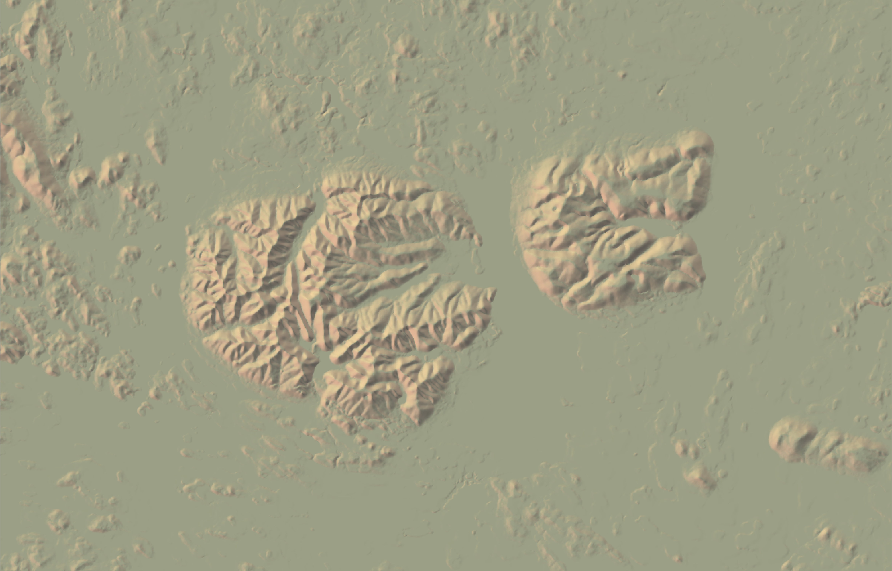

# Трехмерные модели {#three}


## Предварительные условия  {#mapping3d_prerequisites}

Для выполнения кода данной лекции вам понадобятся следующие пакеты:

```r
library(sf)
library(stars)
library(dplyr)
library(rayshader)
```

## Введение {#three_intro}

Трехмерные модели местности могут использоваться в тех случаях, когда стандартное картографическое изображение недостаточно наглядно. Поскольку и построение трехмерных моделей и взаимодействие с ними сложнее, чем с обычными картами, они распространены не столь повсеместно. 

## Создание трёхмерной сцены {#three_labels}

### Освещение цифровой модели рельефа {#three_lighting}

Построение трехмерной модели обычно начинается с создания изображения рельефа. В качестве примера рассмотрим ЦМР на территорию в окрестностях Хибин и Ловозёрских тундр в Мурманской области. Чтобы построить изображение рельефа, для начана надо получить матрицу со значениями цвета RGB, а затем вывести ее на экран посредством `plot_map()`. Градиентная окраска по высоте получается функцией `height_shade()`, аналитическая отмывка — через `sphere_shade()`:


```r
dem = read_stars('data/dem_khibiny.tif')

elev = dem[[1]]

# ВАЖНО: в текущей версии rayshader оси матрицы не должны иметь названий 
dim(elev) <- unname(dim(elev)) 

elev |> 
  height_shade() |> 
  plot_map()
```


```r

elev |> 
  sphere_shade(zscale = 10) |> 
  plot_map()
```


```r

dem_colors = colorRampPalette(c("darkolivegreen", "lightyellow", "orange", "firebrick", "white"))

elev |> 
  height_shade(texture = dem_colors(256)) |> 
  add_overlay(sphere_shade(elev, texture = 'bw', zscale=10), alphalayer=0.7) |> 
  plot_map()
```


Функция `sphere_shade()` имеет несколько встроенных палитр, которые позволяют раскрашивать поверхность в зависимости от восвещенности точки поверхности. В частности, она содержит стандартную черно-белую палитру, и четыре отмывки в швейцарском стиле Эдуарда Имгофа. Каждая палитра имеет, по сути, три цвета: фона, света и тени:


```r
palettes = c('bw', 'desert', 'imhof1','imhof2','imhof3','imhof4', 'unicorn')

for (pal in palettes) {
  elev |> 
    sphere_shade(texture = pal, zscale=10) |> 
    plot_map()
}
```



Добавим принудительно посчитанные тени:

```r
elev |> 
  height_shade(texture = dem_colors(256)) |> 
  add_overlay(sphere_shade(elev, texture = 'bw', zscale=10), alphalayer=0.5) |> 
  add_shadow(lamb_shade(elev, zscale = 20), 0.1) |> 
  plot_map()
```


Амбиентное овещение позволяет отделить долины от вершин хребтов:

```r
elev |> 
  height_shade(texture = dem_colors(256)) |> 
  add_overlay(sphere_shade(elev, texture = 'bw', zscale=10), alphalayer=0.5) |> 
  add_shadow(lamb_shade(elev, zscale = 20), 0.1) |> 
  add_shadow(ambient_shade(elev), 0.1) %>%
  plot_map()
```


Для построение трехмерной сцены вместо `plot_map()` необходимо использовать `plot_3d()`. При этом будет открыто интерактивное окно OpenGL, в котором вы сможете вращать созданную сцену:


```r
elev |> 
  height_shade(texture = dem_colors(256)) |> 
  add_overlay(sphere_shade(elev, texture = 'bw', zscale=10), alphalayer=0.5) |> 
  add_shadow(lamb_shade(elev, zscale = 20), 0.1) |> 
  add_shadow(ambient_shade(elev), 0.1) |> 
  plot_3d(elev, zscale = 20, fov = 0,
          theta = 135, zoom = 0.75, phi = 45, 
          windowsize = c(1400, 800))

# rgl::rglwidget(width = 800, height = 600)
```

Чтобы сохранить текущий вид сцены, необходимо использовать функцию `render_snapshot()`. Для закрытия сцены используется функция `rgl::rgl.close()`

```r
render_snapshot()
```


```r
rgl::rgl.close()
```

### Векторные слои {#three_add}

Прочтем векторные данные:

```r
db = 'data/khibiny.gpkg'
rivers = st_read(db, 'rivers', quiet = T)
lakes = st_read(db, 'lakes', quiet = T) |>
  filter(CLASS_ID != 31300000)

roads_all = st_read(db, 'roads', quiet = T)
roads = filter(roads_all, CLASS_ID <= 62131000)

rails = st_read(db, 'rails', quiet = T)
forest = st_read(db, 'veg', quiet = T)
blocks = st_read(db, 'blocks', quiet = T)
poppol = st_read(db, 'poppol', quiet = T)
```

Добавим их через оверлей объектов:

```r
ext = raster::extent(st_bbox(dem))
elev |>
  height_shade(texture = dem_colors(256)) |>
  add_overlay(sphere_shade(elev, texture = 'bw', zscale=10), alphalayer=0.5) |>
  add_shadow(lamb_shade(elev, zscale = 20), 0.1) |>
  add_overlay(generate_line_overlay(rivers, linewidth = 2, color="steelblue4",
                                    extent = ext,
                                    heightmap = elev)) |>
  add_overlay(generate_polygon_overlay(lakes, linewidth = 1,
                                       palette = 'azure',
                                       linecolor = 'steelblue4',
                                       extent = ext,
                                       heightmap = elev)) |>
  plot_map()
```


Визуализируем в 3D:

```r
elev |>
  height_shade(texture = dem_colors(256)) |>
  add_overlay(sphere_shade(elev, texture = 'bw', zscale=10), alphalayer=0.5) |>
  add_shadow(lamb_shade(elev, zscale = 20), 0.1) |>
  add_overlay(generate_line_overlay(rivers, linewidth = 2, color="steelblue4",
                                    extent = ext,
                                    heightmap = elev)) |>
  add_overlay(generate_polygon_overlay(lakes, linewidth = 1,
                                       palette = 'azure',
                                       linecolor = 'steelblue4',
                                       extent = ext,
                                       heightmap = elev)) |>
  plot_3d(elev, zscale = 20, fov = 0,
          theta = 135, zoom = 0.75, phi = 45,
          windowsize = c(1400, 800))

Sys.sleep(0.2)
render_snapshot()
```


```r
rgl::rgl.close()
```

Чтобы приблизить изображение, повернуть, изменить угол наклона и т.д., используйте параметры функции `plot_3d()`:

```r
elev |>
  height_shade(texture = dem_colors(256)) |>
  add_overlay(sphere_shade(elev, texture = 'bw', zscale=10), alphalayer=0.5) |>
  add_shadow(lamb_shade(elev, zscale = 20), 0.1) |>
  add_overlay(generate_line_overlay(rivers, linewidth = 2, color="steelblue4",
                                    extent = ext,
                                    heightmap = elev)) |>
  add_overlay(generate_polygon_overlay(lakes, linewidth = 1,
                                       palette = 'azure',
                                       linecolor = 'steelblue4',
                                       extent = ext,
                                       heightmap = elev)) |>
  plot_3d(elev, zscale = 50, fov = 0,
          theta = 80, zoom = 0.25, phi = 35,
          windowsize = c(1400, 800))

Sys.sleep(0.2)
render_snapshot()
```


```r
rgl::rgl.close()
```

Расширим состав визуализируемых объектов:

```r
plt = elev |>
  height_shade(texture = dem_colors(256)) |>
  add_overlay(sphere_shade(elev, texture = 'bw', zscale=10), alphalayer=0.5) |>
  add_shadow(lamb_shade(elev, zscale = 20), 0.1) |>
  add_overlay(generate_polygon_overlay(poppol, linewidth = 1,
                                     palette = 'orange',
                                     linecolor = 'black',
                                     extent = ext,
                                     heightmap = elev)) |>
  add_overlay(generate_line_overlay(rivers, linewidth = 2, color="steelblue4",
                                    extent = ext,
                                    heightmap = elev)) |>
  add_overlay(generate_polygon_overlay(lakes, linewidth = 1,
                                       palette = 'azure',
                                       linecolor = 'steelblue4',
                                       extent = ext,
                                       heightmap = elev)) |>
  add_overlay(generate_line_overlay(roads, linewidth = 4, color="black",
                                    extent = ext,
                                    heightmap = elev)) |>
  add_overlay(generate_line_overlay(roads, linewidth = 2, color="lightyellow",
                                  extent = ext,
                                  heightmap = elev)) |>
  add_overlay(generate_line_overlay(rails, linewidth = 3, color="black",
                                  extent = ext,
                                  heightmap = elev))

plot_map(plt)
```


```r

plot_3d(plt, elev, zscale = 30, fov = 0,
        theta = -45, zoom = 0.25, phi = 30,
        windowsize = c(1400, 800))

Sys.sleep(0.2)
render_snapshot()
```


```r
rgl::rgl.close()
```

### Подписи {#three_labels}

Для размещения подписей следует использовать функцию `generate_label_overlay()`:


```r
popmajor = poppol |>
  filter(CLASS_ID < 41300000) |>
  st_centroid()

popminor= poppol |>
  filter(CLASS_ID == 41300000) |>
  st_centroid()

plt_lbl = plt |>
  add_overlay(generate_point_overlay(popmajor, size = 8, extent = ext, color = "black", pch = 19,
                                     heightmap = elev)) |>
  add_overlay(generate_point_overlay(popmajor, size = 3, extent = ext, color = "white", pch = 19,
                                     heightmap = elev)) |>
  add_overlay(generate_label_overlay(labels = popmajor,
                                     data_label_column = 'NAME',
                                     extent = ext, text_size = 2, color = "black", font=2,
                                     halo_color = "white", halo_expand = 2, point_size = 0,
                                     seed=1, heightmap = elev))
plot_map(plt_lbl)
```


```r

plot_3d(plt_lbl, elev, zscale = 30, fov = 0,
        theta = -45, zoom = 0.5, phi = 30,
        windowsize = c(1400, 800))

Sys.sleep(0.2)
render_snapshot()
```


```r
rgl::rgl.close()
```

Как видно, оверлей подписей выглядит не очень в трехмерноме режиме. В этом случае необходимо эти подписи наносить уже после того как трехмерный режим активирован:

```r
plot_3d(plt, elev, zscale = 30, fov = 0,
        theta = -45, zoom = 0.5, phi = 35,
        windowsize = c(1400, 800))

for (name in popmajor$NAME) {
  pop = filter(popmajor, NAME == name)
  render_label(elev, lat = st_coordinates(pop)[, 2], lon = st_coordinates(pop)[, 1],
               text = name, altitude = 1000, zscale=30, textsize = 1.75, linewidth = 4,
               extent = ext, textcolor = "turquoise2", linecolor="turquoise2",
               relativez = TRUE)
}

Sys.sleep(0.2)

render_snapshot()
```


```r
rgl::rgl.close()
```

## Анимация трёхмерной сцены  {#three_animation}

Анимация с помощью пакета __rayshader__ осуществляется покадрово. Для этого необходимо задать последовательность параметров камеры, каждый из которых будет определять кадр видеофильма, и определить эти параметры в функции `render_movie()`.

### Вращение относительно точки {#three_animation_circle}

Наиболее простой спобособ визуализации сцены — вращение относительно фиксированной точки. В этом случае необходимо менять только угол поворота камеры. По умолчанию `render_movie()` создает 12-секундный ролик с частотой 30 кадров в секунду (т.е. 360 кадров всего). Именно такой результат будет получен, если вызывать ее без параметров:

```r
plot_3d(plt, elev, zscale = 30, fov = 0,
        theta = -45, zoom = 0.5,
        windowsize = c(1400, 800))

for (name in popmajor$NAME) {
  pop = filter(popmajor, NAME == name)
  render_label(elev, lat = st_coordinates(pop)[, 2], lon = st_coordinates(pop)[, 1],
               text = name, altitude = 1000, zscale=30, textsize = 1.75, linewidth = 4,
               extent = ext, textcolor = "turquoise2", linecolor="turquoise2",
               relativez = TRUE)
}

render_movie(filename = 'images/khibiny_rotate.gif')
```


### Облёт по траектории {#three_animation_path}

Для того чтобы территорию облететь по заданной траектории, необходимо эту траекторию создать. Проще всего такую задачу решить в настольной ГИС (ArcGIS, QGIS), оцифровав необходимую линию. Также можно создать объект через редактор пакета [__mapedit__](https://github.com/r-spatial/mapedit). Подгрузим готовую траекторию из базы данных и посмотрим на ее контур:


```r
traj_line = st_read(db, 'trajectory')
## Reading layer `trajectory' from data source 
##   `/Users/tsamsonov/GitHub/r-geo-course/data/khibiny.gpkg' using driver `GPKG'
## Simple feature collection with 1 feature and 0 fields
## Geometry type: LINESTRING
## Dimension:     XY
## Bounding box:  xmin: 482251.7 ymin: 7473232 xmax: 593004.8 ymax: 7545685
## Projected CRS: WGS 84 / UTM zone 36N

n_frames = 360

traj_pts = st_sample(traj_line, size = n_frames, type = 'regular') |>
  st_cast('POINT')

plt_lbl |>
  add_overlay(generate_line_overlay(traj_line, linewidth = 10, extent = ext, heightmap = elev, color = 'cyan'), 0.8) |>
  add_overlay(generate_point_overlay(traj_pts, size = 3, extent = ext, heightmap = elev, color = 'orangered'), 1) |>
  plot_map()
```


Готовой функции для облета по траектории в rayshader пока что нет, поэтому необходимо соорудить эту функциональность самим. Рендер будем выполнять покадрово, обрезая растр таким образом чтобы текущая точка траектории оказывалась в его середине:

```r
library(magick)
anim_wd = 'anim'
dir.create(anim_wd)

output_gif = "images/khibiny_traj.gif"

img_frames <- file.path(
  anim_wd,
  paste0("anim_", formatC(seq_len(n_frames), width = 3, flag = "0"), ".png")
)

coords = st_coordinates(traj_pts)

for (i in seq_along(img_frames)) {

  box = st_buffer(traj_pts[i], 50000) |> st_bbox()

  elev_crop = dem[box][[1]]

  dim(elev_crop) = unname(dim(elev_crop))

  ext_crop = raster::extent(box)

  plt = elev_crop |>
    height_shade(texture = dem_colors(256)) |>
    add_overlay(sphere_shade(elev_crop, texture = 'bw', zscale=10), alphalayer=0.5) |>
    add_shadow(lamb_shade(elev_crop, zscale = 20), 0.1)

  dx = coords[i+1, 1] - coords[i, 1]
  dy = coords[i+1, 2] - coords[i, 2]

  A = 180 * atan2(dx, dy) / pi

  plot_3d(plt, elev_crop, zscale = 30, zoom = 0.5, theta = -A, phi = 20, windowsize = c(1400, 800))

  Sys.sleep(0.2)

  render_snapshot(img_frames[i])
  rgl::clear3d()
}

rgl::rgl.close()

# Create gif
image_write_gif(image_read(img_frames[-360]),
                        path = output_gif,
                        delay = 6/n_frames)
```


## Контрольные вопросы и упражнения {#questions_tasks_three}

### Вопросы {#questions_three}

### Упражнения {#tasks_three}

1. Скачайте [базу данных](https://github.com/tsamsonov/r-geo-course/blob/master/data/Satino.gpkg) и [цифровую модель рельефа](https://github.com/tsamsonov/r-geo-course/blob/master/data/Satino_DEM.zip) на территорию Сатинского полигона МГУ. Постройте на их основе трехмерную модель местности и выполните ее круговую анимацию.


----
_Самсонов Т.Е._ **Визуализация и анализ географических данных на языке R.** М.: Географический факультет МГУ, `lubridate::year(Sys.Date())`. DOI: [10.5281/zenodo.901911](https://doi.org/10.5281/zenodo.901911)
----
