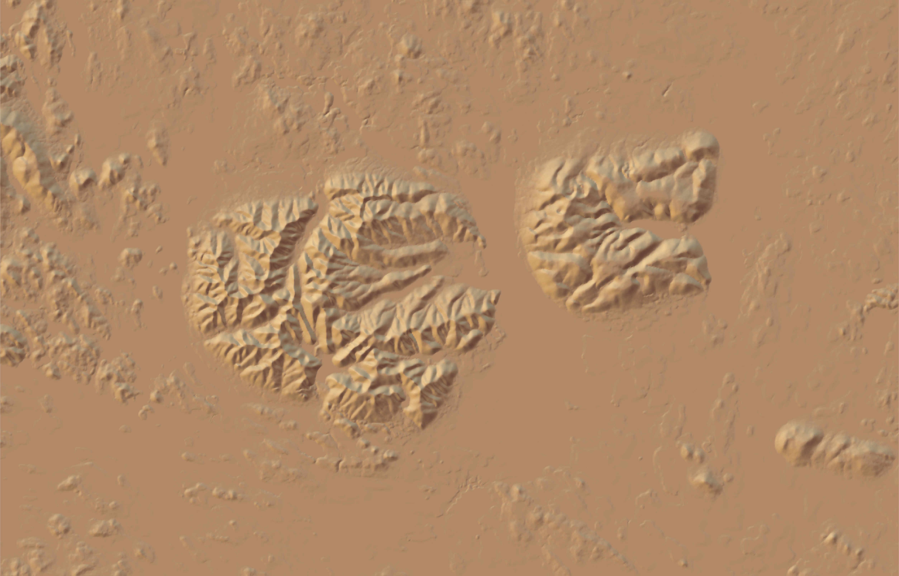

# Трехмерные модели {#three}


## Предварительные условия  {#mapping3d_prerequisites}

Для выполнения кода данной лекции вам понадобятся следующие пакеты:

```r
library(sf)
library(stars)
library(dplyr)
library(rayshader)
```

## Введение {#three_intro}

Трехмерные модели местности могут использоваться в тех случаях, когда стандартное картографическое изображение недостаточно наглядно. Поскольку и построение трехмерных моделей и взаимодействие с ними сложнее, чем с обычными картами, они распространены не столь повсеместно. 

## Освещение цифровой модели рельефа {#three_lighting}

Построение трехмерной модели обычно начинается с создания изображения рельефа. В качестве примера рассмотрим ЦМР для территории Сатинской учебно-научной базы Географического факультета МГУ. Чтобы построить изображение рельефа, для начана надо получить матрицу со значениями цвета RGB, а затем вывести ее на экран посредством `plot_map()`. Градиентная окраска по высоте получается функцией `height_shade()`, аналитическая отмывка — через `sphere_shade()`:


```r
dem = read_stars('data/Satino_DEM.tif')

elev = dem[[1]]

# ВАЖНО: в текущей версии rayshader оси матрицы не должны иметь названий 
dim(elev) <- unname(dim(elev)) 

elev |> 
  height_shade() |> 
  plot_map()
```


```r

elev |> 
  sphere_shade() |> 
  plot_map()
```


```r

dem_colors = colorRampPalette(c("darkolivegreen4", "lightyellow", "orange", "firebrick"))

elev |> 
  height_shade(texture = dem_colors(256)) |> 
  add_overlay(sphere_shade(elev, texture = 'bw', zscale=0.5), alphalayer=0.7) |> 
  plot_map()
```


Функция `sphere_shade()` имеет несколько встроенных палитр, которые позволяют раскрашивать поверхность в зависимости от восвещенности точки поверхности. В частности, она содержит стандартную черно-белую палитру, и четыре отмывки в швейцарском стиле Эдуарда Имгофа. Каждая палитра имеет, по сути, три цвета: фона, света и тени:


```r
palettes = c('bw', 'desert', 'imhof1','imhof2','imhof3','imhof4', 'unicorn')

par(mfrow = c(1, 2))
for (pal in palettes) {
  elev |> 
    sphere_shade(texture = pal) |> 
    plot_map()
}
```



```r
par(mfrow = c(1, 1))
```


Для построение трехмерной сцены вместо `plot_map()` необходимо использовать `plot_3d()`. При этом будет открыто интерактивное окно OpenGL, в котором вы сможете вращать созданную сцену:


```r
elev |> 
  height_shade(texture = dem_colors(256)) |> 
  add_overlay(sphere_shade(elev, texture = 'bw', zscale=0.5), alphalayer=0.7) |> 
  plot_3d(elev, zscale = 2, fov = 0,
          theta = 135, zoom = 0.75, phi = 45, 
          windowsize = c(1000, 800))

Sys.sleep(0.2)
render_snapshot()
```


## Добавление объектов на сцену {#three_lighting}

Прочтем векторные данные:

```r
hydro_lines = st_read('data/Satino.gpkg', 'WaterLine')
## Reading layer `WaterLine' from data source 
##   `/Users/tsamsonov/GitHub/r-geo-course/data/Satino.gpkg' using driver `GPKG'
## Simple feature collection with 25 features and 5 fields
## Geometry type: MULTILINESTRING
## Dimension:     XY
## Bounding box:  xmin: 329976.9 ymin: 6119314 xmax: 334975.5 ymax: 6123279
## Projected CRS: WGS 84 / UTM zone 37N
hydro_polys = st_read('data/Satino.gpkg', 'WaterPolygon')
## Reading layer `WaterPolygon' from data source 
##   `/Users/tsamsonov/GitHub/r-geo-course/data/Satino.gpkg' using driver `GPKG'
## Simple feature collection with 6 features and 7 fields
## Geometry type: MULTIPOLYGON
## Dimension:     XY
## Bounding box:  xmin: 329975.2 ymin: 6120220 xmax: 334975.5 ymax: 6123280
## Projected CRS: WGS 84 / UTM zone 37N
roads = st_read('data/Satino.gpkg', 'Roads')
## Reading layer `Roads' from data source 
##   `/Users/tsamsonov/GitHub/r-geo-course/data/Satino.gpkg' using driver `GPKG'
## Simple feature collection with 42 features and 3 fields
## Geometry type: MULTILINESTRING
## Dimension:     XY
## Bounding box:  xmin: 329976 ymin: 6119278 xmax: 334977.5 ymax: 6123282
## Projected CRS: WGS 84 / UTM zone 37N
forest = st_read('data/Satino.gpkg', 'ForestBorders')
## Reading layer `ForestBorders' from data source 
##   `/Users/tsamsonov/GitHub/r-geo-course/data/Satino.gpkg' using driver `GPKG'
## Simple feature collection with 72 features and 5 fields
## Geometry type: MULTIPOLYGON
## Dimension:     XY
## Bounding box:  xmin: 329974.2 ymin: 6119278 xmax: 334977.7 ymax: 6123281
## Projected CRS: WGS 84 / UTM zone 37N
```

Добавим их через оверлей объектов:

```r
ext = raster::extent(st_bbox(dem))
elev |> 
  height_shade(texture = dem_colors(256)) |> 
  add_overlay(sphere_shade(elev, texture = 'bw', zscale=0.5), alphalayer=0.7) |> 
  add_overlay(generate_line_overlay(hydro_lines, linewidth = 1, color="steelblue4",
                                    extent = ext,
                                    heightmap = elev)) |> 
  add_overlay(generate_polygon_overlay(hydro_polys, linewidth = 1, 
                                       palette = 'steelblue1',
                                       linecolor = 'steelblue4',
                                       extent = ext,
                                       heightmap = elev)) |> 
  add_overlay(generate_line_overlay(roads, linewidth = 2, color="red",
                                    extent = ext,
                                    heightmap = elev)) |> 
  plot_map()
```


Визуализируем в 3D:

```r
elev |> 
  height_shade(texture = dem_colors(256)) |> 
  add_overlay(sphere_shade(elev, texture = 'bw', zscale=0.5), alphalayer=0.7) |> 
  add_overlay(generate_line_overlay(hydro_lines, linewidth = 1, color="steelblue4",
                                    extent = ext,
                                    heightmap = elev)) |> 
  add_overlay(generate_polygon_overlay(hydro_polys, linewidth = 1, 
                                       palette = 'steelblue1',
                                       linecolor = 'steelblue4',
                                       extent = ext,
                                       heightmap = elev)) |> 
  add_overlay(generate_line_overlay(roads, linewidth = 2, color="red",
                                    extent = ext,
                                    heightmap = elev)) |> 
  plot_3d(elev, zscale = 2, fov = 0,
          theta = 135, zoom = 0.75, phi = 45, 
          windowsize = c(1000, 800))

Sys.sleep(0.2)
render_snapshot()
```


## Контрольные вопросы и упражнения {#questions_tasks_three}


### Вопросы {#questions_three}

### Упражнения {#tasks_three}


----
_Самсонов Т.Е._ **Визуализация и анализ географических данных на языке R.** М.: Географический факультет МГУ, `lubridate::year(Sys.Date())`. DOI: [10.5281/zenodo.901911](https://doi.org/10.5281/zenodo.901911)
----
