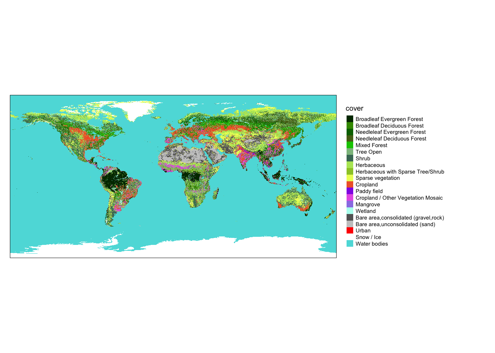

# Пространственный анализ 2. Растровые методы {#raster_analysis}


## Предварительные условия {-}

Для выполнения кода данной лекции вам понадобятся следующие пакеты:

```r
library(sf)
library(sp)
library(tmap)
library(raster)
library(mapview)
library(mapedit)
library(lattice)
library(classInt)
library(geosphere)
library(tidyverse)
```

## Введение {#raster_intro}

Растровая модель данных представляет собой мощный инструмент абстракции пространственных распределений и выполнения пространственного анализа. На первый взгляд, растр обладает целым рядом ограничений по сравнению с векторной моделью: не позволяет оперировать отдельными объектами, их границами и так далее. Растровые карты и снимки мы часто оцифровываем, выделяя объекты, чтобы на основе них можно было что-то посчитать. Самые первые ГИС были исключительно растровыми, что сейчас воспринимается как архаизм. 

Однако за ширмой ограниченности растровой модели кроются огромные аналитические возможности. Растровая модель обладает внутренней топологией: ее ячейки соприкасаются друг с другом, что позволяет моделировать непрерывные в пространстве и динамические явления (при которых происходит перемещение вещества, энергии или информации в пространстве). Поскольку ячейки растра имеют одинаковый размер, к ним можно применять однотипные операции, которые будут давать предсказуемый результат вне зависимости от конкретной локации в пределах растра. Это также позволяет сделать обработку растра очень быстро.

## Растровая алгебра

Существует классификация операций растрового анализа, введенная американским профессором Даной Томлином, которая объединяет их под общим названием "алгебра карт" или "растровая алгебра"^[Tomlin, C Dana. 2012. GIS and Cartographic Modeling. Second edition. Redlands, California: ESRI Press]. Предполагая, что обработке подвергается _каждая_ ячейка растра, данная классификация разделяет все операции по охвату относительно текущей ячейки

1. _Локальные_ --- анализируется одна ячейка растра или совпадающие в пространстве ячейки нескольких растров
2. _Фокальные_ --- анализируются все ячейки в окрестности. Окрестность может быть как фиксированной, так и расширенной (expanded), когда ее размер управляется внешними факторами, например множеством объектов, до которых требуется вычислить расстояние. Информация по соседним ячейкам может быть как из исходного растра, так и из внешнего. Фокальные методы алгебры карт также называются _методами анализа соседства_.
3. _Зональные_ --- анализируются все ячейки в пределах зон, определяемых извне (например, вторым растровым слоем).
4. _Глобальные_ --- анализируются все ячейки растра.

### Локальные операции {#raster_local}

Локальные операции связаны с алгебраическими преобразованиями значений в ячейках. Например, цифровую модель высот в футах можно перевести в цифровую модель высот в метрах. Для этого нужно значение в каждой ячейке умножить на $0.3048$. В локальных операциях могут участвовать несколько растров. Например, если у нас есть растровые поверхности плотности населения за разные года, мы можем вычесть одну поверхность из другой, чтобы получить поверхность изменений плотности, выяснить где она увеличилась, уменьшилась или осталось прежней. К локальным операциям относится также оверлей растров, при котором получается взвешенная сумма значений по нескольким растрам. И в том и в другом случае анализируются ячейки с нескольких растров, которые совпадают в пространстве. 

В качестве примера определим мощность покровного оледенения в Антарктике и Гренландии, путем вычитание двух моделей [ETOPO1](https://www.ngdc.noaa.gov/mgg/global/), одна из которых показывает рельеф коренных пород (bedrock), а вторая --- видимый рельеф поверхности (ice surface):

```r
# ЛОКАЛЬНЫЕ ОПЕРАЦИИ
# Вычисление толщины покровного оледенения

# Чтение данных
bed = raster('etopo1_bed.tif')
ice = raster('etopo1_ice.tif')
countries = st_read('countries.gpkg')
## Reading layer `admin_0_map_units' from data source `/Users/tsamsonov/GitHub/r-geo-course/data/countries.gpkg' using driver `GPKG'
## Simple feature collection with 183 features and 72 fields
## geometry type:  MULTIPOLYGON
## dimension:      XY
## bbox:           xmin: -180 ymin: -90 xmax: 180 ymax: 83.64513
## epsg (SRID):    4326
## proj4string:    +proj=longlat +datum=WGS84 +no_defs
borders = countries %>% st_geometry()

# отображение данных
classes = classIntervals(values(bed), 20)
brks = classes$brks
nclass = length(brks) - 1

plot(bed, 
     breaks = brks, 
     col = gray.colors(nclass),
     main = 'ETOPO Bedrock',
     legend = F)
```


```r
plot(ice, 
     breaks = brks, 
     col = gray.colors(nclass),
     main = 'ETOPO Ice surface',
     legend = F)
```


```r

# вычисление разности
ice.depth = ice - bed
plot(ice.depth, 
     col = cm.colors(255),
     main = 'Мощность покровного оледенения')
plot(borders, 
     border = 'black', 
     lwd = 0.5, 
     add = TRUE)
```


```r

# сделаем пустыми все ячейки, в которых толщина льда равна нулю
ice.depth[ice.depth == 0] = NA

plot(ice.depth, 
     col = cm.colors(255), 
     main = 'Мощность покровного оледенения')
plot(borders, 
     border = 'black', 
     lwd = 0.5, 
     add = TRUE)
```


### Фокальные операции {#raster_focal}

В фокальных операциях участвует не только сама ячейка или совпадающие с ней ячейки других растров, но также ячейки, находящиеся в некоторой окрестности (опять же, в одном или нескольких растрах одновременно). Данный вид анализа подразделяется на две категории: фокальный анализ с фиксированной окрестностью и с расширенной окрестностью.

#### Фиксированная окрестность {#raster_focal_fixed}

В общем случае фиксированная окрестность может иметь различную форму, однако наиболее часто используется квадратная окрестность размером $3\times3$:


Фокальные операции с фиксированной окрестностью — привычное дело в обработке изображений. Они работают по принципу "плавающего окна". Выбранная окрестность (квадратная, круглая и т.д.) представляется в виде матрицы коэффициентов — так называемого ядра свёртки (convolution kernel). Далее эта матрица перемещается, позиционируясь последовательно над каждой ячейкой растра, и значение в этой ячейке заменяется на взвешенную сумму значений ячеек в окрестности, умноженных на соответствующие коэффициенты ядра свертки. Например, если ядро состоит из единиц, то будет посчитана обычная сумма. 

С помощью фокального анализа можно выполнить сглаживание изображения, которое убирает из него мелкие детали (высокочастотные составляющие яркостного сигнала). В качестве такого изображения может быть цифровая модель рельефа или космический снимок. Чтобы выполнить сглаживание, коэффициенты должны быть такими, чтобы получаемая взвешенная сумма осредняла значения в соседних ячейках. Самый простой вариант --- это рассчитать среднее арифметическое. В этом случае коэффициенты ядра свертки будут равны $1/k$, где $k$ --- количество ячеек в окрестности. Для матрицы $3\times3$ они будут равны, соответственно $1/9$:

```r
# ФОКАЛЬНЫЕ ОПЕРАЦИИ

# Вырежем кусок из ЦМР
dem = crop(ice, extent(-120, -75, 10, 40))
spplot(dem)
```


```r

# Среднее
wgt = matrix(c(1, 1, 1,
                1, 1, 1,
                1, 1, 1) / 9, 
              nrow = 3)
# на самом деле проще написать так:
# wgt = matrix(1/9, 3, 3), но полная форма записана для наглядности

# выполним обработку ЦМР с помощью фокального фильтра
filtered = focal(dem, w = wgt)
spplot(stack(dem, filtered),
       names.attr=c('Исходный рельеф', 'Сглаживание средним'))
```


Более мягким эффектом сглаживания, который к тому же не нарушает дифференцируемость поверхности, является гауссово сглаживание. Коэффициенты в матрице Гаусса убывают от центральной ячейки к краям матрицы по закону Гаусса-Лапласа, что позволяет придать центральной ячейке более высокий вес по сравнению с ячейками, располагающимися на краю анализируемой окрестности:

```r
# Гауссово (параметр 0.5 - это стандартное отклонение в единицах измерения растра)
wgt = focalWeight(dem, 0.5, "Gauss")
filtered = focal(dem, wgt)
spplot(stack(dem, filtered),
       names.attr=c('Исходный рельеф', 'Гауссово сглаживание'))
```


Еще одна интересная область применения фильтрации --- это обнаружение границ (change detection). Границы на изображении возникают в тех местах, где его яркость резко меняет свое значение (в одном или нескольких каналах). Например, на фотографии контур лица может быть распознан по перепаду яркости между его изображением и фоном (если он имеет существенно отличный цвет). Поскольку перепад яркости соответствует экстремальным значениям производной поверхности (отрицательным или положительным), его также можно определить путем фокального анализа, а затем отсечь ячейки растра, в которых значение этой производной по модулю превышает заданный порог (то есть, имеет необходимый контраст). 

Рассмотрим, как можно выделить уступы континентального склона океана путем применения фильтра Собеля для выделения границ: 

```r
# Матрица Собеля:
wgt = matrix(c(1, 2, 1,
                0, 0, 0,
               -1,-2,-1) / 4, 
              nrow=3)
filtered = focal(dem, wgt)

# Это поверхность производных:
plot(filtered,
     col = gray.colors(128),
     main = 'Производная поверхности')
```


```r

# Отберем все ячейки, обладающие высокими значениями производных
faults = (filtered < -1500) | (filtered > 1500)
faults[faults == 0] = NA

# Визуализируем результат
plot(dem, 
     col = rev(rainbow(20)),
     main = 'Уступы континентального склона',
     legend = FALSE)
plot(faults,
     col = 'black',
     legend = FALSE,
     add = TRUE)
```


Еще один распространенный случай использования фокальных операций --- это морфометрический анализ поверхностей. Квадратная окрестность $3\times3$ вокруг каждой ячейки формирует локальную поверхность, производные которой дают представление об уклоне, экспозиции и прочих морфометрических параметрах. Их можно вычислить с помощью функции `terrain()` из пакета `raster`:


```r
# Морфометрия рельефа — фиксированное соседство
dem = raster('dem_fergana.tif')
spplot(dem)
```


```r

# углы наклона
slope = terrain(dem, opt = 'slope', unit = 'degrees')
spplot(slope, 
       col.regions = heat.colors(20),
       names.attr=c('Углы наклона'))
```


```r

# экспозиция
aspect = terrain(dem, opt = 'aspect', unit = 'degrees')
spplot(aspect, 
       col.regions = rainbow(20),
       names.attr=c('Экспозиции склона'))
```


Вычисление производных поверхности позволяет не только исследовать рельеф, но также строить его изображения. Например, хорошо знакомую всем по картам аналитическую отмывку рельефа (_hillshade_). Яркость поверхности в этом способе изображения зависит от угла между направлением на источник освещения (откуда светит Солнце) и нормалью к поверхности. Нормаль можно вычислить как напрямую через производные поверхности, так и восстановить на основе значений угла наклона и экспозиции в точке, что и используется в пакете __raster__. Обратите внимание на то, что для того чтобы повысить наглядность (контрастность) изображения, мы умножаем высоты рельефа на 20. Это стандартная практика для мелкомасштабных карт:

```r
# отмывка
slope2 = terrain(dem * 20, opt = 'slope')
aspect2 = terrain(dem * 20, opt = 'aspect')
                 
# параметры angle и direction функции hillShade определяют азимут и высоту источника освещения:
hill = hillShade(slope2, aspect2, angle = 45, direction = 315)
plot(hill, 
     col = gray.colors(128),
     main = 'Отмывка рельефа')
```


#### Расширенная окрестность {#raster_focal_extended}

Расширенность окрестности означает, что она определяется не фиксированным шаблоном, а условием, которое должно выполниться для того, чтобы анализ в ячейке считался выполненным. Типичный пример анализа на основе расширенной окрестности — это операции, основанные на вычислении расстояний на растровой матрице, такие как аллокация, определение кратчайшего пути на поверхности сопротивления, и собственно, само вычисление расстояние.

В мелкомасштабных тематических атласах часто можно встретить карты доступности той или иной географической локации, которые в форме изолиний показывают время движения до ближайшего населенного пункта. Эти изолинии можно построить по растровой поверхности, в каждой ячейке которой зафиксировано расстояние до ближайшего населенного пункта.

Рассмотрим построение аналогичной поверхности на примере доступности станций метро (по расстоянию). Для этого нам понадобится представить растр в виде матрицы точек, рассчитать для этих точек расстояния до ближайших станций метро и присвоить эти значения выходному растру:

```r
# Определение Евклидовых расстояний — расширенное соседство

# Чтение данных
roads = st_read("roads.gpkg") # Дороги
## Reading layer `roads' from data source `/Users/tsamsonov/GitHub/r-geo-course/data/roads.gpkg' using driver `GPKG'
## Simple feature collection with 2213 features and 12 fields
## geometry type:  MULTILINESTRING
## dimension:      XY
## bbox:           xmin: 410946.9 ymin: 6176676 xmax: 415890.8 ymax: 6181910
## epsg (SRID):    32637
## proj4string:    +proj=utm +zone=37 +datum=WGS84 +units=m +no_defs
poi = st_read("poi_point.gpkg") # Точки интереса
## Reading layer `poi_point' from data source `/Users/tsamsonov/GitHub/r-geo-course/data/poi_point.gpkg' using driver `GPKG'
## Simple feature collection with 6623 features and 9 fields
## geometry type:  POINT
## dimension:      XY
## bbox:           xmin: 410947.3 ymin: 6176678 xmax: 415889.9 ymax: 6181909
## epsg (SRID):    32637
## proj4string:    +proj=utm +zone=37 +datum=WGS84 +units=m +no_defs
rayons = st_read("boundary_polygon.gpkg") # Границы районов
## Reading layer `boundary_polygon' from data source `/Users/tsamsonov/GitHub/r-geo-course/data/boundary_polygon.gpkg' using driver `GPKG'
## Simple feature collection with 11 features and 5 fields
## geometry type:  MULTIPOLYGON
## dimension:      XY
## bbox:           xmin: 410946.9 ymin: 6176676 xmax: 415890.8 ymax: 6181910
## epsg (SRID):    32637
## proj4string:    +proj=utm +zone=37 +datum=WGS84 +units=m +no_defs
stations = st_read("metro_stations.gpkg") # Станции метро
## Reading layer `metro_stations' from data source `/Users/tsamsonov/GitHub/r-geo-course/data/metro_stations.gpkg' using driver `GPKG'
## Simple feature collection with 45 features and 3 fields
## geometry type:  POINT
## dimension:      XY
## bbox:           xmin: 411007.5 ymin: 6176747 xmax: 415852.2 ymax: 6181892
## epsg (SRID):    32637
## proj4string:    +proj=utm +zone=37 +datum=WGS84 +units=m +no_defs
water = st_read("water_polygon.gpkg") # Водные объекты
## Reading layer `water_polygon' from data source `/Users/tsamsonov/GitHub/r-geo-course/data/water_polygon.gpkg' using driver `GPKG'
## Simple feature collection with 8 features and 7 fields
## geometry type:  POLYGON
## dimension:      XY
## bbox:           xmin: 411595.6 ymin: 6176676 xmax: 415890.8 ymax: 6180765
## epsg (SRID):    32637
## proj4string:    +proj=utm +zone=37 +datum=WGS84 +units=m +no_defs

# Создаем пустой растр с охватом, равным охвату станции
r =  raster(extent(stations), nrows = 200, ncols = 200)

# Конвертируем ячейки в точки
cells = r %>% as("SpatialPoints") %>% st_as_sf() %>% st_set_crs(st_crs(stations))

# Вычисляем расстояния
d = st_distance(stations, cells)

# Находим минимальное расстояние для каждой точки и заполняем 
# полученными значениями текущее содержимое растра
r[] = apply(d, 2, min)

# Визуализируем результат
plot(r, 
     col = rev(heat.colors(100)),
      main = 'Расстояние до ближайшей станции метро')
contour(r, 
        lwd = 0.5, 
        add= TRUE)
plot(water, 
     col = 'blue', 
     border = 'darkblue', 
     add = TRUE)
plot(roads, 
     lwd = 0.2, 
     col = 'black', 
     add = TRUE)
plot(stations, 
     pch = 20, 
     col = 'black', 
     add = TRUE)
```


### Зональные операции {#raster_zonal}

__Зональные операции__ связаны с агрегированием растровых данных по площадным зонам. В пределах каждой зоны вычисляется одна или несколько характеристик значений анализируемого растра: среднее, максимум и т.д. Как правило, зоны задаются в виде вспомогательного растрового или векторного набора данных. В случае растра каждая ячейка должна содержать идентификатор (номер) зоны, к которой она относится. Совокупность ячеек, имеющих одинаковый идентификатор, определяет территорию, которую покрывает зона с этим идентификатором. Если зоны представлены векторным набором пространственных объектов, то каждый объект (полигон) также должен иметь собственный идентификатор. Теоретически в одном наборе данных может быть несколько пространственно не связанных объектов, относящихся к одной зоне (например, зона экваториального климата состоит из трех ареалов). В этом случае агрегирование данных будет произведено сразу по трем полигонам. Таким образом, количество получаемых в результате зональной статистики значений определяется количеством зон, но может не совпадать с общим количеством полигонов, которыми эти зоны представлены.

В качестве примера рассмотрим вычисление среднеклиматических параметров _WorldClim_ в пределах различных типов земельного покрова (Land Cover), которые доступны в пакете __tmap__:

```r
temp = getData("worldclim", var = "tmean", res = 10) / 10
spplot(temp)
```


```r


data(land, package = 'tmap')

# таблица типов земельного покрова и их идентификаторов в растре
(tbl = land@data@attributes)
## [[1]]
##    ID  COUNT                                cover
## 1   1   9140           Broadleaf Evergreen Forest
## 2   2   6660           Broadleaf Deciduous Forest
## 3   3   6124          Needleleaf Evergreen Forest
## 4   4   6622          Needleleaf Deciduous Forest
## 5   5   4134                         Mixed Forest
## 6   6  16171                            Tree Open
## 7   7   9341                                Shrub
## 8   8  21377                           Herbaceous
## 9   9   1893    Herbaceous with Sparse Tree/Shrub
## 10 10  12247                    Sparse vegetation
## 11 11  11658                             Cropland
## 12 12    598                          Paddy field
## 13 13   5587   Cropland / Other Vegetation Mosaic
## 14 14     65                             Mangrove
## 15 15   1492                              Wetland
## 16 16   7436 Bare area,consolidated (gravel,rock)
## 17 17   7221      Bare area,unconsolidated (sand)
## 18 18    388                                Urban
## 19 19  61986                           Snow / Ice
## 20 20 393060                         Water bodies
## 
## [[2]]
##   ID  COUNT                   cover_cls
## 1  1  48851                      Forest
## 2  2  32611    Other natural vegetation
## 3  3  17843                    Cropland
## 4  4   1557                     Wetland
## 5  5  26904 Bare area/Sparse vegetation
## 6  6    388                       Urban
## 7  7  61986                    Snow/ice
## 8  8 393060                       Water

pal = c("#003200", "#3C9600", "#006E00", "#556E19", "#00C800", "#8CBE8C",
		   "#467864", "#B4E664", "#9BC832", "#EBFF64", "#F06432", "#9132E6",
		   "#E664E6", "#9B82E6", "#B4FEF0", "#646464", "#C8C8C8", "#FF0000",
		   "#FFFFFF", "#5ADCDC")

tm_shape(land) +
  tm_raster('cover', palette = pal)
```



> Оператор `@` означает обращение к _слоту_ объекта. Слоты представляют собой объекты, являющиеся внутри других объектов, являющихся экземплярами классов S4. 

Предварительно необходимо убедиться, что оба растра имеют совпадающий охват (экстент) и пространственное разрешение. Обратите внимание на то, что, поскольку растр земельного покрова категориальный, для его передискретизации необходимо использовать метод ближайшего соседа (_Nearest Neighbor_), который для каждого пиксела нового растра берет значение в ближайшем к нему пикселе исходного растра:

```r
temp
## class      : RasterBrick 
## dimensions : 900, 2160, 1944000, 12  (nrow, ncol, ncell, nlayers)
## resolution : 0.1666667, 0.1666667  (x, y)
## extent     : -180, 180, -60, 90  (xmin, xmax, ymin, ymax)
## crs        : +proj=longlat +datum=WGS84 +ellps=WGS84 +towgs84=0,0,0 
## source     : memory
## names      : tmean1, tmean2, tmean3, tmean4, tmean5, tmean6, tmean7, tmean8, tmean9, tmean10, tmean11, tmean12 
## min values :  -51.3,  -47.3,  -44.3,  -35.7,  -20.6,  -11.6,  -11.4,  -11.0,  -16.5,   -28.4,   -40.9,   -48.7 
## max values :   33.8,   33.3,   33.3,   34.2,   36.0,   38.4,   39.2,   38.2,   35.8,    32.7,    32.8,    33.0
land$cover
## class      : RasterLayer 
## dimensions : 540, 1080, 583200  (nrow, ncol, ncell)
## resolution : 0.3333333, 0.3333333  (x, y)
## extent     : -180, 180, -90, 90  (xmin, xmax, ymin, ymax)
## crs        : +proj=longlat +datum=WGS84 +no_defs +ellps=WGS84 +towgs84=0,0,0 
## source     : memory
## names      : cover 
## values     : 1, 20  (min, max)
## attributes :
##        ID  COUNT                      cover
##  from:  1   9140 Broadleaf Evergreen Forest
##   to : 20 393060               Water bodies

cover = crop(land$cover, temp) %>% 
  resample(temp, method = 'ngb') # используем 'ngb', поскольку растр категориальный

cover
## class      : RasterLayer 
## dimensions : 900, 2160, 1944000  (nrow, ncol, ncell)
## resolution : 0.1666667, 0.1666667  (x, y)
## extent     : -180, 180, -60, 90  (xmin, xmax, ymin, ymax)
## crs        : +proj=longlat +datum=WGS84 +ellps=WGS84 +towgs84=0,0,0 
## source     : memory
## names      : cover 
## values     : 1, 20  (min, max)
```

Для вычисления средней температуры января в пределах каждой зоны земельного покрова воспользуемся функцией `zonal()` из пакета `raster`. Полученный объект является матрицей:

```r
mtemp = zonal(temp, cover, 'mean')
head(mtemp)
##      zone      tmean1      tmean2     tmean3    tmean4    tmean5   tmean6
## [1,]    1  23.5827993  23.8581831  24.167610 24.222293 23.955707 23.37165
## [2,]    2   0.0913672   1.5741542   5.767354 10.923912 15.000011 17.86541
## [3,]    3 -12.4481575 -10.7375807  -4.774234  2.224753  8.684161 14.24578
## [4,]    4 -26.9791391 -23.7655126 -15.765014 -5.486585  3.929032 11.40341
## [5,]    5 -15.6666767 -13.3130511  -6.763048  1.819655  8.937738 14.28106
## [6,]    6  -1.1417342   0.3537656   4.237481  8.935712 13.113762 16.35017
##        tmean7   tmean8    tmean9   tmean10    tmean11     tmean12
## [1,] 23.12691 23.56288 23.998604 24.145374  23.969222  23.6631879
## [2,] 19.38950 18.91055 16.211209 11.663783   5.875100   1.6160002
## [3,] 17.04757 15.32626 10.387099  3.482172  -4.608318 -10.0533663
## [4,] 14.71551 12.30481  5.827517 -3.921658 -16.702145 -24.2449122
## [5,] 16.89588 15.12667  9.806683  2.859728  -5.847463 -12.7180889
## [6,] 17.92776 17.14772 14.448163  9.953790   3.999909   0.2581328
```

Чтобы далее работать с полученными значениями, целесообразно присоединить описания зон и превратить полученную матрицу в аккуратный фрейм данных:

```r
(mtemp_tidy = as_tibble(mtemp) %>% 
  left_join(tbl[[1]], by = c('zone' = 'ID')) %>% 
  gather(month, tmean, tmean1:tmean12) %>% 
  separate(month, c('dummy', 'month'), sep = 5) %>% 
  mutate(month = as.integer(month)) %>% 
  select(-COUNT, -dummy))
## # A tibble: 240 x 4
##     zone cover                             month    tmean
##    <dbl> <fct>                             <int>    <dbl>
##  1     1 Broadleaf Evergreen Forest            1  23.6   
##  2     2 Broadleaf Deciduous Forest            1   0.0914
##  3     3 Needleleaf Evergreen Forest           1 -12.4   
##  4     4 Needleleaf Deciduous Forest           1 -27.0   
##  5     5 Mixed Forest                          1 -15.7   
##  6     6 Tree Open                             1  -1.14  
##  7     7 Shrub                                 1   8.81  
##  8     8 Herbaceous                            1  -7.54  
##  9     9 Herbaceous with Sparse Tree/Shrub     1  24.3   
## 10    10 Sparse vegetation                     1  -9.51  
## # … with 230 more rows

ggplot(mtemp_tidy) +
  geom_line(aes(x = month, y = tmean, color = cover), size = 1) +
  scale_color_manual(values = pal) +
  scale_x_continuous(breaks = 1:12)
```


Перед вычислением целесообразно разделить растр землепользования на северное и южное полушарие (т.к. ход температур в них противоположный):

```r
cover_north = crop(cover, extent(-180, 180, 0, 90))
cover_south = crop(cover, extent(-180, 180, -60, 0))

temp_north = crop(temp, extent(-180, 180, 0, 90))
temp_south = crop(temp, extent(-180, 180, -60, 0))

mtemp_north_tidy = zonal(temp_north, cover_north, 'mean') %>% 
  as_tibble() %>% 
  left_join(tbl[[1]], by = c('zone' = 'ID')) %>% 
  gather(month, tmean, tmean1:tmean12) %>% 
  separate(month, c('dummy', 'month'), sep = 5) %>% 
  mutate(month = as.integer(month),
         hemisphere = 'north') %>% 
  select(-COUNT, -dummy)

mtemp_south_tidy = zonal(temp_south, cover_south, 'mean') %>% 
  as_tibble() %>% 
  left_join(tbl[[1]], by = c('zone' = 'ID')) %>% 
  gather(month, tmean, tmean1:tmean12) %>% 
  separate(month, c('dummy', 'month'), sep = 5) %>% 
  mutate(month = as.integer(month),
         hemisphere = 'south') %>% 
  select(-COUNT, -dummy)

mtemp_tidy2 = bind_rows(mtemp_north_tidy, mtemp_south_tidy)

ggplot(mtemp_tidy2) +
  geom_line(aes(x = month, y = tmean, color = cover), size = 1) +
  scale_color_manual(values = pal) +
  scale_x_continuous(breaks = 1:12) +
  facet_wrap(~hemisphere, ncol = 1)
```


### Глобальные операции {#raster_global}

Глобальные операции охватывают все ячейки растра. По сути, можно говорить, что это частный случай зональной операции, когда зона одна и покрывает растр целиком. В пакете raster для расчета глобальных статистик можно использовать функцию `cellStats()`, передав ей название растра и агрегирующей функции:

```r
cellStats(temp_north, max) 
##  [1] 31.2 32.2 33.3 34.2 36.0 38.4 39.2 38.2 35.8 32.7 30.5 30.2
cellStats(temp_south, min) 
##  [1]  -1.1  -1.6  -2.8  -5.3  -8.3 -11.5 -11.4 -11.0  -9.7  -8.0  -5.1
## [12]  -2.2
```

## Извлечение данных {#raster_extract}

Растровая модель данных обеспечивает сплошное покрытие территории (с дискретностью, определяемой размером ячейки). В то же время, достаточно часто требуется получить значения растра в заданных местоположениях. Местоположения могут быть как конкретными объектами (например, точками почвенных разрезов), так и абстрактными географическими локациями, для которых известны координаты.

Для извлечения растровых данных можно воспользоваться функцией `extract()`. Получать данные можно как по координатам (записанным в фрейм данных), так и используя пространственные объекты класса `Spatial`. Например, узнаем мощность покровного оледенения в точке в центре Гренландии:

```r
coords = data.frame(x = -45, y = 70)
z = raster::extract(ice.depth, coords)

plot(bed, 
     breaks = brks, 
     col = gray.colors(nclass),
     legend = F)
plot(ice.depth, 
     col = cm.colors(255),
     add = TRUE)
points(coords)
text(coords, labels = z, pos = 4)
```


Одна из наиболее распространенных задач по извлечению растровых данных — это построение профиля вдоль заданной линии. Воспользуемся интерактивным редактором для проведения линии профиля

```r
mp = mapview(temp$tmean6)
profile = mapedit::drawFeatures(mp)
```


```r
temprof = raster::extract(temp$tmean6, as(profile, 'Spatial'), 
                          along = TRUE, cellnumbers = TRUE)
head(temprof[[1]])
##        cell tmean6
## [1,] 252105    1.8
## [2,] 254265    1.8
## [3,] 256425    1.9
## [4,] 258585    2.2
## [5,] 260745    2.3
## [6,] 262905    2.5
```

Для построения линии профиля далее нам необходимо преобразовать идентификаторы ячеек растра в расстояние от начала профиля:

```r
tempdf = temprof[[1]] %>% 
  as_tibble() %>% 
  bind_cols(xyFromCell(temp, .$cell) %>% as_tibble()) %>% 
  mutate(dist = 0.001 * c(0, select(., x, y) %>% 
                             geosphere::distGeo() %>% 
                             cumsum() %>% 
                             head(-1)))

pts = profile %>% 
  st_cast('POINT') %>% 
  mutate(label = c('A', 'B'))

tm_shape(temp) +
  tm_raster('tmean6', midpoint = 0, palette = '-RdBu') +
tm_shape(profile) +
  tm_lines() +
tm_shape(pts) +
  tm_bubbles(size = 0.1) +
  tm_text('label', remove.overlap = TRUE, auto.placement = TRUE) +
tm_layout(legend.position = c('left', 'bottom'))
```


```r

ggplot(tempdf, aes(x = dist, y = tmean6)) +
  geom_line() +
  geom_smooth(span = 0.1) +
  annotate('text', x = 0, y = 10, label = 'A') +
  annotate('text', x = max(tempdf$dist), y = 10, label = 'B') +
  ggtitle('Профиль среднемесячной температуры июня по линии A—B')
```


## Контрольные вопросы и упражнения {#questions_tasks_raster}

### Вопросы {#questions_raster}

1. Дайте описание локальных, фокальных, зональных и глобальных операций растровой алгебры. Приведите примеры использования данных типов операций.
1. Каким требованиям должна отвечать геометрия растров, участвующих в локальных и зональных операциях?
1. В чем заключается отличие фокальных операций с фиксированной и расширенной окрестностью?
1. Чем отличается геометрия растра до и после применения фокальной операции?
1. Какая функция пакета __raster__ реализует возможности фокальной обработки растров?
1. Какой эффект оказывает сглаживающая фильтрация на значения растра?
1. Какие виды производных морфометрических величин позволяет получать функция `terrain()` из пакета __raster__?
1. Какие два растра необходимо рассчитать для построения аналитической отмывки средствами функции `terrain()`?
1. Опишите последовательность действий, которую необходимо выполнить для построения растра __Евклидовых расстояний__ от заданных объектов?
1. Какой метод интерполяции необходимо использовать для передискретизации категориальных растров? В чем заключается принцип его действия?
1. Какая функция пакета __raster__ используется для выполнения зональных операций? Какой тип результата она возвращает?
1. Опишите возможности функции `extract()` по извлечению информации из растровых данных. В какой формате можно задать анализируемые локации? Что будет результатом вызова этой функции в зависимости от формата входных данных?
1. Опишите последовательность действий, которую необходимо выполнить для построения профиля растровой поверхности средствами __R__. 
1. Можно ли построить профиль по растру, имеющему привязку в географической системе координат (координаты выражены градусах)? Если да, то как добиться того, чтобы расстояния между точками профиля были посчитаны в метрических единицах?

### Упражнения {#tasks_raster}

1. В пакете __tmap__ содержится растровый каталог `land`, включающий в себя растр `elevation`. Используя пакет __mapedit__, оцифруйте произвольную линию и постройте средствами __ggplot__ профиль рельефа вдоль этой линии.

2. _Индекс континентальности Хромова_ рассчитывается по формуле $K = (A - 5.4 \sin \phi)/A$, где $A$ — годовая амплитуда хода температуры, $\phi$ — широта точки. Используя данные __WorldClim__, рассчитайте растр индекса континентальности на территорию суши и нанесите его на карту средствами __tmap__.

    > __Подсказка:__ используйте функцию `xyFromCell()`, чтобы получить широты всех ячеек растра температур. Далее создайте новый растр и запишите в него широты в качестве значений. Растры минимальных и максимальных значений из стека растров можно получить, используя обычные статистические функции `min()` и `max()`.

3. Постройте растр, который содержит расстояние до береговой линии. Используйте данные __Natural Earth__. Задайте грубое разрешение растра, чтобы расчеты не производились долго (100 x 50 ячеек будет достаточно). Где находится самая удаленная от берега точка на суше? А самая удаленная точка на океане? Постройте карту, которая отображает полученный растр и береговую линию.

4. Рассчитайте морфометрические коэффициенты  TPI, TRI и roughness для [цифровой модели рельефа Ферганской долины](https://github.com/tsamsonov/r-geo-course/blob/master/data/dem_fergana.tif), которая использовалась в текущей лекции. В чем их суть? Изучите справку к инструменту `terrain()`.

----
_Самсонов Т.Е._ **Визуализация и анализ географических данных на языке R.** М.: Географический факультет МГУ, `lubridate::year(Sys.Date())`. DOI: [10.5281/zenodo.901911](https://doi.org/10.5281/zenodo.901911)
----
