# Пространственный анализ 2. Растровые методы {#raster_analysis}


## Предварительные условия  {-}

Для выполнения кода данной лекции вам понадобятся следующие пакеты:

```r
library(sf)
library(sp)
library(tmap)
library(stars)
library(raster)
library(mapview)
library(mapedit)
library(lattice)
library(classInt)
library(geosphere)
library(tidyverse)
```

## Введение {#raster_intro}

Растровая модель данных представляет собой мощный инструмент абстракции пространственных распределений и выполнения пространственного анализа. На первый взгляд, растр обладает целым рядом ограничений по сравнению с векторной моделью: не позволяет оперировать отдельными объектами, их границами и так далее. Растровые карты и снимки мы часто оцифровываем, выделяя объекты, чтобы на основе них можно было что-то посчитать. Самые первые ГИС были исключительно растровыми, что сейчас воспринимается как архаизм. 

Однако за ширмой ограниченности растровой модели кроются огромные аналитические возможности. Растровая модель обладает внутренней топологией: ее ячейки соприкасаются друг с другом, что позволяет моделировать непрерывные в пространстве и динамические явления (при которых происходит перемещение вещества, энергии или информации в пространстве). Поскольку ячейки растра имеют одинаковый размер, к ним можно применять однотипные операции, которые будут давать предсказуемый результат вне зависимости от конкретной локации в пределах растра. Это также позволяет сделать обработку растра очень быстро.

## Растровая алгебра

Существует классификация операций растрового анализа, введенная американским профессором Даной Томлином, которая объединяет их под общим названием "алгебра карт" или "растровая алгебра"^[Tomlin, C Dana. 2012. GIS and Cartographic Modeling. Second edition. Redlands, California: ESRI Press]. Предполагая, что обработке подвергается _каждая_ ячейка растра, данная классификация разделяет все операции по охвату относительно текущей ячейки

1. _Локальные_ --- анализируется одна ячейка растра или совпадающие в пространстве ячейки нескольких растров
2. _Фокальные_ --- анализируются все ячейки в окрестности. Окрестность может быть как фиксированной, так и расширенной (expanded), когда ее размер управляется внешними факторами, например множеством объектов, до которых требуется вычислить расстояние. Информация по соседним ячейкам может быть как из исходного растра, так и из внешнего. Фокальные методы алгебры карт также называются _методами анализа соседства_.
3. _Зональные_ --- анализируются все ячейки в пределах зон, определяемых извне (например, вторым растровым слоем).
4. _Глобальные_ --- анализируются все ячейки растра.

### Локальные операции {#raster_local}

Локальные операции связаны с алгебраическими преобразованиями значений в ячейках. Например, цифровую модель высот в футах можно перевести в цифровую модель высот в метрах. Для этого нужно значение в каждой ячейке умножить на $0.3048$. В локальных операциях могут участвовать несколько растров. Например, если у нас есть растровые поверхности плотности населения за разные года, мы можем вычесть одну поверхность из другой, чтобы получить поверхность изменений плотности, выяснить где она увеличилась, уменьшилась или осталось прежней. К локальным операциям относится также оверлей растров, при котором получается взвешенная сумма значений по нескольким растрам. И в том и в другом случае анализируются ячейки с нескольких растров, которые совпадают в пространстве. 

В качестве примера определим мощность покровного оледенения в Антарктике и Гренландии, путем вычитание двух моделей [ETOPO1](https://www.ngdc.noaa.gov/mgg/global/), одна из которых показывает рельеф коренных пород (bedrock), а вторая --- видимый рельеф поверхности (ice surface):

```r
# ЛОКАЛЬНЫЕ ОПЕРАЦИИ
# Вычисление толщины покровного оледенения

# Чтение данных
bed = raster('etopo1_bed.tif')
ice = raster('etopo1_ice.tif')
countries = st_read('countries.gpkg')
## Reading layer `admin_0_map_units' from data source `/Users/tsamsonov/GitHub/r-geo-course/data/countries.gpkg' using driver `GPKG'
## Simple feature collection with 183 features and 72 fields
## geometry type:  MULTIPOLYGON
## dimension:      XY
## bbox:           xmin: -180 ymin: -90 xmax: 180 ymax: 83.64513
## epsg (SRID):    4326
## proj4string:    +proj=longlat +datum=WGS84 +no_defs
borders = countries %>% st_geometry()

# отображение данных
classes = classIntervals(values(bed), 20)
brks = classes$brks
nclass = length(brks) - 1

plot(bed, 
     breaks = brks, 
     col = gray.colors(nclass),
     main = 'ETOPO Bedrock',
     legend = F)
```


```r
plot(ice, 
     breaks = brks, 
     col = gray.colors(nclass),
     main = 'ETOPO Ice surface',
     legend = F)
```

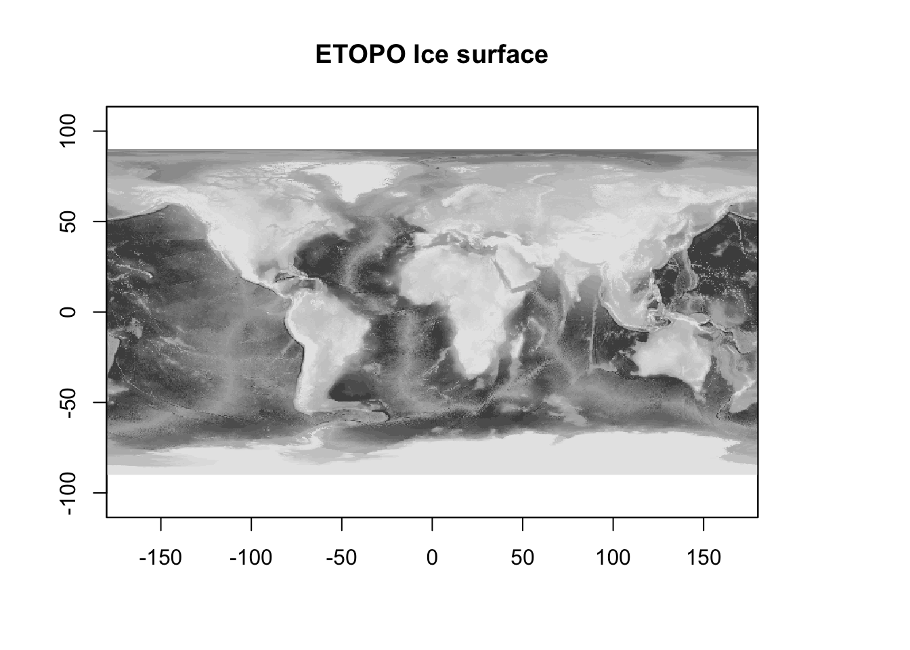

```r

# вычисление разности
ice.depth = ice - bed
plot(ice.depth, 
     col = cm.colors(255),
     main = 'Мощность покровного оледенения')
plot(borders, 
     border = 'black', 
     lwd = 0.5, 
     add = TRUE)
```


```r

# сделаем пустыми все ячейки, в которых толщина льда равна нулю
ice.depth[ice.depth == 0] = NA

plot(ice.depth, 
     col = cm.colors(255), 
     main = 'Мощность покровного оледенения')
plot(borders, 
     border = 'black', 
     lwd = 0.5, 
     add = TRUE)
```


### Фокальные операции {#raster_focal}

В фокальных операциях участвует не только сама ячейка или совпадающие с ней ячейки других растров, но также ячейки, находящиеся в некоторой окрестности (опять же, в одном или нескольких растрах одновременно). Данный вид анализа подразделяется на две категории: фокальный анализ с фиксированной окрестностью и с раширенной окрестностью.

#### Фиксированная окрестность {#raster_focal_fixed}

В общем случае фиксированна окрестность может иметь различную форму, однако наиболее часто используется квадратная окрестность размером $3\times3$:


Фокальные операции с фиксированной окрестностью — привычное дело в обработке изображений. Они работают по принципу "плавающего окна". Выбранная окрестность (квадратная, круглая и т.д.) представляется в виде матрицы коэффициентов — так называемого ядра свёртки (convolution kernel). Далее эта матрица перемещается, позиционируясь последовательно над каждой ячейкой растра, и значение в этой ячейке заменяется на взвешенную сумму значений ячеек в окрестности, умноженных на соответствующие коэффициенты ядра свертки. Например, если ядро состоит из единиц, то будет посчитана обычная сумма. 

С помощью фокального анализа можно выполнить сглаживание изображения, которое убирает из него мелкие детали (высокочастотные составляющие яркостного сигнала). В качестве такого изображения может быть цифровая модель рельефа или космический снимок. Чтобы выполнить сглаживание, коэффициенты должны быть такими, чтобы получаемая взвешенная сумма осредняла значения в соседних ячейках. Самый простой вариант --- это рассчитать среднее арифметическое. В этом случае коэффиценты ядра свертки будут равны $1/k$, где $k$ --- количество ячеек в окрестности. Для матрицы $3\times3$ они будут равны, соответственно $1/9$:

```r
# ФОКАЛЬНЫЕ ОПЕРАЦИИ

# Вырежем кусок из ЦМР
dem = crop(ice, extent(-120, -75, 10, 40))
spplot(dem)
```


```r

# Среднее
wgt = matrix(c(1, 1, 1,
                1, 1, 1,
                1, 1, 1) / 9, 
              nrow = 3)
# на самом деле проще написать так:
# wgt = matrix(1/9, 3, 3), но полная форма записана для наглядности

# выполним обработку ЦМР с помощью фокального фильтра
filtered = focal(dem, w = wgt)
spplot(stack(dem, filtered),
       names.attr=c('Исходный рельеф', 'Сглаживание средним'))
```


Более мягким эффектом сглаживания, который к тому же не нарушает дифференцируемость поверхности, является гауссово сглаживание. Коэффициенты в матрице Гаусса убывают от центральной ячейки к краям матрицы по закону Гаусса-Лапласа, что позволяет придать центральной ячейке более высокий вес по сравнению с ячейками, располагающимися на краю анализируемой окрестности:

```r
# Гауссово (параметр 0.5 - это стандартное отклонение в единицах измерения растра)
wgt = focalWeight(dem, 0.5, "Gauss")
filtered = focal(dem, wgt)
spplot(stack(dem, filtered),
       names.attr=c('Исходный рельеф', 'Гауссово сглаживание'))
```


Еще одна интересная область применения фильтрации --- это обнаружение границ (change detection). Границы на изображении возникают в тех местах, где его яркость резко меняет свое значение (в одном или нескольких каналах). Например, на фотографии контур лица может быть распознан по перепаду яркости между его изображением и фоном (если он имеет существенно отличный цвет). Поскольку перепад яркости соответствует экстремальным значениям производной поверхности (отрицательным или положительным), его также можно определить путем фокального анализа, а затем отсечь ячейки растра, в которых значение этой производной по модулю превышает заданный порог (то есть, имеет необходимый контраст). 

Рассмотрим, как можно выделить уступы континентального склона океана путем применения фильтра Собеля для выделения границ: 

```r
# Матрица Собеля:
wgt = matrix(c(1, 2, 1,
                0, 0, 0,
               -1,-2,-1) / 4, 
              nrow=3)
filtered = focal(dem, wgt)

# Это поверхность производных:
plot(filtered,
     col = gray.colors(128),
     main = 'Производная поверхности')
```

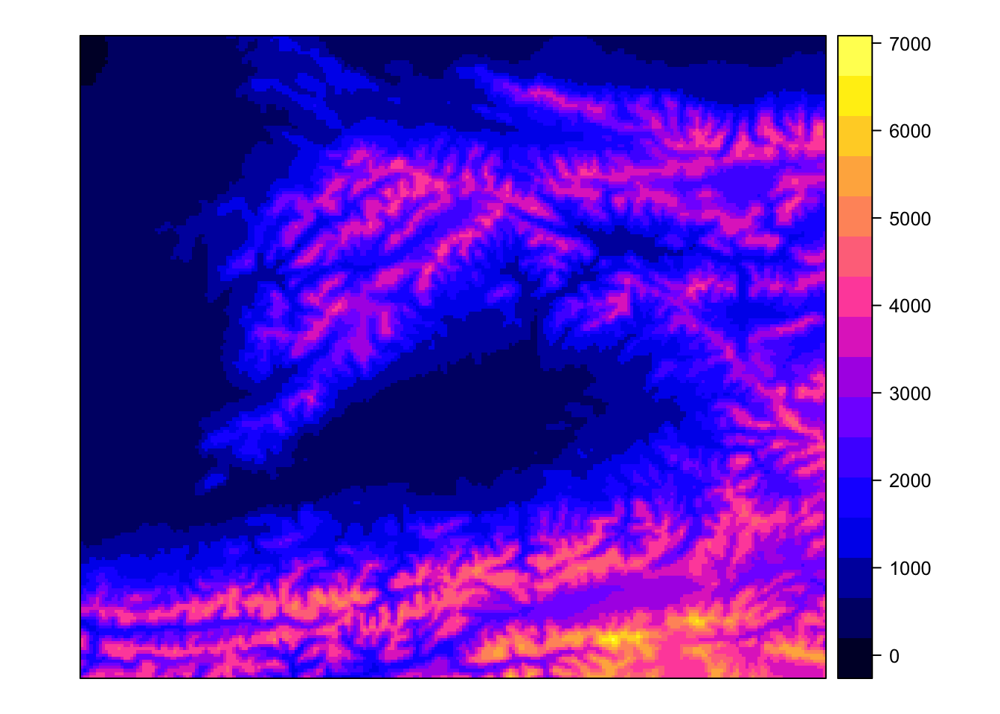

```r

# Отберем все ячейки, обладающие высокими значениями производных
faults = (filtered < -1500) | (filtered > 1500)
faults[faults == 0] = NA

# Визуализируем результат
plot(dem, 
     col = rev(rainbow(20)),
     main = 'Уступы континентального склона',
     legend = FALSE)
plot(faults,
     col = 'black',
     legend = FALSE,
     add = TRUE)
```

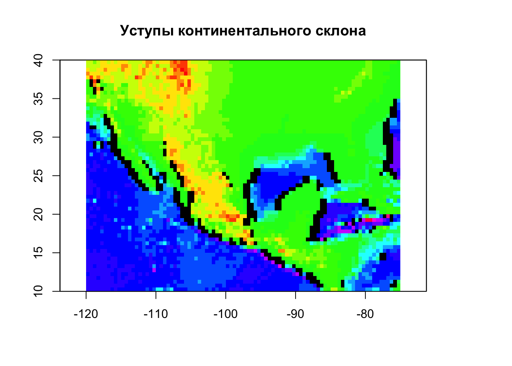

Еще один распространненый случай использования фокальных операций --- это морфометрический анализ поверхностей. Квадратная окрестность $3\times3$ вокруг каждой ячейки формирует локальную поверхность, производные которой дают представление об уклоне, экспозиции и прочих морфометрических параметрах. Их можно вычислить с помощью функции `terrain()` из пакета `raster`:


```r
# Морфометрия рельефа — фиксированное соседство
dem = raster('dem_fergana.tif')
spplot(dem)
```


```r

# углы наклона
slope = terrain(dem, opt = 'slope', unit = 'degrees')
spplot(slope, 
       col.regions = heat.colors(20),
       names.attr=c('Углы наклона'))
```

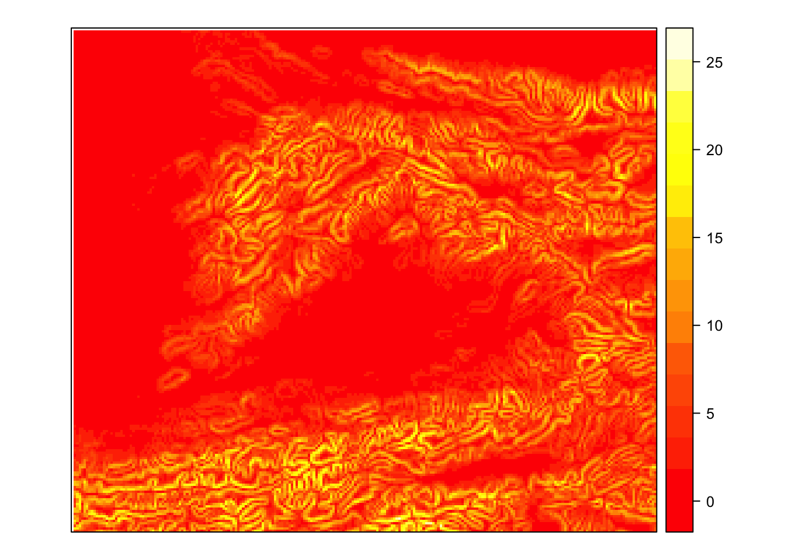

```r

# экспозиция
aspect = terrain(dem, opt = 'aspect', unit = 'degrees')
spplot(aspect, 
       col.regions = rainbow(20),
       names.attr=c('Экспозиции склона'))
```


Вычисление производных поверхности позволяет не только исследовать рельеф, но также строить его изображения. Например, хорошо знакомую всем по картам аналитическую отмыку рельефа (_hillshade_). Яркость поверхности в этом способе изображения зависит от угла между направлением на источник освещения (откуда светит Солнце) и нормалью к поверхности. Нормаль можно вычислить как напрямую через производные поверхности, так и восстановить на основе значений угла наклона и экспозиции в точке, что и используется в пакете __raster__. Обратите внимание на то, что для того чтобы повысить наглядность (контрастность) изображения, мы умножаем высоты рельефа на 20. Это стандартная практика для мелкомасштабных карт:

```r
# отмывка
slope2 = terrain(dem * 20, opt = 'slope')
aspect2 = terrain(dem * 20, opt = 'aspect')
                 
# параметры angle и direction функции hillShade определяют азимут и высоту источника освещения:
hill = hillShade(slope2, aspect2, angle = 45, direction = 315)
plot(hill, 
     col = gray.colors(128),
     main = 'Отмывка рельефа')
```

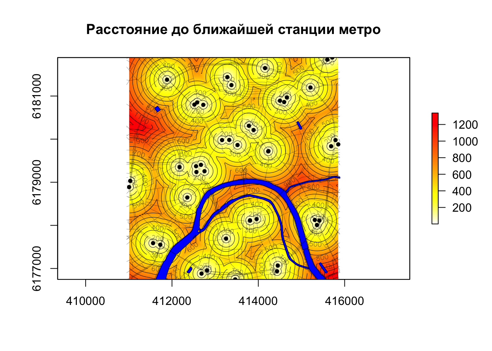

#### Расширенная окрестность {#raster_focal_extended}

Расширенность окрестности означает, что она определяется не фиксированным шаблоном, а условием, которое должно выполниться для того, чтобы анализ в ячейке считался выполненным. Типичный пример анализа на основе расширенной окрестности — это операции, основанные на вычислении расстояний на растровой матрице, такие как аллокация, опреление кратчайшего пути на поверхности сопростивления, и собственно, само вычисление расстояние.

В мелкомасштабных тематических атласах часто можно встретить карты доступности той или иной географической локации, которые в форме изолиний показывают время движения до ближайшего населенного пункта. Эти изолинии можно построить по растровой поверхности, в каждой ячейке которой зафиксировано расстояние до ближайшего населенного пункта.

Рассмотрим построение аналогичной поверхности на примере доступности станций метро (по расстоянию). Для этого нам понадобится представить растр в виде матрицы точек, рассчитать для этих точек расстояния до ближайших станций метро и присвоить эти значения выходному растру:

```r
# Определение Евклидовых расстояний — расширенное соседство

# Чтение данных
roads = st_read("roads.gpkg") # Дороги
## Reading layer `roads' from data source `/Users/tsamsonov/GitHub/r-geo-course/data/roads.gpkg' using driver `GPKG'
## Simple feature collection with 2213 features and 12 fields
## geometry type:  MULTILINESTRING
## dimension:      XY
## bbox:           xmin: 410946.9 ymin: 6176676 xmax: 415890.8 ymax: 6181910
## epsg (SRID):    32637
## proj4string:    +proj=utm +zone=37 +datum=WGS84 +units=m +no_defs
poi = st_read("poi_point.gpkg") # Точки интереса
## Reading layer `poi_point' from data source `/Users/tsamsonov/GitHub/r-geo-course/data/poi_point.gpkg' using driver `GPKG'
## Simple feature collection with 6623 features and 9 fields
## geometry type:  POINT
## dimension:      XY
## bbox:           xmin: 410947.3 ymin: 6176678 xmax: 415889.9 ymax: 6181909
## epsg (SRID):    32637
## proj4string:    +proj=utm +zone=37 +datum=WGS84 +units=m +no_defs
rayons = st_read("boundary_polygon.gpkg") # Границы районов
## Reading layer `boundary_polygon' from data source `/Users/tsamsonov/GitHub/r-geo-course/data/boundary_polygon.gpkg' using driver `GPKG'
## Simple feature collection with 11 features and 5 fields
## geometry type:  MULTIPOLYGON
## dimension:      XY
## bbox:           xmin: 410946.9 ymin: 6176676 xmax: 415890.8 ymax: 6181910
## epsg (SRID):    32637
## proj4string:    +proj=utm +zone=37 +datum=WGS84 +units=m +no_defs
stations = st_read("metro_stations.gpkg") # Станции метро
## Reading layer `metro_stations' from data source `/Users/tsamsonov/GitHub/r-geo-course/data/metro_stations.gpkg' using driver `GPKG'
## Simple feature collection with 45 features and 3 fields
## geometry type:  POINT
## dimension:      XY
## bbox:           xmin: 411007.5 ymin: 6176747 xmax: 415852.2 ymax: 6181892
## epsg (SRID):    32637
## proj4string:    +proj=utm +zone=37 +datum=WGS84 +units=m +no_defs
water = st_read("water_polygon.gpkg") # Водные объекты
## Reading layer `water_polygon' from data source `/Users/tsamsonov/GitHub/r-geo-course/data/water_polygon.gpkg' using driver `GPKG'
## Simple feature collection with 8 features and 7 fields
## geometry type:  POLYGON
## dimension:      XY
## bbox:           xmin: 411595.6 ymin: 6176676 xmax: 415890.8 ymax: 6180765
## epsg (SRID):    32637
## proj4string:    +proj=utm +zone=37 +datum=WGS84 +units=m +no_defs

# Создаем пустой растр с охватом, равным охвату станции
r =  raster(extent(stations), nrows = 200, ncols = 200)

# Конвертируем ячейки в точки
cells = r %>% as("SpatialPoints") %>% st_as_sf() %>% st_set_crs(st_crs(stations))

# Вычисляем расстояния
d = st_distance(stations, cells)

# Находим минимальное расстояние для каждой точки и заполняем 
# полученными значениями текущее содержимое растра
r[] = apply(d, 2, min)

# Визуализируем результат
plot(r, 
     col = rev(heat.colors(100)),
      main = 'Расстояние до ближайшей станции метро')
contour(r, 
        lwd = 0.5, 
        add= TRUE)
plot(water, 
     col = 'blue', 
     border = 'darkblue', 
     add = TRUE)
plot(roads, 
     lwd = 0.2, 
     col = 'black', 
     add = TRUE)
plot(stations, 
     pch = 20, 
     col = 'black', 
     add = TRUE)
```


### Зональные операции {#raster_zonal}

__Зональные операции__ связаны с агрегированием растровых данных по площадным зонам. В пределах каждой зоны вычисляется одна или несколько характеристик значений анализируемого растра: среднее, максимум и т.д. Как правило, зоны задаются в виде вспомогательного растрового или векторного набора данных. В случае растра каждая ячейка должна содержать идентификатор (номер) зоны, к которой она относится. Совокупность ячеек, имеющих одинаковый идентификатор, определяет территорию, которую покрывает зона с этим идентификатором. Если зоны представлены векторным набором пространственных объектов, то каждый объект (полигон) также должен иметь собственный идентификатор. Теоретически в одном наборе данных может быть несколько пространственно не связанных объектов, относящихся к одной зоне (например, зона экваториального климата состоит из трех ареалов). В этом случае агрегирование данных будет произведено сразу по трем полигонам. Таким образом, количество получаемых в результате зональной статистики значений определяется количеством зон, но может не совпадать с общим количеством полигонов, которыми эти зоны представлены.

В качестве примера рассмотрим вычисление среднеклиматических параметров _WorldClim_ в пределах различных типов земельного покрова (Land Cover), которые доступны в пакете __tmap__:

```r
temp = getData("worldclim", var = "tmean", res = 10) / 10
spplot(temp)
```

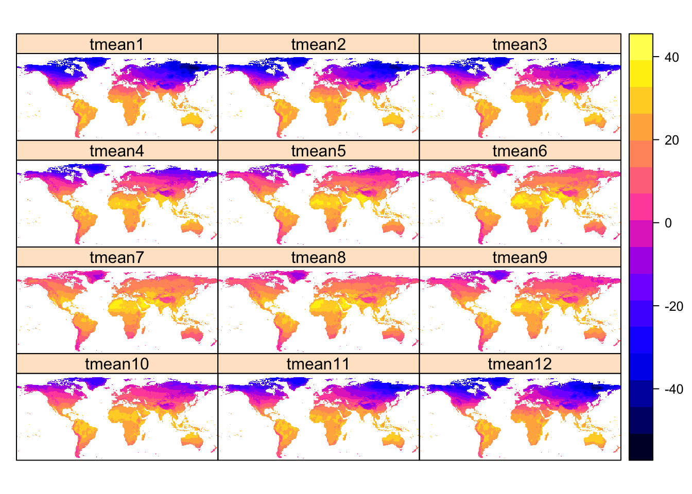

```r


data(land, package = 'tmap')

# таблица типов земельного покрова и их идентификаторов в растре
(tbl = land@data@attributes)
## [[1]]
##    ID  COUNT                                cover
## 1   1   9140           Broadleaf Evergreen Forest
## 2   2   6660           Broadleaf Deciduous Forest
## 3   3   6124          Needleleaf Evergreen Forest
## 4   4   6622          Needleleaf Deciduous Forest
## 5   5   4134                         Mixed Forest
## 6   6  16171                            Tree Open
## 7   7   9341                                Shrub
## 8   8  21377                           Herbaceous
## 9   9   1893    Herbaceous with Sparse Tree/Shrub
## 10 10  12247                    Sparse vegetation
## 11 11  11658                             Cropland
## 12 12    598                          Paddy field
## 13 13   5587   Cropland / Other Vegetation Mosaic
## 14 14     65                             Mangrove
## 15 15   1492                              Wetland
## 16 16   7436 Bare area,consolidated (gravel,rock)
## 17 17   7221      Bare area,unconsolidated (sand)
## 18 18    388                                Urban
## 19 19  61986                           Snow / Ice
## 20 20 393060                         Water bodies
## 
## [[2]]
##   ID  COUNT                   cover_cls
## 1  1  48851                      Forest
## 2  2  32611    Other natural vegetation
## 3  3  17843                    Cropland
## 4  4   1557                     Wetland
## 5  5  26904 Bare area/Sparse vegetation
## 6  6    388                       Urban
## 7  7  61986                    Snow/ice
## 8  8 393060                       Water

pal = c("#003200", "#3C9600", "#006E00", "#556E19", "#00C800", "#8CBE8C",
		   "#467864", "#B4E664", "#9BC832", "#EBFF64", "#F06432", "#9132E6",
		   "#E664E6", "#9B82E6", "#B4FEF0", "#646464", "#C8C8C8", "#FF0000",
		   "#FFFFFF", "#5ADCDC")

tmap_mode('view')
tm_shape(land) +
  tm_raster('cover', palette = pal)
```

<!--html_preserve--><div id="htmlwidget-d5ca830cc7550795e5a5" style="width:672px;height:480px;" class="leaflet html-widget"></div>
<script type="application/json" data-for="htmlwidget-d5ca830cc7550795e5a5">{"x":{"options":{"crs":{"crsClass":"L.CRS.EPSG3857","code":null,"proj4def":null,"projectedBounds":null,"options":{}}},"calls":[{"method":"addProviderTiles","args":["Esri.WorldGrayCanvas",null,"Esri.WorldGrayCanvas",{"minZoom":0,"maxZoom":18,"tileSize":256,"subdomains":"abc","errorTileUrl":"","tms":false,"noWrap":false,"zoomOffset":0,"zoomReverse":false,"opacity":1,"zIndex":1,"detectRetina":false,"pane":"tilePane"}]},{"method":"addProviderTiles","args":["OpenStreetMap",null,"OpenStreetMap",{"minZoom":0,"maxZoom":18,"tileSize":256,"subdomains":"abc","errorTileUrl":"","tms":false,"noWrap":false,"zoomOffset":0,"zoomReverse":false,"opacity":1,"zIndex":1,"detectRetina":false,"pane":"tilePane"}]},{"method":"addProviderTiles","args":["Esri.WorldTopoMap",null,"Esri.WorldTopoMap",{"minZoom":0,"maxZoom":18,"tileSize":256,"subdomains":"abc","errorTileUrl":"","tms":false,"noWrap":false,"zoomOffset":0,"zoomReverse":false,"opacity":1,"zIndex":1,"detectRetina":false,"pane":"tilePane"}]},{"method":"addRasterImage","args":["data:image/png;base64,iVBORw0KGgoAAAANSUhEUgAABDgAAAIcCAYAAAAT/R6VAAAgAElEQVR4nOy9LXBcZ7r9u3LrP0RkDDxVsYFBbKChulXjC5yqyQEeYAMNiEEH+ILWrTMD7FRFQA4IMDhpIFfFApmp4wbHIA0SMAIyOAKTqRoTDxCNQDzAwJqqGHiISIAv6F7vXu+zn3fv3frslp4fsdwf+6u7997veteznvd6P/74DkEQBEEQBEEQBEEQBHPM/3XaGxAEQRAEQRAEQRAEQXBYQuAIgiAIgiAIgiAIgmDuCYEjCIIgCIIgCIIgCIK5JwSOIAiCIAiCIAiCIAjmnhA4giAIgiAIgiAIgiCYe0LgCIIgCIIgCIIgCIJg7gmBIwiCIAiCIAiCIAiCuScEjiAIgiAIgiAIgiAI5p4QOIIgCIIgCIIgCIIgmHtC4AiCIAiCIAiCIAiCYO4JgSMIgiAIgiAIgiAIgrknBI4gCIIgCIIgCIIgCOaeEDiCIAiCIAiCIAiCIJh7QuAIgiAIgiAIgiAIgmDuCYEjCIIgCIIgCIIgCIK5JwSOIAiCIAiCIAiCIAjmnhA4giAIgiAIgiAIgiCYe0LgCIIgCIIgCIIgCIJg7gmBIwiCIAiCIAiCIAiCuScEjiAIgiAIgiAIgiAI5p4QOIIgCIIgCIIgCIIgmHtC4AiCIAiCIAiCIAiCYO4JgSMIgiAIgiAIgiAIgrknBI4gCIIgCIIgCIIgCOaeEDiCIAiCIAiCIAiCIJh7QuAIgiAIgiAIgiAIgmDuCYEjCIIgCIIgCIIgCIK5JwSOIAiCIAiCIAiCIAjmnv9z2hsQBEEQBNPwzdWrtcfeYAUX8aTz/0uPAcAnL18e4dYGQRAEQRAEJ0U4OIIgCIIgCIIgCIIgmHtC4AiCIAiCIAiCIAiCYO55r/fjj+9OeyOCIAiCs8c3V68Wy0CILQfxyk9KvMGK+/hFPCk+x+ebltn0PBAlLEEQBEEQBLNKODiCIAiCIAiCIAiCIJh7QuAIgiAIgiAIgiAIgmDuiRKVIAjmgq6lC5+8fInHVwedygymKYdogmUNLF3Q5b7BCu6/XEuPz2N5g+6P7qPXqeTBCvDkSXOJCNBcJsL1HOTzsettW499n/f6LqUw+vkHQRAEQRAEp0M4OIIgCIIgCIIgCIIgmHtC4AiCIAiCIAiCIAiCYO6JEpUgCGYGliQcZfnIYWEZhi1h6NJto7QMLseWtpwm9nhzmxYGg1RyoqU2gH8M2j47fY99f9fPvXTs28piThL7efPYBUEQBEEQBMdHODiCIAiCIAiCIAiCIJh7QuAIgiAIgiAIgiAIgmDuiRKVIAiOhWlLTNj9BKjs/Px/11KQk8CWQbzYA65fqv7fVMJSeozvm7ZUxXYy0VIYfQwYH1N9vbcuHm+LV4bS9t5py3f0/94yTqv8hMdNsdsS5SdBEARBEASzQTg4giAIgiAIgiAIgiCYe8LBEQRBJw4a+mlnu+2s/Cy5MwC4DoeSs6FEKQCzi0tDj7MXTqrraHI7qJNDA0KtK0a3y1s3/36wAnz5BDWHiGKDSY8b77uljhh1r5Bvrl7N3EL2/aX1lD4HXX7pN6LHr+T2eHx1UNvOrsxCSG0QnGU0ADsIgiCYbcLBEQRBEARBEARBEATB3BMOjiAIinC2W/+vcNa/qYVqk4PjqCk5Gro8P23Gg7ev9lgdJF+j5Cw4SAZF07Fuc9a0LbftWJ8Gba18PXfHNPutOSZK19bB6pKxjpmm39lhnE4x4xwE01P6bXZ5X/zmgiAITpdwcARBEARBEARBEARBMPeEwBEEQRAEQRAEQRAEwdwTJSpBEACorLW05mowpaIlFG32f6De8tW+j9DW2/Y6G5z5+OqguB329bpc7/9ei1VbatPU+rV0zCx2m5vKE44bb7/PO9OW6NjnAGBlZSWFsnrLP+5jHTb54Dxx2NIQvf61lY+trKxgf+1graEjrHR6vNLYg7w3jnkQnB/CwREEQRAEQRAEQRAEwdwTDo4gOGeUAgxLgYxAubWlDdLk3y/2gOuX8lBG65Lge7guvsdzVzzbW8H1S+Vt0XXY/ToOurZ85baV3h/MBwcJoD3uENaDBNgGwTxiWyjb54DqN9b1nGxdGisrK51aW1s3B/9fCuDuuqxZxR6jgzpXjhO9D3kwOe12bVM+D59BEATTEw6OIAiCIAiCIAiCIAjmnnBwBME5QrMf2tq3Ns1aM/uiS97EUeG1TwWOr0Wp52xpm+3R2cRSlgf/T7w8h3B3zDYHadnrMe3nHLONZwuvDfd5/owXBgPsr625x6HUXpmPtWHfr//a13U5zzflSAUnx0Ezq+KzCoKzTTg4giAIgiAIgiAIgiCYe8LBEQRngGlm/myXkq55EKVZa9slRV0dJddF2zKUk3IzfPLyZbb+adwpbZ1fAL+bi+UkshuCo6ftM/Ve0zQDbDMCYrZxtrGdGppmlW1mQynDoem9fP1Bu0l4y5tFFgbj8ypdHUrpOHrLYB5D2/52+dzsa2f9GJ5lFgYDfDk5jTZdK0uf0Xl3TAXBWSYcHEEQBEEQBEEQBEEQzD3h4AiCM0DbbFJvYZC6kAD1WeUXe8CtS9O7BdpyOoDuLg51LzDj47AOhmd7K9l+0aXB5ZMXe+N/9RgdZb7IQeuEg/mHM/r6XXyDlfT96i0M3N9ezCyePOzGUOrU5DGNA+MoiO9FEPg5KPa3azPH2tyVlvitBcH8Eg6OIAiCIAiCIAiCIAjmnnBwBME5Qzt96KwyZyvo9tCZEJ2dtK4IIHdyvNjLnRCki6NDXRwHcZk821vBaL+aGed26L6WZmiPk3BwnD9i9m82mSYfQx1l9r2c9W3KSjmK3318j4Ljhk6H07g2Hgd6j6N0zbfS33YQBPNJODiCIAiCIAiCIAiCIJh7wsERBKfEtKn5JwHzKfT/D1aAL59UzowXe8DmF8CTJ7kD5NneSs25cRFP8OLFC1y9PnRnhrzuI7bbCB+3y+f23H+5VpxBPa2ZqXBsBB5eJoyH/R0GR4vtUmPRc880uUAx4xsEswMzdbzfrD7unQu837J1cAG5MzXO2UEwO4SDIwiCIAiCIAiCIAiCuSccHEFwymgvdls7at0MwNF29yDs5ECnA7dD3REefD33gX3p7TbqftnOK1xfKbujKXuDmRsn5YbxOrAA7ccpCIDmWcGY/T9+9FwL5A4vm/kD+OcrPj4t8fkGwexRyutoy9NhR7a29wVBcDqEgyMIgiAIgiAIgiAIgrknHBxB0AFvdl67ezCbgh08pqGpqwjQ3FnES/pm3WnT8ppmGfT9Ojthu5BopwF1cZT2iU4MO/Nht9XOqHaB2/Zsb7ysw34O6iYpzeLyuSAoob8z6x4ITgfPxWG7pNjMHttZSl/XNoNrz3XRnSEI5oe23B1L071ZEAQnRwgcQTCDNAVWeeUeTWUrVmzQYK2uaFiXtpMd7a+528rX64BAhRCWlpSEkOuXDiceTHtjMe1NTBCUoIBn2yyXBtXBbGODig8TNKrLIvE9CIKj46iEZPs7P8qg8hC7g+D4iRKVIAiCIAiCIAiCIAjmnnBwBIGgpSiciSWnFSbluSeA7i1QT3K2wHNk2JlsLziVr+P7m4JFLbZk5qj2VY9bBIgGXfG+f+rYoPMJiJm8WYSBy8D43FIqPezSVtJi3XcRUBgEQRAER084OIIgCIIgCIIgCIIgmHvCwRGcS+h+6DJjpi1UlS7uiSZsTsVJYB0pz/ZWsjDN0vHoLYzfp9kYpdeWQlPbckK82vSuzomTdKh0+bzC8XE+actfYL6MbcUczBZ01pTOZRoa2vXz884d2nY6vgdBMF945wcvPD1+20Fw8oTAEZxJugwwZ8UObMtiZpVp7PReEGqpa4p9nfc4xZfTOFb2u/RsbwWbX4z/Xn44/ne0v4aFwQDLDys7u1rdg7MLO/gQb9DL3w6FQi2BAOrf82A2OEygaBAEh2MWhb+2rndACBpBMAtEiUoQBEEQBEEQBEEQBHNPODiCM0PJteE5CErlJSwbAc6GCq9Wa9vyzP4fmG6ftazECwW1jgsP3Q4bPtoWNHoSjg7OIHE9drae2O9YcP5o+j6yNfKtS75Do7cwSKViZ+G8cxbRc2g4N4Ljwrtmxvft9NESQ0vJgVoizvFBcPyEwBHMNaWBuxUvugyED9OFQ0syDrIMm0HR1hXF4okY3jbwvd6AXC3y9mbe5gWocMLH9DV2f2wnAr6PA7v7L8clHk+eVOt/sTd+bUnk4IDypG/+bJlBcL7Rc479/ev3uy1vITqqBMH5o8vETJwXTp8upSlt8PxfEkpI6fnI6wmC7kSJShAEQRAEQRAEQRAEc084OIK5wboPiO220XVm386cNJVUTBOueVAXh67bCxz0XCjWOcL3ksN2eLHLidT/MSW3jH7vvO9gl+9lW7BhMLt4nzcft+VO1gEVBMH80nQ/YUtC2zjp7mpnmd7CAKP93C1aep2WCXZxbLQ5MbpSCmCni5Xr4P/VDRt0J66354sQOIIzTVs7WA7kvZsP1syvrKxg+SGw+QXw5ZOyZdQKFED9QmnzJtrKZexrdfBbyhYhuuyD2uL1+KmYcpqW2fNq5Y/Ws/OH/c2yLbMVOoIgmA/sNXhaMZriRQy2jg6deAFy4YF/q1jQRZiw4sJBX2Pxvi9NLaktnvgS36MyTcfVK2NvmtgL5osQOIJzjSc+cBBiL0RWXfdaoLIVZCmIsmvOxkH3QSmdnO3rS4KF1+q1bR0lh4fN5DiIQyFmtSpC7JgPbH6N3kTx5hiIGbkgmFU4CWKdoiVOKxvqLKPuiqNyTXBZQF308ESR0+AinuDZ3gpG+7moodsa90RjPBGii2hUyqEDqrw1wut0aV3xWcwWkcERBEEQBEEQBEEQBMHcEw6O4NxhO3gQquJUYaneluo2PUtbye3QVJpCx0db2Yq3H165Smk5pQwTMo36XVqv95qjJGbFxoSDY7Z5tjf+LYz214qla0A+68N0/VIr2SAIToa2tup8DDh457Sgjp0xB47XPWHdIEflDlF3HlBfR+m5LmiJSjgGynQt+SmVm9G1peMAoN4RUNfnuYBKxGd3/ITAEQQNeIGPzOY46lKTk8CW5Fhxxt6k2dBUDR+15TbeBaXpJtEb7DWJInEDWSYEj9lEzxV6I0Uhg/bjIAhOn7ZrUFPOVdANr7U80DwgLJWP2NKNLnRp0QrkJSBd1+ENfvneP95/hrtrt9x1d837iGvFwfAmM/ndKd2/H0XJCderolaUFp0cIXAEc8lxB16WgkGB+TkxnWRNINVrAFn+CAdwTDLvStQwT4fXTSc4Pfi9pyCoN+UUNiIZPwhmDysWqyNS8ziC7niihrpoZyHzoiR8eJ91m+BhXRbe6+2g19v3NldtfA+DoExkcARBEARBEARBEARBMPeEgyOYWUrdSEgpS4KUZrPDGRCcJbRzTTg4TgftnGBngDWRXd0bMfsWBLMDz6P6O7ZlmfGbPVrU+XlSro1S7ob917adZUmD13mlyf2hrotSaQ5puy5ozkN8FyumdQgrkWdydgmBI5hpStb7JnGDFwAv70Gfn9cTGgdQTe3outyUHSSEqWl5Tes4rlKiYIxXUhUcD2wFbUtQVLzQG17bdk7rx4MgOHlKAd2EZSjR+vF40EwEb9B/nNiQzxI2OwHwRQ5ixQyvBKUk4uh3zIZVPv1+ETtXlmvvOcygPqhjczqA+R0jBGNC4AhmmsNc9JpmBqwIchKDbxUdgOmFA3ssSjdoXYQN7bZiAxA9ugzIutSlWnhMSl1ZugaQkvMuougsZHB4VJgg6irzfmuauu5lbtjvdhAEp0PbNfUs/0YPI96os8ELUezSjcTen5Xe4zkuLKVt8Gh6ro3Se719aHKGtFESSixNrpKm9x9GZPfu81QMtN8rCjGzLhZ6HXxICEnzSQgcwUxSGizbk/dFPEmdCnQQ0YRVy7kcclSDZG/wrmFln7x8eSh7nDeI9VrE2guLFTj0ffybtA3G9PiVltGl/WxTu1ugbvMvobPr55m24xR0RwND9ftV+u5ri9ggCGYH2/IR8Fucz/JADKgLDMDBtpmz1tO81w4EuwgZJRGjLVy0S9tNT0jgspr+3t1dxOLibrYfnmBjn296rLRvpQF+06RQSQAq7W9pG739I4cVuErbrdvB46yPxbUxOAlC4AhmjmlacpGmdmHWBWCdC6X+14AvIpRaqXrCSNO+dLm46PpLwotX8//N1atpYOYJHN7+eVb7rq6SkjhihRYeb67n0fePcPej3WxwSGdNyc0RNdE+OvDW2ZlwcxwMnhe0ExAw/t7ye62iBwUlChzq4DjvzqIgOE302qPY+wBgtq8pTbP1XbZ7WvFfBSG7fCsWeQIEZ/RLQgPf5z3Xlm9RckuQgzg1phE3FL0+2O3n9vFx3X67bH42XnvR0jpLr/OEBbtPuh122z0Gm0Ncufkjft74EHfXbtX21RN7XuwBTwfP8PXjWzMrcNh7puBsEF1UgiAIgiAIgiAIgiCYe8LBEcwU02RuWNeFNwtTqrFlWYt9n1eyYbFuAp3NJXzMczjorFHXmV0tabFJ71xfU92mN4vs2XUPGiBq3Rb8m9vG11sbv80z0GOjM+Gl7fJmzr1lnqcZdBs8GwGkB0e/y7ZDinZYmMbxFQTBydN0HpyHTBwvBNGjbSa6ycXhhX+WXmfxykvaKLkIml5XypewJSfT0tXxUXod3ZNPvx9vh83HaFre0+8Xcfej3cYSmaZtsA6SrtvcVvIyzTbo4/dfrmXfJV327u54X2fp92YdHHos+b3yngvHx2wTAkcwM3S+gL9bx/X3VtMgWEsammocuwzumoQNUmoFacs9SgGZpdKLaeAJ2Qs8JLYGtLQM4HBhU6WAUi/AVa3Cal/VwFcVJbSchjdmFDWskKKlBHpcztsA03auKWW12O9PMIbip8Lvon6n9ffDsi4rJFoBJAiCk6fLxMks/0ZtKUKpZIO0CRylSQNeb5vKLZryuEo5GF2FDKUt82LaQXlTyYbum7cfQCUicDlPB8/wi3t/x88bH+L68md4sfkIAHB37RaeDp5l/w42h1hb7qdlsWSDHDT0dNa4fgn44/1nAJD2z/tezlLgaJdyICAXZqzI4QlZKrgdJtQ1ODghcAQzSaZGv78O/GsVQHOv8bYAp6OYvW4TQLxgTG6LF6RpB/HTonkUTe4TLzcEOFzIVCkYVCl1Q1FhipTeq/sG1HM6bDaHNzun2zorF9bjxBOOAGR5EaUMmvOKOod4fOiWKh0jm1Vjj/t5E9eCYBawA3TOkHvXKGC2Bx/Wmdk0CeTthwaSEm82Gqhm37s6D5qclfo6u/42DuumUKy7gQNP6/jY3V0EgOyxp4Nn1bqWPwOANMilsAEALzYfpUwKu31NNDlSugaGeoGpx4kePwDZsaTAoeKG5y45jd+azcprcryQtuOq+2G7pxH9jHauLEcI/gny3tbr/ruDhBUFwUnRdBEGulkyvYusfY9nPwe6uToUO6jR5RBbTmPLCqbFukSalqXihr156nritfvkiQrE267SjFrpBtS+pgnP2aEDer6mNHid90GpdUJ5n6uKHHpDe94dHbYbCo9RaeCgobkaKkrm/bsUBPMK7xs0jLEEf7+zdu9bunfp2hGjFARaCgzVZVs4g91FUOi6zBJ24H5QlwbFLaASLjgw18dG+2tZcKaiIgddGeQ77OFjXMoCN0u0uVv4Gl3v9eXPagPsg4SntlHaBm6HHhf9v+eiKQXJHqSLi/0Ne/enpXIpG6zvuZVLIkdJlOHvkWVI08LtWnq1iZ0ry1O/P5iO9356108ODnuzNmsn+5NCf1SzZKU6z3BAdlgRgOgsqw7yPFdCV7y2q56jw8vPOAk8waZpOw+7HtJUOmRT7L0LoeZxAPVZJm9gqdj2wVbMsMeFpS5nCevY4c2Cfgej20pFyQWl1waLHUzYcpa4jgTB6bD0ajPLRSgxC06OLjPLTSUqnpit7+OAf+fKcmOZqrXh8xja7fDe38UB4i2jK9O4QlTQ2NxdTaUiWmpyd+1Weh3dGCowqKgBIA3wbXeQ0uDe/t97rlRuoy4CFRduD4b4GJfSNlpnihUmbg+GAID15fX0uhebj/Ad9rC11s/WyX0HcmFISy7+eD9fftvnaPfx6eAZvsMeevd+LL5Hy5JJW96IXactKSltq+fo0eOp623aBhVj2spf9JjE/cHRoOf3c1ui8mY4wMW+KHkfXAT+ter+mJpaCEXgzHygAzydFWkLKm16rX1eX1NyKlghRZfH54+L0gDWCgDTbIMnZmjpjRUT7PGgMNHk2rA3BPob9T6bJryBvBVg+LwKHYd12MwDGmAbjOH3xX5vvLwNz5atx/Osf3+Co0NvjL26dWYB0C6/9GoTAGJWsAUeQzsA5+/Vzvaf9D1daUDkWeWbZs9LYkVT/kSXdTZhZ9m7DkJLHMapoIKM5mEAqA3615fXa+9/sfkoc0+UnCRtWSj2dU3iRhdstsfu7iJWN1fxMS5lbhJPnLFCiLdcih5aekP2FveyHJE2uCweb89dA1TlY8BYNPnFvb8DqH9/1EGk4k1TqZEKHPqdOIqSHm+9LEFRNjaAe/fy93YdZ3oCZFcBtCScnOXJFrtv50rg8NRAkh5/f3Kyk8wHfulSScS7dYz++SYtE++PQy9fvFtPIom7/g8upvedV+a9/qxUD+sFZJYcE0TFkFIQ5FGeiNqyBIAqLBGY7ubOOjJUyPEyQrxjx+f4mM5823IkbxauKU+iNCNfKkPibL1mWFAIOkww62lQsmfzGNvZhvOcx2F/cxpYq6JlW4eBEDiCJvQ6ONq4hvXl9SRO2E4MaovmDbTapO35kOcn3nAHB+M071X4HQCQfeYlqz/RwZzFGzB2HeR5g3BvRtvLt7B/A+i8Xn3v7cEQPz3uF4NWPYGGqAOCA/3B5hDLi+tpEF7K5lBBwjo2uEwbLKrcXbvVqYRD8Y43t11FBwDpMf03Oy6T11vRQgUQiiO6POtq0cetO0SFEd2GnSvLSXzVEFbuNwNJ+XgXunxvKWYope+jt6zSd0HFCq/UhaVO0+yPFS6axI9psWLJWRU2Spx5gaNN7bInEk/IqLk73q8rvgDGokjpOX0NkAVn4n1ZD3CmRRAey40NZA6ak0ZvCEuz1jangbS1o50muLFLaKlu50FPUrazSNN6jmJ9ilf6w+XzecCvz/QcMDoQtzPo9qZHBZemY6AtafW9fI5KuLo7yKwKHZqWb0u8eF7k8ShlppxXSi1hvQ4r9n3B+UVLIVQ41JtYHahtfgHsr1U3sDooYwmBYm3hir0Zn9Xz0jzTtY3qUaynbSCmzh6iYYa6LKXJMXDQzAtuD+/vDkLJpQIgm7UvuSa8xzXwUlux2uXbZZREFH0dt8miQoCXbaH70eTiUBHBujA8sUOFDSti6HmFaJmKzfrwcjfsemw5zPXlz7BzZRmvtq9heXHd/SxthxWg+ox+dX+Y5Zl0QY+DFVx0G/m3hd1tBpvj8p2FV33cu+cLcSXRwz6vTqGDOEVsx52jwLa6PS+cOYGjeIJVQcF7jH87r7t+aSx2AEjP1ZwgbcLGhNE/39RFF3GN8Ivo2ZqybVQaXCMngYo+JXGGr9n927DTTdhxqY12xp4Du5KjgGUK1o3A13ktX22dvjdI52BJLWS6bTq41xDSrselVFKhLg4v+0JFB+/vw2DdGKU2dfrctLNoXdoBdumCw2MCVCKADZ1UZvHCoaq/dWZ47iCbyxFMh2a4RE3t+UPLAOy5U8UOHUQ+/X5sMQeQ1cF74YgeXp096/I990ZThkwwHcfRGaKp3aQVE7gN3gxvKUixq3Ch5QNN37+2wV4Tba9pKv+wz1H402wIljR4cL+0XWuXEFDbIaTk2gByp4Ie89uDYe23ruvX11uRQ10YKmjoQF4FCzvoBppFD4stV7m+/Bm2t3dx82YubGxv7+KX+89c9wi333PeUvDwWukSK2LYY9SWyWHPkek4OAGobe+zHWQAYHVzFVtr/ewxrzTnIHQpV+tSenMS53uvlbV3j1lyXnlioDfhOc191ZkSONwvuSdseHR93UGwyzZlMIr98W5sjP+9d6+yR6n4UUv0naxLX/vL/fEP9aBfcq+0xrpNmGnCx7P9c/a3ZPX3bhL5eMlmf5BSDluLW6pN1cwHe8HzHAZA/cdpSyx0+XzMOgdK+9T1B+6FeOostLWulfZHhY+jaC3LbSKHcah0EUq8khYr7ui69TW2JAXIg0znJYxUszV0EA6Uc4XOezeVLqjgRULUOF+MNq5ha62fDTL1fKmujLsf7Wb15m0DTb3O2xtXWzMP5DO4q5urtWyB08qVOC5mpRPBtFkTbcffK6VWJ55ek2wZRqksqbSNx91eVAeEWq7gDcY4kOXvw5boqGChQoPCxz2nAAD86v7YPaWvsyUnbSKHig9AvfQDaC9P8Nw5ngNAjw0fs+vlujV7o5SjweeYp+E5M3SZdh3WvQEA29u7uNj3S0IoWugxpahkPyt77LzvphVxyOZuNbb4yx/GIknpXptw2/S47y3uZWVLfA2FY9027qP+X48Vw1ubMk/0b6/sx4abklLob+mYldwbbSGoTdgA16ZON7o+u4zf/6mbY6VJqCrdd50ZgePNsH4Cv3fvcEFFFndZTcJIg5ChywTqyy2JGRyc2Mdf7OVihgfFkqbSEIoZvQ8uYvdvwzw05/0qYyQJGeIooTtltL+GN8NBfvzfX8fG56u4eVNu8N7VXS/X36uOlQ46P3kAfPNl/touLUUPM+CwooQNuuRrSr21vRMA32Nn9Yi27vRasTZZ4PXkYkWLpvdaocAGsuo2HZam7AxL2/o8l4onkNgSGE+AsmVI3C7CwawXLtm07nniPDs3DtpFJkpSzg+jjWtZ4j8H2Dx/cwCmVngrfADT34/owI6CCV0fAJJjQ2cSS4NJvTHntYI3ygxcnPUyly5tIU+ag4gcXd2J+v0CUO4iPGgAACAASURBVBz0lAYy+jrvNdNue1d3BgAs/nYycBF3sj7P/fECKD1xcHt7N91XApVgoZTED1IqZ9ESCSsylEQHKyoAdaEAKLsqtOTErssuS9/LATdf4wkafPw77GF9eb0mwNj2t6XAVa7XiqYvNh/hF/f+noW5ekGm+tkS64RJ+2vEO77v938al5AsLzY75XUb1UXhDY5tG14Vjthtx3uNihw8z9r1ek4bK8rwvd752QsrVdpcK7pt9hrluT94vSqF6E5zzdKJYY/S+ZvrUVdV07pLYb26/ve2Xo/bxM7ihYxwsMwBOoDs/95zGSJCZAdhEgp6lCKIJv2SJkuO/v3JA2fbJ2xsVAN8DvZt4JSuU4+NPub9nz8WLxej98FFbHy+ml6XHnfKbHb/Nj4JLf62n/4GJirn++t4+umvcferH5KIYct+uBzr9PDgsSoFbZVKFeysvdcxw9tHe0OiIoVH6ff0ZjhIn+NhbshKVmPr3LAOBq/Li70Rt1ibmG6DPf7TuksAP/9jmuWVsDeQTQGxXukRxUR1M9hQzlk+b06DOqfOcwZHSejQ78FRh/8Gs4vN1ACar4Nazga05x2o3ZuvV0emDiwoamggKR0kanu3Ay8L98cKIBw8lm6eZyW09KClIbxmH8T5QQcBgKKIME37SqVrdooNly29v2kZXI5lWsGj08BHSqpZmtw2kLO/F329DsKA6jh42Q7qlCLWPeXdO2rpiheiCSATM9xj42Rh6Pvsv3aZpeV7bopSBoe+xtsWuz2l7SU29+Pu2i1sbADb+8N0bvrpcb9WVldyKRPNFFJXmpbw2f21goFum90P64woiXO2PEadIrp9DGP1zqslKDKpIAXkYowVO7xcFD3/aObJzxsfZkJTKdTXBlbb75uuz5ZR8bEbi2OHTMn1bil1hGmi5Ka3dAnqfe+nd/13s15Pru4MTwBQcYOv0cE8xQErANjnPYHBy8JQMUKFh9LgkO6K0vYDeTpzU9BRTdR4N754WFHF2lu3t3ezfdTt1mUDyDI+sm4xfEwcGlw2gGRTKwVj7e4uJkX/6ae/roXwWNuXt40H4cW7cZcbLxCU+20/Z/4GuJ8H+U3we6vfPS/VuCQuHYaDZFl4NzZ0b3zyYPx/bqN1RVAMaFqHuiQ8UQHI80faBpHTlrNY503poks0+8RzeHif6bxQUtHPkrjB7+M03WG8TJ0gYFcLbcnI0hQAmVhgb9DYraF0s6qP2fpur97bih1Nr+E2/rzxIb7DXnrP5u4qnu8im5FtquG223gU57xpJwemxToRgfLsYknQaatnP4zFu42m9Xgzrd42TCtc2I4O3vL1/lOPbXa8GtzL/K5u7q5mvwvr2vDcUUC+Hb+6P0yuJRU0bACodXTofbTN4bD7/av7lbOBvy11L3AAq9jX828dHOugXV0WpdISdW3Z9VgBQLfTlq5pXoR1nXAbtYOKvtdzKVj3lz232Rn50udgj7uXiaElNgBSOUlpH3R5XJ8KHgx8BsZiiy17YQmLu+1GuOBnyH1nycul3XppC9/P79Dm7iou7V6qfVYf41J6jV0391lLuOznYkuWSs9zX/U4cxv4uXqlNKUck67nRM9RzeXp894YODsehcfe++ld/50+YFc+Kzd4HGhOixvW2fI6K5gAzU6IYjBpS11fCT3RlwKcACTRAhifhAHgp8d9fPIgFxtUkPCcIPxbBQvN02DJigak6o0OT/Ksn6QKzuOoZTP8ETITxNaR8TEvQV7xfhT2OS+MNXtcQmWPc5BqU/QVddEcBTZ7oot4ooN3K6BZSueIUrmItiK1OSNA3b3RVobThVpJihG4LKV8lzY0p+Motvsk8FqReWVSZw0V37zuKPPw2QWzgc1t0nOHlqd4Aj9QFy04QCCe6MC/OYtIAcMOKnQQotbyrbU+NjaAmzcrkebrx7fSDCnfC6A2c2exmVSHdXYcldDRZQBv69qncV14YZ9daaqNL7lwu7yP6PWer/E+E7WjezSVvnTex8n9lQ2U19cB9cE2O3AAwJWbP2btRZmHsLy4nt1jEh2o6iC2aYCk//L96ihQp8jq5ipuLFYDap3JV4GjTdiwAkTaJnEc6G9Wv3P2t63nAt0me37g8nVbdXtI1/ayup28z1cXGtHyDpaZMB+DDgKbf8LjTuGK+8hjr/ui3w3CbeJ3hejv5cUesmwQzYDwSmRsO2Fdl34WpVIU7zvwi3t/T86Lnzc+dD8Lz11jRTUtKdSxlQ2/tc4T6wCyAhsFF/7unstHq9cHzzloj2MXugoWpdeX3pNKVHiTrgMdj1mZrUydOxyFuFSu0iZ2lEQOzZLwXlMSO+yFoUkYyS6ekxKPkg3R/s0Tma1T1BMMhQO6LbjdWuP4yYPxiWp7exf3/svPx2BZj4oTKkqo0uiti/tmLVl3P9rNMjk01LTmuJgMWEt88gD59he64zSJG13CclRAKIkU1tbM1wP10io+VrJDWxjsarHOBjpJ1H1RchtpCYst6fBaimpHGK9cRh0efK83k66PH2bmvPfBxfTdSGU67yQjxoTgljrdNKElULYlMMUc5nTMyuC55Njw3Hva1vesEG6MoAmbr0F4PVvdXEXv3o/ujL29qdLBF6/B1nGh9d52MGQHJ3YgxxtKTzCx6+F7+H99v5Yu6v7YVH67DR56TzLNPaKXD6FMU8dd2i6gvV3kceI5eIj97uhgqySoNE18tZW6tNXtH+Q4NYkwTa/XMimKMXbCy7Of3x4M0bv3Y5bzZgepHlqi4uV0aNhlKZPCG4TSzaW/dVuO0JbL0FTyoujyNe/CDlQVe19OPJGlbSBst4XuAXUK2IE3S4g0QFYdNlr2wrHA7/80zAbY1qnhOVZ4zDnIHmwOs8BRlmbc/Wg3bY/9LBgy6rk3rNPcoi4HFRs0c0WPnZfZwpJFbg/fr58ht3nnyjJGG9fSfpeOjd0u3ZZShgq/+yqis5WuCk0qotBVY8UiKzKWcjY8N8i0E4924jsrUSkpyd7/Z+Vm0To7tJZU/09UnFDV0YoVnhiiJ23v+VIKrv27hhl83x4MsfXV2/EyP/31WB3ujZ+7udnH9v4QNxfqsyzby0NsXemnfaZzQmt9eSy0pdPqwipubvaz0NIkEkwySli7CkyCoyahUcBEif/qbQoR1XXpv5bF3/Yx+uebpGQqeuF7fHWQLkj3X0qv9ffXk+hy/b3V8XfUuDZSic0HF1NZTMpfIZN9BPKkcsWbBbCDY1uy4LVw84QyoL2EyWIzW7yTiW6z165Jl6WdNdpm8K0YYd0Yui5vsGzFE+KJIdOeZ4qW4ffXiy2MdVvtTBgpnWjbxBp97LTPmU0zpbaE5yx1UpkFgSmYTzSv4dX2tVR/rDOAQHU90NJNnXkFxqLD9vYutveH6f+Ej1thgmIEHR6eu0PLZoiWsSgUcUYb12pCiuf+0JliLrfL4BroJnTY0tdpXu8N/G2mCfFmZktM49CY2t1QwN5bcFDTVcixrt9pxY3StjaJF/Z+t9Tms7Qc+/22ZQVN20fsINqzztvsCFueQYECyMtaKHIw48a6Hkqz7vzbw7YPLYWDeu+zz1lnhx3QNm0HUImhOkBWmvI7iJZPWCcDXROl0FdbLqLfH6+EppRfoqgTge4QzynF9as45O23Uppg5nP6ebIE8MbieMA/2BymEpSSwOWVp3h5I/Z7o9tGVNCgG0hdTbYch8tl2Ri70jBolcIXBSc+Z887PLbeZ+4JFtptDMjP001ho3zOCxnW17639br/rskiR6h+tSnEp4F34m4K2fS+1He/+gEbn69W7ym0dn366a/x74VbySHBvzN7nroyHDeG3U4VLFQQeLH5CP9euJUe1x/79vYutpeH+Hg0rtEavbmG9X2nnnYiRuj6rLDDdbJc5fd/GiumqVRF6rvufvUDnn76a/ckQPGEYoYKGxRcCN/Pi7h+l37e+LCcflzqWlNyaADF0NImhdAGiHq1Yl7bNovXYtYLJ81KgwplLEDeZcVuH/fJbrMNk9Xt0jaXGqpp8zFsyKI+57V6JXR+WGeYPWa2letBel4fFnV/lGoKpxE6gCpskMtQtJPOSaCCW6kNLrfzrDg4VlZWsL82G9epYL7Q8ytntLwcAM0N0HIT7WhCQcGi4oQnNABI7yeeMKGP82/Fii3ea2y+h22LqDN7hFZmznzaQcC0uU9N5ZRdBui8n+GNup1kabLUk5Jj4qAhoiVKZRNNdHFzHEbcaGKa8hXNptEZc34uJYu9V76lk5ZWRGHJtQ3mtS4QPa72ee2QorP8QN1poJTs/W0DWPu3LRmxeQ0l4cNbpuZPaHkCf9cqhFrBRsUfT/ywXV5KIZiK5qJQgLICA4Dse+GJGCqatIkfdl+4HXr/pu2BtW0tUWcdA1T5Heoi5NkWtIp1clh3h8ISlrQfE9HNfsZclj0f67Eluj51dei42Atl9TJFiJYENYnLbWUnXaIbrNPDosvISlS8WeqmDdUBG4BkVQeQWirqe47yRr5N+fc6HWiOhJezoULDvf9azxwJnHWhk8KKCRxEqnKmThKigoKKFt/19rC+v47VhXyQ3rv4YxIvVjdX0/r1uY9Hl/DvhVuZKwNAZsf798ItbC8PcXOzj1/uP8uEE25nLTB1kn69c2U5C3rlIJwCj0WPma0B9EQPT13XY9u1xvfnjQ/Tcfj3wq1asOzTwbOkONuE7bTPyqS1rSc6pO/1RFixpUv37lW/AX2PdjdpQ28ovJOEvSmyr7f7xBlG7cAD1EUJFS2aWrgyu0OdF/padQQQK6qognvSgmlWrkImziDP7VH6DpTEJSAvYaFzxYoHTa1njxJbc25vWO3FYlZEDiuO2d+VdZqcRccGrwGz0MXirPLzxodZTXhpAKqCsS3NtPZexZaJ6Oyr58Lge2zZSpNIAeRCRe/ej8nGrKn7XI9XlgPkrWO5HjuBQaxrwrteNwm5nEDx7pcsdhBs3aGea5Q39JyM0sGHh96X2JwIr+xH7/k0OFMHQt6gzg4Od64s10oonw6e4e5XP6SHNA+thJ7TvfaYitcOlbO0JYu+wuOgIYX6WeoxIVaQ6937MWu1qaLG/hV/O/Q3ZIWNjQ3U7oV1+0vHn4/ZAbwOwi/t5uUAgF/aYR1QPMa27Mg7/t7A3sud0IF+F9dHl9epC8Ouxw7EVdjxXseMH3VTqNPGhsBSYNDQSy/Y0hMIrKvBcx0BldBh80EIJ3dLLhFu59ePb+HBCvCl3HpoBxn72ahIYMtC1AWjApd1t+h2NaG/Nxsaa3+LLMvh91qFEZ77iBUxuDx1cgD+/XAbbecpXW6XcjSSSlS8wY8322o3Xp9ry7jgaw86kGlrb+W93ss70AE+0YskP7zd0S6W/3sdtz+9gI9xKYkEwKRUZHmYhA4tg7E5Fhufr47fNwJuLvRT0Bd6SOIE15/6Kk+Ejpub4w/yYn/8+dC1YcNqVMW0JToaeua5LPT/WT/kd1WbL7aKBeq5EXZZF/tr6Ya8VKbCmwjedBD+4D14UqDKPs3NPl0hOhujbeO470A+G8AZpfTdKzlIpsD7bXWZHfKcVtYhcpDt8JarJw4tXwHyVoh8D0WLksJ62uUZiitsAJl7w3PeEO/z8hLvScnVApxs6Uqpm4j32ZayUk4Lfrfs9s1C6Y+Fg7k3wwH+98vqt9JlNpvv4yw2H1NXG2/uZ8VBeVYYbVxLYXZqfffOqyXHBoAsMBQYX/PTBMkEbQ84enMNGOXPqTjhiRqlbiqE21AqSfFcHyWxQ9FMEnWeNF2Lmf2l9wEqCtmBLQeMtgz33r16+0IrUqhdX7dNS5mtC8VOumzvD7PBqt1XW8rDSSu7HZqVYoNnVdziset9cHHs9jWu31ILSx0o83H7WBP2dRq0qZZ0z/FgB7TWCq/OZgoV7NpjRSNbwqXClN1eYsUK7/GS68MTGTQ3QTtj2Jlsm7NhRQfP3aCDXW3frOtmCYMdxOv69TtlQy1LgocXVKmCgZ21b8uJ0AE/xy28l+fg2As/JqUMFOuw0a4ipTIgb591nTaMtjTzbydBbRlHqYSFg3t+diricL2eEKvnDBVSbCtZ7xhYIUwFC3UU3ZgcdhUzbKcUz6XB34p+/5hl8mKvOv+2VXt4x7ZE27KanDO2XMau872t1/13XiupJmWky8Y0Pd7JtliYGScqWHihn01BjhYVLTyoBquIQTTXwq6PX+B0YZyIFhz46zKA6kewurmaXdytgMDH1EZmw8qAPPQGgPtjs8tkG9fdv1U3ZHwswdBO8zpgnOexvr+eiS3q0iD2OQ1GtRdHW9oy7SwmU4eBseWL7pNf3Pt71kqOQpFnsQJy4UMHuF4bYqWU6VCyZzWJhvxuea4Sfc3F/lotTLS0ztIgvlS6pq4tm9WgXUU4KNWsEluW0SVM9ThIbq6J2KGhtVaQIJ5bo227bTtaWxpyEs4NixU6vE42swSPj5bWzPLgXgdT+vvV3w1QCfAUr+n6YlAt31M6rzSJwcF00EUAVIGHpS4bOtiwgyUtA8lEjEmJiVeGYgchrN9GD5Vzc4IKEuoC4d92FlMDGSmaqetEhZSbC/0ja1XeWxhkwo9mGRArIhAO4rwAbnWN0nGr90wUJ3jPpfdUJfSYchl8LwfILHfZ3q/2g86FhVfVNlhXgXX96HdMu9SxVSTr37VrgxXTPIHHK+1QvG1SbNeFvcW9NHiz9nYNG/QcSx/jUnp/SYDi3+zuA1TnQb0ntGKTnShTx4ZmaXCfVSzj8dcBOPddv4cUaYC6+8FzCXDgpd9xex9uj7EtR7F4wlVTgKXurw2YVBHDyxApdVUhXokNse4DPTYarqvnx5J7WksgiHZ68gQi3Tduqyes2JIlrlMzQrRzi67fCpMUTrhc62T44/1nNVcEgPQd0fM+UC+n0e23jhr+rrzSFOvM4LFQ98fXj2+lAFcKUtwOLvv6pbFLgtusx43HTENgbfB1k7jaxamhcF2lkqA2UomK3jDaWnh9vGTJ9rDCSdebUi2HUKbtiKLv4+vtRZOD5++wl6xyNpATyMsuvIBPK2yQZAnt7eHj0eQL8WqIGzvA86XKCUJXBruZ6HJvvxqm1wG5QMLttychBodyGTYMxtah6iA+leT0gJ+uV/vKLit0UbhKqBE+uJ0sj+Hx8eoKbdqznqwpTHjfIQ0k1bwQPfnyc+By9GKgjg7uh3VJlDqPHLYutyRsNL3Oe7zrdjQFaLbVyenrbl16gt89WMluiK046oWNzkL5QM3BISGzAFq79AD+Z1E6v9nv1Wk7DkrZLda1c1rMoiujjTfDQRr82BwBdRJSmOTv8PZgfD1RgVRvEtrEUxWtj2pweh7hb5StDBlexuNuXRkA3DITfVxvVNMAuwdghHSv0SbWq/PCZnUQ6+LgNql7QwdeFFy4DbqdhymBejMc1MQGbpfXHUZnpNUFocdR79f0nsy+Vo9JqaTnxiJSu0MOeG14q/3MrPvGfubWMaH3UVwej7uKLQyRB+qTSYM/X6jVs+tMZXpfYVCkx4X7zLBDwllnoGohyQEOPw+ez+z6B5tDLLyq7uU408zvJgMK9Vhzv7Ujw8Kr6jPg+57v5iKTHj+dXNLA35KjRP+1nWxK2QhNeRmeiMTBnTeR2PZ++9l5goe9T7WdR/i3fY7Cm1eqYx0bNhtFB+e2jENzKgDUHOR6frKijP72VeTwJtE8EciWgv3lD/2aU8IeK6/cQx0W3kS+F5CpLW65zYSZGHq8gLrjwHNN2JIkLsP+P63XjJv4WyOa+8HfLIAkRqg7RvNQgLzDDIUdGwSs7g3+6zkrurrIlGnFD29ddjxVc3B0QYWOTx7kN2DHkbnhteQsCRb6HA+YtRCqOJBmAyYDcM2NSIPzyQUu5XPwwtgbCxT7V4Z4vlRlYgDIcjFSvoZe3MXNwTBRtXDytZ7TQ22YQJ7foevlvlvUKrX5BfDqYnXsrHChrWO/+RJJfGFWBwURG1TK5+yJbHd3seZkUYeHpzCXZilHb66lrjGlVlh8XGflvB7pFAmsiMftbhI50vZIiv5h4CCYM+1eKKkdmNrXqABo3RK6vV6QqmcxaypnsSUrfF+pbEOXedQD2cdXB3jxbpyhoZ+lim9t4kWpk06JLue708oZaaLNrXcaIscsCGBHCXOBODupePlMPAcDzddWote4EDimpylI2h5ruiHU+cCZd52dY/mpXvPVQdClFIRouKjneLBtHunkBFArY1IBwhucc/8Ogzo37H5rxkgpj4R4JTeeW8MKKZr9RQGF7+XrUrmxvL8p7FKXo/ulobPpM9jLt9U6PNLgT5yy1s0DIHPk2oExB30cWGhehq351/IY3gfrcr3sMOu20S4iKoJQaNCafd4jq7uGJSoLr/qpVEUt9PZeVz/PpjIVtfCrOGLvk22minXp8F6Zg00tJ/IGlFwn0Nx+2HYU0e2nkKAOB/18KTJ4JRme84TrsKUrABodGnS9WCcEsUKPlnGrK1ozVEoul1Lpnzdhbkt0sm26hCyvw4oZfL/mKdl1cps40LcdO4B8HeoeYQ6HCgQPVoB/L1THXs8LtvUz8QQvPXYazgsgyyVRp4r9Hag4SleM7YzCz0PLVnh8bL6NHRfY62LJZWHdZm2PH4bSMt/r/fjju6NYgVr9gekcG9PAm0R7M1d6XJ/zsOUnzNUopfnSibG3uJccGFqH5tWtAfVATQBZzRX5rld9ezRrg8vzas3sjY13MtMfI9uL6heWM4V8zipw1y8Bv7qf3wjYE4YOdHV5QF08UYGM4pKtSQOQhafashfvGF/sV6UmGo7Kul9FrXVAVb7CfeOx0bBaHfhauzmx4bZAcwtS+77Sc1qH3/b+NocTaXKGAN0cJW0laF5WBUtbvC4jBylDsDkkngMHqJ+fPOGoVKKilE74ug8sNZglUcNiS4Rsp5WTYh5dG9OgocwqAgN1UZGUjj9Lv7SXfdANfr95Q26zAOhw8EI21VUD1HMXdBn6L3M91FXRBLeN2I4qQC582NdxUsB2buF+ZU5PW/6ysIreRX8bdZ2eA0KFFfs43Ri2XMRa+kv5DB46UG1yjZSWY0tmPFGkVmY8eZ73Q+oKKXWuITX3irg4bn96obbNhIMQDma8bgX6nVZHmLW6e21SAaSy4I0NJBGCghRLmIC8s85gs8rV0G31AkX5eWnpcXp8cm+m4bc8njz2+lnZkhWdlFR3svdbpNtib3EPz3eRfdcU/kbs8dZ2n+q8sCU0KjZoWY2XiQHUHRm2q4jNWtD7YHUp2BIPi/38NSiU69btsnhuEN13YDwG43mGx9mGkapTwA6ONf+C5SCap2G7nqjLhI9RrNDSl7/8oZ+eV7FCnZMlkcaWAlEsWF5cT4IYn7MCJB8vRQbosQSqDA2braGfgTo3KK7fWEQqPdHnVIBQ4Yjboi4kHjt7369iKvd7WoeGHoc2SpOypdeVODKBY5bxZs5UsdTwUBUVkgPDtIFSmyQzJ3TWRgM0gcopolkSFEoULS/5eHQJ3/X2sk4p/DJSJddBfjqJT0pT6BzZulKvJ+RFYHt5iP6wj+WH4/Vr+rTuvxV4KABpqI5mLvBEw5t5raHTCyn3we43PxM9drq/9v98jP+nomxFKnV56E2slrRoGYsVNkgpP6LtNcfVqq3Lc3a7SFM2iJe9AZQFkdIAle1XmxR7ALUA15MQBkrCiDfgLD3uvYaD01nPiwAqsYnuiVIY6XFAgWvWj9FRwBwEvR55WVJALhbr3+fhOB0HmrEBIJUlUgSwg0WeF58OntU6mwD5wLw0sAfyQe005SjE/h9ANuC0fwP1jA3dLg0u1dd469FlettaCk9tWp66Nexse9M+e8thGYW3HSQLdW9AxSG6O5rW7XXK2VqrZkb1c9eOeTowVpGDZSo8LvtXquyLkqhhsS4Am2UGVOcbHXB//fhWmojSzAuWRXGwRocEOwixO4+KP3rMbWaJ7RKkn1uTE4fbqYNr7/uiQhdDLynUaNdALecAUBvke+UuKrTwObX6e20yve4pFLnZHcbmK1Cc0DwUGwpqyw+IzUrxwk1JKW/DPm/DZr3SCbsc6+iwnx/FCitm6rJKrgqgEu7U0QAgK6vgxDHfr91cuAxto6slJt4EtW13q80RNJhTJyD1XlGdGFp2o98bFS00i8d23NSqBJbqeCKRl6OhIilFIXaOUTcHl6GldkTdHwBS6Q6X0yZg2JKzo8K7NzoXAgeALLyI2JDL9PjExZHKRSYlFRQd6DbQUgsuz3YM8XI8bt5crCX8bmwAV94Ai728lMYTRfQCTLHDJvQCuVjB96qwwpMIBR4+ry1wgepi6bW35UnFC8PkxURVTW2xx5Kjkhik3WVK7eDo0rCtZ23Csx5DtlvUkhZ1f9iLS0k4UAHEuitK7TjbRAjPUdHFjeEtt22725bVJGhM664AcneEF0Kqr9duGUdd8ta2ndzWJrqIHdo2d9bdCXSs0HnyzdWrx75OHbyftdIUwqwDhWVsGpiopSg8f3/zZTUjFS6Ng8HBv4agqbgN5DXE+nfmQlhYBUb54NsTMexAmq9vEgq21vq4/WpSDnCl7n7QdQGT2v9Xw9r2WFTw8DI8NAPDyxix28CSFw1M5aREyRFCOAEEVKU7Vuy42F9znSlct7eNbWJIk+BS+izta2yOhg2r1Peoo0OXa2d/F171U5c9QASOyfeMAy6buZLy0YAUHkvRQssugKpM2wYlcgDIeyR+N7Rsx7pm6URSwYDL1wG6llzY0i1uv04a8pjr+pnHcWm3Eib4uM154Ps1Y8TmPVjxg8eGwo/eS2umSFseh3USaFmJzvBbgYHjDXv8iHV4aPmMh+fu0H+tU7wtVFTxOsPYQFoVw3RSVI8jn9f90++U/k40H0bLM9TRooNjzRFRd40XRlpqNWuxJSne5BzFb1u6xdf8/k9jUZCdiehWAVArKfFyVuwx1hBiQmFFQ321nbEKKczJ1O4IvQAAIABJREFUoWDVlPln8TKAtJSFnx2P7TRZGl6GxzSoK8SOEU5N4Dhs9wSGgQLIWurZcFGSLI8Th4MNESVWeeZNKAf1tlVsqu2bODmAXJj49vHrqmvCu/XU/ovqGENFWcKhJSKqGnKwxOe1XZW9UNgTXOlEZktz6BLx6vi43zx2tvbQDsL1x2MzUfi8qoP6uanIofkiPN76w1chg+9V1JUBIGWkUOT4eePD9Dp1fZTKWVTsovhRKh1hl4NSOYQnJHgnna4lH7rMJtoElyZ72GFEhuPsmHKUpSClsFmvFrEtZ+Q0uqQcFB7Db65eTcLMcbg4tEtIOBKCo0QH3zZHwYoEimZA0N2gywNyt8T4AVTtXXvVNWWabdRts9ub1meEAa6LeAN8z11gyz5q+yP77rXMtaUkuh7b0aUmRkyOlTph7XZ7pS32/XZZHLB75SnEOgfsutpQkUSPhbcue3z0uGh+C58bbI7z24Bq/1TcKC0XqNwUWjLlhXISFR30PaWsD3VwaD4H7zG1y4mdBef7bfmQugHs8oF6Zxy+X48JBRha+e0A2ROf9L7YHlc7+LaiAJ3TVlSxIpSuyxMVdLtVrNHt4z7w3lHvTymWc5zjlXST0j2/davo64HcjWGFJFtOUxoreOsv/b+LyEJsoKnNJ9HPiCLi9v44LBrIy174f3sM1N2gJVFch+0yBFTVANqFxLaYtd1LtCWwtmEFqrEdJ8G1coDjxN//qQrp9dwadpkWva/V8FCgusdVV4jN+yE2fFgFPe81/L/uP49hm6PDBgd7DnMb5D+XDg5afO/91zo2Pq9f3GuhSdKFhOUVQFXqQNQFwRkVoGofS3ux5wy4vvwZPvuoUgK1FaSevDljwppJDVai+m4DqTzVEsgtiZkDZT9P9dVlfoxLWZmJbr+Wxmhoqb6Gx+fpoCqBUXXUBitpWyX9UvIEzR+t191GA2Bt6ZC+JnXCmbhrbA6LXiS0ow1FDVubbE/knvihoomFwYJN3Q9IKejTe45Bgl2cGl2DRbtu13EORLkeZnLMQqcRwM/psAGsWp5lt1lDYucJddgcpcBBNw4/5xA3gsPC36gt2bDtIvXGSAPJeL4tTRjUV1gQF3ooZlcoVlAolTvYwVTv3rhUlddldmKxy9QSFLs8Chc27JNQnNFBOGcnAbiZBVmJLsTtAqR7h1qJj4oVZn894cTLybD/t/dKdjneez20PKNRcCmg4Xzedq8vr48DRv+1Cry/jtv/uOAeC5sfoZNANiDTTvLwfuqX+8/SwFg/N76Pz1kXsLpZgWrg97ww/tDvsJb42FBcFRm05MEO+G2bX4oC1nXAz0mzPYB8tl9fRzGFM+92oM/7QjuTnpVoS6cYbYOrpTFKqYxDt0mXWSoz4f85biBdSkamoclNAlRlOV4IqreMJgGjaXvbhA9P7ACqY8ZgW/2M1HVDVIiwjgotzbJCj7Z+1UwOIO9YYoV1joU8lxCXocGnepz1M7D7BVTff80EUW4PKrEn7cvkdSpclIQDoqHGPC/xWFsO6s5QV4pSKqH31jPaX5tPgQMY1/VvfL5ac2LYwbI+7wkcXusxAKmsA0BWrgLk5RFUUzmYTQFHC6tp8K/L9zqOsFOJqvyENwsY1dumAXlIqrpM6H5QYYfbzvcByC4k1glha8ZsUI5tdcTt3frN29R6kzeP1iZJtHMA3SlAbiEDkKnZeiFSy6it0+S2Ey3X6V38MQsjBZCdMLlO7cBCkUOFDT7Pm0+vT3sTXdwbrN2fJsOjlAvSdRknOfgsiTPTQufFJw+Or6OE7cyigkdTG9xvrl6dGycHMN5eLSE5LFzWecrcCI4XDuzpNLj70W5q7wqUz6lW6FCBwbO1p8FtD+P27nJKp6DQJTxUy2UyN0VhwN+l9MJux/g/9Q4uTftn36+lLd6Mtw5KvZIOANWAWNwWnmOjSQxIx8U5Pm3HSd0dXV7P4zbt55BeY0qYbKmKXV4ScL56i8GfL1Svlc/OuhMoPPBzotOBZbq2c4ne42lJis0YUIeFuidsyQFFHy2HUSHMdiwsTRipuGYH+SV3kTo/tKyElLqn2P3VyT4uF0CttAKoynEUnWTTjBCu02Zp6P57AaBa3kNUnOG9Ju9N2/JD7DpKTomSkKFuAZtj4m33NJTuzW0+iPe+roKJHgfNr1A3hF2nl8vB0iPPrcLziooFbJfKTkFaSqJuBY5z+F1VsULHWVbs0mVpWZR1QdCd0jTwL7klmko9gCrHimVEGjpaWsc0ZTBN2JwTO3Gormvd/rkSOLxwNitw6CC/VIZCvMRtHehbFRqo1G+WnigbG8D/fvkEj75/lM1iaHmHdhbhNmgveE0gtj9sIB8w6+Djdw9W0vJ4cff6enO/tM5Sa9R0XXoi+frxrazntD3R2pMXxR9VwW3aMPfHa3elgafJWYK9dAOQZmpMDooKU2kGSRwbdHBoDoceH89ivPRqM6XLq3ODFx2739qdhevWE9w08Edsu3p4P26gWShxxY73JW/lX6szPfC0nVCULrkmXmsyoG5rOwpsSO08o9+vo3J0zJPYE8wGeoPFlqavtq/hL3/oZ3k32upOb8Q4WLQlFTrDBtQH/0C9nIRuiGnbqo7eXCsO+K3IYMVzz7lQO0YTp0dax2TgXRu895AmYKwjJNtelsjIe62YYkUBLz9CyzKyUhdz/a4d+8nyk+ukxw1DJTixxAPVcyqSuA4Tc0y4/C6lK5xtf74k+26OQ7YefUz3C/X3b631gffHbc7tsVdRBBh3XqHgoO5iz/GrLicArttAB3HqWLAWfTvoU9cFj6UGTabvQ28vfZZtbimvTMfilR5peYhuu7eNJfSezjsOfI03oWbvpQHUZuFLjgfv+AKVG0dfy79VWNFtn0Z8aCphtxk1elyseKLhrJamknkvwFSf88JRm0QP204XqEouKIT//k/DFI7JfAz+zWOoEQEsp7dho1puYgM76XTRMFmKkZqPw9IVe/xUlNFyLAorWuKvyyIUTnauLOPV9jWsLfdr4wBtI030fpVjGXWJLC7uAu+vY/DnCzVhwzpB9PjqMScl8YPCyZWbh2tbPpcCh1fSoHjChroYAGSuClWrveVQJaf1U2uhdMB0/+VarWNLcnP85i2efvprAOMT/U/X+1nHkW8fv06WcAonVKu5vxQ/KAAwhE5VvFuXnuDO/ctJTVeRgKU2mpVx+9UQW1f6WU2fFQgobvDEwh+ezhJ4Jzee9KwN2LpArGUxmzWQMhl1bqh4kESEr35IGSe3Xw1rnWgU2olHb651shb3PriIp5/+OrPGUczwSly8fzWE5+vHt2rtSO+/HNtCqdDaBGl9vfdeLzuC//JEdv/lGnofXMy6lfCGat4ptcj1xAxgnIkDANffW82eP0pB4ixkTWhI7GEFjhA25oevB3fwx7VvT3szMnijdnswxLvH71IuFbt16QyW7YRQavvqPQfUsyrsrPK04gYwvmFUuz8Hwuv7+aA5WyevXUZkSAKICC0qPNjrmtd+1g5g6CJVdP12cGpLVKygwIH81hXJm7CCS69aF5/jMlhSS1IIq+cMkeVsXemne5uaS0QmSVi7b/EGzxmOYKTbD8AXpRxxRVtCqqtj7T/fjoUOyQ1TgQMYixyKbVurZTFPP/11um/hOV3LRPSz1eMAVDPi6sDQ0Fnm1VEksjPyVliwk1VJvBr5+SheJkua9DJoebaXlcHjbHNhSBeXQKk0A/Bbv3rLbvpb0ftGK75Y4aUJK8q07aOWf3vb1yaieJ1g7PNa2tTkMunq4uDz7C6i4xYNvWXwp5evohmJLzYfZY4JvSfXbi4UsLQERYWNtM8TMcETMjRglY4eunG0I5Je43gv23VyzuuaSKHEyx3MnB7S5VDdKgDcTjAa1s0JBf3+cT+02cZR3yfPlcDBbAOgUqxp3afgYdvwAXmeA1AFGRHbEUWDSLWmiyFLPz3u41cvxhdPoLrx/92DlSwXgjP9S6828dl/rOLRX8c/5G8fv07r/uTlS7wZDvC/X1ZdI+6/XEsWcUUzCj55gBS4SefI7x6spOVwWRpcY0Mxdb+8khAN1qT7RHtPA9XJV7cJqMp/rBXKPUlPSmlqjo1eg3rvtNitWS8nZULMC1ERpEsYXO+Dixj98w16H1xMNxJezTJn2Lg/3BYtcdG2gxo8ypOIBrCyLIVuH5YyWVFD4QmudALTfuJWKOF+zjsH6RhTYp4FieNCs1IUzR/RoFJLiBvBYaCDQ8s/OcBnSJoGp3mhkEA5kDArvZCSA65D4SDsoA6OaqfygbCWhwBIDg6+xwsG9cJPm0T7UqcSzrxzQK2TAOM/xv/oYDMNRp0BvitGLMiAf389K8HltnvroVuDnQD4uhuLlYPDToSk+wenvKW19MQTMOxyevAxwo3mpnDdNtMByDuofIe9yqnxjwvp3qUN3q/s/m2YZ34AKfeD7P5tiMXf9tO/tz+9kDkfOPjzBALtxgLkg3Iv88Q6Kfg3n9MSFR2wJ9cthQzrfOFjk/9r2Ky3HsL8uFIeh92nLmURNpSTaFeLpvfbMpHkUjbH0Ao3Hm2dUqYpMWkTaqZ9b5fHu4pMQL0UitkZQN469+5Hu0nU0Ekvuh7UXWA7oKgTg24EDuD13l07ugBVSQnjC7T9s04A896cLgfrJOHz1oH89PvFTmMZ0lsYZK7GJoeEd9+s7Yk1h4MOyRuL1XOKl5ehHTWPi7kSOAiFDf6ttLk72p63eO1egXrYIx0W5OeND3H3qx+SawNAcmlomYb35dQbOWB8o0FbE1AfYEzDs72VNOCni4QhrOp80ZApIA8hZckNbzLV0ZH1UZeyDsW1AEr7Wr3JZGkJRQR1mPAGTEtFkltCZiy4HcD4Zk1dILpNfI93I8EbBwDpRkD3w7adXfxtPxMNbCCS5nrYkCBr66TDxgZ/UWnWMpYu7UuTi2OyX2eFgwgZpCmRudSm9iyUnxw1/A5S5GCYaByr84eW9h0VozfX0sSCzsz/9LifZqKAekmEDoI8kQAwwZ6mvEAFjSzEc7LcaYSOWtmHBJfa0gyd3dTyGC5HO61YxwD31aO3MEitZnUgnm0DTNgng9fN4JIOyUywQN4O1ronAORuhuLBqtbDZWa5IPa9JVcIHyv9zdcZZ0AnJweMiGHcJZo1wpt7igN0PHitTTlY0AwEHUTrDL7X8cLrFqL/9xwAvPeh6AEg3RPxfkrFkPQ+mQm3uRxe3kzmFjGihRcG2iRGtZWe6HHIPk/5rPn99kL2u5S1WJoG4V6ZiVf+Ypej96uec4PbyZa5nLQ8yPaXnCHTOEYsXUSLrssB8uYLtpUtUB9IA5Vj3rY0tuhnp51VNFiTLYVtdxF2E9Hfsy2XUVc1kAsqhCKHzRKiEH3U0Cig7mcPvob7yX3wXCQc3/C4nfQ94MwKHGo3B9qVHit0AJVTwzo2gHrgZxspwGhy0ru7disJDb97sFILNaQIo+6MO/cvZ+6NR98/mk59myjz2t6U7ae4jk9evsxmT0tBgY++f1Q7EXjBMFQnb78al/iw/EOFi5QYLK1ym05kFtutRbFlKd5yNI+DFyZmbLAEhbMA2uJMXTZWhLn71Q/jGtev3rqiBy/2un7PYqgiDTNJ6OzgD565Hp5QQyeIClxa1kO3B0ummnixhzxzA+dU4BCrXRNW9DjoyfkslKl0xX4GPPdE15TgqNB2zMSr5dXWr+M3VoPxNPsv4Y6lbIz0dhFG9HXs4mAdHa+2r7kzZNruUbdR8zMOUv6SrWNy3VNhkSKElttmDgqTd5GCOimEoNoudZVoqUr2+pILwhMa9F9UJS3Li+vZdb3awbojpP2g1NeTPc6/gazMwhU4HAcJUIk3ep/UWxhkmTAULFKpreloox0/bGvfVLIzqr/ey55Q7CQSB/jZazRzQ+6BSCqzNq4HO1BXgcJ+r7Kyo1FddLBOl6JA4VByYni/aevo8Bw2fL+WRGfHS97HjkPq1khuIiuYUVyR57uUythjYR93z1/mc7auk5LTpZQ7Mi3evbqXXzJtboh9ny6XTRxU9OZELFC59+i0+Msf+snJoUGhdLgD9ZJHoCrJWHjVr4XUau6KxhqQX90fpvOMHT9oB0qgXEZyVGjJmh4bK97YfI6u23NaE1wzK3AcBRz4lRwbmrpMAYRhoPf+a3zxsANA3jioi8Tj540P8e3j1zNhy+59cBG3/3EBP13vpxp6lrownO2TB3mZy+8erKR8EtZavtq+lnovA0iiB9FyHpb9WNso/+aFjf+39lM9+QPldOi0PFSzOxZb9mIDSdn9RNvN6vJKWSDEdlsBUHO/cF1JbJFWvVoORPGqrV6Sz2tZiw0RZS6Ihi4lhXYyyD8rg04VgNT6Zlu9ltrnlng6eJbqH6c9VhyIeYGvQRBMTyqbnMxws86aYrEnQABI4oa+X90X6uh4vf8alxcuZ+stlSamAexkMAvgQOGj3n4yHI7tWW98sVPLROF2v95/jcv9y8AIeLu/hGGvl+3jjUVga2cJt5d2ACDrcEKhh4N1L8S7WiHy4zYpX2HYZ02IAPB2OFYALvR3yjs8We7b4dL4dSI6sHONJ2i4rhEjhADIBYxS/kfpPbJ/peXd2EGatQVQd7x4wopAQQeoPhvmiHBCTUuB0vrEZVDL0JBtvLFY1fPb7DIPm6mWylyE3b+Nt/fF5qM0AXT70wtuqUl2X2eEGN7bed167Ptrgoi83naeKXXXsbkcXhCp2wXHC5IVcQmou0k8Iam03zaMlXj7q91uAGQZBypOcoLSNhzQY9vW9UUnGYHuQsS0gojdPltm00W4A+rdMbUjJFA1itDHrCtDxQ3eT+p4R1/jdfLU7plAlZ9oBQEd+GsEA5eh2RTTCApNaKSDii4soznuspGT5MwKHJ6j495/rWPj82bFn8IGYbAkByttLSi1y8Yswpsyujw8xwd/nHSF0KHC8g4gFw3UFqYKoIoCGjJkT0gaTGWfszdZah3sktehoode2PUmToUEu81ptv/99eTkuP2PKtiL7owSXiApxQ/rHlFrJG+cbXcbDX/icbMDeHXWaPZKKaPiLFCy13kiB1HhU9/H12quz7QKtK6TIsdofy0r4QiCYHoYlsncDaBqvWfDJDW00t4cNgVyrg8WcHnhMm4u9PHtm/HA/I9r3ybBwQv/7N378VDBrHRFvN5/jTtLl7NB/dvhEi4sFASChnaq2YBvch3NOo/IoFuvqXzu7f4SVhb2sgG2lolwANIfVSt+/nCpGtwbODDPupA0laggH8zbbbZkx6lFVEiv7+/kJQkcYJr3aSe3Euv76+iPRri9tFPr7lIrzUElRgHIBuhp3ycaAwea3A4gv2/SjAA+x2PguQ68sPZkh5dSDRv6aR2tTz/9da1LiHbG88o8dLDOZfN7pK5WfY8d5Kpjwbo8dJ89h4J+3/cW98rBt17mSkO5kyeU6L+1MhMjNFlx4flS3eVBtERayx+80H5F78NrbpMOpSxtrzmM66P0Wm+ZQC60eB2AVKTTchZ1X2i4L7sj8fx02A4eB4H37vw98z7xqMQNhlxbdwqAYhnJPJcXn1mBowueGMFsAqIZGrQ+satK27LmAYobdGzQUcD94fN37l9OYTlM+gWQAkIBZK4NK3oAeQstJhNrBxigmjG3LcxI0+yDXrCJzujoDdzb4fjG7cn+pTSzZF/LulMKD8zVoNDD46TbZsNG9XjwxKuODXszoK4OlrR45Tm1ICpZD1tR2cwOrs8ebw1IuvvVD3NXtuIJNxQ7VMTwQm/1ebZsvj0YJts5n2eZG63ogF8LSWFVw4ZtqFUIHME8w3aUvdF4pDDqjdAfjU6s4woFDnYSAZDX8gOtZR7qfFhd2wcAfHPtGp697mdZApq5ofvrdRuZhpTDMUE7fb0eVgIHB8DsvHJjcWyH5iQL90NdGElAoEsDlahRc1qMxP0xgYP+JBb0KuFAM0DI14M7lUggrpFa3kba+XLgqHVgvB2OXSdbO+P1v90fqwbPHy7hxhc76dhQAMla3wp2v1lOAyBrlavOC68FredQ0X3U5etnBlTLoiPFE0q4/RRJlhedkFvzvhsTPUfLrej+AGQgL1keWlLCeynmEmStetU1YV24qJ5jNgd5+umvU2lz7+KPKQg4uQx0QkqWz/8D+TopttBllDl+eUycMFkg/67ZnDegfu7IJsWM88TSu/djNkFlA3JLLg5ddvo+wAhALYKLZruk4857SdP+mgGV7GSkE3xA3g6X21HbVsB9DkCtnIrrVmd0l2BRvp/Hq1Sa7pXY2G1Rp05WNi7bZ7tuHVcJyGlCZ4i6U2zpy/b2bjZxP8+ihnKuBQ4PK3BsfL6aulnQzqNhKmwfCmAuBQ6FPwR+0amis16YAT1fP76FTx6My3nUuqadaNRpwB8XhY2n3+fJ9SpMMFCTA0m1KlLV1guQdXHYC3CTuyPZYQ3TdHCxJ1zPBqgn4dIJWh9XZ4d9vC2wlcKIDU5iJxcVNJjHsfH5aiaGzPv32AoeagGkAMTXaNgb/2W5GjN0KHyoC0TbKgNIvxMKHNrNiV1wtFSFobFtpW5BcFq8GQ7wP28eJgEAGIsLFPn7oxGGvd6p3xR6TorW96jAIIP8t8NJecfERZcFihoOI3B8PbiDOxeX3N++hpDyRrw/GiURAai6q1BUsANSDqq/3RkLOKk97WSQrQNxIB/k6YCL69/cXR2LDBPh4/bSDq7czPNMgEpE4I00nR28ztauuZp7Mlm/Civ6fM3NIqUh6iC50N/B1pVxSQ+dFFbQ4OutQAIgKzVKA1AVJ5y/uS8l0UJzTJjFweOlx0WFpEzwsYLR5HhlYoknDIjjpCZOIH+P57jwuuNkZSKT9aqzQ8Pdm7JStLw52x9xLnD/WNKRRLpdf6Ct+5a5jZ1cCqD6/lhBo1ZW5GWeSKl1UdyQvBQtHyl2D2oQarjsdLxQlaoAVc6DDu5ZXqtdpbx2rUA12aXvt8IAUM/+sCG37BqjnRo1n4IiGred1xMbFgr45TAlwYjvs/fi9m+732dV2NBxAHNBGJbKjpzkLIgZHiFwTNCWoPyXAz/7OmCczWEHM2dhoFIqn+Dg+uvHt/BgBXjypCpfoQCkrguKG3uLe1h4lddv7l8Zpse296u2u8lhMbEfb2wgdWWp5XbIBTibOUIuUFDpB5B6S3tt5YiX4+GJKFZAocPDOn4o3Nzc7Kd8FxWQdPnW/aF2MRU21GEDIAkXfI7ZGzxOtsc3SQGyk0F+1rd8Dp0citYzApWbg6U9vPgDSGGzPMa8KVARw5Y1aUjtm+EgXcBt3aXnLmGpG9sz/+Le3/Fq+xou7R5POnYQTAstsaONa8BzYGurn26WeqMeRr1RNrOss4k3vqhKOmaB9cECFnDb3R4tUxk/gOr/Joj07X5V/mDFjTfDAfavNLfdI9rBxBNJvh7cSWULQHW8bYeVtH8Td8mdpbELg1kbz5cqB4QOxLM8CSdsk2UWALL36oCUgotmZwBjcSE5CpbKzgyWvyQhQ9avIgjfx+UrzBnhct7uT/ZVBvxZNsNStZ10hagAwu2z61LBwR4rbYXL7j5ankNHBo+Z3fYb+TxEsswzf2VrR0pYeBylm87XgzspV4XHHKi7NtzWuiI+qFhjy3g90YDiw9ryWLzxyp7UTZMcLfK980qPrFMkhZVKLpr+DrS0CDACBTEulFp74slgmY4T3b5UGmREHVs6YidJGstZkB97z5mhTgw+ZsuVrVjxHfZSW1O+Rlv2AlWrVE40ajkLgJqTQtsF2xa42v7Wy+7g5+c5uNuy5byynswlYhw5fN5OivJejq5zbSF7GiUox4neazIk9NLupWwMZktSgLqr+yyJHede4Oh9cBG33vvlWM16f32uB3VHjZY56ACQLoFbl55kGR5sQatBORxUakcQWox5EbSKsg01UgW45o4wTgteAGsJ2fBvnKxbQwWRUpcUN01b08dFKOBz2vZWl83l87hqzglDSQEJ15tcEFXo4U0yZ1f5maULnNRNe7WZ2nbXOpiUUgtdTwg8bXoLg5SboljhLpWRSEvnu2u3sra8KpRwtkSzVOxMAZDfHAB5yYzN+7DOkrN0gQnOBhreyVINsoDbaRB2kqUqJb4e3AEwFlg010KdKJYsnFTcG16nlYNmbajTRAM9deCnM7QMO03bMBl0qZNCr2cAUnkiS4i09MQOsuwAFEAqjQCQBtcUM1S40L+5fl5rdLs040JdHfq8rsOiYgu3YWunLnY8fzh+TNuwUvDgIPrd/wM8e13VtY/eXEtiBnNDVFCp5Wh4Dg15TMtC7HbW9k0+C3sM9L0qxACVAEJHTVq+CDwsUeK/fP/WTlWWu7Kw55YGMIxUu3rogFUneGzZEz8vCiZaNsTSCN5f1ZwBPb8kSI+vdumxZT6uW0PuL7X8xmZwaLh97fMxZKU0un3yeWbOGcftwtelZUoXFSsC2HwNm3UHIMtd2VobD2SvX6q6dHjd9V7sjV9DkUMFDx5H3i/y+KkrQ8UVr0WxLkOxWRn2Xlmx4gaFLt7LcuCuYwNOJmo5Mo/nWZw84n0u/rWadT7huUy7vNDJQ4fy/pXxuYodNG2Zylng3AkcHMBtfL46DhSdBEiGsFFHXSnWQQCMbwrfPc6/Pu+9eA/vrr/D7x5U9qft/WGW4g3kAZg6U/7vhVvYXh6mmmS3bhHI7KxEbyJ0poYzN9mNlKn79HI9NGysqYOKtt/TDijZdjvBptpVJS1r41rKdqATQ9ehIot1m2Q3DZLJAeQlKqqS84Z+6zfjVnC3/3Gh9vfu34a1FHUmqC/+tp+eZyDvSdAmBPB560BK+yw1/HaGgEGFdHmofdIGVQHI3BxcHl9nOzhR3NCLuleeFASnjf7GeC0YbVzD6/3X2Hn4RZot46CY5RCnCWe997GVhBcOkJnbUBImtPVpkR4yF9400EmiM/J0ADBbAkAqkQGqgfKyLDLXAAAgAElEQVQ+tnB54XJyK6ROLyZjg+IJB5c3ZFxdC1Ps5QNSHaTasg37PK+jev3lIBqorsVa7qLZECrUcJnqkKiVXpj9VDEBQG07uL98nN8D/qv3BUS3WeE+NYWncnuSk2VhJ+tcoyLF2nI/uZwU/a5a9Nh6zwH1Uh3dZ+aB8NpnXS8UQwCkWV+KKUDuHlHXiX62vIfi/QMwvoewJSV2ksXt1oN6qTDFCoorXD8FBLoctKSHLhO9XqujJ3NpkAbnBbPXeJ/mZYmQJlED8MvEbizm27u4uJsEil/dH6Zjz7adfI7iBMtAgKr0hvd7FDEWF3dTu2KgOl/oPSHXTeeDlpfw/of3Seou8USJNqzQZp0p1u1Bp00SvCb3aoRjCk4obe8PD93ValZhGYoGpm7urmaODW3zqhNsmjXHltx8/1lxt5xZgUNnom05SXA4tDzCDug5I/7t49d4g5VMFdbwUFVamyxrLAHYXpaWa0B2w+Nd+Es3C88fLtVCyDTgrXZR/c3bFDSqz1lrpN1me2y8khbd38wSajI7NHTJrkO3O1uXEXBUgOFy7fHWLBWvywyFkN2/DbMLM+C3kQNwKsIhS0Y05NO2e+V3mAM3FX9UwOC+c2bUupLYHUdfq+IVB01UzbWUhdsISMvqyXE9izWhwXzCzltsf8rv+2f/sYpHf60GTLeXdtKN1Gm5kHoLgyx8ki4ELxjzj2vf4uvBHexjC6tr+8n5oeGOR8nXgztZhw91J1CQAVAL02T729f7rwEAlxcu4/X+ayzgNvaxlcpX3u7n+RaZOwTGdWHcCFmY50S4oNDCAeqNReDvfwQe/XU9DZy9gWli4kihoKDXaV6HDzKgt8fIvg+A627I3i9ZIt56MoGmUNqibO0sJQENaBYrrDBU+//CTmoLDADP//uvuPH//Uf6lzStQ58v7SPdHB78Daiwz4Hz2nI/C5rX54CxYEBHpE4a2PICAOl+jmIQf7c8j+hAl8tKAbpERDB1crBcbtjrpdl8ddgQbZHM5/gbyfI1eiJw0I2l+2EySrzsDxV5WA6jzg0AVVcYk8tBJxddGQyIvPvRbnafDSDl2T0djMtRfnU/L91QsYOU8i8odtn7dJ1Q08es0KH3VF4GiDq1eR+k22XLYyi88HvIf4FcHDrr91Cvtq9h7T/H9+MsjaZ4oaIGHThA5eTgZ8HJ5bN6rM6cwMFBJfMLaNdkB4zg4GipCksjbA3zzU1jGZs4Lm4u9JO4oaGjFrWwUUDQriNpsG2shkDurrDhWt6FfGVhL12saiKHUd+1R7nagQHUnCa2nMU6LTJxYlR14/h548NaUKoXmkpKr+U6UpnKxHLNzy+F05nUdztA15a1ozfXxjMz/1pN3VYIQ8Uocmx8vpouVEAlfpzE788eQ2IvvCWrJMuvgLx8BMi/eypAqfOC31MN2tJ8lNHGtaSaEw0cBaoOLCHGBrMGszn4G+EAQpPpV1dX8Xrp9NwcdHEASCIG/yYMD9WSmq8Hd7JB6nGU2mjJzAJup8E3BQ6KRDpQZrmKou4UvpdiB/M4rLBx5eZYnOqPRsmNwBKSUkmFOim4nFRmwmwKKTdlHgVQZVJoVxCgEgx0YK+DdW9g/svhDv7dr0QGIHdW8Huo12Qvt8Pyy+FO6pyjGR52wKsChoob7GjD75hF96vmcJnkkCgrC3v4rreHt8OlbL88Z8Zxwd+MCkN0HVHQV0GDsATm7lc/YPDnC7XMAwCZaALknUcA1O7pKGrw+8BBG1DlV43eXKs5jHit1u96rcvPBM1XoSuAJTXaJpfuCu0Mgx6yv2vhpHDaC5vX/HS9n4L39Z6aggQFip8e91NQObdHy0b4Ws3g8MQGIJ/Ysu1iFc+N7HU28e7ldX12nd57vb91e22LWyAvd2LI6nkp8eXvcO0/x/flADKnknbSopNJW0rTXXyW7zPnVuBYerWJxd/2cfsfFw5sGQ0ORhooT2b07OP8mzPomqgN5GFPtjuI5lB4LaA0n4Oz4G5pyQTryEj1wU5gqdcyjRdIoKrlqy1/cvHSC6ttD8sLOduK1XrRS0BV796P2TEAqjC6nzc+rA2aAQkFFLFFhRQVMujkULEms0pORA0uU4USAMmCmsq8JmgpS62sZVIKxr93dxf91/5rtfMFisdCPxtCd4VXMrS3uJcseHRuqIjGmQT9bnodbPhZMfsk+66jctUAVWaHuknoLlE7pTqadP38rHauLKcg5CA4Kji458zO0hcPsfPwi/S8TZpferWZhSAvvdpMYZi9US8NwE9rZogDNM+azM5IXsvTg/Jq+5pr69UWqmojVhGCnTM4wP525zVGvVHKGwDGrWMpiKTyFDK5gf12Z9wJ5vVw4vToX06Dcw6utWzBloRo6GaWr7BbzbDfubiEmzcX8dl/rCbBQbEOEqJtT3mt0VIRrRf3hBYt/eBx8nIq7HutOEHsa60QoZRyIayA0iY8UDzxnCcWFeY87P4cFi3f+nnjwzQhpK6R20s7aUBpr7X90QgrC+N7Fd476Uz708GzbJKJ5xpAHB3ahWTiHPp2Z9wymaIfjwuFIL5POx1RiNBw0qZ2qwrfq11u2JHnQn8n3RvWjt+SI2SgugdwA4KN40ND469fAn7/p2HWPpauC6AK7NSsFZbaMP9EQyYJPz/rpLDlJN49LIUQK5zY7oYp12TiIuF3wLtH89zbniiiYwjtqMPPvuk8bscpZwVWKQz+fAEA8Jc/9FMrYM0mSbkcg3Gpzqvta0nguHcPKUtxWjg+ANpLxk+LuRI4zuoX9Syi4YzaXcWbXQfyEyqAWopyKpGQUFKvpEJnBGyytbUN2hpKzekAfAvnysIe9hb30k2T1oSqvZfwBk6zNngcVPDQ/fGUbg0T5fFVlwaxQoUGc/Fi5Q38bfcVPsb1qICijo7b/7iQXr/1m7dJ9GB+h830UHQ7+f8uORQafsvPjyKn7oOWN+mF2mZe2PdQ6NCZaraIpV1cHRy0B2rHla3fvMXon2/SsjgY1AuBfh/sTWP63kqbOd6U2H0OgmlZHyykQfTSFw/HZQ6rq1hfr3dc8tro2Rsa1gL3Rj3sPPwCS188TCUX5CTDR9mJhAMBOjVsOChfx3N+MZ9j41o2m83ZMbaXfT0ciw4M+RtsDoslFuwcou4FBrfeWbqcbOgcwOpM+j62AIzFi5ubfexfGaZB8z62cGfpcuYSsE4Jrk9DPTm7d+OLnSw7gvtJNFy0JA4AfnmJ5jxwXbq9zx8u4dblIT78GlkJiCdctA3++fqDiAC2BEWDLEvCBgWsg7oqvO20x9SWp3ivaVvmYdH7ofQbmAwy3+4vZc+rSMTPPQvrhWS5aJeaETKnBFDPbQHq3wENhPXaHJPMaWa60qgIoSIBBQ/9DlLsqbXjHeXuHw1YBVBzBOtkC1F3GcuV6DbVVrBZ2Y8ExHKGXt0Omp0B5B1QtJMekJdFa6YP7200gFeFW+8ztvk5uh08t1AcypzPk4k9rpvHghkkGgybRCRTdt5bGKRBfXp88hi/Y02DcrptZ/Ue6+eND3H3qx+w+7dhVtZFgYMuav18zkq2RldmSuDwWpRG6N7soQFL7PKh8HO0nUVsRxWgGuhrL20tAdBlWNGD7+UFgO+/+9EuXuzBDTjSLA1PaKF4AYztq4/+WmVleGUuTTcnajctYW8+kz1UZgt4cWT5j/4mtOzEfhYUIZiZwXIfDdu0dZv22NguNSrUaL4HgOSo+nh0ye22MvrnGzc4luUt7GLS9TdP8QCorLMa8MmBGb+vamUkNgNGc0qA8fd2tL+WrcsL4+J3W/fJ61RTu5CbjkGea0O73wD5jVmpVCYImmCeDKFjQ8Ptbnyxk2Zauzgd1MUBjGfttbQAODqRQ2eP2CpTb1hVcKGrZNQb1coggEpA8AbqFA8u9HeqEowJFAIUb9DJ3I0UgiiDLLs+nbFO5R6mperb4VJWjsJOK0AezKntQIFKBCEUF7JWrcgHLSyBub/wfxfLPO3jXrmJl4PBz0xLELQtqgaCq+BDeK10j7m5rjahAootQ7HlOZd2/XLX04YuU0/UsPco3j1LmyBCdwY7sBAeC/0ePH+4lDI6tGOLdsPRfBjtumMDSXmPxwHpxgbw7ZuqfEtdP9q2mBM7ANLgnfcF1y+Nu4hoUKbtAsLSGttyGEAuiEjXIK+zEFB9jzXQ1MvZyspcJmh5jIa+6qCV3WG4feoU06BQCh2ZICGiZfouLFUdlvQ1GsrKz0bfa8Nc29az8Gos0FL0AKqwS1sCpZkoRN276jaxjqDUoWc3HytQ+BhtXMPWWr8m2PO+b5bzKXofXMTgzxeSoKGi0c3NqlsKS+nOGzMjcHxz9eqBbDLB6dIkQunsPzukaLDi/375BO+9eC9zbfDCwZO1Dd20Dg2qzcz4oC2ObY9u3lzMrG1EB/i84JRCSQ87E0I7cOmGyya88/XqAlB1epoQSuvK4EDZ6yNuS4KsQ4QODrUeq/NBO71oJody+x8XMucGQ1yVX9z7ey0kOP0tQg5t8jbZXkUYLxTLlhHZ1+n3mfW9nFHid4vHQ7NhbACtl2sCVDcPPJ7e5zDekfHjWmPr1dPazyEIpmF9sJBcF1qWQmcH4Ae2qTsJyFsXEu/ceRCRg84LOqq4Pu2QwhwFDrCsKwFANqC3wY6v91/j/734Bf7nzcNaB5b0OroizIBdhRw+ZzMmAKQwUG4zB9McpGytjc8zLEmx1wZvW2yJBsUPAJmwo+IGMBY4KKiUjksJDXEtPW8HtHb7bdCohpzacE89rpqZwuUA5cF9k5vGw5aoANUsshV0SvcH6rigEOO5MA6Krlf3n38T+xp9nff+g2wHr4u6jNYQV/lNAk4ZEJGg2ucPl1IZJ9HvmL4HkPasyN28dCwkp8igyregGJDakkImeEQEZNkK4DuYtDSEoh1dFldu/pi50XkPYN22QDVxwWWxE47t5AYgEwl0vfp+YkUEK0DY//OY6Get2SoedL7USt4mg2+2KeU+qSPIO+Z0yqQuUZNxgk4WqRCpQa5a1kKRhnlr2l6VLlsAyTUz6wIHUJWpUDSygsd5c26QmRE4gvmlq9NGnQMUH/SEruUkQKWY25IKLU2x4Z6AdCbBXupeQe7dy/uG0xqpQaT2gtVkieVru9hMFe/1FxZ26g6VCXRfsNabx8MTHWozA6bFLFAFvXrHluumm4OCgTo7PBcC/9YWv3e/+iErU2F7WWB8s7/11dtiO9ouORO9Dy4mgUTVew0U023W/QWQZWewJIWBZDZsVbNNrHBknRhaTqJChxVFvGWValP5Wv5m7D6WZoaCwIM3dyWB4vbtIba2mm28vBlUy/Rn/zH+DbLbhkeXshCFM2laekI3hZaOpFDByXPqstBOJXcuLuF/3jxM7gc6NbR7BMWRmwt9bO/n62rDCiB0cWh7Tm6PlpJoACm3edQbZbkVFCr43qY2lBQ4NndXU7aHltdwGa+Hr5PgoU4X+1kpnjBvnY6lbidAPSzU64BihZS28pQSvN62TVh4XVKsu6MU/tl1OwC0Oipq72soUdHtojuB69AOIkSFkKMoYyl9JraMhUKFoqUlgGkrDNS+0wCKGRpeSTOQ3wvY5VtnB1AdP6BytqXSUJvl0avyazKRc+LA5T2cumsZNKwhobZTjaK/D5YhqJtT3RaKnscoJqY8hknJj329BlMCeeclFSl0O7z1AsgcOhR4+bjm/fAzspNV2grYOmw0GFVdzrwP1u5RPD5avs3n1SXNz6i3MEhOEl5nZjkaoffBxVSmAow/m+uXgPsvz59jw9IqcHBA9WY4wP6V4blVgoKjQWfWaWGjJZChN7Tm6sCUaq3aDonNKqDrgzeuvEH9GJfw7ePX+N2DFdy7N+4hzsRpLX8BkM0M6kxH6YaAeRxq07Q3VHcuLiV7pb0p0P+7FtLJDY6mrzPELzk8pN5RO6AA1WDGbUvb0I1Fjz/tfXzMzQopBL5ye7au9IH311Nrq6zbCluJTcpVmGUB+GIHA0JpVQSQXciyfu3ivtCbAiBvBaslNLZjjs3q0DISLlMv0LzB0cetu8MeO76Px5jbp6VFdNlou7r1/fXoFBV0gunr3+68Ti1H6dzoEhSmLgqe4yi4AVV5i8UbELaJG+uDBVzuX06/5xtf7KTOF17OB9GuJOlmehduWQlQnXNLwoTC59sG7zow0Tpy25kitXidzGrTeZIGAKMq64PnDwDZQO/mQh//8+ZhyvCgk+X2YJhCSbnvt5d28HwI4Aay9WoIaRu1jiAoOz+OKyvCXmP1X4+DrKep3Xxpmd61325b6fmfnyzhxd702+o5NHT7Sv/X9+i6vc9FS4ia3DsWOoM8h4B1btAdAOQlJD89Hj/+q/vDNBvPWXyWpGxv72J7eZjuj1TopCChJQqcTGPpGO8t9Z5id3cRdz/KBSI6PbysFnvfRbStrM0e0cG4/oYoStj7FQ2+5zZqBoP3+TMcWMN+Wb7Cz0ODfj0098KKIyXUKWLLY7q8FvAFryzQf5KdQoEaQE2kVJeIChd8z8Kr8RiBIZz6Plu+Mmtw0ouu4FkN/DwNwsERnDiaicCwo28fv8aj7x9hcXEXty49AQA821vBxgZS4n3N7m8Cm2wHC4ocVHr/vXArXQB5oaN6zgtam521NBOk4oV9rf17GmzbQjtToqniHAQzeKg/GuH5f/81DXp1gM5jwUEJj6m6LxQKF5qPo895A3aWJPH5rNPIpCUat0ndKprpQVjawi4idIIk0QSoiS8aGKoBterk0DIcui5KrdGYeaHHwAa8aiK63tTYTBM9Xl4Xn9q6RRTx3FI2jyQIjhu2HFVHBV0BNuOCteS2PMMKHOuDhSwokzlIXA8dCRQFaP0mFLXT8pxZY4XnbbXUf7tTOSimnaWnWKD5FZf7444nmp2hjgyyjy1cXric5YGo+EAhgeUrHLSsLqymkFMKIQDSuZzrBZBEn293Xqf/cz8B1PZVXS92P624c+fiEvavDGsOjK6CCTDeT+86VwvdLORKlIQEpWmS4v9n7/1h28jSbPHTD3BSiRWwgTEDBWMFfGnNYLWBBmh3wA2sQBuYATuwg3JjR4E8QDNQL35goGCaARsYK9AOWhW0g2YgB8OAHSyD7gFGwfhhppIXPAbuDRhIAwwDO2HioH/B1bn11cdbxaJEyZJ8D2CYKlbd+kOy6t5zzzlf0Xty2zL70fucR7yUbStv+3lwtSkVH67jWb8H3HlazvojszUAUwHlWfArvMRppkLQs+BX1iYy2I3sbPlwODKhuWGW6Mg7NqlilJk2JAZZapelMYFs6V9mfUiSg5CTI8xiaPaaeBb8ylw30XfN9AGkovJMISzJIN5n5HdNlwzm71yqDaQaQyqmCJeKWH5G/H3JwFQqQnJzL0az1g4XaHPTBIU8RleFJKkuklYWfk4ZK/NqWtmGChFJ9PK+z+vNNuR2cltuL4P3NWS1EaqdrysYvO+RhSc4PK4UrPENIFNDnKVR0YO1lQy3Yvy8/rMlOgAT5KgDMnUQqVR/ALBePIZ08oEmLQTD4ciqPB7vPizVeSLyArtcDxzX+kWQJWpdM6N2X9/8kCmxqm0QusQpkCWEOOOgc1My6g5RAk0SI/JhD4icFDGjISuB2FkJEYAqLTa0rrz43f+esc48/sP/s5aUx3/4f9j83coM+QXM5ofILBdJcMwoTkR4KJBaTXheOiRUJ3/rssYasg2XPUiHpc57qDKYzFtTPK4KzOyQWTQXAUvUakUGCQ05COeso/Siu5QXsg0AliyQoE2EJVe7W10b2kllgyRsOJByhYhKVYe0mMhleZkXcnAjj5sEiWxLKidc5AP31Wv28MWnLZxGJ/Y9va4kPSR0SVku46AFyJIB57FqFIFZK0WERVFIZhmioWxehdymaJ2ifS0K13a96a4tD553beTx5cHVJyGJQQUHsa4eZVq5IIlAQueXyIEulbokVWQOhgyJ15ML3ObFjzXbhr42QJpHgH/MqgM4cQEAjx+MbFtanarb5uAfMPeQRiXEzo6xrgCwqioGl5Pgk+SDDjWnolQrWGh1iZtNq0aR/SJJEvC3P/Md+EV35hrkfUfyJuBIjBDzFBf8jCWx5KqiI3OC8qxgNn9nlJYL5rUh4cLPjKRGhtQWFXBYapgVlRjwLBUo0poiYQNfATuRet1sKnmlyT1SeILD40pBmb1Mppast2vmW9bAZllVOaMuH1L7+7DlQgFkKk1ItQarXuhBKR+yRR02hl2xCkEZb+8y1ByuNrn/zPJvfrAKDgk5MyAH6DLTQZeClQN6WkaonpCWDpdlA8hWDXGFxdrMFYfXVuayALChULS4ANnAUB6/JHc0pLpDnh/Xl9VKJMGjq5To82bbFxnssQNbFpIc8eGiHpcNEhvLlL/KmXrXLD2QlarLgLnBbmSDULmdHPTLYD9tEdHVPSgXz6v4ASCzLoBMdgfflyUitWXDhmiKME+2KTv8euBAFchJnKouZICp3Ja2I1lWNsDmDJmhFYfa0iPB66ivSV6lEl2uNo/wzwugzCMwADfBwKBSDmI4K1yUNZFn6XAtc01SnBdl1CXnJUV4fPMUKnnt047x6tRNbrjUHiRHtCULAP702wgfP4szpZNtiOTZ8/6f6xE++9L0xZ5P/45qULWTTC863+Pg+cPMPvttYGsv/R9ICY7n9zt2XXmstCLLCjAHzx9mSA72T3hPAYAnlTZ2dmAn14C0IgWrfwDIkBscmFONwsE1PyOZm8JrrsM1qXaz2T9nfWUqPEmo0HLCz1ZChmVy367fjNx2o53YEN2nwamtJDMP/Ny1Coz3MrlMQttJZCgpMEtUALMVagBk3mcbUqmSuV/zEshyxI6MDU7E8h7Pz+S6kBzXvbrLdYEnODzeK2RJWZmVoQeSQHb2m8SFLBVLv6Wu5/0I91K7xFl5KDlLTomzDJwqQ1oAbrJDvlems7Eo8TFvGx1IxnVYtnbwL2/Q+eOKZX9lCCnDm2TIKJD1PALIECRSBaKrgujKOK7ywFxPh2VqlYTMxMirUiJtHFKhoa0k+gHpOlcepw4PZdK6tNW4ZgHywOPidTovOSEzOfI+h0WOy8NjWWDnWpMh362t4W00W4VEw1W6Vc4syoGxJDWO90I8rMb46Ox+LPchCQBgVrHBduTsa8YKc1YJy3XsUmYuq4bIiiByYMdZTjnDrWdJ86ySmsQpIuPlOTEboNsJnEGinGXNs6XofUu4jqOoHQB4dxhm7A9lLBpy4C0HvvpZ6sqTyFN5nIdUcBEAcrkkCfLIgcvAPOVpnhol7xrkkRqAITbmqWk4YKalhFXBAEN4/Om3EbafpUQGyYi704fY2kv3328D091dBJ2OJTYAs/yrQ+DLp8gs5/lJW5sOW9WQpbJZ+v3bSbayFJASHkeTxKot+Df7gyQfXKQtt2dwsa4UQrxsnqLej2xbVI/w3FyQSo71j1ru79wvuk6FR16brqpCRJGdW4cGu2xw3K9WfACp5VdeH5fqhfuQ7WfyN+S9V5XPJoGRR3DQuiRtL75PdXPgCQ6Pa4deYw3YMDcd3mh4A2LehC45W6/XMpVZGKgpcyB0DkJRiVTmIlAVIme7XAFO8uG2s+PuNEkiRKLoAZM3+yXfc0G/5+qA8vh0mdVMkB2QGfzz5k7iSVfuILPM9/O8r9aSBNiHD9cnecCBOtsfD9ds8vX61hd2ACFJD0lG6DBPXSZWKjwOp/dsWwzrlJklRWQGQ151jXh7vuHyLCSTuIPhVlpGTmep8Px4/cJx34ePelw6XDNKrgorMthOdo61BUKD9hR9v9M2CgBWJn03TvCbg3QGbqOdZHIudFWV4TTOEOWZkOqz35hWinAABSBjPWG2wO7WbIUDOdPNY6W6jhUKOItMIkKrHXQFDWZ76PBHTTJwPVfYK9U0mkABkDlvqc7geWi7wrxgUWm5PN4LZwZdGtpGwYEvl8vnJN8rkubLdssQDy7igtCqAfm/Xkfv86qID+B82R7zckNc0EGpWhUAwAayx83mTIgnkJIaBEkMvpbXj8vlel8dzh5XHlEzj4Ai0SEVHSwlDSBjv9HXRt+3pNWt2WuiGlVR70f23kPVAa87yRAXYbIQSfeLrrE3Fdh45LHrzA4Nl8rLVSFHZ7SQkNC2F31PlOvpCSmZ8wEgc3/kvcVWgwGApsktSvbatq8rJ0pdqgwZNHodbCA+OPR88ASHx7VEb7KGej+aCc6R1hPAdD5lLgfLfb06TUMnaUmRA8HHD0b4+FWcURHYnIez9Vnho4yiQ0oOdek2CUmW6HX4niUezkK48oiKTP4GgI3PPy2tAlkJEksyaPmfTjuXVT0op+Q6ZW/+Utmh1SGyDK0snyZJBQmSBrpEMB+E8oGog6Rk6Ki04Uj/r6ynLvcjVUWZYxFl1biMD+aLKDQ0SPDIWvKyCg2hc1XCcT/3Qe7hcV5ICbS+71ERIMPxiEUsetJKYisOnBEWkkCwHnAxVpKBppubMd6E+QQBCY6TaWoD0WVQeQxUdciykISctZQBoXKfGtKWAqSyaVmq0UX+yNlpWR2BmKeokKoN1+yqzAHhNdHtzAv/1Mt0dgAHgDMDTAfh4SrjyeVFhIJr3aL3NIGxKLSa49lPu3h+v5N5Xx+rPq5FiY+8a7MslMknkecLYOactbpGXu/tZyYI9E+/NXaW7Wff2+wN/n13aggEKjuo2iARQoVHFKUBpXEcW7Lj1Wmq0pCQ/UQJua6cnNLKjrw+XV6+Ba12MuiXgcHyXjmPjCqjwLGYQyDqdvU9ieSB/m2/SAZ4HOarySTxIINEMxNeiuRlH1DfN11lpCUxLGH7ZA6OlQqOIiWGnlj1uJnwBIfHtYWuthKMDeHx3doaGjtm4Pj8fgcvfkwfDJTxuQgJKXsGsjP8b4OHtkQtZcYkP2hbAWYf9FLOuLOThlnRM06ColEx68uHpJYbSmKDnXOeT2+664ip0lwAACAASURBVKw1X8pGIywrUn3SqISWQJK2iXo/9ZhKBcOypHnj4VqGAJB1zKWag5DqG2nFkKBawWWdyaCXhleRZKHyQpe0lW2TXABS9p9kj15fYrB6dSXGbLlgpDYVSXLQuuPDqTwuA91OgNbu1JahZblTINv5zSvFqi0pXI+zclKpQWKDQZocNMu8Dpb3Y3i17fA2YUs3s+oDSywywBTI2h4tmqm9xDWLSUjbiV5PbyvVK7I0rAy5Y3Cp9KrTTuJSZLj2Qzm9rvYFpAoOVrXRzxqZ5SH/l+/pAY78/B5WY7yNQucAmVYVqi8kqNog5ikj5DIXieBqo8z7Gnqdn15FmKzOznQv0mbRfsoqQoqW5b2/KJni6lvJz04eK/tment+plRbcP8yQwWAzeHQ7fJvWlQIqeaIogj312P89Mr8T0KEbbx7Okt2cJ/SkkrkKXAl9PHPg7YMyaBXFxmjlU/z8mEKP9sz0kPeo2Uem1RYyBK03FfRpJ/rHsd2dM6GnDDLy+SR93+9n8y6kkARFhQZjl9GSesJjtsBT3B4XGswzZjeZ+Z0/Pz8Z3z949dW7ieTqqmCyMupoKSQHkeWjqWS423w0FpeWNYUSB927Dwz+ZskBmf4uK58IHIbIJUdUu5IQobHKgkOjbzgsyKSgzONlEeStAHSLI3T2mkm3fppcJoJzSQpIR8O7/Z/k7GgUGpZ5qFAQkWSC1LdQUg7kXydS2AISCWFXKYfrmyT1+HeaDY0FUCmXj2QhghmfPbAjG/U2nrOqgWVAavZLAMML+Xn5ckNj8tGOO4XKt/0YFj+LWXd+n5nyelWC91uN7MNAEtWyEoN3a0uHj8Y4d//y3j+qdzj/ZgVGmq1EcL2HqpBNRsuJzr87CzTrrIZJgjG0YyFcR7pLMkQADMhnjLYU4aSagUE4LaIACnxQPLCNcPqKsnqaoPrShQFxBLzslakxYbn5cL6PTMgvXNoBnwuQoLKgTw0g46TZNAkQh6pkLeNPMaiMM5FsSgpkkdYyDae/WRUDgAyyoZ5+9H2IBJSwKyKg/vmcga7U3VBQsOlOikipQhXe/r8y1wP/RlVxilJRXKhMo6wGq/aDA/Zp+M6kojg6zKkkSRa9Pdaf49kFonOGjkv8u7NLPfMEqmyP13Ur6YVCShWq3FSSJeOLXomyO25jYvcAGD7X1ZdCzOptYhFuLe/ZhWDV9Vf8qVelw9PcHhce9BGwYTqxw9G2H72fSZ/gA8fwH1DZsjaYDXKsMFPg9OZqi4kS6joYNAQk/ulIoMESB5r7yIzyiIvk0O+z/NjaT25XV5Hm6oQORuwGSZYrb+2GSfES5xiQ7kgZLK1LNPFiihy/T/9NsKLH2tWrq5JiY1k1uYiLSBcRxILLsWEtJTIWYHV+uuMn5LrkNA4nN7D9u6R3WdGKilAIky2bSszCJmkTvnWShCJvCRsLvdKC4+bDoaKujDFwPiiBfnLCkYA0pLSZwN95j8QrKbCZwIrNoxGNSSrW2gGnUyiPu9FvI+T/JBBotICQ9JaliMk/rINvI1myx4WDehdpRHZrrSJSPULbTeUVbPsYRGKSAkgtXm6qihs7x6VJldZrvS80DYhQpbiTL4JsP5Rywyoz6yYEotmC9E24crN4PJ5VhfXNrJqhWtgKtvMy4iQ+7yoTUbuQxI/JHmk0oGQ6oZXP5uQyrzjevWzeb7x+ku7moa8HjJXQw/UL3LOmtzQ5ycrr0jVh8z1AIwSJ45TJQ5VIFJh0uw1M8oKST5Ekdl+a88QJlSOyLa4X9d3QB+P/lufbx7K2ly4rsvm4qq0Ird5kQxwf9B29jddCg4XKcF1pNVFl4512eeKyA3e01k96zwkxSKTUR7XF57g8LjWmMQdDKemI/rFp+aBy4R8zmqRbADSOuMEO8ysK06CA0jVC8xf4DKqG6JeL608spqqLySpwTBTWX0FSB8I2rtp66CflQHLIz7oGS9KPieKQkjz3nex7/ocZDgYr5GULZKJZ/UVIA1+KmLLKWEHFgtw0tkXhC4lRjklYAJU+dltjmP7fanXazZvRRJgUq3Bc6TKRJYwJplBa4ytyx5myRaSGjI/w16/GNiIUtkm9+HhcZugFQLa3re5GaPbNZ1SWjGkgkGGN/PeLfM9GCq3Veta1d3h9B7uxgm+PzFEwd04wdc/pKF0HFzfjRN89jq9B8l7E5D9PecF7gHujIx5YKffEish7PPJ3k8UsVJEbnAgUGamstsJ7Gut/HCRIq5t86wxZSCl+EA2n4GVVRqVEDu/TzNFLhKUTGKDCobp7q4tK+qaFc9TY1TGZ/2ASiXTLpAOWrWtRsJFdgCzNgtJNhQRImXIE2aAfPalKWW6+x9v0P+8lQnuJPLCOXXfguSkVD/128AeUlUDVQnaNiIJBL1P2knk+eQdG8/VdQ11SKmEzPBwXQMe52Q1nrHAsO31e+ZYCSo/JInCffH1V4cpgcLXhDxnF/R3Qh6LRFEWx2hUw0awgclq7FSYSIs3lSi6vZ8293B/0LbrS5CkcCmm+6MWjpKTTECxDB2lCs4SxWeB76xcJZFLbgBWvcF+3HUppepDQt8PPMHhca0xHq5lkuzrfRMqCqSlZQmSBVRwsKPY3erOMNG2zviZPYUER6vfssGlj3cfZjyV7GQzsFRWESGk+oP7YfipC9LjzVnMMqBMlOc0r8JKGdn03di8T680Gfw8iTNT0Tc7Mf753NSzr0S7GS83QUZ8PFxDMDbhmJwtfTMNczvVMkeCr7XCIyNJFA8717r03nMmlMTGo949HE7vOR+eshoMMGt7AdxKFJvb4Sh1RniFhsdtRjju2+pWANDsNa0VIWzvodc09xPeH0lgSLJDBtVxHXrFWXbSdf+TnXS5XK87b0DP37Es7UpCRVYXyRvwy5BSTVbkzXTq1y40KiG+nezZQcPxNz9g9Od44U79QaeRyTUpS04zJBFISZJ5xywxN7T7F+XJjef3O1apkKekALKBn3KAx4Gp3kYrIXYm5jhIcACYsXxI5AWK3nlqbDn34iomP0czxMQ8lYe2ZhRZar58Cmx907Wkhtzmsy9NXyUv9FRXpuF6tKjs7wPffZX2Rd4dhplr/OVToItsP0WSWHmD8TxyIg95RAUAvA3SgNKi7Ui+uNQTLiuMVoLo7YGU0GDwKckdSXZwO63wkCoQtsVMEVfeC3C+sFld5apMtZ1FlVtSfXeUnKAaVbGRIGPvc5XKZv+o+csKOn9cybznsgQvo1pdb38tt3xsWXhC43rAExwe1xoM+3kzDa3fGTBKCJIRLpAEAWADRLVdhG2Q3GBH3PW/BGf/WUpW21qA9EHz2ZfpNsBsNgdBFQEAK6FeFPMqvSwCWUJW+s8p+6NqhQSIlKLrAQM7xRwksGIBr1ue75ASaCZwA7AdefyjZQMEmxVjrZEhgwBsmBVnAhieKiEHE0DWYiJVISQ1aFX553qU6/nmAxIwD2ievyczPD40UN0kAzNpyZCDYV2yVd6bh8MRvp3s2fKuzCly3SM7/XjW8iZ+j0AqW55HrkocdBq2HDgzL0jONHvNjHWGZV4bYTVjK+F2jbBaWO3EBW194bEQZc7hsqAtgEC2DCSJoEwFMBV8XURQAVhosCDtEpmBu8N2ISFn9PPIBc66SwWHS2VQpC6Q68sZfhIBLYS5qgEXNCEzPuNevvsqf/uijJC8TAySEgRVKpooioMYj3APbwNDKpBA0bYeF9mh+zBS6UNCQX4+eaTGZSDvM2SmiFRqSMJDt8HvEO0rJD8kuaH3madSOU+Z4aKqfHnry1DYLub3M1eixBLCwTjtd3HCJxMynVM+Ns/i4spVA5Y3WaRVfICb7OCknbezXF94gsPj2oLp9wxao7Lizs5frI94OBxlyAsXXCRFEVztSVUIZdBvg4fWriJ93ZJ0+e6rlORg2xJ6P3kZHXnWFC5bBqlRBM4OklRyJfED+Z7vMp34uNm07DsJC1dKuJxpkA9oStKld3R79yhjIWFQam+ylqmGIAkOl8XEw+M2otsJUE2qxiJyFtzZ7DVRDcyA/WSayor5G6klEeIgzuZYtM46hBupGg6ADe6kbJ2kAN/T4aG8nxcNaCexGcDW68VqAxd0bgTVaTKocx5ZIMPgeG/bDBOb8UG1BpB25F2+cpZgbYRVS7YAWbJHqlf0PZ6lvq8bmH3CLBMOaiswo7PGsyqeT/9uCStCq1eYQ3Je8kbaRy4CKhK+fGosGLReaMyzUxTBZZGRlWXKDmKLQlKlIoPQ+QvcTlpMAFOm9fn07wCMNanZM7/XO4ftTODoi45ZryhoU2ZWALD3kiJLyTxFR5GCoyzy2iizf7m9/j8PrkwOWfGFbS4KTdDJz0BPrmkVitxOBsu6bNISMqxYKjFcuRucpCTpIQkQCRIWJFC1FXlZhAYJ8NX6a6w3AjwON+0xS3K2FbQyBD3DsL1S4/rCExwe1xZMMh4ORxhODXEgy5fK7AzATXbsbZkHhiQZXKjXZ8tQ0Y8IpJaWo0liy+2RONH71ITK3lkmRPtMhSDDS11ywDISQYaazXvwlAGrrCwKaWORQVC6Q9rtBGiE1Zmkf/kg/Ms2rBeeD8qiji3X4TFIyXhRmB8HElIVAqQzC4BZTx6Ph8dtB0lA2vmosiJZS0JzigEA4EmlnZEW03oyxQBPKm18O0nJDEn+Aub3J1Vc7DhynWUM2nv7a6gHEb6d7KG1O515X2ZQVJMq3oRpFsYgCWeyOcogHPftwK8aVK3CJC8smoSPVIDosFEgtYLIe+f7VGwsCk5G6EEPs5JcVS4+fhbb+7S0Gr1PskPaMFygdcCVsUHIkqgaUt0gMxzKQFtKRqMaHj8Y4cunQK1p1FAAEE2jGSuOa4DG34cMAebEAquYcB/6fPJKpcoQTp4b180LIs1DEXmQly1SRDZIZQWPz6XAKLs9VRmEtKBoBYqLxJAqD2B+8GyemkOWnmVosbT7lUFRv1Leq1zWNKnO0BlkBAkOZhxdpdKVQe7aVk3Sm0HW15FI9pgPT3B4XFvQngKk1gj5gAXMw5kzei7lhQz4zAPVGHq7zU6Mvzb/inY/zpRyfRqczqxP7G1FlsjQrwETRiXLkWnIDBEAM1LsPHuLiyRxIa98lwtSRuxqg8QI14ubTXzxaSszMJCsvk7Blg/Eoo4rJYOSwJBSRj4gteyd+yTRwfUoD5fv/WUb+M2BIUB+3k9f+webx20HB6AAMsSsJCk4cAfMDC5tI/JvQtoHv52YmeB3T/cQYNPmRvA1CWOqHspaRuah11jDm7BcW9+treHrH7r2GGSYMnMpZI5IWdUIrytVLCw1KSsNUKUwxcCqZljRK68ai/Szn3cwEI77aSWsM3JX2uqWiW4nsAPlk+mJOc+zIEASY/wOyEBCkkSsXPGk0rbZTYsco8znIIJOp7CKBQBMd3cz6wPZgEqXVJ/2EhleKq0LrrKy8/52lV7VkGGfQDoBIsvrSkKDAatye0IOpnk9eB6Hh4eY4Ck+fmY+yzba2IP5PbeQHhfJgS4StBBm/j7eC9FvG+JlI9iw2zBfQls3ypIMeXCRG5K8yHudhyLriV6u8zXyrCZAqqbQnzn7i/J710JYSH7J7wnt2PaYzghsEtT8DsuwfgC5Kl0gzWv7t91UjTFI0gB3hvpnQtVFnlkwjjLvvy/7rrTXeQvx7YMnODyuNXr7a5mAxkc9U4qUJUnZASK0cmKyGmfCQeeBpASVH5SnPvvJhGdSeqztKNxuZ8c8kNgG9380yZaWJUEDAA+rsU37z6uaAsxWRZGYV6N8HuYRH5rsKFr/+Jsf0PnjSobAIPlRVinC9Tnw4P6kD94FSXwApkztv/9Xfodl9z/eXCid38PjNmASdyyhwXtovV7LEBsuaLWGJjqocJPBilxXk6HLxnm90a5AZQBWnQIgNzdItsH7Pau/yEDSZK9tn1tSMUNLEFUbDC5dCRIbugogQxTxb5LyrnMm0cyys1TOvIlD2zYJBB4PBy2LVGchaC+VJRtlKCktSwAylRWId4chPvsSmUEYJzY6/RjBOJr7GZSBi+gosproKh8aOphSQ9sXOEjVpVv5Pqu9yPwLfn/kdpJsKeonAMZGcvD8IV6dIjNZpEkNnvu7p3too22PNWybvwk54O8iwSg6wGq8am0q8tpJ9UZeuVpXu/OwKEkhz89lJ9GEhNxGVj8BZokZnb0iK6cAyISEllHrEvy98LOnson3Fv35s78r+55aXUziYzgcZdTJ3O74mx/w4nf/eybImetJa4m0msh+2HEIm13G/69T0DoLGfjJrNsHT3B4XFtoiwpnfWTJ1xed7/GyeYp6fzZwTpZgzSM3eMP/7iszA8LXuoTXq9O0rc2OCdFiOVn5wKC6grN+QJYJlw8aKQl31SEH5geHzqugwo56XhuyI+9SP7hQVgVSlKg/73jkLKWGrGKgw6B0BQJJjADAf3dibz3x8FDodgJLbrDTK61nVCFwgC8hrSrSTgjAKt/YTrPXdFpGln0uHKwXhRgv0h6ruQBmoP6k0rblFAHMnNMk7tgBA1UKQGrx4d/S7rgIgcDy6bJT3gw69nh4/kBaoSZsp0GtzPmQNkyuwyo3QCprB7KlcHWZVxkIqkGFCoCZdagwYPYJ7YxUtuRBV+SYZynSFpV5VUoWgWtWnqqJvEwHXaZUEh1SrSHBc6ZKRFYoAbJW07txgtPoxF5vkhqAydMgwcF9AqnqxFXNhYPyyjhCLd4GYL7LJDryLBnzIImIMuuTTHApKPLICB4Ly77yWrPkrz6OMpDHqgkvqT7RbUdRhNV4FXcO2zNVUfjbA2az1iRpQeWc/C1xW01kSMUTlc4ALNnAdYGU5ADcilpJ2rJdGfzJNqarccaOslo31fOowO70Y5uF9r5BckPal2+S/c+jGJ7g8Lj26E3WDPN75tlmJytuNtHqt/AI5gm9vvUFvvi0ZWVz9brxiAIm6FMHfkpw3TtPDdvNBPLPvszmeNydfo/D6T3EzSY2gg3cX48tMTKcpg8yV2UVqTQBYCXC9CJrlKmKogkROStIMAwpj1Bw+SfZAdakR6vfypVOs4OlMzDk9vrYNPKUGYTO1tAkh7SpSAsN/tFCpx/7bA0PAEaifx06WO8b7PRK9YYcuMtAQUkaaHUGPd4cyHJ9qhfKqDW+W1vDv+2anKOLdDIZ/Em1yDI/ZxJBwGJWFZLZVE3w/voiGeDV0XzCR35fmfUhSRNp8wCyJLQkI1yDWVd1C12Ryh6HCIyl7YGDRpYLX7SqA4+L2/G7x0wXXeqXg6xFvyeuiieuPIR5Kgy+pzEv5FLaM/T+510zSVDI/cWBueZAcWUU1zFKcgRAxmKijxUoR0AsGy7iQdo+9Dr6M3MFfrqqoWhFiQ4W1fucB5eqg5C/RWlHkb8tqXDia6rlgPS3UY2qqPejjEqDcFlM8iad8n5HrlBmF6iWW28EeNdN+3fsmz2KT0rd564avf01PD8+wcuomqmu5dUctwOe4PC49uhN1mypUlleT4IlPNnxPpokWAkS/PN5hM++BIZTo7o4eP7Q/i1JCCAtZ/bxs9imv5MYufM0sQN8AKgHUaYMm8THz8wMppy9bAUtdKfm2NlpZAWCLz5t4fuTs/JzKmPDZTnJIz2kCoS2GL2cXku+lxcwqoPutmpdO7CRio/d/3hj8zeiXi9jZSGzrxUZ/Azpteby4xHwz+eRvdZanVEEtklbiyxjC9ysUD4Pj6vCd2trOI1S6wA7znzNe4YmLoDUwiLVDDJ8VILe7NtAKnU7wcIqFIY2MmeDRL2sHEXMI9+Y7cFrz0EP238zDfHuMMxkMpCEoAKAAzjX4DovJJIDL0lG5JX/dD2vSMYzH0K3K4+HM9UyO4I5Jq4g60XBTA1dopMoUwWDcJEirkyGPaTnCaSfB5GXrQGk+RpaYSPX+fKpycgAgAnMAX38LCVAXMQN8xzk8egsjauEi9DQZVdd/8vt9fu6HUnqSfUM0W+bUrvSWkeyR167sooTqciRGS0uVMaGFHn3dA/34qpV4RSF2EscTRK8SAbYSapmckfdv5O9dumqH/yNll3/oNPIKMOo8gDS8OTrdP9nkKiEr5x3u+AJDo8bg3Dctx0v6WkGMJP6L4NDqdxgTsZwmj70paJDKjxkUJ60k1Cp8c/n0Uzn4avDWYUI5X+v+l8DQKak7EY7wdPgFI93H9oHGMmNfjudRZHIy+Swy87UCpQW725FGdKEDzvKG7WvUpIKZLSlDLFI7aFfS5LkL9uwOSNyHVkFZR60KkQ+nOj//NNvI5uXsr17ZINqPSPv4ZEPDsCpBMjL3tCBonJwLfM4qIYjbgLB+N3aWq7KpNsJUA2q6G4tLq2WhIWUeUvrTDjul7LTMCtFfk7SjkI7ngxEfX6/Yy0TOnASmM0BkASGi+xw5Ty4CHfe52UllCL0prv2GV9UYvTO0+TCJXKZvSFn11kWU8/iF+VFFJEg3N6V5yCJBa7L8+MxyTKd8txdnxXVM1qRIo/Rlf8hK5tQ0cFQ0DLQSoo80kGe5yLWEJdKY1HrC/HVoSlVTPIHyBInVCEx1F0THbJ87qtT89vYCDZsnoY8LwCZErDsy0kiUBMs8jei1Rwyx226ajJovp3sZchmGcB+p9XE4zDth8m+8mXcixkED5i+mLwfuVS57zt3Qxcw8KqN2wlPcHjcOLAEIC0hgz8YFQEHywAsOUHSgmoLygbZKagHEVYn5kEGAKuTlOGXfk2p5gDM+0wj5998CDK1mnaOlSCxxEse+z6czlZLAVIVhiv1WnYyZaCd7mzKHApJdACwlQukJUWqKggSCMdnhy5D43rNXkaNIXMwCCZsyxAqDoJcRAUZ/7x66mxvOI2xUUsfqgy0A97/Q9TD4yaAg2uSExyMM0fiRTLAo7MxFRUesiKKznsgiXnZWRvzQKvKoh16We4VMMTNMgItZfsSmjCRCpEiNQc/N1khgRlS756mn0uz18yEmtK2qTMXWBkDSFU6/E7w+cHn452nZoB+GMd4GkVWnSAJdD2AkwN0PYAjetNdBJ0Oas2s+gRwP5epaFh0dvig08goGvn8ldfDZVfQlh45eOU56m1dcGVdaPA6S+SpPOaVEdXQRAdLvsr3XAqUAJsYRQcz7XE9nXshl8vzzKtEou0l8hgkUaQtJGz/1akhGlyECIM+9eeap6igckGqjZitxgyLbyez32P5/dR9SB7farxq25R2FBeYScM+obYJAqafOMUALxNYYoPQOWt/2QbeRmk+Ge+PDCLWeJEM8DjcPFfpbGbqDJI0zFgqdi+LVHAFTEtSA0j7sNWgChwDzSPfX7xt8ASHx42EDHFzhXlKsoOdPhckaeF6TZUGbS1UbBC0o3A7ub5si5YYaXGp12t41f8ab4OH+O6rlBzRFhVpOckLI3Vtx44mU+d1iVRC5nBIW8nxXojOWZnbQRJmlBcSLjvJVq1rBwl8QDNcip8Hq5vwmDg4WgkSbNRgH4okLCTpwWMlsZGsblmvO5A+vN73IMvD46aDA/5GWF1a9QoAeDAxHeqH8cCWUH1YjfH1D120Wi10u+l9QeYXSUXBaFTD3aCHt9MmWq0WBoP8cMrrJpFeNnr7azYDYzQyZK/u5POzlGqOd0/dQalskxVWqByRM9HArGT//nps1QdygNpFGgrK/+dV/MgDB4tygEol4O6WqXAGpKV2Jbm+uxXNhHxK8sQFTVRIIkMPzF2khlak5NlNqdiQ15dkUh5ZookNuf32s++xvvUFHj8YoYJDPH1qDlQTDsThoVlHqldYptRV9tYV+CmRV9GEZIUE1RS6TCz3LSuYUHGhPy9uz/W4rQ4F1fuiSkdfRyCrYtJExJNK25J+7PNptZRsS25PYkOGO8vy23cO21YRzGWNsGr7UEB2wuzhcA+PQ5Pr867bw51WEy8jQy68SAb4vm4IT1mdjniRDPAyMvf3oqDRRTAertl+o5ww26ql/eDLIDiYA8LJLvYjNZ4fn+BRiKXnNHlcH3iCw+NGQ9pWOMiXnQc+nOTDS5IPruApPlRWJ7AzSVRwMIxUh5bytSZB5Pv00e7vGwsNy9zKY+drIGsrIckhSQwJKa2UIXEyt0T7IWUQn3xfQ6bnS8gKLSRCSKRIJYZcl7YVDYY7bYgc1qMkLYsoiQ5ru/l9F5u/W7EPMSBVulCmvQy/toeHx3KCWenTlooCrWhbVVWbvzo0g4Zes4dRb2QHNuMKMuq7776anZ2lxJyvFyFnzpO1cZsg7TBTDOxgDQB6v9rD/UHbZgYA2cGuK7jTNaMv8e7pbMYH4cr6kLPjwGxoqmxDvpdHYriQZ+8gODB27VP2ObTNJC+LgZVh9HaSAMpTauSpOHTALJBaNVyWjTzbzeFhuq6rYokkJfIUHHpbvR2/S/ycprtG0aMJkSJ1DZAlZeS+5Pau7w73nWeRkpYR5g61dqfW4ueCVGhQbSTzVOREjaz4BiBTiQlAhgxhf4p9MyotgGygOwkPVzW97d2jjHJj2X2lg04Dd+ME/7abKq5/3gc+Ev3YZZIcrLzI/iRBGwrx/PgEO0nV5k99yPf52wxPcHjcClCuSwy3YqAHGxaq69drhQU7ynIZkM3iAGDL1Q5Wzd+uzg2tL9xW5n1QqcEOtwTJGTlIp2pD52i4lBwMNJXVW7hMPwxdvsitWtdWdiFkVRJiM0zwp99GePFjykbIkrfbu0cYD9dsOUVNeMjZtOMY2IjMw0eWzO30U5sKqzVQASKVHt2trp1dtudwibMDHh4fGlgm9WUEvJ2mBKWupiLtAprMJAn9sBrjNDL3BUky6yoDJJQ12ZE3Iyzf04NREiHcx7Oflmc3uYk46DQyA6CiQQ3tNCT5pX1BzpRLzMtL4Gekob8HcmZdDjYfVo0txpWNkadM0JDqg3nVVDjI5nauwb3cpyu0Mk99IeEKb9Xot41VhBai4VaMwWqEsJ2GUgbYtM9GDfIFbgAAIABJREFUfm4vfkwtKBIyC4KgiqMIedeK7+mJI6mY4N+EzijRGSGyHQm2KYkMqfooCx16K0k0Im9yiRNotCWTuCBkCLB8TTUcCQzXBJLsd9EOqLPOJKnxIkmDoEloyPddYCDpZVSWoz2FVhTaRhYhyrWtBIBVQp9MT/AyMef6xactfLQDS26s1l+b3KSoiufbJ/Yce401b0X5gOAJDo9bie/WsjfGr3/oZvzKetaQpWAJSXoA5uG2v5/aVmQGCMkMaYWh2kNXXSFxotUachmhFSkAZkgPYDanQ5Ie+/vIEAxEMI4w3IrRnXatlE8rKKRc8fibH7D/n63M3+HnUyNZPqucQpUF25GhpNpqQi8opZKcteAxUXlS+yRC548rtq2/bMOWAT6aJFiJEmwkPm/Dw+MyoEuSSsTNJka9kR18SOVbmfKMRYNRZjsA2eoJUi0w+Zca1j9qZWTregaZg/D9SmV2Jx6FkHYWoFz1CPkMdZEfALBfqdiQT9pV2L6cRSfyBvtAdgBchtRwHdd5LBZl9gO41RN56pQiuHJIJBHw0+YeHoWwGQx6AoQTBjIfZfuZu/SszKbgMtc5SlUOSRH9Gy0KHNXtSdJMEk+SuNSqnKKsi7LXN69qkAb7Y5LsYCbHzg6wOTZ9F1rqqLpg5aS8vpUGySlOGgHITNpQFfH1D2mYqCSVuSyP3GBp6oNOw5IiJESA9x8ITVscrxuATEaGLLtNokQSIX5iy4PwBIfHBwUqPZiMDWQ7WUBWvigJCCBLJgDu0NCdnayKgzMnWjXign6A5nmTNfkhQ0Z5zKwqIwmRo0liZwb4UGSwKOWP3G7n911LauhZBhl6uhIlGPzLG3T+uIJgHOG/O8ZHD8ASFBJ8uEvSAzDECIkjPtibvSaqQdUQJyGAs0PwDzEPj+WhGXQy9xIXacrSnfSdywoDQPEAs2gAmjcrLokROfjJUw5oyPVcA6vp7oet5CiCrKojq31ISMJAh0wS89Qcr7ZX8TjctHkd3MZV0hMwNpY22va7J6HLePJ4Fq1+UgbzlCLyfU0YcLAty8UWqTyYISFVCczYkhVxaH+Rv18AtkRoNajakMfdrawC9eG9rFWFmEdEyvPVZIS2nkgVrbwGmoikJYXQdhep7HARHHmQRMY8UoP2OZn/8/jByGa9uLbd7JzlrAUtnMTG+kBlKQPZpcKNoZscyOsATgBWoeoimGVWmUaeKgRIbSkrQYLnx2mJ8FdHU6w3AjwON6+U5FhvpPaeZxvm/J8fn+DVkbGN9BqCvPDqC48F4AkOjw8Oz+93LMGwd/agr8XbAGATwu+vx05CQqowCF2pJa/0LP/W6wApMSFVI3IbHchGcBklkv1RywYBMimeyhNWLCG5ASCzPkt9HYfARgKbts1KK0BqbZFhpfSQ7vy+i/DzqU3dX4kSq8aQqg6CZMrgD28w+nOcsdEwTPQ49g81D49J3FlqJQ/ZLu1wQJpXAZj7EMlNdvRHvbRjL60fRYNKrqehS0rqgYxsrwyhkQdXqKDOXJKEDc+/1qwtJXwu6HRwGMd4G4U43gtnZsevG9HCGWKW9QbgJDnycin4HqErYcjPnNUkkr22vS6Vj2Lshydo/r2dayMh8mwch7GxQjG3ZZnIO29Nyul1WBpWn4O04mjrhv4tsFoNf4skgDgRIqvT6EHx3TjB2yj9HPlcb1TC3BB2fZzzrknee5LckL9lVrTTChWZ7SKtKC64rD1lVDFEGQWHS73hen+zYyzMUNwCFRlS2SoVszovgsu4PivyaUirCgNFgTSPg/9v7x5liASt7KCSQ9pdSDBcBWhb8UoMj2XCExweHyQYTirLoz37aRc7k7QnrjtWOlhU2lZkZgetKuw4S2mlVoTooFIgraYi90G4KqxstJOUZNgpLjFLYqMVtIAerFKCRIVMnGbuCFUfwTjCcBijXo8y2SRUXNQ+ibD5uxUM/vAGm79eAWQ1uV5q02F2R6vVwkmYeoaBNPV+JUiAJtCs+Iech8dloBl0MmSGHOTr+xQJijwffR70zK4etOVlNOS9tyjkzHGeSsQ1MGX1CB7zeS0uMrsByA70XOGKEu8jK4QzuO8Ow0wVCGIR1UNRlQ352b7aXkXz7/nJn5WPYkx+juz+XRUv9HsyW+Iiao0yFhXXd7qMraUox0Kuk0emAGbS4kUyyFy/3q+MlGGeTeFlVLUB4lQT0L4iocvi5p3LT68MCdGb7uL5/c7MOnxf/q4kwSHvLfzuP7/fmVFhFZEdBBUdZXJNXKD1BDD3Q1Yl0kpS5pxw/elqjOMYOAmNMoKqGf2aoDqVIKlxrPgWrvMoNpU/SF69SAZ4tlHNKDlc6g1XDhuVHJoMIbkhVX1XoejwSg2PZcMTHB4fNCZxx5ISe1vujiwf1i5bCTM9qIQA3AMESXi4wkUloUHSJc/GwvUAUZedtpKddJmUqW6GCY5joNvt2vKBvf01620cD83DxRIcx8CbMLWxNCohhtMYb6ZmWStooTudVWMwKDRuNq1vFDAP6N2tKBN6ytkHVjypfZJ2evf/s3UpM9YeHh4Gk9jc13gPA1B6tjtPaQFkB+4XQVkryiLtyRwJqSTQpSkJl9xetgcUqzDkQE/PXHNbCdc+pHKBbWjJP2AGhc/vd3DnqbsEKZdVxsXXVIaAukghF2Ekvw+azHJd07zvh/wc2v3YWjw5q6+Prai8J2DeI1HjGpy7jluHW5YlR1xKpLzfiUv5MU8JI1VIksCR5XcBzA2WlEqOKQZ4mQCPwjQrgoP2zU6Mn5+b4YG0r+jyvEBWfSLVKLqSyqvTNNST/2sLji5PK8FtaKlxERbSbsPviOyPMej9Red7vA0eZiaNmKNBG7Oubidz1eR1Yll6Br0CpuJJs9e0/xMyKFS+Vw2qVunB9pk1IW0qsvKJtJswn4Pt9ketjDWGoDq2iBA53gvxsGpUZ+87k8PD47zwBIfHBw929AHz8HPNnBWRHBoycIoPSoIPSZ3b4So5ywcxKwrM7KOTZlVw9iAYRzZtW1papM1Ey4+B7INy8AeTp8EwUFZXeROHtsIJk7EXRfOXFWz+biWzLWWJlMvKzA//cPXwuBzwvueyjxDz7CNyPf1eGZJjXsDjRSADC6XPv8zsumtwnjeol22fF3mDft2+Poc8YsHVLteTpTd5XpI4cdl5tMKFrwE4Z9iXBd1mkZLm+f3OjD1Bkx/zsl7OU5FFIo8g0987TQZq4sb1mn+z2tudp+lzUpMajUqIh8O9XCsCMGtTkOvcH6RlnFmljP0ABpP/83lkMykAWCWsVHzwvGVWRl6pXX2dZTZJmYwNfu6bnRiD3chOFH38LP2bVWV4nK42XvxYy6gy5GRSrTZCvw2MwhjHIXASn6AaVdGddvHFpy1bxYaTN3IyRyLAJlaiBG/iVDEryQ0ANp+Dqg+p2uBndzdO8JuDNOOjEVZxHALdaVrRjn0uHJ81vJFaX3hsVJIMkhArSYJu15Aq9+IqPvqrV9J63Ex4gsPDQ2ASd6ytRBMdmuSQ4Xsy/4IqCsBYQer9tNPDUmJa4UFIL6y2wnB7Pbsg/+cxSV8pwwEDbGIlSWxZ1kUJiqDTwXR3F81fVtD7HzMqkq8viuYvK9j4/FPcjRN8tGMIj+Nvflha+x4etxllczp4j8vDIpUj9ABbwkUQFAVQFlkZzkMgLFr9gtADWz0L7aoOMe84LjLoL0Na5L1fi7exGSaoJdmKNNNdY8fU1WmoAtGz73kou85FUdYq5LJGAGmQuIswyINUclwELrLIpfDIyxnR4Drvnu7NlAqV56gtRiQeuJ2EJkhkJsOLZIB33XSGn9lY3e5ZkPiZikEGmku1jQxtB1IiYh5pUba8LjBb2SRTgaTVAjaAwW6Ezc0YOAB+Xv8ZjWdVPN59mCHE9LaciKJClipVWnxlXoa0n5DkAOBUaTR7TTyptDGcxjiZntgSsrJyCEueHo9MX4jKjOFwhIdDc2Gk8kZnf9SDyD4P1huBXddaYI4BbJi2+RnTriTP/2iS+IkmjxsJT3B4eMB0jCShEXQ61kriUnVIawsxXY0zIZqtwLDxg9Uo4+kktDUlj/QAYB+s0hcqSQ8A1hrCh1LcbC4lJO8qcdBp2JkNlkJr9ppo7V5d4JWHx3UBpdznDRmVg1jX/y5ZfN5gmX+71i0iObhcz2DnzZy7oCt2nEcdUrRNEWmgy17K9uQM/SJYNunhep/HKKGtOPuViv2OUNmRh3kklNzvPFyU9Dgv0ZEHkgIvfjThncskN4DZ30GRWkTma9B6wsEtAGsncAWW5kGqKti2C1LhISEzGlhqlkGmDB4HjA21048tAcIqaIAZsH/x4AsAxvIiA2QBd6UkacGq4BDfn5qLtn4P+PhZjH8+j+w1+/hVDGxnj3sjAo7PmhgMIhMCCuCfzyN8/KsY//x7+v+//1ecqV4CpOVZN2qm+ttwKwZ6hsyQxEWy17bKVlbPo/JFLot6PRsGC8AGsrOSXbLXzgSV2pDRVgsbUarUAExJ4HfdniVbeEy1TyJsfP7pDGnFz4k2ZFvB5YzowLH5zPqjFrZq3RvXd/Tw0PAEh4eHgKywIlFkXWFpNqo4mJK9uxVZJQcAq7wg2VFkVZHVVkhg6HWJ/+7E+Ldd05HiQxTAjSQ4vltbw0d/hSU43kahlXv6WQQPj2JwsArk20byMgHyBp3zchTmhYbqdYqORS/Ps13k7auIzFmUFNH2nLzz0OvPa7/sNVqEBMizyrzaXsX6wRiAO4MEyM8PmUd2yP3qc3B9hnytj0Nv54JLwXN/PS4dxJpHeOh8E62m0NAKnkVVQnnfWRdR0ftVajE53gszBEUZpYcLDDCn2iFs79lBNoAMiUFItYfL4qLVHvL9lcQMqk9CUwI1GEe2P+PKmnj8YISPfxUDG3DmUdBqYgM/qUQA7CCd/z/HiS19+iiEJYiavSaqSTUlP87W3zj7aBgiSqWFLOMKwKotZMYG+2YkNuR7rIDSqIT4dpISG8zVINlAS0ur37KqDio8JEiayOPj9WGpWU608ToBhnwiwbNRgw1D5TESJ9MTP6HkcSvgCQ4PjzmQ1hSSEnmzqVR21Gojw+if+SGBbBAn/5bY28qWUmOpWsAoOIC0sgkwq9zga6JRCW9sUCfDsoC0g3U3TvDZa+8F9fDQkJkKLjsF4J5pz5t9P486oEwGQxniIW9grI/RhUXX0+vmzbjr9/Tgtkj1sgguquwoapeqBNe5F5Wq5XfrvJYfYNbmU0RwlP0eSpy3yk0RiggeF8paX4q2lzaWLowKk9kWAGZUDXmg+kOC1hQ+V2lf4fJ3hyFenSJTYnaKAe4cti3Z4iIzXMSGfI/qEx1kyYkLDVZ4AUzVENpjmr0mXgrhyaMwHew/Pz7By6hqlSNRr4eVJDGqjc2z63UAo/AgEXIGu47IppB9NZIvnLySigtmZJA8AZAhOziRRZKD116SPdwXg0p5TjwWnrvM9mA7VvFxBrkNgAxxIckfICWdAHjFhsethCc4PDwWQDPoWGtIHnnQ21+zgZ6sOLKRYIbsKMrjoIKDgVd6HT4Q+ZCUqo2brODQeNALcO//C7Dx+adeweHhoSDLKLoqcyw6WC7KutBKhqJZ+iIUqT/mzfRri0WezUZDkyl5VVPmHbfrWOWy82IRlcoicH2etXgbo+ggsx/uq4goyBvwl7Fz5H1XpL1n3mc571rsVyqWjFmU8JDnVkT2yHVdhCKQb2XiOjpY9KdX6fE2g05GqfHTqwir8SpeJsjkbGhI4kOSFNpOwgGyti9wgoR4/GA0Y2NxERIsUSsruNwfpPvTRAfDzxlwziougLFb3Gllj4O5EKwCt+H4Csjl0s7B1y6chCeoJlVTVe4so4MEAJURHPyzXSo/WF1OVkYhpHqCAZ6SRJDK3W8ne5nsDVqQ5SQYgAyx8iIZ4Pt6Gzs7QKeffscYLs/qKfy7mlQzpAar6AFnqphWy9pSVut+8sjjdsETHB4eC4CVB5iBMU8hwcokGXZeSCCBWSWHzuYA8vM5aHkhCfIhViDJCzrt7a+dq9KLh8dNgJxZd3n6y+RC5CkGytoygHI2gyIrSt6svWtw7iJWFjnuPGuFC3L/yyQzXChSqixCGJVt37WPeWoOaX/SmKe2cX3WRZ9FGVWN65yZKVKW4JAEYRk1y1Xgu7U1TH42x8SgUKmycKkzCOZ1kNQgnlTaOJokGZsEQeKDg225HEAmLBNApiqIJE1k+VJJADTCqi1JKquLSIKg1zTkhlaDANn8D07ahOO+DeqUtg+WRm2ERs1BMkITHbSnWCJElGMFYIiBs/WCcYThMLZ2DpIQ2jrCY5AWFSo8+HmQ7DhKTjL2FSpCpHqDeRvVoIo307TaysnUkDPNo9cYD9cyNh0SN1RncD+EJDT+so1CRWy3E9j9lMF5c6I8PC4LnuDw8LgAmkHH5mzMU0scdBpmJuKsb8Jya2jCVlqZV2UFyJIeslwsZZl8qN909YaHh8cs5KAMWN5sfxF54FIYnMdOMC/DwjWILcoUmZcf4tr3Ipkc58V5FCLERT/PItKK7eZls/D/MoP8IsJDt+06tqLjcR2X3maZKMreeN+EB2DITJ25wYo3QDY0VOdn5OVplIEsc/qk0sZ01VwnGXZJYoEqAx4DbRiaNGFbRxND1PR+Zd6XCo533Z4NF19vBDN5H7SwHOd9/TZmFQp6/cEgDUTVyhDmqNngz804oxJhe7I8K5cH46yNmFVngLTyDNt+UjHSp6NJgs0wwSAJbRjoUXJiiRbAkDXMNAFScsaeG+fJjtNsDVZhodWmzIRPOO5bVYvP4/C4yfAEh4fHe4AlO0YAmobsYO11Wd61DKarMY6SNKSKnYybouDodgI7MyJnmeQMEqWWXpHh8aFiZ1JcLvk8ioV5g2HdVtHAWG5XdgBaJgR0nvpDr3NeUmEZbeapFvT7i16fRVCUDSKXUaGSR16VVUHkWVfy7Cau72QZVUfR8rLI+765rk2eVcZVQv6qwKpKgOlD3I0TnEYnljCQhIQLLoJDrqsDRwGTdSFBRYbehyZTdJu0wTR7TdyLq/iNcUnhUXxiCQwqO2zgZtCytl5mcNC2QmUGbSZSlQHAHiPJBx0uKtdbSZJMBRFmqAFZEsGGdwobjK2WovI/qKIguVGvR7avVk2qqNdNWV1ZIedOq2nKuZ5ZYSShUa+nthO+vhdXcRqd4F5cxdsotc70mj188WnrXJll640Az+D7Wx43Hx8kwdFrrJWWXXl4XBYe9AK8nLYx3IpR76fp4kB+xRQAM9VXOEtAGSgfctedee92glLHSKtJOO7bzhs7asff/OC0p3h43CZIcqNokDdZjW0ewiJKhXkD/DzI8pYSeWoM1znkWRt0PsOyB7zLyNRwKVk0ylp4lqlKmDeAL/qcXSqestkcOo+j7Lm61BxF65wHZb7PEnnfbRI3V63saAYdm20hLR46dLI33UW3EwAwpUQlQSEnDWRGx0Y7yaguAFjlBdfT9gqqEICsNUPaRKTSg9YJHhdVGhKt3SkOOg1s7x7hQc+cw4uKIVT0hM14uAZgtjStrGQniRhZseRJpY3hMJ5VQQjbCvMygNTawdeAqLoygrGQnJERtjyuUF9wfU5EAaYyDtW/MoCVhAf3o9vjcTCT49XR8vt5fozkcRvwQRIcRWAVDC/v97gKjIdrMw9TALbM7EY7sQ9CKjxYS53lZqerplrLRgIrE+VD/bJIDnpgdYeJszStVgs/J8Uez2UdB4AMwUPMqyLjf+seNwHzlBsSy1Q16DbzBqaLtK2Pb5FMDN0OcV6Fg9x3ntWlTK6ERtmciaLju4jqI6+NRawieefrIjp0lRVdJSWP6CpDrBSd06KYR3DMUxCVIXuuCnz+6uokJAG+W1uzJdYZUConBvIqm/A9nb/xMjG2EElYaJAIIdkhlRMALOEhMzkuqjJdbwTWrgLAkhwAbHBmtxNkskI2w8QqMUhsAGnWBoBMSOlJmFZLqSZVU3WlE9vyq9KmEowjGwAqM0DutJp41+1lskDyCARWkLvuE1QeHtcdnuCYAykJ9PBYJiZxx3paj0NgsBpZIoPfOYaaDqexLRE7XY2tV3OQhDjeC7G/D/x3J8bXP6SzDG/C8FKIDkkqaP8q5Zjvi/0/6DSwEiXAtjkuTXqsJImfmfC4kVjEonKZ+RJlMc8qoRUaXO88GRISy7R/FF3T8w6Y9b6Xqd64jHbldS8zuHdlcxTZQvj+RXJLinAeZY7c9jpkcCyK8XDNqgUaldBaIeRAX0JaWyVkwChJC6ng0JCKDvn+IAnxIhnYnI1HoQnPXJYF4qDTyCgiaCHRWSGcEALmV1yhReQkTHM43oShreiiQfWIfI9kCzA/o83Dw2O58ATHHPQaa6jXI58O7HGpYCbHIAmt9/QkNlJKloGNm00bGlUPUksLMzs22omdnZAqDyo67sXVCykq+FuwpEycppED5mFe+yS6kZYR2l8A09l71f8aL49PgQPgTexDWz3eP7RNBSiedb6KMM2yKBrcAovP2GtryLJVK2WQV+VF4yo/I9nWaryKcTQuXGfe56KxyGBfEx1Fihe974tej4uQT3L7RbJIrhO+W1vDaXSSsa/o1wAylU9k+KdUZErLiYZWdEgChOVdj5KrDaqkdYXWE/7Pforts5wFkcqJGpmj8SIZmCwKGLLjeC/E5mb6vRoMoszftuQs0v1s1bql+g0M9mQbJEZ8n8PD4/zwBIeHxzVDtxNYeWcraGEjMT5T7dekHFTPSkjCQ3ZQpIWEstG8jkfzlxVs/p8VHA5P8GPT+GJXkgT1uiFWXPXlm0ev35t3c5H9djsBkr02RqPUnhKO+6jVRtYSxGs3HI4wHMb4OYEN8QJwIzJOPG4fdAWVImjLwHUgPOSgngoOaREBypUynYe89pYNF9EiwzuL9l9GtaL3M+8YLqre0G25zuX+elw6ZPP5/U4mw8JlWdGv+XeZY9Xrl7lOeevddFJDg0rLLz5tWbtKXsioXk5iQi5ndQ+JPIJDZn+8r+dkr7Fmy7wyT4QBndKKIhUXLLPK96SVxTWhAyCTlaH7RSRL5llxmK/CnJL33bcYD9dwHKdK3PFwDat1r3z1uFnwBIeHxw0COy2twDxIGU7KmuuDXRO4RXKkOz1L9Y7OOifbZjaC4IwOU7t1zXiGggHIJIIDAA5Me3zdrPgHoIfHZSKvYgXBgf3WHrB+zywjuSErQ0h7iFYiuCwkZbCIzYSYl9HgIjUY/vjTK3NOPEcdCnnZRM6ieSJ5lTnOkyGSd43y8i3yEEURJqsxKuPs5+9qJ+/6LlJt5atD4LMvgdVJOVtK3ndAnwMAJxmjCTWdDcJzevbTLoJO50baUYrQDDrY34etSna8FyJs783N36Di8zTKz9yQig6qNq4b8T8ermVsqitJguc4CzoVpWa1ckLmi7HCCvM4ZNYIJ0UA2KwNICV3bJ9p4+aUXCW5ASBTCcZbez1uGjzB4eFxi8BArUYltBYWVlzh37S7UMVRDap4M00rsNDSUk2qM7MSJEd00vebcDblXMKncnt4XAzNoJMpI02cjhPcWw1t9QpWsiDJ8eo02w6XyfU1KuOsygJIB5v312O7/VeHafvcJ19rcIA5rpgBrqtKBfcnq8G4yo3KbbkNyY5FSJnzwmVPyUNRoOcySZiypBIAdJGgBXMv19dSkkWffQnsbWWPXb7Hz7GsokMSdHnEQ965FAW65hFhPJf3Vdb1feOg05gpvcrnu7SjzAMH+zKrgyqPXrN3La0UDHBnedlHISzJw4yz9UaAd11zPjZQ9KyULIkRWlVkJsfLs/mix2FKGiV7bfy0uYdnqGYqnawkCQYDo8ClxfjNtLi/9D7B/BYAtnxtq9Xy/TePGwdPcHh4eGQwiTu4O/0ep7VTHIcAegCOARwAj3r38DZ4CAAYDmM0j15jEncwHMapZDNoGWXHBrBRgzOQC4BXfXh4lEQzSAeG7EwXvXZh3vtlsX4vVYnkQZeq5bqSXKF6QBIlVBJMVmdvGnmEDLeXipQ8XBb5kUd4SIWJVtEAs/YhLqMSQQ748yq9EC41h8vicxjHePXXv6Ldj/HdV+n28ri6SPDuMLSfieuafvalUQY8qbSxOpmfz0FyY2sP2N83hPvjB6OZ859XbaUImqD5UIkNie/W1vBRmIZgSkWDVGwQdw7bePd0L1MWFsjmdtwmMP9CotvtWjUGK9CwGg2VGs82qnh+fGLXeZEM8DhMLT0vkgG+r7czpWa1Jabb7aLVby0tbPWi6DXWLIHzrns9iSsPj7LwBIeHh4cTD3oB3m70bA6FDOGi+oMMf7PXRDWqojs11pg3cYjjb37A6M+xLWfnyu2o1yPs/L57I4NJLwte7eIhwcwY5sMQYduM9JO9tiUvTscJ3k7TnJjvo008jM3g5fvIdL7fTlP1FreVkMueVNr47qusCmQ0qqH2SYT9/zS/550d93FLRUdlHOWSFlJpopUfHORyW9puXp2m23DZix9TdQuXaTWIbFcO2qUCBHCrGaRaBMiSF2yTg3Gek9x/ESHEc9nfN9dTkkjclqQQ9y0/E15feT01kcL2iZ0d0yYVNYB5rd97tJVkvjP8HkncWw0z++S1c5EeQaeDLkzGUa02ynxWeWSG/Ly4j9tmJ7ls9Bpr9tlNO0kRnlTaNttrkFxORbbrgl5jzb6m2gKALe96p9XEM1StZYP5JCQ+iHfdXiasvNVq4TlObFipxEl4kukXXZdnPvsfzaCDTj/22RseNxae4PDw8FgIrPjCAC6Wj5OdIIKhWQzuAtJcDwZ+eYLDw6MYDyYN3FsNZ8gICTlo0a/vBj1LdJCU1JADHqn0CNt7SL4JUPk/I0xWYzsIt+/pdQXhIpFnl5FqkLx1AODd0z3cOWxnLDHArE2GhAQJExexIIkSbre1B/Smu5ZQkvuQRIvMq+CyeXhYjfEHzIcnAAAgAElEQVT9SWT3U6SmcR2zJIBIdsjzLov9fUNmkNRYjxK87IdWyXHnaTJTMpSkmqzIBaTfK34vpZJDZ8VoMkKTHJIAc9mbXG14LA6SHCzhKgfqAJy5G3JAL+0dtwnrjcCSEAwXpZX3i09bOI1OrIJjM0zwKD6xr6UiRoa6V5NqhizREzwkODiBNM/me9XodgJLZklyrLU7tSSIDx/1uM7wBIeHh8dSwQdjtxMUrvek0rY2Fw8Pj3zo3xJn0R/GA3wfbeLeamizONih5kwtwb9rtRHC9h6+jzbtzDwJEU2GALDbAHASLFIlIv9O9toZMkRD22vkscnBf78N7GHPVj7SGSR5yFON6H1rnI4T3PsXoz6bt6/edDdjHxqNahl1DEH1DY/pdJzYz+5hPEAbbURRhP+LbdxbTQdM6/eyyhQij7jZ30dGcXM6NgQGP4PTcYKt9RD9V2b50SSrCtpoJ3gZAY/OLtvxXphRBQHme8TP9tvJnj2HIoJDQr+/aFipx/nR218zdlOkEw28R5C8IuERYDNTup73h+toW5CD8YtA2lV0NZP1RoBHITKqC9py77SaeBQadUs47htFq5jUeY4TPAphlzHQnbhuKg4+b4quaTjuX8vvgocH4QkODw+PS4N+UIbjfib09DqFV3Ggsn4v691mCbfbKM31uFloBh30prt4MGnMvMdB6N2gh7dTM5P4OAxnlgOYITW4jHBZV+bJ2svI3vMgyQuqAb6dZAmQvO00WbEICSJBlYW0/uRBkkia4JGkEskirajhtvIc+F6tNrJk1Tys3wP6r5LMZ0yySx7Tk0obj7YMqfFoy2jqud6jOEtk8Hsivy8AkKxu4cGkYdtlSGWjYgiUjbbJ7dA2FRkietmBn0Gng/UowY+V6zMTfh0hLRkspUobKl9TfcCA0uukLrgsMIOimlRL9UskYQSkIewrQYLmzmt0O4HNswDSIFNO7jC4dDCIrmUfoyyJwe/TdenLeXgAnuDw8PC4InQ7AZ5U0kEDa9Ff1UNRKkvkwCnApi0FRwkmSQ0ORmq1UWZ2tmwHyMPjMsHZQklWUCINpDaCRzHw8sxZoTM65CCWkAN3TVxo8oO/EQ6Iue6TShs7O1lyQm5LUkMP9F2EiwuNsGqrJGjwmJNvAoSfT+0yl0IEyFpr9HlxG40nFRMgOByObNjmt5O9jAqm1+yh9kmE0Z9ju4zbzTs/qYQBYAkI13Y6h0XbkeRnw+tAkkbibmDWlwQHz5/XG0i/H/dWQ+zvm5yOR7GR6I96hlyilQbATKWUOI5zLSc7k4lVczy/nyo9JFmiy7wyi+WnV5FXgiwAKhZol2j2mpnvcdTr4UUywLtuD1982sJnr6/fM2+ZNgkSHIsQDe/2f4M7O39BOO4DQCaclNeOkHYU4PoEts4jMlidb3v3CN1OMNP/IfHu4XGd4AkODw+PKwNJBnYkANM539y8PKsKVSRysENQMspjkR2bcNy3AwFJcDBXRA7I+L70qAPpoGpz08yIAemAr5pUcbh1gqd901nw4aIeF8GDXoCH45TUANJAURkMKWf7XcteJCZfRypBiKPkJDNAz1N/SFsDCQCt0iB0Jkh/1Mrsn4oGAE7ChaSOJjv0sUmCA5i11mjI9+mV3/l9F/hHy94LSNiSyJH3Ar5fr5tzZsCnLN/N1xraXsQ2NQHBayIDZGu1kbWa8O9OP7bkRNTrWbLLBan+4d+u4yNIwIxGNUtuSPUGs0PGldQ+w+wVhofKMFaSFhouNYgMgWVQrK+cshg4MCeYv8JS8B+SDWFZVhfAXFeGlAK48ddRqnGZyQHgWlWB8fCQ8ASHh4fHe0WvsWYlmtK3ysE+5Y/1eoSjSWJnPbi82+1iOByhEmU7tpzdJvhgHvztDcLPpzYEbHMztrJRSq1l7Xo96yvl5C7Zuc4scFkB5MwuBy+tVgv1euRzSTzODVpXZL6DhvzeUsEh7Qh6tl8rPVzEiNxOt6FVItoCIdvTbRJUpbgIFVeWSB4YmJh3HajgcmWeyGo0L/shvp1kiRLXtQRSBYgknniermvmgiY2uH+5T3nteG/RbbydmsoOdnDSauHwILXCyGPKI434N8uGAmYwTJLlUZwOjgFkiB7aEwFDdpQp7ZsHXSXGExvnB5Uc3a4J18xTFsiB7U0fsGuMh2v2HkNVy3nJjuYvK9j4/NNro9Ageo01bERYejAo+2JUAvVHLR8+6vHe4QkODw+Pa4lJ3MFwGuNkelLoAZZ+YqLb7Tql5VZ2/klkZ2IB2KR02bkBYMP0ABOo51KBzLRdGwG/6GL05xjJ6paVf1IRwuBFqjryUtY1POnhUQYPemZw/nBs/qbiiK8JLiP0YBmYVXvI92XWA/ehw09d2/NvFxmg1+UgG5hVNQBZtQe30WGpVI7kkQmShCkiW/LsHUUkhTzPp9sJDg/CGVVK3v70NXLtX573cDiyJV1rn0TY/PUKut3uzOclczheJInNaeExEroceH/UsmXCeW31daP6h+oU+f/ellFYfPYlbNUWQiox+L7+X8MrNq4W3U6ARmjuH5L4um65ERcFLazsO9y28zsPNIGRrG7NqHGlPfJDU/54XE94gsPDw+NWQNeyp+pCEgh8EPNvduIbYRXHMTJeZCCbC1D75EzX/Y8W8AsjVSf299PQVIl63WzDvBEeGwmQeaSGhic5PM4DmeyviQ2NvHKzzGDQVVYI3TZ/O3IQ/GPlCOG4nxm8v0iSTIlpm58hfnvydyKJFCBrqdAKBNosSC483U5mtuegvNVqZQhHSVZIpUOR+qQMymyfp+5wKUBc28m/eeyssEOSlSSHhquccKvVwkYEO3jRyjUgmy8gK0QMhyNLVOxtRWj3Y3z3lakOsxFsoN1P742yAgwrwvz0Kpu3IeHJjauFnky4bqVNASzN6inzSapJ9UYrVy4rBJRKNxLnUnXr+yrvD758r4EnODw8PG4NZAeMORmbm6YDTSvLcBjbTguXS9UGkXxzJlP/h5uE2NyMMfjbG+AfLbuPMtiIYGdCOSsKwNpl8sDjlCAhI5d3u1188WkLH4kiDL6z4SGhfyckJ/T/hKuqCoAZxdO89RthFbUkwtYezhVKJ7N7OOjQZKQ8B4K/LSooSG7q341UWhBSVcHtSCJI4oTbPN029jaZQ+IiMqRagsd4Ok4ySo8iG0+eciSPBNHb0EbHvA7dvjxnEj/MGCLJwYBmVt+YnpXlpYqDYAgrCQuSHNKi8tmXZl0u17YVqfIAPLnhcTVgqCaf24D5rW60k2tH7mi41K3EvD7BecrA+tKxHtcJnuDw8PC4NWgGHWxuxvjrwV/xr9v/OjP7ImceGX7Iv2ktIWHBUFCJ0aiG2icR9v+zZUrpCYLDRUAsgno9soGEhIvwKLMfnV9StI6Hh/6ekEQ4j9R4mUF9LjR/WbH2C6oTSBZoYsN5fILI4N8MApbrAJixbQCw5ANRpKKQZAWAGWJFWuGYw5N3zK73JBHzdDuZIWmKyr5K60uATbQQYlxJQ1AfPxjh1Smc1VZoPWEbkswAgOlqbEkOqjIqY0NaMGSUhMbqxFRckcsAY+MjGEqaV3nFw6MIJCnyMO9ZWPQcLbP9VUGepyRk9P3juhyvh8dlwhMcHh4etwK6E8JBisziyJuhBjBTOrJowCHBjoRUYDAslJDvFSk1qDqhlBxARoFyEQKFcLXjOzwetw0yZFgPbuappQgqpPKIDiC1gQCYIV00uUHIHAt9bNJKw33rHA/XsZDg4P7nWWF0my/7Ier1tBIKYAiFoNPBuJISEaNRbYbQYM7Gzk5q1yO5AaTExc6OISvkMrku1R0ae1u+/KvHxSH7CPI5eLh1gh+b+aTsdSc48o7PpVJjkLKHx22HJzg8PDxuBVgmU4cq6twNIJ21JcqSGRpylqQI9Xpkg0U1+UFQMSLJDSCf4Cg7SCuL991J8/C4LMwboCwTkkDV9rFlQxIbRZVrAHeOB5ANfn3ZDy0p8erU2IiCTiezPtUWXKfTjxGMU7Xboy0TZJoHEhrfTvZsaGUwjmypXUk0n8fG5OFRFjI8E8iWjXeRAMzlkHhfOSTnuaf5Z7zHhwRPcHh4eNxY6Ic8w0VlNgDLwY5GNRteCCDj16enfJ68fRHkERBFxARJDK6zKImxDNLDd4I8bhMum9wY/O0NNn+9UmpdORii1aaMrea8ODwI8SJJMuUvpbqDVVSAbAUa2lP6bSCKIvzr9r8iCiN8dWjCQaVaA0DmNZCSHLKSCjBbCYdVF4C0io/38HtcNVj+VocZM2PGRXh0O4H9TXHby3h2nuf+ldcP+DkBPgrf7zPeB5B6XBU8weHh4XEj4coNkDOmMkdABhHqB3+eouIiyFN2uAZDg7+9mVmvaMBUhiBZFPIYWN7Ww+Om4zLIDf5WypIa7wMbEbBaf41eY23Gi09Q6cEqMgAyoccMZdbkhC4B+/iBUZvRcsJStbSxcPv+KHtf2qp1/X3G473CVW2CKg1WDQIwE1ycp/Dg9uf5XjM/I4/wbB69Lryf8Xhd28ogddlHyiMaxsO10r/PXmMNg0FUqLYiGZSsbnmCw+PK4AkODw+PGwP66qXlpGgGdKk2jg0Ax8tpalFS4zJB0oWdjmbQAX7RRe9/Ju/leDw8ymCRjrIrn6csEZi37uBvbxYu9ewiOF0zx+dRdJC84D0x2WvbqixUtul2ef04oCEJcRynYaokKhjIDKQhzQQJD/n628leRq0BwPv/PW4EDjoNrCQm54YEoSQKNyLY0tLLKh+r71FyH2/C0CpJGJpedN+RuWBAanMtul9edmlRT2x4XDU8weHh4TEXk7iDSpRl6K+yJNhBp4EpBgCMCmOjnSBuNmeqH1wUzlkSQWxchtrjqsDOkesc8maHBoMoQ3aw49ftdnH3uFkYzObh8b5A+weQHfi7IAcLfM2KRq5wUZIUhwchfqwcXWm+RxlQufak0rZlW3e3imdYJ3Eno9R4UmljOIztIIuQgc2NsIqj5ARPKmlmBsvBanLDKzU8bip0MCmAjEqUpOEyBu8uVWoRoSF/n3n3N1mWft7vMK9Pp1Ut5yEp5xEcPPd5ShWus2j7Hh8ePMHh4eFx7SGVG8yoIJZJcCwDi3jyy6DMA1/vV0pSactpHr1GOO6j9slZmKmYfZb7kCVmm0evZ0rs0ZsMwJJORPJNgPDzqZ+l9bgWyKuaMA/SytEftexMKpD+zvT/Liz7XpAHSua7ncBWYeL9kqREkaQeMKVfWd6VYNgxg49ZMpava7VRJnujXq9ZFch5B0IeHtcNruevVlrxbznI1s/URfYniQmZD8bnb9ycrd5ESLVJmX1fpJx83raLquvySItFjkuTJKyOc97PweNm43+97wPw8PDwmIdkdQuNsGpnFzpnpQT395EhO86Lev3ibRByQFP4QN1wL6Z9hefVa6xlLC3WSqLalvvldWKnaDCI0GusodVqYfPXKxj9Oc5UapEdiV5jzf590GlkOlZscyVJcLwXoppUUU2qxl+710b4eXZA0/xlBQedBsJxH+G4j24nwCTu2EEV8fx+x1hjPDyWiObRa/s7YcAmMRhEM6WiJYbDEVqtFna3IpvhMxhE9ne2+esVQ4T8I580uSrbWa/Zsz53khBSQdFr9tAMzO9uEpvf2STu4MGkAcAQFvV6DVs1U11qOBxlCI3hMCUyhsN0ucTOjiGDVuuvsVp/7ckNj1sD3kfehOn9g8oKIsAmTsIThON+5hnKwbZ+5vF5mLe/R7G5N7lIWUluZHCQ9hvkseVBH1e3283cM3ns84gG178y4CTKsogHnjOP92m/agNkuXzev6vGeHi9FIC3CV7B4eHhce0hy7NdNFdDVijpTXev7KHmmvHNtYaIXAx2Akof55mlRvpvu90uWv1WmiHiyBNhJ2A4HOFoYggMl28fSK063W4XUa+HuNlE1DMDKr6eYoAAmzjeC20ZXmYBNMIqjuOUNKEihLaj/X0zG/zFpy189trPungsD/wdyVnP3FDgs+pLrBoCZEtKc3aVqonzWua63W5GKXKesGCqrWgdYQlWguQFAFtp6m7Qw71VM2jbaCd4dxji1SlwOjZVUHjOPG/+Nnd2sqqOqNd7L6UyPTzeF7SyEUhVHMzMIK5KOUDChOTiIrYN2oAlMSnL6J6XsFyGdcSlwJjpDx0A2BZ/cwLpeLE+ow5i5T0eAL5fBd5u9C7VcuetNsuDJzg8PDyuLXYmE0xWY4TtPTtYDtvG5z2cxqUfXuetLrIIFiIh5uDC0nYHgUFSonn0Gs2gU1jCVtpQjvdCbG7GeBOGlrQg2IlzzYRXgyoGu2aA2Oq3cDI1HYcvPm3h6x/SQMNgHFlpPMMJ6eunl5+kix9EeSwTeeGjkhykz52DeRksyNckNlwBoa6MD/1aYkOIyXSQoWt9kiMMCOSM4O6WaYiEojyHWm2E03GCRzGwvXuEZtCxpMa3kz18H21a4oNqjf7IqFmonmPwoq+G4vGhQ1vhSPqzKtFNGLBS6aB/y8zl4CTTTTgXAHjQC/C0XxzWzHtwUf9wXujzsq7HIpVrPMrBExweHh7XGkEntS50kVhFAADrTXUFaC61gsoFsUzyY2ltFlSFkTNRRKMS2iBCKjQAWJ8/VTEAbAgsAEtaSElvf9RCMDbrUi3ikr3LkpTEzo4ZtHHW3M8ee1wEJPu0pJuKChexQdD2cm81zBAHAOwyDnLyFCMMNJUdbCpH5LEAwOMwxIszUnF3K8LpOLFlXl0kB5CSM51+nCEoJLZqYpYy2rTHj190EX4+nVGDEJdZdcHDw+Pq0e0EN8JetqjSYV4lLa3is+8fAIPV7P1YkyFcN+945mVBLWLpYQlwj/nwBIeHh8eNAf3jnNmXdgZdalHKDG869CxC5iG5AXS30plnKaEvAtfVFhNiJUlQr0c4miSZvwFzvZu9pg07kwQE15cEh6uMJF8DaXUGSVpMMcCTSttJcFAmz4oOAG5Ep8zjeqIZdOzAX4ZsalKDZIUkT1lOVW6zERkyAoB9T/4+JaQyggQG1RejUVrJpdvt4m7Qw4+VI0tg8FjvBua3+yJJbOdXeutJkBBHiQkf1ues7TZSvSGviz5+3+H28JhFr7E28+yu16NMlSE+R7d3j2aqmBx0Gva1to98yLiIjYNKFadywzHpw3t9keJOEiPvQ+HibS1ueILDw8PjxuGg07Cz/tIXfhWKjWWUinXJHpemOBGExyJ4E4Yz+RmUr2+0EzQqZsC2s5MqNKJeDytBgu5Wmt/BbA4SG7XaCBvtlPQgoSIrNEgCg/h2smdLAjcqoSU2SHjwbxIqXsXhcRFQIgykpIO0qHA5kCUWqKDg+1RTbNUMIfF22pwJOH07bVriQi/nvk/HiSVHuB8A2P2PN+j8cWXmmHa3ogwxkaxuYTxcw1FiyF4OnJjTIaGPHzADL2blANmcEH0tKGH38moPj4uhGXQssSgnH1aSxNpESY7I5dfp+bdI1RJ937iMwbq8pqwu57Sd5GSTyWpzxDwLzHUgHD504sMTHLcYzaCD3nT3fR+Gh8eloRl0bCaHHPhKooDBlrKiSBkiIZfIOHsI6vedDL96YObNAlyGnaZMm9JSQqwECTZqsBYSIJuFUa8bhUWjYvz6AJDsmcwM3TGjND6vraNJYq0ucuZ4/Z5Z99lPu1a1I5UcJFkkrlMHz+NmQio5aCshSUHIQb4kOPR6cv3HYWhJDb2OXEYlBtd9kSR2W7k+cW81RKcfY7X+GuPhmlF+OGwlJDmavSaeVNo2JJS2FL7Xa/Yyao+j5GSmWoTr/L2Cw8PjeuCg07DPQtpNZCCqDEB1ZW4QHByXJS456cQsIuDmqCp1NRve81zERhGsFUVMMpUps3vVJMSHQnx4gsPDw+NG4/n9Dj77ElYtINUcepB/biIhJ69iXgAV90lsbsao16NctUmeFUWnsnPdZK9tz5NKB5IuGxEwSGa3k9eA2wEmTHSjneD4mx+w+bsV1IPIkhm0oTAMlNDKCxkWurMDS25IUoS2lOFwhEq0i3Dcn5HGA2nOxv5+quYgGDoLeGLDY3kIx31ruaDfWX7fqY6QmRj3VkObhUE8Ftk1DOvs9OMZIkSSBZRM830SI2xXHockIVbrr9H8ZQWbv17JHK/M3QAwYzsBYAmORljNKFZomSHJw3VJmmjFR7PXvDGDGQ8PjxS9xpqdBALKkxIHnQbiZjNjsfFIISvQsE+nq8BcZZ7Gh5jf4QkODw+PG4+DTsNaKLSFQYeOLtMKkhfSWbTNYDetbsBBuiYh5sGlBOF5vQlDSyRQwqoxGESWfJiuxtaTj1+kg6jRn2NjOZnG6G51LXkEpGUidTaGXMbrT0iyBEgHaVLdAcCqQnhtphgg2WvbDhhzP7wc3uMywNBRmZch7RhawUAyAkgri0j1BwkKkh76bwAZdYe0szBvQ5MsQEqYSJJBKjBkQKq21vCcZLhoa3ea2Rfb47qugFKWo2U7fO1/mx4etwM3JXT0pkBaW66DiuI2qzk8weHh4XFr0O0EdtYfSAfdJAO0EuI8ZIcrNMySKCXLu3IQJKuUEAzX1PaYN2GYKdlKrCSJVWvwb66/kiSZ0pfyXOW1OAlPkHwTWFLjaGLUINPVGIMkzCgvCBlKSoUHyaV6vTYz0OJnQqUNkH429BZLqwsHXgBsiWBvufO4bLAcIjMnaBGhIkITFSQZJEh0cN2H8SCjUJKKD1d+xzxoskFupxUcfI9kBFUn8jeW7LXtb0v61dkOkBIqhCZU2P6HNEPo4eGxHDD8E0CGICUhcJWDcBnQ/D7J2ttMPlwF/tf7PgAPDw+PZaG1O80Mgo2CY4TBIMJgEFkygB5RDrppI+EDVpeDLIImN7rdrvFgdrsY/O2NbXvwtzd2m93/MK/jZhMrQYKVxPw73gszWSFEt9vN+Fs3w3T9N2GIrZp5v1EJLflBpQTJHW3VId6EIZJvjAe19omxkzQqIXZ+38UgMcGjrFJjQkRHmfYblRBRr2cJkKNJguFwhK1aF1u1LqJezw6YqOIYjWpiWYS4aQZLVGkkq1t29riaVLG9e+TJDY9LRzPooD8yIXR3gx62al2r0BiNahgkhhx4GA/sNrrCyOMwzNw/nm4n9rvM36IMJm21WjZXQ1pfCP6OaDUBDAEo/2Z1F77uj1qWAOHxJXttu02nH9t9yt8dq7OwDbYjrS4kPHhOPEaqN64C3U5gBkTKO+/h4XEz0Tx6bcmEcNy3/+5FbWOhOfv7waSBSdwx1tagY5dP4g56jbUMOXGu4wg6mb8v2t5F4MmNi+HSFByeefLw8HifoJqD4IBa2yrYeWd2BwBUxhEmq/FC6o7B395g/z/NAGXn92lHv/c/EzR/WcHoz6at2idnA5N/tKznXZYZk4oQqizq9SijppClWzPHILI4SEpI5YcsUcfrMBzGGfJl4/NPMxaXzTCxORoSMnD0eC/MhInqUrF5lVN4vfm3DC31hIbHVWESd+z3+/9v735h48rTfOE/s9omJhPgV5oEhCTAuO5KWZBXmlngBWNg0gEOmAGV1aqB55XWwH2BQcC2gUd622C02i4wDbpAmhh4wBhsr3QDbqR7i1xSoEMMOiu9Bt3EZMC84OQ59avjKv//U6f8+UiR7XL9c8U+dc73PL/nyaUi2RcmYrSNyNAge2M0qyMiRtUbzSqLbPSZfwM5EWjSZJLTlMtSyuqK8nEiog4csgole4FERN2YOf/+IqL+e8s+JPlYqXxuuSQlq1LK1+DN4IcbL2nf2V4YWz6jagTaK/uA5D5aLq3LfYxpmj2FrqPaoqzgS+dpFsrssUQFmFsL29vR7XbjybNevPsQ8exhxLsPMbaEZZL+8eZYkp/XP37cG1tnX8qS9re9KuzY/rcHsfnPP8bwP3tjZ1jP44fO6GCobAKab/p1wFGMaC1DhDLkyKUkGUJkVUbuHCz9sls3Fc3pJDkhZSFWxh4j5WNlg7GIONEDJSLqKSk57jVH3pU/T3kfb1936ok3dii4Dfl3nstGctxqeQBfX7e/Fn/qrpyYqtKU95Hfby4hWfplN+K/Nuq/v/ivqlKiDEryumXQ0rzP/BvO62TQUU5NSfmzZK+MDGCa9xMR9ban7N9R3m++Fr9d3KpDyXzem6vdGwknM9TI51X2ILpvzfNg1pTTViZVPWRT8VJOXpnUAPngYBifrlajsieNkY+IEw3Lr+vnaD6XkrCjPQQcwL2wsL0dX3wV8fmriC++qi57+XkVcuRY0vfvqsqN0u5u1G+eawvbY41Ly0kmTTs7443/8uBgY2PjZEDyPOJ54/00l7Gs/N2DE706sqqirJTI0KH8mJNRVjqDOtgoA4Xm/TQfozyDm8FEWUGSX5e9NyJirI9HxKii48ViZyxUer41GhObzUOXlobR2XqtsRk3bm1hO/a2Ip51B/Ht3qjPTLlUpBzhmpUdzeUYzWUqEaMwpFzOUo5qjYj4dHVQ98Mo76N8jGaIETGaENXZej1WqVE2Gy2fR0TUvYnW12O0FOxjKJKTj5aXx4OdMvDIn7MMRsr+G7mdu84mo9n0tGy8mqNxc/u59uZ7FcNwR8qePc19gGnKkyDl12W1xrTqjeb9Nm97lW1P/iyTwpbsHVZ+/743U+6/eBo/djozO0FHwAHcawvb1RncL76K+OTVIP7y1cnGn+8+nLzdrx/14t3//J+xMfj7iIh4O4yTU1WKSSs7O6Mzt/GLnepjxImzpBEny9w3V7ujCScfb7/9b1Uz081//rEeEbn5z9UymVyGEhH1MpOy+WCWx5eNQjMEOUsz4CirMsrv5/0dx379XMrS0zdHg7EgZnc3xpbeOGDhJq0fHUWvVx0lHy5Wl+WY4wwzTjuTl0FCfizHv6bmZc3wYPB6Kz4cDuLXvf26OiHHI5cjk8slXZ2t12OPWz5WNjONGF2vfB4/X+jXS1WaTX8/HFZhS45lLitJyt4dZbQqCBUAACAASURBVJhShjKX3dnvv3haj87OxyiraH67uHXiTG6zAbNtBdyuskqjGWxMCzByslpzwlp5nUm3LR+nvG75/WkByaTqjrWF7YlVZpPCmma4kVRyjEx7Pe9Cjudde/O9gAMgdQ73YtgfvblmpUcGHFnpMSnwKK1sf9wBfzuq8silJhExdkCfE0iOH09fw7L5z6MlLyl7e0RE3d8jlYFDRIwtOamf48cAogw2ygqQcnlM3v63i1v1c86Dj1yG8tvFrXoHo6wiySqOg4Oq38jCYbc+UCtfl3JCzKyeEWB+ZMCR4UZWU0REPS3l4eNOvawtYhQaNIOLbNiZIUJ+Xu4UZ1hRVk/k59kPI78ulX07Iqqw4+cL/bGKk9TcyW+ecZxU3VHef163uVym2ffjus5e5gHFtOcRUR0IHT/u1duNrKD7oXPzvT6ASv6tloFBVrRmOJknTsrtVV42qaIj/57LACQ1x9BHjK73zRejbXLePk0LPvLjtO3WUW/7xGXl85rUE6Rqut4TdMwoAQfAFGV1x8vPq6UqXz6pLsueHk25zKV848+18Zur3fqAPqsqyv4cZaOtiJPr+9/2Rr0+yrAjogo5ln7ZrRudNgONrKwol5SU4URzmUo2CI0YBSZ53Yg4sUwlg4+UOwM5orYMeFY64yMyyzBFuMFtyZAjl6jk3+uHw5NLth4+7oxdXn6dwUa5nKVUXp5LUqZdJ6+XX087+P9wOBirysj7zM/zttkzpBl2pKzoyuqViNFUlqwiu6mzc53DvbGDhnK0bXmQFDE685vLUwQccHu+fLIdLz8fvywP/H/zq2G93DcixvZ9yq9z+9Os3sj7KjVPJpWVH837nnYfk65TBjDTqki++SLqn7V5WXNJTPYCEnLcvmwIGzH59RdwAJxi/egonjyrEoh80/vmi4jfvR+FHakMPcqqj6+/Wzpx0NBcx36a5vXy62xi2u334+2//0fs/veNsaUnWZ3RDDdS2bA0NYONSUtSBo9X6zM6zd4f09bOliFGxHjgUn4UcHDbMujodqtwMoOLcvJIeVl+nktLUoYWGZY0A5D8/OBgWE1aKparZUAxaWnMpIanzevm311eXn6dzzmfx9eDUcBYVnXkNuYmQ42mcoJN+bOUBytZ7ZW9joQbcPO+fLJdN2Uve5U1e5dNqmhtBhHNy5uN3qeFIs2TSNOqZ896vLMeO+JkeHGeniLlbSxbmS0CDoAzlA1KI6qKjvfvumPXyfX8We3RLLecFGRkUJFjWKdNZGhOO8glLc1Gh2WFyIOFQfx4PL70pPy8rLrIA4ps+llWfny2+Sb+sP2ivm15Jrjsm1G/DhOuk6HL14P9+NPyVt0jpFxKI9jgLpXVWunl59XSlUmBRUTUS0Waa8s/XR2FIeXX3+6NApNySUzeNvtgfDgcnLhuWeFR/n19OBzEp73Rsre8fj5+BhvlWvKIUSVEXRF2i6FGqVzLXzZSLSdXba526+lKtxlufPP0abz83gEL8+uot11vt8rKhVwGUoYYZTBQBg8vPx/dNm9XXrc5la7UrKKYdN+TKjfK2077flNzit5Zt82TU5NO2pzVFLXcRs9Kf4q7cJcNoAUcAKfIs7vlgU96+XnE46PR1+V0llIzvFg47NY77hl+nBZyRFRhSFZJ5CSWvJ8yKIkYX55Sjostw4eUIUMZZDTlcppmSJK3W1vYHgUrg8HYmNus8mje7u3rTvz6US9+6uq5wWwoQ45yolLZgLMcpRwxCkCaIUZ+nSaFG80gI2J8h7t/vBnrR0dx9Lh3YllJxPgOfv6dfduNE8ttsl9HucwlQ43mGvjb3BnPcOO05oERozLwnZ3rm9AC90FZhRExOpBvVko1l4Bk4BExCjrK6olnD8cDjbyPfIz8PIOPactL8jGa15kUQuT95c9TPnY+v3xeed18/nmd8rHKn/u8yiDoPFNeDg568dXqD/HdWjsrzs5aBjLLBBwAZ/jyyXZdvRER0e1262Urk5RlnRGjHhwRo1AiA43mQUfEqFdHBhK1j+Xs23u9E+NdmyFEs3loOQYyR7I2m5GmHC9bVnMcx37dFHTSbXtra7E33Kgbl74dRuxvdieGKQ8Gg9jZqZ6rcINZs35UpZb5N/7uw/gSlWlnDk+rwGgGGWc+h0ZAEVEFl1nhkI8VcfIsaGp2/29OUynD1bIi7KZDhF8dvairSvJnymUozQqYlZWqoWhEWJYCpyj7ZEw6aC+b96Zm8NE0LfgoQ4JmcFAGF2lS5UR5uzKsKB932nNs3rb8mJrPoekiS2ua10lldd2kpqileQhnj3rbcXDQa0XY/Dd3/QQAZlnZZyMrNHI5SnOZSoYg5Rv8ykqvbiK6uToah1i/+f1iJ3Z3R+vf9wfVgcfb1506EBgOl6qQ5ONa/dWlnTh+3IsXi514+7oaxfq2N5pe8vZ1J/YHnbqfRrffj8XuZiwtDeO3i1tjfTYiqiqPMmgYDpfq6zz4uF5/IVbqcONf/mEjjmO/bhb6YDComolmuNGL2Fndiedbg9gbbsTg8Wp0+/14MKhCk7U338fg8apwg5m0u7gYu4uL8f5dN96/68biYTfe9Tpj/Te++eJkuFF+jKh2fpuVHNM0r7u7W/17+HhUjfGn7mjpWNkfJOU2ZXl5KdbXRzvce8ON2BtuxNeDQX3Z7u6oZ8jx42pqTG6DymUjNyGfx/p6NUFmd7f6+OFwUP+sDx93xoJh4Qac9OWT7fjyyXYc9SaHG7u7ozCgGW7kdZeXl2I4XIrd3Rg7IZG3awYTzQqIdx+qf3lZfsznM6mCJG+Xl5VVFs3+G+vrJ6s68vplqNGsnE3l82helqYFPc3wuHm91WedqcHGaKz1sBoBfrgX/RdP649ttNjdrPffZp0KDoApyuUpn78aX5+fX79/1x3rv1Fe7//6b9Vo1FLZNyNifFJKOQ525f95ED8ed+pS+IgYW44SMar0KEespqzCmKbZPDSrNZofHwwG8WOnM9ZINJfIZHCz9ub76O8+jbX1dpUwwmmykqPX68Xq65Pr0b/5ImLv3cn+GhEnl67kdcrLy2qQscctennk/Zal5WVVRrlznbf783Yv/vRDtw5bcslKOV1l8Hqr7s+Rl5UjcG96BzYnqORyurKHSDk+MsfTtmGHGm5bnoApKxgyHDhrnP0kkyonIsYva1ZwTLufUhlETGoe2mxc2lyyktu9Zn+O8r7PqtiImDz97rRKjmmNVMsg6De/Gp7o1dHsybGxsRHLy9345ouqr0fuS0XMR2XHLFLBAXCGDC0+fzX61+12J1539XX18d2HamJKLhMpR6LmGdVmv43tf3tQNRX9twex///+WFdIHD/ujYUbq0s7sbq0UzUK/Bhk7OxU9//2dfV4WW2RXixW1RV5Wb75Hsd+PBgM4tHgUTxYGMTg9VYcx348Gjwaq+LY2KuqNnI95uPl72Ptzff1ukzhBvPoybMq4Fw87I6dZcyd6u8WqyqkaT03Hj7unOjLkcHFaeMS19er22Y1RvO6eVYwz8BGjK7zpx+qbdOve/t1gJHf2xtu1BNZsgrk5wv9eNF5FBFxK+FGPv/19YgXnUd1uPHmaDD2s25sVJOnHADASUe9UbhRHkyX4UZZwVF+3nTWtihvm0tJzgo3suoiYvJt3n2onnf+Ky8vvTkaxLOHVYgwKTTJUOOscCMfI1+b/BcREb/YiWcPR9Ujzx6efK7Nn+/gYFj/+/q7KnxZXq5G5p7swzGMnZ2d+HR1EC8/r77+9uPu48bGRl3VwfVSwQEwRXMMbMToTMH7d93Y2uvVn/d6vThcHL3RfvJqNJa1XH6SfTVyMkpE1KFFOR2lbDyaZwMmjW3N3hidrdfxovOofoxPNtbiN52VeolJ2fizs/U6vh1EPNnfipXtXjxfinp5Sfbx+GzzTXzz9Gn833+owgy4j8ox0bmjW1ZG5M579soop63kdTLYWH3WGav4mNSbIy/L0ckRUU8dKvv1lA0Cs4qrvLw5ZjaiWgZy/LhaMjdrDeMOD56q1IBLKEct/+ZXo4PrsunmtGafZ/WcmNS3I52nSuS0+2/295h0m7KSYlL1xUW9+2vVx+zZw4+fR8Szn21MvHz3v1f7bWXoWjZCTs2Ku09XB/Hqs0F89YdO/HS8Vp8U2t/vnhg3ng2gc7u9stKL/f27mWg1bwQcAFMc9bbrACMPcvLzMuh48qxXV3lk+fofj17XZ0UzdMggI5VTRrLyolmCnurr/GJ8iUt6/k//EC8WO2MTVDLceN6tKkiywWhE1YQ0R9BGRD3RpfncIpxB5f7KZSrp6HGvbvCZO9vlsrTmUraI0bjZMuCImB5yZLhRBpm5fUi/ftSrKzVSue3IEDUixiq/9oYb8ZtOp648AdrpqLcdi93Nej8lKzkODoZjFQ3l8o1yWcfX31Xv782x7hEnG4teZOrIZZfHTLptOS3ltOUxlw0+mr041v91PNwox+VO6/Gx/q87MfzPalubJ6PKaVDZ66is5Gs2oy6Xthwc9GYugG4jS1QAJljY3o7HR9UBSwYYEaPJCo+Pqje8rY8HEYeL1dfPHlZLSh72qmqKXKJSOjgYxlp/LYbDaqrJi8VOdLZex+5udba1s/W6Ln9c+mU3lpaG8fbf/2Pqc33+T/8QvbW1+kzvg8GgnlQSUR3gfLKxVi8/6a2txdtedUD0Pz6rvp9hRlabDIdLsbGxERsbG/HsxcK1va7QJruLi/W42KPHvXj2sKrEiKh2fMtePC8/r7YD2Xw4m5R+88XoNrlD2/wYMVrC8vb1eLiRlRxlT50MN/KA5PnWoD7Tmh/LMDU/X13aEW7AHFjsjs7yv/y8CkbL6oLmuNSI8Qag5XWb4UYqe2CUlzWVAUMzoCivP61p56Tb5nNpNhQtp7dM65FxHr97v1m/Nuvr1f0/+9lGPPvZxonX4LzhxjdfVFU0uXzm4GAY3+516uWGy8tL8e1eVW330/HaWHPpXOaS+21cjQoOgIaF7e36LGy5FCWieqN7fFQd1OROxV++Gh2kfP3dUj0uNWI0vrVM9HOZSKkcldjZeh2/XdyKPx6NPg7+fSHivz727PhYxbHydw9i/3/9WN/Hyt89iP396sAne3B8srEWf9mpyttz9Ou3g4i/7PTr7zXL2veG1dr3HzudeDAYOJsAUW0Xut1uHD3uxd7Wye93u934P/HZWKXG6rNOfQawnCaQ4wWb5c6lZiVHNvptVnNEjDcQjaiWo0SMtjdZzTGLy1OAq/nD9ouIiHpZ7KTtSrkPM6mB56QKif7xZqwtVEt1J4UJZWVDs7lps9pjUmVHuQSmrBjJ55vPpXm9fLzyvq/DpMalpzUzfffXnXj2s436tlkZk0uFPnlVLR/M16n8+XLcavl/dXAwmhxlqcrVCDgAGsp195PmrOcbXIYfEaPvZShR9s4o18uXByJ5EFK+6eXt8/LnW4OqeuO/Nqpgoww58rKIGP5nL5Z+2Y3n//QP9QFQZ+t1PBo8OhF6ZAfvveFGvBn8UDX660XE84h4G/Fl/BAREe/eGM0ITV8+2T6xo1uOjD563IvFw9HX/yc+i4jxyo9c5nLaFJXmZREne33kfZTBafbr2N7rxeZq9Ty293p66cAcy5AjZeVXGXictbwk4mSPn/LyDELK/Znyus2Qorw8t1HptN4b0y6b9tyaAcfv3lfBwKQ+aqc5axpLGXa8+xARv9ip973KSo6IOLEP2Oyn1ltbOxFu7O9369d5ZcVSlasQcAA0rC1s12czIqoy9LKBaHNNa6b2S0vD2NuKWFobradc7FZnQMqKjbJhYDYIbFZv5Nnb9X+tgoxyhyGvWwYe2fejv9YfO8ub95/Kx8umg//js4ifuqMGqM4awOky5Ig4fYd4Uk+OspKjaVJPjub3fzpeqw808vrlDn8GG0INuF86h3vR7ffHLitHME+q7mj240gZSgwer9ZTPnJUa45FTRleTOpVkdvH5tKVpmnBSDPwza/rkKFQ7rc1K03Ky5pNSyf1KSmf+6QlKs3XshxvnZfnfly+Ps+3BmPBU0T1mn44rBqTloQbV6MHB0AhyzHLN8/yAKX5Rri+Xn3MA47Dxep7+QbXOdyL4XApXnQexUKsRH+tH4PHq9E/3oz+8Wbdf2PwuqrayCUpOaJ1+J+9iF/s1M2vIqJarvJRBie5Q3BwMBwLNLLR6K8ffSxR/zht4dHgUayvVyXrL7//Pj7bfBMHB8INOI88Q/jp6qAeeZiyX0/E+NjoclRhxORg5LRwo/z+9l6vXs+dO8rZoT+rNoQbcL80w42I6qTGm6PqX7ffr5e8LS8vxZujQR1WHBxUzUbzX1pb2K6XXAyHS/USjBxRnb0mynCi2eT05eejfhynjaTN2+XI1vy8HDubl+f2NEe75hjb+nvF+NexsbAxPdxoPp/y+5O219lXY3l59JpllUY5FvzgoKrIeDAY1NePqEZ0fzgc1OO869dcuHFlKjgACp3DvbGzGM0xaxExNsJx0rrWiPFyzDwLUVZpRFSVHDnZ5Dj26wknGW6UpY4RUY+JHaviyOddfJ1VGs+3BvH1YD8iIj79eNw0eL1VT275bFOzQbiqrObI7vjlWcTTZGXYNJOqM3JbUu4U53jpN4MfYmPTsjK47yZVcpwm92cixis6mlUazcsm9aqYZtqykuxl9vZ1J/rHo6kw+b1pj1N+ntNksg9Iyh4ZzUqPSeFGWVk31mfj41KUnFRXvh4ZZkREvewkomo0+smr8YqMB4NBPSo2g+kcIRsREc8jdlZ3YmNjQ8BxDQQcAA0ZcpQz2FMzyIiYXlr5x6MqdMjmnmWQcRxV8JDfj4g6lMiPed0MNSYFJWXIkWcQyhGvn2ysxZP9rXi/8jp+01mJzzbfxLMXC/prwDU6PHgaEdWUkt/8aljvLOf2I5sTl774anwJy6QDhHKt+8bGRuzvd0/8/au6Akp/2H5RH1CX05emKftB5AF7RDUiPpfsZuA6rYlpLme5DX/YfhEvFjt1GJN9OSaNts2fv9yPipjc/6N5QqucZpX3Ub4+ZS+NfF0ODnrxY+fjlKxuxKe96vX9+UK/XoaSk1J+vtCvlxzquXG9BBwAhbWF7RgOl+qDlGZX8IjxCo6Ik2cvMtjobL0+EWpMurzswZGPk0tSOv80CiLy++9XXseT/7Uw1lA0YrRcpTz4yaBkY/M4drYXnOGFa1aeLa1KkEcNRpuVHJN6ckwKNh4fVdUdy8vVKOn+Wr/eif75Qt+oV2CqzuFeXR2QB9tN5VSmbEBeTlTLbVpZUZrbn5+O124tzJimc7gXBwfDE1Om8mNWqPZfPB17DTLomNQvJC//5FU1Ha/ZVLTs3fHJq0H92nT7/fjLV526aiODjfyYS4PHKjYKgo3rJ+AAKGQzrbJRZ76plQ2impodwlMGDBFxIuQoqzciYmpVR05KiRgFHnmdbCBWVnaUVSAZnizEiiUpcEPKCo6soJp2lvPnC/34elCNj86zes+7Eb/pdOLrjz1z3vYilpe7sdhVnQGcz3mCjabcpymrFcp9haPedrw5Gh3MR8SdhxupOTkmYvy5T/r+pOkyEaOfvzlq981RFXZEjIcbEaMAY5pyPyx7JJVVHLPyOs4jAQfAR/0XT2N5uVuvjdzf74513242x8p1o9NGOkbEWLVGKSs3Jl0vp6hEVG+2b46qkORh71H8/j8mvyl+8/RpvPy+Ogvw7MVCPNlXug4A91H/xdMTl2XoMW8nO/ovnp6ogvjD9ov65/zm6dP4qTu9kqXspZHKHiZ/+apT7wM2980uIpu+R6jauGkCDuDeyx2BMtz4//73qMw8+25kA6zz+OPRaCxsuQylvCyrOcpy0Ig40YOjDEea/TuEGAAAk2XYMamiI5e0RIyqN06M2v33/6iWBH/8eB5vX3diZaUq79jZqar1IqoKDuHGSbkfvr/fvZb9WgEHcK/lRvWHzg/xaPAoIqoNbP3948348sn2iT4cTac1Gr2ocglLhiI5YSXlOtLnW4O5OxsDAHATJgUdETHWR+Mi8qRUWaEREfHVHzr1aO+Dg55lh+fUOdy78vKdv7mm5wLQOrkkJSLit4tVA8/8OsOKtYXt+utyznqzeWAZfOzuVk26stloRDUSNmLUKPS0Zp8ZapQVH1m1cRz7cRz79dx14QYAwOVkf5FPXg3i2261lKTsOVJeJ78fUX38thuxstIbCzdySsqrzwZxcNCLg+OqkuPg4JSGHdQGj1ejc7hXn4CctNzqLCo4gHspx6g971YN/SKqN6WDg+GZM93P8/3fvd+MzuFerPXX4reLW3UT0nJ8WbNKI02q4Oiv9WOtX73BLsRK/OWrTvzuvTMBAAAXVVZyPBgMTm3MmktZft6rgow//dCNle2PO49vR9dbXu7Gp6sDk66uKP9vyik/5XSciFHwMWnJj4ADuLcOD57G5mo3hsOqudTGxkbs7OzUQUTEKMxohhrNCo5J1yn98eh1XSVSypnpZcPR4bAKQ/TXAAC4G2ctlyibmXJ9snp6ZaUXa2++j/7u09hZ3TkxandaPxMBB3Bv5Xz0B4Oq6VP/xdPY3+/Gykov9ve7sbs7CjJefh6x2K2ajJ5VwdHUHEeWsj/HactVAABg3tXBxnYv4m3UJx1XVkYnA89z8k/AAdxLzY7NZanb2sL21GaiaVJFx0VCj6ThFADA/LiORplUFTK5POW84UaEJqPAPdTfHYUbz7dGjaH297snmhl980XVM6NcktJcnhIxCjea35sUYLw5Glx4fjoAAHen/+JpXWVwGuHG6fq7T6NzuBedw73RZY397/6Lp/FgYRBLS8N4MBhcaNm2Cg7gXuq/eFqv3eu/eFp3vY6IsWag+fHZw6hHxUbEieUr5ZjYlM1GAQBov/JAvFzWPBwuxc8X+vHT8VpsbGxM7Q9xn3UO98b7aDyPsaUow+HStYRDAg7gXum/eFptUCNibX0UcERU3a8PDnonGo1GjEKOVDYVnRRuTGNJCgBAezWrDXICS46LFW5MVi4Pj6iaiKbrfM3+9truCaAt3sZY9UZE1E1F9/e78ezhMD55NYjdxc5Yb43mpJSs6Dgr3BBqAADMh2xMnx4sDOp9y2b4cd9lA/+IiF/9YTQxMCek3IRzVXCsLWwbVwjMjebylAw3Dg6qJLmcoNIMMc6q1igDEMEGAAD3RRlofDgcxE/Ha/Xyk26/HxFRNw7NKYbX7VwVHMINYB70d59OrN6YZH399GUoeXnZh6P8CAAA8yxPGmbz1bWiH8nDx514GMOIiOj2+/HZ5pv6dp9trsbaDT0nS1SA++PtyYt2dnZiZWUj4nnVg2N9vbo8w4wMN1J5eTPcULEBAMC8K08SHvW2Iz7uK384HES3P4i3rzvxfKv6+OFwMBZu3DRNRoF7pVm1UYYaz7cG8WKxWh84KdSIGIUauXTl14968fJ7zaQAAJhvuQQle2jk1xlmZOPQnCxzFxNlBBzA3DvqbcfycjV6KkvpvnnyJP7x81djfTZyY33U2x5bgnLWshOVGwAA3Ff9F09jZ2enHgN7l5NkBBzAvXLU247Xq9149uxZ/OPnr+pKjf7xZhz1tk8sUSnHw777EGPNRyc1G81eHUIPAADmWX/3aaytz1Yl89/c9RMAuGmdw72xpSl//9nfx8v37+PPX3wVzx5WlRtZtRFRBRrr66Ow4uXnoyqPiOrrDDfyNiXhBgAA827Wwo0ITUaBe2Z9PeLPX4wK177+bqnu/pxLUbKKI4OOiCrQyM8fH0UcLlafl8tXFrub0T++4R8AAACYSMABzLXO4V4MHq/G2pvV6BzuRSyNf39paRgx3Ivdg1HFxrOHVcVGGV6UY2Iz3IhQrQHAzVpb2I7+cfVek+9pAExmiQow1waPV6vxVRF146OX799HRMTP/tvPIuJjyBHjI2DLio3yexGTl6UAwE3IcCMihBsAZ9BkFJh7OTnlqLddV1x88+RJRFRhRwYg0wKNkooNAACYTZaoAHMvR1UtLy/FICK+fLIdEV/F77/7fRwdDMeCjbS+HjEcLsVB4/t6bAAAwGyyRAW4F8p1y797vxm//+73sbQ0jMXuZjzfGkRENU1lOBw16chwo7xsbWH7Rp9jRDXKdm1hu36s/PwmHxsAANrOEhXg3silKp3DvTg4GMbychVcLC0NY2WlFxEROzs7EVH169jf78ZwuBSDx6sauwEAwClyX/suWaIC3BvLy92IqJq0HRw8jT9/8de60ej+fjd2d6uwo3+8GcvL1cf+xtNYXh7G0npEDPfqhqRl0zcAALjv7jrciLBEBbhHskHoUW871t58Hx9efYjn3SrcyO8Ph0vRf/G0vu7am+9jsbsZ/ePNODgY1stV+i+e3s0PAQAATGSJCsBHncO9+Jdf/Uv86cOrWFnpxf5+N/rHm2NTVsrpKsvLoyakKjpu3jdPnsSrV6/ieNNrDQDASQIOgIZynOzawnbs7kb8+YuvIiLiHz9/FQcHvVh78/1YFUcufzk46MXOzk5sbGzUZXr6dwAAwM0TcABMkUHHN0+eRETE77/7fRwcDOvwo3O4FxsbG7GzsyPAAACAOybgALgklRkAADA7NBkFuCThBgAAzA4BBwAAANB6Ag4AAACg9QQcAAAAQOsJOAAAAIDWE3AAAAAArSfgAAAAAFpPwAEAAAC0noADAAAAaD0BBwAAANB6Ag4AAACg9QQcAAAAQOsJOABa4psnT+76KQAAwMwScAC0xMv37+/6KQAAwMwScADMCRUeAADcZ397108AgPNpBhhlRYdwAwCA++5na99//9e7fhIA99E3T56cWHZyWlDx8v37U0MOAAC4z1RwANySDCcylDgr3JhUoaFqAwAAJlPBAXAHzqrUAAAALkYFB8AtmhRsCDQAYLaU79fep6E9BBwA1+iiS0nsNAHA7JnF9+dJ+xjAOEtUAG7QRftk2GkBuLzL9Cay3b0frhIOVcHo6AAADa9JREFUXOT36jp+n2778WaZShouSsABcAPOWooyaYIKABd33Q2XbZvnW/n+Oy30yOvc1e9W206OXGbC2200Sr/r16UN5nF/VMABcAnlzk9zR+k08/YmAnDbLjpi+yJso2/ftBMCtzkp7LYfr3zcNKu/w5d9Xqc9j1mdAufvfz4IOAAu6LTqDE1EAW7GpLPE13Wmfdp9lNt22/KLaS4tmNWD2rab9ns57fU+T/UKk9kGtIOAA+CKhBoAl3PRXgP34eBr2gHnLL2v3If/B0hnbXtm6W8TAQfAtfDGBzCdA+Kru+33Ev9ncH729WaHgAPgis4qA21ez5sgMO8cHN+M23r/8P8HN+sijVjtN16MgAM4t/u0BvkibyrGuQFtcVNL6hwQ3yzBBtwPZ/UD4mwCDoCPzluJcZHbTtOcwAJwG25iOZ2D4ttx0+8X/h+hPew/TifgAO61ZqXGeUKOm9gJ9EYF3JarhLkXuT+u7qbeG/yfwfy7r/uWAg5g7p13uclZO3zXHXLc1zceaJt5Wwd92Yqz/Pyy98PlXfR3rzmiddr3gPthXt6/zkPAAdBwnhLu69xBvE9vOsy/8yy9uuryrObtz/r6ovc37ToRdzfJ4qqv13W7LyNb78Ks/V8D8+M+7HMKOAAmuM2QQz8OZtVZv5ennSW+zGNd9n4uUn113tucR3NbcNnX6qohhoPa+TStcqYp/079HgDnMWk/9ionCWaNgAOYW5dtpneencXrDDkEHMyC5o7ORcKL6ww6mvfXJpOCi4seeF51KR3zx+8EcJ2uc6nhLO67CjiAe+2yG/abWoc+i28UzJfTzghfZjTdZcI5B2RwPsIN4KZcV+XXrO27CjiAe6U8uLvKRv0mlqnAdWn+Xp72+36TTSM1pITLOe97gr8rYBaV+8m3vY8r4ICWOm9TPUsfJh/slZdf5iDsprrS3/f/K26GgyBoD1UbwLy5zf1bAQe0wGV2Zpp9HeZtzOFNuOxZ72m3vwz/P1zVpFDTARG0w3kb1QLMsrvcnxVwwBw56wB9WgO8Npq01OQmpi803VSwMe2+4bIcDEG7CCaBNjtrOstt+Ztbf0QAAACAa6aCA2bQtJ4Rd+W8Uxdu83le5DW6yUqVmzjDdtf/37THdTXNBe6eprzAvLBEBe6xm1gv3+y/cdHnk/cx6fldZozkdZgWpFxm5OVVX5vrNu3gVNBByQEPzC/LU4C2mPX9UwEHd8LB3PVp207QRf6fT/vZTgtdTttRnOUzZP4GmGTWfk8BgPvtPNOe7mq/VsDBnbvsQey0687LtJD7elBzlVL7eSjTb/vvLae7ruqhSY28AACu01Uqn++KgINLu4lf9rMqO05bctC87mn3f5HlDLPEwcz8m7XfOa7XVbebtgEAwG1p436pKSoAAABA66ng4EouOkHjNpePnOe55dnUaWdFJ/VyaF7/tpLNSY/pbG77zdvSKq6Hv20A4DbNS9N7AQfn7m0x7bqnLRFp6056W5awtPX15WJLq7hf/F0DALdl3vZDBRz3wFlNPO1MX8xt9B256OP6P2yPeXsT4fr4OwYAbtu87ZsKOFqueQb4rCUXwN2btzcSLmbSdhsA4C7M236pJqMAAABA66ngaAln+KB95i0R5yTbZgCg7eZpn/Vv7/oJ3FfNiRhlybIdZji/uyzzn6c3A6azTQYA5tE87staogIAAAC0ngqOO9RMzFRvwMXdRsPGeUy3GWfbCwDcNzmgYp7owXHLmgdjze9lyCHsgIubtw00N8s2FgBgvvahLVEBAAAAWk8FR0yuqjjtzN5VE67TqjgmXQ+4uHlKork8DZwBAM42L/vOAo64/iDhvL8c0x7XMhW4efOyEWecbSYAwOWdto98nv2su97HtkQFAAAAaL17X8HhbB/MtmkNeW/y/qk0O2vf5NK9qyifp206AMDVtXUf+d4HHKWzdt7tOMNsaOsGt22uus27jf8n22UAgOszbf9tUl+zWdwnt0QFAAAAaD0VHGdwdhBuVtlUN+Jqf3O3nSLPcnp9Fde13bvJ18W2GQDgbszyvq8KDgAAAKD15qKC47Rxqzd5/8D1OevvddLf4W2lxze9jZkldzU2+6JslwEALqdZOT1P+7StDjgusoOr2R20z11tbGd1WshtuInt2F0tHZqm+XxsuwGAeTbv+68lS1QAAACA1mt1BUfpomfgVHRAO1yl+ehl/s7v03KUSW5quzWrr5/tNAAw72Z1P+wmqOAAAAAAWm9uKjimua6zseUYy+vk7CHcjLYm1eU24a6bqF6nWfj/sL0FAO6TWdj/um0qOAAAAIDWm/sKjlnhzCHcrjYm1rc1Cvc2t0dt+X+wjQYA5k1b9sOukwoOAAAAoPVUcNwCZwbhbt1men2df+/X9bzvS4+NaWyDAYD7bpb31a6TCg4AAACg9VRw3DFnFuFmNdPqSRORTvs7vMm0+zYe96LbmDal+7afAACna9O+3XVQwQEAAAC0ngqOKS5zZvDl+/fOKMI9ct8S8Ztk2wkAcL3K49P7st+qggMAAABovbmq4DjrDOBVUytnGIGLuC9J+UXZlgIA3I153z9VwQEAAAC0noADAAAAaL25WqJyUZPGRZ73dgCXMe9lgdPYbgIAzJZsQjpP+6cqOAAAAIDWu9cVHFfhbCQwzSym4De5zTrr57W9BACYLbn/Vu6nzeI+7EWp4AAAAABaT8ABAAAAtJ4lKtdECTZwUdddBpjboWwYdRtu87EAALi8SctS8vLT9ufatHRFBQcAAADQetdSwVGeNZxnzlICN+Gy207bJAAA7sKsHvur4AAAAABaT8ABAAAAtN6NNhmdVD49i6UsyryBWXHWNtL2CgCAWTQLx/oqOAAAAIDWE3AAAAAArXejS1TO6zIl19Nm+Jbfy++X121+DwAAALhZt7GERQUHAAAA0HoCDgAAAKD1ZmKJymVYXgIAAADt1Vy20mwrcVEqOAAAAIDWE3AAAAAArfe3d/0EAAAAgPtnUuuJ87ajmLSURQUHAAAA0HoCDgAAAKD1fvbXv/71QlNUsgzkPGUjV+l+el6mqQAAAAAqOAAAAIDWE3AAAAAArSfgAAAAAFrvwj04bsvL9++n9te4jd4eJX0+AAAAYLap4AAAAABaT8ABAAAAtJ6AAwAAAGi9me3BcVW33afjvPTzAAAAgOunggMAAABoPQEHAAAA0HoCDgAAAKD15rYHBwAAAHB/qOAAAAAAWk/AAQAAALSegAMAAABoPQEHAAAA0HoCDgAAAKD1BBwAAABA6wk4AAAAgNYTcAAAAACtJ+AAAAAAWk/AAQAAALSegAMAAABoPQEHAAAA0HoCDgAAAKD1BBwAAABA6wk4AAAAgNYTcAAAAACtJ+AAAAAAWk/AAQAAALSegAMAAABoPQEHAAAA0HoCDgAAAKD1BBwAAABA6wk4AAAAgNYTcAAAAACtJ+AAAAAAWk/AAQAAALSegAMAAABoPQEHAAAA0HoCDgAAAKD1BBwAAABA6wk4AAAAgNYTcAAAAACtJ+AAAAAAWk/AAQAAALSegAMAAABoPQEHAAAA0HoCDgAAAKD1BBwAAABA6wk4AAAAgNYTcAAAAACtJ+AAAAAAWk/AAQAAALSegAMAAABoPQEHAAAA0HoCDgAAAKD1BBwAAABA6wk4AAAAgNYTcAAAAACtJ+AAAAAAWk/AAQAAALSegAMAAABoPQEHAAAA0HoCDgAAAKD1BBwAAABA6wk4AAAAgNYTcAAAAACtJ+AAAAAAWk/AAQAAALSegAMAAABoPQEHAAAA0HoCDgAAAKD1BBwAAABA6wk4AAAAgNYTcAAAAACtJ+AAAAAAWk/AAQAAALSegAMAAABoPQEHAAAA0HoCDgAAAKD1BBwAAABA6wk4AAAAgNYTcAAAAACtJ+AAAAAAWk/AAQAAALSegAMAAABoPQEHAAAA0HoCDgAAAKD1BBwAAABA6wk4AAAAgNYTcAAAAACtJ+AAAAAAWk/AAQAAALSegAMAAABoPQEHAAAA0HoCDgAAAKD1BBwAAABA6wk4AAAAgNYTcAAAAACtJ+AAAAAAWk/AAQAAALSegAMAAABoPQEHAAAA0HoCDgAAAKD1BBwAAABA6wk4AAAAgNYTcAAAAACtJ+AAAAAAWk/AAQAAALSegAMAAABoPQEHAAAA0HoCDgAAAKD1BBwAAABA6wk4AAAAgNYTcAAAAACtJ+AAAAAAWk/AAQAAALSegAMAAABoPQEHAAAA0HoCDgAAAKD1BBwAAABA6wk4AAAAgNYTcAAAAACtJ+AAAAAAWk/AAQAAALSegAMAAABoPQEHAAAA0HoCDgAAAKD1BBwAAABA6wk4AAAAgNYTcAAAAACtJ+AAAAAAWk/AAQAAALSegAMAAABoPQEHAAAA0HoCDgAAAKD1BBwAAABA6wk4AAAAgNYTcAAAAACtJ+AAAAAAWk/AAQAAALSegAMAAABoPQEHAAAA0HoCDgAAAKD1BBwAAABA6wk4AAAAgNYTcAAAAACtJ+AAAAAAWk/AAQAAALSegAMAAABoPQEHAAAA0HoCDgAAAKD1BBwAAABA6wk4AAAAgNYTcAAAAACtJ+AAAAAAWk/AAQAAALSegAMAAABoPQEHAAAA0HoCDgAAAKD1BBwAAABA6wk4AAAAgNYTcAAAAACtJ+AAAAAAWu//B8NMKcEyaXOTAAAAAElFTkSuQmCC",[[86.1666666666667,-180],[-89.6666666666666,180]],1,null,null,"land"]},{"method":"addLegend","args":[{"colors":["#003200","#3C9600","#006E00","#556E19","#00C800","#8CBE8C","#467864","#B4E664","#9BC832","#EBFF64","#F06432","#9132E6","#E664E6","#9B82E6","#B4FEF0","#646464","#C8C8C8","#FF0000","#FFFFFF","#5ADCDC"],"labels":["Broadleaf Evergreen Forest","Broadleaf Deciduous Forest","Needleleaf Evergreen Forest","Needleleaf Deciduous Forest","Mixed Forest","Tree Open","Shrub","Herbaceous","Herbaceous with Sparse Tree/Shrub","Sparse vegetation","Cropland","Paddy field","Cropland / Other Vegetation Mosaic","Mangrove","Wetland","Bare area,consolidated (gravel,rock)","Bare area,unconsolidated (sand)","Urban","Snow / Ice","Water bodies"],"na_color":null,"na_label":null,"opacity":1,"position":"topright","type":"factor","title":"cover","extra":null,"layerId":null,"className":"info legend","group":"land"}]},{"method":"addLayersControl","args":[["Esri.WorldGrayCanvas","OpenStreetMap","Esri.WorldTopoMap"],"land",{"collapsed":true,"autoZIndex":true,"position":"topleft"}]}],"limits":{"lat":[-89.6666666666666,86.1666666666667],"lng":[-180,180]},"fitBounds":[-89.6666666666666,-180,86.1666666666667,180,[]]},"evals":[],"jsHooks":[]}</script><!--/html_preserve-->

> Оператор `@` означает обращение к _слоту_ объекта. Слоты представляют собой объекты, являющиеся внутри других объектов, являющихся экземплярами классов S4. 

Предварительно необходимо убедиться, что оба растра имеют совпадающий охват (экстент) и пространственное разрешение. Обратите внимание на то, что, поскольку растр земельного покрова категориальный, для его передискретизации:

```r
temp
## class       : RasterBrick 
## dimensions  : 900, 2160, 1944000, 12  (nrow, ncol, ncell, nlayers)
## resolution  : 0.1666667, 0.1666667  (x, y)
## extent      : -180, 180, -60, 90  (xmin, xmax, ymin, ymax)
## coord. ref. : +proj=longlat +datum=WGS84 +ellps=WGS84 +towgs84=0,0,0 
## data source : in memory
## names       : tmean1, tmean2, tmean3, tmean4, tmean5, tmean6, tmean7, tmean8, tmean9, tmean10, tmean11, tmean12 
## min values  :  -51.3,  -47.3,  -44.3,  -35.7,  -20.6,  -11.6,  -11.4,  -11.0,  -16.5,   -28.4,   -40.9,   -48.7 
## max values  :   33.8,   33.3,   33.3,   34.2,   36.0,   38.4,   39.2,   38.2,   35.8,    32.7,    32.8,    33.0
land$cover
## class       : RasterLayer 
## dimensions  : 540, 1080, 583200  (nrow, ncol, ncell)
## resolution  : 0.3333333, 0.3333333  (x, y)
## extent      : -180, 180, -90, 90  (xmin, xmax, ymin, ymax)
## coord. ref. : +proj=longlat +datum=WGS84 +no_defs +ellps=WGS84 +towgs84=0,0,0 
## data source : in memory
## names       : cover 
## values      : 1, 20  (min, max)
## attributes  :
##        ID  COUNT                      cover
##  from:  1   9140 Broadleaf Evergreen Forest
##  to  : 20 393060               Water bodies

cover = crop(land$cover, temp) %>% 
  resample(temp, method = 'ngb')

cover
## class       : RasterLayer 
## dimensions  : 900, 2160, 1944000  (nrow, ncol, ncell)
## resolution  : 0.1666667, 0.1666667  (x, y)
## extent      : -180, 180, -60, 90  (xmin, xmax, ymin, ymax)
## coord. ref. : +proj=longlat +datum=WGS84 +ellps=WGS84 +towgs84=0,0,0 
## data source : in memory
## names       : cover 
## values      : 1, 20  (min, max)
```

Для вычисления средней температуры января в пределах каждой зоны земельного покрова воспользуемся функцией `zonal()` из пакета `raster`. Полученный объект является матрицей:

```r
mtemp = zonal(temp, cover, 'mean')
head(mtemp)
##      zone      tmean1      tmean2     tmean3    tmean4    tmean5   tmean6
## [1,]    1  23.5827993  23.8581831  24.167610 24.222293 23.955707 23.37165
## [2,]    2   0.0913672   1.5741542   5.767354 10.923912 15.000011 17.86541
## [3,]    3 -12.4481575 -10.7375807  -4.774234  2.224753  8.684161 14.24578
## [4,]    4 -26.9791391 -23.7655126 -15.765014 -5.486585  3.929032 11.40341
## [5,]    5 -15.6666767 -13.3130511  -6.763048  1.819655  8.937738 14.28106
## [6,]    6  -1.1417342   0.3537656   4.237481  8.935712 13.113762 16.35017
##        tmean7   tmean8    tmean9   tmean10    tmean11     tmean12
## [1,] 23.12691 23.56288 23.998604 24.145374  23.969222  23.6631879
## [2,] 19.38950 18.91055 16.211209 11.663783   5.875100   1.6160002
## [3,] 17.04757 15.32626 10.387099  3.482172  -4.608318 -10.0533663
## [4,] 14.71551 12.30481  5.827517 -3.921658 -16.702145 -24.2449122
## [5,] 16.89588 15.12667  9.806683  2.859728  -5.847463 -12.7180889
## [6,] 17.92776 17.14772 14.448163  9.953790   3.999909   0.2581328
```

Чтобы далее работать с полученными значениями, целесообразно присоединить описания зон и превратить полученную матрицу в аккуратный фрейм данных:

```r
(mtemp_tidy = as_tibble(mtemp) %>% 
  left_join(tbl[[1]], by = c('zone' = 'ID')) %>% 
  gather(month, tmean, tmean1:tmean12) %>% 
  separate(month, c('dummy', 'month'), sep = 5) %>% 
  mutate(month = as.integer(month)) %>% 
  select(-COUNT, -dummy))
## # A tibble: 240 x 4
##     zone cover                             month    tmean
##    <dbl> <fct>                             <int>    <dbl>
##  1     1 Broadleaf Evergreen Forest            1  23.6   
##  2     2 Broadleaf Deciduous Forest            1   0.0914
##  3     3 Needleleaf Evergreen Forest           1 -12.4   
##  4     4 Needleleaf Deciduous Forest           1 -27.0   
##  5     5 Mixed Forest                          1 -15.7   
##  6     6 Tree Open                             1  -1.14  
##  7     7 Shrub                                 1   8.81  
##  8     8 Herbaceous                            1  -7.54  
##  9     9 Herbaceous with Sparse Tree/Shrub     1  24.3   
## 10    10 Sparse vegetation                     1  -9.51  
## # ... with 230 more rows

ggplot(mtemp_tidy) +
  geom_line(aes(x = month, y = tmean, color = cover), size = 1) +
  scale_color_manual(values = pal) +
  scale_x_continuous(breaks = 1:12)
```

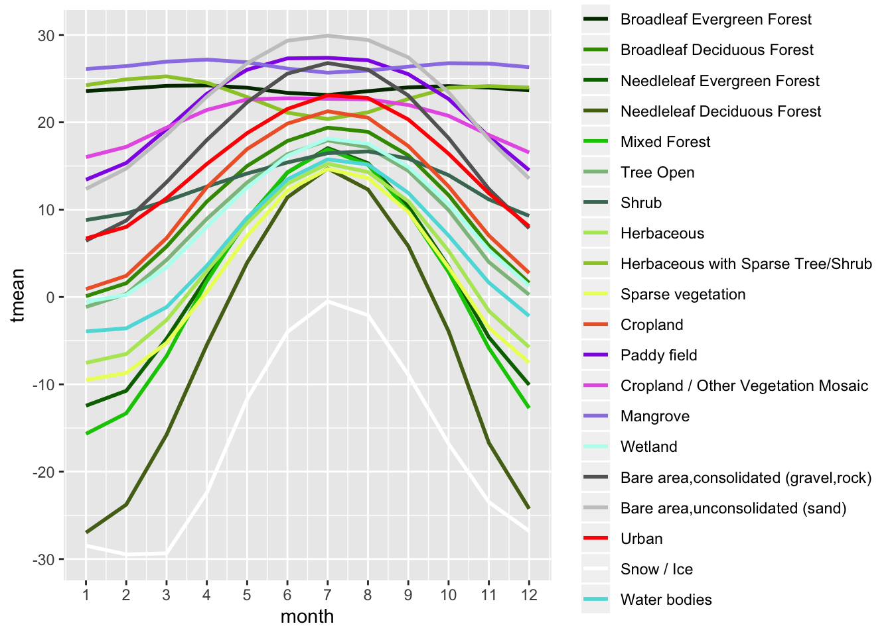

Перед вычислением целесообразно разделить растр землепользования на северное и южное полушарие (т.к. ход температур в них противоположный):

```r
cover_north = crop(cover, extent(-180, 180, 0, 90))
cover_south = crop(cover, extent(-180, 180, -60, 0))

temp_north = crop(temp, extent(-180, 180, 0, 90))
temp_south = crop(temp, extent(-180, 180, -60, 0))

mtemp_north_tidy = zonal(temp_north, cover_north, 'mean') %>% 
  as_tibble() %>% 
  left_join(tbl[[1]], by = c('zone' = 'ID')) %>% 
  gather(month, tmean, tmean1:tmean12) %>% 
  separate(month, c('dummy', 'month'), sep = 5) %>% 
  mutate(month = as.integer(month),
         hemisphere = 'north') %>% 
  select(-COUNT, -dummy)

mtemp_south_tidy = zonal(temp_south, cover_south, 'mean') %>% 
  as_tibble() %>% 
  left_join(tbl[[1]], by = c('zone' = 'ID')) %>% 
  gather(month, tmean, tmean1:tmean12) %>% 
  separate(month, c('dummy', 'month'), sep = 5) %>% 
  mutate(month = as.integer(month),
         hemisphere = 'south') %>% 
  select(-COUNT, -dummy)

mtemp_tidy2 = bind_rows(mtemp_north_tidy, mtemp_south_tidy)

ggplot(mtemp_tidy2) +
  geom_line(aes(x = month, y = tmean, color = cover), size = 1) +
  scale_color_manual(values = pal) +
  scale_x_continuous(breaks = 1:12) +
  facet_wrap(~hemisphere, ncol = 1)
```

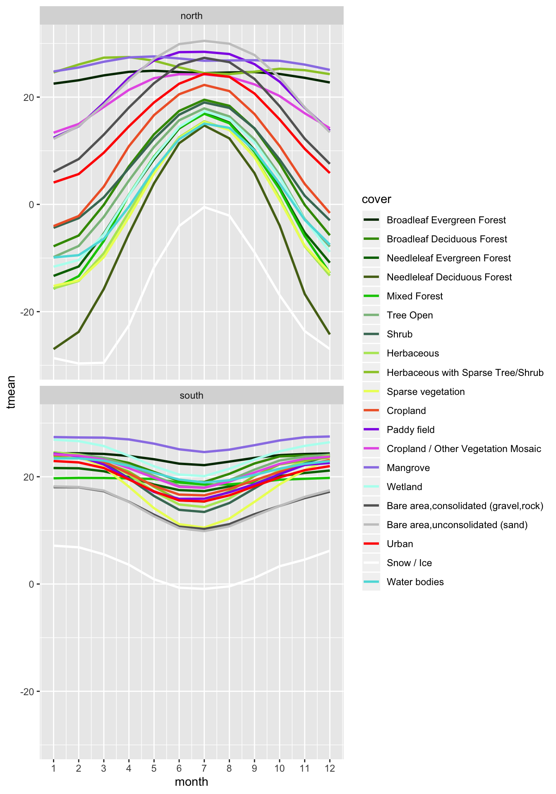

### Глобальные операции {#raster_global}

Глобальные операции охватывают все ячейки растра. По сути, можно говорить, что это частный случай зональной операции, когда зона одна и покрывает растр целиком. В пакете raster для расчета глобальных статистик можно использовать функцию `cellStats()`, передав ей название растра и агрегирующей функции:

```r
cellStats(temp_north, max) 
##  [1] 31.2 32.2 33.3 34.2 36.0 38.4 39.2 38.2 35.8 32.7 30.5 30.2
cellStats(temp_south, min) 
##  [1]  -1.1  -1.6  -2.8  -5.3  -8.3 -11.5 -11.4 -11.0  -9.7  -8.0  -5.1
## [12]  -2.2
```

## Извлечение данных {#raster_extract}

Растровая модель данных обеспечивает сплошное покрытие территории (с дискретностью, определяемой размером ячейки). В то же время, достаточно часто требуется получить значения растра в заданных местоположениях. Местоположения могут быть как конкретными объектами (например, точками почвенных разрезов), так и абстрактными географическими локациями, для которых известны координаты.

Для извлечения растровых данных можно воспользоваться функцией `extract()`. Получать данные можно как по координатам (записанным в фрейм данных), так и используя пространственные объекты класса `Spatial`. Например, узнаем мощность покровного оледенения в точке в центре Гренландии:

```r
coords = data.frame(x = -45, y = 70)
z = raster::extract(ice.depth, coords)

plot(bed, 
     breaks = brks, 
     col = gray.colors(nclass),
     legend = F)
plot(ice.depth, 
     col = cm.colors(255),
     add = TRUE)
points(coords)
text(coords, labels = z, pos = 4)
```

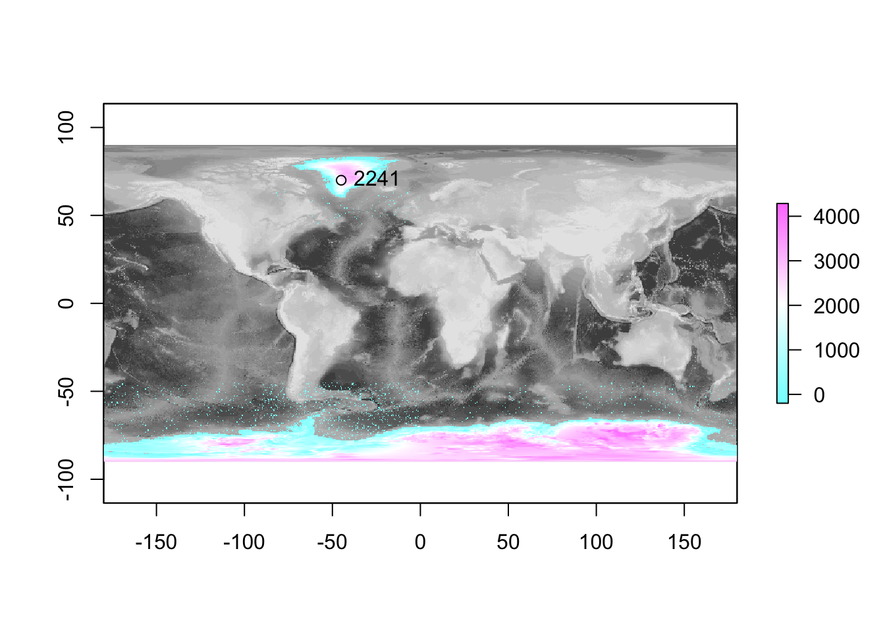


Одна из наиболее распространенных задач по извлечению растровых данных — это построение профиля вдоль заданной линии. Воспользуемся интерактивным редактором для проведения линии профиля

```r
mp = mapview(temp$tmean6)
profile = mapedit::drawFeatures(mp)
```


```r
temprof = raster::extract(temp$tmean6, as(profile, 'Spatial'), 
                          along = TRUE, cellnumbers = TRUE)
head(temprof[[1]])
##        cell tmean6
## [1,] 252105    1.8
## [2,] 254265    1.8
## [3,] 256425    1.9
## [4,] 258585    2.2
## [5,] 260745    2.3
## [6,] 262905    2.5
```

Для построения линии профиля далее нам необходимо преобразовать идентификаторы ячеек растра в расстояние от начала профиля:

```r
tempdf = temprof[[1]] %>% 
  as_tibble() %>% 
  bind_cols(xyFromCell(temp, .$cell) %>% as_tibble()) %>% 
  mutate(dist = 0.001 * c(0, cumsum(geosphere::distGeo(select(., x, y)))))

pts = profile %>% 
  st_cast('POINT') %>% 
  mutate(label = c('A', 'B'))

tm_shape(temp) +
  tm_raster('tmean6', midpoint = 0, palette = '-RdBu') +
tm_shape(profile) +
  tm_lines() +
tm_shape(pts) +
  tm_bubbles(size = 0.1) +
  tm_text('label', remove.overlap = TRUE, auto.placement = TRUE) +
tm_layout(legend.position = c('left', 'bottom'))
```

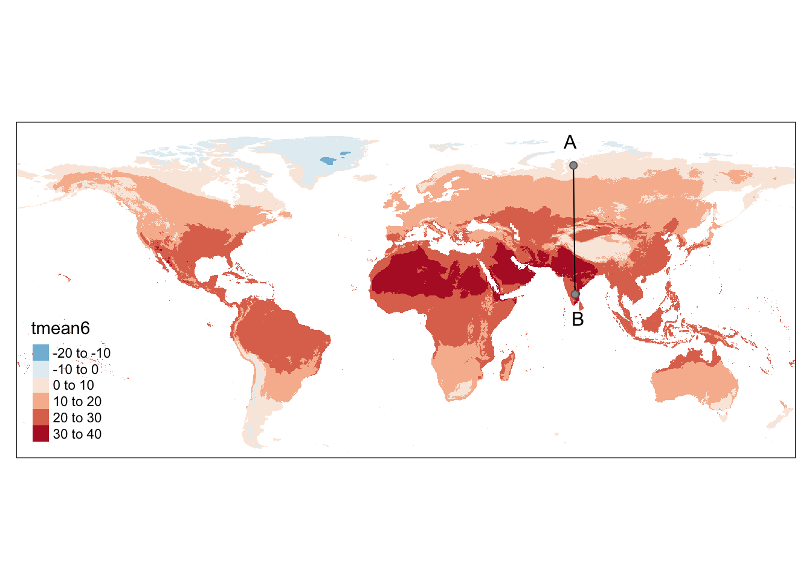

```r

ggplot(tempdf, aes(x = dist, y = tmean6)) +
  geom_line() +
  geom_smooth(span = 0.1) +
  annotate('text', x = 0, y = 10, label = 'A') +
  annotate('text', x = max(tempdf$dist), y = 10, label = 'B') +
  ggtitle('Профиль среднемесячной температуры июня по линии A—B')
```

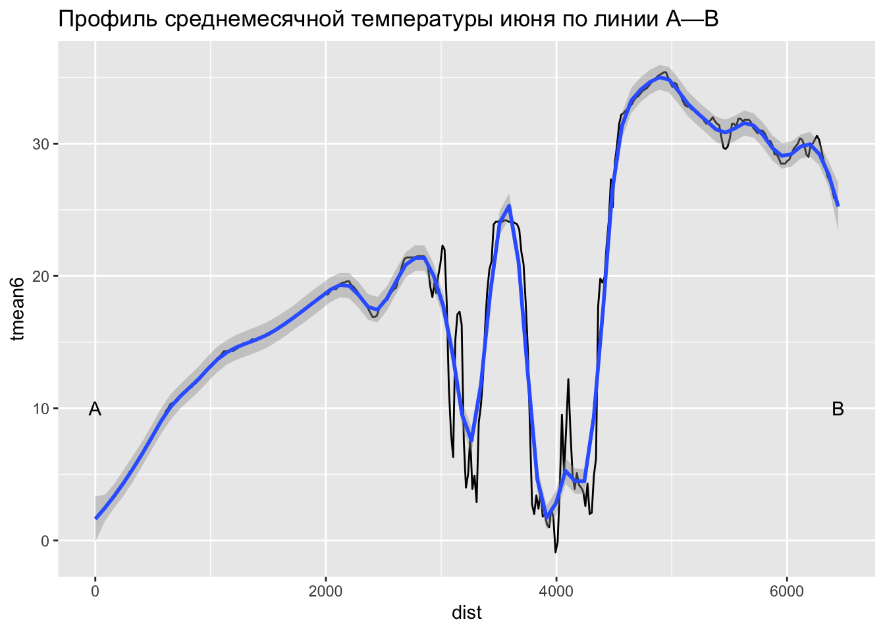

## Контрольные вопросы и упражнения {#questions_tasks_raster}

### Вопросы {#questions_raster}

### Упражнения {#tasks_raster}

1. В пакете __tmap__ содержится растровый каталог `land`, включающий в себя растр `elevation`. Используя пакет __mapedit__, оцифруйте произвольную линию и постройте средствами __ggplot__ профиль рельефа вдоль этой линии.

2. Постройте растр, который содержит расстояние до береговой линии. Используйте данные __Natural Earth__. Задайте грубое разрешение растра, чтобы расчеты не производились долго. Где находится самая удаленная от океана точка на суше?


----
_Самсонов Т.Е._ **Визуализация и анализ географических данных на языке R.** М.: Географический факультет МГУ, 2017. DOI: 10.5281/zenodo.901911
----
