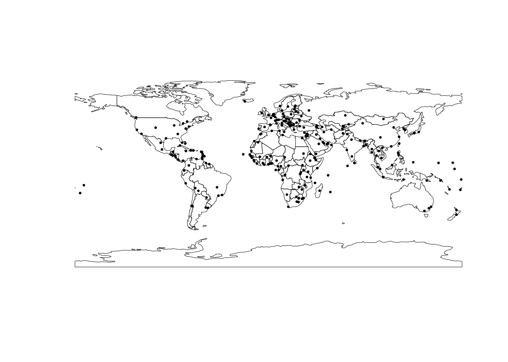

# Векторный анализ {#vector}


Данный модуль посвящен пространственному анализу в R. Несмотря на то, что пространственный анализ — чрезвычайно широкая и многогранная область геоинформатики, все методы, которые объединяются под этим заголовком, базируются на ограниченном числе базовых операций, таких как вычисление расстояний, оценка плотности распределения, построение буферных зон и выполнение пространственных запросов. В настоящем модуле мы рассмотрим, как одно и то же множество пространственных объектов можно анализировать в различных контекстах, используя базовые методы пространственного анализа

Пространственный анализ связан с оценкой _размещения_ объектов и _распределения_ величин в географическом пространстве. В геоинформатике для этих целей используется два подхода: геометрический и статистический. Эти подходы образуют две ступени пространственного анализа: как правило, данные геометрического анализа представляют собой входную информацию для анализа статистического.

Геометрический подход связан с вычислением расстояний между географическими локациями, а также агрегированием объектов/интегрированием показателей в пределах заданных областей, вдоль линий или в окрестности точек. Поиск входной информации для агрегирования решается путем выполнения _пространственных запросов_.

### Метрические отношение {#sf_spat_metric}
### Топологические отношения {#sf_spat_topology}

Поиск объектов по местоположению базируется на проверке топологических отношений между объектами. Топологические отношения описывают взаимное расположение объектов. Различные варианты топологических отношений для площадных объектов представлены на следующем рисунке, где серым цветом показаны пересечения _внутренних областей_ объектов $A$ и $B$, синим цветом --- пересечения _границ_ объектов $A$ и $B$:


Отношение _Пересекает (intersects)_ будет истинно для любого случая когда две геометрии имеют хотя бы одну общую точку, то есть во всех случаях кроме _Не пересекает (disjoint)_. Для проверки этих, а также некоторых других отношений, в пакете `sf` существует ряд функций:

Функция                       | Топологическое отношение
------------------------------|--------------------------------------------------------------------
`st_intersects(x, y)`         | `x` имеет общие точки с `y`
`st_disjoint(x, y)`           | `x` не имеет общих точек с `y`
`st_touches(x, y)`            | `x` касается `y` (граница `x` имеет общие точки с границей `y` И внутренняя область `x` не имеет имеет общих точек с внутренней областью `y`)
`st_crosses(x, y)`            | `x` пересекает `y` (граница `x` имеет общие точки с границей `y`, при этом размерность их пересечения меньше размерности хотя бы одного из исходных объектов)
`st_within(x, y)`             | `x` внутри `y` (все точки `x` содержатся в `y` И внутренняя область `x` имеет общие точки с внутренней областью `y`)
`st_contains(x, y)`           | `x` содержит `y` (все точки `y` содержатся в `x` И внутренняя область `y` имеет общие точки с внутренней областью `x`)
`st_contains_properly(x, y)`  | `x` содержит `y` полностью (все точки `y` содержатся в `x` И граница `x` не имеет общих точек с границей `y`)
`st_overlaps(x, y)`           | `x` перекрывает `y` (внутренняя область `x` имеет как общие, так и не общие точки с внутренней областью `y`)
`st_equals(x, y)`             | `x` совпадает `y` (множества точек `x` и `y` совпадают)
`st_covers(x, y)`             | `x` покрывает `y` (все точки `y` содержатся в `x`)
`st_covered_by(x, y)`         | `x` покрыт `y` (все точки `x` содержатся в `y`)
`st_equals_exact(x, y)`       | `x` совпадает `y` точно (упорядоченные множества точек `x` и `y` совпадают)

Между `covered_by` и `within`, а также `covers` и `contains` нет разницы в случае, когда оба объекта являются площадными. Эта разница будет сказываться если хотя бы один из объектов является линией либо точкой. В этом случае `within`, `contains` и `contains_properly` будут давать ложный результат (FALSE), поскольку ни у линий, ни у точек нет внутренней области.

Проверка топологических отношений используется для выполнения выборки объектов по местоположению — _пространственной выборки_. Наиболее простой способ выбрать объекты по пространственному местоположению --- это использовать один слой в качестве фильтра для другого слоя. В этом случае будет по умолчанию использовано отношение `st_intersects()` (пересекает). Никаких отличий от работы с обычными таблицами нет. Например, вот так можно выбрать точки, находящиеся внутри ранее отобранных стран с максимальным ВВП:


```r
countries = st_read('data/ne/countries.gpkg')
## Reading layer `admin_0_map_units' from data source 
##   `/Users/tsamsonov/GitHub/r-geo-course/data/ne/countries.gpkg' 
##   using driver `GPKG'
## Simple feature collection with 183 features and 72 fields
## Geometry type: MULTIPOLYGON
## Dimension:     XY
## Bounding box:  xmin: -180 ymin: -90 xmax: 180 ymax: 83.64513
## Geodetic CRS:  WGS 84
outlines = st_geometry(countries)
cities = st_read('data/ne/cities.gpkg')
## Reading layer `populated_places' from data source 
##   `/Users/tsamsonov/GitHub/r-geo-course/data/ne/cities.gpkg' 
##   using driver `GPKG'
## Simple feature collection with 243 features and 103 fields
## Geometry type: POINT
## Dimension:     XY
## Bounding box:  xmin: -175.2206 ymin: -41.29999 xmax: 179.2166 ymax: 64.15002
## Geodetic CRS:  WGS 84
city.pts = st_geometry(cities)

largest = countries %>% 
  dplyr::select(pop_est) %>% 
  dplyr::filter(pop_est > 100000000)

# Наносим исходную конфигурацию
plot(outlines, lwd = 0.5)
plot(cities, col = 'black', pch = 20, cex = 0.5, add = TRUE)
```


```r

sf::sf_use_s2(FALSE)
## Spherical geometry (s2) switched off

# Отбираем точки внутри стран с максимальным ВВП
sel = cities[largest, ]

# Смотрим что получилось
plot(outlines, lwd = 0.5)
plot(largest, col = 'gray', add = TRUE)
plot(sel, pch = 20, col = 'black', add = TRUE)
```


Разумеется, при выполнении пространственных запросов могут возникать и другие пространственные отношения. Например, мы можем выбрать все страны, имеющие общую границу с Чехией. Для этого можно использовать топологическое отношение `st_touches` вместо `st_intersects` --- это будет гарантировать, что сама Чехия в результате не выберется (касающиеся объекты не могут перекрываться). Тип отношения необходимо поставить в параметр `op = ` при выполнении фильтрации фрейма данных:


```r
cz = countries %>% dplyr::filter(sovereignt == 'Czechia')
neighbors = countries[cz, op = st_touches]

plot(st_geometry(neighbors), col = 'lightgray', lwd = 0.5)
plot(cz, col = 'darkgray', add = TRUE)
```



## Пространственные запросы  {#spatial_queries}

__Пространственные запросы__ связаны с поиском объектов (географических локаций), удовлетворяющих условию, заданному на множестве пространственных отношений. В свою очередь, пространственные отношения бывают трех типов: _дирекционные_ (направления), _метрические_ (расстояния) и _топологические_ (взаимное размещение). Примеры пространственных запросов знакомы любому географу:

* Найти все объекты внутри административного района (топологические отношения)
* Найти все объекты не далее 100 метров от дороги (метрические отношения)
* Найти все объекты, расположенные к северу от точки (дирекционные отношения) 

Пространственные запросы могут объединять несколько условий. Можно найти объекты, удовлетворяющие одновременно _всем_ (_логическое И_) вышеперечисленным условиям: внутри района, не далее 100 м от дороги и к северу от выбранной точки; или _хотя бы одному_ (_логическое ИЛИ_) из вышеперечисленных условий. Результат выполнения такого комплексного запроса будет являться, соответственно, пересечением множеств объектов, полученных каждым из запросов, или их объединением.

Наконец, пространственные запросы можно объединять с _атрибутивными_ и _временными_. Атрибутивные запросы связаны с поиском объектов (географических локаций), удовлетворяющих условию, заданному на множестве характеристик объектов. Временные запросы определены на множестве шкалы времени. Например, можно найти все населенные пункты населением свыше 10 000 человек (атрибутивный запрос), находящиеся в пределах выбранного административного района (пространственный запрос, основанный на топологических отношениях), время движения от которых до районного центра не превышает 90 минут (временной запрос).

### Контекстные и целевые объекты {#context_objects}

При выполнении пространственного анализа, в общем случае, имеются множества объектов двух типов:

* __контекстные__ --- объекты, относительно которых будет оцениваться размещение других объектов, то есть, определяющие _контекст анализа_
* __целевые__ --- объекты, размещение которых анализируется по отношению к контекстным объектам, что является _целью_ анализа

Эти множества, разумеется, могут совпадать. Скажем, мы можем проанализировать размещение магазинов относительно других магазинов.

### Зоны окружения объектов {#zones}

Весьма часто в качестве контекстного множества используются не реальные пространственные объекты, а набор абстрактных геометрических объектов, каждый из которых является производным от оригинального пространственного объекта. Как правило, такие геометрии представляют из себя _зоны окружения_ объектов, построенные по некоторому формальному признаку.

Методы построения зон окружения можно разделить по двум критериям: учету взаимного размещения объектов (абсолютные и конкурентные зоны) и пространству признаков, в котором эти зоны строятся.

Если зоны окружения строятся без учета взаимного размещения объектов, то есть, независимо для каждого объекта, то мы будем называть их абсолютными. Абсолютные зоны окружения строятся путем фиксации порогового расстояния либо времени движения относительно исходного объекта. Такие зоны носят название буферных зон (по расстоянию) или зон доступности (по времени). Границей абсолютной зоны окружения является изолиния, построенная по соответствующему показателю. В случае времени это будет _изохрона_. Примеры абсолютных зон окружения:

* Водоохранная зона реки 200 метров (буферная зона)
* Площадь городской территории, в любую точку которой вы можете доехать из дома на машине в течение 30 минут (зона доступности)

Если же при построении зон окружения учитывается взаимное размещение объектов, то в данном случае зоны доступности строятся не исходя из порогового значения показателя (хотя оно может использоваться дополнительно), а исходя из того, какой объект является ближайшим. Конкурентные зоны окружения представляют собой [разбиение](https://ru.wikipedia.org/wiki/Разбиение_множества) пространства на неперекрывающиеся участки без дыр, каждый из которых является зоной окружения соответствующего пространственного объекта. При этом любая точка внутри зоны окружения объекта ближе к этому объекту по выбранному признаку (времени или расстоянию), нежели к любому другому объекту. Конкурентные зоны окружения, построенные по расстоянию, можно реализовать средствами [диаграммы Вороного](https://ru.wikipedia.org/wiki/Диаграмма_Вороного).

## Постановка задач и изучение данных {#use_case}

В настоящем модуле мы рассмотрим вышеперечисленные методы на примере анализа размещения пунктов общественного питания --- кафе, ресторанов и т.д. Используя методы пространственного анализа в среде R, мы ответим на следующие вопросы:

* Какие улицы являются местами наибольшей концентрации заведений общественного питания?
* Как распределены заведения общественного питания по районам центра Москвы?
* Какие заведения общественного питания находятся вблизи метро и на берегу реки?
* В какие заведения общественного питания можно доехать от выбранной точки в течение 5 минут?
* Каков оптимальный маршрут между вашим местоположением и заведением, в котором вы хотите пообедать?

В качестве источника данных используем [OpenStreetMap](http://www.openstreetmap.org) --- краудсорсинговый интернет-проект по созданию бесплатных и открытых пространственных данных глобального охвата. Данные OpenStreetMap в удобном для использования в ГИС виде доступны на [портале GIS-Lab](http://beryllium.gis-lab.info/project/osmshp/).

Для решения задач настоящего модуля нам понадобятся следующие дополнительные пакеты, которые мы не использовали ранее:

* [osrm](https://cran.r-project.org/web/packages/osrm/index.html) --- построение зон доступности, маршрутов и матриц корреспонденции онлайн на основе данных OpenStreetMap и [OSRM API](http://project-osrm.org).
* [cartography](https://cran.r-project.org/web/packages/cartography/index.html) --- пакет, облегчающий построение тематических карт и легенд средствами стандартной функции `plot()`.

Начнем наше исследование с визуального анализа исходных данных

```r
# Чтение данных
roads = st_read("data/roads.gpkg") # Дороги
poi = st_read("data/poi_point.gpkg") # Точки интереса
rayons = st_read("data/boundary_polygon.gpkg") # Границы районов
stations = st_read("data/metro_stations.gpkg") # Станции метро
water = st_read("data/water_polygon.gpkg") # Водные объекты

# Прочитаем текущие параметры компоновки
def = par(no.readonly = TRUE)

# Уберем поля, чтобы карта занимала весь экран
par(mar = c(0,0,0,0))

# Получим ограничивающий прямоугольник слоя дорог в качестве общего охвата карты
frame = roads %>% st_bbox() %>% st_as_sfc() %>% st_geometry()

## ОБЗОР ИСХОДНЫХ ДАННЫХ -------------------------------------

# Визуализируем входные данные
plot(frame)
plot(water %>% st_geometry(), 
     col = "lightskyblue1",
     border = "lightskyblue3",
     add = TRUE)
plot(roads %>% st_geometry(),
     col = "gray70", 
     add = TRUE)
plot(poi %>% st_geometry(), 
     col = "deepskyblue4", 
     pch = 20, 
     cex = 0.2, 
     add = TRUE)
```


Теперь приступим к изучению данных, хранящихся в слое `poi` (от англ. POI --- Point Of Interest). Данный слой содержит все точечные маркеры OSM, которыми были отмечены на карте объекты, представляющие (по мнению создателей данных) интерес для пользователей. В POI включаются самые разнообразные объекты, такие как: объекты сферы услуг (amenity), места для отдыха (leisure), офисные здания (office), магазины и торговые центры (shop), туристические достопримечательности (tourism), спортивные объекты (sport), примечательные инженерные сооружения (man_made). В наших данных информация разнесена по соответствующим полям, каждый объект снабжен уникальным идентификатором:


```
## Simple feature collection with 6623 features and 9 fields
## Geometry type: POINT
## Dimension:     XY
## Bounding box:  xmin: 410947.3 ymin: 6176678 xmax: 415889.9 ymax: 6181909
## Projected CRS: WGS 84 / UTM zone 37N
## First 10 features:
##        OSM_ID              NAME MAN_MADE LEISURE          AMENITY OFFICE
## 1  2932331614       Арт-квартал     <NA>    <NA>             <NA>   <NA>
## 2  3639408399              <NA>     <NA>    <NA>         pharmacy   <NA>
## 3  3707882299              <NA>     <NA>    <NA> parking_entrance   <NA>
## 4  3639408396      Стиль золото     <NA>    <NA>             <NA>   <NA>
## 5  3639408397 Цветочная база №1     <NA>    <NA>             <NA>   <NA>
## 6  1413216563      Азбука Вкуса     <NA>    <NA>             <NA>   <NA>
## 7  3641139540              <NA>     <NA>    <NA>   waste_disposal   <NA>
## 8  3636920934             Аршин     <NA>    <NA>       restaurant   <NA>
## 9  3644422074            Адамас     <NA>    <NA>             <NA>   <NA>
## 10 3424516009          Андерсон     <NA>    <NA>       restaurant   <NA>
##            SHOP TOURISM SPORT                 geometry
## 1  doityourself    <NA>  <NA> POINT (410947.3 6181185)
## 2          <NA>    <NA>  <NA> POINT (410961.8 6181858)
## 3          <NA>    <NA>  <NA> POINT (410953.8 6181302)
## 4       jewelry    <NA>  <NA> POINT (410966.7 6181864)
## 5       florist    <NA>  <NA>   POINT (410973 6181862)
## 6   supermarket    <NA>  <NA> POINT (410963.7 6181250)
## 7          <NA>    <NA>  <NA> POINT (410973.9 6181676)
## 8          <NA>    <NA>  <NA> POINT (410975.2 6181661)
## 9       jewelry    <NA>  <NA> POINT (410982.5 6181905)
## 10         <NA>    <NA>  <NA> POINT (410954.9 6180118)
```

Заведения общественного питания по классификатору OSM относятся к классу _amenity_. Поскольку данный классификатор представляет собой множество номинальных (категориальных) данных, можно начать изучение состава данных с помощью таблицы частот, которая строится средствами функции `table()`:

```r
data.frame(table(poi$AMENITY))
##                  Var1 Freq
## 1         arts_centre   17
## 2                 atm  153
## 3                bank  407
## 4                 bar  161
## 5               bench  210
## 6     bicycle_parking   81
## 7      bicycle_rental  116
## 8          biergarten    1
## 9             brothel    1
## 10   bureau_de_change   21
## 11        bus_station    1
## 12               cafe  490
## 13         car_rental    1
## 14           car_wash   12
## 15   charging_station    1
## 16         child_care    1
## 17             cinema   16
## 18             clinic   51
## 19              clock   10
## 20            college    5
## 21         commercial    1
## 22   community_centre    4
## 23         courthouse    3
## 24     dancing_school    1
## 25            dentist   58
## 26            doctors   22
## 27     drinking_water    3
## 28     driving_school    2
## 29            embassy   31
## 30    emergency_phone    5
## 31          fast_food  169
## 32     ferry_terminal    5
## 33         food_court    3
## 34           fountain   32
## 35               fuel    8
## 36                gym    1
## 37           hospital    2
## 38              hotel    1
## 39          ice_cream    3
## 40       kindergarten   13
## 41            library   17
## 42     musical_school    1
## 43          nightclub   19
## 44           official    1
## 45            parking   92
## 46   parking_entrance   72
## 47      parking_space    1
## 48   payment_terminal    6
## 49           pharmacy  166
## 50           photolab    1
## 51   place_of_worship   23
## 52             police   21
## 53           post_box    4
## 54        post_office   37
## 55                pub   96
## 56    public_bookcase    2
## 57    public_building    8
## 58          recycling    6
## 59    register_office    2
## 60         restaurant  844
## 61             school   10
## 62            shelter    2
## 63               shop    4
## 64    social_facility    3
## 65          stripclub    4
## 66               taxi    1
## 67          telephone   58
## 68            theatre   48
## 69            toilets   82
## 70           training   15
## 71         university   15
## 72 vehicle_inspection    1
## 73    vending_machine   98
## 74       waste_basket   52
## 75     waste_disposal  102
```

Для дальнейшего анализа отберем из всего множества объектов сферы услуг заведения, где можно поесть: рестораны, кафе, бары, пабы и заведения быстрого питания (фастфуд). В классификаторе OSM эти заведения имеют тип _restaurant_, _bar_, _cafe_, _pub_ и _fast\_food_. Для отбора нужных строк и столбцов используем dplyr: 


```r
poi.food = poi %>% 
            dplyr::select(NAME, AMENITY) %>% 
            dplyr::filter(AMENITY %in% c("restaurant", "bar", "cafe", "pub", "fast_food"))
head(poi.food)
## Simple feature collection with 6 features and 2 fields
## Geometry type: POINT
## Dimension:     XY
## Bounding box:  xmin: 410954.9 ymin: 6178842 xmax: 411023.8 ymax: 6181896
## Projected CRS: WGS 84 / UTM zone 37N
##          NAME    AMENITY                 geometry
## 1       Аршин restaurant POINT (410975.2 6181661)
## 2    Андерсон restaurant POINT (410954.9 6180118)
## 3    Holynoot  fast_food POINT (410958.8 6179938)
## 4    Gayane's restaurant POINT (410958.4 6178842)
## 5  Molon Lave restaurant POINT (411013.7 6181448)
## 6 Шоколадница       cafe POINT (411023.8 6181896)
```

## Анализ расстояний  {#distance_analysis}

Метрические отношения связывают объекты в терминах расстояний между ними. Предположим, что мы хотим определить улицы, являющиеся сосредоточением заведений питания. Один из вариантов решения состоит в том, чтобы для каждого пункта обслуживания определить ближайшую к нему улицу и далее для каждой улицы просуммировать количество раз, которое улиц оказалось ближайшей. Подробнее алгоритм решения выглядит следующим образом:

1. Вычислить матрицу расстояний между пунктами обслуживания и улицами. Размер матрицы $M \times N$, где $M$ --- количество улиц (строк), $N$ --- количество пунктов (столбцов)
2. Найти в каждом столбце минимальное расстояние.
3. Получить идентификатор улицы (номер строки), соответствующий данному расстоянию.
4. Записать идентификатор в выходной вектор.

Таким образом, мы получим вектор из идентификаторов улиц, при этом каждый идентификатор будет встречаться в этом векторе столько раз, сколько раз данная улица оказалась ближайшей к какому-то объекту.

Вычислим матрицу расстояний с помощью функции `st_distance()` из пакета __sf__:


```r

## АНАЛИЗ РАССТОЯНИЙ -------------------------------------

dist.matrix = st_distance(roads, poi.food)

# посмотрим, как выглядит результат на примере первых пяти объектов
print(dist.matrix[1:5,1:5])
## Units: [m]
##          [,1]      [,2]      [,3]      [,4]     [,5]
## [1,] 4962.292 3420.6849 3240.2066 2145.2044 4748.686
## [2,] 2247.737  705.2923  524.9411  570.3986 2035.341
## [3,] 2213.236  670.7904  490.4167  605.1606 2000.759
## [4,] 2197.874  655.4285  475.0629  620.4411 1985.242
## [5,] 3910.957 2368.5560 2188.1348 1092.5472 3698.246
```

Далее необходимо в каждом столбце матрицы найти номер строки с минимальным расстоянием. Для этого необходимо получить порядок сортировки элементов по возрастанию значений данного столбца и взять номер первого элемента. Операцию можно применить с помощью `apply` ко всем столбцам:

```r
ids = apply(dist.matrix, 2, function(X) order(X)[1])
```

Теперь применим уже знакомую нам функцию `table()`, чтобы подсчитать, сколько раз каждая улица оказалась наиболее близкой. Далее присоединим статистику к исходным улицам, однако для этого нам потребуется вынести названия строк (номеров) улиц в отдельный столбец.


```r
count.stats = as.data.frame(table(ids))
roads = roads %>% mutate(id = row.names(.))
roads.poi = merge(roads, 
                   count.stats, 
                   by.x = 'id', 
                   by.y = 'ids', 
                   all.x = T)
```

Посмотрим первые 10 улиц по количеству общепита:

```r
# Статистика по улицам в табличном представлении (первые 10)
roads.poi %>% 
  dplyr::select(NAME, Freq) %>% 
  arrange(desc(Freq)) %>% 
  head(10)
## Simple feature collection with 10 features and 2 fields
## Geometry type: MULTILINESTRING
## Dimension:     XY
## Bounding box:  xmin: 411105.1 ymin: 6178083 xmax: 414504.1 ymax: 6181734
## Projected CRS: WGS 84 / UTM zone 37N
##                       NAME Freq                       geometry
## 1              улица Арбат   43 MULTILINESTRING ((412157.9 ...
## 2        улица Новый Арбат   24 MULTILINESTRING ((411105.1 ...
## 3          Цветной бульвар   22 MULTILINESTRING ((413491.7 ...
## 4          Мясницкая улица   20 MULTILINESTRING ((414504.1 ...
## 5         Никольская улица   17 MULTILINESTRING ((413704.5 ...
## 6          Пятницкая улица   17 MULTILINESTRING ((413895.8 ...
## 7          Неглинная улица   14 MULTILINESTRING ((413498.2 ...
## 8       улица Рождественка   14 MULTILINESTRING ((413628.1 ...
## 9        Козицкий переулок   14 MULTILINESTRING ((412831.7 ...
## 10 улица Большая Дмитровка   14 MULTILINESTRING ((413262.7 ...
```

Для завершения анализа осталось визуализировать результаты. Чтобы усилить наглядность визуализации, мы не будем каждую улицу утолщать пропорционально количеству привязанных объектов, а разделим это количество на 4 класса. Каждый класс покажем линией соответствующей толщины и интенсивности цвета (чем больше объектов привязано к улице, тем толще линия, темнее и насыщеннее ее цвет). 

Для классификации используем функцию `cut()`, позволяющую перекодировать интервальные данные в номинальные, то есть сопоставить каждому элементу вектора некий класс, которому он принадлежит. На выходе будем иметь вектор, который состоит из такого же количества элементов, что и исходный, но вместо исходных значений будут стоять названия классов.


```r
# Получим границы классов
nclasses = 4
class.breaks = classIntervals(roads.poi$Freq, 
                               n = nclasses, 
                               style = "jenks")
# Извлечем граничные интервалы
borders = class.breaks$brks

# Названия классов — они же толщины линия от 1 до 4
line.widths = 1:nclasses

# Перекодируем столбец количества присоединенных пунктов в классы
sizes = cut(roads.poi$Freq, 
             breaks = borders, 
             labels = line.widths)
```

Теперь присвоим каждому объекту свой цвет в соответствии с классом, который ему присвоен. Удобная функция `findColours()` позволяет найти цвет для каждого объекта в соответствии с полученной классификацией:


```r
base.colors = c("mistyrose", "red")
ramp = colorRampPalette(base.colors)
colors = findColours(class.breaks, base.colors)

plot(frame)

plot(water %>% st_geometry(), 
     col = "lightskyblue1",
     border = "lightskyblue3",
     add = TRUE)

plot(roads %>% st_geometry(),
     col = "gray70",
     add = TRUE)

plot(roads.poi %>% st_geometry(),
     lwd = sizes, 
     col = colors,
     add = TRUE)

plot(poi.food %>% st_geometry(), 
     col = "deepskyblue4", 
     pch = 20, 
     cex = 0.2, 
     add = TRUE)

# Функция legendGradLines из пакета cartography позволяет строить
# легенду для карт линий градуированных размеров:
legendGradLines(title.txt = "Пункты питания", 
                pos = "left",
                title.cex = 0.8,
                values.cex = 0.6, 
                breaks = borders,
                lwd = line.widths,
                col = "red")
```


## Анализ взаимного положения (топологический) {#topology_analysis}

Пространственные запросы, основанные на топологических отношениях, позволяют находить объекты, находящиеся внутри других объектов, соприкасающиеся с другими объектами, пересекающиеся с ними и так далее. Топологические отношения сохраняются при взаимно-однозначных и непрерывных преобразованиях плоскости. 

Отличия от метрических отношений легко пояснить на примере преобразования проекции. Представьте, что карту России в [конической проекции](http://geocnt.geonet.ru/projections/html/viewer.html) с концентрическими параллелями (известную по учебникам и атласам)  вы трансформировали в карту России в проекции Меркатора (такую же как на [Google Maps](https://www.google.ru/maps/place/Россия/)). Изогнутые параллели превратились в прямые линии; форма регионов, площади и расстояния между населенными пунктами значительно изменились. Однако Красноярск по-прежнему находится в Красноярском крае, Ярославль --- на реке Волге, Нижний Новгород --- на правом берегу Волги, озеро Белое --- внутри Вологодской области, а Московская область как не граничила с Тамбовской, так и не граничит после трансформации проекции. Это и есть топологические отношения.

Формально топологические отношения в ГИС описываются с помощью [модели девяти пересечений DE-9IM](https://en.wikipedia.org/wiki/DE-9IM), которая была рассмотрена в предыдущей лекции.


```r
## АНАЛИЗ ВЗАИМНОГО ПОЛОЖЕНИЯ -------------------------------------
poi.food = poi.food %>% mutate(count = 1)
rayons.poi = aggregate(poi.food['count'], rayons, sum)
```


```r
# Преобразуем результат в относительный показатель
# (единиц на кв.км. площади) и запишем в таблицу районов:
rayons.poi$density = 1000000 * rayons.poi$count / st_area(rayons.poi)
```

Масштабный множитель 1000000 в коде понадобился чтобы перевести площадь, хранящуюся в поле Shape_Area из квадратных метров в квадратные километры. Обратите внимание на то, что в данном случае мы не стали ограничивать фигурными скобками тело анонимной функции (`table(X)[2]`) внутри `apply()`, поскольку выполняемая операция достаточно компактна.

Подготовим параметры отображения:

```r
# Настроим параметры отображения
choro.pal = colorRampPalette(c("lightgoldenrodyellow", "orangered"))

intervals = classIntervals(rayons.poi$density, 
                            n = 5, 
                            style = "quantile")
```

Далее используем функции `choroLayer()` и `legendChoro()` из пакета `cartography` для построения картограмм плотности пунктов питания и соответствующей им легенды средствами обычной функции `plot()`:

```r
choroLayer(rayons.poi, # Исходный слой типа SpatialPolygonsDataFrame
           var = "density", # Картографируемая переменная (столбец) 
           breaks = intervals$brks, # Границы интервалов
           col = choro.pal(5), # Цвета для соответствующих интервалов
           legend.pos = "n") # Легенду мы нарисуем позднее, поверх всех слоев
plot(water %>% st_geometry(), 
     col = "lightskyblue1",
     border = "lightskyblue3",
     add = TRUE)
plot(roads %>% st_geometry(),
     col = "gray50",
     add = TRUE)
plot(poi.food %>% st_geometry(), 
     col = "deepskyblue4", 
     pch = 20, 
     cex = 0.5, 
     add = TRUE)
plot(rayons %>% st_geometry(),
     border = "black",
     lwd = 3,
     add = TRUE)
text(rayons %>% st_centroid() %>% st_coordinates(),
     labels = gsub(' ', '\n', rayons$NAME),
     font = 2,
     cex = 0.6)

# Рисуем легенду
legendChoro(breaks = intervals$brks, 
            col = choro.pal(5),
            pos = "topleft",
            frame = FALSE, 
            title.txt = "Заведений\nна 1 кв.км")
```


Итак, используя топологический пространственный запрос "Содержит", мы смогли агрегировать точечные объекты внутри площадных и построить картограммы плотности распределения пунктов питания по районам центра Москвы.

## Анализ абсолютных зон окружения  {#absolute_zones}

Задача данного раздела модуля звучит следующим образом: определить, какие пункты питания находятся в радиусе 300 метров от метро "Кропоткинская". Контекстом анализа в данном случае служит 300-метровая зона окружения станции метро. Поставленную задачу можно решить двумя способами:

* Рассчитать расстояния от каждого пункта питания до станции метро "Кропоткинская" и выбрать точки, для которых это расстояние меньше или равно 300 метрам.
* Построить буферную зону радиусом 300 метров и выбрать ею точки, используя топологическое отношение пересечения

Мы будем использовать второй вариант решения. Алгоритм выглядит следующим образом:

1. Построить буферную зону, используя функцию `st_buffer()` из пакета __sf__.
2. Выбрать полученной зоной точки пунктов питания, используя стандартный оператор `[]`.
3. Визуализировать на карте полученные точки и буферную зону.

Определим функцию `plotBasemap()`, которая будет рисовать объекты картографической основы, ее мы будем использовать далее неоднократно.


```r
## АНАЛИЗ АБСОЛЮТНЫХ ЗОН ОКРУЖЕНИЯ -------------------------------------

# Функция отвечает за рисование базовой карты
plotBasemap = function(add = FALSE){
  
  plot(frame, add = add)

  plot(water %>% st_geometry(), 
       col = "lightskyblue1",
       border = "lightskyblue3",
       add = TRUE)
  
  plot(roads %>% st_geometry(),
       col = "gray70",
       add = TRUE)
  
  plot(poi.food %>% st_geometry(), 
       col = "deepskyblue4", 
       pch = 20, 
       cex = 0.3, 
       add = TRUE)
  plot(stations %>% st_geometry(), 
       col = "slategray4", 
       pch = 20, 
       cex = 2, 
       add = TRUE)
  text(stations %>% st_centroid() %>% st_coordinates(),
       labels = "M",
       col = "white",
       cex = 0.4)
}
```

Определив вспомогательные функции,  можем приступать к выполнению анализа:

```r
# Выберем станцию метро и построим буферную зону
krop = stations %>% dplyr::filter(NAME == "Кропоткинская")
zone = st_buffer(krop, dist = 300)

# Применим разработанную функцию для отбора точек
selected.poi = poi.food[zone, ]

# Применим разработанную функцию для рисования картографической основы
plotBasemap()

# Визуализируем результаты анализа
plot(krop %>% st_geometry(), 
     col = "red", 
     pch = 20, 
     cex = 4, 
     add = TRUE)

text(krop %>% st_coordinates(),
     labels = "M",
     col = "white",
     cex = 0.7,
     add = TRUE)

plot(zone %>% st_geometry(),
     col = adjustcolor("sienna3", alpha.f = 0.5),
     border = "sienna3",
     add = TRUE)

plot(selected.poi %>% st_geometry(), 
     col = "sienna4", 
     pch = 20, 
     cex = 0.5, 
     add = TRUE)
```


```
## Simple feature collection with 23 features and 3 fields
## Geometry type: POINT
## Dimension:     XY
## Bounding box:  xmin: 412142.7 ymin: 6178370 xmax: 412593.7 ymax: 6178811
## Projected CRS: WGS 84 / UTM zone 37N
## First 10 features:
##               NAME    AMENITY                 geometry count
## 440      Азия Кафе restaurant POINT (412142.7 6178592)     1
## 444     Баба Марта restaurant POINT (412154.8 6178720)     1
## 447        Теремок  fast_food   POINT (412153 6178584)     1
## 456        Воронеж       cafe POINT (412177.7 6178535)     1
## 457     Пафф Пойнт  fast_food POINT (412180.6 6178620)     1
## 458 What's Up Dog!  fast_food POINT (412181.4 6178606)     1
## 461        Воронеж restaurant POINT (412183.4 6178538)     1
## 463       GlowSubs  fast_food POINT (412190.1 6178599)     1
## 464        Mr. Pit  fast_food POINT (412193.2 6178610)     1
## 469    Шоколадница       cafe POINT (412204.3 6178570)     1
```

В качестве примера аналогичного анализа отберем все пункты питания, находящиеся в пределах 100 метров от реки Москвы:

```r
river = water %>% dplyr::filter(NAME == "Москва")
zone = st_buffer(river, dist = 100)

selected.poi = poi.food[zone, ]

plotBasemap()

plot(zone %>% st_geometry(),
     col = adjustcolor("orange", alpha.f = 0.5),
     border = "orange",
     add = TRUE)

plot(river %>% st_geometry(), 
     col = adjustcolor("deepskyblue", alpha.f = 0.5), 
     border = F,
     add = TRUE)

plot(selected.poi %>% st_geometry(), 
     col = "firebrick1", 
     pch = 20, 
     cex = 0.5, 
     add = TRUE)
```


```
## Simple feature collection with 39 features and 3 fields
## Geometry type: POINT
## Dimension:     XY
## Bounding box:  xmin: 411661.2 ymin: 6176685 xmax: 415287.1 ymax: 6178953
## Projected CRS: WGS 84 / UTM zone 37N
## First 10 features:
##                     NAME    AMENITY                 geometry count
## 244        Белый журавль restaurant POINT (411661.2 6177029)     1
## 332       What's Up Dog!  fast_food POINT (411871.8 6176685)     1
## 360 Coffee@Парк Горького       cafe POINT (411917.7 6176775)     1
## 386                Sekta restaurant   POINT (411975 6176908)     1
## 424             GlowSubs  fast_food POINT (412060.5 6177161)     1
## 473           Чай & кофе       cafe POINT (412197.5 6177284)     1
## 479             Академия restaurant POINT (412222.4 6177790)     1
## 509            Kaffebrod       cafe POINT (412280.3 6177452)     1
## 512                  Les       cafe POINT (412299.1 6177468)     1
## 522              Beefbar restaurant POINT (412344.9 6177823)     1
```

## Анализ конкурентных зон окружения  {#conc_zones}

В данном разделе мы решим следующую задачу: разбить всю изучаемую территорию на зоны окружения станций метро и подсчитать количество пунктов питания, попадающих в каждую зону. Полученные зоны должны быть конкурентными: любая точка, находящаяся в зоне окружения конкретной станции метро, должна быть ближе к этой станции, чем к любой другой станции.

Ранее мы говорили о том, что конкурентные зоны окружения по расстоянию можно реализовать с помощью диаграммы Вороного. Применим функцию `voronoi()` из пакета __dismo__, чтобы посмотреть, как выглядит диаграмма Вороного для точек станций метро. Нам потребуется для этого конвертировать объекты в тип `Spatial`, а результат преобразовать вернуть обратно в `sf`:


```r

## АНАЛИЗ КОНКУРЕНТНЫХ ЗОН ОКРУЖЕНИЯ -------------------------------------

zones = stations %>% 
  as('Spatial') %>% 
  dismo::voronoi() %>% 
  st_as_sf() %>% 
  st_crop(frame)
  

plot(zones %>% st_geometry())
plot(stations, add = TRUE, pch = 19, col = 'black')
```


Для визуализации результатов мы будем использовать метод картодиаграмм (пропорциональных символов), реализованный в функции `propSymbolsLayer()` пакета `cartography`. Размером кружка покажем количество пунктов питания, оказавшихся в каждой зоне окружения:


```r
# Агрегруем данные по каждой зоне
zones.poi = aggregate(poi.food['count'], zones, sum)

# Визуализируем результат

plotBasemap()

plot(zones %>% st_geometry(),
     col = adjustcolor("white", alpha.f = 0.5),
     add = TRUE)

propSymbolsLayer(zones.poi, 
                 var = "count", 
                 symbols = "circle",
                 col = adjustcolor("turquoise3", alpha.f = 0.5),
                 border = F,
                 legend.title.txt = "Заведений\nпитания")

text(zones %>% st_centroid() %>% st_coordinates(), 
     labels = zones.poi$count,
     col = "turquoise4",
     cex = log(zones.poi$count)/4)
```


## Интерполяция по ареалам {#areal_interpolation}

В некоторых случаях необходимо осуществить так называемую интерполяцию по ареалам. Данный метод применяется в тех случаях, когда исходная информация привязана не к точечным, а к площадным объектам. Задача заключается в том, чтобы с одной площадной сетки перенести на другую (как правило, регулярную, обладающую большей дискретностью). Необходимость подобного преобразования может быть обусловлена следующими (но и не только) причинами:

- метод анализа (например, моделирование диффузии) предполагает, что данные распределены по регулярной сетке, в то время как исходная сетка нерегулярна.
- необходимо обеспечить сравнимость пространственных распределений показателя для разных территорий, в то время как дробность исходного территориального деления существенно меняется в пространстве.

Метод интерполяции по ареалам реализуется средствами функции `st_interpolate_aw()` из пакета __sf__. Данной функции необходимо подать исходную и целевую полигональную сетку, а также указать тип параметра: _интенсивный_ или _экстенсивный_:

— _экстенсивные_ параметры суммируются и делятся при агрегировании/агрегировании территориальных единиц. Например, площадь, покрытая лесом или численность населения --- это экстенсивный параметр.
- _интенсивные_ параметры осредняются или остаются постоянными при агрегировании/дизагрегировании территориальных единиц. Например, густота древостоя и плотность населения — интенсивные параметры.

Рассмотрим это метод интерполяции на примере данных по графствам Северной Каролины (показатель — количество новорожденных в 1974 году). Для расчета векторной регулярной сетки используем функцию `st_make_grid()` из пакета __sf__. 

```r
# Данные по Северной Каролине
nc = sf::st_read(system.file("shape/nc.shp", package="sf"))
## Reading layer `nc' from data source 
##   `/Library/Frameworks/R.framework/Versions/4.1/Resources/library/sf/shape/nc.shp' 
##   using driver `ESRI Shapefile'
## Simple feature collection with 100 features and 14 fields
## Geometry type: MULTIPOLYGON
## Dimension:     XY
## Bounding box:  xmin: -84.32385 ymin: 33.88199 xmax: -75.45698 ymax: 36.58965
## Geodetic CRS:  NAD27

cells = sf::st_make_grid(nc, cellsize = 0.25)

birth = sf::st_interpolate_aw(nc["BIR74"], 
                       cells, 
                       extensive = FALSE)

# исходное распределение
tm_shape(nc) +
  tm_polygons('BIR74',
              style = 'jenks',
              palette = 'viridis') 
```


```r

# пересчет на регулярную сетку
tm_shape(birth) +
  tm_polygons('BIR74',
              style = 'jenks',
              palette = 'viridis') +
tm_shape(nc) +
  tm_borders(col = 'white')
```


```r
nc.sids = maptools::readShapeSpatial(system.file("shapes/sids.shp", 
                                                  package="maptools")[1], 
                                      IDvar = "FIPSNO", 
                                      proj4string = sp::CRS("+proj=longlat +ellps=clrk66"))

births74 = pycno::pycno(nc.sids, nc.sids$BIR74, 0.05, converge=1)

# Draw it
bstars = stars::st_as_stars(births74)
plot(bstars)

# Overlay North Carolina county boundaries for reference
plot(nc.sids, add = TRUE)
```


## Дирекционные отношения

### Предварительные требования {#circular_prerequisites}

Для работы по теме текущей лекции вам понадобятся пакеты из __tidyverse__. Помимо этого, необходимы методы круговой статистики из пакетов [__circular__](https://cran.r-project.org/web/packages/circular/) и [__NPCirc__](https://cran.r-project.org/web/packages/NPCirc/index.html), и методы из пакета [__pracma__](https://cran.r-project.org/web/packages/pracma/index.html). 


```r
library(tidyverse)
library(circular)
library(readxl)
library(NPCirc)
library(pracma)
```

### Статистика направлений {#circular_circ}

#### Теория {#circular_circ_theory}

В географии направления играют огромную роль. Ветер, морские течения, уличная сеть, перелеты птиц --- все эти явления можно охарактеризовать их направленностью. Для того, чтобы эффективно анализировать такие данные, необходимо владеть специализированным математическим аппаратом. 

Обработкой данных о направлениях занимается особая область математической статистики — __статистика направлений__, или __круговая (циркулярная)__ статистика (Mardia, Jupp, 2000; Pewsey et al., 2013). В круговой статистике каждое направление $\theta \in [0, 2\pi)$ представляется в виде вектора $x = (\cos \theta, sin \theta)$. Все операции производятся над подобными векторами и их координатами. Аналогом нормального распределения для круговой случайной величины является распределение фон Мизеса (von Mises, 1918), которое задается функцией плотности вероятности:
$$
f(θ)=\frac{1}{2 \pi I_0(\kappa)} e^{\kappa \cos (\theta - \mu)},
$$

где $\kappa \geq 0$ — параметр концентрации, $\mu$ — среднее значение (для $\kappa > 0$) и 

$$
I_p(\kappa) = \frac{1}{2π} \int_{0}^{2\pi} \cos (p \theta) e^{\kappa \cos θ} d \theta
$$
есть модифицированная функция Бесселя первого рода и порядка $p$. Из формул видно, что по своему эффекту параметр концентрации противоположен среднеквадратическому отклонению $\sigma$, которое является параметром нормального распределения. Чем больше значение $\kappa$, тем более сконцентрировано распределение относительно среднего значения — отсюда идет название этого параметра. Распределение фон Мизеса используется для построения ядра при аппроксимации плотности распределения направлений методом [ядерной оценки](https://en.wikipedia.org/wiki/Kernel_density_estimation) (оценки по методу Парзена-Розенблатта).

> В метеорологии значения $\cos \theta$ и $\sin \theta$ определяют соотношение __зональной__ и __меридиональной__ составляющей скорости [ветра] (для получения самих составляющих их надо умножить на скорость ветра).

Для вычисления статистических моментов круговой случайной величины требуется найти средний равнодействующий вектор первого порядка:
$$R = (C, S),$$ 
где 

$$C = \frac{1}{n} \sum_{j=1}^{n} \cos \theta_j,\\ 
S = \frac{1}{n} \sum_{j=1}^{n} \sin \theta_j.$$ 

Данный вектор имеет направление $\bar\theta$, которое является __выборочным средним направлением__ исследуемой величины.

__Выборочная средняя равнодействующая длина__ $\bar R = \sqrt{C^2 + S^2}$ принимает значения в диапазоне $[0, 1]$ и показывает меру концентрации направлений относительно $\theta$. $\bar R = 1$ означает, что все исходные направления совпадают, $\bar R = 0$ --- что данные равномерно распределены по кругу, либо распределение имеет несколько мод, которые уравновешивают друг друга. 

Величина $\bar R$ дает важную информацию для предварительной диагностики картины направлений. Если значение $\bar R$ близко к единице, это означает, что распределение является унимодальным и в качестве основного направления можно принять значение $\bar θ$ [@mardia2000directional]. 

__Стандартное отклонение направлений__ $v$ в радианах может быть найдено как $v=\sqrt{-2 \ln \bar R}$ .

В ряде случаев противоположные направления считаются эквивалентными. Например, нельзя сказать, идет ли улица с юга на север или с севера на юг. Такие данные в теории круговой статистики называются __аксиальными__ (Mardia, Jupp, 2000). Для аксиальных данных возможный диапазон значений лежит в интервале $[0, \pi)$. Поскольку методы круговой статистики рассчитаны на круговое замыкание данных, стандартный подход к обработке аксиальных данных предполагает переход от направлений к их удвоенным значениям $\theta' = 2\theta$, обработку полученных значений стандартными методами и отображение полученных значение обратно на интервал $[0, \pi)$. Для среднего, медианы и моды распределения это означает простое деление полученного значения пополам [@pewsey2013circular].

Модальные направления могут быть определены как по гистограмме распределения, так и методом ядерной оценки. Основной вопрос поиска эффективного ядра заключается в параметризации функции $K$. Для распределения фон Мизеса таким параметром является концентрация $\kappa$. Чем больше этот параметр, тем более локализованной будет оценка, тем сильнее будут проявляться в ней существующие моды распределения, но также будут и выделяться новые моды, которые на самом деле не значимы. Малые значения $\kappa$ приведут, наоборот, к «размыванию» плотности распределения в пределах полного круга. Как и в случае с количеством интервалов гистограммы, избыточно малые и большие значения κ нежелательны. 

В работе [@Oliveira2012] показано, что оптимальное значение $\kappa$ может быть подобрано также для оценки распределений, являющихся конечной суммой $M$ распределений фон Мизеса, то есть, мультимодальных распределений, имеющих плотность :
$$g(\theta)=\sum_{i=1}^{M} \alpha_i \frac{\exp\lbrace{\kappa_i \cos(\theta - \mu_i)\rbrace}}{2 \pi I_0 (\kappa_i)},$$
где $\sum_{i=1}^{M} = 1$.

Поскольку в результате подбора определяется не только параметр концентрации, но и число компонент в сумме распределений [@Oliveira2014], его можно также использовать для определения количества искомых мод, если это необходимо. 

Когда подобрана функция ядра и ее параметры, оценка плотности распределения (вычисление функции $\circ f _h (x)$) для круговых данных делается либо для исходных направлений $\theta_j$, либо с равным (достаточно малым) интервалом — например, через 1 градус [@pewsey2013circular]. После того как произведена оценка, могут быть выбраны направления, в которых функция плотности распределения достигает локального максимума — первого и второго по величине.  Эти направления и будут соответствовать первой и второй моде распределения направлений.

### Практика {#circular_circ_vis}

В практической части данного раздела мы будем работать с массивом среднемесячных значений метеопараметров в пограничном слое атмосферы по полярным аэрологическим обсерваториям России. Массив данных ежемесячно обновляется на [портале Аисори-М](http://aisori-m.meteo.ru) [__ВНИИГМИ-МЦД__](http://meteo.ru/). 

В системе доступны данные по следующим обсерваториям:

```r
obs = readxl::read_excel('data/bound/scheme.xlsx', 2)
```

| Индекс|Название        | Широта| Долгота|
|------:|:---------------|------:|-------:|
|  20674|Остров Диксон   |  73.50|   80.42|
|  21824|Тикси           |  71.35|  128.55|
|  22113|Мурманск        |  68.59|   33.07|
|  22217|Кандалакша      |  67.09|   32.21|
|  22271|Шойна           |  67.53|   44.09|
|  23078|Норильск        |  69.20|   88.18|
|  23205|Нарьян-Мар      |  67.39|   53.07|
|  23330|Салехард        |  66.32|   66.40|
|  24125|Оленек          |  68.31|  112.26|
|  24266|Верхоянск       |  67.55|  133.38|
|  24343|Жиганск         |  66.46|  123.21|
|  89512|Новолазаревская | -70.75|   11.83|
|  89592|Мирный          | -66.65|   19.71|

Для каждой обсерватории даны следующие параметры:


|Призначная часть/ метеоэлемент/число наблюдений                            |Обозначение | Число цифр|Единицы измерения |Константа отсутствия |
|:--------------------------------------------------------------------------|:-----------|----------:|:-----------------|:--------------------|
|Индекс станции                                                             |INDEX       |          5|-                 |нет                  |
|Год                                                                        |GGGG        |          5|-                 |нет                  |
|Месяц                                                                      |MM          |          3|-                 |нет                  |
|Срок                                                                       |HH          |          3|GMT               |нет                  |
|Стандартное значение высоты                                                |Z           |          6|м                 |нет                  |
|Среднемесячные значения давления                                           |MP          |          6|10·гПа            |-9999                |
|Среднеквадратические отклонения давления                                   |SP          |          6|10·гПа            |-9999                |
|Число наблюдений для давления                                              |NP          |          3|-                 |нет                  |
|Среднемесячные значения температуры                                        |MT          |          6|10·°C             |-9999                |
|Среднеквадратические отклонения температуры                                |ST          |          6|10·°C             |-9999                |
|Число наблюдений для температуры                                           |NT          |          3|-                 |нет                  |
|Среднемесячные значения дефицита точки росы                                |MD          |          6|10·°C             |-9999                |
|Среднеквадратические отклонения дефицита точки росы                        |SD          |          6|10·°C             |-9999                |
|Число наблюдений для дефицита точки росы                                   |ND          |          3|-                 |нет                  |
|Среднемесячные значения скалярной скорости ветра                           |MS          |          6|10·м/с            |-9999                |
|Среднеквадратические отклонения скалярной скорости ветра                   |SS          |          6|10·м/с            |-9999                |
|Число наблюдений для скалярной скорости ветра                              |NS          |          3|-                 |нет                  |
|Среднемесячные значения зональной составляющей скорости ветра              |MU          |          6|10·м/с            |-9999                |
|Среднеквадратические отклонения зональной составляющей скорости ветра      |SU          |          6|10·м/с            |-9999                |
|Число наблюдений для зональной составляющей скорости ветра                 |NU          |          3|-                 |нет                  |
|Среднемесячные значения меридиональной составляющей скорости ветра         |MV          |          6|10·м/с            |-9999                |
|Среднеквадратические отклонения меридиональной составляющей скорости ветра |SV          |          6|10·м/с            |-9999                |
|Число наблюдений для меридиональной составляющей скорости ветра            |NV          |          3|-                 |нет                  |

Загрузим данные по всем обсерваториям из текстовых файлов в папке _bound_:

```r
files = paste('data/bound', list.files('data/bound', "*.txt"), sep = '/')

(tab = lapply(files, function(X) {
    readr::read_table(X, col_names = params$Обозначение)
  }) %>% 
  bind_rows() %>% 
  left_join(obs, by = c('INDEX' = 'Индекс'))) # присоединим информацию о названиях станций
## # A tibble: 77,073 x 26
##    INDEX  GGGG    MM    HH     Z    MP    SP    NP    MT    ST    NT    MD    SD
##    <dbl> <dbl> <dbl> <dbl> <dbl> <dbl> <dbl> <dbl> <dbl> <dbl> <dbl> <dbl> <dbl>
##  1 20674  2007     1     0  2000  7629    78    27  -187    35    27    53    46
##  2 20674  2007     1     0  1900  7732    79    27  -182    36    27    52    46
##  3 20674  2007     1     0  1800  7836    79    27  -178    36    27    51    45
##  4 20674  2007     1     0  1700  7942    80    27  -173    36    27    49    44
##  5 20674  2007     1     0  1600  8048    81    27  -168    36    27    48    44
##  6 20674  2007     1     0  1500  8157    81    27  -164    38    27    47    44
##  7 20674  2007     1     0  1400  8266    82    27  -160    39    27    45    44
##  8 20674  2007     1     0  1300  8376    82    27  -156    39    27    43    42
##  9 20674  2007     1     0  1200  8488    83    27  -152    40    27    40    40
## 10 20674  2007     1     0  1100  8601    83    27  -148    41    27    37    39
## # … with 77,063 more rows, and 13 more variables: ND <dbl>, MS <dbl>, SS <dbl>,
## #   NS <dbl>, MU <dbl>, SU <dbl>, NU <dbl>, MV <dbl>, SV <dbl>, NV <dbl>,
## #   Название <chr>, Широта <dbl>, Долгота <dbl>
```

Создадим объект типа `circular` (из пакета __circular__) с направлениями ветра для анализа, и запишем его в новую переменую таблицы. Предварительно определим вспомогательную функцию, вычисляющую географический азимут на основе компонент скорости:

```r
geo_azimuth = function(dx, dy) {
  a = atan2(dx, dy)
  ifelse(a <= pi/2, pi/2 - a,  5*pi/2 - a)
}

(winds = tab %>% 
  mutate(wind = circular(geo_azimuth(MV, MU), template = 'geographics')) %>% 
  select(INDEX, name = Название, GGGG, MM, HH, Z, MU, MV, SS, wind))
## # A tibble: 77,073 x 10
##    INDEX name           GGGG    MM    HH     Z    MU    MV    SS wind      
##    <dbl> <chr>         <dbl> <dbl> <dbl> <dbl> <dbl> <dbl> <dbl> <circular>
##  1 20674 Остров Диксон  2007     1     0  2000    33    31    45 0.8166380 
##  2 20674 Остров Диксон  2007     1     0  1900    32    32    45 0.7853982 
##  3 20674 Остров Диксон  2007     1     0  1800    30    33    46 0.7378151 
##  4 20674 Остров Диксон  2007     1     0  1700    29    35    47 0.6919214 
##  5 20674 Остров Диксон  2007     1     0  1600    28    38    49 0.6350267 
##  6 20674 Остров Диксон  2007     1     0  1500    26    40    50 0.5763752 
##  7 20674 Остров Диксон  2007     1     0  1400    25    41    51 0.5475622 
##  8 20674 Остров Диксон  2007     1     0  1300    25    42    54 0.5369107 
##  9 20674 Остров Диксон  2007     1     0  1200    24    45    56 0.4899573 
## 10 20674 Остров Диксон  2007     1     0  1100    24    49    58 0.4554511 
## # … with 77,063 more rows
```

Выберем данные по высоте 0 метров за 12 часов дня для поселка Тикси, сохранив только составляющие скорости и ее скалярную величину:

```r
(tiksi_wind = winds %>% dplyr::filter(name == 'Тикси', HH == 12, Z == 0))
## # A tibble: 136 x 10
##    INDEX name   GGGG    MM    HH     Z    MU    MV    SS wind      
##    <dbl> <chr> <dbl> <dbl> <dbl> <dbl> <dbl> <dbl> <dbl> <circular>
##  1 21824 Тикси  2007     1    12     0    36    35    48 0.7994817 
##  2 21824 Тикси  2007     2    12     0    16    11    27 0.9685090 
##  3 21824 Тикси  2007     3    12     0    23    22    34 0.8076167 
##  4 21824 Тикси  2007     4    12     0    17     9    30 1.0838971 
##  5 21824 Тикси  2007     5    12     0   -17    -3    34 4.5377168 
##  6 21824 Тикси  2007     6    12     0   -23   -25    27 3.8853482 
##  7 21824 Тикси  2007     7    12     0    -5   -11    27 3.5682201 
##  8 21824 Тикси  2007     8    12     0     4     5    25 0.6747409 
##  9 21824 Тикси  2007     9    12     0    24    14    34 1.0427219 
## 10 21824 Тикси  2007    10    12     0    41    47    40 0.7173217 
## # … with 126 more rows
```

Отобразим распределение направлений, розу-диаграмму и плотность распределения. Для построени графиков используем функции `plot.circular()` и `rose.diag` из пакета __circular__. Для аппроксимации плотности распределения направлений воспользуемся функцией `kern.den.circ()` из пакета __NPCirc__. Эта функция использует функцию плотности распределения _фон Мизеса_ в качестве ядра и по умолчанию разбивает круг на 250 направлений, по которым производится оценка плотности (при необходимости это значение можно изменить в параметре `len`):

```r
plot.circular(tiksi_wind$wind, 
     cex = 0.5, 
     stack = TRUE, 
     sep = 0.035,
     axes = FALSE,
     main = 'Среднемноголетняя роза ветров в Тикси',
     sub = 'Измерения за период с 2007 по 2018 г, высота 0 м')

rose.diag(tiksi_wind$wind, 
          bins = 8, 
          col = 'gray70',
          border = 'gray30',
          prop = 1, 
          add = TRUE, 
          tick = FALSE,
          lwd = 0.5)

kden = kern.den.circ(tiksi_wind$wind)

lines(kden, shrink = 3, # параметр shrink отвечает за масштаб радиус-вектора
      join = F,
      col = 'steelblue')
```


> Параметр `shrink` отвечает за масштаб радиус-вектора на графиках из пакета __circular__. Чем больше его величина, тем сильнее будет сжат график относительно центра круга.

Так же как и в случае с обычными данными, плотность распределения удобно использовать для определения модальных направлений, то есть наиболее часто встречающихся. Для этого воспользуемся функцией `findpeaks()` из пакета __pracma__:

```r
peak = findpeaks(kden$y, sortstr = T)[1,2] # находим индекс самого высокого пика плотности распределения

(modal = kden$x[peak]) # извлекаем сам угол
## Circular Data: 
## Type = angles 
## Units = radians 
## Template = geographics 
## Modulo = asis 
## Zero = 1.570796 
## Rotation = clock 
## [1] 0.813786

# раскладываем на составляющие для отрисовки линии
xp = sin(modal)
yp = cos(modal)

plot.circular(tiksi_wind$wind, 
     cex = 0.5, 
     stack = TRUE, 
     sep = 0.035,
     axes = FALSE,
     main = 'Среднемноголетняя роза ветров в Тикси',
     sub = 'Измерения за период с 2007 по 2018 г, высота 0 м')

rose.diag(tiksi_wind$wind, 
          bins = 8, 
          col = 'gray70',
          border = 'gray30',
          prop = 1, 
          add = TRUE, 
          tick = FALSE,
          lwd = 0.5)

lines(kden, shrink = 3, 
      join = F, col = 'steelblue')

lines(c(0, xp), c(0, yp),
      lwd = 2, col = 'orangered')

text(x = 1.4 * xp, y = 1.4 * yp, 
     col = 'orangered',
     labels = paste0(round(180 * modal / pi, 0), '°')) # приводим к целым градусам
```


Проведем анализ направлений для всех станций. Для этого рассчитаем функции плотности распределения и разместим их в новом фрейме данных с лист-колонкой.

> __Лист-колонка__ (_list-column_) позволяет хранить в ячейках таблицы данные произвольного типа. В частности, используя лист-колонку, вы можете хранить в каждой ячейке не один объект, а множество объектов, например записать в нее вектор. Лист-колонка имеет тип `list`, и каждая ячейка в этой колонке так же, соответственно, имеет тип `list`. Что (и в каком количестве) располагать внутри ячейки --- уже ваше дело. Лист-колонки оказываются неожиданно удобны в самых разнообразных сценариях, в том числе для представления статистических моделей (соответствующих каждой строке таблицы) и для хранения пространственных данных (об этом --- в следующей лекции). Вместо хранения этих данных в отдельных переменных вы можете записать их в ячейки.

В приведенном ниже коде мы группируем все измерения по имени аэрологической обсерватории, вычисляем вектор плотности распределения, записываем его в список, и этот список уже помещается функцией `summarise()` в _единственную_ ячейку столбца _kden_, соответствующую данной аэрологической станции. Далее полученная лист-колонка используется для нахождения модальных значений (тут оказывается полезно знание функционалов семейства `apply`):

```r
(dens = winds %>% 
  dplyr::filter(HH == 12, Z == 0) %>%
  group_by(name) %>% 
  summarise(kden = list(kern.den.circ(wind))) %>% 
  mutate(peak = sapply(kden, function(X) {
                  peak = findpeaks(X$y, sortstr = T)[1,2]
                  X$x[peak]
                })
  )
)
## # A tibble: 13 x 3
##    name            kden         peak
##    <chr>           <list>      <dbl>
##  1 Верхоянск       <dnsty.cr> -2.97 
##  2 Жиганск         <dnsty.cr> -3.20 
##  3 Кандалакша      <dnsty.cr> -0.347
##  4 Мирный          <dnsty.cr> -0.826
##  5 Мурманск        <dnsty.cr>  0.814
##  6 Нарьян-Мар      <dnsty.cr>  1.04 
##  7 Новолазаревская <dnsty.cr> -0.902
##  8 Норильск        <dnsty.cr> -0.877
##  9 Оленек          <dnsty.cr> -3.48 
## 10 Остров Диксон   <dnsty.cr> -0.145
## 11 Салехард        <dnsty.cr> -2.82 
## 12 Тикси           <dnsty.cr>  0.814
## 13 Шойна           <dnsty.cr>  0.561
```

После этого построим розы-диаграммы для всех станций. В данном случае оправдано использование обычного цикла, т.к. итераций немного:

```r
# устанавливаем параметры компоновки
par(mar = c(1,1,1,1),
    mfrow = c(1,2))

# строим графики в цикле
for (obs_name in dens$name) {
  
  wind_df = winds %>% dplyr::filter(name == obs_name, HH == 12, Z == 0)
  dens_df = dens %>% dplyr::filter(name == obs_name)
  
  modal = dens_df$peak

  xp = sin(modal)
  yp = cos(modal)
  
  plot.circular(wind_df$wind, 
       shrink = 1.2,
       cex = 0.5, 
       stack = TRUE, 
       sep = 0.035,
       axes = FALSE,
       main = obs_name)
  
  rose.diag(wind_df$wind, 
            bins = 8, 
            col = 'gray70',
            border = 'gray30',
            prop = 1, 
            add = TRUE, 
            tick = FALSE,
            lwd = 0.5)
  
  lines(dens_df$kden[[1]], 
        shrink = 3, join=F,
        col = 'steelblue')
  
  lines(c(0, xp), c(0, yp),
        lwd = 2, col = 'orangered')
  
  text(x = 1.4 * xp, y = 1.4 * yp, 
       col = 'orangered',
       labels = paste0(round(180 * modal / pi, 0), '°')) # приводим к целым градусам
}
```


Таким образом, мы провели графический и статистический анализ среднемноголетних направлений ветра по данным полярных аэрологических станций России. Выявлены модальные направлений, выполнена аппроксимация функции плотности вероятности направлений ветра.

### Описательные статистики и тесты {#circular_tests}

Стандартная функция `summary()`, вычисляющая описательные статистики, работает и для дирекционных данных:

```r
summary(tiksi_wind$wind)
##        n     Min.  1st Qu.   Median     Mean  3rd Qu.     Max.      Rho 
## 136.0000   4.1100   2.2580   0.9828   1.2540   0.6976   4.2050   0.4103
```

### Корреляция и регрессия {#circular_correlation}

Существуют методы расчета показателей связи между двумя переменными, по крайней мере одна из которых является циркулярной (или сферической, если положение задается двумя углами). Их можно поделить на три большие группы, в зависимости от того, какая из переменных отвечает за направление:

- линейная—циркулярная;
- циркулярная—циркулярная;
- сферическая—сферическая;

Классический пример использования корреляций вида "линейная-циркулярная" в географии — это, например, вычисление зависимости между густотой древостоя и экспозицией склона. Корреляции вида "сферическая — сферическая" применяются, когда сравниваются два явления, заданные на градусной сетке (широты и долготы).

Поскольку направление является дирекционной переменной, стандартные методы вычисления корряляций к ним неприменимы. Существует ряд специальных метрик для этих целей. Одной из метрик вида "циркулярная— циркулярная" является коэффициент Фишера (1983), который связывает две переменные $\Theta$ и $\Phi$ используя их выборки $\hat{\Theta} = \{\theta_1, \theta_2,...\theta_n\}$ и $\hat{\Phi} = \{\phi_1, \phi_2,...\phi_n\}$:

\begin{equation}
\hat{\rho}_T = \frac{\sum_{i \leq j} \sin(\theta_i - \theta_j) \sin(\phi_i - \phi_j)}{\sqrt{\sum_{i \leq j} \sin^2(\theta_i - \theta_j) \sum_{i \leq j} \sin(\phi_i - \phi_j)}}.
\end{equation}

Эта метрика обладает следующими особенностями:

- $-1 \leq \rho_T \leq 1$;
- если $\Theta$ и $\Phi$ независимы, то $\rho_T = 0$;
- $\rho_T = 1$ тогда и только тогда, когда $\Theta = \Phi + \xi \mod 2\pi$ для некого постоянного угла $\xi$;
- $\rho_T = -1$ тогда и только тогда, когда $\Theta = -\Phi + \xi \mod 2\pi$ для некоторого постоянного угла $\xi$;
- $\rho_T$ инвариантна относительно изменения нуля отсчета $\Theta$ and $\Phi$;
- отражение $\Theta$ or $\Phi$ меняет знак $\rho_T$, но его аобслютная величина остается прежней;
- если распределения $\Theta$ и $\Phi$ унимодальные и концентрированные вокруг какого-то значения, то $\rho_T(\Theta, \Phi)$ может быть аппроксимировано обычным коэффициентом корреляции Пирсона $\rho(\Theta, \Phi)$.

## Контрольные вопросы и упражнения {#qtasks_vector_analysis}

### Вопросы {#questions_vector_analysis}

1. Перечислите три основных вида пространственных отношений, приведите их примеры.
1. Чем отличаются контекстные и целевые объекты?
1. В чем заключается отличие абсолютных и конкурентных зон окружения?
1. Какая функция пакета sf позволяет вычислять расстояния между объектами? Как с помощью полученного результата определить для каждого объекта из множества $A$ определить ближайший к нему объект из множества $B$?
1. Опишите последовательность действий, которую необходимо выполнить для подсчета количества точечных объектов по заданной сетке полигонов.
1. С помощью какой функции можно построить буферную зону вокруг пространственного объекта? Есть ли ограничения на размерность буферизуемого пространственного объекта (точка, линия, полигон)? Можно ли построить буфер вокруг поверхности?
1. Какая геометрическая структура используется для построения конкурентных зон окружения?
1. Что такое OSRM?
1. Какими средствами можно построить зоны транспортной доступности и маршруты в среде R? В какой системе координат должны быть точки, участвующие в сетевом анализе?
1. Опишите возможности и основные функции пакета `cartography`, с помощью которых можно строить тематические карты способами картограмм, картодиаграмм и линейных знаков, а также легенды к ним.
1. В каком виде направления рассматриваются в круговой статистике?
1. Какое распределение является аналогом нормального распределения для круговых данных? Что означают параметры $\kappa$ и $\mu$ в функции этого распределения?
1. Как вычисляется равнодействующий вектор первого порядка и выборочная средняя равнодействующая длина этого вектора для направлений?
1. Чем аксиальные данные отличаются от круговых данных в общем случае? Какие преобразования осуществляются над такими данными для того чтобы применять к ним стандартные методы циркулярной статистики?
1. Какой класс данных (и пакет) можно использовать в R для представления направлений? Как указать, что направления отсчитываются географическим методом, то есть, по часовой стрелки от направления на север?
1. Какую функцию можно использовать для для оценки плотности распределения круговых данных? В каком пакете она находится?
1. Какую функцию можно использовать для выявления модальных направлений по данным функции плотности вероятности?
1. Какие функции позволяют строить диаграммы и розы-диаграммы по круговым данным в среде R?
1. Какой параметр управляет масштабом радиус-вектора на круговых графиках?
1. Что такое лист-колонка в фрейме данных, и какого типа данные можно в ней хранить?

### Упражнения {#tasks_vector_analysis}

1. Проанализируйте пространственную ассоциацию подтипов почв с типами рельефа [данным](https://github.com/tsamsonov/r-geo-course/blob/master/data/Satino.gpkg) ГИС Сатино. Для этого выполните оверлей между слоями _RelTypes_ и _SoilTypes_ методом [`st_intersection()`](https://r-spatial.github.io/sf/reference/geos_binary_ops.html). Для каждого подтипа почв рассчитайте долю, которая занята в его площади каждым типом рельефа. Визуализируйте результаты средствами __ggplot2__ в виде столбчатой диаграммы, где каждый столбик отвечает за подтип почвы, а его внутреннее разделение соответствует долям типов рельефа. Используя функцию [`cramerV()`](https://www.rdocumentation.org/packages/rcompanion/versions/2.3.25/topics/cramerV) из пакета __rcompanion__, рассчитайте [коэффициент ассоциации Крамера](https://en.wikipedia.org/wiki/Cram%C3%A9r%27s_V), чтобы охарактеризовать силу ассоциации между этими номинальными переменными.

    > __Подсказка__: для вычисления коэффциента Крамера вам необходимо преобразовать данные в широкую форму, где подтипы почв идут по строкам, а типы рельефа — по столбцам. Полученную таблицу необходимо конвертировать в матрицу и подать на вход функции `cramerV()`.

1. Одна из гипотез, часто используемых в [геомаркетинге](https://ru.wikipedia.org/wiki/%D0%93%D0%B5%D0%BE%D0%BC%D0%B0%D1%80%D0%BA%D0%B5%D1%82%D0%B8%D0%BD%D0%B3) — это так называемые _аттракторы потоков_ — пространственные объекты, которые сосредотачивают в своей близости высокую плотность пешеходного трафика. Типичный пример аттрактора — любая транспортная локация: выход из метро, железнодорожная платформа, автобусная остановка. Владельцы предприятий сферы услуг в теории стремятся размещать свои точки вблизи к аттракторам. Используя данные из настоящей лекции, проведите проверку реалистичности этой теории. Для этого:

    - постройте вокруг выходов станций метро несколько буферных зон увеличивающегося радиуса
    - выберите ими пункты общественного питания
    - рассчитайте их плотность как отношение количества к площади буфера
    
    Далее постройте график зависимости между радиусом буфера и плотностью объектов интереса. Рассчитайте также коэффициент корреляции между этими величинами.

1. Загрузите [файл](https://github.com/tsamsonov/r-geo-course/blob/master/data/gem_faults.xlsx) с фрагментом базы данных [__GEM Global Active Faults__](https://github.com/GEMScienceTools/gem-global-active-faults) по линеаментам сейсмически активных разломов:

    

    Данный файл содержит информацию по разломам Байкальской рифтовой зоны (каталог `EMME`) и Большого Кавказского хребта (каталог `GEM_NE_Asia`). При его построении исходные линии были разбиты на отрезки одинаковой длины и азимут каждого отрезка вычислен в поле `dir`. Преобразуйте эти данные к типу `circular`, вычислите описательные статистики направлений разломов для двух участков, а также постройте для них розы-диаграммы с выделенным модальным направлением и функцией плотности распределения направлений. Выведите в подзаголовок графика название участка.

    > __Совет:__ чтобы не вызывать последовательность функций построения розы-диаграммы для каждого графика, соберите их в одну функцию, которая принимает в качестве пераметров вектор типа `circular`, заголовок графика и подзаголовок графика.
    
1. Используя [таблицу](https://github.com/tsamsonov/r-geo-course/blob/master/data/tverobl_streets.xlsx), подготовленную на основе данных [__OpenStreetMap__](https://www.openstreetmap.org/#map=3/69.62/-74.90), проведите аналогичный анализ направлений (поле `dir`) для улиц четырех городов Тверской области (_Бежецк, Бологое, Кашин, Торжок_).
    
    > __Внимание:__ В этой таблице, в отличие от предыдущей, направление рассчитано в диапазоне от 0 до 360 градусов. Чтобы корректно оценить распределение направлений, необходимо перед вычислением круговых статистик вычесть 180 из углов, больших 180 градусов.

----
_Самсонов Т.Е._ **Визуализация и анализ географических данных на языке R.** М.: Географический факультет МГУ, 2021. DOI: [10.5281/zenodo.901911](https://doi.org/10.5281/zenodo.901911)
----
