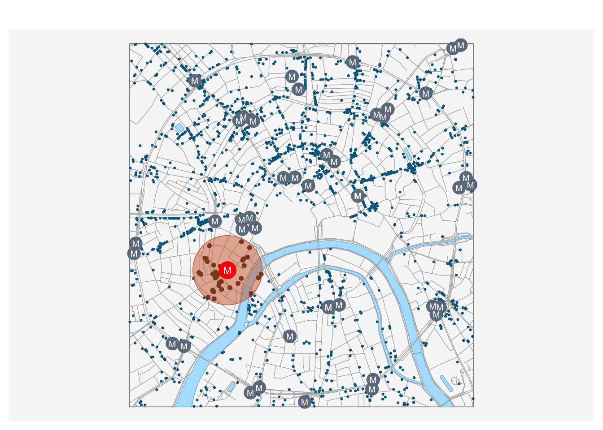

# Векторный анализ {#vector}


Данный модуль посвящен пространственному анализу в R. Несмотря на то, что пространственный анализ — чрезвычайно широкая и многогранная область геоинформатики, все методы, которые объединяются под этим заголовком, базируются на ограниченном числе базовых операций, таких как вычисление расстояний, оценка плотности распределения, построение буферных зон и выполнение пространственных запросов. В настоящем модуле мы рассмотрим, как одно и то же множество пространственных объектов можно анализировать в различных контекстах, используя базовые методы пространственного анализа

Пространственный анализ связан с оценкой _размещения_ объектов и _распределения_ величин в географическом пространстве. В геоинформатике для этих целей используется два подхода: геометрический и статистический. Эти подходы образуют две ступени пространственного анализа: как правило, данные геометрического анализа представляют собой входную информацию для анализа статистического.

Геометрический подход связан с вычислением расстояний между географическими локациями, а также агрегированием объектов/интегрированием показателей в пределах заданных областей, вдоль линий или в окрестности точек. Поиск входной информации для агрегирования решается путем выполнения _пространственных запросов_.

## Пространственные запросы  {#spatial_queries}

__Пространственные запросы__ связаны с поиском объектов (географических локаций), удовлетворяющих условию, заданному на множестве пространственных отношений. В свою очередь, пространственные отношения бывают трех типов: _дирекционные_ (направления), _метрические_ (расстояния) и _топологические_ (взаимное размещение). Примеры пространственных запросов знакомы любому географу:

* Найти все объекты внутри административного района (топологические отношения)
* Найти все объекты не далее 100 метров от дороги (метрические отношения)
* Найти все объекты, расположенные к северу от точки (дирекционные отношения) 

Пространственные запросы могут объединять несколько условий. Можно найти объекты, удовлетворяющие одновременно _всем_ (_логическое И_) вышеперечисленным условиям: внутри района, не далее 100 м от дороги и к северу от выбранной точки; или _хотя бы одному_ (_логическое ИЛИ_) из вышеперечисленных условий. Результат выполнения такого комплексного запроса будет являться, соответственно, пересечением множеств объектов, полученных каждым из запросов, или их объединением.

Наконец, пространственные запросы можно объединять с _атрибутивными_ и _временными_. Атрибутивные запросы связаны с поиском объектов (географических локаций), удовлетворяющих условию, заданному на множестве характеристик объектов. Временные запросы определены на множестве шкалы времени. Например, можно найти все населенные пункты населением свыше 10 000 человек (атрибутивный запрос), находящиеся в пределах выбранного административного района (пространственный запрос, основанный на топологических отношениях), время движения от которых до районного центра не превышает 90 минут (временной запрос).

### Контекстные и целевые объекты {#context_objects}

При выполнении пространственного анализа, в общем случае, имеются множества объектов двух типов:

* __контекстные__ --- объекты, относительно которых будет оцениваться размещение других объектов, то есть, определяющие _контекст анализа_
* __целевые__ --- объекты, размещение которых анализируется по отношению к контекстным объектам, что является _целью_ анализа

Эти множества, разумеется, могут совпадать. Скажем, мы можем проанализировать размещение магазинов относительно других магазинов.

### Зоны окружения объектов {#zones}

Весьма часто в качестве контекстного множества используются не реальные пространственные объекты, а набор абстрактных геометрических объектов, каждый из которых является производным от оригинального пространственного объекта. Как правило, такие геометрии представляют из себя _зоны окружения_ объектов, построенные по некоторому формальному признаку.

Методы построения зон окружения можно разделить по двум критериям: учету взаимного размещения объектов (абсолютные и конкурентные зоны) и пространству признаков, в котором эти зоны строятся.

Если зоны окружения строятся без учета взаимного размещения объектов, то есть, независимо для каждого объекта, то мы будем называть их абсолютными. Абсолютные зоны окружения строятся путем фиксации порогового расстояния либо времени движения относительно исходного объекта. Такие зоны носят название буферных зон (по расстоянию) или зон доступности (по времени). Границей абсолютной зоны окружения является изолиния, построенная по соответствующему показателю. В случае времени это будет _изохрона_. Примеры абсолютных зон окружения:

* Водоохранная зона реки 200 метров (буферная зона)
* Площадь городской территории, в любую точку которой вы можете доехать из дома на машине в течение 30 минут (зона доступности)

Если же при построении зон окружения учитывается взаимное размещение объектов, то в данном случае зоны доступности строятся не исходя из порогового значения показателя (хотя оно может использоваться дополнительно), а исходя из того, какой объект является ближайшим. Конкурентные зоны окружения представляют собой [разбиение](https://ru.wikipedia.org/wiki/Разбиение_множества) пространства на неперекрывающиеся участки без дыр, каждый из которых является зоной окружения соответствующего пространственного объекта. При этом любая точка внутри зоны окружения объекта ближе к этому объекту по выбранному признаку (времени или расстоянию), нежели к любому другому объекту. Конкурентные зоны окружения, построенные по расстоянию, можно реализовать средствами [диаграммы Вороного](https://ru.wikipedia.org/wiki/Диаграмма_Вороного).

## Постановка задач и изучение данных {#use_case}

В настоящем модуле мы рассмотрим вышеперечисленные методы на примере анализа размещения пунктов общественного питания --- кафе, ресторанов и т.д. Используя методы пространственного анализа в среде R, мы ответим на следующие вопросы:

* Какие улицы являются местами наибольшей концентрации заведений общественного питания?
* Как распределены заведения общественного питания по районам центра Москвы?
* Какие заведения общественного питания находятся вблизи метро и на берегу реки?
* В какие заведения общественного питания можно доехать от выбранной точки в течение 5 минут?
* Каков оптимальный маршрут между вашим местоположением и заведением, в котором вы хотите пообедать?

В качестве источника данных используем [OpenStreetMap](http://www.openstreetmap.org) --- краудсорсинговый интернет-проект по созданию бесплатных и открытых пространственных данных глобального охвата. Данные OpenStreetMap в удобном для использования в ГИС виде доступны на [портале GIS-Lab](http://beryllium.gis-lab.info/project/osmshp/).

Для решения задач настоящего модуля нам понадобятся следующие дополнительные пакеты, которые мы не использовали ранее:

* [osrm](https://cran.r-project.org/web/packages/osrm/index.html) --- построение зон доступности, маршрутов и матриц корреспонденции онлайн на основе данных OpenStreetMap и [OSRM API](http://project-osrm.org).
* [cartography](https://cran.r-project.org/web/packages/cartography/index.html) --- пакет, облегчающий построение тематических карт и легенд средствами стандартной функции `plot()`.

Начнем наше исследование с визуального анализа исходных данных

```r
library(sf)
library(tidyverse)
library(classInt)
library(osrm) # Использование онлайн-сервиса маршрутизации OSRM
library(cartography) # Удобное построение тематических карт средствами plot()

# Чтение данных
roads = st_read("data/roads.gpkg") # Дороги
poi = st_read("data/poi_point.gpkg") # Точки интереса
rayons = st_read("data/boundary_polygon.gpkg") # Границы районов
stations = st_read("data/metro_stations.gpkg") # Станции метро
water = st_read("data/water_polygon.gpkg") # Водные объекты

# Прочитаем текущие параметры компоновки
def = par(no.readonly = TRUE)

# Уберем поля, чтобы карта занимала весь экран
par(mar = c(0,0,0,0))

# Получим ограничивающий прямоугольник слоя дорог в качестве общего охвата карты
frame = roads %>% st_bbox() %>% st_as_sfc() %>% st_geometry()

## ОБЗОР ИСХОДНЫХ ДАННЫХ -------------------------------------

# Визуализируем входные данные
plot(frame)
plot(water %>% st_geometry(), 
     col = "lightskyblue1",
     border = "lightskyblue3",
     add = TRUE)
plot(roads %>% st_geometry(),
     col = "gray70", 
     add = TRUE)
plot(poi %>% st_geometry(), 
     col = "deepskyblue4", 
     pch = 20, 
     cex = 0.2, 
     add = TRUE)
```


Теперь приступим к изучению данных, хранящихся в слое `poi` (от англ. POI --- Point Of Interest). Данный слой содержит все точечные маркеры OSM, которыми были отмечены на карте объекты, представляющие (по мнению создателей данных) интерес для пользователей. В POI включаются самые разнообразные объекты, такие как: объекты сферы услуг (amenity), места для отдыха (leisure), офисные здания (office), магазины и торговые центры (shop), туристические достопримечательности (tourism), спортивные объекты (sport), примечательные инженерные сооружения (man_made). В наших данных информация разнесена по соответствующим полям, каждый объект снабжен уникальным идентификатором:


```
## Simple feature collection with 6623 features and 9 fields
## geometry type:  POINT
## dimension:      XY
## bbox:           xmin: 410947.3 ymin: 6176678 xmax: 415889.9 ymax: 6181909
## projected CRS:  WGS 84 / UTM zone 37N
## First 10 features:
##        OSM_ID              NAME MAN_MADE LEISURE          AMENITY OFFICE
## 1  2932331614       Арт-квартал     <NA>    <NA>             <NA>   <NA>
## 2  3639408399              <NA>     <NA>    <NA>         pharmacy   <NA>
## 3  3707882299              <NA>     <NA>    <NA> parking_entrance   <NA>
## 4  3639408396      Стиль золото     <NA>    <NA>             <NA>   <NA>
## 5  3639408397 Цветочная база №1     <NA>    <NA>             <NA>   <NA>
## 6  1413216563      Азбука Вкуса     <NA>    <NA>             <NA>   <NA>
## 7  3641139540              <NA>     <NA>    <NA>   waste_disposal   <NA>
## 8  3636920934             Аршин     <NA>    <NA>       restaurant   <NA>
## 9  3644422074            Адамас     <NA>    <NA>             <NA>   <NA>
## 10 3424516009          Андерсон     <NA>    <NA>       restaurant   <NA>
##            SHOP TOURISM SPORT                 geometry
## 1  doityourself    <NA>  <NA> POINT (410947.3 6181185)
## 2          <NA>    <NA>  <NA> POINT (410961.8 6181858)
## 3          <NA>    <NA>  <NA> POINT (410953.8 6181302)
## 4       jewelry    <NA>  <NA> POINT (410966.7 6181864)
## 5       florist    <NA>  <NA>   POINT (410973 6181862)
## 6   supermarket    <NA>  <NA> POINT (410963.7 6181250)
## 7          <NA>    <NA>  <NA> POINT (410973.9 6181676)
## 8          <NA>    <NA>  <NA> POINT (410975.2 6181661)
## 9       jewelry    <NA>  <NA> POINT (410982.5 6181905)
## 10         <NA>    <NA>  <NA> POINT (410954.9 6180118)
```

Заведения общественного питания по классификатору OSM относятся к классу _amenity_. Поскольку данный классификатор представляет собой множество номинальных (категориальных) данных, можно начать изучение состава данных с помощью таблицы частот, которая строится средствами функции `table()`:

```r
data.frame(table(poi$AMENITY))
##                  Var1 Freq
## 1         arts_centre   17
## 2                 atm  153
## 3                bank  407
## 4                 bar  161
## 5               bench  210
## 6     bicycle_parking   81
## 7      bicycle_rental  116
## 8          biergarten    1
## 9             brothel    1
## 10   bureau_de_change   21
## 11        bus_station    1
## 12               cafe  490
## 13         car_rental    1
## 14           car_wash   12
## 15   charging_station    1
## 16         child_care    1
## 17             cinema   16
## 18             clinic   51
## 19              clock   10
## 20            college    5
## 21         commercial    1
## 22   community_centre    4
## 23         courthouse    3
## 24     dancing_school    1
## 25            dentist   58
## 26            doctors   22
## 27     drinking_water    3
## 28     driving_school    2
## 29            embassy   31
## 30    emergency_phone    5
## 31          fast_food  169
## 32     ferry_terminal    5
## 33         food_court    3
## 34           fountain   32
## 35               fuel    8
## 36                gym    1
## 37           hospital    2
## 38              hotel    1
## 39          ice_cream    3
## 40       kindergarten   13
## 41            library   17
## 42     musical_school    1
## 43          nightclub   19
## 44           official    1
## 45            parking   92
## 46   parking_entrance   72
## 47      parking_space    1
## 48   payment_terminal    6
## 49           pharmacy  166
## 50           photolab    1
## 51   place_of_worship   23
## 52             police   21
## 53           post_box    4
## 54        post_office   37
## 55                pub   96
## 56    public_bookcase    2
## 57    public_building    8
## 58          recycling    6
## 59    register_office    2
## 60         restaurant  844
## 61             school   10
## 62            shelter    2
## 63               shop    4
## 64    social_facility    3
## 65          stripclub    4
## 66               taxi    1
## 67          telephone   58
## 68            theatre   48
## 69            toilets   82
## 70           training   15
## 71         university   15
## 72 vehicle_inspection    1
## 73    vending_machine   98
## 74       waste_basket   52
## 75     waste_disposal  102
```

Для дальнейшего анализа отберем из всего множества объектов сферы услуг заведения, где можно поесть: рестораны, кафе, бары, пабы и заведения быстрого питания (фастфуд). В классификаторе OSM эти заведения имеют тип _restaurant_, _bar_, _cafe_, _pub_ и _fast\_food_. Для отбора нужных строк и столбцов используем dplyr: 


```r
poi.food = poi %>% 
            dplyr::select(NAME, AMENITY) %>% 
            dplyr::filter(AMENITY %in% c("restaurant", "bar", "cafe", "pub", "fast_food"))
head(poi.food)
## Simple feature collection with 6 features and 2 fields
## geometry type:  POINT
## dimension:      XY
## bbox:           xmin: 410954.9 ymin: 6178842 xmax: 411023.8 ymax: 6181896
## projected CRS:  WGS 84 / UTM zone 37N
##          NAME    AMENITY                 geometry
## 1       Аршин restaurant POINT (410975.2 6181661)
## 2    Андерсон restaurant POINT (410954.9 6180118)
## 3    Holynoot  fast_food POINT (410958.8 6179938)
## 4    Gayane's restaurant POINT (410958.4 6178842)
## 5  Molon Lave restaurant POINT (411013.7 6181448)
## 6 Шоколадница       cafe POINT (411023.8 6181896)
```

## Анализ расстояний  {#distance_analysis}

Метрические отношения связывают объекты в терминах расстояний между ними. Предположим, что мы хотим определить улицы, являющиеся сосредоточением заведений питания. Один из вариантов решения состоит в том, чтобы для каждого пункта обслуживания определить ближайшую к нему улицу и далее для каждой улицы просуммировать количество раз, которое улиц оказалось ближайшей. Подробнее алгоритм решения выглядит следующим образом:

1. Вычислить матрицу расстояний между пунктами обслуживания и улицами. Размер матрицы $M \times N$, где $M$ --- количество улиц (строк), $N$ --- количество пунктов (столбцов)
2. Найти в каждом столбце минимальное расстояние.
3. Получить идентификатор улицы (номер строки), соответствующий данному расстоянию.
4. Записать идентификатор в выходной вектор.

Таким образом, мы получим вектор из идентификаторов улиц, при этом каждый идентификатор будет встречаться в этом векторе столько раз, сколько раз данная улица оказалась ближайшей к какому-то объекту.

Вычислим матрицу расстояний с помощью функции `st_distance()` из пакета __sf__:


```r

## АНАЛИЗ РАССТОЯНИЙ -------------------------------------

dist.matrix = st_distance(roads, poi.food)

# посмотрим, как выглядит результат на примере первых пяти объектов
print(dist.matrix[1:5,1:5])
## Units: [m]
##          [,1]      [,2]      [,3]      [,4]     [,5]
## [1,] 4962.292 3420.6849 3240.2066 2145.2044 4748.686
## [2,] 2247.737  705.2923  524.9411  570.3986 2035.341
## [3,] 2213.236  670.7904  490.4167  605.1606 2000.759
## [4,] 2197.874  655.4285  475.0629  620.4411 1985.242
## [5,] 3910.957 2368.5560 2188.1348 1092.5472 3698.246
```

Далее необходимо в каждом столбце матрицы найти номер строки с минимальным расстоянием. Для этого необходимо получить порядок сортировки элементов по возрастанию значений данного столбца и взять номер первого элемента. Операцию можно применить с помощью `apply` ко всем столбцам:

```r
ids = apply(dist.matrix, 2, function(X) order(X)[1])
```

Теперь применим уже знакомую нам функцию `table()`, чтобы подсчитать, сколько раз каждая улица оказалась наиболее близкой. Далее присоединим статистику к исходным улицам, однако для этого нам потребуется вынести названия строк (номеров) улиц в отдельный столбец.


```r
count.stats = as.data.frame(table(ids))
roads = roads %>% mutate(id = row.names(.))
roads.poi = merge(roads, 
                   count.stats, 
                   by.x = 'id', 
                   by.y = 'ids', 
                   all.x = T)
```

Посмотрим первые 10 улиц по количеству общепита:

```r
# Статистика по улицам в табличном представлении (первые 10)
roads.poi %>% 
  dplyr::select(NAME, Freq) %>% 
  arrange(desc(Freq)) %>% 
  head(10)
## Simple feature collection with 10 features and 2 fields
## geometry type:  MULTILINESTRING
## dimension:      XY
## bbox:           xmin: 411105.1 ymin: 6178083 xmax: 414504.1 ymax: 6181734
## projected CRS:  WGS 84 / UTM zone 37N
##                       NAME Freq                       geometry
## 1              улица Арбат   43 MULTILINESTRING ((412157.9 ...
## 2        улица Новый Арбат   24 MULTILINESTRING ((411105.1 ...
## 3          Цветной бульвар   22 MULTILINESTRING ((413491.7 ...
## 4          Мясницкая улица   20 MULTILINESTRING ((414504.1 ...
## 5         Никольская улица   17 MULTILINESTRING ((413704.5 ...
## 6          Пятницкая улица   17 MULTILINESTRING ((413895.8 ...
## 7          Неглинная улица   14 MULTILINESTRING ((413498.2 ...
## 8       улица Рождественка   14 MULTILINESTRING ((413628.1 ...
## 9        Козицкий переулок   14 MULTILINESTRING ((412831.7 ...
## 10 улица Большая Дмитровка   14 MULTILINESTRING ((413262.7 ...
```

Для завершения анализа осталось визуализировать результаты. Чтобы усилить наглядность визуализации, мы не будем каждую улицу утолщать пропорционально количеству привязанных объектов, а разделим это количество на 4 класса. Каждый класс покажем линией соответствующей толщины и интенсивности цвета (чем больше объектов привязано к улице, тем толще линия, темнее и насыщеннее ее цвет). 

Для классификации используем функцию `cut()`, позволяющую перекодировать интервальные данные в номинальные, то есть сопоставить каждому элементу вектора некий класс, которому он принадлежит. На выходе будем иметь вектор, который состоит из такого же количества элементов, что и исходный, но вместо исходных значений будут стоять названия классов.


```r
# Получим границы классов
nclasses = 4
class.breaks = classIntervals(roads.poi$Freq, 
                               n = nclasses, 
                               style = "jenks")
# Извлечем граничные интервалы
borders = class.breaks$brks

# Названия классов — они же толщины линия от 1 до 4
line.widths = 1:nclasses

# Перекодируем столбец количества присоединенных пунктов в классы
sizes = cut(roads.poi$Freq, 
             breaks = borders, 
             labels = line.widths)
```

Теперь присвоим каждому объекту свой цвет в соответствии с классом, который ему присвоен. Удобная функция `findColours()` позволяет найти цвет для каждого объекта в соответствии с полученной классификацией:


```r
base.colors = c("mistyrose", "red")
ramp = colorRampPalette(base.colors)
colors = findColours(class.breaks, base.colors)

plot(frame)

plot(water %>% st_geometry(), 
     col = "lightskyblue1",
     border = "lightskyblue3",
     add = TRUE)

plot(roads %>% st_geometry(),
     col = "gray70",
     add = TRUE)

plot(roads.poi %>% st_geometry(),
     lwd = sizes, 
     col = colors,
     add = TRUE)

plot(poi.food %>% st_geometry(), 
     col = "deepskyblue4", 
     pch = 20, 
     cex = 0.2, 
     add = TRUE)

# Функция legendGradLines из пакета cartography позволяет строить
# легенду для карт линий градуированных размеров:
legendGradLines(title.txt = "Пункты питания", 
                pos = "left",
                title.cex = 0.8,
                values.cex = 0.6, 
                breaks = borders,
                lwd = line.widths,
                col = "red")
```


## Анализ взаимного положения (топологический) {#topology_analysis}

Пространственные запросы, основанные на топологических отношениях, позволяют находить объекты, находящиеся внутри других объектов, соприкасающиеся с другими объектами, пересекающиеся с ними и так далее. Топологические отношения сохраняются при взаимно-однозначных и непрерывных преобразованиях плоскости. 

Отличия от метрических отношений легко пояснить на примере преобразования проекции. Представьте, что карту России в [конической проекции](http://geocnt.geonet.ru/projections/html/viewer.html) с концентрическими параллелями (известную по учебникам и атласам)  вы трансформировали в карту России в проекции Меркатора (такую же как на [Google Maps](https://www.google.ru/maps/place/Россия/)). Изогнутые параллели превратились в прямые линии; форма регионов, площади и расстояния между населенными пунктами значительно изменились. Однако Красноярск по-прежнему находится в Красноярском крае, Ярославль --- на реке Волге, Нижний Новгород --- на правом берегу Волги, озеро Белое --- внутри Вологодской области, а Московская область как не граничила с Тамбовской, так и не граничит после трансформации проекции. Это и есть топологические отношения.

Формально топологические отношения в ГИС описываются с помощью [модели девяти пересечений DE-9IM](https://en.wikipedia.org/wiki/DE-9IM), которая была рассмотрена в предыдущей лекции.


```r
## АНАЛИЗ ВЗАИМНОГО ПОЛОЖЕНИЯ -------------------------------------
poi.food = poi.food %>% mutate(count = 1)
rayons.poi = aggregate(poi.food['count'], rayons, sum)
```


```r
# Преобразуем результат в относительный показатель
# (единиц на кв.км. площади) и запишем в таблицу районов:
rayons.poi$density = 1000000 * rayons.poi$count / st_area(rayons.poi)
```

Масштабный множитель 1000000 в коде понадобился чтобы перевести площадь, хранящуюся в поле Shape_Area из квадратных метров в квадратные километры. Обратите внимание на то, что в данном случае мы не стали ограничивать фигурными скобками тело анонимной функции (`table(X)[2]`) внутри `apply()`, поскольку выполняемая операция достаточно компактна.

Подготовим параметры отображения:

```r
# Настроим параметры отображения
choro.pal = colorRampPalette(c("lightgoldenrodyellow", "orangered"))

intervals = classIntervals(rayons.poi$density, 
                            n = 5, 
                            style = "quantile")
```

Далее используем функции `choroLayer()` и `legendChoro()` из пакета `cartography` для построения картограмм плотности пунктов питания и соответствующей им легенды средствами обычной функции `plot()`:

```r
choroLayer(rayons.poi, # Исходный слой типа SpatialPolygonsDataFrame
           var = "density", # Картографируемая переменная (столбец) 
           breaks = intervals$brks, # Границы интервалов
           col = choro.pal(5), # Цвета для соответствующих интервалов
           legend.pos = "n") # Легенду мы нарисуем позднее, поверх всех слоев
plot(water %>% st_geometry(), 
     col = "lightskyblue1",
     border = "lightskyblue3",
     add = TRUE)
plot(roads %>% st_geometry(),
     col = "gray50",
     add = TRUE)
plot(poi.food %>% st_geometry(), 
     col = "deepskyblue4", 
     pch = 20, 
     cex = 0.5, 
     add = TRUE)
plot(rayons %>% st_geometry(),
     border = "black",
     lwd = 3,
     add = TRUE)
text(rayons %>% st_centroid() %>% st_coordinates(),
     labels = gsub(' ', '\n', rayons$NAME),
     font = 2,
     cex = 0.6)

# Рисуем легенду
legendChoro(breaks = intervals$brks, 
            col = choro.pal(5),
            pos = "topleft",
            frame = FALSE, 
            title.txt = "Заведений\nна 1 кв.км")
```


Итак, используя топологический пространственный запрос "Содержит", мы смогли агрегировать точечные объекты внутри площадных и построить картограммы плотности распределения пунктов питания по районам центра Москвы.

## Анализ абсолютных зон окружения  {#absolute_zones}

Задача данного раздела модуля звучит следующим образом: определить, какие пункты питания находятся в радиусе 300 метров от метро "Кропоткинская". Контекстом анализа в данном случае служит 300-метровая зона окружения станции метро. Поставленную задачу можно решить двумя способами:

* Рассчитать расстояния от каждого пункта питания до станции метро "Кропоткинская" и выбрать точки, для которых это расстояние меньше или равно 300 метрам.
* Построить буферную зону радиусом 300 метров и выбрать ею точки, используя топологическое отношение пересечения

Мы будем использовать второй вариант решения. Алгоритм выглядит следующим образом:

1. Построить буферную зону, используя функцию `st_buffer()` из пакета __sf__.
2. Выбрать полученной зоной точки пунктов питания, используя стандартный оператор `[]`.
3. Визуализировать на карте полученные точки и буферную зону.

Определим функцию `plotBasemap()`, которая будет рисовать объекты картографической основы, ее мы будем использовать далее неоднократно.


```r
## АНАЛИЗ АБСОЛЮТНЫХ ЗОН ОКРУЖЕНИЯ -------------------------------------

# Функция отвечает за рисование базовой карты
plotBasemap = function(add = FALSE){
  
  plot(frame, add = add)

  plot(water %>% st_geometry(), 
       col = "lightskyblue1",
       border = "lightskyblue3",
       add = TRUE)
  
  plot(roads %>% st_geometry(),
       col = "gray70",
       add = TRUE)
  
  plot(poi.food %>% st_geometry(), 
       col = "deepskyblue4", 
       pch = 20, 
       cex = 0.3, 
       add = TRUE)
  plot(stations %>% st_geometry(), 
       col = "slategray4", 
       pch = 20, 
       cex = 2, 
       add = TRUE)
  text(stations %>% st_centroid() %>% st_coordinates(),
       labels = "M",
       col = "white",
       cex = 0.4)
}
```

Определив вспомогательные функции,  можем приступать к выполнению анализа:

```r
# Выберем станцию метро и построим буферную зону
krop = stations %>% dplyr::filter(NAME == "Кропоткинская")
zone = st_buffer(krop, dist = 300)

# Применим разработанную функцию для отбора точек
selected.poi = poi.food[zone, ]

# Применим разработанную функцию для рисования картографической основы
plotBasemap()

# Визуализируем результаты анализа
plot(krop %>% st_geometry(), 
     col = "red", 
     pch = 20, 
     cex = 4, 
     add = TRUE)

text(krop %>% st_coordinates(),
     labels = "M",
     col = "white",
     cex = 0.7,
     add = TRUE)

plot(zone %>% st_geometry(),
     col = adjustcolor("sienna3", alpha.f = 0.5),
     border = "sienna3",
     add = TRUE)

plot(selected.poi %>% st_geometry(), 
     col = "sienna4", 
     pch = 20, 
     cex = 0.5, 
     add = TRUE)
```


```
## Simple feature collection with 23 features and 3 fields
## geometry type:  POINT
## dimension:      XY
## bbox:           xmin: 412142.7 ymin: 6178370 xmax: 412593.7 ymax: 6178811
## projected CRS:  WGS 84 / UTM zone 37N
## First 10 features:
##               NAME    AMENITY                 geometry count
## 440      Азия Кафе restaurant POINT (412142.7 6178592)     1
## 444     Баба Марта restaurant POINT (412154.8 6178720)     1
## 447        Теремок  fast_food   POINT (412153 6178584)     1
## 456        Воронеж       cafe POINT (412177.7 6178535)     1
## 457     Пафф Пойнт  fast_food POINT (412180.6 6178620)     1
## 458 What's Up Dog!  fast_food POINT (412181.4 6178606)     1
## 461        Воронеж restaurant POINT (412183.4 6178538)     1
## 463       GlowSubs  fast_food POINT (412190.1 6178599)     1
## 464        Mr. Pit  fast_food POINT (412193.2 6178610)     1
## 469    Шоколадница       cafe POINT (412204.3 6178570)     1
```

В качестве примера аналогичного анализа отберем все пункты питания, находящиеся в пределах 100 метров от реки Москвы:

```r
river = water %>% dplyr::filter(NAME == "Москва")
zone = st_buffer(river, dist = 100)

selected.poi = poi.food[zone, ]

plotBasemap()

plot(zone %>% st_geometry(),
     col = adjustcolor("orange", alpha.f = 0.5),
     border = "orange",
     add = TRUE)

plot(river %>% st_geometry(), 
     col = adjustcolor("deepskyblue", alpha.f = 0.5), 
     border = F,
     add = TRUE)

plot(selected.poi %>% st_geometry(), 
     col = "firebrick1", 
     pch = 20, 
     cex = 0.5, 
     add = TRUE)
```




```
## Simple feature collection with 39 features and 3 fields
## geometry type:  POINT
## dimension:      XY
## bbox:           xmin: 411661.2 ymin: 6176685 xmax: 415287.1 ymax: 6178953
## projected CRS:  WGS 84 / UTM zone 37N
## First 10 features:
##                     NAME    AMENITY                 geometry count
## 244        Белый журавль restaurant POINT (411661.2 6177029)     1
## 332       What's Up Dog!  fast_food POINT (411871.8 6176685)     1
## 360 Coffee@Парк Горького       cafe POINT (411917.7 6176775)     1
## 386                Sekta restaurant   POINT (411975 6176908)     1
## 424             GlowSubs  fast_food POINT (412060.5 6177161)     1
## 473           Чай & кофе       cafe POINT (412197.5 6177284)     1
## 479             Академия restaurant POINT (412222.4 6177790)     1
## 509            Kaffebrod       cafe POINT (412280.3 6177452)     1
## 512                  Les       cafe POINT (412299.1 6177468)     1
## 522              Beefbar restaurant POINT (412344.9 6177823)     1
```

## Анализ конкурентных зон окружения  {#conc_zones}

В данном разделе мы решим следующую задачу: разбить всю изучаемую территорию на зоны окружения станций метро и подсчитать количество пунктов питания, попадающих в каждую зону. Полученные зоны должны быть конкурентными: любая точка, находящаяся в зоне окружения конкретной станции метро, должна быть ближе к этой станции, чем к любой другой станции.

Ранее мы говорили о том, что конкурентные зоны окружения по расстоянию можно реализовать с помощью диаграммы Вороного. Применим функцию `voronoi()` из пакета __dismo__, чтобы посмотреть, как выглядит диаграмма Вороного для точек станций метро. Нам потребуется для этого конвертировать объекты в тип `Spatial`, а результат преобразовать вернуть обратно в `sf`:


```r

## АНАЛИЗ КОНКУРЕНТНЫХ ЗОН ОКРУЖЕНИЯ -------------------------------------

zones = stations %>% 
  as('Spatial') %>% 
  dismo::voronoi() %>% 
  st_as_sf() %>% 
  st_crop(frame)
  

plot(zones %>% st_geometry())
plot(stations, add = TRUE, pch = 19, col = 'black')
```


Для визуализации результатов мы будем использовать метод картодиаграмм (пропорциональных символов), реализованный в функции `propSymbolsLayer()` пакета `cartography`. Размером кружка покажем количество пунктов питания, оказавшихся в каждой зоне окружения:


```r
# Агрегруем данные по каждой зоне
zones.poi = aggregate(poi.food['count'], zones, sum)

# Визуализируем результат

plotBasemap()

plot(zones %>% st_geometry(),
     col = adjustcolor("white", alpha.f = 0.5),
     add = TRUE)

propSymbolsLayer(zones.poi, 
                 var = "count", 
                 symbols = "circle",
                 col = adjustcolor("turquoise3", alpha.f = 0.5),
                 border = F,
                 legend.title.txt = "Заведений\nпитания")

text(zones %>% st_centroid() %>% st_coordinates(), 
     labels = zones.poi$count,
     col = "turquoise4",
     cex = log(zones.poi$count)/4)
```


## Анализ зон транспортной доступности  {#transport_zones}

Зоны транспортной доступности представляют из себя зоны окружения объектов, построенные не по евклидову расстоянию, а по расстоянию или времени движения по дорожной сети. В задачах логистики и геомаркетинга зоны транспортной доступности часто называют _зонами обслуживания_ (service area), поскольку используются для определения территории, которую может покрыть объект, предоставляющий некоторые услуги. Например, для пожарного депо зона 10-минутной доступности показывает территорию города, в любую точку которой пожарная машина может доехать __из__ данного депо в течение 10 минут. И наоборот, для торгового центра зона 10-минутной доступности показывает территорию города, __из__ любой точки которой можно добраться до ТЦ в течение 10 минут. Очевидно, что продолжительность прямого и обратного маршрута неодинакова, на нее может оказывать влияние схема движения, приоритет дорог и так далее.

Задача, которую мы решим в данном разделе, звучит так: определить все заведения питания, находящиеся в 7 минутах езды от Центрального детского магазина. Для построения зоны доступности мы будем использовать пакет [osrm](https://cran.r-project.org/web/packages/osrm/index.html), предоставляющий интерфейс __R__ к онлайн-библиотеке маршрутизации [OSRM](http://project-osrm.org), работающей на основе данных OSM. Для построения зоны доступности (изохроны) нам понадобится функция `osrmIsochrone()` из данного пакета.

> Внимание: для выполнения этого раздела модуля необходимо подключение к Интернету

Поскольку данные, используемые в настоящем модуле, предварительно были конвертированы в проекцию [UTM](https://en.wikipedia.org/wiki/Universal_Transverse_Mercator_coordinate_system) и хранятся в метрах, а OSRM решает все задачи в географических координатах (широте и долготе относительно эллипсоида [WGS84](https://en.wikipedia.org/wiki/World_Geodetic_System)), нам необходимо научиться работать с проекциями данных и преобразовывать системы координат между собой.


```r

## АНАЛИЗ ЗОН ТРАНСПОРТНОЙ ДОСТУПНОСТИ -------------------------------------

# Инициализируем систему координат WGS84, используемую в OSRM
WGS84 = st_crs(4326)

# Извлечем информацию о системе координат исходных точек
UTM = st_crs(poi)

# Выберем целевой объект
psel = poi %>% dplyr::filter(NAME == "Центральный детский магазин" & SHOP == "toys")

# Преобразуем координаты точки в WGS84
psel.wgs = st_transform(psel, WGS84)

# Получаем 5-минутную зону транспортной доступности
# с помощью пакета osrm
service_area = osrmIsochrone(psel.wgs, breaks = 3)

# Преобразуем зону обратно в UTM для дальнейших операций
service_area_utm = st_transform(st_as_sf(service_area), UTM)

# Отбираем точки
selected_poi = poi.food[service_area_utm, ]

# Визуализируем результат
plotBasemap()

plot(service_area_utm %>% st_geometry(),
     col = adjustcolor("violetred3", alpha.f = 0.2),
     border = "violetred3",
     add = TRUE)

plot(selected_poi  %>% st_geometry(), 
     col = "violetred3", 
     pch = 20, 
     cex = 0.5, 
     add = TRUE)

plot(psel %>% st_geometry(), 
     col = "violetred4", 
     pch = 20, 
     cex = 4, 
     add = TRUE)
```


Итак, в данном разделе мы научились строить зоны транспортной доступности в виде полигонов, ограниченных изохроной времени движения.

## Построение маршрутов и матриц времени движения {#routes}

В этом разделе модуля пространственного анализа мы посмотрим, каким образом можно построить оптимальный маршрут между двумя точками, а также получить матрицу времени движения между точками (на примере станций метро). Для решения этих задач используем следующие функции пакета osrm:

* `osrmRoute(src, dest)` --- строит оптимальный маршрут между точками `src` и `dest`
* `osrmTable(loc)` --- строит матрицу времени движения между всеми парами точек в `loc`

Так же, как и в предыдущем разделе, нам понадобятся преобразования координат. Построим оптимальный маршрут между книжным магазином "Молодая Гвардия" на Полянке и чебуречной "Дружба" на метро Сухаревская:

```r

## ПОСТРОЕНИЕ МАРШРУТОВ -------------------------------------

# Выбираем и проецируем начальную точку
origin = poi %>% dplyr::filter(NAME == 'Молодая Гвардия')
origin_wgs = st_transform(origin, WGS84)
  
# Выбираем и проецируем конечную точку
destination = poi %>% dplyr::filter(NAME == 'Чебуречная "Дружба"')
destination_wgs = st_transform(destination, WGS84)

# Строим маршрут
route = osrmRoute(origin_wgs, 
                  destination_wgs, 
                  overview = "full", # запретить генерализацию линий
                  sp = TRUE) # вернуть результат в виде объекта класса Spatial

# Преобразуем результат обратно в UTM
route.utm = st_transform(route %>% st_as_sf(), UTM)

# Визуализируем результат:
plotBasemap()

plot(route.utm %>% st_geometry(),
     lwd = 3,
     col = "orange",
     add = TRUE)

plot(origin %>% st_geometry(), 
     col = "tomato3", 
     pch = 20, 
     cex = 3, 
     add = TRUE)
text(origin %>% st_coordinates(),
     labels = "O",
     col = "tomato4",
     cex = 0.5)

plot(destination %>% st_geometry(), 
     col = "tomato", 
     pch = 20, 
     cex = 4, 
     add = TRUE)
text(destination %>% st_coordinates(),
     labels = "D",
     col = "tomato4",
     cex = 0.7)
```


## Контрольные вопросы и упражнения {#qtasks_vector_analysis}

### Вопросы {#questions_vector_analysis}

1. Перечислите три основных вида пространственных отношений, приведите их примеры.
1. Чем отличаются контекстные и целевые объекты?
1. В чем заключается отличие абсолютных и конкурентных зон окружения?
1. Какая функция пакета sf позволяет вычислять расстояния между объектами? Как с помощью полученного результата определить для каждого объекта из множества $A$ определить ближайший к нему объект из множества $B$?
1. Опишите последовательность действий, которую необходимо выполнить для подсчета количества точечных объектов по заданной сетке полигонов.
1. С помощью какой функции можно построить буферную зону вокруг пространственного объекта? Есть ли ограничения на размерность буферизуемого пространственного объекта (точка, линия, полигон)? Можно ли построить буфер вокруг поверхности?
1. Какая геометрическая структура используется для построения конкурентных зон окружения?
1. Что такое OSRM?
1. Какими средствами можно построить зоны транспортной доступности и маршруты в среде R? В какой системе координат должны быть точки, участвующие в сетевом анализе?
1. Опишите возможности и основные функции пакета `cartography`, с помощью которых можно строить тематические карты способами картограмм, картодиаграмм и линейных знаков, а также легенды к ним.

### Упражнения {#tasks_vector_analysis}

1. Проанализируйте пространственную ассоциацию подтипов почв с типами рельефа [данным](https://github.com/tsamsonov/r-geo-course/blob/master/data/Satino.gpkg) ГИС Сатино. Для этого выполните оверлей между слоями _RelTypes_ и _SoilTypes_ методом [`st_intersection()`](https://r-spatial.github.io/sf/reference/geos_binary_ops.html). Для каждого подтипа почв рассчитайте долю, которая занята в его площади каждым типом рельефа. Визуализируйте результаты средствами __ggplot2__ в виде столбчатой диаграммы, где каждый столбик отвечает за подтип почвы, а его внутреннее разделение соответствует долям типов рельефа. Используя функцию [`cramerV()`](https://www.rdocumentation.org/packages/rcompanion/versions/2.3.25/topics/cramerV) из пакета __rcompanion__, рассчитайте [коэффициент ассоциации Крамера](https://en.wikipedia.org/wiki/Cram%C3%A9r%27s_V), чтобы охарактеризовать силу ассоциации между этими номинальными переменными.

    > __Подсказка__: для вычисления коэффциента Крамера вам необходимо преобразовать данные в широкую форму, где подтипы почв идут по строкам, а типы рельефа — по столбцам. Полученную таблицу необходимо конвертировать в матрицу и подать на вход функции `cramerV()`.

1. Одна из гипотез, часто используемых в [геомаркетинге](https://ru.wikipedia.org/wiki/%D0%93%D0%B5%D0%BE%D0%BC%D0%B0%D1%80%D0%BA%D0%B5%D1%82%D0%B8%D0%BD%D0%B3) — это так называемые _аттракторы потоков_ — пространственные объекты, которые сосредотачивают в своей близости высокую плотность пешеходного трафика. Типичный пример аттрактора — любая транспортная локация: выход из метро, железнодорожная платформа, автобусная остановка. Владельцы предприятий сферы услуг в теории стремятся размещать свои точки вблизи к аттракторам. Используя данные из настоящей лекции, проведите проверку реалистичности этой теории. Для этого:

    - постройте вокруг выходов станций метро несколько буферных зон увеличивающегося радиуса
    - выберите ими пункты общественного питания
    - рассчитайте их плотность как отношение количества к площади буфера
    
    Далее постройте график зависимости между радиусом буфера и плотностью объектов интереса. Рассчитайте также коэффициент корреляции между этими величинами.


----
_Самсонов Т.Е._ **Визуализация и анализ географических данных на языке R.** М.: Географический факультет МГУ, 2021. DOI: [10.5281/zenodo.901911](https://doi.org/10.5281/zenodo.901911)
----
