# Геостатистическая интерполяция {#kriging}


[Программный код главы](https://github.com/tsamsonov/r-geo-course/blob/master/code/14-InterpolationGeostatistics.R)


## Пространственная статистика

1. __Геостатистика__ _(geostatistics)_
  - $D$  фиксированное подмножество в $\mathbb{R}^k$
  - $Z(p)$  случайный вектор в каждой точке $p$
  - Исследуется пространственное распределение
2. __Сеточные данные__ _(lattice data)_
  - $D$  фиксированное счетное подмножество точек $\mathbb{R}^k$
  - $Z(p)$  случайный вектор в каждой точке $p$
  - Исследуется пространственная автокорреляция
3. __Конфигурации точек__ _(point patterns)_
  - $D$  счетное подмножество точек $\mathbb{R}^k$ _(точечный процесс)_
  - $Z(p)$  константа или счетное множество _(маркированный точечный процесс)_
  - Исследуется пространственное размещение

**Геостатистика** --- раздел математической статистики, который связан с численным описанием переменных, распределенных в географическом пространстве и, опционально, времени. Наиболее часто инструменты геостатистики используются для решения задачи интерполяции --- восстановления сплошного поля распределения случайной величины по ограниченному множеству данных в точках наблюдений. Однако, геостатистика как научная дисциплина существенно шире. Ее первоочередной задачей является статистическое описание пространственных распределений.

В основе геостатистики лежит широко разработанный математический аппарат. Понимание основ этого аппарата является необходимым условием осмысленного примения геостатистических методов на практике. В настоящей главе мы постараемся сформировать у читателя данное понимание, и показать, как геостатистика работает на практике.

Мир геостатистики базируется на фундаментальных понятиях случайной величины, случайной функции и случайного процесса. Рассмотрим эти понятия.

## Базовые понятия и элементы геостатистики

### Базовые понятия 

Отправной точкой геостатистического анализа является конечное множество точек (локаций), в каждой из которых зафиксировано значение некоторой пространственной переменной. Пространственную и атрибутивную составляющую традиционно разделяют на две компоненты, каждая из которых может быть случайной:

1. Пространственные локации (точки)
  $$\{p_1, p_2, ..., p_n\}$$
2. Данные в этих локациях
  $$\{Z(p_1), Z(p_2), ..., Z(p_n)\}$$

Данные в локациях получаются путем измерений значений пространственно распределенной переменной, или вычисления её значения на основе других данных, которые прямо или косвенно (через другие данные) базируются на прямых или дистанционных наблюдениях. Результаты измерений, как и исходные для расчетов данные, как правило, привязаны ко времени и характеризуют состояние среды на определенный момент. Если описываемое явление является динамическим (изменчивым во времени), результаты наблюдений или расчетов для двух разных моментов времени в общем случае будут различны. Эти различия невозможно _полностью_ описать в аналитическом виде, поскольку природные и социально-экономические процессы формируются неопределенно большим числом факторов. Аналогично этому, невозможно и достоверно предсказать значение пространственной переменной в заданный момент времени. Чтобы работать с такими данными, используются понятия _случайной величины_ и _случайного процесса_.

> __Случайной величиной__ $Z(w)$ называется функция, которая в результате случайного события $w$ принимает некоторое вещественнозначное значение.

Например, при анализе температуры водоема в отдельно взятой точке в толще воды случайной величиной (функцией) является собственно температура, а событием — та совокупность физико-химических условий, которая сложилась в данной точке в данный момент измерений и обусловила наблюдаемое значение температуры.

Отметим, что _элемент случайности вносится именно событием_, которое в природе может быть сформировано сложной и трудно предсказуемой комбинацией факторов, в то время как _случайная величина уже связана с событием некоторой зависимостью_, которую можно описать с помощью аналитических или эмпирических формул.

Случайность можно наблюдать не только в точке, но и по пространству. Например, уровень шума, формируемый автотранспортом в открытой городской среде, меняется непрерывно, и его можно измерить в каждой точке. При этом пространственное распределение величины этого уровня будет в каждый момент времени зависеть от случайного события — размещения автомобилей и уровня шума, производимого каждым из них. Городская среда оказывается полностью заполнена шумовым эфиром, густота которого неодинакова в пространстве и времени. Перемещаясь из точки в точку или ожидая последующего момента времени, находясь в одной точке, мы будем наблюдать разный уровень шума. Состояние этого шумового эфира как единого целого является _случайным процессом_.

Введем общее понятие случайного процесса:

> __Случайный процесс__  это семейство случайных величин, индексированных некоторым параметром $t$

Наиболее часто анализируются одномерные случайные процессы, в которых $t$ --- это время. Классическим примером такого процесса является количество покупателей, находящихся в магазине.

Пространственная статистика изучает случайные процессы, в которых $t$ — это координата точки (обычно на плоскости). Такие процессы характеризуются следующими особенностями:

- в каждой точке $p_i$ существует некоторая _случайная величина_ $Z(p_i)$ — __сечение случайного процесса__

- при изменении точки $p_i$ наблюдаемое значение случайного процесса меняется случайным образом, поскольку определяется оно не только местоположением, но и заранее неизвестным случайным событием.

Для описания случайных процессов в пространстве необходимо сформировать базовую математическую модель, а также определить ее свойства.

### Случайный процесс в пространстве и его моменты

Пусть $p \in \mathbb{R}^k$ --- точка в $k$-мерном Евклидовом пространстве и $Z(p)$ --- __случайная величина__ в точке $p$. Тогда если $p$ меняется в пределах области $D \subset \mathbb{R}^k$ (эта область именуется _индексным множеством_), то формируется __случайный процесс__:

$$\{Z(p) | p \in D\}$$
Вертикальная черта в соответствии с принятой в теории вероятности нотацией означает _условие_. То есть, переменная $p$ ограничена областью $D$. 

Результат наблюдения случайного процесса в точках области $D$ является __реализацией__ случайного процесса:

$$\{z(p) | p \in D\}$$
> В общем случае $D$ и $Z$ случайны и независимы

Случайный процесс, как и случайную величину, можно описать с помощью статистических моментов, таких как математическое ожидание и дисперсия.

__Математическое ожидание__ есть наиболее вероятная реализация случайного процесса:

$$\operatorname E[Z(p)]=m(p)$$

Поясним суть математического ожидания СП на следующем примере:

- Пусть дан географический регион, в пределах которого рассматривается поле температуры и его временная изменчивость.
- В каждый момент времени мы имеем непрерывное поле температуры — реализацию случайного процесса.
- Если рассмотреть поведение это поля во временном разрезе (по аналогии с колебаниями волн в пространстве), то получим некое "среднее" поле --- математическое ожидаение случайного процесса.

Если в приведенном примере температура наблюдается посредством сети метеостанций, то в каждый момент времени реализацию СП можно приблизительно восстановить путем выполнения интерполяции по их данным. Осреднив же данные по времени, и снова проинтерполировав их, получим _выборочную среднюю_ поверхность --- оценку мат. ожидания СП.  

__Дисперсия__ есть мера разброса реализаций случайного процесса относительно его математического ожидания:

$$\operatorname{Var}[Z(p)]= \operatorname E[Z^2(p)]-m^2(p)$$
Аналогично математическому ожиданию, дисперсия двумерного СП представляет собой _поле распределения_. Величина этого поля каждой точке равна дисперсии сечения СП в этой точке, то есть дисперсии случайной величины. Так же как и в традиционной статистике, вместо дисперсии в расчетах часто используют среднеквадратическое отклонение, поскольку оно выражено в тех же единицах, что и сама случайная величина:

$$\sigma(p)= \sqrt{\operatorname{Var}[Z(p)]}$$

В случае поля температуры можно представить себе объем, ограниченный двумя поверхностями $m(p) + \sigma(p)$ и $m(p) - \sigma(p)$. Расстояние между этими поверхностями в каждой точке $p$ представляет собой среднеквадратическое отклонение случайного процесса.

__Ковариация__  мера линейной зависимости сечений случайного процесса в двух точках $p_1$ и $p_2$:

$$\operatorname{Cov}(p_1,p_2) = \operatorname{Cov}[Z(p_1), Z(p_2)] = \\\operatorname{E}[Z(p_1)Z(p_2)]-m(p_1)m(p_2)$$

> Для вычисления ковариации необходимость знать математическое ожидание СП. Это условие выполняется далеко не всегда, что связано с тем что как правило приходится иметь дело только с одной его реализацией.

Следует обратить внимание на то, что  _моменты пространственных случайных процессов являются функциями, а не константами_, в отличие от моментов случайных величин.

Давать оценку пространственной структуре явления на основе вычисленных моментов с.п. можно при условии, что он удовлетворяет свойствам __стационарности__ и __эргодичности.__

## Стационарность и эргодичность

### Стационарность

__Стационарность__ _в строгом смысле_ означает что функция распределения множества случайных величин для любой комбинации точек ${x_1, x_2,...,x_k}$ и любого $k < \infty$ остается неизменной при смещении этой комбинации на произвольный вектор $h$:

$$P\{Z(x_1)<z_1,...,Z(x_k)<z_k\} = \\P\{Z(x_1 + h)<z_1,...,Z(x_k + h)<z_k\}$$
- Стационарность по другому называют __однородностью в пространстве__, подразумевая что явление ведет себя одинаковым образом в любой точке пространства, как бы повторяет само себя.

- Если СФ стационарна, все ее моменты будут инвариантны относительно сдвигов (то есть будут постоянны), а это означает что для их оценки можно использовать ограниченную в пространстве область.

- В реальности же подобного рода «идеальное» поведение встречается крайне редко, поэтому используют более слабое предположение о стационарности второго порядка.

Случайная функция имеет имеет __стационарность второго порядка__, если для любых точек $x$ и $x+h$ в $R^k$

$$\begin{cases}
  E[Z(x)] = m \\
  E[(Z(x)-m)(Z(x+h)-m)] = C(h)
\end{cases}$$

Данные условия означают, что математическое ожидание СФ постоянно, а ковариация зависит только от вектора $h$ между точками и не зависит от их абсолютного положения.

Если ковариация также не зависит от направления, а только от расстояния между точками, то $h$ вырождается в скаляр, а такая случайная функция является _изотропной стационарной_.

### Эргодичность

Стационарная случайная функция $Z(x,w)$ называется __эргодической__, если ее среднее по области $V \subset R^k$ сходится к математическому ожиданию $m(w)$ при стремлении $V$ к бесконечности:

$$\lim_{V \rightarrow \infty} \frac{1}{|V|}\int_{V} Z(x,w)dx = m(w),$$
где $|V|$ обозначает _меру_ области $V$ (площадь, объем). Предполагается что сама область $V$ растет во всех направлениях, и предел ее роста не зависит от ее формы.

> Следствием эргодичности является то, что среднее по всем возможным реализациям равно среднему отдельной безграничной в пространстве реализации.

Смысл эргодичности можно пояснить на следующем примере. Пусть дан кувшин с песком, в котором необходимо определить долю объема, занятую содержимым. Проведем следующий эксперимент:

- Зафиксируем некоторую точку $x$ в системе отсчета, привязанной к кувшину, и будем его встряхивать бесконечное число раз, каждый раз фиксируя, оказалась ли точка $x$ внутри песчинки (записываем 1) или же попала в свободное между ними пространство (записываем 0)
- Из серии подобных экспериментов мы сможем оценить среднее значение индикаторной функции $I(x,w)$, которое равно вероятности попадания зерна в точку $x$, и которое не зависит от $x$.
- Эта вероятность и будет равна доли объема кувшина, занятой песком.

Аналогичный  результат можно получить, если теперь зафиксировать кувшин, а точку $x$ выбирать каждый раз случайным образом. Однако в первом случае берется среднее по реализациям, а во втором среднее по пространству.

## Геостатистическое оценивание

###  Простой кригинг

Для оценки в точке $Z_0 = Z(p_0)$ по $N$ измерениям $Z_1, ..., Z_N$ ищутся коэффициенты следующего выражения:

$$Z^* = \sum_{i} \lambda_i Z_i + \lambda_0,$$
где константа $\lambda_0 = \lambda(p_0)$ и веса $\lambda_i$ подобираются в точке $p_0$ таким образом, что минимизируется среднеквадратическая ошибка:

$$E\big[Z^* - Z_0\big]^2,$$
то есть, математическое ожидание квадрата отклонения оценки от реального значения (известного в точках измерений).

> Согласно традиции, принятой в литературе по геостатистике, оценка в точке $p_0$ обозначается звездочкой ($Z^*$), а истинное (неизвестное) значение нулевым индексом ($Z_0$).

Используя соотношение $\operatorname{Var}[X] = \operatorname{E}[X^2] - (\operatorname{E}[X])^2$, можно выразить среднюю квадратическую ошибку как:

$$\operatorname{E}[Z^* - Z_0]^2 = \operatorname{Var}[Z^* - Z_0] + \big(\operatorname{E}[Z^* - Z_0]\big)^2$$

> В целях уменьшения количества скобок мы используем нотацию $\operatorname{E}[Z^* - Z_0]^2 = \operatorname{E}\big[(Z^* - Z_0)^2\big]$

Поскольку дисперсия нечувствительна к сдвигам, изменение константы $\lambda_0$ влияет только на компоненту $\operatorname{E}[Z^* - Z_0]$. Приравняем ее нулю:

$$\operatorname{E}[Z^* - Z_0] = \operatorname{E}\Big[\sum_{i} \lambda_i Z_i + \lambda_0 - Z_0\Big] = 0$$

Используя свойства математического ожидания, выразим из этого выражения $\lambda_0$:

$$\lambda_0 = - \operatorname{E}\Big[\sum_{i} \lambda_i Z_i - Z_0\Big] = \operatorname{E}[Z_0] - \sum_{i} \lambda_i \operatorname{E}[Z_i] = m_0- \sum_i \lambda_i m_i,$$

где $m_i$ --- теоретически известные значения мат. ожидания случайной функции в точках исходных данных $p_i$, $m_0$ - теоретически известное мат. ожидание случайной функции в оцениваемой точке $p_0$.

Имея:

$$Z^* = \sum_{i} \lambda_i Z_i + \lambda_0,\\
\lambda_0 = m_0 - \sum_i \lambda_i m_i,$$

Получаем:

$$Z^* = \sum_{i} \lambda_i Z_i + m_0 - \sum_i \lambda_i m_i = \\
m_0 + \sum_{i} \lambda_i (Z_i - m_i)$$

Поскольку компонента $m_0$ постоянна и известна заранее, задачу оценки можно выполнить для переменной $Y(p) = Z(p) - m(p)$, используя линейную оценку

$$Y^* = \sum_{i} \lambda_i Y_i,$$
и прибавляя к полученному результату $m_0$. Поэтому в дальнейших расчетах будет использоваться запись без этой константы:

$$Z^* = \sum_{i} \lambda_i (Z_i - m_i)$$

Основной вопрос заключается в нахождении коэффициентов $\lambda_i$.

Поскольку мы показали, что компонента $E[Z^* - Z_0]$ может быть приравнена нулю, среднеквадратическая ошибка равна дисперсии:

$$E\big[(Z^* - Z_0)^2\big] = Var[Z^* - Z_0]$$

Используя свойства:

- $Var[X + Y] = Var[X] + Var[Y] + 2 Cov[X, Y]$,  
- $Var[-X] = Var[X]$,
- $Cov[X, -Y] = -Cov[X, Y]$, получаем:

$$Var[Z^* - Z_0] = Var[Z^*] + Var[Z_0] - 2 Cov[Z^*, Z_0]$$

Распишем компоненты этого выражения в терминах ковариации. 

Пусть $X_1,\ldots, X_n$ случайные величины, а $Y_1 = \sum\limits_{i=1}^n a_i X_i,\; Y_2 = \sum\limits_{j=1}^m b_j X_j$ — их две произвольные линейные комбинации. Тогда:

$$\mathrm{cov}[Y_1,Y_2] = \sum\limits_{i=1}^n\sum\limits_{j=1}^m a_i b_j \mathrm{cov}[X_i,X_j]$$.

$$Var[Z^* - Z_0] = Var[Z^*] + Var[Z_0] - 2 Cov[Z^*, Z_0]$$

Распишем компоненты этого варажения в терминах ковариации. 

$Var[Z^*] = Cov[Z^*, Z^*] = Cov\Big[\sum_{i} \lambda_i Z_i, \sum_{j} \lambda_j Z_j\Big] = \\ \sum_{i}\sum_{j} \lambda_i \lambda_j Cov[Z_i, Z_j] = \sum_{i}\sum_{j} \lambda_i \lambda_j \sigma_{ij}$

$Var[Z_0] = Cov[Z_0, Z_0] = \sigma_{00}$

$Cov[Z^*, Z_0] = Cov\Big[\sum_{i} \lambda_i Z_i, Z_0\Big] =\\ \sum_{i} \lambda_i Cov[Z_i, Z_0] = \sum_{i} \lambda_i \sigma_{i0}$

Таким образом, выражение для ошибки

$$Var[Z^* - Z_0] = Var[Z^*] + Var[Z_0] - 2 Cov[Z^*, Z_0]$$

Трансформируется в

$$Var[Z^* - Z_0] = \sum_{i}\sum_{j} \lambda_i \lambda_j \sigma_{ij} - 2 \sum_{} \lambda_i \sigma_{i0} + \sigma_{00}$$

Для нахождения минимума этой квадратичной функции необходимо приравнять нулю ее производные по основной переменной $\lambda$. Выберем в качестве «жертвы» коэффициенты с индексом $i$:

$$\frac{\partial}{\partial \lambda_i} E\big[(Z^* - Z_0)^2\big] = 2 \sum_{j} \lambda_j \sigma_{ij} - 2 \sigma_{i0} = 0$$
$$\frac{\partial}{\partial \lambda_i} E\big[(Z^* - Z_0)^2\big] = 2 \sum_{j} \lambda_j \sigma_{ij} - 2 \sigma_{i0} = 0$$

Таким образом, система уравнений __простого кригинга__ для точки $Z_0$ имеет вид:

$$\color{red}{\boxed{\color{blue}{\sum_{j} \lambda_j \sigma_{ij} = \sigma_{i0}\color{gray}{,~i = 1,...,N}}}}$$

> Уравнения простого кригинга носят чисто теоретический характер. На практике используется метод обычного кригинга, в котором знание среднего значения случайной функции не требуется.

### Дисперсия простого кригинга

Существует возможность оценить в каждой точке не только величину показателя, но также дисперсию оценки (в случае постоянного мат. ожидания — среднеквадратическую ошибку).

Для этого необходимо коэффициенты $\lambda_i$, полученные из системы уравнения простого кригинга

$$\sum_{j} \lambda_j \sigma_{ij} = \sigma_{i0}$$

подставить в выражение среднеквадратической ошибки

$$Var[Z^* - Z_0] = \sum_{i}\sum_{j} \lambda_i \lambda_j \sigma_{ij} - 2 \sum_{} \lambda_i \sigma_{i0} + \sigma_{00}$$

Умножим обе части каждого уравнения простого кригинга на $\lambda_i$ и просуммируем все уравнения по $i$:

$$\sum_{j} \lambda_j \sigma_{ij} = \sigma_{i0}~\Bigg|\times \lambda_i\\
\sum_{i}\sum_{j} \lambda_i \lambda_j \sigma_{ij} = \sum_{i}\lambda_i\sigma_{i0}$$

Заметим, что левая часть уравнения присутствует в выражении среднеквадратической ошибки:

$$Var[Z^* - Z_0] = \color{red}{\sum_{i}\sum_{j} \lambda_i \lambda_j \sigma_{ij}} - 2 \sum_{} \lambda_i \sigma_{i0} + \sigma_{00}$$

Заменим $\sum_{i}\sum_{j} \lambda_i \lambda_j \sigma_{ij}$ на $\sum_{i}\lambda_i\sigma_{i0}$ в выражении для ско:

$$Var[Z^* - Z_0] = \color{red}{\sum_{i}\sum_{j} \lambda_i \lambda_j \sigma_{ij}} - 2 \sum_{} \lambda_i \sigma_{i0} + \sigma_{00} =\\
\sum_{i}\lambda_i\sigma_{i0} - 2 \sum_{} \lambda_i \sigma_{i0} + \sigma_{00}$$

Отсюда получаем выражение для дисперсии (ошибки) простого кригинга:

$$\color{red}{\boxed{\color{blue}{\sigma_{SK} = Var[Z^* - Z_0] = \sigma_{00} - \sum_{i}\lambda_i\sigma_{i0}}}}$$

### Стационарность приращений

Стационарность второго порядка требует знания математического ожидания для вычисления ковариации. 

В ряде случаев оценить математическое ожидание оказывается невозможно (оно может не существовать) или же оно действительно оказывается непостоянным.

Тогда пользуются еще более мягкой формой стационарности   __стационарностью приращений__, при которой стационарной предполагается не сама с.ф. $Z(x)$, а производная от нее функция: 

  $$Y_h(x) = Z(x+h)-Z(x)$$

Функция $Z(x)$, обладающая таким свойством, называется подчиняющейся _внутренней гипотезе_.

У функции $Y_h(x) = Z(x+h)-Z(x)$ должны существовать математическое ожидание и дисперсия __приращений__:

$$\begin{cases}
E[Z(x+h)-Z(x)] = \langle a,h \rangle \\
Var[Z(x+h)-Z(x)] = 2\gamma(h)
\end{cases}$$

- $\langle a,h \rangle$ обозначает линейный тренд $a$ при заданном векторе $h$ (_математическое ожидание разности значений_), который варажется через скалярное произведение: $\langle a,h \rangle = \sum_i a_i h_i$

- $\gamma(h)$ — дисперсия приращений, называемая _вариограммой_

Если процесс подчиняется гипотезе стационарности второго рода $E[Z(x)] = m$, то $E[Z(x+h)-Z(x)] = E[Y_h(x)] = 0$ и вариограмму можно выразить следующим образом:

$$2\gamma(h) = Var[Z(x+h)-Z(x)] =  Var[Y_h(x)] \\=E\big[Y_h(x)\big]^2 - \Big(E\big[Y_h(x)\big]\Big)^2 \\=E\big[Y_h(x)\big]^2 = E\big[Z(x+h)-Z(x)\big]^2$$

Таким образом, наиболее распространенная в геостатистике гипотеза подчиняется следующим условиям:

$$\begin{cases}
E\big[Z(x)\big] = m\\
E\big[Z(x+h)-Z(x)\big] = 0 \\
E\big[Z(x+h)-Z(x)\big]^2 = 2\gamma(h)
\end{cases}$$

- Эти условия позволяют избавиться от необходимости знания среднего значения и дисперсии случайной функции и использовать для вычислений вариограмму. 

- Чтобы модифицировать соответствующим образом уравнения простого кригинга, необходимо знать связь между ковариацией и вариограммой.

### Положительная определенность

Для того чтобы функция могла считаться ковариацией, необходимо, чтобы дисперсия, вычисленная на ее основе, была положительной:

$$Var \Bigg[\sum_{i=1}^N \lambda_i Z(x_i)\Bigg] = \sum_{i=1}^N \sum_{j=1}^N \lambda_i \lambda_j cov\big[Z(x_i), Z(x_j)\big] \\= \sum_{i=1}^N \sum_{j=1}^N \lambda_i \lambda_j C(x_j - x_i)$$
> Функция $C(h)$, для которой при любых значениях $N$, $x_i$ и $\lambda_i$ выражение $\sum_{i=1}^N \sum_{j=1}^N \lambda_i \lambda_j C(x_j - x_i)$ принимает неотрицательные значения, называется __положительно определенной__.

### Допустимые линейные комбинации

- Если функция отвечает внутренней гипотезе, нет гарантий, что ее ковариация существует и ограничена. 

- В этом случае можно оценить дисперсию суммы случайных функций через дисперсию приращений, наложив дополнительное условие $\sum_{i=1}^N \lambda_i = 0$. В этом случае, учитывая что $\sum_{i=1}^N \lambda_i Z(x_0) = 0$,  имеем:

$$\sum_{i=1}^N \lambda_i Z(x_i) = \sum_{i=1}^N \lambda_i \big[Z(x_i) - Z(x_0)\big]$$
> Линейные комбинации, отвечающие условию $\sum_{i=1}^N \lambda_i = 0$, называются __допустимыми линейными комбинациями__.

### Условная положительная определенность

Дисперсия _допустимой линейной комбинации_ может быть выражена через вариограмму:

$$Var \Bigg[\sum_{i=1}^N \lambda_i Z(x_i)\Bigg] = - \sum_{i=1}^N \sum_{j=1}^N \lambda_i \lambda_j \gamma(x_j - x_i)$$
Функция $G(h)$, для которой при условии и $\sum_{i=1}^N \lambda_i = 0$ выражение $\sum_{i=1}^N \sum_{j=1}^N \lambda_i \lambda_j G(x_j - x_i)$ принимает неотрицательные значения, называется __условно положительно определенной__.

> $-\gamma(h)$ — условно положительно определенная ф.


### Переход от ковариации к вариограмме

Рассмотрим ковариацию двух линейных комбинаций с.ф.:

$$Cov \Bigg[\sum_{i=1}^N \lambda_i Z(x_i), \sum_{j=1}^M \mu_j Z(x_j) \Bigg] = \sum_{i=1}^N \sum_{j=1}^M \lambda_i \mu_j C(x_j - x_i)$$
Используя правило $Cov[X + \alpha, Y + \beta] = Cov[X, Y]$, введем условное начало координат:

$$\sum_{i=1}^N \sum_{j=1}^M \lambda_i \mu_j C(x_j - x_i) =\\
=\sum_{i=1}^N \sum_{j=1}^M \lambda_i \mu_j Cov \big[Z(x_i) - Z(x_0), Z(x_j) - Z(x_0)\big]$$

Распишем ковариацию через математические ожидания, учитывая, что, согласно гипотезе, $E\big[Z(x+h)-Z(x)\big] = 0$:

$$Cov \big[Z(x_i) - Z(x_0), Z(x_j) - Z(x_0)\big] =\\
= E\big[Z_i - Z_0\big]\big[Z_j - Z_0\big] - E\big[Z_i - Z_0\big] E\big[Z_j - Z_0\big] = \\
= E\big[Z_i - Z_0\big]\big[Z_j - Z_0\big]$$

Обратим внимание, что произведение приращений можно выразить через квадраты приращений:

$$\color{blue}{(Z_j - Z_i)^2} = \big[(Z_j - Z_0) - (Z_i - Z_0)\big]^2 = \\ = \color{blue}{(Z_i - Z_0)^2} - 2\color{red}{(Z_i - Z_0)(Z_j - Z_0)} + \color{blue}{(Z_j - Z_0)^2}$$

Имеем:

$$ (Z_i - Z_0)(Z_j - Z_0) = \frac{1}{2} \Big[(Z_i - Z_0)^2 + (Z_j - Z_0)^2 - (Z_j - Z_i)^2\Big]$$
Учитывая, что $E\big[Z(x+h)-Z(x)\big]^2 = 2\gamma(h)$, подставим это выражение в формулу вычисления ковариации:

$$Cov \big[Z(x_i) - Z(x_0), Z(x_j) - Z(x_0)\big] = E\big[Z_i - Z_0\big]\big[Z_j - Z_0\big] = \\
= \frac{1}{2} E \Big[(Z_i - Z_0)^2 + (Z_j - Z_0)^2 - (Z_j - Z_i)^2\Big] = \\
= \gamma(x_i - x_0) + \gamma(x_j - x_0) - \gamma(x_j - x_i)$$

Подставим полученное выражение в двойную сумму:

$$\sum_{i=1}^N \sum_{j=1}^M \lambda_i \mu_j Cov \big[Z(x_i) - Z(x_0), Z(x_j) - Z(x_0)\big] = \\ 
= \sum_{i=1}^N \sum_{j=1}^M \lambda_i \mu_j \big[\gamma(x_i - x_0) + \gamma(x_j - x_0) - \gamma(x_j - x_i)\big] = \\
= - \sum_{i=1}^N \sum_{j=1}^M \lambda_i \mu_j \gamma(x_j - x_i),$$

- $\sum_{i=1}^N \sum_{j=1}^M \lambda_i \mu_j \gamma(x_i - x_0) = \sum_{j=1}^M \mu_j \sum_{i=1}^N \lambda_i \gamma(x_i - x_0) = 0$
- $\sum_{i=1}^N \sum_{j=1}^M \lambda_i \mu_j \gamma(x_j - x_0) = \sum_{i=1}^N \lambda_i \sum_{j=1}^M \mu_i \gamma(x_j - x_0) = 0$


Стационарный случай:

$$Cov \Bigg[\sum_{i=1}^N \lambda_i Z(x_i), \sum_{j=1}^M \mu_j Z(x_j) \Bigg] = \sum_{i=1}^N \sum_{j=1}^M \lambda_i \mu_j C(x_j - x_i)$$

Внутренняя гипотеза:

$$Cov \Bigg[\sum_{i=1}^N \lambda_i Z(x_i), \sum_{j=1}^M \mu_j Z(x_j) \Bigg] = - \sum_{i=1}^N \sum_{j=1}^M \lambda_i \mu_j \gamma(x_j - x_i)$$

> При соблюдении внутренней гипотезы в уравнениях кригинга можно принять $\sigma_{ij} = -\gamma_{ij}$

### Обычный кригинг

Пусть дано неизвестное среднее $m(x) = a_0$. Необходимо произвести линейную оценку $Z^* = \sum_{i} \lambda_i Z_i + \lambda_0$. Выразим среднюю квадратическую ошибку:

$$E\big[(Z^* - Z_0)^2\big] = Var[Z^* - Z_0] + \big(E[Z^* - Z_0]\big)^2 =\\
= Var[Z^* - Z_0] + \Bigg[\lambda_0 + \bigg(\sum_i \lambda_i - 1 \bigg) a_0 \Bigg]^2$$

- Только компонента сдвига $E[Z^* - Z_0]$ содержит $\lambda_0$, однако, в отличие от случая простого кригинга, мы не можем минимизировать ее, не зная $a_0$.
- Единственный способ избавиться от $a_0$ заключается в том, чтобы наложить дополнительное условие $\sum \lambda_i - 1 = 0$

Минимизируем ранее введенную функцию ошибки:

$$Var[Z^* - Z_0] = \sum_{i}\sum_{j} \lambda_i \lambda_j \sigma_{ij} - 2 \sum_{} \lambda_i \sigma_{i0} + \sigma_{00}$$

Для этого, с учетом дополнительного условия  $\sum \lambda_i -1 = 0$ применим метод множителей Лагранжа и построим вспомогательную функцию:

$$Q = Var[Z^* - Z_0] + 2\mu \bigg(\sum_i \lambda_i - 1 \bigg),$$

где $\mu$ -- неизвестный множитель Лагранжа.

Для минимизации функции приравняем нулю ее частные производные:

$$\begin{cases}\frac{\partial Q}{\partial \lambda_i} = 2 \sum_j \lambda_j \sigma_{ij} - 2 \sigma_{i0} + 2\mu = 0,~i = 1,...,N,\\
\frac{\partial Q}{\partial \mu} = 2\bigg(\sum_i \lambda_i - 1 \bigg) = 0
\end{cases}$$

Имеем $N + 1$ уравнений с $N + 1$ неизвестными:

$$\begin{cases}\sum_j \lambda_j \sigma_{ij} + \mu = \sigma_{i0},~i = 1,...,N,\\
\sum_i \lambda_i = 1
\end{cases}$$

Заменяя ковариацию на вариограмму, получаем __систему уравнений обычного кригинга__:

$$\color{red}{\boxed{\color{blue}{\begin{cases}\sum_j \lambda_j \gamma_{ij} - \mu = \gamma_{i0},\color{gray}{~i = 1,...,N,}\\
\sum_i \lambda_i = 1
\end{cases}}}}$$

> Это наиболее часто используемый в геостатистике метод оценки

### Дисперсия обычного кригинга

Вывод формулы для оценки дисперсии обычного кригинга выполняется аналогично случаю простого кригинга. Умножим $N$ первых уравнений на $\lambda_i$, просуммируем их по $i$:

$$\sum_j \lambda_j \gamma_{ij} - \mu = \gamma_{i0}~\Bigg|\times \lambda_i$$

Учтя дополнительное условие $\sum_i \lambda_i = 1$, получаем выражение для оценки дисперсии (ошибки) обычного кригинга:

$$\color{red}{\boxed{\color{blue}{\sigma_{OK} = Var[Z^* - Z_0] = \sum_{i}\lambda_i\gamma_{i0} - \mu}}}$$

### Универсальный кригинг

В методе универсального кригинга осуществляется декомпозиция переменной $Z(x)$ в виде следующей суммы:

$$Z(x) = m(x) + Y(x)$$

- $m(x)$ — __дрифт__ (_drift_), гладкая детерминированная функция, описывающая _систематическую_ составляющую пространственной изменчивости явления;

- $Y(x)$ - __остаток__ (_residual_), случайная функция с нулевым математическим ожиданием, описывающая _случайную_ составляющую пространственной изменчивости явления;

> Декомпозиция любого явления на дрифт и остаток зависит от масштаба рассмотрения явления. 

Метод универсального кригинга используется, когда математическое ожидание случайного процесса непостоянно по пространству. Это позволяет интерполировать данные, в которых присутствует тренд.

В предположении, что м.о. имеет функциональную зависимость от других процессов в точке $x$, вводится следующая модель:

$$m(x) = \sum_{k=0}^{K} a_k f^k(x),$$

где $f^k(x)$ — известные _базисные функции_, а $a_k$ — фиксированные для точки $x$, но неизвестные коэффициенты.

- Обычно первая базисная функция при $k = 0$ представляет собой константу, равную 1. Это позволяет включить в модель случай постоянного м.о.

- Если среднее зависит только от местоположения, то оставшиеся функции $f^k(x), k > 0$, как правило, представляют собой одночлены от координат (например, для двумерного случая $f^2(p) = x^2 + y^2$)

- Коэффициенты $a_k$ могут меняться в зависимости от $x$, но обязательно медленно, чтобы их можно было считать постоянными в окрестности $x$.

В качестве дрифта $m(x)$ можно использовать не только функцию от местоположения, но также значения внешней переменной — __ковариаты__.

Например, количество осадков можно связать с высотой точки $H(x)$ следующей моделью:

$$Z(x) = a_0 + a_1 H(x) + Y(x)$$

С статистической точки зрения это линейная регрессия, в которой остатки коррелированы (автокоррелированы).

> В литературе данный метод называют также __регрессионным кригингом__ (_regression kriging_), а оценка дрифта — __пространственной регрессией__ (_spatial regression_).

Для вывода уравнений рассмотрим среднеквадратическую ошибку:
$$E[Z^* - Z_0]^2 = Var[Z^* - Z_0] + \big(E[Z^* - Z_0]\big)^2$$

Используя введенную модель дрифта $m(x) = \sum_{k=0}^{K} a^k f^k(x)$ распишем выражение для мат.ожидания приращений:

$$E[Z^* - Z_0] = E[Z^*\big] - E[Z_0] = \\
\sum_i \lambda_i \sum_k a_k f_i^k - \sum_k a_k f_0^k = \sum_k a_k \Bigg(\sum_i \lambda_i f_i^k - f_0^k\Bigg)$$

Чтобы минимизировать $E[Z^* - Z_0]$ независимо от коэффициентов $a_k$, достаточно в вышеприведенной формуле приравнять нулю выражение в скобках. Отсюда имеем:

$$\sum_i \lambda_i f_i^k = f_0^k,~k = 0, 1, ..., K.$$

Эти условия называются __условиями универсальности__. Отсюда идет название метода — _универсальный кригинг_

> Условия универсальности гаранируют, что оценка $Z^*$ является __несмещенной__ для _любых_ значений $a_k$.

Минимизируем ранее введенную функцию ошибки:

$$Var[Z^* - Z_0] = \sum_{i}\sum_{j} \lambda_i \lambda_j \sigma_{ij} - 2 \sum_{} \lambda_i \sigma_{i0} + \sigma_{00}$$

Для этого, с учетом дополнительного условия  $\sum_i \lambda_i f_i^k = f_0^k$ применим метод множителей Лагранжа и построим вспомогательную функцию:

$$Q = Var[Z^* - Z_0] + 2 \sum_{k=0}^K \mu_k \Bigg[ \sum_i \lambda_i f_i^k - f_0^k\Bigg],$$

где $\mu_k,~k = 0, 1, ..., K$ представляют $K + 1$ дополнительных неизвестных, множители Лагранжа.

Для минимизации функции приравняем нулю ее частные производные:

$$\begin{cases}\frac{\partial Q}{\partial \lambda_i} = 2 \sum_j \lambda_j \sigma_{ij} -2 \sigma_{i0} + 2 \sum_k \mu_k f_i^k = 0,\color{gray}{~i = 1,...,N,}\\
\frac{\partial Q}{\partial \mu} = 2\bigg[\sum_i \lambda_i f_i^k - f_0^k \bigg] = 0\color{gray}{,~k = 0, 1,..., K.}
\end{cases}$$

Имеем систему из $N + K + 1$ уравнений с $N + K + 1$ неизвестными:

$$\begin{cases}\sum_j \lambda_j \sigma_{ij} + \sum_k \mu_k f_i^k = \sigma_{i0},~i = 1,...,N,\\
\sum_i \lambda_i f_i^k = f_0^k,~k = 0, 1,..., K.
\end{cases}$$

Заменяя ковариацию на вариограмму, получаем __систему уравнений универсального кригинга__:

$$\color{red}{\boxed{\color{blue}{\begin{cases}\sum_j \lambda_j \gamma_{ij} - \sum_k \mu_k f_i^k = \gamma_{i0},\color{gray}{~i = 1,...,N,}\\
\sum_i \lambda_i f_i^k = f_0^k\color{gray}{,~k = 0, 1,..., K.}
\end{cases}}}}$$

### Дисперсия универсального кригинга

Вывод формулы для оценки дисперсии универсального кригинга выполняется аналогично случаю обычного кригинга. Умножим $N$ первых уравнений на $\lambda_i$, просуммируем их по $i$:

$$\sum_j \lambda_j \gamma_{ij} - \sum_k \mu_k f_i^k = \gamma_{i0} ~ \Bigg|\times \lambda_i$$

Учтя дополнительное условие $\sum_i \lambda_i f_i^k = f_0^k$, получаем выражение для оценки дисперсии (ошибки) универсального кригинга:

$$\color{red}{\boxed{\color{blue}{\sigma_{UK} = E[Z^* - Z_0]^2 = \sum_{i}\lambda_i\gamma_{i0} - \sum_k \mu_k f_0^k}}}$$

### Кросс-валидация

Значение переменной $Z(x)$ оценивается в каждой точке $x_i$ по данным в соседних точках $Z(x_j), ~ j \neq i$ как если бы $Z(x_i)$ было неизвестно. 

В каждой точке вычисляется оценка кригинга $Z_{-i}^*$ и соответствующая дисперсия кригинга $\sigma_{Ki}^2$. Поскольку значение $Z_i = Z(x_i)$ известно, мы можем вычислить:

- __Ошибку кригинга__ $E_i = Z_{-i}^* - Z_i$
- __Стандартизированную ошибку__ $e_i = E_i / \sigma_{Ki}$

Если $\gamma(h)$ — теоретическая вариограмма, то $E_i = Z_{-i}^* - Z_i$ — случайная величина с м.о. = $0$ и дисперсией $\sigma_{Ki}^2$, а $e_i$ имеет м.о. = $0$ и дисперсию, равную $1$.

Стандартно анализируются следующие карты и графики:

- _Карта стандартизированных ошибок_ $e_i$. Стационарность ошибок, отсутствие эффекта пропорциональности.

- _Гистограмма стандартизированных ошибок_ $e_i$. Нормальность распределения, отсутствие аномалий.

- _Диаграмма рассеяния_ $(Z_{-i}^*, Z_i)$. Сглаживающий эффект, соответствие оценки и реального значения.

- _Диаграмма рассеяния_ $(Z_{-i}^*, e_i)$. Независимость (ортогональность) оценки и ошибки.


### Вариограмма

__Вариограмма__ _(полувариограмма)_  дисперсия разности значений в точках как функция от их взаимного положения:

$$\gamma (\mathbf{h}) = \gamma(\mathbf{x}, \mathbf{x + h}) = E\big[Z(x + h)-Z(x)\big]^2$$

Для $N$ точек, разделенных вектором $\mathbf{h}$:

$$\gamma(\mathbf{h}) = \frac{1}{2N(h)}\sum_{i=1}^{N(\mathbf{h})} \big[Z(\mathbf{x_i}) - Z(\mathbf{x_i + h})\big]^2$$

Свойства вариограммы:

- Вариограмма симметрична:

  $$\gamma(\mathbf{x}) = \gamma(-\mathbf{x})$$
  
- Вариограмма связана с дисперсией:

  $$\gamma(\infty) = Var\big[ Z(\mathbf{x}) \big]$$
  
- Вариограмма связана с ковариацией:

  $$\gamma(\mathbf{h}) = Var\big[ Z(\mathbf{x}) \big] - C(\mathbf{h})$$
  
- Вариограмма чувствительна к аномальным значениям (по причине второй степени)
  

### Сферическая модель

$$\gamma(h) = \begin{cases}
  c_0 + c\Big[\frac{3h}{2a} - \frac{1}{2}\big(\frac{h}{a}\big)^3\Big], & h \leq a; \\
  c_0 + c, & h > a.
\end{cases}$$

$$\gamma(a) = Var[Z(p)] = c_0 + c$$

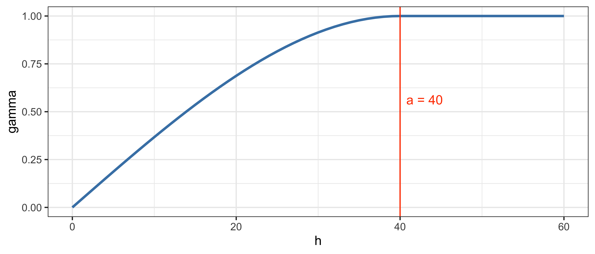

<!-- - Данная модель достигает плато в точке $h = a$. -->


### Экспоненциальная модель

$$\gamma(h) = \begin{cases}
  0, & h = 0; \\
  c_0 + (c-c_0)\Big[1 - \exp\big(\frac{-3h}{a}\big)\Big], & h \neq 0.
\end{cases}$$

$$\gamma(a) = Var[Z(p)] = c_0 + c$$
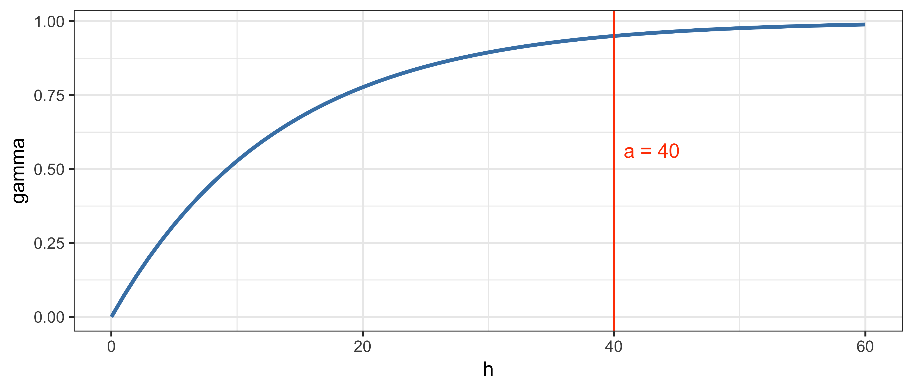

- Данная модель достигает плато асимптотически.
- В точке $h = a$ достигается $95\%$ уровня плато.


### Гауссова модель

$$\gamma(h) = c_0 + c\Bigg[1 - \exp\bigg(\frac{-3h^2}{a^2}\bigg)\Bigg]$$

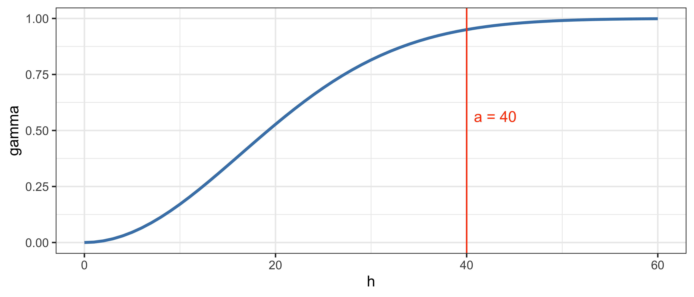

- Данная модель достигает плато асимптотически.
- В точке $h = a$ достигается $95\%$ уровня плато.
- Отличительной чертой этой модели является ее гладкость: параболическое поведение вблизи нуля и асимптотическое приближение к плато. 

### Степенная модель

$$\gamma(h) = \begin{cases}
  0, & h = 0; \\
  c h^\alpha, & h \neq 0.
\end{cases}$$


- Автокорреляция присутствует на всех расстояниях: $a \rightarrow \infty$
- Предположение о стационарности второго порядка не выполняется
- Как правило, это означает наличие тренда в данных

### Эффект самородка (модель наггет)

$$\gamma(h) = \begin{cases}
  0, & h = 0; \\
  c_0, & h \neq 0.
\end{cases}, ~ c_0 = C(0)$$

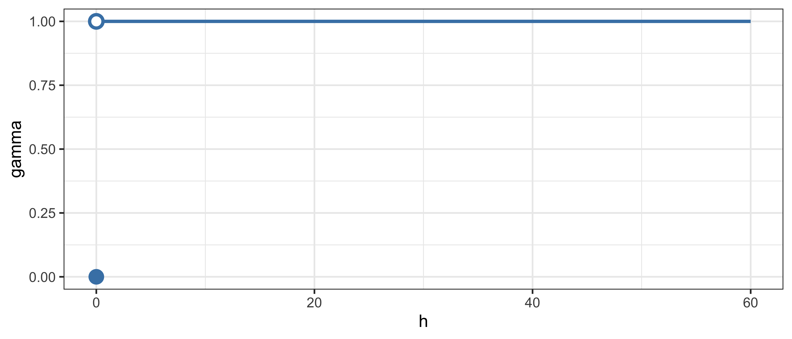

- Наличие у данных вариограммы типа наггет означает отсутствие пространственной корреляции.
- Возможные причины:
  - Абсолютно случайное распределение
  - Мелкомасштабная вариабельность (меньше, чем расстояние между измерениями)
  - Ошибки в измерениях
  - Ошибки в координатах точек

### Диаграмма рассеяния с лагом

__Lagged scatterplot__ — вариант диаграммы рассеяния, на котором показываются значения в точках, расстояние между которыми попадает в заданный интервал 

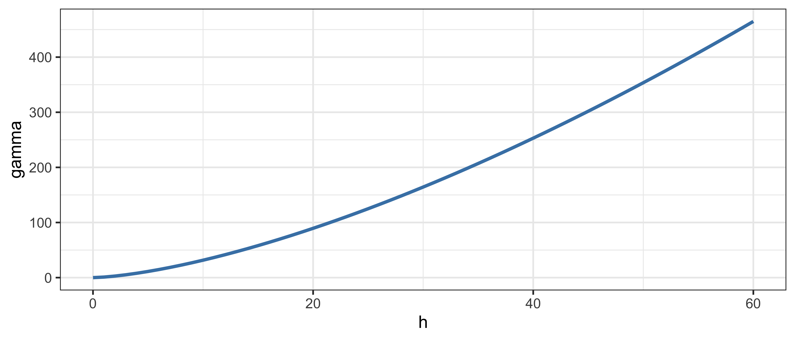

### Вариограммное облако

Квадрат разности значений как функция от расстояния между точками
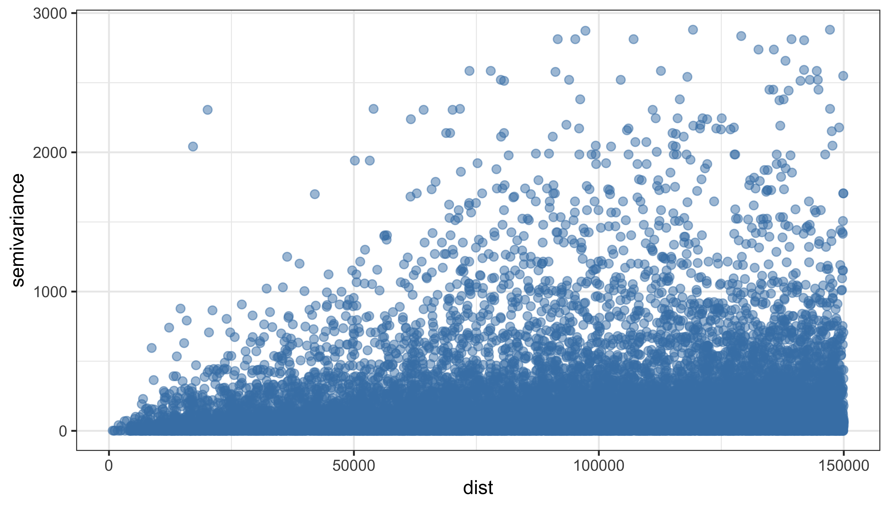
  

### Эмпирическая вариограмма

Эмпирическая вариограмма рассчитывается путем разбения вариограммного облака на интервалы расстояний — __лаги__ — и подсчета среднего значения $\gamma$ в каждом лаге:
  
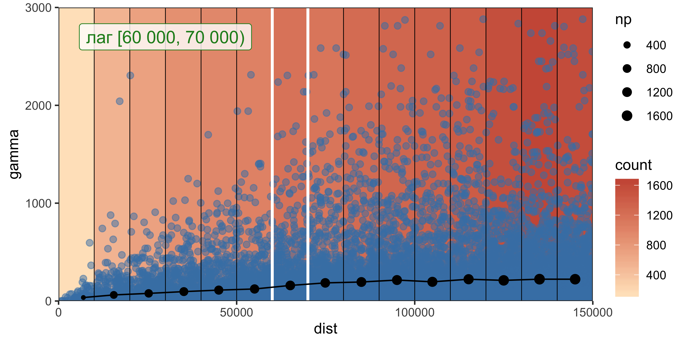

$$\hat{\gamma} = \frac{1}{2N_h} \sum_{x_i - x_j \approx h} \big[z(x_i) - z(x_j)\big]^2$$

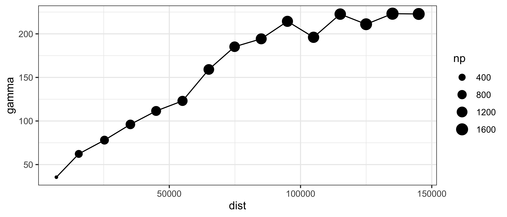
Размер точки означает количество пар значений, которые попали в каждый лаг.

Поскольку вариограмма есть _дисперсия разности значений_, ее рост при увеличении расстояния можно оценить также по увеличению размера «ящика» на диаграмме размаха $\sqrt\gamma$:


### Вариокарта

__Вариокарта__ (_variogram map, variomap_) представляет вариограмму как функцию приращений координат:
$$\hat{\gamma} (\Delta x, \Delta y) = \frac{1}{2N_{\substack{\Delta x\\ \Delta y}}} \sum_{\substack{\Delta x_{ij} \approx \Delta x\\ \Delta y_{ij} \approx \Delta y}} \big[z(p_i) - z(p_j)\big]^2$$

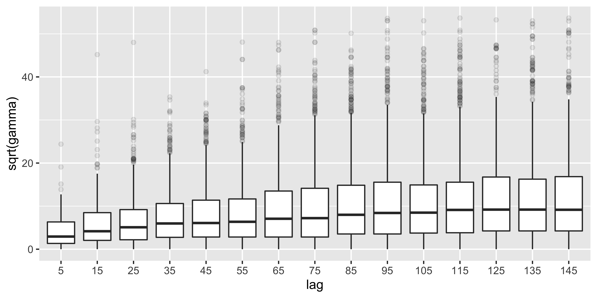

Вариокарта используется для выявления _пространственной анизотропии_. Профиль по линии из центра к краю вариокарты даст эмпирическую вариограмму

### Приближение теоретической модели

__Приближение__ (_fitting_) модели вариограммы предполагает:

1. Выбор теоретической модели
2. Подбор параметров модели: эффект самородка (nugget), радиус корреляции и плато.

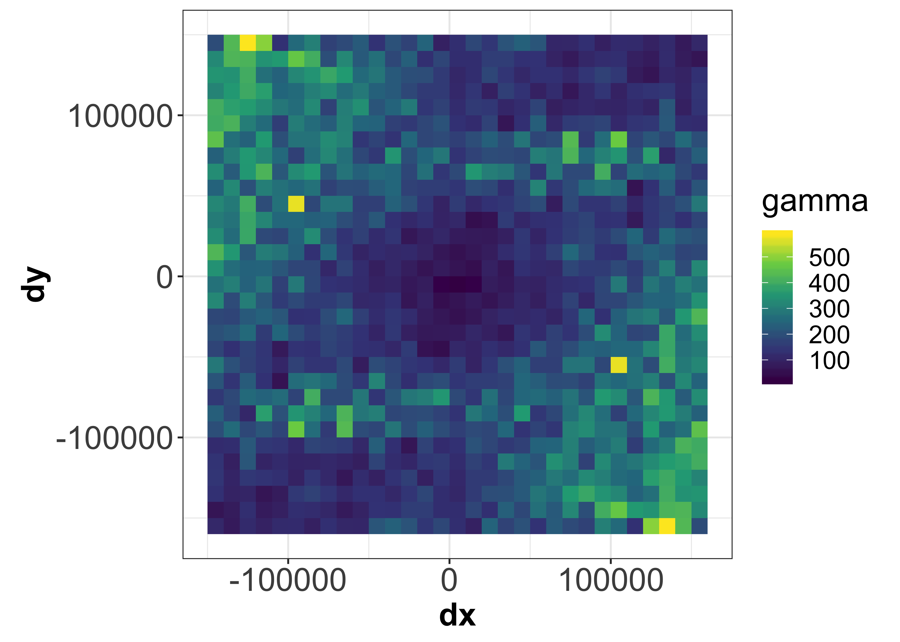

Дана вариограмма семейства $\gamma (h; \mathbf{b})$, где $\mathbf{b} = (b_1, ..., b_k)$ — вектор из $k$ параметров модели. Параметры $\mathbf{b}$ подбираются таким образом, чтобы минимизировать следующий функционал:

$$Q(\mathbf{b}) = \sum_{l=1}^{L} w_l \big[\hat{\gamma}(h_l) - \gamma (h; \mathbf{b})\big]^2,$$

где $\big\{\hat{\gamma} (h_l): l = 1,...,L\big\}$ — значения эмпирической вариограммы для $L$ лагов, вычисленные по $N(h_l)$ векторам.

Веса $w_l$ обычно выбираются исходя из отношения $w_l = N(h_l) / |h_l|$, чтобы придать большее значение коротким расстояниям и лагам с хорошей оценкой.

Минимизация функционала осуществляется итеративно:

1. Процесс начинается с некоторого предположения $\mathbf{b}^{(0)}$
2. На шаге $s$ функция $Q$ аппроксимируется в виде квадратичной формы $Q(\mathbf{b}^{(s)}) \approx \sum_{i=1}^k \sum_{j=1}^k \delta_{ij} b_i b_j$ путем разложения в ряд Тейлора вокруг точки $\mathbf{b}^{(s)}$.
3. Новая точка минимума $\mathbf{b}^{(s+1)}$ находится как минимум квадратичной формы (_этот минимум один_).

Шаги 2-3 повторяются до тех пор, пока значение $Q$ не станет меньше заданного порога.

Сравним результат ручного и автоматического приближения вариограммы:


### Обычный кригинг

Рассмотрим данные по температуре:
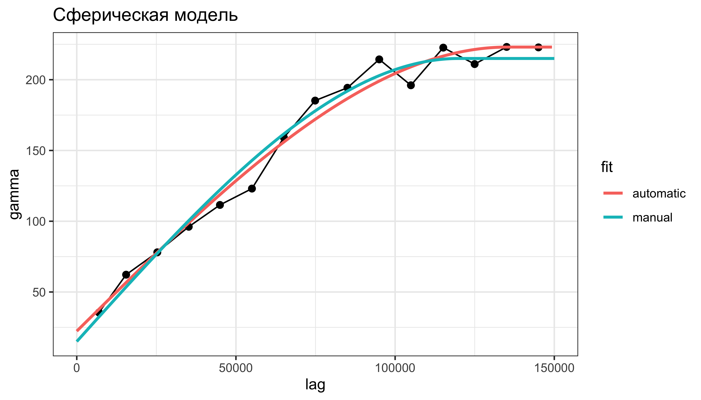

### Обычный кригинг

Проинтерполируем, используя приближенную модель вариограммы:

```r
tempkriged = krige(rain_24~1, rainfall, pts.grid, model = varmd)
```

```
## [using ordinary kriging]
```

```r
head(tempkriged@data)
```

```
##   var1.pred var1.var
## 1  17.97717 83.92330
## 2  18.13687 71.33216
## 3  18.32753 59.94145
## 4  19.32146 51.86200
## 5  22.06599 47.26337
## 6  25.02520 40.47036
```

```r
temps = SpatialPixelsDataFrame(tempkriged, data = tempkriged@data['var1.pred']) %>% raster()
vars = SpatialPixelsDataFrame(tempkriged, data = tempkriged@data['var1.var']) %>% raster()
```

### Оценка и дисперсия кригинга

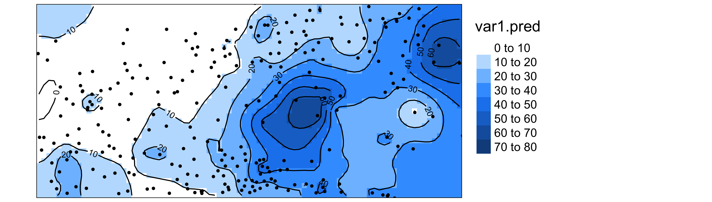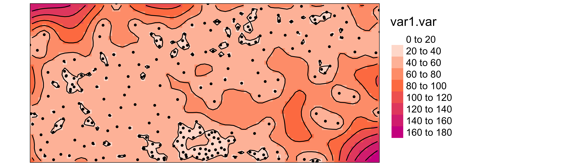

Дисперсия кригинга высока там, где мало данных.

### Кросс-валидация

Для выполнения кросс-валидации воспользуемся функцией `krige.cv`:

```r
cvl = krige.cv(rain_24~1, rainfall, varmd) %>% 
  st_as_sf() %>% 
  mutate(sterr = residual / sqrt(var1.var))

head(cvl %>% st_set_geometry(NULL), 10)
```

```
##    var1.pred var1.var observed     residual      zscore fold       sterr
## 1   5.743730 34.84033      6.0   0.25627005  0.04341669    1  0.04341669
## 2  11.137129 60.24070     10.0  -1.13712865 -0.14650910    2 -0.14650910
## 3   6.929502 47.22732      7.0   0.07049833  0.01025846    3  0.01025846
## 4  23.252858 48.06354      1.0 -22.25285758 -3.20979954    4 -3.20979954
## 5  15.655167 56.76258      1.0 -14.65516724 -1.94517957    5 -1.94517957
## 6  11.794241 44.03055      1.0 -10.79424095 -1.62672846    6 -1.62672846
## 7  11.325378 62.65261      0.1 -11.22537769 -1.41818009    7 -1.41818009
## 8  28.421330 75.24988      0.2 -28.22133030 -3.25330355    8 -3.25330355
## 9   2.340115 58.30350      1.0  -1.34011550 -0.17550719    9 -0.17550719
## 10  3.489972 62.96551      0.2  -3.28997242 -0.41461106   10 -0.41461106
```

### Кросс-валидация

Cтандартизированные ошибки в стационарном случае должны быть распределены нормально:

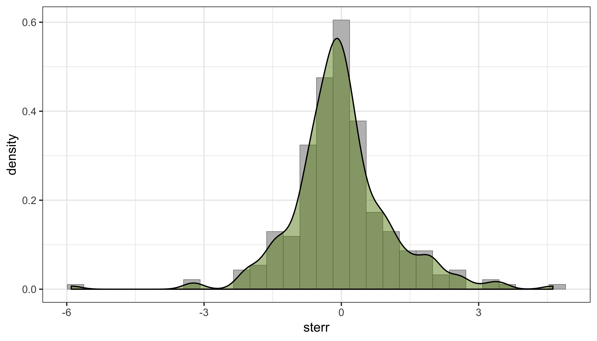


### Кросс-валидация

Ошибки должны быть независимы от значений:


### Кросс-валидация

Облако рассеяния оценки относительно истинных значений должно быть компактным:

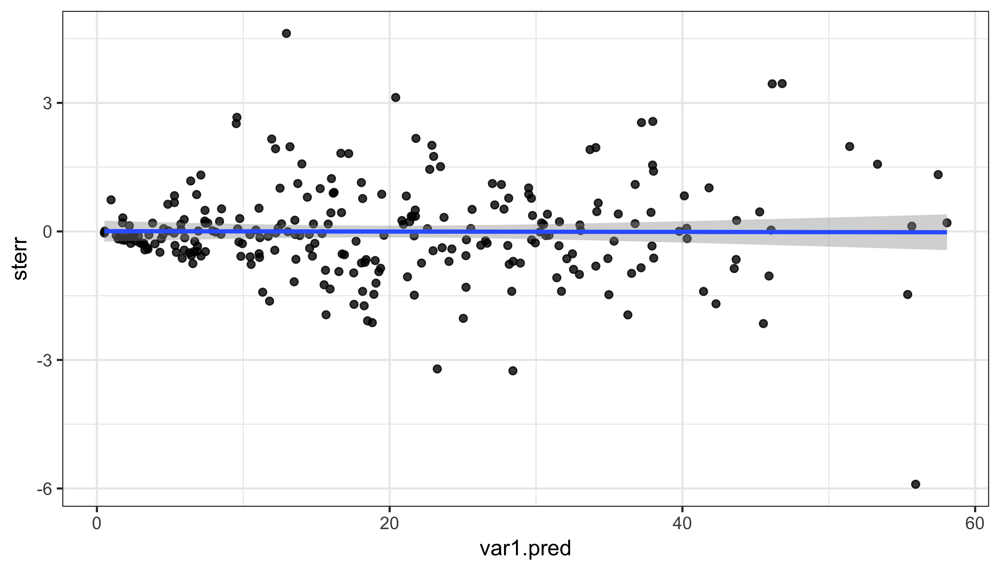

### Кросс-валидация

Пространственная картина стандартизированных ошибок должна быть гомогенной:
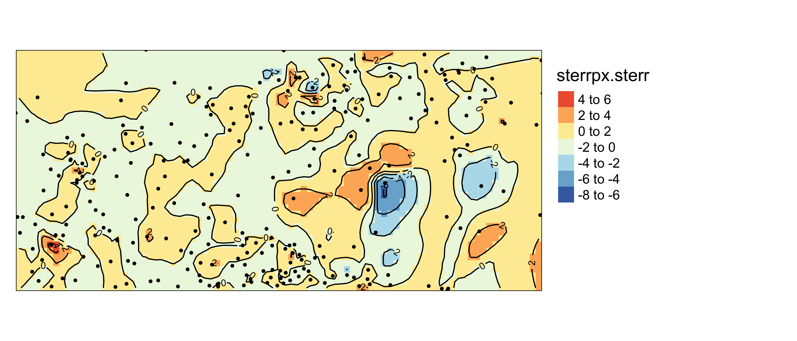

## Краткий обзор {#geostat_review}

Для просмотра презентации щелкните на ней один раз левой кнопкой мыши и листайте, используя кнопки на клавиатуре:
<iframe src="https://tsamsonov.github.io/r-geo-course/slides/14-Geostatistics_slides.html#1" width="672" height="500px"></iframe>

> Презентацию можно открыть в отдельном окне или вкладке браузере. Для этого щелкните по ней правой кнопкой мыши и выберите соответствующую команду.

## Контрольные вопросы и упражнения {#geostat_qt}

### Вопросы {#geostat_q}

### Упражнения {#geostat_t}

----
_Самсонов Т.Е._ **Визуализация и анализ географических данных на языке R.** М.: Географический факультет МГУ, `lubridate::year(Sys.Date())`. DOI: [10.5281/zenodo.901911](https://doi.org/10.5281/zenodo.901911)
----
