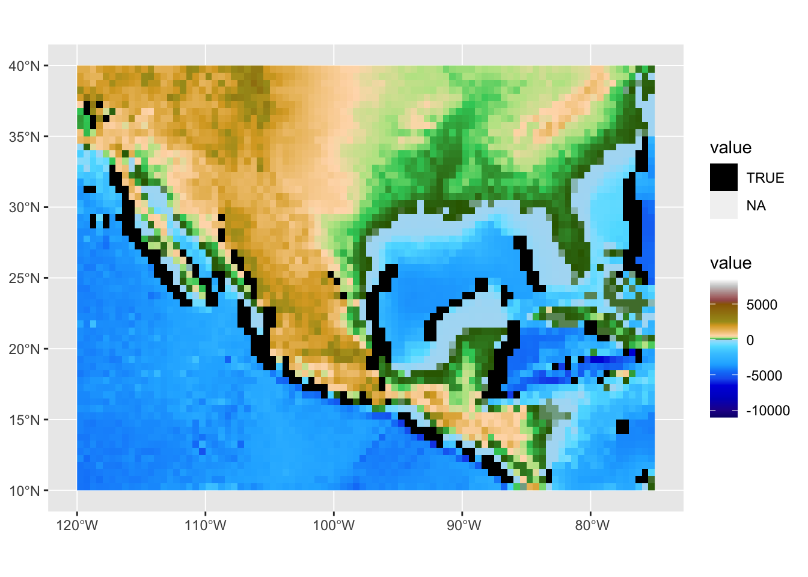
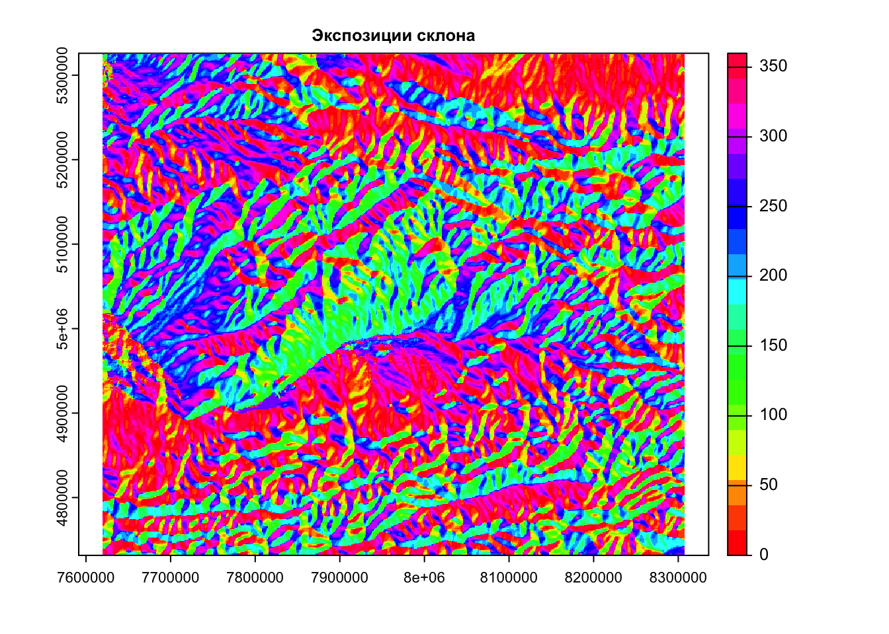
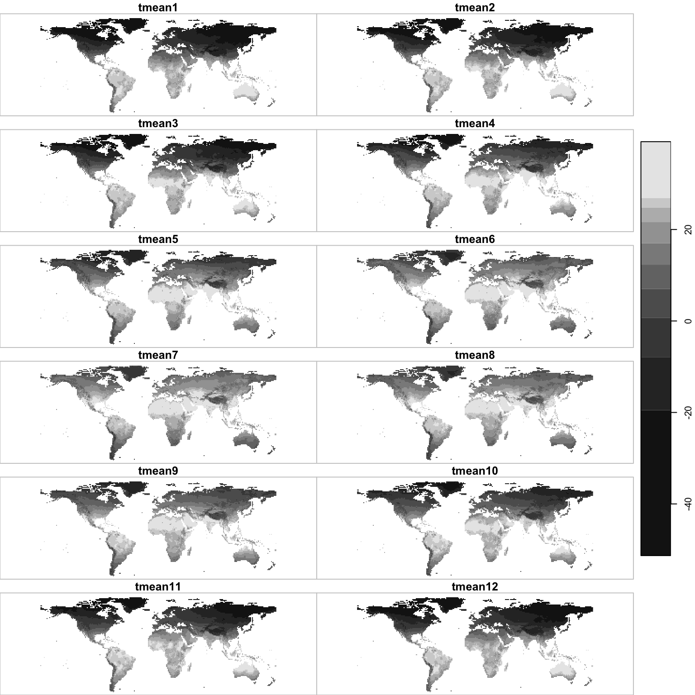
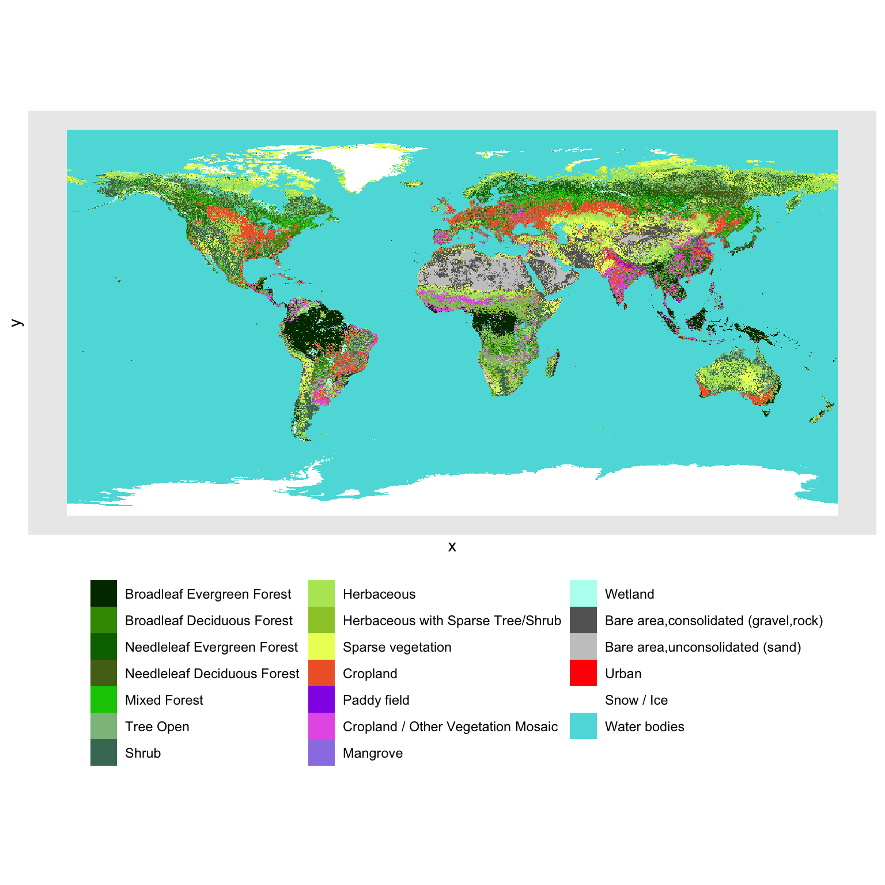
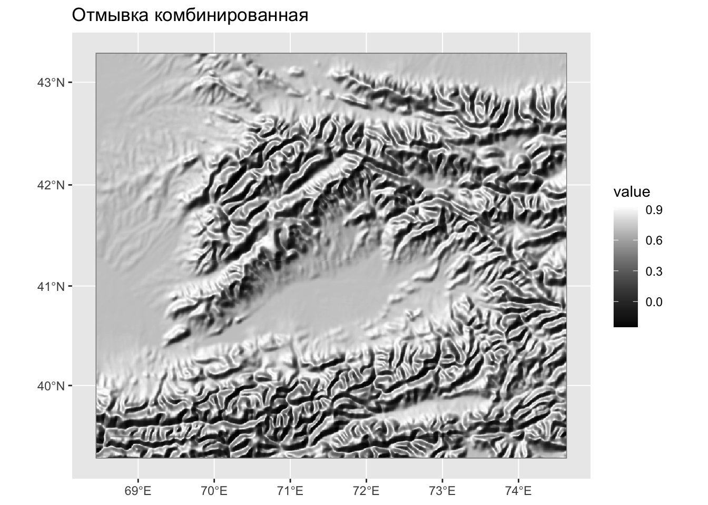
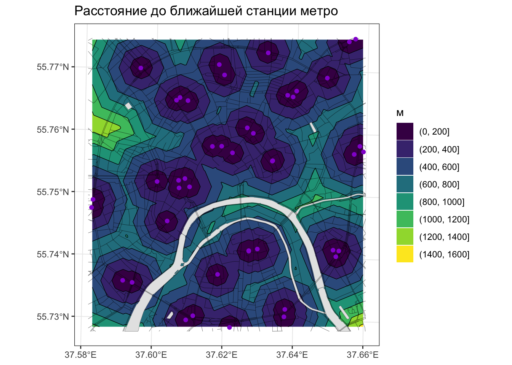
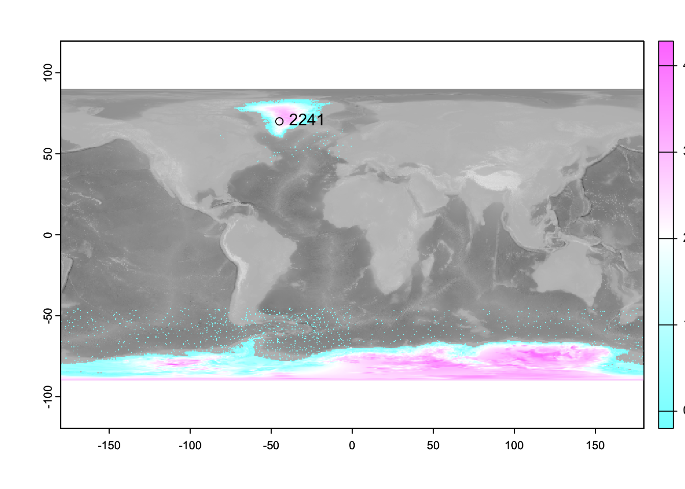
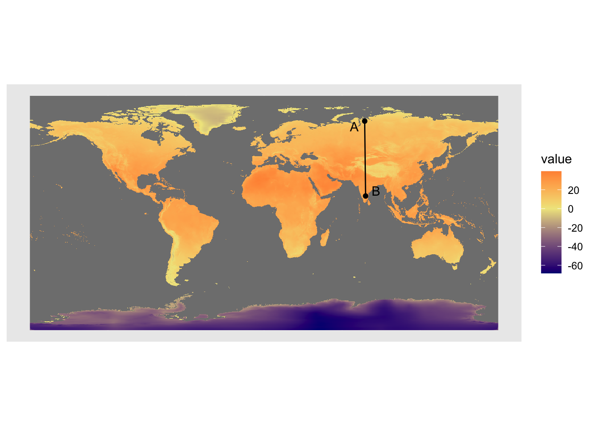
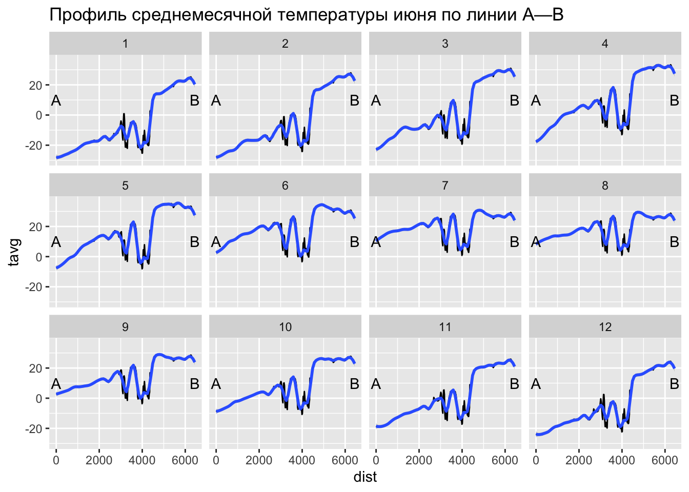

# Растровый анализ {#raster}


## Предварительные условия {-}

Для выполнения кода данной лекции вам понадобятся следующие пакеты:

```r
library(sf)
library(stars)
library(mapview)
library(mapedit)
library(classInt)
library(geosphere)
library(dplyr)
library(tidyr)
library(ggplot2)
library(terra)
library(tidyterra)
library(ggnewscale)
```

## Введение {#raster_intro}

Растровая модель данных представляет собой мощный инструмент абстракции пространственных распределений и выполнения пространственного анализа. На первый взгляд, растр обладает целым рядом ограничений по сравнению с векторной моделью: не позволяет оперировать отдельными объектами, их границами и так далее. Растровые карты и снимки мы часто оцифровываем, выделяя объекты, чтобы на основе них можно было что-то посчитать. Самые первые ГИС были исключительно растровыми, что сейчас воспринимается как архаизм. 

Однако за ширмой ограниченности растровой модели кроются огромные аналитические возможности. Растровая модель обладает внутренней топологией: ее ячейки соприкасаются друг с другом, что позволяет моделировать непрерывные в пространстве и динамические явления (при которых происходит перемещение вещества, энергии или информации в пространстве). Поскольку ячейки растра имеют одинаковый размер, к ним можно применять однотипные операции, которые будут давать предсказуемый результат вне зависимости от конкретной локации в пределах растра. Это также позволяет сделать обработку растра очень быстро.

## Модель растровых данных terra

Пакет terra содержит модели данных для растровых и векторных данных. Растровые данные создаются посредством функции `rast`:


```r
# Чтение данных
(bed = rast('data/etopo1_bed.tif'))
## class       : SpatRaster 
## dimensions  : 360, 720, 1  (nrow, ncol, nlyr)
## resolution  : 0.5, 0.5  (x, y)
## extent      : -180, 180, -90, 90  (xmin, xmax, ymin, ymax)
## coord. ref. : lon/lat WGS 84 (EPSG:4326) 
## source      : etopo1_bed.tif 
## name        : etopo1_bed
(ice = rast('data/etopo1_ice.tif'))
## class       : SpatRaster 
## dimensions  : 360, 720, 1  (nrow, ncol, nlyr)
## resolution  : 0.5, 0.5  (x, y)
## extent      : -180, 180, -90, 90  (xmin, xmax, ymin, ymax)
## coord. ref. : lon/lat WGS 84 (EPSG:4326) 
## source      : etopo1_ice.tif 
## name        : etopo1_ice
```


```r
ggplot() +
  geom_spatraster(data = bed) +
  scale_fill_hypso_tint_c(palette = "gmt_globe") +
  ggtitle('ETOPO Bedrock')
```


```r

ggplot() +
  geom_spatraster(data = ice) +
  scale_fill_hypso_tint_c(palette = "gmt_globe") +
  ggtitle('ETOPO Ice surface')
```


## Растровая алгебра

Существует классификация операций растрового анализа, введенная американским профессором Даной Томлином, которая объединяет их под общим названием "алгебра карт" или "растровая алгебра" [@Tomlin2012]. Предполагая, что обработке подвергается _каждая_ ячейка растра, данная классификация разделяет все операции по охвату относительно текущей ячейки

1. _Локальные_ --- анализируется одна ячейка растра или совпадающие в пространстве ячейки нескольких растров
2. _Фокальные_ --- анализируются все ячейки в окрестности. Окрестность может быть как фиксированной, так и расширенной (expanded), когда ее размер управляется внешними факторами, например множеством объектов, до которых требуется вычислить расстояние. Информация по соседним ячейкам может быть как из исходного растра, так и из внешнего. Фокальные методы алгебры карт также называются _методами анализа соседства_.
3. _Зональные_ --- анализируются все ячейки в пределах зон, определяемых извне (например, вторым растровым слоем).
4. _Глобальные_ --- анализируются все ячейки растра.

### Локальные операции {#raster_local}

Локальные операции связаны с алгебраическими преобразованиями значений в ячейках. Например, цифровую модель высот в футах можно перевести в цифровую модель высот в метрах. Для этого нужно значение в каждой ячейке умножить на $0.3048$. В локальных операциях могут участвовать несколько растров. Например, если у нас есть растровые поверхности плотности населения за разные года, мы можем вычесть одну поверхность из другой, чтобы получить поверхность изменений плотности, выяснить где она увеличилась, уменьшилась или осталось прежней. К локальным операциям относится также оверлей растров, при котором получается взвешенная сумма значений по нескольким растрам. И в том и в другом случае анализируются ячейки с нескольких растров, которые совпадают в пространстве. 

В качестве примера определим мощность покровного оледенения в Антарктике и Гренландии, путем вычитание двух моделей [ETOPO1](https://www.ngdc.noaa.gov/mgg/global/), одна из которых показывает рельеф коренных пород (bedrock), а вторая --- видимый рельеф поверхности (ice surface):


```r
# ЛОКАЛЬНЫЕ ОПЕРАЦИИ
# Вычисление толщины покровного оледенения

#  Береговая линия для ориентировки
countries = read_sf('data/countries.gpkg')

# вычисление разности
ice.depth = ice - bed
ice.depth[ice.depth == 0] = NA

ggplot() +
  geom_spatraster(data = bed) +
  scale_fill_gradient(low = 'black', high = 'white',
                      guide="none") +
  new_scale_fill() +
  geom_spatraster(data = ice.depth) +
  scale_fill_gradient(low = 'white', high = 'navyblue', 
                      na.value = "transparent") +
  geom_sf(data = countries, fill = NA) +
  labs(title = 'Мощность покровного оледенения',
         fill = '[м]')
```


### Фокальные операции {#raster_focal}

В фокальных операциях участвует не только сама ячейка или совпадающие с ней ячейки других растров, но также ячейки, находящиеся в некоторой окрестности (опять же, в одном или нескольких растрах одновременно). Данный вид анализа подразделяется на две категории: фокальный анализ с фиксированной окрестностью и с расширенной окрестностью.

#### Фиксированная окрестность {#raster_focal_fixed}

В общем случае фиксированная окрестность может иметь различную форму, однако наиболее часто используется квадратная окрестность размером $3\times3$:

<div class="figure">

<p class="caption">(\#fig:unnamed-chunk-5)Виды растровых окрестностей. Темной точкой выделена анализируемая ячейка</p>
</div>

Фокальные операции с фиксированной окрестностью — привычное дело в обработке изображений. Они работают по принципу "плавающего окна". Выбранная окрестность (квадратная, круглая и т.д.) представляется в виде матрицы коэффициентов — так называемого ядра свёртки (convolution kernel). Далее эта матрица перемещается, позиционируясь последовательно над каждой ячейкой растра, и значение в этой ячейке заменяется на взвешенную сумму значений ячеек в окрестности, умноженных на соответствующие коэффициенты ядра свертки. Например, если ядро состоит из единиц, то будет посчитана обычная сумма. 

С помощью фокального анализа можно выполнить сглаживание изображения, которое убирает из него мелкие детали (высокочастотные составляющие яркостного сигнала). В качестве такого изображения может быть цифровая модель рельефа или космический снимок. Чтобы выполнить сглаживание, коэффициенты должны быть такими, чтобы получаемая взвешенная сумма осредняла значения в соседних ячейках. Самый простой вариант --- это рассчитать среднее арифметическое. В этом случае коэффициенты ядра свертки будут равны $1/k$, где $k$ --- количество ячеек в окрестности. Для матрицы $3\times3$ они будут равны, соответственно $1/9$:


```r
# ФОКАЛЬНЫЕ ОПЕРАЦИИ

# Вырежем кусок из ЦМР
dem = crop(ice, ext(-120, -75, 10, 40))
plot(dem)
```


```r

# Среднее
wgt = matrix(c(1, 1, 1,
               1, 1, 1,
               1, 1, 1) / 9, 
              nrow = 3)
# на самом деле проще написать так:
# wgt = matrix(1/9, 3, 3), но полная форма записана для наглядности

# выполним обработку ЦМР с помощью фокального фильтра
filtered = focal(dem, w = wgt)

ggplot() +
  geom_spatraster(data = c(dem, filtered)) +
  scale_fill_hypso_tint_c(palette = "etopo1") + 
  facet_wrap(~lyr)
```


Более мягким эффектом сглаживания, который к тому же не нарушает дифференцируемость поверхности, является гауссово сглаживание. Коэффициенты в матрице Гаусса убывают от центральной ячейки к краям матрицы по закону Гаусса-Лапласа, что позволяет придать центральной ячейке более высокий вес по сравнению с ячейками, располагающимися на краю анализируемой окрестности:

```r
# Гауссово (параметр 0.5 - это стандартное отклонение в единицах измерения растра)
wgt = focalMat(dem, 0.5, "Gauss")
filtered = focal(dem, wgt)

ggplot() +
  geom_spatraster(data = c(dem, filtered)) +
  scale_fill_hypso_tint_c(palette = "etopo1") + 
  facet_wrap(~lyr)
```


Еще одна интересная область применения фильтрации --- это обнаружение границ (change detection). Границы на изображении возникают в тех местах, где его яркость резко меняет свое значение (в одном или нескольких каналах). Например, на фотографии контур лица может быть распознан по перепаду яркости между его изображением и фоном (если он имеет существенно отличный цвет). Поскольку перепад яркости соответствует экстремальным значениям производной поверхности (отрицательным или положительным), его также можно определить путем фокального анализа, а затем отсечь ячейки растра, в которых значение этой производной по модулю превышает заданный порог (то есть, имеет необходимый контраст). 

Рассмотрим, как можно выделить уступы континентального склона океана путем применения фильтра Собеля для выделения границ: 

```r
# Матрица Собеля:
wgt = matrix(c(1, 2, 1,
                0, 0, 0,
               -1,-2,-1) / 4, 
              nrow=3)
filtered = focal(dem, wgt)

# Это поверхность производных:

ggplot() +
  geom_spatraster(data = filtered) +
  scale_fill_gradient2(low = 'navyblue', high = 'darkred') +
  ggtitle('Производная поверхности')
```


```r

# Отберем все ячейки, обладающие высокими значениями производных
faults = abs(filtered) > 1500
faults[faults == 0] = NA

ggplot() +
  geom_spatraster(data = dem) +
  scale_fill_hypso_tint_c(palette = "etopo1") + 
  ggnewscale::new_scale_fill() +
  geom_spatraster(data = faults) +
  scale_fill_discrete(type = 'black', na.value = "transparent")
```



Еще один распространенный случай использования фокальных операций --- это морфометрический анализ поверхностей. Квадратная окрестность $3\times3$ вокруг каждой ячейки формирует локальную поверхность, производные которой дают представление об уклоне, экспозиции и прочих морфометрических параметрах. Их можно вычислить с помощью функции `terrain()` из пакета `raster`:


```r
# Морфометрия рельефа — фиксированное соседство
dem = rast('data/dem_fergana.tif')

ggplot() +
  geom_spatraster(data = dem) +
  scale_fill_hypso_c() +
  labs(title = 'Ферганская долина', fill = 'Высота, [м]')
```


```r

# углы наклона
slope = terrain(dem, 'slope', unit = 'degrees')

ggplot() +
  geom_spatraster(data = slope) +
  scale_fill_gradient(low = 'lightcyan', high = 'darkred') +
  labs(title = 'Углы наклона', fill = 'Градусы [°]')
```


```r

# экспозиция
aspect = terrain(dem, 'aspect', unit = 'degrees')

ggplot() +
  geom_spatraster(data = aspect) +
  scale_fill_gradientn(colors = rainbow(9), values = 0:8 / 8) +
  labs(title = 'Экспозиция', fill = 'Градусы [°]')
```



Вычисление производных поверхности позволяет не только исследовать рельеф, но также строить его изображения. Например, хорошо знакомую всем по картам аналитическую отмывку рельефа (_hillshade_). Яркость поверхности в этом способе изображения зависит от угла между направлением на источник освещения (откуда светит Солнце) и нормалью к поверхности. Нормаль можно вычислить как напрямую через производные поверхности, так и восстановить на основе значений угла наклона и экспозиции в точке, что и используется в пакете __raster__. Обратите внимание на то, что для того чтобы повысить наглядность (контрастность) изображения, мы умножаем высоты рельефа на 20. Это стандартная практика для мелкомасштабных карт:

```r
# отмывка
slope_rad10 = terrain(dem * 10, 'slope', 
                 unit = 'radians')

slope_rad5 = terrain(dem * 5, 'slope', 
                 unit = 'radians')

aspect_tad = terrain(dem, 'aspect', 
                  unit = 'radians')
                 
# параметры angle и direction функции hillShade определяют азимут и высоту источника освещения:

hill = shade(slope_rad10, aspect_tad, angle = 45, direction = 315)

hill_vert = shade(slope_rad5, aspect_tad, angle = 90, direction = 315)

hill_comb = hill * hill_vert

ggplot() +
  geom_spatraster(data = hill) +
  scale_fill_gradient(low = 'black', high = 'white') +
  ggtitle('Отмывка классическая')
```



```r

ggplot() +
  geom_spatraster(data = hill_vert) +
  scale_fill_gradient(low = 'black', high = 'white') +
  ggtitle('Отмывка отвесная')
```



```r

ggplot() +
  geom_spatraster(data = hill_comb) +
  scale_fill_gradient(low = 'black', high = 'white') +
  ggtitle('Отмывка комбинированная')
```



#### Расширенная окрестность {#raster_focal_extended}

Расширенность окрестности означает, что она определяется не фиксированным шаблоном, а условием, которое должно выполниться для того, чтобы анализ в ячейке считался выполненным. Типичный пример анализа на основе расширенной окрестности — это операции, основанные на вычислении расстояний на растровой матрице, такие как аллокация, определение кратчайшего пути на поверхности сопротивления, и собственно, само вычисление расстояние.

В мелкомасштабных тематических атласах часто можно встретить карты доступности той или иной географической локации, которые в форме изолиний показывают время движения до ближайшего населенного пункта. Эти изолинии можно построить по растровой поверхности, в каждой ячейке которой зафиксировано расстояние до ближайшего населенного пункта.

Рассмотрим построение аналогичной поверхности на примере доступности станций метро (по расстоянию). Для этого нам понадобится представить растр в виде матрицы точек, рассчитать для этих точек расстояния до ближайших станций метро и присвоить эти значения выходному растру:

```r
# Определение Евклидовых расстояний — расширенное соседство

# Чтение данных
roads = read_sf("data/roads.gpkg") # Дороги
poi = read_sf("data/poi_point.gpkg") # Точки интереса
rayons = read_sf("data/boundary_polygon.gpkg") # Границы районов
stations = read_sf("data/metro_stations.gpkg") # Станции метро
water = read_sf("data/water_polygon.gpkg") # Водные объекты

dist_grid = stations |> 
  rast(resolution = 25) |> 
  rasterize(stations, y = _) |> 
  gridDist(NA)

# Визуализируем результат
ggplot() +
  geom_spatraster_contour_filled(data = dist_grid) +
  geom_spatraster_contour(data = dist_grid, linewidth = 0.25, color = 'black') +
  geom_sf(data = water, linewidth = 0.1) +
  geom_sf(data = roads, linewidth = 0.1) +
  geom_sf(data = stations, color = 'darkviolet') +
  labs(title = 'Расстояние до ближайшей станции метро',
       fill = 'м') +
  theme_bw()
```



### Зональные операции {#raster_zonal}

__Зональные операции__ связаны с агрегированием растровых данных по площадным зонам. В пределах каждой зоны вычисляется одна или несколько характеристик значений анализируемого растра: среднее, максимум и т.д. Как правило, зоны задаются в виде вспомогательного растрового или векторного набора данных. В случае растра каждая ячейка должна содержать идентификатор (номер) зоны, к которой она относится. Совокупность ячеек, имеющих одинаковый идентификатор, определяет территорию, которую покрывает зона с этим идентификатором. Если зоны представлены векторным набором пространственных объектов, то каждый объект (полигон) также должен иметь собственный идентификатор. Теоретически в одном наборе данных может быть несколько пространственно не связанных объектов, относящихся к одной зоне (например, зона экваториального климата состоит из трех ареалов). В этом случае агрегирование данных будет произведено сразу по трем полигонам. Таким образом, количество получаемых в результате зональной статистики значений определяется количеством зон, но может не совпадать с общим количеством полигонов, которыми эти зоны представлены.

В качестве примера рассмотрим вычисление среднеклиматических параметров _WorldClim_ в пределах различных типов земельного покрова (Land Cover), которые доступны в пакете __tmap__:

```r
temp = geodata::worldclim_global(var = "tavg", res = 10, path = tempdir())

data(land, package = 'tmap')
terraland = rast(land['cover'])

pal = c("#003200", "#3C9600", "#006E00", "#556E19", "#00C800", "#8CBE8C",
		   "#467864", "#B4E664", "#9BC832", "#EBFF64", "#F06432", "#9132E6",
		   "#E664E6", "#9B82E6", "#B4FEF0", "#646464", "#C8C8C8", "#FF0000",
		   "#FFFFFF", "#5ADCDC")

ggplot() +
  geom_spatraster(data = terraland) +
  scale_fill_manual(values = pal, guide = guide_legend(ncol = 3), name = NULL) + 
  theme(legend.position = 'bottom')
```


Предварительно необходимо убедиться, что оба растра имеют совпадающий охват (экстент) и пространственное разрешение. Обратите внимание на то, что, поскольку растр земельного покрова категориальный, для его передискретизации необходимо использовать метод ближайшего соседа (_Nearest Neighbor_), который для каждого пиксела нового растра берет значение в ближайшем к нему пикселе исходного растра:

```r
temp
## class       : SpatRaster 
## dimensions  : 1080, 2160, 12  (nrow, ncol, nlyr)
## resolution  : 0.1666667, 0.1666667  (x, y)
## extent      : -180, 180, -90, 90  (xmin, xmax, ymin, ymax)
## coord. ref. : lon/lat WGS 84 (EPSG:4326) 
## sources     : wc2.1_10m_tavg_01.tif  
##               wc2.1_10m_tavg_02.tif  
##               wc2.1_10m_tavg_03.tif  
##               ... and 9 more source(s)
## names       : wc2.1~vg_01, wc2.1~vg_02, wc2.1~vg_03, wc2.1~vg_04, wc2.1~vg_05, wc2.1~vg_06, ... 
## min values  :    -45.8840,   -44.80000,   -57.92575,   -64.19250,   -64.81150,   -64.35825, ... 
## max values  :     34.0095,    32.82425,    32.90950,    34.19375,    36.25325,    38.35550, ...
terraland
## class       : SpatRaster 
## dimensions  : 540, 1080, 1  (nrow, ncol, nlyr)
## resolution  : 0.3333333, 0.3333333  (x, y)
## extent      : -180, 180, -90, 90  (xmin, xmax, ymin, ymax)
## coord. ref. : +proj=longlat +ellps=WGS84 +towgs84=0,0,0,0,0,0,0 +no_defs 
## source(s)   : memory
## categories  : label 
## name        :                      lyr.1 
## min value   : Broadleaf Evergreen Forest 
## max value   :               Water bodies

(cover = project(terraland, temp, method = 'near'))
## class       : SpatRaster 
## dimensions  : 1080, 2160, 1  (nrow, ncol, nlyr)
## resolution  : 0.1666667, 0.1666667  (x, y)
## extent      : -180, 180, -90, 90  (xmin, xmax, ymin, ymax)
## coord. ref. : lon/lat WGS 84 (EPSG:4326) 
## source(s)   : memory
## categories  : label 
## name        :                      lyr.1 
## min value   : Broadleaf Evergreen Forest 
## max value   :               Water bodies
# используем 'near', поскольку растр категориальный
```

Для вычисления средней температуры за каждый месяц в пределах каждой зоны земельного покрова выполним следующую последовательность действий:

```r
stats = zonal(temp, cover, mean, na.rm = TRUE)
head(stats)
##                         lyr.1 wc2.1_10m_tavg_01 wc2.1_10m_tavg_02
## 1  Broadleaf Evergreen Forest        23.5782137        23.8492299
## 2  Broadleaf Deciduous Forest         0.5019552         2.0665998
## 3 Needleleaf Evergreen Forest       -11.7157410        -9.8924234
## 4 Needleleaf Deciduous Forest       -25.9428218       -22.8029979
## 5                Mixed Forest       -14.7891522       -12.3889821
## 6                   Tree Open        -0.7002717         0.8318519
##   wc2.1_10m_tavg_03 wc2.1_10m_tavg_04 wc2.1_10m_tavg_05 wc2.1_10m_tavg_06
## 1         24.162432         24.232968         23.998414          23.42082
## 2          6.017629         11.021756         15.056588          17.97374
## 3         -4.084735          2.387608          8.726566          14.34026
## 4        -15.169831         -5.111337          4.186215          11.81849
## 5         -6.124290          1.950279          8.925499          14.36811
## 6          4.560077          9.107631         13.256367          16.56003
##   wc2.1_10m_tavg_07 wc2.1_10m_tavg_08 wc2.1_10m_tavg_09 wc2.1_10m_tavg_10
## 1          23.12427          23.55343         23.934943         24.119599
## 2          19.47548          18.93909         16.137864         11.575879
## 3          17.06335          15.17327         10.227151          3.330671
## 4          14.99470          12.45082          5.860229         -4.079028
## 5          16.84991          15.02540          9.722261          2.786417
## 6          18.08441          17.22145         14.473682          9.889385
##   wc2.1_10m_tavg_11 wc2.1_10m_tavg_12
## 1         23.943348        23.6360025
## 2          5.903911         1.9374914
## 3         -4.505279        -9.4876591
## 4        -16.345332       -23.2874576
## 5         -5.693239       -12.0065982
## 6          4.082941         0.6377923

zonal_stats = stats |> 
  rename(cover = 1) |> 
  pivot_longer(-cover, 
               names_to = 'month', values_to = 'tavg', 
               names_prefix = 'wc2.1_10m_tavg_', 
               names_transform = as.integer) |> 
  mutate(month = ordered(month, 1:12, month.abb))
head(zonal_stats)
## # A tibble: 6 × 3
##   cover                      month  tavg
##   <chr>                      <ord> <dbl>
## 1 Broadleaf Evergreen Forest Jan    23.6
## 2 Broadleaf Evergreen Forest Feb    23.8
## 3 Broadleaf Evergreen Forest Mar    24.2
## 4 Broadleaf Evergreen Forest Apr    24.2
## 5 Broadleaf Evergreen Forest May    24.0
## 6 Broadleaf Evergreen Forest Jun    23.4
```

Визуализируем полученные результаты:

```r
ggplot(zonal_stats) +
  geom_line(aes(x = month, y = tavg, 
                color = cover, group = cover), size = 1) +
  scale_color_manual(values = pal)
```


Перед вычислением целесообразно разделить растр землепользования на северное и южное полушарие (т.к. ход температур в них противоположный):

```r

cover_north = crop(cover, ext(-180, 180, 0, 90))
cover_south = crop(cover, ext(-180, 180, -60, 0))

temp_north = crop(temp, ext(-180, 180, 0, 90))
temp_south = crop(temp, ext(-180, 180, -60, 0))

mtemp_north_tidy = zonal(temp_north, cover_north, mean, na.rm = TRUE) |>  
  rename(cover = 1) |> 
  pivot_longer(-cover, 
               names_to = 'month', values_to = 'tavg', 
               names_prefix = 'wc2.1_10m_tavg_', 
               names_transform = as.integer) |> 
  mutate(month = ordered(month, 1:12, month.abb),
         hemisphere = 'north')

mtemp_south_tidy = zonal(temp_south, cover_south, mean, na.rm = TRUE) |>  
  rename(cover = 1) |> 
  pivot_longer(-cover, 
               names_to = 'month', values_to = 'tavg', 
               names_prefix = 'wc2.1_10m_tavg_', 
               names_transform = as.integer) |> 
  mutate(month = ordered(month, 1:12, month.abb),
         hemisphere = 'south')

mtemp_tidy2 = bind_rows(mtemp_north_tidy, mtemp_south_tidy)

ggplot(mtemp_tidy2) +
  geom_line(aes(x = month, y = tavg, 
                color = cover, group = cover), 
            size = 1) +
  scale_color_manual(values = pal) +
  facet_wrap(~hemisphere, ncol = 1)
```


### Глобальные операции {#raster_global}

Глобальные операции охватывают все ячейки растра. По сути, можно говорить, что это частный случай зональной операции, когда зона одна и покрывает растр целиком. В пакете raster для расчета глобальных статистик можно использовать функцию `global()`, передав ей название растра и агрегирующей функции:

```r
global(temp_north, max, na.rm = T) 
global(temp_south, min, na.rm = T) 
```

## Извлечение данных {#raster_extract}

Растровая модель данных обеспечивает сплошное покрытие территории (с дискретностью, определяемой размером ячейки). В то же время, достаточно часто требуется получить значения растра в заданных местоположениях. Местоположения могут быть как конкретными объектами (например, точками почвенных разрезов), так и абстрактными географическими локациями, для которых известны координаты.

Для извлечения растровых данных можно воспользоваться функцией `extract()`. Получать данные можно как по координатам (записанным в фрейм данных), так и используя пространственные объекты класса `Spatial`. Например, узнаем мощность покровного оледенения в точке в центре Гренландии:

```r
pnt = tibble(
  x = -45, y = 70,
  z = terra::extract(ice.depth, bind_cols(x,y))[, 2]
)

ggplot() +
  geom_spatraster(data = bed) +
  scale_fill_gradient(low = 'black', high = 'white',
                      guide="none") +
  new_scale_fill() +
  geom_spatraster(data = ice.depth) +
  scale_fill_gradient(low = 'white', high = 'navyblue', 
                      na.value = "transparent") +
  geom_point(aes(x, y), pnt, size = 2, color = 'red') +
  geom_text(aes(x, y, label = z), pnt, fontface = 'bold',
            vjust = 'bottom', hjust = 'left',
            nudge_x = 3, nudge_y = 3) +
  labs(title = 'Мощность покровного оледенения',
       fill = '[м]')
```


Одна из наиболее распространенных задач по извлечению растровых данных — это построение профиля вдоль заданной линии. Воспользуемся интерактивным редактором для проведения линии профиля

```r
mp = mapview(temp$tmean6)
profile = mapedit::drawFeatures(mp)
```


```r
temprof = terra::extract(temp, profile, cells = TRUE, xy = TRUE)
```

Для построения линии профиля далее нам необходимо преобразовать идентификаторы ячеек растра в расстояние от начала профиля:

```r
tempdf = temprof %>%
  mutate(dist = 0.001 * c(0, dplyr::select(., x, y) |>  
                             geosphere::distGeo() |> 
                             cumsum() |> 
                             head(-1))) |>  
  select(-c(x, y, cell, ID)) |> 
  pivot_longer(-dist, 
               names_to = 'month', values_to = 'tavg', 
               names_prefix = 'wc2.1_10m_tavg_', 
               names_transform = as.integer)

pts = profile |>   
  st_cast('POINT') %>%
  bind_cols(st_coordinates(.)) |>  
  mutate(label = c('A', 'B'))

ggplot() +
  geom_spatraster(data = temp$wc2.1_10m_tavg_07) +
  scale_fill_gradient2(low = 'navyblue', 
                       mid = 'khaki', 
                       high = 'orangered') +
  geom_sf(data = profile) +
  geom_sf(data = pts) +
  ggrepel::geom_text_repel(data = pts, aes(X, Y, label = label)) +
  labs(x = NULL, y = NULL)
```



```r

ggplot(tempdf, aes(x = dist, y = tavg)) +
  geom_line() +
  geom_smooth(span = 0.1) +
  annotate('text', x = 0, y = 10, label = 'A') +
  annotate('text', x = max(tempdf$dist), y = 10, label = 'B') +
  ggtitle('Профиль среднемесячной температуры июня по линии A—B') +
  facet_wrap(~month)
```



## Краткий обзор {#temporal_review}

Для просмотра презентации щелкните на ней один раз левой кнопкой мыши и листайте, используя кнопки на клавиатуре:
<iframe src="https://tsamsonov.github.io/r-geo-course-slides/15_Raster.html#1" width="100%" height="390px" data-external="1"></iframe>

> Презентацию можно открыть в отдельном окне или вкладке браузере. Для этого щелкните по ней правой кнопкой мыши и выберите соответствующую команду.

## Контрольные вопросы и упражнения {#questions_tasks_raster}

### Вопросы {#questions_raster}

1. Дайте описание локальных, фокальных, зональных и глобальных операций растровой алгебры. Приведите примеры использования данных типов операций.
1. Каким требованиям должна отвечать геометрия растров, участвующих в локальных и зональных операциях?
1. В чем заключается отличие фокальных операций с фиксированной и расширенной окрестностью?
1. Чем отличается геометрия растра до и после применения фокальной операции?
1. Какая функция пакета __raster__ реализует возможности фокальной обработки растров?
1. Какой эффект оказывает сглаживающая фильтрация на значения растра?
1. Какие виды производных морфометрических величин позволяет получать функция `terrain()` из пакета __raster__?
1. Какие два растра необходимо рассчитать для построения аналитической отмывки средствами функции `terrain()`?
1. Опишите последовательность действий, которую необходимо выполнить для построения растра __Евклидовых расстояний__ от заданных объектов?
1. Какой метод интерполяции необходимо использовать для передискретизации категориальных растров? В чем заключается принцип его действия?
1. Какая функция пакета __raster__ используется для выполнения зональных операций? Какой тип результата она возвращает?
1. Опишите возможности функции `extract()` по извлечению информации из растровых данных. В какой формате можно задать анализируемые локации? Что будет результатом вызова этой функции в зависимости от формата входных данных?
1. Опишите последовательность действий, которую необходимо выполнить для построения профиля растровой поверхности средствами __R__. 
1. Можно ли построить профиль по растру, имеющему привязку в географической системе координат (координаты выражены градусах)? Если да, то как добиться того, чтобы расстояния между точками профиля были посчитаны в метрических единицах?
1. Опишите способ, с помощью которого можно осуществить фильтрацию растра (превратить его в растр `TRUE`/`FALSE`) и маскирование растра (заменить ненужные ячейки на NA).

### Упражнения {#tasks_raster}

1. _Индекс континентальности Хромова_ рассчитывается по формуле $K = (A - 5.4 \sin \phi)/A$, где $A$ — годовая амплитуда хода температуры, $\phi$ — широта точки. Используя данные __WorldClim__, рассчитайте растр индекса континентальности на территорию суши и нанесите его на карту средствами __tmap__.

    > __Подсказка:__ используйте функцию `xyFromCell()`, чтобы получить широты всех ячеек растра температур. Далее создайте новый растр и запишите в него широты в качестве значений. Растры минимальных и максимальных значений из стека растров можно получить, используя обычные статистические функции `min()` и `max()`.

1. Постройте растр, который содержит расстояние до береговой линии. Используйте данные __Natural Earth__. Задайте грубое разрешение растра, чтобы расчеты не производились долго (100 x 50 ячеек будет достаточно). Где находится самая удаленная от берега точка на суше? А самая удаленная точка на океане? Постройте карту, которая отображает полученный растр и береговую линию.

1. Рассчитайте морфометрические коэффициенты  TPI, TRI и roughness для [цифровой модели рельефа Ферганской долины](https://github.com/tsamsonov/r-geo-course/blob/master/data/dem_fergana.tif), которая использовалась в текущей лекции. В чем их суть? Изучите справку к инструменту `terrain()`.

1. В пакете __tmap__ содержится растровый каталог `land`, включающий в себя растр `elevation`. Используя пакет __mapedit__, оцифруйте произвольную линию и постройте средствами __ggplot__ профиль рельефа вдоль этой линии.

----
_Самсонов Т.Е._ **Визуализация и анализ географических данных на языке R.** М.: Географический факультет МГУ, `lubridate::year(Sys.Date())`. DOI: [10.5281/zenodo.901911](https://doi.org/10.5281/zenodo.901911)
----
