# Растровый анализ {#raster}


## Предварительные условия {-}

Для выполнения кода данной лекции вам понадобятся следующие пакеты:

```r
library(sf)
library(sp)
library(tmap)
library(stars)
library(raster)
library(mapview)
library(mapedit)
library(lattice)
library(classInt)
library(geosphere)
library(tidyverse)
```

## Введение {#raster_intro}

Растровая модель данных представляет собой мощный инструмент абстракции пространственных распределений и выполнения пространственного анализа. На первый взгляд, растр обладает целым рядом ограничений по сравнению с векторной моделью: не позволяет оперировать отдельными объектами, их границами и так далее. Растровые карты и снимки мы часто оцифровываем, выделяя объекты, чтобы на основе них можно было что-то посчитать. Самые первые ГИС были исключительно растровыми, что сейчас воспринимается как архаизм. 

Однако за ширмой ограниченности растровой модели кроются огромные аналитические возможности. Растровая модель обладает внутренней топологией: ее ячейки соприкасаются друг с другом, что позволяет моделировать непрерывные в пространстве и динамические явления (при которых происходит перемещение вещества, энергии или информации в пространстве). Поскольку ячейки растра имеют одинаковый размер, к ним можно применять однотипные операции, которые будут давать предсказуемый результат вне зависимости от конкретной локации в пределах растра. Это также позволяет сделать обработку растра очень быстро.

## Растровая алгебра

Существует классификация операций растрового анализа, введенная американским профессором Даной Томлином, которая объединяет их под общим названием "алгебра карт" или "растровая алгебра" [@Tomlin2012]. Предполагая, что обработке подвергается _каждая_ ячейка растра, данная классификация разделяет все операции по охвату относительно текущей ячейки

1. _Локальные_ --- анализируется одна ячейка растра или совпадающие в пространстве ячейки нескольких растров
2. _Фокальные_ --- анализируются все ячейки в окрестности. Окрестность может быть как фиксированной, так и расширенной (expanded), когда ее размер управляется внешними факторами, например множеством объектов, до которых требуется вычислить расстояние. Информация по соседним ячейкам может быть как из исходного растра, так и из внешнего. Фокальные методы алгебры карт также называются _методами анализа соседства_.
3. _Зональные_ --- анализируются все ячейки в пределах зон, определяемых извне (например, вторым растровым слоем).
4. _Глобальные_ --- анализируются все ячейки растра.

### Локальные операции {#raster_local}

Локальные операции связаны с алгебраическими преобразованиями значений в ячейках. Например, цифровую модель высот в футах можно перевести в цифровую модель высот в метрах. Для этого нужно значение в каждой ячейке умножить на $0.3048$. В локальных операциях могут участвовать несколько растров. Например, если у нас есть растровые поверхности плотности населения за разные года, мы можем вычесть одну поверхность из другой, чтобы получить поверхность изменений плотности, выяснить где она увеличилась, уменьшилась или осталось прежней. К локальным операциям относится также оверлей растров, при котором получается взвешенная сумма значений по нескольким растрам. И в том и в другом случае анализируются ячейки с нескольких растров, которые совпадают в пространстве. 

В качестве примера определим мощность покровного оледенения в Антарктике и Гренландии, путем вычитание двух моделей [ETOPO1](https://www.ngdc.noaa.gov/mgg/global/), одна из которых показывает рельеф коренных пород (bedrock), а вторая --- видимый рельеф поверхности (ice surface):

```r
# ЛОКАЛЬНЫЕ ОПЕРАЦИИ
# Вычисление толщины покровного оледенения

# Чтение данных
bed = raster('data/etopo1_bed.tif')
ice = raster('data/etopo1_ice.tif')
countries = st_read('data/countries.gpkg')
## Reading layer `admin_0_map_units' from data source 
##   `/Users/tsamsonov/GitHub/r-geo-course/data/countries.gpkg' 
##   using driver `GPKG'
## Simple feature collection with 183 features and 72 fields
## Geometry type: MULTIPOLYGON
## Dimension:     XY
## Bounding box:  xmin: -180 ymin: -90 xmax: 180 ymax: 83.64513
## Geodetic CRS:  WGS 84
borders = countries %>% st_geometry()

# отображение данных
classes = classIntervals(values(bed), 20)
brks = classes$brks
nclass = length(brks) - 1

plot(bed, 
     breaks = brks, 
     col = gray.colors(nclass),
     main = 'ETOPO Bedrock',
     legend = F)
```

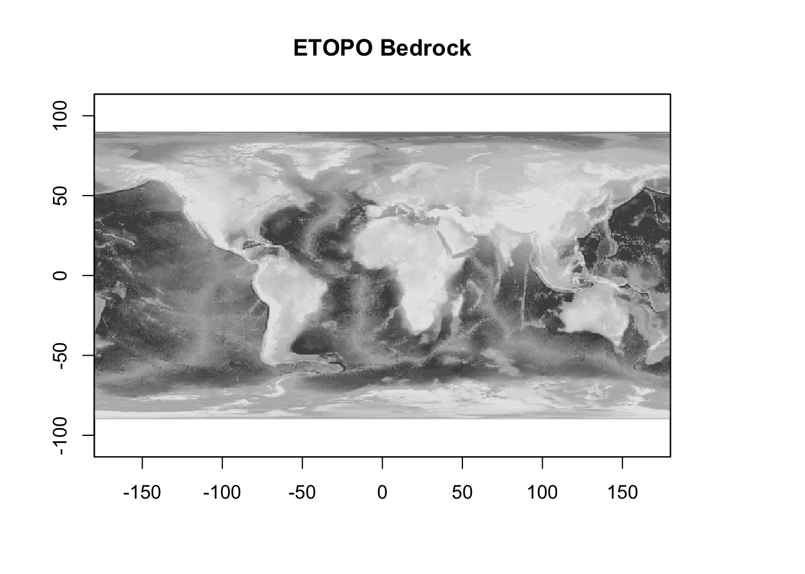

```r
plot(ice, 
     breaks = brks, 
     col = gray.colors(nclass),
     main = 'ETOPO Ice surface',
     legend = F)
```

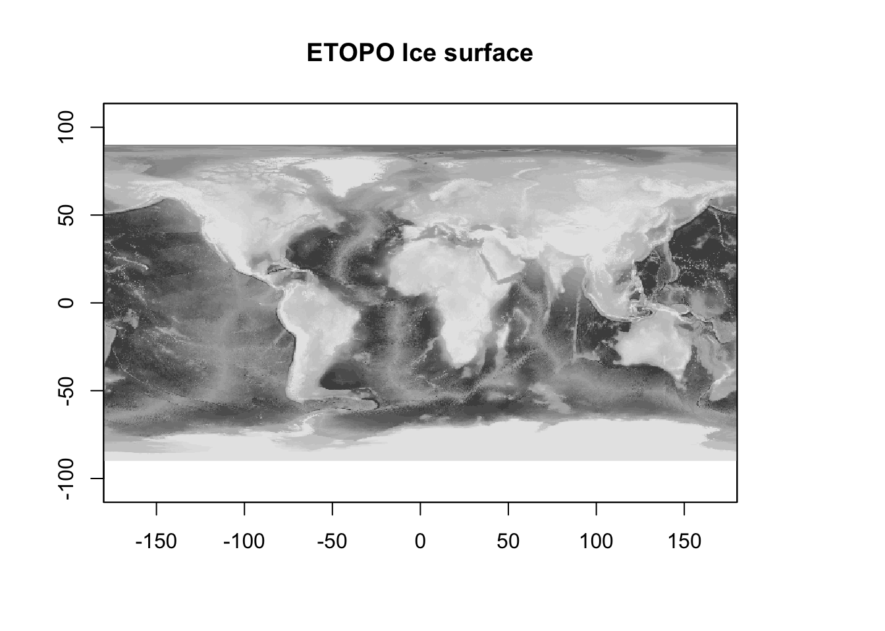

```r

# вычисление разности
ice.depth = ice - bed
plot(ice.depth, 
     col = cm.colors(255),
     main = 'Мощность покровного оледенения')
plot(borders, 
     border = 'black', 
     lwd = 0.5, 
     add = TRUE)
```

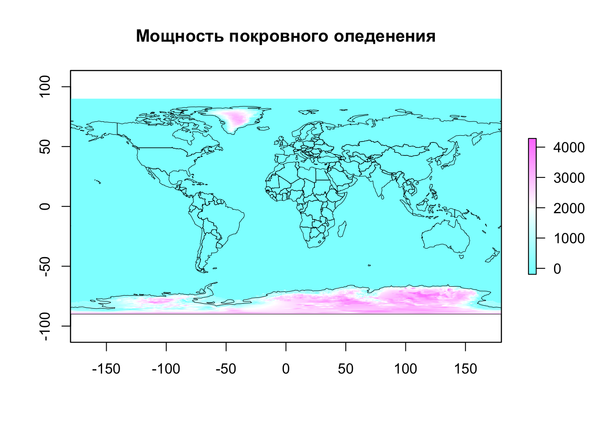

```r

# сделаем пустыми все ячейки, в которых толщина льда равна нулю
ice.depth[ice.depth == 0] = NA

plot(ice.depth, 
     col = cm.colors(255), 
     main = 'Мощность покровного оледенения')
plot(borders, 
     border = 'black', 
     lwd = 0.5, 
     add = TRUE)
```

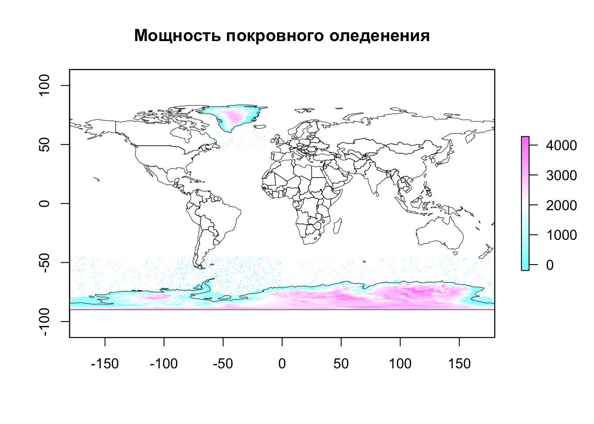

<!-- ### Операции со значениями {#raster_values} -->

<!-- Операции со значениями растров чрезвычайно разнообразны, поэтому подробно они разбираются в одной из последующих глав. Здесь же мы кратко познакомимся с _локальными операциями_ над растром, такими как фильтрация и арифметические преобразования. В локальных операциях каждый пиксел растра анализируется отдельно, независимо от остальных пикселов. Поэтому локальные операции наиболее просты в применении. Но это не означает, что они менее важны, чем более сложные операции. Как раз наоборот: фильтрация и арифметика представляют собой важнейшие операции растровой алгебры.  -->

<!-- Особенность растровой алгебры заключается в том, что растры используются в выражениях как обычные переменные --- это делает преобразования растров простыми и наглядными.  -->

<!-- Чтобы произвести __фильрацию__ (выбор) ячеек по значениям, необходимо соорудить логическое выражение с участием растра. Все пикселы, удовлетворяющие критерию, получат в результирующем растре значение `1`, а все остальные — `0`. Несколько примеров: -->

<!-- ```{r} -->
<!-- below.zero = dem < 0 -->
<!-- plot(below.zero) -->

<!-- highlands = dem > 100 & dem < 500 -->
<!-- plot(highlands) -->

<!-- mountains = dem > 1000 -->
<!-- plot(mountains) -->
<!-- ``` -->

<!-- С помощью локальных операций растровой алгебры можно складывать, вычитать, перемножать и делить растры (а также брать из них квадратные корни, логарифмы, тригонометрические функции), точно так же как это происходит с обычными числами. Соответственно, бывают бинарные (два растра) и унарные (один растр) операции. -->

<!-- > Чтобы получать предсказуемые результаты бинарных операций растровой алгебры, необходимо, чтобы геометрия растров совпадала. -->

<!-- Покажем возможности растровой алгебры на примере определения толщины покровного оледенения. Глобальная цифровая модель рельефа [ETOPO1](https://data.nodc.noaa.gov/cgi-bin/iso?id=gov.noaa.ngdc.mgg.dem:316) поставляется в двух вариантах: Ice Surface (поверхность с учетом покровного оледенения) и Bedrock (подстилающая поверхность). Если вычесть из первой вторую, можно узнать толщину льда в Гренландии и на Антарктиде: -->
<!-- ```{r} -->
<!-- bed = raster('data/world/etopo1_bed.tif') -->
<!-- ice = raster('data/world/etopo1_ice.tif') -->

<!-- ice.depth = ice - bed -->

<!-- plot(ice.depth, col = cm.colors(255)) -->
<!-- plot(outlines, border = 'black', lwd = 0.5, add = TRUE) -->
<!-- ``` -->

<!-- Чтобы маскировать значения растра, необходимо воспользоваться функцией `values()`, которая обнажает список значений растра. Например, можно превратить в NA все пикселы, в которых толщина льда меньше или равна нулю: -->
<!-- ```{r} -->
<!-- ice.depth[ice.depth <= 0] = NA -->

<!-- plot(ice.depth, col = cm.colors(255)) -->
<!-- plot(outlines, border = 'black', lwd = 0.5, add = TRUE) -->
<!-- ``` -->

### Фокальные операции {#raster_focal}

В фокальных операциях участвует не только сама ячейка или совпадающие с ней ячейки других растров, но также ячейки, находящиеся в некоторой окрестности (опять же, в одном или нескольких растрах одновременно). Данный вид анализа подразделяется на две категории: фокальный анализ с фиксированной окрестностью и с расширенной окрестностью.

#### Фиксированная окрестность {#raster_focal_fixed}

В общем случае фиксированная окрестность может иметь различную форму, однако наиболее часто используется квадратная окрестность размером $3\times3$:

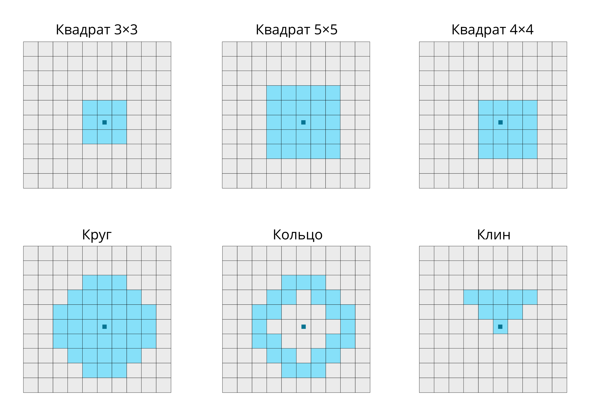

Фокальные операции с фиксированной окрестностью — привычное дело в обработке изображений. Они работают по принципу "плавающего окна". Выбранная окрестность (квадратная, круглая и т.д.) представляется в виде матрицы коэффициентов — так называемого ядра свёртки (convolution kernel). Далее эта матрица перемещается, позиционируясь последовательно над каждой ячейкой растра, и значение в этой ячейке заменяется на взвешенную сумму значений ячеек в окрестности, умноженных на соответствующие коэффициенты ядра свертки. Например, если ядро состоит из единиц, то будет посчитана обычная сумма. 

С помощью фокального анализа можно выполнить сглаживание изображения, которое убирает из него мелкие детали (высокочастотные составляющие яркостного сигнала). В качестве такого изображения может быть цифровая модель рельефа или космический снимок. Чтобы выполнить сглаживание, коэффициенты должны быть такими, чтобы получаемая взвешенная сумма осредняла значения в соседних ячейках. Самый простой вариант --- это рассчитать среднее арифметическое. В этом случае коэффициенты ядра свертки будут равны $1/k$, где $k$ --- количество ячеек в окрестности. Для матрицы $3\times3$ они будут равны, соответственно $1/9$:

```r
# ФОКАЛЬНЫЕ ОПЕРАЦИИ

# Вырежем кусок из ЦМР
dem = crop(ice, extent(-120, -75, 10, 40))
spplot(dem)
```

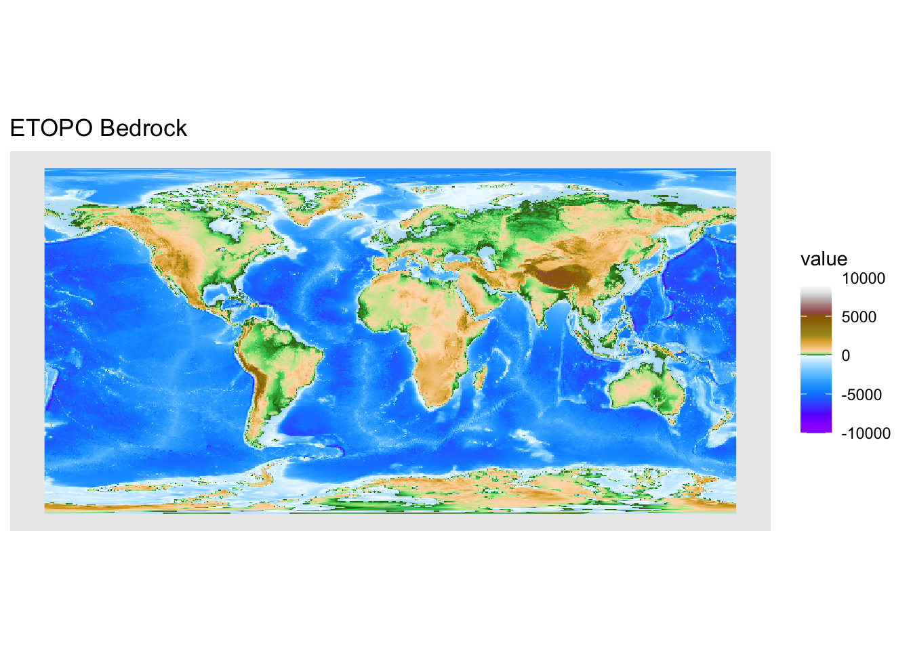

```r

# Среднее
wgt = matrix(c(1, 1, 1,
                1, 1, 1,
                1, 1, 1) / 9, 
              nrow = 3)
# на самом деле проще написать так:
# wgt = matrix(1/9, 3, 3), но полная форма записана для наглядности

# выполним обработку ЦМР с помощью фокального фильтра
filtered = focal(dem, w = wgt)
spplot(stack(dem, filtered),
       names.attr=c('Исходный рельеф', 'Сглаживание средним'))
```

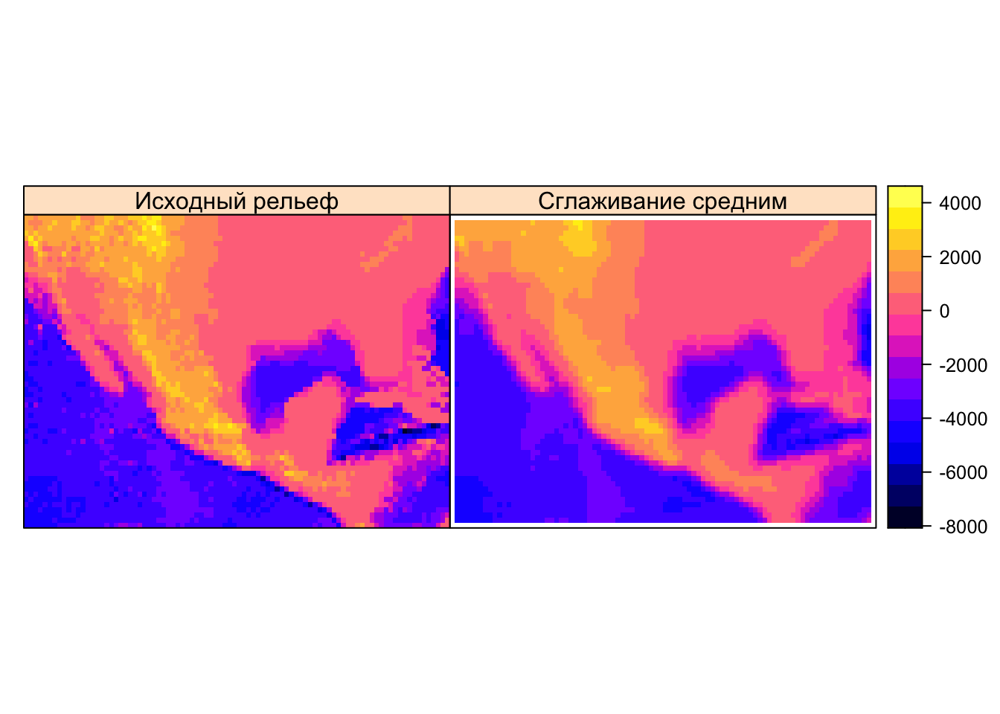

Более мягким эффектом сглаживания, который к тому же не нарушает дифференцируемость поверхности, является гауссово сглаживание. Коэффициенты в матрице Гаусса убывают от центральной ячейки к краям матрицы по закону Гаусса-Лапласа, что позволяет придать центральной ячейке более высокий вес по сравнению с ячейками, располагающимися на краю анализируемой окрестности:

```r
# Гауссово (параметр 0.5 - это стандартное отклонение в единицах измерения растра)
wgt = focalWeight(dem, 0.5, "Gauss")
filtered = focal(dem, wgt)
spplot(stack(dem, filtered),
       names.attr=c('Исходный рельеф', 'Гауссово сглаживание'))
```

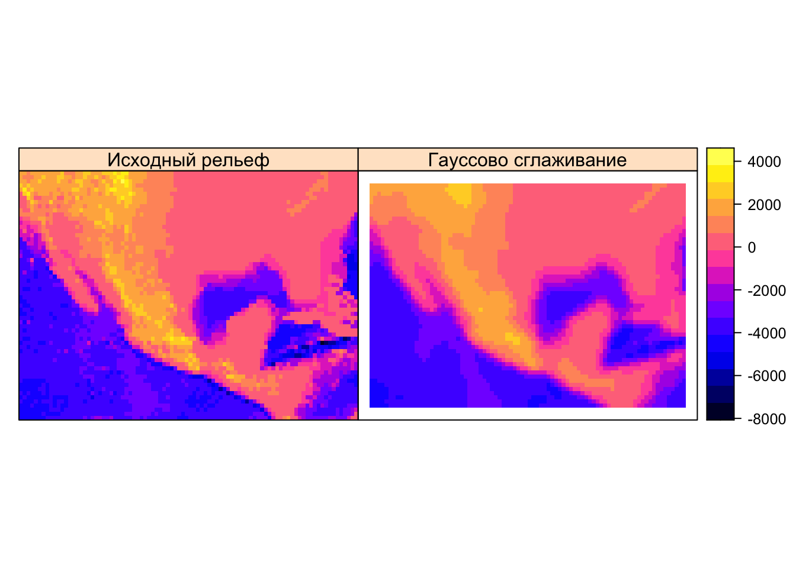

Еще одна интересная область применения фильтрации --- это обнаружение границ (change detection). Границы на изображении возникают в тех местах, где его яркость резко меняет свое значение (в одном или нескольких каналах). Например, на фотографии контур лица может быть распознан по перепаду яркости между его изображением и фоном (если он имеет существенно отличный цвет). Поскольку перепад яркости соответствует экстремальным значениям производной поверхности (отрицательным или положительным), его также можно определить путем фокального анализа, а затем отсечь ячейки растра, в которых значение этой производной по модулю превышает заданный порог (то есть, имеет необходимый контраст). 

Рассмотрим, как можно выделить уступы континентального склона океана путем применения фильтра Собеля для выделения границ: 

```r
# Матрица Собеля:
wgt = matrix(c(1, 2, 1,
                0, 0, 0,
               -1,-2,-1) / 4, 
              nrow=3)
filtered = focal(dem, wgt)

# Это поверхность производных:
plot(filtered,
     col = gray.colors(128),
     main = 'Производная поверхности')
```

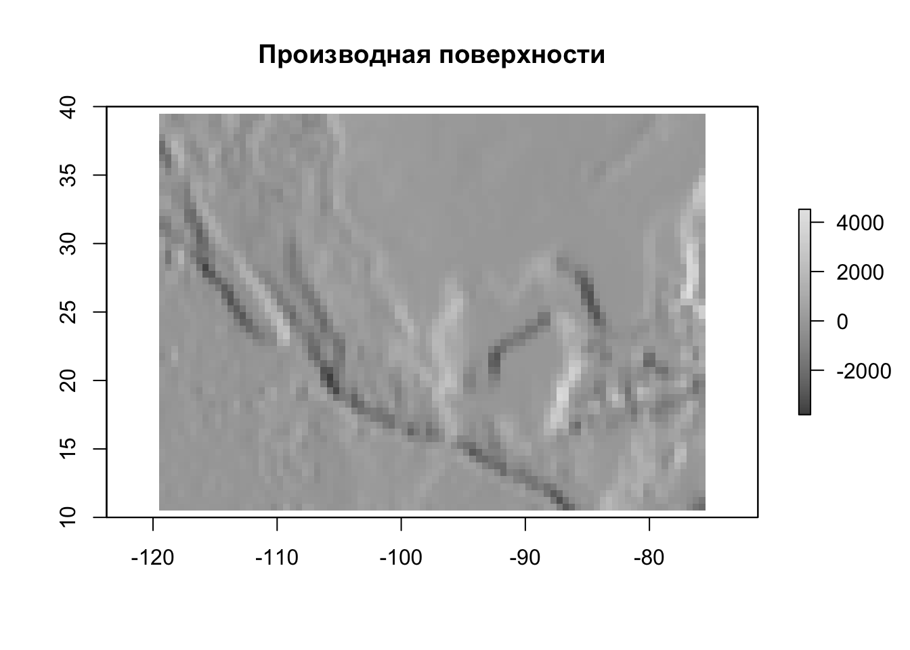

```r

# Отберем все ячейки, обладающие высокими значениями производных
faults = (filtered < -1500) | (filtered > 1500)
faults[faults == 0] = NA

# Визуализируем результат
plot(dem, 
     col = rev(rainbow(20)),
     main = 'Уступы континентального склона',
     legend = FALSE)
plot(faults,
     col = 'black',
     legend = FALSE,
     add = TRUE)
```

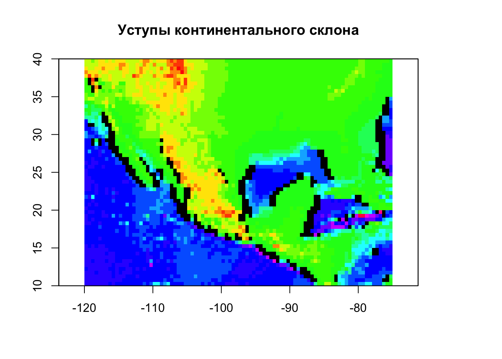

Еще один распространенный случай использования фокальных операций --- это морфометрический анализ поверхностей. Квадратная окрестность $3\times3$ вокруг каждой ячейки формирует локальную поверхность, производные которой дают представление об уклоне, экспозиции и прочих морфометрических параметрах. Их можно вычислить с помощью функции `terrain()` из пакета `raster`:


```r
# Морфометрия рельефа — фиксированное соседство
dem = raster('data/dem_fergana.tif')
spplot(dem)
```

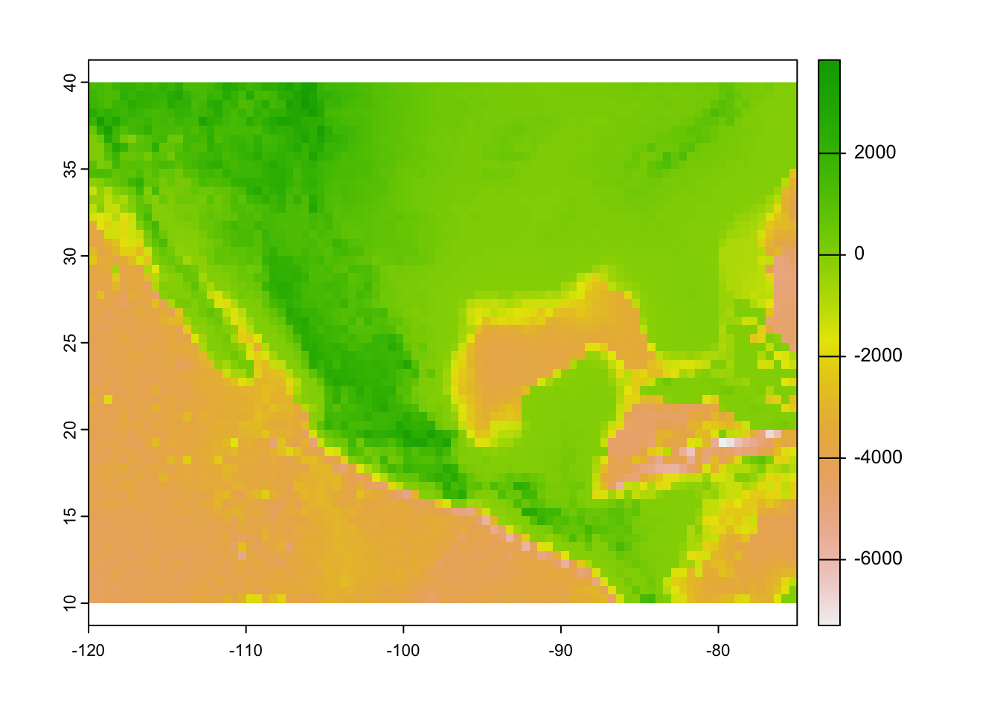

```r

# углы наклона
slope = terrain(dem, opt = 'slope', unit = 'degrees')
spplot(slope, 
       col.regions = heat.colors(20),
       names.attr=c('Углы наклона'))
```


```r

# экспозиция
aspect = terrain(dem, opt = 'aspect', unit = 'degrees')
spplot(aspect, 
       col.regions = rainbow(20),
       names.attr=c('Экспозиции склона'))
```

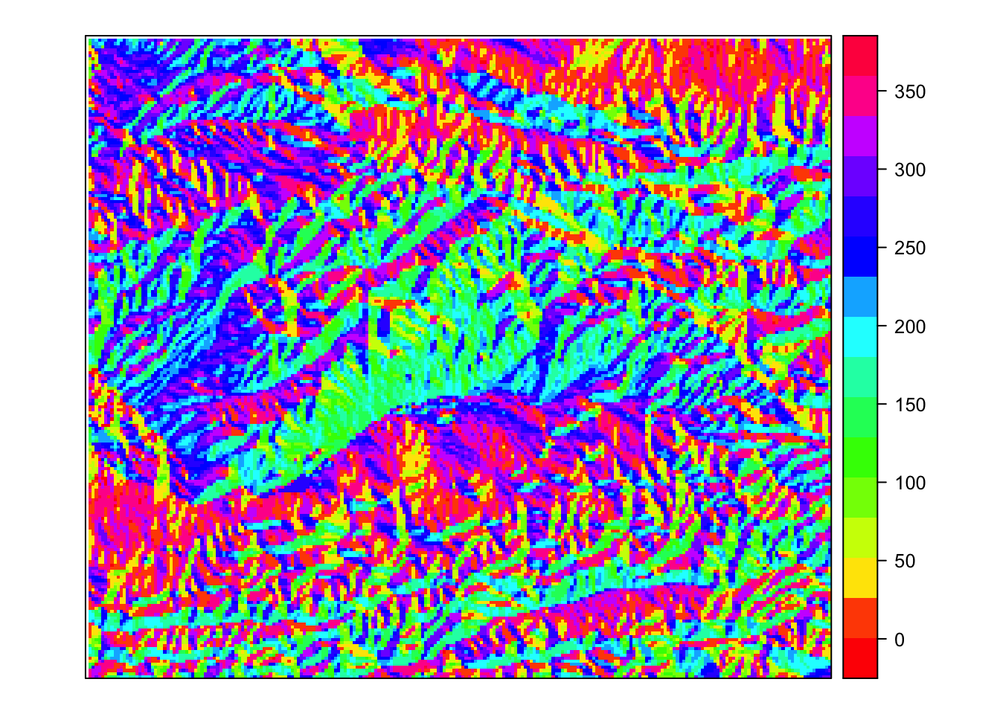

Вычисление производных поверхности позволяет не только исследовать рельеф, но также строить его изображения. Например, хорошо знакомую всем по картам аналитическую отмывку рельефа (_hillshade_). Яркость поверхности в этом способе изображения зависит от угла между направлением на источник освещения (откуда светит Солнце) и нормалью к поверхности. Нормаль можно вычислить как напрямую через производные поверхности, так и восстановить на основе значений угла наклона и экспозиции в точке, что и используется в пакете __raster__. Обратите внимание на то, что для того чтобы повысить наглядность (контрастность) изображения, мы умножаем высоты рельефа на 20. Это стандартная практика для мелкомасштабных карт:

```r
# отмывка
slope2 = terrain(dem * 20, opt = 'slope')
aspect2 = terrain(dem * 20, opt = 'aspect')
                 
# параметры angle и direction функции hillShade определяют азимут и высоту источника освещения:
hill = hillShade(slope2, aspect2, angle = 45, direction = 315)
plot(hill, 
     col = gray.colors(128),
     main = 'Отмывка рельефа')
```

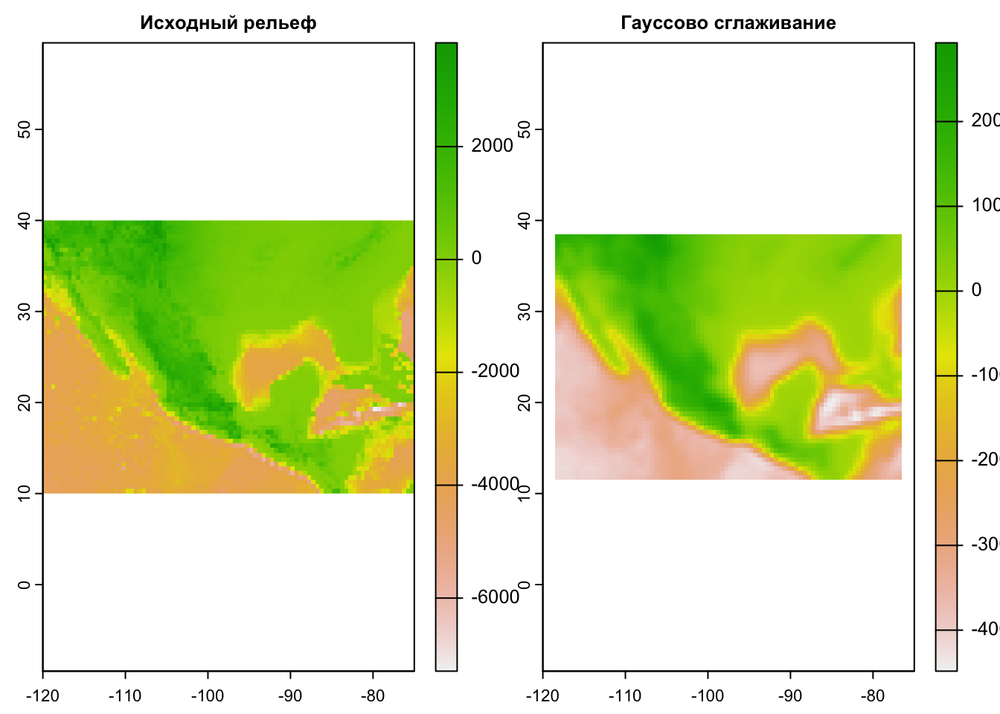

#### Расширенная окрестность {#raster_focal_extended}

Расширенность окрестности означает, что она определяется не фиксированным шаблоном, а условием, которое должно выполниться для того, чтобы анализ в ячейке считался выполненным. Типичный пример анализа на основе расширенной окрестности — это операции, основанные на вычислении расстояний на растровой матрице, такие как аллокация, определение кратчайшего пути на поверхности сопротивления, и собственно, само вычисление расстояние.

В мелкомасштабных тематических атласах часто можно встретить карты доступности той или иной географической локации, которые в форме изолиний показывают время движения до ближайшего населенного пункта. Эти изолинии можно построить по растровой поверхности, в каждой ячейке которой зафиксировано расстояние до ближайшего населенного пункта.

Рассмотрим построение аналогичной поверхности на примере доступности станций метро (по расстоянию). Для этого нам понадобится представить растр в виде матрицы точек, рассчитать для этих точек расстояния до ближайших станций метро и присвоить эти значения выходному растру:

```r
# Определение Евклидовых расстояний — расширенное соседство

# Чтение данных
roads = st_read("data/roads.gpkg") # Дороги
## Reading layer `roads' from data source 
##   `/Users/tsamsonov/GitHub/r-geo-course/data/roads.gpkg' using driver `GPKG'
## Simple feature collection with 2213 features and 12 fields
## Geometry type: MULTILINESTRING
## Dimension:     XY
## Bounding box:  xmin: 410946.9 ymin: 6176676 xmax: 415890.8 ymax: 6181910
## Projected CRS: WGS 84 / UTM zone 37N
poi = st_read("data/poi_point.gpkg") # Точки интереса
## Reading layer `poi_point' from data source 
##   `/Users/tsamsonov/GitHub/r-geo-course/data/poi_point.gpkg' 
##   using driver `GPKG'
## Simple feature collection with 6623 features and 9 fields
## Geometry type: POINT
## Dimension:     XY
## Bounding box:  xmin: 410947.3 ymin: 6176678 xmax: 415889.9 ymax: 6181909
## Projected CRS: WGS 84 / UTM zone 37N
rayons = st_read("data/boundary_polygon.gpkg") # Границы районов
## Reading layer `boundary_polygon' from data source 
##   `/Users/tsamsonov/GitHub/r-geo-course/data/boundary_polygon.gpkg' 
##   using driver `GPKG'
## Simple feature collection with 11 features and 5 fields
## Geometry type: MULTIPOLYGON
## Dimension:     XY
## Bounding box:  xmin: 410946.9 ymin: 6176676 xmax: 415890.8 ymax: 6181910
## Projected CRS: WGS 84 / UTM zone 37N
stations = st_read("data/metro_stations.gpkg") # Станции метро
## Reading layer `metro_stations' from data source 
##   `/Users/tsamsonov/GitHub/r-geo-course/data/metro_stations.gpkg' 
##   using driver `GPKG'
## Simple feature collection with 45 features and 3 fields
## Geometry type: POINT
## Dimension:     XY
## Bounding box:  xmin: 411007.5 ymin: 6176747 xmax: 415852.2 ymax: 6181892
## Projected CRS: WGS 84 / UTM zone 37N
water = st_read("data/water_polygon.gpkg") # Водные объекты
## Reading layer `water_polygon' from data source 
##   `/Users/tsamsonov/GitHub/r-geo-course/data/water_polygon.gpkg' 
##   using driver `GPKG'
## Simple feature collection with 8 features and 7 fields
## Geometry type: POLYGON
## Dimension:     XY
## Bounding box:  xmin: 411595.6 ymin: 6176676 xmax: 415890.8 ymax: 6180765
## Projected CRS: WGS 84 / UTM zone 37N

# Создаем пустой растр с охватом, равным охвату станции
dist_grid = stations %>% 
  st_bbox() %>% 
  st_as_stars(dx = 25, dy = 25) %>% 
  mutate(dist = st_as_sf(., as_points = TRUE, merge = FALSE) %>% 
           st_distance(stations, .) %>% 
           apply(2, min))

# Визуализируем результат
ggplot() +
  geom_stars(data = dist_grid['dist']) +
  scale_fill_gradientn(colours = c('white', 'red', 'black')) +
  coord_sf(crs = st_crs(stations)) +
  geom_sf(data = water, size = 0.1) +
  geom_sf(data = roads, size = 0.1) +
  geom_sf(data = stations) +
  ggtitle('Расстояние до ближайшей станции метро') +
  theme_bw()
```

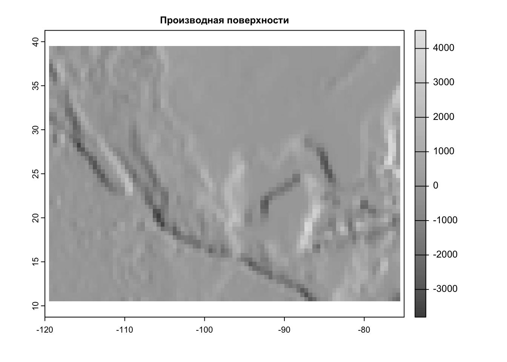

### Зональные операции {#raster_zonal}

__Зональные операции__ связаны с агрегированием растровых данных по площадным зонам. В пределах каждой зоны вычисляется одна или несколько характеристик значений анализируемого растра: среднее, максимум и т.д. Как правило, зоны задаются в виде вспомогательного растрового или векторного набора данных. В случае растра каждая ячейка должна содержать идентификатор (номер) зоны, к которой она относится. Совокупность ячеек, имеющих одинаковый идентификатор, определяет территорию, которую покрывает зона с этим идентификатором. Если зоны представлены векторным набором пространственных объектов, то каждый объект (полигон) также должен иметь собственный идентификатор. Теоретически в одном наборе данных может быть несколько пространственно не связанных объектов, относящихся к одной зоне (например, зона экваториального климата состоит из трех ареалов). В этом случае агрегирование данных будет произведено сразу по трем полигонам. Таким образом, количество получаемых в результате зональной статистики значений определяется количеством зон, но может не совпадать с общим количеством полигонов, которыми эти зоны представлены.

В качестве примера рассмотрим вычисление среднеклиматических параметров _WorldClim_ в пределах различных типов земельного покрова (Land Cover), которые доступны в пакете __tmap__:

```r
temp = raster::getData("worldclim", var = "tmean", res = 10) %>% 
  st_as_stars() / 10
plot(temp)
## downsample set to c(16,16,1)
```

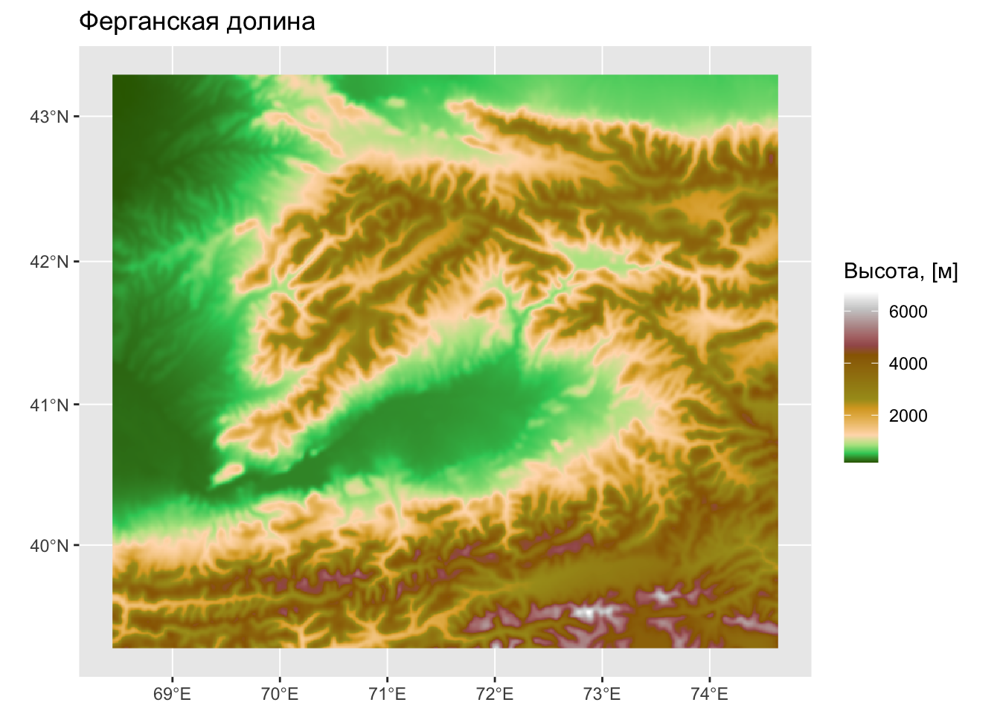

```r


data(land, package = 'tmap')

pal = c("#003200", "#3C9600", "#006E00", "#556E19", "#00C800", "#8CBE8C",
		   "#467864", "#B4E664", "#9BC832", "#EBFF64", "#F06432", "#9132E6",
		   "#E664E6", "#9B82E6", "#B4FEF0", "#646464", "#C8C8C8", "#FF0000",
		   "#FFFFFF", "#5ADCDC")

ggplot() +
  geom_stars(data = land) +
  scale_fill_manual(values = pal, guide = guide_legend(ncol = 3), name = NULL) + 
  coord_sf(crs = st_crs(land)) +
  theme(legend.position = 'bottom')
```

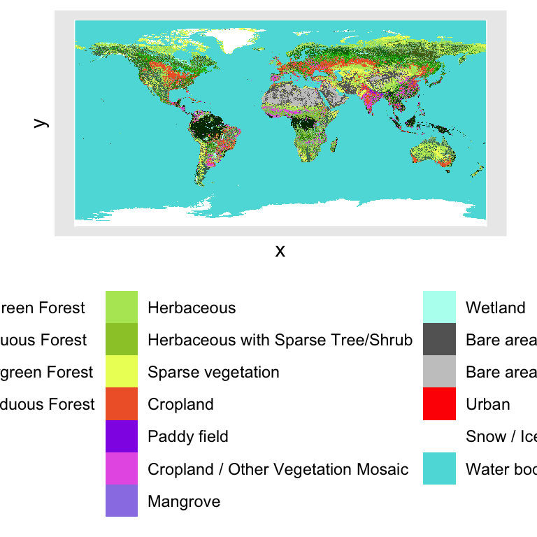

> Оператор `@` означает обращение к _слоту_ объекта. Слоты представляют собой объекты, являющиеся внутри других объектов, являющихся экземплярами классов S4. 

Предварительно необходимо убедиться, что оба растра имеют совпадающий охват (экстент) и пространственное разрешение. Обратите внимание на то, что, поскольку растр земельного покрова категориальный, для его передискретизации необходимо использовать метод ближайшего соседа (_Nearest Neighbor_), который для каждого пиксела нового растра берет значение в ближайшем к нему пикселе исходного растра:

```r
temp
## stars object with 3 dimensions and 1 attribute
## attribute(s), summary of first 1e+05 cells:
##          Min. 1st Qu. Median      Mean 3rd Qu.  Max.  NA's
## tmean1  -42.1 -34.075 -30.85 -31.98754   -29.5 -27.8 98298
## dimension(s):
##      from   to offset     delta                       refsys point
## x       1 2160   -180  0.166667 +proj=longlat +datum=WGS8...    NA
## y       1  900     90 -0.166667 +proj=longlat +datum=WGS8...    NA
## band    1   12     NA        NA                           NA    NA
##                  values x/y
## x                  NULL [x]
## y                  NULL [y]
## band tmean1,...,tmean12
land
## stars object with 2 dimensions and 4 attributes
## attribute(s):
##                cover                              cover_cls     
##  Water bodies     :393060   Water                      :393060  
##  Snow / Ice       : 61986   Snow/ice                   : 61986  
##  Herbaceous       : 21377   Forest                     : 48851  
##  Tree Open        : 16171   Other natural vegetation   : 32611  
##  Sparse vegetation: 12247   Bare area/Sparse vegetation: 26904  
##  Cropland         : 11658   Cropland                   : 17843  
##  (Other)          : 66701   (Other)                    :  1945  
##      trees          elevation     
##  Min.   :  0.0    Min.   :-412    
##  1st Qu.:  0.0    1st Qu.: 218    
##  Median :  0.0    Median : 608    
##  Mean   : 15.6    Mean   :1140    
##  3rd Qu.: 19.0    3rd Qu.:1941    
##  Max.   :100.0    Max.   :6410    
##  NA's   :393060   NA's   :389580  
## dimension(s):
##   from   to offset.xmin delta.xmax                       refsys point values
## x    1 1080        -180   0.333333 +proj=longlat +ellps=WGS8...  NULL   NULL
## y    1  540          90  -0.333333 +proj=longlat +ellps=WGS8...  NULL   NULL
##   x/y
## x [x]
## y [y]

(cover = st_warp(land['cover'], temp %>% slice(band, 1), method = 'near'))
## stars object with 2 dimensions and 1 attribute
## attribute(s), summary of first 1e+05 cells:
##                                   cover      
##  Water bodies                        :98596  
##  Snow / Ice                          :  996  
##  Sparse vegetation                   :  400  
##  Bare area,consolidated (gravel,rock):    8  
##  Broadleaf Evergreen Forest          :    0  
##  Broadleaf Deciduous Forest          :    0  
##  (Other)                             :    0  
## dimension(s):
##   from   to offset     delta                       refsys point values x/y
## x    1 2160   -180  0.166667 +proj=longlat +datum=WGS8...    NA   NULL [x]
## y    1  900     90 -0.166667 +proj=longlat +datum=WGS8...    NA   NULL [y]
# используем 'near', поскольку растр категориальный
```

Для вычисления средней температуры за каждый месяц в пределах каждой зоны земельного покрова выполним следующую последовательность действий:

```r
months = 1:12
cover_types = levels(cover$cover)
zonal_stats = lapply(cover_types, function(X) {
  sapply(months, function(Y) {
    temp_month = temp %>% slice(band, Y) %>% pull(1)
    cover %>% 
      mutate(masked = ifelse(cover == X, temp_month, NA)) %>% 
      dplyr::select(masked) %>% 
      pull(masked) %>% 
      mean(na.rm = TRUE)
  })
}) %>% 
  bind_cols() %>% 
  set_names(cover_types) %>% 
  mutate(month = months) %>% 
  pivot_longer(-month, names_to = 'cover', values_to = 'tmean')
```

Визуализируем полученные результаты:

```r
ggplot(zonal_stats) +
  geom_line(aes(x = month, y = tmean, color = cover), size = 1) +
  scale_color_manual(values = pal) +
  scale_x_continuous(breaks = months)
```

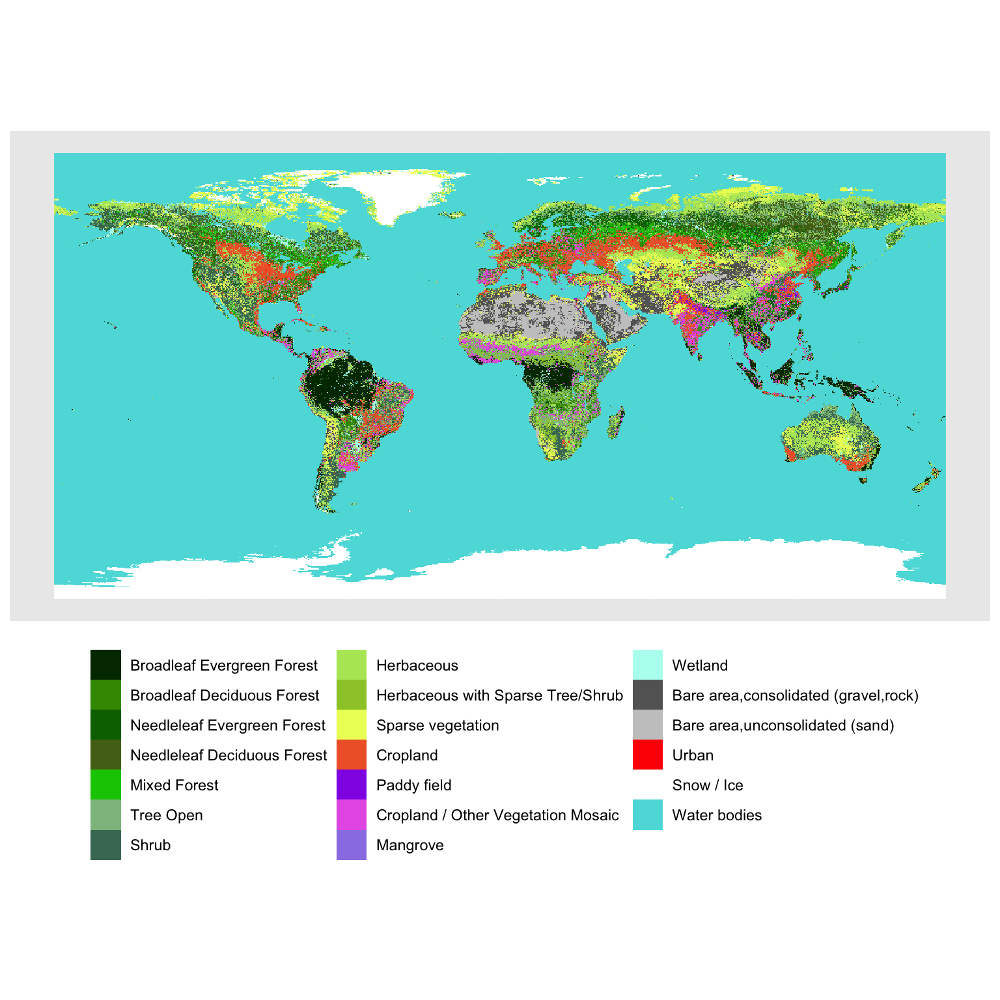

Перед вычислением целесообразно разделить растр землепользования на северное и южное полушарие (т.к. ход температур в них противоположный):

```r
cover_north = crop(as(cover['cover'], 'Raster'), extent(-180, 180, 0, 90))
cover_south = crop(as(cover['cover'], 'Raster'), extent(-180, 180, -60, 0))

temp_north = crop(as(temp, 'Raster'), extent(-180, 180, 0, 90))
temp_south = crop(as(temp, 'Raster'), extent(-180, 180, -60, 0))

mtemp_north_tidy = zonal(temp_north, cover_north, 'mean') %>% 
  as_tibble() %>% 
  pivot_longer(-zone, 
               names_to = 'month', 
               values_to = 'tmean', 
               names_prefix = 'layer.',
               names_transform = list(month = as.integer)) %>% 
  mutate(hemisphere = 'north')

mtemp_south_tidy = zonal(temp_south, cover_south, 'mean') %>% 
  as_tibble() %>% 
  pivot_longer(-zone, 
               names_to = 'month', 
               values_to = 'tmean', 
               names_prefix = 'layer.',
               names_transform = list(month = as.integer)) %>% 
  mutate(hemisphere = 'south')

mtemp_tidy2 = bind_rows(mtemp_north_tidy, mtemp_south_tidy) %>% 
  mutate(cover = levels(cover$cover)[zone])

ggplot(mtemp_tidy2) +
  geom_line(aes(x = month, y = tmean, color = cover), size = 1) +
  scale_color_manual(values = pal) +
  scale_x_continuous(breaks = 1:12) +
  facet_wrap(~hemisphere, ncol = 1)
```

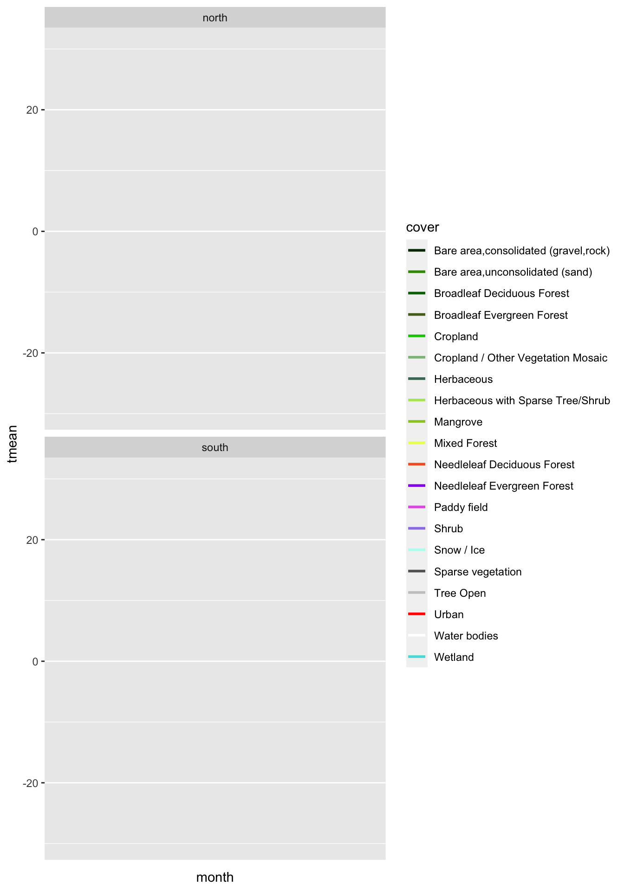

### Глобальные операции {#raster_global}

Глобальные операции охватывают все ячейки растра. По сути, можно говорить, что это частный случай зональной операции, когда зона одна и покрывает растр целиком. В пакете raster для расчета глобальных статистик можно использовать функцию `cellStats()`, передав ей название растра и агрегирующей функции:

```r
cellStats(temp_north, max) 
cellStats(temp_south, min) 
```

## Извлечение данных {#raster_extract}

Растровая модель данных обеспечивает сплошное покрытие территории (с дискретностью, определяемой размером ячейки). В то же время, достаточно часто требуется получить значения растра в заданных местоположениях. Местоположения могут быть как конкретными объектами (например, точками почвенных разрезов), так и абстрактными географическими локациями, для которых известны координаты.

Для извлечения растровых данных можно воспользоваться функцией `extract()`. Получать данные можно как по координатам (записанным в фрейм данных), так и используя пространственные объекты класса `Spatial`. Например, узнаем мощность покровного оледенения в точке в центре Гренландии:

```r
coords = data.frame(x = -45, y = 70)
z = raster::extract(ice.depth, coords)

plot(bed, 
     breaks = brks, 
     col = gray.colors(nclass),
     legend = F)
plot(ice.depth, 
     col = cm.colors(255),
     add = TRUE)
points(coords)
text(coords, labels = z, pos = 4)
```

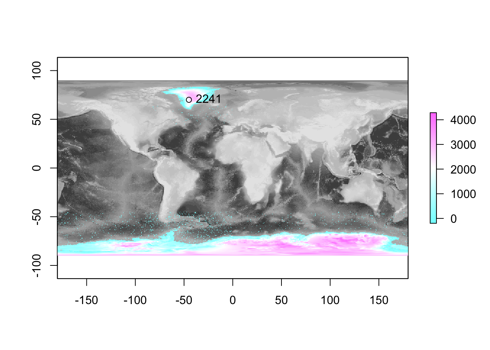


Одна из наиболее распространенных задач по извлечению растровых данных — это построение профиля вдоль заданной линии. Воспользуемся интерактивным редактором для проведения линии профиля

```r
mp = mapview(temp$tmean6)
profile = mapedit::drawFeatures(mp)
```

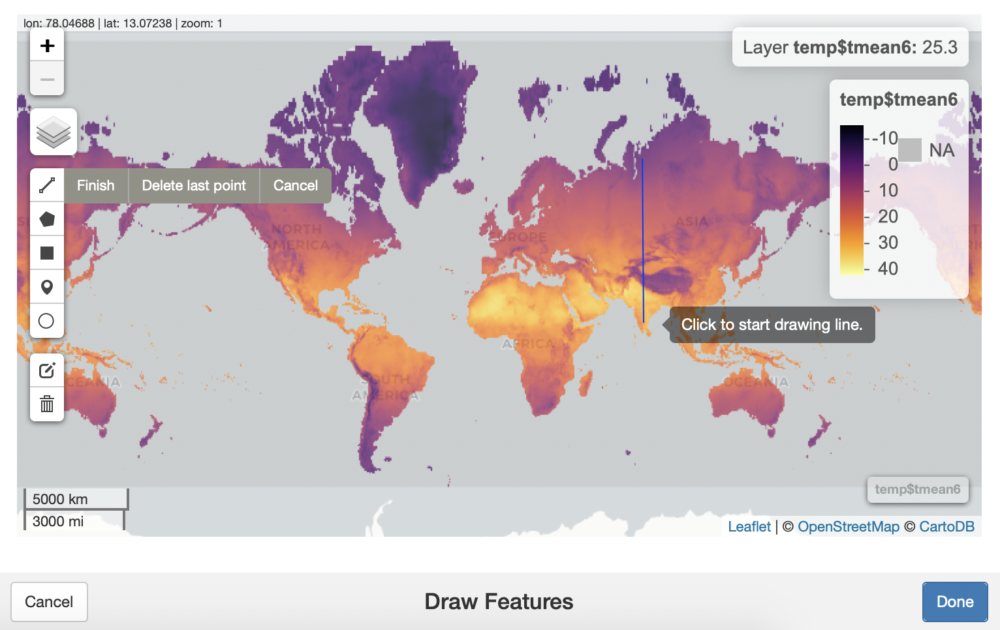


```r
temprof = raster::extract(as(temp, 'Raster'), as(profile, 'Spatial'),
                          along = TRUE, cellnumbers = TRUE)
head(temprof[[1]])
##        cell tmean1 tmean2 tmean3 tmean4 tmean5 tmean6 tmean7 tmean8 tmean9
## [1,] 252105  -26.1  -26.3  -22.4  -16.0   -7.3    1.8    8.0    7.8    2.6
## [2,] 254265  -26.2  -26.4  -22.5  -16.1   -7.4    1.8    8.1    7.8    2.5
## [3,] 256425  -26.2  -26.4  -22.4  -15.9   -7.2    1.9    8.3    8.0    2.7
## [4,] 258585  -26.1  -26.4  -22.2  -15.7   -7.0    2.2    8.6    8.1    2.8
## [5,] 260745  -26.2  -26.4  -22.1  -15.6   -7.0    2.3    8.8    8.2    2.9
## [6,] 262905  -26.1  -26.3  -21.9  -15.4   -6.7    2.5    9.0    8.5    3.0
##      tmean10 tmean11 tmean12
## [1,]    -7.4   -17.9   -22.4
## [2,]    -7.5   -18.0   -22.5
## [3,]    -7.4   -18.0   -22.6
## [4,]    -7.3   -17.9   -22.6
## [5,]    -7.3   -17.9   -22.6
## [6,]    -7.1   -17.9   -22.6
```

Для построения линии профиля далее нам необходимо преобразовать идентификаторы ячеек растра в расстояние от начала профиля:

```r
tempdf = temprof[[1]] %>% 
  as_tibble() %>% 
  drop_na() %>% 
  bind_cols(st_coordinates(temp)[.$cell, ] %>% as_tibble()) %>% 
  mutate(dist = 0.001 * c(0, dplyr::select(., x, y) %>% 
                             geosphere::distGeo() %>% 
                             cumsum() %>% 
                             head(-1))) %>% 
  dplyr::select(-c(x, y, cell, band)) %>% 
  pivot_longer(tmean1:tmean12, 
               names_to = 'month', 
               values_to = 'tmean', 
               names_prefix = 'tmean',
               names_transform = list(month = factor, ordered = TRUE, levels = 1:12))

pts = profile %>% 
  st_cast('POINT') %>% 
  mutate(label = c('A', 'B'))

tm_shape(slice(temp, band, 6)) +
  tm_raster('tmean1', midpoint = 0, palette = '-RdBu') +
tm_shape(profile) +
  tm_lines() +
tm_shape(pts) +
  tm_bubbles(size = 0.1) +
  tm_text('label', remove.overlap = TRUE, auto.placement = TRUE) +
tm_layout(legend.position = c('left', 'bottom'))
```

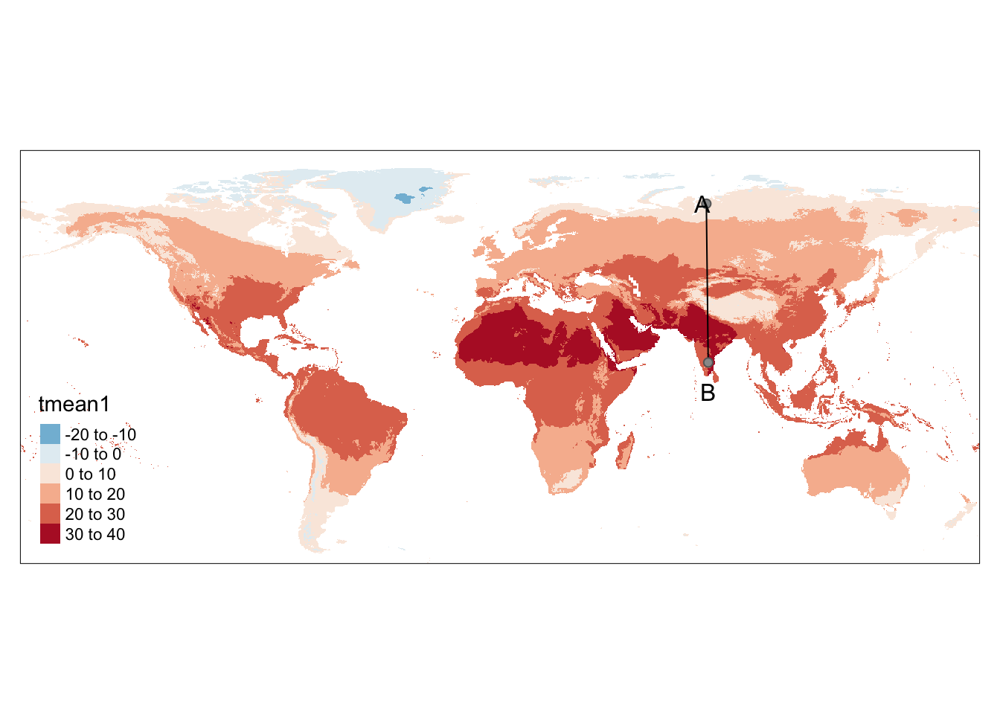

```r

tempdf %>% 
  dplyr::filter(month == 6) %>% 
  ggplot(aes(x = dist, y = tmean)) +
    geom_line() +
    geom_smooth(span = 0.1) +
    annotate('text', x = 0, y = 10, label = 'A') +
    annotate('text', x = max(tempdf$dist), y = 10, label = 'B') +
    ggtitle('Профиль среднемесячной температуры июня по линии A—B')
```


## Контрольные вопросы и упражнения {#questions_tasks_raster}

### Вопросы {#questions_raster}

1. Дайте описание локальных, фокальных, зональных и глобальных операций растровой алгебры. Приведите примеры использования данных типов операций.
1. Каким требованиям должна отвечать геометрия растров, участвующих в локальных и зональных операциях?
1. В чем заключается отличие фокальных операций с фиксированной и расширенной окрестностью?
1. Чем отличается геометрия растра до и после применения фокальной операции?
1. Какая функция пакета __raster__ реализует возможности фокальной обработки растров?
1. Какой эффект оказывает сглаживающая фильтрация на значения растра?
1. Какие виды производных морфометрических величин позволяет получать функция `terrain()` из пакета __raster__?
1. Какие два растра необходимо рассчитать для построения аналитической отмывки средствами функции `terrain()`?
1. Опишите последовательность действий, которую необходимо выполнить для построения растра __Евклидовых расстояний__ от заданных объектов?
1. Какой метод интерполяции необходимо использовать для передискретизации категориальных растров? В чем заключается принцип его действия?
1. Какая функция пакета __raster__ используется для выполнения зональных операций? Какой тип результата она возвращает?
1. Опишите возможности функции `extract()` по извлечению информации из растровых данных. В какой формате можно задать анализируемые локации? Что будет результатом вызова этой функции в зависимости от формата входных данных?
1. Опишите последовательность действий, которую необходимо выполнить для построения профиля растровой поверхности средствами __R__. 
1. Можно ли построить профиль по растру, имеющему привязку в географической системе координат (координаты выражены градусах)? Если да, то как добиться того, чтобы расстояния между точками профиля были посчитаны в метрических единицах?
1. Опишите способ, с помощью которого можно осуществить фильтрацию растра (превратить его в растр `TRUE`/`FALSE`) и маскирование растра (заменить ненужные ячейки на NA).

### Упражнения {#tasks_raster}

1. В пакете __tmap__ содержится растровый каталог `land`, включающий в себя растр `elevation`. Используя пакет __mapedit__, оцифруйте произвольную линию и постройте средствами __ggplot__ профиль рельефа вдоль этой линии.

2. _Индекс континентальности Хромова_ рассчитывается по формуле $K = (A - 5.4 \sin \phi)/A$, где $A$ — годовая амплитуда хода температуры, $\phi$ — широта точки. Используя данные __WorldClim__, рассчитайте растр индекса континентальности на территорию суши и нанесите его на карту средствами __tmap__.

    > __Подсказка:__ используйте функцию `xyFromCell()`, чтобы получить широты всех ячеек растра температур. Далее создайте новый растр и запишите в него широты в качестве значений. Растры минимальных и максимальных значений из стека растров можно получить, используя обычные статистические функции `min()` и `max()`.

3. Постройте растр, который содержит расстояние до береговой линии. Используйте данные __Natural Earth__. Задайте грубое разрешение растра, чтобы расчеты не производились долго (100 x 50 ячеек будет достаточно). Где находится самая удаленная от берега точка на суше? А самая удаленная точка на океане? Постройте карту, которая отображает полученный растр и береговую линию.

4. Рассчитайте морфометрические коэффициенты  TPI, TRI и roughness для [цифровой модели рельефа Ферганской долины](https://github.com/tsamsonov/r-geo-course/blob/master/data/dem_fergana.tif), которая использовалась в текущей лекции. В чем их суть? Изучите справку к инструменту `terrain()`.

----
_Самсонов Т.Е._ **Визуализация и анализ географических данных на языке R.** М.: Географический факультет МГУ, `lubridate::year(Sys.Date())`. DOI: [10.5281/zenodo.901911](https://doi.org/10.5281/zenodo.901911)
----
