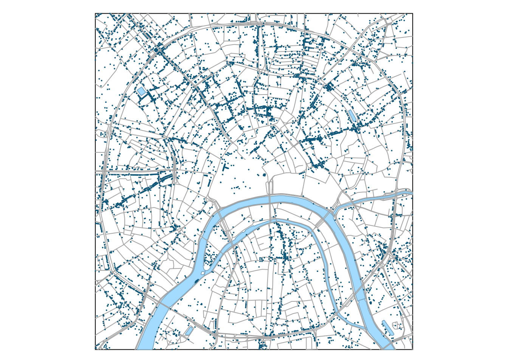
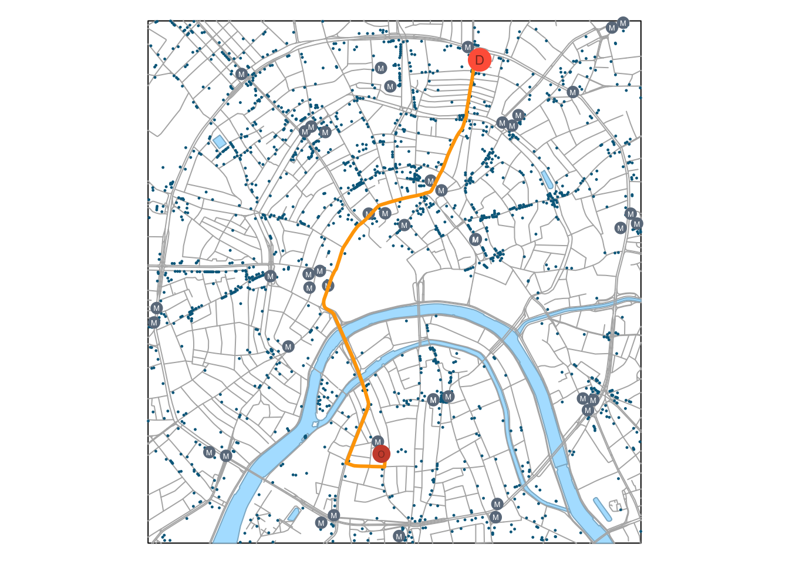

# Анализ сетей и траекторий {#network}


## Загрузка данных


```r
library(sf)
library(tidyverse)
library(classInt)
library(osrm) # Использование онлайн-сервиса маршрутизации OSRM
library(cartography) # Удобное построение тематических карт средствами plot()

# Чтение данных
roads = st_read("data/roads.gpkg") # Дороги
poi = st_read("data/poi_point.gpkg") # Точки интереса
rayons = st_read("data/boundary_polygon.gpkg") # Границы районов
stations = st_read("data/metro_stations.gpkg") # Станции метро
water = st_read("data/water_polygon.gpkg") # Водные объекты

# Прочитаем текущие параметры компоновки
def = par(no.readonly = TRUE)

# Уберем поля, чтобы карта занимала весь экран
par(mar = c(0,0,0,0))

# Получим ограничивающий прямоугольник слоя дорог в качестве общего охвата карты
frame = roads %>% st_bbox() %>% st_as_sfc() %>% st_geometry()

poi.food = poi %>% 
            dplyr::select(NAME, AMENITY) %>% 
            dplyr::filter(AMENITY %in% c("restaurant", "bar", "cafe", "pub", "fast_food"))

## ОБЗОР ИСХОДНЫХ ДАННЫХ -------------------------------------

# Визуализируем входные данные
plot(frame)
plot(water %>% st_geometry(), 
     col = "lightskyblue1",
     border = "lightskyblue3",
     add = TRUE)
plot(roads %>% st_geometry(),
     col = "gray70", 
     add = TRUE)
plot(poi %>% st_geometry(), 
     col = "deepskyblue4", 
     pch = 20, 
     cex = 0.2, 
     add = TRUE)
```




```r
plotBasemap = function(add = FALSE){
  
  plot(frame, add = add)

  plot(water %>% st_geometry(), 
       col = "lightskyblue1",
       border = "lightskyblue3",
       add = TRUE)
  
  plot(roads %>% st_geometry(),
       col = "gray70",
       add = TRUE)
  
  plot(poi.food %>% st_geometry(), 
       col = "deepskyblue4", 
       pch = 20, 
       cex = 0.3, 
       add = TRUE)
  plot(stations %>% st_geometry(), 
       col = "slategray4", 
       pch = 20, 
       cex = 2, 
       add = TRUE)
  text(stations %>% st_centroid() %>% st_coordinates(),
       labels = "M",
       col = "white",
       cex = 0.4)
}
```


## Анализ зон транспортной доступности  {#transport_zones}

Зоны транспортной доступности представляют из себя зоны окружения объектов, построенные не по евклидову расстоянию, а по расстоянию или времени движения по дорожной сети. В задачах логистики и геомаркетинга зоны транспортной доступности часто называют _зонами обслуживания_ (service area), поскольку используются для определения территории, которую может покрыть объект, предоставляющий некоторые услуги. Например, для пожарного депо зона 10-минутной доступности показывает территорию города, в любую точку которой пожарная машина может доехать __из__ данного депо в течение 10 минут. И наоборот, для торгового центра зона 10-минутной доступности показывает территорию города, __из__ любой точки которой можно добраться до ТЦ в течение 10 минут. Очевидно, что продолжительность прямого и обратного маршрута неодинакова, на нее может оказывать влияние схема движения, приоритет дорог и так далее.

Задача, которую мы решим в данном разделе, звучит так: определить все заведения питания, находящиеся в 7 минутах езды от Центрального детского магазина. Для построения зоны доступности мы будем использовать пакет [osrm](https://cran.r-project.org/web/packages/osrm/index.html), предоставляющий интерфейс __R__ к онлайн-библиотеке маршрутизации [OSRM](http://project-osrm.org), работающей на основе данных OSM. Для построения зоны доступности (изохроны) нам понадобится функция `osrmIsochrone()` из данного пакета.

> Внимание: для выполнения этого раздела модуля необходимо подключение к Интернету

Поскольку данные, используемые в настоящем модуле, предварительно были конвертированы в проекцию [UTM](https://en.wikipedia.org/wiki/Universal_Transverse_Mercator_coordinate_system) и хранятся в метрах, а OSRM решает все задачи в географических координатах (широте и долготе относительно эллипсоида [WGS84](https://en.wikipedia.org/wiki/World_Geodetic_System)), нам необходимо научиться работать с проекциями данных и преобразовывать системы координат между собой.


```r

## АНАЛИЗ ЗОН ТРАНСПОРТНОЙ ДОСТУПНОСТИ -------------------------------------

# Инициализируем систему координат WGS84, используемую в OSRM
WGS84 = st_crs(4326)

# Извлечем информацию о системе координат исходных точек
UTM = st_crs(poi)

# Выберем целевой объект
psel = poi %>% dplyr::filter(NAME == "Центральный детский магазин" & SHOP == "toys")

# Преобразуем координаты точки в WGS84
psel.wgs = st_transform(psel, WGS84)

# Получаем 5-минутную зону транспортной доступности
# с помощью пакета osrm
service_area = osrmIsochrone(psel.wgs, breaks = 3)

# Преобразуем зону обратно в UTM для дальнейших операций
service_area_utm = st_transform(st_as_sf(service_area), UTM)

# Отбираем точки
selected_poi = poi.food[service_area_utm, ]

# Визуализируем результат
plotBasemap()

plot(service_area_utm %>% st_geometry(),
     col = adjustcolor("violetred3", alpha.f = 0.2),
     border = "violetred3",
     add = TRUE)

plot(selected_poi  %>% st_geometry(), 
     col = "violetred3", 
     pch = 20, 
     cex = 0.5, 
     add = TRUE)

plot(psel %>% st_geometry(), 
     col = "violetred4", 
     pch = 20, 
     cex = 4, 
     add = TRUE)
```


Итак, в данном разделе мы научились строить зоны транспортной доступности в виде полигонов, ограниченных изохроной времени движения.

## Построение маршрутов и матриц времени движения {#routes}

В этом разделе модуля пространственного анализа мы посмотрим, каким образом можно построить оптимальный маршрут между двумя точками, а также получить матрицу времени движения между точками (на примере станций метро). Для решения этих задач используем следующие функции пакета osrm:

* `osrmRoute(src, dest)` --- строит оптимальный маршрут между точками `src` и `dest`
* `osrmTable(loc)` --- строит матрицу времени движения между всеми парами точек в `loc`

Так же, как и в предыдущем разделе, нам понадобятся преобразования координат. Построим оптимальный маршрут между книжным магазином "Молодая Гвардия" на Полянке и чебуречной "Дружба" на метро Сухаревская:

```r

## ПОСТРОЕНИЕ МАРШРУТОВ -------------------------------------

# Выбираем и проецируем начальную точку
origin = poi %>% dplyr::filter(NAME == 'Молодая Гвардия')
origin_wgs = st_transform(origin, WGS84)
  
# Выбираем и проецируем конечную точку
destination = poi %>% dplyr::filter(NAME == 'Чебуречная "Дружба"')
destination_wgs = st_transform(destination, WGS84)

# Строим маршрут
route = osrmRoute(origin_wgs, 
                  destination_wgs, 
                  overview = "full", # запретить генерализацию линий
                  returnclass = 'sf') # вернуть результат в виде объекта класса Spatial

# Преобразуем результат обратно в UTM
route.utm = st_transform(route, UTM)

# Визуализируем результат:
plotBasemap()

plot(route.utm %>% st_geometry(),
     lwd = 3,
     col = "orange",
     add = TRUE)

plot(origin %>% st_geometry(), 
     col = "tomato3", 
     pch = 20, 
     cex = 3, 
     add = TRUE)
text(origin %>% st_coordinates(),
     labels = "O",
     col = "tomato4",
     cex = 0.5)

plot(destination %>% st_geometry(), 
     col = "tomato", 
     pch = 20, 
     cex = 4, 
     add = TRUE)
text(destination %>% st_coordinates(),
     labels = "D",
     col = "tomato4",
     cex = 0.7)
```


## Контрольные вопросы и упражнения {#qtasks_network_analysis}

### Вопросы {#questions_network_analysis}

### Упражнения {#tasks_network_analysis}

1. Одна из гипотез, часто используемых в [геомаркетинге](https://ru.wikipedia.org/wiki/%D0%93%D0%B5%D0%BE%D0%BC%D0%B0%D1%80%D0%BA%D0%B5%D1%82%D0%B8%D0%BD%D0%B3) — это так называемые _аттракторы потоков_ — пространственные объекты, которые сосредотачивают в своей близости высокую плотность пешеходного трафика. Типичный пример аттрактора — любая транспортная локация: выход из метро, железнодорожная платформа, автобусная остановка. Владельцы предприятий сферы услуг в теории стремятся размещать свои точки вблизи к аттракторам. Используя данные из настоящей лекции, проведите проверку реалистичности этой теории. Для этого:

    - постройте вокруг выходов станций метро несколько буферных зон увеличивающегося радиуса
    - выберите ими пункты общественного питания
    - рассчитайте их плотность как отношение количества к площади буфера
    
    Далее постройте график зависимости между радиусом буфера и плотностью объектов интереса. Рассчитайте также коэффициент корреляции между этими величинами.

----
_Самсонов Т.Е._ **Визуализация и анализ географических данных на языке R.** М.: Географический факультет МГУ, 2021. DOI: [10.5281/zenodo.901911](https://doi.org/10.5281/zenodo.901911)
----
