# Пространственная регрессия {#spreg}


[Программный код главы](https://github.com/tsamsonov/r-geo-course/blob/master/code/15-SpatstatAutocorrelation.R)

## Введение {#autocorrelation_intro}

В данном модуле мы приступим к исследованию связей в географическом пространстве. Понятие пространственной автокорреляции является математическим отражением первого закона географии: все связано со всем, но близкорасположенные объекты связаны сильнее. Различные коэффициенты пространственной автокорреляции, такие как индекс Морана (Moran's I) позволяют охарактеризовать силу этой связи с точки зрения математической статистики. Однако для их вычисления необходимо формализовать понятия географической близости, или географического соседства. В настоящем модуле рассматриваются различные подходы к решению данной проблемы.

Пространственные случайные процессы часть характеризуются следующими свойствами:

- __Пространственная зависимость__ _(spatial dependence)_ — наличие автокорреляции наблюдений. Выражается в невыполнении условия независимости остатков линейной регрессии. Устраняется посредством _пространственной регрессии (spatial regression)_.

- __Пространственная гетерогенность__ _(spatial heterogeneity)_ — нестационарность процессов, порождающих наблюдаемую переменную. Выражается в неэффективности постоянных коэффициентов линейной регрессии. Устраняется постредством _географически взвешенной регрессии (geographically weighted regression)_.

Общепринятого определения пространственной автокоорреляции (ПА) не существует. Одно из наиболее удачных определений гласит следующее:

> Для множества $S$, состоящего из $n$ географических единиц, пространственная автокорреляция есть соотношение между переменной, наблюдаемой в каждой из $n$ единиц и мерой географической близости, определенной для всех $n(n − 1)$ пар единиц из $S$ (Hubert et al., 1981)^[_Hubert, L. J., R. G. Golledge, and C. M. Costanza_ (1981). __Generalized Procedures for Evaluating Spatial Autocorrelation__. Geographical Analysis 13, 224–32. DOI: 10.1111/j.1538-4632.1981.tb00731.x]

Анализ ПА, как правило, осуществляется по жестко зафиксированной сетке (lattice) учетных единиц, в качестве которых могут выступать как площади, так и точки. Но, строго говоря, пространственная статистика в конечном счете любую единицу будет интерпретировать как точку.

Конечной целью исследований ПА является построение статистической модели зависимости значения показателя в каждой единице от значений в соседних единицах и (опционально) неких факторов. Наличие статистически значимой ПА говорит о влиянии процессов, обуславливающих кластеризацию значений в соседних территориальных единицах. И пока эти механизмы не установлены, модель ПА дает инструмент их статистического моделирования. Добавление известных факторов в модель может улучшить точность моделирования.

## Линейная регрессия

Пусть дан вектор $\mathbf{y} = \{y_1, y_2, ... y_n\}$ измерений зависимой переменной, а также матрица $\mathbf{X} = \{x_{ij}\}$ размером $n \times m$, состоящая из значений $m$ независимых переменных для $n$ измерений. В этом случае модель линейной регрессии может быть записана как

$$\mathbf{y} = \mathbf{X} \boldsymbol\beta + \boldsymbol\epsilon,$$

где:

- $\boldsymbol\beta$ — вектор коэффициентов регрессии;

- $\boldsymbol\epsilon$ — вектор случайных ошибок, независимо распределенных относительно среднего значения в нуле.

__Многомерное нормальное распределение (МНР)__ $k$-мерного случайного вектора $\mathbf{X} = (X_1, ..., X_k)^T$ обозначается как:

$$\mathbf{X}\ \sim \mathcal{N}_k(\boldsymbol\mu,\, \boldsymbol\Sigma)$$

МНР определяется двумя параметрами:

- __математическое ожидание__ ( $k$-мерный вектор):

$$\boldsymbol\mu = \operatorname{E}[\mathbf{X}] = [ \operatorname{E}[X_1], \operatorname{E}[X_2], \ldots, \operatorname{E}[X_k]]^{\rm T}$$

- __ковариационная матрица__ (размером $k \times k$):

$$\boldsymbol\Sigma = \operatorname{E} [(\mathbf{X} - \boldsymbol\mu)( \mathbf{X} - \boldsymbol \mu)^{\rm T}] =  [ \operatorname{Cov}[X_i, X_j]; 1 \le i,j \le k ]$$
Вещественнозначный случайный вектор $\mathbf{X} = (X_1, ..., X_k)^T$ называется __стандартным нормальным случайным вектором__, если все его компоненты $X_n$ независимы друг от друга и подчиняются стандартному случаю нормального закона распределения с нулевым математическим ожиданием и единичной дисперсией для всех $n$:

$$X_n \sim \mathcal{N}(0, 1)$$ 

В модели линейной регрессии:

$$\boldsymbol\epsilon \sim \mathcal{N}_k(0, \sigma^2 \mathbf{I}),$$

где $I$ — единичная матрица размером $k \times k$.

Если данные получены измерениями по пространству, остатки регрессии могут демонстрировать пространственную ассоциацию (зависимость), как правило свидетельствующую о наличии дополнительных неучтённых факторов. Это означает, что обычная модель регрессии недостаточно хорошо объясняет зависимость.

В качестве примера приведем модель, в которой процент домохозяйств, находящихся во владении, моделируется как переменная зависимая от уровня безработицы [Fotheringam, Brunsdon, Charlton, 2002]:

<div class="figure">
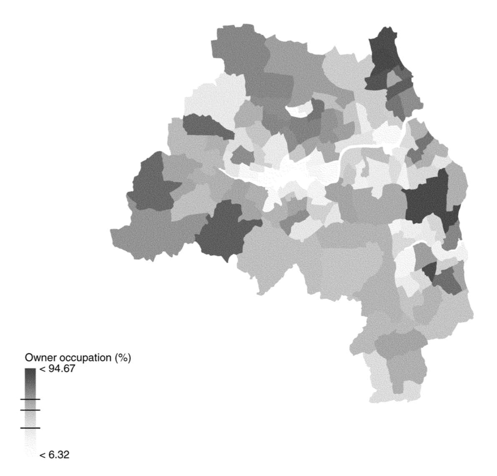
<p class="caption">(\#fig:unnamed-chunk-1)Процент домохозяйств, находящихся во владении</p>
</div>

<div class="figure">

<p class="caption">(\#fig:unnamed-chunk-2)Уровень безработицы</p>
</div>

Обычная линейная регрессия показывает хорошую согласованность между этими параметрами:

<div class="figure">
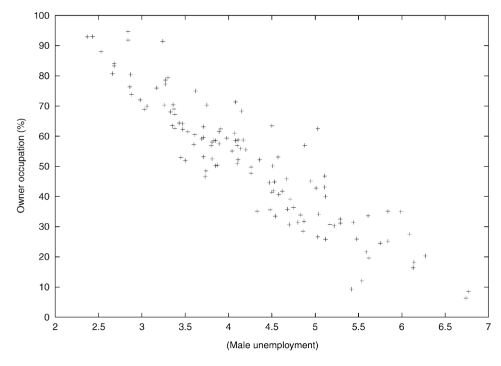
<p class="caption">(\#fig:unnamed-chunk-3)Зависимость процента домохозяйств во владении от уровня безработицы</p>
</div>

Однако остатки регрессии демонстрируют явную пространственную зависимость, что говорит о том, что построенная модель неадекватно описывает исследуемую закономерность:

<div class="figure">

<p class="caption">(\#fig:unnamed-chunk-4)Остатки линейной регрессии</p>
</div>

Чтобы моделировать подобную зависимость остатков, необходим более широкий класс моделей:

$$\boldsymbol\epsilon \sim \mathcal{N}_k(0, \mathbf{C}),$$

где $\mathbf{C}$ — любая допустимая ковариационная матрица.

Данная модель решает проблему независимости остатков, однако порождает две других проблемы:

- Если зависимость остатков имеет пространственный характер (ассоциированы остатки в территориально близких локациях), то матрица $\mathbf{C}$ характер этой зависимости не отражает в явном виде.

- Вектор коэффициентов регрессии $\boldsymbol\beta$ может быть получен путем минимизации $\mathbf{y} - \mathbf{X}\boldsymbol\beta$ путем решения $\beta = \big(\mathbf{X}^T \mathbf{CX} \big)^{-1} \mathbf{X}^T \mathbf{X y}$. Однако это требует знания ковариационной матрицы, которая обычно неизвестна. Поэтому как $\mathbf{C}$, так и $\boldsymbol\beta$ калибруются по выборке.

## Пространственная регрессия

Для того чтобы учесть пространственную автокорреляцию остатков, в модель линейной регрессии добавляется компонента __пространственной авторегрессии__ _(spatial autoregression)_, которая моделирует _пространстенный лаг_:

$$\mathbf{y} = \mathbf{X} \mathbf{\beta} + \color{red}{\rho\mathbf{Wy}} +  \mathbf{\epsilon},$$

- $\rho$ — коэффициент регрессии, отражающий степень пространственной автокорреляции

- $\mathbf{W}$ — матрица пространственных весов

> Полученная модель называется моделью __пространственной регрессии__ (_spatial regression_).

Для получения коэффициентов $\boldsymbol\beta$ и $\rho$ выполним ряд преобразований:

$$\mathbf{y} = \mathbf{X} \mathbf{\beta} + \rho\mathbf{Wy} +  \mathbf{\epsilon}\\
\mathbf{y} - \rho\mathbf{Wy} = \mathbf{X} \mathbf{\beta} + \mathbf{\epsilon}\\
(\mathbf{I} - \rho\mathbf{W})\mathbf{y} = \mathbf{X} \mathbf{\beta} + \mathbf{\epsilon}$$

Предполагая, что матрица $(\mathbf{I} - \rho\mathbf{W})$ инвертируема, получаем систему уравнений пространственной регрессии:

$$\color{red}{\boxed{\color{blue}{\mathbf{y} = (\mathbf{I} - \rho\mathbf{W})^{-1}\mathbf{X}\mathbf{\beta} + (\mathbf{I} - \rho\mathbf{W})^{-1}\mathbf{\epsilon}}}}$$

Данная модель идентична обычной регрессии $\mathbf{y} = \mathbf{X} \mathbf{\beta} + \mathbf{\epsilon}$, но в ней независимые переменные и ошибки линейно трансформированы умножением на $(\mathbf{I} - \rho\mathbf{W})^{-1}$.

$$\mathbf{y} = (\mathbf{I} - \rho\mathbf{W})^{-1}\mathbf{X}\mathbf{\beta} + (\mathbf{I} - \rho\mathbf{W})^{-1}\mathbf{\epsilon}$$

Трансформированная ошибка модели будет иметь ковариационную матрицу

$$\mathbf{C} = \sigma^2 \Big[\big(\mathbf{I} - \rho \mathbf{W}\big)^{-1}\Big]^T (\mathbf{I} - \rho\mathbf{W})^{-1}$$

- Если ковариационная матрица функционально зависит от параметра $\rho$, то она отражает пространственную структуру автокорреляции ошибок.

- Ковариационная матрица должна быть положительно определенной. Для полученного выражения это будет выполняться в случае если $|\rho| \leq 1$ (Griffith, 1988).

$$\mathbf{y} = \mathbf{X} \mathbf{\beta} + \rho\mathbf{Wy} +  \mathbf{\epsilon}$$

Для нахождения коэффициентов $\boldsymbol\beta$ и $\rho$ используется минимизация квадрата случайной компоненты, которую можно представить как $\mathbf{\epsilon} = \mathbf{y} - \mathbf{X} \mathbf{\beta} - \rho\mathbf{Wy}$:

$$\sum_i \Bigg(y_i - \sum_j \beta_j x_{ij} - \rho \sum_j w_{ij} y_j \Bigg)^2$$

Задача решается в 2 этапа:

- находится оптимальное значение $\rho$;
- находится оптимальное значение $\boldsymbol\beta$ путем подстановки в вышеуказанное выражение.

Модель пространственной регрессии может быть использована для осуществления __пространственной фильтрации__ — убирания автокорреляционной составляющей. Для этого необходимо авторегрессионную компоненту (пространственный лаг) перенести в левую часть уравнения:

$$\mathbf{y} = \mathbf{X} \mathbf{\beta} + \rho\mathbf{Wy} + \mathbf{\epsilon}\\
\mathbf{y}^* = \mathbf{y} - \rho\mathbf{Wy} = \mathbf{X} \mathbf{\beta} + \mathbf{\epsilon}$$

Данная модель представляет собой стандартную (непространственную) регрессию для независимой переменной $\mathbf{y}^*$, в которой пространственная корреляция убрана (подвергнута фильтрации).

- Пространственная фильтрация бывает полезна, когда наблюдается несоответствие масштаба наблюдений и масштаба процесса. 

- Например, статистика по показателю, контролируемому на региональном уровне, собирается по муниципалитетам. В этом случае фильтрация позволяет подобрать параметры $\mathbf{\beta}$, учитывающие наличие высокой пространственной автокорреляци.

## Практический анализ

Как мы уже сказали, исследование ПА начинается с анализа географического соседства. То есть, для каждой анализируемой единицы мы должны определить соседние по отношению к ней единицы. Это не так-то просто,поскольку существует множество способов определить соседство. 

Перед выполнением анализа подключим необходимые библиотеки и визуализируем исходные данные, в качестве которых выступают границы муниципалитетов Кировской области.

```r
library(sf)
library(spdep)  # оценка соседства, построение матрицы весов, индексы автокорреляции
library(spatialreg) # пространственная регрессия
library(lattice)
library(RANN)
library(RColorBrewer)
library(readxl)
library(tidyverse)
library(tmap)
library(GWmodel)

options(scipen = 999)

reg_sf = st_read('data/Kirov.gpkg')
## Reading layer `Kirov' from data source `/Users/tsamsonov/GitHub/r-geo-course/data/Kirov.gpkg' using driver `GPKG'
## Simple feature collection with 40 features and 20 fields
## geometry type:  POLYGON
## dimension:      XY
## bbox:           xmin: -216808.3 ymin: 2896149 xmax: 227259 ymax: 3455774
## projected CRS:  unnamed
reg = st_geometry(reg_sf)

par(mar = c(1, 1, 1, 1))
plot(reg, border = "gray50")
```

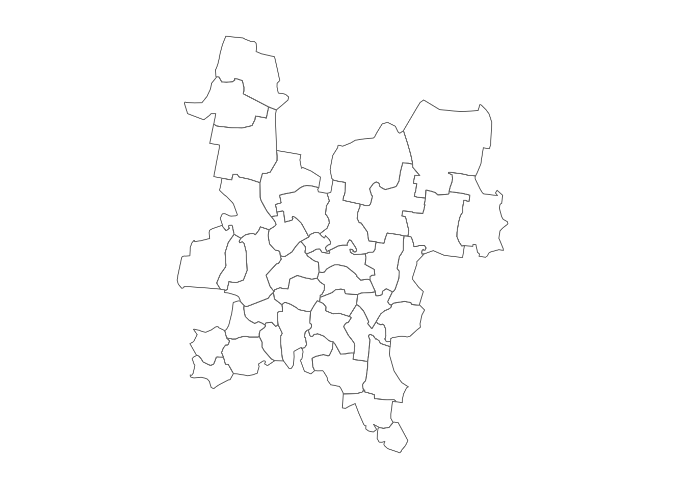

## Пространственное соседство {#autocorrelation_neighbors}

В целом, можно выделить три большие группы методов:

* Соседи по смежности
* Соседи по графу
* Соседи по метрике

__Соседство по смежности__ основано на топологических отношениях между объектами и применяется при анализе данных, приуроченных к площадным единицам --- например, сетке административно-территориального деления. Смежными считаются объекты, границы которых имеют общие точки. При этом возможно два варианта соседства: по правилу ферзя (QUEEN) и правилу ладьи (ROOK). В первом случае соседними будут считаться все пары территориальных единиц, имеющие хотя бы одну общую точку на границе, т.е. соприкасющиеся сторонами и/или углами. Соседство по правилу ладьи является более строгим, так как разрешает только наличие общих сторон вдоль границ, а точечные касания в расчет не берутся. Отличия правил иллюстрирует рисунок ниже.


__Соседство по графу__ основано на отношениях объектов в [триангуляции Делоне](https://ru.wikipedia.org/wiki/Триангуляция_Делоне). В эту же категорию попадают всевозможные фильтрации триангуляции Делоне, которые удаляют из нее ребра, не удовлетворяющие заданным критериям. Более подбробно о них будет сказано ниже.

__Соседство по метрике__ основано на вычислении расстояний между объектами. Соседними по отношению к каждому объекту будут считаться либо $K$ ближайших к нему объектов (соседи по количеству), либо все объекты, удаленные на растояние не далее $D_{max}$ (соседи по расстоянию).

Результатом анализа соседства является __граф соседства__(neighborhood graph), в котором сами объекты являются вершинами, а связи между ними --- ребрами.

Анализ географического соседства на языке R можно провести с помощью пакета [spdep](https://cran.r-project.org/web/packages/spdep/index.html).

Рассмотрим суть и принципы построения графов соседства на основе различных принципов.

### Соседи по смежности {#autocorrelation_neighbors_contguity}

Список соседей по смежности можно получить с помощью функции `poly2nb()`.

Возвращаемый объект является классом типа `nb`. Для каждой единицы в нем содержится список номеров соседних по отношению к нему единиц. По умолчанию функция находит соседей по правилу ферзя:


```r
nb_queen = poly2nb(reg) # Соседство по правилу ферзя
nb_queen  # посмотрим сводную информацию
## Neighbour list object:
## Number of regions: 40 
## Number of nonzero links: 174 
## Percentage nonzero weights: 10.875 
## Average number of links: 4.35
class(nb_queen)  # проверим тип объекта
## [1] "nb"
```

Для объектов типа `nb` в пакете `spdep` определена своя функция `plot()`, которая позволяет визуализировать граф соседства. Функция требует на вход координаты точек, в случае площадных единиц для этого используют центроиды площадей, которые можно получить функцией `coordinates()`:


```r
coords = reg %>% 
  st_centroid() %>% 
  st_coordinates()

# Теперь рисуем граф:
plot(reg, border = "gray50")
plot(nb_queen, coords, pch = 19, cex = 0.5, add = TRUE)
title(main = "Соседи по смежности (правило ферзя)")
```

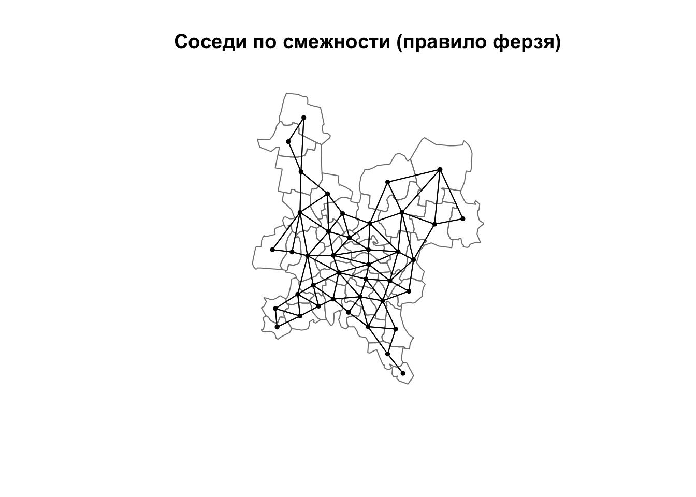

Для определения соседей по правилу ладьи необходимо вызвать функцию `poly2nb()` с аргументом `queen=FALSE`. В нашем случае, правда, это даст тот же результат, поскольку в данных отсутствуют единицы, соприкасающиеся в одной лишь точке:

```r
nb_rook = poly2nb(reg, queen = FALSE) # Соседство по правилу ладьи

plot(reg, border = "grey70")
plot(nb_rook, coords, pch = 19, cex = 0.5, add = TRUE)
title(main = "Соседи по смежности (правило ладьи)")
```

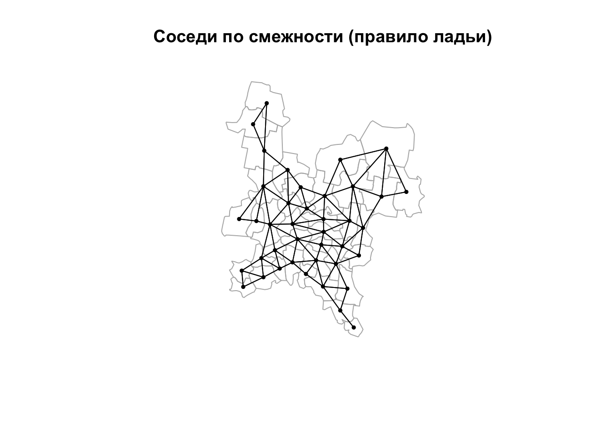

Обратим внимание на то, что функция `poly2nb()` принимает на вход площадные объекты. Все помледующие методы определения соседства (по графу и по метрике) работают с точечными данными.

### Соседи по графу {#autocorrelation_neighbors_graph}

Данная группа методов определения соседства основана на построении триангуляции Делоне для точек исходных данных. Далее эта триангуляция может быть оставлена в неизменном виде, или быть подвержена процедуре фильтрации, которая удалит из нее ребра, не удовлетворяющие заданному критерию.

__Соседи по триангуляции Делоне__ без фильтрации могут быть получены с помощью функции `tri2nb()`:


```r
nb_tin = tri2nb(coords)

plot(reg, border = "grey70")
plot(nb_tin, coords, pch = 19, cex = 0.5, add = TRUE)
title(main = "Соседи по триангуляции Делоне")
```

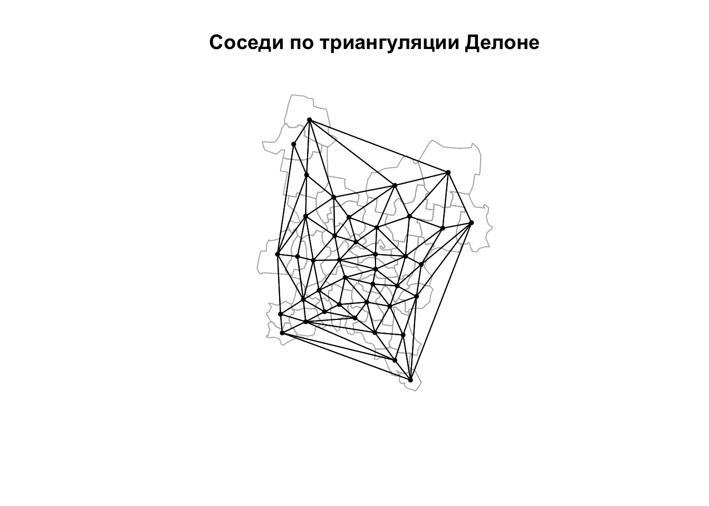

__Соседи по сфере влияния__ получаются путем фильтрации триангуляции Делоне. Для каждой вершины находится расстояние до ближайшего соседа $D_{min}$ --- это расстояние называется радиусом _сферы влияния_ вершины. Остальные ребра триангуляции, инцидентные (примыкающие к) данной вершине, сохраняются только если их длина $D$ превышает радиус ее сферы влияния не более чем вдвое: $D \leq 2D_{min}$. Рассуждая геометрически, можно сказать, что сферы радиусом $D_{min}$, построенные в точке и ее соседях по триангуляции, должны пересекаться. Процесс фильтрации по сфере влияния иллюстрирует рисунок ниже.


Поиск соседей по сфере влияния построен по аналогии с принципом [сферы действия тяготения](https://ru.wikipedia.org/wiki/Сфера_действия_тяготения) из небесной механики. 

Построение соседей по правилу сферы влияния осуществляется в 3 шага:

* определение соседей по триангуляции (функция `tri2nb()`)
* фильтрация триангуляции по правилу сферы влияния (функция `soi.graph()`)
* преобразование полученного объекта в класс `nb`(функция `graph2nb()`)


```r
nb_tin = soi.graph(nb_tin, coords) %>% graph2nb()

plot(reg, border = "grey70")
plot(nb_tin, coords, pch = 19, cex = 0.5, add = TRUE)
title(main = "Соседи по сфере влияния")
```

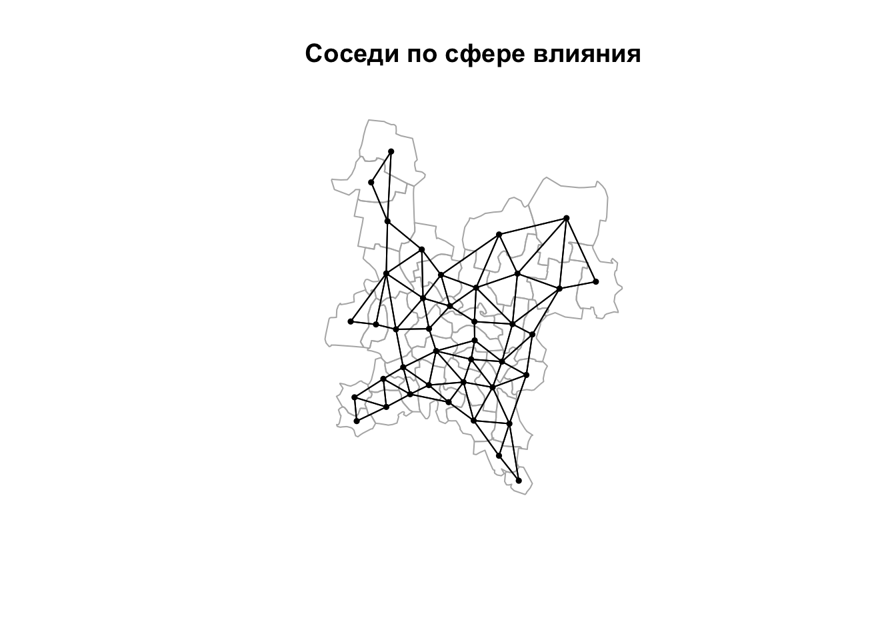

__Соседи по графу Гэбриела__ получаются также путем фильтрации триангуляции Делоне. В каждом треугольнике ребро сохранятся только тогда, когда построенная на нем окружность не включает третью точку треугольника (Gabriel, Sokal, 1969)^[_Gabriel K. R., Sokal R. R._ (1969), __A new statistical approach to geographic variation analysis__, Systematic Zoology, Society of Systematic Biologists, 18 (3): 259–270, DOI: 10.2307/2412323]. Данный метод проиллюстрирован рисунком ниже.


Поиск соседей по графу Гэбриела осуществляется в 2 шага:

* построение графа Гэбриела (функция `gabrielneigh()`)
* преобразование полученного объекта в класс `nb`(функция `graph2nb()`)


```r
nb_gab = gabrielneigh(coords) %>% graph2nb()
 
plot(reg, border = "grey70")
plot(nb_gab, coords, pch = 19, cex = 0.5, add = TRUE)
title(main = "Соседи по графу Гэбриела")
```


__Относительные соседи по графу__ получаются путем фильтрации триангуляции Делоне по следующему правилу: ребро $A$, соединяющее две вершины $p$ и $q$, будет удалено, если найдется третья вершина $r$, такая что расстояния от нее до $p$ и $q$ ($B$ и $C$ соответственно) окажутся короче, чем $A$, то есть: $A > B$ __and__ $A > C$. Полученный граф носит название графа относительных соседей (relative neighborhood graph). Данный метод был предложен французским информатиком Готфридом Туассеном для выявления структуры множества точек, которая бы максимально соответствовала восприятию человеком формы этого множества (Toussaint, 1980)^[_Toussaint G. T._ (1980), __The relative neighborhood graph of a finite planar set__, Pattern Recognition, 12 (4): 261–268, DOI: 10.1016/0031-3203(80)90066-7].

Поиск соседей по графу относительных соседей осуществляется в 2 шага:

* построение графа относительных соседей (функция `relativeneigh()`)
* преобразование полученного объекта в класс `nb`(функция `graph2nb()`)


```r
nb_rel = relativeneigh(coords) %>% graph2nb()

plot(reg, border = "grey70")
plot(nb_rel, coords, pch = 19, cex = 0.5, add = TRUE)
title(main = "Относительные соседи по графу")
```

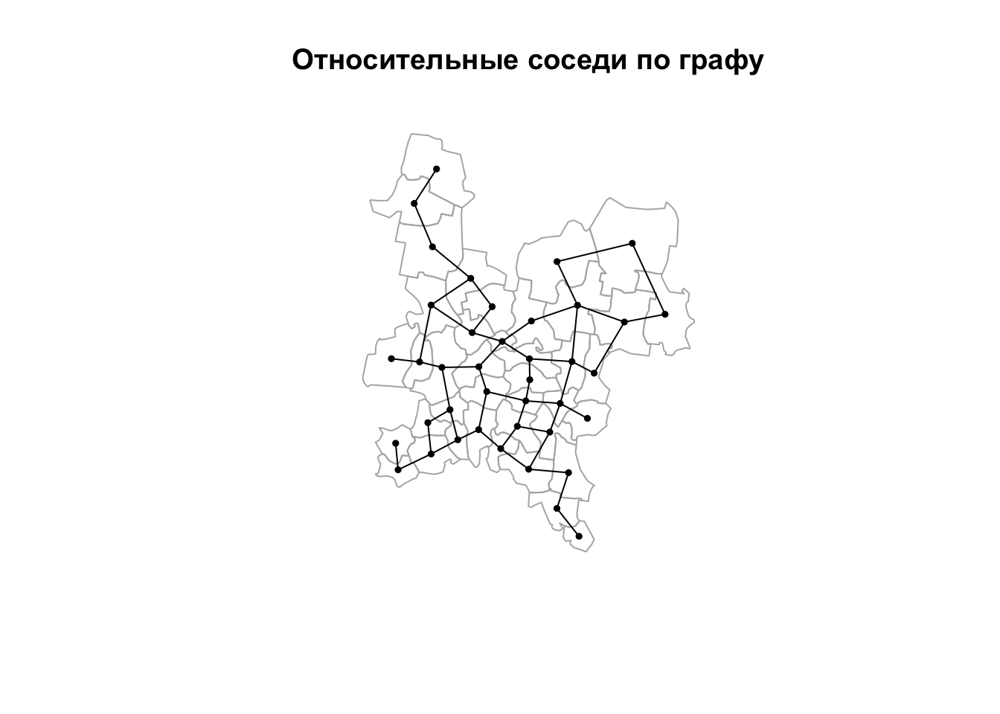

### Соседи по метрике {#autocorrelation_neighbors_metrics}

Поиск соседей по метрике — наиболее простой способ определения соседства. Для его использования необходимо задать метрику (как правило, расстояние между точками), а также критерий фильтрации связей: по количеству ($k$ ближайших) или по расстоянию (не ближе чем $d_1$, но и не далее чем $d_2$).

Поиск __соседей по количеству__ осуществляется в 2 шага:

* построение списка соседей (функция `knearneigh()`)
* преобразование полученного объекта в класс `nb`(функция `knn2nb()`)

Рассмотрим поиск по количеству на примере нескольких пороговых значений:

```r
par(mfrow = c(2,2),
    mar = c(1,1,1,1))
for (i in 1:4){
  nb_knn = knearneigh(coords, k = i) %>% knn2nb()
  
  plot(reg, border = "grey70")
  plot(nb_knn, coords, pch = 19, cex = 0.5, add = TRUE)
  title(main = paste("Ближайшие соседи (k = ", i, ")", sep = ''))
}
```

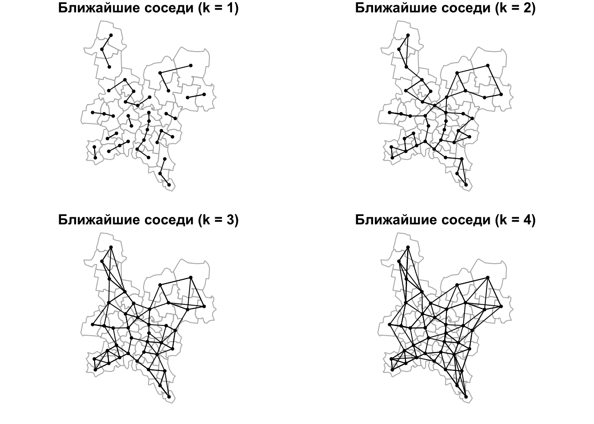

Поиск __соседей по расстоянию__ осуществляется средствами функции `dnearneigh()`, которая принимает 3 аргумента: координаты точек, минимальное $d_1$ и максимальное $d_2$ расстояние. Минимальное расстояние имеет смысл использовать чтобы избежать анализа совпадающих по положению объектов, или когда известен пространственный период явления, превышающий $d_1$:


```r
par(mfrow = c(2,2),
    mar = c(1,1,1,1))
for (d in 5:8) {
  dnearnei = dnearneigh(coords, d1 = 0, d2 = 10000 * d)
  
  plot(reg, border = "grey70")
  plot(dnearnei, coords, pch = 19, cex = 0.5, add = TRUE)
  title(main = paste("Ближайшие соседи (d <=", 10000 * d, ")", sep = ''))
}
```

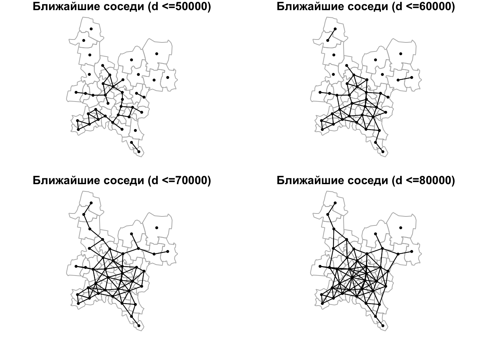

Итак, мы рассмотрели различные принципы выявления географического соседства. После того, как определен сам факт соседства, необходимо оценить силу пространственной связи между всеми парами соседних единиц. Эта оценка производится путем построения __матрицы пространственных весов__(spatial weights matrix).

## Пространственные веса {#autocorrelation_weights}

Пространственные веса характеризуют силу связи между единицами. Если единицы не являются соседними (по выбранному правилу), то пространственный вес их связи будет равен нулю. Во всех остальных случаях веса будут ненулевыми. Поскольку теоретически каждая единица может быть связана с любой другой единицей, распространена форма представления весов в виде матрицы $W$ размером $N \times N$, где $N$ -- число единиц. На пересечении $i$-й строки и $j$-го столбца матрицы располагается вес связи между $i$-й и $j$-й единицей.

Простейший вид матрицы $W$ — бинарная. Если связь есть, то ее вес равен единице (1), если нет — нулю (0). Для построения бинарной матрицы нужно использовать функцию `nb2listw()` c параметром `style="B"`:


```r
Wbin = nb2listw(nb_queen, style = "B")
Wbin  # посмотрим, что за объект получается на выходе (listw)
## Characteristics of weights list object:
## Neighbour list object:
## Number of regions: 40 
## Number of nonzero links: 174 
## Percentage nonzero weights: 10.875 
## Average number of links: 4.35 
## 
## Weights style: B 
## Weights constants summary:
##    n   nn  S0  S1   S2
## B 40 1600 174 348 3416
```

Оказывается, что это на самом деле не матрица. Это объект с двумя слотами. В слоте weights содержатся веса, а в слоте neighbours — идентификаторы соседей:

```r
Wbin$neighbours
## Neighbour list object:
## Number of regions: 40 
## Number of nonzero links: 174 
## Percentage nonzero weights: 10.875 
## Average number of links: 4.35
Wbin$weights
## [[1]]
## [1] 1 1 1 1 1
## 
## [[2]]
## [1] 1 1
## 
## [[3]]
## [1] 1 1 1 1 1 1
## 
## [[4]]
## [1] 1 1 1 1 1 1
## 
## [[5]]
## [1] 1 1 1 1
## 
## [[6]]
## [1] 1 1 1 1 1 1 1
## 
## [[7]]
## [1] 1
## 
## [[8]]
## [1] 1 1 1 1 1 1
## 
## [[9]]
## [1] 1 1 1 1 1 1
## 
## [[10]]
## [1] 1 1 1
## 
## [[11]]
## [1] 1 1 1
## 
## [[12]]
## [1] 1 1 1 1 1
## 
## [[13]]
## [1] 1 1 1 1 1
## 
## [[14]]
## [1] 1 1 1 1 1 1 1
## 
## [[15]]
## [1] 1 1 1 1 1 1
## 
## [[16]]
## [1] 1 1 1
## 
## [[17]]
## [1] 1 1
## 
## [[18]]
## [1] 1 1 1
## 
## [[19]]
## [1] 1 1 1 1
## 
## [[20]]
## [1] 1 1 1
## 
## [[21]]
## [1] 1 1 1 1 1 1
## 
## [[22]]
## [1] 1 1 1 1 1 1
## 
## [[23]]
## [1] 1 1 1 1
## 
## [[24]]
## [1] 1 1 1 1
## 
## [[25]]
## [1] 1 1 1 1 1 1
## 
## [[26]]
## [1] 1 1 1 1 1 1
## 
## [[27]]
## [1] 1 1 1 1
## 
## [[28]]
## [1] 1 1
## 
## [[29]]
## [1] 1 1
## 
## [[30]]
## [1] 1 1 1
## 
## [[31]]
## [1] 1 1 1 1 1 1
## 
## [[32]]
## [1] 1 1 1 1 1
## 
## [[33]]
## [1] 1 1 1 1 1
## 
## [[34]]
## [1] 1 1 1 1 1
## 
## [[35]]
## [1] 1 1 1
## 
## [[36]]
## [1] 1 1 1 1 1
## 
## [[37]]
## [1] 1 1 1 1 1
## 
## [[38]]
## [1] 1 1
## 
## [[39]]
## [1] 1 1 1 1
## 
## [[40]]
## [1] 1 1 1 1
## 
## attr(,"mode")
## [1] "binary"
## attr(,"B")
## [1] TRUE
```

> Дело в том, что матрица весов всегда получается разреженной. То есть, в основном она содержит нули. Это логично, поскольку у каждой точки как правило есть лишь ограниченное число соседей. При этом общее количество точек может быть достаточно большим: чем больше точек мы анализируем, тем больше будет нулей в матрице. Получается, что хранить матрицу как матрицу неэкономично. Более рационально для каждого объекта возвращать список весов, которые соответствуют его соседям. Что и делает функция `nb2listw()`.

Матрицу весов как правило визуализируют, поскольку она может содержать в себе довольно интересные паттерны. Для этого полученный список весов нужно превратить в матрицу с помощью функции `listw2mat()`. Далее использовать функцию `levelplot` из пакета `lattice`, которая раскрашивает ячейки матрицы или растрового набора данных:

```r
M = listw2mat(Wbin)
levelplot(M, main = "Матрица весов (бинарная)")
```

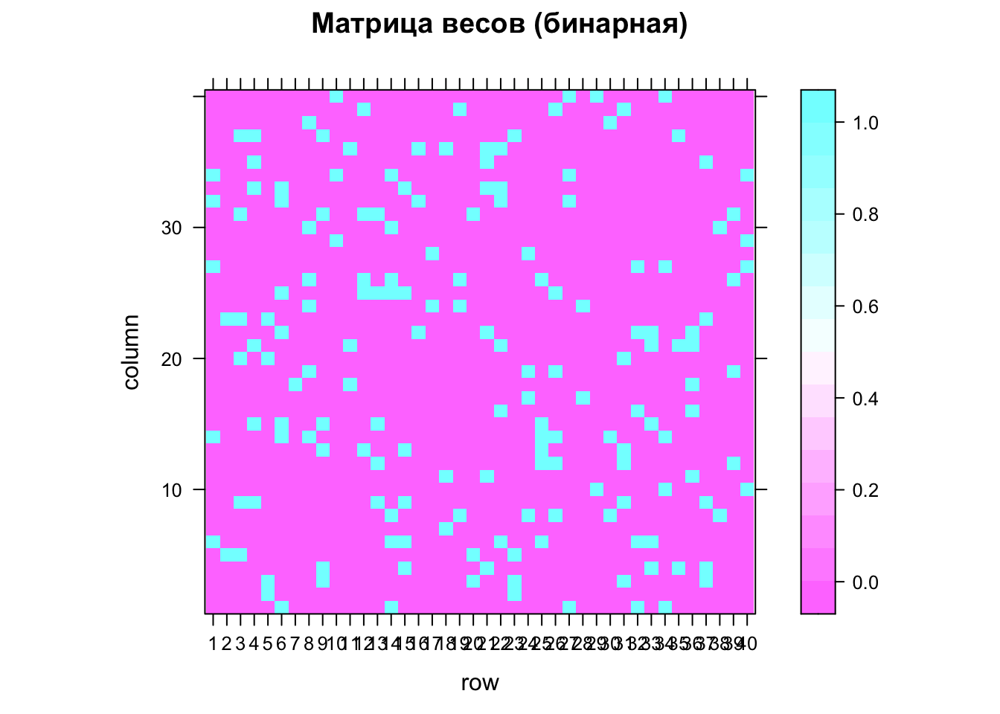

Более интересный результат дает нормированная матрица. В ней веса всех соседей нормируются на количество соседей. То есть, если у текущей точки 2 соседа, их веса будут равны 0.5. Если 3 соседа то 0.33, 4 — 0.25 и так далее. Взвешенная матрица позволяет отразить тот факт, что одна и та же территориальная единица может оказывать неодинаковое влияние на соседние единицы:

```r
Wstand = nb2listw(nb_queen, style = "W")
M = listw2mat(Wstand)

ramp = colorRampPalette(c("white","red"))
levels = 1 / 1:10  # шкала 1, 0.5, 0.33, 0.25 ... 0.1
levelplot(M, 
          main="Матрица весов (нормированная)", 
          at = levels, 
          col.regions=ramp(10))
```

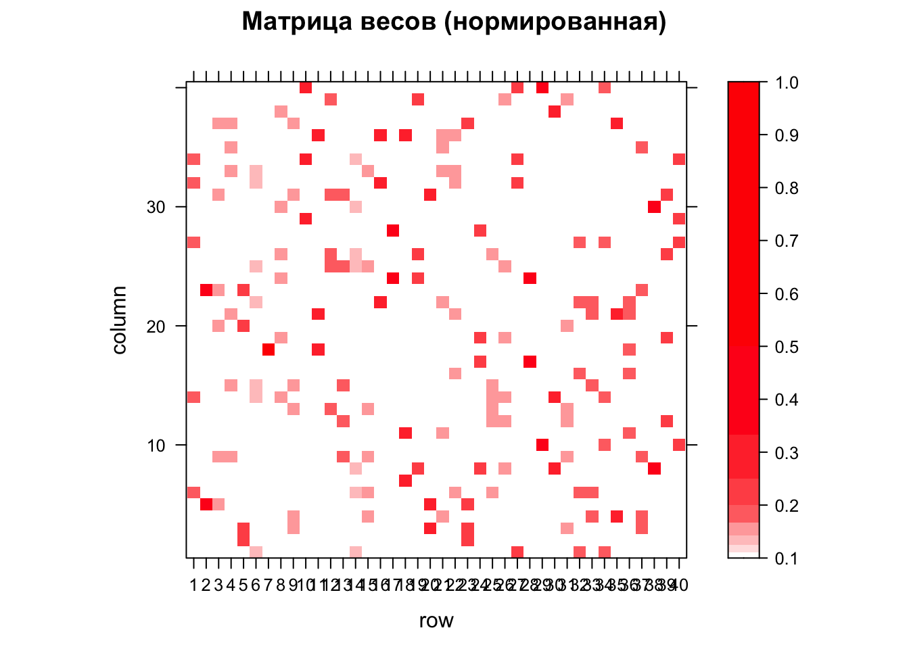

> Обратите внимание, что на этот раз цвета в матрице распределены асимметрично.

Однако есть методы определения соседства, которые приведут также и к асимметричному виду самой матрицы, а не только значений. Например, при поиске соседей по количеству соседство A и B вовсе не означает соседство B и A. Проверим это на опыте:

```r
# Ближайшие соседи (k = 1)
nb_knn = knearneigh(coords, k = 1) %>% knn2nb()

Wstand = nb2listw(nb_knn, style = "B")
M = listw2mat(Wstand)
levelplot(M, 
          main = "Матрица весов (нормированная)", 
          at = levels, 
          col.regions = ramp(10))
```

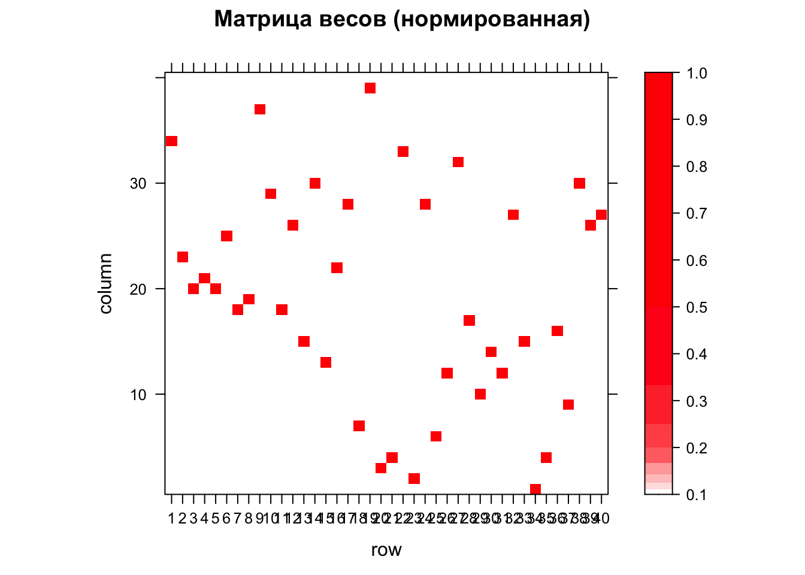

Полученная матрица весов дает искомую меру потенциальной пространственной связи (близости) между всеми парами территориальных единиц. Сопоставив эту меру со значениями показателя, зафиксированными в тех же единицах, можно получить статистическую оценку пространственной автокорреляции изучаемой величины.

## Пространственная автокорреляция {#autocorrelation_measures}

Далее мы рассмотрим вычисление меры пространственной автокорреляции — индекса Морана, который дает оценку статистической зависимости между значением показателя в каждой локации (территориальной единице) и значениями в соседних локациях. Имея предположение о наличии пространственной автокорреляции, можно построить модель пространственной авторегрессии, которая дает фоновое распределение показателя по территориальным единицам, а также случайные остатки.

На этом занятии мы кратко познакомимся со статистической оценкой пространственной автокорреляции, а также построением простейших авторегрессионных моделей.

Мы будем использовать месячную статистику по случаям заболеваний верхних дыхательных путей в Кировской области за 2015 год (данные Росстата по районам, модифицированы автором для большей наглядности анализа).

Вам предстоит выполнить следующую последовательность действий:

1. Загрузить исходные данные (границы районов и таблицу со статистикой)
2. Присоединить таблицу к пространственным данным
3. Построить серию карт по месяцам для визуального анализа данных
4. Вычислить матрицу пространственных весов $W$
5. Вычислить I-индекс Морана для численной оценки пространственной автокорреляции
6. Построить диаграмму рассеяния Морана для визуальной оценки пространственной автокорреляции
7. Подобрать параметры модели пространственной авторегрессии
8. Построить карты реальных, модельных (fitted) значений и остатков (lag)

Для начала построим серию карт чтобы оценить по ним наличие или отсутствие пространственной автокорреляции по месяцам:


```r
mun_src = reg_sf

# Чтение таблицы со статистикой
tab = read_xlsx("data/Kirov.xlsx", 1)

# Соединение таблиц
mun = mun_src %>% 
  left_join(tab, by = c("OBJECTID" = "N")) %>% 
  pivot_longer(cols = 22:31,
               names_to = 'month',
               values_to = 'nsick') %>% 
  mutate(month = ordered(month, levels = c('Январь', 'Февраль', 'Март', 
                                           'Апрель', 'Май', 'Июнь', 
                                           'Июль', 'Август', 'Сентябрь', 
                                           'Октябрь', 'Ноябрь', 'Декабрь'))) %>% 
  st_set_geometry('geometry')

# Построение серии карт
ramp = colorRampPalette(c("white", "orange", "red"))
levels = seq(0, 10000, 1000)
nclasses = length(levels) - 1

ggplot() +
  geom_sf(mun, mapping = aes(geometry = geometry, 
                             fill = cut(nsick, levels))) +
  scale_fill_manual(values = ramp(nclasses),
                    labels = paste(levels[-nclasses-1], '-', levels[-1]),
                    guide = guide_legend(reverse = TRUE),
                    drop = FALSE) +
  facet_wrap(~month)
```

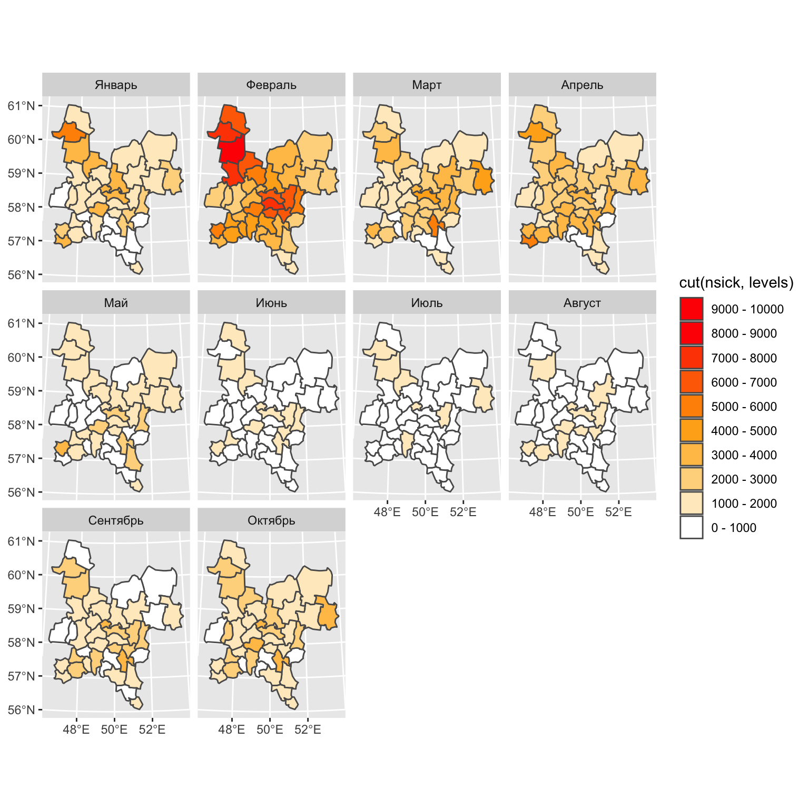

Данная серия карт показывает, что наиболее интересный для анализа месяц — февраль, в котором наблюдается рост заболеваемости, а также очевидно наличие пространственной автокорреляции с двумя очагами в центральных и северо-зпапдных районах области.

Вычислим матрицу пространственных весов:

```r
# Определение соседства (правило ферзя)
nb_queen = poly2nb(mun_src)

# Визиуализация графа соседства
coords = st_centroid(mun_src) %>% st_coordinates()
plot(mun_src %>% st_geometry(), border = "darkgray")
plot(nb_queen, coords, pch = 19, cex = 0.5, add = TRUE)
title(main = "Соседи по смежности (правило ферзя)")
```

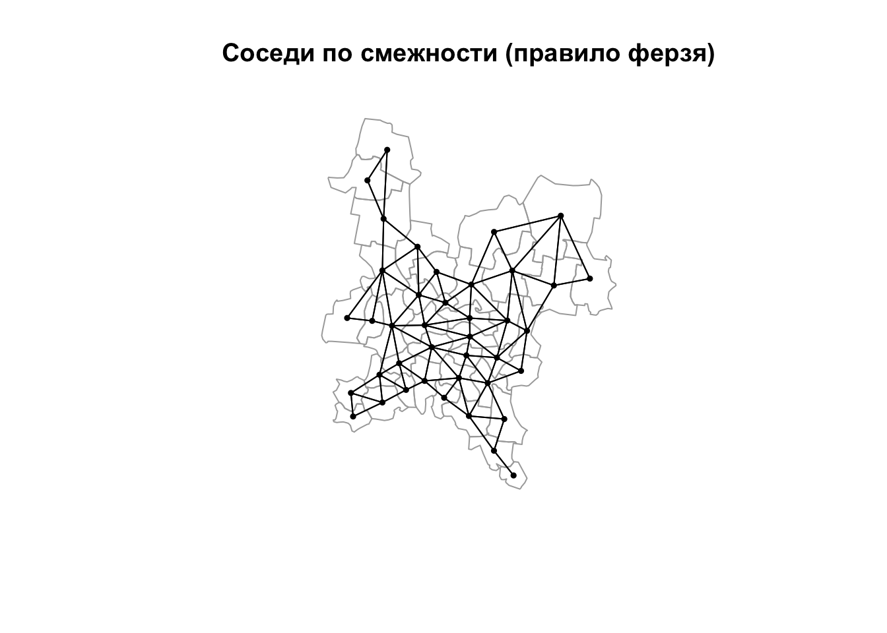

```r

# Вычисление весов (нормированная матрица)
W = nb2listw(nb_queen)

# Визуализация матрицы весов
M = listw2mat(W)

ramp2 = colorRampPalette(c("white","red"))
levels2 = 1 / 1:10 # шкала 1, 0.5, 0.33, 0.25 ... 0.1
levelplot(M, 
          main = "Матрица весов (нормированная)", 
          at = levels2, 
          col.regions = ramp2(10))
```

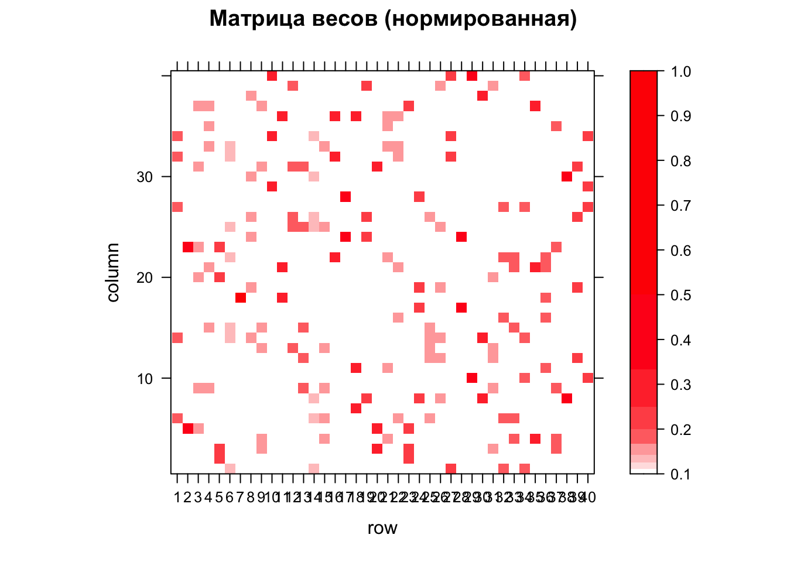

### Индекс Морана (Moran's I)  {#autocorrelation_moran}

Анализ пространственной автокорреляции осуществляется, как правило, путем вычисления индекса Морана (Moran's I), :
$$
I = \frac{n \sum^n_{i=1} \sum^n_{j=i} w_{ij} (y_i - \bar y)(y_j - \bar y)}{ \Big[\sum^n_{i=1} \sum^n_{j=i} w_{ij}\Big] \Big[\sum^n_{i=1} (y_i - \bar y)^2\Big]}
$$
где $n$ --- количество единиц, $w_{ij}$ --- вес пространственной связи между $i$-й и $j$-й единицей, $y_i$ --- значение в $i$-й единице, $\bar y$ --- выборочное среднее по всем единицам

Обратим внимание на то, что индекс Морана по сути и форме записи похож на линейный коэффициент корреляции Пирсона, в котором перебираются все пары соответствующих друг другу значений из рядов $X = \{x_i\}$ и $Y = \{y_i\}$: 

$$
r_{xy} = \frac{\sum_{i=1}^{n}(x_i - \bar x)(y_i - \bar y)}{\sqrt{\sum_{i=1}^{n}(x_i - \bar x)^2} \sqrt{\sum_{i=1}^{n}(y_i - \bar y)^2}}
$$

При вычислении индекса Морана происходит нечто подобное, но под соответствием понимается наличие соседства между $i$-й и $j$-й территориальной единицей. Степень выраженности соседства задается весом $W_{ij}$, который можно наблюдать в числителе формулы индекса Морана. Таким образом, пары территориальных единиц, для которых $w_{ij} = 0$, не участвуют в вычислении индекса Морана.

Индекс Морана для нормально распределенных данных лежит в диапазоне от -1 до 1:

* +1 означает детерминированную прямую зависимость — группировку схожих (низких
   или высоких) значений. 
* 0 означает абсолютно случайное распределение (_CSR — complete spatial randomness_)
* -1 означает детерминированную обратную зависимость — идеальное перемешивание
   низких и высоких значений, напоминающее шахматную доску

Для вычисления индекса Морана следует использовать функцию `moran.test()`, которая дополнительно оценивает статистическую значимость полученного значения:

```r
# Выбираем данные за февраль
feb = mun %>% 
  dplyr::filter(month == 'Февраль')

# Вычисление индекса (тест) Морана
moran.test(feb$nsick, W)
## 
## 	Moran I test under randomisation
## 
## data:  feb$nsick  
## weights: W    
## 
## Moran I statistic standard deviate = 5.0335, p-value = 0.0000002408
## alternative hypothesis: greater
## sample estimates:
## Moran I statistic       Expectation          Variance 
##        0.52118132       -0.02564103        0.01180194
```

Результаты теста включают в себя следующие значения:

* __Moran I statistic__ — полученный индекс Морана
* __Expectation__ — математическое ожидание индекса при нулевой гипотезе $E[I]$
* __Variance__ — дисперсия ожидаемого значения при нулевой гипотезе $D[I]$
* __Moran I statistic standard deviate__ — $Z$-оценка вычисленного индекса Морана
* __p-value__ — $p$-значение вычисленного индекса Морана

Здесь мы видим, что значение индекса Морана равно ~$0.52$ (__Moran I statistic__), то есть присутствует положительная пространственная автокорреляция. При этом вероятность того, что мы ошибаемся в наших выводах, и распределение на самом деле случайно - крайне мала и равна $2.408 \times 10^{-7})$ (__p-value__), то есть менее $0.0001\%$. Можно принимать гипотезу о наличии пространственной автокорреляции.

Рассмотрим чуть подробнее, откуда берутся эти и остальные значения результатов теста, и как их правильно интерпретировать. 

Обычно для сравнения принимают предположение о том, что исследуемая величина распределена случайно. Это так называемая "нулевая" гипотеза. После того как мы вычислили индекс Морана по фактическим данным, можно вычислить его аналитически, приняв нулевую гипотезу. В этом случае математическое ожидание индекса $E[I] = -1/(n-1)$, где $n$ - количество территориальных единиц. Также может быть вычислена и дисперсия индекса Морана $D[I]$ (в англоязычной литературе дисперсия обозначается $V[I]$).

Эти два параметра определяют функцию распределения индекса Морана при всевозможных случайных расстановках исследуемой величины по территориальным единицам. Грубо говоря, такое распределение получится, если мы извлечем все фактические данные, будем их случайным образом перемешивать между территориями и каждый раз вычислять индекс Морана, повторяя процедуру бесконечное число раз. Полученные индексы будут распределены нормально.

Значимость фактического индекса Морана можно оценить путем его сравнения с ожидаемым значением индекса $E[I]$ и его стандартным отклонением $s = \sqrt D$ Для такой оценки используется $Z$-тест Фишера. $Z$-значение вычисляется по формуле: $Z = (I - E[I])/s$

Эта величина говорит нам о том, на какое количество стандартных отклонений фактическое значение индекса Морана удалено от ожидаемого значения. Чем сильнее оно удалено — тем менее вероятно, что фактическое распределение случайно. Какова же эта вероятность? Каждому значению $Z$-score соответствует $p$-значение (_p-value_). _P-value_ — это вероятность появления значений, удаленных от мат. ожидания далее чем $Z$-score.

Например, при: 

* $Z < -1.96$ или $Z > +1.96$ значение $p < 0.05$
* $Z < -2.58$ или $Z > +2.58$ значение $p < 0.01$
              
Это означает, что вероятность того, что фактическое значение индекса Морана могло бы появиться на основе случайно распределенных данных с вероятностью $5\%$ и $1\%$ соответственно. Чем меньше $p$, тем менее вероятно, что распределение случайно. Говорят, что $p$ — это вероятность сделать ошибку первого рода, т.е. отвергнуть нулевую гипотезу, в то время как она на самом деле является истинной.

### Перестановочный тест Морана {#autocorrelation_permutation}

Графически вышеприведенные рассуждения можно иллюстрировать с помощью перестановочного теста (__permutation test__). Для этого значения исследуемой нами величины перемешиваются между территориальными единицами и далее строится гистограмма распределения. Перестановочный тест выполняется с помощью функции `moran.mc()` с параметром `nsim =`, задающим число перестановок:

```r
(sim = moran.mc(feb$nsick, listw = W, nsim = 10000))
## 
## 	Monte-Carlo simulation of Moran I
## 
## data:  feb$nsick 
## weights: W  
## number of simulations + 1: 10001 
## 
## statistic = 0.52118, observed rank = 10001, p-value = 0.00009999
## alternative hypothesis: greater

# Построим гистограмму по вычисленным индексам:
hist(sim$res,
     freq = TRUE,
     breaks = 20, 
     xlim = c(-1,1),
     main = "Перестановочный тест Морана", 
     xlab = "Случайный индекс Морана",
     ylab = "Частота появления",
     col = "steelblue")

# Нанесем фактическое значение
abline(v = sim$statistic, col = "red")
```

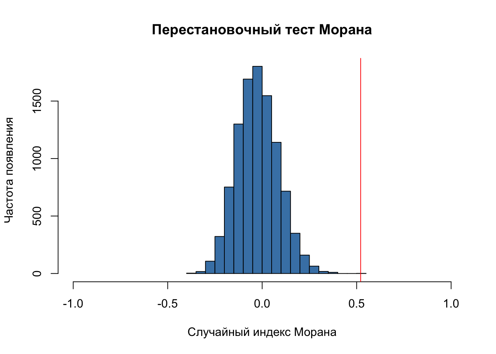

### Диаграмма рассеяния Морана {#autocorrelation_moranscatter}

Наконец, еще одним графическим инструментом оценки пространственной автокорреляции является диаграмма рассеяния Морана. По оси $X$ откладывается значение в каждой территориальной единице, в по оси $Y$ — ее пространственный лаг, который представляет собой средневзвешенное значение по всем ее соседям: 

```r
moran.plot(feb$nsick, W)
```


На диаграмме рассеяния Морана линиями отмечаются средние значения по обеим осям, а наклонной линией представляется линейная регрессия этих значений, при этом тангенс угла наклона прямой равен значению индекса Морана. Поскольку в данном случае распределение явно не случайно, можно приступать к его моделированию.

### Пространственная авторегрессия {#autocorrelation_autoregression}

Поиск уравнения пространственной регрессии и его авторегрессионной составляющей может быть выполнен посредством функций `spautolm()` и `lagsarlm()` из пакета __spatialreg__. В качестве первого параметра каждой из этих функций выступает формула, которая работает по следующему принципу:

- `Y ~ 1` позволит найти коэффициенты $\rho$ и остатки $\epsilon$ пространственной авторегрессии вида $\mathbf{y} = \mu  + \rho\mathbf{Wy} +  \mathbf{\epsilon}$, где $\mu$ — константа.

- `Y ~ X` позволит найти коэффициенты $\beta$, $\rho$ и остатки $\epsilon$ пространственной регрессии вида $$\mathbf{y} = \mu + \mathbf{X} \mathbf{\beta} + \rho\mathbf{Wy} +  \mathbf{\epsilon}.$$

- `Y ~ X - 1` позволит найти коэффициенты $\beta$, $\rho$ и остатки $\epsilon$ пространственной регрессии вида $$\mathbf{y} = \mathbf{X} \mathbf{\beta} + \rho\mathbf{Wy} + \mathbf{\epsilon}$$ без свободного члена $\mu$ 


```r
model = lagsarlm(nsick ~ 1, data = feb, listw = W)
model
## 
## Call:
## lagsarlm(formula = nsick ~ 1, data = feb, listw = W)
## Type: lag 
## 
## Coefficients:
##         rho (Intercept) 
##    0.704957 1223.330336 
## 
## Log likelihood: -346.2344
```

Расшифровываются параметры модели следующим образом:

* `Intercept` = $\mu$,
* `rho` = $\rho$

Извлекаем модельные значения $Z$ и записываем в таблицу

```r
# Извлекаем результаты пространственной авторегрессии
feb_spreg = feb %>% 
  mutate(fitted = model$fitted.values,
         residual = model$residuals) %>% 
  pivot_longer(cols = c(nsick, fitted, residual), 
               names_to = 'type',
               values_to = 'value') %>% 
  st_set_geometry('geometry')

# Построение серии карт
ramp = colorRampPalette(c('steelblue3', 'white', 'orange', 'violetred'))
levels = seq(-3000, 10000, 1000)
nclasses = length(levels) - 1

# Сравниваем исходные данные, модельные и остатки
ggplot() +
  geom_sf(feb_spreg, mapping = aes(geometry = geometry, fill = cut(value, levels))) +
  scale_fill_manual(values = ramp(nclasses),
                    labels = paste(levels[-nclasses-1], '-', levels[-1]),
                    guide = guide_legend(reverse = TRUE),
                    drop = FALSE) +
  facet_wrap(~type)
```

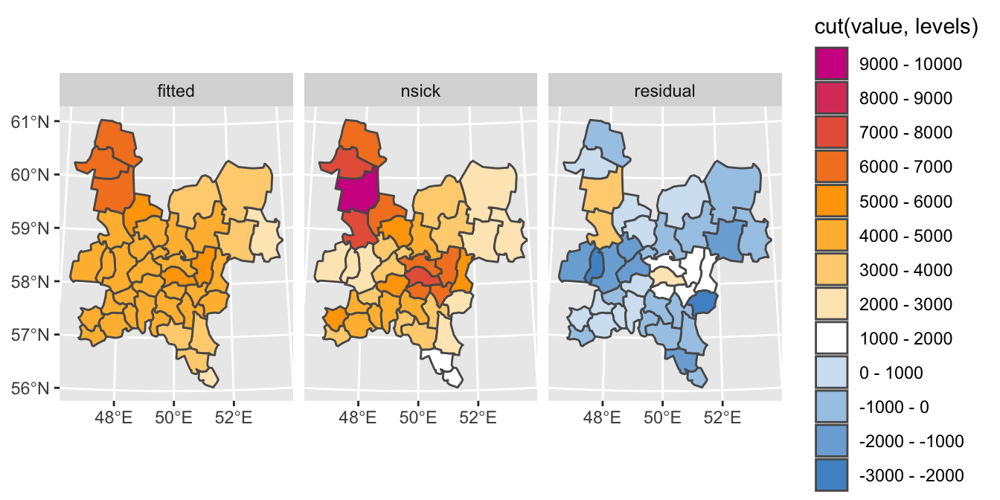

## Краткий обзор {#spreg_review}

Для просмотра презентации щелкните на ней один раз левой кнопкой мыши и листайте, используя кнопки на клавиатуре:
<iframe src="https://tsamsonov.github.io/r-geo-course/slides/15-SpatialRegression_slides.html#1" width="100%" height="500px"></iframe>

> Презентацию можно открыть в отдельном окне или вкладке браузере. Для этого щелкните по ней правой кнопкой мыши и выберите соответствующую команду.

## Контрольные вопросы и упражнения {#questions_tasks_spreg}

### Вопросы {#questions_spreg}

1. Дайте определение пространственной автокорреляции.
1. В чем выражается пространственная зависимость и пространственная гетерогенность?
1. Сформулируйте задачу и напишите уравнение пространственной авторегрессии. Чем обусловлена необходимость в использовании такой модели?
1. Что такое пространственный лаг?
1. В чем заключается процедура пространственной фильтрации?
1. Перечислете основные методы определения географического соседства.
1. Чем отличается соседство по методу ферзя и соседство по методу ладьи?
1. Какие методы установления соседства напрямую неприменимы к точечным данным?
1. Что понимается под сферой влияния в соответствующем методе установления географического соседства? По аналогии с каким принципом небесной механики построен поиск соседей на основе этого принципа?
1. Что объединяет все методы поиска соседей по графу? На основе какой структуры данных они работают?
1. Сформулируйте принцип фильтрации ребер графа, с помощью которого получается граф Гэбриела.
1. Что понимается под относительным соседством по графу?
1. Назовите два основных метода определения соседства по метрике.
1. Перечислите основные функции пакетов R, которые можно использовать для установления географического соседства.
1. С помощью каких структур данных осуществляется моделирование соседства в R?
1. Дайте определение пространственного веса. Что харктеризует эта величина?
1. Назовите основные методы вычисления пространственных весов. 
1. Какая структура данных используется для хранения информации о пространственных весах? Какими свойствами она обладает?
1. Перечислите индексы, которые могут использоваться для оценки пространственной автокорреляции.
1. Напишите формулу для вычисления индекса Морана. Какие значения он может принимать и как их следует интерпретировать? Аналогом какого статистического коэффициента является данный индекс? 
1. Изложите алгоритм выполнения и назначение перестановочного теста Морана.
1. Что из себя представляет диаграмма рассеяния Морана и в каких задачах они может быть востребована?
1. Для каких целей используется локальный анализ пространственной автокорреляции (LISA)? Какой коэффициент можно использовать для квантификации локальных оценок автокорреляции? Как он связан с индексом Морана?

### Упражнения {#tasks_spreg}

1. Выполните анализ пространственной зависимости (автокорреляции) для данных Росстата по урожайности зерновых культур по муниципалитетам Ростовской, Волгоградской и Саратовской областей. Для этого загрузите [границы муниципалитетов](https://github.com/tsamsonov/r-geo-course/blob/master/data/Yield_Shapes.gpkg) и [статистику](https://github.com/tsamsonov/r-geo-course/blob/master/data/Yield_Data.xlsx) за 2012 и 2013 гг. В процессе выполнения анализа необходимо:
    - Визуализировать исходные данные.
    - Отфильтровать из данных Волгоград, Ростов-на-Дону и Саратов, поскольку для них статистика отсутствует.
    - Построить граф соседства методом ферзя и визуализировать его.
    - Вычислить матрицу пространственных весов и визуализировать ее.
    - Выполнить тест Морана для данных 2013 г. (далее тоже везде 2013 год).
    - Подобрать параметры модели пространственной авторегрессии.
    - Визуализировать результаты моделирования (исходные данные, модельные данные, остатки)

----
_Самсонов Т.Е._ **Визуализация и анализ географических данных на языке R.** М.: Географический факультет МГУ, 2021. DOI: [10.5281/zenodo.901911](https://doi.org/10.5281/zenodo.901911)
----
