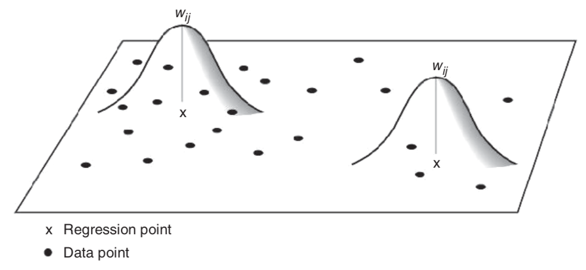
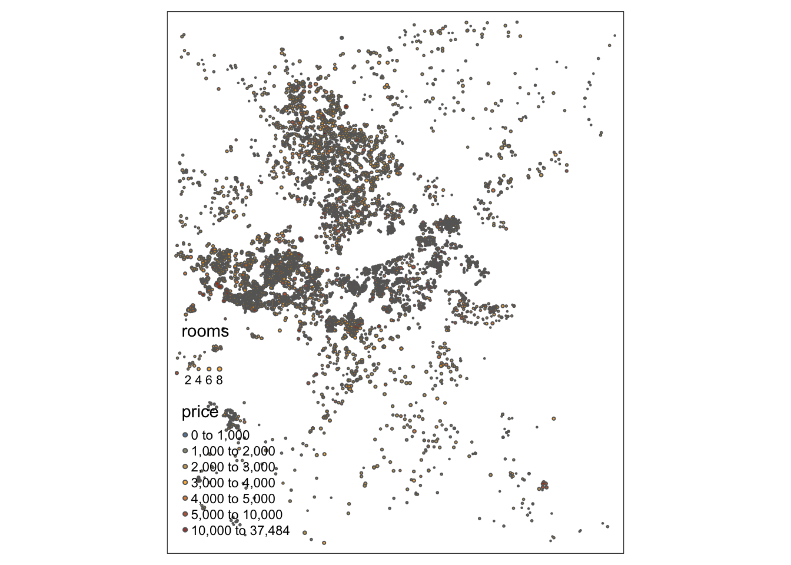

# Географически взвешенная регрессия {#gwr}


```r
library(sf)
library(RColorBrewer)
library(readxl)
library(tidyverse)
library(tmap)
library(GWmodel)
```

[Программный код главы](https://github.com/tsamsonov/r-geo-course/blob/master/code/15-SpatstatAutocorrelation.R)

## Географически взвешенная регрессия (GWR) {#autocorrelation_gwr}

В стандартной модели линейной регрессии параметры модели предполагаются постоянными:

$$\mathbf{y} = \mathbf{X} \boldsymbol\beta + \boldsymbol\epsilon,$$

Для $i$-й локации решению выглядит следующим образом:

$$y_i = \beta_0 + \beta_1 x_{1i} + \beta_2 x_{2i} + ... + \beta_m x_{mi} + \epsilon_i$$

Коэффициенты находятся методом наименьших квадратов:

$$\mathbf{\beta}' = (\mathbf{X}^T\mathbf{X})^{-1} \mathbf{X}^T \mathbf{Y}$$

Такой подход, однако не учитывает того, что характер зависимости между переменными может меняться по пространству.

В __географически взвешенной регрессионной модели__ веса определяются для каждой локации:

$$y_i = \beta_{0i} + \beta_{1i} x_{1i} + \beta_{2i} x_{2i} + ... + \beta_{mi} x_{mi} + \epsilon_i$$

В этом случае область оценки параметров $\mathbf{\beta}$ ограничивается некой окрестностью точки $i$. Математически это достигается применением весовых коэффициентов для данных независимых переменных:

$$\mathbf{\beta}'(i) = (\mathbf{X}^T \color{blue}{\mathbf{W}(i)}\mathbf{X})^{-1} \mathbf{X}^T \color{blue}{\mathbf{W}(i)} \mathbf{Y},$$

где $\mathbf{W}(i)$ есть матрица весов для точки $i$. Коэффициенты матрицы подбираются таким образом, что близкие локации получают более высокий вес.

Матрица $\mathbf{W}(i)$ имеет размер $n \times n$, где $n$ — число точек наблюдений:

$$\mathbf{W}(i) = \begin{bmatrix}
    w_{i1} & 0 & 0 & \dots  & 0 \\
    0 & w_{i2} & 0 & \dots  & 0 \\
    0 & 0 & w_{i3} & \dots  & 0 \\
    \vdots & \vdots & \vdots & \ddots & \vdots \\
    0 & 0 & 0 & \dots  & w_{in}
\end{bmatrix},$$

где $w_{ik}$ есть вес, который имеет точка $k$ при локальной оценке параметров в точке $i$.

### Весовые функции

Весовая функция должна быть убывающей. Существует множество вариантов таких функций, но наиболее часто используются гауссоподобные варианты:

<div class="figure">

<p class="caption">(\#fig:unnamed-chunk-2)Весовая функция</p>
</div>

В случае _фиксированной_ весовой функции окрестность всегда имеет фиксированный размер:

$$w_{ij} = \operatorname{exp}\{-\frac{1}{2} (d_{ij}/h)^2\},$$

где $d_{ij}$ есть расстояние, $h$ — полоса пропускания.

<div class="figure">

<p class="caption">(\#fig:unnamed-chunk-3)Фиксированная весовая функция</p>
</div>

В случае _адаптивной_ весовой функции окрестность ограничивается $N$ ближайшими точками. За пределами этой окрестности веса принимаются равными нулю:

<div class="figure">

<p class="caption">(\#fig:unnamed-chunk-4)Адаптивная весовая функция</p>
</div>

__Полоса пропускания__ $h$ обладает следующими особенностями:

- малая полоса пропускания приводит к большой дисперсии локальных оценок;
- большая полоса пропускания приводит к смещенности оценки;
- при $h \rightarrow \infty$ локальная модель приближается к _глобальной регрессии_;
- при $h \rightarrow 0$ локальная модель «сворачивается» вокруг данных.

### Практический анализ

В качестве примера проанализируем каким образом цена жилья зависит от количества комнат на примере данных по стоимости недвижимости в Бостоне, доступных на [данном сайте](https://www.jefftk.com/apartment_prices/data-listing), и выгруженных с североамериканского информационного портала недвижимости [padmapper.com](https://www.padmapper.com/apartments/boston-ma?box=-71.2297689,42.2745193,-70.9215169,42.4531515):


```r
realest = read_delim(url('https://www.jefftk.com/apartment_prices/apts-1542637382.txt'),
                 delim = ' ',
                 col_names = c('price', 'rooms', 'id', 'lon', 'lat')) %>%
  st_as_sf(coords = c('lon', 'lat'), crs = 4326) %>%
  st_transform(3395)

# tmap_mode('view')
tm_shape(realest) +
  tm_bubbles(col = 'price',
             size = 'rooms',
             style = 'fixed',
             breaks = c(0, 1000, 2000, 3000, 4000, 5000, 10000, max(realest$price)),
             scale = 0.25,
             palette = colorRampPalette(c('steelblue4', 'orange', 'darkred'))(7),
             alpha = 0.8) +
  tm_view(symbol.size.fixed = TRUE)
```



Для того чтобы оценить пространственую неравномерность реакции стоимости жилья на увеличение количества комнат, построим модель географически взвешенной регрессии:

```r
samples = realest %>% dplyr::sample_n(1000) %>% as('Spatial')

(gwr_res = gwr.basic(price ~ rooms, data = samples, bw = 1000, kernel = 'gaussian'))

tm_shape(gwr_res$SDF) +
  tm_bubbles(col = 'rooms', # это не количество комнат, а коэффициент регрессии
             style = 'quantile',
             scale = 0.3,
             palette = 'Reds',
             alpha = 0.5) +
  tm_view(symbol.size.fixed = TRUE)
```

Как видно, модель GWR наглядно показывает наличие пространственной гетерогенности (неоднороности) в распределении показателя. Четко видны районы (в основном цеентральные, но также и часть окраинных), где стоимость жилья резко возрастает при увеличении количества комнат.

## Краткий обзор {#gwr_review}

Для просмотра презентации щелкните на ней один раз левой кнопкой мыши и листайте, используя кнопки на клавиатуре:
<iframe src="https://tsamsonov.github.io/r-geo-course/slides/15-SpatialRegression_slides.html#1" width="100%" height="500px"></iframe>

> Презентацию можно открыть в отдельном окне или вкладке браузере. Для этого щелкните по ней правой кнопкой мыши и выберите соответствующую команду.

## Контрольные вопросы и упражнения {#questions_tasks_gwr}

### Вопросы {#questions_gwr}

1. Сформулируйте задачу и напишите уравнение географически взвешенной регрессии. Чем обусловлена необходимость в использовании такой модели?
1. Определите назначение весовой функции в методе географически взвешенной регрессии. Каков ее основной параметр?

### Упражнения {#tasks_gwr}


----
_Самсонов Т.Е._ **Визуализация и анализ географических данных на языке R.** М.: Географический факультет МГУ, 2021. DOI: [10.5281/zenodo.901911](https://doi.org/10.5281/zenodo.901911)
----
