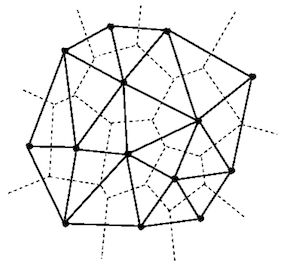
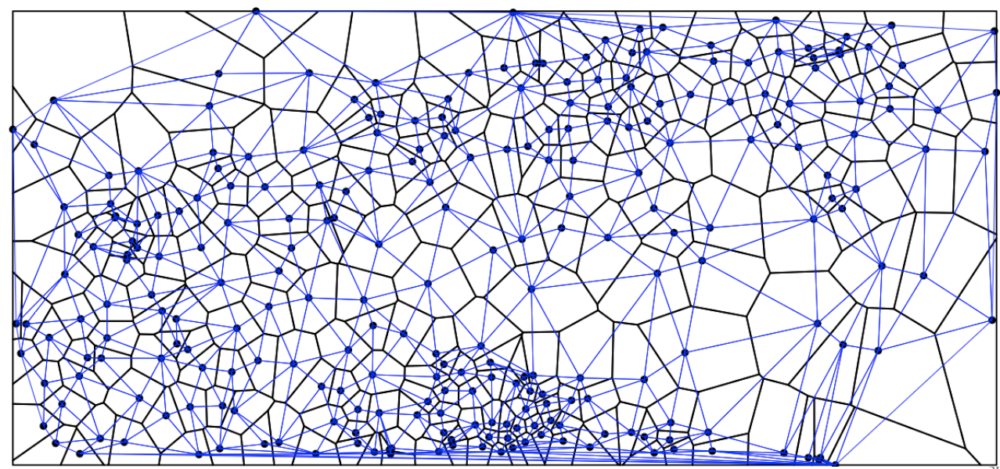
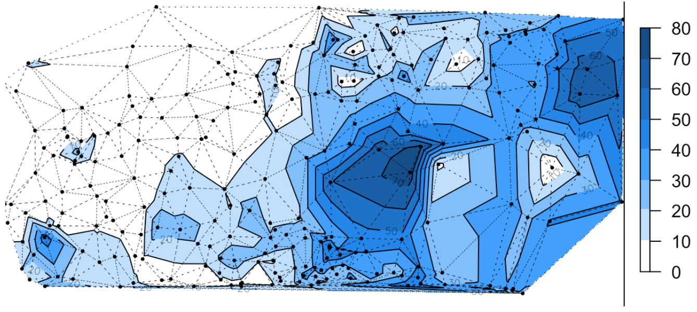
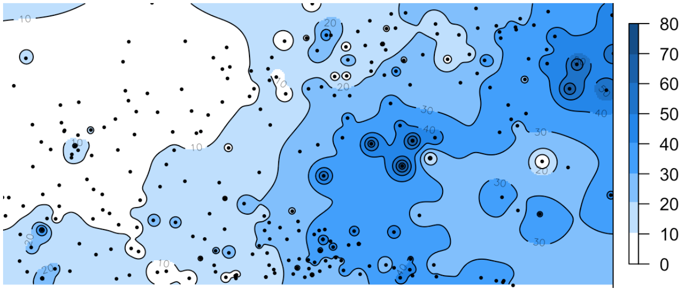
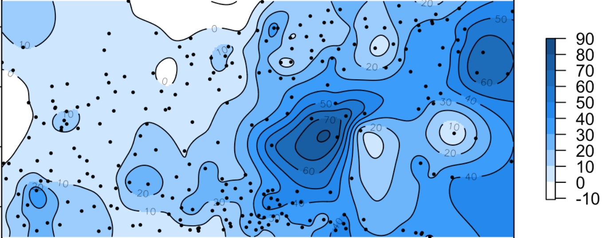
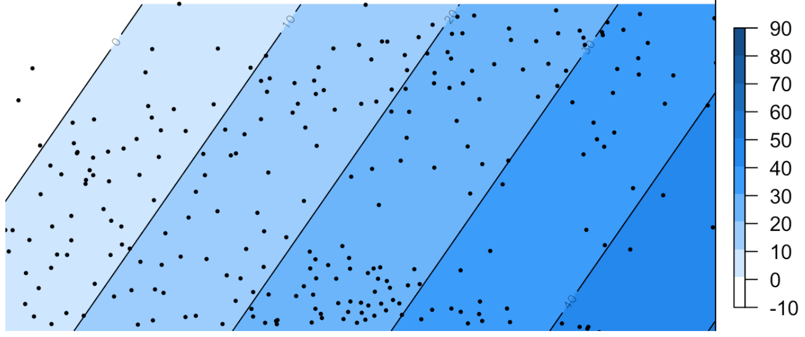
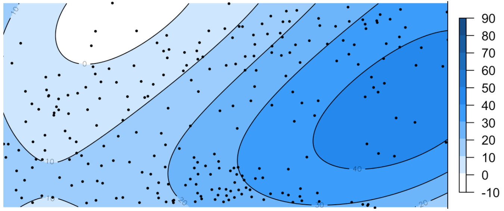

```{r setup, include=FALSE}
options(htmltools.dir.version = FALSE)
```

## Интерполяция

- __Интерполяция__ в общем случае --- это способ нахождения промежуточных значений величины по имеющемуся дискретному набору известных значений
.
- Методы которые производят интерполяцию на основе заданной аналитической зависимости, называют детерминистическими.

- Параметры этой зависимости могут быть как априори заданы пользователем, так и определяться автоматически одним из методов оптимизации

---

## Детерминистическая интерполяция

- Предполагается что анализируемые данные описываются некоторой аналитической функцией $Z(p, \lambda)$, где $p$ — точка, а $\lambda$ — набор внутренних параметров модели.

- Задача: на основе известных данных $Z_i = Z(p_i)$, измеренных в точках $p_i$, и другой информации об исследуемом явлении подобрать набор параметров $\lambda$ и построить функцию $Z(p, \lambda)$ для всей исследуемой области $S$.

---

## Узлы интерполяции

- Как правило, оценка производится по регулярной сетке узлов
- В общем случае положение узлов интерполяции произвольно


---

## Сетка (растр) интерполяции

Каждый узел регулярной сетки можно сопоставить с центром ячейки, что обеспечивает сплошное покрытие и позволяет построить изолинии распределения показателя


---

## Триангуляция Делоне и диаграмма Вороного

.left-column[]

.right-column[
__Триангуляция__ (на плоскости) — это разбиение фигуры на треугольники. 

> Под триангуляцией множества точек понимается триангуляция их выпуклой оболочки, в которой сами точки являются вершинами треугольников.

__Диаграмма Вороного__ однозначно соответствует триангуляции Делоне и строится на основе серединных перпендикуляров к сторонам треугольников
]

---

## Линейные интерполяторы

Искомая функция в произвольной точке $\mathbf{p}$ ищется в виде линейной комбинации:

$$Z^{*}(\mathbf{p}) = \sum_{p_i \in D(\mathbf{p})} w_i (\mathbf{p}) Z(\mathbf{p}_i),$$
где:

- $Z^{*}(\mathbf{p})$ — оцениваемое значение в точке $\mathbf{p}$,
- $Z(\mathbf{p}_i)$ — известные значения в точках $\mathbf{p}_i$,
- $D(\mathbf{p})$ — множество точек $\mathbf{p}_i$, из некоторой окрестности точки p, определяемой расстоянием или количеством,
- $w_i(\mathbf{p})$ — нормированный вес точки $\mathbf{p}_i$ для точки $\mathbf{p}$

---

## Метод ближайшего соседа

- Каждый узел интерполяции $p$ получает значение, равное значению ближайшей к нему точки наблюдений $p_k$

- Множество $D$ состоит из единственной точки $p_k (w_k = 1)$, в полигон Вороного которой попадает точка $p$.

- Результатом является ступенчатая поверхность, где в пределах зоны влияния каждой точки $p_i$ значение функции постоянно и равно $Z(p_i)$

---

## Метод ближайшего соседа

Всю область интерполяции можно разбить с помощью диаграммы Вороного на зоны принадлежности к точкам наблюдений



---

## Метод ближайшего соседа

В пределах каждой ячейки значений интерполируемой величины считается постоянным


---

## Метод ближайшего соседа

Каждый узел интерполяции получает значение, равное значению ближайшей к нему точки наблюдений


---

## Метод ближайшего соседа

Результирующая поверхность является кусочно-постоянной


---

## Метод ближайшего соседа

Результирующая поверхность является кусочно-постоянной


---

## Метод естественного соседа

- Известен также как интерполяция по методу Сибсона (Sibson 1981)
- Множество $D$ состоит из точек $p_i$, которые являются соседями точки p при встраивании ее в диаграмму Вороного точек $p_i$

Веса определяются из соотношения:

$$w_i(p) = A(v \cap v_i) / A(v)$$
- $v_i$ — зона влияния точки $p_i$ в исходной диаграмме Вороного, 
- $v$ — зона влияния точки $p$ при ее встраивании в диаграмму, 
- $A$ — площадь зоны влияния, 
- $\cap$ — пересечение

---

## Интерполяция на основе триангуляции

Для выполнения интерполяции на первом этапе необходимо для каждого треугольника найти уравнение плоскости, которое содержит четыре неизвестных коэффициента:
$$
Ax + By + Cz + D = 0,
$$
Для вычисления $z(x, y)$ в произвольно заданной точке необходимо определить треугольник, в который попадает точка, и выразить значения искомой величины, используя коэффициенты уравнения плоскости для найденного треугольника:
$$
z(x, y) = -\frac{1}{C}(Ax+By+D)
$$
---

## Интерполяция на основе триангуляции

Также возможно применение бикубической интерполяции, или __метода Акимы__, который позволяет сгладить поверхность за счет применения полиномов 5-й степени:

$$z(x, y) = \sum_{j=0}^5 \sum_{k=0}^{5-j} q_{jk} x^j y^k$$
---

## Интерполяция на основе триангуляции

Линейная интерполяция:



---

## Интерполяция на основе триангуляции

Метод Акимы:


---

## Метод обратно взвешенных расстояний

В методе обратно взвешенных расстояний значение показателя в произвольной точке получается как средневзвешенная сумма значений в исходных точках. 

Веса определяются обратно пропорционально расстоянию: чем дальше исходная точка удалена, тем меньший вес она будет иметь в оценке. 

$$z(\mathbf{p}) = \begin{cases}
\dfrac{\sum_{i = 1}^{N}{ w_i(\mathbf{p}) z_i } }{ \sum_{i = 1}^{N}{ w_i(\mathbf{p}) } }, & \text{если } d(\mathbf{p},\mathbf{p}_i) \neq 0 \text{ для всех } i, \\
 z_i, & \text{если } d(\mathbf{p},\mathbf{p}_i) = 0 \text{ для одного } i,
\end{cases}$$

где $w_i(\mathbf{p}) = | \mathbf p - \mathbf p_i | ^{-\beta}$ --- весовая функция.

---

## Метод обратно взвешенных расстояний

Метод __Шепарда__ — одна из наиболее распространенных модиификаций метода IDW. Веса вычисляются по формуле:

$$w_i(p) = d^{-2}_i / \sum_{j=1}^n d^{-2}_j$$
---

## Метод обратно взвешенных расстояний

$\beta = 2$



---

## Метод обратно взвешенных расстояний

$\beta = 3$


---

## Метод обратно взвешенных расстояний

$\beta = 4$


---

## Метод обратно взвешенных расстояний

$\beta = 5$


---

## Метод обратно взвешенных расстояний

$\beta \rightarrow \infty$


В предельном случае при больших значениях β метод  IDW вырождается в метод ближайшего соседа

---

## Радиальные базисные функции

Модельная функция ищется в виде:

$$Z^{*}(\mathbf{p}) = \sum_{i=1}^{n} \lambda_i R (d_i) + P_k (\mathbf{p}),$$
где $R$ — радиальная функция, а $P_k$ — полином степени $k$

- Мультиквадрики: $R(d) = \sqrt{d^2 + \delta^2}$
- Обратные мультиквадрики: $R(d) = 1 / \sqrt{d^2 + \delta^2}$
- Сплайны минимальной кривизны: $R(d) = d^2 \ln(d^2)$
- Мульти-логарифмическая: $R(d) = \ln(d^2 + \delta^2)$

---

## Радиальные базисные функции

__Сплайн минимальной кривизны__ (_thin plate spline — TPS_), дает поверхность, обладающую максимально низкой кривизной между исходными точками. 
 

---

## Иерархические базисные сплайны

В данном методе поверхность представляется как сумма кусочно-полиномиальных функций, определяемых на основе двумерных базисных сплайнов

- Коэффициенты сплайнов задаются на регулярной сетке
- На каждому последовательном уровне сетка сгущается
- Для вычисления коэффициентов каждого последующего уровня в качестве значений в опорных точках используются остатки --- разность исходных значений и суммы значений функций предыдущих уровней.
- Результирующая поверхность получается как сумма функций для каждого уровня иерархии

> _При достаточно мелкой сетке коэффициентов метод получается интерполяционным._

---

## Иерархические базисные сплайны

Для каждого конкретного уровня иерархии модельная функция представляется в виде:

$$f(x,y) = \sum_{k=0}^{3} \sum_{l=0}^{3} B_k(s) B_l(t) c_{(i+k)(j+l)},$$
- $h$ - шаг сетки, на которой заданы коэффициенты $с_{ij}$,
- $i = [x/h] -1$,
- $j = [y/h] -1$,
- $s = x/h - [x/h]$,
- $t = y/h - [y/h]$,
- $i = -1, 0,..., m+1$,
- $j = -1, 0,..., n+1$,

---

## Иерархические базисные сплайны

$$f(x,y) = \sum_{k=0}^{3} \sum_{l=0}^{3} B_k(s) B_l(t) c_{(i+k)(j+l)},$$
$B_k$ и $B_l$ --- кубические B-сплайны, определенные на отрезке $0 \leq t < 1$ как:

- $B_0(t) = (1-t)^3/6$,
- $B_1(t) = (3t^3 - 6t^2 + 4) / 6$,
- $B_2(t) = (-3t^3 + 3t^2 + 3t + 1) / 6$,
- $B_3(t) = t^3 / 6$

Коэффициенты $c_{ij}$ определяются методом наименьших квадратов по значениям в исходных опорных точках. 

---

## Иерархические базисные сплайны

В данном методе поверхность представляется как сумма кусочно-полиномиальных функций, определяемых на основе двумерных базисных сплайнов



---

## Глобальная регрессия

Используется для глобальной аппроксимации тренда

$$P_1(x, y) = a + bx + cy$$
$$P_{1.5}(x, y) = a + bx + cy + dxy$$
$$P_{2}(x, y) = a + bx + cy + dxy + ex^2 + fy^2$$
Неизвестные коэффициенты находятся по методу наименьших квадратов решением системы линейных уравнений относительно коэффициентов a, b и т.д. Минимизируется интегральная ошибка:

$$\chi^2 = \sum_{i=1}^{n} \Large[Z(x_i, y_i) - P_k(x_i, y_i) \Large]^2$$
---

## Глобальная регрессия

Полином степени 1



---

## Глобальная регрессия

Полином степени 2


---

## Глобальная регрессия

Полином степени 3



---

## Интерполяция по ареалам

__Пикнофилактический__ _(сохраняющий объем)_ метод Тоблера.

Следующее условие должно выполняться для всех площадных единиц:

$$\int \int_{R_i} Z(x,y) dx dy = H_i,$$

где $R_i$ --- $i$-я площадная единица, $H_i$ --- исходное значение показателя, привязанное к $i$-й единице

> Tobler W.R. Smooth Pycnophylactic Interpolation for Geographical Regions / W.R. Tobler // Journal of the American Statistical Association. – 1979. – Vol. 74. – № 367. – P. 519.

---

## Интерполяция по ареалам

__Пикнофилактический__ _(сохраняющий объем)_ метод Тоблера.

1. Наложить растровую сетку поверх площадных единиц.
2. Вычислить значения в ячейках путем деления величины показателя на количество ячеек, попавших внутрь единицы.
3. Осреднить значения в ячейках методом плавающего окна $3 \times 3$. _Обычно используется правило ладьи._
4. Нормировать полученные значения таким образом, чтобы их сумма внутри каждой единицы совпала с изначальной.

Шаги 3-4 повторяются требуемое число раз.

---

## Интерполяция по ареалам

__Пикнофилактический__ _(сохраняющий объем)_ метод Тоблера.

Исходные данные


---

## Интерполяция по ареалам

__Пикнофилактический__ _(сохраняющий объем)_ метод Тоблера.

Результат интерполяции


