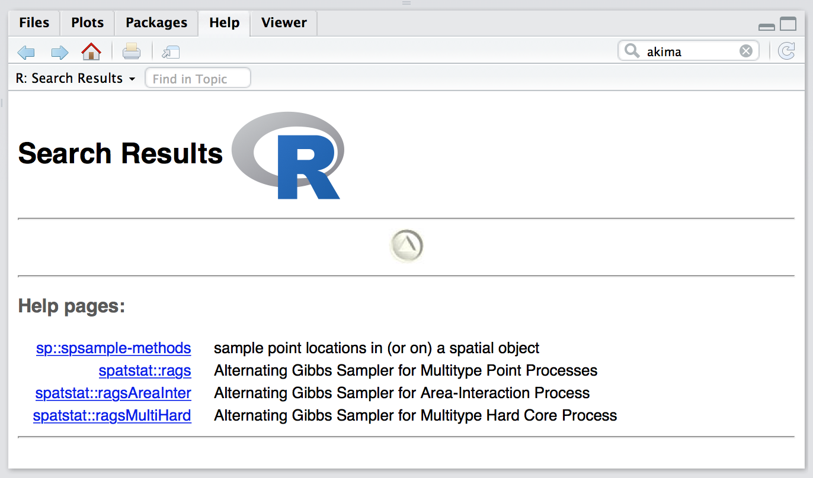
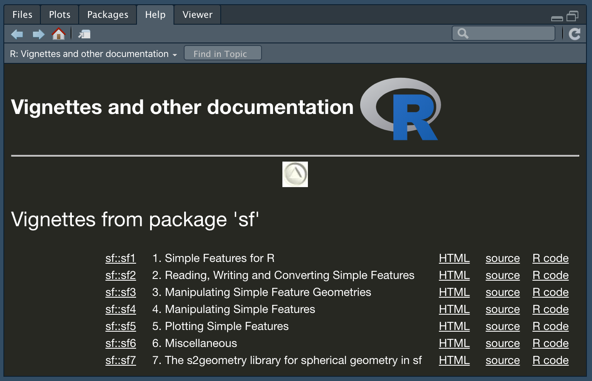

--- 
title: "Визуализация и анализ географических данных на языке R"
author: "Тимофей Самсонов"
date: "`r Sys.Date()`"
site: bookdown::bookdown_site
output: bookdown::gitbook
documentclass: book
bibliography: [articles.bib, packages.bib]
biblio-style: apalike
link-citations: yes
github-repo: tsamsonov/r-geo-course
description: "Курс лекций, посвященных использованию языка программирования R для визуализации и анализа географических данных"
header-includes:
   - \usepackage[T2A]{fontenc}
   - \usepackage[utf8]{inputenc}
   - \usepackage[russian]{babel}
mainfont: Open Sans
toc_float:
  collapse: section
  smooth_scroll: true
always_allow_html: yes
---
```{r setup, include=FALSE}
library(methods)
library(knitr)
library(DT)
knitr::opts_chunk$set(echo = TRUE)
knitr::opts_knit$set(global.par = TRUE)
knitr::knit_hooks$set(webgl = 'hook_webgl')
knitr::opts_knit$set(root.dir = "data/")
```

# Введение {-}

Добро пожаловать в курс *"Визуализация и анализ географических данных на языке R"*! В данном курсе мы освоим азы программирования на языке **R**, а затем научимся использовать его для решения географических задач. Никаких предварительных знаний и навыков программирования не требуется.

## Программное обеспечение {-}

Для успешного прохождения курса на вашем компьютере должно быть установлено следующее программное обеспечение:

* Язык [R](https://cran.r-project.org)
* Среда разработки [RStudio](https://www.rstudio.com/products/rstudio/download3/)

Выбирайте инсталлятор, соответствующий вашей операционной системе. Обратите внимание на то, что __RStudio__ не будет работать, пока вы не установите базовые библиотеки языка __R__. Поэтому обе вышеуказанные компоненты ПО обязательны для установки.

## Установка и подключение пакетов {-}

Существует [множество](https://cran.r-project.org/web/packages/) дополнительных пакетов __R__ практически на все случаи жизни (вы тоже можете написать свой). Как и дистрибутив __R__, они доступны через [CRAN (Comprehensive R Archive Network)](https://cran.r-project.org). Одним из таких пакетов является, например, пакет `readxl`, позволяющий читать и записывать файлы в форматах __Microsoft Excel__.

Существует два способа установки пакетов в __RStudio__. 

Во-первых, вы можете сделать это в графическом интерфесе, нажав кнопку _Install_ на панели _Packages_ (по умолчанию эта панель расположена в нижней правой четверти окна программы). В появившемся окне введите название пакета и нажмите _Install_:


Во-вторых, вы можете вызвать _из консоли_ команду `install.packages()`, передав ей в качестве параметра название пакета, заключенное в кавычки:
```{r, eval=FALSE, purl=FALSE}
install.packages("readxl")
```

> __Никогда не включайте команду `install.packages()` в тело скрипта.__ Это приведет к тому, что каждый раз при запуске программы среда __RStudio__ будет пытаться заново установить пакет, который уже установлен. Запускайте эту функцию _только из консоли_.

Подключение пакета осуществляется с помощью функции `library()`, при этом название пакета можно в кавычки не заключать:

```{r, collapse=TRUE}
library(readxl)
```

## Выполнение программного кода {-}

Существует несколько способов выполнения исходного кода:

* __Выполнить одну строку__: поставить курсор в любую строку и нажать над редактором кода кнопку _Run_ или сочетание клавиш `Ctrl`+`Enter` (`Cmd`+`Enter` для OS X).
* __Выполнить несколько строк__: выделить необходимые строки и нажать над редактором кода кнопку _Run_ или сочетание клавиш `Ctrl`+`Enter` (`Cmd`+`Enter` для OS X).
* __Выполнить весь код__ можно сразу тремя способами:
    - Выделить весь текст и нажать над редактором кода кнопку _Run_ или сочетание клавиш `Ctrl+Enter` (`Cmd`+`Enter` для OS X)
    - Нажать клавиатурное сочетание `Ctrl`+`Alt`+`Enter` (`Cmd`+`Alt`+`Enter` для OS X)
    - Нажать в правом верхнем углу редактора кода кнопку _Source_

> __Команды _Source_ и `Ctrl`+`Alt`+`Enter` могут не сработать__, если у вас не установлена рабочая директория, или если в пути к рабочей директории содержатся кириллические символы (не актуально для Windows 10+ и OS X, которые являются системами, основанными на кодировке Unicode).

Существует также ряд дополнительных опций выполнения кода, которые вы можете найти в меню _Code > Run Region_

> __Выполняя код построчно, делайте это последовательно, начиная с первой строки программы.__ Одна из самых распространенных ошибок новичков заключается в попытке выполнить некую строку, не выполнив _предыдущий код_. Нет никаких гарантий, что что-то получится, если открыть файл, поставить курсор в произвольную строку посередине программы и попытаться выполнить ее. Возможно, вам и повезет — если эта строка никак не зависит от предыдущего кода. Однако в реальных программах такие строки составляют лишь небольшую долю от общего объема. Как правило, в них происходит инициализация новых переменных стартовыми значениями.

## Установка рабочей директории {-}

Вы можете открывать и сохранять любые поддерживаемые файлы в __R__, указывая полный системный путь к файлу. Например, так может выглядеть открытие и сохранение таблицы в формате _CSV_ на компьютере _Mac_:

```{r, eval = F, collapse=TRUE}
d = read.csv("/Volumes/Data/GitHub/r-geo-course/data/oxr_vod.csv")
write.csv(d, "/Volumes/Data/GitHub/r-geo-course/data/oxr_vod_copy.csv")
```

Однако, если вам требуется открыть или сохранить несколько файлов (и не только данных, но и графиков, карт и т.п.), программа будет выглядеть громоздко. К тому же, прописывать каждый раз полный путь достаточно утомительно и неприятно (даже путем копирования и вставки), а главное — может привести к ошибкам.

Чтобы облегчить работу с файлами, в __R__ существует понятие домашней директории. Домашняя директория задается для текущей сессии __R__ с помощью функции `setwd()`. После установки домашней директории __R__ будет полагать, что все открываемые и сохраняемые файлы должны находиться в ней:

```{r, eval = F, collapse=TRUE}
setwd("/Volumes/Data/GitHub/r-geo-course/data")

read.csv("oxr_vod.csv")
write.csv(d, "oxr_vod_copy.csv")
```

Как видно, мы добавили дополнительную строчку кода, но сэкономили на длине двух других строк. При увеличении количества обращений к файлам польза домашней директории будет возрастать. При этом вы можете открывать и сохранять файлы в поддиректориях, наддиректориях и соседних директориях, используя синтаксис, стандартный для большинства операционных систем:

```{r, eval = F, collapse=TRUE}
# сохранить файл в поддиректорию data
write.csv(d, "data/oxr_vod_copy.csv")

# сохранить файл в наддиректорию по отношению к текущей директории
write.csv(d, "../oxr_vod_copy.csv")

# сохранить файл в директорию data, соседнюю по отношению к текущей директории
write.csv(d, "../data/oxr_vod_copy.csv")
```

> __Если вы перенесли код и данные с другого компьютера__ (возможно, вы получили их от своего коллеги или скачали с репозитория данного пособия), необходимо заменить путь, указанный в функции `setwd()` на путь к каталогу, в который вы положили данные.

> __Рабочая директория и местоположение скрипта могут не совпадать__. Вы можете хранить их в разных местах. Однако рекомендуется держать их вместе, что облегчит передачу вашей программы вместе с данными другим пользователям.

К сожалению, не существует надежного программного способа сказать среде выполнения __R__, что в качестве домашей директории следует использовать директорию в которой лежит сам скрипт (что, вообще говоря, было бы крайне удобно). Возможно, в будущем разработчики языка добавят такую полезную функцию. Однако, если для работы с __R__ вы пользуетесь средой __RStudio__, задача может быть решена путем использования проектов. Подробнее читайте [здесь](https://support.rstudio.com/hc/en-us/articles/200526207-Using-Projects).

## Диагностические функции {-}

В __R__ существует ряд диагностических функций, которые позволяют узнавать информацию об объектах, переменных, а также текущих параметрах среды, оказывающих влияние на результаты выполнения программы. Эти функции полезны, когда необходимо понять, какого типа, размера и содержания данные хранятся в той или иной переменной. Нижеприведенный список функций не являются исчерпывающим, но охватывает наиболее употребильные функции:

Функция | Назначение
--------|-----------
`class()` | Класс (тип данных или структура данных) объекта
`str()` | Компактное представление внутренней структуры объекта.
`names()` | Названия элементов объекта
`colnames()` | Названия колонок фрейма данных или матрицы
`rownames()` | Названия строк фрейма данных или матрицы
`mode()` | Режим хранения объекта.
`length()` | Размер (длина) объекта.
`dim()` | Измерение объекта.
`sessionInfo()` | Информация о текущей сессии R и подключенных пакетах.
`options()` | Получение и установка параметров среды.
`getwd()` | Текущая рабочая директория

## Получение справки {-}

Любая функция __R__ содержит документированное описание ее параметров и правил использования. Справку можно получить несколькими способами:

* Найти интересующую вас функцию вручную на вкладке **Packages**, выбрав нужный пакет
* Воспользоваться строкой поиска на вкладке **Help**
* Ввести знак вопроса и название функции в консоли (будет искать только среди подключенных в настоящий момент пакетов):
```{r, collapse=T}
library(readxl)

?read_xlsx # равносильно вызову функции help(read_xlsx)
```


* Ввести двойной знак вопроса и название функции в консоли (будет искать по всем установленным пакетам, независимо от того, подключены ли они в настоящий момент):
```{r}
??spsample
```



Во многих пакетах есть также подробная документация с примерами использования функций в виде руководств и так называемых _виньеток_ (_vignettes_), которые представляют из себя расширенные руководства (статьи) по использованию пакета. С документацией пакета можно ознакомиться, щелкнув на его названии на вкладке _Packages_ и перейдя по ссылке _User guides, package vignettes and other documentation_:



## Комментарии {-}

__Комментарии__ --- это фрагменты текста программы, начинающиеся с символа `#`. Комментарии не воспринимаются как исполняемый код и служат для документирования программы. При выполнении программы содержимое комментария в зависимости от настроек среды может выводиться или не выводиться в консоль, однако их содержание никак не влияет на результаты выполнения программы.

> __Всегда пишите комментарии__, чтобы по прошествии времени можно было открыть файл и быстро восстановить в памяти логику программы и смысл отдельных операций. Комментарии особенно необходимы, если вашей программой будет пользоваться кто-то другой --- без них будет трудно разобраться в программном коде.

Действие комментария продолжается от символа `#` до конца строки. Соответственно, вы можете поставить данный символ в самом начале строки и тогда комментарий будет занимать всю строку. Комментарий также можно расположить справа от исполняемого кода, и тогда он будет занимать только часть строки.

> __Прервать комментарий и написать справа от него исполняемый код нельзя__

Полнострочные комментарии часто используются для выделения разделов в программе и написания объемных пояснений. Часто в них вводят имитации разделительных линий с помощью символов дефиса (`-`) или подчеркивания (`_`), а заголовки набирают прописными буквами. Короткие комментарии справа от фрагментов кода обычно служат пояснением конкретных простых операций. Подобная логика употребления комментариев не является обязательной. Вы можете оформлять их на свое усмотрение. Главное, чтобы они выполняли свою основную функцию --- пояснять смысл выполняемых действий. Например:

```{r, collapse=TRUE}
# ОПЕРАЦИИ С ЧИСЛАМИ
# ---------------------------
# В данном разделе рассматриваются арифметические операции, такие как сложение, вычитание, деление, деление с остатком, взятие остатка и возведение в степень:

a = 3 + 2 # Сложение
b = 4 ^ 8 # Возведение в степень
c = b %% a # Взятие остатка

# Деление
d = c / a 

# Умножение
e = d * b
```

Однако, усердствовать с комментированием каждой мелочи в программе, разумеется, не стоит. Со временем у вас выработается взвешенный подход к документированию программ и понимание того, какие ее фрагменты требуют пояснения, а какие самоочевидны.

> __Для быстрой вставки комментария, обозначающего новый раздел программы__, воспользуйтесь командой меню _Code > Insert Section_ или клавиатурным сочетанием `Ctrl`+`Shift`+`R` (`Cmd`+`Shift`+`R` для OS X)

## Стандарт оформления кода на R {-}

Очень важно сразу же приучить себя грамотно, структурированно и красиво оформлять код на языке __R__. Это существенно облегчит чтение и понимание ваших программ не только вами, но и другими пользователями и разработчиками. Помимо вышеуказанных рекомендаций по написанию комментариев существует также определенное количество хорошо зарекомендовавших себя и широко используемых практик оформления кода. Эти практики есть в каждом языке программирования и их можно найти в литературе (и в Интернете) в виде негласных сводов правил (_style guides_)

Если вы не хотите быть белой вороной в мире __R__, вам будет полезно внимательно ознакомиться со [стандартом оформления кода на R от компании Google](https://google.github.io/styleguide/Rguide.xml#filenames), которая широко использует этот язык в своей работе.

> __Стандарт оформления кода иногда также называют _стилем программирования_.__ Мы не будем использовать этот термин, поскольку под стилем программирования традиционно понимают фундаментальный подход (_парадигму_) к построению программ: процедурный, функциональный, логический, объектно-ориентированный стиль и некоторые [другие](https://ru.wikipedia.org/wiki/Парадигма_программирования).

К числу негласных правил оформления кода на __R__ можно отнести следующие:

1. Последовательно используйте знак присвоения `<-` или `=` на протяжении всей программы. Если вы начали использовать `=` -- применяйте его на протяжении всей программы, не используя `<-`. 

> __Традиционный подход предполагает использование `<-`__, однако все больше программистов использует знак `=` в своих программах, что делает __R__ более похожим на другие языки программирования. Помните, что использование `=` официально не рекомендуется, поскольку существует много старого кода на R, который может ошибочно выполняться в сочетании с кодом, использующим `=`. Но вы, скорее всего, с такими проблемами не столкнетесь. Так что выбор за вами!

2. После запятой всегда ставьте пробел, перед запятой -- нет:
```{r, eval=F, collapse=T}
# Правильно:
a = c(1, 2, 3, 4)
m = matrix(a, 2, 2)

# Неправильно:
a = c(1,2,3,4)
a = c(1 ,2 ,3 ,4)
a = c(1 , 2 , 3 , 4)
m = matrix(a,2,2)
m = matrix(a ,2 ,2)
m = matrix(a , 2 , 2)
```

3. Отделяйте любые бинарные операторы (такие как `=, +, -, <-, *`) пробелами с двух сторон:
```{r, eval=F, collapse=F}
a = sin(b + pi * 0.5) # правильно
a=sin(b+pi*0.5) # неправильно
```

4. Между названием функции и открывающей скобкой пробела быть не должно. То же самое касается обращения к элементам вектора, матрицы и т.п.:
```{r, eval=F, collapse=F}
# Правильно:
sin(b)
a[2]

# Неправильно:
sin (b)
a [2]
```

5. В то же время, при вызове команд управления выполнением программы (условные операторы и циклы) перед и после скобок пробел __должен__ стоять:
```{r, eval=F, collapse=F}
# Правильно:
if (a > 0) {
  print(a)
}
i = 0
while (i < a) {
  print(i)
  i = i + 1
}

# Неправильно:
if(a > 0){
  print(a)
}

i = 0
while(i < a){
  print(i)
  i = i + 1
}
```

## Зарезервированные слова {-}

В __R__ существует небольшое количество зарезервированных слов, которые нельзя использовать в качестве имен переменных, функций и проч. Список этих слов можно получить, набрав в консоли `?Reserved`. К ним относятся:

Слово           | Назначение
----------------|-----------
`if`            | Условный оператор ЕСЛИ
`else`          | Условный оператор ИНАЧЕ
`repeat`        | Цикл без внешнего условия
`while`         | Цикл "пока верно условие, повторять"
`function`      | Функция
`for`           | Цикл "пройти по элементам последовательности"
`in`            | Оператор вхождения в множество
`next`          | Переход на новую итерацию цикла
`break`         | Принудительный выход из цикла или условного оператора
`TRUE`          | Логическое значение ИСТИНА
`FALSE`         | Логическое значение ЛОЖЬ
`NULL`          | Пустое значение
`Inf`           | Бесконечность
`NaN`           | Нечисловое значние
`NA`            | Отсутствующее значение
`NA_integer_`   | Отсутствующее целое число
`NA_real_`      | Отсутствующее число с плавающей точкой
`NA_complex_`   | Отсутствующее комплексное число
`NA_character_` | Отсутствующая строка

## Названия переменных {-}

В качестве названий переменных __нельзя использовать заразервированные слова__, а также не рекомендуется использовать названия общеупотребительных (диагностических) функций и констант. Также не следует давать переменным названия, совпадающие с широко распространенными функциями -- например, котороткими функциями из пакета `base`, такими как `t()`, `с()` и т.д., так как это может привести к путанице в программе и даже ошибкам выполнения кода. Каждый раз, создавая переменную, спрашивайте себя, не совпадает ли ее название с названием одной из используемых вами функций.

## Названия специальных символов {-}

В __R__, как и во многих других языках программирования испльзуются различные специальные символы. Их смысл и значение мы узнаем по ходу изучения языка, а пока что выучите их названия, чтобы грамотно употреблять в своей речи

| Символ | Название |
| - |--------------|
| `$`  | доллар |
| `#`  | шарп |
| `&`  | амперсанд (решетка) |
| `/`  | прямой слэш |
| `\`  | обратный слэш |
| `|` | пайп (вертикальная черта) |
| `^`  | циркумфлекс (крышечка) |
| `@`  | эт (собачка) |
| `~`  | тильда |
| `''` | одинарные кавычки |
| `""` | двойные кавычки |
| ` `` ` | обратные кавычки |

```{r include=FALSE}
# automatically create a bib database for R packages
knitr::write_bib(c(
  .packages(), 'bookdown', 'knitr', 'rmarkdown'
), 'packages.bib')
```

## Ссылка на пособие {-}

Если этот курс лекций оказался полезным для вас, и вы хотите процитировать его с списке литературы вашей работы, то ссылку можно оформить по следующей форме:

----
_Самсонов Т.Е._ **Визуализация и анализ географических данных на языке R.** М.: Географический факультет МГУ, 2017. DOI: 10.5281/zenodo.901911
----