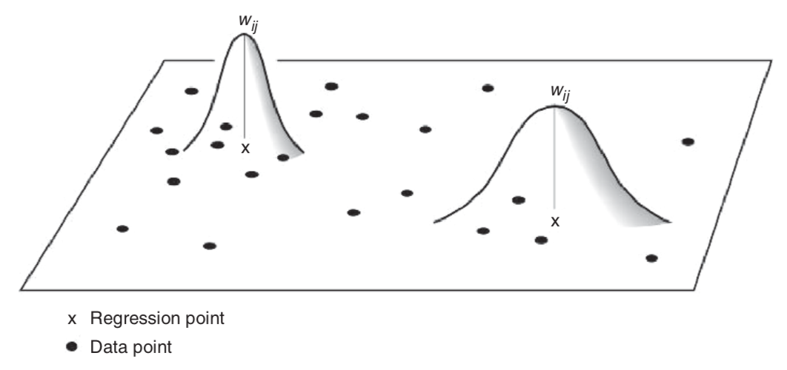

```{r setup, include=FALSE}
options(htmltools.dir.version = FALSE)
knitr::opts_chunk$set(warning = FALSE, message = FALSE, collapse = TRUE, echo = FALSE, fig.align="left")
library(tidyverse)
library(spdep)
library(spatialreg)
library(raster)
library(gstat)
library(stars)
library(tmap)
library(sf)
library(sp)
```

## Особенности случайных процессов в пространстве

- __Пространственная зависимость__ _(spatial dependence)_ — ... Устраняется посредством _..._.

- __Пространственная гетерогенность__ _(spatial heterogeneity)_ — .... Устраняется постредством _..._.

---

## Линейная регрессия

$$\mathbf{y} = \mathbf{X} \boldsymbol\beta + \boldsymbol\epsilon,$$

- $\boldsymbol\beta$ — ...;

- $\boldsymbol\epsilon$ — ...

---

## Многомерное нормальное распределение

$$\mathbf{X}\ \sim \mathcal{N}_k(\boldsymbol\mu,\, \boldsymbol\Sigma)$$

$$\boldsymbol\mu = \operatorname{E}[\mathbf{X}] = [ \operatorname{E}[X_1], \operatorname{E}[X_2], \ldots, \operatorname{E}[X_k]]^{\rm T}$$

$$\boldsymbol\Sigma = \operatorname{E} [(\mathbf{X} - \boldsymbol\mu)( \mathbf{X} - \boldsymbol \mu)^{\rm T}] =  [ \operatorname{Cov}[X_i, X_j]; 1 \le i,j \le k ]$$

---

## Стандартный нормальный случайный вектор

$\mathbf{X} = (X_1, ..., X_k)^T$:

$$X_n \sim \mathcal{N}(0, 1)$$ 

$$\boldsymbol\epsilon \sim \mathcal{N}_k(0, \sigma^2 \mathbf{I}),$$

где $I$ — ... размером $... \times ...$.

---

## Расширение класса регрессионных моделей

$$\boldsymbol\epsilon \sim \mathcal{N}_k(0, \sigma^2 \mathbf{I})$$
$$\boldsymbol\epsilon \sim \mathcal{N}_k(0, \mathbf{C}),$$

где $\mathbf{C}$ — ...

---

## Пример


---

## Пример


---

## Пример


---

## Пример


---

## Расширение класса регрессионных моделей

$$\boldsymbol\epsilon \sim \mathcal{N}_k(0, \mathbf{C})$$

---

## Пространственная регрессия

$$\mathbf{y} = \underbrace{\mathbf{X} \mathbf{\beta}}_{...} + \underbrace{\color{red}{\rho\mathbf{Wy}}}_{...} +  \underbrace{\mathbf{\epsilon}}_{...},$$

- $\rho$ — ...

- $\mathbf{W}$ — ...

> Полученная модель называется моделью __...__.

Компоненты модели (...) называются __...__.

---

## Пространственная регрессия

$$\mathbf{y} = \mathbf{X} \mathbf{\beta} + \rho\mathbf{Wy} +  \mathbf{\epsilon}\\
\mathbf{y} - \rho\mathbf{Wy} = \mathbf{X} \mathbf{\beta} + \mathbf{\epsilon}\\
(\mathbf{I} - \rho\mathbf{W})\mathbf{y} = \mathbf{X} \mathbf{\beta} + \mathbf{\epsilon}$$

$$\color{red}{\boxed{\color{blue}{\mathbf{y} = (\mathbf{I} - \rho\mathbf{W})^{-1}\mathbf{X}\mathbf{\beta} + (\mathbf{I} - \rho\mathbf{W})^{-1}\mathbf{\epsilon}}}}$$

---

## Пространственная регрессия

$$\mathbf{y} = (\mathbf{I} - \rho\mathbf{W})^{-1}\mathbf{X}\mathbf{\beta} + (\mathbf{I} - \rho\mathbf{W})^{-1}\mathbf{\epsilon}$$
$$\mathbf{C} = \sigma^2 \Big[\big(\mathbf{I} - \rho \mathbf{W}\big)^{-1}\Big]^T (\mathbf{I} - \rho\mathbf{W})^{-1}$$
---

## Пространственная регрессия

$$\mathbf{y} = \mathbf{X} \mathbf{\beta} + \rho\mathbf{Wy} +  \mathbf{\epsilon}$$

$\mathbf{\epsilon} = \mathbf{y} - \mathbf{X} \mathbf{\beta} - \rho\mathbf{Wy}$:

$$\sum_i \Bigg(y_i - \sum_j \beta_j x_{ij} - \rho \sum_j w_{ij} y_j \Bigg)^2$$
---

## Пространственная фильтрация

$$\mathbf{y} = \mathbf{X} \mathbf{\beta} + \rho\mathbf{Wy} + \mathbf{\epsilon}\\
\mathbf{y}^* = \mathbf{y} - \rho\mathbf{Wy} = \mathbf{X} \mathbf{\beta} + \mathbf{\epsilon}$$

---

## Пространственная фильтрация

$$\mathbf{y}^* = \mathbf{y} - \rho\mathbf{Wy} = \mathbf{X} \mathbf{\beta} + \mathbf{\epsilon}$$
---

## Оценка географического соседства

```{r, fig.width = 5}
options(scipen = 999)

reg_sf = st_read('../data/Kirov.gpkg', quiet = TRUE)
reg = st_geometry(reg_sf)

ggplot() +
  geom_sf(data = reg, color = "gray50") +
  theme_bw()
```


---

## Оценка географического соседства

В целом, можно выделить три большие группы методов:

* Соседи по ...

* Соседи по ...

* Соседи по ...

---

## Соседство по ...

```{r}
knitr::include_graphics('../images/QueenRook.png')
```

---

## Соседство по ...

```{r}
nb_queen = poly2nb(reg) # Соседство по правилу ферзя
coords = reg %>% 
  st_centroid() %>% 
  st_coordinates()
par(mar = c(1,1,1,1))
# Теперь рисуем граф:
plot(reg, border = "gray50")
plot(nb_queen, coords, pch = 19, cex = 0.5, add = TRUE)
```

---

## Соседство по ...

__Соседство по ...__ основано на отношениях объектов в [триангуляции Делоне](https://ru.wikipedia.org/wiki/Триангуляция_Делоне).

Частные случаи:

- ...

- ...

- ...

---

## Соседство по ...

```{r}
nb_tin = tri2nb(coords)
par(mar = c(1,1,1,1))
plot(reg, border = "grey70")
plot(nb_tin, coords, pch = 19, cex = 0.5, add = TRUE)
```

---

## Сфера ...

```{r, fig.cap=''}
knitr::include_graphics('../images/SphereOfInfluence.png')
```

$D \leq 2D_{min}$

---

## Соседство по ...

```{r}
nb_tin = soi.graph(nb_tin, coords) %>% graph2nb()
par(mar = c(1,1,1,1))
plot(reg, border = "grey70")
plot(nb_tin, coords, pch = 19, cex = 0.5, add = TRUE)
```

---

## Граф ...

```{r, fig.cap=''}
knitr::include_graphics('../images/Gabriel.png')
```

---

## Соседство по графу ...

```{r}
nb_gab = gabrielneigh(coords) %>% graph2nb()
par(mar = c(1,1,1,1))
plot(reg, border = "grey70")
plot(nb_gab, coords, pch = 19, cex = 0.5, add = TRUE)
```

---

## Граф ... соседства

Получается путем фильтрации ... по следующему правилу: 

> ребро $A$, соединяющее две вершины $p$ и $q$, будет удалено, если найдется третья вершина $r$, такая что расстояния ... 

---

## ... соседство

```{r}
nb_rel = relativeneigh(coords) %>% graph2nb()
par(mar = c(1,1,1,1))
plot(reg, border = "grey70")
plot(nb_rel, coords, pch = 19, cex = 0.5, add = TRUE)
```

---

## Соседи по ...

- по ... ( $k$ ближайших)

- по ... (не ближе чем $d_1$, но и не далее чем $d_2$).

---

## Соседи по ...

```{r}
par(mfrow = c(2,2),
    mar = c(1,1,1,1))
for (i in 1:4){
  nb_knn = knearneigh(coords, k = i) %>% knn2nb()
  
  plot(reg, border = "grey70")
  plot(nb_knn, coords, pch = 19, cex = 0.5, add = TRUE)
  title(main = paste("... соседи (k = ", i, ")", sep = ''))
}
```

---

## Соседи по ...

```{r}
par(mfrow = c(2,2),
    mar = c(1,1,1,1))
for (d in 5:8) {
  dnearnei = dnearneigh(coords, d1 = 0, d2 = 10000 * d)
  
  plot(reg, border = "grey70")
  plot(dnearnei, coords, pch = 19, cex = 0.5, add = TRUE)
  title(main = paste("... соседи (d <=", 10000 * d, ")", sep = ''))
}
```

---

## Пространственные веса

---

## ... матрица

```{r, fig.width=7}
Wbin = nb2listw(nb_queen, style = "B")
M = listw2mat(Wbin)
par(mar = c(1,1,1,1))
lattice::levelplot(M)
```

---

## ... матрица

```{r, fig.width=6}
W = spdep::nb2listw(nb_queen, style = "W")
M = listw2mat(W)

ramp = colorRampPalette(c("white","red"))
levels = 1 / 1:10  # шкала 1, 0.5, 0.33, 0.25 ... 0.1
par(mar = c(1,1,1,1))
lattice::levelplot(M, 
          at = levels, 
          col.regions=ramp(10))
```

---

## Пространственная автокорреляция

```{r, fig.width = 12, fig.height=8}
mun_src = reg_sf

# Чтение таблицы со статистикой
tab = readxl::read_xlsx("../data/Kirov.xlsx", 1)

# Соединение таблиц
mun = mun_src %>% 
  left_join(tab, by = c("OBJECTID" = "N")) %>% 
  pivot_longer(cols = 22:31,
               names_to = 'month',
               values_to = 'nsick') %>% 
  mutate(month = ordered(month, levels = c('Январь', 'Февраль', 'Март', 
                                           'Апрель', 'Май', 'Июнь', 
                                           'Июль', 'Август', 'Сентябрь', 
                                           'Октябрь', 'Ноябрь', 'Декабрь'))) %>% 
  st_set_geometry('geometry')

# Построение серии карт
ramp = colorRampPalette(c("white", "orange", "red"))
levels = seq(0, 10000, 1000)
nclasses = length(levels) - 1

ggplot() +
  geom_sf(mun, mapping = aes(geometry = geometry, 
                             fill = cut(nsick, levels))) +
  scale_fill_manual(values = ramp(nclasses),
                    labels = paste(levels[-nclasses-1], '-', levels[-1]),
                    guide = guide_legend(reverse = TRUE),
                    drop = FALSE) +
  facet_wrap(~month)
```

---

## Индекс ... (...'s I)

$$I = \frac{n \sum^n_{i=1} \sum^n_{j=i} w_{ij} (y_i - \bar y)(y_j - \bar y)}{ \Big[\sum^n_{i=1} \sum^n_{j=i} w_{ij}\Big] \Big[\sum^n_{i=1} (y_i - \bar y)^2\Big]}$$

где: 

- $n$ — ..., 
- $w_{ij}$ — ..., 
- $y_i$ — ..., 
- $\bar y$ — ...

---

## Коэффициент корреляции ...

$$r_{xy} = \frac{\sum_{i=1}^{n}(x_i - \bar x)(y_i - \bar y)}{\sqrt{\sum_{i=1}^{n}(x_i - \bar x)^2} \sqrt{\sum_{i=1}^{n}(y_i - \bar y)^2}}$$

---

## Индекс ... (...'s I)

Индекс Морана для нормально распределенных данных лежит в диапазоне от -1 до 1:

* +1 означает ... 
   
* 0 означает ...

* -1 означает ...
   
__Математическое ожидание__ индекса ... для случайных данных равно $E[I] = ...$

---

## Индекс .... (...'s I)

Индекс ... для данных за февраль:
```{r, echo = TRUE}
# Выбираем данные за февраль
feb = mun %>% 
  filter(month == 'Февраль')

# Вычисление индекса (тест) Морана
moran.test(feb$nsick, W)
```

---

## ... тест ...

```{r, fig.height = 6, fig.width=10}
sim = moran.mc(feb$nsick, listw = W, nsim = 10000)

# Построим гистограмму по вычисленным индексам:
hist(sim$res,
     freq = TRUE,
     breaks = 20, 
     xlim = c(-1,1),
     main = NULL, 
     xlab = "Случайный индекс ...",
     ylab = "Частота появления",
     col = "steelblue")

# Нанесем фактическое значение
abline(v = sim$statistic, col = "red")
```

---

## ... тест ...

```{r}
sim
```

---

## Диаграмма ... ...

```{r, fig.width=4, fig.height=4}
par(mar = c(1,1,1,1))
moran.plot(feb$nsick, W)
```

---

## Пространственная авторегрессия

```{r, echo = TRUE}
(model = lagsarlm(nsick ~ 1, data = feb, listw = W))
```

---

## Пространственная авторегрессия

```{r, fig.width=10, fig.height=5}
# Извлекаем результаты пространственной авторегрессии
feb_spreg = feb %>% 
  mutate(fitted = fitted(model),
         residual = residuals(model)) %>% 
  pivot_longer(cols = c(nsick, fitted, residual), 
               names_to = 'type',
               values_to = 'value') %>% 
  st_set_geometry('geometry')

# Построение серии карт
ramp = colorRampPalette(c('steelblue3', 'white', 'orange', 'violetred'))
levels = seq(-3000, 10000, 1000)
nclasses = length(levels) - 1

# Сравниваем исходные данные, модельные и остатки
ggplot() +
  geom_sf(feb_spreg, mapping = aes(geometry = geometry, fill = cut(value, levels))) +
  scale_fill_manual(values = ramp(nclasses),
                    labels = paste(levels[-nclasses-1], '-', levels[-1]),
                    guide = guide_legend(reverse = TRUE),
                    drop = FALSE) +
  facet_wrap(~type)
```

---

## Предсказание на основе пространственной регрессии

Различают три вида предсказания:

- __Внутривыборочное__ (in-sample) используется для ...

- __Прогнозное__ (prevision/forecast) используется для ...

- __Вневыборочное__ (out-of-sample) используется для ...

---

## Вневыборочное предсказание


_Goulard, M., Laurent, T., Thomas-Agnan, C._, 2017. __About predictions in spatial autoregressive models: optimal and almost optimal strategies__. Spatial Economic Analysis 12, 304–325. https://doi.org/10.1080/17421772.2017.1300679

---

## Внутривыборочное предсказание

$$\underbrace{\mathbf{y}}_{...} = \underbrace{\mathbf{X} \mathbf{\beta}}_{...} + \underbrace{\rho\mathbf{Wy}}_{...} + \underbrace{\mathbf{\epsilon}}_{...}$$

---

## Прогнозное предсказание

$$\mathbf{y} = \mathbf{X} \mathbf{\beta} + \rho\mathbf{Wy} + \mathbf{\epsilon}\\
(\mathbf{I} - \rho\mathbf{W})\mathbf{y} = \mathbf{X}\mathbf{\beta} + \mathbf{\epsilon}\\
\mathbf{y} = (\mathbf{I} - \rho\mathbf{W})^{-1}\mathbf{X}\mathbf{\beta} + (\mathbf{I} - \rho\mathbf{W})^{-1}\mathbf{\epsilon}$$

$\mathbf{\epsilon} = 0$, $\mathbf{y} = (\mathbf{I} - \rho\mathbf{W})^{-1}\mathbf{X}\mathbf{\beta}$

$$\rho\mathbf{Wy} = \rho\mathbf{W} (\mathbf{I} - \rho\mathbf{W})^{-1}\mathbf{X}\mathbf{\beta}$$
---

## Вневыборочное предсказание

$$\begin{bmatrix}\mathbf{Y_S}\\ \color{red}{\mathbf{Y_O}}\end{bmatrix} = \rho \begin{bmatrix}\mathbf{W_{SS}} & \mathbf{W_{SO}} \\ \mathbf{W_{OS}} & \mathbf{W_{OO}}\end{bmatrix} \begin{bmatrix}\mathbf{Y_S}\\\color{red}{\mathbf{Y_O}}\end{bmatrix} + \begin{bmatrix}\mathbf{X_S}\\\mathbf{X_O}\end{bmatrix} \mathbf{\beta} + \begin{bmatrix}\mathbf{\epsilon_S}\\\mathbf{\epsilon_O}\end{bmatrix}$$
---

## Предсказание на основе пространственной регрессии

$\mathbf{y} = (\mathbf{I} - \rho\mathbf{W})^{-1}\mathbf{X}\mathbf{\beta}$:

$$\begin{bmatrix}\mathbf{Y_S}\\ \mathbf{Y_O}\end{bmatrix} = (\mathbf{I} - \rho\mathbf{W})^{-1}\mathbf{X}\mathbf{\beta}=\\=\begin{bmatrix}\mathbf{I_{SS}} - \rho\mathbf{W_{SS}} & -\rho\mathbf{W_{SO}} \\ -\rho\mathbf{W_{OS}} & \mathbf{I_{OO}} - \rho\mathbf{W_{OO}}\end{bmatrix}^{-1} \begin{bmatrix}\mathbf{X_S}\\\mathbf{X_O}\end{bmatrix}\beta=\\=\begin{bmatrix}\mathbf{A} & \mathbf{B} \\ \mathbf{C} & \mathbf{D}\end{bmatrix}^{-1} \begin{bmatrix}\mathbf{X_S}\\\mathbf{X_O}\end{bmatrix}\beta$$
---

## Предсказание на основе пространственной регрессии

$$\begin{bmatrix}\mathbf{Y_S}\\ \mathbf{Y_O}\end{bmatrix} = \begin{bmatrix}\mathbf{A} & \mathbf{B} \\ \mathbf{C} & \mathbf{D}\end{bmatrix}^{-1} \begin{bmatrix}\mathbf{X_S}\\\mathbf{X_O}\end{bmatrix}\beta$$
$$\mathbf{Y_S} = (\mathbf{A} - \mathbf{BD}^{-1} \mathbf{C})^{-1} \mathbf{X_S} \mathbf{\beta} -(\mathbf{A} - \mathbf{BD}^{-1} \mathbf{C})^{-1} \mathbf{BD}^{-1} \mathbf{X_O} \mathbf{\beta}$$

$$\mathbf{Y_O} = (\mathbf{D} - \mathbf{CA}^{-1} \mathbf{B})^{-1} \mathbf{X_O} \mathbf{\beta} - (\mathbf{D} - \mathbf{CA}^{-1} \mathbf{B})^{-1} \mathbf{C} \mathbf{A}^{-1} \mathbf{X_S} \mathbf{\beta}$$


---

## Географически взвешенная регрессия

$$\mathbf{y} = \mathbf{X} \boldsymbol\beta + \boldsymbol\epsilon,$$
$$y_i = \beta_0 + \beta_1 x_{1i} + \beta_2 x_{2i} + ... + \beta_m x_{mi} + \epsilon_i$$
$$\mathbf{\beta}' = (\mathbf{X}^T\mathbf{X})^{-1} \mathbf{X}^T \mathbf{Y}$$

---

## Географически взвешенная регрессия

$$y_i = \beta_{0i} + \beta_{1i} x_{1i} + \beta_{2i} x_{2i} + ... + \beta_{mi} x_{mi} + \epsilon_i$$

$$\mathbf{\beta}'(i) = (\mathbf{X}^T \color{blue}{\mathbf{W}(i)}\mathbf{X})^{-1} \mathbf{X}^T \color{blue}{\mathbf{W}(i)} \mathbf{Y},$$

---

## Географически взвешенная регрессия

$$\mathbf{W}(i) = \begin{bmatrix}
    w_{i1} & 0 & 0 & \dots  & 0 \\
    0 & w_{i2} & 0 & \dots  & 0 \\
    0 & 0 & w_{i3} & \dots  & 0 \\
    \vdots & \vdots & \vdots & \ddots & \vdots \\
    0 & 0 & 0 & \dots  & w_{in}
\end{bmatrix},$$

---

## Весовые функции


---

## Весовые функции

$$w_{ij} = \operatorname{exp}\{-\frac{1}{2} (d_{ij}/h)^2\},$$


---

## Весовые функции



---

## Полоса пропускания

$$w_{ij} = \operatorname{exp}\{-\frac{1}{2} (d_{ij}/h)^2\},$$
---

## Практический анализ

```{r, eval = FALSE}
realest = read_delim(url('https://www.jefftk.com/apartment_prices/apts-1542637382.txt'),
                 delim = ' ',
                 col_names = c('price', 'rooms', 'id', 'lon', 'lat')) %>%
  st_as_sf(coords = c('lon', 'lat'), crs = 4326) %>%
  st_transform(3395)

tmap_mode('view')
tm_shape(realest) +
  tm_bubbles(col = 'price',
             size = 'rooms',
             style = 'fixed',
             breaks = c(0, 1000, 2000, 3000, 4000, 5000, 10000, max(realest$price)),
             scale = 0.25,
             palette = colorRampPalette(c('steelblue4', 'orange', 'darkred'))(7),
             alpha = 0.8) +
  tm_view(symbol.size.fixed = TRUE)
```

---

## Результаты моделирования

```{r, eval = FALSE}
samples = realest %>% dplyr::sample_n(1000) %>% as('Spatial')

gwr_res = GWmodel::gwr.basic(price ~ rooms, data = samples, bw = 1000, kernel = 'gaussian')

tm_shape(gwr_res$SDF) +
  tm_bubbles(col = 'rooms', # это не количество комнат, а коэффициент регрессии
             style = 'quantile',
             scale = 0.3,
             palette = 'Reds',
             alpha = 0.5) +
  tm_view(symbol.size.fixed = TRUE)
```