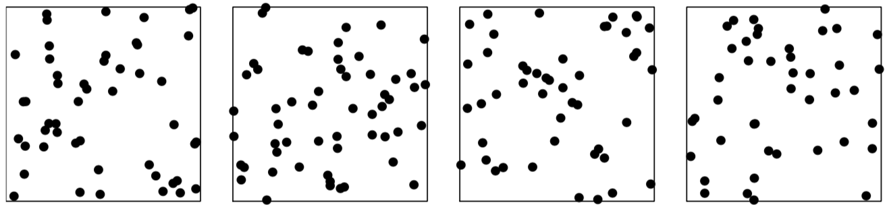

```{r setup, include=FALSE}
options(htmltools.dir.version = FALSE)
library(tidyverse)
library(raster)
library(spatstat)
library(stars)
library(tmap)
library(sf)
library(sp)
```

## Условные обозначения

$$||u-v|| = \big[(u_1 - v_1)^2 + (u_2 - v_2)^2\big]^{1/2}$$
$$b(u,r) = \{v: ||u-v|| \leq r\}$$
$$b(u,r) = \{v: ||u-v|| = r\}$$
---

## Точечный паттерн

$$\mathbf{x} = \{x_1, x_2,...x_n\}$$

---

## Подмножество точек

.pull-left[
  
]

.pull-right[
  ..., равняется  $n = n(\mathbf{x} \cap B)$
]

---

## Точечный процесс

> __ Точечным процессом__ называется случайный процесс, реализациями которого являются ...

__Конечный точечный процесс__ _(finite point process)_ — это точечный процесс, каждая реализация которого представляет собой ....

__Локально конечный точечный процесс__ имеет ....

---

## Равномерно случайные точки

$U = (U_1, U_2)$, $u = (u_1, u_2)$. 

$$f(u_1, u_2) = \begin{cases}
  1/|W|,~\text{если}~(u_1, u_2) \in W\\
  0, ~\text{в противном случае}
\end{cases}$$

---

## Равномерно случайные точки

$$\mathbb{P}\{U \in B \} = \int_B f(u_1, u_2) du_1 du_2 = \\ = \frac{1}{|W|} \int_B 1 du_1 du_2 = \frac{|B|}{|W|}$$
---

## Биномиальный точечный процесс

__Биномиальным__ называется точечный процесс $\mathbf{X} = \{X_1,..., X_n\}$, реализации которого содержат ... точек.


Чтобы точки были распределены равномерно по пространству, необходимо выполнение двух условий:

- $X_1,...,X_n$ представляют собой ... случайные величины
- Каждая из этих величин ... распределена в пределах $W$.

---

## Биномиальный точечный процесс

$$\mathbb{P}\{n(\mathbf{X} \cap B) = k\} = 
  \left(
    \begin{array}{c}
      n \\
      k
    \end{array}
  \right) p^k (1-p)^{n-k}\color{grey}{, k = 0, 1, ..., n}$$

$$\left(
    \begin{array}{c}
      n \\
      k
    \end{array}
  \right) = \frac{n!}{(n-k)!~k!}$$
  
---

## Пуассоновский процесс

__Однородный пуассоновский точечный процесс__ (homogeneous Poisson point process), или ... (... — CSR) характеризуется следующими свойствами:

- ...
- ...



---

## Пуассоновский процесс

__Однородность__ _(гомогенность)_ означает, что ....:

$$\operatorname E[n(\mathbf{X} \cap B)] = \lambda |B|$$
Параметр $\lambda$ представляет собой среднее количество точек на единицу площади ... — __... точечного процесса__.

> В отличие от биномиального процесса, полностью случайный (Пуассоновский) процесс характеризуется _... количеством точек_.

---

## Пуассоновский процесс

__Пространственная независимость__ означает, что ...:

$$n(\mathbf{X} \cap A) \not\sim n(\mathbf{X} \cap B),~A \cap B = \emptyset$$

---

## Пуассоновский процесс

Одним из следствий независимости является тот факт, что количество точек, подсчитанное по _регулярной сетке квадратов_, также даст совокупность ...:


---

## Пуассоновский процесс

__Упорядоченность__ _(orderliness)_: ...


---

## Пуассоновский процесс

$$\mathbb{P}\{N = k\} = e^{-\mu} \frac{\mu^k}{k!}\color{grey}{,~k = 0, 1, 2, ...}$$

---

## Пуассоновский процесс

$$\mathbb{P}\{N = k\} = e^{-\mu} \frac{\mu^k}{k!} \color{grey}{,~k = 0, 1, 2, ...}$$

Величина $\mu$ представляет собой .... 

> Дисперсия распределения Пуассона равна ...

$$\mu = \lambda |B|$$
---

## Пуассоновский процесс

Пуассоновский процесс определеяется следующими параметрами:

- __...__: количество $n(\mathbf{B} \cap B)$ случайных точек, попадающих в выборочную область $B$ характеризуется мат. ожиданием $\mathbb{E}n(\mathbf{X} \cap B) = \lambda |B|$; 

- __...__: для неперекрывающихся выборочных областей $B_1, B_2, ..., B_k$, количества $n(\mathbf{X} \cap B_1), ..., n(\mathbf{X} \cap B_k)$ предствляют собой ...;

- __...__: число $n(\mathbf{B} \cap B)$ случайных точек, попадающих в выборочную область $B$ распределено по ....

---

## Свойства пуассоновского процесса

- __условность__ _(conditional)_: в любой области $B$ точки процесса ... распределены;

- __прореживаемость__ _(thinning)_: при случайном прореживании (отборе точек) пуассоновского точечного паттерна с интенсивностью $\lambda$ результирующий паттерн будет соответствовать Пуассоновскому процессу с интенсивностью ..., где $p$ — вероятность ...;

- __суперпозиция__ _(superposition)_: сумма двух независимых гомогенных случайных точечных процессов $Z = X \cup Y$ с интенсивностями $\lambda_X$ и $\lambda_Y$ является гомогенным ... процессом с интенсивностью ...

---

## Пуассоновский процесс

__Прореживаемость__


__Суперпозиция__


---

## Симуляция Пуассоновского процесса

Пусть дана область $B = [x_{min}, x_{max}] \times [y_{min}, y_{max}]$ и интенсивность точечного процесса $\lambda$.

1. ...

2. ...

3. ...

> Вероятность получить 0 точек также существует и равна $\mathbb{P}\{N = 0\} = e^{-\mu} \frac{\mu^0}{0!} = ...$

---

## Неоднородный пуассоновский процесс

Определяется следующими параметрами:

- __функция ...__: количество $n(\mathbf{X} \cap B)$ случайных точек, попадающих в выборочную область $B$ характеризуется мат. ожиданием $\mathbb{E}n(\mathbf{X} \cap B) = \int_B \lambda(u) du = \mu$, где $\lambda(u)$ есть ...; 

- __...__: для неперекрывающихся выборочных областей $B_1, B_2, ..., B_k$, количества $n(\mathbf{X} \cap B_1), ..., n(\mathbf{X} \cap B_k)$ предствляют собой ...;

- __распределение ...__: число $n(\mathbf{B} \cap B)$ случайных точек, попадающих в выборочную область $B$ распределено по ...

---

## Неоднородный пуассоновский процесс

---

## Симуляция неоднородного пуассоновского процесса

Метод _Льюиса-Шедлера_ (Lewis-Shedler thinning):

1. ...

2. ...

Чтобы понять, будет ли точка исключена, генерируется случайное число 0 или 1, имющее распределени ... с вероятностью положительного исхода $p = p(u)$. Это можно сделать с помощью функции `rbinom(1, 1, p)`


---

## Симуляция неоднородного пуассоновского процесса

$$\lambda(x,y) = x + y^2$$

```{r, echo = FALSE, fig.width=10, fig.height=5, dpi=300}
lambda = function(x,y) { 500 * (y^2 + x) }

U = rpoispp(lambda, win=square(1))

par(mfrow = c(1,2))
plot(U, pch = 20)
plot(density(U))
```

---

## Процесс Кокса (Cox process)

Процесс Кокса определяется как ... процесс со случайной функцией интенсивности $\Lambda(u)$, которая называется _..._


---

## Процессы Кокса (Cox process)

- __Cмешанный Пуассоновский процесс__: ...

- __Логнормальный процесс Кокса__: ...

Для _гауссовского случайного поля_ в каждой точке $u_i$ случайная величина $G(u_i)$ имеет ... распределение, для пары точек $u$ и $v$ пара величин $\big(G(u), G(v)\big)$ имеет ... распределение. Аналогично и для произвольного числа точек.

---

## Процессы Кокса (Cox process)

Независимые реализации логнормального процесса Кокса:


---

## Кластерные процессы


---

## Кластерные процессы


---

### Кластерные процессы

- (CLP1) __пуассоновские родители__: ...

- (CLP2) __независимые кластеры__: ...

- (CLP3) __идентично распределенные кластеры__: ...

- (CLP4) __независимые потомки__: ...

Процессы, отвечающие требованиям (CLP1)—(CLP4) носят название процессов _..._.

---

### Кластерные процессы

- (CLP5) __пуассоновское количество потомков__: ...

- (CLP6) __изотропные кластеры__: ...

— Процесс Матерна $(\kappa, \mu, r)$: ...

— Процесс Томаса $(\kappa, \mu, \sigma)$: ...

---

## Кластерные процессы

...


---

## Регулярные процессы

Точки не могут располагаться на расстоянии ближе чем $r$ — __расстояния ...__ (...).

- __Последовательные модели__: ...

- __Зависимое прореживание__: ...

---

## Регулярные процессы

__Последовательная модель__


---

## Регулярные процессы

__Процесс ... I__


---

## Регулярные процессы

__Процесс ... II__


