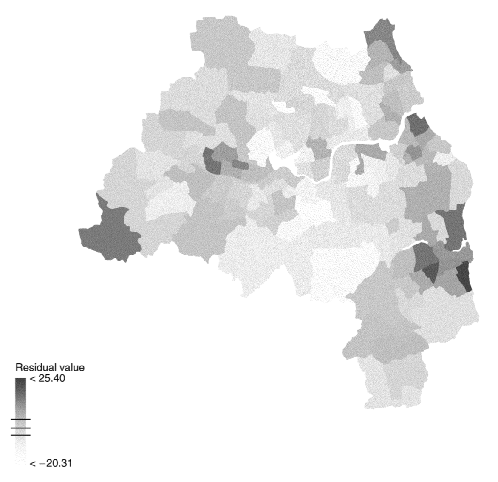
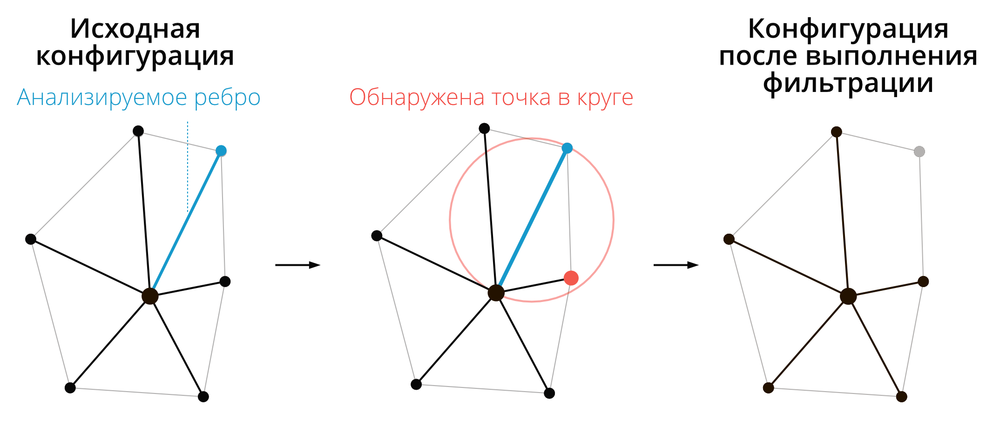

```{r setup, include=FALSE}
options(htmltools.dir.version = FALSE)
knitr::opts_chunk$set(warning = FALSE, message = FALSE, collapse = TRUE, echo = FALSE, fig.align="left")
library(tidyverse)
library(spdep)
library(spatialreg)
library(raster)
library(gstat)
library(stars)
library(tmap)
library(sf)
library(sp)
```

## Особенности случайных процессов в пространстве

- __Пространственная зависимость__ _(spatial dependence)_ — наличие автокорреляции наблюдений. Выражается в невыполнении условия независимости остатков линейной регрессии. Устраняется посредством _пространственной регрессии (spatial regression)_.

- __Пространственная гетерогенность__ _(spatial heterogeneity)_ — нестационарность процессов, порождающих наблюдаемую переменную. Выражается в неэффективности постоянных коэффициентов линейной регрессии. Устраняется постредством _географически взвешенной регрессии (geographically weighted regression)_.

---

## Линейная регрессия

Пусть дан вектор $\mathbf{y} = \{y_1, y_2, ... y_n\}$ измерений зависимой переменной, а также матрица $\mathbf{X} = \{x_{ij}\}$ размером $n \times m$, состоящая из значений $m$ независимых переменных для $n$ измерений. В этом случае модель линейной регрессии может быть записана как

$$\mathbf{y} = \mathbf{X} \boldsymbol\beta + \boldsymbol\epsilon,$$

где:

- $\boldsymbol\beta$ — вектор коэффициентов регрессии;

- $\boldsymbol\epsilon$ — вектор случайных ошибок, независимо распределенных относительно среднего значения в нуле.

---

## Многомерное нормальное распределение

Многомерное нормальное распределение (МНР) $k$-мерного случайного вектора $\mathbf{X} = (X_1, ..., X_k)^T$ обозначается как:

$$\mathbf{X}\ \sim \mathcal{N}_k(\boldsymbol\mu,\, \boldsymbol\Sigma)$$

МНР определяется двумя параметрами:

- __математическое ожидание__ ( $k$-мерный вектор):

$$\boldsymbol\mu = \operatorname{E}[\mathbf{X}] = [ \operatorname{E}[X_1], \operatorname{E}[X_2], \ldots, \operatorname{E}[X_k]]^{\rm T}$$

- __ковариационная матрица__ (размером $k \times k$):

$$\boldsymbol\Sigma = \operatorname{E} [(\mathbf{X} - \boldsymbol\mu)( \mathbf{X} - \boldsymbol \mu)^{\rm T}] =  [ \operatorname{Cov}[X_i, X_j]; 1 \le i,j \le k ]$$

---

## Стандартный нормальный случайный вектор

Вещественнозначный случайный вектор $\mathbf{X} = (X_1, ..., X_k)^T$ называется __стандартным нормальным случайным вектором__, если все его компоненты $X_n$ независимы друг от друга и подчиняются стандартному случаю нормального закона распределения с нулевым математическим ожиданием и единичной дисперсией для всех $n$:

$$X_n \sim \mathcal{N}(0, 1)$$

В модели линейной регрессии:

$$\boldsymbol\epsilon \sim \mathcal{N}_k(0, \sigma^2 \mathbf{I}),$$

где $I$ — единичная матрица размером $k \times k$.

---

## Расширение класса регрессионных моделей

$$\boldsymbol\epsilon \sim \mathcal{N}_k(0, \sigma^2 \mathbf{I})$$

Однако если данные получены измерениями по пространству, остатки регрессии могут демонстрировать пространственную ассоциацию (зависимость), как правило свидетельствующую о наличии дополнительных неучтённых факторов. Это означает, что обычная модель регрессии недостаточно хорошо объясняет зависимость.

Чтобы моделировать зависимость остатков, необходим более широкий класс моделей:

$$\boldsymbol\epsilon \sim \mathcal{N}_k(0, \mathbf{C}),$$

где $\mathbf{C}$ — любая допустимая ковариационная матрица.

---

<!-- ## Пример -->

<!-- Процент домохозяйств, находящихся во владении -->

<!--  -->

<!-- --- -->

<!-- ## Пример -->

<!-- Уровень безработицы -->

<!--  -->

<!-- --- -->

<!-- ## Пример -->

<!-- Обычная линейная регрессия -->

<!--  -->

<!-- --- -->

<!-- ## Пример -->

<!-- Остатки регрессии -->

<!--  -->

## Пример

Данные по преступности в городе Колумбус, штата Огайо, США
```{r, include = FALSE}
options(scipen = 999)
reg_sf = st_read(system.file("shapes/columbus.shp", package="spData")[1])
reg = st_geometry(reg_sf)
```
```{r, fig.width = 10, dpi = 150, echo=FALSE}
ramp = colorRampPalette(c('white', 'orange', 'violetred'))
levels = seq(0, 70, 10)
nclasses = length(levels) - 1

ggplot() +
  geom_sf(reg_sf, mapping = aes(geometry = geometry, 
                             fill = cut(CRIME, levels))) +
  scale_fill_manual(values = ramp(nclasses),
                    labels = paste(levels[-nclasses-1], '-', levels[-1]),
                    guide = guide_legend(reverse = TRUE),
                    drop = FALSE)
```

---

## Обычная регрессия

Построим модель, связывающую уровень преступности с уровнем дохода и стоимостью жилья:
```{r}
model = lm(CRIME ~ INC + HOVAL, data = reg_sf)
summary(model)
```

---

## Остатки регрессии

Проанализируем остатки графически:
```{r}
reg_temp = reg_sf %>% 
  mutate(res = residuals(model))

plot(reg_temp['res'])
```

---

## Расширение класса регрессионных моделей

$$\boldsymbol\epsilon \sim \mathcal{N}_k(0, \mathbf{C})$$

Данная модель решает проблему независимости остатков, однако порождает две других проблемы:

- Если зависимость остатков имеет пространственный характер (ассоциированы остатки в территориально близких локациях), то матрица $\mathbf{C}$ характер этой зависимости не отражает в явном виде.

- Вектор коэффициентов регрессии $\boldsymbol\beta$ может быть получен путем минимизации $\mathbf{y} - \mathbf{X}\boldsymbol\beta$ путем решения $\beta = \big(\mathbf{X}^T \mathbf{CX} \big)^{-1} \mathbf{X}^T \mathbf{X y}$. Однако это требует знания ковариационной матрицы, которая обычно неизвестна. Поэтому как $\mathbf{C}$, так и $\boldsymbol\beta$ калибруются по выборке.

---

## Пространственная регрессия

Для того чтобы учесть пространственную автокорреляцию остатков, в модель линейной регрессии добавляется компонента __пространственной авторегрессии__ _(spatial autoregression)_, которая моделирует _пространстенный лаг_:

$$\mathbf{y} = \underbrace{\mathbf{X} \mathbf{\beta}}_{тренд} + \underbrace{\color{red}{\rho\mathbf{Wy}}}_{сигнал} +  \underbrace{\mathbf{\epsilon}}_{шум},$$

- $\rho$ — коэффициент регрессии, отражающий степень пространственной автокорреляции

- $\mathbf{W}$ — матрица пространственных весов

> Полученная модель называется моделью __пространственной регрессии__ (_spatial regression_).

Компоненты модели (тренд, сигнал и шум) называются __предикторами__.

---

## Пространственная регрессия

Для получения коэффициентов $\boldsymbol\beta$ и $\rho$ выполним ряд преобразований:

$$\mathbf{y} = \mathbf{X} \mathbf{\beta} + \rho\mathbf{Wy} +  \mathbf{\epsilon}\\
\mathbf{y} - \rho\mathbf{Wy} = \mathbf{X} \mathbf{\beta} + \mathbf{\epsilon}\\
(\mathbf{I} - \rho\mathbf{W})\mathbf{y} = \mathbf{X} \mathbf{\beta} + \mathbf{\epsilon}$$

Предполагая, что матрица $(\mathbf{I} - \rho\mathbf{W})$ инвертируема, получаем систему уравнений пространственной регрессии:

$$\color{red}{\boxed{\color{blue}{\mathbf{y} = (\mathbf{I} - \rho\mathbf{W})^{-1}\mathbf{X}\mathbf{\beta} + (\mathbf{I} - \rho\mathbf{W})^{-1}\mathbf{\epsilon}}}}$$

Данная модель идентична обычной регрессии $\mathbf{y} = \mathbf{X} \mathbf{\beta} + \mathbf{\epsilon}$, но в ней независимые переменные и ошибки линейно трансформированы умножением на $(\mathbf{I} - \rho\mathbf{W})^{-1}$.

---

## Пространственная регрессия

$$\mathbf{y} = (\mathbf{I} - \rho\mathbf{W})^{-1}\mathbf{X}\mathbf{\beta} + (\mathbf{I} - \rho\mathbf{W})^{-1}\mathbf{\epsilon}$$

Трансформированная ошибка модели будет иметь ковариационную матрицу

$$\mathbf{C} = \sigma^2 \Big[\big(\mathbf{I} - \rho \mathbf{W}\big)^{-1}\Big]^T (\mathbf{I} - \rho\mathbf{W})^{-1}$$

- Если ковариационная матрица функционально зависит от параметра $\rho$, то она отражает пространственную структуру автокорреляции ошибок.

- Ковариационная матрица должна быть положительно определенной. Для полученного выражения это будет выполняться в случае если $|\rho| \leq 1$ (Griffith, 1988).

---

## Пространственная регрессия

$$\mathbf{y} = \mathbf{X} \mathbf{\beta} + \rho\mathbf{Wy} +  \mathbf{\epsilon}$$

Для нахождения коэффициентов $\boldsymbol\beta$ и $\rho$ используется минимизация квадрата случайной компоненты, которую можно представить как $\mathbf{\epsilon} = \mathbf{y} - \mathbf{X} \mathbf{\beta} - \rho\mathbf{Wy}$:

$$\sum_i \Bigg(y_i - \sum_j \beta_j x_{ij} - \rho \sum_j w_{ij} y_j \Bigg)^2$$

Задача решается в 2 этапа:

- находится оптимальное значение $\rho$;
- находится оптимальное значение $\boldsymbol\beta$ путем подстановки в вышеуказанное выражение.

---

## Пространственная фильтрация

Модель пространственной регрессии может быть использована для осуществления __пространственной фильтрации__ — убирания автокорреляционной составляющей. Для этого необходимо авторегрессионную компоненту (пространственный лаг) перенести в левую часть уравнения:

$$\mathbf{y} = \mathbf{X} \mathbf{\beta} + \rho\mathbf{Wy} + \mathbf{\epsilon}\\
\mathbf{y}^* = \mathbf{y} - \rho\mathbf{Wy} = \mathbf{X} \mathbf{\beta} + \mathbf{\epsilon}$$

Данная модель представляет собой стандартную (непространственную) регрессию для независимой переменной $\mathbf{y}^*$, в которой пространственная корреляция убрана (подвергнута фильтрации).

---

## Пространственная фильтрация

$$\mathbf{y}^* = \mathbf{y} - \rho\mathbf{Wy} = \mathbf{X} \mathbf{\beta} + \mathbf{\epsilon}$$

- Пространственная фильтрация бывает полезна, когда наблюдается несоответствие масштаба наблюдений и масштаба процесса. 

- Например, статистика по показателю, контролируемому на региональном уровне, собирается по муниципалитетам. В этом случае фильтрация позволяет подобрать параметры $\mathbf{\beta}$, учитывающие наличие высокой пространственной автокорреляци.

---

## Оценка географического соседства

В целом, можно выделить три большие группы методов:

* Соседи по смежности

* Соседи по графу

* Соседи по метрике

---

## Соседство по смежности

```{r}
knitr::include_graphics('images/QueenRook.png')
```
__Соседство по смежности__ основано на топологических отношениях между объектами и применяется при анализе данных, приуроченных к площадным единицам.

---

## Соседство по смежности

```{r}
nb_queen = poly2nb(reg) # Соседство по правилу ферзя
coords = reg %>% 
  st_centroid() %>% 
  st_coordinates()
par(mar = c(1,1,1,1))
# Теперь рисуем граф:
plot(reg, border = "gray50")
plot(nb_queen, coords, pch = 19, cex = 0.5, add = TRUE)
```

---

## Соседство по графу

__Соседство по графу__ основано на отношениях объектов в [триангуляции Делоне](https://ru.wikipedia.org/wiki/Триангуляция_Делоне). В эту же категорию попадают всевозможные фильтрации триангуляции Делоне, которые удаляют из нее ребра, не удовлетворяющие заданным критериям. Более подбробно о них будет сказано ниже.

Частные случаи:

- сфера влияния

- граф Гэбриела

- относительное соседство

---

## Соседство по триангуляции Делоне

```{r}
nb_tin = tri2nb(coords)
par(mar = c(1,1,1,1))
plot(reg, border = "grey70")
plot(nb_tin, coords, pch = 19, cex = 0.5, add = TRUE)
```

---

## Сфера влияния

```{r, fig.cap=''}
knitr::include_graphics('images/SphereOfInfluence.png')
```
Ребра триангуляции, инцидентные (примыкающие к) данной вершине, сохраняются только если $D \leq 2D_{min}$

---

## Соседство по сфере влияния

```{r}
nb_tin = soi.graph(nb_tin, coords) %>% graph2nb()
par(mar = c(1,1,1,1))
plot(reg, border = "grey70")
plot(nb_tin, coords, pch = 19, cex = 0.5, add = TRUE)
```

---

## Граф Гэбриела

```{r, fig.cap=''}

```

В каждом треугольнике ребро сохранятся только тогда, когда построенная на нем окружность не включает третью точку треугольника

---

## Соседство по графу Гэбриела

```{r}
nb_gab = gabrielneigh(coords) %>% graph2nb()
par(mar = c(1,1,1,1))
plot(reg, border = "grey70")
plot(nb_gab, coords, pch = 19, cex = 0.5, add = TRUE)
```

---

## Граф относительного соседства

Получается путем фильтрации триангуляции Делоне по следующему правилу: 

> ребро $A$, соединяющее две вершины $p$ и $q$, будет удалено, если найдется третья вершина $r$, такая что расстояния от нее до $p$ и $q$ ( $B$ и $C$ соответственно) окажутся короче, чем $A$, то есть: $A > B$ __and__ $A > C$. 

---

## Относительное соседство

```{r}
nb_rel = relativeneigh(coords) %>% graph2nb()
par(mar = c(1,1,1,1))
plot(reg, border = "grey70")
plot(nb_rel, coords, pch = 19, cex = 0.5, add = TRUE)
```

---

## Соседи по метрике

Поиск соседей по метрике — наиболее простой способ определения соседства. Для его использования необходимо задать метрику (как правило, расстояние между точками), а также критерий фильтрации связей: 

- по количеству ( $k$ ближайших)

- по расстоянию (не ближе чем $d_1$, но и не далее чем $d_2$).

---

## Соседи по количеству

```{r}
par(mfrow = c(2,2),
    mar = c(1,1,1,1))
for (i in 1:4){
  nb_knn = knearneigh(coords, k = i) %>% knn2nb()
  
  plot(reg, border = "grey70")
  plot(nb_knn, coords, pch = 19, cex = 0.5, add = TRUE)
  title(main = paste("Ближайшие соседи (k = ", i, ")", sep = ''))
}
```

---

## Соседи по расстоянию

```{r}
par(mfrow = c(2,2),
    mar = c(1,1,1,1))
for (d in 5:8) {
  dnearnei = dnearneigh(coords, d1 = 0, d2 = 0.1 * d)
  
  plot(reg, border = "grey70")
  plot(dnearnei, coords, pch = 19, cex = 0.5, add = TRUE)
  title(main = paste("Ближайшие соседи (d <=", 100 * d, ")", sep = ''))
}
```

---

## Пространственные веса

- Пространственные веса характеризуют силу связи между единицами. 

- Если единицы не являются соседними (по выбранному правилу), то пространственный вес их связи будет равен нулю. Во всех остальных случаях веса будут ненулевыми. 

- Поскольку теоретически каждая единица может быть связана с любой другой единицей, распространена форма представления весов в виде матрицы $W$ размером $N \times N$, где $N$ -- число единиц. 

- На пересечении $i$-й строки и $j$-го столбца матрицы располагается вес связи между $i$-й и $j$-й единицей.

---

## Бинарная матрица

Если связь есть, то ее вес равен единице (1), если нет — нулю (0)
```{r, fig.width=7}
Wbin = nb2listw(nb_queen, style = "B")
M = listw2mat(Wbin)
par(mar = c(1,1,1,1))
lattice::levelplot(M)
```

---

## Нормированная матрица

Вес $j$-й единицы по отношению к $i$-й равен $1/n_i$, где $n_i$ — количество соседей у $i$.
```{r, fig.width=6}
W = spdep::nb2listw(nb_queen, style = "W")
M = listw2mat(W)

ramp = colorRampPalette(c("white","red"))
levels = 1 / 1:10  # шкала 1, 0.5, 0.33, 0.25 ... 0.1
par(mar = c(1,1,1,1))
lattice::levelplot(M, 
          at = levels, 
          col.regions=ramp(10))
```

---

## Пространственная автокорреляция

```{r, fig.width = 12, fig.height=8}
# Построение серии карт
ramp = colorRampPalette(c("white", "orange", "red"))
levels = seq(0, 70, 10)
nclasses = length(levels) - 1

ggplot() +
  geom_sf(reg_sf, mapping = aes(geometry = geometry, 
                             fill = cut(CRIME, levels))) +
  scale_fill_manual(values = ramp(nclasses),
                    labels = paste(levels[-nclasses-1], '-', levels[-1]),
                    guide = guide_legend(reverse = TRUE),
                    drop = FALSE)
```

---

## Индекс Морана (Moran's I)

Анализ пространственной автокорреляции осуществляется, как правило, путем вычисления индекса Морана (Moran's I):

$$I = \frac{n \sum^n_{i=1} \sum^n_{j=i} w_{ij} (y_i - \bar y)(y_j - \bar y)}{ \Big[\sum^n_{i=1} \sum^n_{j=i} w_{ij}\Big] \Big[\sum^n_{i=1} (y_i - \bar y)^2\Big]}$$

где: 

- $n$ — количество единиц, 
- $w_{ij}$ — вес пространственной связи между $i$-й и $j$-й единицей, 
- $y_i$ — значение в $i$-й единице, 
- $\bar y$ — выборочное среднее по всем единицам

---

## Коэффициент корреляции Пирсона

Обратим внимание на то, что индекс Морана по сути и форме записи похож на линейный коэффициент корреляции Пирсона, в котором перебираются все пары соответствующих друг другу значений из рядов $X = \{x_i\}$ и $Y = \{y_i\}$: 

$$r_{xy} = \frac{\sum_{i=1}^{n}(x_i - \bar x)(y_i - \bar y)}{\sqrt{\sum_{i=1}^{n}(x_i - \bar x)^2} \sqrt{\sum_{i=1}^{n}(y_i - \bar y)^2}}$$

---

## Индекс Морана (Moran's I)

Индекс Морана для нормально распределенных данных лежит в диапазоне от -1 до 1:

* +1 означает детерминированную прямую зависимость — группировку схожих (низких
   или высоких) значений. 
   
* 0 означает абсолютно случайное распределение (_CSR — complete spatial randomness_)

* -1 означает детерминированную обратную зависимость — идеальное перемешивание
   низких и высоких значений, напоминающее шахматную доску
   
__Математическое ожидание__ индекса Морана для случайных данных равно $E[I] = -1/(n-1)$

---

## Индекс Морана (Moran's I)

Индекс Морана для остатков линейной регрессии:
```{r, echo = TRUE}
# Вычисление индекса (тест) Морана
moran.test(reg_temp$res, W)
```

---

## Перестановочный тест Морана

Значения перемешиваются между территориальными единицами и далее строится гистограмма распределения. Значимость индека Морана оценивается по отклонению
```{r, fig.height = 6, fig.width=10}
sim = moran.mc(reg_temp$res, listw = W, nsim = 10000)

# Построим гистограмму по вычисленным индексам:
hist(sim$res,
     freq = TRUE,
     breaks = 20, 
     xlim = c(-1,1),
     main = NULL, 
     xlab = "Случайный индекс Морана",
     ylab = "Частота появления",
     col = "steelblue")

# Нанесем фактическое значение
abline(v = sim$statistic, col = "red")
```

---

## Перестановочный тест Морана

Значения перемешиваются между территориальными единицами и далее строится гистограмма распределения. Значимость индека Морана оценивается по отклонению

```{r}
sim
```

---

## Диаграмма рассеяния Морана

```{r, fig.width=4, fig.height=4}
par(mar = c(1,1,1,1))
moran.plot(reg_temp$res, W)
```

По оси $X$ откладывается значение в каждой территориальной единице, в по оси $Y$ — ее пространственный лаг, который представляет собой средневзвешенное значение по всем ее соседям. _Тангенс угла наклона прямой равен значению индекса Морана_.

---

## Пространственная авторегрессия

Поиск уравнения пространственной регрессии и его авторегрессионной составляющей может быть выполнен посредством функций `spautolm()` и `lagsarlm()` из пакета __spatialreg__:

```{r, echo = TRUE}
(model = lagsarlm(CRIME ~ INC + HOVAL, data = reg_sf, listw = W))
```

---

## Пространственная авторегрессия

На основе полученной модели можно построить карты пространственной авторегрессии и остатков:

```{r, fig.width=10, fig.height=5, dpi = 150}
# Извлекаем результаты пространственной авторегрессии
crime_spreg = reg_sf %>% 
  mutate(fitted = fitted(model),
         residual = residuals(model)) %>% 
  pivot_longer(cols = c(CRIME, fitted, residual), 
               names_to = 'type',
               values_to = 'value') %>% 
  st_set_geometry('geometry')

# Построение серии карт
ramp = colorRampPalette(c('steelblue3', 'white', 'orange', 'violetred'))
levels = seq(-40, 70, 10)
nclasses = length(levels) - 1

# Сравниваем исходные данные, модельные и остатки
ggplot() +
  geom_sf(crime_spreg, mapping = aes(geometry = geometry, fill = cut(value, levels))) +
  scale_fill_manual(values = ramp(nclasses),
                    labels = paste(levels[-nclasses-1], '-', levels[-1]),
                    guide = guide_legend(reverse = TRUE),
                    drop = FALSE) +
  facet_wrap(~type)
```

---

## Пространственная авторегрессия

В заключение необходимо проверить корреляцию остатков:
```{r, echo = TRUE}
# Вычисление индекса (тест) Морана
moran.test(residuals(model), W)
```

---

## Предсказание на основе пространственной регрессии

Различают три вида предсказания:

- __Внутривыборочное__ (in-sample) используется для вычисления предикторов на основе данных, использованных для построения модели пространственной регрессии.

- __Прогнозное__ (prevision/forecast) используется для вычисления предикторов на основе новых данных по тем же выборочным единицам

- __Вневыборочное__ (out-of-sample) используется для вычисления предикторов с включением новых выборочных единиц

---

## Внутривыборочное предсказание

__Внутривыброчное__ (in-sample) предсказание не требует дополнительных действий, поскольку оно осуществляется непосредственно моделью пространственной регрессии:

$$\underbrace{\mathbf{y}}_{отклик} = \underbrace{\mathbf{X} \mathbf{\beta}}_{тренд} + \underbrace{\rho\mathbf{Wy}}_{сигнал} + \underbrace{\mathbf{\epsilon}}_{шум}$$

---

## Прогнозное предсказание

__Прогонозное__ (forecast) предсказание требует последовательного вычисления тренда, переменной отклика и сигнала. Для этого необходимо выполнить следующие преобразования:

$$\mathbf{y} = \mathbf{X} \mathbf{\beta} + \rho\mathbf{Wy} + \mathbf{\epsilon}\\
(\mathbf{I} - \rho\mathbf{W})\mathbf{y} = \mathbf{X}\mathbf{\beta} + \mathbf{\epsilon}\\
\mathbf{y} = (\mathbf{I} - \rho\mathbf{W})^{-1}\mathbf{X}\mathbf{\beta} + (\mathbf{I} - \rho\mathbf{W})^{-1}\mathbf{\epsilon}$$

Прогноз с использованием полученного выражения делается в предположении, что $\mathbf{\epsilon} = 0$. В этом случае, имея новые данные тренда $\mathbf{X}\mathbf{\beta}$, вычисляем сначала $\mathbf{y} = (\mathbf{I} - \rho\mathbf{W})^{-1}\mathbf{X}\mathbf{\beta}$ и далее находим сигнал их умножением:

$$\rho\mathbf{Wy} = \rho\mathbf{W} (\mathbf{I} - \rho\mathbf{W})^{-1}\mathbf{X}\mathbf{\beta}$$
---

## Прогнозное предсказание

Предположим, что стоимость домовладений в некоторых районах понизилась. Как это отразится на уровне преступности?

__Было:__

```{r, echo = FALSE, fig.width = 8, fig.height = 4, dpi = 300}
reg2 = reg_sf
reg2[25, 'HOVAL'] = 50
reg2[36, 'HOVAL'] = 70

newpred = predict(model, newdata = reg2, listw = W, pred.type = "TS") %>% 
  as_tibble()

pred = predict(model) %>% 
  as_tibble()

reg2 = reg2 %>% 
  mutate(newfit = newpred$fit,
         newtrend = newpred$trend,
         newsignal = newpred$signal)

reg_init = reg_sf %>% 
  mutate(fit = pred$fit,
         trend = pred$trend,
         signal = pred$signal)

ggplot() +
  geom_sf(crime_spreg, mapping = aes(geometry = geometry, fill = cut(value, levels))) +
  scale_fill_manual(values = ramp(nclasses),
                    labels = paste(levels[-nclasses-1], '-', levels[-1]),
                    guide = guide_legend(reverse = TRUE),
                    drop = FALSE) +
  facet_wrap(~type)
```

---

## Прогнозное предсказание

Предположим, что стоимость домовладений в некоторых районах понизилась. Как это отразится на уровне преступности?

__Стало:__

```{r, echo=FALSE, fig.width = 8, fig.height = 4, dpi = 300}
crime_upd = reg2 %>% 
  mutate(fitted = newpred$fit,
         residual = CRIME - newpred$trend - newpred$signal) %>% 
  pivot_longer(cols = c(CRIME, fitted, residual), 
               names_to = 'type',
               values_to = 'value') %>% 
  st_set_geometry('geometry')

ggplot() +
  geom_sf(crime_upd, mapping = aes(geometry = geometry, fill = cut(value, levels))) +
  scale_fill_manual(values = ramp(nclasses),
                    labels = paste(levels[-nclasses-1], '-', levels[-1]),
                    guide = guide_legend(reverse = TRUE),
                    drop = FALSE) +
  facet_wrap(~type)
```

---

## Вневыборочное предсказание


_Goulard, M., Laurent, T., Thomas-Agnan, C._, 2017. __About predictions in spatial autoregressive models: optimal and almost optimal strategies__. Spatial Economic Analysis 12, 304–325. https://doi.org/10.1080/17421772.2017.1300679

---

## Вневыборочное предсказание

__Вневыборочное__ (out-of-sample) предсказание связано с решением ситуации, когда есть данные по независимым переменным $\mathbf{X_S}$ и отклику $\mathbf{Y_S}$ по одним единицам и данные только по независимым переменным $\mathbf{X_O}$ для другой части единиц. Требуется найти отклик $\mathbf{Y_O}$ для этих единиц.

Для решения этой задачи необходимо стратифицировать вектора данных и матрицу весов:

$$\begin{bmatrix}\mathbf{Y_S}\\ \color{red}{\mathbf{Y_O}}\end{bmatrix} = \rho \begin{bmatrix}\mathbf{W_{SS}} & \mathbf{W_{SO}} \\ \mathbf{W_{OS}} & \mathbf{W_{OO}}\end{bmatrix} \begin{bmatrix}\mathbf{Y_S}\\\color{red}{\mathbf{Y_O}}\end{bmatrix} + \begin{bmatrix}\mathbf{X_S}\\\mathbf{X_O}\end{bmatrix} \mathbf{\beta} + \begin{bmatrix}\mathbf{\epsilon_S}\\\mathbf{\epsilon_O}\end{bmatrix}$$
Красным цветом выделены неизвестные данные.

---

## Предсказание на основе пространственной регрессии

Для вневыборочного предсказания используется ранее полученная модель прогнозирования $\mathbf{y} = (\mathbf{I} - \rho\mathbf{W})^{-1}\mathbf{X}\mathbf{\beta}$. Однако ее необходимо также представить в стратифицированном виде:

$$\begin{bmatrix}\mathbf{Y_S}\\ \mathbf{Y_O}\end{bmatrix} = (\mathbf{I} - \rho\mathbf{W})^{-1}\mathbf{X}\mathbf{\beta}=\\=\begin{bmatrix}\mathbf{I_{SS}} - \rho\mathbf{W_{SS}} & -\rho\mathbf{W_{SO}} \\ -\rho\mathbf{W_{OS}} & \mathbf{I_{OO}} - \rho\mathbf{W_{OO}}\end{bmatrix}^{-1} \begin{bmatrix}\mathbf{X_S}\\\mathbf{X_O}\end{bmatrix}\beta=\\=\begin{bmatrix}\mathbf{A} & \mathbf{B} \\ \mathbf{C} & \mathbf{D}\end{bmatrix}^{-1} \begin{bmatrix}\mathbf{X_S}\\\mathbf{X_O}\end{bmatrix}\beta$$
---

## Предсказание на основе пространственной регрессии

$$\begin{bmatrix}\mathbf{Y_S}\\ \mathbf{Y_O}\end{bmatrix} = \begin{bmatrix}\mathbf{A} & \mathbf{B} \\ \mathbf{C} & \mathbf{D}\end{bmatrix}^{-1} \begin{bmatrix}\mathbf{X_S}\\\mathbf{X_O}\end{bmatrix}\beta$$
Раскрыв данное выражение, можно получить предсказания для выборочных и вневыборочных единиц:

$$\mathbf{Y_S} = (\mathbf{A} - \mathbf{BD}^{-1} \mathbf{C})^{-1} \mathbf{X_S} \mathbf{\beta} -(\mathbf{A} - \mathbf{BD}^{-1} \mathbf{C})^{-1} \mathbf{BD}^{-1} \mathbf{X_O} \mathbf{\beta}$$

$$\mathbf{Y_O} = (\mathbf{D} - \mathbf{CA}^{-1} \mathbf{B})^{-1} \mathbf{X_O} \mathbf{\beta} - (\mathbf{D} - \mathbf{CA}^{-1} \mathbf{B})^{-1} \mathbf{C} \mathbf{A}^{-1} \mathbf{X_S} \mathbf{\beta}$$